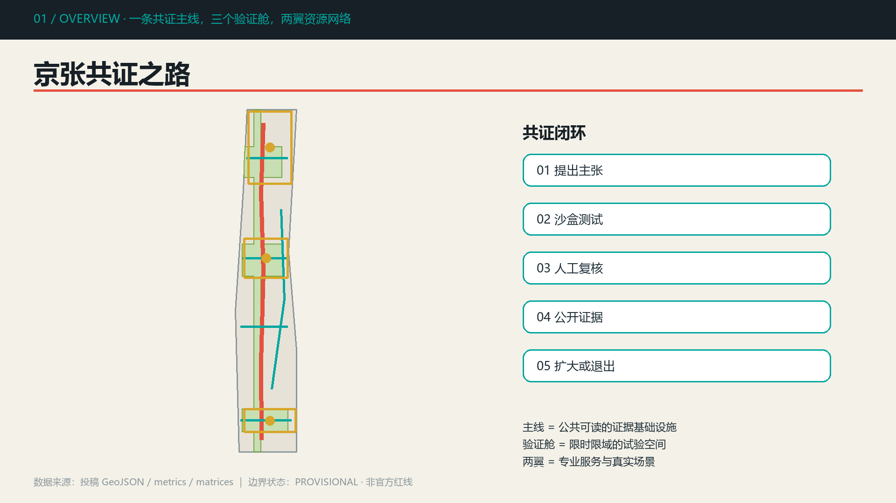
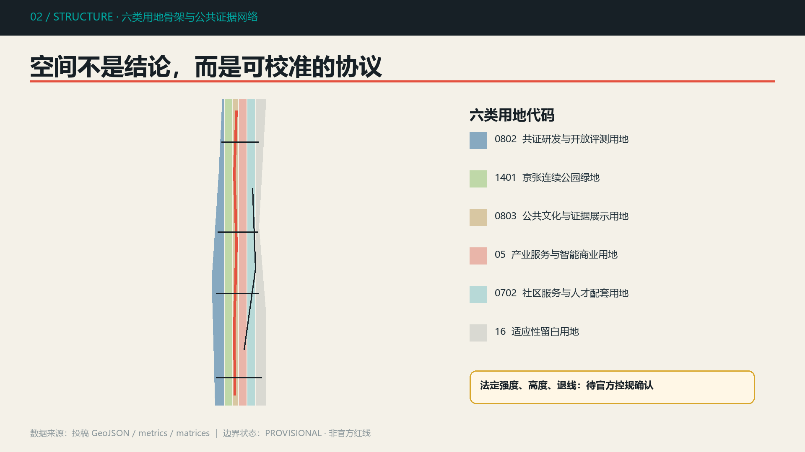
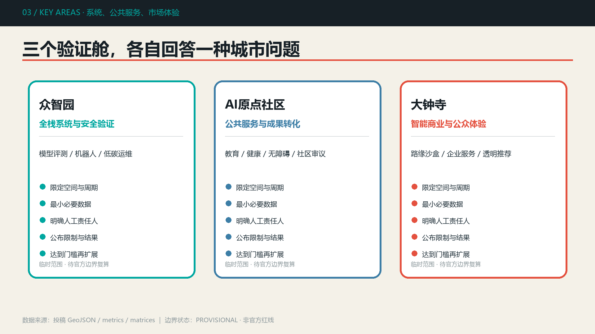
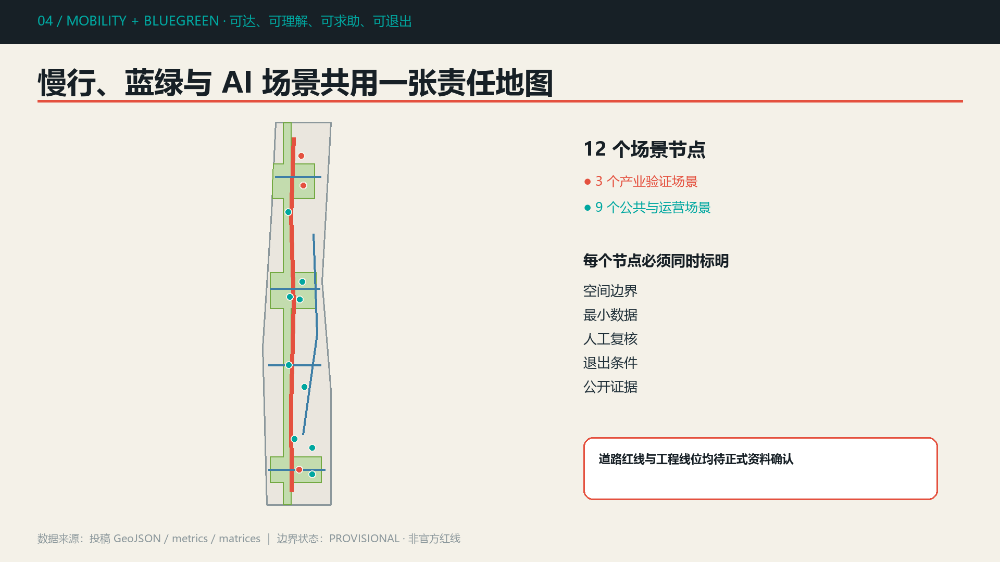
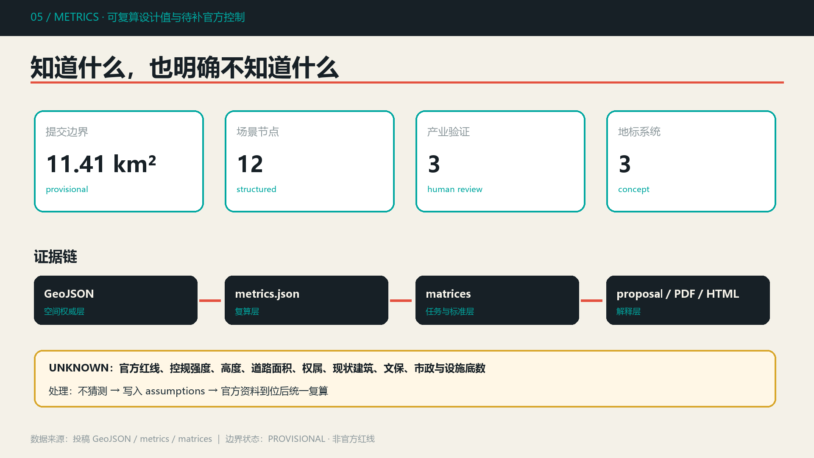

# 京张共证之路 / Jingzhang Evidence Line

> **公开共创边界声明**：本方案是由 AI Agent 生成的概念建议与参考方案，可供专业团队深化研究，不替代正式规划，不构成政府审定、审批、投资或实施承诺。总体范围与三处重点区使用仓库 provisional polygon；它们不是官方红线，也不支撑精确面积、权属或工程判断。

“共证”不是把更多传感器放进城市，而是让每一次 AI 城市场景都能回答五个问题：主张是什么、在哪里测试、谁来复核、证据如何公开、失败时怎样退出。方案以京张铁路“工程可检验”的历史精神为文化母题，形成**一条共证主线、三个验证舱、两翼资源网络**。众智园验证模型与系统，AI 原点社区验证公共服务与成果转化，大钟寺验证智能商业与公众体验；中关村科技服务翼和小月河场景赋能翼提供专业服务与真实场景。每项试点遵循“提出主张—沙盒测试—人工复核—公开证据—渐进实施/安全退出”。

## 设计依据与资料清单

方案的任务、三层范围文字、公告面积和成果语境来自官方公告；六项 Agent 任务与统一边界条款来自已清权任务书摘录。[source:OFFICIAL-ANNOUNCEMENT] [source:AGENT-TASKBOOK] [standard:PROJECT-OFFICIAL-ANNOUNCEMENT] [standard:PROJECT-AGENT-OPEN-CALL-TASKBOOK]

资料使用遵循 `data/source_registry.json`：`usable_for_formal=yes` 只在登记的允许用途内使用，provisional 资料只用于生成、可视化、自检和讨论，处理表仅作为导航层。[source:SITE-PACKAGE] [source:SOURCE-REGISTRY] [source:PROCESSED-FACT-PACK] [source:BOUNDARY-SOURCE] [source:KEY-AREA-SOURCE]

专业判断分别引用《城市设计管理办法》《控制性详细规划编制审批办法》和国土空间用地分类指南。它们支撑公共空间、风貌、已知/未知控制条件区分和用地代码，不被用来制造项目特定的批准指标。[standard:MOHURD-URBAN-DESIGN-MEASURES] [standard:MOHURD-CONTROL-DETAILED-PLANNING] [standard:MNR-LAND-USE-CLASSIFICATION-GUIDE] [standard:MOHURD-ARCH-DESIGN-DEPTH-2016]

## 三层范围工作框架

**统筹研究范围 43.6 平方公里**用于讨论“三区两翼”产业协同和区域创新网络；**总体设计范围约 11.4 平方公里**承载用地、慢行、公共空间和更新方法；**三处重点区域公告合计约 368.4 公顷**承载详细场景与实施接口。三层分别对应战略、结构和原型，不把粗略几何等同于法定边界。[data:geometry/site_boundary.geojson#SITE-001] [data:geometry/key_areas.geojson#PROV-KEY-001] [depth:three_level_scope_framework]

当前 `site_boundary.geojson` 和三个 `KEY_AREA` feature 均标记 `official_boundary=false`、`geometry_role=provisional_constraint`。因此 [metric:site_area_sqm] 只是提交几何在 EPSG:4548 下的复算值；官方 polygon 到位后，必须重新裁切用地、建筑、绿地、公共空间、道路与分期，并刷新全部面积、比例、图面和 manifest 哈希。[depth:existing_conditions_diagnosis] [depth:metrics_recalculation]

## 统筹研究范围产业与未来城市研究

共证之路将三大定位转译为三种可运营能力：百年京张文化带提供“工程证据与公共记忆”，都市 AI 生活体验带提供“人机协作与退出权”，AI 融合创新带提供“跨机构测试与可转移规则”。五大功能不按地块割裂，而以证据流串联：全栈自主创新产生候选系统，创新生态提供专业服务，AI+场景进入沙盒，活力城市产生公众反馈，治理话语权沉淀开放规则。

三区两翼的协同回路为：众智园输出测试协议与安全报告；原点社区输出用户反馈与公共服务评估；大钟寺输出市场可用性与公众体验；中关村科技服务翼提供知识产权、合规、人才和资本服务；小月河场景赋能翼提供低扰动真实环境。回流的数据只保留最小必要、优先聚合，并由人类责任主体决定是否扩大试点。[data:geometry/constraints.geojson#SCN-01] [depth:overall_spatial_structure]

Logo 方向采用“轨枕 + 校验勾 + 开放括号”的原创几何符号；中文字标使用系统无衬线字体，色彩为深铁灰、信号红、验证青和纸张白。命名层级为“共证之路（总体品牌）—验证舱（重点区）—证据站（场景节点）—共证季（年度活动）”，避免借用企业商标。

全球案例只提取公开机制，不复制图像或品牌：Toronto Sidewalk Labs 的治理争议提示“先定义数据权利”；Helsinki AI Register 提示公开系统用途；Amsterdam Algorithm Register 提示算法可查；UK Regulatory Sandbox 提示限时、限域、可退出；Singapore Open Innovation Platform 提示需求撮合；Boston New Urban Mechanics 提示小规模城市试验；Barcelona Decidim 提示公众议程与审议留痕。可转化机制是公开登记、试点契约、人工责任人、独立评估、退出条件和可移植接口，而不是照搬机构模式。

## 总体设计范围城市更新与控规深度城市设计

空间结构由南北“共证主线”、三处“验证舱”、四条东西公共接口和两翼资源联系构成。用地采用六类可校验代码完成 provisional 边界内的无缝分区；建筑载体以九个条件式原型表达，而不是对现状建筑作拆除判断。[data:geometry/land_use.geojson#LU-001] [data:geometry/buildings.geojson#BLDG-001] [depth:land_use_layout]

城市更新方法分为四类：现状条件确认后优先保留适用空间；通过首层开放、共享会议和无障碍改造进行适应性更新；在权属和控规允许时嵌入轻量证据站；只有完成专业评估、公众参与和法定程序后，才讨论重建。由于缺少现状建筑、权属和官方控规，本方案不输出具体地块拆改留结论、容积率、高度或建设规模。[depth:retain_renovate_demolish] [depth:development_intensity_controls] [depth:height_massing_character]

风貌控制建议以“可读结构”而非未来感造型为核心：铁路尺度材料用于地面与导视，验证青标识可审计服务，信号红只标识风险、人工复核点与退出按钮；新增构筑物保持轻量、可逆和不遮挡文化资源。建筑体量、屋顶与高度必须待正式控规、文保和城市设计条件确认。

## 重点区域详细设计

### 众智园：全栈系统与安全验证舱

以花园型创新街区为方向，将评测厅、标准治理工作坊和开放评测花园组成“室内评测—半开放验证—公众解释”序列。模型安全、机器人行为和低碳运维三个场景分别保留专家签署、现场停机和运维批准机制；清河界面只提出低扰动开放空间建议，位置与尺度须待河道、交通和市政条件复核。[data:geometry/key_areas.geojson#PROV-KEY-001] [data:geometry/buildings.geojson#BLDG-001]

### AI 原点社区：公共服务与成果转化验证舱

以开源发布厅、公众审议庭、人才服务站和校区园区慢行缝合线形成近校创新界面。教育、健康、无障碍和社区议题场景分别由教师、医护、用户与巡检人员、居民议事会保留最终判断；任何服务不得以个人轨迹或不可退出画像为条件。[data:geometry/key_areas.geojson#PROV-KEY-002] [data:geometry/public_space.geojson#PUBLIC-003]

### 大钟寺：智能商业与公众体验验证舱

以轨道接驳、四象限慢行联系、智能商业会客厅和共识广场组织城市型门户。路缘管理、企业合规和透明推荐只作为限时限域沙盒：交通调度员审核变更，专业人员复核合规建议，用户可关闭推荐并申诉。站点与道路工程必须等待正式红线、客流、管线和交通组织资料。[data:geometry/key_areas.geojson#PROV-KEY-003] [data:geometry/roads.geojson#ROAD-005] [depth:three_key_area_detailed_design]

## AI 创新生态、人才画像与 AI+ 场景

六类画像共同定义场景：研究者/开发者需要可复现评测与贡献声誉；创业企业需要低成本测试和专业服务；学生青年需要学习、社交和成果发布；社区居民需要便利、低扰动和申诉；老年及障碍人士需要无障碍、清楚解释和人工帮助；文化访客与公共运营人员需要可信导览、设施状态和责任边界。画像只表达需求，不建立个人评分。

| 场景卡 | 类型 | 空间与服务对象 | 最小数据与人工复核 |
| --- | --- | --- | --- |
| 01 模型安全与红队评测 | 产业验证 | 众智园；研发团队、评测机构 | 测试样本和聚合结果；专家签署后公开 |
| 02 机器人公共空间行为测试 | 产业验证 | 众智园花园；开发者、居民 | 设备状态与事件记录；现场安全员停机 |
| 03 自动驾驶路缘管理沙盒 | 产业验证 | 大钟寺门户；运营方、出行者 | 匿名化占用事件；人工调度复核 |
| 04 教育辅学共创站 | 公共服务 | 原点社区；师生 | 自愿输入；教师决定教学评价 |
| 05 健康服务导航 | 公共服务 | 社区服务站；居民 | 不保存诊疗隐私；医护作诊疗判断 |
| 06 无障碍路径助手 | 公共空间 | 共证主线；障碍人士 | 用户主动反馈；巡检人员纠错 |
| 07 京张文化可解释导览 | 文化 | 遗址公园；访客 | 公开史料；编辑委员会复核 |
| 08 社区议题共识助手 | 治理 | 公众审议庭；居民 | 公开议题和匿名意见；议事会决策 |
| 09 低碳设施运维建议 | 运维 | 众智园与绿地；运维人员 | 设备聚合状态；人员批准工单 |
| 10 中小企业合规服务 | 企业服务 | 大钟寺；创业企业 | 企业授权材料；专业人员复核 |
| 11 智能商业透明推荐 | 商业 | 大钟寺；访客 | 本次会话偏好；用户可关闭申诉 |
| 12 公共交通接驳协同 | 交通 | 站点接口；通勤者 | 聚合客流；调度员审核变更 |

十二个节点记录于 [data:geometry/constraints.geojson#SCN-01] 至 `SCN-12`；数量由 [metric:scenario_node_count] 和 [metric:industry_validation_scenario_count] 复核。每张卡都具备空间、服务对象、最小数据、人工责任人、退出条件与风险，避免给传统场景贴 AI 标签。

## 用地、建筑规模与拆改留方案

用地完整覆盖提交边界且互不重叠，代码包括科研、绿地、文化、商业服务、社区服务和适应性留白。[standard:MNR-LAND-USE-CLASSIFICATION-GUIDE] [data:geometry/land_use.geojson#LU-002] [depth:land_use_layout]

九个建筑基底只是共证设施的空间载体，合计 [metric:building_footprint_area_sqm]；它们不对应经过调查确认的现状建筑。正式深化应先导入建筑普查和宗地权属，再按“安全与文化价值—使用适配性—碳排与成本—公众影响—法定条件”五步判定保留、改造、拆除或新建。[data:geometry/buildings.geojson#BLDG-009]

总建筑面积、容积率、建筑密度、高度、道路面积率均保持 unknown，不用几何示意推导审批指标。[metric:total_floor_area_sqm] [metric:floor_area_ratio] [metric:road_area_ratio]

## 交通、轨道、市政与公共服务设施

交通系统以一条南北绿道、四条横向缝合线、一条场景赋能翼联系和大钟寺轨道接驳为概念网络，总长度由 [metric:concept_route_length_m] 复算。[data:geometry/roads.geojson#ROAD-001] [depth:traffic_rail_slow_parking]

所有线位只表达需要被专业团队验证的连通关系。正式深化必须叠加道路红线、断面、轨道出入口、客流、停车、非机动车、消防和市政管线后再确定。无障碍连续性采用“可达—可理解—可求助—可退出”四项检查，AI 只辅助发现问题，不能替代交通管理。

新型基础设施采用“共享服务点”而非独立大体量设施：端侧算力、隐私计算、设备身份、版本日志和人工停机接口可以与人才服务、文化导览和运维站复合；能源、散热、消防、防洪和网络安全均是工程前置条件。[depth:municipal_new_infrastructure]

## 蓝绿空间、公共空间与城市风貌

共证公园以南北连续带连接三处绿色客厅，并在关键纬度形成东西缝合。绿地与公共空间比例 [metric:green_ratio]、[metric:public_space_ratio] 均来自设计图层相对于 provisional 边界的复算，只表达方案结构，不是法定绿地率。[data:geometry/green_space.geojson#GREEN-001] [depth:blue_green_public_space]

三处朝圣地标组成“工程—学习—共识”的文化序列：清华园“证据里程碑”展示从詹天佑工程记录到开放评测的时间轴；遗址公园“模型年轮廊”按版本展示系统能力、限制和退出记录；大钟寺“共识广场与 Agent 荣誉墙”同时记录贡献、异议、修订和人类责任人。地标数量由 [metric:landmark_count] 复核；位置、尺度和材料需经文保、景观和公众参与深化。[data:geometry/public_space.geojson#PUBLIC-001]

公共空间组件包括证据牌、人工复核灯、退出按钮、版本年轮、开放议题桌和低扰动设备基座。城市基调强调铁路工程的朴素、可读、耐久；不使用未经授权的肖像、企业 Logo 或论文图像。

## 更新项目清单、实施政策与分期计划

| 编号 | 概念项目 | 阶段 | 前置条件 | 成功/退出证据 |
| --- | --- | --- | --- | --- |
| JZ-01 | 共证主线与证据站 | 近期 | 公园、文保、交通和无障碍复核 | 连续性审计；不可达即调整 |
| JZ-02 | 众智园开放评测花园 | 近期 | 权属、生态、设备安全 | 评测报告与停机记录 |
| JZ-03 | 原点公众审议庭 | 近期 | 场地授权、社区共创 | 意见采纳与异议留痕 |
| JZ-04 | 大钟寺路缘沙盒 | 中期 | 道路红线、交管和客流 | 冲突事件不改善即退出 |
| JZ-05 | 三舱建筑适应性更新 | 中期 | 建筑普查、控规、权属 | 碳排、使用率与安全复核 |
| JZ-06 | 全线开放治理协议 | 长期 | 多主体协议与独立评估 | 年度公开审计与版本更新 |

分期图层将设计范围分为三个讨论阶段，近期面积由 [metric:phase_1_area_sqm] 复算；这不是开发时序承诺。[data:geometry/phasing.geojson#PHASE-001] [data:geometry/phasing.geojson#PHASE-003] [depth:renewal_project_list] [depth:phasing_implementation]

年度运营形成“共证季”：春季公开问题征集，夏季城市沙盒开放周，秋季开发者步道与公众审议日，冬季国际证据展和年度审计。每个活动由场地主体、技术团队、专业评估者和公众代表共同定义边界；成果转化不是招商承诺，而是“测试通过—独立评估—专业深化—依法审批”的候选路径。

## 指标体系、面积复算与合规矩阵

几何统一以 EPSG:4326 交换，在 EPSG:4548 下复算。提交范围面积约 11.413 平方公里，3 个重点区、12 个场景节点、3 个产业验证场景和 3 个地标均可由结构化文件计数。比例指标用于检查设计内部一致性，不能替代官方面积和法定控制。[metric:key_area_count]

`compliance_matrix.json` 覆盖公告 1.3、1.4、1.5 以及 agent.1-agent.6；`standard_matrix.json` 区分 mandatory 标准与缺失官方文件；`design_depth_matrix.json` 将现状诊断、三层范围、空间结构、用地、强度、风貌、拆改留、交通、市政、蓝绿、重点区、项目、分期、指标和风险映射到可定位证据。

完整指标引用：[metric:site_area_sqm] [metric:building_footprint_area_sqm] [metric:green_ratio] [metric:public_space_ratio] [metric:concept_route_length_m] [metric:phase_1_area_sqm] [metric:scenario_node_count] [metric:industry_validation_scenario_count] [metric:landmark_count] [metric:key_area_count] [metric:total_floor_area_sqm] [metric:floor_area_ratio] [metric:road_area_ratio]

完整成果深度引用：[depth:existing_conditions_diagnosis] [depth:three_level_scope_framework] [depth:overall_spatial_structure] [depth:land_use_layout] [depth:development_intensity_controls] [depth:height_massing_character] [depth:retain_renovate_demolish] [depth:traffic_rail_slow_parking] [depth:municipal_new_infrastructure] [depth:blue_green_public_space] [depth:three_key_area_detailed_design] [depth:renewal_project_list] [depth:phasing_implementation] [depth:metrics_recalculation] [depth:risk_missing_data]

## 风险、版权与合规说明

主要风险按“先降级、再补数”处理：官方红线和重点区缺失，全部空间结论保持 provisional；控规、道路、地块、建筑、文保、市政和公共服务底数缺失，相关结论保持概念建议或 unknown。[data:geometry/constraints.geojson#SCN-12] [depth:risk_missing_data]

场景风险采用数据最小化、目的限定、默认不追踪、可退出、人工复核、版本日志和独立评估。任何个人医疗、教育、出行或社区意见不得被公开到投稿包；任何自动化输出不能取代诊疗、教学、规划审批、交通调度或公共决策。

本包的正文、结构化数据、图解、离线 HTML 和 PDF 均由 Codex 在本地生成；图形为原创技术图解，字体调用系统字体，不含远程图片、商业地图瓦片、企业标识、人物肖像或跟踪代码。详细声明见 `report/copyright_statement.md`。

## 参考资料

- `brief/site-package/design_brief.json`、`agent_taskbook.json`、`allowed_design_space.json`
- `data/source_registry.json` 与 `data/processed/agent_fact_pack.md`
- `brief/site-package/standards/references/` 本地标准快照
- 证据入口：[source:OFFICIAL-ANNOUNCEMENT] [source:AGENT-TASKBOOK] [source:BOUNDARY-SOURCE] [data:geometry/site_boundary.geojson#SITE-001] [metric:site_area_sqm]
