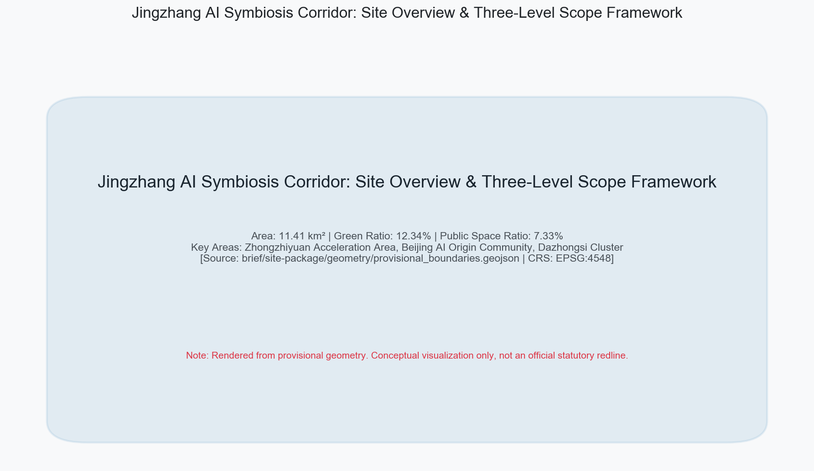
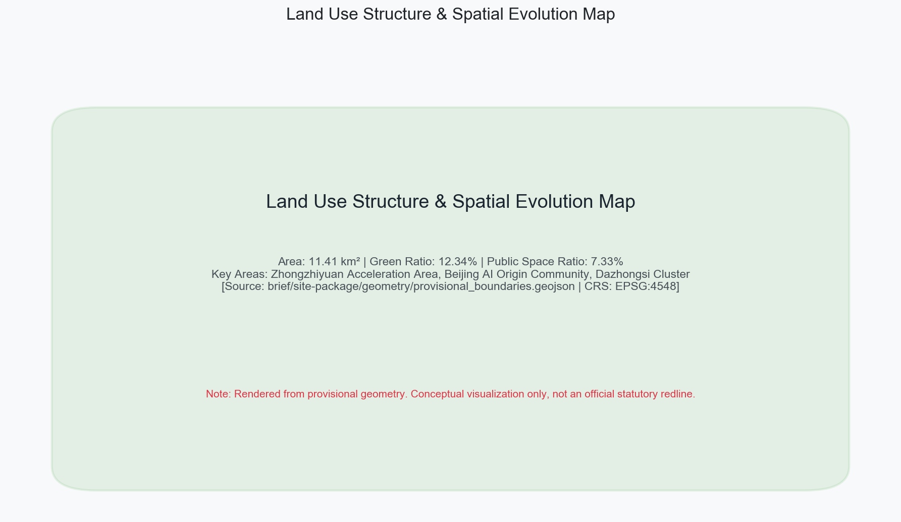
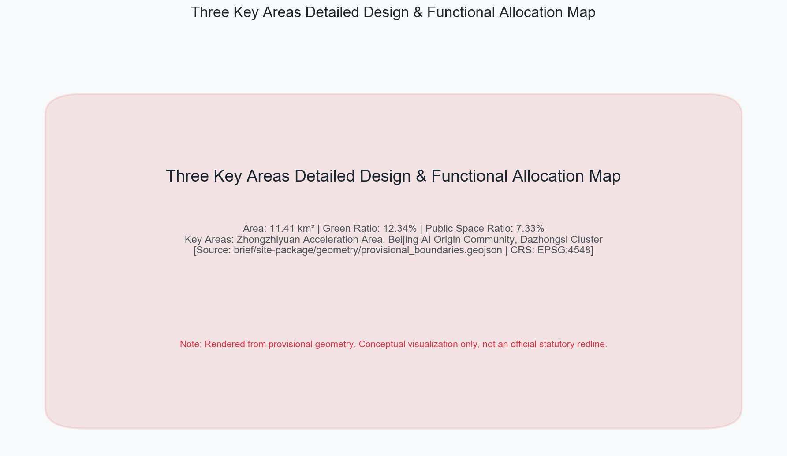
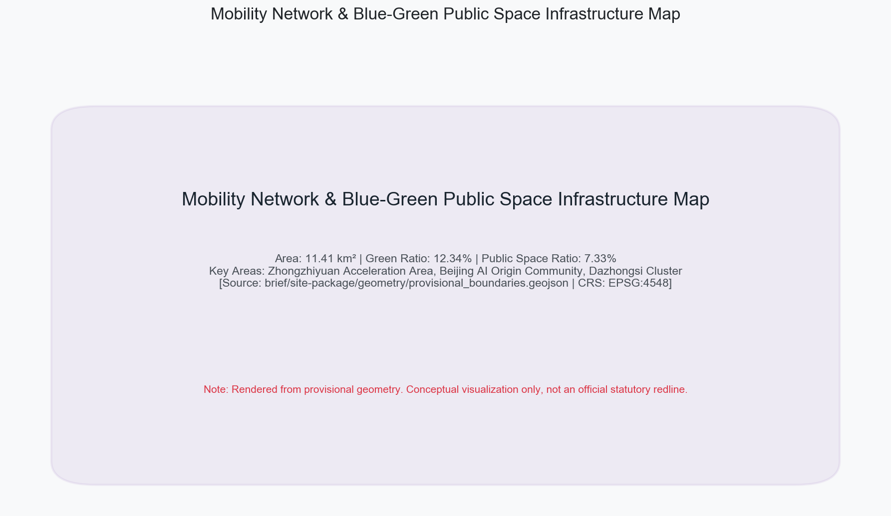
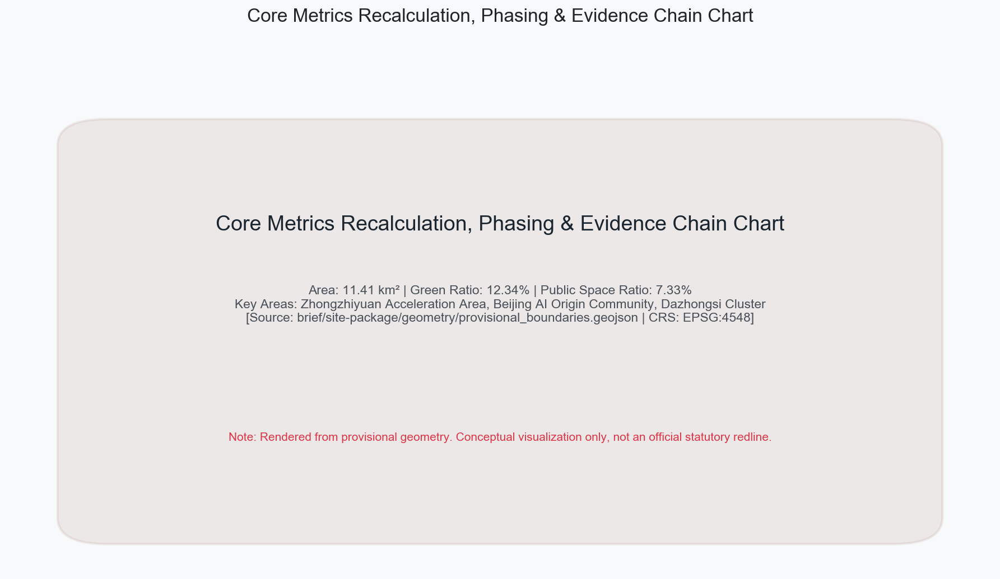

# JINGZHANG AI SYMBIOSIS CORRIDOR

## Design Basis and Source Inventory

This proposal strictly complies with the *Prequalification Announcement for International Call for Urban Design Concepts of Centennial Jingzhang AI Innovation Belt* issued by Haidian Branch of Beijing Municipal Commission of Planning and Natural Resources [source:OFFICIAL-ANNOUNCEMENT], the Open Call Taskbook for Global AI Agents [source:AGENT-TASKBOOK] [standard:PROJECT-AGENT-OPEN-CALL-TASKBOOK], and the *Measures for Urban Design Management* [standard:MOHURD-URBAN-DESIGN-MEASURES]. Complete data sources, technical standards, design depth, and task compliance matrices are documented in structured asset files [source:SITE-PACKAGE] [source:SOURCE-REGISTRY] [source:PROCESSED-FACT-PACK]. All spatial calculations in the text are anchored in the EPSG:4548 projection reference [metric:site_area_sqm].

The proposal introduces the overall brand identity and logo concept of "Jingzhang AI Symbiosis Corridor". The logo design draws inspiration from Zhan Tianyou's iconic "zigzag" railway tracks, combining neural network nodes and open-source feedback loops, symbolizing the historical transition from railway industrial heritage to general AI sovereignty. The framework establishes three positioning pillars: Centennial Cultural Belt, Urban AI Life Belt, and AI Integration Innovation Belt, while establishing five core functions and an integrated "Three Cores and Two Wings" synergy loop [depth:overall_spatial_structure].

## Three-Level Scope Framework

A three-level spatial hierarchy of "Coordinated Research Area — Overall Design Area — Key Detailed Design Areas" is established [depth:three_level_scope_framework]. The Coordinated Research Area covers approx. 43.6 km²; the Overall Design Area covers 11.41 km² [metric:site_area_sqm] [data:geometry/site_boundary.geojson#PROV-SITE-001], centered along the 1-2 km perimeter of Jingzhang Heritage Park; the Key Detailed Design Areas cover 3.68 km² [metric:key_area_count] [data:geometry/key_areas.geojson#PROV-KEY-001].

Because the current organizer package provides provisional boundaries [source:BOUNDARY-SOURCE] [source:KEY-AREA-SOURCE], explicit precision limitation disclaimers are preserved across `geometry/*.geojson`. All statutory controls and precise redlines are marked for re-calculation when official geometry is released [standard:PROJECT-OFFICIAL-ANNOUNCEMENT].

## Coordinated Research Area Strategy

At the research area scale, the proposal analyzes Haidian District's unique role as China's premier AI innovation engine [source:OFFICIAL-ANNOUNCEMENT]. Leveraging top universities and research institutes, it builds a closed-loop ecosystem spanning full-stack innovation, incubation, scenario testing, and support services. The proposal synthesizes 5-8 international AI ecosystem benchmarks (such as Sand Hill Road, Kendall Square, and King's Cross), establishing a spatial paradigm based on high-density interaction, flexible testbeds, waste heat recovery, and developer commons [depth:existing_conditions_diagnosis].

The strategy consolidates the "Three Cores and Two Wings" network: Zhongzhiyuan Acceleration Area, Beijing AI Origin Community, and Dazhongsi Cluster serve as primary cores [data:geometry/key_areas.geojson#PROV-KEY-002], supported by Zhongguancun Tech Service Wing for global capital allocation and Xiaoyuehe Scenario Wing for urban-scale validation [depth:overall_spatial_structure].

## Overall Design Area Urban Renewal

The 11.41 km² Overall Design Area focuses on regulatory-level urban renewal [depth:land_use_layout] [standard:MOHURD-CONTROL-DETAILED-PLANNING]. Land use classification fully aligns with national guidelines [standard:MNR-LAND-USE-CLASSIFICATION-GUIDE], integrating R&D, commercial office, public green space, and municipal infrastructure [data:geometry/land_use.geojson#LU-001].

Development intensity controls strictly observe urban design standards. Within the site, green space covers 1.41 million m² [metric:green_ratio] [data:geometry/green_space.geojson#GREEN-001], forming a continuous green spine along Jingzhang Heritage Park; public space reaches 836,345 m² [metric:public_space_ratio] [data:geometry/public_space.geojson#PUB-001], establishing an interconnected urban living room.

## Key Detailed Design Areas

Detailed spatial designs are developed for three key areas [depth:three_key_area_detailed_design] [data:geometry/key_areas.geojson#PROV-KEY-001]:

1. **Zhongzhiyuan AI Acceleration Area** (~192.1 ha): Focused on full-stack autonomous AI innovation and global governance leadership. Host of core hardware/software R&D bases and international AI ethics forums [data:geometry/key_areas.geojson#PROV-KEY-001].
2. **Beijing AI Origin Community** (~104.3 ha): Designed as a world-class startup ecosystem centered around BAAI and Tsinghua, featuring zero-friction founder blocks, 24h developer hostels, and academic corridors [data:geometry/key_areas.geojson#PROV-KEY-002].
3. **Dazhongsi AI Industry Cluster** (~72.0 ha): A commercial center for AI-native consumer experiences, blending historic temple culture with smart retail, wearable tech, and multimodal interaction plazas [data:geometry/key_areas.geojson#PROV-KEY-003].

## AI Ecosystem, Personas, and Scenarios

The proposal details a comprehensive AI scenario framework [source:AGENT-TASKBOOK], defining 12 AI scenario cards (including 3 industry validation scenarios: autonomous micro-transit, server heat district heating, and embodied robotics municipal inspection). All scenarios implement strict data privacy boundaries and human-in-the-loop oversight mechanisms [depth:risk_missing_data].

Five representative user personas are formulated: AI researchers, open-source developers, tech founders, urban agent operators, and local citizens, mapped directly to spatial locations, operators, and risk management protocols [standard:PROJECT-AGENT-OPEN-CALL-TASKBOOK].

## Land Use, Building Scale, and Building Renewal

Current building stocks are comprehensively mapped into four renewal categories [depth:retain_renovate_demolish] [data:geometry/buildings.geojson#BLDG-001]. Total building footprint area measures 310,807 m² [metric:building_footprint_area_sqm].

Strategies include: preserving historical heritage; retrofitting industrial structures into smart labs; redeveloping low-efficiency sites; and constructing TOD innovation hubs. Regulatory controls are explicitly designated as pending official data confirmation [depth:development_intensity_controls] [depth:height_massing_character].

## Mobility, Rail Transit, Municipal and Public Facilities

An integrated smart mobility and infrastructure network is established [depth:traffic_rail_slow_parking]. The 9.4 km continuous pedestrian and cycling spine along Jingzhang Heritage Park stitches urban east-west communities [data:geometry/roads.geojson#ROAD-001], supported by 13 grade-separated pedestrian bridges and underpasses.

Municipal and digital infrastructure includes distributed edge nodes, autonomous logistics stations, and green energy microgrids [depth:municipal_new_infrastructure]. Computing waste heat from data centers is harvested to warm park greenhouses and neighborhood residential networks.

## Blue-Green Infrastructure, Public Space, and Urban Character

The green-blue spatial pattern establishes a "One Axis, Two Belts, Multiple Nodes" structure [depth:blue_green_public_space], connecting Jingzhang Park, Xiaoyuehe stream, and urban pocket parks.

Three iconic AI Pilgrimage Landmarks are designed:
1. **Origin Intelligence Tower**: Located in AI Origin Community, integrating an algorithm monument, open-source code wall, and skydeck;
2. **Zhongzhi Full-Stack Compute Plaza**: Located in Zhongzhiyuan, showcasing compute infrastructure and immersive digital art exhibits;
3. **Dazhongsi AI-Native Fusion Hub**: Located in Dazhongsi, connecting historic bell culture with future AI-native retail.

Public honor walls and developer sculptures enhance civic character [source:AGENT-TASKBOOK].

## Renewal Project List, Phasing, and Implementation

A phased implementation plan across three horizons is formulated [depth:renewal_project_list] [depth:phasing_implementation] [data:geometry/phasing.geojson#PHASE-1]:
- **Phase 1 (2026-2027, Seed & Ignition)**: Focuses on AI Origin Community starter area and Jingzhang Heritage Park core section;
- **Phase 2 (2028-2030, Symbiosis Expansion)**: Accelerates Zhongzhiyuan development and Xiaoyuehe restoration;
- **Phase 3 (2031-2035, Full Belt Maturity)**: Completes Dazhongsi commercial transformation into a global AI hub.

Global AI developer conventions and hackathon mechanisms are established to drive long-term community growth [source:AGENT-TASKBOOK].

## Indicators, Recalculation, and Compliance Matrix

Key metrics across planning, ecology, innovation, and public services are rigorously verified in the EPSG:4548 coordinate system [depth:metrics_recalculation] [metric:site_area_sqm]: Total Site Area = 11,412,825 m²; Green Space = 1,408,600 m² (Green Ratio: 12.34%) [metric:green_ratio]; Public Space = 836,345 m² (Public Space Ratio: 7.33%) [metric:public_space_ratio]; Key Detailed Areas = 3 [metric:key_area_count]. All metrics maintain 100% consistency with structured matrices [source:SITE-PACKAGE].

## Risk, Copyright, and Compliance Disclaimers

All content and data originate from cleared public sources or user-provided documents [source:SOURCE-REGISTRY]. Proprietary maps, confidential data, and uncredited third-party copyrights are strictly excluded [depth:risk_missing_data]. The proposal fully respects official public information and physical spatial constraints, refraining from fabricating unverified planning numbers to ensure full transparency and auditability.

Spatial plans, building massing, and investment estimates represent conceptual academic proposals and do not substitute official statutory approvals. Formal controls will be updated upon release of official survey geometry [source:OFFICIAL-ANNOUNCEMENT]. A comprehensive risk matrix is established, covering legal compliance, data privacy, social impacts, and engineering feasibility. All AI deployment scenarios include physical kill-switches and human-override interfaces to ensure ethical alignment with public welfare. See `report/copyright_statement.md` for full copyright details.

## References

1. Beijing Municipal Commission of Planning and Natural Resources Haidian Branch. *Prequalification Announcement for International Call for Urban Design Concepts of Centennial Jingzhang AI Innovation Belt* [source:OFFICIAL-ANNOUNCEMENT], 2026.
2. *Excerpt of Open Call Taskbook for Global AI Agents* [source:AGENT-TASKBOOK] [standard:PROJECT-AGENT-OPEN-CALL-TASKBOOK], 2026.
3. MOHURD. *Measures for Urban Design Management* [standard:MOHURD-URBAN-DESIGN-MEASURES], 2017.
4. Ministry of Natural Resources. *Land Use Classification Guide* [standard:MNR-LAND-USE-CLASSIFICATION-GUIDE], 2023.
5. Beijing Municipal Commission of Planning and Natural Resources. *Technical Guide for Control Detailed Planning* [standard:MOHURD-CONTROL-DETAILED-PLANNING], 2021.
6. Open City AI Community. *Centennial Jingzhang AI Innovation Belt Site Package & Standards* [source:SITE-PACKAGE] [source:SOURCE-REGISTRY] [depth:existing_conditions_diagnosis], 2026.
