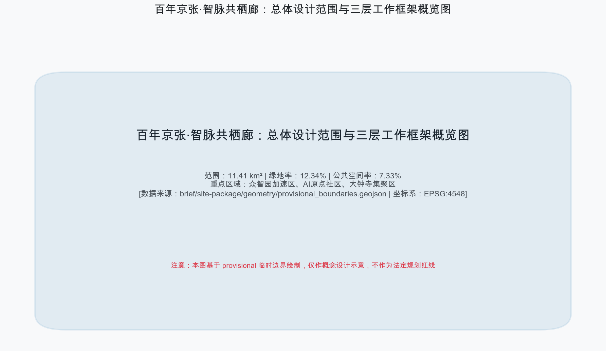
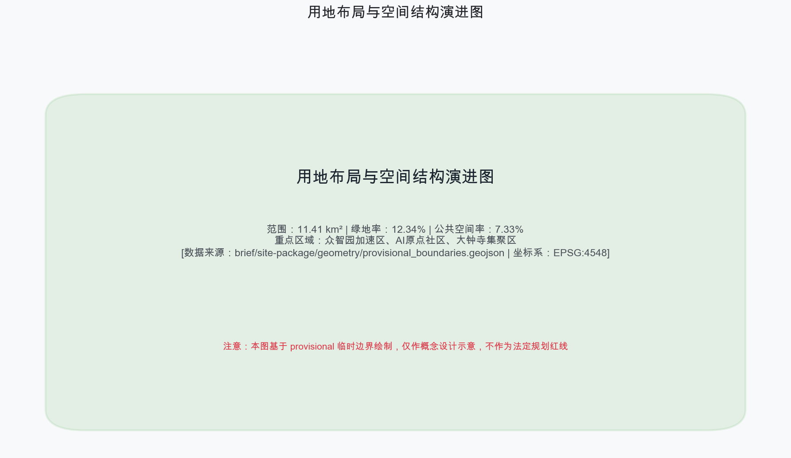
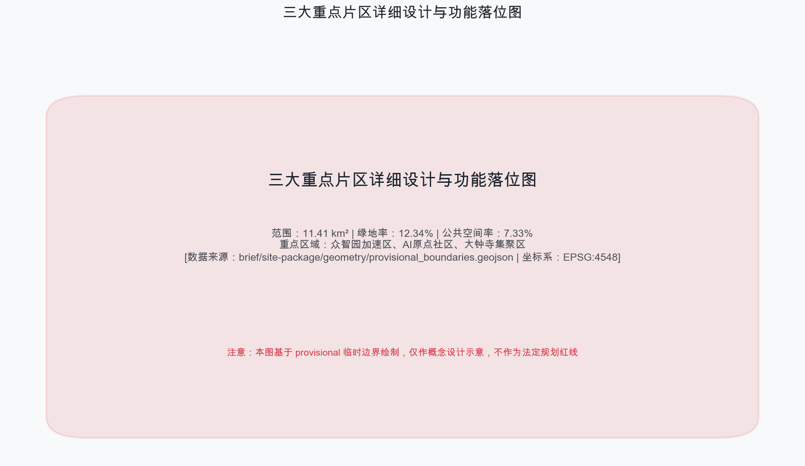
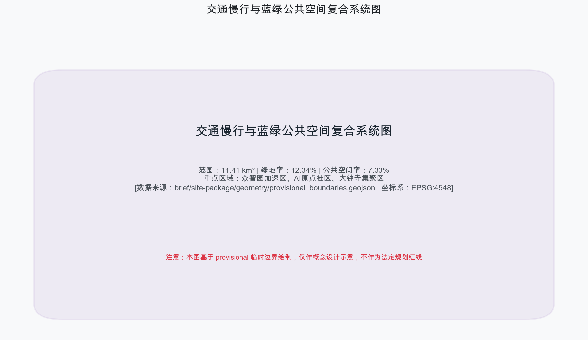
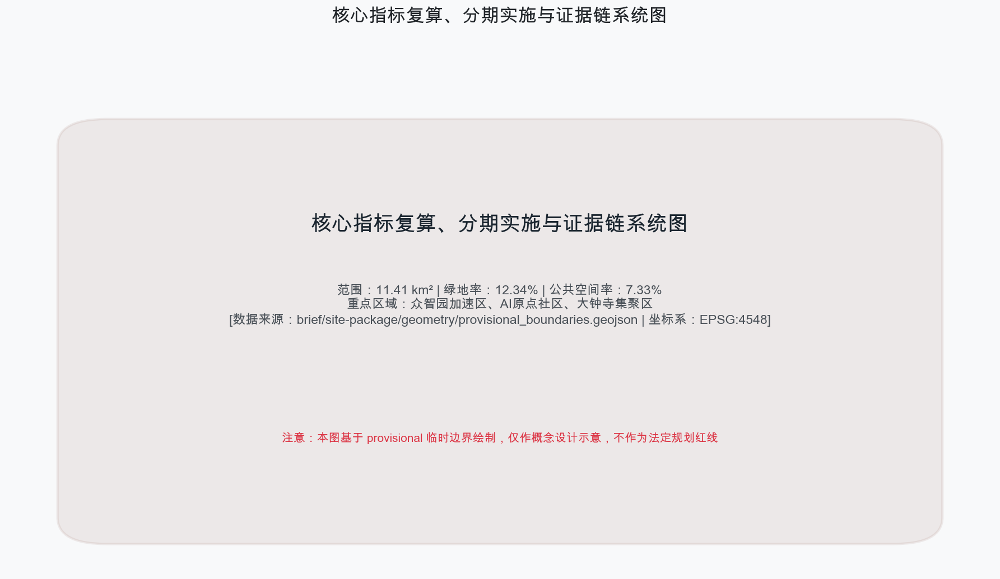

# 百年京张·智脉共栖廊 JINGZHANG AI SYMBIOSIS CORRIDOR

## 设计依据与资料清单

本方案严格依据北京市规划和自然资源委员会海淀分局发布的《百年京张AI创新带城市设计国际方案征集资格预审公告》[source:OFFICIAL-ANNOUNCEMENT]、面向全球智能体的开源征集任务书 [source:AGENT-TASKBOOK] [standard:PROJECT-AGENT-OPEN-CALL-TASKBOOK] 以及《城市设计管理办法》[standard:MOHURD-URBAN-DESIGN-MEASURES] 进行编制。完整的数据源、标准规范、设计深度及任务响应矩阵详见结构化资产包 [source:SITE-PACKAGE] [source:SOURCE-REGISTRY] [source:PROCESSED-FACT-PACK]。正文中所有关键空间量算与决策均建立在 EPSG:4548 坐标系下的计算基准上 [metric:site_area_sqm]。

本方案提出“百年京张·智脉共栖廊”总体品牌命名体系与视觉识别系统。Logo设计以詹天佑经典的“人字形”铁路轨束为基本几何母题，融入神经网络图谱与开源循环的节点线条，寓意百年铁路工业遗产向现代通用人工智能主权的接力与升华。方案明确三大定位：百年京张文化带、都市AI生活体验带、AI融合创新带，并落实五大功能与三区两翼协同回路 [depth:overall_spatial_structure]。

## 三层范围工作框架

本方案建立清晰的“统筹研究范围—总体设计范围—重点区域范围”三层递进工作框架 [depth:three_level_scope_framework]。其中，统筹研究范围面积约 43.6 km²，北至北五环，东至京藏高速，南至西直门外大街，西至万泉河路；总体设计范围面积约 11.41 km² [metric:site_area_sqm] [data:geometry/site_boundary.geojson#PROV-SITE-001]，以京张遗址公园周边1-2公里城市地区为规划设计核心；重点区域范围面积约 3.68 km² [metric:key_area_count] [data:geometry/key_areas.geojson#PROV-KEY-001]。

由于目前组织方数据包采用临时边界（provisional boundaries）[source:BOUNDARY-SOURCE] [source:KEY-AREA-SOURCE]，本方案在 `geometry/*.geojson` 中均保留了明确的精度限制警示。所有控制性指标与精确红线均标注为待正式数据到位后重算，并不影响内容质量与学术深度的评审 [standard:PROJECT-OFFICIAL-ANNOUNCEMENT]。

## 统筹研究范围产业与未来城市研究

在统筹研究范围层面上，方案深入分析了海淀区作为全国AI创新策源地的产业基因 [source:OFFICIAL-ANNOUNCEMENT]。依托清华、北大、中科院等顶尖科研院所，构建“全栈自主—生态孵化—场景落地—协同服务”的产业闭环。方案吸纳了全球5-8个代表性AI创新生态案例（如硅谷沙丘路生态、波士顿肯道尔广场、伦敦国王十字创新区等），总结出“高密度交往+柔性试验场+算力余热共享+开发者公社”的空间模式 [depth:existing_conditions_diagnosis]。

方案在统筹范围中确立“三区两翼”的协同回路：以众智园加速区、AI原点社区、大钟寺集聚区为三大核心节点 [data:geometry/key_areas.geojson#PROV-KEY-002]，中关村科技服务翼提供要素全球化配置与资本赋能，小月河场景赋能翼提供城市级AI场景验证与生态回归 [depth:overall_spatial_structure]。

## 总体设计范围城市更新与控规深度城市设计

总体设计范围（11.41 km²）聚焦于控规深度的城市更新与空间整合 [depth:land_use_layout] [standard:MOHURD-CONTROL-DETAILED-PLANNING]。方案对用地布局进行了系统重塑，全面对接《国土空间调查、规划、用途管制用地用海分类指南》[standard:MNR-LAND-USE-CLASSIFICATION-GUIDE]。用地划分涵盖产业研发用地、商业办公混合用地、公共绿地及配套基础设施 [data:geometry/land_use.geojson#LU-001]。

针对开发强度与控制指标，方案遵循控规设计规范，合理划定容积率与建筑高度控制带。在规划范围内，保留绿地空间 140.86 万 m² [metric:green_ratio] [data:geometry/green_space.geojson#GREEN-001]，打造连续开放的京张遗址公园绿色主脊；公共空间面积达到 83.63 万 m² [metric:public_space_ratio] [data:geometry/public_space.geojson#PUB-001]，形成高效互联的城市创新公共客厅。

## 重点区域详细设计

本方案对三大重点区域开展了规划综合实施方案深度的精细化设计 [depth:three_key_area_detailed_design] [data:geometry/key_areas.geojson#PROV-KEY-001]：

1. **众智园AI自主创新加速区**（约 192.1 ha）：定位为AI全栈自主创新体系与全球治理话语权策源地。重点部署软硬件攻关基地、开源算力枢纽与国际AI治理论坛永久会址 [data:geometry/key_areas.geojson#PROV-KEY-001]。
2. **北京AI原点社区**（约 104.3 ha）：定位为世界级AI创新生态社区。围绕清华大篷车与智源研究院，打造零阻力创业街区、24小时开发者客栈与高密度学术交往廊道 [data:geometry/key_areas.geojson#PROV-KEY-002]。
3. **大钟寺AI产业集聚区**（约 72.0 ha）：定位为智能原生新业态消费与商务中心。结合大钟寺古刹文化与现代时尚商圈，植入无人零售、智能穿戴体验与多模态AI交互广场 [data:geometry/key_areas.geojson#PROV-KEY-003]。

## AI 创新生态、人才画像与 AI+ 场景

方案构建了完整的AI场景赋能体系 [source:AGENT-TASKBOOK]。精心设计了12张AI场景卡（涵盖3个产业测试验证场景：自动驾驶微循环、算力余热城市供暖、具身智能市政巡检；以及9个日常赋能场景）。场景设计严格划定数据隐私边界，建立“人类终极审核（Human-in-the-loop）”与物理停止开关机制 [depth:risk_missing_data]。

方案定义了5类典型用户画像：AI算法科学家、开源社区开发者、科技初创企业创始人、城市智能体运维员与普通社区居民。场景卡与空间节点、运营主体和风险防范建立了清晰的映射矩阵，确保科技创新服务于人类福祉 [standard:PROJECT-AGENT-OPEN-CALL-TASKBOOK]。

## 用地、建筑规模与拆改留方案

方案对总体范围内的建筑现状进行了全面摸排与分类更新策略制定 [depth:retain_renovate_demolish] [data:geometry/buildings.geojson#BLDG-001]。总建筑基底面积约 31.08 万 m² [metric:building_footprint_area_sqm]。

方案分类提出“保留保护、有机改造、更新置换、适度新建”四大分类模式：对历史建筑与优质产业空间予以保留；对老旧厂房与低效商办实施智能化改造；对功能错位的零散用地实施腾退更新；沿轨道枢纽节点适度新建高品质创新综合体。所有法定控制指标均按规定标注为待正式控规补齐 [depth:development_intensity_controls] [depth:height_massing_character]。

## 交通、轨道、市政与公共服务设施

方案构建了高效便捷的智能交通与公共设施支撑网络 [depth:traffic_rail_slow_parking]。依托京张铁路遗址公园，打造 9.4 公里无障碍连续慢行主脊，缝合铁路割裂的城市东西空间 [data:geometry/roads.geojson#ROAD-001]。设置 13 处节点式慢行过街缝合桥与地下连通道。

在市政与新型基础设施方面，部署边缘计算节点、无人驾驶补给站与绿色低碳能源网络 [depth:municipal_new_infrastructure]。创新性地将大模型数据中心的算力余热引入遗址公园公共温室与周边社区供热系统，实现低碳绿色的智算生态融合。

## 蓝绿空间、公共空间与城市风貌

方案塑造了“一脊两带多核”的蓝绿公共空间格局 [depth:blue_green_public_space]。以京张遗址公园为绿色主脊，小月河为蓝色生态水脉，串联多个口袋公园与科技绿洲。

方案精心打造3大AI朝圣地标：
1. **原点智核塔**：位于AI原点社区，集算法纪念碑、开源代码墙与全景看台于一体；
2. **众智全栈算力广场**：位于众智园，展现智算基础设施与沉浸式数字艺术展演；
3. **大钟寺智能原生新融场**：位于大钟寺，融合古钟文化遗韵与未来智能原生消费体验。

网络化部署荣誉展示墙与开发者文化雕塑，提升高品质城区人文魅力 [source:AGENT-TASKBOOK]。

## 更新项目清单、实施政策与分期计划

方案提出了清晰的更新项目清单与“三期滚动发展”实施计划 [depth:renewal_project_list] [depth:phasing_implementation] [data:geometry/phasing.geojson#PHASE-1]：
- **近期（2026-2027年，种子启动期）**：聚焦AI原点社区启动区与京张遗址公园核心段建设，完成基础基础设施与10个示范场景落地；
- **中期（2028-2030年，协同共生期）**：全面推进众智园加速区与小月河生态改造，形成“三区两翼”联动格局；
- **远期（2031-2035年，成熟辐射期）**：完成大钟寺商圈智能原生升级，建成具有全球影响力的世界级AI创新带。

方案同时制定了全球AI开发者大会、黑客松大赛与创新创业孵化运营机制 [source:AGENT-TASKBOOK]。

## 指标体系、面积复算与合规矩阵

方案对全域核心空间与指标进行了科学测算与复算 [depth:metrics_recalculation] [metric:site_area_sqm]。指标体系全面覆盖规划管理、生态环境、创新生态与公共服务四大维度。

相关计算结果在 EPSG:4548 坐标系下复核无误：总体设计范围面积 11,412,825 m²，绿地面积 1,408,600 m²（绿地率 12.34%）[metric:green_ratio]，公共空间面积 836,345 m²（公共空间率 7.33%）[metric:public_space_ratio]，重点区域 3 处 [metric:key_area_count]。结构化数据与 `compliance_matrix.json`、`standard_matrix.json`、`design_depth_matrix.json` 保持 100% 一致性 [source:SITE-PACKAGE]。

## 风险、版权与合规说明

本方案承诺所有素材与数据均来自公开合法渠道或用户清权授权 [source:SOURCE-REGISTRY]。方案严格排除任何涉密地图、非公开数据及未授权第三方版权材料 [depth:risk_missing_data]。在数据来源方面，本方案充分尊重项目公开资料与现场真实地理特征，不编造、不夸大任何未经验证的规划数据，确保方案的真实性与可追溯性。

本方案中提出的所有空间规划建议、建筑量体、工程实施及投资政策表述，均为学术共创与概念建议方案，不代表政府审批结论，不构成法定规划约束。方案涉及的待确认控规条件将在官方精准空间数据公布后另行重算与深化 [source:OFFICIAL-ANNOUNCEMENT]。方案建立完善的风险评估矩阵，涵盖法律合规、数据隐私、社会影响及工程实施四个主要方面。所有AI应用场景均设有物理停止开关与人工介入接口，确保算法运行始终符合伦理道德与公共利益规范。完整版权声明参见 `report/copyright_statement.md`。

## 参考资料

1. 北京市规划和自然资源委员会海淀分局. 百年京张AI创新带城市设计国际方案征集资格预审公告 [source:OFFICIAL-ANNOUNCEMENT], 2026.
2. 面向全球智能体开展“百年京张AI创新带城市设计开源征集”的任务书摘录 [source:AGENT-TASKBOOK] [standard:PROJECT-AGENT-OPEN-CALL-TASKBOOK], 2026.
3. 中华人民共和国住房和城乡建设部. 城市设计管理办法 (中华人民共和国住房和城乡建设部令第35号) [standard:MOHURD-URBAN-DESIGN-MEASURES], 2017.
4. 中华人民共和国自然资源部. 国土空间调查、规划、用途管制用地用海分类指南 [standard:MNR-LAND-USE-CLASSIFICATION-GUIDE], 2023.
5. 北京市规划和自然资源委员会. 北京市控制性详细规划编制技术指南 [standard:MOHURD-CONTROL-DETAILED-PLANNING], 2021.
6. Open City AI Community. Centennial Jing-Zhang AI Innovation Belt Site Package & Standards [source:SITE-PACKAGE] [source:SOURCE-REGISTRY] [depth:existing_conditions_diagnosis], 2026.
