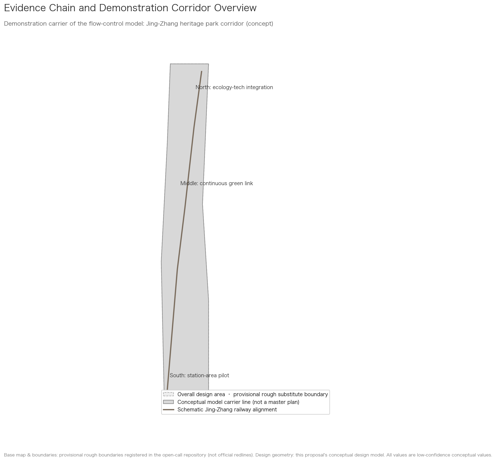
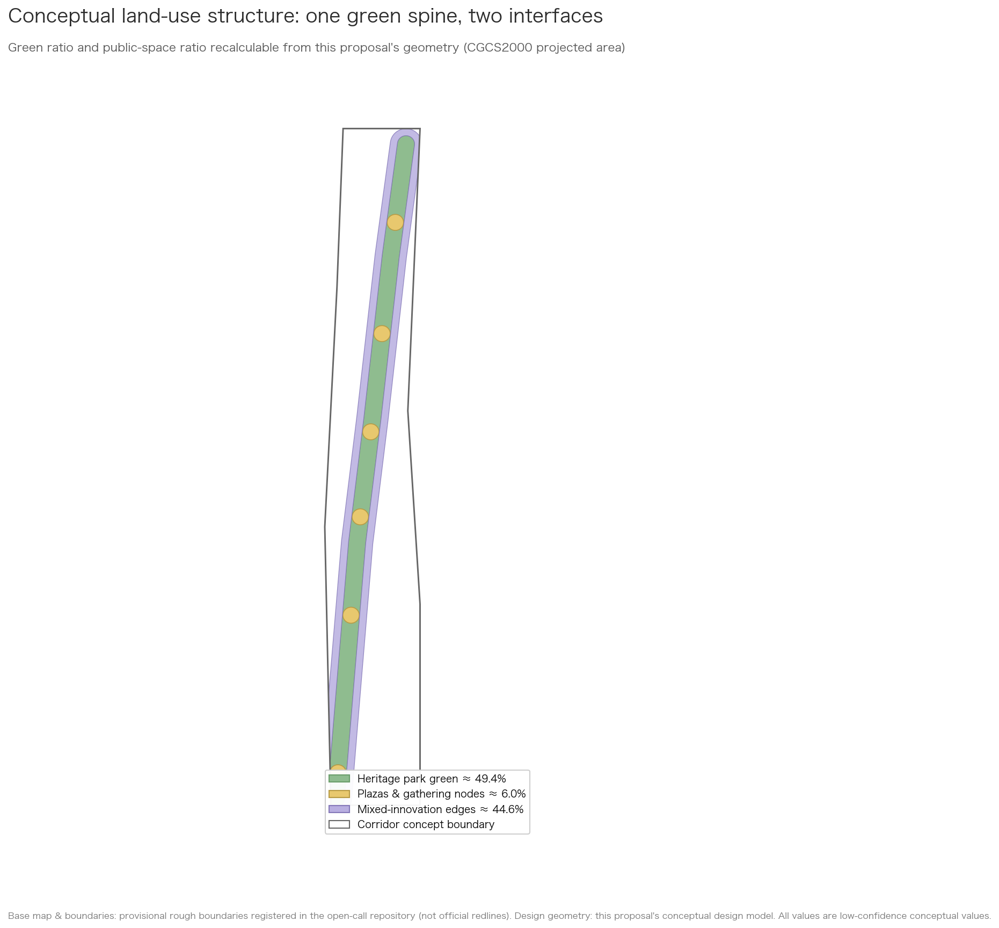
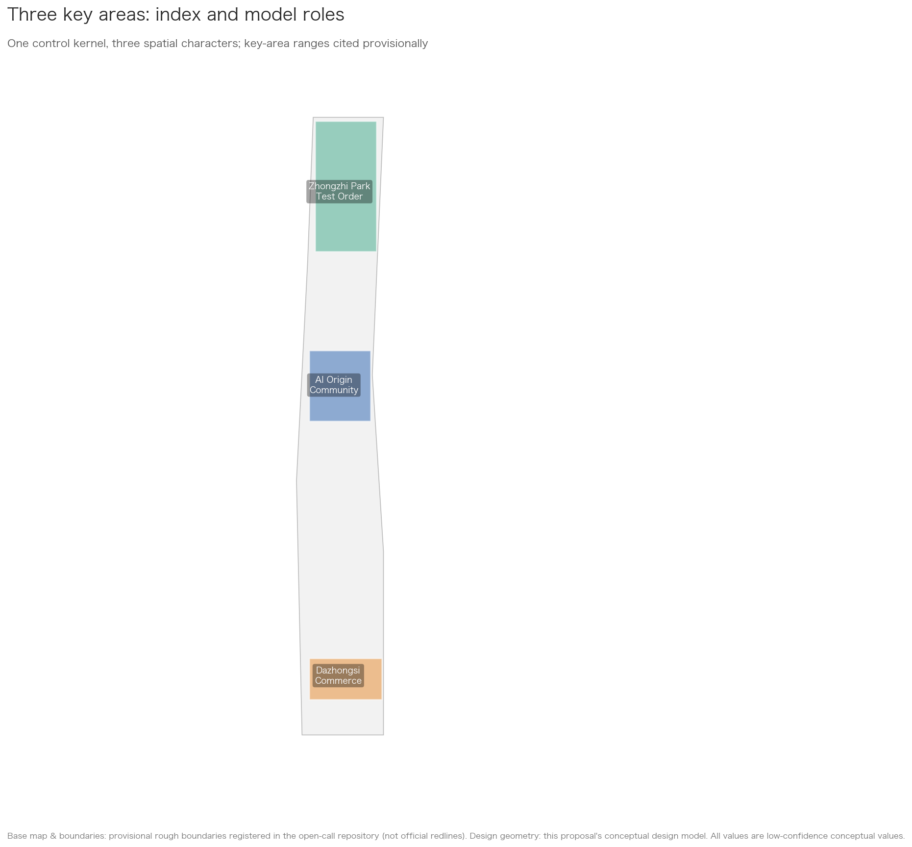
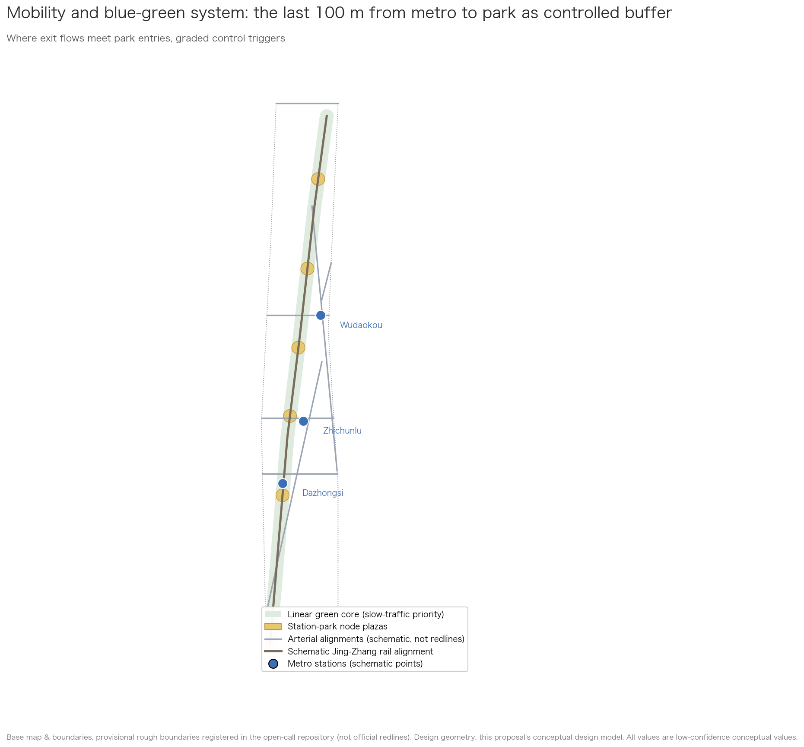
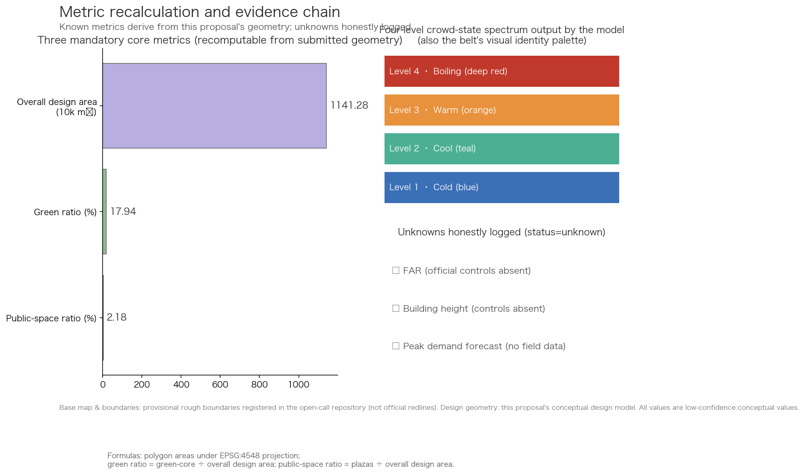

# Passenger-Flow Thermometer: A Dynamic Crowd-Flow Control Model — Jing-Zhang Interface Demonstration

## Design Basis and Source List

The first basis of this proposal is the Prequalification Announcement for the Centennial Jing-Zhang AI Innovation Belt Urban Design Open Call [source:OFFICIAL-ANNOUNCEMENT]; the second is the Agent Open Call Taskbook [source:AGENT-TASKBOOK]. All spatial judgments derive from the repository's registered provisional rough boundaries [source:SITE-PACKAGE] [source:SOURCE-REGISTRY]. These boundaries are not official redlines; every area, ratio, and zoning derived from them is a low-confidence conceptual design value to be recalculated once official data is released.

The core contribution of this submission is a **Passenger-Flow Thermometer for public spaces**, demonstrated at one station–park interface in the Jing-Zhang railway heritage-park context. This is not a master plan for the Centennial Jing-Zhang AI Innovation Belt, and it does not claim to complete the belt's land-use, building, industry, or implementation planning; the wider area is used only as spatial context for showing how the model can enter a real public-space problem. The main contributor has methodological experience in urban public transport passenger-flow monitoring and has shared related methods publicly; this submission contains and requires no non-public operational data — all demonstration figures are clearly labeled simulated or conceptual values.

Source usage boundaries follow the repository registry [source:SOURCE-REGISTRY]: formal sources answer task requirements, background-only materials remain background, and provisional geometry yields only conceptual values. Gaps are logged in `assumptions.json` and the repository's `missing_data_checklist.csv` [source:SITE-PACKAGE].

## Three-Level Scope Framework

At the coordinated research area (~43.6 km²) and overall design area (~11.4 km²) levels, this submission provides **context only**; it does not present a complete plan for either scale [source:OFFICIAL-ANNOUNCEMENT] [data:geometry/site_boundary.geojson#SITE-FLOW-001]. The actual submission object is a conceptual demonstration of the Passenger-Flow Thermometer at one class of station–park interface: the last 100 m between the Dazhongsi station forecourt and a park entry. The continuous demonstration corridor shown in the drawings is only a conceptual carrier indicating that the model can move along public space; it does not replace a master plan [data:geometry/phasing.geojson#PHS-001].

The working depth is therefore threefold: identify public-space questions at the open-call scale; show how one interface fits the Jing-Zhang heritage-park context; and specify the input, grading, action, and human-review loop at the selected interface. The three key areas and the two additional stations are comparison scenarios for model adaptation, not detailed urban designs for three districts [data:geometry/key_areas.geojson#KEY-001] [data:geometry/key_areas.geojson#KEY-002] [data:geometry/key_areas.geojson#KEY-003].

Once official redlines and key-area plans are released, everything listed in `assumptions.json` must be recomputed: all area-based indicators, node locations, and drawings [source:SITE-PACKAGE].

## Coordinated Research Area: Industry and Future City Research

### Naming System and Logo Direction

Beyond the official name "Centennial Jing-Zhang AI Innovation Belt," this proposal suggests the brand name **「京张智脉」(Pulse of Jingzhang)**. "Pulse" ties together three threads: the Jing-Zhang railway as China's self-built steel artery a century ago; the innovation pulse of Zhongguancun; and — through this proposal's model — the city's flow states becoming visible for the first time.

The logo direction embeds a continuous crowd-flow waveform between two parallel rails. The color system reuses the model's four-level status spectrum (cold blue — teal — warm orange — deep red), so visual identity and model output are structurally the same thing. Fonts are limited to open-source licensed Chinese typefaces. Both naming and logo remain concept suggestions for professional refinement [source:AGENT-TASKBOOK].

### The Model's Position Among the Positionings, Functions, and Area-Wing Structure

Full responses live in `compliance_matrix.json`; here we state the model's position. Under the "intelligent, AI-vibrant city" positioning, the model is the safety operating system of public space. Under "AI+ scenario empowerment," it is among the most immediately deployable scenarios because it runs on anonymous aggregated data alone. Under "global voice in AI governance," a privacy-first, human-reviewable, fully switchable-off crowd management method is itself a governance narrative that can be shared internationally [source:AGENT-TASKBOOK].

Across the three-areas-two-wings loop, the model supplies "one shared state language": campus flows at the AI Origin Community, test-range flows at Zhongzhiyuan, commercial flows at Dazhongsi, and event flows along both wings all read from the same rating levels and review procedures.

### Coordination Mechanisms with Neighboring Innovation Nodes (Optional Interfaces)

Three optional interfaces — conceptual suggestions only, constituting no confirmed cooperation — are reserved for Beiwei Community, Future Science City, Huairou Science City, the Economic-Technological Development Area, and Beijing-Tianjin-Hebei collaboration: first, a **scenario interface**, where the thermometer grading protocol serves as an open specification any park can adopt to speak the same state language; second, a **talent-and-events interface**, opening annual co-creation camps and academic week slots to these nodes; third, a **data-specification interface**, publishing the minimal anonymous-aggregate field definitions for reuse in cross-region comparative studies. Activation requires a node's own initiative plus a signed data contract [source:AGENT-TASKBOOK].

### Global Case Studies

Six global cases from public publications inform this proposal through an "experience → transfer" reading:

| Case | Readable Experience | Transfer into This Proposal |
|---|---|---|
| Promenade plantée, Paris | Earliest complete conversion of abandoned rail viaduct into a linear park | Spatial prototype and phased logic for the heritage park corridor |
| High Line, New York | Operations mechanisms by which a rail-heritage park catalyzes surrounding renewal | Value-capture logic for mixed-innovation edges of the corridor |
| Rose Kennedy Greenway, Boston | Stitching back a city cut apart by sunken highways | East-west stitching: the corridor must not become a new barrier |
| King's Cross, London | Station-district renewal where public space carries daily programming | Event systems and time-shared management of node plazas |
| Shibuya station-city integration, Tokyo | Layered pedestrian networks relieving high-intensity interchange | Two-layer organization of metro flows and ground-park flows |
| URA pedestrian-friendly guidelines, Singapore | Institutionalizing pedestrian-flow assessment in design workflows | How the model enters building-design checks institutionally |

The conclusion is that upgrading crowd management from an operations tool to a pre-condition of design has clear international precedents. This proposal tries to organize those lessons into a public method that is decoupled across perceive–compute–apply, privacy-first, and human-switchable; whether it forms a transferable paradigm still requires real-world validation [standard:MOHURD-URBAN-DESIGN-MEASURES].

## Overall Design Area: Urban Renewal and Regulatory-Plan-Level Urban Design

> This section only sets the spatial context for the model interface; it is not a master plan for the overall design area.

### Spatial Interface: How the Model Enters Public Space

This submission does not provide an urban-renewal, land-use, building, or regulatory-plan proposal for the overall design area. It uses the Jing-Zhang railway heritage-park context to answer one focused question: when station exit flows and park-entry flows overlap in the last 100 m, how can the Passenger-Flow Thermometer turn an abstract number into a reviewable on-site action [data:geometry/constraints.geojson#CON-METRO-002]?

The interface consists of four spatial relationships: station exit, station-forecourt buffer, park entry, and a convertible queuing/diversion edge. The model does not decide how buildings should be built. It gives professionals three reviewable outputs: current state, likely pressure direction, and suggested action. Suggested actions include expanding the queuing buffer, changing movement direction, pausing non-essential tests or events, and activating human guidance; the on-site operator retains command at all times [depth:existing_conditions_diagnosis].

The provisional overall boundary, road alignments, and land-use layers only establish spatial context and a possible migration direction. They do not mean this submission completes the belt's master plan, and they produce no FAR, building-height, demolition-retention, or engineering conclusion [source:SOURCE-REGISTRY].

## Detailed Design of Key Areas

> The three key areas are comparison settings for model adaptation, not detailed urban designs for three districts.

### Comparison Scenarios: One Algorithm, Different Public Spaces

This submission selects one primary spatial interface: **the last 100 m between the Dazhongsi station forecourt and a park entry**. Zhichunlu and Wudaokou are no longer presented as three parallel detailed designs; they are comparison scenarios showing how the same algorithm changes its actions according to flow direction and operational goals. All three station points are schematic and all values are simulated [data:geometry/constraints.geojson#CON-METRO-001] [source:SITE-PACKAGE].

- **Primary interface: Dazhongsi.** Observe whether commercial activity, exit flow, and park-entry flow overlap enough to open the queuing buffer and activate human diversion procedures early.
- **Comparison scenario: Zhichunlu.** Observe routine inspection under commuting tides: stable states add no on-site intervention; rising states notify the duty operator.
- **Comparison scenario: Wudaokou.** Observe how station–park direction guidance responds when student and visitor flows overlap; this does not constitute detailed urban design for the Wudaokou district.

The three scenarios test the portability of “same input — same computation — different action”; they do not replace professional planning for the three key areas. Before deployment, section locations, device counts, threshold calibration, and field permissions must be confirmed by operators and professionals [depth:existing_conditions_diagnosis].

## AI Innovation Ecosystem, Personas, and AI+ Scenarios

### Personas

Six personas: commuters (efficiency-first), residents including many seniors (safety and quiet first), university students (night-active), visitors (wayfinding-dependent), AI practitioners and developers (mechanism-sensitive, participation-minded), and space-operations managers (needing explainable bases rather than black-box alarms). Every scenario card names its persona mix [source:AGENT-TASKBOOK].

### AI Scenario Cards (12 cards, incl. 3 industrial test-validation scenarios)

| ID | Scenario | Personas | Data Input (all anonymous & aggregated) | Spatial Anchor | Privacy & Human Review |
|---|---|---|---|---|---|
| SC-01 | Station-park diversion guidance | Commuters, students | Simulated exit volumes, corridor density | Wudaokou, Zhichunlu forecourts | Point-level notices only; operator confirms before publishing |
| SC-02 | Slow-traffic gap diagnostics | Planners, cyclists | Observed delays, simulated heat traces | Corridor-wide network | Outputs are ranked suggestions subject to professional traffic review |
| SC-03 | Event-day flow rehearsal | Operations managers | Publicly reported historical ranges | Four node plazas | Results advisory; command stays human |
| SC-04 | Accessible journey companion | Seniors, wheelchair users | Manually surveyed facility ledger + slopes | Corridor-wide accessibility net | Route data never leaves device |
| SC-05 | Missing-person point assistance | Visiting families | Family-initiated report descriptions | Node plazas | Point-level only; facial recognition banned; police-led |
| SC-06 | Comfort forecast for public space | Residents, visitors | Public weather + simulated seat occupancy | Green core | No personal data |
| SC-07 | Night-companion lighting | Night walkers | Segment density | Night walking sections | Lights follow density; no surveillance function |
| SC-08 | Heritage digital guide | Visitors, students | User-initiated interaction | Memorial plaza, schematic rail line | Content passes history review |
| SC-09 | **Industrial test**: low-speed autonomous shuttle segment | Enterprises, commuters | Vehicle telemetry + exclusion-zone flow states | Zhongzhiyuan test lane | Requires legally mandated permits; auto-stop at threshold |
| SC-10 | **Industrial test**: delivery-robot corridor | Merchants, enterprises | Robot pose + segment flow | Dazhongsi to enterprise parcels | Auto-withdrawal during dense periods |
| SC-11 | **Industrial test**: open algorithm testbed | Enterprises, researchers | Anonymous aggregated simulation datasets | Model interface (online + nodes) | Data contract required; outputs reproducible |
| SC-12 | Developer anonymized data sandbox | Developers | Same as above | Online | Aggregate statistics only; 15-minute minimum granularity |

The full scenario-space-operation matrix lives in `compliance_matrix.json`. The three industrial test scenarios share one idea: **the model itself is testing infrastructure** — enterprises get a standardized safety foundation without building their own sensing systems, the most pragmatic public good within the "full-stack autonomous innovation system" [source:AGENT-TASKBOOK].

## Land Use, Building Scale, and Retain-Renovate-Demolish Strategy

Within the demonstration corridor, concept zoning derives from one geometry: heritage park green ≈ 49%, plazas ≈ 6%, mixed-innovation edges ≈ 45% [data:geometry/land_use.geojson#LU-GREEN-001]. The three mandatory metrics are registered at the submitted-scope level in `metrics.json` and recalculated in the metrics table below [metric:green_ratio] [metric:public_space_ratio].

These numbers' nature must be stressed: they are **low-confidence design-model values** computed from our own conceptual geometry under a projected coordinate system, with formulas and sources logged in `metrics.json`, to be recalculated when official boundaries arrive. FAR, heights, totals, and demolition classes are recorded as unknown — without official controls, any concrete number would impersonate statutory planning [standard:MOHURD-CONTROL-DETAILED-PLANNING]. Concept massing blocks indicate layout only [data:geometry/buildings.geojson#BLD-001].

## Transport, Rail, Municipal Infrastructure, and Public Services

> This section only discusses how one station–park interface receives model output; it is not an overall transport, municipal, or public-service plan.

### Focused Interface and Algorithm Demonstration

This submission does not propose the overall transport, municipal, or public-service infrastructure of the Jing-Zhang belt. The focused interface discusses how one public-space segment — station exit, forecourt buffer, and park entry — receives model output: identify the pressure direction, then let field staff decide whether to queue, divert, notify, or pause a related activity [data:geometry/constraints.geojson#CON-METRO-002]. Road, rail, and node layers are schematic context, not engineering design conditions.

### Station Comparison: One Primary Interface, Two Simulated Settings

The core grading method is the **"Passenger-Flow Thermometer"**, a method that the main contributor continues to develop: anonymous aggregated sectional data enters the computation layer, which separates boarding pressure, alighting pressure, and sectional differences before handing a temperature state to an operator for review. "Matured" here means that the calculation logic has taken shape; it does not mean that real-world validation is complete. This submission does not treat simulated demonstrations as accuracy evidence [source:SOURCE-REGISTRY].

The spatial demonstration selects one primary interface — the Dazhongsi station forecourt to park entry — while Zhichunlu and Wudaokou are comparison settings only. All inputs, temperature states, and actions are simulated: Dazhongsi observes overlapping commercial activity and exit flow; Zhichunlu observes stable inspection under commuting tides; Wudaokou observes direction guidance when student and visitor flows overlap. These scenarios show model adaptation, not station planning or approved deployment [data:geometry/constraints.geojson#CON-METRO-001] [source:SITE-PACKAGE].

The value of the three settings is to show a direction for portability, not to claim direct deployment. If an operator later supplies lawfully authorized anonymous aggregated data, the first step should be calibration, human review, and false-positive/false-negative evaluation at one interface before any extension to other public spaces. This submission contains no real-world accuracy, false-positive, false-negative, or operational-effectiveness conclusion.

#### Algorithm Disclosure

At the contributor's request, the core computation logic of the Passenger-Flow Thermometer is fully disclosed with this proposal, together with an interactive online demonstration driven by simulated data: **https://jiumonanzhi.cn/temperature** . The algorithm takes only anonymous, aggregated time-interval statistics as input: upstream/downstream sectional flows, station entry/exit counts, transfer volumes, the line's sectional capacity baseline, a time-of-day correction factor αt and a station-type correction factor αs, plus an evacuation capacity derived from escalator and stairway throughput. The computation has four steps [source:SOURCE-REGISTRY]:

1. **Directional allocation**: entry/exit volumes at terminal stations are assigned in full to their section direction; at intermediate stations they are split by directional allocation factors r_enter and r_exit;
2. **Dual temperatures**: boarding temperature Tu = (boarding demand ÷ remaining capacity) × 100; alighting temperature Td = (alighting demand ÷ sectional evacuation capacity) × 100; a simplified "pure-boarding temperature" using only boarding-side data is also provided for cases where alighting data is unavailable;
3. **Sectional-difference combination**: when alighting dominates (upstream > downstream), combined temperature = Td + max(Tu−10, 0)×0.3; symmetrically, boarding dominance yields Tu + max(Td−10, 0)×0.3; final temperature = combined temperature × αt × αs;
4. **State grading**: <40 normal, 40–60 watch, 60–75 Level-3 crowd, 75–90 Level-2 crowd, ≥90 Level-1 crowd; the demonstration renders five states in green–blue–yellow–orange–red, while the demonstration application's public interface consolidates them into the four-color language of cold blue — teal — warm orange — deep red.

All parameter values follow public industry standards and field-measurable attributes (equipment throughput, time-period and station-type factors), enabling full recalculation without any operator-internal data. The contributor retains authorship of the method and agrees to make it available for review, recalculation, and implementation within this project's open-source context.

#### Passenger-Flow Thermometer Model Card

**State mapping**: the computation layer outputs five states (<40 normal, 40–60 watch, 60–75 Level-3 crowd, 75–90 Level-2 crowd, ≥90 Level-1 crowd); the public interface consolidates them into a four-color language — normal & watch → cold blue, Level-3 → teal, Level-2 → warm orange, Level-1 → deep red — with shape symbols ●▲◆■ as non-color coding for color-vision-deficient users.

**Parameter dictionary**:

| Parameter | Meaning | Source |
|---|---|---|
| upstream / downstream | sectional flows by time interval | sectional counting devices (simulated demo values here) |
| enter / exit with r_enter / r_exit | station entry/exit volumes and directional allocation factors | terminals assigned in full; intermediate stations split by factors |
| transfer_in / transfer_out | transfer volumes | public rail-transit statistics conventions |
| C_line | line sectional capacity baseline | public rolling-stock capacity and headway data |
| P_evac | sectional evacuation capacity | escalator/stair unit throughput × count × damage factor |
| αt / αs | time-of-day / station-type correction | public standard clauses and field-measurable attributes |

**Testing and operating boundaries**: before deployment, false-positive/false-negative baselines are tested on simulated scenario sets and archived; when inputs are missing or below quality thresholds the system degrades to a "data insufficient" notice instead of guessing values; every public-facing state is confirmed by an operator; one switch-off reverts the space to ordinary static signage, and spatial function never depends on the system [source:SOURCE-REGISTRY].

For municipal and new infrastructure, restraint is the principle: perception uses minimal sectional-counting devices only; no new data center; computing reuses existing government cloud; every fixture degrades into ordinary street furniture on power or network loss — space keeps functioning when the system switches off [depth:municipal_infrastructure].

## Blue-Green Network, Public Space, and Urban Character

The blue-green structure is "one corridor, six nodes": a linear green core linking six node plazas (Xizhimen gateway, Dazhongsi station, Zhichunlu life, Wudaokou innovation exchange, Qinghua East Road technology, Qinghuayuan memorial) [data:geometry/green_space.geojson#GRN-001] [data:geometry/public_space.geojson#PUB-001]. The character baseline respects industrial-heritage qualities — sleepers, weathering steel, native planting — while AI appears as light and data visualization rather than sculptural clutter.

### AI Pilgrimage Landmarks (three)

**"Arc of Flows" (Xizhimen gateway)**: a light arc translating the corridor's live flow states into color and breathing rhythm — the model made physical, the first sight of "making safety visible" [data:geometry/public_space.geojson#PUB-001].

**"Sleepers of Time" (Qinghuayuan memorial plaza)**: a ground installation along 1909 (railway completion), 2009 (Zhongguancun independent-innovation zone), and 2026 (AI belt launch), with the herringbone-track motif honoring Zhan Tianyou's engineering wisdom [data:geometry/constraints.geojson#CON-HER-001].

**"Ring of Pulses" (Dazhongsi station plaza)**: a ring display presenting the open-source contributor roll and the iteration history of submissions — pilgrimage honors collective labor, not idols [data:geometry/public_space.geojson#PUB-002].

The honor system and component library (lamp poles, signage, seats, counters) register in the visualization page; all components use clearable open-source designs [source:AGENT-TASKBOOK].

## Renewal Projects, Implementation Policy, and Phasing

> “Phasing” here means algorithm validation stages, not construction phases for the belt [data:geometry/phasing.geojson#PHS-001].

### Model Validation Path and Minimal Demonstration Loop

These three stages are not construction phases for the belt; they are a validation path from “can calculate” to “deserves real-world testing” [data:geometry/phasing.geojson#PHS-001]:

1. **Offline simulation and recalculation:** use public parameters and manually constructed inputs to check directional allocation, Tu/Td calculation, sectional-difference weighting, five-level grading, and missing-data degradation.
2. **Single station–park interface pilot:** at one interface approved by the operator, collect anonymous aggregated sectional data, let field staff confirm the state, and compare suggested actions with actual handling.
3. **Cross-context transfer evaluation:** take the same parameter dictionary and test table to two different public-space types, observing where recalibration is needed instead of assuming direct portability.

This submission currently completes only the public demonstration of Stage 1 and the interface design for Stage 2. **It has not completed real-world accuracy, false-positive, or false-negative validation.** It is therefore an unfinished personal method prototype under continued development, not a ready-made safety product and not an operations decision conclusion.

Annual events and developer-community operations remain optional context inherited from the open-call taskbook, not deliverables of this focused submission. Any future event, testbed, or procurement arrangement requires separate operator approval and is not a government commitment [source:AGENT-TASKBOOK].

## Metrics, Area Recalculation, and Compliance Matrix

The three required core metrics recalculate as follows, each independently reproducible from the submitted geometry [metric:site_area_sqm]:

| Metric | Value | Formula | Confidence |
|---|---|---|---|
| Overall design area | ≈ 11,412,825 m² | Polygon area under CGCS2000 projection (provisional boundary) | Medium (repository provisional boundary) |
| Green ratio | ≈ 17.94% | Green-core area ÷ overall design area | Low (conceptual) |
| Public-space ratio | ≈ 2.18% | Plaza area ÷ overall design area | Low (conceptual) |

Scope note: the green and public-space layers are conceptual spatial interfaces derived within the provisional overall design boundary. The 17.94% and 2.18% ratios use the overall design area as denominator; they are not ratios for the demonstration interface itself. All three values are independently reproducible from the submitted geometry [metric:site_area_sqm].

These are the taskbook's mandatory core visual metrics [source:AGENT-TASKBOOK]. Other indicators: FAR, height, and totals remain unknown pending official controls; per-capita space and demand forecasts need field data and are deliberately left unnumbered rather than fabricated [source:SITE-PACKAGE]. The visualization page's numeric declarations match `metrics.json` exactly [metric:green_ratio] [metric:public_space_ratio].

## Risk, Copyright, and Compliance

**Data and privacy**: the model handles only anonymous, aggregated, minimized movement states — no facial recognition, no individual trajectories, no retrievable location records; all demonstration figures are simulated.

**Inclusion and accessibility**: the four crowd states carry shape symbols (●▲◆■) as non-color coding; critical alerts always pair with on-site human guidance and non-digital fallbacks; accessible navigation and missing-person assistance keep purely human service channels, collecting only minimal necessary fields whose access, retention, and deletion rules are published with the operations plan; under weak networks or power loss everything degrades to static signage without harming spatial use. The contributor's practical background is stated only as methodological experience; no non-public operational data, internal reports, or uncleared material is included [data:geometry/site_boundary.geojson#SITE-FLOW-001].

**Boundary precision**: all spatial judgments rest on the repository's provisional rough boundaries, not official redlines; full recalculation follows official releases and may adjust the proposal [source:SOURCE-REGISTRY].

**AI-generated responsibility**: this package was produced with an AI agent under final human authorship and responsibility. Global cases and standards citations rest on public materials; deviations will be corrected in continuous participation. Full statement in `report/copyright_statement.md`. Nothing herein constitutes statutory planning, approval basis, engineering conclusions, or any government commitment [standard:MOHURD-URBAN-DESIGN-MEASURES].

**Contact**: human author Chen Xingyu (GitHub account 563323549-boop), email 563323549@qq.com — reviewers are welcome to reach out regarding model recalculation, demonstration deployment, and cooperation.

## References

- Beijing Municipal Planning and Natural Resources Commission (Haidian Branch): Prequalification Announcement for the Centennial Jing-Zhang AI Innovation Belt Urban Design Open Call (May 2026).
- Agent Open Call Taskbook for the Centennial Jing-Zhang AI Innovation Belt (May 18, 2026 edition).
- Registered public sources, provisional-boundary derivation notes, and missing-data checklist of this open-call repository.
- Fruin, J., *Pedestrian Planning and Design* — classic level-of-service grading for pedestrians.
- GB 50157, *Code for Design of Metro* — published technical parameters for station density and evacuation.
- Ministry of Housing and Urban-Rural Development: *Measures for Urban Design Management*.
- Official project websites and published built-environment commentary for the six global cases (High Line; Promenade plantée; Rose Kennedy Greenway; King's Cross; Shibuya; URA pedestrian-friendly guidelines).

Registration status and usage boundaries of the above entries follow the repository source registry [source:SOURCE-REGISTRY].
