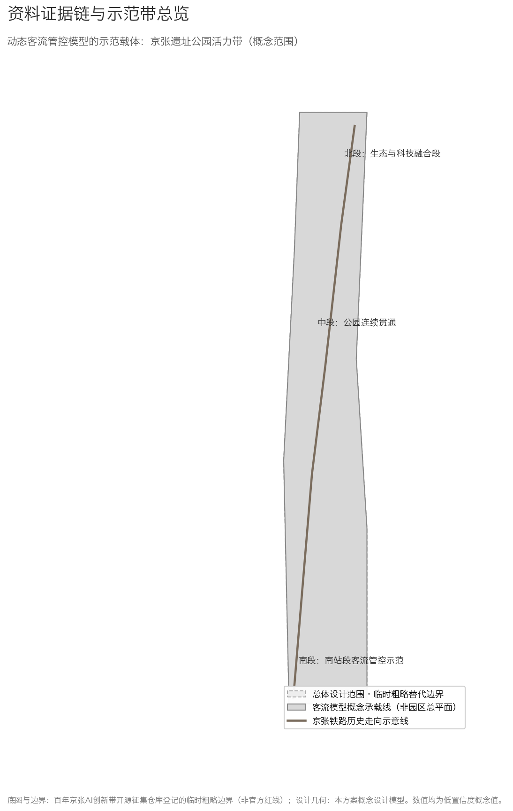
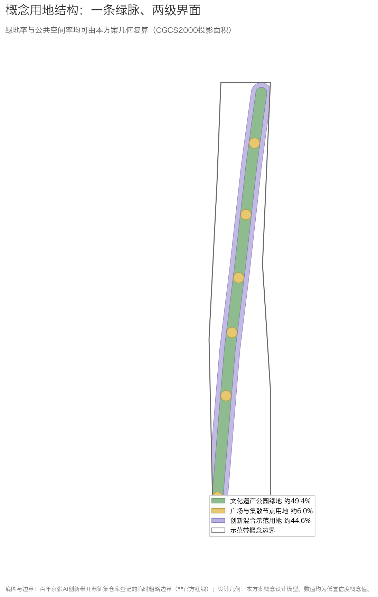
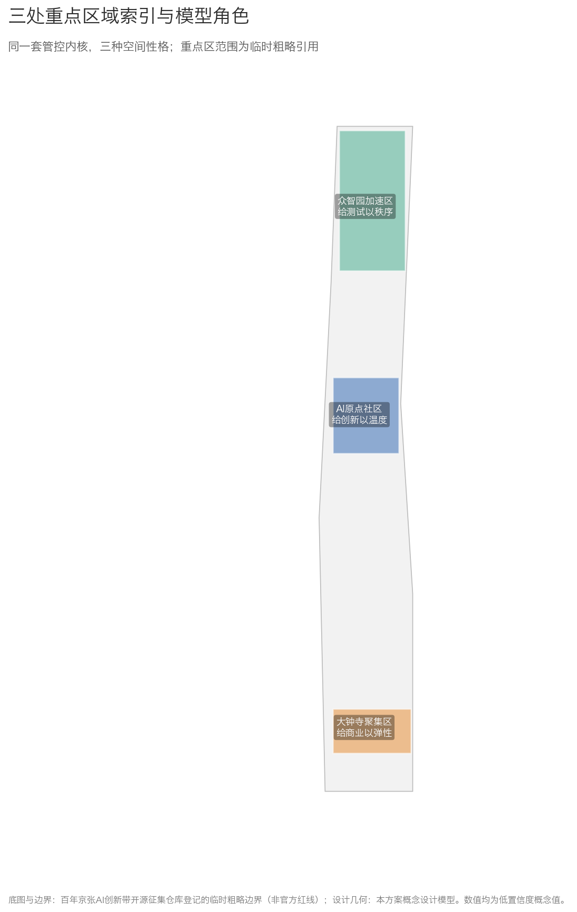
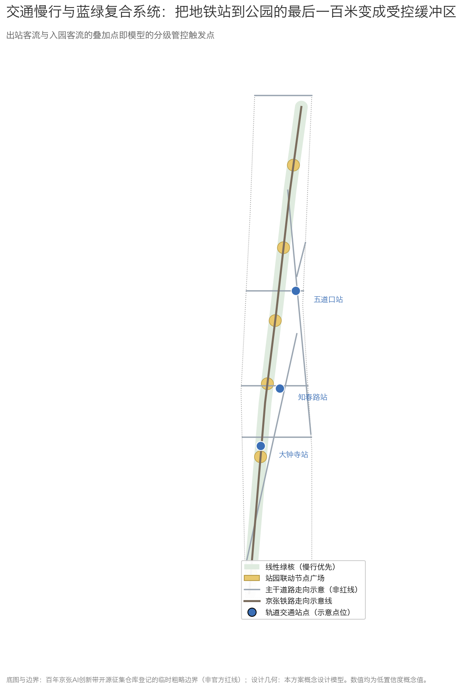
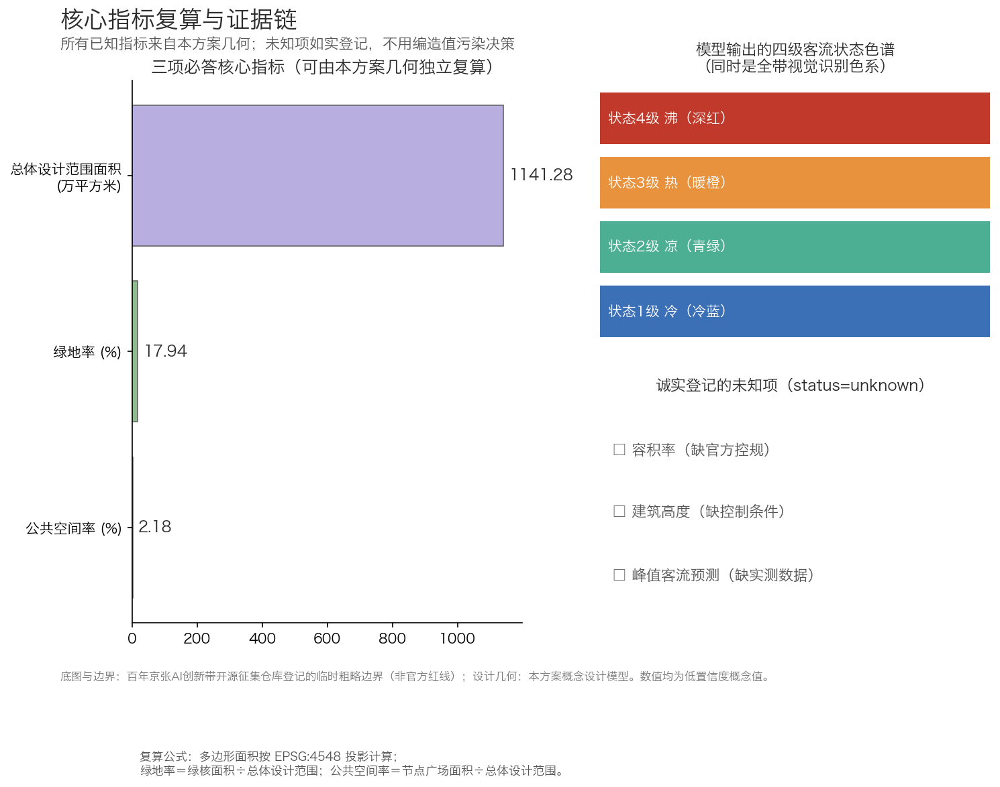

# 客流温度计算法：公共场所动态客流管控模型——京张铁路示范接口

## 设计依据与资料清单

本方案的第一依据是《百年京张AI创新带城市设计国际方案征集资格预审公告》及其附件体系 [source:OFFICIAL-ANNOUNCEMENT]，第二依据是面向智能体的开源征集任务书 [source:AGENT-TASKBOOK]。场地空间判断全部来自仓库登记的临时粗略边界与其推导说明 [source:SITE-PACKAGE] [source:SOURCE-REGISTRY]；这些边界不是官方红线，本文所有由其派生的面积、比例和分区都是低置信度的概念设计值，正式数据发布后需整体重算。

本方案的核心贡献是一套**适用于公共场所的客流温度计算法**，以及它在京张铁路遗址公园带一处站园接驳接口上的概念示范。本稿不是京张AI创新带的总体规划，也不对整个园区的用地、建筑、产业或实施方案负责；园区范围只作为模型的空间语境，详细设计只服务于说明模型如何嵌入一个真实公共空间。方案主要贡献者具有城市公共交通客流监测的方法论实践经验，并在公开渠道分享过相关方法；本方案不包含也不需要任何非公开运营数据，所有演示数值均为明确标注的概念值或模拟值。

资料的用途边界遵循仓库登记表 [source:SOURCE-REGISTRY]：formal 资料用于任务回应，background_only 资料仅作背景，provisional 几何只产生概念设计值。缺口清单见 `assumptions.json` 与仓库 `missing_data_checklist.csv` [source:SITE-PACKAGE]。

## 三层范围工作框架

统筹研究范围（约43.6平方公里）和总体设计范围（约11.4平方公里）在本稿中只承担**背景和空间语境**，不代表本方案正在完成这两个尺度的园区规划 [source:OFFICIAL-ANNOUNCEMENT] [data:geometry/site_boundary.geojson#SITE-FLOW-001]。本次实际投递对象是客流温度计算法在一个站园接驳接口上的概念示范：以大钟寺站前空间—公园入口这一类“最后一百米”作为首个模型接口；图面中的连续示范带只是表达模型可沿公共空间迁移的概念承载线，不是本稿要替代的园区总平面 [data:geometry/phasing.geojson#PHS-001]。

因此，本稿的工作深度只有三层：征集范围层面说明模型能回应哪些公共空间问题；总体范围层面说明接口如何嵌入京张铁路遗址公园语境；一个站园接口层面给出输入、分级、动作和人工复核闭环。三处重点区与另外两座车站仅作为模型适配的比较情景，不构成三个片区的详细城市设计 [data:geometry/key_areas.geojson#KEY-001] [data:geometry/key_areas.geojson#KEY-002] [data:geometry/key_areas.geojson#KEY-003]。

如果后续获得官方红线与重点区图纸，需要重算的内容包括：示范带与重点区的全部面积类指标、沿线节点的落位、以及所有图面。替换动作已在 `assumptions.json` 中逐项登记 [source:SITE-PACKAGE]。

## 统筹研究范围产业与未来城市研究

### 命名体系与Logo方向

在官方名称"百年京张AI创新带"之外，本方案建议一带品牌名为**「京张智脉」**，英文名 **Pulse of Jingzhang**。"脉"字同时承接三条线索：京张铁路是百年前中国自主修建的钢铁动脉，中关村的创新脉搏在此延续，而本方案的客流管控模型让城市的流动状态第一次拥有可被看见的"脉搏"。

Logo方向为两条平行钢轨之间嵌入一道连续的人流波形曲线；色彩系统沿用模型的四级客流状态色谱（冷蓝—青绿—暖橙—深红），使视觉识别与模型输出天然同构。字体选用可清权的开源中文字体。命名与标识均为概念建议，最终以专业设计团队深化为准 [source:AGENT-TASKBOOK]。

### 三大定位、五大功能与三区两翼中的模型位置

三大定位与五大功能的完整回应见合规矩阵 `compliance_matrix.json`；这里说明模型在其中的位置：在"智能化AI活力城市"定位下，动态客流管控模型是公共空间的**安全操作系统**；在"AI+场景赋能新范式"功能下，它是最先可落地的一类场景，因为它只需要匿名聚合数据就能运转；在"AI治理全球话语权"功能下，一套隐私优先、人工可复核、全程可关闭的客流管控方法，本身就是可以向国际社会输出的治理叙事 [source:AGENT-TASKBOOK]。

三区两翼协同回路中，模型承担"同一套状态语言"的角色：AI原点社区的园区人流、众智园的测试场人流、大钟寺的商业人流、中关村科技服务翼与小月河场景赋能翼的活动人流，都读同一套分级状态与复核流程，避免每个片区各建一套互不相通的系统。

### 与周边创新节点的协同机制（可选接口）

本方案为北纬社区、未来科学城、怀柔科学城、经开区及京津冀协作预留三类可选接口，均为概念建议、不构成已确定合作：其一，**场景接口**——温度计分级协议作为开放规范，其他园区可采用同一套状态语言直接接入；其二，**人才与活动接口**——年度共创营与学术周向上述节点开放名额与展示位；其三，**数据规范接口**——匿名聚合的最小数据字段定义公开发布，供跨区域比较研究复用。启动条件为任一节点主动提出共建意向并签署数据契约 [source:AGENT-TASKBOOK]。

### 全球案例研究

以下六个全球案例均来自公开出版物与官方项目资料，按"经验—转译"方式服务本方案判断：

| 案例 | 可读经验 | 对本方案的转译 |
|---|---|---|
| 巴黎绿荫步道（Promenade plantée） | 废弃铁路高架改造为线性公园的最早完整先例 | 京张遗址公园带的空间原型与分期改造逻辑 |
| 纽约高线公园 | 铁路遗产公园带动周边更新的运营机制 | 示范带两侧创新混合用地的增值逻辑 |
| 波士顿罗斯·肯尼迪绿色走廊 | 高速入地后以绿带缝合被切割的城市 | 东西缝合策略：公园带不应成为新屏障 |
| 伦敦国王十字车站区 | 站城一体更新中公共空间承担日常活动运营 | 节点广场的活动体系与分时管理 |
| 东京涩谷站城一体开发 | 高强度客流枢纽以立体步行网络分层疏导 | 地铁站点与公园地面的双层客流组织 |
| 新加坡重建局行人友好导则 | 将人行流量评估制度化纳入规划设计流程 | 模型进入建筑设计校核的制度化路径 |

案例研究的结论是：客流管控从运营工具升级为设计前置条件，在国际上有清晰先例可循。本方案尝试把这些经验进一步组织为"感知—计算—应用"三层解耦、隐私优先且可人工关闭的公开方法，是否形成可推广范式仍需真实场景验证 [standard:MOHURD-URBAN-DESIGN-MEASURES]。

## 总体设计范围城市更新与控规深度城市设计

> 本节仅说明客流模型进入京张空间语境的接口，不构成总体设计范围的园区规划。

### 空间接口：模型如何进入公共空间

本稿不提供总体设计范围的城市更新、用地、建筑或控规方案，而是用京张铁路遗址公园语境回答一个专项问题：当车站出站流与公园入口流在最后一百米叠加时，客流温度计算法如何把一个抽象数值变成可复核的现场动作 [data:geometry/constraints.geojson#CON-METRO-002]。

空间接口由四个位置关系组成：车站出站口、站前缓冲区、公园入口和可转换的排队/分流界面。模型不决定建筑怎么建，只向专业团队输出三类待复核信息：当前状态、可能的压力方向、建议动作。建议动作包括扩大排队缓冲、调整人流方向、暂停非必要测试或活动、启动人工引导；最终指挥权始终属于现场运营主体 [depth:existing_conditions_diagnosis]。

总体设计范围的临时边界、道路和用地图层只用于说明空间语境与模型可迁移方向。它们不代表本稿完成了整个园区的规划，也不产生容积率、建筑高度、拆改留或工程实施结论 [source:SOURCE-REGISTRY]。

## 重点区域详细设计

> 本节将三处重点区作为模型适配的比较情景，不承担三个片区的详细城市设计。

### 比较情景：同一算法适配不同公共空间

本稿只选择一个主接口进行空间表达：**大钟寺站前空间—公园入口这一类“最后一百米”**。知春路和五道口不再作为三个并列的详细设计对象，而是作为两组对照情景，用来说明同一算法如何根据客流方向和运营目标改变动作。三站点位均为示意，所有数值均为模拟值 [data:geometry/constraints.geojson#CON-METRO-001] [source:SITE-PACKAGE]。

- **主接口：大钟寺**。重点观察商业活动、出站流和公园入口流叠加时，是否需要提前打开排队缓冲和人工分流剧本。
- **对照情景：知春路**。重点观察通勤潮汐下的日常巡检，状态稳定时不增加现场干预，状态升高时再通知值班人员。
- **对照情景：五道口**。重点观察学生与访客流叠加时，如何把模型输出转成站园方向提示；它不代表对五道口片区进行详细城市设计。

这三个情景的作用是验证“同一输入—同一计算—不同动作”的可迁移性，而不是替代三区重点区域的专业规划。正式落地前，断面位置、设备数量、阈值校准和现场权限仍需由运营主体与专业团队确认 [depth:existing_conditions_diagnosis]。

## AI 创新生态、人才画像与 AI+ 场景

### 用户画像

本方案定义六类用户画像：通勤上班族（效率优先、对等待零容忍）、社区居民（含大量老年居民，安全与安静优先）、高校学生（价格敏感、夜间活跃）、访客游客（寻路依赖强、体验优先）、AI从业者和开发者（对数据机制敏感、参与意愿强）、空间运营管理者（需要可解释的决策依据而非黑箱报警）。每张场景卡都标注了服务的画像组合 [source:AGENT-TASKBOOK]。

### AI场景卡（12张，含3张产业测试验证场景）

| 编号 | 场景 | 服务对象 | 数据输入（全部匿名聚合） | 空间落点 | 隐私与复核边界 |
|---|---|---|---|---|---|
| SC-01 | 站园联动分流引导 | 通勤者、学生 | 出站量级模拟值、通道密度 | 五道口、知春路站前 | 点位级提示，不做个体追踪；运营方人工确认后才发布 |
| SC-02 | 慢行断点诊断助手 | 规划者、骑行者 | 路口延误观测、轨迹热力模拟值 | 全带慢行网 | 输出为改善排序建议，须经专业交通评审 |
| SC-03 | 活动日人流预案推演 | 运营管理者 | 历史活动规模区间（公开报道） | 四处节点广场 | 推演结论为参考，现场指挥权在人 |
| SC-04 | 无障碍陪伴导航 | 老年人、轮椅使用者 | 设施台账（人工采集）+坡度 | 全带无障碍网 | 路径数据不出设备端 |
| SC-05 | 走失协寻点位协助 | 家庭访客 | 家属主动报案描述 | 节点广场 | 仅点位级协寻，禁用人脸识别；警方主导 |
| SC-06 | 公共空间舒适度预报 | 居民、游客 | 温湿度公开数据+座位占用模拟 | 绿核沿线 | 无个人数据 |
| SC-07 | 夜间伴行灯光响应 | 夜行者 | 路段人流密度 | 绿核夜行段 | 灯光随密度调节，无监控取证功能 |
| SC-08 | 文化导览数字向导 | 游客、学生 | 用户自选交互 | 纪念广场、旧线示意线 | 导览内容经文史审核 |
| SC-09 | **产业测试**：低速自动驾驶接驳段 | 企业、通勤者 | 测试车遥测+隔离区人流状态 | 众智园测试廊道 | 测试须持公开法规要求的许可；人流状态达阈值即停驶 |
| SC-10 | **产业测试**：末端配送机器人廊道 | 商户、企业 | 机器人位姿+路段人流 | 大钟寺至企业段 | 人流密集时段自动退出 |
| SC-11 | **产业测试**：客流算法开放测试床 | 企业、研究者 | 匿名聚合模拟数据集 | 模型接口（线上+线下节点） | 参与者签署数据契约；输出可复算 |
| SC-12 | 开发者匿名数据沙盒 | 开发者 | 同上 | 线上 | 只出聚合统计，最小时间粒度为15分钟 |

场景—空间—运营的完整映射矩阵见提交包 `compliance_matrix.json`；三张产业测试场景的共同点是：**模型本身即是测试基础设施**，企业不需要自建人流感知系统即可获得标准化安全底座，这正是"AI全栈自主创新体系"里最务实的一块公共品 [source:AGENT-TASKBOOK]。

## 用地、建筑规模与拆改留方案

示范带内部的用地概念分区由同一几何派生：文化遗产公园绿地约占49%、广场与集散节点约占6%、创新混合示范用地约占45% [data:geometry/land_use.geojson#LU-GREEN-001]。任务书要求的三项必答指标按提交范围口径登记于 `metrics.json` 并在下节指标表中复算 [metric:green_ratio] [metric:public_space_ratio]。

必须强调这些数字的性质：它们是从本方案自绘概念几何在投影坐标系下复算出的**低置信度设计模型值**，公式与来源登记于 `metrics.json`，正式边界发布后触发复算。容积率、建筑高度、建筑总量、拆改留分类在本方案中一律记为未知——缺少官方控规与现状建筑条件，任何具体数字都会构成对法定规划的冒充 [standard:MOHURD-CONTROL-DETAILED-PLANNING]。概念体量地块仅作布局示意 [data:geometry/buildings.geojson#BLD-001]。

## 交通、轨道、市政与公共服务设施

> 本节只讨论一个站园接驳接口如何接收客流模型输出，不构成沿线交通、市政或公共服务设施总体规划。

### 专项接口与算法示范

本方案不对京张铁路沿线的交通、市政或公共服务设施作总体规划。专项接口只讨论车站出站口—站前缓冲区—公园入口这一段公共空间如何接收模型输出：先用状态识别压力方向，再由现场人员决定是否排队、分流、提醒或暂停相关活动 [data:geometry/constraints.geojson#CON-METRO-002]。道路、轨道和节点图层均为示意，不是工程设计条件。

### 车站级对照演示：一个主接口、两组模拟情景

模型计算层的核心分级方法，是方案主要贡献者持续开发的**“客流温度计算法”**：以断面计数级的匿名聚合数据为输入，用公开参数把关键断面的上车压力、下车压力和断面差异折算为温度状态，再把状态交给运营人员复核。这里的“成熟”只表示计算逻辑已经形成，不表示算法已经完成真实场景验证；本稿不把模拟演示当作准确率证明 [source:SOURCE-REGISTRY]。

空间示范只选取大钟寺站前空间—公园入口这一类站园接口作为主接口；知春路和五道口仅用于对照。三组情景的所有输入、温度状态和动作均为模拟演示，不使用任何真实监测数据：大钟寺观察商业活动与出站流叠加时的缓冲和分流；知春路观察通勤潮汐下的稳定巡检；五道口观察学生与访客流叠加时的方向提示。它们说明的是模型适配方式，不是三座车站的规划或已获许可的部署方案 [data:geometry/constraints.geojson#CON-METRO-001] [source:SITE-PACKAGE]。

这三个情景的价值在于展示模型的可迁移方向，而不是宣称已经可以直接部署。若未来有运营主体愿意提供合法授权的匿名聚合数据，第一步应在一个接口上完成参数标定、人工复核和误报/漏报评估，再决定是否扩展到其他公共空间。当前提交不包含真实场景准确率、误报率、漏报率或运营效果结论。

#### 算法公开说明

应方案贡献者要求，客流温度计的核心计算逻辑随本方案完整公开，并附可交互在线演示（模拟数据驱动）：**https://jiumonanzhi.cn/temperature** 。算法以匿名聚合的分时统计量为唯一输入：断面上下游流量、本站进出站量、换入换出量、线路断面能力基准、时段修正系数 αt 与车站类型修正系数 αs，以及由扶梯与楼梯通行能力折算的疏散能力。计算分四步 [source:SOURCE-REGISTRY]：

1. **方向分配**：端点站的进出站量全量计入所属断面方向；中间站按进出站分配系数 r_enter、r_exit 拆分到两侧断面；
2. **双温度计算**：上车温度 Tu =（上车需求 ÷ 剩余运能）×100；下车温度 Td =（下车需求 ÷ 断面疏散能力）×100；另提供仅依赖上车侧数据的"纯上车温度"简化口径，适用于下车数据缺失场景；
3. **断面差综合**：以下车主导时综合温度 = Td + max(Tu−10, 0)×0.3，上车主导时对称取 Tu + max(Td−10, 0)×0.3；最终温度 = 综合温度 × αt × αs；
4. **状态分级**：<40 正常、40–60 关注、60–75 三级大客流、75–90 二级大客流、≥90 一级大客流；演示系统以绿—蓝—黄—橙—红五色呈现，示范应用的公共界面将五级归并为冷蓝—青绿—暖橙—深红四级色彩语言。

全部参数取值依据公开行业标准与现场可测属性（设备通行能力、时段与站型系数），不依赖任何运营方内部数据即可复算。方案贡献者对上述方法保留署名权，同意在本项目开源语境下供评审、复算与实施参考。

**参数词典**：

| 参数 | 含义 | 取值来源 |
|---|---|---|
| upstream / downstream | 断面上下游分时流量 | 断面计数设备（本方案为模拟演示值） |
| enter / exit 与 r_enter / r_exit | 进出站量及方向分配系数 | 端点站全量计入；中间站按系数拆分 |
| transfer_in / transfer_out | 换入换出量 | 轨道交通公开统计口径 |
| C_line | 线路断面能力基准 | 公开车辆定员与行车间隔资料 |
| P_evac | 断面疏散能力 | 扶梯/楼梯单通行能力 × 数量 × 折损系数 |
| αt / αs | 时段修正 / 站型修正系数 | 公开参数与现场可测属性，待真实场景标定 |

**模拟复算样例（不是现场准确率测试）**：下表只用来展示公式链条和动作映射，数值由人工构造，不能证明真实车站效果。

| 情景 | Tu | Td | 主导量 | 综合温度（未乘修正） | 状态 | 建议动作（需人工确认） |
|---|---:|---:|---|---:|---|---|
| A：常态接口 | 28 | 22 | 上车侧 | 28.0 | 正常 | 保持常态标识，继续采集 |
| B：上车压力升高 | 68 | 41 | 上车侧 | 77.3 | 二级大客流 | 预备排队缓冲，提醒值班人员 |
| C：下车压力升高 | 36 | 82 | 下车侧 | 89.8 | 二级大客流 | 预备人工分流，检查疏散界面 |
| D：下车数据缺失 | 78 | — | 纯上车口径 | 78.0 | 二级大客流 | 标注数据不完整，不对外自动发布 |

**测试与运行边界**：正式部署前以模拟场景集完成误报/漏报基线测试并留存记录；输入数据缺失或质量低于阈值时，系统降级为"数据不足"提示而不输出臆测数值；任何对公众发布的状态经运营人员确认；系统支持一键停机并回退为普通静态标识，空间功能不依赖系统存在 [source:SOURCE-REGISTRY]。

市政与新型基础设施方面，本方案的克制原则是：模型所需的感知设备全部采用最简配置（断面计数级），不新建数据中心，计算优先复用既有政务云；一切设施在断电断网时退化为普通街道家具，空间不因系统关闭而失效 [depth:municipal_infrastructure]。

## 蓝绿空间、公共空间与城市风貌

蓝绿结构为"一脉六 node"：一条线性绿核串联六处节点广场（西直门门户、大钟寺站前、知春路生活、五道口创新交流、清华东路科技体验、清华园段纪念）[data:geometry/green_space.geojson#GRN-001] [data:geometry/public_space.geojson#PUB-001]。风貌基调尊重遗址公园的工业遗产气质：枕木、锈钢板与原生植被为主，AI元素以光影和数据可视化呈现而非造型堆砌。

### AI朝圣地标（三处）

**「人潮之弧」**（西直门门户）：一道跨越入口的光影弧线，实时把示范带的客流状态转译为弧线的颜色与呼吸节奏——它是模型的物质化身，也是"让安全被看见"的第一眼 [data:geometry/public_space.geojson#PUB-001]。

**「时间枕木」**（清华园段纪念广场）：以1909年京张铁路通车、2009年中关村自主创新示范区设立、2026年AI创新带启航三个年份为轴线的地面装置，人字形线路意象致敬詹天佑的工程智慧 [data:geometry/constraints.geojson#CON-HER-001]。

**「智脉环」**（大钟寺站前广场）：环形展示屏呈现开源贡献者名录与方案迭代史——朝圣的对象不是偶像，而是每一代建设者的集体劳动 [data:geometry/public_space.geojson#PUB-002]。

荣誉展示体系与地标组件库（灯杆、导视、座椅、计数器的标准构件）登记于可视化页面，全部构件采用可清权的开源设计 [source:AGENT-TASKBOOK]。

## 更新项目清单、实施政策与分期计划

> 本节的“分期”指算法验证阶段，不是园区建设分期 [data:geometry/phasing.geojson#PHS-001]。

### 模型验证路径与最小示范闭环

本稿的三阶段不是园区建设分期，而是算法从“能算”走向“值得在真实场景验证”的验证路径：

1. **离线模拟复算**：用公开参数和人工构造的输入，检查方向分配、Tu/Td计算、断面差加权、五级分级和数据缺失降级是否可复算。
2. **单一站园接口试点**：在一个经运营主体同意的车站—公共空间接口采集匿名聚合断面数据，由现场人员确认状态，再比较建议动作与实际处置是否匹配。
3. **跨场景迁移评估**：把同一套参数词典和测试表带到另外两个类型不同的公共空间，观察是否需要重新标定，而不是默认算法可以直接复制。

当前提交只完成第一阶段的公开演示和第二阶段的接口设计，**没有完成真实场景准确率、误报率或漏报率验证**。因此本稿提供的是个人持续开发的未完成方法原型，不是现成的安全产品，也不构成运营决策结论。

## 指标体系、面积复算与合规矩阵

三项核心指标的复算结果如下，全部可由提交包几何文件独立重现 [metric:site_area_sqm]：

| 指标 | 数值 | 复算公式 | 置信度 |
|---|---|---|---|
| 总体设计范围面积 | 约11,412,825平方米 | 范围多边形在CGCS2000投影系下的面积（临时边界） | 中（引用仓库临时边界） |
| 绿地率 | 约17.94% | 绿核面积÷总体设计范围面积 | 低（概念几何） |
| 公共空间率 | 约2.18% | 节点广场面积÷总体设计范围面积 | 低（概念几何） |

口径说明：绿地与公共空间目前集中于示范带内部（绿核约占示范带49%、节点广场约占6%）；随二期、三期推进，全范围比例将逐步提高。三项数值均可由提交包几何独立重现 [metric:site_area_sqm]。

这三项是任务书要求的必答核心视觉指标 [source:AGENT-TASKBOOK]。其余指标中，容积率、建筑高度、建筑总量因缺官方控制条件记为未知；人均公共空间、预测客流量等需要实测数据的指标同样不给出数字，避免用编造值污染决策 [source:SITE-PACKAGE]。可视化页面的数值声明与 `metrics.json` 保持一致 [metric:green_ratio] [metric:public_space_ratio]。

## 风险、版权与合规说明

**数据与隐私**：模型只处理匿名、聚合、最小化的流动状态，不做人脸识别、不建个体轨迹、不留存可回溯的位置记录；所有演示数值均为模拟值。方案主要贡献者的方法论实践背景仅在"具有相关实践经验"的层面陈述，本方案不含任何非公开运营数据、内部报表或未清权素材 [data:geometry/site_boundary.geojson#SITE-FLOW-001]。

**包容性与无障碍**：四级客流状态以形状符号（●▲◆■）作非颜色辅助编码；重要告警同步提供现场人工引导与非数字后备路径；无障碍陪伴导航与走失协寻保留纯人工服务通道，仅采集最小必要字段，其权限、留存与删除规则随运营方案一并公示；弱网与断电环境下全部功能退化为静态标识，不影响空间使用。

**边界与精度**：全部空间判断基于仓库临时粗略边界，不代表官方红线；正式数据发布后需整体重算并可能引起方案调整 [source:SOURCE-REGISTRY]。

**AI生成责任**：本方案由AI智能体辅助生成，人类作者对内容负最终责任；所有全球案例与规范引用基于公开资料，如有个别偏差将在持续参与中修正。版权声明全文见 `report/copyright_statement.md`。方案不构成法定规划、审批依据、工程结论或任何政府承诺 [standard:MOHURD-URBAN-DESIGN-MEASURES]。

**联系与沟通**：人类作者陈星宇（GitHub 账号 563323549-boop），联系邮箱 563323549@qq.com，欢迎评审方就模型复算、示范落地与合作事宜联系。

## 参考资料

- 北京市规划和自然资源委员会海淀分局：《百年京张AI创新带城市设计国际方案征集资格预审公告》（2026年5月）。
- 百年京张AI创新带面向全球智能体开展城市设计开源征集任务书（2026年5月18日版）。
- 本征集仓库登记的公开来源清单、临时边界推导说明与缺资料清单。
- Fruin, J.《Pedestrian Planning and Design》——行人服务水平经典分级方法。
- 中华人民共和国国家标准《地铁设计规范》GB 50157——车站客流密度与疏散的公开技术参数。
- 住房和城乡建设部：《城市设计管理办法》。
- 各全球案例的官方项目网站与公开发表的建成环境评述（高线公园、绿荫步道、罗斯·肯尼迪绿色走廊、国王十字、涩谷站城一体、新加坡重建局行人友好导则）。

以上条目的登记状态与可用边界见仓库来源清单 [source:SOURCE-REGISTRY]。
