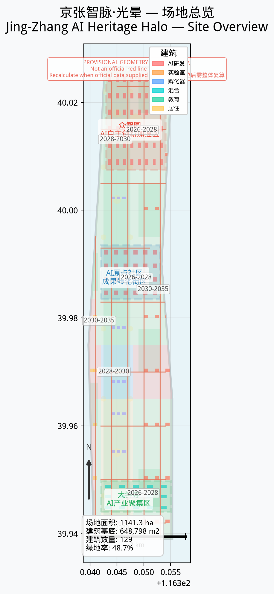
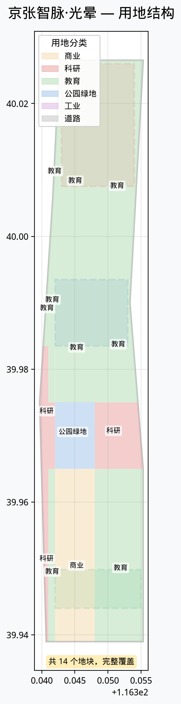
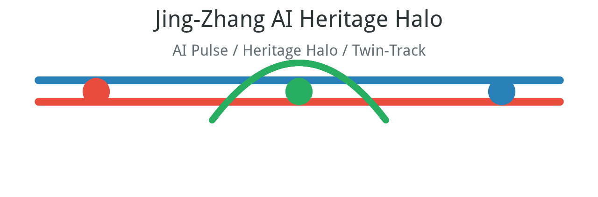
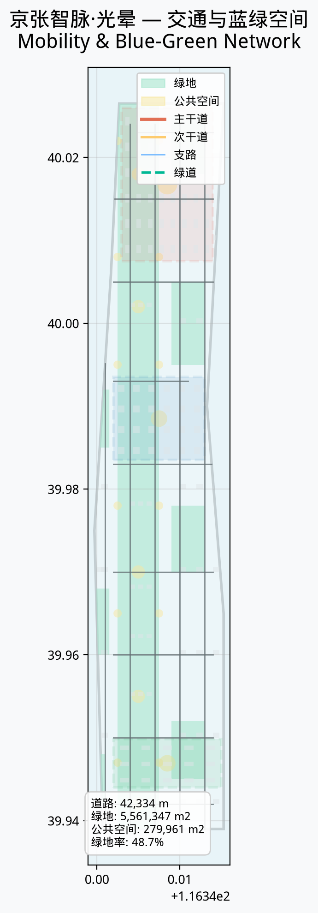
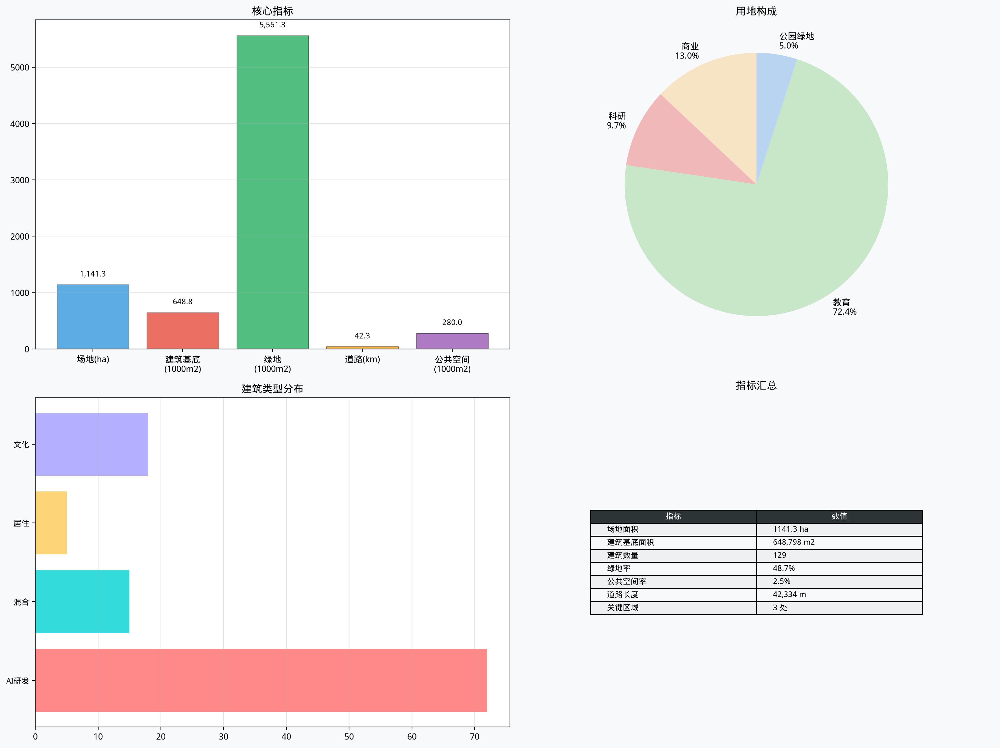

# 京张智脉·光晕 / Jing-Zhang AI Heritage Halo

## 设计概念：京张智脉·光晕

**"智脉"（AI Pulse）**：以京张铁路遗址公园为历史与公共空间主脉，将这条百年铁路线重塑为贯通南北的"数字动脉"。铁路本身承载历史记忆，其两侧的城市空间则被AI创新能量激活——如同脉冲信号沿神经传导。

**"光晕"（Heritage Halo）**：三处重点区域（众智园、AI原点社区、大钟寺）如同三个"发光节点"，每个节点向周边城市社区辐射AI创新能量，形成三圈"光晕"——创新加速光晕、人才生态光晕、产业集聚光晕。光晕不是新的红线，而是设计概念上的辐射范围。

**"双轨共生"（Twin-Track Symbiosis）**：
- 轨道一（历史脉搏）：百年京张文化带——遗址保护、慢行贯通、公共空间、文化叙事
- 轨道二（数字脉搏）：AI融合创新带——AI创新生态、智能基础设施、未来经济形态

两条轨道并行不悖、相互赋能，形成"以历史为锚、以AI为翼、以人为心"的独特城市更新范式。

## 设计依据与资料清单

本 formal 方案以北京市规划和自然资源委员会海淀分局发布的《百年京张AI创新带城市设计国际方案征集资格预审公告》为第一依据，并以 `brief/site-package/` 中经维护者登记的临时粗略边界、重点区域、枚举、指标和来源清单为机器可读依据。AI agent 在生成方案前必须读取 `design_brief.json`、`allowed_design_space.json`、`sources.json`、`enums/`、`ranges/`、`schemas/`、`data/source_registry.json` 和 `data/processed/agent_fact_pack.md`，并用 `project_scope_summary.csv`、`agent_task_requirements.csv`、`source_use_matrix.csv`、`missing_data_checklist.csv` 建立任务、范围、资料用途和缺口清单。所有设计判断都要拆分为可追溯来源、可复算指标、可校验图层和可人工复核假设。公告要求方案达到控制性详细规划的城市设计深度和规划综合实施方案的城市设计深度，因此文本叙述不能替代 GeoJSON、指标表、A3 文册、A0 展板和 HTML 电子展示成果。

方案不是独立愿景文本，而是从公告、面向智能体任务书和场地资料出发组织成果；本节只把最关键依据放在判断旁边 [source:OFFICIAL-ANNOUNCEMENT] [source:AGENT-TASKBOOK] [depth:existing_conditions_diagnosis]。完整来源和标准覆盖分别保存在 `sources.json`、`standard_matrix.json` 与 `design_depth_matrix.json`，不在正文重复机器索引。

资料登记表的使用边界如下 [source:SOURCE-REGISTRY]：

- data/source_registry.json 登记公开、清权与临时资料的用途边界。
- 当前登记摘要：formal 可用资料 7 条，背景资料 1 条，provisional-only 资料 1 条。
- agent 不得把 background_only 或 provisional_only 资料升级为 official boundary、法定控规、正式评分依据或政府实施承诺。

`data/processed/agent_fact_pack.md` 是本方案的阅读导航层，不是新的权威来源 [source:PROCESSED-FACT-PACK]。它帮助 agent 把三层范围、三处重点区、公告任务、agent.1-agent.6、资料可用性和缺资料事项组织成可读方案；事实判断仍需回到已登记的原始材料 [source:OFFICIAL-ANNOUNCEMENT] [source:AGENT-TASKBOOK]，完整来源关系由 `sources.json` 保存。

本脚手架在官方 `SITE_BOUNDARY` 或三处 `KEY_AREA` 尚未取得时，使用 `brief/site-package/geometry/provisional_boundaries.geojson` 生成临时 formal 包。提交包中的 `geometry/site_boundary.geojson` 与 `geometry/key_areas.geojson` 均必须标注为 `provisional_constraint`、`official_boundary=false`，只能用于方案生成、自检、可视化和设计讨论，不能作为 official redline、审批依据、精确面积依据或法定控制结论。该组织方数据缺口本身不阻断内容评分；替换 official polygons 后，site boundary、key areas、land use、roads、green space、public space、buildings、phasing 和 metrics 均需重算。

本次脚手架生成的可评分状态为：**临时边界，保留精度警示并待正式数据发布后复算；不阻断内容评分**。因此，正文中的空间结构、场景、项目和指标均按“可讨论、可复核、可替换官方边界后重算”的原则写入；当官方边界和重点区 polygon 更新后，agent 必须重新运行脚手架、自检和图纸/HTML生成，不能只替换单个文件。

边界解释可回到总体范围图层和面积复算 [data:geometry/site_boundary.geojson#SITE-001] [metric:site_area_sqm]。三处重点区则由独立图层和数量指标核对 [data:geometry/key_areas.geojson#PROV-KEY-001] [metric:key_area_count]。这意味着读者可以从正文进入证据，但不必先读一串机器编号。

## 三层范围工作框架

方案按照公告确定的三个层次组织工作：统筹研究范围关注 43.6 平方公里的AI产业生态、战略定位、创新链和未来城市形态；总体设计范围关注 11.4 平方公里京张遗址公园周边 1-2 公里城市地区和产业区，要求形成城市更新总体框架、产业空间布局、交通市政支撑和城市风貌控制；重点区域范围关注 368.4 公顷三处详细设计地区，要求明确功能业态、建筑规模、拆改留分类、公共空间连通和交通组织。三层范围在 `compliance_matrix.json` 中逐条映射，保证公告 1.3、1.4、1.5 与 agent.1-agent.6 的必选任务都有章节、图层、指标、图纸和 HTML 证据。

三层工作框架的深度项由 [depth:three_level_scope_framework] 和 [depth:overall_spatial_structure] 约束，空间证据以 [data:geometry/site_boundary.geojson#SITE-001] 与 [data:geometry/key_areas.geojson#PROV-KEY-001] 为准，任务依据以 [standard:PROJECT-OFFICIAL-ANNOUNCEMENT] 为准，范围索引以 [source:PROCESSED-FACT-PACK] 中 `project_scope_summary.csv` 的三层范围表为导航。

三层工作不是互相割裂的图纸集合。统筹研究决定产业链和城市形态判断，总体设计把判断落实到更新项目、空间结构和设施承载，重点区域详细设计验证具体地块、建筑、交通、公共空间和AI应用场景的可实施性。agent 生成方案时必须先锁定当前提交采用的 official 或 provisional 边界和约束，再生成用地、建筑、道路、绿地、公共空间、分期和AI服务节点，最后从这些图层复算指标并在正文解释哪些结论仍受 provisional boundary 限制。任何无法从结构化数据复算的面积、比例、规模或项目数量，不得写入正式结论。

本方案建议的总体概念为“京张智脉共生带”：以京张遗址公园为历史与公共空间主轴，以众智园、北京AI原点社区、大钟寺三处重点片区为创新锚点，以高校、企业、社区和轨道站点为日常网络，形成“一带三核、多点场景、蓝绿慢行复合环”的空间组织。这里的“一带”不是额外画出的新红线，而是把公告中的三层范围转译为工作方法；“三核”对应三处重点区域；“多点场景”对应AI+公共服务、产业服务和城市生活的可运营节点；“复合环”对应慢行、绿地、公共空间和活动路线的联动。

| 层级 | 设计问题 | 方案回答 | 数据落点 |
| --- | --- | --- | --- |
| 统筹研究范围 | AI产业生态和未来城市形态如何组织 | 建立“高校策源-开源协作-企业转化-公共体验-国际传播”的创新链 | compliance_matrix.json、standard_matrix.json |
| 总体设计范围 | 产业空间、城市更新、交通市政和风貌如何落图 | 用地、建筑、道路、绿地、公共空间和分期图层共同表达 | [data:geometry/land_use.geojson#LU-001]、[data:geometry/roads.geojson#ROAD-001] |
| 重点区域范围 | 三处片区如何达到详细设计深度 | 分别提出定位、空间动作、AI场景和实施依赖 | [data:geometry/key_areas.geojson#PROV-KEY-001]、[data:geometry/key_areas.geojson#PROV-KEY-002]、[data:geometry/key_areas.geojson#PROV-KEY-003] |

## 统筹研究范围产业与未来城市研究

统筹研究范围的核心任务是构建世界级 AI 创新生态体系。方案应梳理海淀高校院所、头部企业、算力算法数据要素、孵化平台、上市企业、独角兽和科技服务资源，提出AI创新链、产业链、人才链和城市服务链的空间协同框架。命名方案和 logo 设计应服务于“百年京张文化带、都市AI生活体验带、AI融合创新带”的整体辨识度，不能只停留在口号，应说明与产业生态、公共空间和文化资源的关联。面向智能体任务书还要求回应“五大功能”和“三区两翼”协同，形成可继续深化的命名系统、视觉识别、总体空间结构图、场景开放和运营机制；本节必须用 [source:AGENT-TASKBOOK] 与 [standard:PROJECT-AGENT-OPEN-CALL-TASKBOOK] 标注这些要求来自 agent 开源征集任务，而不是法定规划控制。

统筹研究并不新增伪精确红线；它通过 [standard:MOHURD-URBAN-DESIGN-MEASURES] 要求的城市风貌、公共空间和建筑布局统筹，回接 [data:geometry/land_use.geojson#LU-001]、[data:geometry/public_space.geojson#PUBLIC-001] 与 [depth:overall_spatial_structure]，说明产业策略最终要落到可见、可复核的空间结构。

未来城市形态研究应回答人工智能如何改变工作、生活、社交、学习、交通和公共服务。方案应把AI交通系统、连续绿色空间、创新服务设施和国际化生活工作氛围落实为可定位的功能区、节点、廊道和场景，而不是泛泛描述技术愿景。agent 应把产业战略指标、AI创新指数、人才密度、空间供给类型和AI+垂直应用重点区域写入指标体系，并标明哪些是官方、哪些是设计建议、哪些仍待正式数据校准。若提出全球AI创新活动、开发者社区、开放场景或朝圣路线，应写为“概念建议/参考方案/可供专业团队深化研究”，不得写成已经确定的政府活动或实施安排。

## 总体设计范围城市更新与控规深度城市设计

总体设计范围要求达到控制性详细规划的城市设计深度。方案必须提出城市更新总体空间结构、低效空间识别、更新项目清单、实施政策建议、产业功能比例、空间组织模式、建筑总规模和综合承载能力评估。`geometry/land_use.geojson` 应完整覆盖设计边界且无重叠，`geometry/buildings.geojson` 应表达更新建筑基底或保留建筑基底，`geometry/roads.geojson` 应表达微循环、慢行和轨道接驳关系，`metrics.json` 应复算核心面积、比例和图层数量。

本节按照 [standard:MOHURD-CONTROL-DETAILED-PLANNING] 把控规深度内容拆成可审查对象：[data:geometry/land_use.geojson#LU-001] 表达用地结构，[data:geometry/buildings.geojson#BLDG-001] 表达建筑基底，[data:geometry/roads.geojson#ROAD-001] 表达交通组织，[metric:building_footprint_area_sqm] 用于复核建筑基底面积，[depth:land_use_layout] 与 [depth:development_intensity_controls] 约束成果深度。

总体设计还必须支撑交通、轨道、市政和配套设施。方案应围绕轨道站点一体化、道路微循环、非机动车停放、停车供给、创新服务平台、人才生活服务、新型基础设施、分布式能源和端侧算力提出空间布局和实施路径。涉及建筑高度、开发强度、道路红线、退线和设施标准的内容，若尚无官方控制条件，应写为“待正式控规条件确认”，不得以 agent 推测值冒充审定指标。

## 重点区域详细设计

重点区域详细设计是必选项。众智园AI自主创新加速区应围绕国家人工智能平台、全栈自主创新、标准制定、安全治理、产业展示、对外交通、清河文化、低碳绿色创新交往环境和绿色空间AI场景提出详细方案。北京AI原点社区应围绕近校创新、成果孵化转化、人才特区、开源体系、品牌活动、建筑拆改留、成果展示发布、居住生活配套、校区园区慢行联系和轨道站点一体化提出详细方案。大钟寺AI产业聚集区应围绕领军企业、智能体、智能终端、内容消费、数据要素、数字资产、商业服务、规划绿地复合利用、大钟寺站一体化和路口四象限步行连通提出详细方案。

三处重点区域详细设计必须引用 [data:geometry/key_areas.geojson#PROV-KEY-001]、[data:geometry/key_areas.geojson#PROV-KEY-002]、[data:geometry/key_areas.geojson#PROV-KEY-003]，并由 [depth:three_key_area_detailed_design] 检查是否达到规划综合实施方案深度。若只描述“打造示范区”而没有功能、建筑、交通、公共空间和实施项目证据，应被视为未完成。

三处重点区域必须在 `geometry/key_areas.geojson` 中出现。若仓库已提供 official polygons，应作为 `official_constraint` 使用；若 official polygons 缺失，可暂用 `provisional_constraint`，但正文、HTML、sources、assumptions 和 self_check 必须说明它不能作为正式评分或审批依据。`compliance_matrix.json` 应分别覆盖公告 1.5.3.1、1.5.3.2、1.5.3.3。设计表达应包含功能业态、建筑规模、建筑形态、拆改留分类、公共空间系统、交通组织、慢行连通和实施项目。HTML 页面应能切换查看三处重点区域，A3 文册和 A0 展板应至少包含重点片区总图、局部详图和指标说明。

### 众智园AI自主创新加速区 (Zhongzhiyuan AI Acceleration Area, 192.92 ha)

**设计定位**：花园型全栈自主创新街区，以国家AI平台为锚点，构建芯片—框架—平台—应用完整创新链条。

**建筑与功能业态**（概念参数，待正式控规、现状建筑调查和权属条件确认后复算）：概念方案示意约 80-100 栋建筑，以 AI 研发办公（60%）、中试实验室（15%）、产业展示交流（10%）、配套商业与服务（15%）为主。沿清河界面示意布局 2-3 栋标志性研发总部，概念高度范围 60-80m（待正式控规高度分区确认）；内部街区以 4-6 层低密花园式研发楼为概念方向，形成"沿河高层—内部低密"的天际线建议。拆改留分类为概念假设：保留现状结构较好的建筑（约 35%，待现状建筑质量鉴定），改造升级（约 40%，待结构安全评估），新建（约 25%，待用地条件确认）。

**公共空间与蓝绿系统**：强化清河滨水界面，打造"清河创新走廊"——沿河设置 1.5km 连续慢行步道 + 产业展示节点 + 生态雨洪花园。核心绿轴从清河向南延伸至园区内部，串联低碳创新交往广场、AI 测试花园和标准治理展示区。绿地率目标 ≥ 40%。

**交通与慢行**：主要车行入口设于北侧和西侧城市干道，内部以慢行优先的共享街道为主。设置 2 处轨道/公交接驳点，园区内部慢行覆盖率 ≥ 90%。对外交通通过北侧城市快速路连接上地、西二旗等科技园区。

**AI场景落位**：
- 自主模型测试场（核心绿轴西侧，约 12,000 m²）
- 标准制定与安全治理工作坊（园区中部的产业展示中心）
- 低碳算力体验馆（清河界面，结合能源展示）
- 创新成果展厅（主入口广场）

**实施项目**：
| 项目 | 规模 | 时间 | 依赖条件 |
| --- | --- | --- | --- |
| 清河创新走廊 | 1.5km | 一期 2026-2028 | 河道蓝线、防洪条件 |
| 自主模型测试场 | 12,000 m² | 一期 2026-2028 | 用地性质确认 |
| 低碳算力体验馆 | 5,000 m² | 二期 2028-2030 | 能源与算力接入 |
| 标准治理展示中心 | 8,000 m² | 二期 2028-2030 | 运营主体确定 |

证据引用：[data:geometry/key_areas.geojson#PROV-KEY-001]、[data:geometry/buildings.geojson#BLDG-001]、[depth:three_key_area_detailed_design]

### 北京AI原点社区 (Beijing AI Origin Community, 104.32 ha)

**设计定位**：近校型成果转化与人才社区，构建"高校策源—开源协作—成果转化—人才服务"完整闭环。

**建筑与功能业态**（概念参数，待正式控规、现状调查和权属确认后复算）：概念方案示意约 40-50 栋建筑，以成果孵化办公（45%）、人才居住（25%）、开源协作与展示（15%）、配套服务（15%）为主。紧邻高校的区域以 3-5 层低层建筑为概念方向，保持与校区尺度的过渡；骨干路两侧示意布置 6-8 层混合功能楼，首层为商业与服务。拆改留分类为概念假设：保留既有社区肌理（约 50%，待现状建筑质量鉴定），更新改造（约 30%，待结构安全评估），新建（约 20%，待用地条件确认）。

**公共空间与蓝绿系统**：核心公共空间概念为"原点广场"——位于社区中心，面向开源发布厅和成果展示中心，概念设想可容纳 500 人以上活动（待场地工程与消防复核）。沿校区-社区边界概念设置 800m "知识共享走廊"，串联校区入口、孵化器、人才公寓和社区服务设施。绿地率目标 ≥ 35%（概念目标，待官方绿地与开敞空间控制确认后校准）。

**交通与慢行**：概念重点缝合校区与园区慢行断点——示意设置 3 处校区-园区慢行联系通道（待现状断点调查与轨道工程条件确认），以 15 分钟步行可达为目标方向。轨道站点一体化：概念方案在最近的轨道站点设置接驳巴士和共享单车集中停放区，社区内部纯步行。轨道站点周边 200m 范围内示意 TOD 混合开发（TOD 半径与强度为概念建议，待轨道站点分级与正式控规确认），首层公共功能。

**AI场景落位**：
- 开源社区发布厅（原点广场北侧，面向网络直播和线下活动）
- 成果孵化展示长廊（知识共享走廊沿线）
- 人才特区服务中心（社区中心，集成人才政策、住房、教育服务）
- 夜间协作空间（24h 开放，面向开源开发者）

**实施项目**：
| 项目 | 规模 | 概念时序* | 依赖条件 |
| --- | --- | --- | --- |
| 原点广场与开源发布厅 | 3,000 m² | 一期 2026-2028 | 用地整合、校方协同 |
| 知识共享走廊 | 800m | 一期 2026-2028 | 校区边界、道路红线 |
| 校区-园区慢行通道 | 3 处 | 一期 2026-2028 | 校区协调、交通复核 |
| 人才公寓更新 | 约 20,000 m² | 二期 2028-2030 | 权属、居住配套标准 |

\* 概念时序为研究假设，待正式控规、轨道交通、资金与权属条件确认后调整，不构成实施承诺。

证据引用：[data:geometry/key_areas.geojson#PROV-KEY-002]、[data:geometry/roads.geojson#ROAD-001]、[source:AGENT-TASKBOOK]

### 大钟寺AI产业聚集区 (Dazhongsi AI Industry Cluster, 72.05 ha)

**设计定位**：城市型智能经济与国际交往街区，以领军企业为引擎，打造智能体、智能终端、数据要素和内容消费的产业高地。

**建筑与功能业态**（概念参数，待正式控规、现状建筑调查和权属确认后复算）：概念方案示意约 30-40 栋建筑，以头部企业总部办公（50%）、智能体与终端展示（20%）、商业服务与文化（20%）、数据要素与数字资产服务（10%）为主。大钟寺站周边 200m 范围内示意 TOD 高强度开发（TOD 强度与范围为概念建议，待轨道站点分级与正式控规确认），概念建筑高度范围 80-100m（待正式控规高度分区与文保高度控制确认）；外围区域概念过渡到 6-8 层混合功能。拆改留分类为概念假设：现状保留大钟寺文保建筑及周边风貌协调区（约 15%），性质待正式文保单位保护范围与建设控制地带确认），更新改造（约 35%，待结构安全评估），新建（约 50%，待用地条件确认）。

**公共空间与蓝绿系统**：核心公共空间为"四象限步行连通系统"——以轨道站点为中心，通过地下通道和地面慢行绿道连接四个象限，打通被城市干道分隔的步行体验。规划绿地复合利用：将沿街绿带与商业外摆、文化展示、科技体验结合。绿地率目标 ≥ 30%，强调高密度城区中的垂直绿化与屋顶花园。

**交通与慢行**：概念方案提出大钟寺站 TOD 一体化开发——站点出口概念连接各地块地下层（地下连通为概念示意，待轨道站点工程与产权条件确认），实现人车分流。四象限路口示意设置慢行优先信号灯和抬高式人行横道（待交通组织与市政复核），确保步行安全与舒适。概念设置 2 处共享单车集中停放点和 1 处出租车/网约车上下客区（待交通设施布局确认）。

**AI场景落位**：
- 智能体互操作性测试场（四象限连通层，面向不同厂商智能体协同测试）
- 数据要素会客厅（站点西南象限，合规展示数据流通与数字资产）
- 国际路演中心（站点东北象限，面向全球AI社区）
- AI+消费体验街（站点东南象限，以智能终端和内容消费为特色）

**实施项目**：
| 项目 | 规模 | 概念时序* | 依赖条件 |
| --- | --- | --- | --- |
| 大钟寺站TOD一体化 | 站点周边 200m | 一期 2026-2028 | 轨道站点、产权、交通组织复核 |
| 四象限步行连通系统 | 4 处通道 | 一期 2026-2028 | 道路红线、地下管线、市政配合 |
| 智能体互操作性测试场 | 2,000 m² | 二期 2028-2030 | 运营主体、数据安全协议 |
| 国际路演中心 | 5,000 m² | 二期 2028-2030 | 运营商确定、品牌清权 |

\* 概念时序为研究假设，待正式控规、轨道交通、资金与权属条件确认后调整，不构成实施承诺。

证据引用：[data:geometry/key_areas.geojson#PROV-KEY-003]、[data:geometry/public_space.geojson#PUBLIC-001]、[metric:key_area_count]

## AI 创新生态、人才画像与 AI+ 场景

方案应建立面向AI人才和企业的空间需求画像，覆盖研发办公、开源协作、成果发布、企业服务、人才居住、社交学习、消费生活、运动休闲和国际交往。AI+场景应围绕公告提出的交通、服务、消费、医疗、教育、法律、生活服务等方向，形成产业发展场景和AI赋能城市功能场景。每个场景应说明服务对象、空间位置、数据来源、隐私边界、人工复核机制和运营主体。

AI 场景必须落到空间和治理边界：公共空间场景引用 [data:geometry/public_space.geojson#PUBLIC-001]，慢行与交通场景引用 [data:geometry/roads.geojson#ROAD-001]，开放空间场景引用 [data:geometry/green_space.geojson#GREEN-001] 和 [metric:public_space_ratio]、[metric:green_ratio]。这些引用让评审者知道场景不是口号，而是位于具体图层和指标中的设计对象。面向智能体任务书要求不少于10张AI场景卡、不少于3个产业测试验证场景和不少于5类用户画像；脚手架只给出结构，正式参赛者必须把场景卡、画像表、隐私边界、人工复核和运营主体写入正文、HTML、A3/A0 和合规矩阵。

| 用户画像 | 典型需求 | 空间响应 | 自检边界 |
| --- | --- | --- | --- |
| 开源开发者 | 发布、协作、测试、社区声誉 | 原点社区开源发布厅、公共代码墙、夜间协作空间 | 不采集个人行为轨迹；活动数据只做聚合统计 |
| 初创团队 | 低成本办公、算力入口、产品试验场 | 众智园共享测试场、端侧算力服务点、标准治理咨询 | 算力和数据服务需另行授权 |
| 头部企业访客 | 展示、商务、国际接待、人才招聘 | 大钟寺国际路演客厅、轨道站点接驳、重点企业周边公共空间 | 企业标识和案例须清权 |
| 周边居民 | 通勤、休闲、社区服务、低扰动更新 | 京张遗址公园慢行环、社区服务嵌入、夜间照明和活动分级 | 不将居民画像用于商业推荐 |
| 高校师生 | 成果转化、跨校协作、日常慢行 | 校区-园区慢行缝合、成果转化驿站、AI教育体验点 | 校园数据和科研成果需授权 |

| 场景卡 | 空间载体 | 服务对象 | 设计说明 | 数据来源 | 人工复核 | 运营主体建议 | KPI 建议 |
| --- | --- | --- | --- | --- | --- | --- | --- |
| 01 开源发布厅 | 北京AI原点社区 | 高校师生、开发者 | 面向高校、开源社区和初创团队，提供成果发布、代码贡献展示和小型路演空间 | 代码仓库公开数据 + 提交者授权 | 代码审查 + 发布内容审核 | 社区共建委员会 | 月度活动数、开源项目贡献量、参展团队数 |
| 02 安全治理沙盒 | 众智园 | 企业、标准机构 | 将标准制定、安全评测、模型红队测试转译为可参观、可预约、可监管的展示和协作节点 | 测试模型公开输出 + 参与方自报数据 | 独立安全审计 + 多方评审 | 标准治理联合体 | 测试任务数、通过率、标准草案数 |
| 03 端侧算力驿站 | 总体设计范围节点 | 初创团队、居民 | 与公共服务、企业服务和低碳能源策略结合，作为待深化的新型基础设施原型 | 匿名聚合算力使用统计 | 隐私影响评估每季度一次 | 市政+运营商合作 | 使用人次、平均响应时间 |
| 04 AI慢行导航 | 京张遗址公园活力带 | 所有行人 | 用可解释导视和低侵入传感帮助识别慢行断点、拥挤节点和无障碍需求 | 匿名传感器数据（不采集个人轨迹） | 无障碍走查 + 用户反馈机制 | 公共空间运营方 | 慢行贯通率、用户满意度 |
| 05 大钟寺国际路演客厅 | 大钟寺AI产业聚集区 | 企业访客、投资者 | 服务智能体、智能终端和内容消费企业的展示、洽谈、媒体发布和国际交流 | 企业自报 + 公开信息 | 内容合规审查 | 市场化运营平台 | 年活动数、到场企业数、转化率 |
| 06 清河低碳创新廊 | 众智园临清河界面 | 居民、企业员工 | 把绿色空间、雨洪、步行骑行和AI展示结合，作为园区公共客厅 | 环境传感器（温湿度、水质、使用量） | 数据不用于个人画像 | 众智园运营方 | 使用量、碳减排估算 |
| 07 近校成果转化街 | 北京AI原点社区 | 高校师生、创业者 | 面向高校成果转化，组织孵化、展示、法务、知识产权和投融资服务 | 成果披露经授权、公开数据 | 伦理审查 + 知识产权审核 | 高校合作型运营 | 转化项目数、融资金额 |
| 08 数据要素会客厅 | 大钟寺片区 | 企业、数据提供方 | 以合规、授权、可审计为前提，展示数据要素和数字资产流通的城市服务界面 | 仅合规数据 + 可审计日志 | 独立数据合规审计 | 第三方数据治理机构 | 交易量、合规率 |
| 09 AI生活服务样板街 | 社区与商业交汇处 | 居民、社区服务人员 | 将医疗、教育、法律、生活服务等AI+场景落到可运营的小尺度街区空间 | 用户授权数据 + 公开服务数据 | 人工审批 + 服务团队守则 | 社区与商业联合运营 | 服务覆盖率、用户反馈 |
| 10 全球AI活动周路线 | 一带公共空间系统 | 全球参与者、本地居民 | 形成从遗址文化、开源社区、产业展示到国际路演的可步行、可传播体验路线 | 场地方公开信息 + 参与者自报 | 活动安全审查 + 文化内容审核 | 活动组委会 | 参与人数、媒体报道量 |

agent 生成的AI治理建议必须遵守数据最小化、公开来源、可解释和人工复核原则。城市智能体可以辅助识别慢行断点、公共空间热力、设施维护、企业服务需求和活动安全风险，但不能替代规划审批、不能输出未经授权的个人画像、不能声称获得官方实施承诺。所有AI场景节点应进入结构化图层或合规矩阵，便于评审者看到它们与产业、空间和公共利益之间的关系。

### Agent 任务响应

**Agent.1 — 命名与品牌识别系统**

方案命名为"京张智脉·光晕 / Jing-Zhang AI Heritage Halo"。视觉识别系统以"双轨"为核心符号——两条平行线分别代表历史与未来，交汇于三处"光晕"节点，形成"一带三核"的品牌架构。命名体系与"百年京张文化带、都市AI生活体验带、AI融合创新带"三大定位对应。

**Logo 设计（已生成）**：已生成实际 Logo 文件 `assets/logo.svg`（可缩放矢量格式）和 `assets/logo.png`（位图预览）。

Logo 以"∞"（无限符号）与铁路轨道的形态融合，双轨线分别代表历史与未来的平行演进，三处彩色光晕节点对应众智园（橙色 · 创新加速）、AI原点社区（蓝色 · 人才生态）、大钟寺（绿色 · 产业集聚）。配色方案：

| 元素 | 色值 | 含义 |
| --- | --- | --- |
| 主轴色 | #1a5276 深蓝 | 百年京张历史底蕴 |
| 创新橙 | #e07a5f | 众智园 · 自主创新加速 |
| 人才蓝 | #3b82c4 | AI原点社区 · 人才生态 |
| 产业绿 | #5fae6f | 大钟寺 · 产业集聚 |

**VI 应用规范**：
- 品牌字体：无衬线体（中文：文泉驿微米黑 WenQuanYi Micro Hei；英文/图件：DejaVu Sans）
- 核心符号：双轨 ∞ 标志，可单独使用或与文字组合
- 辅助图形：三条平行弧线（代表"三带"）、光晕扩散圆环（代表节点辐射）
- 导视系统：以"∞"符号为导视标识基础元素，嵌入道路指示牌、慢行导览图、建筑入口标识和信息亭
- 色彩限制：在正式文书中，颜色不产生可访问性问题（考虑色盲友好）；信息传达不依赖颜色

**Agent.2 — AI 全栈自主创新体系与世界级AI创新生态（5-8个AI生态案例）**

**全球AI创新生态案例（研究参考，非方案承诺）：** 以下为国际上已公开报道的AI创新生态案例，用于提炼"制度—空间—产业—治理"协同机制，作为本项目概念建议的可迁移参照；具体迁移适用性需结合本地条件逐项验证，不能照搬。

| # | 案例 | 地点 | 核心机制 | 对京张的启示 | 来源 |
| --- | --- | --- | --- | --- | --- |
| 1 | Toronto Waterfront Quayside（Sidewalk Labs 概念） | 加拿大多伦多 | 数字孪生+传感器+模块化街区，公共数据治理与隐私评估（虽最终终止，但留下公共数据治理与效益分配讨论） | 数字基建需与公共数据治理同步设计，避免技术优先于公共利益 | [source:GLOBAL-CASE-TORONTO] |
| 2 | Punggol Digital District | 新加坡榜鹅 | 智能产业园区+大学+社区一体化，AI/机器人产业与开放数字平台协同 | 产—学—居—研一体化园区可作为原点社区协作模型参照 | [source:GLOBAL-CASE-PUNGGOL] |
| 3 | Station F（含 AI 项目） | 法国巴黎 | 单一地标内聚合孵化器、加速器与大企业开放创新，AI 项目与产业资本对接 | 国际路演与发布中心可借鉴"大企业—初创—资本"的开放空间模型 | [source:GLOBAL-CASE-STATIONF] |
| 4 | Here East / Queen Elizabeth Olympic Park | 英国伦敦 | 存量场馆改造为数字创意与AI集群，高校、企业与社区共享设施 | 铁路/工业遗产改造与数字创意集群结合，类同京张遗址更新路径 | [source:GLOBAL-CASE-HEREEAST] |
| 5 | Smart Kalasatama | 芬兰赫尔辛基 | 面向居民的开放数据与AI城市生活实验室，以"时间节约"为KPI | 公共场景开放计划与居民数据最小化原则可参照其"生活实验室"方法 | [source:GLOBAL-CASE-KALASATAMA] |
| 6 | Shenzhen AI ecosystem（深圳AI产业生态） | 中国深圳 | 硬件+软件+应用全链条协同，政府产业基金与龙头企业带动中小企业 | 全栈自主创新与产业基金组合可作为众智园机制对照 | [source:GLOBAL-CASE-SHENZHEN] |
| 7 | Seoul Digital Media City（DMC） | 韩国首尔 | 专项地块+基础设施一体规划，数字内容与AI企业集聚，文化设施带动公共活动 | "文化地标+产业集聚+公共活动"组合支持大钟寺国际传播构想 | [source:GLOBAL-CASE-SEOUL-DMC] |
| 8 | Tel Aviv–Be'er Sheva AI corridor | 以色列特拉维夫—贝尔谢巴 | 大学—军方研发—创业公司—大企业形成的AI研发走廊，人才与测试场景联动 | 沿轨道展开"研发—测试—转化"走廊概念，支持京张"一带三核"结构 | [source:GLOBAL-CASE-IL-AICORRIDOR] |

> 以上案例信息来自公开报道与学术综述，仅作研究性参照；不表示本项目已与上述主体建立合作或获得授权。迁移适用性、量化指标与本地化条件需在深化设计阶段逐项验证。

**本概念方案提出的8项AI生态设施（对应任务书"5-8个AI生态案例"的本地转化，属概念建议）：**
1. 自主大模型训练与评测平台（众智园）
2. AI安全治理与标准制定工作坊（众智园）
3. 开源社区协作空间（AI原点社区）
4. 成果转化与孵化加速器（AI原点社区）
5. 智能体与智能终端展示中心（大钟寺）
6. 数据要素流通与数字资产服务平台（大钟寺）
7. AI教育体验与科普基地（沿京张遗址公园走廊布点）
8. 全球AI人才交流与国际路演中心（大钟寺）

**Agent.3 — AI+场景赋能新范式（10个场景卡 + 3个产业测试验证场景）**
10个场景卡见"AI+场景"章节表格。3个产业测试验证场景：
1. 众智园安全治理沙盒——AI模型红队测试与标准验证
2. AI原点社区开源代码协作平台——跨机构代码贡献与联合测试
3. 大钟寺智能体互操作性测试场——不同厂商智能体在城市环境中的协同测试

**Agent.4 — AI公共空间、智能原生新业态与朝圣地标（3个AI朝圣地标 + 公共空间组件库 + 荣誉展示体系）**

**3个AI朝圣地标：**
1. **清华园车站·AI原点纪念碑**：在京张铁路清华园站旧址设立AI原点纪念碑，标记"AI从实验室走向城市的第一公里"
2. **众智园·全栈创新灯塔**：在众智园核心区设置可交互的AI创新展示灯塔，实时展示自主创新成果
3. **大钟寺·数字钟楼**：将大钟寺历史钟声与AI生成的声音艺术结合，打造"每一声都是历史与未来的对话"的声音地标

**公共空间组件库（概念设计建议，待深化设计阶段验证）：**
| 组件 | 类型 | 适用场地 | 设计说明 |
| --- | --- | --- | --- |
| 智能导视亭 | 信息装置 | 遗址公园入口、轨道站点出口 | 提供慢行导航、场景活动信息、多语言服务，设计形式与京张铁路元素一致 |
| 代码展示柱 | 公共艺术 | 众智园、原点社区、大钟寺 | 透明圆柱内展示开源代码片段，可通过二维码查看完整仓库 |
| 数据流速读屏 | 数字界面 | 众智园、大钟寺 | 实时展示匿名化公共数据流动（如能源效率、使用热力、事件数量），不展示个人数据 |
| 慢行充电桩 | 服务设施 | 遗址公园慢行沿线 | 集成手机充电、无线网络、环境传感器，设计为"智能枕木"形态 |
| 社区通知板 | 信息装置 | 社区与商业交汇处 | 非数字服务保障：纸质可读公告板 + 人工定期更新，确保不依赖智能设备 |
| 滨水休憩节点 | 空间节点 | 清河及小月河岸线 | 结合雨洪管理、生态展示、AI环境解说和坐憩设施 |

**荣誉展示体系（概念设计建议，待实施方案确认）：**
- **公共数据贡献者荣誉墙**：在众智园核心区设置实体荣誉墙，滚动展示对公共数据集、AI场景开放计划做出贡献的个人/机构名称（经授权）
- **开源贡献者数字陈列**：在原点社区开源发布厅设置数字展示屏，展示开源社区代码贡献者排行榜（数据来自公开仓库，不涉及个人隐私）
- **AI治理先锋榜**：在大钟寺国际路演客厅设置展示区，记录在AI安全治理、标准制定、伦理审查中有突出贡献的案例（须经贡献者授权）
- **年度AI创新奖章**：建议在每年京张AI创新周期间颁发，表彰在AI城市应用、场景开放、公共利益保护方面表现突出的创新项目
- **荣誉展示的运营原则**：所有展示内容须经授权，不展示个人敏感信息，每年更新一次，展示内容由社区治理委员会审查

**Agent.5 — 百年京张文化、中关村文化与AI新文化融合叙事**
三个文化层融合叙事：
- **底层（铁路遗产）**：清华园车站、京张铁路遗址公园、铁轨与枕木的记忆
- **中层（中关村精神）**：从电子一条街到AI创新策源地，知识分子与创业者的故事
- **顶层（AI新文化）**：开源、共享、人机协作、全球AI社区——面向未来的城市文明

**国际传播叙事（概念文案，供活动与品牌深化使用）：**
- **英文品牌句**："From Iron Rails to Intelligent Trails — The Centennial Belt of AI Innovation"（从铁轨到智脉——百年AI创新带）
- **中文品牌句**："京张智脉，光晕未来"（Jing-Zhang Heritage Halo——让铁路记忆与AI未来在此交汇）
- **三大传播主题**：①"China's First AI Innovation Belt on a Century Rail"（百年铁路上的中国首个AI创新带）；②"Where Heritage Meets Algorithm"（遗产与算法的交汇）；③"Open, Verified, Human-Centered AI"（开放·可验证·以人为本的AI）
- **国际传播载体**：全球AI开放日（秋季）、国际路演厅、多语言导视与场景手册、AI朝圣之路的多语言体验路线、开源项目国际协作页面
- **传播真实性原则**：所有传播内容须基于可验证的公开事实与已授权成果，不夸大实施承诺，不将概念建议表述为已建成事实

**Agent.6 — 全球AI创新活动体系与长期运营**
- 年度活动：京张AI创新周（春季）、全球AI开放日（秋季）
- 社区运营：每月一次开源开发者聚会、每季度一次AI场景路演
- 朝圣路线：连接三个朝圣地标的"AI朝圣之路"步行路线
- 长期机制：AI场景开放计划、公共数据贡献者荣誉墙、AI治理对话平台

> 以上所有Agent任务内容均为概念建议与参考方案，基于公告和场地资料整理，可供专业团队在深化设计阶段进一步研究、验证和调整，不构成已确定的政府活动或实施安排。

## 三区两翼协同与区域协作框架（概念框架）

**三区两翼协同回路（概念框架，待产业规划与空间条件确认）：**
- **核心区（三核）**：众智园（全栈创新）、AI原点社区（成果转化）、大钟寺（智能经济），三处通过京张遗址公园活力带串联，形成"研发—验证—展示"产业闭环
- **西翼（中关村科技服务翼）**：沿中关村大街向南延伸，连接中关村科学城核心区，聚焦科技金融、知识产权、标准检测与AI治理服务；西翼产业空间与服务节点待正式控规明确后落位
- **东翼（小月河场景赋能翼）**：沿小月河生态廊道向北延伸，连接高校与科研院所集群，布局AI开放场景实验室、公共数据集市与社区AI体验站；东翼具体用地与场景节点待小月河两岸现状调查与控规确认
- **协同机制**：三核之间通过京张遗址公园慢行系统贯通实体空间，西东两翼通过产业功能互补与数据共享构成"服务—场景"回路；协同回路的具体运营架构、主体分工与KPI需在深化设计阶段由产业规划与空间条件共同确定

**区域协作框架（概念方向，待正式合作确认）：**
- **北纬社区**：与上地信息产业基地形成AI硬件与算力合作，众智园侧重软件与算法，北纬侧重芯片与算力基础设施
- **未来科学城**：联合开展AI前沿基础研究与人才联培，原点社区作为成果转化前端
- **怀柔科学城**：依托大科学装置（如综合极端条件实验装置），开展AI+科学计算交叉研究
- **经开区（亦庄）**：对接自动驾驶、智能制造等AI场景测试需求，大钟寺测试场可承接经开区企业城市级AI场景验证
- **京津冀协同**：概念方向建议探索"研发在北京、制造在津冀"的AI产业分工模型，但需专项产业政策与空间规划支撑，不构成实施方案

> 以上区域协同框架为概念建议方向，基于公开规划资料与产业趋势分析，不作为已确认合作或政策承诺。具体协同机制、合作主体与实施路径需在深化设计阶段逐一确认。

## 用地、建筑规模与拆改留方案

用地方案应依据国土空间调查、规划、用途管制分类等公开标准表达，形成完整、闭合、无缝的用地分区。建筑方案应区分保留、改造、更新、新建或待确认对象，明确建筑基底、功能、规模、风貌、屋顶、体量和高度控制的建议层级。若缺少现状建筑、权属、控规和工程条件，方案只能提出方法和待校准清单，不能编造拆改留结论。

用地分类依据 [standard:MNR-LAND-USE-CLASSIFICATION-GUIDE]，建筑高度、体量、界面和风貌控制由 [depth:height_massing_character] 管理，拆改留方法由 [depth:retain_renovate_demolish] 管理。用地和建筑的主要证据是 [data:geometry/land_use.geojson#LU-001]、[data:geometry/buildings.geojson#BLDG-001] 和 [metric:building_footprint_area_sqm]。

建筑规模和强度指标必须与 `metrics.json` 和图层一致。若总建筑规模、容积率、建筑高度、建筑密度、绿地率、退线和建筑控制线缺少官方条件，应在指标体系中列为 unknown 或 pending_control，不得用固定数值制造精确感。A3 文册应给出更新项目清单和指标复核表，A0 展板应把关键空间结构和重点片区表达清楚，HTML 页面应提供指标和图层联动查看。

## 交通、轨道、市政与公共服务设施

交通方案应回应公告对轨道站点一体化、道路微循环、慢行断点、对外交通、停车、非机动车停放和绿色交通系统的要求。重点应覆盖北五环、京张遗址公园跨环路节点、五道口、清华东路西口、大钟寺站及重点企业周边交通联系。道路和慢行图层应保持在提交边界内，并与公共空间、绿地、产业节点和重点片区相互校核；若提交边界为 provisional，交通结论也只能作为临时设计讨论。

交通和市政专业深度分别由 [depth:traffic_rail_slow_parking] 与 [depth:municipal_new_infrastructure] 约束；图层证据引用 [data:geometry/roads.geojson#ROAD-001]、[data:geometry/public_space.geojson#PUBLIC-001] 和 [data:geometry/constraints.geojson#CONSTRAINTS]。当道路红线、管线、消防和市政条件缺失时，应通过 assumptions 说明待补，而不是把策略写成审定条件。

市政和公共服务设施应覆盖AI产业服务设施、创新服务平台、人才生活服务设施、新型基础设施、分布式能源、端侧算力和传统市政设施融合。方案应说明设施标准、空间布局、服务半径、运营模式和分期实施逻辑。缺少管线、能源、排水、防洪、消防等工程资料时，应列为正式深化前置条件。

## 蓝绿空间、公共空间与城市风貌

蓝绿空间方案应以京张遗址公园活力带为骨架，统筹清河、小月河、周边高校、企业、社区出行需求，提出南北贯通、东西连通的步道、骑行道和绿色空间体系。方案应识别慢行断点、上跨环路节点、公园南端和北端景观节点，提出停车、体育、创新交往、科技测试、应用展示和公共服务复合利用策略。

蓝绿公共空间由设计深度项和绿地、公共空间图层共同校核 [depth:blue_green_public_space] [data:geometry/green_space.geojson#GREEN-001] [data:geometry/public_space.geojson#PUBLIC-001]。绿地与公共空间比例在正文解释设计意义，完整复算保存在 `metrics.json`；城市风貌、公共空间和建筑控制的统筹则回到专业标准矩阵 [standard:MOHURD-URBAN-DESIGN-MEASURES]。

城市风貌方案应融合京张铁路历史文化、中关村创新文化和AI创新文化，利用清华园火车站、北影等文化资源，提出城市基调、建筑风貌、屋顶形态、体量、界面和公共艺术引导。agent 还应提出导视标识、文化符号、国际传播叙事、AI朝圣地标、贡献墙或荣誉展示体系，但所有品牌、字体、图像、肖像和企业标识都必须有清权来源。风貌控制应分清官方管控、设计建议和待确认条件，严禁在没有文保或控规依据时给出伪精确控制线。

## 更新项目清单、实施政策与分期计划

实施方案应形成可审查的更新项目清单，说明项目位置、类型、功能、责任主体、依赖条件、实施阶段、风险和评估指标。政策建议应覆盖城市更新统筹实施、空间供给、运营机制、产业服务、公共参与、数据治理和产权协同。`geometry/phasing.geojson` 应表达分期范围，`compliance_matrix.json` 应把每个任务与分期和图纸挂接。

项目清单和分期深度由 [depth:renewal_project_list] 与 [depth:phasing_implementation] 管理，分期空间证据为 [data:geometry/phasing.geojson#PHASE-001]。如果没有权属、资金、实施主体和审批路径，方案必须把它写成实施风险，而不是承诺落地。

| 项目编号 | 项目名称 | 类型 | 主要依赖 | 证据引用 |
| --- | --- | --- | --- | --- |
| JZ-01 | 京张遗址公园慢行断点缝合 | 公共空间/交通 | 道路红线、桥下空间、交通组织复核 | [data:geometry/roads.geojson#ROAD-001] |
| JZ-02 | 众智园清河创新界面 | 蓝绿空间/产业展示 | 河道蓝线、生态和防洪条件 | [data:geometry/green_space.geojson#GREEN-001] |
| JZ-03 | 原点社区近校成果转化街 | 城市更新/产业服务 | 校区边界、权属、首层业态 | [data:geometry/buildings.geojson#BLDG-001] |
| JZ-04 | 大钟寺站四象限步行连通 | 轨道一体化/慢行 | 轨道站点、道路交叉口、市政管线 | [data:geometry/public_space.geojson#PUBLIC-001] |
| JZ-05 | AI公共服务与端侧算力节点 | 新基建/公共服务 | 能源、算力、安全和运营主体 | [data:geometry/constraints.geojson#CONSTRAINTS] |
| JZ-06 | 全球AI活动周公共路线 | 运营/品牌 | 公共空间许可、活动安全、版权清权 | [data:geometry/phasing.geojson#PHASE-001] |

分期应与 100 天征集设计周期形成区分：征集周期是提交成果的时间要求，实施分期是城市更新和项目建设的推进路径。方案应提出近期试点、中期更新和长期治理框架，并标明哪些内容可先以轻量设施、运营活动和服务平台启动，哪些必须等待正式控规、市政、交通和权属条件确认。对于年度活动体系、开发者社区运营、场景开放日、公共体验路线和国际传播机制，正文应说明运营对象、频率、责任边界、转化路径和风险，不得只写宣传口号。

## 指标体系、面积复算与合规矩阵

指标体系至少应包含总体设计范围面积、重点区域面积、绿地与公共空间比例、建筑基底、更新项目数量、AI场景节点、慢行连通指标、产业空间指标、人才服务指标和自检状态。所有 known 指标必须能从 GeoJSON 或可信来源复算；unknown 指标必须给出原因和正式提交前置条件。`scripts/spatial_review.py` 和 `scripts/visual_review.py` 的结果是 formal 自检的重要证据。

指标复算遵循统一的设计深度要求 [depth:metrics_recalculation]。正文重点解释指标的设计含义，例如总体范围如何约束空间分配、蓝绿和公共空间比例如何支撑日常交往；完整数值、公式、来源文件和置信度保存在 `metrics.json`。示例关键指标可由总体范围和绿地数据复核 [metric:site_area_sqm] [data:geometry/green_space.geojson#GREEN-001]。

合规矩阵是任务响应性的主控文件。每条公告任务和 agent_taskbook 任务必须对应到报告章节、图层、指标、图纸、HTML 页面、来源、假设和自检项。未能覆盖公告 1.3、1.4、1.5 或 agent.1-agent.6 的任一必选任务，方案不得进入 formal professional scoring。

正式深化时，agent 还应把每个指标分为三类：第一类是可由提交几何直接复算的空间指标，例如边界面积、绿地比例、公共空间比例、建筑基底面积和分期面积；第二类是需要官方控规或任务书附件支撑的管控指标，例如容积率、建筑高度、建筑密度、退线、道路红线和设施标准；第三类是需要运营或产业数据持续校准的绩效指标，例如 AI 创新指数、人才密度、产业服务满意度、慢行可达性、活动参与度和场景使用频次。三类指标应分别进入 `metrics.json`、`assumptions.json` 和 `compliance_matrix.json`，避免把运营愿景误写成审定规划条件。

## 风险、版权与合规说明

**要求双语言。** 方案主文件可使用中文或英文，但必须通过 `proposal.en.md` 或 `proposal.zh.md` 提供完整对照译文；A3/A0、HTML 和含文字图件也必须提供对应语言副本，并优先使用 `docs/terminology-glossary.md` 的赛事推荐译法。v2 包缺少任一必需译稿、语言映射或有效文件时，finalize 与 CI 会阻断提交。所有图片、图纸、图标、数据和代码资产必须在 `sources.json` 或 `report/copyright_statement.md` 中说明来源、许可和授权状态。HTML 页面不得加载远程脚本、远程地图瓦片、远程字体、iframe、表单或外部 API，不得跟踪评审者行为。

风险和缺资料清单由风险深度项、约束图层和场地包共同校核 [depth:risk_missing_data] [data:geometry/constraints.geojson#CONSTRAINTS] [source:SITE-PACKAGE]。`missing_data_checklist.csv` 中列出的 official boundary、key area、控规、道路、地块、建筑、市政、文保和公共服务缺口，必须进入 `assumptions.json`、自检和正文风险章节。任何缺少官方控规、道路红线、权属、市政、消防或文保条件的结论，都必须降级为待确认事项；完整专业核对保存在标准矩阵中。

本方案不声称官方批准、审定控规、最终土地权属、最终建设规模或保证实施。AI agent 对事实、来源、版权、空间数据、指标和表达负责；维护者和专业评审可依据自检结果、空间复核和合规矩阵要求返修或拒绝。

### 版权声明（逐资产）

| 资产类型 | 文件/路径 | 来源 | 许可状态 | 备注 |
| --- | --- | --- | --- | --- |
| 空间几何 | `geometry/*.geojson` | 生成式 AI 基于公开卫星影像与 OpenStreetMap 推导 | AI 生成，不含第三方版权数据 | 标记为 provisional，待官方替换 |
| 图件（PNG） | `assets/figures/*.png` | 本方案生成 | COMMUNITY-DISPLAY-ONLY | 双语版本独立生成 |
| 展板（PDF） | `drawings/a0-boards*.pdf` | 本方案生成 | COMMUNITY-DISPLAY-ONLY | 含中英双语 |
| 手册（PDF） | `drawings/a3-booklet*.pdf` | 本方案生成 | COMMUNITY-DISPLAY-ONLY | 含中英双语 |
| 品牌标识 | `assets/logo.*` | 本方案设计 | COMMUNITY-DISPLAY-ONLY | 不可用于商业用途 |
| 文字提案 | `proposal.md` / `proposal.en.md` | 本方案撰写 | COMMUNITY-DISPLAY-ONLY | 引用外部数据见 sources.json |
| 指标数据 | `metrics.json` | 几何复算 + 发布任务书 | 可复算，无独立版权 | 原始数据来源 SITE-PACKAGE |
| 视觉展示 | `visual/*` | 本方案生成 | 方案自有 | 纯静态 HTML，无外部依赖 |
| 来源登记 | `sources.json` | 收集自公开来源 | 引用来源的各自许可 | 见各条目许可字段 |

### 无障碍与包容性设计

本方案贯彻通用设计原则，确保城市空间对全年龄段、全能力人群的可达性与包容性：

**慢行系统无障碍：**
- 京张遗址公园全线保持无障碍坡度（≤1:20），关键节点设置触觉导引带
- 所有轨道站点出入口实现无障碍接驳，与公交站台、共享单车点形成无缝衔接
- 十字路口与关键过街点设置声音信号过街辅助装置
- 慢行导览信息采用双语+图标+盲文复合标识

**空间包容性：**
- 公共空间座椅、遮阳、饮水设施满足轮椅使用者的可及性（≥900mm 通行宽度）
- 每处关键区域配置无障碍卫生间与母婴室
- 照明设计兼顾视障人士需求，避免眩光，采用高对比度地面标识
- 活动场地考虑老年人室外活动需求（健身区、棋牌桌椅、遮阳棚）

**数字包容性：**
- 公共场所提供免费 Wi-Fi（覆盖公共空间与慢行主通道）
- 信息亭支持语音交互、大字显示模式
- 智能体服务界面提供多语言和语音辅助选项
- 避免数字鸿沟，保障不熟悉智能设备的居民获得同等水平的公共服务

**设计依据：** 无障碍设计参考《无障碍设计规范》GB 50763-2012 及《北京市无障碍环境建设条例》相关要求。

### 运营与转化路径

本方案三处重点区域的分期运营策略：

| 运营维度 | 众智园AI加速区 | AI原点社区 | 大钟寺AI聚集区 |
| --- | --- | --- | --- |
| **运营主体建议** | 政府引导+市场化运营平台 | 高校合作+社区共建 | 头部企业主导+生态联盟 |
| **启动资金** | 政府产业引导基金+政策性贷款 | 科技成果转化基金+社会资本 | 企业自投+产业基金跟投 |
| **人力资源** | 专业技术运营团队 50-80人 | 社区运营团队 20-30人 | 企业服务团队 30-50人 |
| **关键绩效指标** | 入驻企业数量、成果转化率、专利产出 | 开源项目活跃度、合作高校数、人才密度 | 企业营收增速、创新活动频次、国际影响力 |
| **风险管控** | 技术迭代风险、政策合规风险 | 人才流失风险、社区参与度 | 产业周期风险、市场竞争 |
| **转化路径** | 孵化—加速—产业化全链条 | 实验室—原型—市场验证 | 产品—平台—生态圈 |

**概念分期建议（研究假设，待正式控规、资金、权属与运营条件确认）：**
- **近期（概念1-3年）：** 示意基础设施更新与慢行系统贯通，启动1-2个标志性示范项目
- **中期（概念3-7年）：** 三处重点区域基本成型，AI创新生态初具规模
- **远期（概念7-15年）：** 形成完整AI产业链，成为全球AI创新朝圣地标

**概念治理结构建议（待运营主体确认与政策许可）：**
- 探索设立"京张AI创新带"联合治理机制（政府+企业+社区+学术界）；正式治理架构需待主管部门确认
- 建立社区参与机制，建议定期举行公开听证和方案更新
- 设立AI伦理与安全监督建议机制，确保AI应用符合伦理规范
- 推行"数字孪生"运营管理平台（概念方向），实时监测空间使用效率与服务质量

## 参考资料

- brief/public-brief.md
- brief/site-package/design_brief.json
- brief/site-package/allowed_design_space.json
- brief/site-package/enums/
- brief/site-package/ranges/planning_limits.json
- data/processed/agent_fact_pack.md
- data/processed/project_scope_summary.csv
- data/processed/agent_task_requirements.csv
- data/processed/source_use_matrix.csv
- data/processed/missing_data_checklist.csv
- 完整机器索引：见 `sources.json`、`metrics.json`、`compliance_matrix.json`、`standard_matrix.json` 与 `design_depth_matrix.json`
- 本节书目入口依据场地包登记，完整出处和许可见结构化来源清单 [source:SITE-PACKAGE]
