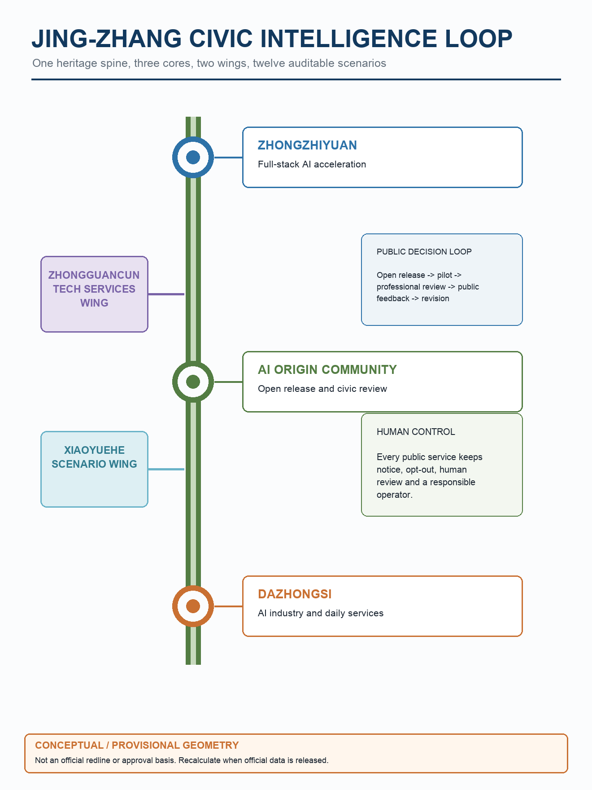
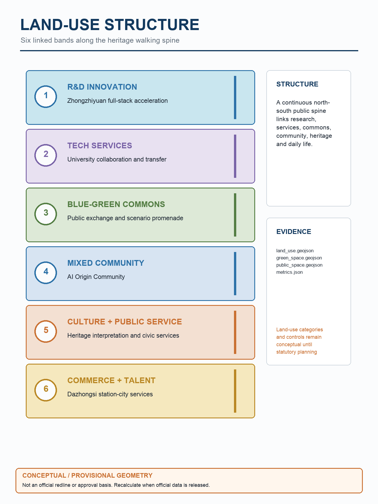
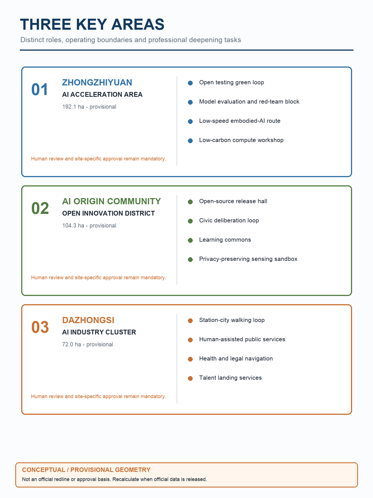
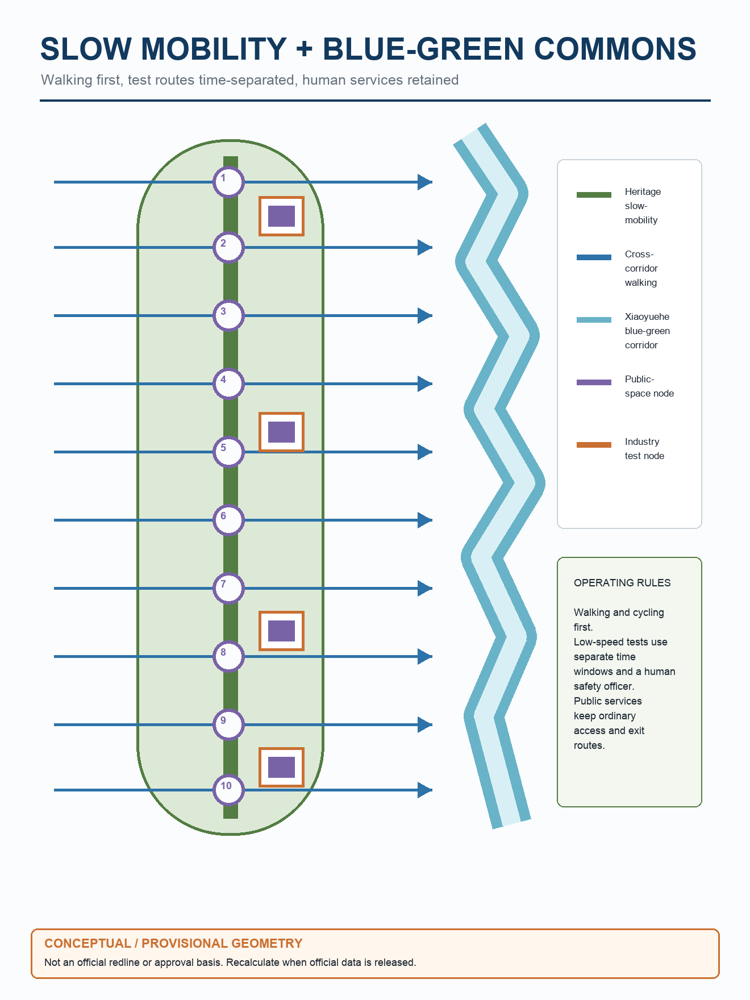
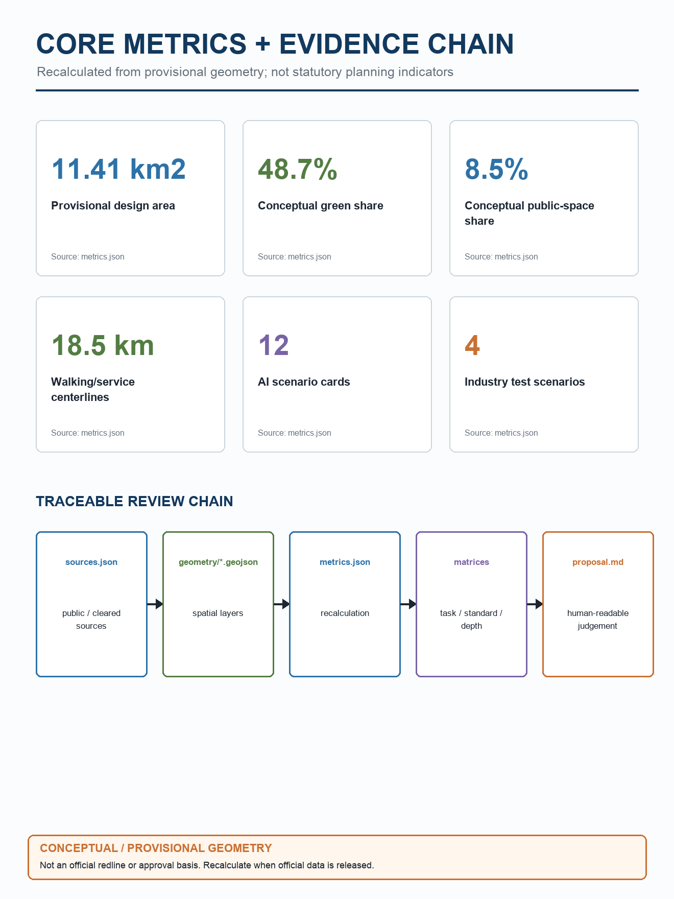

# Jing-Zhang Civic Intelligence Loop: Urban Design Proposal for the Centennial Jing-Zhang AI Innovation Belt

## Design Basis and Source Inventory

The proposal uses the repository's official announcement summary, cleared agent-facing taskbook, public source registry, professional standard snapshots, and provisional spatial data. The official announcement supports project name, scope levels, area values, and task requirements; the taskbook supports positioning, functions, scenario cards, branding, and long-term operation; provisional geometry is used only for generation, visualization, and intake self-check, not as an official redline, regulatory control, or approval basis [source:SRC-2026-BJ-GH-QUAL-PREANNOUNCEMENT] [source:SRC-2026-BJ-GH-QUAL-PREANNOUNCEMENT] [source:SRC-2026-0518-AGENT-OPEN-CALL-TASKBOOK] [source:SRC-2026-0518-AGENT-OPEN-CALL-TASKBOOK] [source:SRC-PROVISIONAL-BOUNDARIES-2026] [source:SRC-PROVISIONAL-BOUNDARIES-2026].

The submission separates the human reading layer from the machine-audit layer. The narrative explains design judgment, public value, scenario operation, and missing information; GeoJSON, metrics, and matrices provide recomputation and audit evidence [standard:PROJECT-OFFICIAL-ANNOUNCEMENT] [standard:PROJECT-AGENT-OPEN-CALL-TASKBOOK].

> Figure warning: all boundaries, nodes, areas and spatial relationships are provisional concepts, not official redlines, statutory plans or approval bases. Recheck them when official data is released.

## Three-Level Scope Framework

The framework uses coordinated research area, overall design area, and key detailed-design area. The 43.6 km2 coordinated research area frames regional industry strategy and future-city patterns; the 11.4 km2 overall design area organizes urban renewal, public space, slow mobility, services, and new infrastructure around the Jing-Zhang heritage park; the 368.4 ha key area focuses on Zhongzhiyuan, AI Origin Community, and Dazhongsi [metric:announced_overall_design_area_sqm] [data:geometry/key_areas.geojson#PROV-KEY-001] [depth:three_scope_framework].

The provisional boundary allows an agent to complete topology, metrics, diagrams, and offline review. It is not an official boundary. When official GIS/CAD/PDF boundaries arrive, all areas, ratios, building capacity, figures, and key-area strategies must be recalculated [data:geometry/site_boundary.geojson#PROV-SITE-001] [source:SRC-PROVISIONAL-BOUNDARIES-2026].

> Figure warning: all boundaries, nodes, areas and spatial relationships are provisional concepts, not official redlines, statutory plans or approval bases. Recheck them when official data is released.

## Coordinated Research-Area Industry and Future-City Strategy

The core concept is “Jing-Zhang Civic Intelligence Loop”. Jing-Zhang preserves the heritage and place identity; Civic Intelligence defines AI as a public capability rather than a closed automation system; Loop describes a repeatable cycle of open-source release, scenario validation, professional review, public feedback, and renewed release. The identity direction uses `JZ·AI LOOP`: a heritage rail curve crossing three nodes and an open protocol ring, with original diagrams and no uncleared people, corporate logos, or entertainment imagery [source:SRC-2026-0518-AGENT-OPEN-CALL-TASKBOOK] [depth:industry_future_city_strategy].

The spatial system is “one belt, three cores, two wings, twelve scenarios”: the Jing-Zhang heritage slow-mobility and public technology belt; Zhongzhiyuan full-stack acceleration, AI Origin Community, and Dazhongsi AI-native services; the Zhongguancun technology-service wing and Xiaoyuehe scenario-empowerment wing; and twelve scenario cards ranging from evaluation and embodied AI testing to public services and cultural interpretation [standard:PROJECT-AGENT-OPEN-CALL-TASKBOOK] [data:geometry/roads.geojson#RD-001].

Benchmark cases are used as pattern references, not rankings. Kendall Square, one-north and Station F suggest research-startup proximity, mixed talent services and recurring event rhythm [source:BENCHMARK-MIT-KENDALL-2026] [source:BENCHMARK-JTC-ONE-NORTH-2026] [source:BENCHMARK-STATION-F-2026].

Knowledge Quarter, Shenzhen Nanshan and Hangzhou Future Sci-Tech City suggest institution networks, fast scenario testing and platform-city integration [source:BENCHMARK-KNOWLEDGE-QUARTER-2026] [source:BENCHMARK-SHENZHEN-NANSHAN-2026] [source:BENCHMARK-HANGZHOU-FUTURE-CITY-2026]. These mechanisms are translated into a loop of open release, validation, professional review, public feedback and renewed release [depth:industry_future_city_strategy].

## Cross-Regional Collaboration Matrix

The corridor is conceived as a public interface between northern Haidian's innovation resources and other Beijing science and industry nodes, rather than a closed campus. Collaboration starts with verifiable exchanges, events and pilots; none of the links below claims a signed agreement.

| Partner | Exchange resource | Mobility or event interface | Suggested governance | Boundary |
|---|---|---|---|---|
| Beiwei Community | Resident needs, community services, ageing and accessibility feedback | Walking loop and community open days | Resident representatives join quarterly reviews | No administrative authority is implied |
| Future Science City | Research platforms, young talent and validation needs | Transit interchange study and joint release week | Project managers from both districts | No route or funding commitment |
| Huairou Science City | Major-science-facility needs, research outcomes and public science content | Forums and travelling exhibitions | Annual issue list and outcome follow-up | Research confidentiality review remains separate |
| Beijing E-Town | Robotics, intelligent manufacturing and industrialisation | Low-speed test handoff and supply-demand days | Separate test results from procurement eligibility | No procurement promise |
| Beijing-Tianjin-Hebei nodes | Universities, supply chains, scenarios and talent | Annual urban-intelligence week and cross-city online demos | Shared issue repository; independent local approval | Does not replace local planning or regulation |

## Innovation Ecosystem and Enabling Factors

The ecosystem follows a five-step chain: research, evaluation, release, conversion and public feedback. Zhongzhiyuan provides model, compute and test capacity; the AI Origin Community provides open release and public feedback; Dazhongsi supports talent life and industry services; the two wings connect professional services and public-space trials. Eight factors are managed through responsibility lists rather than a single assumed operator.

| Factor | Spatial carrier | Supply and operation | Verification |
|---|---|---|---|
| Land | Three provisional focus areas | Confirm title and compliance after official boundaries | Never infer ownership from provisional polygons |
| Space | Reused buildings, release hall, test loop and service hub | Start with light retrofit and shared booking | Fire, structure and accessibility review |
| Industry | Models, robotics, urban services and professional services | Match supply to a public problem list | Events do not replace market selection |
| Funding | Separate public service, research pilot and social cooperation accounts | Approve each pilot and cost method independently | No conceptual-stage monetary commitment |
| Talent | Universities, open-source groups, firms and international talent | Residencies, mentors and bilingual human desks | Fair participation and access |
| Compute | Campus compute and low-carbon dispatch research | Task-based access with energy and scope records | No control of critical systems |
| Data | Public, licensed and voluntarily submitted data | Field allowlist, shortest retention and human review | Source, licence and deletion record |
| Scenarios | Twelve cards and four industrial tests | Small pilot, baseline comparison and exit route | Safety, complaints, correction and professional review |

## Overall Design-Area Urban Renewal and Regulatory-Depth Urban Design

The overall design area is organized by a heritage slow-mobility loop, three AI industry-life nodes, and a metric dashboard. The loop carries public space, cultural interpretation, AI scenario experience, and micro-mobility; the nodes host R&D, testing, release, talent services, and life support; the dashboard keeps green space, public space, slow-mobility length, scenario cards, building capacity, and missing official controls visible. Because official FAR, height, density, redlines, and setbacks are missing, the capacity model is not an approval indicator [standard:MOHURD-CONTROL-DETAILED-PLANNING] [metric:official_far_height_density_controls] [depth:regulatory_depth_urban_design].

The land-use structure runs south to north from AI-native commerce and talent services to heritage civic services, AI Origin mixed innovation, blue-green public exchange, university-linked technology services, and full-stack AI acceleration. The structure is supported by land-use polygons, slow-mobility lines, green-space polygons, and public-space nodes rather than slogans alone [data:geometry/land_use.geojson#LU-001] [metric:land_use_area_by_code_sqm].

## Key-Area Detailed Design

Zhongzhiyuan is the northern engine for full-stack AI innovation and responsible AI governance. It contains an open testing green ring, model evaluation and red-team district, embodied AI low-speed validation line, low-carbon compute and governance workshops, and a mix of renovation and selective new-build space [data:geometry/key_areas.geojson#PROV-KEY-001] [data:geometry/buildings.geojson#BLD-007] [depth:three_key_area_detailed_design].

AI Origin Community is the public interface of the innovation ecosystem. It combines an open-source release hall, developer commons, civic intelligence forum, AI education living room, and multimodal public-space sandbox. All sensing or public data scenarios require notice, minimization, anonymization, human review, and an opt-out path [data:geometry/key_areas.geojson#PROV-KEY-002] [data:geometry/public_space.geojson#PS-002].

Dazhongsi is the AI-native lifestyle and station-city service entrance. It focuses on public AI assistance for navigation, legal and IP information, talent services, station micro-circulation, and intelligent commerce. The proposal does not infer land ownership, demolition, fire safety, utilities, or confirmed construction sequence [data:geometry/key_areas.geojson#PROV-KEY-003] [data:geometry/roads.geojson#RD-003].

> Figure warning: all three extents are provisional concept boundaries, not parcel redlines or construction limits. Recalculate areas after official GIS/CAD data is released.

## AI Innovation Ecosystem, Personas and AI+ Scenarios

The ecosystem connects producers who need evaluation and release channels, users who need understandable and human-backed services, and governance actors who need traceable indicators and boundaries. Six personas are covered: AI founders, open-source developers and university researchers, residents and elderly users, international AI talent and families, governance/professional reviewers, and investment or industry-service organizations [source:SRC-2026-0518-AGENT-OPEN-CALL-TASKBOOK] [depth:ai_scenarios_personas].

The package includes twelve readable scenario cards. Four of them are industry test or validation scenarios: model evaluation and safety red-team district, embodied AI last-100-meter validation, multimodal public-space sensing sandbox, and low-carbon compute / urban operation digital twin [metric:ai_scenario_card_count] [metric:industry_test_scenario_count].

## Scenario-Space-Operation Review Matrix

The `scenario_specs` section of `compliance_matrix.json` records node IDs, suggested operator, data fields and sources, retention, human review, stop conditions, complaint and correction path, safety plan, KPI and required reviews for all twelve scenarios. Every pilot starts with at least a four-week baseline unless an authority approves another method. A safety incident freezes the affected function and preserves an audit log for named human review.

| Scenario | Nodes | Operator and human fallback | Data, stop rule and KPI summary |
|---|---|---|---|
| SC-001 | PS-001 / PROV-KEY-001 | Campus plus university evaluators; two-person ranking review | Licensed test sets, 90-day default; stop on unlicensed data; reproducibility and appeal time |
| SC-002 | RD-004 / PROV-KEY-001 | Test unit plus independent safety officer | Logs 30 days; stop on boundary or braking failure; takeover time and conflicts |
| SC-003 | PS-002 / PROV-KEY-002 | Public-space operator plus data steward | Raw edge data discarded; stop on identifiable data; notice visibility and zero retention |
| SC-004 | PS-002 / PROV-KEY-002 | Community operator plus licence review | Versioned release archive; delist missing licences; reproducibility and licence coverage |
| SC-005 | PS-003 / PROV-KEY-003 | Public desk plus human service agent | Delete session by default; stop diagnostic output; handoff and older-user completion |
| SC-006 | PS-002 / PROV-KEY-002 | Education provider plus teacher review | Delete by term; stop without guardian consent; teacher coverage and correction time |
| SC-007 | RD-002 / PROV-KEY-002 | Tech service plus licensed professional | No anonymous-session retention; stop case conclusions; source and human handoff rate |
| SC-008 | RD-001/002/003 | Transport professionals retain approval | Survey raw data 90 days; stop on weak samples; conflicts and accessible-gap closure |
| SC-009 | PS-002 / PS-003 | Talent service plus bilingual human desk | Delete non-handoff sessions; stop uncertain translation; bilingual availability |
| SC-010 | PS-004 / RD-001 | Independent moderator plus source-text comparison | Contacts 30 days; stop distorted summaries; traceability and correction time |
| SC-011 | RD-001 / PS-004 | Historian and language review | Location remains on device; stop unclear history or rights; sources and alternatives |
| SC-012 | PROV-KEY-001 / RD-004 | Facility operator plus independent audit | Minute data 30 days; stop critical-system contact; error and override events |

## Land Use, Building Scale and Retain/Renovate/New-Build Logic

The design uses a complete conceptual land-use partition rather than disconnected patches. Building footprints and floor counts are representative capacity models used to explain retain, renovate, and selective new-build logic. The proposal does not make demolition, property, engineering, or approved construction claims because surveyed buildings, ownership, structural safety, utilities, and statutory planning conditions are missing [data:geometry/buildings.geojson#BLD-001] [data:geometry/land_use.geojson#LU-006] [metric:total_floor_area_sqm_design_model] [standard:MOHURD-CONTROL-DETAILED-PLANNING] [depth:land_use_building_scale].

## Mobility, Rail, Municipal and Public Services

The mobility strategy makes the Jing-Zhang heritage slow-mobility loop the default public interface. Dazhongsi provides station-city micro-circulation, AI Origin provides an east-west university connector, and Zhongzhiyuan provides a testing-service loop. Municipal and new infrastructure should combine stable traditional services, edge compute, privacy-preserving data handling, and auditable scenario operations rather than lock the city into one platform [data:geometry/roads.geojson#RD-001] [depth:mobility_municipal_public_service].

AI public services must retain human fallbacks. Medical navigation, legal information, talent services, education assistance, traffic suggestions, and public-space optimization cannot replace professional service or administrative approval [source:SRC-2026-0518-AGENT-OPEN-CALL-TASKBOOK] [standard:PROJECT-AGENT-OPEN-CALL-TASKBOOK].

> Figure warning: centre lines and nodes are conceptual. They are not road redlines, traffic approvals or engineering-feasibility findings. Transport, river, flood and utility reviews remain required.

## Blue-Green Space, Public Space and Urban Character

The blue-green system uses the Jing-Zhang slow green spine, Xiaoyuehe-side ecological buffer, and Zhongzhiyuan open testing green ring to create a public-space network that is walkable, legible, and participatory. Green-space and public-space metrics describe design intent only; they are not approved statutory ratios [data:geometry/green_space.geojson#GS-001] [metric:green_ratio] [standard:MOHURD-URBAN-DESIGN-MEASURES].

Three AI pilgrimage and honor-display nodes are proposed: the Zhongzhiyuan model evaluation and safety red-team district, the AI Origin open-source release hall, and the Dazhongsi intelligent living room. They must use original identity assets and cleared visual materials, and must not be described as approved construction [depth:bluegreen_public_space_character] [data:geometry/public_space.geojson#PS-001].

## Public-Space Component Library and Recognition System

| Component | Basic parameter and use | Operation requirement |
|---|---|---|
| Walking information post | Chinese/English core content, wheelchair-reachable information, replaceable panel | Human inspection and paper fallback |
| Movable shaded seat | Back and armrests; wheelchair bay outside the clear path | Heat, post-rain and night inspection |
| Pilot notice | Named operator, fields, dates, exit and complaint route | Remove or update when a pilot closes |
| Edge-sensing box | Approved field-allowlist devices in a serviceable shell | No face recognition; auditable deletion |
| Rain garden and accessible boardwalk | Continuous accessible bypass with shade, detention and habitat | River, flood and ecology review first |
| Human service window | Non-digital alternative for health, legal, talent and complaint services | Open whenever the automated service operates |

Recognition is not a permanent leaderboard. A replaceable contribution wall records project, contributors, licence, reproduction link, review date and corrections across model, data, scenario, public-service and community categories. Commercial rankings disclose method and interests. Source, licence or serious safety disputes pause display before review.

## Brand Identity and International Communication

The primary mark is `assets/brand/jz-ai-loop.svg` and the monochrome version is `assets/brand/jz-ai-loop-mono.svg`. The open ring represents continued revision and the heritage line connects three nodes. The fixed bilingual lockup is `京张智廊·人本智能环 / JING-ZHANG CIVIC INTELLIGENCE LOOP`. Minimum full-lockup width is 240 px digital or 42 mm print; symbol-only width is 40 px or 10 mm; clearspace is one node diameter. Colours are heritage navy `#12395E`, civic green `#537D43` and service orange `#C97032`, with a monochrome fallback. Do not close the ring, rename the project, add corporate logos or claim official adoption.

International lead copy: **A civic innovation corridor where research, public life and accountable urban trials meet.** Supporting copy: **Three provisional focus areas are connected by the Jing-Zhang heritage spine. Every trial names its operator, data boundary, human review and exit condition.** Public pages must state that the work remains a submission subject to professional development.

## Renewal Project List, Policy Suggestions and Phasing

Near-term work should focus on low-risk prototypes: Dazhongsi station-city circulation, public AI inquiry corners, Jing-Zhang cultural guidance, open-source release events, and slow-mobility gap repair. Mid-term work can build the AI Origin Community, civic forum, public-service pilots, and public-space sensing sandbox. Long-term work can deepen Zhongzhiyuan acceleration, global AI governance forums, developer residency, and low-carbon compute / urban operation digital twins [data:geometry/phasing.geojson#PH-001] [depth:renewal_phasing_operations].

The long-term operating rhythm includes weekly open-source release nights, monthly scenario validation open days, quarterly AI urban governance roundtables, and an annual Jing-Zhang Global Agent Urban Design and AI Safety Conference. Communications must distinguish submitted, reviewed, selected, and implemented status [source:SRC-2026-0518-AGENT-OPEN-CALL-TASKBOOK] [standard:PROJECT-AGENT-OPEN-CALL-TASKBOOK].

## Event-to-Conversion Path and Implementation Ledger

Attendance is not the conversion outcome. Each event follows: publish the problem, invite responses, screen licence and safety, run a closed test, make a public-readable demonstration, obtain professional review, make a procurement or public-service decision, and review operations. Failed gates return a project to the issue repository. The `implementation_ledger` section of `design_depth_matrix.json` records owner suggestions, collaborators, prerequisites, cost method, pilot period, procurement and operations, stage gates, exit conditions and baselines for six implementation units.

| Unit | Suggested owner | Cost band and pilot | Gate / exit |
|---|---|---|---|
| IMP-01 Dazhongsi circulation and human desk | Local transport or public-space operator | M; 3 months incl. 4-week baseline | Safety/accessibility review; exit if conflicts rise |
| IMP-02 Release hall and deliberation loop | Community or public-cultural operator | S; 12 weekly sessions | Rights, reproduction and correction; delist unclear sources |
| IMP-03 Evaluation and low-speed test | Campus operator; tester directly liable | M; 2 months closed + 1 limited | Takeover drill and independent review; stop override or safety event |
| IMP-04 Xiaoyue River component sample | Park or public-space operator | S; warm/cold-season review | River, flood and maintenance review; remove if egress is blocked |
| IMP-05 Talent and language service | Talent service plus human community desk | S; 8 weeks | Terminology and representative-user test; stop if human route fails |
| IMP-06 Read-only low-carbon twin | Campus facility operator | L; 6 months read-only | Meter calibration and audit; stop unauthorised writes |

Cost bands mean temporary fit-out and staff time (S), retrofit or multi-system integration (M), and public-realm or infrastructure work requiring separate approval (L). They are not monetary claims. Approved scope and professional lifecycle costing are required before budgeting.

## Indicators, Area Recalculation and Compliance Matrix

The provisional design area is about 11,412,825 sqm, close to the announced 11.4 km2 but not an official redline. Conceptual green space is about 5,554,817 sqm, green ratio about 48.7%; conceptual public space is about 969,786 sqm, public-space ratio about 8.5%; slow/service centerlines total about 18,540 m. The building capacity model and FAR are representative only [metric:site_area_sqm] [metric:green_ratio] [metric:floor_area_ratio_design_model].

Task coverage, professional standards, and design-depth evidence are recorded in the three matrix files. The next iteration should prioritize official boundary and regulatory controls before precise area and building-scale recalculation [depth:metrics_recalculation] [standard:MNR-LAND-USE-CLASSIFICATION-GUIDE].

> Figure warning: all values come from provisional boundaries and concept layers. They are not official redlines, approved indicators or investment bases. Run the same chain again after official boundaries are released.

## Accessibility, Multilingual and Bilingual Equivalence Review

HTML uses local assets, image alternative text and a keyboard-readable document order. Boards use high-contrast headings, explicit warnings and cues that do not depend on colour alone. Professional-development targets include Chinese/English core public information, priority human handoff for health and legal services, continuous wheelchair routes, completable older-user tasks, and at least 4.5:1 contrast for key text. General feedback receives a response within five working days; safety incidents are handled the same day; distorted summaries and privacy reports receive a response within three working days.

The submitter manually compared sections, metrics, five figure pairs and four PDF/HTML deliverables. The records are `bilingual_equivalence` and `accessibility_audit` in `self_check.json`. This is not certified translation or representative disabled-user testing. Professional language editors, older people, wheelchair users and people with visual or hearing impairments must complete task-based tests before implementation.

## Risk, Copyright and Compliance Statement

The package does not use secret maps, commercial map tiles, private spreadsheets, corporate logos, portraits or external renderings. Chinese concept boards were generated for this submission and supplied by the participant; download-origin metadata is available, but the PNG files do not record a specific model version. English figures and boards were procedurally built from local data and basic geometry. Font files are not redistributed, and external cases are summarised without copying page images or prose. The asset-by-asset authorship, tools, inputs, rights status and limits are recorded in `report/copyright_statement.md` [depth:risk_copyright_legal_boundaries].

The main risk is misreading a concept as an official decision. Therefore, the proposal repeatedly states that all spatial moves are conceptual suggestions for professional deepening and do not replace statutory planning, government approval, construction commitment, investment commitment, or engineering feasibility review [source:SRC-2026-0518-AGENT-OPEN-CALL-TASKBOOK] [standard:PROJECT-AGENT-OPEN-CALL-TASKBOOK].

## References

1. Official prequalification announcement for the Centennial Jing-Zhang AI Innovation Belt Urban Design International Call, 2026-05-09.
2. Repository agent-facing taskbook summary, 2026-05-18.
3. Repository provisional boundaries GeoJSON, 2026-06-05.
4. Beijing Municipal Science and Technology Commission / Zhongguancun Administrative Committee: Three Areas and Two Wings AI cluster context, 2026-04-03.
5. Haidian District Government: 1+X+1 modern industrial system context, 2026-03-02.
6. MOHURD Urban Design Measures.
7. MOHURD Regulatory Detailed Planning Measures.
8. MNR land-use classification guide.
