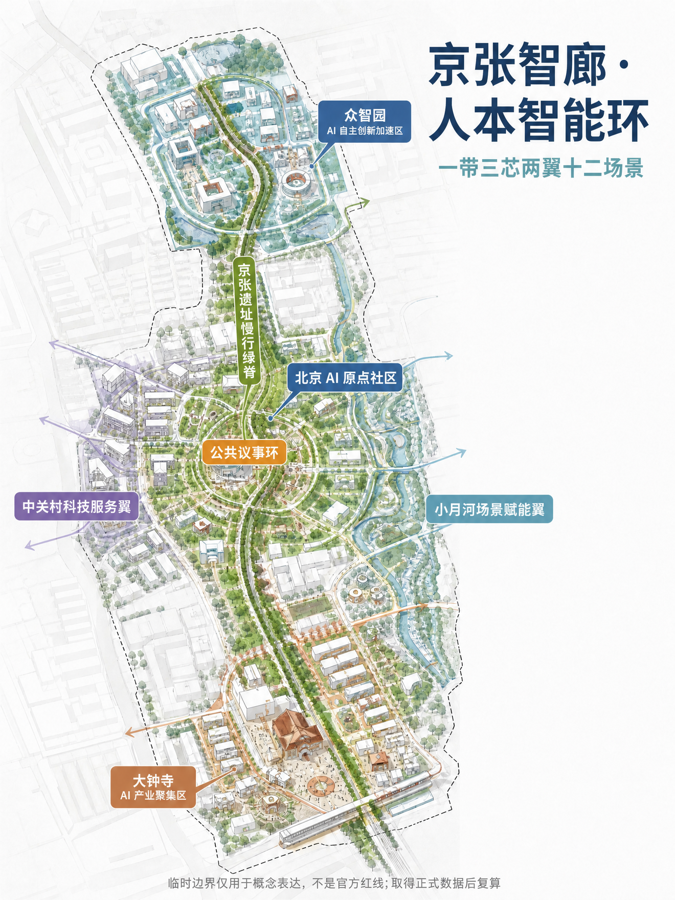
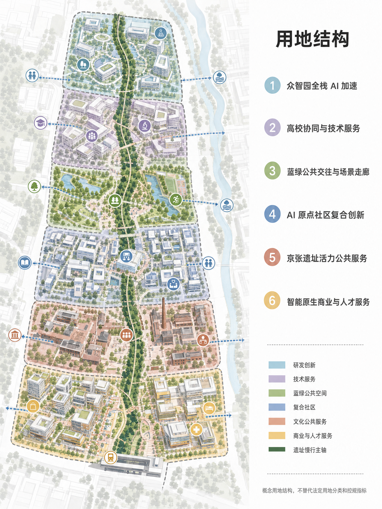
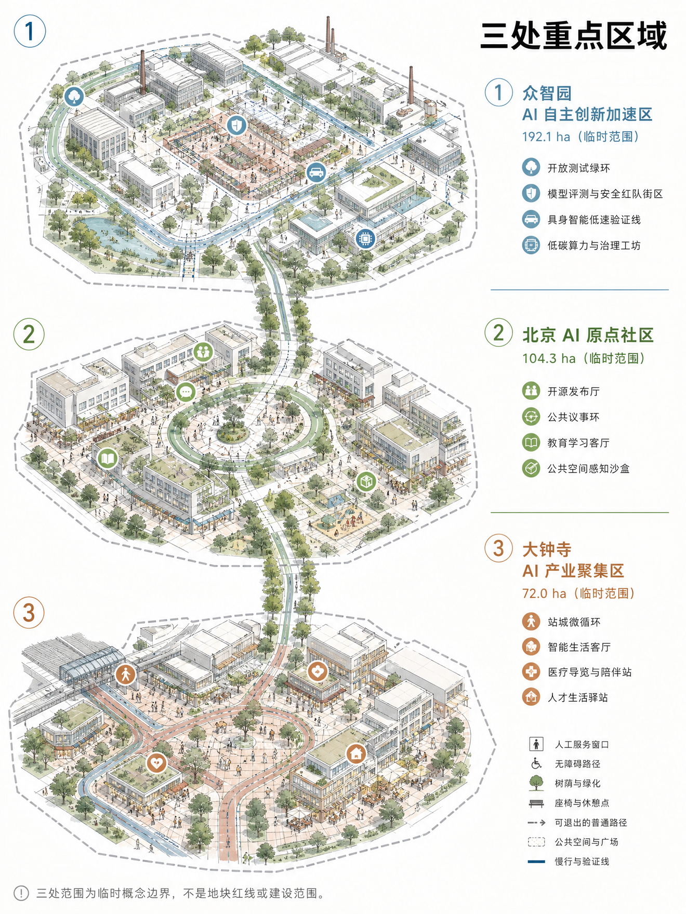
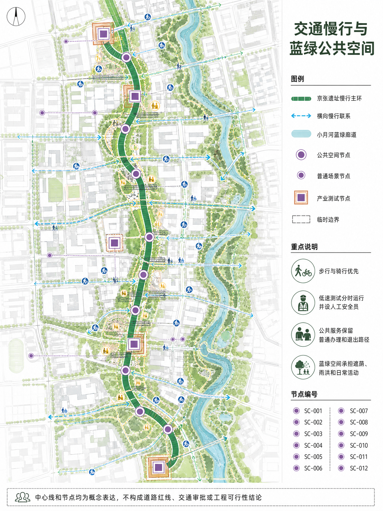
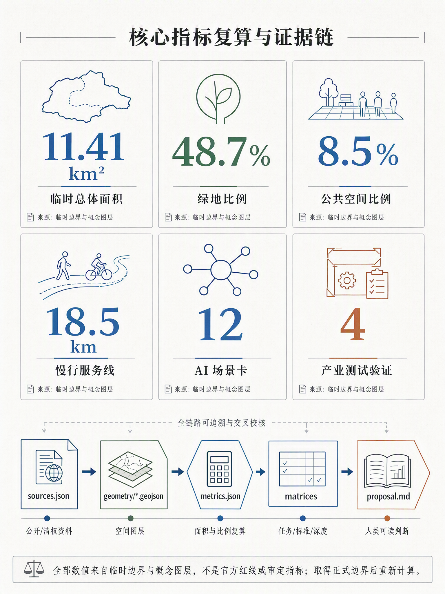

# 京张智廊·人本智能环：百年京张AI创新带城市设计方案

## 设计依据与资料清单

本方案以“百年京张AI创新带城市设计国际方案征集”为项目对象，采用仓库资料包中的官方公告、面向智能体任务书、公开来源登记表、专业标准快照和临时粗略空间数据作为依据。公告可用于项目名称、三层范围、面积值与任务要求，面向智能体任务书可用于三大定位、五大功能、场景卡、品牌与长期运营要求；临时边界只用于生成、展示和 intake 自检，不作为正式红线、控规条件或审批依据 [source:SRC-2026-BJ-GH-QUAL-PREANNOUNCEMENT] [source:SRC-2026-0518-AGENT-OPEN-CALL-TASKBOOK] [source:SRC-PROVISIONAL-BOUNDARIES-2026]。

我对方案采取“两层证据”写法：正文给规划专业人员和公众阅读，解释空间判断、公共价值、场景运营和待补资料；GeoJSON、metrics 与三类矩阵承担机器审查和复算。所有使用的公开或清权资料进入 `sources.json`，所有官方缺口进入 `assumptions.json`，所有指标进入 `metrics.json`，避免用漂亮图面替代可复核数据 [standard:PROJECT-OFFICIAL-ANNOUNCEMENT] [standard:PROJECT-AGENT-OPEN-CALL-TASKBOOK]。

> 图面警示：本图中的边界、节点、面积和空间关系均为临时概念表达，不是官方红线、法定规划或审批依据；取得正式数据后须重新校核。

## 三层范围工作框架

方案按“统筹研究范围 - 总体设计范围 - 重点区域范围”三层推进。统筹研究范围约 43.6 平方公里，负责产业生态、未来城市形态与区域协同；总体设计范围约 11.4 平方公里，负责京张遗址公园周边 1-2 公里的城市更新、公共空间、慢行、交通、服务设施和新型基础设施组织；重点区域约 368.4 公顷，聚焦众智园 AI 自主创新加速区、北京 AI 原点社区和大钟寺 AI 产业聚集区三处可深化片区 [metric:announced_overall_design_area_sqm] [data:geometry/key_areas.geojson#PROV-KEY-001] [depth:three_scope_framework]。

临时边界的作用是让智能体能够先完成设计结构、图层拓扑、指标复算和可视化，但它不等于官方红线。取得官方 GIS/CAD/PDF 边界后，需要重算 site area、三处重点区面积、绿地率、公共空间比例、建筑密度、FAR 以及全部图件。当前图面中的虚线外框、矩形重点区和面积值均以“待正式数据补齐”方式表达 [data:geometry/site_boundary.geojson#PROV-SITE-001] [source:SRC-PROVISIONAL-BOUNDARIES-2026]。

> 图面警示：本图中的边界、节点、面积和空间关系均为临时概念表达，不是官方红线、法定规划或审批依据；取得正式数据后须重新校核。

## 统筹研究范围产业与未来城市研究

本方案把百年京张 AI 创新带定位为“京张智廊·人本智能环”。“京张”保留历史与地理识别，“智廊”强调模型、数据、算力、场景和治理的连续走廊，“人本智能环”明确 AI 城市不是替代人的自动化机器，而是围绕公共利益、开发者创造力、居民日常和专业治理形成的可迭代环路。Logo 方向建议使用 `JZ·AI LOOP`：以一条线性铁路遗址曲线穿过三个圆形节点，外圈为开放协议环，色彩采用深蓝、银灰和暖白，避免使用未清权人物、企业标识或娱乐化符号 [source:SRC-2026-0518-AGENT-OPEN-CALL-TASKBOOK] [depth:industry_future_city_strategy]。

空间结构概括为“一带三芯两翼十二场景”。一带是京张遗址公园慢行与公共技术展示带；三芯是众智园全栈 AI 加速、AI 原点社区、大钟寺智能原生生活与产业服务；两翼是中关村科技服务翼与小月河场景赋能翼；十二场景把模型评测、具身智能、公共空间感知、教育、医疗、法律、交通、人才服务和文化导览落到可审查的节点与运营边界。该结构回应三大定位“百年京张文化带、都市 AI 生活体验带、AI 融合创新带”，也回应五大功能“全栈自主创新、世界级生态、AI+场景、活力城市、AI 治理话语权” [standard:PROJECT-AGENT-OPEN-CALL-TASKBOOK] [data:geometry/roads.geojson#RD-001]。

全球案例不作为事实排名，只作为可验证的模式库。Kendall Square、one-north 和 Station F 分别提示科研创业的步行邻近、研发与人才生活混合、稳定活动节奏三种机制 [source:BENCHMARK-MIT-KENDALL-2026] [source:BENCHMARK-JTC-ONE-NORTH-2026] [source:BENCHMARK-STATION-F-2026]。

Knowledge Quarter、深圳南山和杭州未来科技城分别提示知识机构网络、快速场景验证、平台企业与城市服务复合三种机制 [source:BENCHMARK-KNOWLEDGE-QUARTER-2026] [source:BENCHMARK-SHENZHEN-NANSHAN-2026] [source:BENCHMARK-HANGZHOU-FUTURE-CITY-2026]。对应转译不是复制形态，而是形成“开源发布 - 场景验证 - 专业复核 - 公共反馈 - 再发布”的城市创新操作系统 [depth:industry_future_city_strategy]。

| 案例类型 | 可借鉴机制 | 转译到京张智廊 |
|---|---|---|
| Kendall Square / MIT 周边 | 科研-创业-城市生活高密耦合 | 形成“实验室-孵化-公共街区”的短链路 |
| Singapore one-north | 研发园区与公共生活混合 | 把园区运营、公共交通和人才生活绑定 |
| Paris Station F | 大型创业社区与活动品牌 | 把创业服务、发布活动和全球传播做成固定节奏 |
| London Knowledge Quarter / King’s Cross | 知识机构网络与城市更新 | 强调机构联盟、步行街区和历史空间再利用 |
| Shenzhen Nanshan 高新片区 | 高密产业网络与快速产品化 | 强调产业链邻近与场景试验速度 |
| Hangzhou Future Sci-Tech City | 平台企业、科研和生活配套共生 | 强调数字产业与城市生活服务融合 |

## 跨区域协同矩阵

京张智廊不以封闭园区自居，而是承担海淀北部创新资源与北京国际科技创新中心各节点之间的公共接口。协同先从可核验的活动、服务和试点交换做起，不把概念联系写成已签约合作。

| 协同对象 | 可交换资源 | 交通与活动接口 | 建议治理机制 | 边界 |
|---|---|---|---|---|
| 北纬社区 | 居民需求、社区服务、适老与无障碍反馈 | 慢行主环、社区开放日 | 社区代表进入季度复盘 | 不推定行政授权 |
| 未来科学城 | 科研平台、青年人才、技术验证需求 | 轨道接驳研究、联合发布周 | 双园区项目经理制 | 不承诺固定线路和资金 |
| 怀柔科学城 | 大科学装置需求、科研成果与科普内容 | 专题论坛、成果巡展 | 年度议题清单和成果回访 | 不代替科研保密审查 |
| 北京经开区 | 机器人、智能制造与产业化能力 | 低速验证成果对接、供需日 | 测试结果与采购资格分离 | 不构成采购承诺 |
| 京津冀创新节点 | 高校、产业链、场景和人才网络 | 年度城市智能场景周、跨城线上路演 | 共同问题库、各地独立审批 | 不替代属地规划和监管 |

## 创新生态图谱与要素保障

生态图谱按“研发源头—评测验证—发布交流—产业转化—公共反馈”组织。众智园提供模型、算力与验证条件，AI 原点社区承担开源发布和公众反馈，大钟寺承接人才生活与产业服务，两翼分别连接中关村专业服务和小月河公共场景。八类要素不预设单一运营商，采用责任清单管理。

| 要素 | 空间载体 | 供给与运营建议 | 核验点 |
|---|---|---|---|
| 土地 | 三处临时重点区 | 取得正式边界后再做权属与合规核查 | 不以临时 polygon 推断权属 |
| 空间 | 保留建筑、发布厅、测试绿环、人才驿站 | 先轻改造和共享预约，再评估永久建设 | 消防、结构、无障碍 |
| 产业 | 模型、具身智能、城市服务和科技服务 | 以问题清单组织供需对接 | 不以活动结果替代市场选择 |
| 资金 | 公共服务、科研试点、社会合作分账 | 每个试点单独立项和成本复核 | 不在概念阶段承诺金额 |
| 人才 | 高校、开源社区、企业和国际人才 | 驻留、导师、双语人工窗口 | 参与公平与服务可达 |
| 算力 | 园区算力与低碳调度研究 | 按任务授权、记录能耗和使用边界 | 不接管关键设施 |
| 数据 | 公开、授权和自愿提交数据 | 字段白名单、最短留存、人工复核 | 来源、许可、删除记录 |
| 场景 | 12 张场景卡、4 类产业验证 | 小范围试点、基线比较、随时退出 | 安全、投诉、纠错和专业审查 |

## 总体设计范围城市更新与控规深度城市设计

总体设计范围采用“遗址公园慢行主环 + 三处 AI 产业生活节点 + 可复核指标仪表盘”的城市更新框架。慢行主环优先承接公共空间、文化导览、AI 场景体验和交通微循环；节点内部组织研发、测试、发布、人才服务和生活配套；指标仪表盘把绿地、公共空间、慢行长度、场景卡、建筑容量模型和待补控规条件同步展示。由于正式 FAR、高度、建筑密度、道路红线和退线条件尚未公开，本方案不把建筑容量模型写成审批指标 [standard:MOHURD-CONTROL-DETAILED-PLANNING] [metric:official_far_height_density_controls] [depth:regulatory_depth_urban_design]。

用地组织不是单一产业园，而是从南到北形成“智能原生商业与人才服务 - 京张遗址活力公共服务 - AI 原点社区复合创新 - 蓝绿公共交往与场景走廊 - 高校协同与技术服务 - 众智园全栈 AI 加速”的连续结构。每一段都由 `land_use.geojson` 分区、`roads.geojson` 慢行/服务线、`green_space.geojson` 蓝绿廊道和 `public_space.geojson` 公共节点支撑，避免只喊“活力带”而没有可检查的空间关系 [data:geometry/land_use.geojson#LU-001] [metric:land_use_area_by_code_sqm]。

## 重点区域详细设计

众智园 AI 自主创新加速区承担“全栈 AI 自主创新体系”和“AI 治理全球话语权”的北部引擎。空间上以开放测试绿环、模型评测与安全红队街区、具身智能低速验证线、低碳算力与治理工坊构成闭环；建筑上以保留改造与少量新建共同承接孵化器、评测中心和国际工作坊；运营上优先引入开源模型评测、数据治理、算力调度、Agent 资产库和AI安全审计，不把任何测试写成已获许可的实际运行 [data:geometry/key_areas.geojson#PROV-KEY-001] [data:geometry/buildings.geojson#BLD-007] [depth:three_key_area_detailed_design]。

北京 AI 原点社区承担“世界级 AI 创新生态”的公共界面。它不是封闭展厅，而是开发者、居民、学生、投资、媒体和城市治理者都能进入的开源发布与公共议事社区。核心空间包括 AI 原点发布厅、开源社区楼、京张 AI 公共议事环、AI+教育学习客厅和多模态公共空间感知沙盒。所有公共感知和数据展示都应采用告知、最小化采集、匿名化、人工复核和退出机制 [data:geometry/key_areas.geojson#PROV-KEY-002] [data:geometry/public_space.geojson#PS-002]。

大钟寺 AI 产业聚集区承担“智能原生新业态”和站城生活服务入口。这里面向通勤者、居民、外籍人才和小微企业，组织 AI+医疗导览、AI+法律与知识产权问询、人才生活 AI 管家、站城微循环和智能商业服务。大钟寺片区只提出站城界面、公共服务和智能生活业态的概念更新，不推断权属、征拆、消防、市政或具体建设时序 [data:geometry/key_areas.geojson#PROV-KEY-003] [data:geometry/roads.geojson#RD-003]。

> 图面警示：三处范围均为临时概念边界，不是地块红线或建设范围，面积值须在正式 GIS/CAD 数据发布后复算。

## AI 创新生态、人才画像与 AI+ 场景

本方案把 AI 生态拆成三类人群关系：生产者需要低摩擦的模型、数据、评测和发布；使用者需要可理解、可退出、有人工兜底的公共服务；治理者需要可追溯的指标、边界和反馈链。六类画像覆盖 AI 创业团队、开源开发者/高校研究者、居民与老年用户、国际 AI 人才及家属、城市治理与专业审查者、投资/产业服务机构 [source:SRC-2026-0518-AGENT-OPEN-CALL-TASKBOOK] [depth:ai_scenarios_personas]。

| 画像 | 名称 | 核心需求 |
|---|---|---|
| P-01 | AI创业团队负责人 | 需要低成本评测、算力资源对接、合规咨询和发布舞台。 |
| P-02 | 开源开发者/高校研究者 | 需要可步行到达的协作空间、数据/模型复现实验和跨校社群。 |
| P-03 | 片区居民与老年用户 | 需要不被技术排斥的公共服务、安静可达的绿地和人工兜底窗口。 |
| P-04 | 国际AI人才及家属 | 需要双语服务、短住配套、教育医疗导航和可信公共空间。 |
| P-05 | 城市治理与专业审查者 | 需要指标、场景数据、公众反馈和安全边界可追溯。 |
| P-06 | 投资/产业服务机构 | 需要项目发现、知识产权、法务、融资和产业转化接口。 |

十二张 AI 场景卡如下。每张卡都只作为概念建议，落地前需要明确运营主体、数据来源、隐私边界、人工复核、安全预案和专业审批；其中 SC-001、SC-002、SC-003、SC-012 属于产业测试验证场景 [metric:ai_scenario_card_count] [metric:industry_test_scenario_count]。

| 场景 | 位置 | 服务对象 | 类型 | 运行边界 |
|---|---|---|---|---|
| SC-001 模型评测与安全红队街区 | 众智园 | AI企业、监管观察员、开源社区 | 产业测试验证 | 以可复现实验室、线下评测厅和公开榜单发布空间承载模型安全、鲁棒性、版权与偏见测试；数据脱敏，结果经人工复核后公开摘要。 |
| SC-002 具身智能最后一百米验证线 | 众智园-京张慢行主环 | 机器人团队、园区运营、行人 | 产业测试验证 | 在限定时段和标识清晰的低速路径测试配送、巡检和无障碍协助，设置人工安全员和可退出通道。 |
| SC-003 多模态公共空间感知沙盒 | AI原点社区 | 城市治理者、居民、研究者 | 产业测试验证 | 以边缘感知、隐私计算和公开告示测试人流热舒适、照明和活动组织，不做个人身份追踪。 |
| SC-004 AI原点开源发布厅 | AI原点社区 | 开发者、创业者、投资与媒体 | 公共展示 | 将模型、工具链、数据集和场景验证结果以可追溯展陈方式发布，形成周更开放路演。 |
| SC-005 AI+医疗导览与陪伴站 | 大钟寺-社区服务节点 | 老年居民、通勤者、医疗服务志愿者 | 公共服务 | 只做就医流程、导诊和预约信息协助，明确不替代诊断；保留人工窗口和志愿者。 |
| SC-006 AI+教育自适应学习客厅 | AI原点社区 | 学生、家长、教师、公益组织 | 公共服务 | 提供学习路径建议和学习资源匹配，未成年人使用需监护和教师复核。 |
| SC-007 AI+法律与知识产权问询角 | 中关村科技服务翼 | 创业团队、居民、法务机构 | 公共服务 | 提供公开法条检索、材料清单和知识产权流程说明，明确专业意见由执业人员确认。 |
| SC-008 AI交通慢行优先策略台 | 京张慢行主环 | 通勤者、骑行者、交通管理者 | 治理辅助 | 汇聚匿名流量、冲突点和无障碍反馈，提出信号优化和断点修补建议，不直接替代交通审批。 |
| SC-009 人才生活AI管家驿站 | 大钟寺与AI原点社区 | 外籍人才、青年工程师、家属 | 生活服务 | 整合租住、社群、活动和公共服务导航，所有个人数据最小化采集并可人工办理。 |
| SC-010 京张AI公共议事环 | 遗址公园中段 | 居民、企业、规划师、智能体 | 公共参与 | 以开放听证、方案对比、智能体共创和专业复核形成持续反馈，不把投票结果等同审批。 |
| SC-011 百年京张AI文化导览 | 全线慢行系统 | 游客、学生、国际会议参与者 | 文化叙事 | 讲述京张铁路、中关村创新与AI新文化，用本地生成图文和开源语音导览，避免未授权历史影像。 |
| SC-012 低碳算力与城市运行数字孪生 | 众智园-小月河翼 | 园区运营者、能源服务商、研究者 | 产业测试验证 | 以概念级能耗、热环境和公共空间使用数据进行低碳运营推演，正式接入需能源与数据合规审查。 |

## 场景—空间—运营审查矩阵

12 个场景的节点编号、建议运营主体、数据字段与来源、留存期限、人工复核、停止条件、投诉纠错、安全预案、KPI 和前置审查已逐项写入 `compliance_matrix.json` 的 `scenario_specs`。所有试点默认至少先做 4 周基线；涉及安全的事件立即冻结相关功能、保全日志并由责任主体复核。

| 场景 | 节点 | 运营与人工兜底 | 数据、停止条件与 KPI 摘要 |
|---|---|---|---|
| SC-001 | PS-001 / PROV-KEY-001 | 园区+高校评测；双人复核榜单 | 授权测试集，默认90天；未授权数据即停；看复现率与申诉时效 |
| SC-002 | RD-004 / PROV-KEY-001 | 测试单位+独立安全员 | 运行日志30天；越界、制动失效即停；看接管时间与冲突事件 |
| SC-003 | PS-002 / PROV-KEY-002 | 空间运营+数据责任人 | 端侧原始数据即弃；出现可识别信息即停；看告示和零留存 |
| SC-004 | PS-002 / PROV-KEY-002 | 社区运营+许可证人工审核 | 发布档案版本化；许可缺失即下架；看复现率与许可完整率 |
| SC-005 | PS-003 / PROV-KEY-003 | 公共服务站+人工坐席 | 会话默认即删；输出诊断即停；看转人工和老年用户完成率 |
| SC-006 | PS-002 / PROV-KEY-002 | 教育机构+教师复核 | 学期后删除；监护同意缺失即停；看教师复核和纠错时长 |
| SC-007 | RD-002 / PROV-KEY-002 | 科技服务+执业人员 | 匿名问询不保存；个案结论即停；看来源覆盖和转人工率 |
| SC-008 | RD-001/002/003 | 交通专业团队人工审批 | 调查原始数据90天；样本不足即停；看冲突点与无障碍断点 |
| SC-009 | PS-002 / PS-003 | 人才服务+双语人工窗口 | 未转人工会话即删；译文不确定即停；看双语可用率 |
| SC-010 | PS-004 / RD-001 | 独立主持+原文对照 | 联系方式30天；摘要失真即停；看原文追溯和纠错时间 |
| SC-011 | RD-001 / PS-004 | 文史顾问人工审校 | 位置端侧不留存；史实或版权不清即停；看来源和替代内容 |
| SC-012 | PROV-KEY-001 / RD-004 | 设施运营+独立审计 | 分钟数据30天；触及关键设备即停；看误差和越权事件 |

## 用地、建筑规模与拆改留方案

用地布局采用完整分区，而不是零散贴片。六类概念用地从南到北依托站城入口、遗址公共服务、AI 原点社区、蓝绿公共交往、高校服务和众智园加速形成连续链路。建筑层面只生成代表性建筑 footprint 与楼层容量模型，用于表达“保留激活、改造提升、少量新建”的策略；由于没有现状建筑测绘、权属、结构安全、市政管线或控规指标，本方案不提出征拆结论和确认建设规模 [data:geometry/buildings.geojson#BLD-001] [metric:total_floor_area_sqm_design_model] [standard:MOHURD-CONTROL-DETAILED-PLANNING]。

拆改留逻辑是：靠近遗址公园和社区服务的建筑优先保留激活，承接公共服务、文化导览和人才生活；靠近三处重点区核心节点的既有产业空间优先改造提升，承接开源社区、评测工坊和技术服务；少量新建只用于补足发布、测试、公共服务和国际活动所需的复合空间。正式实施前必须由专业团队以权属、结构、消防、市政、交通和法定规划条件重新校核 [depth:land_use_building_scale] [data:geometry/land_use.geojson#LU-006]。

## 交通、轨道、市政与公共服务设施

交通策略不是增加机动车通行能力，而是把遗址公园慢行主环作为创新带的默认公共界面。南端大钟寺形成站城微循环，中段 AI 原点形成东西向高校服务连接，北端众智园形成测试服务环；慢行主环串联发布、评测、公共议事、文化导览和绿色空间。市政与新基建建议采用“传统设施稳定兜底 + 端侧算力与隐私计算可插拔 + 场景数据可审计”的组合，不以单一平台锁定城市运行 [data:geometry/roads.geojson#RD-001] [depth:mobility_municipal_public_service]。

公共服务设施必须保持人本兜底。AI+医疗导览、法律问询、人才服务、教育学习、交通建议和公共空间调节都不能替代专业服务和行政审批；涉及个人信息、公共安全、未成年人、医疗和法律服务的场景，必须有人工窗口、可退出机制、日志追溯和责任主体 [source:SRC-2026-0518-AGENT-OPEN-CALL-TASKBOOK] [standard:PROJECT-AGENT-OPEN-CALL-TASKBOOK]。

> 图面警示：中心线和节点是概念表达，不构成道路红线、交通审批或工程可行性结论；正式方案须完成交通、河道、防洪和市政专项审查。

## 蓝绿空间、公共空间与城市风貌

蓝绿空间以京张遗址慢行绿脊为主线，联动小月河侧翼生态缓冲和众智园开放测试绿环，形成“走得通、坐得下、看得懂、可参与”的公共空间系统。图层上，绿地与公共空间分别进入 `green_space.geojson` 与 `public_space.geojson`，指标上进入绿地面积、绿地比例、公共空间面积和公共空间比例；这些比例仅说明概念方案的空间倾向，不是审定绿地率 [data:geometry/green_space.geojson#GS-001] [metric:green_ratio] [standard:MOHURD-URBAN-DESIGN-MEASURES]。

三个 AI 朝圣地标建议为：众智园“模型评测与安全红队街区”，用于展示可复现评测和负责任 AI；AI 原点“开源发布厅”，用于发布模型、工具链、数据集和城市场景验证结果；大钟寺“智能生活客厅”，用于展示 AI 如何服务通勤、社区、老年人和国际人才。三个地标都应采用清权字体、图形和原创导视系统，不使用未经授权企业 Logo、人物肖像或历史影像，也不表述为已批准建设 [depth:bluegreen_public_space_character] [data:geometry/public_space.geojson#PS-001]。

## 公共空间组件库与荣誉展示系统

| 组件 | 基本参数与用途 | 运营要求 |
|---|---|---|
| 慢行信息柱 | 中英双语、触达高度兼顾轮椅使用者、可替换内容板 | 人工巡检，故障时保留纸质信息 |
| 可移动遮阴座椅 | 带靠背和扶手，轮椅停靠位不侵占通道 | 高温、雨后和夜间巡检 |
| 场景试点标识 | 显示责任主体、字段、期限、退出和投诉方式 | 试点结束即撤除或更新 |
| 端侧感知箱 | 仅装批准的字段白名单设备，外壳可检修 | 禁用人脸识别，删除记录可查 |
| 雨洪花园与可达栈道 | 连续无障碍绕行，兼顾遮阴、滞蓄和生境 | 河道、防洪和生态审查先行 |
| 人工服务窗 | 医疗、法律、人才和投诉的非数字替代渠道 | 与智能服务同时开放 |

荣誉展示不做“永久排行榜”。开源发布厅设置可撤换的贡献墙，按模型、数据、场景、公共服务和社区协作五类记录项目名称、贡献者、许可证、复现链接、评审日期和纠错记录；任何商业排名都须标注评审方法和利益关系。年度荣誉由专家、公众和运营方分席评议，出现来源、许可或重大安全争议时先暂停展示。

## 品牌识别与国际传播

主标志见 `assets/brand/jz-ai-loop.svg`，单色版见 `assets/brand/jz-ai-loop-mono.svg`。开放圆环表示可持续迭代，遗址曲线连接三个节点；中英文组合固定为“京张智廊·人本智能环 / JING-ZHANG CIVIC INTELLIGENCE LOOP”。完整组合数字端最小宽度 240 px、印刷端 42 mm，符号分别为 40 px 和 10 mm；四周留白不少于一个节点直径。主色为遗址深蓝 `#12395E`、公共绿 `#537D43`、服务橙 `#C97032`，并保留单色版。不得封闭圆环、改换名称、叠加企业 Logo，或将提案标志称为官方标识。

国际传播采用事实型短句：**A civic innovation corridor where research, public life and accountable urban trials meet.** 辅助文案为：**Three provisional focus areas are connected by the Jing-Zhang heritage spine. Every trial names its operator, data boundary, human review and exit condition.** 对外页面同时说明方案仍处投稿和专业深化阶段，避免把概念图误读为官方规划。

## 更新项目清单、实施政策与分期计划

近期建议先做低成本、低风险、可验证的公共空间和场景原型：大钟寺站城微循环、AI+公共服务问询角、京张文化导览、开源发布活动和慢行断点修补。中期推进 AI 原点社区、公共议事环、教育/法律/医疗导览服务和多模态公共空间沙盒。远期推进众智园全栈加速、国际 AI 安全与治理论坛、开发者驻留计划和低碳算力/城市运行数字孪生。所有分期都以“概念建议、专业深化、公众参与、审查后实施”为边界 [data:geometry/phasing.geojson#PH-001] [depth:renewal_phasing_operations]。

长期运营建议设置四类固定节奏：每周开源发布夜、每月场景验证开放日、每季 AI 城市治理圆桌、每年京张全球 Agent 城市设计与AI安全大会。运营机制强调开放问题库、场景数据白皮书、贡献者署名、公众反馈闭环和国际开发者社区，而不是一次性展会。对外传播时必须区分投稿、评审、入选和实施状态，不能把概念方案说成官方规划或建设事实 [source:SRC-2026-0518-AGENT-OPEN-CALL-TASKBOOK] [standard:PROJECT-AGENT-OPEN-CALL-TASKBOOK]。

## 活动转化路径与实施台账

活动不以到场人数作为终点。每次发布或开放日按“公开问题—征集方案—许可证与安全初审—封闭验证—公众可理解展示—专业复核—采购或公共服务决策—运行复盘”推进；未通过任一关口的项目回到问题库，不进入下一阶段。六项实施单元的责任方建议、协作方、前置条件、成本方法、试点周期、采购运维、阶段门和退出条件见 `design_depth_matrix.json` 的 `implementation_ledger`。

| 实施单元 | 责任方建议 | 成本档与试点 | 关键阶段门 / 退出条件 |
|---|---|---|---|
| IMP-01 大钟寺微循环与人工驿站 | 属地交通或公共空间运营主体 | M；3个月含4周基线 | 安全与无障碍复核；冲突上升即退 |
| IMP-02 开源发布厅与议事环 | 社区或公共文化运营主体 | S；12次周活动 | 版权、复现和公众纠错；来源不明即下架 |
| IMP-03 众智园评测与低速验证 | 园区运营主体，测试方直接负责 | M；封闭2月+限时1月 | 接管演练、独立复核；越权或安全事件即停 |
| IMP-04 小月河空间组件样段 | 公园或公共空间运营主体 | S；跨冷暖季复核 | 河道、防洪、维护评估；阻碍疏散即撤 |
| IMP-05 人才与多语言服务 | 人才服务机构+社区人工窗口 | S；8周 | 术语审校和代表性用户测试；人工渠道中断即停 |
| IMP-06 低碳算力只读孪生 | 园区设施运营主体 | L；6个月只读 | 计量校准和独立审计；越权写入即停 |

成本档只区分临时布置与人员投入（S）、改造或多系统集成（M）、需专项审批的公共空间或基础设施工程（L），不声称任何金额。进入预算前必须由专业团队根据批准范围进行工程量和全生命周期成本复核。

## 指标体系、面积复算与合规矩阵

核心指标来自 `metrics.json`。当前由临时边界计算的总体设计范围面积约 11,412,825 平方米，与公告约 11.4 平方公里接近，但它依然不是官方红线；概念绿地面积约 5,554,817 平方米，绿地比例约 48.7%；公共空间面积约 969,786 平方米，公共空间比例约 8.5%；慢行/服务中心线约 18,540 米；12 张 AI 场景卡中有 4 张产业测试验证场景。建筑容量模型的总建筑面积与 FAR 仅来自代表性 footprint 和层数假设，不是规划审批指标 [metric:site_area_sqm] [metric:green_ratio] [metric:floor_area_ratio_design_model]。

任务覆盖由 `compliance_matrix.json` 记录，专业标准回应由 `standard_matrix.json` 记录，设计深度由 `design_depth_matrix.json` 记录。重要缺口包括官方精确边界、控规 FAR/高度/密度/退线、现状建筑和权属、市政管线、交通专项、数据治理专项与真实运营主体。下一轮迭代应优先补官方边界与控规条件，再进行精确面积和建筑规模复算 [depth:metrics_recalculation] [standard:MNR-LAND-USE-CLASSIFICATION-GUIDE]。

> 图面警示：全部数值来自临时边界和概念图层，不是官方红线、审定指标或投资依据；正式边界发布后应运行同一复算链重算。

## 无障碍、多语言与双语等值核对

HTML 采用本地资源、图片替代文本和键盘可读的文档顺序；图板保留高对比标题、明确警示和非颜色唯一编码。概念深化目标包括核心公共信息中英双语、医疗与法律服务优先转人工、轮椅可达路径不断点、适老任务可完成、关键文本对比度不低于 4.5:1。一般反馈 5 个工作日内答复，安全事件当日处置，摘要失真和隐私问题 3 个工作日内反馈。

本轮由投稿者按章节、指标、五组图件和四份 PDF/HTML 逐项做人工等值核对，记录在 `self_check.json` 的 `bilingual_equivalence`；无障碍桌面审查记录在同文件的 `accessibility_audit`。这不等同专业翻译认证或残障用户实测，进入正式深化前仍须由中英文审校人员、老年用户、轮椅使用者和视听障碍代表完成任务测试。

## 风险、版权与合规说明

本包没有使用秘密地图、商业底图瓦片、非公开表格、企业 Logo、人物肖像或外部渲染图。中文概念图由投稿者为本次投稿生成并提供，下载来源域名可由文件元数据核验，但文件未记录具体模型版本；英文图和图板由本包脚本以本地数据和基础图形生成。字体不随包分发，外部案例只做事实和机制摘要，不复制网页图文。逐项作者、工具、输入、许可状态和限制见 `report/copyright_statement.md` [depth:risk_copyright_legal_boundaries]。

最大风险是“把概念方案误读成官方结论”。因此，本方案在 proposal、sources、assumptions、visual 和 self_check 中重复声明：所有空间落位均为概念建议或专业深化素材，不替代正式规划，不构成政府审定、建设承诺、投资承诺或工程可行性结论。涉及医疗、法律、未成年人、交通安全、公共空间感知和生成式 AI 服务的场景，都必须在真实部署前完成专项合规审查、人工兜底和公众告知 [source:SRC-2026-0518-AGENT-OPEN-CALL-TASKBOOK] [standard:PROJECT-AGENT-OPEN-CALL-TASKBOOK]。

## 参考资料

本节来源与附件以 `sources.json`、`assumptions.json` 和仓库公开资料为准，正文引用优先回到官方公告、任务书摘录与临时边界说明 [source:SRC-2026-BJ-GH-QUAL-PREANNOUNCEMENT] [source:SRC-2026-0518-AGENT-OPEN-CALL-TASKBOOK] [source:SRC-PROVISIONAL-BOUNDARIES-2026]。

1. 北京市规划和自然资源委员会海淀分局：《百年京张AI创新带城市设计国际方案征集资格预审公告》，2026-05-09。
2. `brief/site-package/agent_taskbook.json`：面向全球智能体开展百年京张AI创新带城市设计开源征集任务书摘录，2026-05-18。
3. `brief/site-package/geometry/provisional_boundaries.geojson`：维护者提供的三层范围与三处重点区临时粗略 polygon，2026-06-05。
4. 北京市科委、中关村管委会：“三区两翼”打造世界级AI集聚地，2026-04-03。
5. 北京市海淀区人民政府：海淀区“1+X+1”现代化产业体系建设布局，2026-03-02。
6. 住房和城乡建设部：《城市设计管理办法》。
7. 住房和城乡建设部：《城市、镇控制性详细规划编制审批办法》。
8. 自然资源部：《国土空间调查、规划、用途管制用地用海分类指南》。
