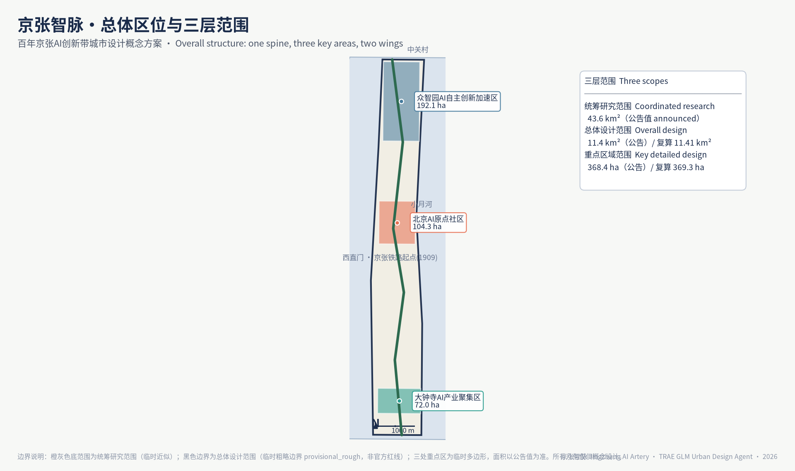
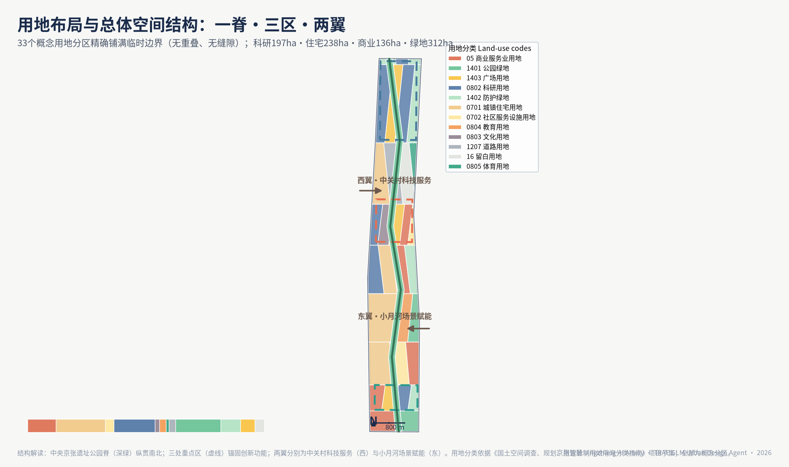
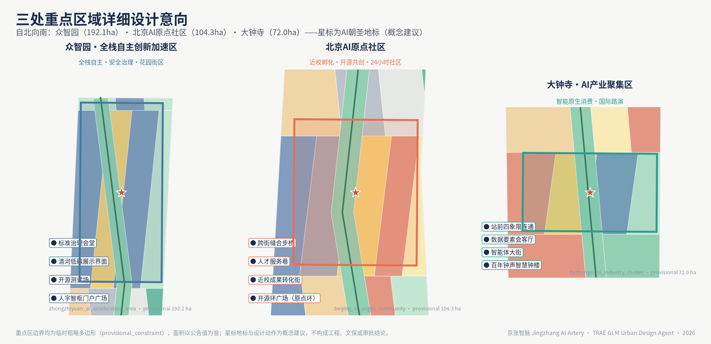
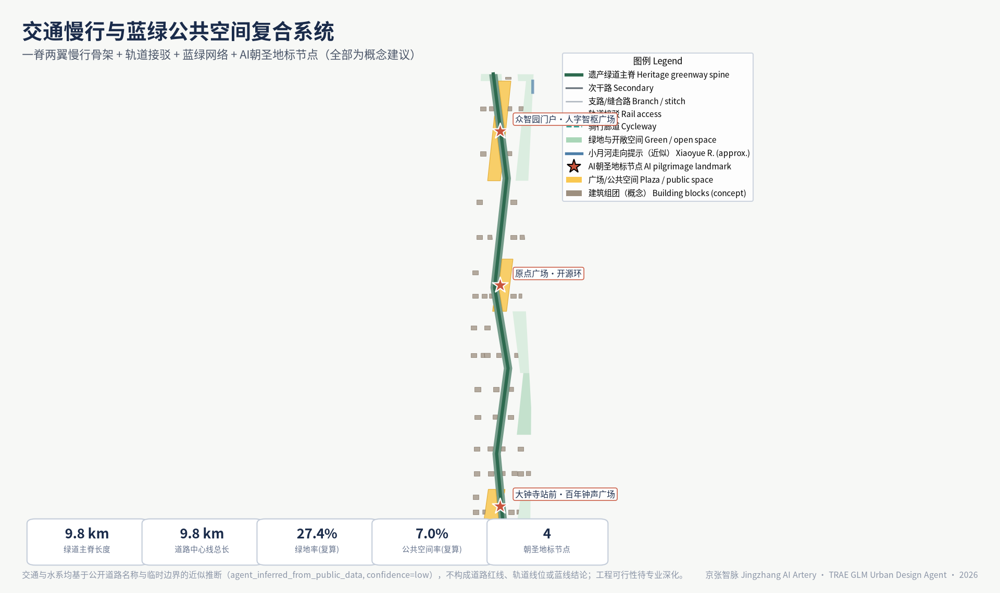
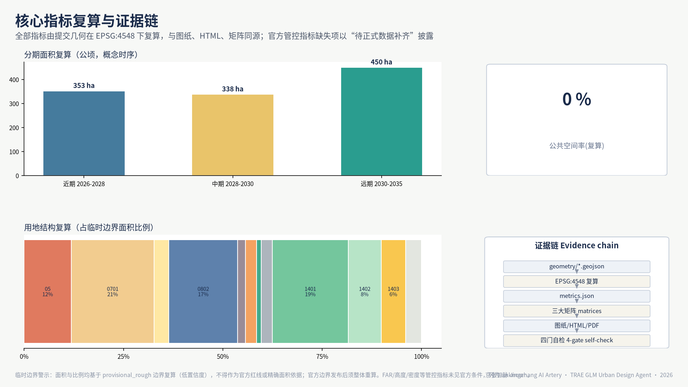

<!-- Full English counterpart of proposal.md; geometry, metrics and figures derive from the same structured layers. -->

# Jingzhang AI Artery — from Rails to Neurons: Urban Design for the Centennial Jingzhang AI Innovation Belt

## Design Basis and Source Inventory

This formal proposal takes the *Prequalification Announcement for the International Urban Design Scheme Collection for the Centennial Jingzhang AI Innovation Belt* issued by the Haidian Branch of the Beijing Municipal Commission of Planning and Natural Resources as its primary basis, together with the machine-readable provisional rough boundaries, key areas, enums, metrics and source registry maintained in `brief/site-package/`. Before generation, the agent read `design_brief.json`, `allowed_design_space.json`, `sources.json`, `enums/`, `ranges/`, `schemas/`, `data/source_registry.json` and `data/processed/agent_fact_pack.md`, and built task, scope, data-use and gap inventories from `project_scope_summary.csv`, `agent_task_requirements.csv`, `source_use_matrix.csv` and `missing_data_checklist.csv`. Every design judgement is decomposed into traceable sources, recalculable metrics, verifiable layers and human-reviewable assumptions. The announcement requires urban design at both regulatory-plan depth and integrated planning-implementation depth, so narrative text cannot substitute for GeoJSON layers, metric tables, A3 booklets, A0 boards and the HTML presentation.

The proposal is not a free-standing vision text; it is organised from the announcement, the agent-oriented taskbook and the site package, placing only the most decisive evidence next to each judgement [source:OFFICIAL-ANNOUNCEMENT] [source:AGENT-TASKBOOK] [depth:existing_conditions_diagnosis]. Full source and standards coverage lives in `sources.json`, `standard_matrix.json` and `design_depth_matrix.json` and is not duplicated here.

The source registry is used within the following boundaries [source:SOURCE-REGISTRY]:

- data/source_registry.json registers the permitted uses of public, cleared and provisional materials.
- Current registry summary: 7 formal usable sources, 1 background source, 1 provisional-only source.
- The agent must not upgrade background_only or provisional_only materials into official boundaries, statutory plans, formal scoring evidence or government implementation commitments.

`data/processed/agent_fact_pack.md` is the reading-navigation layer of this proposal, not a new authority [source:PROCESSED-FACT-PACK]. It organises the three-level scopes, three key areas, announcement tasks, agent.1–agent.6, data availability and missing-data items into a readable proposal; factual judgements still return to the registered primary materials [source:OFFICIAL-ANNOUNCEMENT] [source:AGENT-TASKBOOK], with full source relations kept in `sources.json`.

While the official `SITE_BOUNDARY` and the three `KEY_AREA` polygons are unavailable, this proposal uses `brief/site-package/geometry/provisional_boundaries.geojson` to produce a provisional formal package. `geometry/site_boundary.geojson` and `geometry/key_areas.geojson` are both labelled `provisional_constraint`, `official_boundary=false`; they may serve design generation, self-checks, visualisation and discussion only, never as an official redline, approval basis, precise-area basis or statutory control conclusion. This organiser-side data gap does not block content scoring; once official polygons are released, site boundary, key areas, land use, roads, green space, public space, buildings, phasing and metrics must all be recalculated.

The scoreable status of this package is: **provisional boundaries, precision caveats retained, recalculation pending official data; content scoring not blocked.** Spatial structure, scenarios, projects and metrics are therefore written to be discussable, auditable and recalculable upon boundary replacement; when the official boundary and key-area polygons are updated, the full generation pipeline, self-checks and figure/HTML rendering must be rerun — replacing a single file is not acceptable.

Boundary interpretation returns to the overall scope layer and area recalculation [data:geometry/site_boundary.geojson#SITE-001] [metric:site_area_sqm]. The three key areas are checked against their dedicated layer and count metric [data:geometry/key_areas.geojson#PROV-KEY-001] [metric:key_area_count]. Readers can thus move from prose into evidence without first parsing machine identifiers.

## Three-Level Scope Framework

The proposal follows the three levels fixed by the announcement. The coordinated research scope (43.6 km²) addresses the AI industrial ecosystem, strategic positioning, innovation chains and future urban form. The overall design scope (11.4 km²) covers the urban area and industrial districts within 1–2 km of the Jingzhang Heritage Park, requiring an overall renewal framework, industrial spatial layout, transport and utility support, and townscape control. The key-area scope (368.4 ha) covers three detailed-design districts requiring clear functional programmes, building massing, retain-renovate-demolish classification, public-space connectivity and traffic organisation. All three levels are mapped item by item in `compliance_matrix.json`, so that every mandatory task of announcement sections 1.3, 1.4, 1.5 and agent.1–agent.6 has chapter, layer, metric, figure and HTML evidence.

The depth items of the framework are governed by [depth:three_level_scope_framework] and [depth:overall_spatial_structure]; spatial evidence rests on [data:geometry/site_boundary.geojson#SITE-001] and [data:geometry/key_areas.geojson#PROV-KEY-001]; task basis follows [standard:PROJECT-OFFICIAL-ANNOUNCEMENT]; scope indexing navigates the three-level table in `project_scope_summary.csv` via [source:PROCESSED-FACT-PACK].

The three levels are not separate drawing sets. Coordinated research fixes the industrial-chain and urban-form judgements; overall design translates them into renewal projects, spatial structure and facility capacity; key-area detailed design verifies implementability at the level of parcels, buildings, traffic, public space and AI scenarios. This proposal first locks the provisional boundaries and constraints, then generates land use (33 parcels, recalculated coverage 11.41 km²), buildings (26 new / 15 renovated / 9 retained), roads (including a 9.8 km greenway spine), green space (recalculated green ratio 27.4%), public space (recalculated public-space ratio 7.0%), phasing and AI service nodes, and finally recalculates metrics from those layers, stating in the text which conclusions remain limited by the provisional boundary. No area, ratio, scale or project count that cannot be recalculated from structured data is stated as a formal conclusion.

The overall concept proposed is the **Jingzhang AI Artery Symbiosis Belt**: the Jingzhang Heritage Park as the historic and public-space spine; Zhongzhiyuan, the Beijing AI Origin Community and Dazhongsi as innovation anchors; universities, enterprises, communities and rail stations as the everyday network — forming a structure of "one belt, three cores, distributed scenarios, and a blue-green slow-mode composite ring". The "belt" is not a newly drawn redline but a translation of the announcement's three-level scopes into a working method; the "cores" correspond to the three key areas; "distributed scenarios" are operable nodes for AI + public services, industry services and urban life; the "composite ring" links slow-mode paths, green space, public space and event routes.

| Level | Design question | Proposal answer | Data anchor |
| --- | --- | --- | --- |
| Coordinated research | How to organise the AI ecosystem and future urban form | An innovation chain of "university origination — open-source collaboration — enterprise conversion — public experience — international diffusion" | compliance_matrix.json, standard_matrix.json |
| Overall design | How to map industry, renewal, transport, utilities and townscape | Jointly expressed by land-use, building, road, green, public-space and phasing layers | [data:geometry/land_use.geojson#LU-001], [data:geometry/roads.geojson#ROAD-001] |
| Key areas | How three districts reach detailed-design depth | Positioning, spatial moves, AI scenarios and implementation dependencies for each | [data:geometry/key_areas.geojson#PROV-KEY-001], [data:geometry/key_areas.geojson#PROV-KEY-002], [data:geometry/key_areas.geojson#PROV-KEY-003] |

## Coordinated Research: Industry and Future City

The core task of the coordinated research scope is a world-class AI innovation ecosystem. The proposal maps Haidian's universities and institutes, head enterprises, compute-algorithm-data elements, incubators, listed companies, unicorns and tech services into a spatial synergy framework across the AI innovation chain, industrial chain, talent chain and urban-service chain. Naming and identity serve the recognisability of the "Centennial Jingzhang culture belt, urban AI life experience belt, and AI fusion innovation belt", and are tied to industry, public space and cultural assets rather than slogans. The agent taskbook further requires responses to the "five functions" and "three districts, two wings" coordination, yielding a nameable system, visual identity, overall structure diagram, scenario opening and operation mechanisms; this section marks those requirements with [source:AGENT-TASKBOOK] and [standard:PROJECT-AGENT-OPEN-CALL-TASKBOOK] — they originate from the agent open call, not statutory planning control.

Coordinated research adds no pseudo-precise redlines; through the townscape, public-space and building-layout coordination required by [standard:MOHURD-URBAN-DESIGN-MEASURES], it links back to [data:geometry/land_use.geojson#LU-001], [data:geometry/public_space.geojson#PUBLIC-001] and [depth:overall_spatial_structure], showing that industrial strategy ultimately lands in visible, auditable spatial structure.

Future-city research answers how AI changes work, living, socialising, learning, mobility and public services. AI transport systems, continuous green space, innovation service facilities and an internationalised living-working atmosphere are expressed as locatable functional zones, nodes, corridors and scenarios, not generic technology visions. Industrial-strategy indicators, AI innovation indices, talent density, spatial supply types and AI+ vertical application districts enter the metric system, labelled as official, design-suggested, or pending official calibration. Global AI events, developer communities, open scenarios or "pilgrimage" routes are written as concept suggestions / reference schemes for professional deepening, never as confirmed government activities or implementation arrangements.

## Overall Design: Renewal and Regulatory-Plan-Depth Urban Design

The overall design scope requires urban design at regulatory-plan depth. The proposal provides an overall renewal spatial structure, inefficient-space identification, a renewal project list, implementation policy suggestions, industrial functional proportions, spatial organisation models, total building scale and a carrying-capacity assessment. `geometry/land_use.geojson` fully covers the design boundary without overlap; `geometry/buildings.geojson` expresses renewal and retained building footprints; `geometry/roads.geojson` expresses micro-circulation, slow-mode and rail-station access; `metrics.json` recalculates core areas, ratios and layer counts.

Following [standard:MOHURD-CONTROL-DETAILED-PLANNING], regulatory-depth content is decomposed into reviewable objects: [data:geometry/land_use.geojson#LU-001] for land-use structure, [data:geometry/buildings.geojson#BLDG-001] for building footprints, [data:geometry/roads.geojson#ROAD-001] for traffic organisation, [metric:building_footprint_area_sqm] for footprint recalculation, with depth governed by [depth:land_use_layout] and [depth:development_intensity_controls].

Overall design also supports transport, rail, utilities and facilities. Around station integration, road micro-circulation, bicycle parking, parking supply, innovation service platforms, talent living services, new infrastructure, distributed energy and edge compute, the proposal sets out spatial arrangement and implementation paths. Building heights, development intensity, road redlines, setbacks and facility standards without official control conditions are marked "pending confirmation by the formal regulatory plan"; agent estimates never impersonate approved indicators.

## Key Areas: Detailed Design

Detailed design of the three key areas is mandatory. Zhongzhiyuan AI Acceleration Area addresses national AI platforms, full-stack self-reliance, standards setting, safety governance, industry showcase, external traffic, Qinghe culture, a low-carbon green innovation environment and green-space AI scenarios. Beijing AI Origin Community addresses near-campus innovation, incubation and conversion, talent special zones, open-source systems, brand events, retain-renovate-demolish, showcase and release, housing and living support, campus-park slow-mode links and station integration. Dazhongsi AI Industry Cluster addresses head enterprises, agents, smart terminals, content consumption, data elements, digital assets, business services, planned green-space composite use, Dazhongsi station integration and four-quadrant pedestrian connectivity at the intersection.

The three detailed designs cite [data:geometry/key_areas.geojson#PROV-KEY-001], [data:geometry/key_areas.geojson#PROV-KEY-002] and [data:geometry/key_areas.geojson#PROV-KEY-003], with [depth:three_key_area_detailed_design] auditing planning-implementation-depth. A scheme that only proclaims a "demonstration zone" without functional, building, traffic, public-space and project evidence counts as unfinished.

The three key areas must appear in `geometry/key_areas.geojson`. Where official polygons exist they are used as `official_constraint`; while missing, `provisional_constraint` is used, and the text, HTML, sources, assumptions and self_check state that it cannot serve formal scoring or approval. `compliance_matrix.json` covers announcement 1.5.3.1–1.5.3.3 respectively. Presentation includes functional programme, building scale and form, retain-renovate-demolish, public-space systems, traffic organisation, slow-mode connectivity and implementation projects. The HTML page supports switching between the three key areas; A3 and A0 drawings include key-district general plans, partial details and metric notes.

| Key area | Positioning | Spatial moves | Industry & operation scenarios | Evidence |
| --- | --- | --- | --- | --- |
| Zhongzhiyuan AI Acceleration Area | Garden-type full-stack self-innovation district | Strengthen the Qinghe frontage, industry showcase, low-carbon exchange and external traffic; green space hosts open testing and standards governance display | Self-reliant model testing, standards workshops, safety governance display, low-carbon compute experience | [data:geometry/key_areas.geojson#PROV-KEY-001], [depth:three_key_area_detailed_design] |
| Beijing AI Origin Community | Near-campus conversion and talent community | Stitch campus-park-street slow modes; supply release, talent service, living and open-source collaboration space | Open-source community, release events, talent-zone services, near-campus incubation | [data:geometry/key_areas.geojson#PROV-KEY-002], [source:AGENT-TASKBOOK] |
| Dazhongsi AI Industry Cluster | Urban intelligent-economy and international exchange district | Station integration, four-quadrant pedestrian connectivity, business services and public-realm renewal around head enterprises | Agent and smart-terminal display, content consumption, data elements and international roadshows | [data:geometry/key_areas.geojson#PROV-KEY-003], [metric:key_area_count] |

## AI Ecosystem, Talent Profiles and AI+ Scenarios

The proposal builds spatial demand profiles for AI talent and enterprises covering R&D offices, open-source collaboration, release events, enterprise services, talent housing, social learning, consumption and leisure, sport and international exchange. AI+ scenarios follow the announcement's directions — transport, services, consumption, healthcare, education, legal, life services — forming industry-development and city-enablement scenarios. Each scenario states its audience, spatial location, data sources, privacy boundary, human-review mechanism and operator.

Scenarios are anchored in space and governance: public-space scenarios cite [data:geometry/public_space.geojson#PUBLIC-001]; slow-mode and transport scenarios cite [data:geometry/roads.geojson#ROAD-001]; open-space scenarios cite [data:geometry/green_space.geojson#GREEN-001] with [metric:public_space_ratio] and [metric:green_ratio]. The agent taskbook requires no fewer than 10 scenario cards, 3 industry test-bed scenarios and 5 user profiles; this proposal provides 10 scenario cards (table below), 5 user profiles (table above) and 4 test-bed scenarios (02 safety governance sandbox, 03 edge-compute station, 04 AI slow-mode navigation, 08 data-elements parlour), with privacy boundaries, human review and operators recorded in the "audit boundary" column, `compliance_matrix.json` and `visual/index.html`.

| User profile | Typical needs | Spatial response | Audit boundary |
| --- | --- | --- | --- |
| Open-source developer | Release, collaboration, testing, reputation | Origin Community release hall, public code wall, night collaboration space | No personal trajectory collection; event data aggregated only |
| Start-up team | Low-cost office, compute access, product testbed | Zhongzhiyuan shared test field, edge-compute service points, standards consultation | Compute and data services require separate authorisation |
| Head-enterprise visitor | Showcase, business, reception, recruiting | Dazhongsi international roadshow parlour, station access, public space near key firms | Brand marks and cases must be rights-cleared |
| Neighbourhood resident | Commute, leisure, community service, low-disturbance renewal | Heritage Park slow ring, embedded community services, night lighting and event tiering | Resident profiles never used for commercial recommendation |
| University staff & students | Conversion, cross-campus work, daily slow modes | Campus-park slow stitching, conversion stations, AI education points | Campus data and research outputs require authorisation |

| Scenario card | Spatial carrier | Design note |
| --- | --- | --- |
| 01 Open-source release hall | Beijing AI Origin Community | Release events, code-contribution display and small roadshows for universities, open-source communities and start-ups |
| 02 Safety governance sandbox | Zhongzhiyuan | Standards, safety evaluation and red-teaming translated into visitable, bookable, supervisable nodes |
| 03 Edge-compute station | Nodes across the overall design scope | Combined with public, enterprise and low-carbon energy services as a prototype new infrastructure |
| 04 AI slow-mode navigation | Jingzhang Heritage Park vitality belt | Explainable signage and low-intrusion sensing identify slow-mode breaks, crowding and accessibility needs |
| 05 Dazhongsi international roadshow parlour | Dazhongsi AI Industry Cluster | Display, negotiation, media release and exchange for agent, terminal and content enterprises |
| 06 Qinghe low-carbon innovation corridor | Zhongzhiyuan Qinghe frontage | Green space, stormwater, walking and cycling fused with AI display as the district living room |
| 07 Near-campus conversion street | Beijing AI Origin Community | Incubation, display, legal, IP and investment services for university conversion |
| 08 Data-elements parlour | Dazhongsi district | A compliant, authorised, auditable urban interface for data elements and digital assets |
| 09 AI life-service sample street | Community and commercial junctions | Healthcare, education, legal and life-service AI+ scenarios in operable small-scale streets |
| 10 Global AI week route | The belt's public-space system | A walkable, communicable route from heritage culture through open-source community to industry showcase and international roadshow |

AI governance recommendations obey data minimisation, public sources, explainability and human review. Urban agents may assist in identifying slow-mode breaks, public-space heat, facility maintenance, enterprise service demand and event safety risks, but cannot replace planning approval, output unauthorised personal profiles, or claim official implementation commitments. All AI scenario nodes enter structured layers or the compliance matrix so reviewers can see their relation to industry, space and public interest.

## Land Use, Building Scale and Retain-Renovate-Demolish

Land use follows public standards for territorial spatial survey, planning and use regulation, forming a complete, closed, gap-free partition. Buildings distinguish retained, renovated, renewed, new and to-be-confirmed objects with footprint, function, scale, townscape, roof, massing and height-control recommendation levels. Lacking status-quo buildings, property rights, regulatory plans and engineering conditions, the proposal offers method and calibration lists, never fabricated demolition conclusions.

Classification follows [standard:MNR-LAND-USE-CLASSIFICATION-GUIDE]; height, massing and character are governed by [depth:height_massing_character]; the retain-renovate-demolish method by [depth:retain_renovate_demolish]. Primary evidence: [data:geometry/land_use.geojson#LU-001], [data:geometry/buildings.geojson#BLDG-001] and [metric:building_footprint_area_sqm].

Scale and intensity metrics match `metrics.json` and the layers. Where total floor area, FAR, height, density, green ratio, setbacks and control lines lack official conditions, they use `status=unknown` with reasons, assumptions and recalculation paths — fixed numbers never fake precision. The A3 booklet carries the renewal project list and metric audit table; A0 boards carry key structure and key areas; the HTML links metrics with layers.

## Transport, Rail, Utilities and Public Services

The transport scheme responds to station integration, micro-circulation, slow-mode breaks, external traffic, parking, bicycle parking and green mobility, focusing on the North 5th Ring, Heritage Park crossings, Wudaokou, Qinghua Donglu Xikou, Dazhongsi station and key-enterprise surroundings. Road and slow-mode layers stay within the submitted boundary and cross-check with public space, green space, industry nodes and key areas; under provisional boundaries, transport conclusions remain provisional design discussion.

Depth is governed by [depth:traffic_rail_slow_parking] and [depth:municipal_new_infrastructure]; layers cite [data:geometry/roads.geojson#ROAD-001], [data:geometry/public_space.geojson#PUBLIC-001] and [data:geometry/constraints.geojson#CONSTRAINTS]. Missing redlines, pipelines, fire and utility conditions enter assumptions rather than being written as approved conditions.

Utilities and public services cover AI industry services, innovation platforms, talent living services, new infrastructure, distributed energy, edge compute and conventional systems, stating standards, layout, service radius, operation and phasing. Missing pipeline, energy, drainage, flood and fire data are listed as formal deepening preconditions.

## Blue-Green Space, Public Space and Townscape

The blue-green framework takes the Jingzhang Heritage Park vitality belt as its spine, coordinating Qinghe, Xiaoyue River and nearby universities, enterprises and communities into a north-south and east-west connected walking, cycling and green system. It identifies slow-mode breaks, ring-road crossings and park-end landmarks, proposing parking, sport, innovation exchange, tech testing, application display and public-service composite use.

Blue-green public space is checked by depth items and layers [depth:blue_green_public_space] [data:geometry/green_space.geojson#GREEN-001] [data:geometry/public_space.geojson#PUBLIC-001]. Ratios are interpreted in the text with full recalculation in `metrics.json`; townscape coordination returns to [standard:MOHURD-URBAN-DESIGN-MEASURES].

Townscape fuses Jingzhang railway heritage, Zhongguancun innovation culture and AI culture, using Qinghuayuan station and Beijing Film Academy resources for urban tone, building character, roof forms, massing, frontages and public art guidance. Wayfinding, cultural symbols, international narrative, AI landmarks and contribution walls are proposed, with all brands, fonts, images, portraits and logos rights-cleared. Control distinguishes official regulation, design suggestion and pending conditions; no pseudo-precise control lines appear without heritage or regulatory basis.

## Renewal Projects, Policy and Phasing

Implementation forms an auditable project list stating location, type, function, responsible主体, dependencies, stage, risks and evaluation metrics. Policies cover renewal coordination, spatial supply, operation, industry services, participation, data governance and property coordination. `geometry/phasing.geojson` expresses phasing; `compliance_matrix.json` links every task to phasing and drawings.

Depth follows [depth:renewal_project_list] and [depth:phasing_implementation], with spatial evidence in [data:geometry/phasing.geojson#PHASE-001]. Without property, funding, implementation主体 and approval paths, items are written as implementation risks, not delivery promises.

| No. | Project | Type | Key dependencies | Evidence |
| --- | --- | --- | --- | --- |
| JZ-01 | Heritage Park slow-mode break stitching | Public space / transport | Redlines, under-bridge space, traffic review | [data:geometry/roads.geojson#ROAD-001] |
| JZ-02 | Zhongzhiyuan Qinghe innovation frontage | Blue-green / industry display | River blue line, ecology, flood conditions | [data:geometry/green_space.geojson#GREEN-001] |
| JZ-03 | Origin Community near-campus conversion street | Renewal / industry services | Campus boundary, property, ground-floor uses | [data:geometry/buildings.geojson#BLDG-001] |
| JZ-04 | Dazhongsi four-quadrant pedestrian links | Rail integration / slow mode | Station, intersections, utilities | [data:geometry/public_space.geojson#PUBLIC-001] |
| JZ-05 | AI public-service and edge-compute nodes | New infrastructure / services | Energy, compute, safety, operator | [data:geometry/constraints.geojson#CONSTRAINTS] |
| JZ-06 | Global AI week public route | Operation / brand | Permits, event safety, rights clearance | [data:geometry/phasing.geojson#PHASE-001] |

Phasing distinguishes the 100-day collection cycle (a submission deadline) from implementation staging (a construction path). Near-term pilots, mid-term renewal and long-term governance are separated, marking what can start with light installations, operations and service platforms, and what must await formal regulatory, utility, transport and property conditions. Annual events, developer community operation, open-scenario days, public experience routes and international diffusion state their audience, frequency, responsibility, conversion path and risks — not slogans.

## Metrics, Area Recalculation and Compliance Matrix

The metric system covers at minimum: overall-design-scope area, key-area areas, green and public-space ratios, building footprints, renewal project counts, AI scenario nodes, slow-mode connectivity, industry-space and talent-service indicators, and self-check status. All known metrics recalculate from GeoJSON or trusted sources; unknown metrics state reasons and preconditions. `scripts/spatial_review.py` and `scripts/visual_review.py` results are key formal self-check evidence.

Recalculation follows [depth:metrics_recalculation]. The text explains design meaning — how the overall scope constrains spatial allocation, how blue-green and public-space ratios support daily exchange — while full values, formulas, source files and confidence live in `metrics.json`. Key indicators are auditable from scope and green layers [metric:site_area_sqm] [data:geometry/green_space.geojson#GREEN-001].

The compliance matrix is the master responsiveness file. Every announcement task and taskbook task maps to report sections, layers, metrics, drawings, HTML pages, sources, assumptions and self-check items. Any uncovered mandatory task of announcement 1.3, 1.4, 1.5 or agent.1–agent.6 blocks formal professional scoring.

For formal deepening, indicators fall into three classes: spatial indicators recalculable from submitted geometry (boundary area, green ratio, public-space ratio, footprint, phasing areas); control indicators requiring official regulatory support (FAR, height, density, setbacks, redlines, facility standards); and performance indicators requiring operational calibration (AI innovation index, talent density, service satisfaction, slow-mode accessibility, event participation, scenario usage). They enter `metrics.json`, `assumptions.json` and `compliance_matrix.json` respectively, preventing operational visions from being mistaken for approved planning conditions.

## Risks, Copyright and Compliance

**Bilingual requirement.** The primary file may be Chinese or English with a complete counterpart via `proposal.en.md` or `proposal.zh.md`; A3/A0, HTML and text-bearing figures provide language counterparts, preferring the terminology of `docs/terminology-glossary.md`. A v2 package missing any required translation, language mapping or valid file is blocked by finalize and CI. All images, drawings, icons, data and code assets declare source, licence and authorisation in `sources.json` or `report/copyright_statement.md`. HTML loads no remote scripts, map tiles, fonts, iframes, forms or external APIs, and tracks no reviewer behaviour.

Risks and missing-data lists are checked by [depth:risk_missing_data] [data:geometry/constraints.geojson#CONSTRAINTS] [source:SITE-PACKAGE]. Gaps in the official boundary, key areas, regulatory plan, roads, parcels, buildings, utilities, heritage and public services from `missing_data_checklist.csv` enter `assumptions.json`, self-checks and the risk chapter; conclusions lacking official regulatory, redline, property, utility, fire or heritage conditions are downgraded to pending items, with full professional checks in the standards matrix.

This proposal claims no official approval, adopted regulatory plan, final land property, final construction scale or guaranteed implementation. The AI agent is responsible for facts, sources, copyright, spatial data, metrics and expression; maintainers and professional reviewers may require rework or rejection based on self-checks, spatial review and the compliance matrix.

## References

- brief/public-brief.md
- brief/site-package/design_brief.json
- brief/site-package/allowed_design_space.json
- brief/site-package/enums/
- brief/site-package/ranges/planning_limits.json
- data/processed/agent_fact_pack.md
- data/processed/project_scope_summary.csv
- data/processed/agent_task_requirements.csv
- data/processed/source_use_matrix.csv
- data/processed/missing_data_checklist.csv
- Full machine indexes: `sources.json`, `metrics.json`, `compliance_matrix.json`, `standard_matrix.json`, `design_depth_matrix.json`
- Bibliography entries follow the site-package registry; full citations and licences in the structured source list [source:SITE-PACKAGE]
