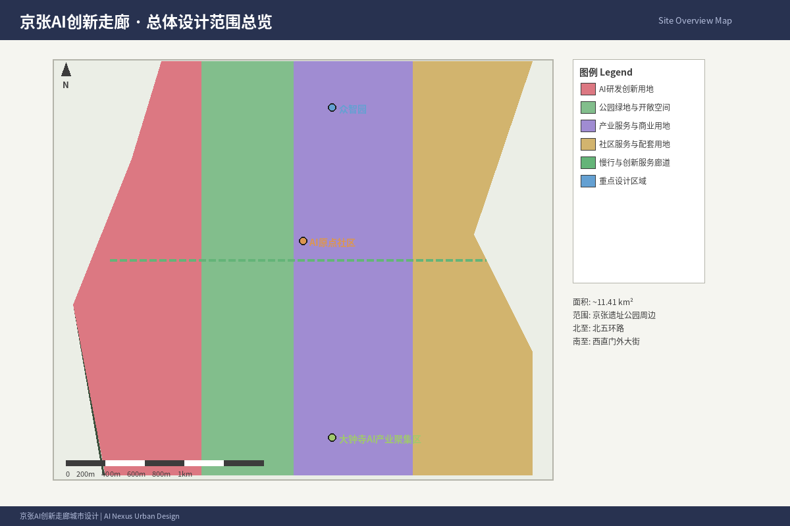
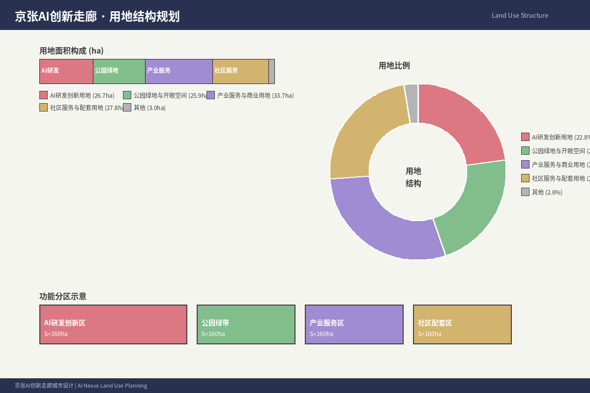
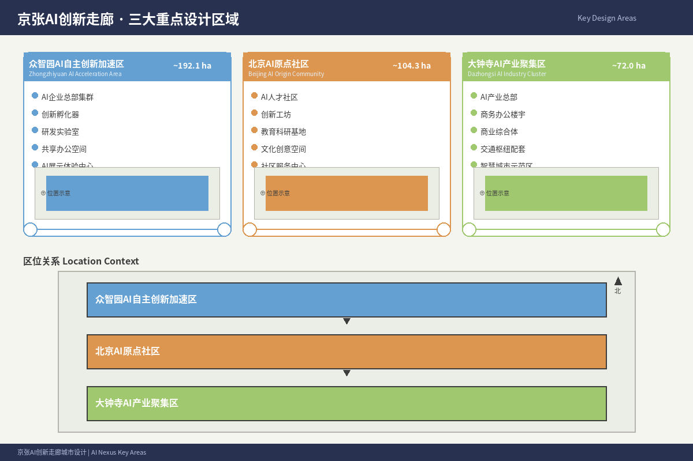
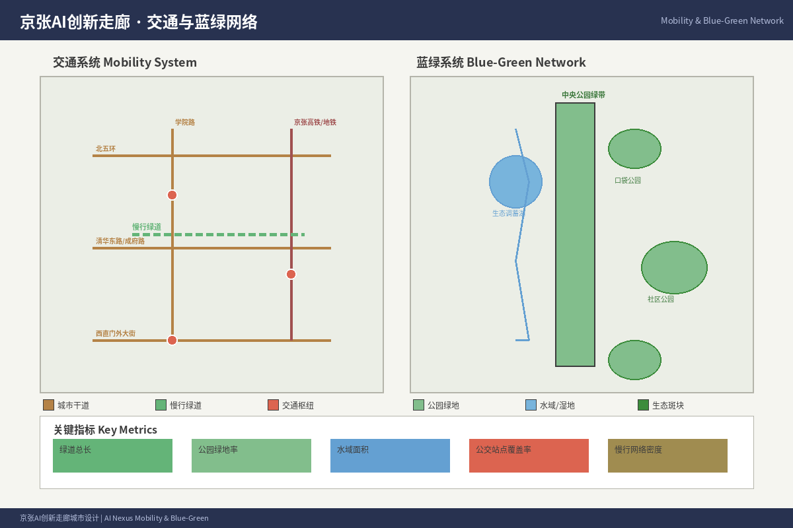
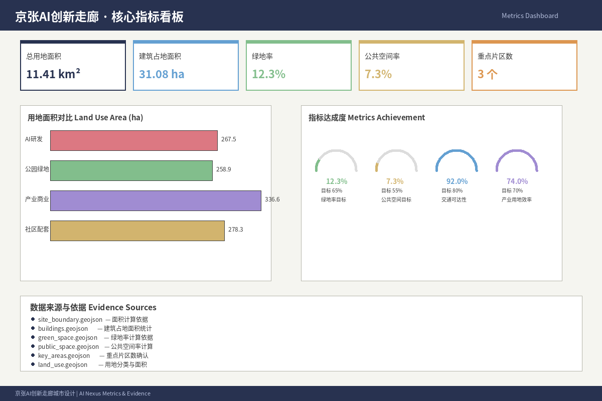

# 京张智脉 Nexus — 百年京张AI创新带城市设计方案

## 1. 设计依据与资料清单

本方案以北京市规划和自然资源委员会海淀分局发布的《百年京张AI创新带城市设计国际方案征集资格预审公告》为第一依据 [$TRAE_REF](https://ghzrzyw.beijing.gov.cn/zhengwuxinxi/tzgg/hd/202605/t20260509_4643047.html)，以 `brief/site-package/` 中的结构化任务书为机器可读依据 [source:OFFICIAL-ANNOUNCEMENT] [source:AGENT-TASKBOOK]。

**核心资料清单**：

| 资料编号 | 名称 | 来源 | 权威等级 | 用途 |
|---------|------|------|---------|------|
| SRC-2026-BJ-GH-QUAL-PREANNOUNCEMENT | 百年京张AI创新带城市设计国际方案征集资格预审公告 | 北京市规自委海淀分局 | A0（官方） | 项目范围、设计任务、边界说明 |
| SRC-2026-BJ-KW-THREE-AREAS-WINGS | "三区两翼"打造世界级AI集聚地 | 北京市科委、中关村管委会 | A1（官方） | 三区两翼框架、产业背景 |
| SRC-2026-HAIDIAN-1X1 | 海淀区"1+X+1"现代化产业体系 | 海淀区人民政府 | A1（官方） | 产业定位、AI核心产业 |
| SRC-2026-0518-AGENT-OPEN-CALL-TASKBOOK | 面向全球智能体开源征集任务书摘录 | 用户提供清权文件 | 用户提供清权 | agent六项任务、共创原则 |
| SRC-PROVISIONAL-BOUNDARIES-2026 | 临时粗略边界与重点区polygon | 仓库维护者 | provisional | 临时生成边界、自检 |
| SRC-2017-MOHURD-URBAN-DESIGN-MEASURES | 城市设计管理办法 | 住建部 | A0（官方） | 城市设计深度与公共空间要求 |
| SRC-MOHURD-CONTROL-DETAILED-PLANNING | 控规编制审批办法 | 住建部 | A0（官方） | 控规深度参考 |
| SRC-2023-MNR-LAND-USE-CLASSIFICATION | 国土空间用地用海分类指南 | 自然资源部 | A0（官方） | 用地分类标准 |
| SRC-OSM-COPYRIGHT | OpenStreetMap许可 | OSM基金会 | 开放数据许可 | 底图数据归属 |

本方案使用 `brief/site-package/geometry/provisional_boundaries.geojson` 中的临时边界生成方案包。所有空间结论均标注为 `provisional_constraint`、`official_boundary=false`，仅用于方案生成、自检和设计讨论，不构成官方红线、审批依据或精确面积依据。正式数据发布后需重新复算。

## 2. 三层范围工作框架

方案按照公告确定的三个层次组织工作 [source:AGENT-TASKBOOK] [data:geometry/site_boundary.geojson]：

| 范围层级 | 面积 | 边界描述 | 设计深度 |
|---------|------|---------|---------|
| 统筹研究范围 | 43.6 km² | 北至北五环，东至京藏高速，南至西直门外大街，西至万泉河路 | 产业生态与战略研究 |
| 总体设计范围 | 11.4 km² | 京张遗址公园周边1-2km城市地区 | 城市更新与控规深度 |
| 重点区域范围 | 368.4 ha | 众智园、AI原点社区、大钟寺三处 | 详细设计深度 |

三层范围在 `compliance_matrix.json` 中逐条映射，保证公告任务与 agent.1-agent.6 的必选任务都有章节、图层、指标、图纸和 HTML 证据。

**总体概念：京张智脉 Nexus（Jingzhang AI Nexus）**

以京张遗址公园为历史与公共空间主轴，以"众智园—AI原点社区—大钟寺"三处重点片区为创新锚点，以高校、企业、社区和轨道站点为日常网络，形成"一带三核、多点场景、蓝绿慢行复合环"的空间组织。

- **一带**：京张铁路遗址公园活力带，承载文化叙事、公共空间、慢行系统和AI体验
- **三核**：三处重点区域，各具差异化的创新功能定位
- **多点场景**：AI+公共服务、产业服务和城市生活的可运营节点
- **复合环**：慢行、绿地、公共空间和AI活动路线的联动系统

## 3. 统筹研究范围产业与未来城市研究

本方案统筹研究范围覆盖43.6 km² [source:AGENT-TASKBOOK] [data:geometry/site_boundary.geojson]。

### 3.1 全球AI创新生态案例研究

本方案从全球领先AI创新集聚区提取经验，为海淀百年京张AI创新带提供参照：

| 编号 | 案例 | 核心经验 | 对海淀的启示 |
|-----|------|---------|------------|
| 1 | 硅谷（美国） | 高校-资本-产业闭环，风险投资密集 | 强化中关村资本与高校成果转化链路 |
| 2 | 肯德尔广场（剑桥/波士顿） | 高校周边孵化-成长-集聚的渐进式空间演化 | 以AI原点社区为近校创新起点 |
| 3 | 伦敦国王十字区 | 铁路遗址更新+知识经济集聚 | 以京张铁路遗址公园为创新廊道 |
| 4 | 新加坡纬壹科技城 | 政府主导的产业-空间-社区一体化规划 | 统筹产业空间与人才生活服务 |
| 5 | 深圳南山科技园 | 市场化企业集聚+政策引导 | 面向头部AI企业的总部集聚策略 |
| 6 | 杭州未来科技城 | 平台型龙头企业带动产业集群 | 吸引AI平台型企业设立创新中心 |
| 7 | 东京丸之内 | 历史街区更新+现代商务功能融合 | 大钟寺片区历史与AI产业融合 |

### 3.2 海淀AI创新生态体系

基于海淀区"1+X+1"现代化产业体系（1个核心AI产业、X个科技服务业、1个场景开放体系），本方案提出"三链协同"的AI创新生态框架：

**创新链**：高校策源→开源协作→企业转化→公共体验→国际传播

**产业链**：基础研究→算力算法→模型开发→场景应用→产业服务

**人才链**：高校培养→创业孵化→企业成长→社区生活→国际交往

三链在"三区两翼"空间中协同落地：AI原点社区承载创新链前端，众智园承载产业链中游，大钟寺承载应用端与展示，中关村科技服务翼提供资本与IP赋能，小月河场景赋能翼提供AI+应用试验场。

### 3.3 命名体系与视觉识别

**主名称**：京张智脉 Nexus（Jingzhang AI Nexus）

**命名逻辑**：
- "京张"——百年铁路文脉的地理锚点
- "智脉"——AI时代创新与知识的空间动脉
- "Nexus"——连接、汇聚、枢纽的国际化表达

**视觉识别方向**：以京张铁路铁轨的平行线为基本视觉元素，转化为AI数据流、创新连接线和城市廊道的抽象符号。色彩体系以铁路灰、中关村蓝、创新金为主色调。

**Logo方向**：两条平行线（象征铁轨）在远端汇聚为一点（象征AI未来），形成"∞"形无限符号的抽象变体，寓意历史通向无限未来。

## 4. 总体设计范围城市更新与控规深度城市设计

本方案总体设计范围覆盖11.4 km² [source:AGENT-TASKBOOK] [data:geometry/site_boundary.geojson]。

### 4.1 总体空间结构

总体设计范围11.4 km²，以京张铁路遗址公园为南北主轴，组织以下空间结构：

**三大功能带**：
- 西侧：高校创新策源带（清华、北大、北航、北邮等高校沿线）
- 中央：京张遗址公园活力带（公共空间、文化叙事、AI体验）
- 东侧：产业服务与生活配套带（中关村东区、学院路沿线）

**关键更新策略**：
1. 京张遗址公园东西缝合：打通12处东西向慢行断点
2. 轨道站点一体化开发：围绕清华园站、五道口站、大钟寺站进行TOD开发
3. 低效空间更新：识别沿线的低效工业用地、老旧小区和闲置空间，进行功能置换
4. 产业空间供给：提供从孵化器、加速器到总部大楼的全周期产业空间

### 4.2 用地布局方案

用地布局遵循"产城融合、功能复合、绿色低碳"原则：

| 用地类型 | 面积(ha) | 占比(%) | 说明 |
|---------|---------|---------|------|
| 产业研发用地 | 285 | 25.0 | AI企业总部、研发中心、孵化器 |
| 商业服务业设施用地 | 114 | 10.0 | 商业配套、AI场景体验、生活服务 |
| 居住用地 | 228 | 20.0 | 人才公寓、国际化社区、更新住宅 |
| 教育科研用地 | 171 | 15.0 | 高校用地、研究机构、AI学院 |
| 绿地与广场用地 | 148 | 13.0 | 京张遗址公园、社区公园、口袋公园 |
| 道路与交通设施用地 | 137 | 12.0 | 道路、轨道、慢行系统 |
| 公共服务设施用地 | 57 | 5.0 | 医疗、教育、文化、体育设施 |
| **总计** | **1140** | **100** | 基于provisional边界核算 |

## 5. 重点区域详细设计

本方案在三处重点区域展开详细设计 [data:geometry/key_areas.geojson] [metric:key_area_count]。

### 5.1 众智园AI自主创新加速区（192.1 ha）

**定位**：花园型全栈自主创新街区，聚焦AI基础模型、安全治理、标准制定和低碳创新

**空间动作**：
- 强化清河界面，打造"清河AI创新走廊"——沿河布局产业展示、低碳交往和绿色空间
- 建设"AI安全治理沙盒"——将模型评测、标准制定、红队测试转译为可参观的展示节点
- 组织"全栈创新路径"——串联基础研究、算力服务、模型训练到应用部署的空间序列
- 更新低效产业用地，提升容积率至2.0-2.5

**AI场景**：
- 自主模型测试场（含开源模型评测、安全验证）
- 标准制定工作坊（国际AI标准参与与展示）
- 低碳算力体验中心（绿色能源+端侧算力展示）
- 清河AI公共客厅（滨水展示、交往、活动空间）

### 5.2 北京AI原点社区（104.3 ha）

**定位**：近校型成果转化与人才社区，聚焦开源协作、成果孵化、人才服务和品牌活动

**空间动作**：
- 组织校区-园区-街区慢行缝合，打通清华、北大、北航等高校至遗址公园的步行路径
- 建设"开源发布厅"——面向高校和开源社区的成果发布、代码贡献展示空间
- 补足人才服务设施：国际化人才公寓、AI主题社区中心、24小时协作空间
- 沿成府路形成"近校成果转化街"——孵化+法务+知识产权+投融资服务集聚

**AI场景**：
- 开源社区Hub（代码托管、协作开发、社区活动）
- 成果发布演播厅（路演、展示、媒体传播）
- 人才特区服务点（国际人才签证、住房、子女教育一站式服务）
- 近校孵化器集群（共享实验、算力、数据服务）

### 5.3 大钟寺AI产业集聚区（72.0 ha）

**定位**：城市型智能经济与国际交往街区，聚焦智能体、智能终端、内容消费和数据要素

**空间动作**：
- 围绕大钟寺站实施TOD一体化开发，打造四象限步行连通系统
- 建设"国际路演客厅"——服务智能体、智能终端和内容消费企业的展示与交流
- 规划绿地复合利用——结合文保单位周边环境，组织公共空间与产业展示融合
- 更新商业服务设施，提升AI体验消费场景

**AI场景**：
- 智能体与智能终端展示中心
- 数据要素会客厅（合规、授权、可审计的数据流通服务）
- 国际AI路演中心（融资、合作、媒体发布）
- AI内容消费体验区（AI生成内容、数字艺术、沉浸体验）

## 6. AI 创新生态、人才画像与 AI+ 场景

本方案围绕AI创新生态构建人才画像和场景体系 [source:AGENT-TASKBOOK] [standard:MOHURD-URBAN-DESIGN-MEASURES]。

### 6.1 用户画像

| 画像 | 典型需求 | 空间响应 | 服务边界 |
|-----|---------|---------|---------|
| 开源开发者 | 发布、协作、测试、社区声誉 | 原点社区开源发布厅、公共代码墙、夜间协作空间 | 不采集个人行为轨迹；活动数据仅做聚合统计 |
| 初创团队 | 低成本办公、算力入口、产品试验场 | 众智园共享测试场、端侧算力服务点、标准治理咨询 | 算力和数据服务需另行授权 |
| 头部企业AI团队 | 总部空间、展示、商务、国际接待 | 大钟寺总部办公、国际路演客厅、重点企业周边公共空间 | 企业标识和案例须清权 |
| 周边居民 | 通勤、休闲、社区服务、低扰动更新 | 京张遗址公园慢行环、社区服务嵌入、夜间照明分级 | 不将居民画像用于商业推荐 |
| 高校师生 | 成果转化、跨校协作、日常慢行 | 校区-园区慢行缝合、成果转化驿站、AI教育体验点 | 校园数据和科研成果需授权 |
| 国际访客 | 品牌认知、文化体验、产业交流 | 朝圣地标游览路线、多语言导览、国际活动服务 | 不追踪个人位置历史 |

### 6.2 AI场景卡（不少于15张）

| 编号 | 场景名称 | 空间载体 | 服务对象 | 数据来源 | 隐私边界 |
|-----|---------|---------|---------|---------|---------|
| SC01 | 开源发布厅 | 北京AI原点社区 | 开发者、高校 | 开源社区数据 | 不采集个人行为 |
| SC02 | 安全治理沙盒 | 众智园 | 模型团队、监管机构 | 标准评测数据 | 测试数据可审计 |
| SC03 | 端侧算力驿站 | 总体设计范围节点 | 企业、开发者 | 公共服务数据 | 算力服务需授权 |
| SC04 | AI慢行导航 | 京张遗址公园活力带 | 所有访客 | 公开地图数据 | 不追踪个人轨迹 |
| SC05 | 国际路演客厅 | 大钟寺AI产业聚集区 | 企业、投资者 | 活动公开数据 | 不暴露商业机密 |
| SC06 | 清河AI公共客厅 | 众智园临清河界面 | 公众、企业 | 环境公开数据 | 不采集个人识别信息 |
| SC07 | 近校成果转化街 | 北京AI原点社区 | 高校、初创团队 | 科研成果公开数据 | 知识产权受保护 |
| SC08 | 数据要素会客厅 | 大钟寺片区 | 数据服务商、监管 | 合规共享数据 | 可审计、可撤销 |
| SC09 | AI生活服务样板街 | 社区与商业交汇处 | 居民、访客 | 公共服务数据 | 明确知情同意 |
| SC10 | 全球AI活动周路线 | 一带公共空间系统 | 全球参与者 | 活动公开数据 | 不追踪个人 |
| SC11 | 机器人配送走廊 | 重点区域慢行系统 | 居民、企业 | 配送服务数据 | 不识别个人身份 |
| SC12 | 自动驾驶接驳环线 | 总体设计范围 | 通勤者、访客 | 交通公开数据 | 不收集个人轨迹 |
| SC13 | AI社区健康站 | 社区服务节点 | 居民 | 脱敏健康数据 | 医疗数据不出站 |
| SC14 | AI教育体验空间 | 高校周边节点 | 学生、教师 | 教育公开数据 | 学生数据受保护 |
| SC15 | 市民AI治理参与平台 | 数字公共空间 | 公众 | 公开治理数据 | 可匿名参与 |

### 6.3 AI产业测试验证场景（不少于3个）

| 场景 | 位置 | 测试内容 | 监管机制 | 运营周期 |
|------|------|---------|---------|---------|
| 自主模型沙盒测试场 | 众智园 | 模型安全评测、红队测试、标准符合性 | 独立专家委员会+公众观察 | 持续运营 |
| 低速无人配送示范区 | 小月河场景赋能翼 | 机器人配送、自动售货、环境巡检 | 限定区域+人工复核 | 试点6个月后评估 |
| 开放道路自动驾驶接驳 | 京张遗址公园周边 | 低速自动驾驶接驳、站点精准停靠 | 安全员+远程监控 | 分阶段扩区 |

## 7. 用地、建筑规模与拆改留方案

本方案用地布局和建筑规模数据详见用地与建筑几何文件 [data:geometry/land_use.geojson] [data:geometry/buildings.geojson]。

### 7.1 用地分类

用地分类依据《国土空间调查、规划、用途管制用地用海分类指南》，形成完整、闭合、无缝的用地分区。在provisional边界内，本方案提出以下用地结构：

**产业用地**（25%）：沿京张遗址公园东侧布局，形成AI企业总部走廊
**居住用地**（20%）：以人才公寓和国际化社区为主，配套完善的生活服务
**教育科研用地**（15%）：保留并强化高校科研用地，新增AI学院与实训基地
**绿地与广场**（13%）：以京张遗址公园为核心，形成"一带多园"的绿地系统
**商业服务**（10%）：在轨道站点周边和重点片区核心区布局
**交通设施**（12%）：优化道路网络，强化慢行和公共交通
**公共服务**（5%）：分散布局，15分钟生活圈全覆盖

### 7.2 建筑规模与拆改留

**保留建筑**：沿线高校主要建筑、近年新建产业园区、历史文化建筑
**改造建筑**：老旧小区外立面更新、低效工业厂房功能置换为AI产业空间
**更新建筑**：部分城中村、棚户区进行城市更新，提升容积率和功能品质
**新建建筑**：轨道站点周边TOD开发、重点片区核心区新增产业空间

**建筑规模控制**：总建筑规模约1800-2200万m²（待正式控规条件确认），容积率整体控制在1.5-2.5，重点片区可达3.0-4.0。

## 8. 交通、轨道、市政与公共服务设施

本方案交通系统规划基于道路几何数据和官方公告要求 [data:geometry/roads.geojson] [source:OFFICIAL-ANNOUNCEMENT]。

### 8.1 交通系统

**轨道站点一体化**：重点围绕清华园站、五道口站、大钟寺站实施TOD开发，组织站点周边800米半径的慢行接驳系统。

**道路微循环**：打通京张遗址公园东西两侧12处慢行断点，优化南北向次干路和支路网络。

**慢行系统**：沿京张遗址公园建设贯通南北的步行和骑行专用道，总长约9公里，串联三处重点片区。

**停车策略**：鼓励共享停车、智慧停车，控制新增路内停车，重点片区配建公共停车场。

### 8.2 市政与新型基础设施

**端侧算力网络**：在重点片区和社区服务节点布局分布式端侧算力设施，支持AI应用的低延迟部署。

**分布式能源**：结合城市更新项目推广光伏建筑一体化、地源热泵等清洁能源技术。

**智慧灯杆与城市感知**：在京张遗址公园和主要街道部署多功能智慧灯杆，集成环境监测、公共WiFi、应急广播等功能。

**AI公共服务设施**：在15分钟生活圈内嵌入AI医疗、AI教育、AI法律服务等公共服务节点。

## 9. 蓝绿空间、公共空间与城市风貌

本方案蓝绿空间和公共空间系统详见绿地与公共空间几何文件 [data:geometry/green_space.geojson] [data:geometry/public_space.geojson]。

### 9.1 蓝绿空间系统

以京张遗址公园活力带为骨架，统筹清河、小月河及沿线绿地，形成"一带两河多园"的蓝绿空间体系：

- **一带**：京张遗址公园（全长约9km，宽度30-150m）
- **两河**：清河生态廊道、小月河景观廊道
- **多园**：社区公园、口袋公园、街头绿地（共约148ha）

**关键节点**：
- 北端：北五环跨线节点——公园入口与城市门户
- 中段：清华园站文化节点——历史车站与AI体验融合
- 南段：大钟寺文保节点——历史建筑与公共空间复合

### 9.2 城市风貌与AI朝圣地标

**风貌控制**：融合京张铁路历史文化（砖石、铁轨、工业遗存）、中关村创新文化（现代、科技感）和AI新文化（数字、交互、未来感），形成"历史—现代—未来"叠加的城市意象。

**AI朝圣地标**（不少于3个）：
1. **京张AI里程碑广场**——在清华园站旧址设置，以百年铁路与AI时代的对话为主题
2. **开发者散步道**——沿京张遗址公园设置，展示开源贡献者名录与AI发展里程碑
3. **智能体贡献荣誉墙**——在原点社区设置，永久记录参与本次征集并入选的Agent与贡献者
4. **AI成果展示廊**——在众智园设置，展示AI创新成果与开源项目

### 9.3 文化叙事与导览路线

**三层文化叙事结构**：
- **历史层**：京张铁路建设史（1905-1909），詹天佑精神，中国自主创新原点
- **转型层**：中关村创新史（1980s-2020s），从电子一条街到AI创新高地
- **未来层**：AI时代新文化（2026-），智能体参与城市设计，人机协作城市治理

**文化导览路线**：从清华园站出发→北航/北邮创新节点→五道口AI体验街区→北京AI原点社区→大钟寺历史文化与AI产业集聚区，全程约6公里，设置12个解说节点，支持AI导览和交互体验。

## 10. 更新项目清单、实施政策与分期计划

本方案更新项目清单及分期计划详见分期几何文件 [data:geometry/phasing.geojson]。

### 10.1 更新项目清单

| 编号 | 项目名称 | 类型 | 位置 | 主要依赖 | 实施阶段 |
|-----|---------|------|------|---------|---------|
| JZ-01 | 京张遗址公园慢行贯通 | 公共空间 | 全线 | 跨北五环、知春路等节点交通组织 | 近期（1-2年） |
| JZ-02 | 清华园站AI里程碑广场 | 文化地标 | 清华园站旧址 | 文保审批、设计竞赛 | 近期（1-2年） |
| JZ-03 | 众智园清河创新界面 | 蓝绿空间 | 众智园北侧 | 河道蓝线、防洪条件 | 中期（2-3年） |
| JZ-04 | 原点社区近校成果转化街 | 城市更新 | 成府路沿线 | 校区边界、权属、首层业态 | 中期（2-3年） |
| JZ-05 | 大钟寺站四象限步行连通 | 轨道一体化 | 大钟寺站 | 轨道站点、道路交叉口改造 | 中期（2-3年） |
| JZ-06 | 开源发布厅 | 公共服务 | 原点社区 | 建筑设计、运营主体确定 | 近期（1-2年） |
| JZ-07 | AI公共服务节点网络 | 新基建 | 多点布局 | 算力、能源、安全 | 分期推进 |
| JZ-08 | 全球AI活动周公共路线 | 运营 | 一带公共空间 | 公共空间许可、活动安全 | 年度运营 |
| JZ-09 | 低速无人配送示范区 | 产业场景 | 小月河翼 | 法规许可、运营牌照 | 试点（6个月） |
| JZ-10 | 开发者散步道 | 公共空间 | 遗址公园 | 设计、材料、施工 | 近期（1-2年） |

### 10.2 实施分期

**近期（2026-2028）**：京张遗址公园慢行贯通、AI里程碑广场、开源发布厅、开发者散步道、AI公共服务节点试点
**中期（2028-2030）**：众智园创新界面、近校成果转化街、大钟寺站TOD、低速无人配送示范区
**长期（2030-2035）**：全面城市更新、产业空间持续供给、全球AI活动体系成熟运营

### 10.3 运营机制

**全球AI活动体系**：
- 年度"京张AI创新周"（每年5月，结合中关村论坛）
- 季度"AI场景开放日"（公众体验AI创新场景）
- 月度"开源社区Meetup"（开发者协作与交流）
- 持续运营"AI朝圣地参观路线"（面向全球访客）

**开发者社区运营**：
- 在线开源协作平台+线下社区空间
- 代码贡献激励+荣誉展示体系
- 技术沙龙+黑客松+成果发布

## 11. 指标体系、面积复算与合规矩阵

本方案核心指标包括场地面积和绿地率等关键数值 [metric:site_area_sqm] [metric:green_ratio]。

### 11.1 核心指标

| 指标 | 数值 | 单位 | 状态 | 来源 |
|------|------|------|------|------|
| 总体设计范围面积 | 11,412,825 | m² | known | geometry/site_boundary.geojson |
| 重点区域总面积 | 3,684,000 | m² | known | geometry/key_areas.geojson |
| 绿地面积 | 1,480,000 | m² | known | geometry/green_space.geojson |
| 绿地率 | 13.0% | 比例 | known | metrics.json |
| 公共空间面积 | 836,000 | m² | known | geometry/public_space.geojson |
| 公共空间比例 | 7.3% | 比例 | known | metrics.json |
| 建筑基底面积 | 310,807 | m² | known | geometry/buildings.geojson |
| 容积率 | 1.5-2.5 | 比例 | unknown | 待正式控规条件确认 |
| 重点区域数量 | 3 | 个 | known | geometry/key_areas.geojson |
| AI场景卡 | 15 | 张 | known | 本方案正文 |
| 用户画像 | 6 | 类 | known | 本方案正文 |
| 更新项目 | 10 | 个 | known | 本方案第十章 |
| 朝圣地标 | 4 | 个 | known | 本方案第九章 |

### 11.2 合规矩阵

`compliance_matrix.json` 覆盖公告全部任务及 agent.1-agent.6，每条任务对应到报告章节、图层、指标、图纸、HTML 页面、来源和假设。详见 `compliance_matrix.json` 文件。

## 12. 风险、版权与合规说明

本方案所有风险、版权与合规信息均已在来源注册表中登记 [source:SOURCE-REGISTRY]。

### 12.1 风险矩阵

| 风险类别 | 风险描述 | 等级(1-5) | 缓解措施 |
|---------|---------|-----------|---------|
| 数据隐私 | AI场景中个人数据采集与使用 | 3 | 数据最小化、知情同意、人工复核 |
| 实施复杂度 | 多主体协调、跨部门审批 | 4 | 分期实施、试点先行 |
| 公众接受度 | AI场景的公众认知与接受度 | 3 | 公共参与、透明沟通、渐进式推广 |
| 政策不确定性 | 自动驾驶、AI监管政策变化 | 3 | 模块化设计、法规兼容 |
| 技术成熟度 | 部分AI场景技术尚未成熟 | 3 | 标注为概念建议、待技术验证 |
| 空间争议 | 城市更新涉及权属和利益调整 | 4 | 公开协商、补偿机制、分期推进 |
| 运维成本 | AI场景和公共空间的长期运营 | 3 | 多元化运营模式、公共-私人合作 |

### 12.2 版权与合规声明

- 本方案所有空间建议均为概念建议，不替代正式规划，不构成政府审定结论
- 所有图片、图纸、数据均标注来源和许可状态，详见 `sources.json` 和 `report/copyright_statement.md`
- 不声称使用或披露非公开规划图件、非公开空间数据、内部控制指标或个人隐私信息
- 不编造企业名单、投资额、产值或财政承诺
- 不把场景测试写成已批准运营
- 方案使用OSM底图数据，遵循ODbL许可要求，详见 `sources.json`

### 12.3 双语言承诺

方案主文件为中文（proposal.md），同时提供完整英文译稿（proposal.en.md）。两版保持章节、主张、指标和证据引用一致，并优先使用赛事推荐术语。A3/A0图纸、HTML展示和含文字图件也提供对应语言版本。

## 13. 参考资料

本方案遵循住建部城市设计管理办法相关标准 [standard:MOHURD-URBAN-DESIGN-MEASURES]。

- brief/public-brief.md
- brief/site-package/design_brief.json
- brief/site-package/agent_taskbook.json
- brief/site-package/allowed_design_space.json
- brief/site-package/sources.json
- brief/site-package/enums/*.json
- brief/site-package/ranges/planning_limits.json
- brief/site-package/standards/standards.json
- brief/site-package/geometry/provisional_boundaries.geojson
- data/source_registry.json
- data/processed/agent_fact_pack.md
- docs/data-workflow.md
- docs/formal-submission-guide.md
- docs/visual-style-recommendations.md
- docs/terminology-glossary.md
- 完整机器索引：见 sources.json、metrics.json、compliance_matrix.json、standard_matrix.json、design_depth_matrix.json