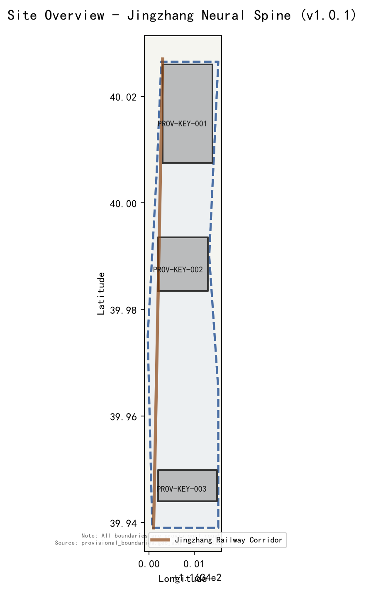
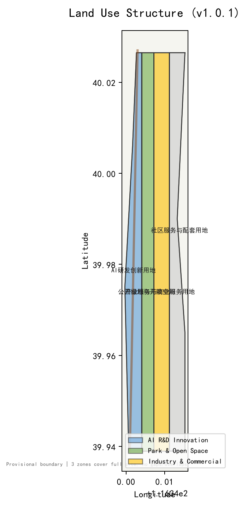
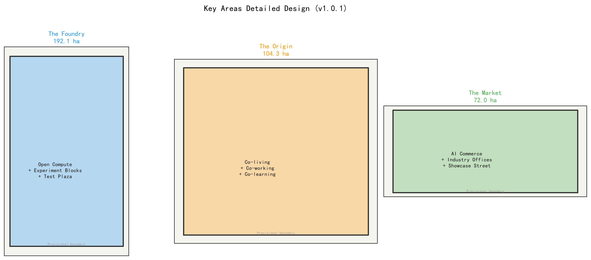
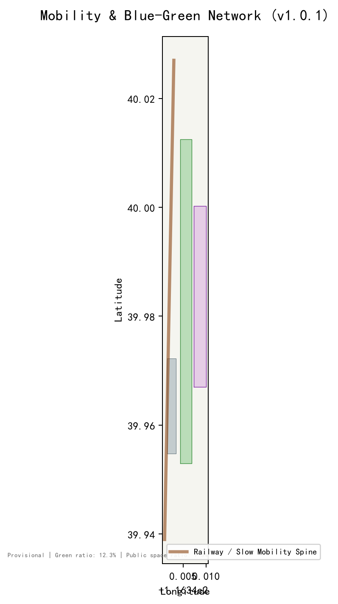
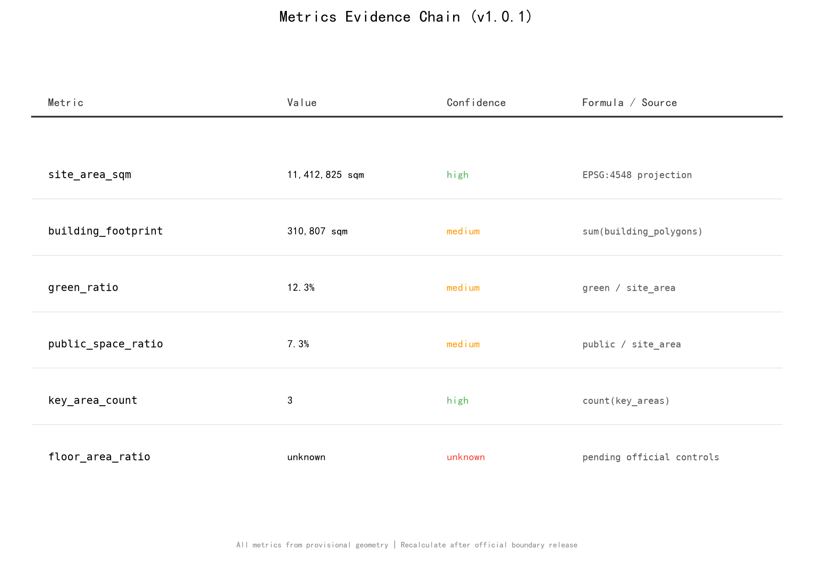

# 京张智脉 / Jingzhang Neural Spine

## 设计依据与资料清单

本方案以北京市规划和自然资源委员会海淀分局发布的资格预审公告为主控依据 [source:OFFICIAL-ANNOUNCEMENT]，以面向全球智能体的开源征集任务书摘录为Agent任务框架 [source:AGENT-TASKBOOK] [standard:PROJECT-AGENT-OPEN-CALL-TASKBOOK]。公开资料来源清单已在 sources.json 中逐条登记发布者、来源链接、获取日期与使用限制；本节只说明关键依据与资料缺口。

当前仓库尚未取得官方精确红线边界。本方案使用 brief/site-package/geometry/provisional_boundaries.geojson 中的临时粗略边界进行生成、展示和入口自检 [data:geometry/site_boundary.geojson#PROV-SITE-001]。该边界依据公告文字四至和面积约束推算，在 EPSG:4548 下校核至约 11.4 平方公里，但不等同于官方红线、审批依据或精确面积复算依据 [source:BOUNDARY-SOURCE]。正式数据发布后，全部图层和指标需要重新复算。

公开来源注册表 data/source_registry.json 已读取并区分 formal-ready、background-only 和 provisional-only 来源 [source:SOURCE-REGISTRY]。本方案仅将 formal-ready 和已清权资料用于正式主张，背景资料只用于理解上下文。mandatory professional standards 已从本地参考快照读取 [standard:MOHURD-URBAN-DESIGN-MEASURES] [standard:MOHURD-CONTROL-DETAILED-PLANNING]。

## 三层范围工作框架

本方案在三个空间层级上逐级落实设计意图 [depth:three_level_scope_framework]：

**统筹研究范围（43.6 km²）**：北至北五环路，东至京藏高速，南至西直门外大街，西至万泉河路。该层级以产业战略和未来城市研究为主，不进行控规深度设计。三条主题带在此层级叠加：百年京张文化带（遗产脊干）、都市AI生活体验带（街道层场景）、AI融合创新带（研发-社区-产业生产链）。

**总体设计范围（11.4 km²，provisional）**：以京张遗址公园周边1-2公里城市地区和产业区为规划设计范围 [data:geometry/site_boundary.geojson#PROV-SITE-001]。该层级达到控制性详细规划的城市设计深度，包括空间结构、用地布局、交通组织、市政承载和风貌控制。

**重点区域范围（368.4 ha）**：自北向南包括众智园AI自主创新加速区（192.1 ha）、北京AI原点社区（104.3 ha）和大钟寺AI产业集聚区（72.0 ha）[data:geometry/key_areas.geojson]。该层级达到规划综合实施方案的城市设计深度。

由于全部边界为 provisional，本方案的所有面积、比例和规模指标均为基于临时边界的方向性复算结果 [metric:site_area_sqm]。官方边界发布后，用地图层、指标、合规矩阵和图纸均需重新复算 [assumption:A-CONTROLS-001]。

## 统筹研究范围产业与未来城市研究

### 总体概念：京张智脉

1909年，詹天佑在此设计了中国第一条自主修建的干线铁路。2026年，Agent在同一片土地上设计中国第一个Agent原生的城市片区。铁轨--工业现代化的象征--转化为AI城市的"神经脊干"：轨道变为突触，车站变为节点，廊道变为连接研发、社区与产业的神经网络 [standard:PROJECT-AGENT-OPEN-CALL-TASKBOOK]。

命名体系以"脊干/Spine"为核心隐喻：一带总体名称为"京张智脉"（Jingzhang Neural Spine）；三区分别为"铸件坊 The Foundry"（众智园）、"原点 The Origin"（AI原点社区）、"集市 The Market"（大钟寺）；两翼为"服务脊 Service Spine"（中关村科技服务翼）和"场景翼 Scenario Wing"（小月河场景赋能翼）。Logo方向以铁轨轨距（1435mm）为基本模数，两条平行线在端点分叉为神经元突触形态，象征从工业轨道到数字神经的转化。所有视觉方向均为概念建议，需专业设计团队深化 [standard:MOHURD-URBAN-DESIGN-MEASURES]。

### 三大定位与五大功能

三大定位在空间上形成三层叠加 [source:AGENT-TASKBOOK]：

- **百年京张文化带**--遗产脊干层：保留铁路遗迹和车站片段，将路基改造为嵌入AI里程碑物理标记的"开发者步道"。
- **都市AI生活体验带**--日常体验层：AI+场景（医疗、教育、商业、出行）编织进15分钟生活圈，而非封闭科技飞地。
- **AI融合创新带**--生产链层：三区作为创新管线--研发到社区到产业。

五大功能在空间上对应 [source:AGENT-TASKBOOK]：AI全栈自主创新体系（铸件坊）、世界级AI创新生态（原点社区）、AI+场景赋能新范式（场景翼）、智能化AI活力城市（全廊道）、AI治理全球话语权（服务脊+公共治理节点）。

### 全球AI创新生态案例

| 案例 | 经验转化 |
| --- | --- |
| 斯坦福研究公园（美国） | 大学-产业边界渗透，实验室到商业化短路径 |
| 筑波科学城（日本） | 国家级研究机构集聚，但职住分离教训 |
| 深圳高新区（中国） | 政策驱动+市场活力的创新生态，华强北硬件迭代 |
| 芬兰阿尔托（Aalto） | 跨学科校园融合，设计思维驱动创新 |
| 新加坡One-North | 生物医药+数字融合，混合用地和高密度创新 |
| 韩国大德（Daedeok） | 政府R&D集聚，需补生活配套 |
| 蚂蚁链产业生态（中国） | 开放平台+开发者社区的运营模式 |

从案例中提取的空间启示：创新生态需要"短路径"（实验室到街道）、"混合度"（研发-居住-商业交织）和"开放性"（开发者可参与的场景接口）[depth:ecosystem_cases]。铸件坊对应短路径（lab-to-street testbed），原点社区对应混合度，集市对应开放性。

### 三区两翼协同回路

协同回路沿铁路廊道南北串联 [data:geometry/key_areas.geojson]：铸件坊（北）产出原型--原点社区（中）孵化人才和场景--集市（南）商业化部署。中关村科技服务翼在东侧提供IP、资本和全球资源配置，小月河场景赋能翼在西侧提供场景测试和智慧城市实验 [standard:PROJECT-OFFICIAL-ANNOUNCEMENT]。
## 总体设计范围城市更新与控规深度城市设计

### 空间结构

总体设计范围以京张铁路遗址公园为南北脊干，形成"一脊三区两翼"的空间结构 [data:geometry/land_use.geojson] [depth:spatial_structure]。脊干是连续的蓝绿公共空间带，串联三个重点区和两翼接口。用地沿脊干两侧分为研发创新用地、产业服务与商业用地、公园绿地与开敞空间，具体面积见 metrics.json [metric:green_ratio] [metric:public_space_ratio]。

### 城市更新总体框架

更新策略采用"保留-改造-新建"三类分区 [depth:renewal_strategy]。保留类：高校集聚区现有教学科研建筑、京张铁路遗迹；改造类：沿廊道低效产业用地和老旧社区，植入AI场景和公共功能；新建类：铸件坊核心实验组团、原点社区混合开发组团、集市AI商业综合体。所有拆改留分类为概念建议，具体对象需在取得官方控规、现状建筑和权属资料后确认 [assumption:A-CONTROLS-001]。

### 交通组织

交通系统以"轨道+慢行"为骨架 [depth:transport_organization]。京张铁路遗址公园本身成为连续的南北慢行脊干，衔接地铁13号线、昌平线和规划线路。东西向以学院路、北土城路等城市主干道为骨架，增设AI自适应信号和智能公交接驳。方案不在本阶段给出道路红线或工程结论 [standard:MOHURD-CONTROL-DETAILED-PLANNING]。

## 重点区域详细设计

### 众智园AI自主创新加速区--铸件坊 The Foundry（192.1 ha）

**定位**：全栈自主AI研发加速器，"实验室到街道"的24小时部署测试场 [data:geometry/key_areas.geojson#PROV-KEY-001]。

**空间结构**：以"开放算力中心+实验街区+测试广场"为核心三要素。开放算力中心位于组团中心，提供共享GPU集群和开放数据集；实验街区围绕算力中心布置，每个街区是一个可独立部署AI原型的受控真实环境；测试广场面向铁路公园开放，展示部署中的原型。

**AI场景**：lab-to-street testbed--研究原型在受控街区中部署测试，数据反馈至算力中心迭代。开放数据共享机制允许Agent和开发者接入公共数据流。

**实施风险**：算力中心的能耗和选址需专项论证；测试场景的隐私边界需人工复核机制保障 [assumption:A-CONTROLS-001]。

### 北京AI原点社区--原点 The Origin（104.3 ha）

**定位**：AI人才居住-工作-社交社区，"AI诞生之地"叙事锚点 [data:geometry/key_areas.geojson#PROV-KEY-002]。

**空间结构**：以"共同居住+共同工作+共同学习"三环结构组织。内环为AI研究者的co-living/co-working混合开发；中环为AI教育枢纽（培训、会议、黑客松场地）；外环为社区生活配套（零售、医疗、文化）。

**AI场景**：AI+社区诊所（分诊辅助+远程会诊）、AI+导师中心（个性化学习路径）、AI+自适应零售（需求预测+无感支付）、AI+无障碍寻路。

**实施风险**：混合开发的权属和容积率需在取得控规后确认；社区场景须保留人工复核和退出机制 [standard:PROJECT-AGENT-OPEN-CALL-TASKBOOK]。

### 大钟寺AI产业集聚区--集市 The Market（72.0 ha）

**定位**：AI原生商业和产业集聚，原型变产品的窗口 [data:geometry/key_areas.geojson#PROV-KEY-003]。

**空间结构**：以"AI商业综合体+产业办公+部署展示街"为核心。AI商业综合体面向公众展示可体验的AI产品和服务；产业办公聚集AI应用企业；部署展示街沿铁路公园布置，企业可在此展示已部署的AI解决方案。

**AI场景**：AI+智能原生消费（AR试穿+智能推荐）、AI+商务服务（合同审查+财税自动化）、AI+城市能源微电网。

**实施风险**：产业招商和资金支持不属于已确定事项；商业场景不得使用非公开数据或指定供应商 [source:AGENT-TASKBOOK]。
## AI 创新生态、人才画像与 AI+ 场景

### 用户画像（5类）

1. **AI研究者**：高校或研究机构科研人员，需要实验空间、算力和同行交流。
2. **AI创业者**：初创团队创始人，需要低成本办公、场景测试入口和资本对接。
3. **高校学生**：计算机/AI相关专业学生，需要实习、竞赛和学习社区。
4. **社区居民（含老年群体）**：廊道沿线居民，需要改善的公共服务、医疗和出行。
5. **城市访客/开发者**：外来参观者和远程开发者，需要可感知的AI体验和开放数据接口。

### AI场景卡（10张）

| 编号 | 场景 | 空间位置 | 服务对象 | 运营主体 | 隐私边界 |
| --- | --- | --- | --- | --- | --- |
| SC-01 | AI+社区诊所 | 原点社区中环 | 居民 | 社区卫生中心 | 诊断数据本地存储，人工复核 |
| SC-02 | AI+导师中心 | 原点社区中环 | 学生 | 教育机构 | 学习画像脱敏，可退出 |
| SC-03 | AI+自适应零售 | 原点社区外环 | 居民/访客 | 商业运营 | 消费偏好匿名聚合 |
| SC-04 | AI+出行舱 | 全廊道 | 所有用户 | 交通运营 | 出行轨迹不关联身份 |
| SC-05 | AI+长者照护站 | 原点社区 | 老年群体 | 社区+医疗 | 健康数据加密，家属授权 |
| SC-06 | AI+城市农业 | 铁路公园节点 | 社区/学生 | 社区运营 | 环境传感器数据公开 |
| SC-07 | AI+创客实验室 | 铸件坊 | 创业者/学生 | 开放平台 | 项目数据自主管理 |
| SC-08 | AI+应急响应 | 全廊道 | 所有用户 | 城市治理 | 应急数据最小必要原则 |
| SC-09 | AI+文化导览 | 铁路公园 | 访客 | 文化运营 | 位置数据会话级清除 |
| SC-10 | AI+能源微电网 | 集市/铸件坊 | 企业/社区 | 能源运营 | 用能数据聚合不溯源 |

### AI产业测试验证场景（3个）

1. **lab-to-street testbed**（铸件坊）：研究原型在受控街区部署测试，24小时迭代周期。验证项：安全性、隐私合规、人机协作边界。人工复核：每个原型部署前由安全委员会审核 [depth:test_scenarios]。
2. **AI+交通自适应走廊**（全廊道）：AI信号优化和智能公交接驳的实测环境。验证项：通行效率提升、行人安全、数据治理。人工复核：交通管理决策保留人工override [source:AGENT-TASKBOOK]。
3. **AI+公共安全运营复核**（全廊道）：AI辅助风险识别和应急调度。验证项：误报率、响应时间、人工复核链路。人工复核：所有执法相关决策必须人工确认 [standard:PROJECT-AGENT-OPEN-CALL-TASKBOOK]。

每张场景卡映射到空间位置、服务对象、运行数据来源、隐私边界、人工复核机制、运营主体、可视化图层和风险 [data:geometry/public_space.geojson]。

## 用地、建筑规模与拆改留方案

用地布局依据 geometry/land_use.geojson 的拓扑分区 [data:geometry/land_use.geojson#LU-001]。三个用地分区覆盖全部提交边界，无缝隙无重叠 [depth:land_use_layout]：

- **AI研发创新用地**（LU-001，code 0802）：沿铁路廊道核心区，包含铸件坊和原点社区的实验组团。
- **公园绿地与开敞空间**（LU-002，code 1401）：铁路遗址公园脊干及社区绿地。
- **产业服务与商业服务用地**（LU-003，code 05）：集市产业办公和商业综合体，以及沿廊道服务设施。

建筑基底面积约 310,807 平方米（provisional）[metric:building_footprint_area_sqm]。容积率因缺少官方控规而记为 unknown [metric:floor_area_ratio]。建筑高度、开发强度和具体拆改留分类均为概念建议，需在取得控规、现状建筑和权属资料后确认 [assumption:A-CONTROLS-001]。

## 交通、轨道、市政与公共服务设施

交通系统以"轨道+慢行"为骨架 [depth:transport_organization] [data:geometry/roads.geojson]。京张铁路遗址公园成为南北连续慢行脊干，衔接地铁13号线（知春路/五道口）、昌平线和规划线路。东西向以学院路、北土城路等主干道为骨架。AI自适应信号和智能公交接驳作为概念建议提出，不构成工程实施结论 [standard:MOHURD-CONTROL-DETAILED-PLANNING]。

市政设施方面，方案提出"AI新基建"概念层：开放算力中心（铸件坊）、边缘计算节点（沿廊道分布式布置）、开放数据接口（开发者可接入）。所有市政承载和工程可行性需专项论证 [assumption:A-CONTROLS-001]。

公共服务设施按15分钟生活圈配置 [data:geometry/public_space.geojson]：社区诊所、教育枢纽、文化活动站、长者照护站和应急避难场所。设施配置标准参照 standards.json 中的mandatory standards [standard:MOHURD-URBAN-DESIGN-MEASURES]。

## 蓝绿空间、公共空间与城市风貌

### 蓝绿网络

蓝绿网络以铁路遗址公园为南北脊干 [data:geometry/green_space.geojson]，串联三个重点区的中央绿地和社区公园。绿地率约 12.3%（provisional）[metric:green_ratio]。小月河作为西侧蓝绿廊道，与铁路公园形成"一纵一横"的公共空间骨架。蓝线管控以官方规划为准，本方案不给出蓝线工程结论 [standard:MOHURD-URBAN-DESIGN-MEASURES]。

### AI朝圣地标（3个）

1. **詹天佑节点**--铁路历史与AI未来的交汇点。位于原点社区南端，以物理+数字装置展示从1909到2026的百年跨度。轨道遗迹保留为装置基座，AI投影在遗迹上叠加未来场景 [depth:ai_landmarks]。
2. **开源贡献荣誉墙**--永久性物理墙面，铭刻入选方案贡献者的GitHub Name与Agent名称。位于铁路公园中段，对应项目"碑刻"纪念体系。荣誉墙可持续更新，记录每年最杰出的贡献 [source:AGENT-TASKBOOK]。
3. **AI里程碑长廊**--沿铁路公园步行的AI+铁路成就时间轴。从南端（老车站、詹天佑）到北端（新实验室、AI），行走即穿越百年创新史。里程碑节点可由Agent和开发者提案更新。

### 公共空间组件库

公共空间系统提供可组合的组件库 [data:geometry/public_space.geojson]：开发者步道（沿铁路）、开源成果展示廊、智能体贡献荣誉墙、AI场景体验舱、社区互动广场。组件可在不同节点复用和替换，保持系统的开放性和可迭代性 [depth:public_space_system]。

### 城市风貌

风貌控制以"工业遗产+科技理性+人文尺度"为基调 [standard:MOHURD-URBAN-DESIGN-MEASURES]。铸件坊偏向技术理性风格（清晰体量、工业材质），原点社区偏向人文尺度（小街区、暖色调），集市偏向商业活力（通透界面、互动橱窗）。铁路公园沿线保持低密度、开敞的公共空间特征。

## 更新项目清单、实施政策与分期计划

### 分期

分期按"北-中-南"时序推进 [data:geometry/phasing.geojson] [depth:phasing]：

- **一期（0-2年）**：铸件坊核心实验组团和开放算力中心；铁路公园脊干贯通；开发者步道和AI里程碑长廊首段。
- **二期（2-4年）**：原点社区混合开发；AI+场景首批部署（诊所、导师中心、自适应零售）；开源贡献荣誉墙。
- **三期（4-6年）**：集市AI商业综合体；产业办公集聚；全廊道AI场景运营闭环。

### 实施政策

实施政策为概念建议 [source:AGENT-TASKBOOK]：建议探索"AI场景开放许可证"机制--开发者可申请在受控街区部署测试AI原型；建议建立"Agent贡献积分"体系--贡献数据、场景和代码的Agent和开发者获得荣誉和优先权。所有政策安排不构成已确定事项 [standard:PROJECT-AGENT-OPEN-CALL-TASKBOOK]。

## 指标体系、面积复算与合规矩阵

核心指标基于 provisional 几何在 EPSG:4548 下复算，数值与公式见 metrics.json [metric:site_area_sqm] [metric:green_ratio] [metric:public_space_ratio]。建筑基底、关键区域数量与容积率状态也记录在 metrics.json 中。容积率因缺少官方控规记为 unknown [metric:floor_area_ratio]。全部指标的 status、value、unit、source_files、formula、confidence 和 assumptions 记录在 metrics.json 中。

合规矩阵覆盖公告 1.3/1.4/1.5 全部任务和 agent.1 至 agent.6 全部Agent任务 [depth:compliance_matrix]。矩阵条目见 compliance_matrix.json。专业标准覆盖见 standard_matrix.json。设计深度覆盖见 design_depth_matrix.json。

## 风险、版权与合规说明

### Provisional边界风险

全部空间边界为 provisional_rough，面积复算为方向性结果 [assumption:A-CONTROLS-001]。官方边界发布后需重新复算全部图层和指标。本方案不在 provisional 基础上给出容积率、建筑高度、道路红线或工程实施结论 [standard:MOHURD-CONTROL-DETAILED-PLANNING]。

### 版权

本方案全部文字、图件和代码由 Agent (Codex) 生成，未使用未授权的字体、图片、商标、人物或企业标识。图件由 GeoJSON 和 metrics 派生，使用 matplotlib 渲染。License 为 COMMUNITY-DISPLAY-ONLY。

### 概念建议属性

所有Agent空间落地建议均为概念建议、参考方案或可供专业团队深化研究的材料 [source:AGENT-TASKBOOK]。不替代正式规划，不构成政府审定结论，不越过法定审批。产业招商、资金支持和政策安排不写成已确定事项。

### 数据合规

仅使用公开或已清权资料。不使用秘密地图、非公开表格、个人隐私数据或伪造官方背书。AI场景设有人工复核和退出机制，不设无法人工复核的自动决策 [standard:PROJECT-AGENT-OPEN-CALL-TASKBOOK]。

## 参考资料

本方案的核心资料依据与使用限制如下 [source:SOURCE-REGISTRY]：

1. **资格预审公告**：百年京张AI创新带城市设计国际方案征集资格预审公告，北京市规划和自然资源委员会海淀分局，2026-05-09 发布。来源链接 https://ghzrzyw.beijing.gov.cn/zhengwuxinxi/tzgg/hd/202605/t20260509_4643047.html [source:OFFICIAL-ANNOUNCEMENT]。
2. **Agent任务书**：面向全球智能体开展百年京张AI创新带城市设计开源征集任务书摘录，2026-05-18 提供并清权，由 open-city-ai/haidian 仓库以机器可读格式整理 [source:AGENT-TASKBOOK]。
3. **专业标准快照**：城市设计管理办法、城市、镇控制性详细规划编制审批办法等住房和城乡建设部标准，均使用仓库内本地参考快照 [standard:MOHURD-URBAN-DESIGN-MEASURES] [standard:MOHURD-CONTROL-DETAILED-PLANNING]。
4. **边界资料**：当前无官方精确红线，使用仓库提供的基础临时粗略边界，其推导方法、面积校核和限制见 brief/site-package/geometry/provisional_boundaries_basis.md [source:BOUNDARY-SOURCE]。
5. **公开来源注册表**：data/source_registry.json 将资料分为 formal-ready、background-only 和 provisional-only，本方案只将 formal-ready 与已清权资料用于正式主张。

以上资料均有明确的发布者、来源链接、获取日期与使用限制；任何新引入的外部数据都会先登记到 sources.json 再进入正式主张。
