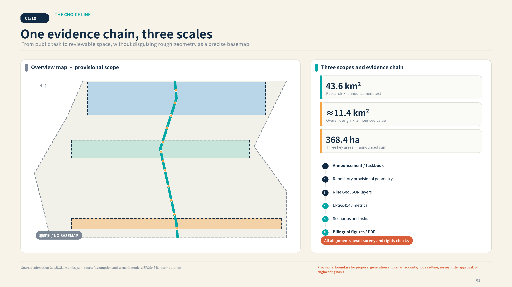
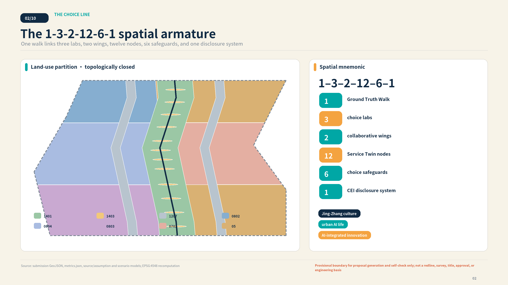
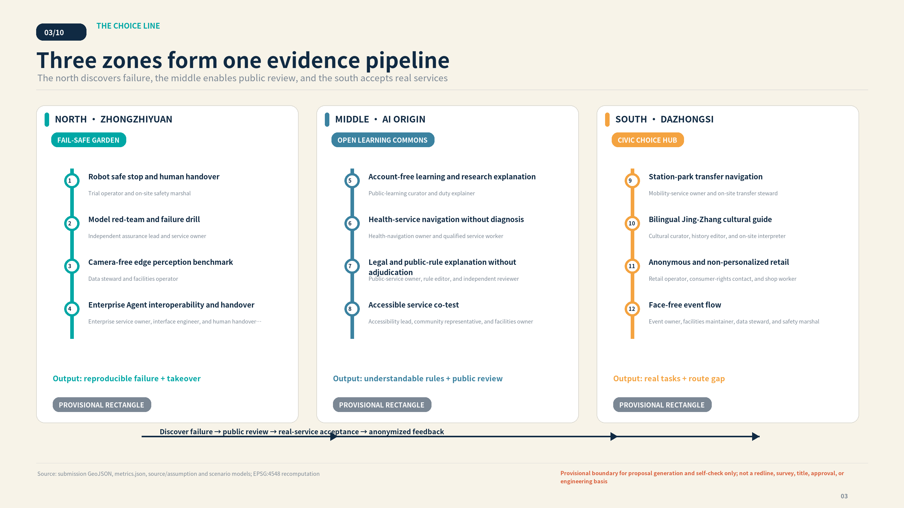
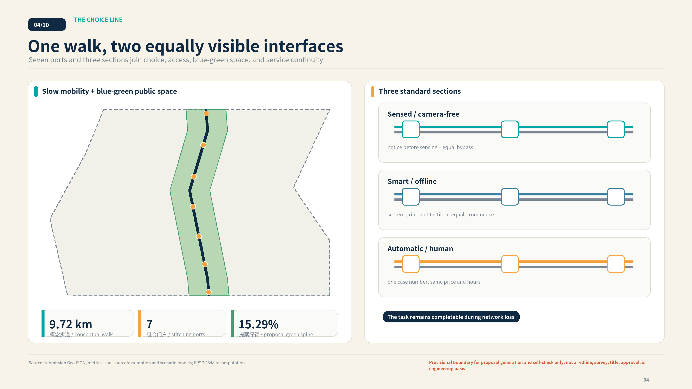
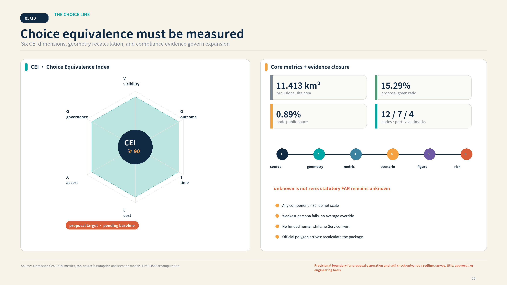

# THE CHOICE LINE / 京张选择线

> **AI is present. People retain the choice.** This proposal is not anti-AI. It measures AI progress by whether the city can improve a service without punishing a person who declines AI. Every spatial and policy item is an open co-creation proposal, not an approved government decision, statutory plan, engineering alignment, or implementation promise.
## Design Basis and Source List

The official call supplies the project objectives, three scope levels, three key areas, and deliverable context [source:OFFICIAL-ANNOUNCEMENT] [standard:PROJECT-OFFICIAL-ANNOUNCEMENT]. The Agent taskbook supplies the co-creation principles, six mandatory Agent tasks, operational requirements, and the rule that spatial ideas remain proposals [source:AGENT-TASKBOOK] [standard:PROJECT-AGENT-OPEN-CALL-TASKBOOK]. The site package, source registry, and processed fact pack respectively provide machine-readable constraints, source-use classification, and navigation; none becomes a new administrative authority [source:SITE-PACKAGE] [source:SOURCE-REGISTRY] [source:PROCESSED-FACT-PACK]. Professional reasoning maps to urban-design, regulatory-planning, and land-use-classification sources [source:STANDARDS-REGISTRY] [standard:MOHURD-URBAN-DESIGN-MEASURES] [standard:MOHURD-CONTROL-DETAILED-PLANNING] [standard:MNR-LAND-USE-CLASSIFICATION-GUIDE]. The architecture-depth record remains a declared data gap [standard:MOHURD-ARCH-DESIGN-DEPTH-2016].

The decisive limitation is geometric. The repository currently provides rough maintainer-defined polygons inferred from public text [source:BOUNDARY-SOURCE] [source:KEY-AREA-SOURCE]. They remain `provisional_constraint`, `official_boundary=false`, and `boundary_precision=provisional_rough` [data:geometry/site_boundary.geojson#SITE-001] [data:geometry/constraints.geojson#G-CONSTRAINT-PROV-BOUNDARY]. They support generation, topology, comparison, and display, but they cannot establish a statutory redline, title, road alignment, development intensity, utility capacity, investment, or approval. Official or cleared geometry must trigger one coordinated recalculation of every affected layer and metric [depth:existing_conditions_diagnosis] [depth:risk_missing_data].

The authority order is GeoJSON, metrics, the three evidence matrices, manifest/sources/assumptions/self-check, readable proposal, and finally the presentation artifacts. Every displayed number returns to structured evidence. Every precedent separates verified fact, Jing-Zhang inference, and a non-transferable boundary. Every target is labeled as a design target, never current performance.

## Three-Level Scope Framework

The announcement describes an approximately 43.6-square-kilometre coordinated research area, an approximately 11.4-square-kilometre overall design area, and 368.4 hectares of key areas. This package spatially models only the repository's provisional overall-design polygon. Its EPSG:4548 area is approximately 1141.28 hectares [metric:site_area_sqm]; the small difference from the announced rounded value is evidence of a working substitute, not improved official precision. Each key area retains the announced text area beside the area recomputed from provisional geometry [data:geometry/key_areas.geojson#G-DESIGN-NORTH] [metric:key_area_count] [metric:key_area_north_sqm] [metric:key_area_center_sqm] [metric:key_area_south_sqm].

The memorable spatial formula is **1-3-2-12-6-1**: one Ground Truth Walk, three choice labs, two collaborative wings, twelve Service Twin nodes, six choice safeguards, and one CEI disclosure system. The north is the Fail-Safe Garden, the middle is the Open Learning Commons and public-review ground, and the south is the Civic Choice Hub. The Zhongguancun technology-service wing contributes standards, law, talent, capital, and independent assurance; the Xiaoyue River scenario wing contributes community co-design, environmental and robotics trials, and public feedback. These are collaborative roles, not invented legal boundaries [depth:three_level_scope_framework].

The six safeguards are choice before collection; purpose limitation and minimum data; an AI/human-or-offline Service Twin; named human takeover; withdrawal, correction, and appeal; and public version, failure, and CEI evidence. They appear as two equally prominent interfaces along one walk—not two proposed nine-kilometre engineering tracks. Seven stitching ports connect stations, parks, neighbourhoods, campuses, and enterprises, subject to transport, accessibility, title, fire, and construction verification [data:geometry/roads.geojson#G-CORRIDOR-GTW-01] [metric:stitching_port_count].

The three official themes become one operating system: the Centennial Jing-Zhang cultural belt narrates engineering autonomy as public autonomy; the urban AI life-experience belt delivers completable services; the AI integration and innovation belt turns red-team, interoperability, and field evidence into responsible scale. Service Twin prevents culture, industry, and daily life from becoming three disconnected branding layers [agent.1].

## Coordinated Research Area: Industry and Future City Research

A world-class AI ecosystem is not defined here by a higher count of screens, models, or headquarters. It is a closed chain from basic research to public assurance, bounded trial, scenario procurement, patient capital, long-term operation, and public correction. The north produces failure evidence and portable interfaces; the middle makes knowledge, talent, and public review visible; the south tests transport, culture, retail, and event services against real tasks. The two wings supply standards, law, capital, community, and environmental feedback. Innovation scales only after it funds human handover and proves that failure does not remove essential service [agent.2] [depth:overall_spatial_structure].

Four parties close each operational loop. A service Agent performs the task. An on-device Choice Agent explains permissions before collection and can issue a non-identifying choice receipt. An Assurance Agent runs red-team, bias, failure, and counterfactual-gap tests. A named human owner performs final review, takeover, and appeal handling. AI is used creatively to generate Service Twins, identify groups harmed by fallback, simulate interruption, and support incident learning. High-risk judgment, final accountability, and government authority never transfer to the model. A person without a phone, account, or biometric identifier can still complete the task.

The eight precedents below come from first-party publisher pages. Only mechanisms are transferred; no foreign law, site, governance structure, or performance claim is copied into Beijing:

| Case and source | Verified fact | Jing-Zhang transfer | Non-transferable boundary |
| --- | --- | --- | --- |
| CASE-AMS-ALGO · Amsterdam algorithm register and human appeal [source:CASE-AMS-ALGO] | The city discloses the purpose, data, legal basis, human involvement, and risks of ANPR enforcement; disputed images receive renewed human review. | Publish a decision card for every rights-affecting service and provide a human review and non-digital appeal route independent of the original automated result. | The mechanism relies on Dutch administrative law and identity infrastructure; registry disclosure is neither independent audit nor universal opt-out. |
| CASE-NO-SANDBOX · Norwegian data-protection regulatory sandbox [source:CASE-NO-SANDBOX] | Norway's data protection authority gives a small number of real projects multidisciplinary guidance, including project plans, DPIA work, design feedback, and published lessons without granting approval. | Create a compliance co-design room in the AI Origin Community where legal, technical, operational, and public representatives agree test plans and publish reusable exit reports. | Sandbox advice is not approval, certification, or a binding decision; participants retain compliance responsibility and the jurisdictional structure cannot be copied. |
| CASE-SG-ASSURANCE · Singapore Global AI Assurance Sandbox [source:CASE-SG-ASSURANCE] | IMDA and the AI Verify Foundation pair deployed generative-AI applications with independent testers to examine hallucination, leakage, adversarial behavior, human oversight, and remedy at application level. | Use a deployer, site owner, and independent tester triad in Zhongzhiyuan, publishing risk hypotheses, failure thresholds, remediation, and retirement records. | The sandbox is neither a software runtime nor regulatory approval; technical testing does not replace process governance, legal review, or foundation-model safety. |
| CASE-XROAD · Estonian X-tee / X-Road exchange layer [source:CASE-XROAD] | Data moves directly between service providers and consumers instead of a central broker; providers control access while security servers sign, log, and verify requests and responses. | Use source-retained data, service-specific authorization, revocable trust anchors, and verifiable call logs for cross-district cooperation rather than a single urban data lake. | X-Road is not identity, portal, or complete governance; endpoint authorization, data classification, and citizen-visible records still require separate design. |
| CASE-MIT-IHQ · MIT Kendall Square / InnovationHQ [source:CASE-MIT-IHQ] | InnovationHQ co-locates seed funding, student venture studios, prototyping, mentors, and translation programs; Kendall Square also combines housing, childcare, retail, and public space. | Use a city-open ground floor and specialized upper-floor program stack in the Origin Community, funding operations alongside prototyping, IP, mentors, and capital services. | MIT's research density, brand, land, and capital network are not transferable, and the evidence does not show that buildings alone cause commercialization. |
| CASE-GOVUK-ASSISTED · GOV.UK Assisted Digital and cross-channel service [source:CASE-GOVUK-ASSISTED] | Government service teams must research people lacking access, skills, trust, or confidence, provide free sustainable phone, in-person, or assisted-digital support, and measure performance. | Give phone, paper, in-person, and AI routes one service identifier; never hide the human channel, and feed offline failure evidence back into service improvement. | The guidance requires the channel mix users need, not every channel at all times, and disability access still needs its own research and formats. |
| CASE-NYC-OPEN-DATA · New York City statutory open-data governance [source:CASE-NYC-OPEN-DATA] | New York sustains its portal and public feedback through law, agency data coordinators, asset inventories, publication plans, plain-language data dictionaries, and annual reporting. | Assign a data steward for each participating district, campus, park, and operator, publishing classification, update cadence, field definitions, quality checks, and correction tickets. | Only legally publishable data is open; a portal cannot guarantee completeness or fitness and does not replace privacy review or sustained maintenance staff. |
| CASE-ROTTERDAM-WATER · Rotterdam Benthemplein water square [source:CASE-ROTTERDAM-WATER] | The square supports sport, rest, and children's activity in dry weather, then uses channels, pipes, and level changes to collect nearby rainwater and release or infiltrate it later. | Design Dazhongsi event space for everyday use and stormwater storage, combining shade, seating, sediment cleaning, and programming in one maintenance brief. | Its storage capacity cannot be copied; runoff pollution, freeze-thaw, infiltration, child safety, and utility conditions require Beijing-specific calculation. |

The resulting ecosystem has seven accountable transitions: reproducible research; isolated trial; independent risk evidence; co-acceptance with eight personas; dual-route field measurement; standard, legal, IP, and finance support; and a long-term contract covering shifts, equipment, energy, complaints, deletion, and withdrawal. Procurement should accept “one outcome, two routes, one owner, and an exit-ready version,” not reward registrations or data volume. Primary records are [source:CASE-AMS-ALGO] [source:CASE-NO-SANDBOX] [source:CASE-SG-ASSURANCE] [source:CASE-XROAD] [source:CASE-MIT-IHQ] [source:CASE-GOVUK-ASSISTED] [source:CASE-NYC-OPEN-DATA] [source:CASE-ROTTERDAM-WATER].

## Overall Design Area: Urban Renewal and Regulatory-Plan-Level Urban Design

The overall design is not a fictional new-town master plan for 11.4 square kilometres. It is a reversible and measurable civic interface that stitches an existing city. Ground Truth Walk forms a conceptual north-south armature inside the provisional boundary. Its plazas, continuous green spine, and service-access edges derive from one geometry model. The land-use layer uses registered codes `1401/1403/1207/0802/0804/0803/0702/05`; its polygons have no overlap and their union equals SITE-001 [data:geometry/land_use.geojson#LU-GREEN-SPINE] [depth:land_use_layout]. This is an internally complete comparison surface, not a statutory land-use amendment.

The spatial sequence is walk—choice threshold—twin desks—human review—public disclosure. Before a data zone, a visitor encounters the choice threshold. AI and human/offline interfaces have equal scale, typography, lighting, hours, and accessible arrival. Paper and tactile wayfinding can complete the task independently. A printed or local receipt proves that a rule was shown without becoming an identity token. The Human Review Hall discloses the accountable owner, appeal clock, version, and anonymized failure. The approximately 9.72-kilometre length is calculated from proposal geometry [metric:ground_truth_walk_length_m] and is always marked conceptual and subject to survey and rights verification.

The brand system uses THE CHOICE LINE as the belt, Fail-Safe Garden, Open Learning Commons, and Civic Choice Hub as the labs, Ground Truth Walk as the public journey, and Choice Equivalence Index as the governance measure. A proposed mark turns one railway sleeper into a six-cell CEI ruler; two equal fine lines represent AI and its Service Twin, not physical tracks. The palette is deep Jing-Zhang blue `#102A43`, choice teal `#00A7A5`, human warm orange `#F4A340`, paper ivory `#F7F3E8`, and provisional grey `#7B8794`. Trademark, font, and wayfinding review remains required.

Six small conceptual pavilions host assurance, learning, review, and climate-event functions [data:geometry/buildings.geojson#BLDG-01]. Their footprints and storeys exist to test design relationships and area calculations. They do not assign demolition, development rights, approved height, or a construction programme before parcel, planning-control, fire, utilities, heritage, and title evidence exists [depth:development_intensity_controls] [depth:height_massing_character].

## Detailed Design of Key Areas

All three key-area polygons are provisional rough rectangles. They appear as low-contrast dashed locating devices, never parcel, road, or approval boundaries [source:KEY-AREA-SOURCE]. Detailed design therefore concentrates on movable components, operating sequences, node relationships, and expansion gates instead of fabricating master-plan precision [depth:three_key_area_detailed_design].

### North: Fail-Safe Garden

The north hosts S01-S04: robot safe stop and human handover, model red-team and failure drills, a camera-free edge-perception benchmark, and enterprise Agent interoperability and migration. A reversible test loop, physical stop, isolated test cell, camera-free bypass, takeover desk, and incident-review terrace make failure observable. The output is not certification; it is versioned evidence with reproduction steps, applicability limits, and a human owner. Qinghe ecology, roads, and infrastructure remain unverified [data:geometry/key_areas.geojson#G-DESIGN-NORTH].

### Middle: Open Learning Commons and public review

The middle hosts S05-S08: account-free learning, health-service navigation without diagnosis, legal and public-rule explanation without adjudication, and accessible co-acceptance. The Human Review Hall turns back-office responsibility into civic space: one cross-channel case number, work tables, an appeal clock, an anonymized failure archive, staff rest space, and an annual public-review wall. Universities, communities, and developers participate under clear consent, fair compensation, and withdrawal; residents are not free test data [data:geometry/key_areas.geojson#G-DESIGN-CENTER].

### South: Civic Choice Hub

The south hosts S09-S12: station-park transfer, bilingual Jing-Zhang interpretation, anonymous non-personalized retail, and face-free event flow. Smart, paper, and staffed routes appear together at entry. The open civic room and community market test price, hours, and completion parity. A shade-storm dual-mode square uses aggregate counts and retains human announcement. Hydraulic capacity, station operations, commercial leases, and heritage conditions await professional work [data:geometry/key_areas.geojson#G-DESIGN-SOUTH].

Four landmarks cross the three zones and are all labelled “proposal; not selected or implemented”:

| Landmark | Civic role | Spatial components |
| --- | --- | --- |
| LM-01 · Choice Mile Zero | Extend the engineering autonomy of 1909 into public autonomy to understand, choose, and keep receiving service in the AI era. | Twin-line sleeper portal, approximate-distance caveat, tactile overview, staffed help, and a no-data paper trailhead. |
| LM-02 · Human Review Hall | Turn model limits, appeals, takeover, and accountable ownership from a back-office process into visible civic space. | One-number cross-channel desks, review tables, appeal clocks, anonymized failure archive, staff rest area, and annual public review wall. |
| LM-03 · Fail-Safe Garden | Publicly demonstrate when a system should stop, who can stop it, and how essential urban service continues afterward. | Reversible test loop, physical emergency stop, equipment isolation, camera-free bypass, Qinghe ecological buffer, and failure-review terrace. |
| LM-04 · Open Sleeper Honor Line | Record Agents, people, versions, licenses, and actual adoption status in an updateable and correctable form. | Replaceable sleeper plaques, accessible digital copy, version and license fields, correction route, and explicit submitted/selected/implemented states. |

The labs are one evidence pipeline rather than competing theme parks. The north discovers failure, the middle enables understanding and review, and the south tests whether a person declining AI can still complete a real task. Anonymized findings return to the next test version [data:geometry/public_space.geojson#G-NODE-S01] [metric:service_twin_node_count] [metric:landmark_count].

## AI Innovation Ecosystem, Personas, and AI+ Scenarios

Choice Line users are not an abstract public. Eight personas expose different penalties related to devices, language, body, age, labour, family duty, and organizational capacity. Personas define preregistered tasks, reveal the weakest link, and recruit co-acceptance participants; they never become profiles of actual individuals and never replace lived-experience participation [agent.3].

| Persona | Task that must remain completable | Likely exclusion risk |
| --- | --- | --- |
| P01 · Older adult or feature-phone user | Complete the service without an app, account, or QR code using large-print, phone, and in-person support. | Forced device purchase, longer queues, or denial because a digital credential is missing. |
| P02 · Commuter with visual, hearing, or mobility disability | A continuous accessible route, tactile and audio information, captions, seating, and a camera-free option. | Broken station-park continuity, hidden alternatives, or assistive and staffed services unavailable together. |
| P03 · Parent, caregiver, or minor | Shared plain-language notice before collection, clear guardian boundaries, care space, and no profiling of minors. | Default consent, manipulative interfaces, retained child data, or stroller routes omitted by automated advice. |
| P04 · Maintenance, cleaning, or delivery worker | Safe loading, rest and charging points, clear machine takeover rights, isolation procedures, and humane schedules. | Blocked by robot trials, uncompensated takeover labor, or penalties from performance models without appeal. |
| P05 · International visitor or developer | Bilingual rules, short-term account-free access, cross-cultural explanation, and clear participation and exit limits. | Chinese-only digital interfaces, inaccessible local accounts, or mistaking an exhibition for official approval. |
| P06 · University student or researcher | Open evaluation, quiet study, explainable research, night safety, exercise, and affordable daily services. | Innovation space reserved for corporate users, opaque results, or disconnected night routes and study facilities. |
| P07 · SME developer or startup team | Affordable interoperability tests, compliance help, independent assurance, prototyping, and a defined retirement interface. | Single-vendor lock-in, unaffordable repeated assurance, or stranded data and services after a pilot. |
| P08 · Human reviewer or public-service worker | Safe workstations, shift capacity limits, training, takeover authority, appeal logs, and protection from automation pressure. | Human fallback treated as limitless free labor while reviewers absorb model errors without stop authority or rest. |

Every scenario card fixes the same fields: user task, spatial host, AI input and output, notice before collection, minimum data budget, equivalent path, human owner, failure and stop condition, exit and appeal, and CEI measurement. All twelve cards have a public-space node. The first four are industry assurance trials; the remaining eight are public service and urban-experience pilots. Front matter cites only three registered scenario IDs, while the readable submission delivers all twelve custom cards.

### S01 · robot-handover · Robot safe stop and human handover

**Zone/type**：Zhongzhiyuan / Fail-Safe Garden · industry assurance trial

| Field | Design response |
| --- | --- |
| User task | Complete low-speed delivery on a controlled park path and transfer safely to a person when risk triggers. |
| Spatial host | Fail-Safe Garden test loop and takeover desk |
| AI input | Task ticket, non-identifying proximity sensing, temporary closure state |
| AI output | Low-speed route, risk notice, stop or takeover request |
| Pre-collection notice | Show hours, device, sensing envelope, and no-data bypass before entry |
| Data budget | Process sensors on device without uploading raw imagery; propose a 30-day minimal incident log subject to governance review |
| Service Twin | A human courier completes the same task on the same accessible route with fee and hours displayed together |
| Human owner | Trial operator and on-site safety marshal |
| Failure and stop condition | Stop immediately and isolate equipment after boundary breach, loss of link, or unrecognized works or obstacle |
| Exit, correction, and appeal | Physical emergency stop, paper or phone appeal, and independent incident review |
| CEI measurement | Compare success, time, user cost, weakest-persona access, and governance gates across both routes |

### S02 · model-red-team · Model red-team and failure drill

**Zone/type**：Zhongzhiyuan / Fail-Safe Garden · industry assurance trial

| Field | Design response |
| --- | --- |
| User task | Reproduce harmful output, leakage, bias, and failed takeover before deployment. |
| Spatial host | Observable assurance classroom and isolated test cell |
| AI input | Cleared test set, risk hypothesis, and failure thresholds set by the service owner |
| AI output | Risk evidence, reproduction steps, remediation, and retirement advice |
| Pre-collection notice | Explain the tested system, non-approval status, and exclusion of bystanders from test data at entry |
| Data budget | Use no real personal data; de-identify logs and delete them under the project test plan |
| Service Twin | Independent experts apply the same public checklist and publish findings beside model-based assurance |
| Human owner | Independent assurance lead and service owner |
| Failure and stop condition | Pause after test-set contamination, irreproducible results, or escape of high-risk output |
| Exit, correction, and appeal | Public error report, human review, and version withdrawal record |
| CEI measurement | Compare risk discovery, time, cost, and explainability between the two assurance routes |

### S03 · camera-free-perception · Camera-free edge perception benchmark

**Zone/type**：Zhongzhiyuan / Fail-Safe Garden · industry assurance trial

| Field | Design response |
| --- | --- |
| User task | Test whether occupancy, obstacle, and queue assistance works without faces or identity. |
| Spatial host | Perception benchmark walk and camera-free observer line |
| AI input | Anonymous distance, pressure, or environmental counts plus human observation samples |
| AI output | Occupancy band, obstacle alert, and uncertainty |
| Pre-collection notice | Device housing and ground markings explain sensing type, blind spots, and shutoff before entry |
| Data budget | Collect no face, voiceprint, or device identifier and publish aggregate counts only |
| Service Twin | Trained observers record the same non-identifying statistics during matched periods |
| Human owner | Data steward and facilities operator |
| Failure and stop condition | Stop publication after identity inference, unsafe blind spots, or undersized aggregate samples |
| Exit, correction, and appeal | Device shutoff, data deletion, human review, and public correction ticket |
| CEI measurement | Compare accuracy, waiting time, labor cost, disability performance, and privacy gate compliance |

### S04 · agent-interoperability · Enterprise Agent interoperability and handover

**Zone/type**：Zhongzhiyuan / Fail-Safe Garden · industry assurance trial

| Field | Design response |
| --- | --- |
| User task | Prove a service can export, change provider, and transfer to a person after failure. |
| Spatial host | Neutral interface bench and migration clinic |
| AI input | Synthetic business task, public interface description, and least-privilege token |
| AI output | Portable record, handover package, difference report, and failure log |
| Pre-collection notice | Declare vendor neutrality, data boundary, and non-certification status before testing |
| Data budget | Use synthetic or cleared data only; tokens are short-lived and immediately revocable |
| Service Twin | A human specialist completes the task using the same case number and exported material |
| Human owner | Enterprise service owner, interface engineer, and human handover specialist |
| Failure and stop condition | Stop the pilot when export omits fields, permissions cannot revoke, or a person cannot restore service |
| Exit, correction, and appeal | Provider switch, human takeover, correction, and exit evidence |
| CEI measurement | Compare completion, time, total cost, SME access, and governance pass rate |

### S05 · account-free-learning · Account-free learning and research explanation

**Zone/type**：AI Origin Community / Open Learning Commons · public-service pilot

| Field | Design response |
| --- | --- |
| User task | Help the public understand corridor AI work, evidence, and applicability limits. |
| Spatial host | Open Learning Commons, explanation gallery, and print shelf |
| AI input | Topic chosen by the visitor and cleared project materials |
| AI output | Layered explanation, glossary, verifiable source, and uncertainty notice |
| Pre-collection notice | Offer account-free on-device mode and a paper route together before starting |
| Data budget | Erase on-device preference at session end and build no learning profile |
| Service Twin | A staffed explanation, print reader, and device-free labels deliver the same learning goal |
| Human owner | Public-learning curator and duty explainer |
| Failure and stop condition | Withdraw content after missing sources, claims beyond evidence, or absent accessible format |
| Exit, correction, and appeal | On-site correction card, source review, and version rollback |
| CEI measurement | Compare comprehension success, time, fee, eight-persona performance, and source gates |

### S06 · health-navigation · Health-service navigation without diagnosis

**Zone/type**：AI Origin Community / Open Learning Commons · public-service pilot

| Field | Design response |
| --- | --- |
| User task | Explain public providers, opening hours, appointments, and accessible arrival options. |
| Spatial host | Community review table and dual-mode health navigation desk |
| AI input | Service type, time, and accessibility need entered deliberately by the user |
| AI output | Public-information match, route, and human referral without diagnosis |
| Pre-collection notice | The first screen and paper guide state that this is not medical advice and show emergency help |
| Data budget | Store no symptoms and infer no disease; send appointment essentials directly to the accountable provider |
| Service Twin | Phone, print directory, and trained staff complete the same search and appointment help |
| Human owner | Health-navigation owner and qualified service worker |
| Failure and stop condition | Transfer immediately after diagnostic language, stale provider data, or urgent risk |
| Exit, correction, and appeal | Session deletion, human correction, provider confirmation, and appeal record |
| CEI measurement | Compare correct arrival, completion time, user cost, weakest-persona performance, and safety gates |

### S07 · rules-explainer · Legal and public-rule explanation without adjudication

**Zone/type**：AI Origin Community / Open Learning Commons · public-service pilot

| Field | Design response |
| --- | --- |
| User task | Turn public rules into understandable service steps and identify the accountable authority. |
| Spatial host | Human Review Hall, phone desk, and paper service wall |
| AI input | Public matter selected by the user and minimum situational context |
| AI output | Source passage, steps, missing-item notice, and human referral |
| Pre-collection notice | Before collection, state that the service is not legal advice and makes no eligibility or rights decision |
| Data budget | Do not request unnecessary identifiers and erase temporary context when the session ends |
| Service Twin | An in-person desk, phone line, and print checklist explain the same case under one identifier |
| Human owner | Public-service owner, rule editor, and independent reviewer |
| Failure and stop condition | Stop automated response after uncertain version, conflicting rules, or a rights determination |
| Exit, correction, and appeal | Human review, objection log, source correction, and no automatic re-judgment by the same model |
| CEI measurement | Compare first-time acceptance, time, fee, priority-persona performance, and governance gates |

### S08 · accessible-co-test · Accessible service co-test

**Zone/type**：AI Origin Community / Open Learning Commons · public-service pilot

| Field | Design response |
| --- | --- |
| User task | Let disabled users co-accept routes, wayfinding, assistance, and switching between service modes. |
| Spatial host | Station-park interface, tactile overview, and open assurance classroom |
| AI input | Facility state, deliberate user feedback, and non-identifying task record |
| AI output | Accessible route, issue ticket, uncertain segment, and repair priority |
| Pre-collection notice | Explain recorded data, compensation, exit, and non-retaliation before participation |
| Data budget | Collect no biometric data; de-identify feedback and permit withdrawal |
| Service Twin | Physical wayfinding, staffed accompaniment, and a print checklist complete the same task |
| Human owner | Accessibility lead, community representative, and facilities owner |
| Failure and stop condition | Pause after a critical route break, non-withdrawable feedback, or inconsistent safety information |
| Exit, correction, and appeal | On-site help, human review, tracked ticket, and annual public response |
| CEI measurement | Score the weakest persona on completion, time, cost, discoverability, and governance pass rate |

### S09 · station-park-transfer · Station-park transfer navigation

**Zone/type**：Dazhongsi / Civic Choice Hub · public-service pilot

| Field | Design response |
| --- | --- |
| User task | Combine walking, cycling, and public transport without claiming an engineering alignment. |
| Spatial host | Dazhongsi four-quadrant port and Ground Truth Walk |
| AI input | Public transport information, facility state, and travel needs selected by the user |
| AI output | Candidate combinations, accessibility notice, transfer uncertainty, and staffed entry |
| Pre-collection notice | At the decision point, show smart, paper, and staffed routes plus data use together |
| Data budget | No persistent location tracking; erase on-device location at session end |
| Service Twin | Physical signs, a paper route map, and staffed help complete the same arrival task |
| Human owner | Mobility-service owner and on-site transfer steward |
| Failure and stop condition | Stop recommendations after lift failure, stale information, or an inaccessible route break |
| Exit, correction, and appeal | Immediate human transfer, paper alternative, error report, and route withdrawal |
| CEI measurement | Compare actual arrival, median time, fee, weakest-persona performance, and governance gates |

### S10 · jingzhang-cultural-guide · Bilingual Jing-Zhang cultural guide

**Zone/type**：Dazhongsi / Civic Choice Hub · public-service pilot

| Field | Design response |
| --- | --- |
| User task | Connect the Jing-Zhang Railway, Zhan Tianyou, Zhongguancun innovation, and AI self-restraint. |
| Spatial host | Choice Mile Zero, Open Sleeper Honor Line, and corridor labels |
| AI input | Cleared history plus language, duration, and theme chosen by the visitor |
| AI output | Verifiable storyline, source labels, accessible route, and uncertainty notice |
| Pre-collection notice | Offer bilingual digital, print, tactile, and staffed interpretation together before starting |
| Data budget | Build no visitor profile and erase optional session preferences at the end |
| Service Twin | Physical labels, paper map, and a human guide independently deliver the full narrative |
| Human owner | Cultural curator, history editor, and on-site interpreter |
| Failure and stop condition | Withdraw after unknown provenance, distorted translation, or describing a proposal as implemented |
| Exit, correction, and appeal | Public correction, historical review, version withdrawal, and credit correction |
| CEI measurement | Compare comprehension, duration, fee, international/disability performance, and source gates |

### S11 · anonymous-retail · Anonymous and non-personalized retail

**Zone/type**：Dazhongsi / Civic Choice Hub · public-service pilot

| Field | Design response |
| --- | --- |
| User task | Compare product discovery without a personal profile against staffed shopping. |
| Spatial host | Ground floor of the Civic Choice Hub and community market |
| AI input | One-session budget, category, and allergy information without historical identity records |
| AI output | Non-personalized options, price, reason, and staffed consultation entry |
| Pre-collection notice | Shelf and screen give equal prominence to no-profile mode, staff help, and price parity |
| Data budget | Collect no face, device identifier, or cross-store history and erase the session at exit |
| Service Twin | A staff member and paper category index complete shopping at the same price and hours |
| Human owner | Retail operator, consumer-rights contact, and shop worker |
| Failure and stop condition | Disable after price disparity, sensitive inference, manipulative interface, or failed session deletion |
| Exit, correction, and appeal | On-site refund or correction, human review, data deletion, and complaint number |
| CEI measurement | Compare purchase completion, time, total price, weakest-persona performance, and governance pass rate |

### S12 · face-free-event-flow · Face-free event flow

**Zone/type**：Dazhongsi / Civic Choice Hub · public-service pilot

| Field | Design response |
| --- | --- |
| User task | Use aggregate counts to operate events, shade, and dual-mode stormwater space. |
| Spatial host | Civic Choice Hub, water square, and event boundary |
| AI input | Non-identifying entrance count, weather, facility state, and human patrol |
| AI output | Crowding band, diversion advice, shade or drainage switch, and uncertainty |
| Pre-collection notice | At entry, state no facial recognition, count boundary, shutoff time, and staffed route |
| Data budget | Retain time-banded aggregate counts only and delete raw counts after the event under the published rule |
| Service Twin | Human patrol, physical zone signs, and public address deliver the same safety operation |
| Human owner | Event owner, facilities maintainer, data steward, and safety marshal |
| Failure and stop condition | Disable after distorted counts, storm threshold, blocked accessible exit, or failed deletion |
| Exit, correction, and appeal | Human announcement, on-site direction, deletion evidence, and incident review |
| CEI measurement | Compare safe arrival, clearance time, user fee, weakest-persona performance, and governance gates |

Four gates precede operation: a legality, necessity, and data-protection review; security red-team and failure drills; dual-route task testing with priority personas; and confirmation of operating funds, human shifts, and appeal capacity. Failure pauses, redesigns, transfers, or retires the service. “The model is still learning” is not a reason to postpone accountability. Assurance Agent evidence informs the gate, but a named service owner, data steward, independent evaluator, and community representative record the decision. Node count is [metric:service_twin_node_count] and Service Twin coverage target is [metric:service_twin_coverage_target]; neither is claimed as achieved performance.

## Land Use, Building Scale, and Retain-Renovate-Demolish Strategy

The land-use layer is not an existing-condition survey. It is a complete conceptual partition used to close area accounting and make comparisons reproducible. The continuous green spine uses `1401`, node plazas `1403`, and slow-mobility/service access `1207`. The north combines `0802/05`, the middle `0804/0702`, and the south `0803/05`. Adjacent polygons are cut from one remainder geometry so their union aligns with SITE-001 [data:geometry/land_use.geojson#LU-GREEN-SPINE] [standard:MNR-LAND-USE-CLASSIFICATION-GUIDE].

Six conceptual pavilions produce [metric:building_footprint_area_sqm] and [metric:total_floor_area_sqm]. Two internal comparison ratios are [metric:concept_floor_area_ratio] and [metric:building_density]. Statutory floor-area ratio remains explicitly unknown [metric:floor_area_ratio] because official parcels, controls, title, roads, fire access, and utilities are absent. No decimal in this package may be converted into a development entitlement.

Retain-renovate-demolish-new-build follows evidence before action. Jing-Zhang remains, mature neighbourhoods, campuses, and useful buildings are retained for survey. Reversible renovation may improve structural safety, use, and access. Demolition requires statutory basis, title negotiation, safety assessment, and replacement service. New work begins with modular, demountable, low and small elements. Ground floors present equal twin interfaces and provide rest, training, accessible work, and safe exit for human reviewers [depth:retain_renovate_demolish].

Urban character uses railway construction logic rather than imitation heritage. Dark structure expresses continuity, replaceable pale panels display versions, warm orange marks human responsibility, teal marks optional digital service, and provisional boundaries stay dashed grey. New elements remain legible and reversible beside heritage fabric. Material durability, lighting, glare, acoustics, fire, energy, and whole-life carbon await qualified design [standard:MOHURD-URBAN-DESIGN-MEASURES].

## Transport, Rail, Municipal Infrastructure, and Public Services

Mobility starts with a hard requirement: a person without a phone, account, or camera-zone entry can still arrive over one accessible network. Ground Truth Walk is a conceptual public pedestrian armature of approximately 9.72 kilometres [metric:ground_truth_walk_length_m]. Seven stitching ports use a tactile overview, paper route and time information, staffed help, and local digital information to connect stations, parks, neighbourhoods, campuses, and enterprises [metric:stitching_port_count]. Rail integration, road redlines, parking, cycling, fire access, and construction staging require survey and transport studies [depth:traffic_rail_slow_parking].

Each standard section is one walk with two completion routes: a camera-free bypass beside sensed space; continuous physical wayfinding beside intelligent navigation; and a human handover using the same case number beside automation. The offline route may not be hidden, shorter in hours, higher in price, or longer in queue. S09 measures actual arrival rather than recommendation clicks and stops automated advice after lift failure, stale information, or an inaccessible-route break.

Municipal and digital infrastructure is minimum, disconnectable, and replaceable. Nodes prefer on-device processing and short-lived tokens over a default lake of personal movement. Paper and human service continues during network loss. Devices expose a physical shutoff, status light, version, and owner. Power, communications, and compute loads are verified node by node. Health navigation stores no symptoms and diagnoses nothing; rules explanation adjudicates no rights; event flow uses no facial recognition; camera-free perception publishes aggregates only after a minimum-sample gate [depth:municipal_new_infrastructure].

A public-service facility includes shifts, a paper or phone appeal, maintenance, deletion evidence, staff rest, and accessible co-testing—not merely a device cabinet. The service owner owns the outcome, the data steward owns the boundary, the site operator owns continuity, the independent evaluator owns CEI measurement, and community representatives supervise experience. One vendor may not occupy every role.

## Blue-Green Network, Public Space, and Urban Character

The continuous green spine occupies 15.287% of the provisional site [metric:green_ratio] [metric:green_space_area_sqm], the twelve node plazas 0.891% [metric:public_space_ratio] [metric:public_space_area_sqm], and the conceptual access band 8.513% [metric:road_ratio] [metric:road_area_sqm]. These are internal proposal ratios, not existing green-space, statutory public-space, or road indicators. Official geometry triggers coordinated recalculation [data:geometry/green_space.geojson#GREEN-GTW-01] [depth:blue_green_public_space].

The blue-green network combines the linear park, shade nodes, rain gardens, and an event square that can change between everyday and storm conditions. The Dazhongsi shade-storm square transfers a dual-use mechanism from Rotterdam [source:CASE-ROTTERDAM-WATER] without copying hydraulic parameters. No storage volume or flood standard is claimed before catchment, soil, underground utilities, and overflow routes are engineered. Face-free event flow uses aggregate counts and retains patrol, announcement, and shutoff thresholds.

Three standard sections are also rights safeguards: camera or camera-free, with an equal bypass and sensing disclosure; smart or offline, with screen, print, and tactile information at equal prominence; automatic or human, with one case number, same price, and same service hours. Night lighting prioritizes ground, signs, and the staffed entrance rather than competing dynamic displays. Sound retains railway memory, daily neighbourhood life, and quiet periods.

Four landmarks form a correctable pilgrimage system. Choice Mile Zero teaches the rule. Human Review Hall exposes responsibility. Fail-Safe Garden exposes stopping. Open Sleeper Honor Line records Agent, person, version, license, and actual adoption status. Plaques distinguish submitted, selected, and implemented and permit credit correction [agent.4] [agent.5]. The narrative extends 1909 engineering autonomy into public autonomy in an AI era while connecting Zhongguancun's open-source and experimental culture; it does not claim a unique or globally first historical interpretation.

## Renewal Projects, Implementation Policy, and Phasing

The renewal list contains twelve accountable nodes: S01 robot handover loop, S02 red-team classroom, S03 camera-free benchmark, S04 migration clinic, S05 account-free learning shelf, S06 health navigation, S07 rules explanation, S08 accessible co-test port, S09 station-park transfer, S10 bilingual cultural line, S11 anonymous retail, and S12 face-free event square. Each record fixes location, task, twin route, owner, dependency, failure, appeal, CEI, and exit cost [data:geometry/public_space.geojson#G-NODE-S01] [depth:renewal_project_list].

Three non-overlapping polygons cover the provisional site [data:geometry/phasing.geojson#G-PHASING-P1]. P1, months 0-6, delivers audit, baseline, bench tests, co-design, and one no-permanent-work anchor per zone [metric:phase_1_area_sqm]. P2, months 6-18, operates one anchor per zone and a continuous choice interface [metric:phase_2_area_sqm]. P3, months 18-36, extends to twelve nodes only after CEI, safety, operating-fund, and public-review gates; all other space remains uncommitted [metric:phase_3_area_sqm]. A complete phasing argument is not project approval or allocated funding [depth:phasing_implementation].

The proposed RACI keeps authority legible. Public bodies act only within statutory powers. Service organizations own outcomes. Site operators guarantee both shifts. Independent evaluators measure CEI. Community representatives co-accept. Data stewards handle deletion and breach. Human reviewers hold stop authority. Basic public routes remain free and personal data is never monetized. B2B assurance, interoperability services, approved events, and training may cross-subsidize staff, accessibility, maintenance, and evaluation, with annual disclosure of revenue, OPEX, and conflicts.

The annual loop has four seasons: Ground Truth Week publishes problems and baselines; Fail-Safe Season drills failure, storms, and handover; Open Sleeper Festival displays open-source contribution with correct status; Public Evidence Assembly publishes CEI, appeal, deletion, labour, and funding evidence and decides scale, remedy, or retirement. Monthly developer walks, resident co-tests, and reviewer roundtables maintain participation. Bilingual and remotely reproducible material supports international exchange without treating attendance as service quality [agent.6].

## Metrics, Area Recalculation, and Compliance Matrix

For scenario `s`, Choice Equivalence Index is `CEI_s = 100 × mean(V,O,T,C,A,G)`. V is the share who discover both routes before collection. O is the smaller divided by the larger task-success rate. T is the smaller divided by the larger median completion time. C is the smaller divided by the larger total user cost, or 1 when both are free. A is the same ratio for priority-persona success. G is the pass rate across deliberate choice, data minimization, human takeover, and withdrawal or appeal. The proposed pilot target is CEI at least 90 [metric:cei_pilot_target], with every component at least 80 [metric:cei_component_floor_target]. Both await baseline measurement and are not adopted government standards.

Each study preregisters task, time window, sample, and missing-data handling. It publishes AI-route, twin-route, total, and weakest-persona results. An overall average may not hide failure among older people, blind commuters, minors, or international visitors. An independent evaluator signs the result; the service owner cannot change the method alone. A failed threshold pauses expansion and triggers more human shifts, interface repair, deletion, or version retirement. CEI does not score model intelligence. It scores whether a city penalizes refusal.

Spatial metrics are recomputed by projecting EPSG:4326 GeoJSON to EPSG:4548. Known geometry values, unknown statutory controls, and proposal targets are shown together so “unknown” is never rendered as zero [depth:metrics_recalculation]:

| Metric reference | Value | Unit | Status | Confidence | Interpretation |
| --- | --- | --- | --- | --- | --- |
| [metric:site_area_sqm] | 11412825.386 | sqm | known | medium | geometry-derived or counted |
| [metric:building_footprint_area_sqm] | 28224.0 | sqm | known | medium | geometry-derived or counted |
| [metric:total_floor_area_sqm] | 70560.0 | sqm | known | low | geometry-derived or counted |
| [metric:floor_area_ratio] | unknown | ratio | unknown | unknown | Approved FAR controls, parcel boundaries, and official site boundary are absent. |
| [metric:concept_floor_area_ratio] | 0.006183 | ratio | known | low | geometry-derived or counted |
| [metric:building_density] | 0.002473 | ratio | known | low | geometry-derived or counted |
| [metric:green_space_area_sqm] | 1744681.76 | sqm | known | medium | geometry-derived or counted |
| [metric:green_ratio] | 0.15287 | ratio | known | medium | geometry-derived or counted |
| [metric:public_space_area_sqm] | 101647.533 | sqm | known | medium | geometry-derived or counted |
| [metric:public_space_ratio] | 0.008906 | ratio | known | medium | geometry-derived or counted |
| [metric:road_area_sqm] | 971614.935 | sqm | known | low | geometry-derived or counted |
| [metric:road_ratio] | 0.085134 | ratio | known | low | geometry-derived or counted |
| [metric:phase_1_area_sqm] | 255857.442 | sqm | known | medium | geometry-derived or counted |
| [metric:phase_2_area_sqm] | 2574696.008 | sqm | known | medium | geometry-derived or counted |
| [metric:phase_3_area_sqm] | 8582271.935 | sqm | known | medium | geometry-derived or counted |
| [metric:key_area_count] | 3 | count | known | high | geometry-derived or counted |
| [metric:key_area_north_sqm] | 1929201.877 | sqm | known | medium | geometry-derived or counted |
| [metric:key_area_center_sqm] | 1043236.909 | sqm | known | medium | geometry-derived or counted |
| [metric:key_area_south_sqm] | 720454.219 | sqm | known | medium | geometry-derived or counted |
| [metric:ground_truth_walk_length_m] | 9717.87 | m | known | low | geometry-derived or counted |
| [metric:service_twin_node_count] | 12 | count | known | high | geometry-derived or counted |
| [metric:stitching_port_count] | 7 | count | known | high | geometry-derived or counted |
| [metric:landmark_count] | 4 | count | known | high | geometry-derived or counted |
| [metric:cei_pilot_target] | 90 | score_0_100 | known | low | geometry-derived or counted |
| [metric:cei_component_floor_target] | 80 | score_0_100 | known | low | geometry-derived or counted |
| [metric:service_twin_coverage_target] | 1.0 | ratio | known | low | geometry-derived or counted |
| [metric:land_use_05_area_sqm] | 2485965.084 | sqm | known | medium | geometry-derived or counted |
| [metric:land_use_0702_area_sqm] | 1505114.61 | sqm | known | medium | geometry-derived or counted |
| [metric:land_use_0802_area_sqm] | 1017063.326 | sqm | known | medium | geometry-derived or counted |
| [metric:land_use_0803_area_sqm] | 1723077.263 | sqm | known | medium | geometry-derived or counted |
| [metric:land_use_0804_area_sqm] | 1863660.874 | sqm | known | medium | geometry-derived or counted |
| [metric:land_use_1207_area_sqm] | 971614.935 | sqm | known | medium | geometry-derived or counted |
| [metric:land_use_1401_area_sqm] | 1744681.76 | sqm | known | medium | geometry-derived or counted |
| [metric:land_use_1403_area_sqm] | 101647.533 | sqm | known | medium | geometry-derived or counted |

The compliance matrix covers seventeen official 1.3/1.4/1.5 tasks plus agent.1 through agent.6. The standard matrix covers five mandatory records and one explicit data gap. All fifteen design-depth items are complete because the submission supplies a proposal, evidence, and a boundary—not because an external approval occurred. The readable evidence index is:

### Spatial data

- [data:geometry/site_boundary.geojson#SITE-001]: authoritative structured spatial evidence.
- [data:geometry/key_areas.geojson#G-DESIGN-NORTH]: authoritative structured spatial evidence.
- [data:geometry/land_use.geojson#LU-GREEN-SPINE]: authoritative structured spatial evidence.
- [data:geometry/buildings.geojson#BLDG-01]: authoritative structured spatial evidence.
- [data:geometry/roads.geojson#G-CORRIDOR-GTW-01]: authoritative structured spatial evidence.
- [data:geometry/green_space.geojson#GREEN-GTW-01]: authoritative structured spatial evidence.
- [data:geometry/public_space.geojson#G-NODE-S01]: authoritative structured spatial evidence.
- [data:geometry/constraints.geojson#G-CONSTRAINT-PROV-BOUNDARY]: authoritative structured spatial evidence.
- [data:geometry/phasing.geojson#G-PHASING-P1]: authoritative structured spatial evidence.

### Standards

- [standard:PROJECT-OFFICIAL-ANNOUNCEMENT]: response in standard_matrix.json.
- [standard:PROJECT-AGENT-OPEN-CALL-TASKBOOK]: response in standard_matrix.json.
- [standard:MOHURD-URBAN-DESIGN-MEASURES]: response in standard_matrix.json.
- [standard:MOHURD-CONTROL-DETAILED-PLANNING]: response in standard_matrix.json.
- [standard:MNR-LAND-USE-CLASSIFICATION-GUIDE]: response in standard_matrix.json.
- [standard:MOHURD-ARCH-DESIGN-DEPTH-2016]: response in standard_matrix.json.

### Design depth

- [depth:existing_conditions_diagnosis]: deliverable-depth response in design_depth_matrix.json.
- [depth:three_level_scope_framework]: deliverable-depth response in design_depth_matrix.json.
- [depth:overall_spatial_structure]: deliverable-depth response in design_depth_matrix.json.
- [depth:land_use_layout]: deliverable-depth response in design_depth_matrix.json.
- [depth:development_intensity_controls]: deliverable-depth response in design_depth_matrix.json.
- [depth:height_massing_character]: deliverable-depth response in design_depth_matrix.json.
- [depth:retain_renovate_demolish]: deliverable-depth response in design_depth_matrix.json.
- [depth:traffic_rail_slow_parking]: deliverable-depth response in design_depth_matrix.json.
- [depth:municipal_new_infrastructure]: deliverable-depth response in design_depth_matrix.json.
- [depth:blue_green_public_space]: deliverable-depth response in design_depth_matrix.json.
- [depth:three_key_area_detailed_design]: deliverable-depth response in design_depth_matrix.json.
- [depth:renewal_project_list]: deliverable-depth response in design_depth_matrix.json.
- [depth:phasing_implementation]: deliverable-depth response in design_depth_matrix.json.
- [depth:metrics_recalculation]: deliverable-depth response in design_depth_matrix.json.
- [depth:risk_missing_data]: deliverable-depth response in design_depth_matrix.json.

## Risk, Copyright, and Compliance

The primary risk is not that the public fails to understand AI. It is that a Service Twin becomes a hidden, costly, reduced-hours, or unfunded second-class route. R-INEQUIVALENT-FALLBACK is triggered by independent mystery tasks and weakest-persona results. R-UNFUNDED-HUMAN-LABOR is triggered by missing shifts, unsafe work, or excessive queues. R-METRIC-GAMING is triggered by method changes, selective samples, or aggregate-only reporting. R-PROVISIONAL-BOUNDARY, R-LAND-RIGHTS-UNKNOWN, and R-STORM-CAPACITY-UNVERIFIED prevent rough geometry, unclear title, and unengineered water space from becoming promises. R-AUTOMATION-BIAS and R-OWNER-ABSENT require stop authority and a named person. R-FALSE-ADOPTION-CLAIM and R-CREDIT-DISPUTE are handled by status fields and correction.

Privacy boundaries are explicit. Red teams use no real personal data. The default collects no face, voiceprint, device identifier, or persistent movement trail. Processing is purpose-limited, minimized, on-device where practical, and deleted on schedule. A choice receipt does not become a new identifier. Health navigation diagnoses nothing; rule explanation adjudicates no right; qualified people take over high-risk outcomes. Each third-party model, sensor, cloud, and contractor requires a separate legality, necessity, security, supply-chain, accessibility, and labour review [source:CASE-AMS-ALGO] [source:CASE-NO-SANDBOX] [source:CASE-SG-ASSURANCE].

Original prose, diagrams, derived geometry, layout, and code logic are contributed under CC-BY-4.0. The announcement, standards, repository provisional geometry, and precedent facts retain their own rights and attribution. No third-party image, map tile, website style, or long passage is copied. Facts are briefly paraphrased with first-party links. System fonts render text; font files are not distributed. `report/copyright_statement.md` supplies the detailed authorship and clearance record.

This is an AI Agent's open co-creation proposal, not a government endorsement, policy publication, statutory plan, engineering design, investment promise, or implementation notice. Planning control, title, heritage, transport, utilities, fire, data, labour, procurement, and event matters remain with qualified teams and competent authorities. Missing official polygons do not block content scoring, but they require prominent disclosure, one coordinated recalculation after replacement, and a preserved Git history.

## References

These are the sources actually used. External precedents were checked on first-party publisher pages on 2026-08-08. Only directly supported facts were retained, and no case prestige is used to predict success in Haidian. Repository sources were read from a pinned main snapshot. A task, source, or community-feedback update should trigger synchronization, testing, and a new version.

- [source:SITE-PACKAGE] **Centennial Jing-Zhang AI Belt machine-readable site package**, publisher: open-city-ai/haidian maintainers; locator: `brief/site-package/`; use: Task scope, enums, ranges, scenarios, standards, and formal package contract.; limitation: Repository packaging is an intake aid and does not replace statutory planning documents.
- [source:SOURCE-REGISTRY] **Public source usability registry**, publisher: open-city-ai/haidian maintainers; locator: `data/source_registry.json`; use: Distinguishes formal-ready, background-only, provisional-only, and review-needed material.; limitation: Status is repository governance metadata, not a legal opinion on every downstream use.
- [source:PROCESSED-FACT-PACK] **Agent-readable processed fact pack**, publisher: open-city-ai/haidian maintainers; locator: `data/processed/agent_fact_pack.md`; use: Navigation layer for scope, tasks, evidence use, and missing-data checks.; limitation: A convenience layer only; each material claim returns to its original source.
- [source:BOUNDARY-SOURCE] **Provisional Jing-Zhang design and research boundaries**, publisher: open-city-ai/haidian maintainers; locator: `brief/site-package/geometry/provisional_boundaries.geojson`; use: Temporary proposal generation, topology checks, visualization, and discussion.; limitation: Provisional rough geometry; not an official redline, precise area, survey, title, or approval basis.
- [source:KEY-AREA-SOURCE] **Three provisional key-area polygons**, publisher: open-city-ai/haidian maintainers; locator: `brief/site-package/geometry/provisional_boundaries.geojson`; use: Temporary location of the three required detailed-design areas.; limitation: Rough rectangles without official four-corner descriptions; all derivative areas must be recalculated.
- [source:AGENT-TASKBOOK] **Agent open-call taskbook extract**, publisher: Open-call organizer, cleared user-provided extract; locator: `brief/site-package/agent_taskbook.json`; use: Six mandatory Agent tasks, co-creation principles, functions, positioning, operation, and boundary clause.; limitation: Repository stores a structured extract rather than the original Word document.
- [source:STANDARDS-REGISTRY] **Formal professional standards registry**, publisher: open-city-ai/haidian maintainers; underlying authorities named per record; locator: `brief/site-package/standards/standards.json`; use: Maps formal design decisions to official project, urban-design, regulatory-planning, and land-use standards.; limitation: Local snapshots are navigation evidence; citations retain the issuing authority and official URL.
- [source:OFFICIAL-ANNOUNCEMENT] **百年京张AI创新带城市设计国际方案征集资格预审公告**, publisher: 北京市规划和自然资源委员会海淀分局; locator: `https://ghzrzyw.beijing.gov.cn/zhengwuxinxi/tzgg/hd/202605/t20260509_4643047.html`; use: Official project scope, three level areas, key areas, tasks, and submission context.; limitation: The announcement provides textual scope and area figures but not a publicly accessible precise polygon in the repository.
- [source:CASE-AMS-ALGO] **Amsterdam automated licence-plate enforcement algorithm record**, publisher: Government of the Netherlands Algorithm Register / Municipality of Amsterdam; locator: `https://algoritmes.overheid.nl/en/algoritme/gm0363/41958113/automated-license-platebased-enforcement`; use: Precedent for public disclosure of purpose, data, impact, and human responsibility.; limitation: A registry record does not prove equivalent service access or lawful transfer to Beijing.
- [source:CASE-NO-SANDBOX] **Norwegian Data Protection Authority AI regulatory sandbox**, publisher: Datatilsynet; locator: `https://www.datatilsynet.no/en/regulations-and-tools/sandbox-for-artificial-intelligence/`; use: Precedent for early privacy dialogue and bounded experimentation.; limitation: Participation is not certification, approval, or a substitute for Chinese law and sector review.
- [source:CASE-SG-ASSURANCE] **AI Verify Foundation AI assurance programme**, publisher: AI Verify Foundation; locator: `https://aiverifyfoundation.sg/ai-assurance/`; use: Precedent for independent testing, shared assurance vocabulary, and ecosystem formation.; limitation: Testing tools cannot by themselves assign public accountability or guarantee safe deployment.
- [source:CASE-XROAD] **Estonia X-tee data exchange layer**, publisher: Republic of Estonia Information System Authority; locator: `https://www.ria.ee/en/state-information-system/data-exchange-platforms/data-exchange-layer-x-tee`; use: Precedent for distributed, logged, interoperable exchange rather than one central data lake.; limitation: National digital identity, law, and architecture are context-specific and are not copied as a Beijing deployment plan.
- [source:CASE-MIT-IHQ] **MIT InnovationHQ**, publisher: Massachusetts Institute of Technology; locator: `https://news.mit.edu/2021/new-hub-mit-innovation-and-entrepreneurship-0907`; use: Precedent for a visible, mixed community hub connecting research, prototyping, mentoring, and venture support.; limitation: A campus building model does not establish corridor-wide public access, land rights, or operational funding.
- [source:CASE-GOVUK-ASSISTED] **Assisted digital support introduction**, publisher: Government Digital Service, GOV.UK; locator: `https://www.gov.uk/service-manual/helping-people-to-use-your-service/assisted-digital-support-introduction`; use: Precedent for designing assistance around an outcome rather than forcing digital channel adoption.; limitation: Assisted support is not automatically outcome-equivalent; local staffing, language, accessibility, and cost must be measured.
- [source:CASE-NYC-OPEN-DATA] **New York City Open Data Law**, publisher: City of New York; locator: `https://opendata.cityofnewyork.us/open-data-law/`; use: Precedent for institutional duties, schedules, public reporting, and correction around open data.; limitation: Open publication is bounded by privacy, security, quality, and local legal authority.
- [source:CASE-ROTTERDAM-WATER] **Benthemplein water square**, publisher: Municipality of Rotterdam; locator: `https://www.rotterdam.nl/benthemplein`; use: Precedent for one public space serving everyday use and stormwater detention in different conditions.; limitation: Hydraulic capacity cannot be transferred without catchment, soil, utility, and engineering calculations.

The review path is source-use status, original URL or official local snapshot, GeoJSON and metrics, three evidence matrices, and only then the presentation layer. Distinction does not rely on a “world first” slogan. It relies on a falsifiable civic question: **Can a person who does not use AI complete the same task through an equally visible, reachable, and affordable route?** If evidence says no, Choice Line must remedy or stop scaling.
