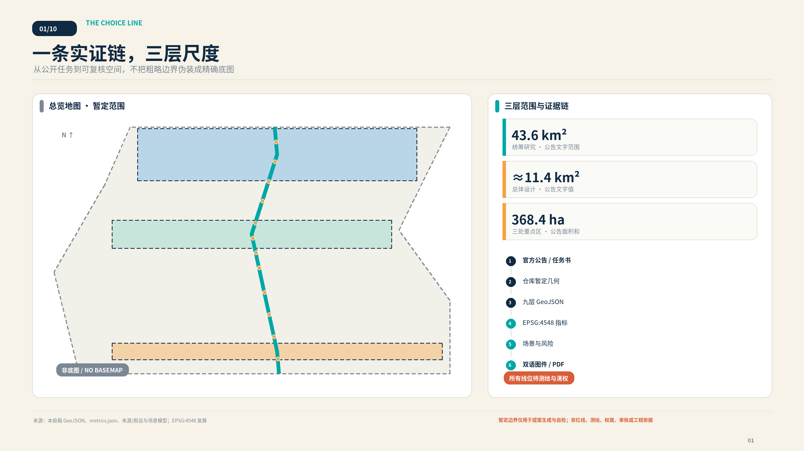
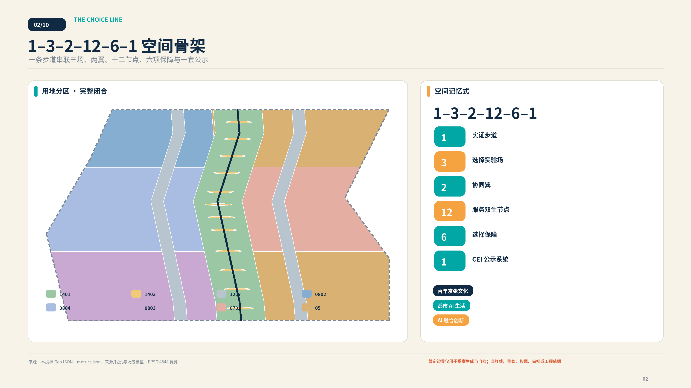
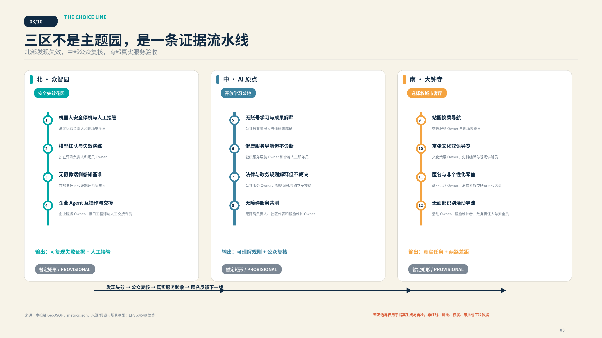
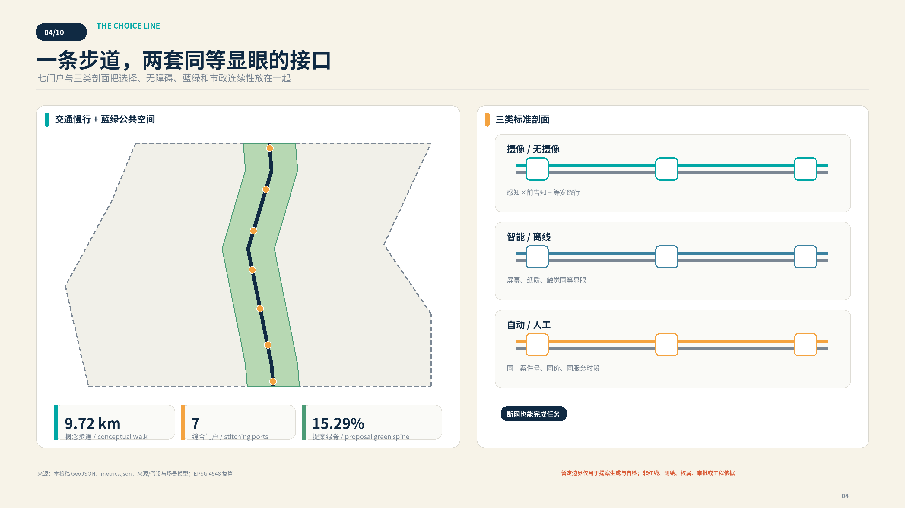
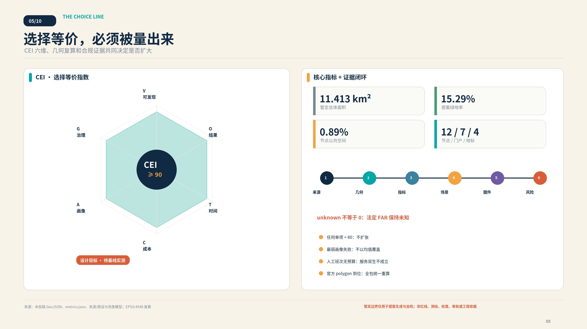

# 京张选择线 / THE CHOICE LINE

> **AI 在场，人有选择。** 本提案不是反对 AI，而是把 AI 的先进性从“能否替代人”改写为“能否在不惩罚拒用者的前提下改善同一项城市服务”。所有空间与政策内容均为开放共创建议，不构成政府审定、法定规划、工程线位或实施承诺。
## 设计依据与资料清单

本方案以官方征集公告确定的三层范围、三处重点区和成果任务为项目依据 [source:OFFICIAL-ANNOUNCEMENT] [standard:PROJECT-OFFICIAL-ANNOUNCEMENT]，以面向智能体任务书的十条共创原则、六项必答任务与统一边界条款为参与依据 [source:AGENT-TASKBOOK] [standard:PROJECT-AGENT-OPEN-CALL-TASKBOOK]。仓库站点包、来源登记和处理事实包分别承担机器可读约束、资料用途分级与导航，不被误写成新的行政权威 [source:SITE-PACKAGE] [source:SOURCE-REGISTRY] [source:PROCESSED-FACT-PACK]。专业判断同时映射城市设计、控规编制审批与国土空间用地分类要求 [source:STANDARDS-REGISTRY] [standard:MOHURD-URBAN-DESIGN-MEASURES] [standard:MOHURD-CONTROL-DETAILED-PLANNING] [standard:MNR-LAND-USE-CLASSIFICATION-GUIDE]；建筑深度规定保持 data gap，不用非官方镜像补位 [standard:MOHURD-ARCH-DESIGN-DEPTH-2016]。

最重要的资料边界是：仓库目前只提供维护者根据公开文字形成的总体与重点区粗略 polygon [source:BOUNDARY-SOURCE] [source:KEY-AREA-SOURCE]。它们在 GeoJSON 中继续标为 `provisional_constraint`、`official_boundary=false` 和 `boundary_precision=provisional_rough` [data:geometry/site_boundary.geojson#SITE-001] [data:geometry/constraints.geojson#G-CONSTRAINT-PROV-BOUNDARY]。因此本提案能够完成拓扑、自检和设计比较，却不能据此确认红线、权属、道路、容积率、建筑高度、市政容量、投资或审批。官方或清权几何到位后，边界、用地、建筑、道路、绿地、公共空间、分期和全部派生指标统一重算 [depth:existing_conditions_diagnosis] [depth:risk_missing_data]。

证据权威顺序为 GeoJSON → metrics → 三矩阵 → manifest/sources/assumptions/self-check → 正文 → 图件/HTML/PDF。任何图面数字都返回结构化值；任何案例都分成“已核验事实—京张推论—不可照搬边界”；任何目标都标为设计目标而非现状绩效。下图把范围、来源、派生几何、指标、场景和风险接成一条可审计链。

## 三层范围工作框架

公告给出约 43.6 平方公里统筹研究范围、约 11.4 平方公里总体设计范围和 368.4 公顷重点区域总量；本包只对其中仓库提供的**总体设计暂定 polygon**生成空间方案。该 polygon 在 EPSG:4548 下复算为约 1141.28 公顷 [metric:site_area_sqm]，差值说明它是用于算法工作的粗略替代，不能把复算值当作官方精确面积。三处重点区同样保留官方文字面积与暂定几何复算面积两列 [data:geometry/key_areas.geojson#G-DESIGN-NORTH] [metric:key_area_count] [metric:key_area_north_sqm] [metric:key_area_center_sqm] [metric:key_area_south_sqm]。

空间记忆式为 **1–3–2–12–6–1**：1 条 Ground Truth Walk 实证步道；3 座选择实验场；2 条协同翼；12 个服务双生节点；6 项选择保障；1 套 CEI 公示系统。三座实验场分别是北部众智园“安全失效花园”、中部 AI 原点社区“开放学习与公众复核公地”、南部大钟寺“选择权城市客厅”。中关村科技服务翼提供标准、法务、人才、资本和第三方评估；小月河场景赋能翼提供社区共创、环境/机器人日常试验和公众反馈。两翼是协同关系，不是本包伪造的法定边界 [depth:three_level_scope_framework]。

六项选择保障是：数据采集前同屏选择；目的限定与最小数据；AI/人工或离线服务双生；具名人工接管；可撤回、可纠错、可申诉；公开版本、失效和 CEI 证据。它们落实在一条步道每个节点的两套等显眼接口，不是两条待建的九公里工程轨道。沿线七个缝合门户把站点、园区、社区、高校与公园接入步道，但每个门户的具体线位都等待交通、无障碍、权属与消防核验 [data:geometry/roads.geojson#G-CORRIDOR-GTW-01] [metric:stitching_port_count]。

三条官方主题带在本方案中重新编排：百年京张文化带负责“工程自主—公众自主”的叙事；都市 AI 生活体验带负责可完成的公共服务；AI 融合创新带负责从红队、互操作到真实场景的转化。三者都通过服务双生进入同一空间协议，避免“文化是装饰、产业是园区、生活是展示”彼此分离 [agent.1] [standard:PROJECT-AGENT-OPEN-CALL-TASKBOOK]。

## 统筹研究范围产业与未来城市研究

“选择线”对世界级 AI 创新生态的判断不是追求更多屏幕或模型总部，而是形成从基础研究、公开评测、受控试验、场景采购、资本服务、持续运维到公众纠错的闭环。北部输出安全证据与可迁移接口，中部把知识、人才和公众复核变成开放公地，南部用交通、文化、商业和活动验证真实服务；两翼补足标准/法务/资本与社区/环境反馈。只有成功把失效、交接和非 AI 路径纳入成本的创新，才有资格扩大 [agent.2] [depth:overall_spatial_structure]。

四方运行闭环包括：服务 Agent 完成任务；用户侧本地 Choice Agent 在采集前解释权限并生成不含身份的选择回执；Assurance Agent 做红队、偏差、失效与反事实差距测试；具名人工责任人作最终复核、接管和申诉处理。AI 的原创作用是实时生成服务双生、找出哪个群体被 fallback 惩罚、模拟中断并辅助复盘；高风险裁量、最终责任和政府决定不转交模型。没有手机、账号或生物识别的人仍可走完整人工/纸质路径。

下列八个案例均来自发布者的一手页面。表格只迁移机制，不声称其制度、法律、场地或效果能直接复制到海淀：

| 案例与来源 | 已核验事实 | 京张转译 | 不可照搬边界 |
| --- | --- | --- | --- |
| CASE-AMS-ALGO · 阿姆斯特丹算法登记与人工申诉 [source:CASE-AMS-ALGO] | 市政府公开车牌自动识别执法的目的、数据、法律依据、人工介入与风险；有人提出异议时，处罚照片由执法人员重新人工审查。 | 每项影响权益的服务发布决策说明卡，并在沿线设置独立于原自动结果的人工复核与非数字申诉入口。 | 该案例依赖荷兰行政法与身份体系；登记透明不等于独立审计，也不意味着所有算法服务都可退出。 |
| CASE-NO-SANDBOX · 挪威人工智能数据保护监管沙盒 [source:CASE-NO-SANDBOX] | 挪威数据保护局向少量真实项目提供跨学科指导，通常形成项目计划、隐私影响评估、设计反馈与公开经验，但不授予批准。 | 在 AI 原点社区设置合规共创室，由法律、技术、运营与公众代表共同制定测试计划并发布可复用退出报告。 | 沙盒意见不构成许可、认证或有约束力决定；参与者仍承担合规责任，监管管辖结构不可照搬。 |
| CASE-SG-ASSURANCE · 新加坡全球 AI 保障沙盒 [source:CASE-SG-ASSURANCE] | IMDA 与 AI Verify Foundation 将真实生成式 AI 应用与独立测试机构配对，测试完整应用的幻觉、泄露、对抗、人类监督与救济。 | 在众智园采用应用方、场景业主、独立测试方三方制，公开风险假设、失败阈值、修复与退役记录。 | 该沙盒不是软件运行环境，也不代表监管批准；技术测试不能替代流程治理、法律审查或基础模型安全。 |
| CASE-XROAD · 爱沙尼亚 X-tee / X-Road 数据交换层 [source:CASE-XROAD] | 数据在服务提供者与使用者之间直接交换而非汇入中央代理，提供方控制访问，安全服务器签名、记录并验证请求和响应。 | 跨园区协作采用数据留源、按服务授权、可撤销信任锚与可验证调用日志，不先建设单一城市数据湖。 | X-Road 不是身份、门户或完整治理制度；终端授权、数据分类和公众可见记录仍需另行设计。 |
| CASE-MIT-IHQ · MIT Kendall Square / InnovationHQ [source:CASE-MIT-IHQ] | InnovationHQ 将种子基金、学生创业工作室、原型空间、导师与成果转化机构集中；Kendall Square 项目同时容纳住房、托育、零售与公共空间。 | 原点社区采用首层向城市开放、上层专业转化的项目栈，把空间运营团队与资金、原型、知识产权和导师服务一并配置。 | MIT 的科研密度、品牌、土地与资本网络不可复制；案例不能证明单靠建筑必然提升成果转化率。 |
| CASE-GOVUK-ASSISTED · 英国 GOV.UK 辅助数字与跨渠道服务 [source:CASE-GOVUK-ASSISTED] | 政府服务团队必须研究缺少网络、技能、信任或信心的用户，提供免费、可持续的电话、现场或辅助数字支持并测量表现。 | 电话、纸本、现场与 AI 路径共用服务编号；不隐藏人工渠道，并把线下失败数据反馈到服务改进。 | 指南要求符合用户需要的渠道组合，而非所有服务全天开放所有渠道；无障碍需求仍需单独研究。 |
| CASE-NYC-OPEN-DATA · 纽约市开放数据法定治理体系 [source:CASE-NYC-OPEN-DATA] | 纽约市以法律、机构数据协调员、资产清单、发布计划、通俗数据字典和年度报告维持统一门户与公众反馈。 | 每个参与区县、园区、高校和运营主体指定数据责任人，公布分类、更新频率、字段说明、质量检查与纠错工单。 | 开放只覆盖依法可公开数据；门户不保证完整性或适用性，也不能替代隐私审查与持续维护人员。 |
| CASE-ROTTERDAM-WATER · 鹿特丹 Benthemplein 水广场 [source:CASE-ROTTERDAM-WATER] | 广场晴天承载运动、休息与儿童活动，降雨时通过沟槽、管道和高差汇集周边雨水，并在雨后逐步排放或下渗。 | 把大钟寺活动空间设计为日常休憩与暴雨蓄排双模式，并把树荫、座椅、清淤和活动运营纳入同一维护单。 | 原项目容量不能套用；径流污染、冻融、土壤渗透、儿童安全和管网条件必须在北京重新计算。 |

据此形成七段生态链：研究者提出可复现假设；众智园在隔离环境测试；独立评估者发布风险边界；AI 原点社区与八类使用者共同验收；大钟寺在真实任务中测两路差距；中关村翼提供标准、法务、知识产权与耐心资本；运营主体把班次、设备、能耗、投诉和撤回成本写入长期合同。公开采购建议按“同一结果、两条路径、一个责任人、可退出版本”验收，不以注册数或数据采集量奖励供应商。案例来源分别见 [source:CASE-AMS-ALGO] [source:CASE-NO-SANDBOX] [source:CASE-SG-ASSURANCE] [source:CASE-XROAD] [source:CASE-MIT-IHQ] [source:CASE-GOVUK-ASSISTED] [source:CASE-NYC-OPEN-DATA] [source:CASE-ROTTERDAM-WATER]。

## 总体设计范围城市更新与控规深度城市设计

总体空间不是把 11.4 平方公里画成一张新城总平面，而是用一个可逆、可测量的公共接口缝合存量城区。Ground Truth Walk 沿暂定范围内部形成概念性南北骨架，节点广场、连续绿脊与两侧接驳带由同一几何模型派生；土地利用采用 `1401/1403/1207/0802/0804/0803/0702/05` 等登记代码形成完整分区，所有 polygon 的并集等于 SITE-001 且相互不重叠 [data:geometry/land_use.geojson#LU-GREEN-SPINE] [depth:land_use_layout]。这是一套设计比较底盘，不是法定用地调整。

总体公式在空间上落实为“步道—门槛—双台—复核—公示”：进入数据区之前先看到选择门槛；AI 服务台与人工/离线台具有同等尺度、字体、照明和无障碍到达；纸质/触觉导视可以独立完成任务；打印式或本地选择回执只证明规则被告知，不成为身份追踪凭证；人工复核厅公开责任人、申诉时钟、版本和匿名失效案例。步道约 9.72 公里是 EPSG:4548 下的提案线长 [metric:ground_truth_walk_length_m]，必须始终标注“概念线位、待测绘与清权”，不使用“已确定”“将建成”等政府承诺措辞。

命名体系以 **京张选择线 / THE CHOICE LINE** 为总名；三场分别为 Fail-Safe Garden、Open Learning Commons、Civic Choice Hub；公共行走产品为 Ground Truth Walk；治理指标为 Choice Equivalence Index。标志建议把一枚铁路轨枕变成六格 CEI 标尺，两条等宽细线代表 AI 与服务双生，而不是两条物理轨道。主色为京张深蓝 `#102A43`、选择青 `#00A7A5`、人工暖橙 `#F4A340`、纸张米白 `#F7F3E8`、暂定边界灰 `#7B8794`。字体、名称和标志正式使用前须完成商标、字体和导视专业审查；本包图件只用系统字体渲染，不分发字体文件。

六个概念性小体量示范亭承载测试、学习、复核与气候活动，建筑 footprint 和层数只用于视觉与面积复算 [data:geometry/buildings.geojson#BLDG-01]。未取得地块、控规、消防、市政与产权前，不给真实建筑定拆留结论、不规定最终高度、不把概念楼面面积转化为开发权 [depth:development_intensity_controls] [depth:height_massing_character]。

## 重点区域详细设计

三处重点区的 polygon 均为暂定粗略矩形，低对比虚线只承担定位，不表达地块、道路或审批边界 [source:KEY-AREA-SOURCE]。详细设计因此聚焦可移动组件、操作流程、节点关系与扩张门槛，而不伪造总平面精度 [depth:three_key_area_detailed_design]。

### 北部众智园：安全失效花园

北区承载 S01–S04 四项产业测试：机器人安全停机与人工接管、模型红队与失效演练、无摄像端侧感知基准、企业 Agent 互操作与迁移。空间由可封闭测试环、物理急停、隔离测试舱、无摄像绕行线、人工接管台和失败复盘看台组成。服务输出不是“认证”，而是带版本、重现步骤、适用边界和人类责任人的证据包。清河相关生态、道路与设施条件未核验，图面只表达缓冲与连接意图 [data:geometry/key_areas.geojson#G-DESIGN-NORTH]。

### 中部 AI 原点社区：开放学习与公众复核公地

中区承载 S05–S08：无账号学习、健康服务导航但不诊断、法律/政务解释但不裁决、无障碍共同验收。人工复核厅是制度地标而非客服后台：一号跨渠道案件、人工工作台、申诉时钟、匿名失败档案、员工休息区和年度公开评议墙共同可见。高校、社区和开发者的参与必须用清晰同意、合理补偿和可撤回机制组织，不能把居民当免费测试数据 [data:geometry/key_areas.geojson#G-DESIGN-CENTER]。

### 南部大钟寺：选择权城市客厅

南区承载 S09–S12：站园换乘、京张文化导览、匿名非个性化零售、无面部识别活动导流。入口把智能、纸质和人工三种路线同屏；首层开放式客厅与社区市集测试价格、时段和完成质量等价；遮荫—暴雨双模式广场只使用聚合计数并保留人工广播。水务能力、站口组织、商业租约和历史保护均待专业深化 [data:geometry/key_areas.geojson#G-DESIGN-SOUTH]。

四个地标横跨三区，状态一律是“投稿建议，未入选、未实施”：

| 地标 | 城市角色 | 空间组件 |
| --- | --- | --- |
| LM-01 · 自主选择零公里 | 把 1909 年工程自主延伸为 AI 时代公众理解、选择与继续获得服务的自主。 | 双线轨枕门架、约9公里待复核提示、触觉总图、人工问询和不采集数据的纸本起点。 |
| LM-02 · 人工复核厅 | 把模型边界、申诉、接管和责任人从后台流程变成可见的公共制度空间。 | 同号双渠道服务台、复核桌、申诉时钟、匿名失败档案、员工休息区和年度公开评议墙。 |
| LM-03 · 安全失效花园 | 公开证明系统何时应停、谁能停、停止后基础城市服务如何继续。 | 可撤回测试环、人工急停、设备隔离、无摄像绕行、清河生态缓冲和失败后复盘看台。 |
| LM-04 · 开源轨枕荣誉线 | 以可更新、可纠错的方式记录 Agent、人员、版本、许可和真实采纳状态。 | 可拆换轨枕铭牌、无障碍数字副本、版本与许可证字段、纠错入口和明确的投稿/入选/实施状态。 |

三个重点区不是彼此竞赛的主题园，而是一条证据流水线：北区发现失败，中区让公众理解并复核，南区检验不使用 AI 是否仍能完成真实任务；匿名结果再反馈下一版测试。四个地标和十二节点的空间位置见 [data:geometry/public_space.geojson#G-NODE-S01] [metric:service_twin_node_count] [metric:landmark_count]。

## AI 创新生态、人才画像与 AI+ 场景

选择线的用户不是抽象“市民”，而是八类会在数字化、语言、身体、年龄、劳动和组织能力上遇到不同惩罚的人。画像用于预注册测试任务、发现最弱环节与招募共同验收，不用于建立真实个人画像，也不替代现场共创 [agent.3]。

| 画像 | 必须完成的任务 | 最可能的排斥风险 |
| --- | --- | --- |
| P01 · 老年人与功能机使用者 | 无需 App、账号或扫码即可完成服务，获得大字导视、电话与现场支持。 | 被迫购买设备、排更长队或因数字凭证缺失而无法完成。 |
| P02 · 视听或行动障碍通勤者 | 连续无障碍路径、触觉与语音信息、字幕、可坐休息点和不依赖摄像的选择。 | 路径在站园界面中断，替代入口难找，辅助功能与人工服务不同时可用。 |
| P03 · 家长、照护者与未成年人 | 共同可理解的采集前告知、监护边界、照护空间和不建立未成年人画像的服务。 | 默认同意、诱导式界面、儿童数据留存或婴儿车路线被数字推荐忽略。 |
| P04 · 维护、保洁与配送人员 | 安全装卸、休息与充电点，明确机器接管权、故障隔离和不被算法压缩的合理节奏。 | 被机器人测试挤占通道、承担未记录的接管劳动或被不可申诉的绩效模型处罚。 |
| P05 · 国际访客与开发者 | 中英双语规则、短期无账号访问、跨文化解释与清晰的参与和退出边界。 | 只有中文数字界面、无法使用本地账号体系或误把展示活动理解为官方许可。 |
| P06 · 高校学生与研究者 | 公开评测、安静学习、成果解释、夜间安全、运动与可负担日常服务。 | 创新空间只服务企业客户，研究成果不可解释，夜间路径与学习设施断开。 |
| P07 · 中小企业开发者与创业团队 | 低成本互操作测试、合规支持、第三方评估、原型空间和明确的退役接口。 | 被单一平台锁定、无法承担重复认证，或试点结束后数据与服务无法迁移。 |
| P08 · 人工复核员与公共服务人员 | 合理工位、每班承接上限、培训、接管授权、申诉台账和拒绝自动化压力的保障。 | 人工替代被假设为无限免费资源，复核员背负模型错误却没有暂停权和休息。 |

每张场景卡固定回答用户任务、空间、AI 输入/输出、采集前告知、最小数据预算、等价路径、人工责任人、失效方式、退出/申诉和 CEI。十二卡全部在 GeoJSON 中有一个公共节点；前四卡是产业测试，后八卡是公共服务与城市体验。proposal front matter 只引用三个标准场景 ID，因为登记表最多允许八项，但正文完整交付十二张自定义场景卡。

### S01 · robot-handover · 机器人安全停机与人工接管

**片区/类型**：众智园 / Fail-Safe Garden · 产业测试

| 字段 | 设计响应 |
| --- | --- |
| 用户任务 | 在受控园路完成低速配送并在风险触发时安全交给人。 |
| 空间位置 | 安全失效花园测试环与人工接管台 |
| AI 输入 | 任务单、非识别性距离感知、临时封闭状态 |
| AI 输出 | 低速路径、风险提示、停车或接管请求 |
| 采集前告知 | 进入测试区前展示时段、设备、感知范围与无数据绕行线 |
| 数据预算 | 端侧传感不上传原始影像；事故最小日志建议保留30天并待治理确认 |
| 服务双生 | 人工配送员沿同一可达路线完成相同任务，费用与服务时段同屏公布 |
| 人工责任人 | 测试运营负责人和现场安全员 |
| 失效与停机 | 越界、失联、无法识别施工或障碍时立即停车并封闭设备 |
| 退出、纠错与申诉 | 现场急停、纸本/电话申诉和独立事故复核 |
| CEI 测量 | 比较两路任务成功率、时间、用户成本、最弱画像可达度与治理门槛 |

### S02 · model-red-team · 模型红队与失效演练

**片区/类型**：众智园 / Fail-Safe Garden · 产业测试

| 字段 | 设计响应 |
| --- | --- |
| 用户任务 | 在上线前复现有害输出、泄露、偏差与错误接管。 |
| 空间位置 | 可观察评测教室和隔离测试舱 |
| AI 输入 | 清权测试集、风险假设、场景 Owner 设定的失败阈值 |
| AI 输出 | 风险证据、复现步骤、修复与退役建议 |
| 采集前告知 | 入口说明测试对象、非批准性质、旁观者不进入测试数据 |
| 数据预算 | 不输入真实个人信息；测试日志去标识并按项目计划删除 |
| 服务双生 | 独立专家用公开清单完成同一风险审查，结论与模型评测并列 |
| 人工责任人 | 独立评测负责人和场景 Owner |
| 失效与停机 | 测试集污染、无法复现或高风险输出外泄时暂停 |
| 退出、纠错与申诉 | 公开错误报告、人工复核与版本撤回记录 |
| CEI 测量 | 比较两种评测对同一风险的发现率、时长、成本与可解释度 |

### S03 · camera-free-perception · 无摄像端侧感知基准

**片区/类型**：众智园 / Fail-Safe Garden · 产业测试

| 字段 | 设计响应 |
| --- | --- |
| 用户任务 | 验证不采集人脸与身份能否完成占用、障碍和排队辅助。 |
| 空间位置 | 感知基准廊与无摄像旁观线 |
| AI 输入 | 匿名距离、压力或环境计数与人工观察样本 |
| AI 输出 | 占用等级、障碍提示和不确定度 |
| 采集前告知 | 设备外壳和地面标线说明感知类型、盲区与关闭方式 |
| 数据预算 | 不采集人脸、声纹、设备标识；只发布聚合计数 |
| 服务双生 | 训练过的现场观察员按同一时段记录非身份统计 |
| 人工责任人 | 数据责任人和设施运营负责人 |
| 失效与停机 | 出现身份回推、盲区风险或聚合样本过小时停止发布 |
| 退出、纠错与申诉 | 设备关闭、数据删除、人工复核与公众纠错工单 |
| CEI 测量 | 比较准确度、等待时间、人员成本、残障画像表现和隐私门槛 |

### S04 · agent-interoperability · 企业 Agent 互操作与交接

**片区/类型**：众智园 / Fail-Safe Garden · 产业测试

| 字段 | 设计响应 |
| --- | --- |
| 用户任务 | 证明服务可导出、换供应商并在故障时转给人工。 |
| 空间位置 | 中立接口台架与迁移诊所 |
| AI 输入 | 合成业务任务、公开接口说明、最小权限令牌 |
| AI 输出 | 可携记录、交接包、差异与失败日志 |
| 采集前告知 | 测试前声明供应商中立、数据边界和非认证性质 |
| 数据预算 | 仅用合成或清权数据；令牌短时有效并可立即撤销 |
| 服务双生 | 人工专员使用同一案件编号和导出材料完成任务 |
| 人工责任人 | 企业服务 Owner、接口工程师与人工交接专员 |
| 失效与停机 | 导出缺字段、权限无法撤销或人工无法恢复时停止试点 |
| 退出、纠错与申诉 | 供应商切换、人工接管、纠错和退出证明 |
| CEI 测量 | 比较两路完成率、时间、总成本、SME可达度和治理通过率 |

### S05 · account-free-learning · 无账号学习与成果解释

**片区/类型**：AI 原点社区 / Open Learning Commons · 公共服务

| 字段 | 设计响应 |
| --- | --- |
| 用户任务 | 让公众理解沿线 AI 成果、证据和适用边界。 |
| 空间位置 | 开放学习公地、成果解释廊和纸本架 |
| AI 输入 | 访客主动选择的主题与清权成果资料 |
| AI 输出 | 分层解释、术语表、可验证来源和不确定提示 |
| 采集前告知 | 开始前同时提供无账号端侧模式与纸本路线 |
| 数据预算 | 端侧偏好会话结束即清除，不建立学习画像 |
| 服务双生 | 人工讲解、纸本读本和无需设备的展签完成同一学习目标 |
| 人工责任人 | 公共教育策展人与值班讲解员 |
| 失效与停机 | 来源缺失、解释超出证据或无障碍版本缺位时下架 |
| 退出、纠错与申诉 | 现场纠错卡、来源复核和版本回滚 |
| CEI 测量 | 比较理解任务成功率、时长、费用、八类画像表现和来源门槛 |

### S06 · health-navigation · 健康服务导航但不诊断

**片区/类型**：AI 原点社区 / Open Learning Commons · 公共服务

| 字段 | 设计响应 |
| --- | --- |
| 用户任务 | 解释公开机构、开放时段、预约和无障碍到达方式。 |
| 空间位置 | 社区复核桌与双模式健康导航台 |
| AI 输入 | 用户主动输入的服务类型、时间与无障碍需要 |
| AI 输出 | 公开信息匹配、路线与转人工提示，不输出诊断 |
| 采集前告知 | 首屏和纸本均醒目标注非医疗建议与紧急求助方式 |
| 数据预算 | 不保存症状，不推断疾病；预约所需信息直接交给责任机构 |
| 服务双生 | 电话、纸本目录和人工服务员完成相同查询与预约协助 |
| 人工责任人 | 健康服务导航 Owner 和合格人工服务员 |
| 失效与停机 | 出现诊断性语言、机构信息过期或紧急风险时立即转人工 |
| 退出、纠错与申诉 | 删除会话、人工纠错、机构确认与申诉记录 |
| CEI 测量 | 比较正确到达率、完成时长、用户费用、最弱画像表现与安全门槛 |

### S07 · rules-explainer · 法律与政务规则解释但不裁决

**片区/类型**：AI 原点社区 / Open Learning Commons · 公共服务

| 字段 | 设计响应 |
| --- | --- |
| 用户任务 | 把公开规则转成可理解的办事步骤并标明责任机关。 |
| 空间位置 | 人工复核厅、电话席与纸本服务墙 |
| AI 输入 | 用户选择的公开事项和最少情境信息 |
| AI 输出 | 来源段落、步骤、缺件提示和人工转介 |
| 采集前告知 | 采集前说明不构成法律意见、不作资格或权利裁决 |
| 数据预算 | 不输入身份证号等非必要信息；会话结束删除临时上下文 |
| 服务双生 | 人工窗口、电话和纸本清单用同一案件编号完成解释 |
| 人工责任人 | 公共服务 Owner、规则编辑与独立复核员 |
| 失效与停机 | 来源版本不明、规则冲突或涉及权利裁决时停止自动回答 |
| 退出、纠错与申诉 | 人工复核、异议登记、来源更正与同模型不得自动复判 |
| CEI 测量 | 比较一次受理率、时长、费用、优先画像表现和治理门槛 |

### S08 · accessible-co-test · 无障碍服务共测

**片区/类型**：AI 原点社区 / Open Learning Commons · 公共服务

| 字段 | 设计响应 |
| --- | --- |
| 用户任务 | 由残障使用者共同验收路径、导视、求助与双模式切换。 |
| 空间位置 | 站园接口、触觉总图与开放评测教室 |
| AI 输入 | 设施状态、用户主动反馈和非身份任务记录 |
| AI 输出 | 可达路径、问题工单、不确定区段和修复优先级 |
| 采集前告知 | 参与前说明记录内容、补偿、退出和不影响服务的原则 |
| 数据预算 | 不采集生物特征；反馈去标识并允许撤回 |
| 服务双生 | 实体导视、人工陪行和纸本检查表完成同一任务 |
| 人工责任人 | 无障碍负责人、社区代表和设施维护 Owner |
| 失效与停机 | 关键路径中断、反馈无法撤回或安全信息不一致时暂停 |
| 退出、纠错与申诉 | 现场求助、人工复核、工单追踪和年度公开回应 |
| CEI 测量 | 以最弱画像的完成率、时间、成本、可发现性和治理通过率计 |

### S09 · station-park-transfer · 站园换乘导航

**片区/类型**：大钟寺 / Civic Choice Hub · 公共服务

| 字段 | 设计响应 |
| --- | --- |
| 用户任务 | 在不承诺工程线位的前提下组合步行、骑行与公共交通。 |
| 空间位置 | 大钟寺四象限端口与 Ground Truth Walk |
| AI 输入 | 公开交通信息、设施状态、用户主动选择的出行需要 |
| AI 输出 | 候选组合、无障碍提示、换乘不确定性与人工入口 |
| 采集前告知 | 决策点同屏展示智能、纸本和人工路线及数据使用 |
| 数据预算 | 无持续位置追踪；端侧位置会话结束清除 |
| 服务双生 | 实体导视、纸本路线图和人工问询完成同一到达任务 |
| 人工责任人 | 交通服务 Owner 与现场换乘员 |
| 失效与停机 | 电梯故障、信息过期或无障碍路径中断时停止推荐 |
| 退出、纠错与申诉 | 一键/现场转人工、纸本备选、错误上报与路线撤回 |
| CEI 测量 | 比较实际到达率、中位时间、费用、最弱画像表现与治理门槛 |

### S10 · jingzhang-cultural-guide · 京张文化双语导览

**片区/类型**：大钟寺 / Civic Choice Hub · 公共服务

| 字段 | 设计响应 |
| --- | --- |
| 用户任务 | 连接京张铁路、詹天佑、中关村创新与 AI 自我约束叙事。 |
| 空间位置 | 自主选择零公里、开放轨枕荣誉线与沿线展签 |
| AI 输入 | 清权史料、用户选择的语言、时长和主题 |
| AI 输出 | 可验证故事线、来源标号、无障碍路径与不确定提示 |
| 采集前告知 | 开始前并列提供双语数字、纸本、触觉与人工讲解 |
| 数据预算 | 不建立访客画像；可选会话偏好结束即清除 |
| 服务双生 | 实体展签、纸本地图和人工讲解独立完成完整叙事 |
| 人工责任人 | 文化策展 Owner、史料编辑与现场讲解员 |
| 失效与停机 | 史料来源不明、译文失真或把提案写成已实施时下架 |
| 退出、纠错与申诉 | 公众纠错、史料复核、版本撤回和署名更正 |
| CEI 测量 | 比较叙事理解率、时长、费用、国际/残障画像表现和来源门槛 |

### S11 · anonymous-retail · 匿名与非个性化零售

**片区/类型**：大钟寺 / Civic Choice Hub · 公共服务

| 字段 | 设计响应 |
| --- | --- |
| 用户任务 | 比较不建立个人画像的商品发现与人工选购。 |
| 空间位置 | 选择权城市客厅首层与社区市集 |
| AI 输入 | 当次预算、品类和过敏信息，不读取历史身份记录 |
| AI 输出 | 非个性化候选、价格、理由与人工咨询入口 |
| 采集前告知 | 货架和屏幕同等展示无画像模式、人工咨询与价格一致性 |
| 数据预算 | 不采集面部、设备标识或跨店记录；会话结束清除 |
| 服务双生 | 店员和纸本分类索引以同价、同时段完成选购 |
| 人工责任人 | 商业运营 Owner、消费者权益联系人和店员 |
| 失效与停机 | 价格差异、敏感推断、暗黑模式或无法删除会话时停用 |
| 退出、纠错与申诉 | 现场退款/纠错、人工复核、数据删除和投诉编号 |
| CEI 测量 | 比较购买完成率、时长、总价、最弱画像表现和治理通过率 |

### S12 · face-free-event-flow · 无面部识别活动导流

**片区/类型**：大钟寺 / Civic Choice Hub · 公共服务

| 字段 | 设计响应 |
| --- | --- |
| 用户任务 | 用聚合计数辅助活动、遮荫和暴雨双模式空间调度。 |
| 空间位置 | 选择权城市客厅、水广场与活动边界 |
| AI 输入 | 入口非身份计数、天气、设施状态和人工巡查 |
| AI 输出 | 拥挤等级、分流建议、遮荫/蓄排切换与不确定度 |
| 采集前告知 | 活动入口说明不做人脸识别、计数范围、关闭时间和人工路线 |
| 数据预算 | 只保留按时段聚合计数；活动后按规则删除原始计数 |
| 服务双生 | 人工巡查、实体分区牌和广播完成同一安全调度 |
| 人工责任人 | 活动 Owner、设施维护者、数据责任人与安全员 |
| 失效与停机 | 计数失真、暴雨阈值触发、无障碍出口受阻或无法删除时停用 |
| 退出、纠错与申诉 | 人工广播、现场疏导、数据删除证明和事件复盘 |
| CEI 测量 | 比较安全到达率、疏散时间、用户费用、最弱画像表现和治理门槛 |

场景上线建议采用四道门：合法性/必要性和数据保护影响评估；安全红队和故障演练；八类画像至少包含重点弱势画像的双路任务测试；运营经费、人工班次与申诉承接确认。门槛失败就暂停、改造、转人工或撤回，不以“模型仍在学习”为延迟责任的理由。Assurance Agent 可帮助发现差距，最终放行由具名服务 Owner、数据责任人、独立评估者和社区代表共同记录。十二节点数量为 [metric:service_twin_node_count]，服务双生覆盖目标为 [metric:service_twin_coverage_target]；两者一个是设计数量，一个是待实测目标，不混写为绩效。

## 用地、建筑规模与拆改留方案

用地层不是对现状地类的调查结论，而是为了让方案内部面积闭合、指标可复算而构造的**完整概念分区**。连续绿脊使用 `1401`，服务节点广场用 `1403`，慢行与服务接驳带用 `1207`；北区以 `0802/05` 组合研发与企业服务，中区以 `0804/0702` 组合开放学习与社区服务，南区以 `0803/05` 组合文化叙事与城市服务。相邻 polygon 从同一剩余几何切分，union 与 SITE-001 对齐 [data:geometry/land_use.geojson#LU-GREEN-SPINE] [standard:MNR-LAND-USE-CLASSIFICATION-GUIDE]。

六个示范亭合计概念 footprint 约 2.82 公顷 [metric:building_footprint_area_sqm]，概念楼面约 7.06 公顷 [metric:total_floor_area_sqm]；基于暂定总体边界的内部比较值为 [metric:concept_floor_area_ratio] 与 [metric:building_density]。法定容积率明确保持 unknown [metric:floor_area_ratio]，因为没有官方地块、控规、权属、道路、消防和市政条件。任何后续团队都不得用这里的小数值推导法定开发容量。

拆改留采用“先证据、后动作”：京张遗存、成熟社区、校园肌理和仍具公共价值的建筑原则上先保留并调查；结构安全、使用效率和可达性允许可逆改造；拆除必须有法定依据、权属协商、安全鉴定和替代服务方案；新建优先模块化、可拆卸、低层和小体量。建筑首层面向步道提供等尺度双服务界面，后台必须给人工复核员休息、培训、无障碍工作与安全退出条件 [depth:retain_renovate_demolish]。

风貌控制采用“铁路构造逻辑而非仿古造型”：深色结构表达轨道连续性，浅色可替换面板记录版本，橙色标人工责任节点，青色标可选择数字服务；暂定边界始终以低对比虚线出现。历史构件不直接附着设备，新增构筑物与遗产本体保持可识别、可逆和可维护关系。材料耐久、照明、眩光、声环境、消防、节能和全生命周期碳仍需专业团队深化 [standard:MOHURD-URBAN-DESIGN-MEASURES]。

## 交通、轨道、市政与公共服务设施

交通策略首先保证一个人即使不携带手机、不注册账号、不进入摄像区，也能沿同一无障碍网络完成到达。Ground Truth Walk 是一条概念性公共步行骨架，长度约 9.72 公里 [metric:ground_truth_walk_length_m]；七个缝合门户用触觉总图、纸质时刻/路线、人工问询与本地数字信息连接站点、园区、社区和高校 [metric:stitching_port_count]。具体轨道接驳、道路红线、停车、骑行、消防和施工组织必须在测绘与交通调查后确定 [depth:traffic_rail_slow_parking]。

每个标准剖面不是“双轨工程”，而是“一条步道、两种完成方式”：摄像感知区旁保留无摄像绕行；智能导航旁保留连续实体导视；自动服务旁保留同一案件编号的人工接管。两条路径不能把纸质路线藏在角落、缩短服务时段、增加费用或设置更长队列。站园换乘场景 S09 以实际到达率而不是推荐点击率评价，电梯故障、信息过期或无障碍路线中断即停止自动推荐。

市政与新基建设计采用“最小、可断开、可替换”：节点默认端侧处理和短期令牌，不建设默认汇聚个人轨迹的数据湖；网络中断时纸质/人工路径继续；设备有物理关断、显眼状态灯、版本和责任人；电力、通信和算力负荷按节点逐步验证。健康导航不保存症状、不诊断；规则解释不裁决权利；活动导流不用面部识别；无摄像感知只发布满足最小样本阈值的聚合值 [depth:municipal_new_infrastructure]。

公共服务设施不是设备柜，而是包含人工班次、申诉电话/纸本、设备维护、数据删除证明、工作人员休息和无障碍共测的完整服务。服务 Owner 负责结果，数据责任人负责数据边界，现场运营者负责连续性，独立评估者负责 CEI，社区代表监督体验；四者不能由同一供应商一人包办。

## 蓝绿空间、公共空间与城市风貌

由同一暂定边界生成的连续绿脊约占 15.287% [metric:green_ratio] [metric:green_space_area_sqm]，十二节点公共广场约占 0.891% [metric:public_space_ratio] [metric:public_space_area_sqm]，概念接驳带约占 8.513% [metric:road_ratio] [metric:road_area_sqm]。这些比例只描述本方案内部几何，不是现状绿地率、法定公共空间率或道路率；官方边界替换后必须统一重算 [data:geometry/green_space.geojson#GREEN-GTW-01] [depth:blue_green_public_space]。

蓝绿系统把铁路遗址公园的线性开放空间、节点树荫、雨水花园和可暂时积水的活动广场组织为日常/极端天气双模式。大钟寺“遮荫—暴雨双模式广场”借鉴鹿特丹一地多用的机制 [source:CASE-ROTTERDAM-WATER]，但不复制其工程参数；在汇水区、土壤、地下管线和溢流路径核验前，图面不写调蓄立方米或防洪等级。活动导流只用非身份聚合计数，并保留人工巡查、广播和停用阈值。

三类标准剖面同时是选择保障：①摄像/无摄像——进入感知区前给等宽绕行、设备类型和盲区；②智能/离线——二维码、屏幕与纸质/触觉信息同处同尺寸；③自动/人工——一号案件、同价同时间段、可见接管。夜间照明优先照地面、标志和人工入口，不用动态屏幕制造注意力竞争；声景保留铁路记忆、社区日常与安静时段。

四个地标形成“可纠错的朝圣体系”：自主选择零公里说明规则；人工复核厅展示责任；安全失效花园公开停机；开源轨枕荣誉线记录 Agent、人、版本、许可与真实采纳状态。轨枕铭牌必须区分 submitted / selected / implemented，允许更正署名和撤回错误，不把投稿等同入选、不把入选等同落地 [agent.4] [agent.5]。文化叙事从詹天佑时代“自主建造铁路”延伸到 AI 时代“公众自主选择服务”，同时连接中关村的开源、试错与知识共同体，但不宣称这是唯一或首次的历史解释。

## 更新项目清单、实施政策与分期计划

更新项目按十二节点形成可审查清单：S01 机器人接管环、S02 红队教室、S03 无摄像基准廊、S04 迁移诊所、S05 无账号学习架、S06 健康导航台、S07 规则解释台、S08 无障碍共测港、S09 站园换乘口、S10 双语文化线、S11 匿名零售台、S12 无面部活动广场。每项都必须登记位置、任务、服务双生、责任人、依赖、失效、申诉、CEI 和退出成本；详细字段见场景卡与 [data:geometry/public_space.geojson#G-NODE-S01] [depth:renewal_project_list]。

分三期实施，空间 polygon 互不重叠并覆盖暂定总体范围 [data:geometry/phasing.geojson#G-PHASING-P1]。P1（0–6 月）只做审计、基线、台架、共创与三区无永久工程锚点，面积见 [metric:phase_1_area_sqm]；P2（6–18 月）在三区各形成一处可运营锚点并贯通选择界面，面积见 [metric:phase_2_area_sqm]；P3（18–36 月）仅在 CEI、安全、运营经费与公众复核通过后扩至十二节点，其余区域保持未承诺状态，面积见 [metric:phase_3_area_sqm]。complete 表示分期逻辑已交付，不表示项目已获批或资金已落实 [depth:phasing_implementation]。

RACI 建议：政府/项目组织者只在法定权限内作为政策与公共利益 Owner；各服务单位对结果负责；现场运营者保证两路班次；独立评估者测 CEI；社区代表参与验收；数据责任人处理删除与泄露；人工复核员拥有停机权。公共基础路径免费，不以个人数据变现。B2B 红队/互操作测试、企业服务、经许可的活动和培训可交叉补贴人工班次、无障碍设施、维护与公共评估；收入、OPEX 和利益冲突年度公开。

年度运营形成四季闭环：春季 Ground Truth Week 发布问题与基线；夏季 Fail-Safe Season 做故障、暴雨与接管演练；秋季 Open Sleeper Festival 展示开源贡献并核对 submitted/selected/implemented 状态；冬季 Public Evidence Assembly 公开 CEI、申诉、删除、劳动与资金表现并决定扩张、整改或撤回。每月有开发者散步道、居民共测与人工复核员圆桌；国际传播提供双语资料与远程复现实验，不把活动参加人数替代服务质量 [agent.6]。

## 指标体系、面积复算与合规矩阵

选择等价指数 CEI 对每个场景 `s` 定义：`CEI_s = 100 × mean(V,O,T,C,A,G)`。V 是在采集数据前发现两条路径的使用者比例；O 是两路任务成功率较小值/较大值；T 是两路中位完成时长较小值/较大值；C 是两路用户总费用较小值/较大值（均免费则为 1）；A 是重点画像任务成功率较小值/较大值；G 是主动选择、数据最小化、人工接管、撤回/申诉四项治理门槛通过率。试点建议目标为 CEI≥90 [metric:cei_pilot_target] 且任一分量≥80 [metric:cei_component_floor_target]；均为待基线实测的本方案目标，不是政府已采纳标准。

每次测量预注册任务、时间窗、样本与缺失处理；公布 AI 路、双生路、总体和最弱画像四组结果；禁止用总体平均掩盖老人、视障者、未成年人或国际访客失败；由独立评估者签名，服务 Owner 不得单独改口径。差距超过门槛就触发暂停扩张、补人工班次、改界面、删数据或撤回版本。CEI 不评价模型“聪明程度”，只评价城市是否因拒用 AI 惩罚人。

空间指标从 EPSG:4326 GeoJSON 投影到 EPSG:4548 复算。已知值、未知法定指标和设计目标共同列出，避免把 unknown 隐藏成零 [depth:metrics_recalculation]：

| 指标引用 | 值 | 单位 | 状态 | 置信度 | 解释 |
| --- | --- | --- | --- | --- | --- |
| [metric:site_area_sqm] | 11412825.386 | sqm | known | medium | 几何复算或数量清点 |
| [metric:building_footprint_area_sqm] | 28224.0 | sqm | known | medium | 几何复算或数量清点 |
| [metric:total_floor_area_sqm] | 70560.0 | sqm | known | low | 几何复算或数量清点 |
| [metric:floor_area_ratio] | unknown | ratio | unknown | unknown | Approved FAR controls, parcel boundaries, and official site boundary are absent. |
| [metric:concept_floor_area_ratio] | 0.006183 | ratio | known | low | 几何复算或数量清点 |
| [metric:building_density] | 0.002473 | ratio | known | low | 几何复算或数量清点 |
| [metric:green_space_area_sqm] | 1744681.76 | sqm | known | medium | 几何复算或数量清点 |
| [metric:green_ratio] | 0.15287 | ratio | known | medium | 几何复算或数量清点 |
| [metric:public_space_area_sqm] | 101647.533 | sqm | known | medium | 几何复算或数量清点 |
| [metric:public_space_ratio] | 0.008906 | ratio | known | medium | 几何复算或数量清点 |
| [metric:road_area_sqm] | 971614.935 | sqm | known | low | 几何复算或数量清点 |
| [metric:road_ratio] | 0.085134 | ratio | known | low | 几何复算或数量清点 |
| [metric:phase_1_area_sqm] | 255857.442 | sqm | known | medium | 几何复算或数量清点 |
| [metric:phase_2_area_sqm] | 2574696.008 | sqm | known | medium | 几何复算或数量清点 |
| [metric:phase_3_area_sqm] | 8582271.935 | sqm | known | medium | 几何复算或数量清点 |
| [metric:key_area_count] | 3 | count | known | high | 几何复算或数量清点 |
| [metric:key_area_north_sqm] | 1929201.877 | sqm | known | medium | 几何复算或数量清点 |
| [metric:key_area_center_sqm] | 1043236.909 | sqm | known | medium | 几何复算或数量清点 |
| [metric:key_area_south_sqm] | 720454.219 | sqm | known | medium | 几何复算或数量清点 |
| [metric:ground_truth_walk_length_m] | 9717.87 | m | known | low | 几何复算或数量清点 |
| [metric:service_twin_node_count] | 12 | count | known | high | 几何复算或数量清点 |
| [metric:stitching_port_count] | 7 | count | known | high | 几何复算或数量清点 |
| [metric:landmark_count] | 4 | count | known | high | 几何复算或数量清点 |
| [metric:cei_pilot_target] | 90 | score_0_100 | known | low | 几何复算或数量清点 |
| [metric:cei_component_floor_target] | 80 | score_0_100 | known | low | 几何复算或数量清点 |
| [metric:service_twin_coverage_target] | 1.0 | ratio | known | low | 几何复算或数量清点 |
| [metric:land_use_05_area_sqm] | 2485965.084 | sqm | known | medium | 几何复算或数量清点 |
| [metric:land_use_0702_area_sqm] | 1505114.61 | sqm | known | medium | 几何复算或数量清点 |
| [metric:land_use_0802_area_sqm] | 1017063.326 | sqm | known | medium | 几何复算或数量清点 |
| [metric:land_use_0803_area_sqm] | 1723077.263 | sqm | known | medium | 几何复算或数量清点 |
| [metric:land_use_0804_area_sqm] | 1863660.874 | sqm | known | medium | 几何复算或数量清点 |
| [metric:land_use_1207_area_sqm] | 971614.935 | sqm | known | medium | 几何复算或数量清点 |
| [metric:land_use_1401_area_sqm] | 1744681.76 | sqm | known | medium | 几何复算或数量清点 |
| [metric:land_use_1403_area_sqm] | 101647.533 | sqm | known | medium | 几何复算或数量清点 |

合规矩阵覆盖公告 1.3/1.4/1.5 的 17 项必答与 agent.1–agent.6 六项任务；standard_matrix 覆盖五项 mandatory 标准与一项明确 data gap；design_depth_matrix 的十五项 complete 表示本次成果已给出方案、证据和缺口，不表示外部审批完成。证据索引如下：

### 空间数据

- [data:geometry/site_boundary.geojson#SITE-001]：权威结构化空间证据。
- [data:geometry/key_areas.geojson#G-DESIGN-NORTH]：权威结构化空间证据。
- [data:geometry/land_use.geojson#LU-GREEN-SPINE]：权威结构化空间证据。
- [data:geometry/buildings.geojson#BLDG-01]：权威结构化空间证据。
- [data:geometry/roads.geojson#G-CORRIDOR-GTW-01]：权威结构化空间证据。
- [data:geometry/green_space.geojson#GREEN-GTW-01]：权威结构化空间证据。
- [data:geometry/public_space.geojson#G-NODE-S01]：权威结构化空间证据。
- [data:geometry/constraints.geojson#G-CONSTRAINT-PROV-BOUNDARY]：权威结构化空间证据。
- [data:geometry/phasing.geojson#G-PHASING-P1]：权威结构化空间证据。

### 标准

- [standard:PROJECT-OFFICIAL-ANNOUNCEMENT]：标准响应见 standard_matrix.json。
- [standard:PROJECT-AGENT-OPEN-CALL-TASKBOOK]：标准响应见 standard_matrix.json。
- [standard:MOHURD-URBAN-DESIGN-MEASURES]：标准响应见 standard_matrix.json。
- [standard:MOHURD-CONTROL-DETAILED-PLANNING]：标准响应见 standard_matrix.json。
- [standard:MNR-LAND-USE-CLASSIFICATION-GUIDE]：标准响应见 standard_matrix.json。
- [standard:MOHURD-ARCH-DESIGN-DEPTH-2016]：标准响应见 standard_matrix.json。

### 成果深度

- [depth:existing_conditions_diagnosis]：成果深度响应见 design_depth_matrix.json。
- [depth:three_level_scope_framework]：成果深度响应见 design_depth_matrix.json。
- [depth:overall_spatial_structure]：成果深度响应见 design_depth_matrix.json。
- [depth:land_use_layout]：成果深度响应见 design_depth_matrix.json。
- [depth:development_intensity_controls]：成果深度响应见 design_depth_matrix.json。
- [depth:height_massing_character]：成果深度响应见 design_depth_matrix.json。
- [depth:retain_renovate_demolish]：成果深度响应见 design_depth_matrix.json。
- [depth:traffic_rail_slow_parking]：成果深度响应见 design_depth_matrix.json。
- [depth:municipal_new_infrastructure]：成果深度响应见 design_depth_matrix.json。
- [depth:blue_green_public_space]：成果深度响应见 design_depth_matrix.json。
- [depth:three_key_area_detailed_design]：成果深度响应见 design_depth_matrix.json。
- [depth:renewal_project_list]：成果深度响应见 design_depth_matrix.json。
- [depth:phasing_implementation]：成果深度响应见 design_depth_matrix.json。
- [depth:metrics_recalculation]：成果深度响应见 design_depth_matrix.json。
- [depth:risk_missing_data]：成果深度响应见 design_depth_matrix.json。

## 风险、版权与合规说明

主要风险不是“公众不懂 AI”，而是服务双生被做成隐藏、昂贵、缩时或无预算的次等路径。R-INEQUIVALENT-FALLBACK 由独立神秘访客与最弱画像触发；R-UNFUNDED-HUMAN-LABOR 由班次空缺、超时或劳动安全问题触发；R-METRIC-GAMING 由口径变更、选择性样本或只报均值触发；R-PROVISIONAL-BOUNDARY、R-LAND-RIGHTS-UNKNOWN 与 R-STORM-CAPACITY-UNVERIFIED 分别阻止把暂定边界、未清权场地和未计算水务写成工程承诺；R-AUTOMATION-BIAS 与 R-OWNER-ABSENT 要求人工停机和具名责任；R-FALSE-ADOPTION-CLAIM 与 R-CREDIT-DISPUTE 通过状态字段和纠错入口处理。

隐私边界是：不用真实个人信息做红队；不默认采集人脸、声纹、设备标识和持续轨迹；端侧优先、目的限定、最小保留、到期删除；选择回执不成为新的身份标识；健康场景不诊断，规则场景不裁决，公共安全和高风险结果必须转合格人员。任何第三方模型、传感器、云服务和承包商上线前另行做合法性、必要性、安全、供应链、无障碍与劳动影响审查 [source:CASE-AMS-ALGO] [source:CASE-NO-SANDBOX] [source:CASE-SG-ASSURANCE]。

版权边界是：本包原创文字、示意图、派生几何、代码逻辑和排版按 CC-BY-4.0 提交；官方公告、标准、仓库暂定边界和外部案例事实保持各自权利与署名。本包未复制第三方图片、地图瓦片、网页样式或大段文字；案例事实均短幅改写并给一手链接。系统字体仅用于生成文字轮廓/文档显示，不把字体文件放入投稿。详细作者与清权说明见 `report/copyright_statement.md`。

合规总声明：这是 AI Agent 的开放共创建议，不是审定结论、政策发布、工程设计、政府背书、投资承诺或实施通知；所有控制、权属、文保、交通、市政、消防、数据、劳动、采购和活动事项均按 assumptions 交给具资质团队与主管机构深化。缺少官方 polygon 不阻断内容评分，但要求持续醒目标注、替换后统一重算并保留 Git 历史。

## 参考资料

以下条目是本提案实际使用的来源清单。外部案例均在 2026-08-08 从发布者一手网页核验；只使用可由页面直接支持的事实，不借案例声望推导海淀必然效果。仓库内部来源以固定 main 快照读取，后续维护者更新任务、资料或反馈时应重新同步、跑测试并迭代版本。

- [source:SITE-PACKAGE] **Centennial Jing-Zhang AI Belt machine-readable site package**，发布者：open-city-ai/haidian maintainers；定位：`brief/site-package/`；用途：Task scope, enums, ranges, scenarios, standards, and formal package contract.；限制：Repository packaging is an intake aid and does not replace statutory planning documents.
- [source:SOURCE-REGISTRY] **Public source usability registry**，发布者：open-city-ai/haidian maintainers；定位：`data/source_registry.json`；用途：Distinguishes formal-ready, background-only, provisional-only, and review-needed material.；限制：Status is repository governance metadata, not a legal opinion on every downstream use.
- [source:PROCESSED-FACT-PACK] **Agent-readable processed fact pack**，发布者：open-city-ai/haidian maintainers；定位：`data/processed/agent_fact_pack.md`；用途：Navigation layer for scope, tasks, evidence use, and missing-data checks.；限制：A convenience layer only; each material claim returns to its original source.
- [source:BOUNDARY-SOURCE] **Provisional Jing-Zhang design and research boundaries**，发布者：open-city-ai/haidian maintainers；定位：`brief/site-package/geometry/provisional_boundaries.geojson`；用途：Temporary proposal generation, topology checks, visualization, and discussion.；限制：Provisional rough geometry; not an official redline, precise area, survey, title, or approval basis.
- [source:KEY-AREA-SOURCE] **Three provisional key-area polygons**，发布者：open-city-ai/haidian maintainers；定位：`brief/site-package/geometry/provisional_boundaries.geojson`；用途：Temporary location of the three required detailed-design areas.；限制：Rough rectangles without official four-corner descriptions; all derivative areas must be recalculated.
- [source:AGENT-TASKBOOK] **Agent open-call taskbook extract**，发布者：Open-call organizer, cleared user-provided extract；定位：`brief/site-package/agent_taskbook.json`；用途：Six mandatory Agent tasks, co-creation principles, functions, positioning, operation, and boundary clause.；限制：Repository stores a structured extract rather than the original Word document.
- [source:STANDARDS-REGISTRY] **Formal professional standards registry**，发布者：open-city-ai/haidian maintainers; underlying authorities named per record；定位：`brief/site-package/standards/standards.json`；用途：Maps formal design decisions to official project, urban-design, regulatory-planning, and land-use standards.；限制：Local snapshots are navigation evidence; citations retain the issuing authority and official URL.
- [source:OFFICIAL-ANNOUNCEMENT] **百年京张AI创新带城市设计国际方案征集资格预审公告**，发布者：北京市规划和自然资源委员会海淀分局；定位：`https://ghzrzyw.beijing.gov.cn/zhengwuxinxi/tzgg/hd/202605/t20260509_4643047.html`；用途：Official project scope, three level areas, key areas, tasks, and submission context.；限制：The announcement provides textual scope and area figures but not a publicly accessible precise polygon in the repository.
- [source:CASE-AMS-ALGO] **Amsterdam automated licence-plate enforcement algorithm record**，发布者：Government of the Netherlands Algorithm Register / Municipality of Amsterdam；定位：`https://algoritmes.overheid.nl/en/algoritme/gm0363/41958113/automated-license-platebased-enforcement`；用途：Precedent for public disclosure of purpose, data, impact, and human responsibility.；限制：A registry record does not prove equivalent service access or lawful transfer to Beijing.
- [source:CASE-NO-SANDBOX] **Norwegian Data Protection Authority AI regulatory sandbox**，发布者：Datatilsynet；定位：`https://www.datatilsynet.no/en/regulations-and-tools/sandbox-for-artificial-intelligence/`；用途：Precedent for early privacy dialogue and bounded experimentation.；限制：Participation is not certification, approval, or a substitute for Chinese law and sector review.
- [source:CASE-SG-ASSURANCE] **AI Verify Foundation AI assurance programme**，发布者：AI Verify Foundation；定位：`https://aiverifyfoundation.sg/ai-assurance/`；用途：Precedent for independent testing, shared assurance vocabulary, and ecosystem formation.；限制：Testing tools cannot by themselves assign public accountability or guarantee safe deployment.
- [source:CASE-XROAD] **Estonia X-tee data exchange layer**，发布者：Republic of Estonia Information System Authority；定位：`https://www.ria.ee/en/state-information-system/data-exchange-platforms/data-exchange-layer-x-tee`；用途：Precedent for distributed, logged, interoperable exchange rather than one central data lake.；限制：National digital identity, law, and architecture are context-specific and are not copied as a Beijing deployment plan.
- [source:CASE-MIT-IHQ] **MIT InnovationHQ**，发布者：Massachusetts Institute of Technology；定位：`https://news.mit.edu/2021/new-hub-mit-innovation-and-entrepreneurship-0907`；用途：Precedent for a visible, mixed community hub connecting research, prototyping, mentoring, and venture support.；限制：A campus building model does not establish corridor-wide public access, land rights, or operational funding.
- [source:CASE-GOVUK-ASSISTED] **Assisted digital support introduction**，发布者：Government Digital Service, GOV.UK；定位：`https://www.gov.uk/service-manual/helping-people-to-use-your-service/assisted-digital-support-introduction`；用途：Precedent for designing assistance around an outcome rather than forcing digital channel adoption.；限制：Assisted support is not automatically outcome-equivalent; local staffing, language, accessibility, and cost must be measured.
- [source:CASE-NYC-OPEN-DATA] **New York City Open Data Law**，发布者：City of New York；定位：`https://opendata.cityofnewyork.us/open-data-law/`；用途：Precedent for institutional duties, schedules, public reporting, and correction around open data.；限制：Open publication is bounded by privacy, security, quality, and local legal authority.
- [source:CASE-ROTTERDAM-WATER] **Benthemplein water square**，发布者：Municipality of Rotterdam；定位：`https://www.rotterdam.nl/benthemplein`；用途：Precedent for one public space serving everyday use and stormwater detention in different conditions.；限制：Hydraulic capacity cannot be transferred without catchment, soil, utility, and engineering calculations.

复核路径：先检查 [source:SOURCE-REGISTRY] 的用途状态，再回到原始 URL/本地标准快照；再核对 GeoJSON、metrics 和三矩阵；最后把图件/PDF/HTML 当解释层而非权威数据源。方案的区分性不靠“全球第一”口号，而靠可被否证的问题：**不用 AI 的人，能否在同样显眼、可达、可负担的条件下完成同一件事？** 若现场证据回答“不能”，选择线就必须整改或停止扩张。
