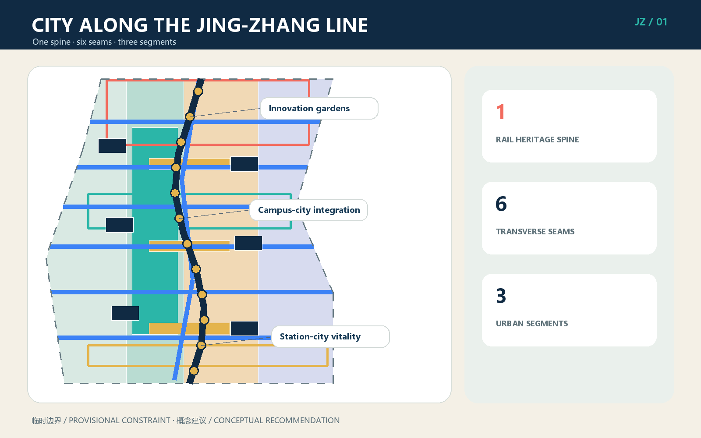
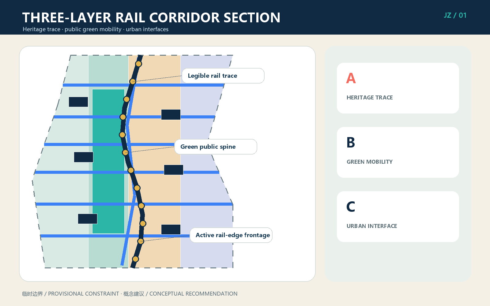
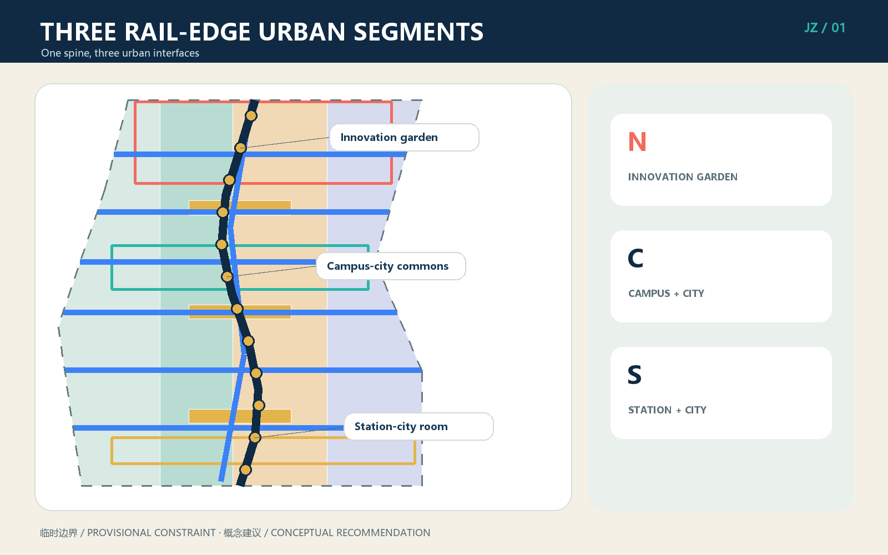
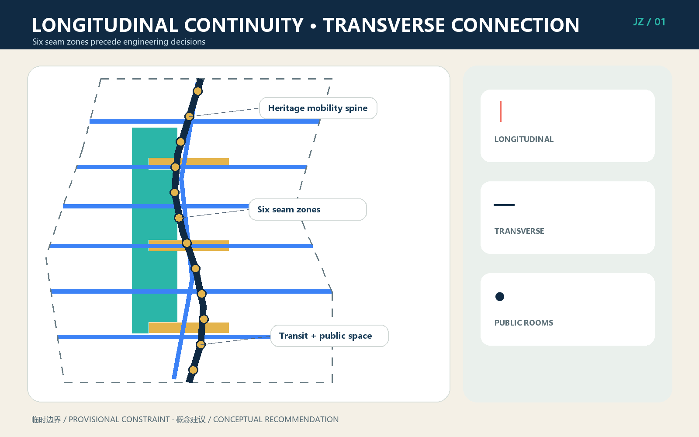
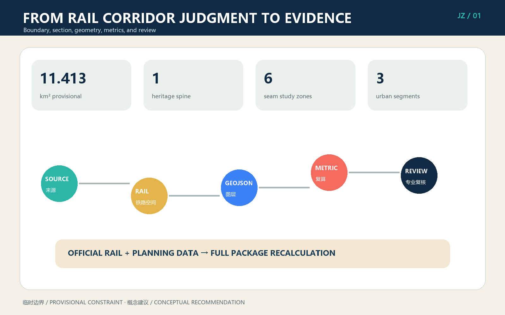

# CITY ALONG THE JING-ZHANG LINE: Reshaping Urban Interfaces on Both Sides through a Railway Heritage Spine

This proposal does not turn the city into a station yard, nor does it use tracks, switches, or tickets as decorative metaphors. It treats the Centennial Jing-Zhang as a real railway corridor that still shapes the city. The design protects and narrates railway history longitudinally, repairs daily urban connections transversely, and makes buildings, courtyards, green spaces, and public services on both sides face the corridor as a civic front. Its structure is one spine, six seams, and three segments. AI operates as content and service in adjacent urban space; it never replaces railway safety, statutory planning, or engineering review.

## Design Basis and Source List

The primary sources are the public competition announcement and the agent open-call taskbook [source:OFFICIAL-ANNOUNCEMENT] [source:AGENT-TASKBOOK]. Machine-readable inputs include `brief/site-package/`, the source registry, fact pack, task tables, and missing-data checklist [source:SITE-PACKAGE] [source:PROCESSED-FACT-PACK]. The submitted overall and key-area geometries are provisional rough constraints from the repository, not official redlines. The approximately 11.413-square-kilometre figure is used only for this concept and its recalculation [data:geometry/site_boundary.geojson#SITE-001] [metric:site_area_sqm]. Official boundaries, railway land limits, existing railway assets and operating conditions, verified heritage inventories and protection zones, ownership, regulatory planning, utilities, and fire-safety data are unavailable; all related control values remain `unknown`.

The original design basis is the railway-worker participant's statement: railway-related urban design should design the city along a railway, not imitate a station yard. This became the `CITY-ALONG-LINE` method [source:DESIGN-METHOD-CITY-ALONG-LINE]. Six international rail-corridor projects are used only to compare mechanisms: continuous walking and active frontage at New York's High Line; sectional opening at Paris's Petite Ceinture; heritage reuse at King's Cross; neighbourhood stitching along Seoul's Gyeongui Line Forest Park; education and innovation links at Sydney's Goods Line; and long-term phasing at Atlanta BeltLine. None supplies site facts, dimensions, or controls [source:CASE-RAIL-CORRIDOR-RENEWAL].

When verified data becomes available, the package must first confirm operating railway and heritage assets, replace official boundaries and surveys, review the six connection problems, and then regenerate land use, buildings, GeoJSON, metrics, five figures, A3 booklet, A0 boards, and offline HTML as one package. Replacing a diagrammatic line alone is not professional development [depth:existing_conditions_diagnosis].

## Three-Level Scope Framework

The coordinated research area, approximately 43.6 square kilometres, asks how the Jing-Zhang corridor can link university research, enterprise translation, everyday communities, and international exchange. The overall design area, approximately 11.4 square kilometres, asks how railway heritage, public green mobility, and renewal on both sides can form a coherent corridor. Three key areas, approximately 368.4 hectares in total, test implementable interfaces at Zhongzhiyuan, AI Origin Community, and Dazhongsi. All three levels share the same railway spine but use different levels of evidence [depth:three_level_scope_framework] [standard:PROJECT-OFFICIAL-ANNOUNCEMENT].

The one spine is the continuously legible Jing-Zhang railway heritage trace, after professional verification, together with a coordinated public green-mobility system [data:geometry/roads.geojson#ROAD-001]. The six seams are study zones for the Northern Gateway, Qinghe ecology, campus-innovation links, AI Origin campus-city links, community public services, and Dazhongsi station-city links. The three segments are the Northern Innovation Garden, Central Campus-City Integration, and Southern Station-City Vitality segments. A seam is not a predetermined bridge, tunnel, or level crossing; it is a problem statement requiring railway-operation, transport, accessibility, ownership, municipal, and engineering review.

| Level | Main judgment | Spatial output | Evidence boundary |
| --- | --- | --- | --- |
| Coordinated research | Railway heritage becomes a shared address for the innovation district | Industry and annual operations network | No new statutory boundary |
| Overall design | One spine, six seams, three segments, and a three-layer section | Land use, green, roads, public space, buildings, and phasing | Concept within provisional geometry |
| Key areas | Three rail-edge urban interface prototypes | Innovation garden, campus-city commons, station-city room | Requires surveys and professional development |

The corridor section has three layers. First is the railway heritage trace, which cannot be erased by generic landscaping. Second is public walking, cycling, vegetation, and stormwater space coordinated with railway safety. Third is the urban interface on both sides, opened through entrances, public ground floors, courtyards, shade, and services. These layers connect spatially but retain distinct management responsibilities, preventing both unsafe intrusion and the treatment of railway heritage as an inaccessible background strip [depth:overall_spatial_structure].

## Coordinated Research Area: Industry and Future City Research

The industry strategy does not spread generic AI offices evenly along the railway. It builds a chain of university research, open-source collaboration, test and validation, enterprise translation, urban application, and international communication. The north hosts autonomous technology, standards, and low-carbon validation; the centre hosts university translation and everyday talent services; the south hosts agents, smart terminals, content, and international release. A shared public railway spine gives institutions a common address, while adaptable rail-edge courtyards support meetings, start-ups, and longer research cycles [source:AGENT-TASKBOOK].

The name `CITY ALONG THE JING-ZHANG LINE` states that the railway is not the city's rear edge. Its logo combines one longitudinal line with one transverse seam; it avoids station-yard, switch, and ticket graphics. Three colours distinguish heritage trace, public green mobility, and urban interface. Only verified railway assets may enter wayfinding and storytelling. The identity is a design recommendation, not a government-approved project name.

An annual operating calendar gives the corridor everyday and seasonal life: a spring railway-botany and industrial-heritage observation season, a summer open-testing month, an autumn Jing-Zhang AI Innovation Week, and a winter Centennial Trace Archive season. Events connect all three segments without occupying operating railway space. Actual organisers remain responsible for permits, railway safety, noise, evacuation, emergency procedures, and copyright. Everyday use takes priority over spectacle, and evaluation focuses on open ground floors, walking continuity, community use, and cross-institution collaboration rather than visitor totals alone.

The future-city principle is stable spatial structure with adaptable content. The heritage spine and public-space network remain continuous; buildings on both sides use reversible partitions, shared ground floors, courtyards, and service interfaces as industries change. AI supports booking, interpretation, maintenance warnings, enterprise services, and open tests. Personal, enterprise, or railway data requires minimisation, authorisation, de-identification, human review, and opt-out mechanisms [standard:PROJECT-AGENT-OPEN-CALL-TASKBOOK].

## Overall Design Area: Urban Renewal and Regulatory-Plan-Level Urban Design

The overall framework uses the railway spine as a longitudinal coordinate, six seams as transverse coordinates, and three segments as differentiated renewal units. Its three-layer section follows the sequence heritage first, public realm second, development third. New massing must not suppress heritage legibility; the public green layer must be continuous, accessible, and maintainable; both urban edges use entrances, shaded space, public ground floors, and courtyards to become civic fronts. Conceptual land-use types are rail-adjacent innovation, railway heritage park and open space, industry and daily services, and campus-community services [data:geometry/land_use.geojson#LU-001].

The six seam zones address regional transition at the Northern Gateway, ecological and walking links at Qinghe, knowledge exchange between campuses, everyday campus-city movement at AI Origin, equitable east-west public services, and station-city/four-quadrant connections at Dazhongsi. Each begins with a demand matrix and compares improvement of existing routes, surface management, overpass, underpass, detour, and timed operations. This proposal deliberately does not choose an engineering form [data:geometry/roads.geojson#ROAD-002] [data:geometry/roads.geojson#ROAD-007].

Buildings use courtyard carriers rather than station-yard forms. Adaptable structures are retained; small reversible additions repair corners; ground-floor renovation connects public space; temporary structures host short events [data:geometry/buildings.geojson#BLDG-001]. The rail edge values human scale, entrances, nighttime safety, screened equipment, and logistics kept off the public spine. FAR, building height, coverage, setbacks, road redlines, and total floor area remain unknown because verified controls and surveys are missing [metric:floor_area_ratio] [depth:development_intensity_controls].

The package reaches an auditable urban-design level by linking judgments to geometry, metrics, sources, or assumptions. It does not claim to be an approved regulatory plan. Capacity balancing, sunlight, fire safety, transport impact, underground space, and municipal engineering begin only after formal planning controls and base data are issued [standard:MOHURD-CONTROL-DETAILED-PLANNING].

## Detailed Design of Key Areas

**Zhongzhiyuan: Northern Innovation Garden Segment.** A low-disturbance, walkable innovation-garden edge addresses the railway. The Qinghe seam combines walking, stormwater, ecology, and research display without occupying river, railway, or safety-control space. Adaptable buildings become courtyards for research, standards workshops, safety testing, and public demonstration. Logistics enters from city roads; the railway side becomes a quiet civic face. The building inventory, river blue line, and railway controls require verification [data:geometry/key_areas.geojson#PROV-KEY-001].

**AI Origin Community: Central Campus-City Integration Segment.** Smaller blocks, frequent entrances, and shared ground floors connect campuses, parks, and neighbourhoods. Spaces along the spine host research release, intellectual property, legal and financial advice, talent services, and daily food, preventing innovation from circulating only inside compounds. The seam first improves existing walking, wayfinding, and accessibility before comparing new crossings. Courtyards support open-source teams and start-ups; quieter services face residential areas [data:geometry/key_areas.geojson#PROV-KEY-002].

**Dazhongsi: Southern Station-City Vitality Segment.** The proposal does not build another station yard. It organises metro, bus, walking, commerce, culture, and railway heritage into recognisable urban public rooms outside technical station systems. Four-quadrant connection is a study task beginning with existing entrances, crossings, and conflict points. Commercial ground floors face public space, while logistics and ride-hailing are zoned separately. Data, smart-terminal, and content scenarios enter controllable and auditable spaces [data:geometry/key_areas.geojson#PROV-KEY-003].

All three use the same heritage-trace, green-mobility, and urban-interface section, but support different public lives: garden research in the north, everyday campus-city exchange in the centre, and station-city interaction in the south. Building scale, retain-renovate-demolish decisions, crossing form, and investment bodies require surveys, ownership checks, railway safety assessment, and professional design [depth:three_key_area_detailed_design].

## AI Innovation Ecosystem, Personas, and AI+ Scenarios

Six personas translate industry ambition into spatial needs. Railway workers require safety boundaries, heritage truth, and maintainability. Open-source developers need release, collaboration, and extended opening hours. Start-ups need affordable space, validation, and professional services. Students and researchers need short campus-city links and translation support. Residents need quiet, equitable, accessible daily space. International visitors need legible navigation, interchange, and multilingual service. These are design roles, not tracking profiles [metric:persona_count].

| No. | Scenario card | Place and user | Data and human boundary |
| --- | --- | --- | --- |
| 01★ | Non-invasive railway inspection test | North; railway professionals | Authorised asset data only; alerts reviewed by professionals |
| 02★ | Low-carbon garden and stormwater prediction | Zhongzhiyuan; operators | Aggregated environment data; no autonomous critical control |
| 03★ | Open-source urban model sandbox | AI Origin; teams and universities | Isolated data, audit logs, human admission and exit |
| 04 | Railway heritage audio guide | Spine; public | Verified content only; no facial recognition |
| 05 | Accessible walking assistant | Six seams; mobility-impaired users | Opt-in; route risks manually reviewed |
| 06 | Campus-city space booking | Centre; students and teams | Minimal account data; offline service retained |
| 07 | Enterprise service copilot | Courtyards; start-ups | No trade-secret access; expert confirmation |
| 08 | Community service Q&A | Community seam; residents | No commercial targeting; correction and appeal |
| 09 | Station-city flow support | Dazhongsi; operators | Lawful aggregate data; no automated enforcement |
| 10 | Multilingual corridor guide | South; international visitors | Machine translation disclosed; safety text reviewed |
| 11 | Public-space maintenance tickets | Three public rooms; maintainers | Images de-identified; limited retention; human dispatch |
| 12 | Event safety support desk | Annual route; organisers | Advice does not replace security, fire, or emergency command |

The three starred items are industry validation tests [metric:industry_test_scenario_count]; the set of twelve is checked by [metric:scenario_card_count]. Each requires a real operator, authorised data, service commitments, human review, logging limits, opt-out, and incident response before launch. AI never controls train operation, railway engineering safety, planning permission, law enforcement, medical decisions, or personal rights. The public realm remains usable without a smartphone or personal-data consent.

Three conceptual pilgrimage landmarks require verified locations and evidence: the Centennial Trace Measure tells engineering history through time and distance; the Jing-Zhang Section House explains alignment, terrain, bridges, culverts, and urban evolution; the Two-Sided City Lookout lets visitors see heritage and urban renewal together. They do not reuse unlicensed historic imagery or promise intervention in unverified assets.

## Land Use, Building Scale, and Retain-Renovate-Demolish Strategy

Land use supports the rail corridor instead of producing isolated campuses. Heritage park and open space form a public backbone; research and industry services occupy accessible courtyards; campus and community services align with east-west routes. `land_use.geojson` forms a closed conceptual partition within provisional geometry and does not represent statutory land-use change [standard:MNR-LAND-USE-CLASSIFICATION-GUIDE]. Public, exhibition, food, service, and shared work uses occupy rail-facing ground floors; research and offices can occupy upper levels; evening uses are managed near homes.

Retain-renovate-demolish decisions follow five checks: railway or historic value, structural safety, adaptability, carbon and cost, and ownership/implementation. Without an existing-building inventory, no real building is designated for demolition. Six conceptual courtyard carriers demonstrate retention, ground-floor renovation, and reversible infill as methods [data:geometry/buildings.geojson#BLDG-001] [depth:retain_renovate_demolish]. The sequence is to retain sound structure, repair envelope and systems, open the ground floor, use reversible infill where needed, and discuss demolition only when evidence requires it.

Interface guidance places principal entrances on public routes, provides shade without entering safety zones, turns walls into manageable transparent edges, and locates equipment, waste, and loading on city-road sides. Roof energy or public use requires structural and character review. Height, FAR, coverage, total floor area, setbacks, and parking ratios all remain `unknown` because official boundaries, planning controls, and surveys are absent [metric:total_floor_area_sqm] [metric:building_density].

Conceptual footprint area can be recalculated from GeoJSON, but has low confidence and is neither existing nor approved scale [metric:building_footprint_area_sqm]. Professional development requires a building-by-building ledger linking retention, repair, renovation, reversible infill, or evidence-based demolition to ownership, structure, fire safety, energy, heritage, tenants, relocation, and finance.

## Transport, Rail, Municipal Infrastructure, and Public Services

Transport follows four rules: longitudinal continuity, transverse stitching, transit interchange, and railway safety first. Walking and cycling are organised along the heritage spine, but exact routes must avoid operating and protection zones. The six seams first improve lighting, wayfinding, gradients, crossings, and accessibility on existing routes before new bridges or tunnels are considered. Landscape activity may not interfere with railway operation, inspection, emergency access, or controlled closure [depth:traffic_rail_slow_parking].

At Dazhongsi and other transit nodes, a station-exterior public-room method integrates entrance identity, bus interchange, cycle parking, ride-hailing, pedestrian crossings, and the corridor public realm without altering technical station systems. Parking, loading, and servicing remain on city-road sides; the public spine carries no logistics traffic. Bridges, tunnels, level crossings, track alteration, electrification, signalling, communications, and protection decisions are outside this concept's authority.

Municipal infrastructure is corridor-coordinated, locally connected, and maintainable. Stormwater gardens, lighting, environment sensing, communications, edge computing, and energy equipment reserve inspection access but do not occupy railway safety space. Missing pipeline, drainage, flood, power, gas, fire, and communications data prevents any engineering capacity, diameter, or service-radius claim [data:geometry/constraints.geojson#CONSTRAINTS] [depth:municipal_new_infrastructure].

Public services use the seams to support east-west equity: community, health, childcare, culture, sport, talent, and enterprise services share accessible routes. Digital service retains staffed alternatives. Night lighting is demand-controlled and limits disturbance to homes and railway work. Formal facility provision must be recalculated from population, industry, standards, and confirmed operators.

## Blue-Green Network, Public Space, and Urban Character

The blue-green network connects Qinghe, Xiaoyue River, rail-edge vegetation, pocket spaces, and three public rooms. The railway trace remains legible rather than being covered by generic landscape. The green-mobility layer supports shade, stormwater, rest, walking, and cycling. Tree groups, courtyards, and active ground floors give social oversight. Conceptual green and public-space ratios are recalculable [data:geometry/green_space.geojson#GREEN-001] [metric:green_ratio] [metric:public_space_ratio], but are not statutory green-space ratios.

The three public rooms are a northern rail-ecology room, central campus-city commons, and southern station-city vitality room [data:geometry/public_space.geojson#PUBLIC-001]. They sit on verified openable city-side land, not assumed railway property, and provide seats, shade, drinking water, toilets, accessibility, interpretation, and small-event interfaces. Night events, amplified sound, temporary structures, and peak management require operating rules.

Urban character is based on engineering truth, durable materials, and restrained expression. It preserves or interprets the scale of track, mileage, bridge and culvert logic, and gradient without copying signal lights or station signs in ways that cause confusion. Deep blue, mineral grey, vegetation green, and small safety-orange accents form the palette. New buildings avoid fake industrial styling and oversized station canopies; they favour courtyards, continuous eaves, maintainable façades, and legible entrances [depth:height_massing_character].

The Centennial Trace Measure, Jing-Zhang Section House, and Two-Sided City Lookout form a heritage-learning route. Before placement, they require a railway heritage survey, archival rights, conservation assessment, structural testing, and safety review. Unconfirmed historical information must be labelled as a research lead [depth:blue_green_public_space] [standard:MOHURD-URBAN-DESIGN-MEASURES].

## Renewal Projects, Implementation Policy, and Phasing

| Project | Content | Phase | Key prerequisite |
| --- | --- | --- | --- |
| R01 Railway heritage asset verification | Inventory trace, assets, bridges, land, and protection | Near | Railway, heritage, and survey authorisation |
| R02 Spine continuity pilot | Reversible city-side improvement outside operating space | Near | Safety, ownership, and maintenance confirmation |
| R03 Three interface public rooms | One lightweight pilot in each segment | Near | Fire, evacuation, accessibility, operator |
| R04 Six-seam integrated studies | Demand, existing routes, and alternatives | Medium | Traffic, railway engineering, utility data |
| R05 Rail-edge courtyard renewal | Retention, ground-floor opening, industry services | Medium | Building ownership, structure, tenant agreement |
| R06 Three heritage landmarks | Measure, Section House, City Lookout | Medium | Heritage evidence, rights, safety review |
| R07 Coordinated three-segment renewal | Long-term land, service, and interface coordination | Long | Statutory planning, finance, delivery mechanism |

Near-term work builds evidence and reversible pilots. It establishes a railway asset and risk ledger and improves selected city-side locations without touching technical railway systems [data:geometry/phasing.geojson#PHASE-001]. Medium-term work compares engineering options for six seams while courtyards, services, and landmarks establish usable nodes [data:geometry/phasing.geojson#PHASE-002]. Long-term work integrates the three segments with statutory planning, land, and finance [data:geometry/phasing.geojson#PHASE-003] [depth:phasing_implementation].

Policy should establish a corridor project ledger shared by railway, district, planning, heritage, transport, landscape, municipal, owner, and public stakeholders. Each project records safety boundary, responsible body, data version, public communication, and exit conditions. Reversible pilots use small, distributed investment and expand only after evaluation; bridges, tunnels, and major buildings follow full professional procedures. Annual events occur only in authorised open space and cannot be used to predetermine permanent construction.

Evaluation covers heritage authenticity and legibility, walking and accessibility continuity, open ground-floor/community use, and industry collaboration/service translation. Floor area and visitor counts are not the only objectives. A pilot that raises railway risk, displaces everyday community use, or creates unaffordable maintenance should pause or be removed [depth:renewal_project_list].

## Metrics, Area Recalculation, and Compliance Matrix

Recalculable metrics include the provisional overall area, conceptual green and public-space area and ratios, conceptual building footprints, phasing coverage, one heritage spine, six transverse seam study zones, three key areas, six personas, twelve scenario cards, and three industry validation tests [metric:railway_heritage_spine_count] [metric:transverse_seam_zone_count]. Areas are recalculated from GeoJSON in EPSG:4548. Values and formulas are in `metrics.json`; task evidence is in `compliance_matrix.json`.

Metrics fall into three groups. Design geometries can be recalculated but only describe the present concept. Statutory or engineering controls—FAR, height, coverage, redlines, setbacks, parking, and service standards—remain `unknown`. Operational indicators—opening hours, accessibility completion, maintenance response, community satisfaction, and enterprise-service translation—need implementation baselines. A geometric value cannot be used to invent a statutory control, and an operational aspiration cannot be presented as a government commitment [depth:metrics_recalculation].

Four review gates cover structural validation, spatial review, professional-content review, and visual/bilingual delivery review. Sources, assumptions, standards, and depth are recorded in `sources.json`, `assumptions.json`, `standard_matrix.json`, and `design_depth_matrix.json`. Passing package checks confirms internal structure and disclosure only; it does not mean approval by railway, planning, heritage, or engineering authorities.

Professional development requires official boundaries and controls, railway-operation and asset mapping, heritage inventory and protection limits, ownership and building surveys, integrated transport counts, municipal and flood data, and population, industry, and public-service data. Every data update receives a version record and triggers whole-package recalculation.

## Risk, Copyright, and Compliance

The primary spatial risk is mistaking concept lines for real railway assets or approved crossings. `ROAD-001` is a structural heritage and public-mobility spine; the six transverse lines are study zones, not bridges, tunnels, level crossings, or engineering axes. A second risk is spatial dispute caused by provisional boundaries and missing controls, so all intensity, scale, and control-line values remain unknown. Railway operation, heritage, fire, flood, transport, utilities, and accessibility require responsible professional teams [depth:risk_missing_data].

AI risks include personal or enterprise data leakage, model error, automation bias, and digital exclusion. Controls include minimisation, purpose limitation, explicit consent, de-identification, deletion periods, human review, appeal, and non-digital alternatives. AI does not access unauthorised critical railway systems and cannot replace train control, maintenance responsibility, statutory approval, enforcement, or emergency decisions. Public-space access never requires personal-data disclosure.

The narrative, translation, programmatic figures, design GeoJSON, offline HTML, A3/A0 PDFs, and cover are generated for this submission. No commercial map screenshots, uncleared news photographs, portraits, corporate marks, or remote scripts are used. The railway-worker participant contributed the original direction of real railway-corridor urban design rather than station-yard imitation. Generation and rights boundaries are recorded in `report/copyright_statement.md`.

The proposal claims no official approval, statutory plan, ownership, final engineering solution, investment commitment, or railway-authority consent. Its licence is `COMMUNITY-DISPLAY-ONLY`; engineering reuse requires fresh data, design, rights, and professional authorisation. Chinese and English narratives, figures, drawings, and HTML are paired. Chinese is the primary text; where translation is ambiguous, the Chinese concept boundaries and structured data govern.

## References

The machine-readable source relationship is in `sources.json`. Primary materials include the announcement, agent taskbook, `brief/public-brief.md`, `brief/site-package/design_brief.json`, `allowed_design_space.json`, the source registry, fact pack, scope summary, task requirements, source-use matrix, and missing-data checklist [source:SITE-PACKAGE] [source:SOURCE-REGISTRY]. They confirm tasks, levels, permitted claims, and gaps; they do not provide a complete railway or statutory planning base map.

The original method is recorded as [source:DESIGN-METHOD-CITY-ALONG-LINE]. The case comparison [source:CASE-RAIL-CORRIDOR-RENEWAL] extracts six mechanisms only: continuous public path, sectional opening, heritage reuse, neighbourhood stitching, education-innovation connection, and long-term phasing/value capture. It copies no dimension, form, or control and supplies no site fact.

Professional reference entries cover urban-design management, regulatory-plan-level urban design, and national land-use classification [standard:MOHURD-URBAN-DESIGN-MEASURES] [standard:MOHURD-CONTROL-DETAILED-PLANNING] [standard:MNR-LAND-USE-CLASSIFICATION-GUIDE]. Complete task, standard, depth, metric, assumption, and review records are in `compliance_matrix.json`, `standard_matrix.json`, `design_depth_matrix.json`, `metrics.json`, `assumptions.json`, and `self_check.json`. Railway heritage, operations, crossings, conservation, utilities, and statutory planning still require verified data and professional confirmation.
