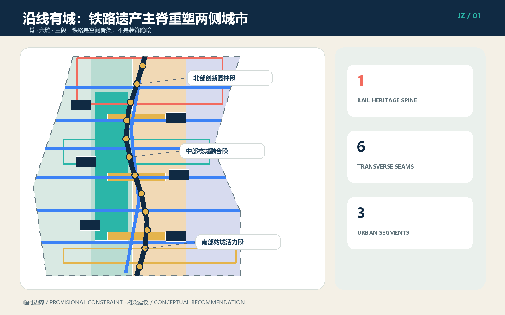
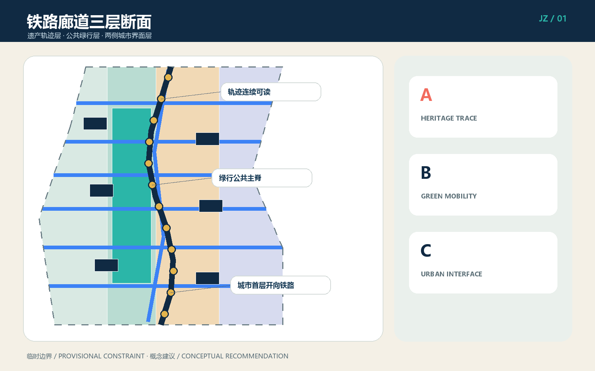
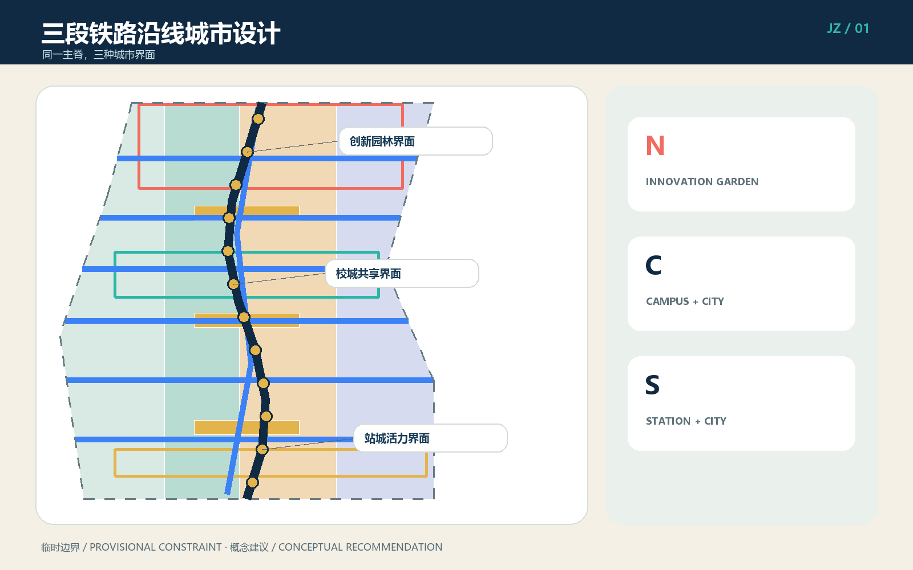
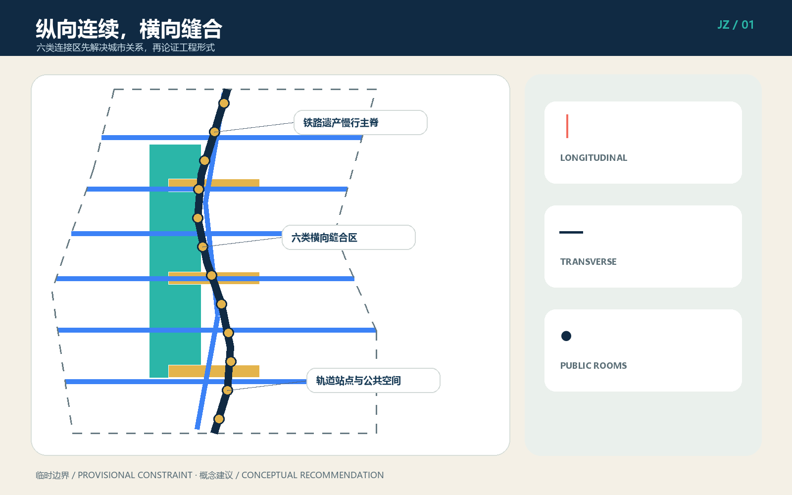
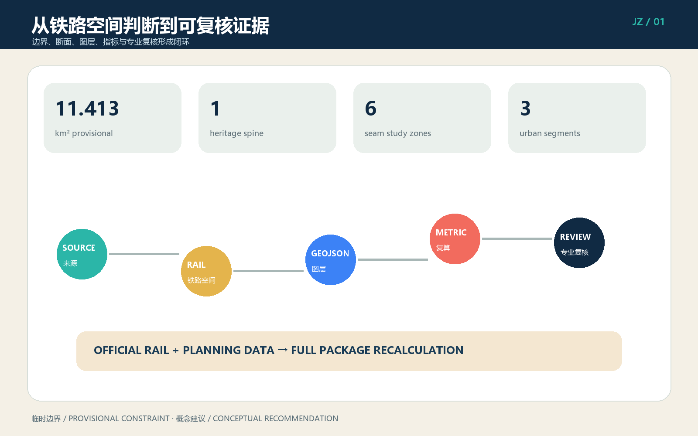

# 沿线有城 / CITY ALONG THE JING-ZHANG LINE：以铁路遗产主脊重塑两侧城市界面

这不是把城市画成站场，也不是用轨道、道岔、车票做形式隐喻。方案把百年京张视作一条仍在塑造城市的真实铁路廊道：纵向保护和讲述铁路历史，横向修补被铁路与快速道路割裂的生活联系，两侧用建筑首层、院落、绿地和公共服务共同形成面向铁路的城市正面。总体结构为“一脊、六缝、三段”，AI进入两侧城市空间的运营和服务，不替代铁路安全、规划审批和工程论证。

## 设计依据与资料清单

第一依据为海淀区公开的征集公告与面向智能体任务书 [source:OFFICIAL-ANNOUNCEMENT] [source:AGENT-TASKBOOK]；机器可读依据包括 `brief/site-package/`、来源登记、事实包、任务表和缺资料清单 [source:SITE-PACKAGE] [source:PROCESSED-FACT-PACK]。提交使用的总体范围与三处重点区几何来自仓库临时粗略约束，不是官方红线；约 11.413 平方公里只用于本轮构图与复算 [data:geometry/site_boundary.geojson#SITE-001] [metric:site_area_sqm]。官方边界、铁路用地界、现状线路与设施、文保对象名录和保护范围、权属、控规、市政、消防资料尚缺，所有相关控制值保持 `unknown`。

原创设计依据是铁路职工参与者提出的判断：“城市铁路设计不是设计站场，而是设计铁路沿线的城市。”据此形成 `CITY-ALONG-LINE` 方法 [source:DESIGN-METHOD-CITY-ALONG-LINE]。六个国际铁路廊道更新案例仅比较机制：纽约高线的连续步行与首层激活、巴黎小环线的分段开放、伦敦国王十字的遗产再利用、首尔京义线林道的社区缝合、悉尼Goods Line的教育创新联系、亚特兰大BeltLine的长期分期。它们不提供本场地事实、尺度和控制条件 [source:CASE-RAIL-CORRIDOR-RENEWAL]。

资料到位后的更新顺序固定为：先核定铁路运营和遗产资产，再替换官方边界与现状底图，继而校正六处连接问题、用地和建筑，最后整体重算 GeoJSON、指标、五张图、A3、A0 与离线 HTML。任何单独替换示意线而不联动复核的做法都不构成正式深化 [depth:existing_conditions_diagnosis]。

## 三层范围工作框架

统筹研究范围约 43.6 平方公里，回答京张铁路如何串联高校策源、企业转化、社区生活与国际交往；总体设计范围约 11.4 平方公里，回答铁路遗产、公园慢行和两侧城市更新怎样形成完整廊道；三处重点区域合计约 368.4 公顷，分别验证众智园、AI原点社区和大钟寺的可实施界面。三层共享同一铁路主脊，却采用不同证据深度 [depth:three_level_scope_framework] [standard:PROJECT-OFFICIAL-ANNOUNCEMENT]。

“一脊”是经专业核实后连续可读的京张铁路遗产轨迹，以及与其协调的公共绿行系统 [data:geometry/roads.geojson#ROAD-001]；“六缝”是北部门户、清河生态、高校园区、AI原点校城、社区公共服务、大钟寺站城六类横向联系研究区；“三段”是北部创新园林、中部校城融合、南部站城活力。六缝不是六座已决定的桥或隧道，而是六个必须同时核验铁路运营安全、交通需求、无障碍、权属和市政条件的问题清单。

| 层级 | 主要判断 | 空间成果 | 证据边界 |
| --- | --- | --- | --- |
| 统筹研究 | 铁路遗产成为创新城区共同地址 | 产业与年度运营网络 | 不新增法定边界 |
| 总体设计 | 一脊六缝三段与三层断面 | 用地、绿地、道路、公共空间、建筑和分期图层 | 临时边界内的概念设计 |
| 重点区域 | 三种铁路城市界面原型 | 创新园林、校城共享、站城客厅 | 需现状测绘和专业深化 |

断面由三层构成：底层是不得被景观化抹平的铁路遗产轨迹；中层是与铁路安全边界协调的公共步行、骑行、雨洪与植被层；外层是朝向廊道开放的两侧城市界面。三层在平面上相连，在管理上分责，既避免侵入铁路安全空间，也避免把铁路隔离成无人使用的“背景绿带” [depth:overall_spatial_structure]。

## 统筹研究范围产业与未来城市研究

产业策略不是沿铁路平均铺满AI办公，而是建立“高校策源—开源协作—中试验证—企业转化—城市应用—国际传播”的沿线链条。北段承接自主技术、标准与低碳验证，中段承接高校成果转化和人才日常，南段承接智能体、终端、内容消费与国际发布。公共铁路主脊让不同机构拥有共同可识别的城市地址，两侧可改造院落提供从短时会议到长期研发的多尺度空间 [source:AGENT-TASKBOOK]。

命名“沿线有城”强调铁路不是城市背面，英文 `CITY ALONG THE JING-ZHANG LINE` 便于国际传播。标识由一条纵向线与一条横向缝合线组成，不使用站场、道岔或票券图形。三色系统分别表示遗产轨迹、公共绿行和城市界面；只有经核实的铁路资产才可进入导视叙事。品牌用于公共识别，不代表政府已批准项目名称。

年度运营提出四季节奏：春季“铁路植物与工业遗产观察季”，夏季“沿线开放测试月”，秋季“京张AI创新周”，冬季“百年轨迹档案季”。每季串联三段但不占用铁路运营空间；活动审批、安全、噪声、疏散和版权由实际主办方另行负责。公共空间日常运营优先于大型活动，运营绩效关注首层开放时长、步行连续性、社区使用和跨机构合作，而非只统计客流。

未来城市形态的关键是“可变内容、稳定骨架”：铁路遗产主脊和公共空间网络保持长期连续，两侧建筑用可逆隔断、共享首层、院落和设备接口适应产业变化。AI系统只做预约、导览、维护预警、企业服务与开放测试辅助；涉及个人、企业和铁路数据时坚持最小采集、授权、脱敏、人工复核和退出机制 [standard:PROJECT-AGENT-OPEN-CALL-TASKBOOK]。

## 总体设计范围城市更新与控规深度城市设计

总体结构以铁路主脊为纵向坐标，以六类缝合区为横向坐标，以三段为差异化更新单元。铁路廊道三层断面控制“先遗产、再公共、后开发”的空间次序：不得以新增体量压迫遗产可读性；公共绿行层应连续、可达、可维护；两侧界面通过入口、架空或退让空间、连续遮阴、公共首层和院落形成城市正面。概念用地分为创新研发界面、遗产公园与开敞空间、产业生活服务界面、校城社区服务界面 [data:geometry/land_use.geojson#LU-001]。

六类缝合区分别解决：北部门户的区域转换，清河的生态与慢行联系，高校园区的知识交流，AI原点的校城日常，社区公共服务的东西公平，大钟寺的站城和路口四象限联系。每处先做需求矩阵，再在“既有通道改善、地面组织优化、上跨、下穿、绕行与运营时段管理”中比较；本方案不选择工程形式 [data:geometry/roads.geojson#ROAD-002] [data:geometry/roads.geojson#ROAD-007]。

两侧建筑采用“院落载体”而非站场形态：保留可用结构，以小尺度加建补齐街角，以首层改造连接公共空间，以可逆构筑物承载短期活动 [data:geometry/buildings.geojson#BLDG-001]。铁路界面不追求整齐天际线，而强调近人尺度、入口频率、夜间安全、设备遮蔽、后勤不穿越公共主脊。FAR、建筑高度、密度、退线、道路红线和总建筑规模因资料不足保持未知 [metric:floor_area_ratio] [depth:development_intensity_controls]。

总体设计达到“空间对象可审查”的城市设计表达，但不冒充审定控规：每项判断均落到图层、指标、来源或假设；正式控规条件到位后才开展容量平衡、日照、消防、交通影响、地下空间和市政专项计算 [standard:MOHURD-CONTROL-DETAILED-PLANNING]。

## 重点区域详细设计

**众智园：北部创新园林段。** 铁路边缘采用低扰动、可步行的创新园林界面，清河生态联系区组织慢行、雨洪与科研展示，但不得侵占河道、铁路或安全控制空间。保留有再利用价值的建筑，以院落连接研发、标准工作坊、安全测试和公共展示；后勤交通从城市道路侧进入，铁路侧形成安静公共正面。具体建筑名录、河道蓝线和铁路保护条件待核 [data:geometry/key_areas.geojson#PROV-KEY-001]。

**北京AI原点社区：中部校城融合段。** 用更小街坊、更密入口和共享首层连接校园、园区与社区。铁路主脊旁设置成果发布、知识产权、法务、融资、人才服务和日常餐饮，避免只在园区内部循环。校城缝合区首先改善既有步行路径、导向与无障碍，再比较新通道可行性；沿线院落容纳开源协作与小团队成长，居住区一侧设置低噪声社区服务 [data:geometry/key_areas.geojson#PROV-KEY-002]。

**大钟寺：南部站城活力段。** 轨道站点周边不是再造“站场”，而是把地铁、公交、步行、商业、文化和铁路遗产组织成可辨认的城市公共房间。四象限联系作为研究任务，优先盘点既有出入口、过街设施和人流冲突；商业首层朝向公共空间，后勤和网约车分区组织。数据要素、智能终端和内容消费场景进入可关闭、可审计的室内外界面 [data:geometry/key_areas.geojson#PROV-KEY-003]。

三处共同采用“轨迹—绿行—界面”断面，却以不同公共生活为核心：北段是花园研发，中段是校城日常，南段是站城交往。每处的建筑规模、拆改留对象、桥隧形式和投资主体都须在现状测绘、权属核验、铁路安全评估及专业方案中确认 [depth:three_key_area_detailed_design]。

## AI 创新生态、人才画像与 AI+ 场景

六类人物把产业目标转化为空间需求：铁路职工关注安全边界、遗产真实性和可维护性；开源开发者需要发布、协作与夜间使用；初创团队需要低成本空间、中试和专业服务；高校师生需要校城短路径和成果转化；周边居民需要安静、公平、无障碍的日常空间；国际访客需要清晰导览、交通换乘和跨语言服务。所有画像是设计角色，不是对真实个人的追踪标签 [metric:persona_count]。

| 编号 | 场景卡 | 位置与对象 | 数据及人工边界 |
| --- | --- | --- | --- |
| 01★ | 铁路设施非侵入巡检测试 | 北段；铁路专业人员 | 仅用获授权设施数据；报警由专业人员复核 |
| 02★ | 低碳园林与雨洪预测测试 | 众智园；园区与运维 | 环境数据聚合；不自动控制关键设施 |
| 03★ | 开源模型城市中试沙盒 | 原点社区；团队与高校 | 隔离数据集、审计日志、人工准入退出 |
| 04 | 遗产语音导览 | 主脊；公众 | 只发布核实内容；不做人脸识别 |
| 05 | 无障碍慢行助手 | 六缝；行动不便者 | 用户主动开启；路线风险人工复查 |
| 06 | 校城协作空间预约 | 中段；师生与团队 | 最小账户信息；保留线下窗口 |
| 07 | 企业服务副驾驶 | 沿线院落；初创企业 | 不读取商业秘密；专家签字确认 |
| 08 | 社区公共服务问答 | 社区缝；居民 | 不做商业推荐；错误可申诉纠正 |
| 09 | 站城客流辅助研判 | 大钟寺；运营人员 | 只用合法聚合数据；不自动执法 |
| 10 | 多语种沿线导览 | 南段；国际访客 | 明示机器翻译；关键安全信息人工校译 |
| 11 | 公共空间维护工单 | 三个铁路客厅；运维 | 图片脱敏、限定留存、人工派单 |
| 12 | 活动安全辅助台 | 年度活动路线；主办方 | 风险提示不替代安保、消防与应急指挥 |

带★的三项为产业测试验证场景 [metric:industry_test_scenario_count]，12项总数由 [metric:scenario_card_count] 核对。每个场景必须有真实运营主体、授权数据、服务承诺、人工复核、日志期限、退出机制和事故响应后才能上线。AI不得决定铁路行车、工程安全、规划许可、治安执法、医疗诊断或个人权益；公共空间始终提供不用手机、不授权个人数据也能使用的路径。

三处“朝圣地标”均是待核实后落位的概念：**百年轨迹标尺**以时间和里程讲述工程史；**京张断面馆**展示线路、地形、桥涵和城市演变；**两侧城市看台**让公众同时观察铁路遗产与城市更新。它们不复制未经授权的历史图像，也不对未核实资产做改造承诺。

## 用地、建筑规模与拆改留方案

用地结构服务铁路廊道而非制造孤立园区：铁路遗产公园和开敞空间形成公共骨架，创新研发与产业服务分布在可达院落，校城社区服务布置在东西联系路径上。`land_use.geojson` 在临时边界内闭合覆盖，用于检验结构而非法定用途调整 [standard:MNR-LAND-USE-CLASSIFICATION-GUIDE]。沿线首层优先公共、展示、餐饮、服务和共享工作，上层承载研发与办公，居住侧避免夜间活动扰民。

拆改留采用五步核验：铁路或历史价值、结构安全、使用适配、碳排与成本、产权及实施条件。未取得现状建筑名录前，不对真实建筑做拆除结论。概念图层中的六个院落载体分别标注保留活化、首层改造或可逆加建，只说明类型方法 [data:geometry/buildings.geojson#BLDG-001] [depth:retain_renovate_demolish]。优先顺序为保留可用结构、修缮立面和设备、打开首层、用轻型可逆构筑补缺，最后才讨论必要拆除。

建筑界面控制建议包括：主要入口朝公共路径；连续遮阴和雨棚不侵入安全界；围墙转为可管理的通透边界；设备、垃圾、装卸置于城市道路侧；屋顶用于低扰动能源或活动前须做结构与景观复核。建筑高度、容积率、建筑密度、总建筑面积、退线和停车配比全部保持 `unknown`，因为官方边界、控规和现状测绘不足 [metric:total_floor_area_sqm] [metric:building_density]。

概念建筑基底面积可由 GeoJSON 复算，但低置信度且不代表现状或获批规模 [metric:building_footprint_area_sqm]。正式深化必须逐栋建立“保留—修缮—改造—可逆加建—待论证拆除”台账，关联权属、结构、消防、能源、遗产、租户安置和投资测算。

## 交通、轨道、市政与公共服务设施

交通原则是“纵向连续、横向缝合、轨道换乘、铁路安全优先”。纵向公共步行与骑行系统沿遗产主脊连续组织，但具体线路必须避让铁路运营与保护范围；横向六缝先修复现有通道的照明、导向、坡度、过街和环境，再论证新增桥隧。铁路沿线不得以景观活动干扰行车、检修、应急和封闭管理 [depth:traffic_rail_slow_parking]。

大钟寺等轨道站点采用“站外公共房间”方法：整合出入口识别、公交换乘、共享单车停放、网约车上下客、步行过街和沿线公共空间，而非改变车站专业系统。停车和装卸分散在城市道路侧，慢行主脊不承担后勤车流。所有桥、隧、平交、线路改造、接触网、信号、通信和防护决定均不在本概念方案授权范围内。

市政采用“廊道统筹、分区接入、可维护优先”：雨洪花园、照明、环境监测、通信、端侧算力和能源设施与公共空间同步预留检修路径，但不得占用铁路安全空间。因缺少管线、排水、防洪、供电、燃气、消防和通信现状，本方案不标注工程容量、管径和服务半径 [data:geometry/constraints.geojson#CONSTRAINTS] [depth:municipal_new_infrastructure]。

公共服务沿六缝组织东西公平：社区服务、卫生、托育、文化、运动、人才服务和企业服务共享可达路径。数字服务保留人工窗口；夜间照明按需求启闭并控制对居住和铁路作业的干扰。正式设施配置须依据人口、产业、公共服务标准和运营主体重新测算。

## 蓝绿空间、公共空间与城市风貌

蓝绿系统把清河、小月河、铁路沿线植被、口袋空间和三个公共客厅纳入连续网络。铁路遗产轨迹保持清晰，不被大面积景观覆盖；绿行层承担遮阴、雨洪、休憩、步行与骑行；两侧界面通过树阵、院落和首层活动形成安全看护。临时图层可复算概念绿地与公共空间比例 [data:geometry/green_space.geojson#GREEN-001] [metric:green_ratio] [metric:public_space_ratio]，但比例不等同法定绿地率。

三个公共客厅分别是北段铁路生态客厅、中段校城共享客厅、南段站城活力客厅 [data:geometry/public_space.geojson#PUBLIC-001]。它们不是铁路用地内的广场，而是布置在经核实可开放的城市一侧，提供座椅、遮阴、饮水、卫生间、无障碍、导览和小型活动接口。夜间活动、扩声、临时搭建和高峰管理必须有运营规则。

城市风貌采用“工程真实、材料耐久、表达克制”。保留或转译轨道尺度、里程、桥涵、坡度和工业构造逻辑，但不随意复制信号灯、站牌等可能造成误认的铁路标志。色彩以深蓝、矿物灰、植被绿和小面积安全橙为主；新建筑避免伪工业风和巨型站棚，更多使用院落、连续檐下、可维护立面和清晰入口 [depth:height_massing_character]。

百年轨迹标尺、京张断面馆、两侧城市看台共同形成遗产学习路线。落位前须完成铁路遗产普查、史料授权、文保评估、结构检测和安全审查；不能确认的历史信息明确标作研究线索 [depth:blue_green_public_space] [standard:MOHURD-URBAN-DESIGN-MEASURES]。

## 更新项目清单、实施政策与分期计划

| 项目 | 内容 | 阶段 | 关键前置条件 |
| --- | --- | --- | --- |
| R01 铁路遗产资产核验 | 轨迹、设施、桥涵、土地和保护要求建档 | 近期 | 铁路、文保、测绘资料授权 |
| R02 主脊连续性试点 | 选择不侵入运营安全的城市侧路段改善 | 近期 | 安全界、权属、运维确认 |
| R03 三个界面公共客厅 | 北中南各一处轻量可逆试点 | 近期 | 消防、疏散、无障碍、运营主体 |
| R04 六缝综合研究 | 需求、既有通道和多方案比较 | 中期 | 交通调查、铁路工程、市政资料 |
| R05 沿线院落更新 | 保留修缮、首层开放、产业服务 | 中期 | 逐栋权属结构和租户协商 |
| R06 三处遗产地标 | 标尺、断面馆、城市看台 | 中期 | 遗产核验、版权与安全审查 |
| R07 三段协同更新 | 用地、设施与界面的长期统筹 | 远期 | 法定规划、资金和实施机制 |

近期先做数据和轻量试点：建立铁路资产与风险底账，选择城市一侧可逆改善，不碰线路专业系统 [data:geometry/phasing.geojson#PHASE-001]。中期在六缝完成工程比较，同时以院落更新、公共服务和三个地标形成可使用的沿线节点 [data:geometry/phasing.geojson#PHASE-002]。远期才把三段更新纳入法定规划、土地和资金统筹 [data:geometry/phasing.geojson#PHASE-003] [depth:phasing_implementation]。

政策上建议建立铁路、属地、规划、文保、交通、园林、市政、业主和公众共同的“廊道项目台账”，每项工程都有安全边界、责任主体、数据版本、公众沟通和退出条件。对可逆试点采用小额、多点、评估后扩展；对桥隧和重要建筑采用完整专业程序。年度活动只能在已开放空间举行，不以活动反推永久建设。

评估采用四组指标：遗产真实性与可读性、步行和无障碍连续性、两侧首层开放与社区使用、产业协作与服务转化。建设量和客流不是唯一目标；若试点增加铁路风险、挤压居民日常或维护成本不可承受，应暂停或撤回 [depth:renewal_project_list]。

## 指标体系、面积复算与合规矩阵

核心可复算指标包括临时总体范围面积、概念绿地和公共空间面积及比例、概念建筑基底、分期覆盖、1条铁路遗产主脊、6个横向缝合研究区、3个重点片区、6类人物、12张场景卡和3项产业验证测试 [metric:railway_heritage_spine_count] [metric:transverse_seam_zone_count]。面积统一在 EPSG:4548 下由 GeoJSON 复算；数值和公式见 `metrics.json`，任务落点见 `compliance_matrix.json`。

指标分三类。第一类为几何可复算的设计量，只说明当前概念图层；第二类为容积率、高度、密度、道路红线、退线、停车和设施标准等法定或工程控制量，现阶段为 `unknown`；第三类为开放时长、无障碍完成率、维护响应、社区满意度、企业服务转化等运营绩效，须在实施后建立基线。不得用第一类数值推导第二类结论，也不得把第三类目标写成政府承诺 [depth:metrics_recalculation]。

四道自检门为结构验证、空间复核、专业内容复核、视觉与双语交付复核。来源、假设、标准与设计深度分别记录在 `sources.json`、`assumptions.json`、`standard_matrix.json` 和 `design_depth_matrix.json`。自检通过仅说明包结构和声明一致，不代表铁路、规划、文保或工程部门批准。

专业深化需补充：官方边界和控规、铁路运营与资产图、遗产名录与保护范围、权属和建筑测绘、综合交通调查、市政管网和防洪、人口产业及公共服务数据。每次补充均应记录数据版本并全包复算，确保图、数、文一致。

## 风险、版权与合规说明

首要风险是把概念线误认作真实铁路设施或已批准通道。`ROAD-001` 仅表达铁路遗产与公共绿行的结构性主脊；六条横线仅表达联系研究区，不是桥、隧、平交或工程轴线。第二类风险是临时边界和缺失控规导致的空间争议，所有强度、规模和控制线保持未知。第三类风险涉及铁路运营、文保、消防、洪涝、交通、市政和无障碍，必须由相应专业团队负责 [depth:risk_missing_data]。

AI风险包括个人和企业数据泄露、模型错误、自动化偏见和数字排斥。控制措施为最小采集、目的限定、明示授权、脱敏、期限删除、人工复核、申诉和非数字替代；AI不接入未经授权的铁路关键系统，不替代行车指挥、维护责任、审批、执法和应急决策。公众使用公共空间不以提供个人数据为条件。

正文、英文译稿、程序化图件、GeoJSON设计层、离线HTML、A3/A0 PDF和封面为本次生成成果。未使用商业地图截图、未清权新闻照片、人物肖像、企业商标或远程脚本。铁路职工参与者贡献了“真实铁路廊道城市设计而非站场模仿”的原创方向，生成方法与版权边界见 `report/copyright_statement.md`。

本方案不声称官方批准、法定控规、土地权属、最终工程方案、投资承诺或铁路部门同意。提交许可为 `COMMUNITY-DISPLAY-ONLY`；任何后续工程使用须重新取得数据、设计、版权和专业授权。双语文本、图件、图册及HTML成对提交，中文为主文本；如译文歧义，以中文概念边界和结构化数据为准。

## 参考资料

本方案的来源关系以 `sources.json` 为机器索引。主要资料包括征集公告、面向智能体任务书、`brief/public-brief.md`、`brief/site-package/design_brief.json`、`allowed_design_space.json`、来源登记、事实包、三层范围表、任务要求表、来源用途矩阵和缺资料清单 [source:SITE-PACKAGE] [source:SOURCE-REGISTRY]。这些材料用于确认任务、范围层级、允许表达和缺口，不等于提供完整铁路与控规底图。

原创方法记录为 [source:DESIGN-METHOD-CITY-ALONG-LINE]。国际案例比较 [source:CASE-RAIL-CORRIDOR-RENEWAL] 仅提取六种机制：连续公共路径、分段开放、遗产再利用、社区横向缝合、教育创新连接、长期分期与价值回收；未复制其尺度、造型和控制指标，也未将其当作本场地现状证据。

专业标准入口包括城市设计管理、控制性详细规划城市设计深度和国土空间用途分类 [standard:MOHURD-URBAN-DESIGN-MEASURES] [standard:MOHURD-CONTROL-DETAILED-PLANNING] [standard:MNR-LAND-USE-CLASSIFICATION-GUIDE]。完整任务、标准、深度、指标、假设和自检分别见 `compliance_matrix.json`、`standard_matrix.json`、`design_depth_matrix.json`、`metrics.json`、`assumptions.json` 与 `self_check.json`。铁路遗产、运营安全、桥隧、文保、市政和法定规划仍需正式资料及专业确认。
