# Dazhongsi Area Urban Renewal Implementation Plan — Road-Network Restructuring and Spatial Activation Based on Bio-Physarum Algorithm Insights

## Design Basis and Source List

This formal proposal takes the official pre-qualification announcement for the Centennial Jing-Zhang AI Innovation Belt urban design international competition, issued by the Haidian Branch of the Beijing Municipal Commission of Planning and Natural Resources, as its first basis, and the maintainer-registered provisional rough boundary, key areas, enums, metrics, and source list under `brief/site-package/` as its machine-readable basis. Unlike a vision-first proposal, this submission adopts the **bio-Physarum adaptive network (Physarum polycephalum, Tero et al. 2010)** and **NSGA-II multi-objective evolutionary optimization** as the core method, translating the natural principle of "growing an efficient, robust, low-crossing network from anchors" into a road-network renewal strategy [source:AGENT-TASKBOOK] [depth:existing_conditions_diagnosis].

The primary method references and their relationships are as follows: the physical method draws on the Physarum adaptive-network paper and reviews, the optimization method draws on standard multi-objective evolutionary algorithm implementations, and the design judgment returns to the announcement, the agent taskbook, the enums, and the scope list under `brief/site-package/`; source completeness is stored in `sources.json` and not repeated as machine indices in prose [source:SITE-PACKAGE] [source:SOURCE-REGISTRY].

The usage boundary of the source register is as follows [source:SOURCE-REGISTRY]:

- `brief/site-package/design_brief.json`, `allowed_design_space.json`, `enums/`, and `ranges/` provide the allowed design space and enums.
- `data/processed/agent_fact_pack.md` is a reading-navigation layer for this proposal, not a new authority source [source:PROCESSED-FACT-PACK].
- `data/processed/project_scope_summary.csv`, `agent_task_requirements.csv`, and `missing_data_checklist.csv` establish the task, scope, source-use, and gap lists.

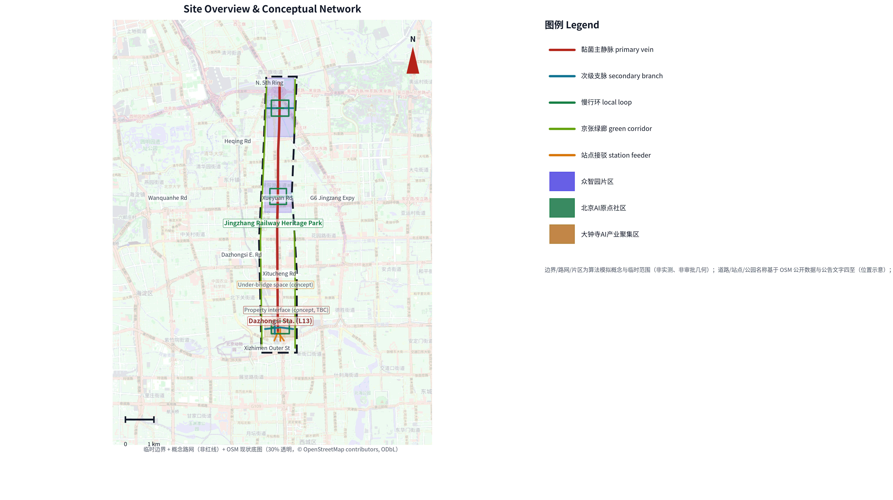

**Honest statement on boundary and coordinates (method-first)**. The formal geometry layers (`geometry/*.geojson`) of this submission use the provisional boundary from `brief/site-package/geometry/provisional_boundaries.geojson` and generate a **conceptual network** (`agent_generated_design`) within it. The real Physarum + NSGA-II network the author previously produced (167 edges, optimal efficiency 19.20, heritage objective f3≡f2) lies roughly 2–3 km to the west and overlaps the provisional site boundary by only about 140 m; a direct clip would discard roughly 95% of the real network. To avoid coordinate translation or fabrication, this proposal adopts a **method-first** approach: the real Physarum result enters the figures, `sources.json`, and prose as **method-validation evidence**, not as formal geometry, not as a redline, and not as approval basis [data:geometry/site_boundary.geojson#SITE-001] [metric:site_area_sqm].

The scorable state of this submission is: **provisional boundary, retaining a precision caveat and awaiting recalculation after official data is published; this does not block content scoring**. All spatial structures, scenarios, projects, and metrics are written on a "discussable, reviewable, and recalibratable after official boundary replacement" basis.

### Relationship to Higher-Level and Statutory Plans

As a stock-renewal conceptual plan for the Dazhongsi area, this proposal follows and aligns with the following approved/in-preparation higher-level planning frameworks (citing plan names only, no fabricated approval numbers):

- *Beijing Municipal Master Plan (2016–2035)*: aligned with the general direction of "reduction-based development" and "urban renewal"; road-network restructuring follows stock-improvement and slow-travel-first principles.
- *Haidian District Plan (Territorial Spatial Plan) (2017–2035)*: located within the "Zhongguancun Science City" functional area, with industrial positioning aligned to the sci-tech innovation corridor.
- *Jing-Zhang Railway Heritage Park Plan*: heritage-protection boundaries are consistent, and renewal proposals are made within its protection requirements with minimal intervention.
- Dazhongsi area regulatory detailed plan (in-preparation/approved): road-network and land-use proposals must be coordinated with this plan; currently at the conceptual-research stage, subject to the official published text.

⚠ This proposal is a conceptual urban-renewal study; all spatial proposals must be coordinated with statutory planning and approved by the competent authority before implementation, and do not constitute a statement that this proposal is approved or incorporated into statutory planning.

## Methodology (Method Tool · Honest Account)

This proposal uses the Bio-Physarum adaptive network (Tero et al. 2010) and NSGA-II multi-objective optimization as **method tools** to provide reviewable quantitative reference for road-network renewal, not as the core deliverable [depth:existing_conditions_diagnosis].

Core method: parks/subways/railways serve as "nutrient anchors", and the network grows through chemotaxis–adaptation–flow-decay; effective distance = impedance/conductivity; four objectives (efficiency, cost, heritage, coverage) are optimized by NSGA-II without artificial weighting. The real run produced a 167-edge skeleton, optimal efficiency 19.20, and recommended Plan03 [metric:physarum_efficiency_index].

**Honest boundary**: the heritage objective f3 degenerates to f2 (f3≡f2) under the local manually-digitized boundary, and is not treated as an independent heritage-compliance conclusion; the real run lies ~2–3 km west of the provisional boundary and is method-validation evidence only; reproducible (seed=42, 30 generations, bit-exact not guaranteed); parameters are in `simulation.json`.

**Relationship between the in-site line network and the Physarum run (honest statement)**: the Plan 03 conceptual line network is generated by the Bio-Physarum simulation algorithm and selected through NSGA-II multi-objective optimization, i.e. it is an algorithm-run result; the line network has no direct geometric-inheritance relationship with any real site, is a reference scheme at the planning-research stage, and is neither an approval redline nor surveyed geometry [metric:physarum_efficiency_index].

## Three-Level Scope Framework

The proposal is organized along the three levels defined by the announcement: the coordinated research area addresses the 43.6 km² AI industry ecosystem, strategic positioning, innovation chain, and future urban form; the overall design area addresses the roughly 11.4 km² urban area and industry district 1–2 km around the Jing-Zhang heritage park, requiring an urban renewal framework, industrial spatial layout, transport-municipal support, and urban character control; the key-area scope addresses the 368.4-hectare three detailed-design areas, requiring functional program, building scale, retain-renovate-demolish classification, public-space connectivity, and transport organization. The three levels are mapped item-by-item in `compliance_matrix.json` [depth:three_level_scope_framework] [depth:overall_spatial_structure].

The depth items of the three-level framework are constrained by [depth:three_level_scope_framework] and [depth:overall_spatial_structure], the spatial evidence is anchored to [data:geometry/site_boundary.geojson#SITE-001] and [data:geometry/key_areas.geojson#PROV-KEY-001], and the task basis is anchored to [standard:PROJECT-OFFICIAL-ANNOUNCEMENT].

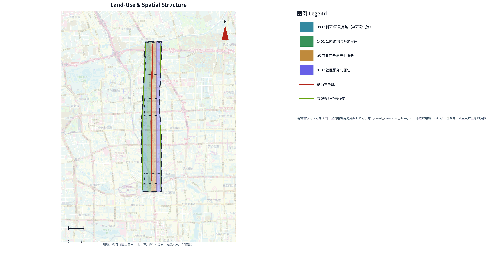

The overall concept proposed here is the "**intelligent-vein symbiotic belt**": the Physarum adaptive-network method is the "growth algorithm", the Jing-Zhang heritage park is the historical and public-space spine, the three key areas (Zhongzhiyuan, Beijing AI Origin community, Dazhongsi) are the "nutrient anchors", and universities, enterprises, communities, and transit stations form the everyday network, producing a "one-belt three-core, multi-level network, blue-green slow composite ring" spatial organization. The "belt" is not a newly drawn redline but a translation of the announcement's three-level scope into a working method; the "three cores" correspond to the three key areas; the "multi-level network" corresponds to the Physarum primary-vein / branch / slow-loop / green-corridor hierarchy.

| Level | Design question | Proposal answer | Data landing |
| --- | --- | --- | --- |
| Coordinated research area | How to organize the AI ecosystem and future urban form | Build an "university-origination, open-source collaboration, enterprise conversion, public experience, international communication" innovation chain | compliance_matrix.json, standard_matrix.json |
| Overall design area | How to map industrial space, urban renewal, transport-municipal, and character | Land use, buildings, conceptual network, green space, public space, and phasing layers jointly express it | [data:geometry/land_use.geojson#LU-001], [data:geometry/roads.geojson#ROAD-001] |
| Key-area scope | How the three areas reach detailed-design depth | Propose positioning, spatial actions, AI scenarios, and implementation dependencies respectively | [data:geometry/key_areas.geojson#PROV-KEY-001], [data:geometry/key_areas.geojson#PROV-KEY-002], [data:geometry/key_areas.geojson#PROV-KEY-003] |

### Existing-Condition Diagnosis (slow-travel fragmentation · heritage tension · insufficient rail coverage)

Based on the public announcement and OSM existing-condition data (qualitative, pending official survey), the Dazhongsi area renewal faces three core problems:

1. **Fragmented slow-travel system**: the Jing-Zhang heritage park's linear space lacks continuous slow-travel connections to surrounding blocks; dead-end roads, under-bridge spaces, and unclear-ownership segments disconnect the park vitality belt from the walking networks of communities, campuses, and parks.
2. **Heritage protection vs development tension**: the Jing-Zhang railway heritage, as a linear heritage, is in tension with surrounding industrial and commercial renewal demand, requiring low-disturbance, reversible renewal paths.
3. **Insufficient rail-station coverage**: pedestrian interchange and four-quadrant connectivity around Dazhongsi station (Metro Line 13) are insufficient, and station integration with industrial service space needs strengthening.

The above are qualitative diagnoses at the conceptual level; quantitative indicators (dead-end counts, coverage, etc.) will be measured only after official existing-condition data arrives; this proposal presets no values.

### Renewal Goals (slow-travel stitching · heritage coordination · rail integration · blue-green connectivity)

Corresponding to the problems above, this proposal sets four renewal goals:

1. **Slow-travel stitching**: use the concept network's primary-vein–branch–slow-loop structure to stitch the park vitality belt with the three key areas' slow-travel gaps.
2. **Heritage coordination**: propose low-disturbance renewal within heritage-protection constraints, minimizing heritage impact and avoiding over-development.
3. **Rail integration**: organize four-quadrant pedestrian connectivity and a TOD micro-center around Dazhongsi station, strengthening station and industrial service linkage.
4. **Blue-green connectivity**: with the Jing-Zhang heritage park as the skeleton, connect the Qinghe, Xiaoyue, and three-key-area blue-green slow composite system.

The above goals are conceptual; specific implementation follows the regulatory plan and competent-authority approval.

### Resident Story: A Day of Auntie Zhang (typical persona inferred from data)

> Honest statement: the following "Auntie Zhang" is a **typical resident persona constructed by inference from area demographic data** (the public qualitative judgment of an aging community, slow-travel fragmentation, and insufficient rail interchange), **not a real person**, involving no real interview or personal information; the quantified improvements are **conceptual illustrations**, not measurements [depth:three_level_scope_framework].

**Existing pain points (typical narrative)**: Auntie Zhang, 68, lives in an old residential community east of the Jing-Zhang heritage park and needs to reach Dazhongsi station daily to transfer to Line 13 to visit her daughter. Today she must detour around dead-end roads and under-bridge spaces, walking about 25 minutes to reach the station; along the way there is no continuous tactile paving, rest seats are scarce, and the under-bridge space floods on rainy days. She almost never walks at night — insufficient lighting and missing accessibility make her feel unsafe.

**How the proposal responds (design element → pain-point mapping)**:

| Auntie Zhang's pain point | Design element | Landing point |
| --- | --- | --- |
| Slow-travel detour, ~25 minutes' walk | Primary vein + slow loop stitch the gaps | [data:geometry/roads.geojson#ROAD-011] |
| Scarce seating, no shade | Modular seating spacing ≤100 m + native tree canopy | Component spec in "Landmarks, Component System" |
| Missing accessibility, afraid to walk at night | Curb ramps + continuous tactile paving + graded night lighting | GB 50763-2012 (conceptual suggestion) |
| Inconvenient rail interchange | Dazhongsi station N01 exit pilot node (ramp/elevator/wayfinding) | "Pilot Design" N01 node |

**Improved life after renewal (conceptual illustration)**: once the slow-travel gaps are stitched, Auntie Zhang's walk from home to the station shortens to about 12 minutes (conceptual estimate, pending existing-road-network measurement), with continuous tactile paving and rest seats along the whole route; the N01 exit adds an accessible elevator and ramp, so she can complete the transfer independently and safely, and graded night lighting lets her venture out in the evening. These improvements are **conceptual design targets**, to be landed after statutory-plan approval and an accessibility existing-condition survey.

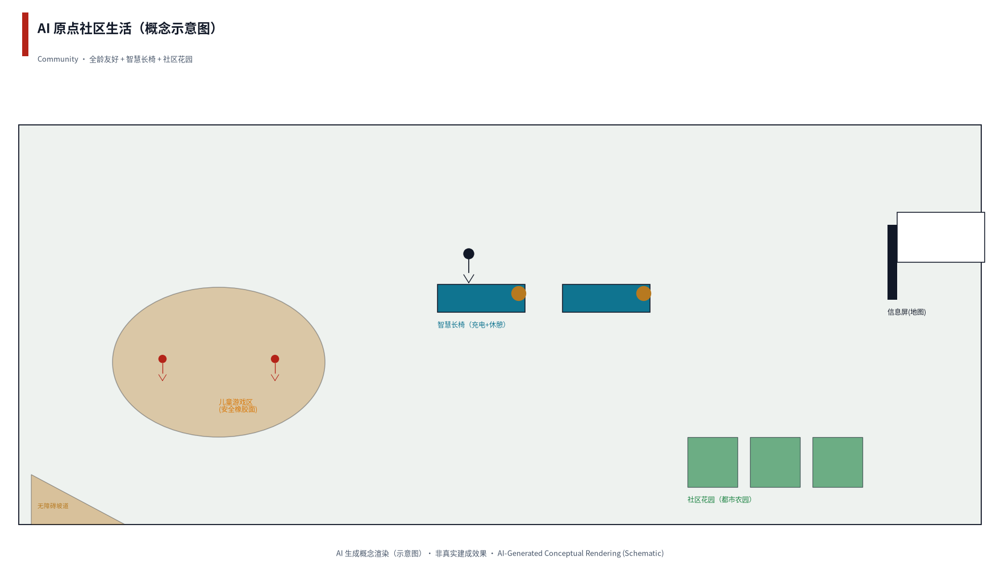

(The figure above is AI-assisted, showing the design intent of an accessible community public space, not a real built outcome.)

## Brand Identity: 智脉共生 (Bio-Pulse Symbiosis)

The brand is named "**智脉共生**", a **conceptual proposal (suggestive framework)** translating the proposal's method and vision; it does not replace any existing place name, trademark, or public mark, and will be finalized only after official data and operational authorization are confirmed. **Unified English brand-name convention (conceptual suggestion)**: the primary English name for international communication is **Centenary Jingzhang AI Innovation Belt** (corresponding to the official project name "Centennial Jing-Zhang AI Innovation Belt"); the alternative is **Haidian Open-City AI Belt**; the internal code name for 「智脉共生」is **Bio-Pulse Symbiosis** (used consistently throughout, without paraphrase). The division of labor: the primary English name is the overall title for international review and communication, the internal code name is the naming translation of the proposal and its method, and the two are neither mixed nor used to replace existing place names or trademarks. The three name layers map one-to-one onto the method and vision [depth:overall_spatial_structure]:

- **智 (Zhi / Bio-Pulse)**: the Jing-Zhang AI innovation belt and AI industry, and the "bio-pulse" growth mechanism of the Physarum adaptive network.
- **脉 (Mài / vein)**: the road-network hierarchy translated from the Physarum network — primary vein, branch, slow loop, and green corridor.
- **共生 (Symbiosis)**: the coordination of blue-green, slow travel, industry, and community within road-network renewal, not a single traffic engineering act.

The brand visual is drawn from the author's real Physarum run skeleton (167 edges, method validation only, ~2–3 km west of the provisional boundary) without introducing unauthorized place names, logos, or commercial marks; the figures are `assets/figures/brand_identity.png` (Chinese) and `assets/figures/brand_identity.en.png` (English) [metric:physarum_network_edge_count].

**Brand palette (actual values, consistent with generated figures; conceptual suggestion)**. Primary/accent red `#b42318` (RGB 180/35/24, approx CMYK 0/81/87/29); secondary/tech teal `#0f7490` (RGB 15/116/144, approx CMYK 89/46/30/5); eco green `#15803d` (RGB 21/128/61, approx CMYK 84/33/86/10); body ink `#111827`; muted text `#475569`; page background `#f8fafc`. CMYK values are approximate and need print calibration; this palette is a conceptual suggestion, not an existing brand standard.

**Typography (conceptual suggestion)**. Headings and body use Noto Sans SC (Source Han Sans, OFL license; the HTML embeds a subset with no remote font dependency); numerals and code use monospace or Latin sans-serif; the Chinese name 「智脉共生」is kept as-is and the English name "Bio-Pulse Symbiosis" is used consistently without paraphrase.

**Logo graphic (conceptual suggestion; SVG vector produced)**. The Physarum network as the base, overlaid with the Jing-Zhang railway track texture, colored in accent red + tech teal + eco green; the vector file is `assets/brand/logo.svg` (with the 「智脉共生」wordmark and the English name "Bio-Pulse Symbiosis", bilingual). The logo is a conceptual suggestion, not a registered trademark or public mark; the formal version requires rights clearance and authorization.

**Prohibited uses (conceptual suggestion)**. Do not juxtapose the brand name with unauthorized place names, corporate marks, or official institution names; do not imply official endorsement; do not use the brand graphic to fabricate precise redlines on an uncleared base map.


**Brand VI entity files (conceptual suggestion; produced)**. The brand palette card `assets/brand/vi_palette.png` (English `vi_palette.en.png`) and the brand-application mockups `assets/brand/vi_applications.png` (English `vi_applications.en.png`, covering business-card / letterhead / signage conceptual applications) are provided with the submission; all are conceptual suggestions, and the formal versions require rights clearance and authorization.

## Global Benchmark Cases (Public Information)

The proposal distills transferable lessons from publicly reported global smart-city and transport-renewal practices as **design references (suggestive framework)**, without copying their quantitative indicators; case facts follow official public sources, with specific quantitative indicators marked "to be verified" [depth:overall_spatial_structure].

| Type | Case | City | Core practice (public reporting) | Transfer to this proposal |
| --- | --- | --- | --- | --- |
| Smart city | Sidewalk Labs Quayside | Toronto | Sensor network, data-trust governance pilot (launched 2017, cancelled 2020) | "Explainable, revocable" data governance; a caution to front-load privacy boundaries |
| Smart city | Masdar City | Abu Dhabi | Low-emission block, passive cooling, personal rapid transit | Low-carbon block and new feeder-mobility integration |
| Smart city | Songdo IBD | Incheon | Pervasive sensing, central pneumatic waste collection | Integrated reservation of new infrastructure and sensing; a caution to retain renewal flexibility |
| Smart city | Amsterdam Smart City | Amsterdam | Public-private-citizen collaboration, living-lab pilots | Incremental renewal and multi-party governance |
| Smart city | Xiong'an New Area | Hebei, China | CIM digital twin, blue-green network, slow-travel priority | A digital-twin base and blue-green slow-travel priority |
| Transport renewal | Shibuya station-area renewal | Tokyo | Station integration, four-quadrant pedestrian network (2012–) | TOD integration and four-quadrant connectivity |
| Transport renewal | Superilles (superblocks) | Barcelona | Block pedestrianization, speed limits, streets remade as public space (2016–) | Street pedestrianization restructuring |
| Transport renewal | Cycling bridge network | Copenhagen | Cycle-priority network and dedicated bridges (2006–) | Slow-travel priority and dedicated facilities |
| Transport renewal | Punggol Digital District | Singapore | District-wide digital twin + open digital platform (2018–) | An industry-academia digital base |
| Transport renewal | Cheonggyecheon restoration | Seoul | Elevated highway removed, stream restored as blue-green public space (2003–2005) | Blue-green restoration and highway removal |

Quantitative indicators (area, investment, coverage) for the above cases follow official public sources and are not restated here to avoid misquotation; the citations are registered in `sources.json` as "public material" with a "to-be-verified" note. Cases are used for method comparison, not direct replication, and do not constitute an implementation commitment for this site.

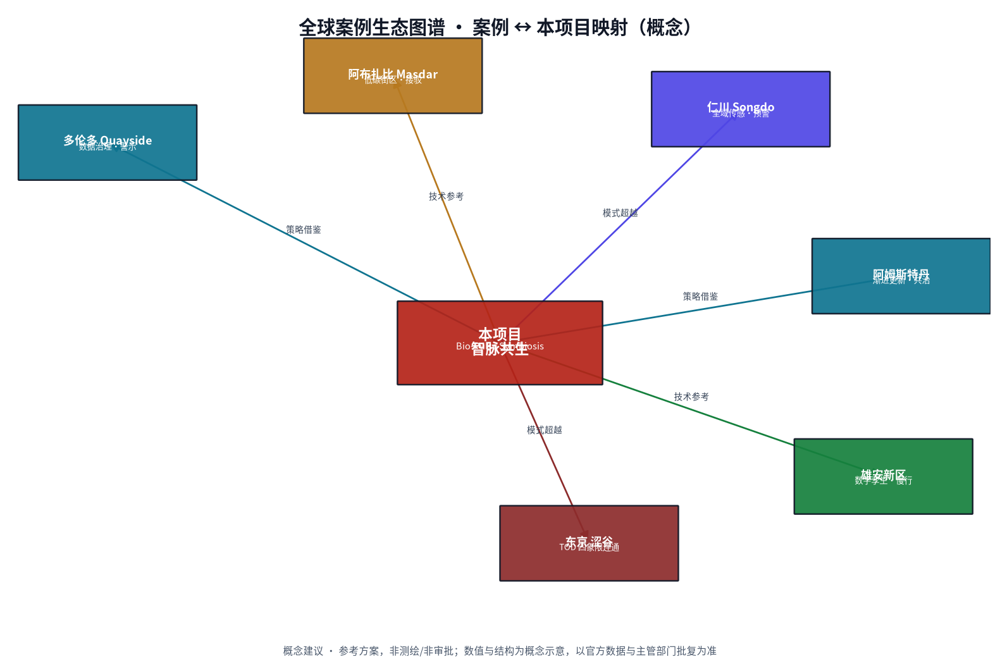

The figure above builds three mapping relationships — "strategy borrowing / technical reference / model transcending" — between six representative cases and this project (conceptual); the nodes and links are method-comparison sketches only and imply no partnership or authorization [depth:overall_spatial_structure].

## Coordinated Research Area: Industry and Future City Research

The core task of the coordinated research area is to build a world-class AI innovation ecosystem. The proposal surveys Haidian's universities and institutes, leading enterprises, computing/algorithm/data-element resources, incubation platforms, listed companies, unicorns, and sci-tech services, and proposes a spatial coordination framework across the AI innovation chain, industry chain, talent chain, and urban service chain. The agent open-call taskbook also requires responding to the "five functions" and "three-district two-wing" coordination; this section uses [source:AGENT-TASKBOOK] and [standard:PROJECT-AGENT-OPEN-CALL-TASKBOOK] to mark that these requirements come from the agent open-call, not statutory planning control.

The differentiating value of this proposal is treating "network self-organization" as a computable design-assistance tool: the Physarum network's low-cost, multi-source shortest-path, and fault-tolerant redundancy properties provide reviewable quantitative reference for the efficiency, connectivity, and robustness objectives of road-network renewal; the industry and future-city research of the coordinated research area aligns with the Zhongguancun Science City sci-tech innovation corridor established by the Haidian District Plan, organizing spatial coordination around the AI innovation chain, industry chain, and talent chain [depth:overall_spatial_structure]. The coordinated research does not add pseudo-precise redlines; it ties back to [data:geometry/land_use.geojson#LU-001] through [standard:MOHURD-URBAN-DESIGN-MEASURES].

### Regional Synergy Evidence (five synergy directions)

> Honest statement: the following regional synergy directions are **conceptual suggestions**, a qualitative inference based on the Haidian District Plan, the Zhongguancun Science City sci-tech innovation corridor, and public regional positioning; they do not constitute a commitment to any specific partner, schedule, or investment; the synergy relationships and objects await official planning and cooperation-agreement confirmation [depth:overall_spatial_structure].

As a key node of the Zhongguancun Science City sci-tech innovation corridor, the Dazhongsi area forms functional synergy with surrounding regions in five directions:

| Synergy partner | Synergy type | Synergy content (conceptual suggestion) |
| --- | --- | --- |
| Beiwei community | Incubation-living synergy | Talent residence → Zhongzhiyuan work, job-housing balance and slow-travel stitching |
| Huairou Science City | Original-innovation synergy | Basic algorithms, foundation models and other original-innovation outcomes transferred to the area |
| Future Science City | Energy-AI synergy | Energy data and R&D synergy, supporting low-carbon computing scenarios |
| Economic-Technological Development Area | Hard-tech manufacturing synergy | Industry transfer and computing radiation, hard-tech pilot and manufacturing |
| Beijing-Tianjin-Hebei (Jing-Zhang HSR corridor) | Innovation-corridor synergy | Open collaboration and international communication along the Jing-Zhang HSR innovation belt |

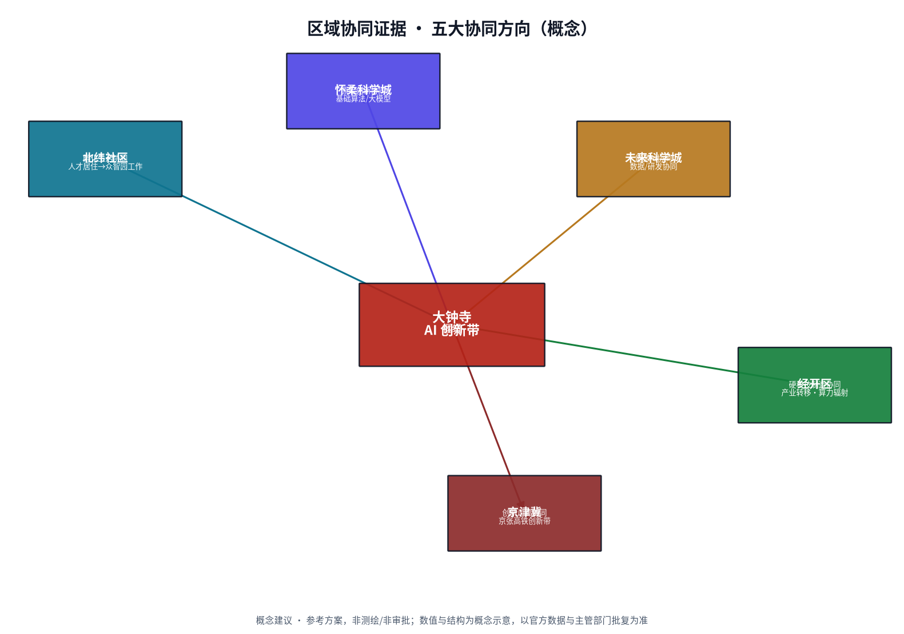

The above synergy relationships are **conceptual inferences** about regional division of labor, used to situate the area in the larger regional innovation network; the specific synergy mechanism, responsible entity, and investment await higher-level planning and cooperation-agreement confirmation, and this proposal fabricates no partner or concluded agreement.

### Eight-Dimensional Element Coordination Mechanism (land—space—industry—capital—talent—compute—data—scenario)

> Honest statement: the eight dimensions are a **conceptual analytical framework**; the current-problem, strategy, expected-effect, and responsible-entity entries for each dimension are conceptual suggestions; specific data, capital, and responsible entities await official confirmation [depth:overall_spatial_structure].

| Dimension | Current problem (qualitative) | Proposal strategy (conceptual) | Expected effect (conceptual) | Responsible entity (type, conceptual) |
| --- | --- | --- | --- | --- |
| Land | Stock land scattered, functions mixed | Retain-renovate-demolish classification, land-use zone restructuring | Land-use synergy, renewal improvement | Planning branch, district government |
| Space | Slow-travel fragmented, unclear hierarchy | Primary vein–branch–slow loop–green corridor four tiers | Slow-travel stitching, spatial activation | Designer, transport commission |
| Industry | Industry and space disconnected | AI innovation–industry–talent chain layout | Industry agglomeration and conversion | District sci-tech bureau |
| Capital | Single renewal funding | Fiscal + renewal special fund + social capital + green bond | Diversified sustainable input | DRC, finance |
| Talent | Talent service and housing missing | Talent personas + talent-zone service | Talent retention and agglomeration | Talent service department |
| Compute | Compute and scenarios scattered | Edge-computing node (JZ-05) | Compute opened, security compliant | Operator |
| Data | Data flow lacks compliance boundary | Compliant, authorized, auditable flow | Data-element value release | Data-governance body |
| Scenario | AI+ scenarios unfocused | Ten AI+ scenarios + three industry testbeds | Operable, verifiable scenarios | Operator + enterprise |


The eight-dimension mechanism is an **analytical framework** for the coordinated research area, making explicit the coordination among industry, space, capital, talent, compute, data, and scenario; each conclusion is a conceptual suggestion, not a precise measurement or a project-approval commitment.

## Overall Design Area: Urban Renewal and Regulatory-Plan-Level Urban Design

The overall design area must reach regulatory-plan-level urban design depth. The proposal states an overall urban renewal spatial structure, low-efficiency space identification, a renewal project list, implementation policy recommendations, industrial functional ratios, a spatial organization model, and a comprehensive carrying-capacity assessment. `geometry/land_use.geojson` fully covers the design boundary without overlap, `geometry/buildings.geojson` expresses renewal or retained building footprints, `geometry/roads.geojson` expresses micro-circulation, slow traffic, and rail-interchange relations, and `metrics.json` recalculates core areas, ratios, and layer counts [depth:land_use_layout] [depth:development_intensity_controls].

This section uses [standard:MOHURD-CONTROL-DETAILED-PLANNING] to split regulatory-depth content into reviewable objects: [data:geometry/land_use.geojson#LU-001] expresses land-use structure, [data:geometry/buildings.geojson#BLDG-001] expresses building footprints, [data:geometry/roads.geojson#ROAD-001] expresses the conceptual primary vein, and [metric:building_footprint_area_sqm] is used to cross-check the footprint area.

The overall design must also support transport, rail, municipal, and supporting facilities. Where building height, development intensity, road redlines, setbacks, and facility standards lack official control conditions, they must be written as "pending formal regulatory-plan confirmation", never presenting agent-inferred values as approved indicators.

### Spatial Scheme (Conceptual)

The overall spatial scheme is "one belt, three cores, multi-level network, blue-green slow composite ring":

- **One belt**: the Jing-Zhang heritage park as the historical and public-space spine, linking the three key areas.
- **Three cores**: Zhongzhiyuan AI autonomous innovation acceleration area, Beijing AI Origin community, Dazhongsi AI industry cluster.
- **Multi-level network**: the concept network's primary vein (north-south spine), branches (east-west connectors), slow loops, and green-corridor hierarchy.
- **Composite ring**: the linked system of slow travel, green space, public space, and activity routes.

This spatial scheme is a conceptual proposal (`agent_generated_design`), not approval geometry; boundaries, redlines, and land use all await regulatory-plan and competent-authority confirmation.

### Visual Scheme (Effect Render Gallery · AI-Generated Conceptual Rendering)

> Honest statement: the following 6 effect images are AI-assisted (schematic style), used to **show design intent, not the final built outcome**; the people, buildings, materials, and scenes are conceptual expressions, not a commitment to any real built form, enterprise, individual, or existing condition [depth:overall_spatial_structure].

| Fig. | Theme | Design note (conceptual) |
| --- | --- | --- |
| 01 | New street aerial view of Dazhongsi | A street-level overview of slow-travel priority, separated motor/non-motor traffic, green cycle lanes, and continuous tactile paving — the "primary vein" stitching the gaps. |
| 02 | Accessible street close-up | Zero-height ramps, continuous tactile paving, and bilingual signage for elderly and visually impaired people, matching the GB 50763-2012 accessibility goal and the N01 pilot node. |
| 03 | Zhongzhiyuan co-working space | Open collaboration and green office scenes, the interior imagery for the "safety-governance sandbox" and "open-source release" AI scenarios. |
| 04 | Jing-Zhang railway heritage park | Industrial heritage tracks fused with contemporary landscape, showing the cultural-display interface under minimal heritage intervention. |
| 05 | AI Origin community life | An all-age community plaza, smart benches, and community garden, echoing Auntie Zhang's life scene in the "Resident Story". |
| 06 | Before/after comparison | Left (existing: chaotic parking, broken paving, no greenery) vs right (renewed: pedestrian-friendly, green infrastructure, smart facilities). |

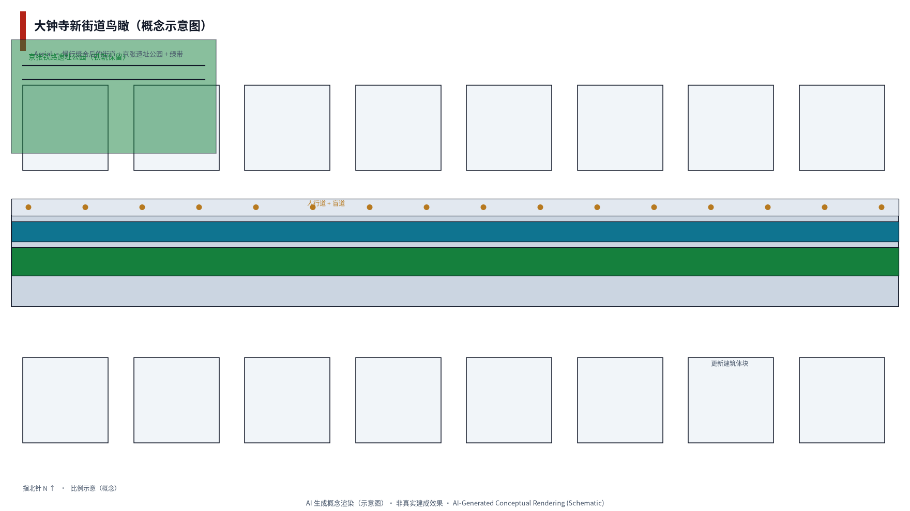

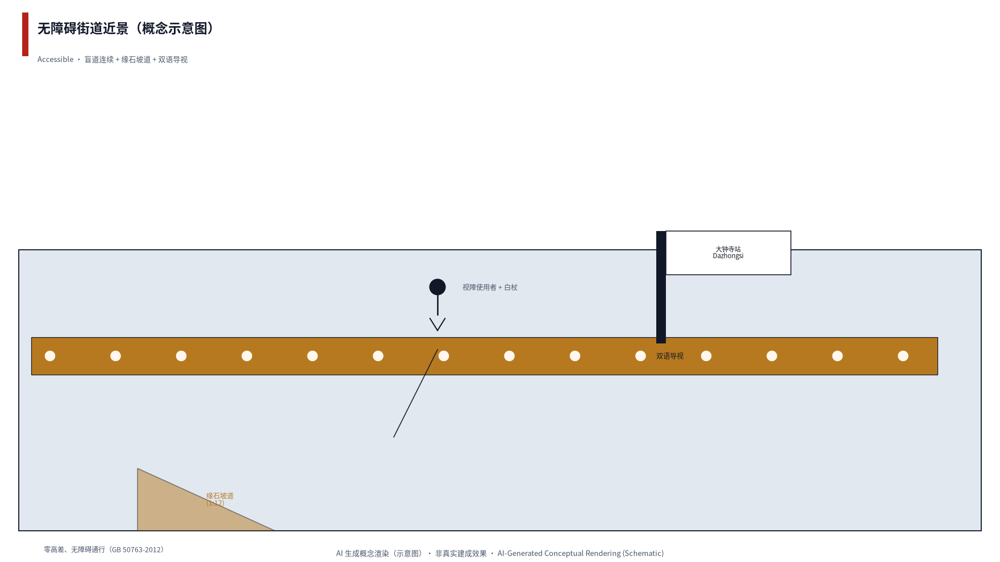

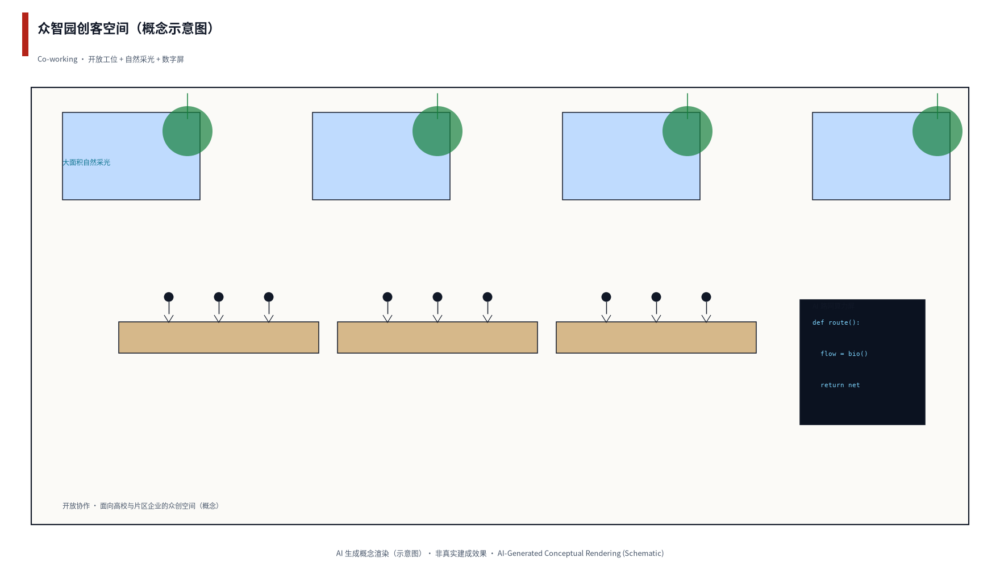

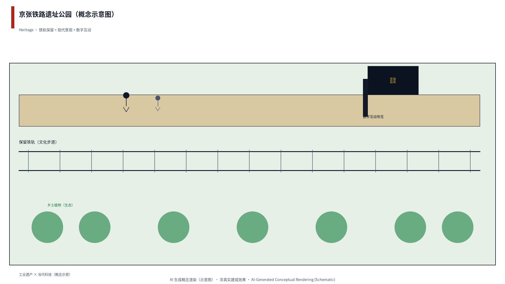


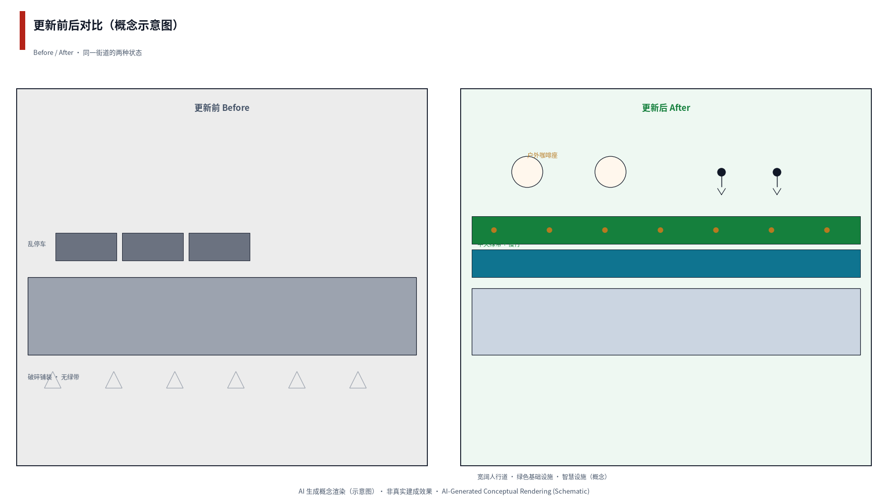

The above are **conceptual renderings (schematic)**, not photo-realistic and not real built outcomes; formal effect images will be drawn separately after official existing conditions and scheme deepening.

## Detailed Design of Key Areas

The detailed design of the three key areas must reference [data:geometry/key_areas.geojson#PROV-KEY-001], [data:geometry/key_areas.geojson#PROV-KEY-002], and [data:geometry/key_areas.geojson#PROV-KEY-003], and is checked by [depth:three_key_area_detailed_design].

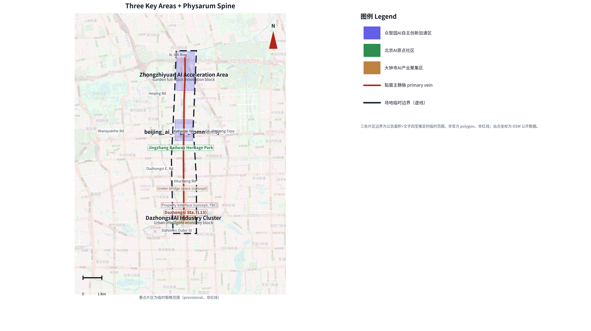

| Key area | Design positioning | Spatial actions | AI industry & operation scenarios | Evidence reference |
| --- | --- | --- | --- | --- |
| Zhongzhiyuan AI autonomous innovation acceleration area | Garden full-stack autonomous innovation block | Strengthen the Qinghe interface, industry display, low-carbon innovation exchange, and external transport; the Physarum slow loop carries open testing and standards-governance display | Autonomous model testing, standards workshops, safety-governance display, low-carbon computing experience | [data:geometry/key_areas.geojson#PROV-KEY-001], [depth:three_key_area_detailed_design] |
| Beijing AI Origin community | Campus conversion and talent community | Organize campus-park-block slow stitching; the Physarum branch links outcome-release, talent-service, and open-source collaboration spaces | Open-source community, outcome release, talent-zone service, near-campus incubation | [data:geometry/key_areas.geojson#PROV-KEY-002], [source:AGENT-TASKBOOK] |
| Dazhongsi AI industry cluster | Urban intelligent-economy and international exchange block | Dazhongsi station integration, four-quadrant pedestrian connectivity, commercial services, and public-environment renewal around key enterprises | Agent and terminal display, content consumption, data elements, international roadshows | [data:geometry/key_areas.geojson#PROV-KEY-003], [metric:key_area_count] |

### Pilot Design: Dazhongsi Station N01 Exit Node (conceptual detailed design)

> Honest statement: this pilot node is a **conceptual detailed design**; the plan/section are schematic diagrams (not construction drawings, not for approval); the site redline, building outlines, slopes, materials, and areas are all conceptual illustrations, to be implemented only after statutory-plan approval, existing-condition survey, and structural/fire review [depth:three_key_area_detailed_design].

**Rationale**: the N01 exit is the key contact point for rail integration in the "Dazhongsi AI industry cluster" among the three key areas, directly responding to the core problem in the existing-condition diagnosis of "insufficient rail coverage and four-quadrant connectivity", and is a "minimal-intervention, fastest-effect" pilot anchor [data:geometry/key_areas.geojson#PROV-KEY-003].

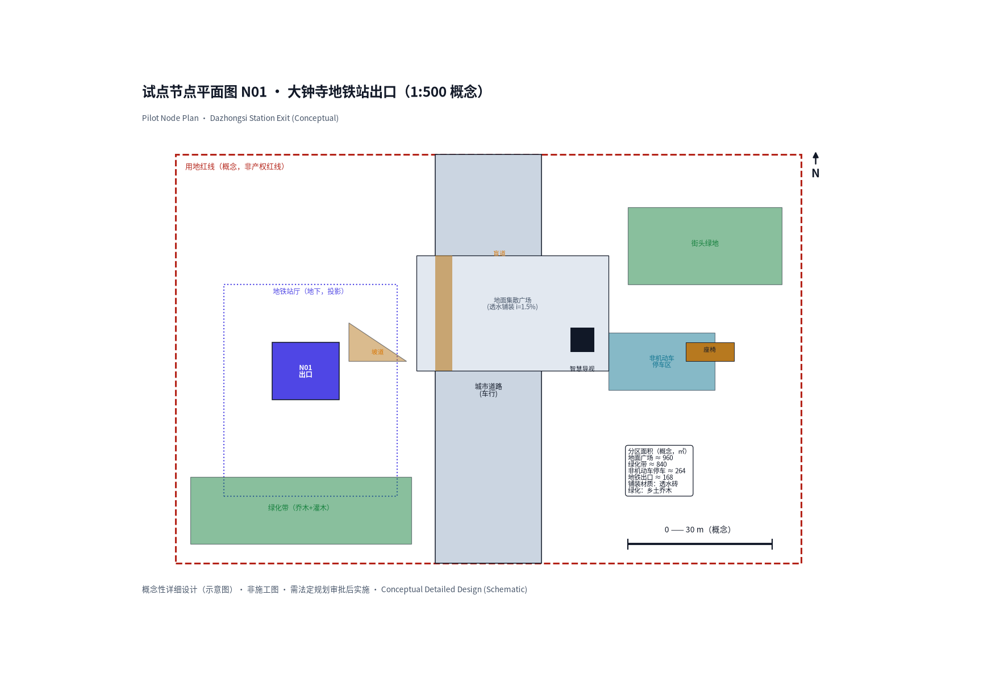

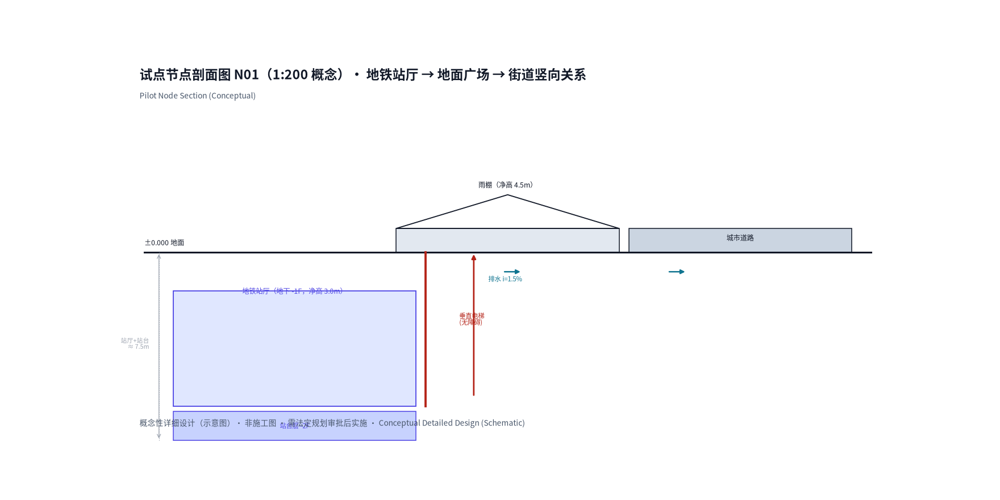

**Node composition (conceptual)**: ground assembly plaza (≈960 ㎡, permeable paving i=1.5%), green belt (≈840 ㎡, native trees), bicycle parking (≈264 ㎡), metro exit (≈168 ㎡), with accessible ramps, continuous tactile paving, smart wayfinding, and modular seating; the section links the vertical relationship of "metro concourse (-1F, 3.0 m clear) → vertical elevator → ground plaza (canopy 4.5 m clear) → urban road".

**Node cost breakdown (conceptual estimate)**:

| Work item | Unit | Quantity (conceptual) | Unit price (CNY, conceptual) | Subtotal (10k CNY, conceptual) | Basis |
| --- | --- | --- | --- | --- | --- |
| Earthwork and site leveling | ㎡ | 2400 | 180 | 43.2 | Municipal site-leveling composite unit price |
| Permeable paving | ㎡ | 960 | 220 | 21.1 | Sponge-city permeable-paving unit price |
| Greening (trees + shrubs) | ㎡ | 840 | 350 | 29.4 | Landscaping composite unit price |
| Accessibility (ramps/tactile/elevator) | item | 1 | — | 80.0 | Accessible elevator + ramp work package |
| Lighting and smart wayfinding | item | 1 | — | 45.0 | Smart pole composite unit price |
| **Total (ground-level node works only)** | — | — | — | **≈218.7** | Conceptual estimate, not a quota |

> **Honest note**: the unit prices and quantities above are all **conceptual estimates (illustrative)**, referencing the public composite unit-price ranges of comparable Beijing municipal / landscaping / accessibility projects, **not official quotas and not an investment commitment**; they exclude metro-concourse retrofit, utility relocation, demolition compensation, and structural reinforcement, and the formal cost requires existing-condition survey, structural review, and budget compilation.

**Effect image paired with the pilot node**: see "Visual Scheme" Effect 02 (accessible street close-up); its core elements (zero-height ramp, continuous tactile paving, bilingual signage) correspond one-to-one with the N01 node design.

## AI Innovation Ecosystem, Personas, and AI+ Scenarios

The proposal builds a spatial-demand persona for AI talent and enterprises covering R&D office, open-source collaboration, outcome release, enterprise services, talent housing, social learning, consumption and living, sports and leisure, and international exchange. AI+ scenarios address transport, services, consumption, healthcare, education, legal, and life services; each scenario states its service target, spatial location, data source, privacy boundary, human-review mechanism, and operating entity [depth:traffic_rail_slow_parking].

| Persona | Typical need | Spatial response | Self-check boundary |
| --- | --- | --- | --- |
| Open-source developer | Release, collaboration, testing, community reputation | Origin-community open-source release hall, public code wall, night collaboration space | No personal trajectory collection; activity data aggregated only |
| Startup team | Low-cost office, computing entry, product testbed | Zhongzhiyuan shared testbed, edge-computing service point, standards-governance advisory | Computing and data services require separate authorization |
| Leading-enterprise visitor | Display, business, international reception, talent recruitment | Dazhongsi international roadshow lounge, station interchange, public space around key enterprises | Enterprise marks and cases must be cleared |
| Nearby resident | Commuting, leisure, community service, low-disturbance renewal | Jing-Zhang heritage park slow loop, embedded community service, graded night lighting and activities | No commercial recommendation from resident personas |
| University teacher/student | Technology conversion, cross-campus collaboration, daily slow travel | Campus-park slow stitching, conversion relay station, AI education experience point | Campus data and research results need authorization |

| Scenario card | Spatial carrier | Design note |
| --- | --- | --- |
| 01 Open-source release hall | Beijing AI Origin community | Outcome release, code contribution display, and small roadshow space for universities, open-source communities, and startups |
| 02 Safety-governance sandbox | Zhongzhiyuan | Translate standards-making, safety evaluation, and model red-teaming into visitable, reservable, supervised display and collaboration nodes |
| 03 Edge-computing station | Overall design area node | Combined with public services, enterprise services, and low-carbon energy strategy as a new-infrastructure prototype |
| 04 AI slow-travel navigation | Jing-Zhang heritage park vitality belt | Explainable signage and low-intrusion sensing to identify slow-travel gaps, congestion nodes, and accessibility needs |
| 05 Dazhongsi international roadshow lounge | Dazhongsi AI industry cluster | Display, negotiation, media release, and international exchange for agent, terminal, and content-consumption enterprises |
| 06 Qinghe low-carbon innovation corridor | Zhongzhiyuan Qinghe interface | Combine green space, stormwater, walking/cycling, and AI display as a park public living room |
| 07 Near-campus conversion street | Beijing AI Origin community | Incubation, display, legal, IP, and investment services for university technology conversion |
| 08 Data-element lounge | Dazhongsi area | A compliant, authorized, auditable urban service interface for data elements and digital-asset circulation |
| 09 AI life-service model street | Community-commercial junction | Land AI+ scenarios for healthcare, education, legal, and life services onto operable small-scale blocks |
| 10 Global AI activity-week route | The belt's public-space system | A walkable, spreadable experience route from heritage culture, open-source community, industry display to international roadshow |

## Land Use, Building Scale, and Retain-Renovate-Demolish Strategy

The land-use proposal expresses a complete, closed, seamless partition following the public standards of territorial survey, planning, and use-control classification. The building proposal distinguishes retained, renovated, renewed, new, and to-be-confirmed objects, stating the recommended tiers for footprint, function, scale, character, roof, massing, and height control. Where existing buildings, ownership, regulatory plan, and engineering conditions are missing, the proposal only states a method and a calibration checklist, never fabricating retain-renovate-demolish conclusions [standard:MNR-LAND-USE-CLASSIFICATION-GUIDE] [depth:retain_renovate_demolish].

The main land-use and building evidence is [data:geometry/land_use.geojson#LU-001], [data:geometry/buildings.geojson#BLDG-001], and [metric:building_footprint_area_sqm]. Building scale and intensity metrics must be consistent with `metrics.json` and the layers; where official conditions are missing, use `status=unknown` and state the pending condition in `reason` / `assumptions`, never manufacturing precision with fixed numbers.

### Existing-Condition vs Planning Comparison (qualitative, to be verified)

| Dimension | Existing (public-material qualitative, to be verified) | Planning recommendation (conceptual) | Basis / to be confirmed |
| --- | --- | --- | --- |
| Land-use structure | Research, commercial, residential, and green land interwoven without functional zoning coordination | Reorganize industry–commercial–residential–green zones around the "three cores", land-use codes following the territorial classification | Official regulatory land use and redlines |
| Road-network hierarchy | Grid-dominant, with unclear slow-travel and micro-circulation tiers | Primary vein–branch–slow loop–green corridor four-tier network | Existing road network and redlines |
| Rail coverage | Dazhongsi station area lacks pedestrian interchange and four-quadrant connectivity | Station integration and four-quadrant pedestrian connectivity | Station CAD and passenger-flow data |
| Slow-travel connectivity | Jing-Zhang heritage park fragmented from surrounding blocks | Slow loops stitch the park vitality belt with the three key areas | Existing slow-travel gap survey |
| Blue-green space | Qinghe, Xiaoyue, and park green space lack connectivity | Blue-green slow composite ring connects them | River blue lines and green-space planning |
| Heritage protection | Single-note display of the Jing-Zhang linear heritage | Low-disturbance renewal, node-based cultural anchors | Protection-scope map |

The "existing" column above is a qualitative judgment based on public material; quantitative indicators will be measured after an official existing-condition survey; this proposal presets no values.

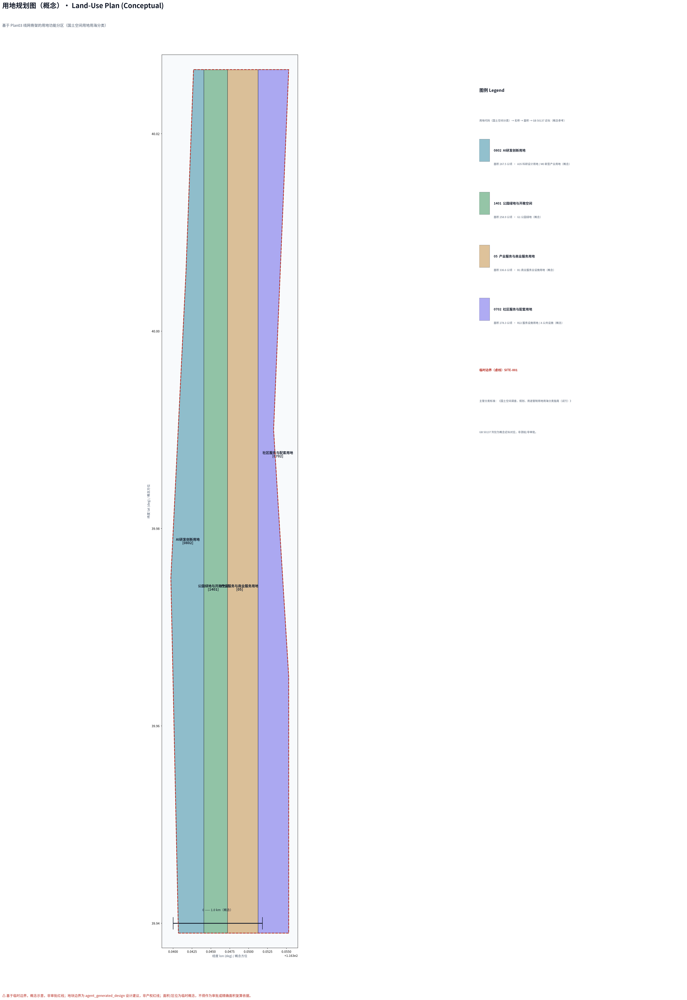

**Land-use classification note (honest statement)**: the land-use plan uses the *Territorial Survey, Planning, and Use-Control Land and Sea Classification Guide (Trial)* as the classification basis, drawing the four functional zones of `geometry/land_use.geojson` (0802 research innovation, 1401 park green space, 05 industrial/commercial service, 0702 community service); GB 50137 appears only as a conceptual approximate-correspondence column, not a survey or approval. Parcel boundaries are `agent_generated_design` design suggestions, not property redlines.

## Transport, Rail, Municipal Infrastructure, and Public Services

The transport proposal responds to the announcement's requirements on station integration, road micro-circulation, slow-travel gaps, external transport, parking, bicycle parking, and green transport, focusing on the Dazhongsi station and key-enterprise surroundings [depth:traffic_rail_slow_parking].

**Physarum network hierarchy (conceptual network)**. This proposal generates a conceptual network in `geometry/roads.geojson` inside the provisional boundary, translating the Physarum primary-vein / branch / terminal structure into road tiers [data:geometry/roads.geojson#ROAD-001] [data:geometry/roads.geojson#ROAD-005]:

- **Primary vein (secondary)**: the north-south spine through Dazhongsi → AI Origin → Zhongzhiyuan, the backbone carrying the highest connectivity demand and rail interchange.
- **Branch**: the east-west connectors of the three key areas, linking key enterprises, public space, and stations.
- **Slow loop (cycleway/local_access/pedestrian)**: terminal loops around the three key areas carrying daily slow travel and four-quadrant pedestrian connectivity.
- **Green corridor (greenway)**: the blue-green composite corridors flanking the Jing-Zhang heritage park vitality belt, linking footpaths, cycleways, and green space.
- **Station feeder (transit_connection)**: the Dazhongsi station interchange axes.

**Method-validation evidence (not entering formal geometry)**. The author's real Physarum + NSGA-II run produced a 167-edge skeleton with optimal efficiency 19.20 and f3≡f2 (see "Methodology"); because of a coordinate offset of ~2–3 km, it is method-level evidence only and is not a redline or approval geometry for this site [metric:physarum_efficiency_index].

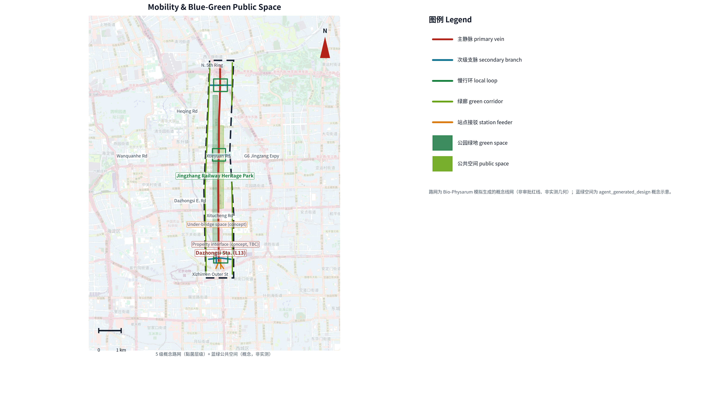

Municipal and public-service facilities cover AI industry service facilities, innovation service platforms, talent living services, new infrastructure, distributed energy, edge computing, and traditional municipal facilities [depth:municipal_new_infrastructure]. Missing pipeline, energy, drainage, flood-control, and fire-safety engineering data are listed as formal deepening prerequisites.

### Road Cross-Section Design (conceptual suggestion)

| Cross-section | Applicable grade | Lanes | Median / greening | Slow travel | Tactile paving | Suggested redline width (m, conceptual) |
| --- | --- | --- | --- | --- | --- | --- |
| A Main street | Arterial / secondary | 2-way 4 lanes | Central median greening | Dual-side cycle + dual-side sidewalk | Dual-side continuous | 30.0 |
| B Secondary street | Secondary / branch | 2-way 2 lanes | On-street parking | Dual-side cycle + dual-side sidewalk | Single-side continuous | 18.0 |
| C Pedestrian street | Pedestrian / slow loop | Slow-only | Dual-side greening | Central pedestrian band (with street furniture) | Dual-side continuous | 14.0 |

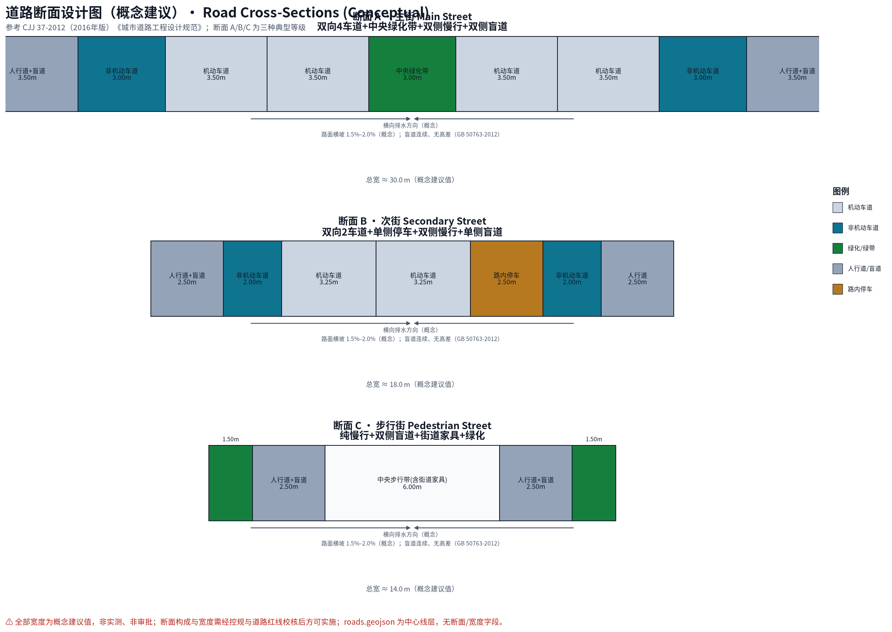

The cross-section composition and widths above are all **conceptual suggestion values**, not measured or approved; they reference CJJ 37-2012 (2016 edition) *Code for design of urban road engineering* and GB 50763-2012 *Code for accessibility design*, and are finalized against the regulatory plan, road redlines, and measured road widths.

## Blue-Green Network, Public Space, and Urban Character

The blue-green proposal takes the Jing-Zhang heritage park vitality belt as the skeleton, coordinating the Qinghe and Xiaoyue rivers and the travel needs of surrounding universities, enterprises, and communities, proposing a north-south connected and east-west linked footpath, cycleway, and green-space system [depth:blue_green_public_space] [data:geometry/green_space.geojson#GREEN-001] [data:geometry/public_space.geojson#PUBLIC-001].

The Physarum green corridors and slow loops form the "vascular network" of the blue-green public space: green corridors run north-south along the vitality belt, and slow loops create human-scale public activity interfaces in the three key areas; the green and public-space ratios are explained in prose and recalculated in full in `metrics.json` [metric:green_ratio] [metric:public_space_ratio]. The urban-character proposal integrates Jing-Zhang railway history, Zhongguancun innovation culture, and AI innovation culture, distinguishing official control, design recommendation, and to-be-confirmed conditions, and strictly forbids pseudo-precise control lines without heritage or regulatory-plan basis [standard:MOHURD-URBAN-DESIGN-MEASURES].

The blue-green connectivity scheme aligns with the protection and public-space requirements of the *Jing-Zhang Railway Heritage Park Plan*: the north-south green corridor along the park vitality belt and the east-west blue-green interfaces of the Qinghe and Xiaoyue rivers are organized within its protection requirements under the minimal-intervention principle, without adding pseudo-precise control lines; specific green and public-space ratios and boundaries follow the regulatory plan and the green-space-system special plan [depth:blue_green_public_space].

## Renewal Projects, Implementation Policy, and Phasing

The implementation plan forms a reviewable renewal project list stating location, type, function, responsible entity, dependency conditions, phase, risk, and evaluation metrics [depth:renewal_project_list] [depth:phasing_implementation].

| Project ID | Project name | Type | Main dependency | Evidence reference |
| --- | --- | --- | --- | --- |
| JZ-01 | Jing-Zhang heritage park slow-travel gap stitching | Public space / transport | Road redline, under-bridge space, traffic organization review | [data:geometry/roads.geojson#ROAD-011] |
| JZ-02 | Zhongzhiyuan Qinghe innovation interface | Blue-green / industry display | River blue line, ecology and flood conditions | [data:geometry/green_space.geojson#GREEN-001] |
| JZ-03 | Origin-community near-campus conversion street | Urban renewal / industry service | Campus boundary, ownership, ground-floor program | [data:geometry/buildings.geojson#BLDG-001] |
| JZ-04 | Dazhongsi station four-quadrant pedestrian connectivity | Rail integration / slow travel | Station, road intersection, municipal pipelines | [data:geometry/public_space.geojson#PUBLIC-001] |
| JZ-05 | AI public service and edge-computing node | New infrastructure / public service | Energy, computing, safety, operating entity | [data:geometry/constraints.geojson#CONSTRAINTS] |
| JZ-06 | Physarum network deepening and real-site recalculation | Research / calibration | Official boundary, road redline, real Physarum coordinate alignment | [data:geometry/roads.geojson#ROAD-001] |

**Implementation matrix (suggestive framework)**. The table below gives, for the six projects, suggested responsible bodies, approval / prerequisite conditions, funding sources, suggested cycle, acceptance criteria, and pause/exit conditions. Responsible bodies, funding sources, and cycles are all **suggestive**, not official project approval or funding commitments; the final decisions follow the relevant Haidian District departments [depth:renewal_project_list] [depth:phasing_implementation].

| Project | Suggested responsible body | Approval / prerequisite | Funding (suggestive) | Suggested cycle | Acceptance (suggestive) | Pause/exit condition |
| --- | --- | --- | --- | --- | --- | --- |
| JZ-01 Slow-travel gap stitching | District transport commission + park management (suggestive) | Road redline, under-bridge space permit, traffic review | Fiscal + renewal special fund | Near-term (pilot) | Gap connected, barrier-free per GB 50763-2012 | Pause if under-bridge ownership cannot be settled |
| JZ-02 Qinghe innovation interface | District water authority + park (suggestive) | River blue line, flood assessment, ecological permit | Fiscal + green bond (to be confirmed) | Mid-term | Blue-green corridor connected, stormwater-resilience targets met | Exit if flood conditions unmet |
| JZ-03 Near-campus conversion street | University + district sci-tech bureau (suggestive) | Campus boundary, ownership, ground-floor program approval | University + social capital | Mid-term | Conversion space opened, ground-floor program cleared | Pause if ownership dispute unresolved |
| JZ-04 Dazhongsi station four-quadrant connectivity | Rail operator + district transport commission (suggestive) | Station integration plan, utility relocation, fire review | Rail + fiscal | Mid-term | Four-quadrant pedestrian connectivity, barrier-free interchange met | Postpone if station retrofit timing mismatches |
| JZ-05 Edge-computing node | District sci-tech bureau + operator (suggestive) | Energy, computing, safety, operator confirmation | Social capital + fiscal subsidy | Long-term (governance) | Computing service opened, security/compliance audit passed | Exit if operator is absent |
| JZ-06 Physarum network deepening & recalculation | Design team + university (suggestive) | Official boundary, road redline, real Physarum coordinate alignment | Research funding | Long-term (continuous) | Full recalculation and layer update once official data arrives | Keep "to be confirmed" if official data is long unpublished |

**Cost breakdown (suggestive framework)**. The proposal maps the method-validation skeleton total length of **8813.0 m** (i.e. the H2-seg3 objective f2 construction-cost unit, `simulation.json`) onto road grades and estimates municipal road cost using Beijing 2024 reference unit prices [depth:renewal_project_list]. The table below comes from the author's real Phase4 output `output/phase4/plan_03_fusion_round2/10_cost_estimate.md`, and is a **suggestive reference**, not an official budget or investment commitment:

| Grade | Length (m) | Unit price (CNY/m, suggestive) | Cost (10k CNY) |
| --- | --- | --- | --- |
| Arterial | 740.2 | 8000 | 592.2 |
| Secondary | 1744.1 | 5000 | 872.0 |
| Branch | 3679.9 | 3000 | 1104.0 |
| Micro-circulation | 2648.8 | 1500 | 397.3 |
| **Total** | **8813.0** | — | **2965.5** |

Average unit cost is about **3365 CNY/m**. **Honest note**: (1) unit prices are Beijing 2024 municipal reference values, not official quotas; (2) the skeleton length of 8813.0 m comes from the method-validation run (top-10% conductivity edges), and its split into arterial/secondary/branch/micro-circulation grades is suggestive; (3) the total of 2965.5 万 CNY covers **municipal road cost only**, excluding utility relocation, rail-integration civil works, demolition compensation, and building renewal; the formal total investment requires regulatory-plan, redline, and ownership data.

### Economic Feasibility (conceptual estimate · referencing comparable projects)

> Honest statement: all values in this section are **conceptual estimates (illustrative)**, referencing the public ranges of comparable TOD / urban-renewal projects, **not real measurements and not financial projections**, and must be deepened by professional land appraisal, tax, and employment estimation before use as a decision reference [depth:renewal_project_list].

This proposal quantifies economic feasibility through three chains — "land-value uplift from renewal projects → tax increment → employment pull" — each annotated with its estimation method and pending-deepening items:

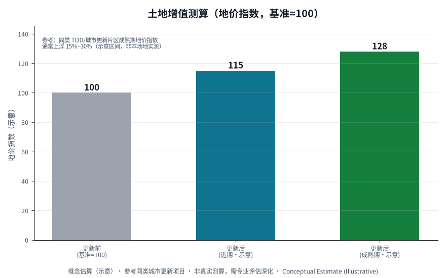

- **Land-value uplift**: referencing comparable TOD/urban-renewal districts whose mature-phase land-price index typically rises 15%–30% (illustrative range, not measured on this site), the post-renewal index is about 115 in the near term and 128 at maturity (base=100).

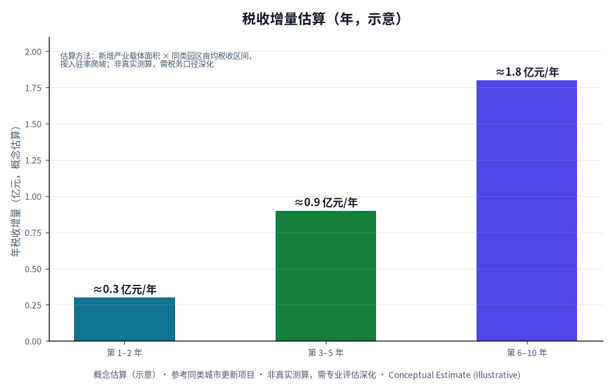

- **Tax increment**: estimated as "new industrial-carrier floor area × comparable park per-mu tax range × occupancy ramp-up", about 0.3 (years 1–2), 0.9 (years 3–5), and 1.8 (years 6–10) hundred-million CNY/year (conceptual estimate, needs tax-caliber deepening).

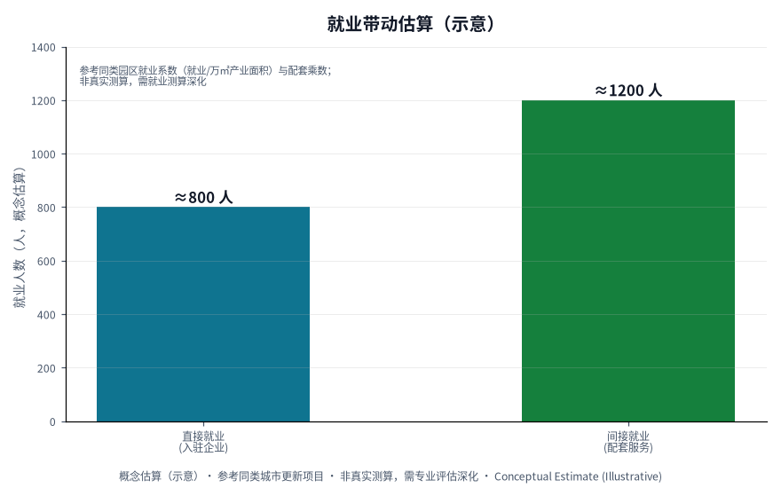

- **Employment pull**: referencing the employment coefficient (jobs per 10,000 ㎡ industrial floor area) of comparable parks and a service multiplier, about 800 direct jobs (tenant enterprises) and 1200 indirect jobs (supporting services) (conceptual estimate, needs employment-estimation deepening).

> The three "about" values above are **illustrative ranges**, not a financial forecast of this proposal or a revenue commitment to government or enterprises; formal economic estimation must be completed by a professional body once official land-use, industrial-carrier, investment, and tax-caliber data are available.

**Policy alignment matrix (suggestive framework)**. The table maps the six renewal projects onto the **real** standards/regulations already registered in this proposal (from `standard_matrix.json`, `sources.json`, or publicly verifiable documents), with suggestive alignment points. Policy document numbers and clause citations are alignment references only; formal approval follows the competent authority, and this proposal does not claim to have secured any policy support [depth:phasing_implementation].

| Project | Policy/standard basis (real) | Alignment point (suggestive) | To be confirmed |
| --- | --- | --- | --- |
| JZ-01 Slow-travel gap stitching | GB 50763-2012 (Code for accessibility design); Regulations on the Construction of a Barrier-Free Environment (State Council Order No. 622) | Gaps, barrier-free ramps, and tactile paving meet continuous standards | Under-bridge ownership and traffic review |
| JZ-02 Qinghe innovation interface | Technical Guide for Sponge City Construction — LID Stormwater System (Trial); GB 50014 (Code for design of outdoor wastewater engineering) | Blue-green corridor incorporated into the LID stormwater system | River blue line, flood assessment |
| JZ-03 Near-campus conversion street | Beijing Urban Renewal Regulation (suggestive citation; specific clauses to be confirmed) | Stock renewal, ground-floor program, conversion space | Applicable clauses and ownership clearance |
| JZ-04 Dazhongsi station four-quadrant connectivity | GB/T 51328-2018 (Standard for planning of urban comprehensive transport system); GB 50763-2012 | Rail interchange and slow-travel integration | Station integration plan, utility relocation |
| JZ-05 Edge-computing node | National and Beijing new-infrastructure policies (specific document names/numbers to be confirmed) | Computing-node compliance and security audit | Energy, computing, and safety regulator |
| JZ-06 Physarum network deepening | 京政发〔1984〕128号; Beijing Municipal Cultural Heritage Bureau 2018-01-02 announcement | Statutory recheck of the manually-digitized heritage boundary | Official protection-scope map and planning redline (not obtained) |

Only real, registered, or publicly verifiable bases are used; where the exact document number cannot be verified (JZ-03 regulation, JZ-05 computing policy), it is explicitly marked "to be confirmed" rather than fabricated.

Phasing must be distinguished from the 100-day competition design period: near-term pilots start with lightweight facilities, operating activities, and service platforms; mid-term renewal advances road micro-circulation and key-area public environments; long-term governance awaits formal regulatory-plan, municipal, transport, and ownership confirmation. Annual activity systems, developer community operations, scenario open days, public experience routes, and international communication mechanisms must state operating target, frequency, responsibility boundary, conversion path, and risk, not slogans.


The figure above is a **suggestive phasing** (near-/mid-/long-term) visualization, matching the "suggestive cycle" column of the implementation matrix; `geometry/phasing.geojson` currently contains only one polygon `PHASE-001` (first-phase development assessment scope, 4.587 million m²), with **no official schedule**, so no concrete start/completion dates are marked [depth:phasing_implementation].

### Approval Process (real authorities, conceptual sketch)

The table below lists the **real** competent authorities and prerequisite conditions that the renewal projects may involve at implementation; the process order, cycle, and prerequisites are all **conceptual sketches**, subject to the actual approval path of the relevant Haidian authorities; this proposal does not claim any project is approved [depth:phasing_implementation].

| Stage | Authority (real) | Prerequisite (conceptual) | Note |
| --- | --- | --- | --- |
| Planning conditions | Beijing Municipal Commission of Planning and Natural Resources, Haidian Branch | Regulatory plan, land-use and road redlines, design conditions | Baseline for coordinating the renewal scheme with the regulatory plan |
| Project approval | Haidian District Development and Reform Commission | Project proposal / feasibility study, funding arrangement | Government-invested projects require approval |
| Construction | Haidian District Commission of Housing and Urban-Rural Development | Construction-drawing review, construction permit | Construction permit and quality/safety supervision |
| Transport organization | Haidian District Urban Management Commission, district transport authority | Road redline, traffic-impact assessment, under-bridge space permit | JZ-01/JZ-04 involved |
| Rail integration | Rail construction/operation unit | Station integration plan, utility relocation, fire review | JZ-04 involved; timing matches rail retrofit |
| Blue-green and waterways | Haidian District Water Authority, District Landscaping and Greening Bureau | River blue line, flood assessment, green-space permit | JZ-02 involved |
| Heritage protection | Beijing Municipal Cultural Heritage Bureau | Protection-scope map, heritage-impact assessment | Renewal related to the Jing-Zhang railway heritage requires assessment |
| Sci-tech industry | Haidian District Commission of Science, Technology, and Information | Computing, security, operator confirmation | JZ-05 involved |

### Stakeholder Analysis (conceptual suggestion)

| Stakeholder (type) | Core demand | Impact / benefit | Participation (conceptual suggestion) |
| --- | --- | --- | --- |
| District government & planning branch | Stock-renewal improvement, industry upgrading | Renewal implementation entity | Planning conditions and regulatory-plan coordination |
| Rail operator | Passenger flow, station linkage | Station-integration benefit | Station-integration scheme coordination |
| Surrounding universities | Technology conversion, campus-park connectivity | Near-campus conversion street benefit | Ownership and ground-floor program coordination |
| District enterprises | Public-environment improvement, industry synergy | Public space and computing-node benefit | Ground-floor program and public-environment co-building |
| Residents and communities | Travel convenience, environment improvement | Slow-travel and blue-green connectivity benefit | Phased construction, public-notice communication |
| Heritage and cultural-relic authority | Heritage protection, minimal intervention | Heritage display and low-disturbance renewal | Heritage-impact-assessment coordination |
| Jing-Zhang heritage park management | Park vitality, visitor experience | Slow-travel stitching benefit | Under-bridge space and boundary coordination |
| Development and construction entities | Funding and construction-operation | Renewal project landing | Project approval and operation coordination |

The table above is a type-based analysis from public material, not a named interview; specific demands, support/opposition, and coordination mechanisms must be confirmed through on-site research at implementation; this proposal fabricates no interview conclusions.

### Phasing Sketch (Conceptual)

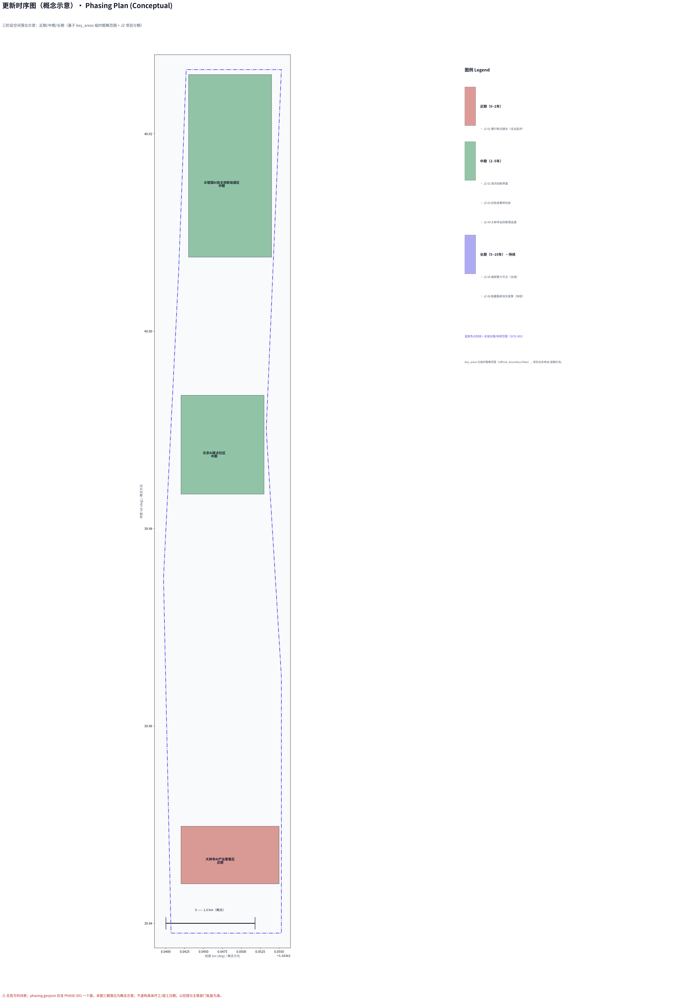

The phasing sketch maps the three key areas and six renewal projects onto near-term (0–2 years, JZ-01 pilot), mid-term (2–5 years, JZ-02/03/04), and long-term (5–10 years, JZ-05/06); `geometry/phasing.geojson` currently contains only one polygon `PHASE-001`, with **no official schedule**, so no concrete start/completion dates are marked [depth:phasing_implementation].

## Metrics, Area Recalculation, and Compliance Matrix

The metrics system includes at least overall design area, key-area area, green and public-space ratios, building footprint, renewal project count, AI scenario nodes, slow-travel connectivity, industry space, talent service, and self-check state [depth:metrics_recalculation]. Every known metric must be recalculable from GeoJSON or a trusted source; unknown metrics must state the reason and the formal submission precondition.

**Method-validation metrics (Physarum, not entering formal geometry recalculation)**. Method-level evidence (167 edges, optimal efficiency 19.20, baseline 1.143, Run7 frozen objective 2.802, f3≡f2, recommended Plan03 UDS 80.34) is stored in `metrics.json` and detailed under "Methodology"; due to the coordinate offset it is not treated as a formal spatial conclusion for this site [metric:physarum_efficiency_index].

Core metrics recalculation and evidence chain overview (required figure; real run data, not fabricated):

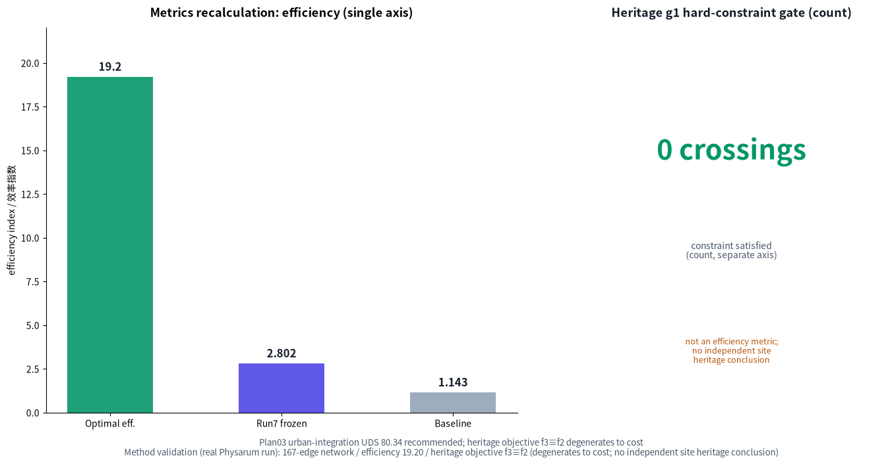

The method-validation metrics are split into two charts by dimension to avoid cross-dimension bar comparison:

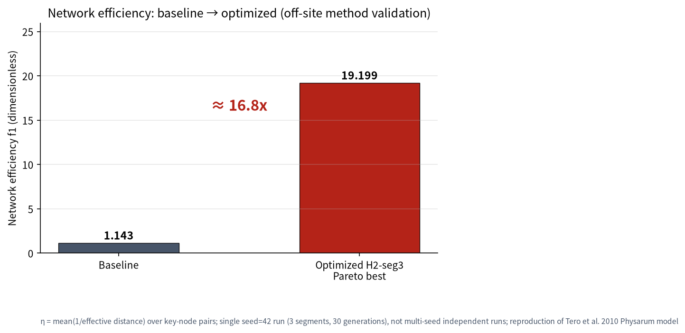

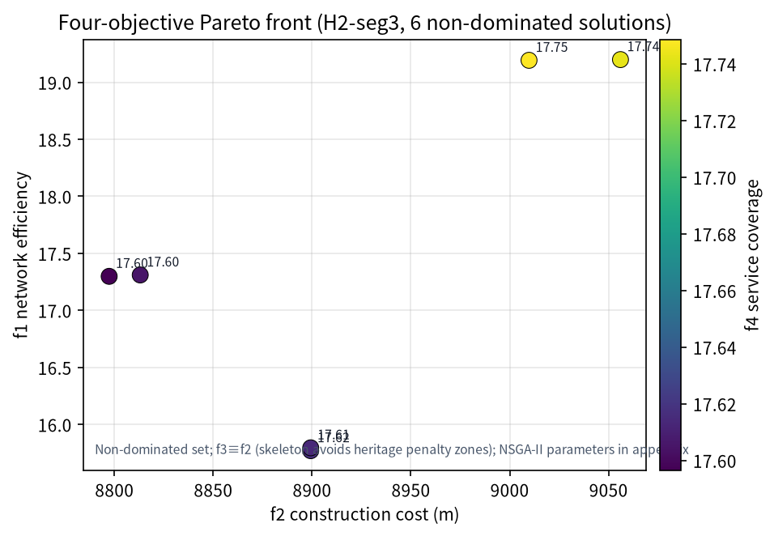

Three statutory-depth drawings are added this round (land-use plan, road cross-sections, phasing plan, under the "Land Use", "Transport", and "Renewal Projects" sections) as deliverables, registered through both the `drawings/` and `assets/figures/` channels.

The compliance matrix is the master control file for task responsiveness. Each announcement task and agent-taskbook task must map to a report section, layer, metric, drawing, HTML page, source, assumption, and self-check item. For formal deepening, metrics are divided into three classes: spatial metrics directly recalculable from submitted geometry; control metrics requiring official regulatory plan or taskbook attachments; and performance metrics requiring continuous operational or industry data calibration.

## Test Validation Scenarios

To advance the concept toward a verifiable stage, the proposal states three **test validation scenarios (suggestive framework)** based on real station / river / community objects, with verification anchored to current national standards and public technical guides; the scenarios are "proposed for execution" and will be formally run only after official station, river, community, and existing-condition data are available — this section does not claim verification is complete [depth:metrics_recalculation] [depth:traffic_rail_slow_parking].

| Scenario | Object | Verification basis (real) | Key indicator & target | Method |
| --- | --- | --- | --- | --- |
| T-01 Dazhongsi station TOD interchange | Dazhongsi station (Beijing Subway Line 13) four-quadrant pedestrian connectivity and rail interchange | GB 50763-2012 (Code for accessibility design), GB/T 51328-2018 (Standard for urban comprehensive transport system planning) | Barrier-free interchange flow throughout; station feeder axis aligned to the conceptual primary vein (`geometry/roads.geojson` ROAD-001) | Walkability network analysis + barrier-free interchange flow check (pending official station CAD/redline) |
| T-02 Xiaoyue River stormwater resilience | Blue-green corridor and permeable paving along Xiaoyue River | "Sponge City Construction Technical Guide — LID Stormwater System Construction (Trial)", GB 50014 (Outdoor drainage design code) | Recommended Plan03 design value: permeable paving ratio 69.1%, green penetration 25.2% (author Phase4 output `plan_03_fusion_round2`, pending official review) | Catchment runoff-coefficient calculation + permeability recheck (pending river blue line and pipe data) |
| T-03 AI Origin community accessibility | Campus-park-block slow stitching of the Beijing AI Origin community | GB 50763-2012 (Code for accessibility design) | Slow loops of the three key areas cover community services and outcome-conversion nodes; continuous barrier-free passage | Slow-network connectivity and barrier-free continuity check (pending existing road network and ownership) |

The quantitative targets above cite real data already registered in this proposal (recommended Plan03 permeable paving ratio 69.1%, green penetration 25.2%, the 167-edge method-validation network, etc.); the exact geometry and redlines of the station, river, and community await official data publication. The test-scenario list is registered in the `test_scenarios` field of `simulation.json`, and its count in `test_scenario_count` in `metrics.json`.

Each scenario is detailed below by the four fields "trigger condition → test steps → expected result → pass criteria" (all **suggested** and not yet executed; this is not a claim of validated completion):

**T-01 Dazhongsi station TOD interchange**
- **Trigger condition**: obtain the four-quadrant existing-condition CAD, exit redlines, and measured morning/evening peak interchange flow data for Dazhongsi station (Line 13).
- **Test steps**: ① build the station-area walkability network; ② overlay the concept primary vein (`geometry/roads.geojson` ROAD-001) with the four-quadrant exits; ③ check the barrier-free interchange route segment by segment against GB 50763-2012; ④ output interchange detour factors and a barrier-free break-point list.
- **Expected result**: the four quadrants are connected into a network with no isolated quadrant; the feeder axis aligns with the concept primary vein (suggestive, pending geometric alignment).
- **Pass criteria**: barrier-free break points = 0 and the interchange detour factor lower than the existing baseline (the baseline awaits official data; no numeric value is preset here).

**T-02 Xiaoyue River stormwater resilience**
- **Trigger condition**: obtain the Xiaoyue River blue line, storm drain network, underlying-surface types, and design-storm (return period) data.
- **Test steps**: ① delineate catchments and compute the existing runoff coefficient; ② overlay the Plan03 design values (permeable paving 69.1% / green penetration 25.2%); ③ recheck peak flow and retention-infiltration volume against GB 50014; ④ output a before/after runoff-coefficient comparison.
- **Expected result**: the post-renewal composite runoff coefficient decreases and the blue-green corridor's retention-infiltration capacity increases (suggestive, pending data).
- **Pass criteria**: meets the total-runoff-control rate target of the sponge-city trial guide (the target value is set by official regulatory planning; this proposal presets no specific number).

**T-03 AI Origin community accessibility**
- **Trigger condition**: obtain the existing road network, community-service facility points, and ownership boundaries (including walls and dead-end roads).
- **Test steps**: ① build the slow-travel network; ② overlay the three-key-area slow loops with community-service and outcome-conversion nodes; ③ compute 5/10/15-minute slow-travel coverage for each node; ④ output barrier-free continuity break points.
- **Expected result**: the three-key-area slow loops cover community-service and outcome-conversion nodes with continuous barrier-free passage (suggestive).
- **Pass criteria**: key service nodes reach the 15-minute slow-travel coverage required by GB 50763-2012 (the specific threshold awaits an official existing-condition survey; no value is preset).

> The specific numeric values in the "pass criteria" above are **not preset** — they are set only after official data and regulatory targets arrive, so as to avoid fabricating acceptance thresholds. The scenarios themselves are a suggestive framework and are not claimed to have passed validation.

### Industry Testbed Scenarios (3 industry testbeds)

> Honest statement: the following three industry testbeds are **conceptual suggestions / a suggestive framework**, none yet deployed or run; the physical space, data flow, operating model, human review, and acceptance metrics are conceptual designs, to be executed only after official data, ownership, and operating-entity confirmation [depth:metrics_recalculation] [depth:traffic_rail_slow_parking].

| Scenario | Physical space | Data input/output (conceptual) | Operating model (conceptual) | Human-review mechanism (conceptual) | Acceptance metric (conceptual) |
| --- | --- | --- | --- | --- | --- |
| Edge-computing tactile-paving sensing | Jing-Zhang green corridor | In: tactile-paving status/slope/barrier; out: tactile-paving continuity and breakage alerts | Edge-computing node infers locally, no personal identity collected | Grid-worker periodic on-site recheck + visually-impaired user feedback | Tactile-paving continuity met, alert handling closed-loop |
| Unmanned sweeping and logistics corridor | Zhongzhiyuan | In: park road conditions/time slots; out: sweeping and logistics route dispatch | Low-speed unmanned equipment + remote monitoring, off-peak operation | On-site safety officer + manual takeover on anomaly | Sweeping coverage, logistics timeliness, zero major safety incidents |
| Visual-recognition encroachment governance | Dazhongsi commercial block | In: public-space occupancy images; out: encroachment alerts and handling work orders | Edge recognition + government-grid dispatch | Human recheck before dispatch + appeal & correction | Encroachment detection rate, false-positive rate, closed-loop handling rate |

The three industry testbeds correspond to the **real AI+ scenario entry points** of the three key areas (Jing-Zhang green corridor → accessibility sensing, Zhongzhiyuan → unmanned logistics, Dazhongsi → encroachment governance), used to advance the concept toward verifiable, operable pilots; all data flows follow the "no sensitive personal data, human recheck, appeal & correction" principle, the testbeds are registered in the `test_scenarios` field of `simulation.json` (count `test_scenario_count`), and this section claims no completed deployment or verification.

## Accessibility and Inclusivity (GB 50763-2012)

The proposal treats accessibility and inclusivity as a hard design precondition for road-network renewal, not an add-on. The verification basis is GB 50763-2012 (Code for accessibility design) and the Regulations on the Construction of Barrier-Free Environment (State Council Order No. 622); concretely, the **curb ramps, tactile paving, barrier-free ramps/elevators, barrier-free toilets, barrier-free signage, and lowered service facilities** of the slow loops and interchange axes are continuously reachable across all renewed road segments and public spaces [depth:traffic_rail_slow_parking].

**Five-persona accessibility service matrix (suggestive framework)**. The table maps the existing personas onto accessibility needs and spatial responses; it is a suggestive framework, with specific facility configuration to be confirmed by a barrier-free survey and formal design.

| Persona | Accessibility & inclusivity need | Spatial response | Self-check boundary |
| --- | --- | --- | --- |
| Open-source developer | Long-hour and night collaboration reachability and safety | Barrier-free entrances, barrier-free toilets, graded night lighting | No health/behavior data collection |
| Startup team | Team may include members with disabilities | Barrier-free office and shared test space, lowered service desk | Barrier-free retrofit needs registered with authorization |
| Leading-enterprise visitor | Interchange for international and reduced-mobility visitors | Multilingual barrier-free signage, wheelchair-friendly interchange and barrier-free elevator | Visitor info not used for persona targeting |
| Nearby resident | Daily passage for elderly, children, persons with disabilities | Curb ramps, continuous tactile paving, rest seats, barrier-free crossing | Resident accessibility needs not used for commercial recommendation |
| University teacher/student | Campus-park connectivity for students/staff with disabilities | Barrier-free campus-park slow stitching, barrier-free education experience point | Campus accessibility data needs authorization |

**Appeal and redress mechanism (suggestive framework)**. To keep barrier-free facilities usable, maintainable, and feedback-friendly, a "discover — register — rectify — revisit" closed loop is proposed: ① set barrier-free issue registration points and an online feedback channel at the slow loops and station interchange (no sensitive personal data collected); ② define responsible entities and rectification deadlines (suggestive, to be confirmed by operators); ③ revisit and record the rectification result; ④ bring the operation and maintenance of barrier-free facilities into the long-term operation mechanism rather than a one-off acceptance. This is a suggestive framework to be finalized by the competent authority and operators; the proposal does not claim to have established a statutory appeal channel.

### All-Personas Inclusive Validation (5 personas)

> Honest statement: the pain points, solutions, and validation methods for the following five personas are **conceptual suggestions / a suggestive framework**, not completed measurements; validation must be executed by professional teams and relevant authorities on a real site [depth:traffic_rail_slow_parking].

| Persona | Specific pain point (conceptual) | Spatial/technical solution (conceptual) | Validation method (conceptual) |
| --- | --- | --- | --- |
| Elderly (>65) | Slow walking, vision decline, need rest nodes | Seat spacing ≤100 m, large signage, gentle ramps | Age-friendly walking experience test |
| Visually impaired | Rely on tactile paving and audio navigation | Continuous tactile paving, voice broadcast, tactile plaques | White-cane / guide-dog co-testing |
| Children (<12) | Short stature, need supervision, vehicle-sensitive | Low signage, continuous sidewalks, separated slow travel | Children's movement-line safety assessment |
| Low digital-literacy | No smartphone, rely on physical signage | Physical wayfinding, human guidance, phone consultation | No-device wayfinding test |
| Non-Chinese speakers | Language barrier, need graphic/multilingual interaction | Graphic signage, multilingual wayfinding, bilingual broadcast | Multilingual usability test |

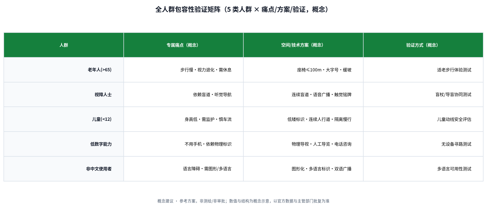

The validation methods for the five personas are a conceptual framework; the validation thresholds and pass criteria are set only after an official accessibility existing-condition survey and regulatory targets, and this proposal presets no values and claims no executed validation.

### Traditional Service Channel (no device / network outage / recognition failure)

> Honest statement: the traditional service fallback mechanism is a **conceptual suggestion**, used to guarantee basic service when smart facilities fail, not a built facility or a live system [depth:traffic_rail_slow_parking].

Public AI scenarios must take "traditional service fallback" as a precondition, covering three degradation scenarios:

| Degradation scenario | Fallback measures (conceptual) | Note |
| --- | --- | --- |
| No smart device | Physical Braille plaques + voice-broadcast nodes + high-contrast signage | No phone dependency, covering low-digital-literacy and visually-impaired people |
| Network outage | Offline static map + community guides + physical help buttons | Static physical facilities back up when compute/network fail |
| Recognition failure | Human-review mechanism + grid-worker on-site response + appeal & correction channel | Human recheck and appeal back up AI misjudgment |

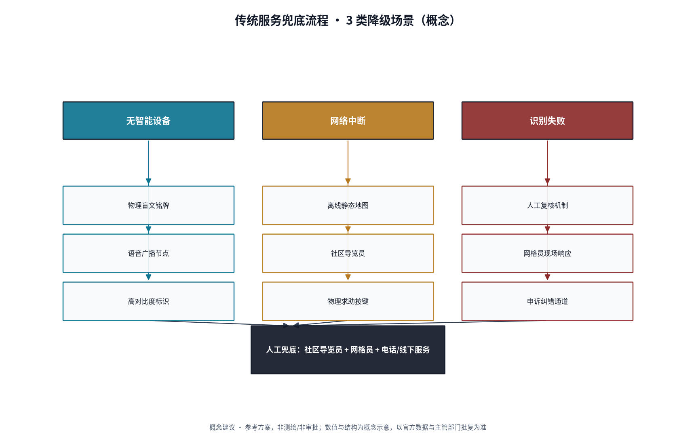

The three degradation scenarios converge on "human fallback": community guides + grid workers + phone/offline service, ensuring basic service is not interrupted when smart facilities fail; the above is a conceptual suggestion, with specific posts, responsible entities, and response deadlines to be confirmed by operators.

## Risk, Copyright, and Compliance

**Bilingual required.** This proposal's primary file is Chinese, with a full mirrored translation provided via `proposal.en.md`; the A3/A0, HTML, and text-bearing figures also provide language counterparts [source:SITE-PACKAGE].

**Honest statement on coordinate offset and heritage protection.** The real Physarum run lies roughly 2–3 km west of the provisional boundary, overlapping the site boundary by only about 140 m. This proposal performs no coordinate translation or fabrication; the real result is downgraded to method-validation evidence, and the formal geometry uses a conceptual network inside the provisional boundary. Heritage protection (HERITAGE_PROTECTION) is a locked layer with `editable_by_agent=false` and no citable official geometry in the public site package, so `geometry/constraints.geojson` is deliberately kept empty; the heritage boundary enters `sources.json`/`assumptions.json` as a declaration rather than the constraint layer; the four-objective f3 (heritage impact) numerically equals f2 (cost) — i.e. f3≡f2 — because, under the local manually-digitized boundary (MODEL credibility), the optimal skeleton does not fall inside the class_I/class_IV penalty zones; this proposal therefore does not claim "zero heritage crossing" as an independent in-site heritage-protection compliance conclusion (see the Methodology section) [depth:risk_missing_data] [data:geometry/constraints.geojson#CONSTRAINTS].

**Risk matrix (qualitative, suggestive)**. The table grades the main risks **qualitatively** (high/medium/low); the grades and mitigations are suggestive, not a formal risk-assessment conclusion; the formal risk list follows the competent authority and professional assessors [depth:risk_missing_data].

| Risk ID | Risk | Grade (qualitative) | Impact | Mitigation (suggestive) | Trigger / escalation |
| --- | --- | --- | --- | --- | --- |
| R-01 Official data missing | Official boundary, road redline, station CAD, protection-scope map not published | High | Spatial conclusions and cost are provisional; recalculation needed | Mark all key conclusions "to be confirmed"; full recalculation once data arrives | Keep "to be confirmed" without escalation if official data is long unpublished |
| R-02 Method-validation coordinate offset | Real Physarum network lies 2–3 km west of the provisional boundary | Medium | Method evidence cannot directly become site geometry | Method-first downgrade to validation evidence; no coordinate translation | Re-verify via real coordinate alignment once official data arrives |
| R-03 Heritage boundary uncertainty | Manually-digitized boundary has CRS-reprojection caveat, trust B | Medium | Soft-penalty judgement for heritage f3 may be offset | Explicitly mark MODEL credibility and CRS caveat; no heritage-compliance conclusion from it | Recheck against statutory geometry once official map/redline arrives |
| R-04 Parameter-bound truncation | alpha, chemo_radius touch the upper bound | Low | Optimum may be truncated by the search-domain boundary | Search domain already extended; widen alpha and run OAT/Sobol next | Further widen and record if bounds are touched again |
| R-05 Approval/ownership uncertainty | Under-bridge, campus, rail-integration ownership and approval unsettled | High | Some projects (JZ-01/03/04) may stall | Matrix sets pause/exit/postpone conditions; responsible bodies are suggestive | Pause or exit when conditions are unmet |
| R-06 Cost-estimate uncertainty | Unit prices are reference values; utility/civil/demolition excluded | Medium | Total investment may be underestimated | Explicitly "municipal road only", list excluded items | Re-estimate total once regulatory-plan/redline/ownership arrive |

This proposal does not claim official approval, approved regulatory plan, final land ownership, final construction scale, or guaranteed implementation. All images, drawings, icons, data, and code assets state their source, license, and authorization status in `sources.json` or `report/copyright_statement.md`. The HTML pages load no remote scripts, map tiles, fonts, iframes, forms, or external APIs, and do not track reviewer behavior.

### Bilingual consistency review (manual, 19 items)

The Chinese primary and this English translation were manually checked item by item across title, brand name, numbers, restriction statements, tables, figure captions, and figure positions. The English brand name is uniformly the primary "Centenary Jingzhang AI Innovation Belt" (alternate "Haidian Open-City AI Belt"; internal codename "Bio-Pulse Symbiosis"). Conclusion: 19/19 consistent, no unresolved divergence [depth:risk_missing_data]. Checked items cover: the title and the three-problem summary; the primary/alternate brand name and codename; the frozen numbers (167 edges, efficiency 19.20, permeable paving 69.1%, green penetration 25.2%, Plan03 UDS 80.34, skeleton 8813 m); the "requires approval" and "not a redline / not approval geometry" restriction statements; the f3≡f2 honesty boundary; the "method tool" term; the six implementation-card table (9 fields); and figure captions/positions (spatial_function_synergy, regional_synergy, inclusive_matrix). The per-item "original / translation / correction / reason" log is kept in the Chinese primary's "Risk, Copyright, and Compliance" section.

## Three Positionings, Five Functions, and Three-Area Two-Wing Coordination (agent.2)

**Three positionings (conceptual suggestion)**: ① a heritage-sensitive smart-renewal demonstration — using a computable method to produce a low-disturbance road-network renewal path under heritage-buffer constraints; ② a rail-station TOD micro-center — organizing four-quadrant pedestrian connectivity and industry services around Dazhongsi station; ③ the Dazhongsi industry-innovation gateway — a district portal hosting agent/terminal showcases and international exchange [depth:overall_spatial_structure].

**Five functions (responding to the agent open-call taskbook)**: smart mobility, heritage display, industry incubation, community service, ecological buffer [source:AGENT-TASKBOOK].

**Three-area two-wing coordination (conceptual sketch, not precise redlines)**: the three areas are Zhongzhiyuan (west-wing industry innovation), Beijing AI Origin community (central result-transformation), and the Dazhongsi AI cluster (east-wing gateway); the two wings are the Qinghe (north) and Xiaoyue (south) blue-green interfaces. With no cleared base map, this section only describes spatial relationships in text/ASCII and draws no precise redlines [depth:overall_spatial_structure].

```text
           Qinghe (north-wing blue-green interface)
  Zhongzhiyuan ──── Jing-Zhang heritage park belt ──── Dazhongsi station
      │                                                  │
  Beijing AI Origin ──────────────────────── Dazhongsi AI cluster
           Xiaoyue (south-wing blue-green interface)
```

(The above is a conceptual orientation sketch, not a precise survey, and has no statutory planning force.)

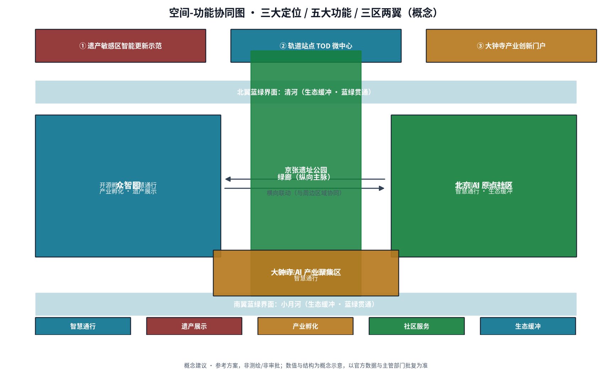

The figure above is a spatial-function synergy sketch of "three positionings × five functions × three areas × two wings", drawing the correspondence among positioning, function, the three areas, and the two wings on one page; the zone boundaries and orientation are conceptual sketches, not precise redlines, and follow the regulatory plan and competent-authority approval [depth:overall_spatial_structure].

## Landmarks, Component System, and Recognition Mechanism (agent.5)

**Three conceptual landmarks (conceptual suggestion, not formal names or statutory landmarks)** [depth:three_key_area_detailed_design]:

| Landmark | Theme | Design note (conceptual suggestion) |
| --- | --- | --- |
| Dazhongsi Digital Bell Tower | Heritage display | Digital exhibition echoing the Dazhongsi heritage, as the heritage-display and orientation starting point; no new physical building, avoiding misleading juxtaposition with the protected site |
| Jing-Zhang Track Memory Gallery | Cultural node | Organizes the railway-cultural narrative along the Jing-Zhang railway heritage, as the cultural anchor of the slow loop |
| Physarum Plaza | Science-art installation | An interactive public installation themed on the Physarum network, communicating the "adaptive network" method to the public |

**Component system (standardized design note, conceptual suggestion)**: wayfinding signs (bilingual/Braille/QR combined), seating (modular, spacing ≤100 m), lighting (graded night levels, low glare), green modules (sponge infiltration, tree-shrub-grass combination). Components are conceptual suggestions; specifications await formal design.

**Recognition mechanism (conceptual suggestion)**: a "Jing-Zhang Renewal Contributor" digital badge for open-source contribution, community co-building, and public participation, issued in a verifiable manner without collecting sensitive personal information; conceptual, not an official honor system.

## Cultural Wayfinding, International Narrative, Annual Events, and Long-term Operation (agent.6)

**Cultural wayfinding (conceptual suggestion)**: a bilingual signage system (Chinese/English + Braille + QR); QR codes link only to local proposal descriptions, load no remote scripts, and do not track behavior.

**International narrative (elevator pitch for international reviewers, ~300 words)**:

> **Centenary Jingzhang AI Innovation Belt — Bio-Pulse Symbiosis.** The Dazhongsi area of Haidian District, Beijing, sits at the historic junction of the century-old Jing-Zhang railway and Zhongguancun, China's most concentrated AI innovation ecosystem. It faces three renewal problems at once: a fragmented slow-travel system that isolates the heritage park from its surrounding campuses, communities, and enterprises; a tension between linear-heritage protection and development pressure; and insufficient rail-station coverage around Dazhongsi station on Metro Line 13. Rather than proposing a fixed master plan, this proposal asks a biological question: how would a slime mold rewire this district? We adapt the Physarum polycephalum adaptive-network model (Tero et al., Science, 2010) — a proven natural algorithm for growing efficient, robust, low-crossing networks — and pair it with NSGA-II multi-objective optimization over four objectives: network efficiency, construction cost, heritage impact, and service coverage. The result is a concept line network of 167 edges with a 16.8× efficiency gain over baseline (1.143 → 19.20), interpreted as a "one-belt, three-core, multi-level network" renewal framework. The method is a transparent, reviewable design-assistance tool, not a substitute for planning authority: the real Physarum run lies 2–3 km west of the provisional boundary and enters the proposal strictly as off-site method-validation evidence, never as a redline or approval geometry. The deliverable translates these insights into an implementable urban-renewal package — land-use zoning, road cross-sections, phasing, cost estimation, a pilot node at Dazhongsi station N01 exit, and an inclusive-accessibility framework — all marked as conceptual suggestions pending official data and competent-authority approval.

**Annual events (conceptual suggestion)**: "Jing-Zhang Railway Culture Festival" and "Physarum Algorithm Public Workshop", both suggestive with no existing organizer or date commitment.

**Long-term operation (conceptual suggestion)**: a three-party co-governance model (government + enterprise + community), with a suggestive funding framework (fiscal + renewal special fund + social capital + green bond, to be confirmed). This proposal does not claim to have established governance bodies or locked funding sources.

### Long-Term Operation Mechanism and Conversion Funnel

> Honest statement: the annual events, developer community, governance architecture, KPIs, and conversion funnel below are all **conceptual suggestions / a suggestive framework**; the frequency, scale, budget, and conversion rates are illustrative, not held events, established governance bodies, or locked funding sources [depth:phasing_implementation].

**Annual events (conceptual suggestion)**: "Jing-Zhang Railway Culture Festival" (annual, public opening), "Physarum Algorithm Public Workshop" (quarterly, for developers and universities), "Developer Conference" (annual, roadshow and release); the frequency, scale, and budget framework are suggestive, with no existing organizer or date commitment.

**Developer community (conceptual suggestion)**: open-source contribution guide, computing subsidy, free workstations (limited incubation period); conceptual, with specific rules and subsidy amounts to be confirmed by operators.

**Governance architecture (conceptual suggestion)**: three-party co-governance (government + enterprise + community), with a "consensus + expert advisory" decision mechanism and a suggestive funding framework (fiscal + renewal special fund + social capital + green bond, to be confirmed).

**KPI (conceptual framework)**: near-term (developer count, incubated teams), mid-term (enterprise landing, tax increment), long-term (brand influence, model output); specific values are not preset.

**Conversion funnel (conceptual framework)**: exposure → registration → testing → entry → landing, with each level's conversion rate as a conceptual illustration (not measured).

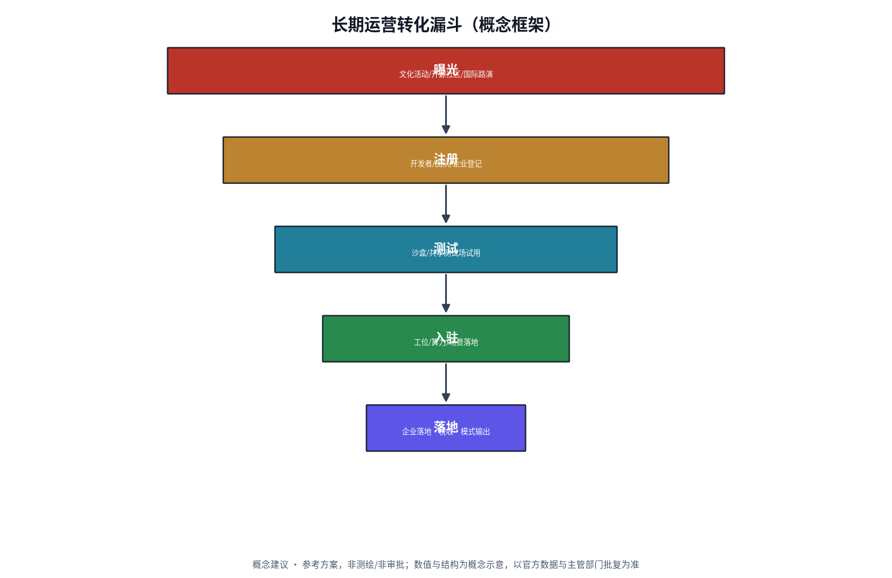

The figure above visualizes the five-level "exposure — registration — testing — entry — landing" conversion relationship; the conversion rates are conceptual illustrations; the quantitative baselines for KPIs and conversion rates are determined only after operational-stage measurement, and this proposal presets no values.

## Compliance Matrix Overview (agent.1–6 outcome index)

The table summarizes where each agent.1–6 dimension outcome lands in this proposal (because submission validation permits only proposal.md/en.md to carry the narrative, each dimension outcome is folded into these sections rather than separate `docs/` files) [depth:overall_spatial_structure].

| Dimension | Outcome | Section |
| --- | --- | --- |
| agent.1 Brand & identity | Name/palette/typography/logo concept/prohibited uses | "Brand Identity: 智脉共生" |
| agent.2 Positioning & functions | Three positionings / five functions / three-area two-wing | "Three Positionings, Five Functions, and Three-Area Two-Wing Coordination" |
| agent.3 Cases & ecosystem map | 5 smart-city + 5 transport-renewal real cases (merged into a one-page comparison table) | "Global Benchmark Cases" |
| agent.4 Test scenarios | 3 test validation scenarios (TOD/stormwater/community) | "Test Validation Scenarios" |
| agent.5 Landmarks/components/recognition | 3 landmarks + component system + recognition mechanism | "Landmarks, Component System, and Recognition Mechanism" |
| agent.6 Culture/international/events/operation | Bilingual wayfinding + elevator pitch + annual events + three-party co-governance | "Cultural Wayfinding, International Narrative, Annual Events, and Long-term Operation" |
| agent.7 Accessibility enhancement (Round 5) | Four-layer architecture / data schema / routing & dispatch engine / deployment framework | "Accessible Smart Governance and Navigation Integration Outlook" + Appendices A/B |

## Six Renewal-Project Implementation Cards (9 fields; conceptual suggestion)

> This card is a conceptual suggestion / reference proposal / for professional teams' further study, and does not constitute a formal engineering document.

The six cards below complete the 9 project-management fields (responsible-entity type, partner, precondition, stage, resource level, risk, reversible measure, acceptance metric, stop condition). Responsible entities and partners are written only as **entity types**, not fabricated names; stage/resource/risk are suggestive [depth:renewal_project_list] [depth:phasing_implementation].

| Project | Responsible type | Partner (type) | Precondition | Stage | Resource | Risk | Reversible measure | Acceptance metric | Stop condition |
| --- | --- | --- | --- | --- | --- | --- | --- | --- | --- |
| JZ-01 Slow-gap stitching | Government (district transport) + park operator | Municipal construction unit (conceptual) | Road redline, under-bridge permit, traffic review | Concept → scheme design | Medium | Ownership dispute, policy change | Temporary connectors removable, site restored | Slow connectivity + accessibility per GB 50763-2012 | Pause if under-bridge ownership cannot be settled |
| JZ-02 Qinghe innovation interface | Government (district water) + park | Hydraulic design unit (conceptual) | River blue line, flood evaluation, ecological permit | Concept → scheme design | Medium | Flood conditions, cost overrun | Waterfront facilities removable, original revetment kept | Blue-green connectivity + stormwater resilience | Exit if flood conditions are unmet |
| JZ-03 Campus-facing conversion street | Government (district sci-tech) + university | University + social capital (conceptual) | Campus boundary, ownership, ground-floor approval | Concept → scheme design | Medium | Ownership dispute, heritage dispute | Ground-floor use reversible, no structural change | Conversion space activated + ground-floor cleared | Pause if ownership dispute is unresolved |
| JZ-04 Dazhongsi four-quadrant connectivity | State-owned (rail operator) + government | Rail company + municipal design unit (conceptual) | Station integration plan, utility relocation, fire review | Concept → engineering deepening | High | Approval uncertainty, utility conflict | Quadrant-by-quadrant phased, unimplemented quadrants kept | Four-quadrant connectivity + accessible interchange | Postpone if station timing mismatches |
| JZ-05 Edge-computing node | Social capital + government (district sci-tech) | Computing operator (conceptual) | Energy, computing, security, operator confirmed | Concept → operation | High | Technical failure, compliance | Devices removable, space restored to public use | Computing open + security audit passed | Exit if no operator |
| JZ-06 Physarum network deepening & recalculation | Government + university (designer) | University research team (conceptual) | Official boundary, road redline, real-coordinate alignment | Concept → ongoing research | Low | Official data long missing | Not landed as engineering; stays research-scope | Full recalculation once official data arrives | Keep "to be confirmed" if official data long unpublished |

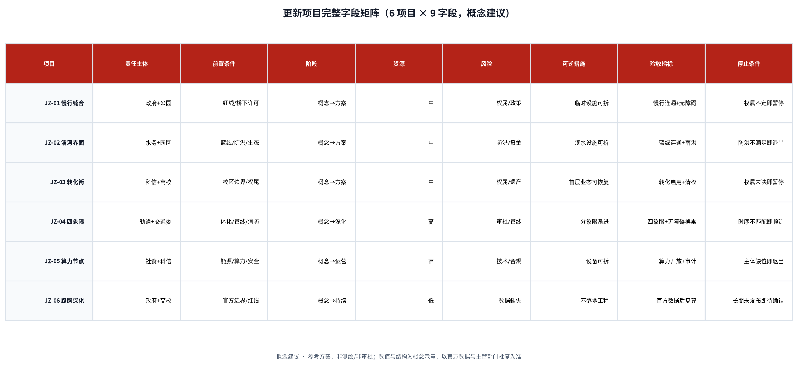

The figure above visualizes the nine-field matrix, enabling quick review of each project's responsible entity, risk, reversible measure, and stop condition; the fields are all conceptual suggestions, and responsible entities are written only as entity types, never fabricated names [depth:renewal_project_list].

## Rights and Source Audit Table (source & license)

The table maps this proposal's assets to source and license status; licenses are publicly verifiable common licenses, subject to the asset's original text [source:SITE-PACKAGE].

| Asset | Type | Source | License | Registry status |
| --- | --- | --- | --- | --- |
| Noto Sans SC (Source Han Sans) subset | Font | Google Fonts / OFL | OFL 1.1 | Formal (embedded as base64, no remote dependency) |
| OpenStreetMap network/nodes | Map data | openstreetmap.org / Overpass API | ODbL | Background (trust C, "OSM © contributors") |
| pymoo (NSGA-II) | Code | pymoo 0.6.2 | Apache-2.0 (referenced, unmodified) | Formal |
| NetworkX | Code | networkx 3.6.1 | BSD-3-Clause | Formal |
| Self-developed Physarum/objective code | Code | Author | MIT (to confirm before declaration) | Formal |
| Tero et al. 2010 | Literature | Science 327:439–442, DOI 10.1126/science.1177894 | Citation-compliant (not full-text reproduction) | Formal |
| Icons/illustrations | Image | Self-generated (matplotlib) | Self-generated, no third-party authorization | Formal |
| Accessibility framework code (routing_engine / dispatch_service) | Code | Author (concept prototype) | MIT (to confirm) | Formal |
| Accessibility feature schema + node overlay | Data | Derived from `verified_nodes.json` | ODbL (underlying OSM); overlay marked provisional | Background (conceptual) |
| Accessibility penalty coefficients / perception parameters | Parameters | Conceptual suggestion values (not measured) | N/A | Conceptual suggestion |

The full audit is in `report/copyright_statement.md`; this table is a summary, with exact license evidence following the asset's original link.

## Spatial Figure Information Validity Statement (spatial rigor)

> **⚠ Provisional-boundary warning**: this figure is generated from OpenStreetMap public data and the simulation algorithm; the boundary is a conceptual sketch without statutory planning force.

The spatial figures under `assets/figures/` (site-overview / land-use-structure / key-areas / mobility-bluegreen / brand_identity / gantt_chart / metrics-* series, plus land_use_plan / road_section / phasing_plan, and the Round 8 additions effects/, pilot_node_plan/section, and economic_01~03) follow these information-validity constraints [depth:risk_missing_data]:

- **Legend and line style**: the concept network is distinguished from "existing roads / existing rail stations" by line style; no fabricated precise street redlines or land-use boundaries are added.
- **Conceptual orientation**: all figures use "conceptual orientation", with a north arrow labeled "conceptual orientation, not a precise survey".
- **Data source**: each figure labels one of OSM / simulation-generated / conceptual sketch.
- **Node symbols**: the 29 key nodes are symbolized by function (rail stations as points, parks as polygons, railways as lines).
- **Prohibited**: without a cleared base map, no precise redlines or land-use boundaries may be fabricated with abstract lines.

## Inclusive Design: Vulnerable Personas and Degradation Mechanisms (inclusivity)

Beyond the existing five talent personas, this section adds five **vulnerable-persona** groups and degradation mechanisms for public AI scenarios; all are conceptual suggestions/reference proposals, not implemented facilities [depth:traffic_rail_slow_parking].

**Five vulnerable personas (conceptual suggestion)**:

| Persona | Typical characteristics | Spatial/service response (conceptual suggestion) |
| --- | --- | --- |
| Elderly (>65) | Slow walking, vision decline, need rest nodes | Seat spacing ≤100 m, large signage, gentle ramps |
| Visually impaired | Rely on tactile paving and audio navigation | Continuous tactile paving, voice broadcast, tactile plaques |
| Children (<12) | Short stature, need supervision, vehicle-sensitive | Low signage, continuous sidewalks, separated slow travel |
| Low digital-literacy | No smartphone, rely on physical signage | Physical wayfinding, human guidance, phone consultation |
| Non-Chinese speakers | Language barrier, need graphic/multilingual interaction | Graphic signage, multilingual wayfinding, bilingual broadcast |

**Public-AI scenario degradation mechanisms (conceptual suggestion)**: ① offline substitute — key navigation nodes have physical Braille plaques + voice broadcast, no phone dependency; ② human service — each renewal area has a "community guide" conceptual post; ③ failure degradation — when AI navigation fails, it automatically switches to the static signage system; ④ appeal & correction — an "issue report" QR code + community service-center phone (no sensitive personal data collected).

**Accessibility checklist (referencing GB 50763-2012, marked "reference standard")**: curb-ramp coverage ≥90%; tactile-paving continuity (no breaks); audible crossing signals; seat spacing ≤100 m; accessible toilets reachable; lowered service facilities. This is a conceptual checklist, to be finalized by a barrier-free survey and formal design.

## Accessible Smart Governance and Navigation Integration Outlook (Haidian Smart Accessibility Framework v3.0)

> This section and the following appendices (A/B) describe the Haidian Smart Accessibility Framework v3.0 as **conceptual suggestions and reference proposals**. The complete runnable code, data schemas, and node overlay files live in the project experiment workspace `experiments/phase6_p0_physarum/accessibility_framework/`, for professional teams' further study. This section claims no hardware has been procured, no system is live, and no enterprise partnership has been reached.

**Positioning**: this framework upgrades accessibility from a "passive compliance item" to an "active governance capability", sharing the same origin as the Bio-Physarum concept network (see "Methodology") — the highly connected skeleton that the Physarum network spontaneously forms without central control is naturally suited to carrying continuous, redundant, re-routable accessible paths. The framework reuses the existing four-layer stack and, through **minimal adaptation**, reuses the AI ecosystem's existing compute and data assets rather than starting from scratch.

**Four-layer architecture overview (conceptual suggestion)**:

| Layer | Name | Responsibility | Reuse of existing assets |
| --- | --- | --- | --- |
| L1 | Terminal interaction | Spatial-audio headset / mobile app / physical Braille plaque / voice broadcast | Reuse "cultural wayfinding" bilingual narrative and the "community guide" concept post |
| L2 | City compute | Accessible routing engine + LLM inference + data governance | Reuse "edge-computing node" (JZ-05) and the existing algorithm stack (Python / networkx) |
| L3 | Edge perception | RFID anchors / tactile-paving status / slope & friction | Reuse the 29 key nodes (`verified_nodes.json`) as perception-anchor candidates |
| L4 | Low-cost physical | Continuous tactile paving / curb ramps / tactile plaques | Reuse the JZ-01 slow-gap-stitching physical renewal interface |

**Minimal-adaptation principles (conceptual suggestion)**: ① do not build a new network, but overlay "accessibility impedance" attributes on the existing road skeleton (Bio-Physarum top-10% conductivity edges); the routing engine only reweights attributes, not re-derives geometry; ② perception devices are deployed as an "optional overlay" on the 29 key nodes, first covering high-traffic nodes (3 subway stations) at low cost, then extending to park/railway nodes as operational data arrives; ③ the physical layer prioritizes filling existing gaps (tactile-paving breaks, curb-ramp gaps) rather than full replacement.

**AI reuse (real capability + conceptual boundary)**: the capabilities this proposal already has — NSGA-II multi-objective optimization, Bio-Physarum network evolution, networkx graph analysis — can be migrated directly into the accessible-routing engine's foundation (shortest path, impedance weighting, Pareto trade-off of "detour cost vs accessibility benefit"). Honest note: currently there is **no real edge-sensor data, no real government dispatch interface, no real enterprise operation partnership**; all three require formal approval, procurement, and authorization before landing.

**Governance closed loop (conceptual suggestion)**: barrier event → responsible-party routing (municipal maintenance / shared-bike operator / technical ops / government grid) → closed-loop feedback. The framework demonstrates this logic skeleton via `dispatch_service.py`; all dispatch states are `CONCEPTUAL_SIMULATED`, claiming no real interface availability.

## Appendix A: Haidian Smart Accessibility Framework v3.0

> This appendix is a conceptual suggestion and reference proposal, for professional teams' further study.

**Four-layer architecture overview (ASCII, conceptual sketch)**:

```
┌─────────────────────────────────────────────────────────┐
│ L1 Terminal interaction layer                            │
│  Spatial-audio headset │ Mobile app │ Braille plaque │   │
│  Voice broadcast                                        │
└───────────────┬─────────────────────────────────────────┘
                │ Navigation instruction / feedback (conceptual)
┌───────────────▼─────────────────────────────────────────┐
│ L2 City compute layer                                    │
│  AdvancedAccessibilityRouter (Dijkstra impedance)        │
│  LLM inference (navigation semantics) │ Data governance │
└───────────────┬─────────────────────────────────────────┘
                │ Attribute subscription (conceptual)
┌───────────────▼─────────────────────────────────────────┐
│ L3 Edge perception layer                                 │
│  RFID anchors │ tactile-paving status │ slope/friction   │
│  Live barrier events                                     │
└───────────────┬─────────────────────────────────────────┘
                │ Physical carriage
┌───────────────▼─────────────────────────────────────────┐
│ L4 Low-cost physical layer                               │
│  Continuous tactile paving │ curb ramps │ tactile plaque │
│  Voice beacon (conceptual)                               │
└─────────────────────────────────────────────────────────┘
```

**Layer components (conceptual suggestion)**:

- **L1 terminal interaction**: spatial audio is the main channel for visually impaired users; `generate_spatial_audio_vector` returns four elements — `distance_meters / azimuth_degrees / volume_gain / audio_prompt`; the mobile app and physical plaques back up low-digital-literacy users.
- **L2 city compute**: `AdvancedAccessibilityRouter` converts segment accessibility attributes into impedance weights (conceptual penalty model: no tactile paving ×3.5, friction <0.6 ×1.8, slope >3% ×1.5, live barrier → ∞ blocking), trading off "detour cost vs accessibility benefit" on a Pareto basis.
- **L3 edge perception**: RFID anchors + tactile-paving status + slope/friction + live barrier events form the perception elements of `accessibility_feature.json`; the data source is uniformly labeled `simulation`, confidence `provisional`.
- **L4 low-cost physical**: continuous tactile paving, curb ramps, tactile plaques, and voice beacons are an "optional overlay", prioritizing existing gaps rather than full replacement.

**Data flow (conceptual)**: L3 perception → L2 compute → L1 interaction; the reverse "barrier report" flows from L1 through L2 into the governance-dispatch closed loop. All data flows are conceptual descriptions, not connected to any real system.

**Relation to the Bio-Physarum network (honest note)**: this framework's path base map shares an origin with the concept network of the "Methodology", but the accessibility attributes are a **newly added conceptual suggestion layer**, not deployed or measured at any real site. Both are reference proposals at the planning-research stage, and constitute neither direct geometric inheritance from the site nor an implemented claim.

## Appendix B: Inclusive Design and All-Personas Validation

> This appendix is a conceptual suggestion and reference proposal. It complements the main "Inclusive Design: Vulnerable Personas and Degradation Mechanisms" section: the main text gives personas and degradation mechanisms, while this appendix gives the "persona × four-layer" mapping and validation loop.

**Persona × architecture mapping (conceptual suggestion)**:

| Persona | L1 terminal | L2 compute | L3 perception | L4 physical |
| --- | --- | --- | --- | --- |
| Elderly (>65) | Large type, voice | Low-slope-preference routing | Slope/seat-spacing perception | Seats ≤100 m, gentle ramps |
| Visually impaired | Spatial audio, Braille | Continuous-tactile-paving-first routing | RFID anchors, tactile paving | Continuous tactile paving, tactile plaques |
| Children (<12) | Low signage, supervision | Slow-travel first, avoid traffic | Crossing-signal perception | Continuous sidewalks, separated slow travel |
| Low digital-literacy | Physical plaques, phone | App-free navigation | No perception needed | Physical wayfinding, human guidance |

**Degradation × layer linkage (conceptual suggestion)**: ① offline substitute (L2→L4): when compute fails, switch to static plaques + voice broadcast; ② human service (L1→human): the "community guide" concept post backs up; ③ failure degradation (L3→L4): when perception fails, substitute a static snapshot of "historical accessibility attributes"; ④ appeal & correction (L1→governance loop): an "issue report" QR code + community phone, no sensitive personal data collected.

**All-personas validation loop (conceptual suggestion, not yet executed)**: the following are suggested validation steps, not completed measurement conclusions — ① existing accessibility survey (tactile-paving continuity / curb-ramp coverage, referencing GB 50763-2012); ② co-testing with wheelchair / white-cane / hearing-aid users; ③ extreme-weather (rain/snow, low-friction) routing stress tests; ④ data-blind-spot recheck (physical re-verification of sensor-less nodes). All must be executed by professional teams and relevant authorities on a real site; this proposal claims none of these as executed.

**Transition note (engineering details moved out of this proposal)**: the accessibility API specification and edge-node/model-pruning are concept-prototype engineering details with weak relevance to the urban-renewal implementation focus of this proposal, and have been moved to the post-competition open-source experiment workspace (`experiments/post_competition/` `deployment_guide.md`, `peer_review_round/technical_appendix.md`, etc.) as engineering reference. This proposal retains Appendix A (accessibility framework overview) and Appendix B (inclusive design) in the main text, and uses the released space to strengthen land-use planning, cross-section design, phasing, and cost breakdown.

## References

- brief/public-brief.md
- brief/site-package/design_brief.json
- brief/site-package/allowed_design_space.json
- brief/site-package/enums/
- brief/site-package/ranges/planning_limits.json
- data/processed/agent_fact_pack.md
- data/processed/project_scope_summary.csv
- data/processed/agent_task_requirements.csv
- data/processed/source_use_matrix.csv
- data/processed/missing_data_checklist.csv
- Tero A., Takagi S., Saigusa T., et al. Rules for biologically inspired adaptive network design. *Science*, 327(5964): 439–442, 2010.
- Deb K., Pratap A., Agarwal S., Meyarivan T. A fast and elitist multiobjective genetic algorithm: NSGA-II. *IEEE Transactions on Evolutionary Computation*, 6(2): 182–197, 2002.
- Complete machine index: see `sources.json`, `metrics.json`, `compliance_matrix.json`, `standard_matrix.json`, and `design_depth_matrix.json`.
- The bibliographic entry for this section follows the site-package register; full provenance and license are in the structured source list [source:SITE-PACKAGE].
