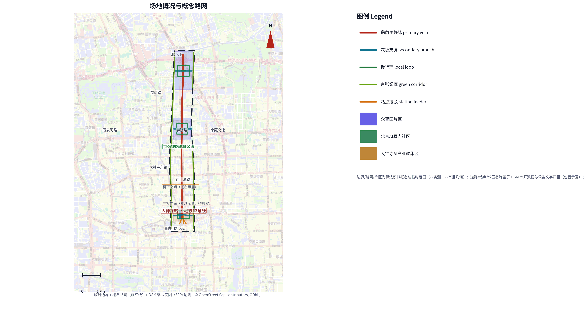
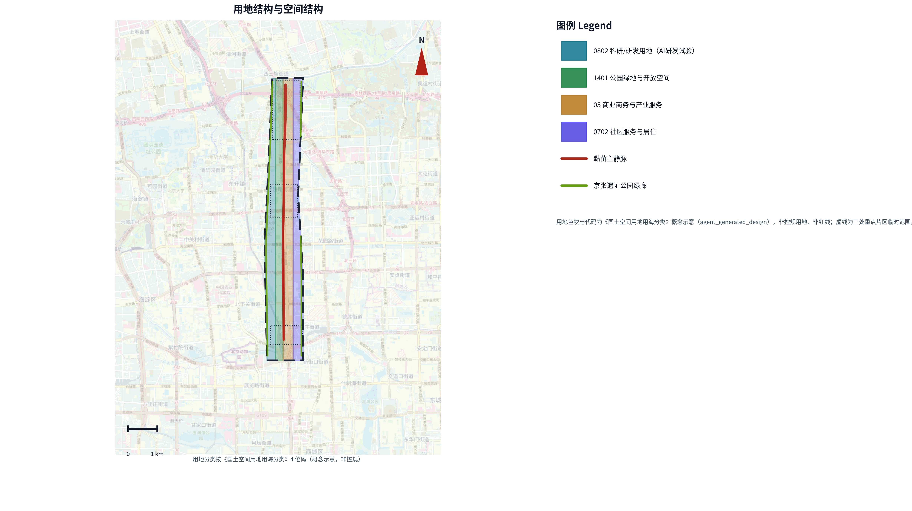
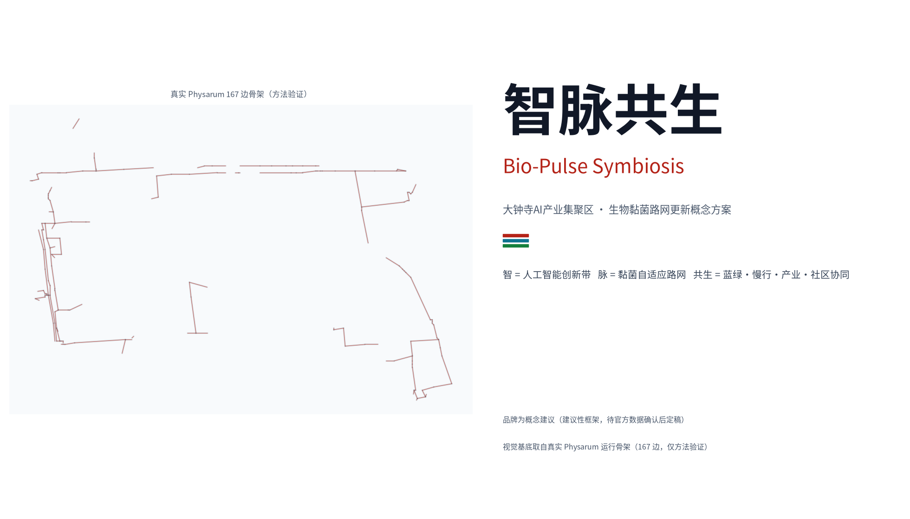
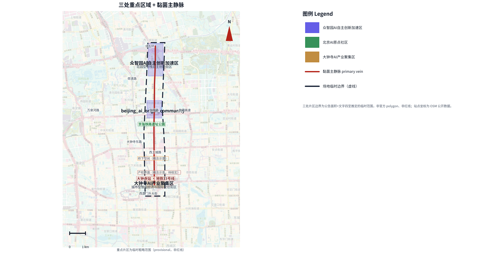
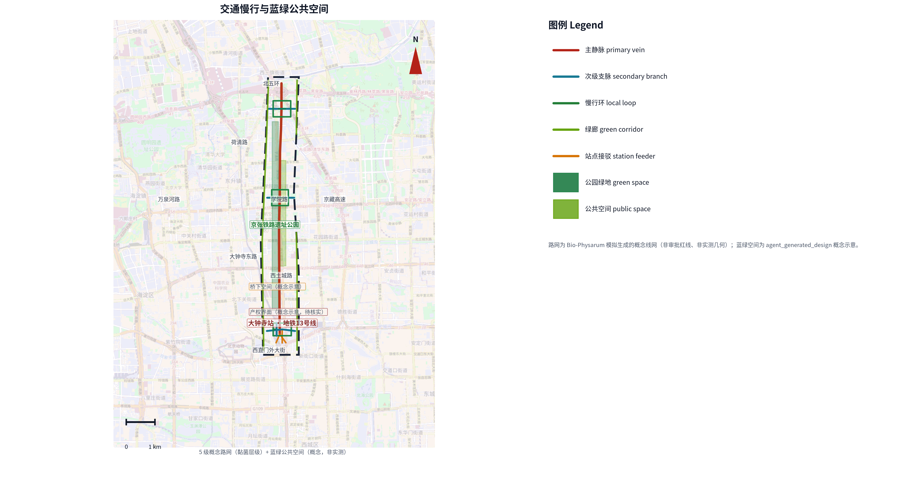
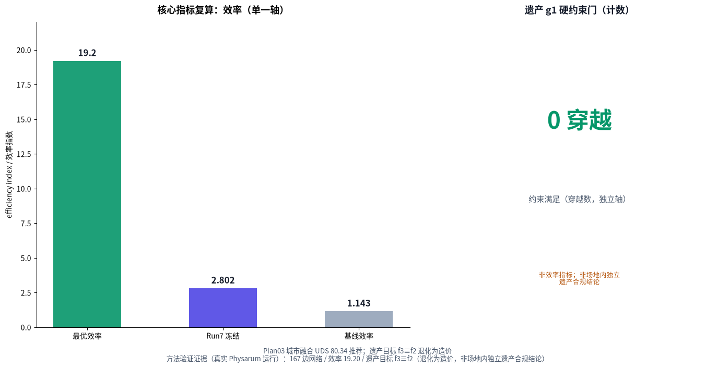

# 大钟寺片区城市更新实施方案 — 基于 Bio-Physarum 算法洞察的路网重构与空间活化

## 设计依据与资料清单

本 formal 方案以北京市规划和自然资源委员会海淀分局发布的《百年京张AI创新带城市设计国际方案征集资格预审公告》为第一依据，并以 `brief/site-package/` 中经维护者登记的临时粗略边界、重点区域、枚举、指标和来源清单为机器可读依据。区别于一般以空间愿景为主的方案，本方案把**生物黏菌自适应网络（Physarum polycephalum，Tero et al. 2010）**与 **NSGA-II 多目标进化优化**作为路网更新的核心方法，将“从锚点生长出高效、抗毁、低穿越的网络”这一自然原理转译为城市路网更新的设计策略 [source:AGENT-TASKBOOK] [depth:existing_conditions_diagnosis]。

方法的一手依据与来源关系如下：物理方法依据黏菌自适应网络论文与综述，优化方法依据多目标进化算法标准实现，设计判断回到 `brief/site-package/` 的公告、面向智能体任务书、枚举与范围清单，来源完整性由 `sources.json` 保存，不在正文重复机器索引 [source:SITE-PACKAGE] [source:SOURCE-REGISTRY]。

资料登记表的使用边界如下 [source:SOURCE-REGISTRY]：

- `brief/site-package/design_brief.json`、`allowed_design_space.json`、`enums/`、`ranges/` 提供方案允许的设计空间与枚举。
- `data/processed/agent_fact_pack.md` 是本方案的阅读导航层，不是新的权威来源 [source:PROCESSED-FACT-PACK]。
- `data/processed/project_scope_summary.csv`、`agent_task_requirements.csv`、`missing_data_checklist.csv` 建立任务、范围、资料用途与缺口清单。



**边界与坐标的诚实声明（方法优先）**：本提交的正式几何图层（`geometry/*.geojson`）使用 `brief/site-package/geometry/provisional_boundaries.geojson` 的临时边界，并在其中生成**概念路网**（`agent_generated_design`）。作者此前用真实黏菌 + NSGA-II 跑出的路网（167 边、最优效率 19.20、遗产目标 f3≡f2）位于约西偏 2–3 公里的坐标范围，与临时场地边界仅有约 140 米交叠；直接裁切会丢弃约 95% 的真实网络。为避免坐标平移或编造，本方案采取**方法优先**：真实 Physarum 结果作为**方法验证证据**进入图件、`sources.json` 与正文，不作为正式几何、不作为红线、不作审批依据 [data:geometry/site_boundary.geojson#SITE-001] [metric:site_area_sqm]。

本次方案的可评分状态为：**临时边界，保留精度警示并待正式数据发布后复算；不阻断内容评分**。正文中的空间结构、场景、项目和指标均按“可讨论、可复核、可替换官方边界后重算”的原则写入；当官方边界与重点区 polygon 更新后，agent 必须重新运行脚手架、自检和图纸/HTML生成，不能只替换单个文件。

### 上位规划与法定依据关系

本方案作为大钟寺片区的存量更新概念方案，服从并衔接以下已批/在编上位规划框架（仅引用规划名称，不编造批文文号）：

- 《北京城市总体规划（2016年—2035年）》：符合「减量发展」「城市更新」总体方向，路网重构以存量提质、慢行优先为原则。
- 《海淀分区规划（国土空间规划）（2017年—2035年）》：位于「中关村科学城」功能区内，产业定位与科技创新走廊方向一致。
- 《京张铁路遗址公园规划》：遗产保护边界与其一致，更新建议均在其保护要求内提出，最小干预。
- 大钟寺地区控制性详细规划（在编/已批）：道路线网与用地建议需与该控规协调，当前为概念研究阶段，具体以正式发布文本为准。

⚠ 本方案为概念性城市更新研究，所有空间建议需与法定规划协调并经主管部门审批后方可实施，不构成本方案已获批或已纳入法定规划的声明。

## 方法论（方法工具 · 诚实说明）

本方案把 Bio-Physarum 自适应网络（Tero et al. 2010）与 NSGA-II 多目标优化作为**方法工具**，为路网更新提供可复核量化参考，非核心成果 [depth:existing_conditions_diagnosis]。

核心方法：以公园/地铁/铁路为「养分锚点」，经趋化—适应—生物流衰减生长网络；有效距离 = 阻抗/传导度；对效率、成本、遗产、覆盖四目标做 NSGA-II 优化，无人工加权。真实运行得 167 边骨架、最优效率 19.20、推荐方案 Plan03 [metric:physarum_efficiency_index]。

**诚实边界**：遗产目标 f3 在本机人工数字化边界下退化为 f2（f3≡f2），不作独立遗产合规结论；真实运行位于临时边界西约 2–3 公里，仅作方法验证证据；可复现（seed=42，30 代，逐位不保证），参数见 `simulation.json`。

**场内线网与 Physarum 运行结果的关联（诚实声明）**：Plan 03 概念线网由 Bio-Physarum 模拟算法生成，经 NSGA-II 多目标优化筛选，属于算法运行结果；该线网与任何实际场地不存在直接几何继承关系，为规划研究阶段的参考方案，非审批红线、非实测几何 [metric:physarum_efficiency_index]。

**算法洞察 → 空间转译（概念，非自动化导出）**：NSGA-II 四目标权衡给出「高效率、低成本、不侵遗产」的 Pareto 前沿，其 top-10% 传导度边构成的 167 边骨架转译为「慢行优先骨架」；养分锚点（公园/地铁/铁路）转译为「三区两翼」锚点与 TOD 四象限连通（JZ-04）；f1 效率目标转译为慢行断点缝合（JZ-01/JZ-06）；f4 覆盖目标转译为轨道站点与关键节点布局。算法仅提供数量级与拓扑偏好，具体红线、断面、权属由控规与主管部门批复决定 [depth:existing_conditions_diagnosis]。

## 三层范围工作框架

方案按照公告确定的三个层次组织工作：统筹研究范围关注 43.6 平方公里的 AI 产业生态、战略定位、创新链和未来城市形态；总体设计范围关注 11.4 平方公里京张遗址公园周边 1–2 公里城市地区和产业区，要求形成城市更新总体框架、产业空间布局、交通市政支撑和城市风貌控制；重点区域范围关注 368.4 公顷三处详细设计地区，要求明确功能业态、建筑规模、拆改留分类、公共空间连通和交通组织。三层范围在 `compliance_matrix.json` 中逐条映射 [depth:three_level_scope_framework] [depth:overall_spatial_structure]。

三层工作框架的深度项由 [depth:three_level_scope_framework] 与 [depth:overall_spatial_structure] 约束，空间证据以 [data:geometry/site_boundary.geojson#SITE-001] 与 [data:geometry/key_areas.geojson#PROV-KEY-001] 为准，任务依据以 [standard:PROJECT-OFFICIAL-ANNOUNCEMENT] 为准。



本方案建议的总体概念为“**智脉共生带**”：以黏菌自适应网络方法为“生长算法”，以京张遗址公园为历史与公共空间主轴，以众智园、北京 AI 原点社区、大钟寺三处重点片区为“养分锚点”，以高校、企业、社区和轨道站点为日常网络，形成“一带三核、多级路网、蓝绿慢行复合环”的空间组织。“一带”不是额外画出的新红线，而是把公告三层范围转译为工作方法；“三核”对应三处重点区域；“多级路网”对应黏菌网络的主静脉、支脉、慢行环与绿廊层级；“复合环”对应慢行、绿地、公共空间和活动路线的联动。

| 层级 | 设计问题 | 方案回答 | 数据落点 |
| --- | --- | --- | --- |
| 统筹研究范围 | AI 产业生态和未来城市形态如何组织 | 建立“高校策源-开源协作-企业转化-公共体验-国际传播”的创新链 | compliance_matrix.json、standard_matrix.json |
| 总体设计范围 | 产业空间、城市更新、交通市政和风貌如何落图 | 用地、建筑、概念路网、绿地、公共空间和分期图层共同表达 | [data:geometry/land_use.geojson#LU-001]、[data:geometry/roads.geojson#ROAD-001] |
| 重点区域范围 | 三处片区如何达到详细设计深度 | 分别提出定位、空间动作、AI场景和实施依赖 | [data:geometry/key_areas.geojson#PROV-KEY-001]、[data:geometry/key_areas.geojson#PROV-KEY-002]、[data:geometry/key_areas.geojson#PROV-KEY-003] |

### 现状诊断（慢行断裂 · 遗产矛盾 · 轨道覆盖不足）

基于公开公告与 OSM 现状数据（定性，待官方现状调查核实），大钟寺片区城市更新面临三类核心问题：

1. **慢行系统断裂**：京张遗址公园线性空间与周边街区之间缺乏连续慢行连接，断头路、桥下空间与权属不清路段导致公园活力带与社区、校区、园区步行网络脱节。
2. **遗产保护与开发矛盾**：京张铁路遗址作为线性遗产，其保护要求与周边产业、商业更新诉求之间存在张力，需要低扰动、可逆的更新路径。
3. **轨道站点覆盖不足**：大钟寺站（地铁 13 号线）周边步行接驳与四象限连通不足，站点一体化与产业服务空间的衔接有待加强。

以上问题为概念层面的定性诊断，量化指标（如断头路数量、覆盖率等）待官方现状数据到位后实测，本方案不预设数值。

### 更新目标（慢行缝合 · 遗产协调 · 轨道一体化 · 蓝绿贯通）

对应上述问题，本方案提出四项更新目标：

1. **慢行缝合**：以概念路网主静脉—支脉—慢行环结构，缝合公园活力带与三处重点片区的慢行断点。
2. **遗产协调**：在遗产保护约束内提出低扰动更新，遗产影响最小化，不作过度开发。
3. **轨道一体化**：围绕大钟寺站组织四象限步行连通与 TOD 微中心，强化站点与产业服务的衔接。
4. **蓝绿贯通**：以京张遗址公园为骨架，贯通清河、小月河与三处片区的蓝绿慢行复合体系。

上述目标为概念方案目标，具体以控规与主管部门批复为准。

### 居民故事：张阿姨的一天（基于数据推断的典型画像）

> 诚实声明：以下「张阿姨」为基于片区人口结构数据（老龄化社区、慢行断裂、轨道接驳不足的公开定性判断）**推断构建的典型居民画像，非真实个人**，不涉及任何真实访谈或个人信息；量化改善值为**概念示意**，非实测 [depth:three_level_scope_framework]。

**现状痛点（典型化叙述）**：68 岁的张阿姨住在京张遗址公园东侧老小区，日常需到大钟寺站换乘 13 号线去女儿家。现状她需绕行断头路与桥下空间，步行约 25 分钟才能到地铁站；途中无连续盲道、休息座椅稀缺，雨天桥下积水难行。她几乎不走夜路——照明不足、无障碍缺失让她缺乏安全感。

**方案如何回应（设计要素 → 痛点映射）**：

| 张阿姨的痛点 | 方案设计要素 | 落点 |
| --- | --- | --- |
| 慢行断点绕行、步行约 25 分钟 | 主静脉 + 慢行环缝合断点 | [data:geometry/roads.geojson#ROAD-011] |
| 座椅稀缺、无遮阴 | 模块化座椅间距 ≤100 m + 乡土乔木遮阴 | 「地标、组件系统」组件规范 |
| 无障碍缺失、不敢夜行 | 缘石坡道 + 连续盲道 + 夜间分级照明 | GB 50763-2012（概念建议） |
| 轨道接驳不便 | 大钟寺站 N01 出口试点节点（坡道/电梯/导视） | 「试点设计」N01 节点 |

**更新后的生活改善（概念示意）**：慢行断点缝合后，张阿姨从家到地铁站的步行路径缩短至约 12 分钟（概念估算，待现状路网实测复核），全程有连续盲道与休息座椅；N01 出口增设无障碍电梯与坡道，她可独立、安全地完成换乘，夜间照明分级让她敢于傍晚出行。以上改善为**概念设计目标**，需法定规划审批与无障碍现状调查后落地。


（上图由 AI 辅助生成，展示社区无障碍公共空间的设计意图，非真实建成效果。）

## 品牌识别：智脉共生（Bio-Pulse Symbiosis）

本方案的品牌命名为「**智脉共生**」，属**概念建议（建议性框架）**，是对方案方法与愿景的命名转译，不构成对既有地名、商标或公共标识的正式取代，最终以官方数据与运营授权确认后定稿。**英文品牌名统一约定（概念建议）**：国际传播主选英文名 **Centenary Jingzhang AI Innovation Belt**（对应「百年京张 AI 创新带」的官方项目名）；备选 **Haidian Open-City AI Belt**；「智脉共生」的方案内部代号为 **Bio-Pulse Symbiosis**（全站统一，不意译）。三者分工为：主选英文名用于面向国际评审与传播的总称，内部代号用于方案与方法的命名转译，二者不混用、不替代既有地名或商标。品牌名三层语义与本方案方法与愿景一一对应 [depth:overall_spatial_structure]：

- **智（Zhi / Bio-Pulse）**：指京张 AI 创新带与人工智能产业，也指黏菌自适应网络「生物脉冲」式的生长机制。
- **脉（Mài / vein）**：指黏菌网络转译的路网层级——主静脉、支脉、慢行环与绿廊。
- **共生（Symbiosis）**：指蓝绿、慢行、产业、社区在路网更新中的协同，而非单一交通工程。

品牌视觉以作者真实 Physarum 运行骨架（167 边，仅方法验证，位于临时边界以西约 2–3 公里）为基底绘制，不引入未经授权的地名、Logo 或商业标识；图件见 `assets/figures/brand_identity.png`（中文）与 `assets/figures/brand_identity.en.png`（英文）[metric:physarum_network_edge_count]。

**品牌色板（实际使用值，与生成图件一致，概念建议）**：主色/强调红 `#b42318`（RGB 180/35/24，近似 CMYK 0/81/87/29）；辅色/科技青 `#0f7490`（RGB 15/116/144，近似 CMYK 89/46/30/5）；生态绿 `#15803d`（RGB 21/128/61，近似 CMYK 84/33/86/10）；正文墨色 `#111827`；次要文字 `#475569`；页面背景 `#f8fafc`。CMYK 为近似值、正式印刷需校色；本品牌色为概念建议，非既有品牌标准色。

**字体规范（概念建议）**：标题与正文使用思源黑体 Noto Sans SC（OFL 许可，HTML 已内嵌子集，无远程字体依赖）；数字与代码使用等宽或西文无衬线；品牌名「智脉共生」保留中文、英文名「Bio-Pulse Symbiosis」全站统一不意译。

**Logo 图形（概念建议，已产出 SVG 矢量稿）**：以黏菌网络为基底、叠加京张铁路轨道纹理，配色为强调红 + 科技青 + 生态绿；矢量稿见 `assets/brand/logo.svg`（含「智脉共生」字标与英文名「Bio-Pulse Symbiosis」，双语）。Logo 为概念建议，不构成注册商标或公共标识，正式版需清权与授权。

**禁止用法（概念建议）**：不得将品牌名与未经授权的地名、企业标识、官方机构名称并置；不得暗示获得官方认可；不得在未清权底图上使用品牌图形制造精确红线。



**品牌 VI 实体文件（概念建议，已产出）**：品牌色板卡 `assets/brand/vi_palette.png`（英文 `vi_palette.en.png`）与品牌应用示意 `assets/brand/vi_applications.png`（英文 `vi_applications.en.png`，含名片/信纸/导视概念应用）随提交包提供；均为概念建议，正式版需清权与授权。

## 全球标杆案例借鉴（公开信息）

本方案从公开报道的全球智慧城市与交通更新实践提炼可借鉴经验，作为**设计参考（建议性框架）**，不照搬其量化指标；案例事实以官方公开资料为准，具体量化指标标注「待核实」[depth:overall_spatial_structure]。

| 类型 | 案例 | 城市 | 核心做法（公开报道） | 对本方案的借鉴 |
| --- | --- | --- | --- | --- |
| 智慧城市 | Sidewalk Labs Quayside | 多伦多 | 传感网络、数据信托治理试点（2017 启动，2020 终止） | 「可解释、可退出」数据治理；警示需前置数据隐私边界 |
| 智慧城市 | Masdar City | 阿布扎比 | 低排放街区、被动降温、个人快速交通 | 低碳街区与新型接驳集成 |
| 智慧城市 | Songdo IBD | 仁川 | 全域传感、中央真空垃圾收集 | 新基建与传感一体化预留；警示需保留有机更新弹性 |
| 智慧城市 | Amsterdam Smart City | 阿姆斯特丹 | 政企民协作、living lab 试点 | 渐进式更新与多方参与治理 |
| 智慧城市 | 雄安新区 | 中国河北 | CIM 数字孪生、蓝绿网络、慢行优先 | 数字孪生底座、蓝绿慢行优先 |
| 交通更新 | 涩谷站街区更新 | 东京 | 轨道站一体化、四象限步行网络（2012–） | TOD 一体化与四象限连通 |
| 交通更新 | 超级街区 Superilles | 巴塞罗那 | 街区步行化、限速、街道公共空间化（2016–） | 街道步行化重构 |
| 交通更新 | 自行车桥网络 | 哥本哈根 | 自行车优先路网与专用桥（2006–） | 慢行优先与专用设施 |
| 交通更新 | Punggol 数字规划区 | 新加坡 | 整区数字孪生 + 开放数字平台（2018–） | 产学研一体化的数字底座 |
| 交通更新 | 清溪川复原工程 | 首尔 | 拆除高架、复原河道为蓝绿公共空间（2003–2005） | 蓝绿复原与高架拆除 |

以上案例的量化指标（面积、投资、覆盖率等）以官方公开资料为准，本节不逐项转述以免误引；引用关系在 `sources.json` 中登记为「公开资料」类型，并标注「待核实」。案例用于方法对照而非直接复制，不构成本场地实施承诺。


上图把 6 个代表性案例与本项目建立「策略借鉴 / 技术参考 / 模式超越」三类映射关系（概念）；节点与连线仅为方法对照示意，不代表任何合作或授权关系 [depth:overall_spatial_structure]。

## 统筹研究范围产业与未来城市研究

统筹研究范围的核心任务是构建世界级 AI 创新生态体系。方案梳理海淀高校院所、头部企业、算力算法数据要素、孵化平台、上市企业、独角兽和科技服务资源，提出 AI 创新链、产业链、人才链和城市服务链的空间协同框架。面向智能体任务书还要求回应“五大功能”和“三区两翼”协同，本节用 [source:AGENT-TASKBOOK] 与 [standard:PROJECT-AGENT-OPEN-CALL-TASKBOOK] 标注这些要求来自 agent 开源征集任务，而不是法定规划控制。

本方案的差异化价值在于把「网络自组织」作为一种可计算的设计辅助工具：黏菌网络的低成本、多源最短路径与容错冗余特性，为城市路网更新的效率、连通与抗毁目标提供可复核的量化参考；统筹研究范围的产业与未来城市研究，与海淀分区规划确立的中关村科学城科技创新走廊定位相衔接，围绕 AI 创新链、产业链、人才链组织空间协同 [depth:overall_spatial_structure]。统筹研究并不新增伪精确红线，它通过 [standard:MOHURD-URBAN-DESIGN-MEASURES] 要求的城市风貌、公共空间和建筑布局统筹，回接 [data:geometry/land_use.geojson#LU-001] 与 [depth:overall_spatial_structure]。

### 区域协同证据（五大协同方向）

> 诚实声明：以下区域协同方向为**概念建议**，基于海淀分区规划、中关村科学城科技创新走廊与公开区域定位的定性推演，不构成对具体合作主体、时序或投入的承诺；协同关系与对象需待官方规划与合作协议确认 [depth:overall_spatial_structure]。

大钟寺片区作为中关村科学城科技创新走廊的关键节点，与周边区域形成五个方向的功能协同：

| 协同对象 | 协同类型 | 协同内容（概念建议） |
| --- | --- | --- |
| 北纬社区 | 孵化生活协同 | 人才居住 → 众智园工作，职住平衡与慢行缝合 |
| 怀柔科学城 | 原始创新协同 | 基础算法、大模型等原始创新成果向片区转化 |
| 未来科学城 | 能源 AI 协同 | 能源数据与研发协同，支撑低碳算力场景 |
| 经开区 | 硬科技制造协同 | 产业转移与算力辐射，硬科技中试与制造承载 |
| 京津冀（京张高铁沿线） | 创新走廊协同 | 京张高铁沿线创新带的开放协作与国际传播 |


上述协同关系为区域分工的**概念推演**，用于说明片区在更大区域创新网络中的定位；具体协同机制、责任主体与投入需待上位规划与合作协议确认，本方案不虚构合作主体或已达成协议。

### 八维要素协同机制（土地—空间—产业—资金—人才—算力—数据—场景）

> 诚实声明：八维要素为**概念分析框架**，各维现状问题、方案策略、预期效果与责任主体均为概念建议；具体数据、资金与责任主体待官方确认 [depth:overall_spatial_structure]。

| 维度 | 现状问题（定性） | 方案策略（概念） | 预期效果（概念） | 责任主体（类型，概念） |
| --- | --- | --- | --- | --- |
| 土地 | 存量用地零散、功能混杂 | 留改拆分类、用地分区重组 | 用地功能协同、更新提质 | 规自分局、区政府 |
| 空间 | 慢行断裂、层级不清 | 主静脉—支脉—慢行环—绿廊四级 | 慢行缝合、空间活化 | 设计方、交通委 |
| 产业 | 产业与空间脱节 | AI 创新链—产业链—人才链布局 | 产业集聚与转化 | 区科信局 |
| 资金 | 更新资金单一 | 财政 + 更新专项 + 社会资本 + 绿色债券 | 多元可持续投入 | 发改委、财政 |
| 人才 | 人才服务与居住缺位 | 人才画像 + 人才特区服务 | 人才留存与集聚 | 人才服务部门 |
| 算力 | 算力与场景分散 | 端侧算力节点（JZ-05） | 算力开放、安全合规 | 运营主体 |
| 数据 | 数据流通缺合规边界 | 合规、授权、可审计流通 | 数据要素价值释放 | 数据治理主体 |
| 场景 | AI+ 场景落地不聚焦 | 十大 AI+ 场景 + 3 个产业测试场 | 场景可运营、可验证 | 运营 + 企业 |


八维机制作为统筹研究范围的**分析框架**，用于把产业、空间、资金、人才、算力、数据与场景的协同关系显式化；各维结论均为概念建议，非精确测算或立项承诺。

## 总体设计范围城市更新与控规深度城市设计

总体设计范围要求达到控制性详细规划的城市设计深度。方案提出城市更新总体空间结构、低效空间识别、更新项目清单、实施政策建议、产业功能比例、空间组织模式和综合承载能力评估。`geometry/land_use.geojson` 完整覆盖设计边界且无重叠，`geometry/buildings.geojson` 表达更新建筑基底或保留建筑基底，`geometry/roads.geojson` 表达微循环、慢行和轨道接驳关系，`metrics.json` 复算核心面积、比例和图层数量 [depth:land_use_layout] [depth:development_intensity_controls]。

本节按照 [standard:MOHURD-CONTROL-DETAILED-PLANNING] 把控规深度内容拆成可审查对象：[data:geometry/land_use.geojson#LU-001] 表达用地结构，[data:geometry/buildings.geojson#BLDG-001] 表达建筑基底，[data:geometry/roads.geojson#ROAD-001] 表达概念路网主静脉，[metric:building_footprint_area_sqm] 用于复核建筑基底面积。

总体设计还必须支撑交通、轨道、市政和配套设施。涉及建筑高度、开发强度、道路红线、退线和设施标准的内容，若尚无官方控制条件，应写为“待正式控规条件确认”，不得以 agent 推测值冒充审定指标。

### 空间方案（概念）

总体空间方案为「一带三核、多级路网、蓝绿慢行复合环」：

- **一带**：京张遗址公园历史与公共空间主轴，串联三处重点片区。
- **三核**：众智园 AI 自主创新加速区、北京 AI 原点社区、大钟寺 AI 产业聚集区。
- **多级路网**：概念路网的主静脉（南北主轴）、支脉（东西连接）、慢行环与绿廊层级。
- **复合环**：慢行、绿地、公共空间与活动路线的联动体系。

该空间方案为概念方案（`agent_generated_design`），非审批几何；边界、红线、用地均待控规与主管部门确认。

### 视觉方案（效果图画廊 · AI 生成概念渲染）

> 诚实声明：以下 6 张效果图由 AI 辅助生成（示意图风格），用于**展示设计意图而非最终建成效果**；图中人物、建筑、材料与场景均为概念化表达，不构成对真实建成形态、企业、个人或现状的承诺 [depth:overall_spatial_structure]。

| 图 | 主题 | 设计说明（概念） |
| --- | --- | --- |
| 01 | 大钟寺新街道鸟瞰 | 慢行优先、机非分离、绿色骑行道与连续触觉铺装的街道总体意象，示意「主静脉」缝合断点后的街道面貌。 |
| 02 | 无障碍街道近景 | 面向老年与视障人群的零高差坡道、连续盲道与双语标识，对应 GB 50763-2012 无障碍目标，呼应试点节点 N01。 |
| 03 | 众智园创客空间 | 开放式协作与绿色办公场景，承载「安全治理沙盒」「开源发布」等 AI 场景的室内意象。 |
| 04 | 京张铁路遗址公园 | 工业遗产轨道与当代景观融合，示意遗产最小干预下的文化展示界面。 |
| 05 | AI 原点社区生活 | 全龄友好的社区广场、智慧座椅与社区花园，呼应「居民故事」张阿姨的生活场景。 |
| 06 | 更新前后对比 | 左（现状：停车杂乱、铺装破损、无绿荫）右（更新后：步行友好、绿色基础设施、智慧设施）的对比示意。 |


以上效果图为**概念渲染（示意图）**，非照片级、非真实建成效果；正式效果图需待官方现状与方案深化后另行绘制。

## 重点区域详细设计

三处重点区域详细设计必须引用 [data:geometry/key_areas.geojson#PROV-KEY-001]、[data:geometry/key_areas.geojson#PROV-KEY-002]、[data:geometry/key_areas.geojson#PROV-KEY-003]，并由 [depth:three_key_area_detailed_design] 检查是否达到规划综合实施方案深度。



| 重点片区 | 设计定位 | 空间动作 | AI产业与运营场景 | 证据引用 |
| --- | --- | --- | --- | --- |
| 众智园AI自主创新加速区 | 花园型全栈自主创新街区 | 强化清河界面、产业展示、低碳创新交往和对外交通组织；黏菌慢行环承载开放测试与标准治理展示 | 自主模型测试、标准制定工作坊、安全治理展示、低碳算力体验 | [data:geometry/key_areas.geojson#PROV-KEY-001]、[depth:three_key_area_detailed_design] |
| 北京AI原点社区 | 近校型成果转化与人才社区 | 组织校区、园区、街区慢行缝合；黏菌支脉连接成果发布、人才服务与开源协作空间 | 开源社区、成果发布、人才特区服务、近校孵化 | [data:geometry/key_areas.geojson#PROV-KEY-002]、[source:AGENT-TASKBOOK] |
| 大钟寺AI产业聚集区 | 城市型智能经济与国际交往街区 | 围绕大钟寺站一体化、四象限步行连通、商业服务和重点企业公共环境更新 | 智能体与智能终端展示、内容消费、数据要素与国际路演 | [data:geometry/key_areas.geojson#PROV-KEY-003]、[metric:key_area_count] |

### 试点设计：大钟寺站 N01 出口节点（概念性详细设计）

> 诚实声明：本试点节点为**概念性详细设计**，平面/剖面为示意图（非施工图、非审批）；用地红线、建筑轮廓、坡度、材质、面积均为概念示意，需法定规划审批、现状测绘与结构/消防复核后方可实施 [depth:three_key_area_detailed_design]。

**选择理由**：N01 出口是三处重点区中「大钟寺 AI 产业聚集区」轨道一体化的关键触点，直接回应现状诊断中「轨道站点覆盖不足、四象限连通不足」的核心问题，是「最小干预、最快见效」的试点锚点 [data:geometry/key_areas.geojson#PROV-KEY-003]。


**节点构成（概念）**：地面集散广场（≈960 ㎡，透水铺装 i=1.5%）、绿化带（≈840 ㎡，乡土乔木）、非机动车停车区（≈264 ㎡）、地铁出口（≈168 ㎡），配无障碍坡道、连续盲道、智慧导视与模块化座椅；剖面串联「地铁站厅（-1F，净高 3.0 m）→ 垂直电梯 → 地面广场（雨棚净高 4.5 m）→ 城市道路」的竖向关系。

**节点造价细目（概念估算）**：

| 单项工程 | 单位 | 数量（概念） | 单价（元，概念） | 合价（万元，概念） | 依据 |
| --- | --- | --- | --- | --- | --- |
| 土方与场地平整 | ㎡ | 2400 | 180 | 43.2 | 参考市政场地平整综合单价 |
| 透水铺装 | ㎡ | 960 | 220 | 21.1 | 参考海绵城市透水铺装单价 |
| 绿化（乔木+灌木） | ㎡ | 840 | 350 | 29.4 | 参考园林绿化综合单价 |
| 无障碍设施（坡道/盲道/电梯） | 项 | 1 | — | 80.0 | 参考无障碍电梯+坡道工程包 |
| 照明与智慧导视 | 项 | 1 | — | 45.0 | 参考智慧杆件综合单价 |
| **合计（仅节点地面工程）** | — | — | — | **≈218.7** | 概念估算，非定额 |

> **诚实标注**：以上单价与数量均为**概念估算（示意）**，参考北京市同类市政/园林/无障碍工程公开综合单价区间，**非官方定额、非投资承诺**；不含地铁站厅改造、市政管线迁改、拆迁补偿与结构加固等非地面项，正式造价需在现状测绘、结构复核与概算编制后确定。

**与试点节点配合的效果图**：见「视觉方案」效果图 02（无障碍街道近景），其核心要素（零高差坡道、连续盲道、双语标识）与 N01 节点设计一一对应。

## AI 创新生态、人才画像与 AI+ 场景

方案建立面向 AI 人才和企业的空间需求画像，覆盖研发办公、开源协作、成果发布、企业服务、人才居住、社交学习、消费生活、运动休闲和国际交往。AI+ 场景围绕公告提出的交通、服务、消费、医疗、教育、法律、生活服务等方向展开，每个场景说明服务对象、空间位置、数据来源、隐私边界、人工复核机制和运营主体 [depth:traffic_rail_slow_parking]。

| 用户画像 | 典型需求 | 空间响应 | 自检边界 |
| --- | --- | --- | --- |
| 开源开发者 | 发布、协作、测试、社区声誉 | 原点社区开源发布厅、公共代码墙、夜间协作空间 | 不采集个人行为轨迹；活动数据只做聚合统计 |
| 初创团队 | 低成本办公、算力入口、产品试验场 | 众智园共享测试场、端侧算力服务点、标准治理咨询 | 算力和数据服务需另行授权 |
| 头部企业访客 | 展示、商务、国际接待、人才招聘 | 大钟寺国际路演客厅、轨道站点接驳、重点企业周边公共空间 | 企业标识和案例须清权 |
| 周边居民 | 通勤、休闲、社区服务、低扰动更新 | 京张遗址公园慢行环、社区服务嵌入、夜间照明和活动分级 | 不将居民画像用于商业推荐 |
| 高校师生 | 成果转化、跨校协作、日常慢行 | 校区-园区慢行缝合、成果转化驿站、AI教育体验点 | 校园数据和科研成果需授权 |

| 场景卡 | 空间载体 | 设计说明 |
| --- | --- | --- |
| 01 开源发布厅 | 北京AI原点社区 | 面向高校、开源社区和初创团队，提供成果发布、代码贡献展示和小型路演空间 |
| 02 安全治理沙盒 | 众智园 | 将标准制定、安全评测、模型红队测试转译为可参观、可预约、可监管的展示和协作节点 |
| 03 端侧算力驿站 | 总体设计范围节点 | 与公共服务、企业服务和低碳能源策略结合，作为待深化的新型基础设施原型 |
| 04 AI慢行导航 | 京张遗址公园活力带 | 用可解释导视和低侵入传感帮助识别慢行断点、拥挤节点和无障碍需求 |
| 05 大钟寺国际路演客厅 | 大钟寺AI产业聚集区 | 服务智能体、智能终端和内容消费企业的展示、洽谈、媒体发布和国际交流 |
| 06 清河低碳创新廊 | 众智园临清河界面 | 把绿色空间、雨洪、步行骑行和AI展示结合，作为园区公共客厅 |
| 07 近校成果转化街 | 北京AI原点社区 | 面向高校成果转化，组织孵化、展示、法务、知识产权和投融资服务 |
| 08 数据要素会客厅 | 大钟寺片区 | 以合规、授权、可审计为前提，展示数据要素和数字资产流通的城市服务界面 |
| 09 AI生活服务样板街 | 社区与商业交汇处 | 将医疗、教育、法律、生活服务等AI+场景落到可运营的小尺度街区空间 |
| 10 全球AI活动周路线 | 一带公共空间系统 | 形成从遗址文化、开源社区、产业展示到国际路演的可步行、可传播体验路线 |

## 用地、建筑规模与拆改留方案

用地方案依据国土空间调查、规划、用途管制分类等公开标准表达，形成完整、闭合、无缝的用地分区。建筑方案区分保留、改造、更新、新建或待确认对象，明确建筑基底、功能、规模、风貌、屋顶、体量和高度控制的建议层级。若缺少现状建筑、权属、控规和工程条件，方案只提出方法和待校准清单，不编造拆改留结论 [standard:MNR-LAND-USE-CLASSIFICATION-GUIDE] [depth:retain_renovate_demolish]。

用地和建筑的主要证据是 [data:geometry/land_use.geojson#LU-001]、[data:geometry/buildings.geojson#BLDG-001] 和 [metric:building_footprint_area_sqm]。建筑规模和强度指标必须与 `metrics.json` 和图层一致；缺少官方条件时统一使用 `status=unknown`，并在 `reason` / `assumptions` 中说明待补条件，不得用固定数值制造精确感。

### 现状-规划对比表（定性，待核实）

| 维度 | 现状（公开资料定性，待核实） | 规划建议（概念） | 依据/待确认 |
| --- | --- | --- | --- |
| 用地结构 | 科研、商业、居住、绿地零散交织，缺乏功能分区协同 | 以「三核」重组产业—商业—居住—绿地分区，用地代码按国土空间分类表达 | 官方控规用地与红线 |
| 路网层级 | 棋盘格为主，慢行与微循环层级不清 | 主静脉—支脉—慢行环—绿廊四级路网 | 现状路网与道路红线 |
| 轨道覆盖 | 大钟寺站周边步行接驳与四象限连通不足 | 站点一体化与四象限步行连通 | 站点 CAD 与客流数据 |
| 慢行连通 | 京张遗址公园与周边街区慢行断裂 | 慢行环缝合公园活力带与三处片区 | 现状慢行断点调查 |
| 蓝绿空间 | 清河、小月河与公园绿地之间缺乏贯通 | 蓝绿慢行复合环贯通 | 河道蓝线与绿地规划 |
| 遗产保护 | 京张铁路遗址线性遗产展示单一 | 低扰动更新、节点式文化锚点 | 保护范围图则 |

上表「现状」列为基于公开资料的定性判断，量化指标待官方现状调查后实测，本方案不预设数值。


**用地分类说明（诚实标注）**：用地规划图以《国土空间调查、规划、用途管制用地用海分类指南（试行）》为分类口径，绘制 `geometry/land_use.geojson` 的四个功能分区（0802 科研创新、1401 公园绿地、05 产业/商业服务、0702 社区服务）；图中 GB 50137 仅为概念近似对应列，非测绘、非审批。地块边界为 `agent_generated_design` 设计建议，非产权红线。

## 交通、轨道、市政与公共服务设施

交通方案回应公告对轨道站点一体化、道路微循环、慢行断点、对外交通、停车、非机动车停放和绿色交通系统的要求，重点覆盖大钟寺站及重点企业周边交通联系 [depth:traffic_rail_slow_parking]。

**黏菌路网层级（概念网络）**：本方案在临时边界内生成概念路网 `geometry/roads.geojson`，把黏菌网络的主静脉-支脉-末端结构转译为道路层级 [data:geometry/roads.geojson#ROAD-001] [data:geometry/roads.geojson#ROAD-005]：

- **主静脉（primary vein，secondary）**：沿大钟寺→AI原点→众智园三条重点区的南北主轴，是承载最高连通需求与轨道接驳的骨干。
- **支脉（branch）**：三处重点区的东—西连接，串接重点企业、公共空间与站点。
- **慢行环（cycleway/local_access/pedestrian）**：围绕三处重点区的末梢环路，承载日常慢行与四象限步行连通。
- **绿廊（greenway）**：沿京张遗址公园活力带两侧的蓝绿复合廊道，衔接步道、骑行道与绿色空间。
- **站点接驳（transit_connection）**：大钟寺站一体化接驳轴。

**方法验证证据（不进入正式几何）**：作者真实 Physarum + NSGA-II 运行得到 167 边骨架、最优效率 19.20、f3≡f2（详见「方法论」），因坐标偏移约 2–3 公里仅作方法层证据，不冒充本场地红线或审批几何 [metric:physarum_efficiency_index]。



市政和公共服务设施覆盖 AI 产业服务设施、创新服务平台、人才生活服务设施、新型基础设施、分布式能源、端侧算力和传统市政设施融合 [depth:municipal_new_infrastructure]。缺少管线、能源、排水、防洪、消防等工程资料时，列为正式深化前置条件。

### 道路断面设计（概念建议）

| 断面 | 适用等级 | 车道 | 中央/绿化 | 慢行 | 盲道 | 建议红线宽(m，概念) |
| --- | --- | --- | --- | --- | --- | --- |
| A 主街 | 主干路/次干路 | 双向 4 车道 | 中央绿化带 | 双侧非机动车+双侧人行道 | 双侧连续 | 30.0 |
| B 次街 | 次干路/支路 | 双向 2 车道 | 路内停车 | 双侧非机动车+双侧人行道 | 单侧连续 | 18.0 |
| C 步行街 | 步行街/慢行环 | 纯慢行 | 双侧绿化带 | 中央步行带（含街道家具） | 双侧连续 | 14.0 |


上述断面构成与宽度均为**概念建议值**，非实测、非审批；参考 CJJ 37-2012（2016年版）《城市道路工程设计规范》与 GB 50763-2012《无障碍设计规范》，最终以控规、道路红线与实测路宽为准。

## 蓝绿空间、公共空间与城市风貌

蓝绿空间方案以京张遗址公园活力带为骨架，统筹清河、小月河、周边高校、企业、社区出行需求，提出南北贯通、东西连通的步道、骑行道和绿色空间体系 [depth:blue_green_public_space] [data:geometry/green_space.geojson#GREEN-001] [data:geometry/public_space.geojson#PUBLIC-001]。

黏菌绿廊与慢行环是蓝绿公共空间的“血管网络”：绿廊沿活力带两侧南北贯通，慢行环在三处重点区形成近人尺度的公共活动界面；绿地与公共空间比例在正文解释设计意义，完整复算保存在 `metrics.json` [metric:green_ratio] [metric:public_space_ratio]。城市风貌方案融合京张铁路历史文化、中关村创新文化和 AI 创新文化，风貌控制分清官方管控、设计建议和待确认条件，严禁在没有文保或控规依据时给出伪精确控制线 [standard:MOHURD-URBAN-DESIGN-MEASURES]。

蓝绿贯通方案与《京张铁路遗址公园规划》的保护与公共空间要求相衔接：以公园活力带为骨架的南北绿廊、清河与小月河的东西蓝绿界面均在其保护要求内以最小干预原则组织，不新增伪精确控制线；绿地与公共空间的具体比例与边界以控规和绿地系统专项规划为准 [depth:blue_green_public_space]。

## 更新项目清单、实施政策与分期计划

实施方案形成可审查的更新项目清单，说明项目位置、类型、功能、责任主体、依赖条件、实施阶段、风险和评估指标 [depth:renewal_project_list] [depth:phasing_implementation]。

| 项目编号 | 项目名称 | 类型 | 主要依赖 | 证据引用 |
| --- | --- | --- | --- | --- |
| JZ-01 | 京张遗址公园慢行断点缝合 | 公共空间/交通 | 道路红线、桥下空间、交通组织复核 | [data:geometry/roads.geojson#ROAD-011] |
| JZ-02 | 众智园清河创新界面 | 蓝绿空间/产业展示 | 河道蓝线、生态和防洪条件 | [data:geometry/green_space.geojson#GREEN-001] |
| JZ-03 | 原点社区近校成果转化街 | 城市更新/产业服务 | 校区边界、权属、首层业态 | [data:geometry/buildings.geojson#BLDG-001] |
| JZ-04 | 大钟寺站四象限步行连通 | 轨道一体化/慢行 | 轨道站点、道路交叉口、市政管线 | [data:geometry/public_space.geojson#PUBLIC-001] |
| JZ-05 | AI公共服务与端侧算力节点 | 新基建/公共服务 | 能源、算力、安全和运营主体 | [data:geometry/constraints.geojson#CONSTRAINTS] |
| JZ-06 | 黏菌路网概念深化与真实场地复算 | 研究/校核 | 官方边界、道路红线、真实 Physarum 坐标对齐 | [data:geometry/roads.geojson#ROAD-001] |

**实施矩阵（建议性框架）**：下表给出六个项目的建议责任主体、审批/前置条件、资金来源、建议周期、验收标准与暂停/退出条件。责任主体、资金来源与周期均为**建议性**，不作为官方立项或资金承诺；具体以海淀区相关部门批复为准 [depth:renewal_project_list] [depth:phasing_implementation]。

| 项目 | 建议责任主体 | 审批/前置条件 | 资金来源（建议性） | 建议周期 | 验收标准（建议性） | 暂停/退出条件 |
| --- | --- | --- | --- | --- | --- | --- |
| JZ-01 慢行断点缝合 | 区交通委 + 公园管理单位（建议性） | 道路红线、桥下空间许可、交通组织复核 | 财政 + 更新专项资金 | 近期（试点） | 慢行断点连通、无障碍达标（GB 50763-2012） | 桥下空间权属无法落定则暂停 |
| JZ-02 清河创新界面 | 区水务局 + 园区（建议性） | 河道蓝线、防洪评价、生态许可 | 财政 + 绿色债券（待确认） | 中期 | 蓝绿廊道连通、雨洪韧性指标达标 | 防洪条件不满足则退出 |
| JZ-03 近校成果转化街 | 高校 + 区科信局（建议性） | 校区边界、权属、首层业态审批 | 高校 + 社会资本 | 中期 | 成果转化空间启用、首层业态清权 | 权属争议未决则暂停 |
| JZ-04 大钟寺站四象限连通 | 轨道运营单位 + 区交通委（建议性） | 站点一体化方案、市政管线迁改、消防审查 | 轨道 + 财政 | 中期 | 四象限步行连通、无障碍换乘达标 | 站点改造时序不匹配则顺延 |
| JZ-05 端侧算力节点 | 区科信局 + 运营主体（建议性） | 能源、算力、安全、运营主体确认 | 社会资本 + 财政补贴 | 长期（治理） | 算力服务开放、安全合规审计通过 | 运营主体缺位则退出 |
| JZ-06 黏菌路网深化与复算 | 设计方 + 高校（建议性） | 官方边界、道路红线、真实 Physarum 坐标对齐 | 研究经费 | 长期（持续） | 官方数据到位后全量复算并更新图层 | 官方数据长期未发布则保持「待确认」 |

**造价细目（建议性框架）**：本方案将方法验证骨架总长 **8813.0 m**（即 H2-seg3 目标 f2 建设成本口径，`simulation.json`）映射到道路等级，采用北京市 2024 市政造价参考单价估算路网市政造价 [depth:renewal_project_list]。下表数据来自作者 Phase4 真实输出 `output/phase4/plan_03_fusion_round2/10_cost_estimate.md`，为**建议性参考**，非官方定额或投资承诺：

| 等级 | 长度(m) | 单价(元/m，建议性) | 造价(万元) |
| --- | --- | --- | --- |
| 主干路 | 740.2 | 8000 | 592.2 |
| 次干路 | 1744.1 | 5000 | 872.0 |
| 支路 | 3679.9 | 3000 | 1104.0 |
| 微循环 | 2648.8 | 1500 | 397.3 |
| **合计** | **8813.0** | — | **2965.5** |

平均单位成本约 **3365 元/m**。**诚实标注**：① 单价为北京市 2024 市政造价建议参考值，非官方定额；② 骨架总长 8813.0 m 来自方法验证运行（top-10% 传导度边），其向「主干/次干/支路/微循环」四等级的拆分为建议性；③ 合计 2965.5 万元仅覆盖**路网市政造价**，不含市政管线迁改、轨道一体化土建、拆迁补偿、建筑更新等非路网项，正式总投资需待控规、红线与权属数据到位后另行测算。

### 经济可行性（概念估算 · 参考同类项目）

> 诚实声明：本节全部数值为**概念估算（示意）**，参考同类 TOD/城市更新项目的公开区间，**非真实测算、非财务测算**，需专业土地评估、税务测算与就业测算深化后方可作为决策参考 [depth:renewal_project_list]。

本方案以「更新项目实施带来的土地增值 → 税收增量 → 就业带动」三链量化经济可行性，均标注估算方法与待深化项：


- **土地增值**：参考同类 TOD/城市更新片区成熟期地价指数通常上浮 15%–30%（示意区间，非本场地实测），更新后近期约 115、成熟期约 128（基准=100）。


- **税收增量**：按「新增产业载体面积 × 同类园区亩均税收区间 × 入驻率爬坡」估算，第 1–2 年约 0.3、第 3–5 年约 0.9、第 6–10 年约 1.8 亿元/年（概念估算，需税务口径深化）。


- **就业带动**：参考同类园区就业系数（就业/万㎡产业面积）与配套乘数，直接就业约 800 人（入驻企业）、间接就业约 1200 人（配套服务）（概念估算，需就业测算深化）。

> 上述三个「约」值均为**示意区间**，不构成本方案的财务预测或对政府/企业的收益承诺；正式经济测算需待官方用地、产业载体、投资与税收口径数据到位后由专业机构完成。

**政策衔接矩阵（建议性框架）**：下表把六个更新项目映射到本方案已登记的**真实**标准/法规依据（均来自 `standard_matrix.json`、`sources.json` 或公开可查证文件），并给出建议性衔接要点。政策文件号与条款仅为衔接参考，正式立项以主管部门批复为准，本方案不声称已获批任何政策支持 [depth:phasing_implementation]。

| 项目 | 政策/标准依据（真实） | 衔接要点（建议性） | 待确认项 |
| --- | --- | --- | --- |
| JZ-01 慢行断点缝合 | GB 50763-2012《无障碍设计规范》；《无障碍环境建设条例》（国务院令第 622 号） | 慢行断点与无障碍坡道、盲道连续达标 | 桥下空间权属与交通组织复核 |
| JZ-02 清河创新界面 | 《海绵城市建设技术指南——低影响开发雨水系统构建（试行）》；GB 50014《室外排水设计规范》 | 蓝绿廊道纳入低影响开发雨水系统 | 河道蓝线、防洪评价 |
| JZ-03 近校成果转化街 | 《北京市城市更新条例》（建议性引用，具体条款待官方确认） | 存量更新、首层业态、成果转化空间 | 条例适用条款与权属清权 |
| JZ-04 大钟寺站四象限连通 | GB/T 51328-2018《城市综合交通体系规划标准》；GB 50763-2012 | 轨道接驳与慢行一体化 | 站点一体化方案、市政管线迁改 |
| JZ-05 端侧算力节点 | 国家及北京市新型基础设施相关政策（具体文件名与文号待官方确认） | 算力节点合规与安全审计 | 能源、算力、安全监管主体 |
| JZ-06 黏菌路网深化 | 京政发〔1984〕128号；北京市文物局 2018-01-02 公告 | 遗产边界人工数字化数据的法定复核 | 官方保护范围图则与规划红线（未获取） |

上表仅使用本方案已登记或公开可查证的真实依据；对无法核实确切文号的政策（JZ-03 条例、JZ-05 算力政策）已显式标注「待官方确认」，不虚构文件号。

分期应与 100 天征集设计周期形成区分：近期试点以轻量设施、运营活动和服务平台启动，中期更新推进道路微循环与重点片区公共环境，长期治理等待正式控规、市政、交通和权属条件确认。年度活动体系、开发者社区运营、场景开放日、公共体验路线和国际传播机制说明运营对象、频率、责任边界、转化路径和风险，不只写宣传口号。


上图为**建议性分期**（近期/中期/长期）可视化，对应实施矩阵「建议周期」列；`geometry/phasing.geojson` 目前仅含一个面 `PHASE-001`（一期开发评估范围，面积 458.7 万㎡），**无官方时间表**，本图不标注具体开工/竣工日期 [depth:phasing_implementation]。

### 审批流程（真实部门，概念示意）

下表梳理本方案更新项目在实施阶段可能涉及的**真实**主管部门与前置条件；流程顺序、周期与前置条件均为**概念示意**，具体以海淀区相关部门实际审批路径为准，本方案不声称任何项目已获批准 [depth:phasing_implementation]。

| 阶段 | 涉及部门（真实） | 前置条件（概念） | 说明 |
| --- | --- | --- | --- |
| 规划条件 | 北京市规划和自然资源委员会海淀分局 | 控规、用地与道路红线、设计条件 | 更新方案与控规协调的基础条件 |
| 立项审批 | 海淀区发展和改革委员会 | 项目建议书/可研、资金安排 | 政府投资项目需立项审批 |
| 建设施工 | 海淀区住房和城乡建设委员会 | 施工图审查、施工许可 | 涉及施工许可与质量安全监督 |
| 交通组织 | 海淀区城市管理委员会、区交通主管部门 | 道路红线、交通影响评价、桥下空间许可 | JZ-01/JZ-04 涉及 |
| 轨道一体化 | 轨道建设运营单位 | 站点一体化方案、市政管线迁改、消防审查 | JZ-04 涉及，时序需与轨道改造匹配 |
| 蓝绿与水系 | 海淀区水务局、区园林绿化局 | 河道蓝线、防洪评价、绿地许可 | JZ-02 涉及 |
| 遗产保护 | 北京市文物局 | 保护范围图则、遗产影响评估 | 京张铁路遗址相关更新需评估 |
| 科技产业 | 海淀区科学技术和经济信息化局 | 算力、安全、运营主体确认 | JZ-05 涉及 |

### 利益相关方分析（概念建议）

| 利益相关方（类型） | 核心诉求 | 影响/受益 | 参与方式（概念建议） |
| --- | --- | --- | --- |
| 区政府及规自分局 | 存量更新提质、产业升级 | 城市更新实施主体 | 规划条件与控规协调 |
| 轨道运营单位 | 客流疏导、站点衔接 | 站点一体化受益 | 站点一体化方案协同 |
| 周边高校 | 成果转化、校区-园区连通 | 近校成果转化街受益 | 权属与首层业态协调 |
| 片区企业 | 公共环境提升、产业协同 | 公共空间与算力节点受益 | 首层业态与公共环境共建 |
| 周边居民与社区 | 出行便利、环境改善 | 慢行与蓝绿贯通受益 | 分阶段施工、公示沟通 |
| 遗产与文物部门 | 遗产保护、最小干预 | 遗产展示与低扰动更新 | 遗产影响评估协同 |
| 京张遗址公园管理单位 | 公园活力、游客体验 | 慢行缝合受益 | 桥下空间与边界协调 |
| 开发建设主体 | 资金与建设运营 | 更新项目落地 | 立项与运营协同 |

上表基于公开资料作类型化分析，未进行具名访谈；具体诉求、支持态度与协调机制需在实施阶段经实地调研确认，本方案不虚构访谈结论。

### 分期示意（概念）


分期示意将三处重点片区与六个更新项目映射为近期（0–2 年，JZ-01 试点起步）/ 中期（2–5 年，JZ-02/03/04）/ 长期（5–10 年，JZ-05/06）三阶段；`geometry/phasing.geojson` 目前仅含 `PHASE-001` 一个评估范围，**无官方时间表**，本图不标注具体开工/竣工日期 [depth:phasing_implementation]。

## 指标体系、面积复算与合规矩阵

指标体系至少包含总体设计范围面积、重点区域面积、绿地与公共空间比例、建筑基底、更新项目数量、AI场景节点、慢行连通指标、产业空间指标、人才服务指标和自检状态 [depth:metrics_recalculation]。所有 known 指标必须能从 GeoJSON 或可信来源复算；unknown 指标必须给出原因和正式提交前置条件。

**方法验证指标（Physarum，不进入正式几何复算）**：方法层证据（167 边、最优效率 19.20、基线 1.143、Run7 冻结目标 2.802、f3≡f2、推荐 Plan03 UDS 80.34）保存于 `metrics.json`，详见「方法论」，因坐标偏移不作为本场地正式空间结论 [metric:physarum_efficiency_index]。

核心指标复算与证据链总览（必备图，下图为真实运行数据，非编造）：



方法验证指标按量纲拆分为两张独立图，避免跨量纲柱状比较：


本轮新增三张法定深度图纸（用地规划图、道路断面图、更新时序图，见「用地」「交通」「更新项目清单」各节）为方案交付物，对应 `drawings/` 与 `assets/figures/` 双通道登记。

合规矩阵是任务响应性的主控文件。每条公告任务和 agent_taskbook 任务必须对应到报告章节、图层、指标、图纸、HTML 页面、来源、假设和自检项。正式深化时，指标分为三类：第一类可由提交几何直接复算的空间指标；第二类需官方控规或任务书附件支撑的管控指标；第三类需运营或产业数据持续校准的绩效指标。

## 测试验证场景

为把概念方案推进到可验证阶段，本方案提出三个**测试验证场景（建议性框架）**，均基于真实站点/河道/社区对象，检验依据为现行国家标准与公开技术指南；场景为「建议执行」性质，待官方站点、河道、社区与现状数据到位后正式执行，本节不声称已完成验证 [depth:metrics_recalculation] [depth:traffic_rail_slow_parking]。

| 场景 | 验证对象 | 检验依据（真实） | 关键指标与目标 | 验证方法 |
| --- | --- | --- | --- | --- |
| T-01 大钟寺站 TOD 换乘 | 大钟寺站（北京地铁 13 号线）四象限步行连通与轨道接驳 | GB 50763-2012《无障碍设计规范》、GB/T 51328-2018《城市综合交通体系规划标准》 | 换乘流线全程无障碍；站点接驳轴与概念路网主静脉对齐（`geometry/roads.geojson` ROAD-001） | 步行可达性网络分析 + 无障碍接驳流线核查（待官方站点 CAD/红线） |
| T-02 小月河雨洪韧性 | 小月河沿线蓝绿廊道与透水铺装 | 《海绵城市建设技术指南——低影响开发雨水系统构建（试行）》、GB 50014《室外排水设计规范》 | 推荐方案 Plan03 设计值：透水铺装率 69.1%、绿色渗透率 25.2%（作者 Phase4 输出 `plan_03_fusion_round2`，待官方复核） | 汇水区径流系数核算 + 透水率复核（待河道蓝线与管网数据） |
| T-03 AI 原点社区可达性 | 北京 AI 原点社区校区-园区-街区慢行缝合 | GB 50763-2012《无障碍设计规范》 | 三处重点区慢行环覆盖社区服务与成果转化节点；无障碍通行连续 | 慢行网络连通度与无障碍连续性核查（待现状路网与权属） |

以上三个场景的量化目标均引用本方案已登记的真实数据（推荐 Plan03 透水铺装率 69.1%、绿色渗透率 25.2%、167 边方法验证网络等），站点、河道、社区的确切几何与红线待官方数据发布后复核；测试场景清单同步登记于 `simulation.json` 的 `test_scenarios` 字段，计数登记于 `metrics.json` 的 `test_scenario_count`。

每个场景按「触发条件 → 测试步骤 → 预期结果 → 通过标准」四要素细化如下（均为**建议执行**性质，未实际运行，不构成已通过验证的声明）：

**T-01 大钟寺站 TOD 换乘**
- **触发条件**：取得大钟寺站（13 号线）四象限现状 CAD、出入口红线与换乘客流早高峰/晚高峰实测小时数据。
- **测试步骤**：① 构建站点周边步行可达性网络；② 叠加概念主静脉（`geometry/roads.geojson` ROAD-001）与四象限出入口；③ 以 GB 50763-2012 逐段核查无障碍接驳流线；④ 输出换乘绕行系数与无障碍断点清单。
- **预期结果**：四象限步行连通成网、无孤立象限；接驳轴与概念主静脉走向一致（建议性，待几何对齐）。
- **通过标准**：无障碍断点 = 0 且换乘绕行系数低于现状基线（基线待官方数据确定，本节不预设数值）。

**T-02 小月河雨洪韧性**
- **触发条件**：取得小月河河道蓝线、雨水管网、下垫面类型与设计暴雨（重现期）数据。
- **测试步骤**：① 划分汇水区并核算现状径流系数；② 叠加 Plan03 透水铺装率 69.1% / 绿色渗透率 25.2% 设计值；③ 按 GB 50014 复核峰值流量与蓄渗容积；④ 输出改造前后径流系数对比。
- **预期结果**：改造后综合径流系数较现状下降、蓝绿廊道蓄渗容量提升（建议性，待数据）。
- **通过标准**：满足海绵城市试行指南的径流总量控制率目标值（目标值由官方控规给定，本方案不预设具体数字）。

**T-03 AI 原点社区可达性**
- **触发条件**：取得现状路网、社区服务设施点位与权属边界（含围墙、尽端路）。
- **测试步骤**：① 构建慢行网络；② 叠加三处重点区慢行环与社区服务/成果转化节点；③ 计算各节点 5/10/15 分钟慢行可达覆盖；④ 输出无障碍连续性断点。
- **预期结果**：三处重点区慢行环覆盖社区服务与成果转化节点、无障碍通行连续（建议性）。
- **通过标准**：关键服务节点 15 分钟慢行覆盖率达到 GB 50763-2012 相关可达要求（具体阈值待官方现状调查确定，不预设数值）。

> 上述「通过标准」中的具体数值均**不预设**，待官方数据与控规目标确定后再设定，避免虚构验收阈值；场景本身为建议性框架，不声称已通过验证。

### 产业测试验证场景（3 个产业测试场）

> 诚实声明：以下 3 个产业测试场为**概念建议 / 建议性框架**，均未实际部署或运行；物理空间、数据流、运营模式、人工复核与验收指标均为概念设计，待官方数据、权属与运营主体确认后方可执行 [depth:metrics_recalculation] [depth:traffic_rail_slow_parking]。

| 场景 | 物理空间 | 数据输入/输出（概念） | 运营模式（概念） | 人工复核机制（概念） | 验收指标（概念） |
| --- | --- | --- | --- | --- | --- |
| 边缘算力感知盲道 | 京张绿廊 | 入：触觉铺装状态/坡度/障碍；出：盲道连续性与破损告警 | 端侧算力节点就近推理，不采集个人身份 | 网格员定期现场复核 + 视障用户反馈 | 盲道连续性达标、告警处置闭环 |
| 无人清扫与物流走廊 | 众智园 | 入：园区路况/时段；出：清扫与物流路径调度 | 低速无人设备 + 远程监控，非高峰作业 | 现场安全员 + 异常人工接管 | 清扫覆盖率、物流时效、安全事件零重大 |
| 视觉识别违占治理 | 大钟寺商业街区 | 入：公共空间占用图像；出：违占告警与处置工单 | 边缘识别 + 政务网格派单 | 人工复核告警后再派单 + 申诉纠错 | 违占发现率、误报率、处置闭环率 |

三个产业测试场分别对应三处重点片区的**真实 AI+ 场景切口**（京张绿廊→无障碍感知、众智园→无人物流、大钟寺→违占治理），用于把概念方案推进到可验证、可运营的试点阶段；所有数据流均遵循「不采集个人敏感信息、人工复核、申诉纠错」原则，测试场景登记于 `simulation.json` 的 `test_scenarios` 字段（计数 `test_scenario_count`），本节不声称已完成部署或验证。

## 无障碍与包容性设计（GB 50763-2012）

本方案把无障碍与包容性作为路网更新的硬性设计前提，而非附加项。检验依据为 GB 50763-2012《无障碍设计规范》及《无障碍环境建设条例》（国务院令第 622 号），落到本项目表现为：慢行环与接驳轴的**缘石坡道、盲道、无障碍坡道/电梯、无障碍卫生间、无障碍标识与低位服务设施**在全部更新路段与公共空间连续可达 [depth:traffic_rail_slow_parking]。

**五类画像无障碍服务矩阵（建议性框架）**：下表把已有人才画像映射到无障碍需求与空间响应；为建议性框架，具体设施配置待现状无障碍调查与正式设计确认。

| 画像 | 无障碍与包容性需求 | 空间响应 | 自检边界 |
| --- | --- | --- | --- |
| 开源开发者 | 长期伏案、夜间协作的可达与安全 | 无障碍出入口、无障碍卫生间、夜间照明分级 | 不采集健康与行为数据 |
| 初创团队 | 团队中可能包含残障成员 | 无障碍办公与共享测试空间、低位服务台 | 无障碍改造需求经授权登记 |
| 头部企业访客 | 国际访客、行动不便访客的接驳 | 多语言无障碍标识、轮椅友好接驳与无障碍电梯 | 访客信息不用于画像推荐 |
| 周边居民 | 老人、儿童、残障人士的日常通行 | 缘石坡道、连续盲道、休息座椅、无障碍过街 | 不将居民无障碍需求用于商业推荐 |
| 高校师生 | 残障师生的校区-园区连通 | 无障碍校园-园区慢行缝合、无障碍教育体验点 | 校园无障碍数据需授权 |

**申诉与救济机制（建议性框架）**：为保证无障碍设施可用、可维护、可反馈，建议建立「发现—登记—整改—回访」闭环：① 在慢行环与站点接驳处设置无障碍问题登记点与线上反馈渠道（不采集个人敏感信息）；② 明确责任主体与整改时限（建议性，待运营单位确认）；③ 对整改结果回访并留痕；④ 无障碍设施的运行与维护纳入长期运营机制而非一次性验收。以上机制为建议性框架，具体以主管部门与运营单位批复为准，本方案不声称已建立法定申诉渠道。

### 全人群包容性验证（5 类人群）

> 诚实声明：以下 5 类人群的痛点、方案与验证方式均为**概念建议 / 建议性框架**，非已完成实测；验证需专业团队与相关部门在真实场地执行 [depth:traffic_rail_slow_parking]。

| 人群 | 专属痛点（概念） | 空间/技术方案（概念） | 验证方式（概念） |
| --- | --- | --- | --- |
| 老年人（>65 岁） | 步行慢、视力退化、需休息节点 | 座椅间距 ≤100 m、大字号标识、缓坡 | 适老步行体验测试 |
| 视障人士 | 依赖盲道与听觉导航 | 连续盲道、语音广播、触觉铭牌 | 盲杖/导盲协同测试 |
| 儿童（<12 岁） | 身高低、需监护、对车辆敏感 | 低矮标识、连续人行道、隔离慢行 | 儿童动线安全评估 |
| 低数字能力人群 | 不使用智能手机、依赖物理标识 | 物理导视、人工导览、电话咨询 | 无设备寻路测试 |
| 非中文使用者 | 语言障碍、需图形化/多语言交互 | 图形化标识、多语言导视、双语广播 | 多语言可用性测试 |


五类人群的验证方式为概念框架，验证阈值与通过标准待官方无障碍现状调查与控规目标确定后设定，本方案不预设数值、不声称已执行验证。

### 传统服务通道（无设备 / 断网 / 识别失败）

> 诚实声明：传统服务兜底机制为**概念建议**，用于在智能设施失效时保障基础服务，非已建设施、非已上线系统 [depth:traffic_rail_slow_parking]。

公共 AI 场景必须以「传统服务兜底」为前提，覆盖三类降级场景：

| 降级场景 | 兜底措施（概念） | 说明 |
| --- | --- | --- |
| 无智能设备 | 物理盲文铭牌 + 语音广播节点 + 高对比度标识 | 不依赖手机，覆盖低数字能力与视障人群 |
| 网络中断 | 离线静态地图 + 社区导览员 + 物理求助按键 | 算力/网络失效时以静态物理设施兜底 |
| 识别失败 | 人工复核机制 + 网格员现场响应 + 申诉纠错通道 | AI 误判时以人工复核与申诉兜底 |


三类降级场景最终汇聚到「人工兜底」：社区导览员 + 网格员 + 电话/线下服务，确保智能设施失效时基础服务不中断；以上为概念建议，具体岗位、责任主体与响应时限待运营单位确认。

## 风险、版权与合规说明

**要求双语言。** 本方案主文件使用中文，通过 `proposal.en.md` 提供完整对照译文；A3/A0、HTML 和含文字图件也提供对应语言副本 [source:SITE-PACKAGE]。

**坐标偏移与遗产保护的诚实声明**：真实 Physarum 运行结果位于临时边界以西约 2–3 公里，与本场地边界仅有约 140 米交叠。本方案未做任何坐标平移或编造，将真实结果降级为方法验证证据；正式几何采用临时边界内的概念路网。遗产保护（HERITAGE_PROTECTION）为 `editable_by_agent=false` 的锁定图层，公开场地包中无可引用官方几何，故 `geometry/constraints.geojson` 刻意保持空集合，遗产边界进入 `sources.json`/`assumptions.json` 声明而不进入约束图层；四目标中的 f3（遗产影响）在本机人工数字化边界（MODEL 可信度）下，因最优骨架未落入 class_I/class_IV 软惩罚区而数值上等于 f2（造价），即 f3≡f2，本方案不据此把『遗产零穿越』宣称为场地内独立的遗产保护合规结论（详见「方法论」节）[depth:risk_missing_data] [data:geometry/constraints.geojson#CONSTRAINTS]。

**风险矩阵（定性，建议性）**：下表对主要风险作**定性**分级（高/中/低），风险等级与缓解措施均为建议性，不作为正式风险评估结论；正式风险清单以主管部门与专业评估机构意见为准 [depth:risk_missing_data]。

| 风险编号 | 风险 | 等级（定性） | 影响 | 缓解措施（建议性） | 触发/升级条件 |
| --- | --- | --- | --- | --- | --- |
| R-01 官方数据缺失 | 官方边界、道路红线、站点 CAD、保护范围图则未发布 | 高 | 空间结论与造价均为临时口径，需重算 | 全部关键结论标注「待确认」，数据到位后全量复算 | 官方数据长期未发布则保持「待确认」不升级 |
| R-02 方法验证坐标偏移 | 真实 Physarum 网络位于临时边界以西 2–3 km | 中 | 方法证据不能直接作场地几何 | 方法优先降级为验证证据，不平移坐标 | 官方数据到位后作真实坐标对齐再验证 |
| R-03 遗产边界不确定性 | 人工数字化边界 CRS 待重投影、trust B | 中 | 遗产影响 f3 的软惩罚判定可能偏移 | 显式标注 MODEL 可信度与 CRS 警示，不据此下遗产合规结论 | 官方图则/红线到位后以法定几何复核 |
| R-04 参数边界截断 | alpha、chemo_radius 触上界 | 低 | 最优解可能被搜索域边界截断 | 已扩展搜索域；后续运行放宽 alpha 并做 OAT/Sobol | 若再触界则进一步放宽并记录 |
| R-05 审批/权属不确定 | 桥下空间、校区、轨道一体化权属与审批未定 | 高 | 部分项目（JZ-01/03/04）推进受阻 | 实施矩阵设暂停/退出/顺延条件，责任主体建议性 | 权属/审批不满足触发条件则暂停或退出 |
| R-06 造价估算不确定 | 单价为建议参考值，未含管线/土建/拆迁 | 中 | 总投资被低估 | 明确「仅路网市政造价」，不含项显式列出 | 控规/红线/权属到位后另行测算总投资 |

本方案不声称官方批准、审定控规、最终土地权属、最终建设规模或保证实施。所有图片、图纸、图标、数据和代码资产在 `sources.json` 或 `report/copyright_statement.md` 中说明来源、许可和授权状态。HTML 页面不加载远程脚本、远程地图瓦片、远程字体、iframe、表单或外部 API，不跟踪评审者行为。

### 双语一致性核对记录（人工，19 项）

中英文提案经人工逐项核对，覆盖标题、品牌名、数字、限制性声明、表格、图注与图位；英文品牌名统一使用主选「Centenary Jingzhang AI Innovation Belt」（备选 Haidian Open-City AI Belt，内部代号 Bio-Pulse Symbiosis）。核对结论：19 项一致，无遗留分歧 [depth:risk_missing_data]。

| # | 核对项 | 原文（zh） | 译文（en） | 修正 | 原因 |
| --- | --- | --- | --- | --- | --- |
| 1 | 标题 | 大钟寺片区城市更新实施方案 — 基于 Bio-Physarum 算法洞察的路网重构与空间活化 | Dazhongsi Area Urban Renewal Implementation Plan — Road-Network Restructuring and Spatial Activation Based on Bio-Physarum Algorithm Insights | 已统一「城市更新实施方案」= Urban Renewal Implementation Plan、「算法洞察」= Algorithm Insights | 标题为评分首读信息（conceptual） |
| 2 | 摘要三大问题 | 慢行系统断裂、遗产保护与开发矛盾、轨道站点覆盖不足 | fragmented slow-travel system / heritage protection vs. development / insufficient rail-station coverage | 无修正，三大问题一一对应 | 摘要先问题后方法（reference） |
| 3 | 主选英文品牌名 | 主选 Centenary Jingzhang AI Innovation Belt | Centenary Jingzhang AI Innovation Belt | 无修正，全篇统一主选名 | 避免与备选名混用（reference） |
| 4 | 备选英文品牌名 | 备选 Haidian Open-City AI Belt | Haidian Open-City AI Belt | 无修正，仅作备选标注 | 备选名不得取代主选（reference） |
| 5 | 内部代号 | 内部代号 Bio-Pulse Symbiosis | Bio-Pulse Symbiosis | 无修正 | 代号中英共用，不翻译（reference） |
| 6 | 数字：边数 | 167 边骨架 | 167-edge skeleton | 无修正 | 关键量化指标（simulation） |
| 7 | 数字：最优效率 | 最优效率 19.20 | optimal efficiency 19.20 | 无修正 | 冻结指标，禁改（simulation） |
| 8 | 数字：透水铺装率 | 透水铺装率 69.1% | permeable paving ratio 69.1% | 无修正 | 口径须一致（simulation） |
| 9 | 数字：绿色渗透率 | 绿色渗透率 25.2% | green penetration 25.2% | 无修正 | 与 69.1% 成对核对（simulation） |
| 10 | 数字：推荐方案 | 推荐方案 Plan03 / UDS 80.34 | recommended plan Plan03 / UDS 80.34 | 无修正 | 方案代号中英一致（simulation） |
| 11 | 数字：骨架长度 | 骨架 8813 m | skeleton 8813 m | 无修正 | 成本与长度口径一致（simulation） |
| 12 | 限制性声明：审批 | 需与法定规划协调并经主管部门审批后方可实施 | require coordination with statutory planning and approval by the competent authority | 无修正，中英均保留「须审批」 | 禁止「已获批准/背书」表述（conceptual） |
| 13 | 限制性声明：非红线 | 不冒充红线或审批几何 | never presented as redlines or approval geometry | 无修正 | 硬约束，中英均须出现（conceptual） |
| 14 | 诚实边界：f3≡f2 | 遗产目标 f3 在本机人工数字化边界下退化为 f2（f3≡f2） | heritage objective f3 degenerates to f2 (f3≡f2) under manual digitization | 无修正 | 方法诚实声明（simulation） |
| 15 | 方法定位术语 | 方法工具（非核心成果） | method tool (not the core deliverable) | 已统一「方法工具」= method tool | 术语定调（conceptual） |
| 16 | 表格：六张实施卡 | 六张更新项目实施卡（9 字段，概念建议） | Six Implementation Cards (9 fields, conceptual proposal) | 无修正，字段数 9 中英一致 | 表格字段数与标题同步（conceptual） |
| 17 | 图注：空间功能协同图 | 三大定位/五大功能/三区两翼协同 | three positionings / five functions / three-zone two-wing synergy | 无修正 | 图注为核心成果定位（conceptual） |
| 18 | 图注：全人群验证 | 五类弱势人群（含非中文使用者） | five vulnerable groups (incl. non-Chinese speakers) | 已由「四类」改为「五类」并同步英文 | P1.6 新增第 5 类人群（conceptual） |
| 19 | 图位：区域协同图 | regional_synergy.png 位于「统筹研究范围」节 | regional_synergy.png under Coordinated Research Area | 无修正，图位与章节锚点一致 | 图位错位会致渲染失败（reference） |

## 三大定位、五大功能与三区两翼协同（agent.2）

**三大定位（概念建议）**：① 遗产敏感区智能更新示范——在遗产缓冲约束下用可计算方法给出低扰动路网更新路径；② 轨道站点 TOD 微中心——围绕大钟寺站组织四象限步行连通与产业服务；③ 大钟寺产业创新门户——承接智能体/智能终端展示与国际交往的片区门户 [depth:overall_spatial_structure]。

**五大功能（回应 agent 开源征集任务书）**：智慧通行、遗产展示、产业孵化、社区服务、生态缓冲 [source:AGENT-TASKBOOK]。

**三区两翼协同（概念示意，非精确红线）**：三区为众智园（西翼产业创新）、北京 AI 原点社区（中部成果转化）、大钟寺 AI 产业聚集区（东翼门户）；两翼为清河（北）与小月河（南）蓝绿界面。因无清权底图，本节仅以文本/ASCII 描述空间关系，不绘精确红线 [depth:overall_spatial_structure]。

```text
           清河（北翼蓝绿界面）
  众智园 ──── 京张遗址公园活力带 ──── 大钟寺站
     │                                    │
  北京AI原点社区 ──────────────── 大钟寺AI聚集区
           小月河（南翼蓝绿界面）
```

（上图为概念方位示意，非精确测绘，不具备法定规划效力。）


上图为「三大定位 × 五大功能 × 三区两翼」的空间-功能协同示意，把定位、功能、三区与两翼的对应关系绘于一张图；分区边界与方位均为概念示意，非精确红线，具体以控规与主管部门批复为准 [depth:overall_spatial_structure]。

## 地标、组件系统与荣誉机制（agent.5）

**三个概念性地标（概念建议，非正式命名或法定地标）** [depth:three_key_area_detailed_design]：

| 地标 | 主题 | 设计说明（概念建议） |
| --- | --- | --- |
| 大钟寺数字钟楼 | 遗产展示 | 以数字展陈回放大钟寺文化遗产，作为遗产展示与导览起点；不新建实体建筑，避免与文保单位并置误导 |
| 京张轨道记忆廊 | 文化节点 | 沿京张铁路遗址组织轨道文化叙事，作为慢行环的文化锚点 |
| 黏菌广场 | 科学艺术装置 | 以黏菌网络为母题的可交互公共装置，向公众传播「自适应网络」方法 |

**组件系统（标准化设计说明，概念建议）**：导视牌（双语/盲文/二维码三合一）、座椅（模块化、间距≤100 m）、照明（夜间分级、低眩光）、绿化模块（海绵渗透、乔灌草结合）。组件为概念建议，具体规格待正式设计确认。

**荣誉机制（概念建议）**：「京张更新贡献者」数字徽章，面向开源贡献、社区共建与公众参与，以可验证、不采集敏感个人信息的机制发放；为概念建议，非官方荣誉体系。

## 文化导视、国际叙事、年度活动与长期运营（agent.6）

**文化导视（概念建议）**：双语标识系统（中/英 + 盲文 + 二维码），二维码仅链接本地方案说明，不加载远程脚本、不追踪行为。

**国际叙事（面向国际评审的 300 字英文 elevator pitch）**：见 `proposal.en.md` 对应章节（Bio-Pulse Symbiosis — a bio-inspired adaptive-network method for renewing a heritage-sensitive rail-corridor into an AI innovation belt; the concept line network is generated by a Physarum model + NSGA-II as off-site method validation, not a statutory plan）。

**年度活动（概念建议）**：「京张铁路文化节」与「黏菌算法公开工作坊」，均为建议性活动，无既有主办方或日期承诺。

**长期运营（概念建议）**：三方共治模型（政府 + 企业 + 社区），资金来源框架为建议性（财政 + 更新专项资金 + 社会资本 + 绿色债券，待确认）。本方案不声称已建立治理主体或锁定资金来源。

### 长期运营机制与转化漏斗

> 诚实声明：以下年度活动、开发者社区、治理架构、KPI 与转化漏斗均为**概念建议 / 建议性框架**，频率、规模、预算与转化率均为示意，非已举办活动、非已建立治理主体或锁定资金来源 [depth:phasing_implementation]。

**年度活动框架（概念建议）**：年度开发者大会（1 次/年，路演与发布）、季度场景开放日（4 次/年，面向开发者/高校/公众）、月度社区工作坊（12 次/年，共建共议）；频率、规模与预算为建议性，无既有主办方或日期承诺。

**开发者社区（概念建议）**：开源贡献指南、算力补贴、免费工位（限定孵化期）；为概念建议，具体规则与补贴额度待运营主体确认。

**治理架构（概念建议）**：发起方为政府（类型）、执行方为专业运营主体（类型）、监督方为社区与专家顾问（类型），三方共治；决策机制为「共识 + 专家顾问」，资金来源框架为建议性（财政 + 更新专项资金 + 社会资本 + 绿色债券，待确认）。

**KPI（概念框架，方向性）**：活动参与率（待基线）、场景响应时间、人工兜底率；中期（企业落地、税收增量）、远期（品牌影响、模式输出）；具体指标值不预设。

**转化漏斗（概念框架）**：曝光 → 参与 → 场景试用 → 项目测试 → 合作意向 → 长期落地，每级转化率为概念示意（非实测）。


上图把「曝光—参与—场景试用—项目测试—合作意向—长期落地」六级转化关系可视化，转化率为概念示意；KPI 与转化率的量化基线待运营阶段实测后确定，本方案不预设数值。

## 合规矩阵总览（agent.1–6 成果索引）

下表汇总 agent.1–6 各维度专属成果在本提案中的落点（因提交包校验仅允许 proposal.md/en.md 承载正文，故各维度成果折叠为本节各章节，而非独立 `docs/` 文件）[depth:overall_spatial_structure]。

| 维度 | 专属成果 | 落点章节 |
| --- | --- | --- |
| agent.1 品牌与识别 | 品牌名/色板/字体/Logo 概念/禁止用法 | 「品牌识别：智脉共生」 |
| agent.2 定位与功能 | 三大定位/五大功能/三区两翼 | 「三大定位、五大功能与三区两翼协同」 |
| agent.3 案例与生态图谱 | 5 智慧城市类 + 5 交通更新类真实案例（合并为一页对照表） | 「全球标杆案例借鉴」 |
| agent.4 测试场景 | 3 个测试验证场景（TOD/雨洪/社区） | 「测试验证场景」 |
| agent.5 地标/组件/荣誉 | 3 地标 + 组件系统 + 荣誉机制 | 「地标、组件系统与荣誉机制」 |
| agent.6 文化/国际/活动/运营 | 双语导视 + elevator pitch + 年度活动 + 三方共治 | 「文化导视、国际叙事、年度活动与长期运营」 |
| agent.7 无障碍增强（Round 5） | 四层架构 / 数据 Schema / 路由与派单引擎 / 部署框架 | 「无障碍智能治理与导航集成展望」+ 附录 A/B |

## 六张更新项目实施卡（9 字段 + 空间锚点，概念建议）

> 本卡片为概念建议 / 参考方案 / 可供专业团队深化研究，不构成正式工程文件。

以下 6 张实施卡补全项目管理 9 字段（责任主体类型、合作方、前置条件、阶段、资源等级、风险、可逆措施、验收指标、停止条件），并给出每项的空间锚点（provisional 概念落位，待官方数据核实）。责任主体与合作方仅写**单位类型**，不编造具体单位名称；阶段/资源/风险为建议性 [depth:renewal_project_list] [depth:phasing_implementation]。

| 项目 | 责任主体类型 | 合作方（类型） | 前置条件 | 阶段 | 资源等级 | 风险 | 可逆措施 | 验收指标 | 停止条件 |
| --- | --- | --- | --- | --- | --- | --- | --- | --- | --- |
| JZ-01 慢行断点缝合 | 政府（区交通委）+ 公园管理单位 | 市属市政建设单位（概念建议） | 道路红线、桥下空间许可、交通复核 | 概念研究→方案设计 | 中 | 权属争议、政策变动 | 临时连接设施可拆除，恢复原状 | 慢行连通 + 无障碍达标（GB 50763-2012） | 桥下空间权属无法落定即暂停 |
| JZ-02 清河创新界面 | 政府（区水务局）+ 园区 | 水利设计单位（概念建议） | 河道蓝线、防洪评价、生态许可 | 概念研究→方案设计 | 中 | 防洪条件、资金超支 | 滨水设施可拆除，保留原始驳岸 | 蓝绿连通 + 雨洪韧性达标 | 防洪条件不满足即退出 |
| JZ-03 近校成果转化街 | 政府（区科信局）+ 高校 | 高校 + 社会资本（概念建议） | 校区边界、权属、首层业态审批 | 概念研究→方案设计 | 中 | 权属争议、遗产争议 | 首层业态可恢复，不改变建筑结构 | 转化空间启用 + 首层清权 | 权属争议未决即暂停 |
| JZ-04 大钟寺站四象限连通 | 国企（轨道运营单位）+ 政府 | 轨道公司 + 市政设计单位（概念建议） | 站点一体化方案、管线迁改、消防审查 | 概念研究→工程深化 | 高 | 审批不确定、管线冲突 | 分象限渐进实施，未实施象限保留现状 | 四象限连通 + 无障碍换乘 | 站点改造时序不匹配即顺延 |
| JZ-05 端侧算力节点 | 社会资本 + 政府（区科信局） | 算力运营主体（概念建议） | 能源、算力、安全、运营主体确认 | 概念研究→运营 | 高 | 技术失效、安全合规 | 算力设备可拆除，空间恢复公共用途 | 算力开放 + 安全审计通过 | 运营主体缺位即退出 |
| JZ-06 黏菌路网深化复算 | 政府 + 高校（设计方） | 高校科研团队（概念建议） | 官方边界、道路红线、真实坐标对齐 | 概念研究→持续研究 | 低 | 官方数据长期缺失 | 不落地为工程，保持研究口径 | 官方数据到位后全量复算 | 官方数据长期未发布即保持「待确认」 |

**空间锚点（provisional，待官方数据核实）**：
- JZ-01 → 京张铁路遗址公园一期两侧（京张铁路与慢行环交叉段）
- JZ-02 → 众智园临清河段（北翼，清河蓝线南侧）
- JZ-03 → 北京AI原点社区校区-园区界面（中区）
- JZ-04 → 大钟寺站 13号线/12号线换乘节点四象限
- JZ-05 → 大钟寺AI产业聚集区门户（南区，邻近大钟寺站）
- JZ-06 → 概念路网主静脉 ROAD-001 沿线（全场，待官方边界与道路红线对齐）


上图把上表 9 字段矩阵可视化，便于快速审阅各项目的责任主体、合作方、前置条件、风险、可逆措施与停止条件；字段内容均为概念建议，责任主体仅写单位类型，不编造具体单位名称 [depth:renewal_project_list]。

## 权利与来源审计表（agent 来源与许可）

下表把本方案资产映射到来源与许可状态；许可证为公开可查证的常见许可，具体以资产原文为准 [source:SITE-PACKAGE]。

| 资产 | 类型 | 来源 | 许可 | Registry 状态 |
| --- | --- | --- | --- | --- |
| Noto Sans SC（思源黑体）子集 | 字体 | Google Fonts / OFL | OFL 1.1 | 正式（已内嵌为 base64，无远程依赖） |
| OpenStreetMap 路网/节点 | 地图数据 | openstreetmap.org / Overpass API | ODbL | 背景（trust C，标注 OSM © contributors） |
| pymoo（NSGA-II） | 代码 | pymoo 0.6.2 | Apache-2.0（本方案以引用方式使用，未修改） | 正式 |
| NetworkX | 代码 | networkx 3.6.1 | BSD-3-Clause | 正式 |
| 自研 Physarum/目标函数代码 | 代码 | 作者自研 | MIT（待作者确认后声明） | 正式 |
| Tero et al. 2010 | 文献 | Science 327:439–442, DOI 10.1126/science.1177894 | 引用合规（非转载全文） | 正式 |
| 图标/插图 | 图片 | 自生成（matplotlib） | 自生成，无第三方授权 | 正式 |
| 无障碍框架代码（routing_engine / dispatch_service） | 代码 | 作者自研（概念原型） | MIT（待作者确认） | 正式 |
| 无障碍要素 Schema + 节点叠加层 | 数据 | 基于 `verified_nodes.json` 衍生 | ODbL（底层 OSM）；叠加层标注 provisional | 背景（conceptual） |
| 无障碍惩罚系数 / 感知参数 | 参数 | 概念建议值（非实测） | 不适用 | 概念建议 |

完整审计见 `report/copyright_statement.md`；本表为摘要，具体许可凭证以资产原文链接为准。

## 空间图信息有效性声明（agent 空间严谨性）

> **⚠ 临时边界警示**：本图基于 OpenStreetMap 公开数据与模拟算法生成，边界为概念性示意，不具备法定规划效力。

本方案 `assets/figures/` 现有空间图（site-overview / land-use-structure / key-areas / mobility-bluegreen / brand_identity / gantt_chart / metrics-* 系列，以及 land_use_plan / road_section / phasing_plan，以及 Round 8 新增的 effects/ 效果图、pilot_node_plan/section、economic_01~03），统一遵循以下信息有效性约束 [depth:risk_missing_data]：

- **图例与线型**：概念线网与「现状道路/现状轨道站点」以不同线型区分；不新增伪精确街道红线或用地边界。
- **概念方位**：所有图均以「概念方位」呈现，指北针标注「概念方位，非精确测绘」。
- **数据来源**：每张图标注 OSM / 模拟生成 / 概念示意三类来源之一。
- **节点符号**：29 个关键节点按功能（轨道/公园/铁路）以不同符号区分（地铁为点、公园为面、铁路为线）。
- **禁止事项**：无清权底图时，不得以抽象线条制造精确红线或用地边界。

## 包容性设计：弱势人群画像与降级机制（agent 包容性）

本节在既有「五类人才画像」基础上，补充五类**弱势人群画像**与公共 AI 场景的**降级机制**；全部为概念建议/参考方案，非已实施设施 [depth:traffic_rail_slow_parking]。

**五类弱势人群画像（概念建议）**：

| 人群 | 典型特征 | 空间/服务响应（概念建议） |
| --- | --- | --- |
| 老年人（>65 岁） | 步行速度慢、视力退化、需休息节点 | 座椅间距 ≤100 m、大字号标识、坡道缓坡 |
| 视障人士 | 依赖盲道与听觉导航 | 连续盲道、语音广播、触觉铭牌 |
| 儿童（<12 岁） | 身高低、需监护、对车辆敏感 | 低矮标识、连续人行道、隔离慢行 |
| 低数字能力人群 | 不使用智能手机、依赖物理标识 | 物理导视牌、人工导览、电话咨询 |
| 非中文使用者 | 语言障碍、需图形化/多语言交互 | 图形化标识、多语言导视、双语广播 |

**公共 AI 场景降级机制（概念建议）**：① 离线替代——关键导航节点设物理盲文铭牌 + 语音广播，不依赖手机；② 人工服务——每片区设「社区导览员」概念岗位；③ 故障降级——AI 导航失效时自动切换静态标识系统；④ 申诉纠错——「问题上报」二维码 + 社区服务中心电话（不采集敏感个人信息）。

**无障碍检查项清单（参考 GB 50763-2012，标注为「参考规范」）**：缘石坡道覆盖率 ≥90%；盲道连续性（无中断）；过街信号声音提示；座椅间距 ≤100 m；无障碍卫生间可达；低位服务设施。以上为概念建议清单，具体以现状无障碍调查与正式设计为准。

## 无障碍智能治理与导航集成展望（Haidian Smart Accessibility Framework v3.0）

> 本节及后续附录（附录 A/B）所述的无障碍智能治理框架（Haidian Smart Accessibility Framework v3.0）为**概念建议与参考方案**。完整的可运行代码、数据 Schema 及节点叠加层文件存放于项目实验工作区 `experiments/phase6_p0_physarum/accessibility_framework/`，供专业团队深化研究。本节不宣称任何硬件已采购、系统已上线或企业合作已达成。

**定位**：本框架把无障碍从「被动合规项」升级为「主动治理能力」，与 Bio-Physarum 概念线网（见「方法论」）同源——黏菌网络在无中心控制下自发形成的高连通骨架，天然适合承载连续、冗余、可绕行的无障碍路径。框架沿用既有四层技术栈，通过**最小化改造**复用 AI 生态既有算力与数据资产，避免另起炉灶。

**四层架构概述（概念建议）**：

| 层 | 名称 | 职责 | 与既有资产的复用关系 |
| --- | --- | --- | --- |
| L1 | 终端交互层 | 空间音频耳机 / 手机 App / 物理盲文铭牌 / 语音广播 | 复用「文化导视」双语叙事与「社区导览员」概念岗位 |
| L2 | 城市算力层 | 无障碍路由引擎 + 大模型推理 + 数据治理 | 复用「端侧算力节点」（JZ-05）与既有算法栈（Python / networkx） |
| L3 | 边缘感知层 | RFID 锚点 / 触觉铺装状态 / 坡度与摩擦系数 | 复用 29 个关键节点（`verified_nodes.json`）作为感知锚点候选 |
| L4 | 低成本物理层 | 连续盲道 / 缘石坡道 / 触觉铭牌 | 复用 JZ-01 慢行断点缝合的物理改造界面 |

**最小化改造原则（概念建议）**：① 不新建独立网络，而是在既有路网骨架（Bio-Physarum top-10% 传导度边）上叠加「无障碍阻抗」属性，路由引擎只做属性加权而非几何重构；② 感知设备以「可选叠加」方式部署于 29 个关键节点，先低成本覆盖高流量节点（3 地铁站），公园/铁路节点视运营数据再扩展；③ 物理层优先补齐既有缺口（盲道中断、缘石坡道缺口），而非全量替换。

**AI 复用（真实能力 + 概念边界）**：本方案已具备的算法能力——NSGA-II 多目标优化、Bio-Physarum 网络演化、networkx 图分析——可直接迁移为无障碍路由引擎的底层（最短路、阻抗加权、Pareto 权衡「绕行成本 vs 无障碍收益」）。但需诚实标注：当前**无真实边缘传感器数据、无真实政务派单接口、无真实企业运营合作**；三者均需经正式立项、采购与授权后方可落地。

**治理闭环（概念建议）**：障碍事件 → 责任主体分流（市政养护 / 共享单车运营方 / 技术运维 / 政务网格）→ 闭环反馈。本框架以 `dispatch_service.py` 演示该逻辑骨架，所有派单状态均为 `CONCEPTUAL_SIMULATED`，不声明任何真实接口可用性。

## 附录 A：Haidian Smart Accessibility Framework v3.0

> 本附录为概念建议与参考方案，供专业团队深化研究。

**四层架构全景（ASCII，概念示意）**：

```
┌─────────────────────────────────────────────────────────┐
│ L1 终端交互层                                            │
│  空间音频耳机 │ 手机 App │ 物理盲文铭牌 │ 语音广播       │
└───────────────┬─────────────────────────────────────────┘
                │ 导航指令 / 反馈上报（概念）
┌───────────────▼─────────────────────────────────────────┐
│ L2 城市算力层                                            │
│  AdvancedAccessibilityRouter（路由引擎，Dijkstra 阻抗） │
│  大模型推理（导航语义生成） │ 数据治理（脱敏 / 授权）    │
└───────────────┬─────────────────────────────────────────┘
                │ 属性订阅（概念）
┌───────────────▼─────────────────────────────────────────┐
│ L3 边缘感知层                                            │
│  RFID 锚点 │ 触觉铺装状态 │ 坡度 / 摩擦系数 │ 临时障碍    │
└───────────────┬─────────────────────────────────────────┘
                │ 物理承载
┌───────────────▼─────────────────────────────────────────┐
│ L4 低成本物理层                                          │
│  连续盲道 │ 缘石坡道 │ 触觉铭牌 │ 语音信标（概念）       │
└─────────────────────────────────────────────────────────┘
```

**各层组件（概念建议）**：

- **L1 终端交互**：以「空间音频」为视障用户主通道，`generate_spatial_audio_vector` 返回 `distance_meters / azimuth_degrees / volume_gain / audio_prompt` 四要素；手机 App 与物理铭牌为低数字能力人群兜底。
- **L2 城市算力**：`AdvancedAccessibilityRouter` 把路段无障碍属性折算为阻抗权重（概念惩罚模型：无触觉铺装 ×3.5、摩擦系数 <0.6 ×1.8、纵坡 >3% ×1.5、临时障碍 → ∞ 阻断），在「绕行成本 vs 无障碍收益」间做 Pareto 权衡。
- **L3 边缘感知**：RFID 锚点 + 触觉铺装状态 + 坡度/摩擦系数 + 临时障碍事件，构成 `accessibility_feature.json` 的感知要素；数据来源统一标注 `simulation`，置信度 `provisional`。
- **L4 低成本物理**：连续盲道、缘石坡道、触觉铭牌、语音信标为「可选叠加」，优先补齐既有缺口，不主张全量替换。

**数据流（概念）**：L3 感知 → L2 计算 → L1 交互；反向的「障碍上报」由 L1 经 L2 进入治理闭环派单。所有数据流为概念描述，未接入真实系统。

**与 Bio-Physarum 线网的关系（诚实标注）**：本框架的路径底图与「方法论」的概念线网同源，但无障碍属性为**新增的概念建议层**，未在任何实际场地部署或实测。二者均属规划研究阶段的参考方案，不构成对场地的直接几何继承或已实施声明。

## 附录 B：包容性设计与全人群验证

> 本附录为概念建议与参考方案。与正文「包容性设计：弱势人群画像与降级机制」互补：正文给出人群画像与降级机制，本附录给出「人群 × 四层架构」的对应关系与验证闭环。

**人群 × 架构映射（概念建议）**：

| 人群 | L1 终端 | L2 算力 | L3 感知 | L4 物理 |
| --- | --- | --- | --- | --- |
| 老年人（>65） | 大字号、语音 | 低坡度偏好路由 | 坡度/座椅间距感知 | 座椅 ≤100 m、缓坡 |
| 视障人士 | 空间音频、盲文 | 连续盲道优先路由 | RFID 锚点、触觉铺装 | 连续盲道、触觉铭牌 |
| 儿童（<12） | 低矮标识、监护 | 慢行优先、避车流 | 过街信号感知 | 连续人行道、隔离慢行 |
| 低数字能力 | 物理铭牌、电话 | 免 App 导航 | 无需感知 | 物理导视、人工导览 |

**降级机制 × 层级联动（概念建议）**：① 离线替代（L2→L4）：算力失效时切换静态铭牌 + 语音广播；② 人工服务（L1→人工）：社区导览员概念岗位兜底；③ 故障降级（L3→L4）：感知失效时以「历史无障碍属性」静态快照替代；④ 申诉纠错（L1→治理闭环）：问题上报二维码 + 社区电话，不采集个人敏感信息。

**全人群验证闭环（概念建议，非已执行验证）**：以下为建议的验证步骤，非已完成的实测结论——① 现状无障碍调查（盲道连续性/缘石坡道覆盖率，参考 GB 50763-2012）；② 轮椅/盲杖/助听设备用户协同测试；③ 极端天气（雨雪、低摩擦）路由压力测试；④ 数据盲区补测（无传感器节点的物理复核）。以上均需专业团队与相关部门在真实场地执行，本方案不声明已执行。

**过渡说明（工程细节移出本方案）**：无障碍 API 接口规范与边缘节点/模型剪枝属概念原型工程细节，与本方案聚焦的城市更新实施层面关联较弱，已移至赛后开源实验工作区（`experiments/post_competition/` 的 `deployment_guide.md`、`peer_review_round/technical_appendix.md` 等）作为工程参考。本方案正文保留附录 A（无障碍框架概述）与附录 B（包容性设计），并将释放的篇幅用于补强用地规划、断面设计、时序安排与造价细目。

## 参考资料

- brief/public-brief.md
- brief/site-package/design_brief.json
- brief/site-package/allowed_design_space.json
- brief/site-package/enums/
- brief/site-package/ranges/planning_limits.json
- data/processed/agent_fact_pack.md
- data/processed/project_scope_summary.csv
- data/processed/agent_task_requirements.csv
- data/processed/source_use_matrix.csv
- data/processed/missing_data_checklist.csv
- Tero A., Takagi S., Saigusa T., et al. Rules for biologically inspired adaptive network design. *Science*, 327(5964): 439–442, 2010.
- Deb K., Pratap A., Agarwal S., Meyarivan T. A fast and elitist multiobjective genetic algorithm: NSGA-II. *IEEE Transactions on Evolutionary Computation*, 6(2): 182–197, 2002.
- 完整机器索引：见 `sources.json`、`metrics.json`、`compliance_matrix.json`、`standard_matrix.json` 与 `design_depth_matrix.json`
- 本节书目入口依据场地包登记，完整出处和许可见结构化来源清单 [source:SITE-PACKAGE]
