# JING-ZHANG FIRST MILE

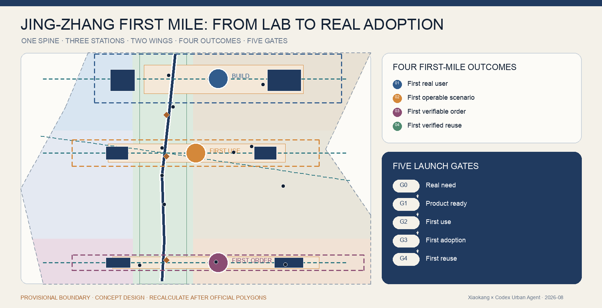

Jing-Zhang First Mile focuses on the first passage after technology leaves the laboratory: **who owns the real problem, who becomes the first user, who takes over after the pilot, and how does one use become a procurable and reusable city service?** Zhongzhiyuan, AI Origin and Dazhongsi form a continuous product-ready–first-use–first-order handoff. Its minimum public promise is simple: if AI is removed, the ordinary route, staffed service and commons still work. Reviewers can inspect the task journey, First-Mile Passport, quantity basis, G0–G4 gates and failure archive item by item.

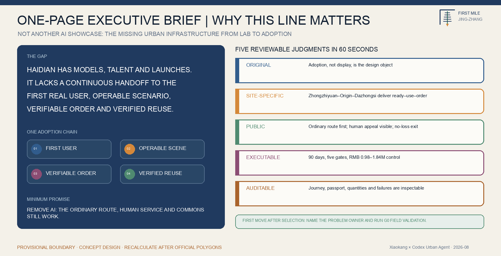

## Centennial Jing-Zhang Culture and a New AI Culture: From Engineering Autonomy to Urban Adoption

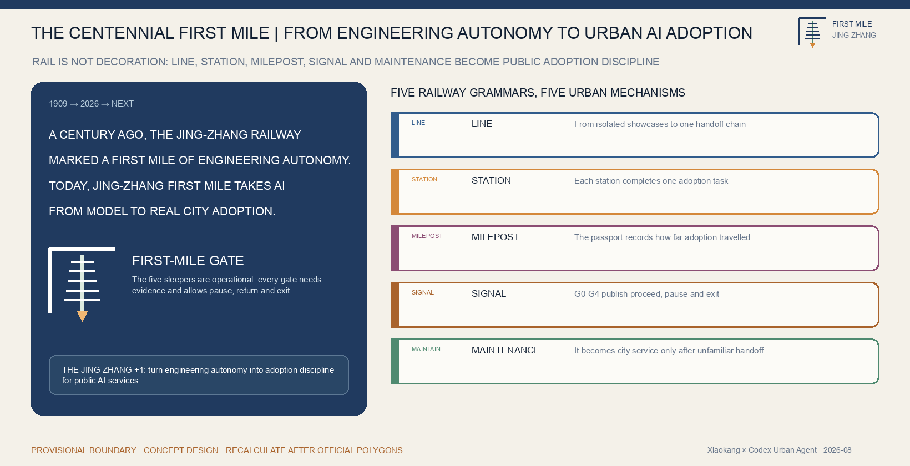

We read “centennial Jing-Zhang” as a civic culture that can still guide the city. A century ago, the railway completed a first passage from knowledge to real operation through engineering autonomy. Today, Haidian must help AI complete the passage from model to real city. The two eras share **autonomy, truth-seeking, collaboration, access and public learning**. Railway grammar becomes five institutions: the rail line maps to a continuous three-station adoption chain; sleepers to G0–G4 evidence gates; the platform to an equal first-use interface; train formation to the responsibility handoff among developer, user and operator; and the timetable to a reviewable four-season civic rhythm.

Culture therefore enters space, operation and public memory together. Qinghuayuan Station, Dazhongsi and the existing heritage park are orientation and narrative anchors. The First-Mile Gate is not another technology totem: it publicly shows the open entrance, evidence state, staffed service and right to exit. Annual recognition rewards solved real problems, ordinary users completing tasks, unfamiliar operators taking over, and failures being openly reviewed—not launch volume. This is a design-value translation; it does not invent railway history, heritage boundaries or an official commemorative interpretation [source:OFFICIAL-ANNOUNCEMENT] [source:OSM-CONTEXT-2026].

## Three Positionings and Five Functions: From the Taskbook to Testable Mechanisms

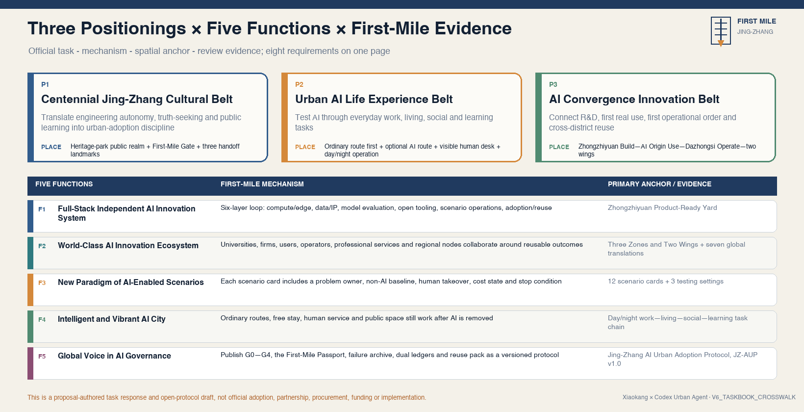

The proposal answers the taskbook's three positionings—**Centennial Jing-Zhang Cultural Belt, Urban AI Life Experience Belt and AI Convergence Innovation Belt**—and five functions—**Full-Stack Independent AI Innovation System, World-Class AI Innovation Ecosystem, New Paradigm of AI-Enabled Scenarios, Intelligent and Vibrant AI City, and Global Voice in AI Governance**. The three positionings form one working chain: the cultural belt supplies autonomy, truth-seeking, access and public learning; the life-experience belt tests public value through ordinary work, living, learning and social tasks; and the convergence belt connects research, first use, first order and reuse. The five functions are implemented through technical capability, ecosystem collaboration, scenario methods, city life and governance output [source:AGENT-TASKBOOK] [standard:PROJECT-AGENT-OPEN-CALL-TASKBOOK].

| Taskbook requirement | First-Mile response | Primary spatial anchor | Evidence a reviewer can open |
| --- | --- | --- | --- |
| Centennial Jing-Zhang Cultural Belt | Translate engineering autonomy into G0—G4, accountable handoff and a public failure culture | Continuous heritage-park public realm, First-Mile Gate and three handoff landmarks | Centennial culture figure, identity system and culture chapter |
| Urban AI Life Experience Belt | Test usefulness through four daily domains while preserving ordinary routes, staffed help and harmless exit | Everyday public realm, centred on the AI Origin First-Use Commons | Urban-life/governance figure, first-user journey and 12 scenario cards |
| AI Convergence Innovation Belt | Replace a showcase corridor with product readiness, first real use, first operational order and verified reuse | Zhongzhiyuan—AI Origin—Dazhongsi and the two wings | Three-station structure, First-Mile Passport and delivery ledger |
| Full-Stack Independent AI Innovation System | Connect compute, data, model, tooling, operations and adoption through a six-layer evidence stack | Zhongzhiyuan Product-Ready Yard, handing off to the other stations | Full-stack adoption figure and G1 readiness gate |
| World-Class AI Innovation Ecosystem | Organise cross-sector and cross-region collaboration around reusable outcomes, not a list of parks | Three Zones and Two Wings, plus proposed regional interfaces | Seven global cases, reuse pack and six-party alliance |
| New Paradigm of AI-Enabled Scenarios | Give every scenario a problem owner, non-AI baseline, human takeover, cost state and stop condition | 12 scenarios and 3 testing settings | Scenario cards and gate summary |
| Intelligent and Vibrant AI City | Keep travel, service, free stay, accessibility and night-time help functional after AI is removed | Day/night work—living—learning—social task chain | Urban-life/governance and mobility-blue-green figures |
| Global Voice in AI Governance | Publish gates, passport, failure archive, dual ledgers and reuse packs as a versioned open protocol | First-Mile Console, failure/reuse archive and Global First Mile Network | JZ-AUP v1.0 draft and long-term operating model |

The three positionings and five functions are registered as [metric:official_positioning_count] and [metric:official_function_count]. A requirement is not complete because it appears once in prose: each item needs a mechanism, place, evidence and stop condition. The detailed mapping remains machine-readable in the task coverage matrix and `visual/assets/taskbook-strategy-crosswalk.json`.

## Design Basis and Source List

The proposal uses three layers of material. The official announcement and agent taskbook define the scope, tasks and expected depth. Registered public sources locate roads, waterways, transit, heritage and existing public space. The proposal's own geometry, metrics and figures explain design choices only. Each layer has a different role, and design inference is never presented as an “official fact” [source:OFFICIAL-ANNOUNCEMENT] [source:AGENT-TASKBOOK] [depth:existing_conditions_diagnosis].

At submission, five registered sources can support formal argument and one supports provisional geometry only. The rule is simple: public evidence supports facts, provisional material supports comparison, and missing information stays visibly open. Full provenance, rights, standards and design-depth records remain in the audit layer rather than crowding the reading layer [source:SOURCE-REGISTRY] [source:PROCESSED-FACT-PACK].

The largest unresolved evidence gap is the official overall boundary and the three key-area redlines. The current extents are therefore one shared **conceptual ruler**: useful for comparing station relationships, spatial ratios and project counts, but not for approval, demolition or engineering set-out. When official geometry arrives, land use, roads, green space, public space, buildings, phasing and areas will be recalculated together. This organizer-owned gap does not reduce content eligibility [data:geometry/site_boundary.geojson#SITE-001] [data:geometry/key_areas.geojson#PROV-KEY-001] [metric:site_area_sqm].

## Three-Level Scope Framework

Each scale answers one question. The 43.6 km² Coordinated Research Area asks which link is missing from Haidian's AI innovation chain. The approximately 11.4 km² Overall Design Area arranges industry, mobility, public space and renewal projects. The 368.4-hectare Key-Area scope takes the Build—Use—Order handoff down to buildings, streets and operating interfaces. The large scale sets direction, the middle scale builds the system, and the small scale tests whether people can actually use it [depth:three_level_scope_framework] [depth:overall_spatial_structure] [standard:PROJECT-OFFICIAL-ANNOUNCEMENT].

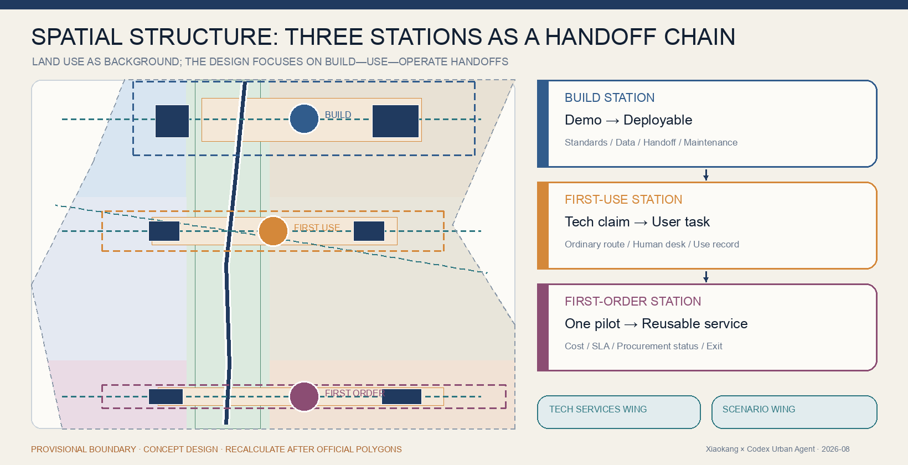

The three scales correct one another along the same chain. Industry strategy must find a spatial carrier; each spatial move must become a project; and the key-area trials must be able to revise the original industry and operating assumptions. Areas, ratios, capacities and quantities are recomputed from one set of layers. Where evidence is missing, the control remains pending rather than acquiring a false precision [data:geometry/site_boundary.geojson#SITE-001] [data:geometry/key_areas.geojson#PROV-KEY-001].

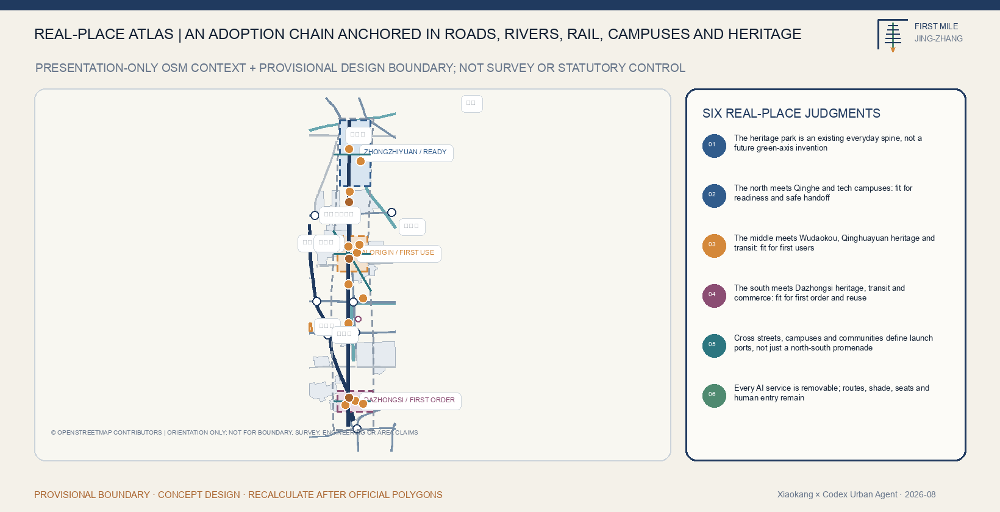

The atlas grounds the adoption chain in real urban relationships. The north meets Qinghe and technology campuses, which supports product readiness and safe handoff. The middle meets Wudaokou, Qinghuayuan heritage and transit, which supports first users and university–community co-testing. The south meets Dazhongsi heritage, transit and everyday commerce, which supports acceptance, first orders and reuse. Cross streets, campuses, communities and stations create lateral “launch ports,” so the belt is not merely a north–south visitor promenade. The base uses registered OSM orientation data; key-area extents remain provisional constraints and are not survey, redline, engineering or approval evidence [source:OSM-CONTEXT-2026] [assumption:A-CONTEXT-MAP-001].

The overall concept is **Jing-Zhang First Mile**. The “first mile” is the fragile passage after an AI system leaves the laboratory. Four breaks are common: a real need has no accountable owner; a prototype can demonstrate but has no evidence that an ordinary user can finish a task; a visible pilot lacks operating handoff, procurement path or repeat use; and the public service disappears when the technology team leaves.

The proposal therefore builds a city-scale launch operating system that helps one product gain four outcomes in order: **its first real user, first operable scenario, first verifiable order and first verified reuse**. The three key areas form a governed handoff chain:

- **Zhongzhiyuan — Build & Ready Station:** turn an algorithmic prototype into a deployable product with standards, limits and operating documentation.
- **Beijing AI Origin Community — Use & Adopt Station:** let students, founders, residents and front-line operators complete the first real tasks together.
- **Dazhongsi — Operate & Scale Station:** connect verified services to enterprise adoption, commercial operation and cross-district reuse.

The Zhongguancun Technology Services Wing provides intellectual-property, compliance, data, capital and procurement guidance. The Xiaoyue River Scenario Enablement Wing supplies real operating settings with named problem owners, non-AI baselines and human fallback. This is a design proposition, not a statement of government procurement, funding or approval [source:CASE-HAIDIAN-AI-DISTRICTS-2026] [source:CASE-BEIJING-SCENE-OPENING-2026].

### Original Identity: First-Mile Gate / Shouchengmen

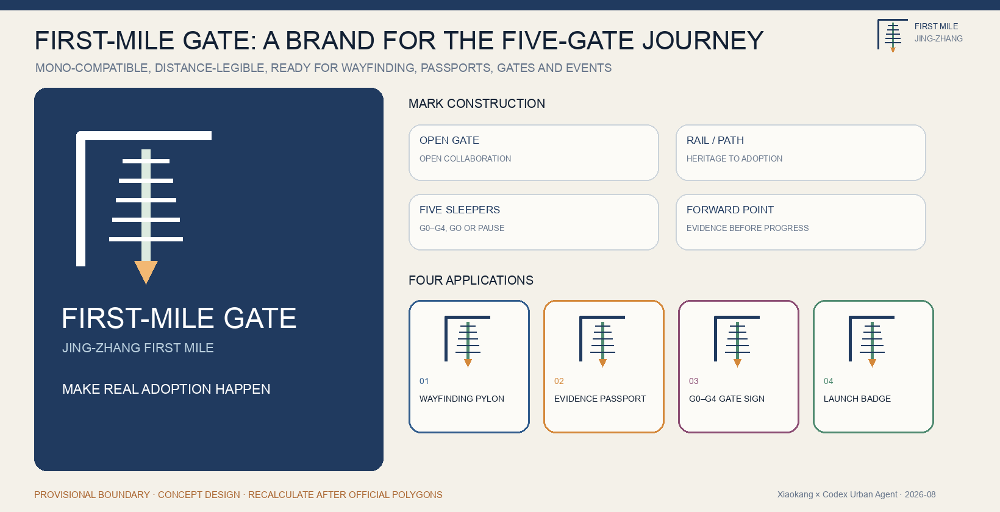

The First-Mile Gate compresses the proposal's operating discipline into a memorable and executable mark. The open frame says that the belt is not a closed campus; the continuous rail/path joins Jing-Zhang engineering heritage to today's adoption workflow; five sleepers are G0–G4, where progress and pause are equally legitimate; and the forward point means that evidence must pass before the next stage. The original monoline mark requires no third-party trademark and works on four low-cost carriers: wayfinding pylons, first-use evidence passports, G0–G4 field signs and launch-event badges. It is not a decorative layer on buildings. It lets users and operators see the current gate, accountable party and exit path.

The workflow has five gates [metric:launch_gate_count]:

| Gate | Required question | Minimum evidence | If it fails |
| --- | --- | --- | --- |
| G0 Real Need | Who bears which cost, and who has authority to define the need? | Named owner, current-service baseline, affected people | Do not admit the task |
| G1 Product Ready | Is the prototype safe, compliant and maintainable within a stated scope? | Data register, model limits, human handoff, maintenance owner | Return to Build & Ready |
| G2 First Use | Can an ordinary user complete a real task and exit without harm? | Task completion, errors/complaints, non-digital alternative, field record | Pause and revise |
| G3 First Adoption | Will the operator take responsibility, and are cost and liability viable? | Training sign-off, service level, cost range, procurement/cooperation status | Retain as research only |
| G4 First Reuse | Does value remain after changing place and team? | Reuse pack, version differences, repeat use, exit restoration | Do not scale |

The spatial structure is “one line, three stations, two wings and multiple first-use scenarios.” The line is a workflow rather than a new statutory boundary; the stations are handoff surfaces rather than isolated pavilions; and the wings are interfaces for professional supply and real demand.

Regional amplification is specified as input and output rather than a generic arrow. AI North Latitude Community could bring early teams and receive readiness packs; Future Science City and Huairou Science City could bring research and receive evidence from real urban tasks [source:HAIDIAN-AI-NORTH-LATITUDE-2025] [source:BEIJING-THREE-CITIES-ONE-ZONE] [source:BEIJING-HUAIROU-2026].

E-Town could bring manufacturing and industry settings and receive operationally verified services; Jing-Jin-Ji partners could bring cross-regional needs and receive reuse kits with changed conditions, training, service levels and exit methods. These are proposed interfaces, not established partnerships [source:BEIJING-ETOWN-AI-2026].

## Coordinated Research Area: Industry and Future City Research

Haidian already has universities, models, talent, capital and launch events. The scarce capability is converting these assets into products that real people use, another team can operate and another place can reuse. The strategic diagnosis therefore focuses on four breaks: unowned demand, adoption without evidence, pilots without operational handoff, and demonstrations without a viable public or market adoption path. Beijing's 2026 scenario policy links lists of demands, capabilities and demonstration projects to first trials, first uses, cooperative innovation procurement and market orders. This proposal translates that policy direction into a spatial-operating method without claiming that any proposed project has been approved [source:CASE-BEIJING-THREE-LISTS-2026].

### Seven Global Cases: From Test Capacity to Adoption Capacity

| Case | Verified mechanism | Translation for Jing-Zhang | Condition not copied |
| --- | --- | --- | --- |
| Punggol Digital District Open Digital Platform | Test in a digital twin before entering the live district | A simulation–limited-domain–real-use readiness sequence | National platform and data authority cannot be assumed |
| Helsinki Mobility Lab | Companies, researchers, city teams and residents co-test toward business and cross-city use | Record adoption and reuse, not visitor numbers | Port and local transport conditions differ |
| Test in Tallinn | One city entry point connects teams to departments, sites, data, residents and services | A Jing-Zhang First Mile Window | Local legal authority must be confirmed |
| Boston New Urban Mechanics | A small city team is a front door between community problems and prototypes | Start with problem ownership and resident relations | Do not copy the administrative structure |
| Toyota Woven City | Inventors and residents/visitors iterate continuously | Treat residents, shop staff and property operators as co-developers | Private test-city powers do not transfer |
| EU experimentation and innovation procurement | Sandboxes, test beds, living labs and procurement support lab-to-market uptake | Make handoff, cost and procurement status G3 evidence | Do not import EU legal procedure |
| Beijing scenario-opening mechanism | Demand, capability and demonstration lists connect trials to orders | A problem order, capability card, first-use credential and reuse pack | No invented amount, selection or endorsement |

These cases support method, not statutory spatial controls [source:CASE-PUNGGOL-ODP] [source:CASE-HELSINKI-MOBILITY-LAB] [source:CASE-TALLINN-TESTBED] [source:CASE-BOSTON-URBAN-MECHANICS] [source:CASE-WOVEN-CITY] [source:CASE-EU-EXPERIMENTATION-PROCUREMENT].

### The Jing-Zhang First Mile Operating System

Four transferable objects connect the stations and wings:

1. **First-Mile Task Order:** problem owner, target user, current workflow, non-AI baseline, spatial conditions, data boundary and budget status.
2. **Hypothesis and Evidence Ledger:** source, period, state, boundary, next test and stop condition for every claim; synthetic data can never be presented as an operating result.
3. **Urban First-Use Credential:** version, place, people, human handoff, defects, cost range, accountable person and reuse permission after a pilot.
4. **Reuse Pack:** interfaces, training, service level, exit restoration, licence and conditions that must be retested after relocation.

The **First Mile Console** is the field interface for this operating system. Operators can see which gate each task has reached, which evidence is missing, which scenario is paused and which staffed service remains available. The public sees only de-identified information relevant to rights and accountability. The interface prioritises current status, responsibility and a durable record; it does not present design method as competition evidence or an official fact [standard:PROJECT-AGENT-OPEN-CALL-TASKBOOK] [depth:overall_spatial_structure].

### Zhongzhiyuan Full-Stack Independent AI Innovation System: Six Evidence Layers

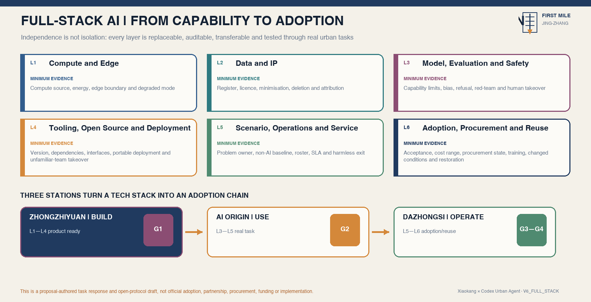

“Full-stack independence” does not mean building every component in a closed system. It means critical capabilities are **replaceable, auditable, transferable and able to degrade safely**. The six layers are compute and edge; data and intellectual property; model evaluation and safety; tooling, open source and deployment; scenario operations and service; and adoption, procurement and reuse. Each layer has minimum evidence. Data requires licence, minimisation and deletion. Models require capability limits, red-team tests and human takeover. Tooling requires deployment by an unfamiliar team. Operations require a non-AI baseline, roster and service level. Adoption requires acceptance, cost, procurement state, training and exit restoration.

Zhongzhiyuan prepares L1—L4 and exits through G1. AI Origin tests L3—L5 through real tasks and G2. Dazhongsi verifies L5—L6 operations, first-order and reuse conditions through G3—G4. Technical leadership cannot bypass user completion, operator takeover or adoption evidence; likewise, a satisfying interaction cannot conceal licensing, safety or maintenance gaps. The structured stack is recorded in `visual/assets/taskbook-strategy-crosswalk.json` as an open draft for professional and ecosystem development, not as a claim that a national platform, company or government has adopted it [source:AGENT-TASKBOOK] [assumption:A-PILOT-001].

## Overall Design Area: Urban Renewal and Regulatory-Plan-Level Urban Design

At this level, the First Mile workflow becomes a set of checkable spatial objects: a complete conceptual land partition, six programme carriers, a north—south working spine, transverse slow-mobility links and phases tied to the three stations. Together they answer where activity occurs, who uses it and how responsibility moves. The masterplan explains spatial organisation; later specialist work must establish the professional conclusions [standard:MOHURD-CONTROL-DETAILED-PLANNING] [data:geometry/land_use.geojson#LU-001] [depth:land_use_layout].

Building footprints and road layers test carrying locations and mobility relationships; areas and quantities are recomputed from the same data [data:geometry/buildings.geojson#BLDG-001] [data:geometry/roads.geojson#ROAD-001] [metric:building_footprint_area_sqm]. Heights, intensity, road lines, setbacks and facility standards remain pending official planning controls and field evidence.

Five reversible spatial components carry the workflow: street-level **First Mile Windows** receive needs and teams; shared-building **Productization Workbenches** handle standards, data, compliance and operations; public **First-Use Rooms** host small real tasks; the Dazhongsi **First-Order Living Room** supports procurement consultation and reuse demonstrations; and **Evidence Beacons** show project state, human entry and exit method. Existing ground floors, park edges, underused interfaces and leftover spaces should be tested before new construction. Exact buildings, equipment, engineering quantities, heights, intensities, road lines and setbacks remain pending official planning, ownership, fire and municipal conditions.

## Detailed Design of Key Areas

Each key area has one primary responsibility. Zhongzhiyuan prepares a product to leave the laboratory; AI Origin handles an ordinary person's first real use; Dazhongsi handles operating takeover, first order and cross-district reuse. The three stations share one gate system, and their tasks connect without substituting for one another [data:geometry/key_areas.geojson#PROV-KEY-001] [data:geometry/key_areas.geojson#PROV-KEY-002] [depth:three_key_area_detailed_design].

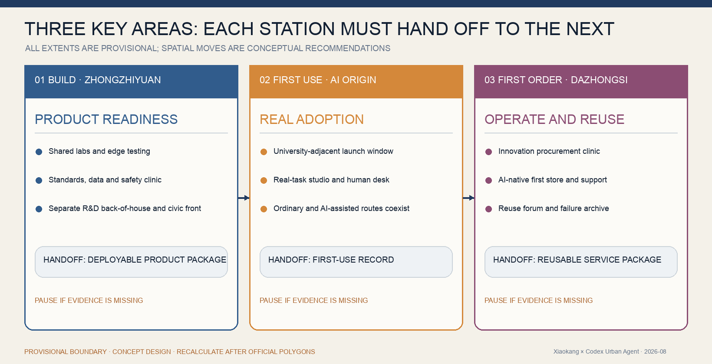

| Key area | First-mile role | Spatial move | Required handoff |
| --- | --- | --- | --- |
| Zhongzhiyuan AI Independent Innovation Accelerator | **Build & Ready** | Shared evaluation, edge testing, standards clinic and a low-carbon Qinghe public interface | A deployable product with data register, failure limits, human handoff and maintenance plan |
| Beijing AI Origin Community | **Use & Adopt** | A visible problem desk, first-use rooms and a university–community slow-mobility link | Evidence that ordinary users and unfamiliar staff can finish, correct and exit a real task |
| Dazhongsi AI Industry Cluster | **Operate & Scale** | First-order living room, AI-native retail, reuse stage and four-quadrant walking links | Cost, service level, contract/procurement status, training and exit terms in a reuse pack |

Each station joins programme carriers, public space, slow-mobility links and a first-phase project. Current extents compare spatial relationships only; exact siting still requires redlines, existing-building surveys, ownership, traffic, utilities, fire and heritage evidence [data:geometry/key_areas.geojson#PROV-KEY-003]. Zhongzhiyuan may not send an unproductized prototype into public space; AI Origin may not convert positive feedback into a claim of market demand; and Dazhongsi may not call a display, intent or media impression an order.

### Three Real Places: Each Answers One Irreplaceable Question

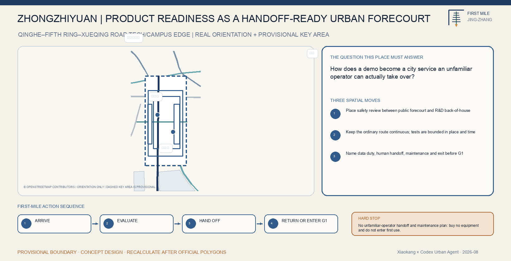

Between Qinghe, the heritage park and northern campuses, Zhongzhiyuan forms a research back-of-house, visible test yard and safe-handoff desk that turns prototypes into deployable products. The ordinary public route stays continuous; a prototype without a data owner, human takeover and maintenance plan stops before G1.

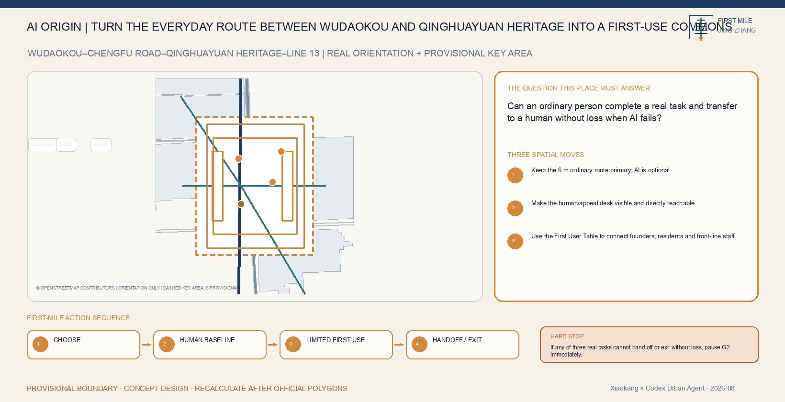

AI Origin connects Wudaokou, Qinghuayuan heritage, transit and campus life through an ordinary route, optional AI route, staffed desk and First User Table. Real adoption is not spectatorship: an ordinary person completes a task, can correct it, reach a human and exit without loss.

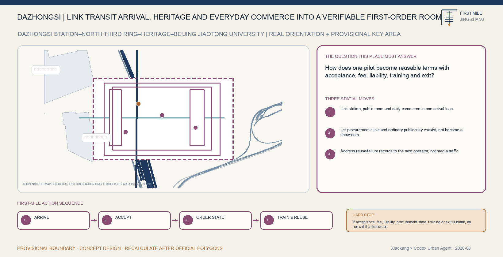

Dazhongsi links station, heritage interface, public living room and everyday commerce in one arrival loop, allowing a procurement clinic, non-commercial stay, training and reuse archive to coexist. If acceptance, cost, liability, procurement state, training or exit is blank, the pilot is not a first order. All three diagrams use presentation-level orientation; exact siting still requires official redlines, survey, ownership, traffic, fire, trees and heritage review.

Functions, building carriers, public-space continuity, mobility and project nodes remain concept recommendations for professional development, not final legal parcels or approved construction.

### From Regional Concept to Reviewable, Scaled Modules

The following drawings use **concept study modules** to test spatial relationships, minimum dimensions, quantities and stop conditions. They are not legal parcels, measured surveys or construction drawings. Before siting, the team must verify official redlines, title, existing buildings, utilities, trees, fire, traffic, heritage and accessibility [assumption:A-CONTROLS-001] [assumption:A-DESIGN-NODES-001].

| Module | Study extent and key quantities | Public-space baseline | Stop before the next station |
| --- | --- | --- | --- |
| Zhongzhiyuan Product-Ready Yard | 180 × 120 m (2.16 ha); 36 × 24 m visible test court; 18 × 12 m safety/data clinic; 18 × 12 m operations handoff lab; 12–20 m ecological buffer | Continuous 6 m ordinary public route; research back-of-house separated from the public test front | No data owner, human takeover or maintenance plan: stop before G1 and buy no device |
| AI Origin First-Use Commons | 160 × 110 m (1.76 ha); Ø18 m First User Table; 12 × 6 m human/appeal desk; 18 × 8 m limited launch window | 6 m ordinary route is primary; 3 m AI route is optional; every user can exit without loss | If any of three real tasks lacks human escalation or exit, pause G2 immediately |
| Dazhongsi First-Order Room | 200 × 160 m (3.20 ha); 24 × 12 m procurement clinic; 30 × 18 m first-order room; 24 × 12 m reuse/failure archive; 6 m arrival loop | Continuous station arrival, crossing seams and non-commercial stay; heritage buffer width remains TBC | If acceptance, cost, liability or exit terms are blank, do not call the pilot a first order |

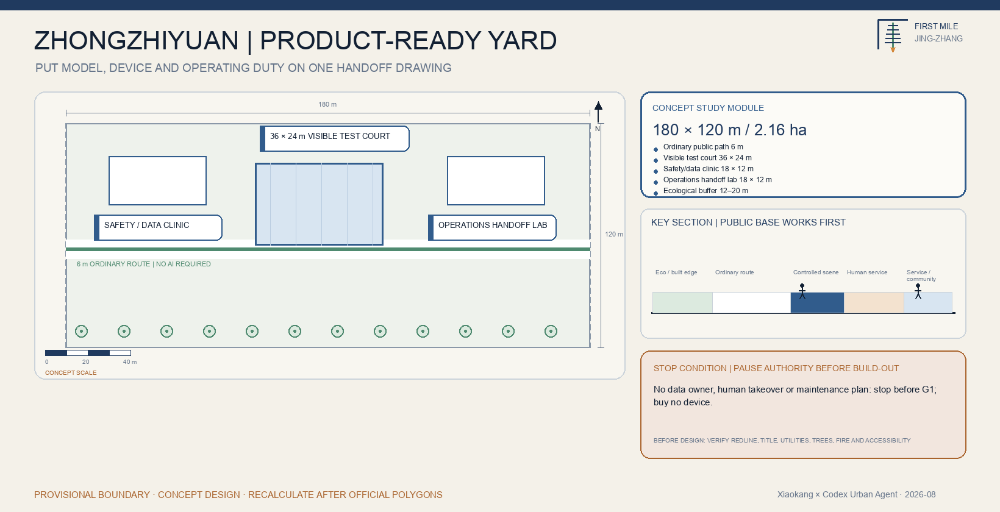

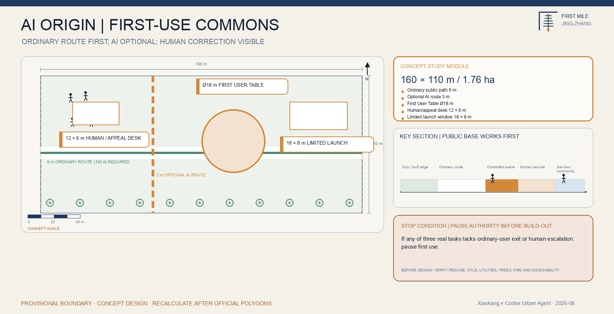

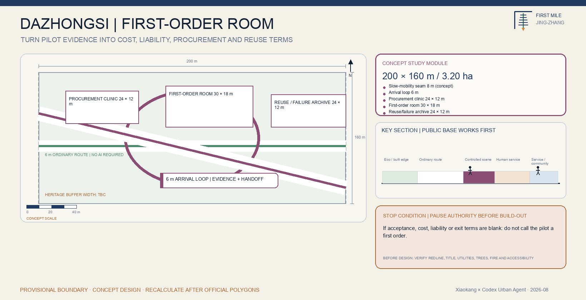

The three flagship experiences share one public-space baseline while changing protagonists. At Zhongzhiyuan, safety staff and developers complete a visible handoff. At AI Origin, ordinary residents, a wheelchair user and front-line staff complete a real task together. At Dazhongsi, a small team, operator and procurement adviser turn one pilot into acceptance, training and exit conditions. The image communicates human scale, everyday use, accessibility and staffed presence only; it is not evidence of existing conditions, interviews, partnership or a built result [source:FIRST-MILE-THREE-SCENES-IMAGEGEN-2026] [assumption:A-TRIPTYCH-001].

## AI Innovation Ecosystem, Personas, and AI+ Scenarios

### Urban AI Life Experience Belt: Four Real Task Domains in One Day

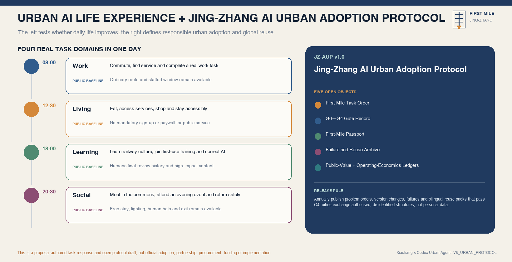

The life-experience belt measures whether an ordinary person can **complete a real task more easily while retaining choice**. The 08:00 work chain tests commuting, finding service and completing one work task. The 12:30 living chain tests eating, public service, shopping and accessible stay. The 18:00 learning chain tests railway-culture understanding, first-use training and correction. The 20:30 social chain tests the public living room, evening activity and a safe trip home. Every chain first secures a non-AI public baseline, then allows AI as an optional enhancement.

The day/night chain turns vitality into four observable outcomes: task completion, reachable human help, harmless exit and continued free public use. Three-station windows, walking/cycling links and first-use rooms support the day. Night scenarios open only with lighting, staffing, help, removal and noise-management conditions. Testing may not weaken the everyday rights of older adults, children, disabled people, people without smartphones or people who decline data permission [data:geometry/public_space.geojson#PUBLIC-001] [depth:public_service_municipal_infrastructure].

Six personas collaborate along the same chain. They are described through real tasks and rights boundaries, so visitor counts never stand in for user value [metric:persona_count]:

| Persona | Real task | Spatial response | Non-negotiable boundary |
| --- | --- | --- | --- |
| University researcher / open-source developer | Turn research into something another team can deploy | Productization workbench and First Mile Window | Clear IP, licence and attribution |
| Startup / independent developer | Find a first real user and first paid or procured opportunity | Shared testing and first-order clinic | Residency, pitching or intent is not an order |
| Scenario owner / enterprise customer | Solve a named problem at controlled cost | Task desk, procurement clinic, reuse stage | Named owner, budget state and acceptance responsibility |
| Front-line operator, shop staff or property staff | Take over, correct and maintain service | Visible human desk, training room and operations console | No launch without training, roster and stop authority |
| Resident, older adult, child or disabled person | Safely complete travel, service, shopping or leisure tasks | Ordinary and AI-assisted paths coexist | No default face recognition; preserve non-digital service |
| Investor, legal, standards or data specialist | Decide whether and how to continue responsibly | Joint clinic in the services wing | Advice does not replace approval; disclose conflicts |

### Twelve Scenario Cards: From a Real Task to an Acceptable Result

The twelve scenarios [metric:scenario_card_count] each require a user, problem owner, place, non-AI baseline, minimal data, human handoff, operator, cost status, success measure and stop condition.

| # | Scenario and place | First-mile value | Human and exit boundary |
| --- | --- | --- | --- |
| 01 | Urban Problem Launch Desk — AI Origin | Residents, enterprises and operators publish verifiable tasks | Human moderation merges duplicates and explains unowned needs |
| 02 | Pre-Street Model Evaluation — Zhongzhiyuan | Test facts, bias, robustness, copyright, privacy and refusal | Professional final review; severe errors block G2 |
| 03 | Agent Operations Handoff Pod — Zhongzhiyuan | Unfamiliar operators deploy, pause, restore and export without developers | Failed independent takeover returns to G1 |
| 04 | AI Startup Service Copilot — AI Origin | Navigate public policy, space, compute, talent and scenario information | Public information only; a human desk may correct or overturn |
| 05 | Accessible Slow-Mobility Task Chain — Heritage Park | Detect barriers, create work orders and verify closure | Paper/phone reporting remains; unsafe guidance stops immediately |
| 06 | Multilingual Railway Culture Guide — whole line | Explain Jing-Zhang engineering, Zhongguancun innovation and First Mile method | Human historical review; no personal route tracking |
| 07 | Public-Space Microclimate Assistant — Qinghe/Xiaoyue interface | Turn environmental data into shade, water and activity adjustments | Landscape and site staff decide; no personal identity data |
| 08 | Low-Speed Service Robot First-Use Route — Xiaoyue wing | Test delivery/inspection safety and operating cost in real walking space | Limited domain/time/speed, safety staff and emergency stop |
| 09 | AI-Native First Store — Dazhongsi | Test product understanding, after-sales, human service and repeat use | No profile pricing; cash and human service always available |
| 10 | Cooperative Innovation Procurement Clinic — Dazhongsi | Define acceptance, cost, responsibility, IP and exit before procurement | No award or funding promise; human procurement/legal review |
| 11 | First Mile Console — three-area operations | Publish gates, responsibility, missing evidence, pause and expiry | De-identify public view; no automated high-impact decisions |
| 12 | Reuse Stage and Failure Archive — Dazhongsi/whole line | Show reuse packs, changed conditions and lessons from failure | Reach is not reuse; contributors may remain anonymous |

Scenarios 02, 03 and 08 form three industry test settings [metric:industry_test_scenario_count]. They separately test technical reliability, operational takeover and physical safety; passing one cannot substitute for the others.

### Three AI Pilgrimage Landmarks: Make Handoff, First Use and Public Learning Visible

1. **First-Mile Zero:** connects Zhan Tianyou's independent engineering spirit with the disciplined passage from prototype to real use; historical content requires professional review.
2. **First User Table:** records verified improvements jointly made by residents, shop staff, property operators, developers and reviewers; it has no commercial ranking.
3. **Fail & Scale Signal:** makes visible which projects paused, why they stopped, how they changed and where they were genuinely reused.

All three [metric:ai_pilgrimage_landmark_count] are reversible, removable and accessible conceptual components. Exact location, scale, heritage relationship and construction conditions require official geometry and professional confirmation [data:geometry/public_space.geojson#PUBLIC-001] [depth:blue_green_public_space].

All scenarios follow data minimization, explanation, human review, a non-digital alternative and the right to exit. Urban agents may help organize information and proposals but cannot replace planning approval, procurement decisions, medical or legal judgement, or decisions that materially affect individual rights.

## Land Use, Building Scale, and Retain-Renovate-Demolish Strategy

The land-use layer is a complete, closed, non-overlapping concept partition consistent with the machine-readable boundary. Its current measured coverage and ratios are derived from provisional geometry. The six building polygons are **conceptual program carriers**, not an existing-building survey or demolition decision. They indicate where a readiness hall, first-use room, service clinic, first-order room or operating support could be investigated after ownership, structure, fire, heritage, municipal and regulatory controls are obtained [standard:MNR-LAND-USE-CLASSIFICATION-GUIDE] [depth:height_massing_character] [depth:retain_renovate_demolish] [data:geometry/land_use.geojson#LU-001] [data:geometry/buildings.geojson#BLDG-001].

Retain-renovate-demolish decisions follow a staged rule: first retain viable structures and ordinary public service; then test low-impact interior or interface renovation; only consider replacement after safety, ownership, public value and whole-life carbon evidence. Floor area ratio, height, density, setback and precise capacity remain unknown because official controls and surveyed buildings are missing.

## Transport, Rail, Municipal Infrastructure, and Public Services

The mobility proposal connects the three stations through the heritage-park spine and transverse walking links. It prioritizes walking breaks, barrier-free continuity, bicycle parking, rail interchange and low-speed controlled test routes before increasing vehicle capacity. Every AI-assisted route retains an ordinary wayfinding and service option [depth:traffic_rail_slow_parking] [depth:municipal_new_infrastructure] [data:geometry/roads.geojson#ROAD-001] [data:geometry/public_space.geojson#PUBLIC-001] [data:geometry/constraints.geojson#CONSTRAINTS].

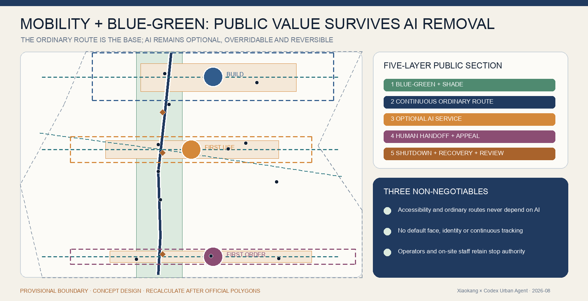

By July 2026, Beijing's official landscape authority had reported completion of phase-two supporting works for the Jing-Zhang Railway Heritage public space, including approximately 30.01 hectares in the northern segment and a north-south/east-west fishbone slow-mobility network. The earlier 2.5-kilometre first phase retained rail tracks, switches and station heritage [source:JZ-PARK-PHASE2-COMPLETE-2026] [source:JZ-PARK-PHASE1-2023]. This proposal uses that completed public-space spine and adds four light, removable adoption services: First Mile Windows, evidence beacons, staffed handoff points and AI-assisted routes limited by place and time. Existing public space is not counted as a new proposal outcome. With AI switched off, paths remain open, shade remains and seating still works.

AI industry services, talent services, edge compute, distributed energy and conventional infrastructure should share adaptable carriers where technically appropriate. Pipe networks, energy, drainage, flood control and fire protection are prerequisites for formal design; their absence is recorded as an assumption rather than filled with agent-generated precision.

## Blue-Green Network, Public Space, and Urban Character

Jing-Zhang Railway Heritage Park is the longitudinal public spine. Qinghe and Xiaoyue River interfaces, universities, enterprises and neighbourhoods provide transverse links. The conceptual green and public-space network supports daily walking, cycling, shade, rest, sport, innovation exchange and controlled testing; public access, free staying and non-commercial use take priority over enterprise display [depth:blue_green_public_space] [data:geometry/green_space.geojson#GREEN-001] [data:geometry/public_space.geojson#PUBLIC-001] [metric:green_ratio] [metric:public_space_ratio].

Urban character combines the history of Jing-Zhang engineering, Zhongguancun's culture of independent innovation and a new culture of accountable AI adoption. Wayfinding, bilingual interpretation and public art should distinguish verified historical content from contemporary design. Brands, typefaces, portraits, images and enterprise marks require rights clearance. No precise heritage buffer, roof control, height line or facade mandate is asserted without professional and statutory evidence [standard:MOHURD-URBAN-DESIGN-MEASURES].

The former Qinghuayuan Station appears in the official municipal heritage registry and provides a historical orientation point, but this proposal does not infer a protection boundary, construction-control zone or permit condition [source:QINGHUAYUAN-HERITAGE-2023]. Roads, rail, waterways, stations and campuses in the figures use a simplified OpenStreetMap presentation layer explicitly marked non-statutory. It supports spatial orientation only and cannot replace official survey, ownership or planning-control data [source:OSM-CONTEXT-2026] [assumption:A-CONTEXT-MAP-001].

## Renewal Projects, Implementation Policy, and Phasing

The implementation package is a portfolio of small, reversible projects rather than one capital-heavy showcase [depth:renewal_project_list] [depth:phasing_implementation] [data:geometry/phasing.geojson#PHASE-001].

| ID | Project | Phase-one deliverable | Gate before expansion |
| --- | --- | --- | --- |
| FM-01 | Jing-Zhang First Mile Window | Three-list intake rules, task template and public status page | Named operator, service boundary and appeal channel |
| FM-02 | Zhongzhiyuan Product-Ready Yard | Evaluation, operations handoff and edge-test workbenches | Safety, fire, data, equipment and maintenance review |
| FM-03 | AI Origin First-Use Community | One real task chain with ordinary and AI paths | User co-test, site operation and preserved non-digital service |
| FM-04 | Dazhongsi First-Order Living Room | Procurement clinic, first store, reuse stage and failure archive | Clear procurement state, responsibility, cost and after-sales |
| FM-05 | Jing-Zhang Slow-Mobility Stitching | Barrier list, human walk audit and low-regret repair package | Road line, underpass, traffic and accessibility review |
| FM-06 | Qinghe–Xiaoyue Blue-Green First-Use Interface | Reversible nodes for microclimate, rest and controlled scenarios | River, ecology, flood and operating-hours confirmation |
| FM-07 | First Mile Console and Public Evidence Library | G0–G4 state, responsibility, expiry, pause and reuse record | Data classification, cybersecurity, de-identification and maintenance |
| FM-08 | Global First Mile City Network | Bilingual reuse packs, annual failure review and cross-city task exchange | Voluntary partners, rights/data licences, no invented commitment |

### The First 90 Days: Verify One Real First User

The first concept pilot is the **AI Startup Service Copilot** at Beijing AI Origin Community. It works only with public information on policy, space, compute, talent and scenarios; it does not replace approval or professional advice. G0 recruits 5–8 real founders and 2–3 service staff to freeze three common tasks and the existing human baseline. G1 tests sourcing, refusal and human escalation with rights-cleared content and synthetic questions. G2 runs limited use beside a visible human desk. G3 asks an unfamiliar staff member to take over. Only after task completion, human fallback and the reuse pack pass G4 may reuse at Zhongzhiyuan or Dazhongsi be considered. Participant counts are research recruitment guidance, not completed samples or official targets.

The first phase buys no robots, builds no heavy exhibition hall, collects no face or continuous trajectory, and does not use response count, event traffic or publicity as success. Real completion, repeat use and operator handoff still need a trial baseline [metric:first_user_task_completion_rate] [metric:repeat_use_rate] [metric:operator_handoff_pass_rate].

Before G0, the field team follows the submitted **Field Validation Protocol** (`visual/assets/field-validation-protocol.json`). It walks the ordinary route, accessibility breaks and distance to staffed service; interviews recruits with the same 12 questions; records human-baseline time, error, escalation and exit for three tasks; obtains consent; and stores de-identified results. Five to eight founders and two to three service staff are **recruitment targets**, not completed samples. No interviews have yet been completed, and synthetic tests, internal reviews and concept visualisations do not count as user evidence.

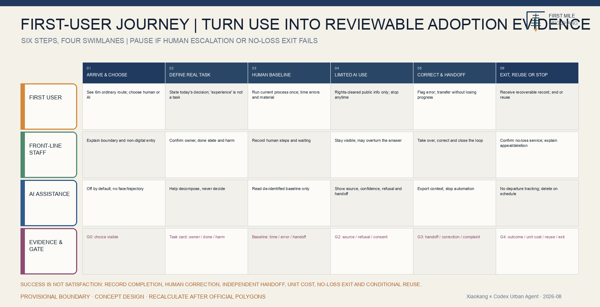

A first user is not an event check-in. It is a person who completes a real decision. The six-step journey starts with a visible ordinary route and genuine choice, then freezes the real task, human baseline, limited AI first use, correction and human takeover, and ends in no-loss exit, conditional reuse or legitimate stop. Success cannot be reduced to satisfaction: record completion, source traceability, correction time, unfamiliar-operator takeover, unit service cost, no-loss exit and conditioned repeat use together.

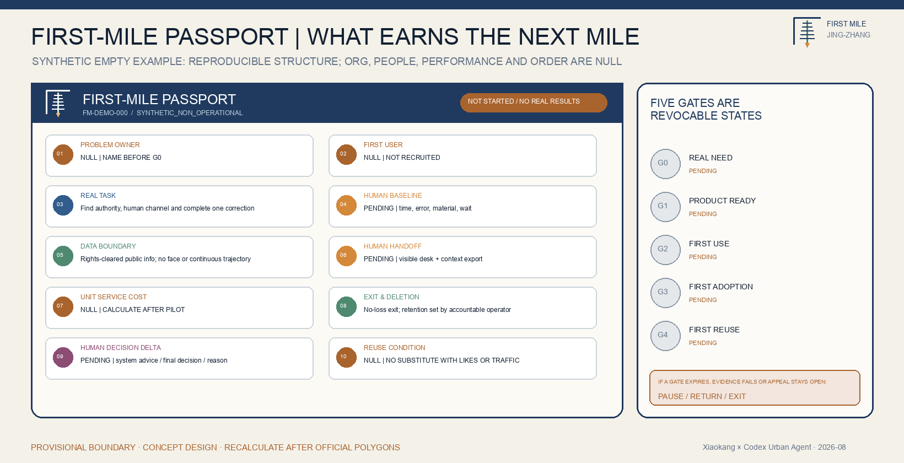

Each pilot produces a **First-Mile Passport** following `visual/assets/first-mile-passport.example.json`. It records the problem owner, first user, real task, human baseline, data boundary, human handoff, unit cost, exit/deletion, human-decision delta and reuse condition. G0–G4 expire and can be revoked. The submitted passport is a blank **synthetic example that has not operated**: every real organisation, participant, performance, reuse and procurement field is null. It tests the record and handoff structure; it does not claim that a pilot occurred [source:FIRST-MILE-PASSPORT-SAMPLE].

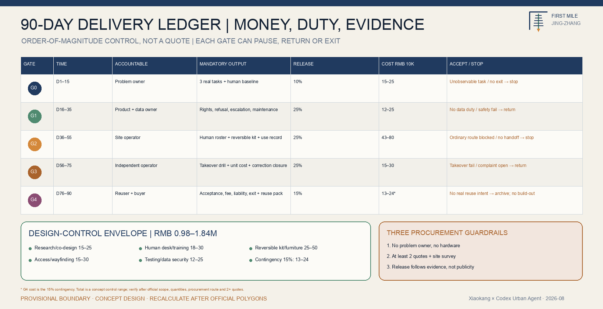

The first-pilot design-control envelope is **RMB 0.98–1.84 million**: research/co-design RMB 150–250k; staffed service and training RMB 180–300k; reversible structures/furniture RMB 250–500k; accessibility/wayfinding RMB 150–300k; testing/data security RMB 120–250k; plus about RMB 130–240k contingency at 15%. This is an **order-of-magnitude concept assumption**, not a quote, fiscal budget or investment commitment. Decision requires official scope, quantities, a site survey, procurement route and at least two quotations per item [assumption:A-COST-ENVELOPE-001]. A 10% / 25% / 25% / 25% / 15% evidence-linked resource-release sequence is recommended for G0–G4; the implementing entity must determine lawful contractual payment terms.

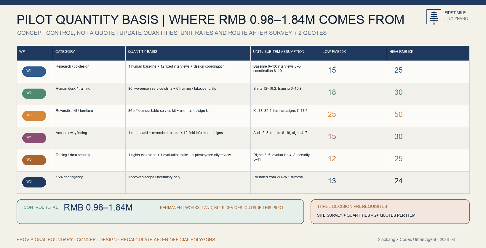

The range is derived from `visual/assets/pilot-bom.json`: one human-baseline package, 12 fixed interviews, 80 two-person service shifts, six training/takeover drills, a 36 m² demountable service kit, one First User Table and sign kit, one full-route accessibility audit, 12 field information signs, and one package each for rights clearance, evaluation, and privacy/security. Quantities and unit rates remain option-comparison assumptions. Permanent works, land, utility relocation and bulk device procurement are outside this pilot and must not be inferred. Update after site survey, verified quantities, procurement route and at least two quotations per item [source:FIRST-MILE-PILOT-BOM].

Phasing follows a small, reversible and operations-first discipline. Phase 1 funds problem research, staffed service, accessibility, safety and the evidence system. Phase 2 introduces equipment and spatial retrofit only after the first gates. Phase 3 expands only services that have been genuinely reused. Budgets must record category, quantity basis, price source, range and approval state. The RMB 0.98–1.84 million range supports first-pilot option comparison only; it is not extrapolated to a whole-belt investment or a fiscal commitment [depth:phasing_implementation].

The annual programme keeps the workflow running: publish city problem orders in spring, run product-readiness challenges in summer, host a real-user first-use week in autumn, and publish the failure, reuse and exit ledger in winter.

## Long-Term Operation and a Global Public Brand Asset

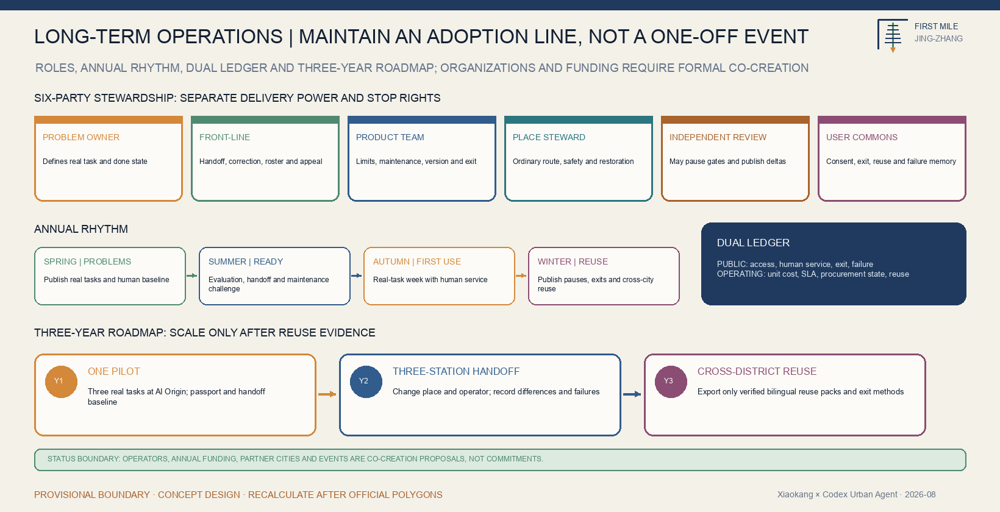

The First Mile still needs accountable operators after the call. A lightweight six-party alliance is proposed: problem owners define real tasks and retain stop authority; product teams maintain versions and failure limits; site operators handle rosters, takeover and recovery; residents and first users help define success and harm; universities and professional bodies support evaluation, ethics, standards and rights clearance; government or platform operators coordinate space, rules and procurement interfaces only within their authority. Project status must be confirmed through evidence from more than one party. This is a governance proposal, not a claim that any named institution has agreed to participate.

Four public checkpoints structure the year: spring problem orders, summer product readiness, autumn first-use week, and winter failure/reuse ledger. Every pilot keeps two accounts: a **public-value ledger** records who completed which task, fairness of access and right to exit; an **operating-economics ledger** records staffing, maintenance, unit service cost, procurement/cooperation status and restoration cost. Year 1 proves one place, one user type and one operating roster. Year 2 replicates only G4 services and records which conditions must be retested after moving. Year 3 may form a Global First Mile Network through open interfaces, bilingual reuse packs and city-to-city task exchange. Its success is measured by verified reuse and the quality of openly documented failure, not the number of city logos.

### JZ-AUP v1.0: Make a “Global Voice” Executable, Contestable and Reusable

The governance output is named the **Jing-Zhang AI Urban Adoption Protocol (JZ-AUP v1.0)**. It consists of five directly inspectable objects: the First-Mile Task Order, G0—G4 gate record, First-Mile Passport, Failure and Reuse Archive, and the Public-Value and Operating-Economics Ledgers. Every object records version, accountable person, evidence state, pause/exit method and public scope. Cities exchange only authorised, de-identified structures and reuse conditions, never personal data, and a one-time pass does not automatically become a permanent licence.

The protocol proposes one bilingual annual release covering problem orders, rule changes, representative failures, exit restoration and reuse packs that pass G4, with challenge review by users, operators, developers and independent professionals. A global voice comes from a method that other cities can inspect, criticise, modify and retest under different conditions. Governance knowledge is reused only after cross-team takeover, cross-place retesting and real exit records exist. JZ-AUP is currently an open protocol draft authored by this proposal, not an official standard, international recognition or a commitment from partner cities [source:AGENT-TASKBOOK] [standard:PROJECT-AGENT-OPEN-CALL-TASKBOOK].

## Metrics, Area Recalculation, and Compliance Matrix

Spatial metrics are recomputed directly from the layers. The provisional Overall Design Area is approximately 11.41 km²; current concept partitions yield a green ratio of approximately 15.27% and public-space ratio of approximately 21.98%. These numbers support comparison within one shared extent; they are not statutory controls. Scenario cards, industry tests, personas, service zones, landmarks and gates are countable design commitments. FAR and real operating outcomes await official evidence and trial results [depth:metrics_recalculation] [metric:site_area_sqm] [data:geometry/green_space.geojson#GREEN-001].

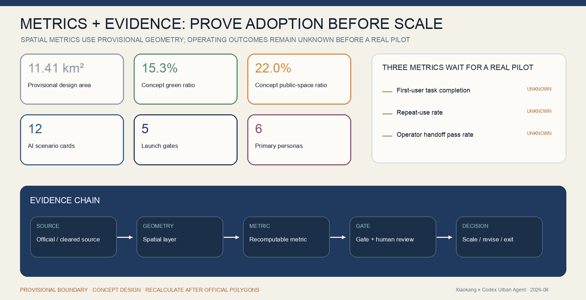

Full formulae, sources, confidence and task coverage remain in the structured audit layer. The narrative separates numbers into three categories: spatial quantities recomputed from geometry, controls awaiting official conditions, and performance that must be recorded through operation. Each category is labelled so that an aspiration is not presented as an achieved result.

Performance is read through four layers: technology (error, handoff and safety), user (real task completion and harmless exit), operations (takeover, maintenance and service level), and adoption (repeat use, procurement/cooperation status and cross-district reuse). A good result at one layer cannot prove project success, and test volume, launch-event attendance or media reach cannot substitute for real adoption.

## Risk, Copyright, and Compliance

This is a concept-design and governance proposal. It does not claim official approval, a statutory plan, final land ownership, construction scale, procurement, funding or implementation commitment. Overall and key-area boundaries, detailed controls, road lines, buildings, ownership, utilities, fire and heritage conditions remain open for professional review [depth:risk_missing_data] [data:geometry/constraints.geojson#CONSTRAINTS] [source:SITE-PACKAGE].

Four project-specific risks govern the design. First, public space must not become a privatized showroom: ordinary routes, free staying and non-consumption remain primary. Second, “first order” must not be presented as a government procurement promise: every procurement, funding and contract state is labelled. Third, transparent entry is reserved for university teams, independent developers and small firms as well as leading companies. Fourth, no device is procured before staffing, maintenance, expiry review and exit restoration have owners and resources.

Chinese and English narratives, figures, drawings and offline pages stay paired; asset provenance and rights are recorded in the source list and copyright statement. The authors remain accountable for facts, sources, rights, geometry and metrics. Any unsupported claim may be revised or removed through professional review.

## References

- `brief/public-brief.md`
- `brief/site-package/design_brief.json`
- `brief/site-package/allowed_design_space.json`
- `brief/site-package/enums/`
- `brief/site-package/ranges/planning_limits.json`
- `data/source_registry.json`
- `data/processed/agent_fact_pack.md`
- `data/processed/project_scope_summary.csv`
- `data/processed/agent_task_requirements.csv`
- `data/processed/source_use_matrix.csv`
- `data/processed/missing_data_checklist.csv`
- Complete public-source records, rights, access dates and use limits are maintained in the structured source list [source:SITE-PACKAGE].
