# 京张首发线 / JINGZHANG FIRST MILE

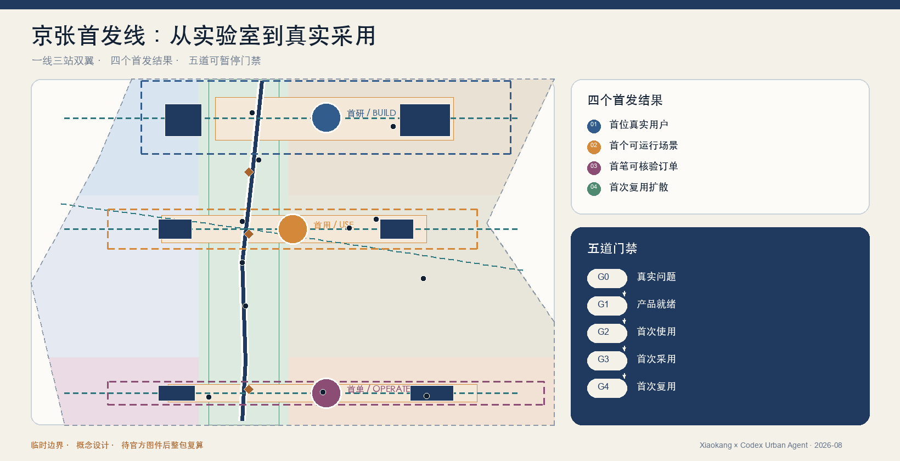

京张首发线关心的是技术离开实验室后的第一程：**谁提出真实问题，谁成为第一位用户，谁在试点后接手运营，又怎样形成可采购、可复用的城市服务？** 众智园、AI 原点和大钟寺依次完成“产品就绪—真实首用—首单复用”的交接。项目的最低公共承诺是：即使 AI 撤除，普通路径、人工服务和公共空间仍然可用。评委可通过任务旅程、首程护照、数量清单、G0—G4 门禁和失败档案逐项复核。

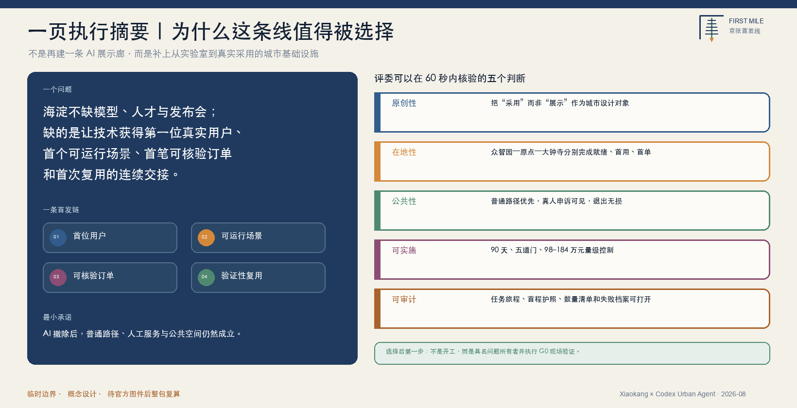

## 百年京张文化与 AI 新文化：从工程自主到城市采用

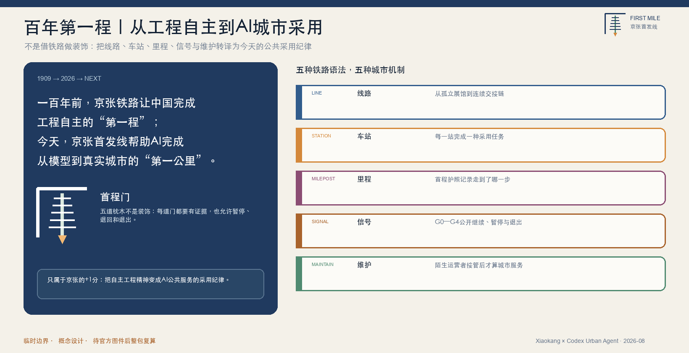

我们把“百年京张”理解为一种仍能指导今天的城市文化。一百年前，京张铁路以工程自主完成了从知识到真实运行的第一程；今天，海淀需要帮助 AI 完成从模型到真实城市的第一公里。两个时代共享**自主、求真、协作、可达与公开学习**的价值。方案据此把铁路语法转成五项制度：轨线对应三站连续采用链，枕木对应 G0—G4 证据门，站台成为平等首用界面，编组对应研发者—用户—运营者的责任交接，时刻表对应春夏秋冬可复核的年度节律。

文化表达同时进入空间、运营与公共记忆：清华园站、大钟寺与既有京张遗址提供方位和叙事锚点；“首程门”把开放入口、证据状态、人工服务和退出权公开给城市；年度荣誉记录真实问题被解决、普通用户完成任务、陌生运营者接管以及失败被公开复盘，而不奖励发布声量。文化线是本方案的价值判断，不主张伪造铁路史实、文保边界或官方纪念口径 [source:OFFICIAL-ANNOUNCEMENT] [source:OSM-CONTEXT-2026]。

## 三大定位与五大功能：从任务书到可验收机制

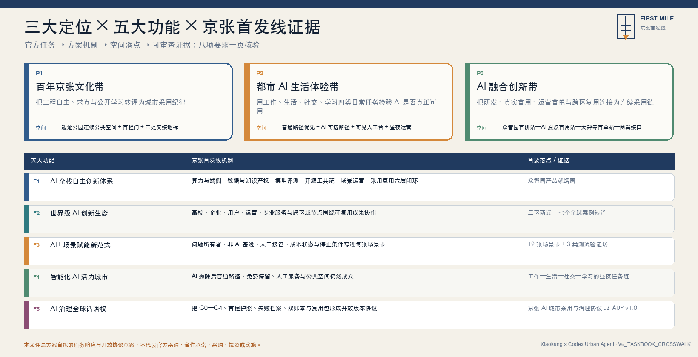

本方案逐项回应任务书提出的**百年京张文化带、都市 AI 生活体验带、AI 融合创新带**三大定位，以及**AI 全栈自主创新体系、世界级 AI 创新生态、AI+ 场景赋能新范式、智能化 AI 活力城市、AI 治理全球话语权**五大功能。三大定位组成一条工作链：文化带提供“自主、求真、可达、公开学习”的价值纪律；生活体验带用普通人的工作、生活、学习和社交检验公共价值；融合创新带把研发、首用、首单和复用接起来。五大功能分别落实到底层能力、生态协作、场景方法、城市生活和治理输出 [source:AGENT-TASKBOOK] [standard:PROJECT-AGENT-OPEN-CALL-TASKBOOK]。

| 任务书要求 | 京张首发线的实质回答 | 首要空间落点 | 评审可直接打开的证据 |
| --- | --- | --- | --- |
| 百年京张文化带 | 把铁路工程自主转为 G0—G4、责任交接与公开失败的采用文化 | 遗址公园连续公共空间、首程门、三处交接地标 | 百年文化图、品牌系统、文化章节 |
| 都市 AI 生活体验带 | 以一天四类真实任务验证 AI 是否有用，并保留普通路径、人工台和无损退出 | 全线日常公共空间，重点在 AI 原点首用社区 | 都市生活—治理图、首位用户旅程、12 张场景卡 |
| AI 融合创新带 | 以“产品就绪—真实首用—运营首单—验证复用”代替展示型走廊 | 众智园—AI 原点—大钟寺与两翼接口 | 三站结构图、首程护照、实施台账 |
| AI 全栈自主创新体系 | 以六层证据栈把算力、数据、模型、工具、运营和采用连成闭环 | 众智园产品就绪园，向另外两站连续交接 | 全栈采用体系图、G1 产品就绪门 |
| 世界级 AI 创新生态 | 用跨主体、跨区域的可复用成果协作，而非园区名单叠加 | 三区两翼及与未来科学城、怀柔、经开区的建议接口 | 七个全球案例、复用包、六方联盟 |
| AI+ 场景赋能新范式 | 每张场景卡都具名问题所有者、非 AI 基线、人工接管、成本状态和停止条件 | 12 个场景、3 类测试验证场 | 场景卡图、场景门禁摘要 |
| 智能化 AI 活力城市 | AI 撤除后，通勤、办事、免费停留、无障碍和夜间求助仍成立 | 工作—生活—学习—社交的昼夜任务链 | 都市生活—治理图、交通蓝绿图 |
| AI 治理全球话语权 | 将门禁、护照、失败档案、双账本和复用包形成可版本化开放协议 | 首发控制台、失败与复用档案、全球 First Mile 联盟 | JZ-AUP v1.0 草案、长期运营图 |

三大定位和五大功能的数量分别登记为 [metric:official_positioning_count] 与 [metric:official_function_count]。每项要求都对应机制、空间、证据和停止条件；详细映射保存在任务覆盖矩阵和 `visual/assets/taskbook-strategy-crosswalk.json`，缺少可核验对象的内容不计为完整响应。

## 设计依据与资料清单

方案使用三层资料。海淀分局发布的资格预审公告和面向智能体任务书确定范围、任务和成果深度；场地包登记的公开资料用于判断道路、河流、轨道、遗产与既有公共空间；本方案生成的几何、指标和图件只用于解释设计选择。三层资料用途不同，设计推演不会被写成“官方事实” [source:OFFICIAL-ANNOUNCEMENT] [source:AGENT-TASKBOOK] [depth:existing_conditions_diagnosis]。

截至提交，来源登记中有 5 条资料可用于正式论证，另有 1 条只支持临时边界。我们的判断准则很简单：公开资料支撑事实，临时资料只帮助比较方案，缺失资料明确留白。完整出处、许可、专业标准和设计深度保存在结构化审计文件中，正文只保留与判断直接相关的依据 [source:SOURCE-REGISTRY] [source:PROCESSED-FACT-PACK]。

目前最大的资料缺口是正式总体边界和三处重点区红线尚未发布。图中范围因此只是一把统一的“概念尺子”：可以比较三站关系、空间比例和项目数量，不能用于审批、征拆或工程放线。正式边界到位后，用地、道路、绿地、公共空间、建筑、分期和面积指标将整体重算；这一资料缺口不影响内容评审 [data:geometry/site_boundary.geojson#SITE-001] [data:geometry/key_areas.geojson#PROV-KEY-001] [metric:site_area_sqm]。

## 三层范围工作框架

三个尺度各自回答一个问题：43.6 平方公里统筹研究范围判断海淀的 AI 创新链还缺哪一段；约 11.4 平方公里总体设计范围安排产业、交通、公共空间与更新项目；368.4 公顷重点区域把“首研—首用—首单”的交接做到建筑、街道和运营界面。大尺度定方向，中尺度组系统，小尺度验证人能否真正使用 [depth:three_level_scope_framework] [depth:overall_spatial_structure] [standard:PROJECT-OFFICIAL-ANNOUNCEMENT]。

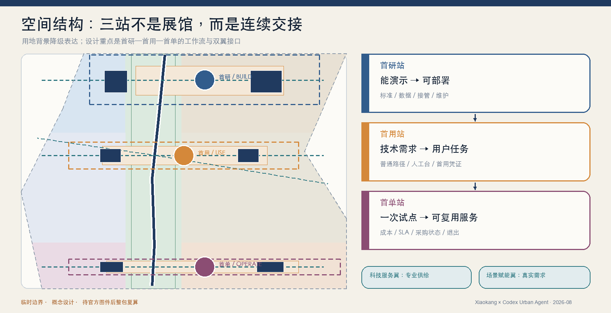

三层范围沿同一条工作链相互校正：产业判断必须找到空间载体，空间动作必须落到具体项目，重点区试验又会反过来修正产业与运营假设。所有面积、比例、规模和数量都从同一组图层复算；没有资料支撑的控制指标保持待定，不用一个看似精确的数字掩盖现场未知 [data:geometry/site_boundary.geojson#SITE-001] [data:geometry/key_areas.geojson#PROV-KEY-001]。

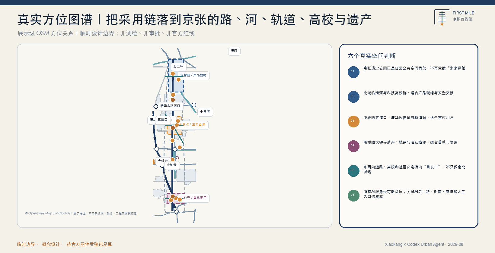

这张图把采用链从抽象箭头落到真实城市关系：北段邻清河与科技高校群，适合产品就绪和安全交接；中段邻五道口、清华园旧址与轨道站，适合首位用户与高校—社区共测；南段邻大钟寺遗产、轨道与日常商业，适合验收、首单和复用。东西向道路、高校、社区与站点共同形成横向“首发口”，因此首发线不是只供参观的南北游线。底图来自已登记的 OSM 展示级方位数据，重点区仍为 provisional constraint，不用于测绘、红线、工程或审批 [source:OSM-CONTEXT-2026] [assumption:A-CONTEXT-MAP-001]。

本方案的总体概念是“京张首发线 / JINGZHANG FIRST MILE”。“第一公里”指 AI 离开实验室后最容易断裂的阶段，常见断点有四个：真实问题没有明确负责人；原型可以演示，却没有普通用户完成任务的证据；试点有曝光，却缺少运营交接、采购路径和重复使用；技术团队撤场后，空间、服务和责任也随之消失。

京张首发线建设一套城市级首发操作系统，让一个 AI 产品依次获得**首位真实用户、首个可运行场景、首笔可核验订单、首次复用扩散**。众智园承担“首研站”，把算法原型变成有标准、有边界、可部署的产品；北京 AI 原点社区承担“首用站”，让高校、创业者、居民与一线运营者共同完成首轮真实任务；大钟寺承担“首单站”，把通过验证的服务接入企业采购、商业运营和跨区复制。中关村科技服务翼提供知识产权、合规、数据、资本和采购辅导，小月河场景赋能翼提供有问题所有者、有基线、有人工兜底的真实场景。该结构是概念建议，不代表政府采购、资金安排或实施承诺 [source:CASE-HAIDIAN-AI-DISTRICTS-2026] [source:CASE-BEIJING-SCENE-OPENING-2026]。

### 原创识别系统：“首程门 / First-Mile Gate”

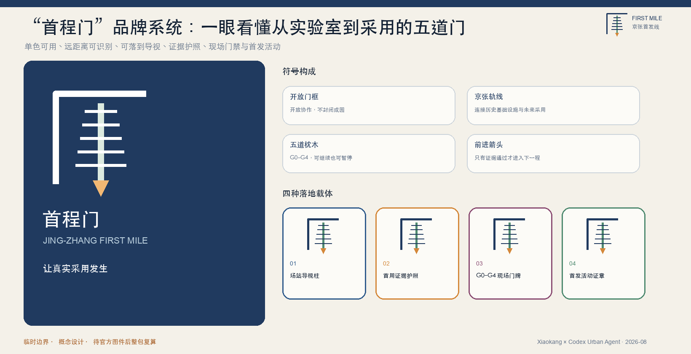

“首程门”把方案的运营纪律压缩成一个可被记住、也能被执行的符号：开放门框表达公共开放；贯穿的轨线连接京张工程遗产与今天的采用流程；五道横向枕木对应 G0—G4，表示每一步都可以继续，也允许暂停；向前箭头表示证据通过后才能进入下一程。标识采用自有绘制的单线系统，不依赖第三方商标，可用于场站导视柱、首用证据护照、G0—G4 现场门牌和首发活动证章。它的任务很具体：让公众和运营者在现场看见“当前在哪一道门、由谁负责、如何退出”。

首发流程由五道门组成，完整数量登记为 [metric:launch_gate_count]：

| 门禁 | 必须回答的问题 | 最小证据 | 未通过时的处理 |
| --- | --- | --- | --- |
| G0 真实问题 | 谁正在承受什么成本，谁有权定义问题 | 具名问题所有者、现有服务基线、受影响人群 | 不进入方案征集 |
| G1 产品就绪 | 原型是否在限定范围内安全、合规、可维护 | 数据清单、模型边界、人工接管、维护责任 | 退回众智园补证 |
| G2 首次使用 | 普通用户能否在真实场景完成任务并无损退出 | 任务完成、误导/投诉、非数字替代、现场记录 | 暂停并修订，不做宣传 |
| G3 首次采用 | 运营方是否愿意接管，成本和责任是否成立 | 培训签收、服务等级、成本区间、采购/合作状态 | 保留为研究原型 |
| G4 首次复用 | 换地点、换团队后是否仍产生公共或经营价值 | 复用包、版本差异、重复使用、退出复原 | 不扩大范围 |

空间结构采用“一线、三站、双翼、多点首发场景”。一线承担研发—采用—运营—复用的工作流；三站是完成连续交接的城市工作面；双翼分别接入专业服务供给和真实需求。所有空间动作仍为可供专业团队深化的概念建议。

区域协作先说明输入与输出。北纬社区可为首研站带来早期团队，并接收产品就绪包；未来科学城与怀柔科学城可带来科研成果，并接收面向真实城市任务的验证证据 [source:HAIDIAN-AI-NORTH-LATITUDE-2025] [source:BEIJING-THREE-CITIES-ONE-ZONE] [source:BEIJING-HUAIROU-2026]。

经开区可带来制造和产业场景，并接收经过运营验证的规模化服务；京津冀协作节点可提出跨区真实需求，并接收记录差异条件、培训、SLA 和退出方式的复用包。以上均为建议接口，不代表已建立合作 [source:BEIJING-ETOWN-AI-2026]。

| 层级 | 设计问题 | 方案回答 | 数据落点 |
| --- | --- | --- | --- |
| 统筹研究范围 | AI产业生态和未来城市形态如何组织 | 建立“问题发现—产品就绪—首用采用—运营交接—复用扩散”的首发链 | `compliance_matrix.json`、`standard_matrix.json` |
| 总体设计范围 | 产业空间、城市更新、交通市政和风貌如何落图 | 用地、建筑、道路、绿地、公共空间和分期共同承载首发工作流 | [data:geometry/land_use.geojson#LU-001] [data:geometry/roads.geojson#ROAD-001] |
| 重点区域范围 | 三处片区如何形成连续交接 | 首研站解决产品就绪，首用站解决真实采用，首单站解决运营与复用 | [data:geometry/key_areas.geojson#PROV-KEY-001] [depth:three_key_area_detailed_design] |

## 统筹研究范围产业与未来城市研究

海淀不缺高校、模型、人才、资本和发布活动，真正稀缺的是把这些要素变成**可被真实使用、能够交给别人运营、并可在别处复用的产品化能力**。因此，统筹研究的对象不是企业数量的静态盘点，而是四类断点：需求没有负责人、产品没有采用证据、试点没有运营交接、示范没有市场或公共采购路径。北京 2026 年场景工作已提出需求、能力、示范项目“三张清单”，并把首试首用、合作创新采购和形成市场订单放在同一条转化链上；本方案把这条政策方向翻译为空间与运营机制，不把它写成已获批准的项目安排 [source:CASE-BEIJING-THREE-LISTS-2026]。

### 七个全球案例：从测试能力转向采用能力

| 案例 | 已验证的机制 | 对京张的转译 | 不照搬的条件 |
| --- | --- | --- | --- |
| 新加坡榜鹅数字园区 ODP | 数字孪生先做虚拟测试，再进入真实园区 | 众智园设置“模拟—限域—真实”三级产品就绪环境 | 国家级数据和平台权限不可假定 |
| 赫尔辛基 Mobility Lab | 企业、研究机构、城市和居民共同测试，并以新业务与跨城扩展为目标 | 场景不是参观项目，必须记录采用与复用证据 | 港口交通条件不可直接类比 |
| Test in Tallinn | 城市作为单一入口，协助对接部门、场地、数据、居民和服务单位 | 建立“京张首发窗口”，减少团队逐部门寻找入口的成本 | 法律豁免和城市授权需本地确认 |
| Boston New Urban Mechanics | 市政府内部小团队成为社区问题与初创原型之间的前门 | 首发运营团队从问题定义和居民关系开始，而非从设备采购开始 | 不复制其行政组织架构 |
| Toyota Woven City | Inventors 与居民/访客共同持续反馈，覆盖构思、验证和改进 | 把居民、店员、物业和基层服务者定义为共同开发者 | 私有测试城市的权限不可移植 |
| 欧盟实验空间与创新采购 | 沙盒、测试床、生活实验室和创新采购共同推动 lab-to-market uptake | G3 把运营交接、采购状态和成本证据列为扩大前置条件 | 不套用欧盟法律程序 |
| 北京场景开放机制 | 需求、能力、示范项目三张清单衔接首试首用和市场订单 | 建立“问题单—能力卡—首发凭证—复用包”本地工作流 | 不虚构采购金额、入选或政府背书 |

案例只支撑方法判断，不支撑法定空间控制。新加坡与赫尔辛基说明测试基础设施必须降低从虚拟验证到真实部署的成本 [source:CASE-PUNGGOL-ODP] [source:CASE-HELSINKI-MOBILITY-LAB]；塔林与波士顿说明城市需要一个能找到责任部门、场地、居民和运营者的“前门” [source:CASE-TALLINN-TESTBED] [source:CASE-BOSTON-URBAN-MECHANICS]；Woven City 与欧盟实践进一步说明，持续用户反馈、合规支持和创新采购共同决定原型能否走出试验 [source:CASE-WOVEN-CITY] [source:CASE-EU-EXPERIMENTATION-PROCUREMENT]。

### 京张首发操作系统

首发线用四份公开、可移交的工作对象连接三区两翼：

1. **首发任务单**：记录问题所有者、目标用户、当前流程、非 AI 基线、空间条件、数据边界和预算状态。
2. **假设与证据账本**：每项声称写明来源、期间、状态、边界、下一步和停止条件；模拟数据永远不能冒充经营或公共服务结果。
3. **城市首发凭证**：完成一次试点后记录版本、地点、人群、人工接管、缺陷、成本区间、责任人和是否允许复用。
4. **复用包**：包含接口、培训、服务等级、退出恢复、许可和“换地点后哪些条件必须重测”，避免把一次活动包装成规模化。

“京张首发控制台”是这套操作系统的现场界面：运营者可查看任务所在门禁、待补证据、暂停场景和仍可使用的人工服务；公众只看到经过脱敏且与自身权利有关的信息。控制台优先呈现现实状态、责任关系和长期记录，不把设计方法写成赛事事实或官方证据 [standard:PROJECT-AGENT-OPEN-CALL-TASKBOOK] [depth:overall_spatial_structure]。

### 众智园全栈自主创新体系：六层证据栈

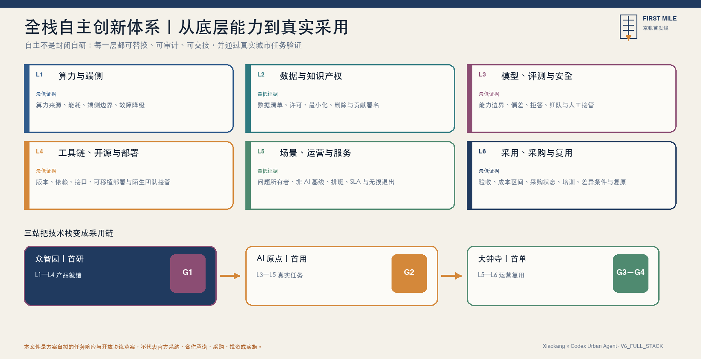

“全栈自主”要求关键能力**可替换、可审计、可交接、可降级**，并不追求所有硬件和模型的封闭自研。六层从算力与端侧、数据与知识产权、模型评测与安全、工具链开源与部署、场景运营与服务，直到采用采购与复用。每一层都定义最低证据：数据层说明许可、最小化和删除；模型层说明能力边界、红队和人工接管；工具层让陌生团队完成部署；运营层保留非 AI 基线、排班和 SLA；采用层记录验收、成本、采购状态、培训和退出复原。

众智园承担 L1—L4 的产品就绪和 G1 出口，AI 原点用真实任务复核 L3—L5 并通过 G2，大钟寺复核 L5—L6 的运营、首单与复用条件并通过 G3—G4。任何底层技术领先都不能越级替代用户完成、运营接管或采用证据；反过来，一次满意体验也不能掩盖许可、安全或维护缺口。六层栈的结构化定义保存在 `visual/assets/taskbook-strategy-crosswalk.json`，现阶段是可供专业团队和生态伙伴深化的开放草案，不代表已有国家平台、企业或政府同意采用 [source:AGENT-TASKBOOK] [assumption:A-PILOT-001]。

统筹研究不新增伪精确红线。产业策略最终必须回接用地、公共空间和服务设施，并在 official geometry 补齐后统一复算 [standard:MOHURD-URBAN-DESIGN-MEASURES] [data:geometry/land_use.geojson#LU-001] [data:geometry/public_space.geojson#PUBLIC-001]。

## 总体设计范围城市更新与控规深度城市设计

总体设计把首发工作流翻译成一套可检查的空间机制：连续且不重叠的概念用地、六处功能载体、贯穿南北的工作脊、横向慢行联系，以及与三站同步的实施分期。它们共同回答“在哪里发生、谁来使用、怎样交接”。总图负责说明空间组织，专业结论仍由后续专项设计完成 [standard:MOHURD-CONTROL-DETAILED-PLANNING] [data:geometry/land_use.geojson#LU-001] [depth:land_use_layout]。

建筑基底和道路图层用于核对承载位置与交通关系，面积和数量从同一套数据复算 [data:geometry/buildings.geojson#BLDG-001] [data:geometry/roads.geojson#ROAD-001] [metric:building_footprint_area_sqm]。建筑高度、开发强度、道路红线、退线和设施标准仍待正式控规与现场资料确认，不以推测数字替代专业条件。

首发线以五类可逆空间组件承接工作流：临街首层的**首发窗口**受理问题与团队；共享建筑内的**产品化工位**完成标准、数据、合规和运营设计；公共空间中的**首用房间**完成小规模真实任务；大钟寺的**首单客厅**支持采购咨询、服务签约和复用路演；全线的**证据站牌**显示项目状态、人工入口和退出方式。它们优先利用既有首层、园区公共界面、桥下与边角空间，新增建筑、设备点位和工程量均待 official geometry、权属、消防和市政条件确认 [data:geometry/buildings.geojson#BLDG-001] [depth:land_use_layout]。

## 重点区域详细设计

三处重点区各有一项主要责任：众智园负责产品离开实验室前的准备，AI 原点负责普通人的第一次真实使用，大钟寺负责运营接管、首单和跨区复用。三站共享一套门禁，任务彼此衔接、不能互相替代 [data:geometry/key_areas.geojson#PROV-KEY-001] [data:geometry/key_areas.geojson#PROV-KEY-002] [depth:three_key_area_detailed_design]。

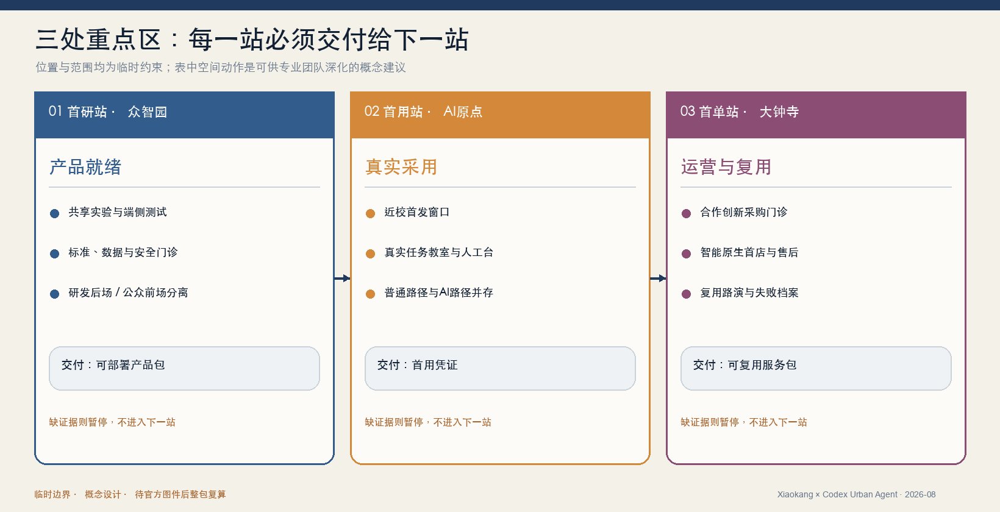

每一站都同时落到功能载体、公共空间、慢行联系和首期项目。现阶段范围只用于比较三站的空间关系；正式落位仍需补齐红线、现状建筑、权属、交通、市政、消防和文保资料 [data:geometry/key_areas.geojson#PROV-KEY-003]。

| 重点片区 | 首发角色 | 空间动作 | 必须完成的交接 | 证据引用 |
| --- | --- | --- | --- | --- |
| 众智园AI自主创新加速区 | **首研站 / Build & Ready** | 以共享实验、端侧测试、标准门诊和清河低碳公共界面组成产品就绪园；研发后场与公众试验前场分离 | 从“能演示”交付为有数据清单、失败边界、人工接管和维护方案的可部署产品 | [data:geometry/key_areas.geojson#PROV-KEY-001] [depth:three_key_area_detailed_design] |
| 北京AI原点社区 | **首用站 / Use & Adopt** | 以近校首发窗口、真实任务教室、居民/运营者共创桌和连续慢行链组成采用社区 | 从“技术团队定义需求”交付为用户完成任务、运营者愿意接管、普通路径仍可使用的首用凭证 | [data:geometry/key_areas.geojson#PROV-KEY-002] [source:AGENT-TASKBOOK] |
| 大钟寺AI产业聚集区 | **首单站 / Operate & Scale** | 以轨道四象限缝合、智能原生首店、合作创新采购门诊、复用路演厅和夜间服务街组成市场接口 | 从“一次试点”交付为有成本、服务等级、合同/采购状态、培训和退出条款的复用包 | [data:geometry/key_areas.geojson#PROV-KEY-003] [metric:key_area_count] |

三站的成败取决于交接是否完整：众智园不能把尚未产品化的原型直接送入公共空间；原点社区不能把一次好评写成市场需求；大钟寺不能把展示、意向或媒体曝光算作订单。每次跨站交接都由上一站、下一站和受影响用户共同确认状态，失败项目也作为可复查的公共知识保留。

### 三处真实场地：每一处只回答一个无法替代的问题

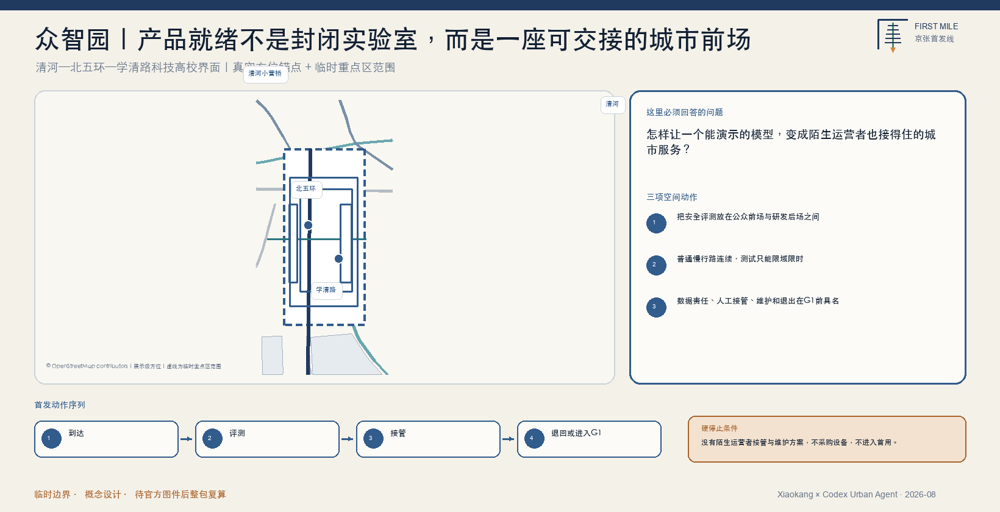

众智园在清河、京张遗址公园与北段高校之间设置“研发后场—可见测试场—安全交接台”，负责把原型整理成可部署产品。公共路径始终连续；没有数据责任人、人工接管和维护方案的原型，停在 G1 之前。

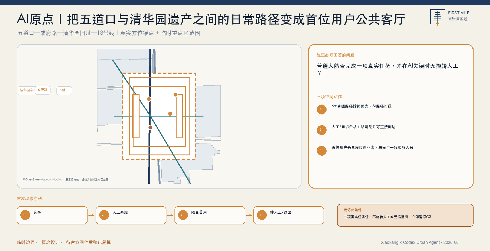

AI 原点把五道口、清华园旧址、轨道站和高校日常人流连接为“普通路径—可选 AI 路径—人工台—首位用户圆桌”。真实采用的标准不是围观，而是普通人完成任务、可纠错、可转人工、可无损退出。

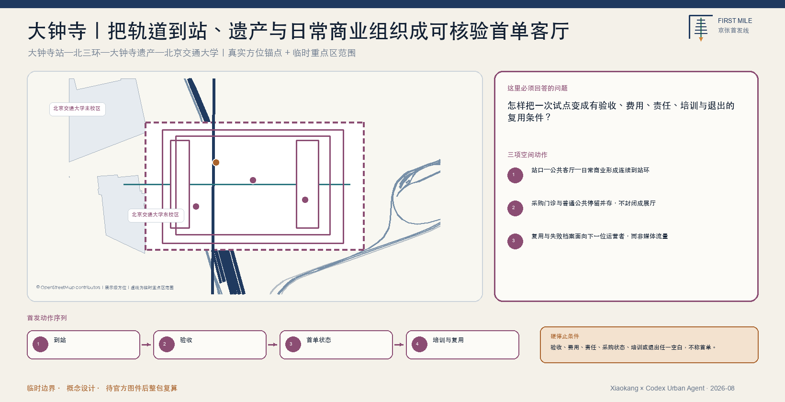

大钟寺把站口、遗产界面、公共客厅与日常商业组成连续到站环，让采购门诊、非消费停留、培训和复用档案共存。验收、费用、责任、采购状态、培训或退出任一空白，都不能把试点称为“首单”。三图的现场方位为展示级资料，精确落位仍须官方红线、现状测绘、产权、交通、消防、树木与文保专项复核。

### 从区域概念到可复核的尺度化模块

以下三张深化图采用**概念研究模块**，用于核对空间关系、最小尺寸、实施数量与停止条件；它们不是地块红线、现状测绘或施工图。模块落位前必须完成官方红线、产权、现状建筑、管线、树木、消防、交通、遗产与无障碍复核 [assumption:A-CONTROLS-001] [assumption:A-DESIGN-NODES-001]。

| 模块 | 研究范围与关键数量 | 公共空间底线 | 进入下一站前的停止条件 |
| --- | --- | --- | --- |
| 众智园产品就绪园 | 180 × 120 m（2.16 ha）；36 × 24 m 可见测试场；18 × 12 m 安全与数据门诊；18 × 12 m 运营交接实验室；12–20 m 生态缓冲 | 6 m 普通公共路径连续，研发后场与公众试验前场分离 | 无数据责任人、人工接管或维护方案，不进入 G1，不采购设备 |
| AI 原点首用社区 | 160 × 110 m（1.76 ha）；Ø18 m 首位用户圆桌；12 × 6 m 人工/申诉台；18 × 8 m 限量首发窗口 | 6 m 普通路径优先，3 m AI 路径可选，任何人均可无损退出 | 三项真实任务任一无法转人工或退出，立即暂停 G2 首用 |
| 大钟寺首单客厅 | 200 × 160 m（3.20 ha）；24 × 12 m 采购门诊；30 × 18 m 首单厅；24 × 12 m 复用/失败档案；6 m 到站环 | 轨道到站、路口缝合与非消费停留连续；遗产缓冲宽度保持待定 | 验收、费用、责任或退出条款任一空白，不得把试点称为首单 |

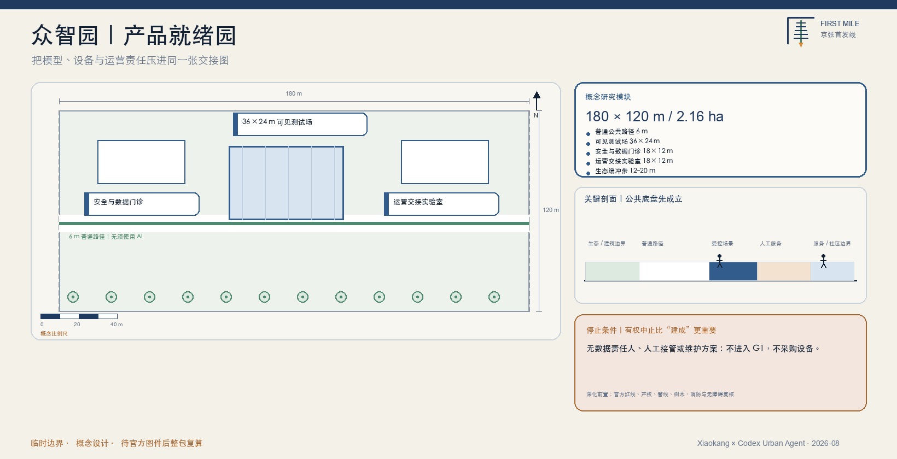

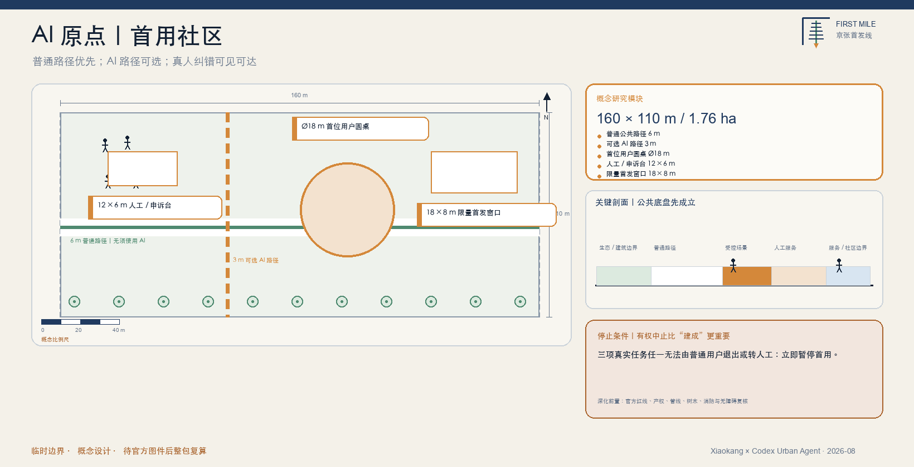

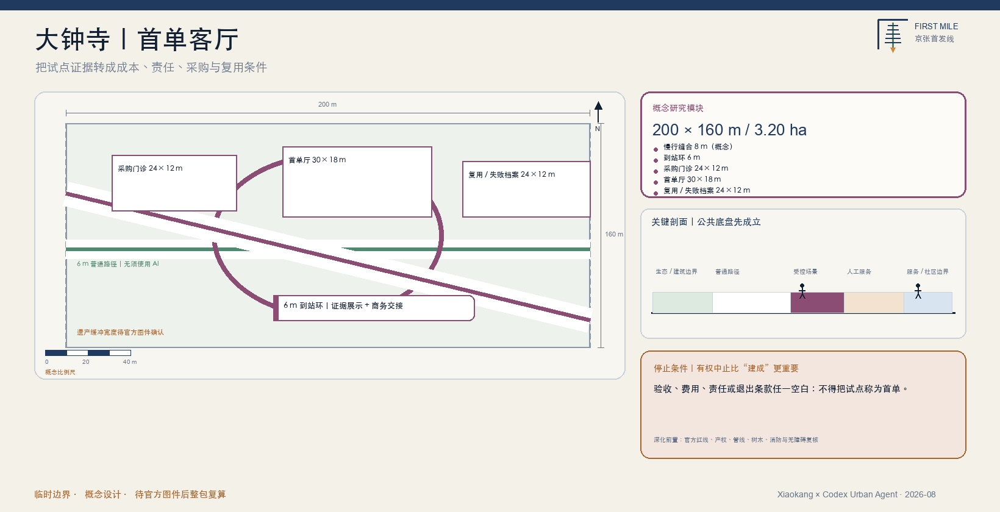

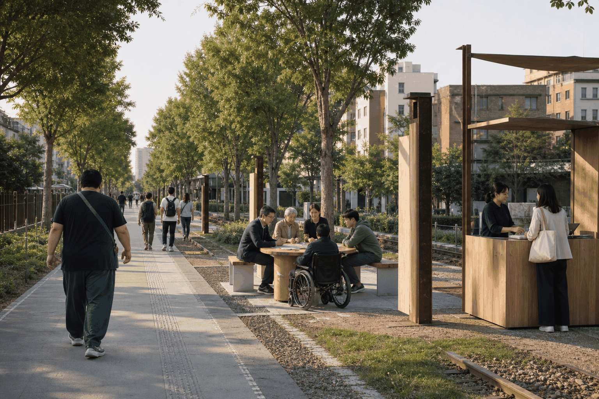

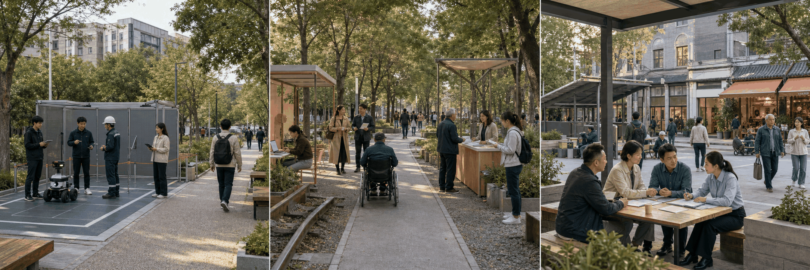

三处旗舰体验遵守同一条公共空间底线，却有不同的主角：众智园由安全员和研发者共同完成可见交接；AI 原点由普通居民、残障使用者和一线服务人员共同完成真实任务；大钟寺由小团队、运营者与采购咨询人员把一次试点写成可验收、可培训、可退出的复用条件。图像只用于表达人的尺度、日常性、无障碍和人工在场，不证明现状、访谈、合作或建成效果 [source:FIRST-MILE-THREE-SCENES-IMAGEGEN-2026] [assumption:A-TRIPTYCH-001]。

## AI 创新生态、人才画像与 AI+ 场景

### 都市 AI 生活体验带：一天四类真实任务

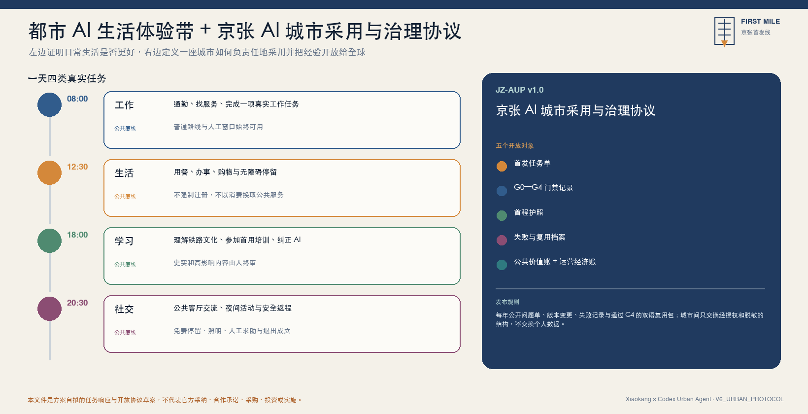

生活体验带以普通人在一天里能否**更顺利完成真实任务，同时保有选择权**来衡量活力。08:00 的工作链检查通勤、找服务和完成工作任务；12:30 的生活链检查用餐、办事、购物与无障碍停留；18:00 的学习链检查铁路文化理解、首用培训与纠错；20:30 的社交链检查公共客厅、夜间活动与安全返程。每条链先保证不依赖 AI 的公共底线，再把 AI 作为可选增强。

这条昼夜链把“活力”从活动数量转成四类可观察结果：任务是否完成、人工是否可达、退出是否无损、公共空间是否仍可免费使用。日间由三站窗口、慢行系统和首用房间承载，夜间只开放具备照明、值守、求助、撤场和噪声管理条件的场景；不因技术测试削弱老人、儿童、残障人士、无智能手机者和不愿授权数据者的日常权利 [data:geometry/public_space.geojson#PUBLIC-001] [depth:public_service_municipal_infrastructure]。

六类人物沿同一条首发链协作，方案用真实任务和权利边界描述他们，而不以参观人数代替用户价值。数量登记为 [metric:persona_count]：

| 用户画像 | 真正任务 | 空间响应 | 不可跨越的边界 |
| --- | --- | --- | --- |
| 高校研究者与开源开发者 | 把论文/代码变成可被别人部署的产品 | 众智园产品化工位、原点首发窗口 | 科研成果、许可证和贡献署名必须清楚 |
| 初创团队与独立开发者 | 找到第一位真实用户和第一个付费/采购机会 | 三站快速通道、共享测试与首单门诊 | 不以入驻、路演或意向冒充订单 |
| 场景开放方与企业客户 | 用可控成本解决真实业务问题 | 首发任务桌、采购咨询和复用路演厅 | 必须具名问题所有者、预算状态和验收责任 |
| 一线运营者与店员/物业 | 在日常流程中接管、纠错和维护服务 | 可见人工台、培训室、运营控制台 | 无培训、排班和停止权不得上线 |
| 周边居民及老人、儿童、残障人士 | 安全完成通勤、办事、消费和休闲任务 | 普通路径与 AI 辅助路径并存的首用房间 | 不做人脸默认识别，不削弱非数字服务 |
| 投资、法务、标准与数据服务者 | 判断产品是否值得继续投入和如何合规扩展 | 中关村科技服务翼的联合门诊 | 专业建议不替代审批，利益冲突需披露 |

### 十二张场景卡：从真实任务走到可验收结果

场景总数登记为 [metric:scenario_card_count]。每张卡都从一个真实任务开始，同时写清问题所有者、非 AI 基线、最小数据、人工接管、运营主体、成本状态、成功指标和停止条件。

| # | 场景与空间 | 首发价值 | 人工与退出边界 |
| --- | --- | --- | --- |
| 01 城市问题首发台—原点社区 | 居民、企业和基层运营者发布可验证任务，而非技术团队自拟需求 | 人工主持合并重复问题；未认领也说明原因 |
| 02 模型上街前评测—众智园 | 测事实、偏差、鲁棒、版权、隐私和拒答，形成产品就绪凭证 | 专业人员终审；严重错误阻断 G2 |
| 03 智能体运营交接舱—众智园 | 陌生运营者在无开发者帮助下完成部署、暂停、恢复与导出 | 无法独立接管即退回 G1 |
| 04 AI 创业服务 Copilot—原点社区 | 帮创业者找政策、空间、算力、人才和场景，并检验一次办成 | 只导航公开信息；真人服务台可推翻和更正 |
| 05 无障碍慢行任务链—遗址公园 | 发现断点、形成维修工单并验证闭环，而非只推荐路线 | 保留纸面/电话报障；安全误导立即停用 |
| 06 多语铁路文化导览—全线 | 让国际访客理解京张工程史、中关村创新史和 AI 首发机制 | 史实人工审校；不跟踪个人游览轨迹 |
| 07 公共空间微气候助手—清河/小月河界面 | 把环境数据变成可执行的遮荫、补水和活动调整建议 | 园林与现场人员决策；不得采集个人身份 |
| 08 低速服务机器人首用道—小月河场景翼 | 验证末端配送/巡检在真实慢行空间的安全与运营成本 | 限域、限时、低速、现场安全员和一键停机 |
| 09 智能原生首店—大钟寺 | 在真实消费中验证商品理解、售后、人工服务和重复使用 | 禁止画像定价；现金/人工服务始终可用 |
| 10 合作创新采购门诊—大钟寺 | 把验收指标、成本区间、责任、知识产权和退出写进采购前文件 | 不承诺中标或资金；采购和法务人员人工复核 |
| 11 首发控制台—三区运营中心 | 公开项目所处门禁、责任人、证据缺口、暂停与到期状态 | 对公众脱敏；高影响决定禁止自动化 |
| 12 复用路演与失败档案—大钟寺/全线 | 只展示可复用包、差异条件和失败教训，连接跨区采用方 | 不以传播量替代复用；参与者可选择不署名 |

其中 02“模型上街前评测”、03“智能体运营交接舱”和 08“低速服务机器人首用道”构成三类产业测试验证场，数量登记为 [metric:industry_test_scenario_count]。三者分别回答技术是否可靠、运营是否接得住、物理场景是否安全；任一项通过都不能替代另外两项。

### 三个 AI 朝圣地标：让交接、首用与公开学习被看见

1. **百年首程碑 / First-Mile Zero**：把詹天佑自主工程精神与 AI 产品走完第一公里并置；历史内容须经专业审校。
2. **首用者长桌 / First User Table**：记录居民、店员、物业、开发者和专业审查者共同完成的可核验改进，不设置商业排行榜。
3. **失败与复用信号塔 / Fail & Scale Signal**：公开哪些项目暂停、为何停止、后来怎样被修正和在何处复用。

三个地标数量登记为 [metric:ai_pilgrimage_landmark_count]，均采用可逆、可拆卸、无障碍的概念组件；精确点位、规模、文保关系和建设条件待 official geometry 与专业团队确认 [data:geometry/public_space.geojson#PUBLIC-001] [depth:blue_green_public_space]。

所有场景遵守数据最小化、可解释、人工复核、非数字替代和可退出原则。城市智能体可以辅助整理信息和提出建议，但不能替代规划审批、采购决定、医疗/法律判断或对个人权益有重大影响的决定；未经授权的个人画像和“已经获得政府实施承诺”的表述均禁止进入公开成果。

## 用地、建筑规模与拆改留方案

用地图层采用完整、闭合且无重叠的概念分区，便于在同一范围内比较产业、公共空间与服务设施的比例。六处建筑基底只是功能载体：它们提示产品就绪厅、首用房间、服务门诊、首单客厅和运营支持可以从哪里开始研究，不代表现状建筑测绘或拆除决定 [standard:MNR-LAND-USE-CLASSIFICATION-GUIDE] [data:geometry/land_use.geojson#LU-001] [data:geometry/buildings.geojson#BLDG-001]。

拆改留遵循一个保守顺序：先保留仍可使用的建筑和普通公共服务，再测试低干预的室内与界面改造；只有安全、权属、公共价值和全生命周期碳排证据都成立时，才讨论替换。容积率、高度、密度、退线和精确容量待正式控规与现状调查补齐 [depth:height_massing_character] [depth:retain_renovate_demolish] [metric:building_footprint_area_sqm]。

## 交通、轨道、市政与公共服务设施

交通策略先补最影响日常使用的断点：三站之间依托遗址公园慢行骨架连接，东西向缝合高校、社区和轨道站；优先处理步行中断、无障碍连续、非机动车停放、轨道换乘和低速测试边界，再讨论新增车行容量。任何 AI 辅助路线都保留普通导视和人工服务 [depth:traffic_rail_slow_parking] [data:geometry/roads.geojson#ROAD-001] [data:geometry/public_space.geojson#PUBLIC-001]。

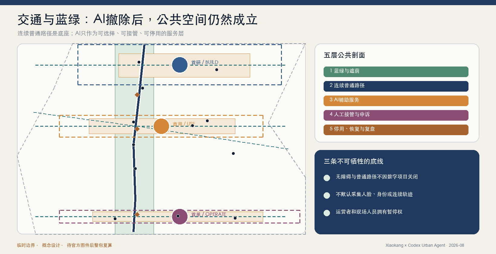

截至 2026 年 7 月，北京市园林绿化部门已公布京张铁路遗址公共空间二期配套工程完工，北段约 30.01 公顷，并形成南北、东西“鱼骨状”慢行联系；一期 2.5 公里公共空间此前已开放，保留铁轨、道岔和站房等铁路遗存 [source:JZ-PARK-PHASE2-COMPLETE-2026] [source:JZ-PARK-PHASE1-2023]。本方案沿用这套已建成的公共空间骨架，叠加四类轻量、可撤除的采用服务：首发窗口、证据站牌、人工接管点和限定时空的 AI 辅助路径。既有公共空间不计作本方案新增成果；关掉 AI 后，路仍通、树仍荫、座椅仍可用。

产业服务、人才服务、端侧算力和分布式能源优先共享可调整的既有载体，避免每个场景各造一套基础设施。管线、能源、排水、防洪和消防资料尚未齐备，因此本阶段只确定接口与复核清单，不预设工程容量 [depth:municipal_new_infrastructure] [data:geometry/constraints.geojson#CONSTRAINTS]。

## 蓝绿空间、公共空间与城市风貌

京张遗址公园是纵向公共脊，清河、小月河、高校、企业和社区形成横向接口。蓝绿网络同时服务步行、骑行、遮荫、休憩、运动、创新交流和受控测试；公共通行、免费停留与非消费使用始终优先于企业展示 [depth:blue_green_public_space] [data:geometry/green_space.geojson#GREEN-001] [data:geometry/public_space.geojson#PUBLIC-001]。

风貌表达把三种文化放在一起：京张工程史提供求真与自主的底色，中关村提供开放创新的日常，新的 AI 文化则强调责任交接和公开失败。导视、双语解说和公共艺术会明确区分经核验的历史内容与当代设计；文保缓冲、屋顶、建筑高度和立面控制没有专业依据时保持待定 [standard:MOHURD-URBAN-DESIGN-MEASURES]。

清华园车站旧址在官方文物名录中作为市级文物保护单位提供历史锚点，但本方案只把其作为导览与叙事参照，不推定保护范围、建设控制地带或工程许可 [source:QINGHUAYUAN-HERITAGE-2023]。图面中的道路、轨道、河流、站点与高校环境来自经简化的 OpenStreetMap 展示图层，并明确标注“非审批图”；其用途仅为帮助评审理解空间关系，不能替代官方地形、权属或控规底图 [source:OSM-CONTEXT-2026] [assumption:A-CONTEXT-MAP-001]。

## 更新项目清单、实施政策与分期计划

实施从八个小而可逆的项目开始，不用一座重资产展馆押注整条创新带。每个项目都写明首期交付物和扩大前置条件；权属、资金、责任主体或审批路径没有落实时，就停在研究和试点阶段 [depth:renewal_project_list] [depth:phasing_implementation] [data:geometry/phasing.geojson#PHASE-001]。

| 项目编号 | 项目名称 | 第一阶段交付物 | 扩大前置条件 | 证据引用 |
| --- | --- | --- | --- | --- |
| FM-01 | 京张首发窗口 | 三张清单受理规则、任务模板、公开状态页 | 具名运营主体、服务边界和申诉渠道 | [depth:renewal_project_list] |
| FM-02 | 众智园产品就绪园 | 模型评测、运营交接和端侧测试三类工位 | 安全、消防、数据、设备和维护专项核验 | [data:geometry/key_areas.geojson#PROV-KEY-001] |
| FM-03 | 原点首用社区 | 一条普通路径与 AI 路径并存的真实任务链 | 目标用户共测、现场运营、非数字服务保持 | [data:geometry/key_areas.geojson#PROV-KEY-002] |
| FM-04 | 大钟寺首单客厅 | 采购门诊、智能首店、复用路演与失败档案 | 采购状态、合同责任、成本和售后边界清楚 | [data:geometry/key_areas.geojson#PROV-KEY-003] |
| FM-05 | 京张慢行与横向缝合 | 断点清单、人工走测和低后悔微更新包 | 道路红线、桥下空间、交通和无障碍复核 | [data:geometry/roads.geojson#ROAD-001] |
| FM-06 | 清河—小月河蓝绿首用界面 | 微气候、休憩和受控场景共用的可逆节点 | 河道、生态、防洪和运营时段确认 | [data:geometry/green_space.geojson#GREEN-001] |
| FM-07 | 首发控制台与公开证据库 | G0—G4 状态、责任、到期、暂停、复用记录 | 数据分级、网络安全、公众脱敏和长期维护 | [data:geometry/constraints.geojson#CONSTRAINTS] |
| FM-08 | 全球 First Mile 城市联盟 | 双语复用包、年度失败复盘和跨城任务交换 | 合作方自愿加入、版权/数据许可、禁止虚构承诺 | [data:geometry/phasing.geojson#PHASE-001] |

### 首个 90 天：先验证一位真实用户

首期概念试点选择北京 AI 原点社区的“AI 创业服务 Copilot”：它只处理公开的政策、空间、算力、人才和场景信息，不替代审批或专业判断。G0 先由 5—8 名真实创业者和 2—3 名服务人员冻结三个高频任务及现有人工办理基线；G1 用清权资料和合成问题测试来源、拒答和真人转接；G2 在一个可见人工台旁开展限量首用；G3 由陌生服务人员完成接管演练；G4 只有当任务完成、人工兜底和复用包都通过后，才讨论复制到众智园或大钟寺。具体人数是研究招募建议，不是已完成样本或官方指标。

首期不采购机器人、不建设重资产展示厅、不采集人脸或连续轨迹，也不以回答次数、活动流量和媒体曝光作为成功。核心观察项是首位用户任务完成率、错误被人工纠正的时长、服务人员独立接管、再次使用意愿和退出是否无损；真实完成率、重复使用率和运营交接通过率尚待试点建立基线 [metric:first_user_task_completion_rate] [metric:repeat_use_rate] [metric:operator_handoff_pass_rate]。

G0 启动前，现场团队按随包提交的《现场验证包》（`visual/assets/field-validation-protocol.json`）走查普通路径、无障碍断点和人工服务距离，再用 12 个固定问题访谈招募对象，记录三项任务的人工基线时间、错误、转接和退出。参与者须知情同意，结果脱敏保存。5—8 名创业者和 2—3 名服务人员是**待招募目标**；当前尚无访谈结果，合成测试、内部评审和概念效果图均不计作用户证据。

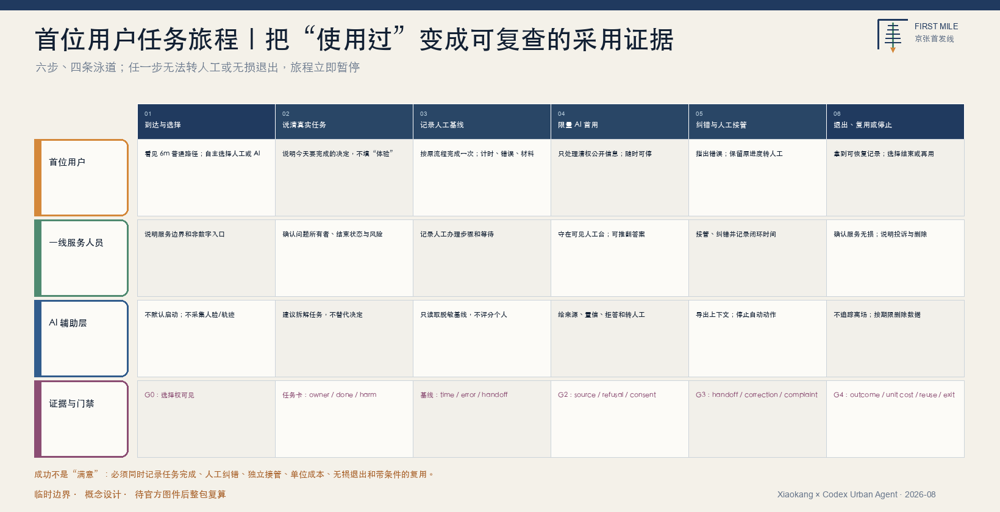

首位用户不是一个活动签到人，而是完成一项真实决定的人。六步旅程从“看见普通路径并自主选择”开始，依次冻结真实任务、人工基线、限量 AI 首用、纠错与人工接管，最后以无损退出、带条件复用或合法停止结束。成功不能只问满意度，必须同时记录任务完成、来源可追溯、人工纠错时长、陌生运营者接管、单位服务成本、无损退出和带条件的再次使用。

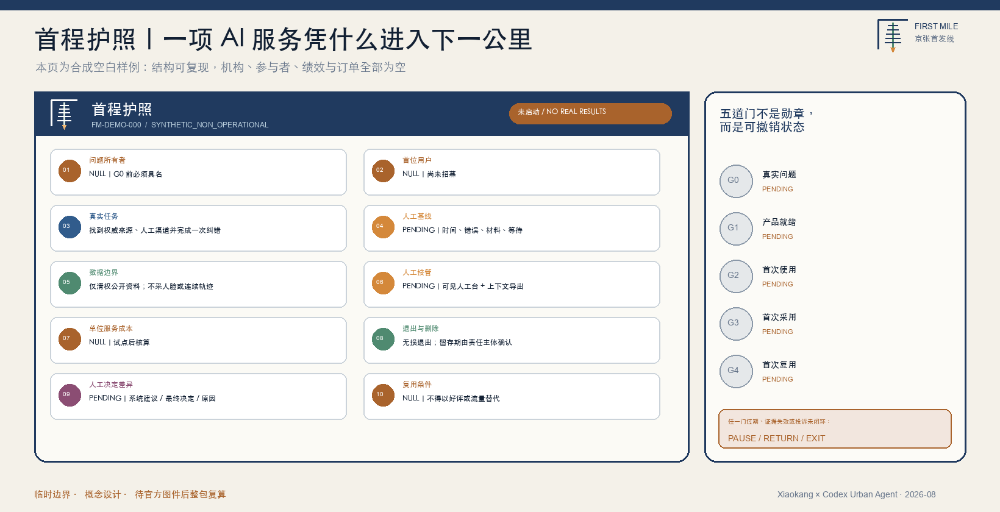

每个试点生成一份 `visual/assets/first-mile-passport.example.json` 所示的**首程护照**。它记录问题所有者、首位用户、真实任务、人工基线、数据边界、人工接管、单位成本、退出删除、人工决定差异和复用条件；G0—G4 都有期限，也可撤销。当前附带的是“合成示例，尚未运行”的空白护照，真实机构、参与者、绩效、复用和采购字段均为空。它用于验证记录与交接结构，不代表试点已经发生 [source:FIRST-MILE-PASSPORT-SAMPLE]。

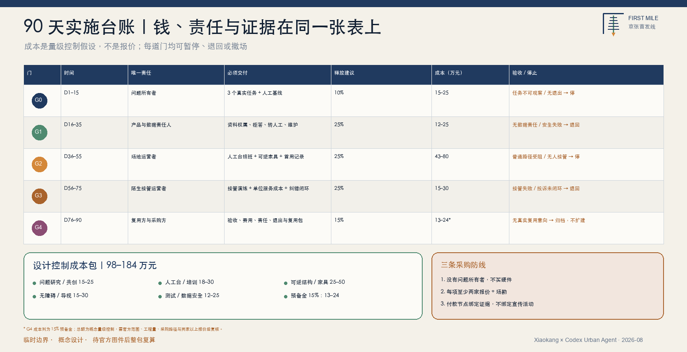

首期设计控制成本区间为 **98—184 万元**，包括问题研究/共创 15—25 万、人工服务台与培训 18—30 万、可逆结构/家具 25—50 万、无障碍与导视 15—30 万、测试与数据安全 12—25 万，以及 15% 预备金约 13—24 万。该区间仅是 90 天试点的**概念级量级控制假设**，不是报价、财政预算或投资承诺；正式决策必须补齐官方范围、工程量、场勘、采购路径和每项至少两家报价 [assumption:A-COST-ENVELOPE-001]。建议把资源释放与 G0—G4 证据门绑定为 10% / 25% / 25% / 25% / 15%，实际合同支付节点仍由实施主体依法确定。

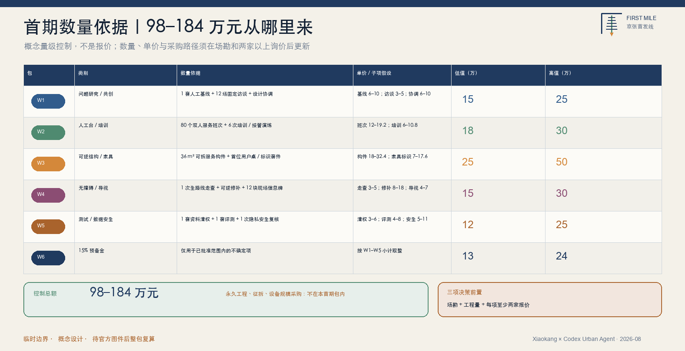

成本区间由 `visual/assets/pilot-bom.json` 的数量依据推导：1 套人工基线、12 场固定访谈、80 个双人服务班次、6 次培训/接管演练、36 平方米可拆服务构件、1 套首位用户桌与现场标识、1 次全路线无障碍走查、12 块信息牌，以及资料清权、评测和隐私安全各 1 套。数量和单价仍是方案比选假设；永久工程、征拆、市政迁改和设备规模采购不在本首期包内，场勘、工程量、采购路径和两家以上报价齐备后必须更新 [source:FIRST-MILE-PILOT-BOM]。

分期遵循“小额、可逆、先运营后建设”的资源纪律：第一阶段投入问题研究、人工服务、无障碍、安全和证据系统；第二阶段才投入设备与空间改造；第三阶段只扩大已被真实复用的服务。每项预算采用“类别—数量依据—价格来源—区间—批准状态”五列账；上述 98—184 万元仅用于首期方案比选，不外推为全线总投资，也不把设计建议写成财政承诺 [depth:phasing_implementation]。

年度活动服务于首发链的连续运行：春季发布城市问题单，夏季进行产品就绪挑战，秋季举办真实用户首用周，冬季公开失败、复用与退出账本。开发者社区按解决真实问题、维护公共组件和关闭缺陷获得认可；国际传播只输出双语案例、复用条件和失败教训。

## 长期运营与全球公共品牌资产

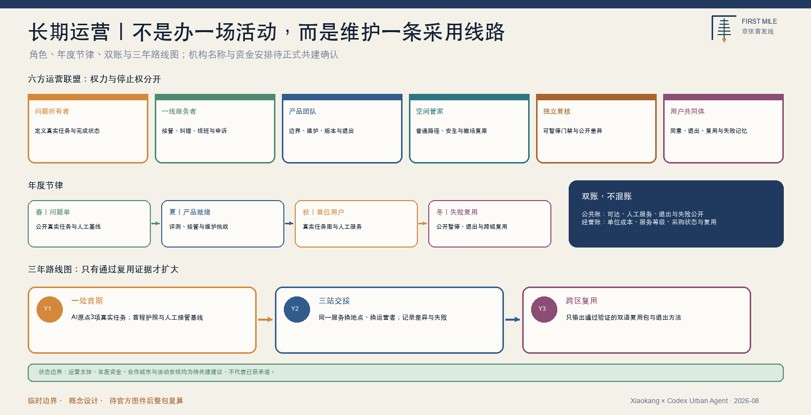

征集结束后，首发线仍需要明确的运营责任。建议由六方形成轻量运营联盟：问题所有者提出真实任务并保留停止权；产品团队维护版本与失败边界；现场运营者负责排班、接管和恢复；居民与首位用户参与定义成功与伤害；高校和专业机构提供评测、伦理、标准与清权；政府或平台运营方在权限内协调空间、规则和采购接口。项目状态须由多方证据共同确认。这是治理建议，不代表上述机构已经同意参与。

全年形成四次公开节点：春季问题单、夏季产品就绪、秋季首用周、冬季失败与复用账本。每个试点同时维护两本账：**公共价值账**记录谁完成了什么任务、是否公平可达、是否可退出；**运营经济账**记录人工、维护、单位服务成本、采购/合作状态和退出复原费用。第一年只证明一处场地、一类用户和一套运营班次；第二年只复制通过 G4 的服务，并记录换地点后必须重测的条件；第三年才以开放接口、双语复用包和城市间任务交换形成全球 First Mile 联盟。联盟成功不以城市数量计，而以可验证复用和公开失败质量计。

### JZ-AUP v1.0：把“全球话语权”做成可执行、可争论、可复用的协议

本方案将治理成果命名为**京张 AI 城市采用与治理协议（Jing-Zhang AI Urban Adoption Protocol，JZ-AUP v1.0）**。协议由五个可直接查阅的对象组成：首发任务单、G0—G4 门禁记录、首程护照、失败与复用档案、公共价值账与运营经济账。每个对象都记录版本、责任人、证据状态、暂停/退出方式和可公开范围；城市间只交换经授权、脱敏的结构与复用条件，不交换个人数据，一次通过也不会自动成为永久许可。

协议建议每年发布一次双语版本，公开问题单、规则变更、典型失败、退出复原和通过 G4 的复用包，并邀请用户、运营者、开发者和独立专业方提出异议。全球话语权来自一套能被其他城市复核、批评、改写和重新验证的方法。只有出现跨团队接管、跨地点重测和真实退出记录时，才能确认治理知识发生了复用。现阶段 JZ-AUP 是本方案提出的开放协议草案，不代表官方标准、国际组织认可或合作城市承诺 [source:AGENT-TASKBOOK] [standard:PROJECT-AGENT-OPEN-CALL-TASKBOOK]。

## 指标体系、面积复算与合规矩阵

空间指标直接从图层复算：临时总体设计范围约 11.41 平方公里，当前概念分区中的绿地比例约 15.27%，公共空间比例约 21.98%。这些数字用于同一范围内的设计比较，不是法定控制指标。场景卡、测试场、用户画像、服务分区、地标和门禁属于可以兑现的设计数量；容积率和真实运营成效则等待正式资料与试点结果 [depth:metrics_recalculation] [metric:site_area_sqm] [data:geometry/green_space.geojson#GREEN-001]。

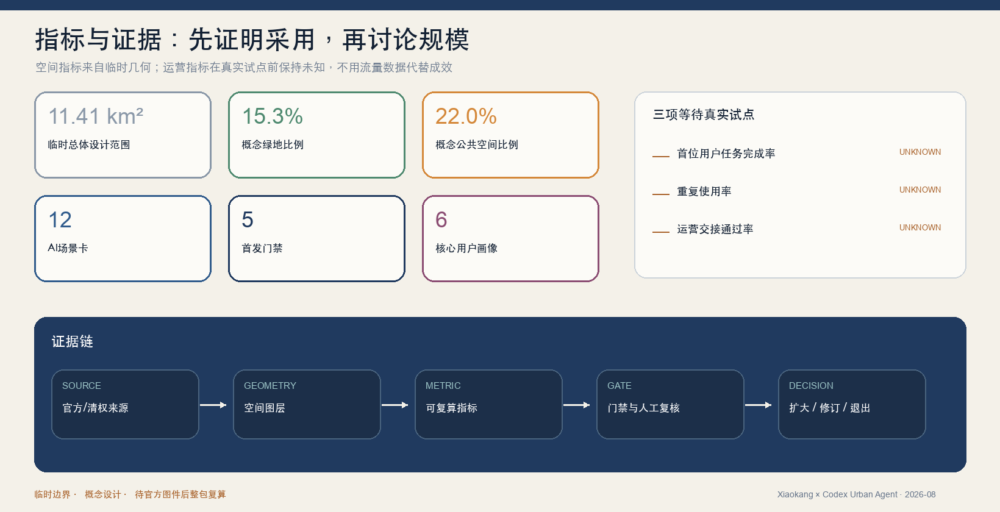

完整公式、来源、置信度和任务覆盖保存在结构化审计层。正文把数字分为三类：从图层复算的空间量、等待官方条件的控制量、需要运营持续记录的绩效量。三类数字分别标注，避免把愿景写成已落地成果。

首发线额外区分四层成效：技术层看错误、接管与安全；用户层看真实任务完成和无损退出；运营层看陌生团队接管、维护和服务等级；采用层看重复使用、采购/合作状态和跨区复用。任何单层高分都不能推出“项目成功”，尤其不得用测试次数、发布会人流或媒体传播替代真实采用。

## 风险、版权与合规说明

这是一份概念设计与治理机制提案，不把自身描述为官方成果，也不承诺审定控规、最终土地权属、建设规模、采购、资金或实施。总体边界、重点区红线、控规、道路、建筑、权属、市政、消防和文保条件尚有缺口，相关结论均保留复核入口 [depth:risk_missing_data] [data:geometry/constraints.geojson#CONSTRAINTS] [source:SITE-PACKAGE]。

方案还识别四项自身特有风险：一是把公共空间商品化为企业展厅，因此普通路径、免费停留和非消费使用必须优先；二是把“首单”误写为政府采购承诺，因此所有采购、资金和合同状态必须逐项标注；三是只服务头部企业，因此首发窗口应为高校团队、独立开发者和中小企业保留透明入口；四是运营烂尾，因此设备采购前必须落实人工排班、维护、到期复审和退出复原。任一关键责任人或退出资源缺失，项目停留在研究阶段。

中英文正文、图件、图册和离线网页保持对应；资产来源和版权状态在来源清单与版权声明中登记。设计者对事实、来源、版权、空间数据和指标负责，任何缺少证据的主张都可以被评审要求修订或删除。

## 参考资料

- brief/public-brief.md
- brief/site-package/design_brief.json
- brief/site-package/allowed_design_space.json
- brief/site-package/enums/
- brief/site-package/ranges/planning_limits.json
- data/processed/agent_fact_pack.md
- data/processed/project_scope_summary.csv
- data/processed/agent_task_requirements.csv
- data/processed/source_use_matrix.csv
- data/processed/missing_data_checklist.csv
- 本节书目入口依据场地包登记，完整出处和许可见结构化来源清单 [source:SITE-PACKAGE]
