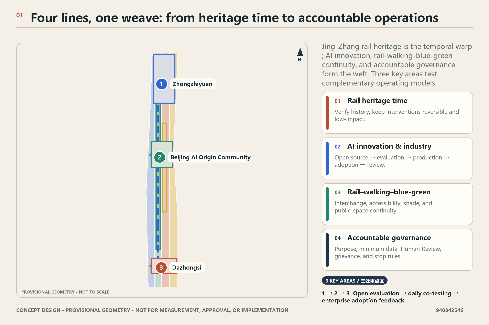
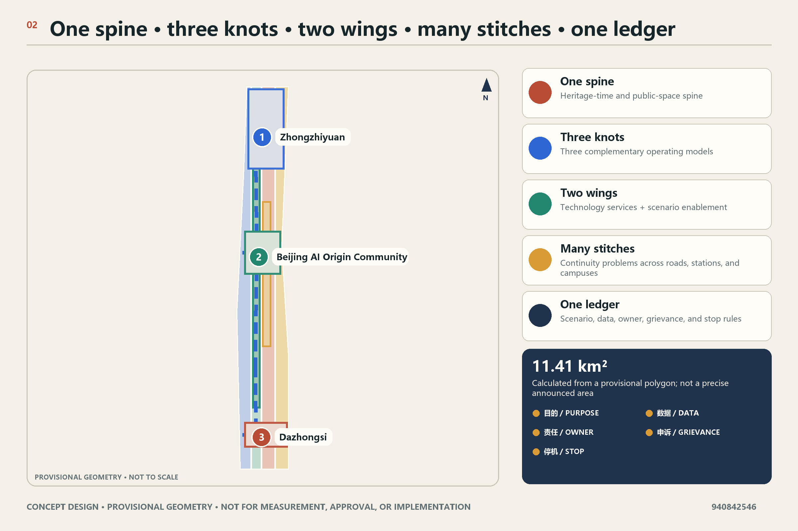
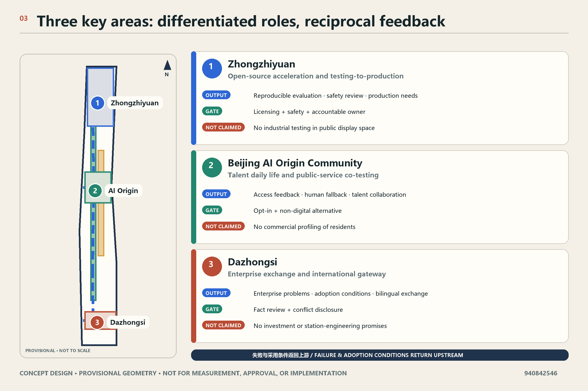
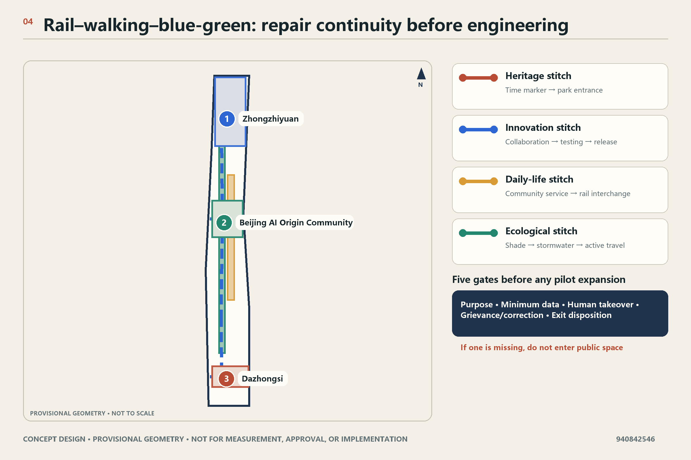
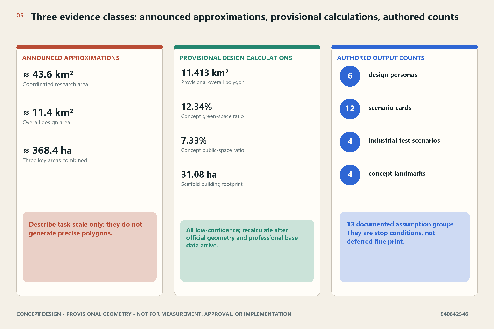

# Smart Rail Weaves the City

## Design Basis and Source List

“Smart Rail Weaves the City / 智轨织城” is neither a new rail line nor an approved construction project. “Smart Rail” is a design method: it interweaves the time line of Jing-Zhang railway heritage, the AI innovation and industry line, the rail–walking–blue-green public-realm line, and the accountable civic and operational governance line into a system that can be tested incrementally, reviewed publicly, and stopped when its conditions are not met. The official announcement establishes the project purpose, three-level scope, approximate areas, and design tasks; the rights-cleared Agent taskbook establishes branding, scenario, public-interest, and claim-boundary requirements. [source:OFFICIAL-ANNOUNCEMENT] [source:AGENT-TASKBOOK]

This draft uses only pinned local materials. The Source Registry classifies the official announcement and professional standards as formal evidence for their recorded uses and classifies the rough geometry as provisional-only. The announced approximately 43.6 sq km, 11.4 sq km, and 368.4 ha are therefore “official announcement approximate values,” while 11,412,825.386 sqm in the submitted GeoJSON is only a calculation from the provisional polygon. Neither is a substitute for an exact official boundary, parcels, road controls, municipal data, or ownership information. [source:SOURCE-REGISTRY] [source:PROVISIONAL-BOUNDARIES] [metric:site_area_sqm]

v0.1 uses four consistent classes of judgment:

| Type of judgment | Use in this draft | Must not be read as |
| --- | --- | --- |
| Official-announcement fact | Project name, textual scope descriptions and approximate areas, names of the three key areas, and design tasks | Exact polygons, approved Regulatory Detailed Planning, or confirmed implementation status |
| Provisional spatial constraint | Locating concepts in local GeoJSON, calculating temporary design quantities, and organizing figures | Official Planning Boundary, parcel, road redline, or engineering alignment |
| Conceptual design decision | Four systems, key-area roles, spatial components, operating gates, and conditional phasing | Government decision, funding commitment, investment-promotion commitment, or construction commitment |
| Pending professional confirmation | Regulatory planning, ownership, existing buildings, transport, utilities, heritage, ecology, fire safety, privacy, and operator responsibility | Completed survey, observed resident views, or obtained approval |

No residents, enterprises, authorities, or professional institutions were interviewed in this pass, and no project progress was observed. The personas below are design hypotheses for inclusion and service-process testing; they do not represent the views of any group. Building height, Floor Area Ratio, coverage, road redlines, underground space, utility capacity, investment, policy funding, responsible entities, and implementation timing all remain pending official information and professional procedures. [depth:existing_conditions_diagnosis] [depth:risk_missing_data]

## Three-Level Scope Framework

The three scope levels are not separate drawing sets but three decision scales. The Coordinated Research Area asks how the innovation ecosystem should collaborate; the Overall Design Area asks how the four systems support one another through Urban Renewal; the Key-Area Detailed Design Area asks how distinct operating models can be tested in spatial types. Announcement area values explain task scale only and are not used to derive exact boundaries or controls. [standard:PROJECT-OFFICIAL-ANNOUNCEMENT] [depth:three_level_scope_framework]

| Level | v0.1 decision | Primary output | Data limitation |
| --- | --- | --- | --- |
| Coordinated Research Area | Organize an innovation chain of open-source origination, testing, enterprise exchange, public services, and international communication | Industry and talent coordination, six benchmark mechanisms, and long-term operating rules | No complete industry, enterprise, population, or commuting dataset; no current rankings or counts are claimed |
| Overall Design Area | Form “four lines, one weave” through a heritage-time spine, innovation-node chain, walking/blue-green network, and governance ledger | Land-use method, public realm, rail access, renewal packages, and gated phasing | Uses a provisional overall boundary; all ratios are low-confidence conceptual design quantities |
| Three key areas | Establish three complementary, non-duplicative operating models | Zhongzhiyuan for open-source acceleration and test production; AI Origin for talent daily life and public-service co-testing; Dazhongsi for enterprise exchange and an international gateway | All three polygons are rough provisional ranges and do not support parcel design or precise area claims |

The four lines interlock through three kinds of “knots.” Spatial knots are station interfaces, heritage nodes, green commons, and shared ground floors. Industry knots are open-source release, Testing and Validation Scenarios, test production, and enterprise exchange. Governance knots are scenario registration, risk classification, Human Review, public grievance, and shutdown conditions. No line proceeds alone: industry facilities without walkability and public value do not enter public space; AI scenarios without accountable owners and exit mechanisms do not enter pilots; spatial concepts without official boundaries and engineering evidence do not become construction judgments. [standard:PROJECT-AGENT-OPEN-CALL-TASKBOOK] [depth:overall_spatial_structure]

## Coordinated Research Area: Industry and Future City Research

### 1. Overall concept and identity

The primary Chinese name is “智轨织城,” and the English name is “Smart Rail Weaves the City.” The identity direction uses four distinct yet interlaced lines: rust red for railway time and industrial memory, electric blue for open technology and industry validation, blue-green for walking and Blue-Green Space, and deep ink for rules, accountability, and audit. The Logo direction shows four lines crossing an abstract sleeper grid to form an open knot. It uses no corporate mark, portrait, or uncleared typeface and remains hierarchically distinct from heritage wayfinding. [source:AGENT-TASKBOOK] [standard:PROJECT-AGENT-OPEN-CALL-TASKBOOK]

The three positionings become operating relationships. The Centennial Jing-Zhang cultural belt provides the time narrative and reversible-intervention principle. The urban AI life-experience belt requires technology to improve everyday walking, service access, and non-digital fallback first. The AI-integrated innovation belt requires a loop among R&D, open source, validation, test production, exchange, and feedback. The five functions are not spread uniformly: each key area and wing has a primary role, linked by public space and the governance ledger.

### 2. Six global benchmark mechanism cards

The pinned local materials contain no verifiable international case dossiers. This draft therefore does not present any external city or institution’s performance as fact. v0.1 establishes six “benchmark mechanism cards” to be tied to five to eight named cases after rights-cleared sources are supplied. Until then, they are design references, not case-study findings.

| Benchmark mechanism | Transferable mechanism | Use in Smart Rail Weaves the City | Evidence still required |
| --- | --- | --- | --- |
| University-origin innovation district | Shared research facilities, translation services, and walkable daily collaboration | Near-campus collaboration and talent daily life in AI Origin | Official or primary sources for a named case |
| Open-source foundation ecosystem | Public contribution records, neutral governance, and maintainer support | Open-source acceleration and honor system in Zhongzhiyuan | Governance charter, license, and outcome evidence |
| Shared test-production and validation platform | Shared equipment, standards, safety rules, and booking for small teams | Zhongzhiyuan testing-to-production chain | Equipment, safety, fire, and responsibility evidence |
| Civic public-service living lab | Small-scale co-testing, human fallback, public feedback, and exit | AI Origin public-service co-testing | Ethics, privacy, accessibility, and service-operator evidence |
| Station-linked enterprise gateway | Transit access, launch and display, international services, and business support | Dazhongsi international gateway | Station, transport, ownership, and operating evidence |
| Public-interest data collaborative | Purpose limitation, data minimization, audit, grievance, and independent evaluation | Belt-wide governance ledger | Applicable law, data inventory, and accountable entity |

### 3. Innovation-ecosystem loop

The ecosystem follows an “open source–validation–test production–adoption–retrospective” loop. Zhongzhiyuan conceptually hosts the open stack, trusted evaluation, and small-batch test production. AI Origin hosts talent services, public services, and everyday co-testing. Dazhongsi hosts enterprise problem release, product exchange, international pitching, and adoption feedback. The Zhongguancun Technology Services Wing conceptually provides intellectual-property, legal, talent, and capital-service interfaces; the Xiaoyue River Scenario Enablement Wing provides public-experience and scenario-feedback interfaces. Neither wing is a new statutory boundary drawn by this draft. [source:AGENT-TASKBOOK] [depth:overall_spatial_structure]

The “future city” here is not citywide automation. It is a service network that is optional, explainable, and capable of human takeover. Urban Agents may organize public information, assist booking, flag accessible routes, or summarize facility faults, but they do not replace final decisions in planning approval, enforcement, medicine, law, or public safety. Any public-facing generative-AI service requires legal review according to its actual scope and users. [standard:GENERATIVE-AI-INTERIM-MEASURES] [source:GEN-AI-MEASURES]

## Overall Design Area: Urban Renewal and Regulatory-Plan-Level Urban Design

The overall structure is “one spine, three knots, two wings, many stitches, and one ledger.” The spine is the time/public-space spine formed by Jing-Zhang railway heritage and the park. The three knots are the differentiated operating nodes. The two wings follow the taskbook’s technology-services and scenario-enablement wings. The stitches are conceptual walking and cycling links across roads, campus/park boundaries, and station interfaces. The ledger covers scenario, space, operation, and public feedback. This is a Conceptual Recommendation, not a new rail, road, bridge, or statutory zoning plan. [data:geometry/site_boundary.geojson#SITE-001] [depth:overall_spatial_structure]

The local `land_use.geojson` remains a complete topological partition derived from the provisional boundary. It tests how research, open-space, industry/commercial, and community-service spaces might cover the same working area. v0.1 does not treat these large blocks as observed or proposed statutory land uses; they are a reclassification base to be rebuilt when official existing-condition, regulatory, and ownership data arrive. [data:geometry/land_use.geojson#LU-001] [standard:MNR-LAND-USE-CLASSIFICATION-GUIDE] [depth:land_use_layout]

Renewal is sequenced as “interfaces first, networks second, buildings last.” Reversible wayfinding, entrances, lighting, shade, accessibility, and public-facing ground floors are considered first. Walking/cycling, rail access, blue-green continuity, and scenario operation are tested second. Retain, renovate, demolish, or build decisions are considered only after building survey, ownership, regulatory, and engineering evidence is available. This prevents missing data from locking in irreversible construction. [standard:MOHURD-CONTROL-DETAILED-PLANNING] [depth:retain_renovate_demolish]

The four systems produce these spatial decisions:

- Time line: heritage nodes use reversible, low-disturbance display and event components only; work affecting heritage fabric, protection zones, or historical claims stops pending professional verification.
- Innovation line: R&D, open collaboration, Testing and Validation, shared test production, and enterprise adoption have separate access thresholds, preventing public display areas from being mixed with higher-risk testing.
- Public-realm line: continuous walking, cycling, accessibility, and rain/heat comfort are prioritized; road crossings, station works, bridges, and tunnels remain problem/interface statements, not engineering conclusions.
- Governance line: every scenario requires a purpose, minimum data, accountable owner, Human Review, grievance channel, shutdown condition, and post-exit data-disposal rule.

## Detailed Design of Key Areas

All three key-area boundaries come from repository-maintained rough provisional polygons. The following structures deepen “spatial types and operating relationships” only. They cannot support parcel ownership, Demolish–Renovate–Retain decisions, precise areas, building scale, transport engineering, or implementation commitments. [source:PROVISIONAL-BOUNDARIES] [depth:three_key_area_detailed_design]

### Zhongzhiyuan AI Independent Innovation Acceleration Area: open-source acceleration and testing-to-production hub

Zhongzhiyuan is not conceived as generic incubator office space. Its core is one operating chain: public contribution, trusted evaluation, controlled testing, shared test production, and standards retrospective. Four conceptual components are proposed: the Open Stack Court for developers, the Trusted Evaluation Yard for models and devices, the Shared Test-Production Street for small-batch validation, and the Co-Research Green Bank for Qinghe-facing public exchange. Testing and production spaces must be separated by risk level from public activity, and can open only after equipment, fire, environmental, cybersecurity, and accountable-operator checks. [data:geometry/key_areas.geojson#PROV-KEY-001] [source:OFFICIAL-ANNOUNCEMENT]

The operating gates are sequential. An open-source project first registers its license and maintenance responsibility. A test project then registers risk level, data inventory, and safety plan. A test-production project also requires professional equipment, fire, environmental, and product-liability review. Only gated projects enter public display or enterprise matching. If accountability is unclear, the project remains at documentation or closed-sandbox stage.

### Beijing AI Origin Community: talent daily life and public-service co-testing living lab

AI Origin uses everyday usability and non-exclusion of non-digital users as its standard, rather than “displaying the future” alone. Its conceptual components are the Origin Commons for learning, collaboration, and release; the Public-Service Co-Test Station for small-scale testing of booking, guidance, translation, and accessibility services; the Campus–Park–Street Walking Stitch; and the Daily-Life Service Loop combining food, exercise, care, quiet work, and offline services. These are design components, not evidence that resident needs or sites have been secured. [data:geometry/key_areas.geojson#PROV-KEY-002] [standard:BARRIER-FREE-ENVIRONMENT-LAW]

Public-service co-testing uses two channels. Every AI-assisted channel retains a clear human or non-digital alternative. Refusing non-essential data does not reduce access to basic service. A person can revoke and correct service errors. Aggregated evaluation asks public-value questions such as whether access, clarity, and waiting improve; it does not build commercial resident profiles. The elderly digital-inclusion policy is background guidance only and is not presented as local implementation fact or a universal legal obligation for every place. [source:ELDERLY-DIGITAL-INCLUSION]

### Dazhongsi AI Industry Cluster: enterprise exchange and international gateway

Dazhongsi provides the interface from “usable technology” to enterprise adoption and international exchange. Conceptual components include the Smart Exchange Foyer at the station interface, an Exchange Commons for enterprise problem release and product matching, an Explainable Demonstration Gallery for agents, intelligent terminals, and content services, and bilingual visitor services as an urban-experience starting point. Four-quadrant pedestrian connection remains an interface objective requiring professional transport research; it expresses no bridge, tunnel, underground, or junction feasibility conclusion. [data:geometry/key_areas.geojson#PROV-KEY-003] [source:OFFICIAL-ANNOUNCEMENT]

Dazhongsi does not duplicate Zhongzhiyuan’s test-production function or AI Origin’s everyday public-service co-testing. It focuses on enterprise problem statements, pre-procurement validation, international pitching, and adoption feedback, sending limitations, failures, and exit lessons back to Zhongzhiyuan and AI Origin. No enterprise name, investment, transaction, recruitment outcome, or event arrangement is confirmed here.

| Key area | Primary question | Core spatial components | Primary output | Explicitly excluded |
| --- | --- | --- | --- | --- |
| Zhongzhiyuan | How can open-source work move safely into testing and test production? | Open Stack Court, Trusted Evaluation Yard, Shared Test-Production Street, Co-Research Green Bank | Reproducible tests, production requirements, standards and safety retrospectives | No mixing of public display with industrial testing; no equipment or funding commitment |
| AI Origin | How can talent daily life and public services become a low-risk living lab? | Origin Commons, Public-Service Co-Test Station, Walking Stitch, Daily-Life Service Loop | Service-access feedback, talent collaboration, and public-value evaluation | No commercial profiling and no claim to represent resident views |
| Dazhongsi | How can enterprise demand, adoption feedback, and international exchange enter the innovation chain? | Smart Exchange Foyer, Exchange Commons, Explainable Gallery, bilingual gateway | Enterprise problems, adoption conditions, international communication and feedback | No investment promotion, transaction, station engineering, or international-event commitment |

## AI Innovation Ecosystem, Personas, and AI+ Scenarios

### 1. Six design personas

These personas are service and risk-checking tools, not demographic statistics or interview findings. [source:AGENT-TASKBOOK] [metric:persona_count]

| Design persona | Question to validate | Primary space | Public-value floor |
| --- | --- | --- | --- |
| Open-source maintainer | How can collaboration, testing, credit, and maintenance be supported? | Zhongzhiyuan Open Stack Court | Transparent contribution rules and clear licenses; visibility does not replace responsibility or compensation |
| Start-up engineering team | How can testing and small-batch validation be affordable and bookable? | Zhongzhiyuan Evaluation Yard and Test-Production Street | No single-vendor lock-in; failure records support improvement rather than punishment |
| University students, faculty, and researchers | How can translation, interdisciplinary collaboration, and daily life connect? | AI Origin Commons and Walking Stitch | Research outputs, personal data, and campus data require separate authorization |
| Nearby residents and family caregivers | Are public services understandable, optional, and backed by offline channels? | AI Origin Public-Service Co-Test Station | Smart services do not remove human service or compel consent |
| Enterprise decision-makers and international visitors | Can capability, limits, compliance conditions, and local ecosystem be understood quickly? | Dazhongsi Exchange Commons and bilingual gateway | Display is separated from fact; business promotion is separated from government endorsement |
| Frontline operators and public-service staff | Are tools interruptible, appealable, and transferable to human control? | Belt-wide Governance Desk | AI assists; professional responsibility and final judgment remain human |

### 2. Twelve scenario cards

All twelve scenarios are Conceptual Recommendations; the first four are Testing and Validation Scenarios. No “candidate operator” is confirmed. The table states required roles, not established institutional arrangements. [metric:scenario_card_count] [metric:industrial_test_scenario_count]

| ID | Scenario and type | Spatial carrier | Minimum operating data | Human Review and shutdown condition |
| --- | --- | --- | --- | --- |
| TV-01 | Reproducible open-model evaluation (industry test) | Zhongzhiyuan Trusted Evaluation Yard | Model version, test-set license, performance and limitation record | Stop public release if licensing is unclear, results are not reproducible, or no safety owner exists |
| TV-02 | Edge-device adaptation and accessibility test (industry test) | Zhongzhiyuan Shared Test-Production Street | Device specification, test script, accessibility issue log | Stop physical testing if equipment safety, fire, or personal-data conditions are unmet |
| TV-03 | Controlled public-realm robot test (industry test) | Closed, booked test segment | Route, speed, takeover log, incident record | Stop if there is no physical separation or on-site takeover, or if public passage is affected |
| TV-04 | Public-service agent red-team test (industry test) | AI Origin Public-Service Co-Test Station | Synthetic queries, error classes, human-correction record | Stop if real sensitive cases are used, errors cannot be corrected by people, or grievance access is missing |
| SC-05 | AI walking and accessibility guidance | Conceptual park/station interface nodes | Public facilities, temporary fault reports, user-initiated input | No persistent identity tracking; uncertain routes transfer to people or conventional wayfinding |
| SC-06 | Heritage time-weave marker | Jing-Zhang heritage nodes | Verified historical text and public archive index | Stop publication or construction if history is unverified or heritage fabric may be affected |
| SC-07 | AI Origin talent daily-life assistant | Origin Commons | User-chosen schedule and public-service information | Default local/short processing, user deletion, and human confirmation for important matters |
| SC-08 | Human-backed public-service desk | Public-Service Co-Test Station | Service items and process guidance | AI output cannot deny service; higher-risk matters transfer to a human counter |
| SC-09 | Enterprise problem–capability matching | Dazhongsi Exchange Commons | Voluntary enterprise problem statements and supplier capability declarations | No procurement or endorsement is inferred; people review conflicts, qualifications, and facts |
| SC-10 | Bilingual international visitor guidance | Dazhongsi Smart Exchange Foyer | Rights-cleared place and event information | Translation uncertainty is disclosed; event concepts are not shown as confirmed arrangements |
| SC-11 | Blue-green facility maintenance collaboration | Park and Public Space | Facility condition, human inspection, and public fault report | No facial recognition or individual trajectory; professionals decide safety action |
| SC-12 | Public scenario ledger and grievance desk | Belt-wide Governance Desk | Purpose, data, responsibility, audit, complaint, and shutdown status | A scenario cannot launch without an owner, grievance channel, and exit plan |

### 3. Accountable governance

Governance follows five gates: register, classify, test, audit, then renew or exit. Low-risk information displays still need sources and correction channels. Scenarios involving personal data, public services, or physical devices receive higher review. High-risk judgments involving safety, medicine, law, enforcement, or allocation are not automated by the Urban Agents proposed here. The duties applying to a public generative-AI service must be assessed professionally against its actual function, users, and legal scope. [standard:GENERATIVE-AI-INTERIM-MEASURES]

Every scenario publishes an accountability card: purpose, non-purpose, minimum data, retention period, model/rule version, candidate operating role, Human Review point, grievance and correction route, shutdown authority, last audit, and next renewal condition. Feedback does not equal default consent. A public-service scenario does not scale without a usable non-digital alternative, accessible path, and human takeover. [standard:BARRIER-FREE-ENVIRONMENT-LAW]

## Land Use, Building Scale, and Retain-Renovate-Demolish Strategy

Land use is treated as “compatible function packages,” not pseudo-precise statutory zoning. Research space prioritizes open collaboration, evaluation, and small launches. Industry/commercial space prioritizes enterprise services, demonstration exchange, and international services. Community-service space prioritizes daily life, learning, care, and offline public service. Green/open space prioritizes walking and cycling, rain/heat comfort, heritage interpretation, and low-risk public experience. The four current partitions only preserve topological coverage and must be reclassified and recalculated with official existing-condition and regulatory data. [data:geometry/land_use.geojson#LU-003] [standard:MNR-LAND-USE-CLASSIFICATION-GUIDE]

Buildings use a five-part decision framework without assigning any existing building:

- Retain: buildings with continuing value where safety, ownership, heritage, and functional conditions allow.
- Repair: buildings improved through accessibility, energy, fire, public-facing ground floors, and equipment upgrades.
- Convert: spaces that may host shared labs, community services, or enterprise services after ownership, structural, and regulatory checks.
- Add: construction or extension discussed only after formal regulatory, capacity, and public-interest review.
- Withdraw: demolition or exit considered only after professional assessment, statutory procedure, and stakeholder participation.

The single footprint in `buildings.geojson` is a provisional concept quantity, not an existing-building survey or confirmed construction scale. Total floor area, FAR, Building Height, Building Coverage Ratio, and setbacks remain pending official data. The temporary footprint area is retained only to test the evidence chain and does not enter statutory or implementation judgment. [data:geometry/buildings.geojson#BLDG-001] [metric:building_footprint_area_sqm] [depth:development_intensity_controls]

## Transport, Rail, Municipal Infrastructure, and Public Services

The transport structure first asks how continuity can improve without depending on new engineering. Early conceptual actions include coherent wayfinding, a crossing-problem ledger, bicycle-parking order, accessibility-gap identification, station/park entrance legibility, and pedestrian management for possible events. Bridges, tunnels, underground space, road rebuilding, or station works remain interface requirements and research questions only. [data:geometry/roads.geojson#ROAD-001] [depth:traffic_rail_slow_parking]

The “stitches” have four types. Heritage stitches connect time markers and park entrances. Innovation stitches connect collaboration, testing, and release spaces within key areas. Daily-life stitches connect community services, transit access, and rest nodes. Ecological stitches connect Green Space, shade, stormwater, and active travel. Their locations and counts must be recalibrated when official road, station, accessibility, green-space, and ownership data become available; no engineering alignment may be inferred from the current schematic line.

Municipal and New Infrastructure use a “shared but isolatable” concept. Public and higher-risk test networks are separated. Compute, energy, and equipment use can be metered. Emergency shutdown does not depend on cloud access. On-site staff retain physical control. Equipment and sensors do not obstruct accessible movement. Edge compute, distributed energy, robot facilities, and stormwater systems each require specialist capacity, safety, fire, ecological, and maintenance assessment; this draft gives no load or capacity figure. [depth:municipal_new_infrastructure]

Public services keep digital and human channels in parallel. The human-service obligations for specific medical, social-security, financial, and payment premises must be checked against applicable law item by item and cannot be generalized as proof that the proposal meets every accessibility duty. Other daily-life scenarios still adopt a higher design floor: plain language, understandable interfaces, alternative paths, and on-site help. [standard:BARRIER-FREE-ENVIRONMENT-LAW] [source:ELDERLY-DIGITAL-INCLUSION]

## Blue-Green Network, Public Space, and Urban Character

The blue-green public realm is the common base of all four systems, not leftover land between industry spaces. Conceptually, Jing-Zhang railway heritage and the park form the north–south time spine, while Qinghe, Xiaoyue River, and other blue-green resources named in the official task form east–west connection cues. The current Green Space and Public Space polygons are design partitions only; they are not observed green space, official blue lines, river boundaries, or approved public space. [data:geometry/green_space.geojson#GREEN-001] [data:geometry/public_space.geojson#PUBLIC-001] [depth:blue_green_public_space]

The Public Space component library includes movable shade and seating, bilingual and accessible wayfinding, reversible time-weave markers, environmental/facility-status displays without personal identification, service terminals with human-call buttons, bookable test boundaries, public accountability cards, rain-garden interfaces, and low-disturbance night lighting. Each component requires heritage, green-space, ecological, fire, electrical, accessibility, copyright, and maintenance checks before installation.

Four conceptual landmarks combine pilgrimage with accountability rather than spectacle. [source:AGENT-TASKBOOK] [metric:landmark_count]

1. Time-Weave Gate: a reversible entrance marker where heritage time and contemporary innovation meet; historical text requires verification.
2. Open-Source Contribution Hall: a Zhongzhiyuan display of project lineage, licenses, maintainers, and failure retrospectives, excluding unauthorized enterprise or personal data.
3. Origin Commons Hall: an AI Origin place combining talent collaboration, public-service co-testing, and offline fallback.
4. Global Exchange Platform: a Dazhongsi bilingual enterprise-exchange and international-visitor starting point that does not imply confirmed official international events.

Urban Character follows four principles: the human scale of old sleepers, the honesty of industrial components, the legibility of open technology, and the gentleness of community interfaces. Any height, skyline, roof, or color control must be deepened by professionals after official regulatory, heritage, and existing-condition evidence arrives. This draft sets a design grammar, not numerical controls. [standard:MOHURD-URBAN-DESIGN-MEASURES] [depth:height_massing_character]

## Renewal Projects, Implementation Policy, and Phasing

The following are conceptual project packages, not initiated projects, government arrangements, funding plans, or construction commitments. [depth:renewal_project_list]

| Package | First work | Required precondition | Stop condition |
| --- | --- | --- | --- |
| P01 Four-system evidence base | Integrate official boundary, existing conditions, regulatory, transport, utility, heritage, and ownership data | Rights-cleared files and coordinate documentation | Stop spatial deepening if versions conflict, coordinates are unclear, or rights are uncertain |
| P02 Heritage time-weave markers | Verify history and prototype reversible wayfinding | Heritage and copyright review | Stop if history cannot be verified or heritage fabric may be affected |
| P03 Walking/blue-green stitches | Gap ledger, temporary guidance, accessibility audit | Transport, Green Space, station, and maintenance coordination | Stop when engineering change is involved without specialist study |
| P04 Zhongzhiyuan open stack and evaluation | License registry, closed sandbox, and booked evaluation | Site, cybersecurity, fire, and accountable operator | Stop if safety, licensing, takeover, or responsibility is missing |
| P05 Zhongzhiyuan shared test production | Requirement list and equipment feasibility study | Specialist equipment, environmental, fire, and product-liability review | Stop if industrial safety is unmet or public space conflicts arise |
| P06 AI Origin public-service co-testing | Low-risk, reversible, two-channel service prototype | Service owner, accessibility, privacy, and grievance mechanism | Stop without human fallback or grievance, or if unnecessary sensitive data is used |
| P07 Dazhongsi exchange gateway | Bilingual wayfinding, enterprise problem release, and explanatory display | Station, ownership, transport, and event permissions | Stop if government endorsement, transaction, or engineering feasibility is implied |
| P08 Public scenario ledger | Accountability cards, audit, grievance, shutdown, and renewal records | Governance owner, independent review, and published rules | Stop scaling if accountability cannot be published or complaints cannot be handled |

Phasing is gated, not promised by fixed year. Phase 0 is evidence calibration: while official polygons, regulatory plans, existing conditions, transport, utilities, heritage, and ownership are incomplete, work remains in documentation, service blueprints, and reversible prototypes. Phase 1 allows low-risk, reversible pilots that do not alter statutory controls, depend on irreversible engineering, or lack human takeover. Phase 2 considers spatial integration only after professional assessment, public participation, approval pathways, and operational responsibility are defined. Phase 3 is long-term operation, with annual review deciding renewal, reduction, or exit rather than assuming permanence. [data:geometry/phasing.geojson#PHASE-001] [depth:phasing_implementation]

A “Weaving Council” is proposed as a governance model for discussion, not an established institution. It should conceptually include public administration, heritage and planning professionals, developers and enterprises, public-service and accessibility representation, site operation, and independent ethics/safety review. Its membership, authority, funding, and legal status require confirmation. It would manage pilot admission, the public ledger, and re-evaluation only; it would not replace administrative approval or statutory duties.

An annual four-season rhythm is conceptual: spring for open-source maintenance and problem release, summer for controlled testing and public experience, autumn for enterprise exchange and international communication, and winter for audit and next-year renewal. No date, venue, budget, host, scale, or safety arrangement is confirmed and each would require separate approval.

## Metrics, Area Recalculation, and Compliance Matrix

Metrics have three groups. The first contains announcement approximate values explaining task scale. The second contains provisional GeoJSON design quantities checking topology and internal consistency. The third contains governance/output counts checking whether v0.1 clearly defines scenarios, personas, landmarks, and gates. None may be restated as statutory controls, observed statistics, or implementation performance. [depth:metrics_recalculation]

| Metric group | v0.1 status | Correct interpretation |
| --- | --- | --- |
| Announcement scope approximate values | Recorded | Approximate scale stated in the official announcement, not exact polygon area |
| Provisional site, land-use, Green Space, Public Space, footprint, and phase areas | Recalculable from current GeoJSON at low confidence | Internal conceptual-design checks only; all recalculated after official boundaries replace provisional geometry |
| FAR, Building Height, BCR, total floor area, and setbacks | Pending official data | No values supplied; schema sanity ranges do not substitute for regulatory controls |
| 12 scenarios, 4 industry tests, 6 personas, and 4 landmarks | v0.1 text counts | Design coverage only; not built, operational, or endorsed by users |

The current Green Space Ratio and Public Space Ratio come from submitted design polygons within a provisional boundary. They are not observed ratios, statutory green-space controls, or public-space commitments. `metrics.json` records them at low confidence and links them to a recalculation trigger when official polygons arrive. [metric:green_ratio] [metric:public_space_ratio]

`compliance_matrix.json` maps announcement requirements 1.3–1.5 and Agent tasks agent.1–agent.6, adding the four systems, differentiated key-area roles, and v0.1 output counts. `standard_matrix.json` distinguishes addressed professional principles from official-file data gaps. `design_depth_matrix.json` limits “complete response” to this submission’s conceptual and provisional-evidence depth while retaining each dependency on official data and professional deepening. [standard:PROJECT-OFFICIAL-ANNOUNCEMENT] [standard:PROJECT-AGENT-OPEN-CALL-TASKBOOK]

## Risk, Copyright, and Compliance

### 1. Boundaries that must remain explicit

- Every rough polygon remains a `provisional_constraint` and must not be called an official boundary, exact boundary, parcel, or engineering basis.
- Announcement approximate areas and provisional-polygon calculated areas must be explained side by side, never merged into one precise official value.
- No resident, enterprise, or authority research was conducted; design personas and scenario needs are not observed fact or consensus.
- No investment, funding source, subsidy, policy commitment, investment-promotion result, event schedule, operator, or project-status fact is supplied.
- No FAR, height, coverage, setback, road redline, rail alignment, bridge/tunnel, underground-space, utility-capacity, or parcel-level DRR conclusion is supplied.
- AI outputs do not replace final decisions in administration, planning, engineering, medicine, law, public safety, or resource allocation. [source:AGENT-TASKBOOK] [depth:risk_missing_data]

### 2. Overall stop conditions

The related work remains at concept or closed-validation stage if any of the following occurs: official boundaries conflict with current geometry; provenance, rights, or coordinate systems cannot be verified; heritage, ecology, fire, transport, utilities, structure, or accessibility is involved without professional input; personal or sensitive data is involved without legality, necessity, and security review; no accountable owner, Human Review, grievance/correction, or exit plan exists; a basic public service is available only through AI; or a pilot creates unacceptable risk to passage, safety, or basic rights.

### 3. Public-value safeguards

The eight safeguards are non-surveillance by default, minimum data, voluntary participation, non-digital alternatives, accessibility first, final human judgment, public accountability cards, and grievance/exit. Evaluation prioritizes accessibility, understandability, safety, inclusion, maintainability, and recovery after failure. Data volume, screen count, event attention, and investment-promotion narratives are not substitutes for public value.

### 4. Copyright and generation responsibility

This text was generated by the declared AI model using local public snapshots or rights-cleared material. No remote image, map, typeface, corporate mark, portrait, or other participant’s work was introduced. Five bilingual figure pairs, bilingual offline HTML, and Chinese/English A3 booklets and A0 boards were rebuilt locally with Python, Pillow, and ReportLab and visually inspected. All HTML is free of remote assets; the PDFs passed Poppler render review, `pdfinfo` page/size checks, and `qpdf` syntax and stream checks. `report/copyright_statement.md` remains the copyright record.

The old draft figures and draft marker have been removed, and the package is ready for deterministic finalize and self-check. This paragraph states only the completion of content and graphics; `manifest`, `self_check.json`, and final gate results are updated only by the fixed tools after they actually run and are not claimed in advance here.

## References

1. Beijing Municipal Commission of Planning and Natural Resources, Haidian Branch, “Prequalification Announcement for the Centennial Jing-Zhang AI Innovation Belt International Urban Design Open Call,” 9 May 2026. Used only for project purpose, textual scopes, approximate areas, and design tasks.
2. Rights-cleared user-provided excerpt, “Taskbook for the Open Call to Global Agents for the Centennial Jing-Zhang AI Innovation Belt,” 18 May 2026. Used for Agent tasks, branding, scenarios, operations, and claim boundaries.
3. Repository maintainers, “Provisional Rough Polygons for the Three Scope Levels and Three Key Areas,” 5 June 2026. Used only for temporary generation, visualization, and internal recalculation.
4. Ministry of Housing and Urban-Rural Development, *Measures for the Administration of Urban Design*, 2017.
5. Ministry of Housing and Urban-Rural Development, *Measures for the Preparation and Approval of Regulatory Detailed Planning for Cities and Towns*, 2010.
6. Ministry of Natural Resources, *Guidelines for Classification of Land and Sea Use for Territorial Spatial Survey, Planning, and Use Control*, 2023.
7. Cyberspace Administration of China and six other departments, *Interim Measures for the Management of Generative Artificial Intelligence Services*, 2023. Used only within its specific applicability limits.
8. Standing Committee of the National People’s Congress, *Law of the People’s Republic of China on Building an Accessible Environment*, 2023. Human-service requirements are interpreted only for the specific situations listed by law.

See `sources.json` for complete provenance, rights, uses, and limits, and the corresponding JSON records for metrics, assumptions, task coverage, standards, and design-depth status. [source:SOURCE-REGISTRY]
