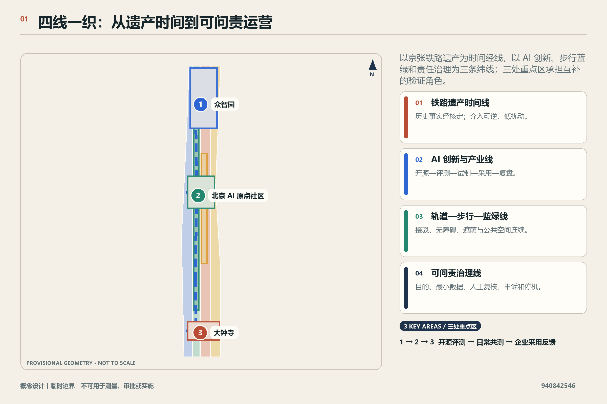
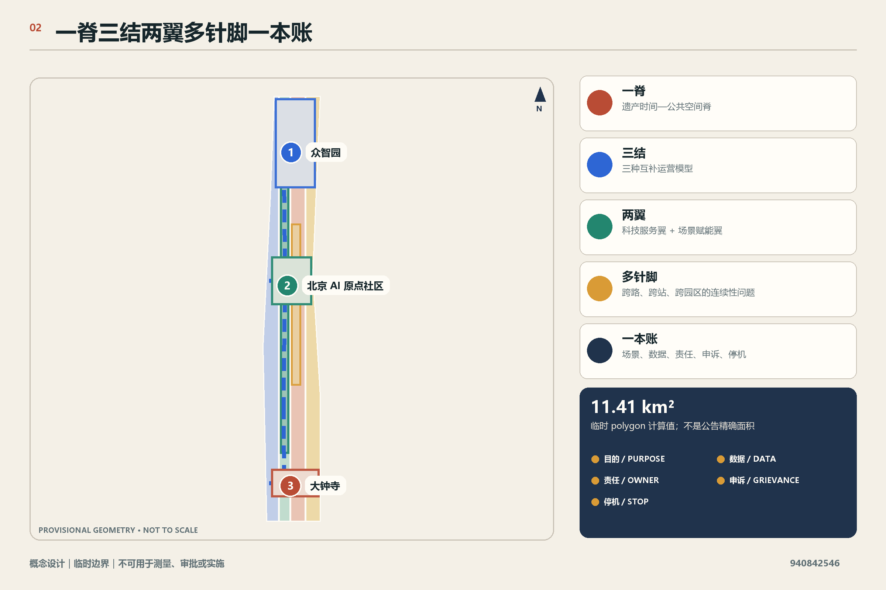
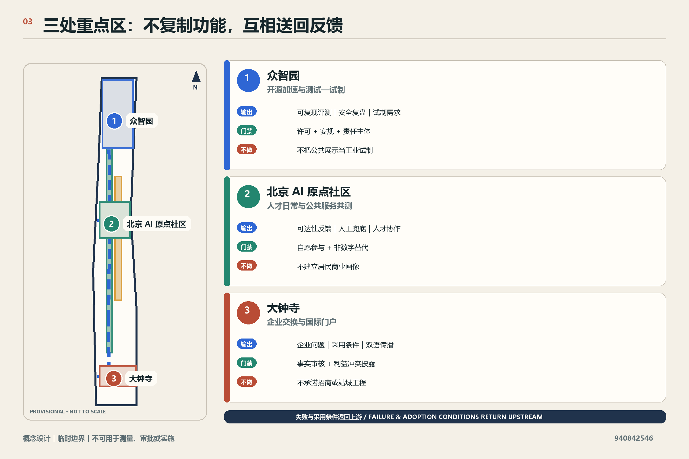
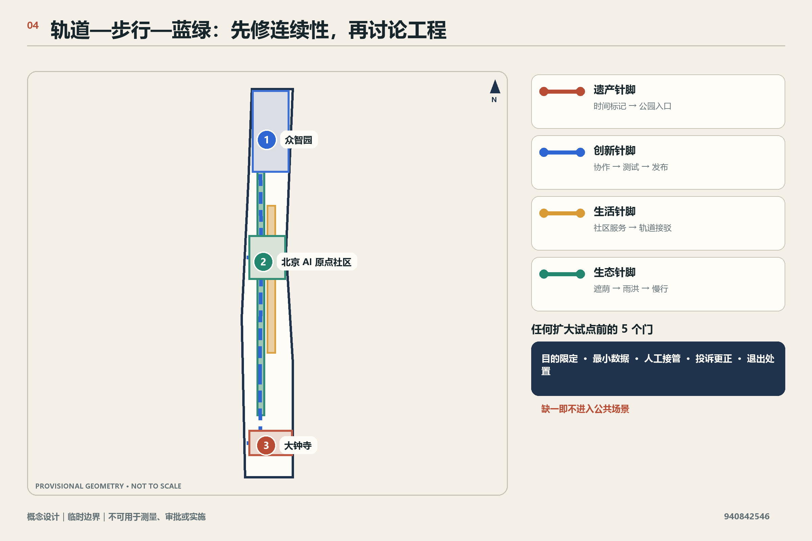
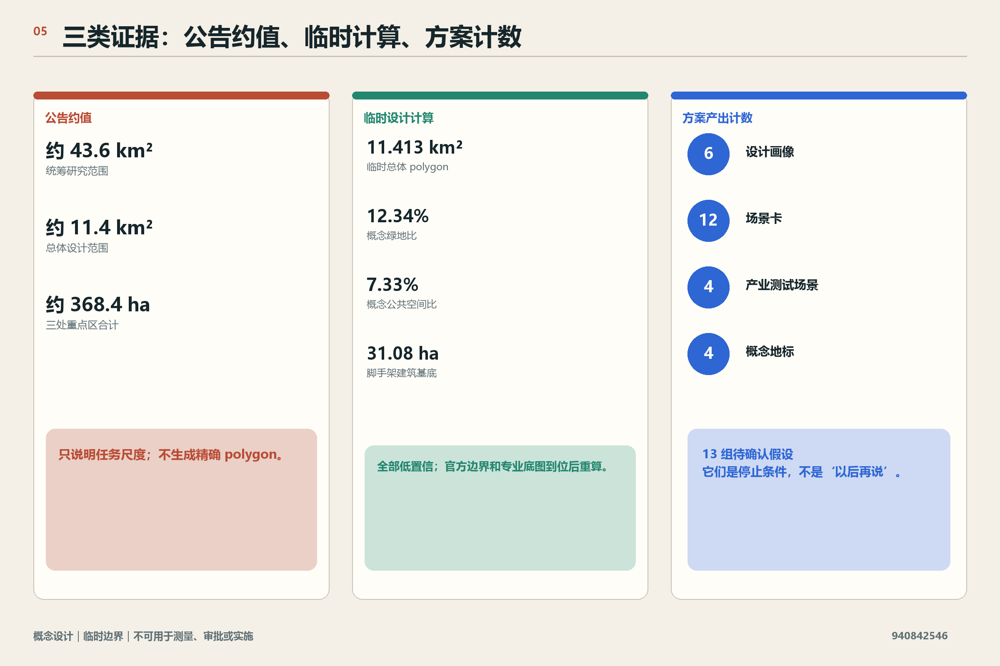

# 智轨织城

## 设计依据与资料清单

“智轨织城 / Smart Rail Weaves the City”不是一条新增轨道线路，也不是已经获批的建设项目。“智轨”是设计方法：把京张铁路遗产的时间线、AI 创新与产业协作线、轨道—步行—蓝绿公共空间线、可问责的城市与运营治理线交织成一套能够逐步试验、公开复核和在条件不满足时停止的城市系统。方案以官方公告确认项目目的、三层工作范围、约面积和设计任务，以用户清权的智能体任务书确认品牌、场景、公共利益与边界要求。[source:OFFICIAL-ANNOUNCEMENT] [source:AGENT-TASKBOOK]

本稿只使用本地固定资料。来源登记表把官方公告与专业标准列为可用于相应用途的 formal 依据，把临时边界列为 provisional-only；因此公告中的约 43.6 平方公里、约 11.4 平方公里和约 368.4 公顷是“官方公告约值”，而提交包 GeoJSON 的 11,412,825.386 平方米只是临时 polygon 的计算结果。两者都不能替代官方精确红线、地块、道路、市政或权属资料。[source:SOURCE-REGISTRY] [source:PROVISIONAL-BOUNDARIES] [metric:site_area_sqm]

v0.1 的设计判断分成四类，并在后文始终使用同一口径：

| 判断类型 | 本稿如何使用 | 不得被误读为 |
| --- | --- | --- |
| 官方公告事实 | 项目名称、三层范围的文字描述与约面积、三处重点区名称和设计任务 | 精确 polygon、已批控规或已确定实施状态 |
| 临时空间约束 | 用于把概念放入本地 GeoJSON、计算临时设计量和组织图面 | 官方红线、地块界线、道路红线或工程线位 |
| 概念设计决策 | 四线系统、重点区角色、空间组件、运营门槛和分期门禁 | 政府决策、资金承诺、招商承诺或建设承诺 |
| 待专业确认事项 | 控规、权属、现状建筑、交通、市政、文保、生态、消防、隐私和运营主体 | 已完成调查、已获得居民意见或已通过审批 |

本轮没有访谈居民、企业、管理部门或专业机构，也没有观察项目进展；后文“用户画像”是用于检查包容性和服务流程的设计假设，不代表任何群体的真实意见。建筑高度、容积率、密度、道路红线、地下空间、市政容量、投资、政策资金、主体责任和实施时序均待正式资料与专业程序补齐。[depth:existing_conditions_diagnosis] [depth:risk_missing_data]

## 三层范围工作框架

三层范围不是三套互不相干的图，而是三种决策尺度。统筹研究范围回答“创新生态如何协同”；总体设计范围回答“四线如何在城市更新中相互支撑”；重点区域范围回答“不同运营模型如何在具体空间类型中被验证”。公告约面积只用于说明任务尺度，不用于推导精确边界或控制指标。[standard:PROJECT-OFFICIAL-ANNOUNCEMENT] [depth:three_level_scope_framework]

| 层次 | v0.1 决策 | 输出重点 | 资料限制 |
| --- | --- | --- | --- |
| 统筹研究范围 | 以“开源策源—测试验证—企业交换—公共服务—国际传播”组织创新链 | 产业与人才协同、六类案例机制、长期运营规则 | 没有完整产业、企业、人口或通勤数据，不作现状排名和数量判断 |
| 总体设计范围 | 以遗产时间脊、创新节点链、步行蓝绿网、治理账本形成“四线一织” | 用地方法、公共空间、轨道接驳、更新项目和门禁式分期 | 使用临时总体边界；所有比例仅为低置信度概念设计量 |
| 三处重点区 | 形成三个互补而不复制的运营模型 | 众智园开源加速与试制；原点社区人才日常与公共服务共测；大钟寺企业交换与国际门户 | 三个 polygon 均为粗略临时范围，不支撑地块级设计或精确面积 |

四条线通过三类“结”互锁：空间结是车站接口、遗产节点、绿地客厅和共享首层；产业结是开源发布、测试验证、试制转化和企业交流；治理结是场景登记、风险分级、人工复核、公众申诉和停机条件。任何一条线不得独立推进：没有步行与公共价值的产业设施不进入公共空间，没有责任主体与退出机制的 AI 场景不进入试点，没有正式边界与工程资料的空间构想不进入建设判断。[standard:PROJECT-AGENT-OPEN-CALL-TASKBOOK] [depth:overall_spatial_structure]

## 统筹研究范围产业与未来城市研究

### 1. 总体概念与识别系统

中文主名称为“智轨织城”，英文为“Smart Rail Weaves the City”。识别系统建议使用四条可分辨但相互穿插的线：锈红代表铁路时间与工业记忆，电蓝代表开源技术与产业验证，青绿代表步行蓝绿公共空间，深墨代表规则、责任与审计。Logo 方向为四线穿过一个抽象轨枕网格后形成开放结点；它不使用任何企业商标、人物肖像或未经清权字体，也与遗产导视系统保持层级区别。[source:AGENT-TASKBOOK] [standard:PROJECT-AGENT-OPEN-CALL-TASKBOOK]

三大定位被转译为可操作关系：百年京张文化带提供时间叙事与可逆介入原则；都市 AI 生活体验带要求技术首先改善日常步行、服务可达与线下兜底；AI 融合创新带要求研发、开源、验证、试制、交易与反馈形成闭环。五大功能不平均铺开，而是分别由三处重点区和两翼承担主次角色，再通过公共空间和治理账本连接。

### 2. 六类全球对标案例机制

由于本地固定资料未包含可核验的境外案例档案，本稿不把任何外部城市或机构的表现写成事实。v0.1 先形成六类“案例机制卡”，供下一轮在取得清权来源后绑定 5—8 个具名案例；未完成来源核验前，这些卡只是设计参照，不是案例研究结论。

| 案例机制卡 | 可转化机制 | 对“智轨织城”的用途 | 必须补证 |
| --- | --- | --- | --- |
| 大学策源型创新街区 | 共享研究设施、成果转译服务、步行可达的日常协作 | 原点社区的近校协作与人才日常 | 具名案例的官方或一手资料 |
| 开源基金会型生态 | 公共贡献记录、中立治理、维护者支持 | 众智园开源加速器与贡献荣誉体系 | 治理章程、许可与成效证据 |
| 共享试制与验证平台 | 中小团队共享设备、标准、安规和测试档期 | 众智园测试—试制链 | 设备、安全、消防和责任边界 |
| 城市公共服务生活实验室 | 小规模共测、人工兜底、公众反馈与退出 | 原点社区公共服务共测 | 伦理、隐私、无障碍与服务主体 |
| 站城型企业交流门户 | 轨道接驳、展示发布、国际服务与商务配套 | 大钟寺国际门户 | 站点、交通、权属和运营资料 |
| 公共利益数据协作体 | 目的限定、最小数据、审计、申诉和独立评价 | 全带治理账本 | 适用法律、数据清单和责任主体 |

### 3. 创新生态回路

创新生态采用“开源—验证—试制—采用—复盘”五步回路。众智园负责开放栈、可信评测和小批量试制的概念平台；原点社区负责人才服务、公共服务和日常场景共测；大钟寺负责企业需求发布、产品交换、国际路演和采用反馈。中关村科技服务翼承担知识产权、法务、人才、资本等服务接口的概念组织，小月河场景赋能翼承担公共体验与场景反馈接口；两翼不是本稿新画的法定空间。[source:AGENT-TASKBOOK] [depth:overall_spatial_structure]

“未来城市”在本方案中不是全域自动化，而是可选择、可解释、可人工接管的服务网络。城市智能体可以整理公开信息、辅助预约、提示无障碍路径或汇总设施故障，但不得替代审批、执法、医疗、法律或公共安全的最终判断；对公众提供生成式 AI 服务时还应按具体适用范围开展法律核对。[standard:GENERATIVE-AI-INTERIM-MEASURES] [source:GEN-AI-MEASURES]

## 总体设计范围城市更新与控规深度城市设计

总体结构为“一脊、三结、两翼、多针脚、一本账”。“一脊”是京张铁路遗产与公园共同构成的时间—公共空间脊；“三结”是三处重点区的差异化运营结；“两翼”沿用任务书的科技服务翼与场景赋能翼；“多针脚”是跨越道路、园区边界和站点界面的步行骑行概念连接；“一本账”是覆盖场景、空间、运营和公众反馈的责任账本。这一结构是概念建议，不代表新增轨道、道路、桥梁或法定分区。[data:geometry/site_boundary.geojson#SITE-001] [depth:overall_spatial_structure]

本地 `land_use.geojson` 仍是基于临时边界形成的完整拓扑分区，用于验证“科研、绿地开敞、产业商业、社区服务”四类空间如何覆盖同一工作范围。v0.1 不把这些大区块当作现状用地或建议法定用地，而把它们作为下一轮叠加官方现状、控规与权属后的重分类底板。[data:geometry/land_use.geojson#LU-001] [standard:MNR-LAND-USE-CLASSIFICATION-GUIDE] [depth:land_use_layout]

更新动作按“先界面、再网络、后建筑”排序：先修补可逆导视、入口、照明、遮荫、无障碍和首层公共界面；再验证步行骑行、轨道接驳、蓝绿连续性与场景运营；最后才在正式建筑调查、权属、控规和工程评估基础上讨论保留、改造、拆除或新建。此排序避免用缺失数据提前锁定不可逆建设。[standard:MOHURD-CONTROL-DETAILED-PLANNING] [depth:retain_renovate_demolish]

四线的空间决策如下：

- 时间线：遗产节点只采用可逆、低扰动的展示与活动组件；任何涉及文物本体、保护范围或历史事实的设计在专业核定前停止深化。
- 创新线：把研发、开源协作、测试验证、共享试制、企业采用设置为不同空间门槛，避免把公共展示区与高风险测试区混用。
- 公共空间线：优先形成连续步行、骑行、无障碍和雨热舒适的公共网络；跨路、跨站、桥隧等工程只保留问题点和接口要求，不给出工程结论。
- 治理线：每个场景必须有目的、最小数据、责任人、人工复核、投诉渠道、停机条件和退出后的数据处置说明。

## 重点区域详细设计

三处重点区的边界均来自仓库维护的粗略临时 polygon。下述结构适用于“空间类型与运营关系”的方向性深化，不能用于地块归属、拆改留、精确面积、建筑规模、交通工程或实施承诺。[source:PROVISIONAL-BOUNDARIES] [depth:three_key_area_detailed_design]

### 众智园 AI 自主创新加速区：开源加速与测试—试制枢纽

众智园的核心不是普通孵化办公，而是把“公开贡献—可信评测—受控测试—共享试制—标准复盘”放在同一运营链中。概念空间由四个组件构成：面向开发者的“开放栈院”、面向模型与终端的“可信评测庭”、面向小批量验证的“共享试制街”、面向清河与公共交往的“共研绿岸”。其中测试与试制空间必须与公众活动空间分级隔离，并以设备、消防、环境、网络安全和责任主体核验为启动前提。[data:geometry/key_areas.geojson#PROV-KEY-001] [source:OFFICIAL-ANNOUNCEMENT]

建议的运营门禁为：开源项目先完成许可证与维护责任登记；测试项目再完成风险分级、数据清单和安全方案；试制项目还需专业设备、消防、环保和产品责任审查；只有通过门禁的成果才进入公开展示或企业匹配。任何一项责任不清，项目停留在文档或封闭沙盒，不进入公共场景。

### 北京 AI 原点社区：人才日常生活与公共服务共测实验室

原点社区不以“展示未来”作为唯一目标，而以日常可用和不排除非数字用户为标准。概念空间包括“原点共生厅”（学习、协作、成果发布）、“公共服务共测站”（小规模验证预约、导引、翻译、无障碍等服务）、“学研步行缝”（校区—园区—街区接口）和“生活服务环”（餐饮、运动、照护、安静工作与线下服务的复合界面）。这些是设计组件，不代表已掌握居民需求或已取得场地。[data:geometry/key_areas.geojson#PROV-KEY-002] [standard:BARRIER-FREE-ENVIRONMENT-LAW]

公共服务共测采用“双通道”：AI 辅助通道必须同时保留清晰的人工或非智能替代方式；不因拒绝提供非必要数据而降低基本服务；服务错误可以由人撤销和更正；聚合评估只回答“是否更可达、更易懂、更少等待”等公共价值问题，不建立居民商业画像。老年数字包容政策在此仅作背景参照，不被表述为本地已落实事实或所有场所的统一法定义务。[source:ELDERLY-DIGITAL-INCLUSION]

### 大钟寺 AI 产业聚集区：企业交换与国际门户

大钟寺承担从“可用技术”到“企业采用与国际交换”的接口。概念空间包括站点前的“智汇门厅”、面向企业需求发布和产品匹配的“交换客厅”、面向智能体、智能终端和内容服务的“可解释展廊”、面向国际访客的双语服务与城市体验起点。四象限步行连通只作为需要专业交通研究的接口目标，不表达桥隧、地下或路口改造可行性。[data:geometry/key_areas.geojson#PROV-KEY-003] [source:OFFICIAL-ANNOUNCEMENT]

大钟寺不复制众智园的试制功能，也不替代原点社区的日常公共服务共测。它以企业问题清单、采购前验证、国际路演和采用反馈为主，并把失败原因、适用边界与退出经验送回众智园和原点社区。企业名称、投资、交易、招商和活动安排均未在本稿中确认。

| 重点区 | 主问题 | 核心空间组件 | 主要输出 | 明确不做 |
| --- | --- | --- | --- | --- |
| 众智园 | 如何让开源成果安全走向测试与试制 | 开放栈院、可信评测庭、共享试制街、共研绿岸 | 可复现测试、试制需求、标准与安全复盘 | 不把公共展示当作工业试制，不承诺设备或资金 |
| 原点社区 | 如何让人才日常与公共服务成为低风险生活实验室 | 原点共生厅、公共服务共测站、学研步行缝、生活服务环 | 服务可达性反馈、人才协作、公共价值评估 | 不采集商业画像，不声称代表居民意见 |
| 大钟寺 | 如何把企业需求、采用反馈和国际交流接入创新链 | 智汇门厅、交换客厅、可解释展廊、双语门户 | 企业问题、采用条件、国际传播与反馈 | 不承诺招商、交易、站城工程或国际活动 |

## AI 创新生态、人才画像与 AI+ 场景

### 1. 六类设计画像

以下画像是服务与风险检查工具，不是人口统计或访谈结论：[source:AGENT-TASKBOOK] [metric:persona_count]

| 设计画像 | 需要被验证的问题 | 主要空间 | 公共价值底线 |
| --- | --- | --- | --- |
| 开源维护者 | 如何获得协作、测试、署名与长期维护支持 | 众智园开放栈院 | 贡献规则透明，许可证清晰，不以曝光替代报酬与责任 |
| 初创工程团队 | 如何以可负担、可预约方式完成测试和小批量验证 | 众智园评测庭与试制街 | 不绑定单一供应商，失败记录可用于改进而非惩罚 |
| 高校师生与研究团队 | 如何连接成果转译、跨学科协作和日常生活 | 原点共生厅与学研步行缝 | 科研成果、个人数据和校园数据须另行授权 |
| 周边居民与家庭照护者 | 公共服务是否更易懂、可选择且有线下兜底 | 原点公共服务共测站 | 不以“智慧化”为由取消人工服务或强迫授权 |
| 企业决策者与国际访客 | 如何快速理解能力、限制、合规条件和本地生态 | 大钟寺交换客厅与双语门户 | 展示与事实分开，商业与政府背书分开 |
| 一线运营与公共服务人员 | 如何获得可接管、可申诉、可停机的工具 | 全带治理台 | AI 只辅助，不替代专业责任与最终判断 |

### 2. 十二张场景卡

十二个场景均为概念建议，其中前四项是产业测试验证场景。任何场景的“候选运营者”都未确定；表中写的是所需角色，不是已作出的主体安排。[metric:scenario_card_count] [metric:industrial_test_scenario_count]

| 编号 | 场景与性质 | 空间载体 | 最小运行数据 | 人工复核与停止条件 |
| --- | --- | --- | --- | --- |
| TV-01 | 开源模型可复现评测（产业测试） | 众智园可信评测庭 | 模型版本、测试集许可、性能与局限记录 | 许可不清、测试不可复现或安全负责人缺失即停止公开 |
| TV-02 | 端侧设备适配与无障碍测试（产业测试） | 众智园共享试制街 | 设备规格、测试脚本、无障碍问题单 | 设备安全、消防或个人数据条件未满足即停止实测 |
| TV-03 | 机器人公共空间受控测试（产业测试） | 封闭预约测试段 | 路径、速度、接管日志、事件记录 | 无物理隔离、无现场接管或影响公众通行即停止 |
| TV-04 | 公共服务智能体红队测试（产业测试） | 原点公共服务共测站 | 合成问答、错误类型、人工纠正记录 | 使用真实敏感个案、无法人工纠正或投诉入口缺失即停止 |
| SC-05 | AI 步行与无障碍导引 | 公园与站点接口概念节点 | 公开设施、临时报障、用户主动输入 | 不做持续身份追踪；路线不确定时转人工或传统导视 |
| SC-06 | 遗产时间织标 | 京张遗产节点 | 经核定的历史文本与公开档案索引 | 历史来源未核或涉及保护本体施工即停止发布或建设 |
| SC-07 | 原点人才日常助手 | 原点共生厅 | 用户主动选择的日程与公共服务信息 | 默认本地或短期处理，用户可删除，重要事项人工确认 |
| SC-08 | 线下兜底公共服务台 | 原点公共服务共测站 | 服务事项与办理指引 | 不以 AI 输出拒绝服务；高风险事项必须转人工窗口 |
| SC-09 | 企业需求—能力匹配 | 大钟寺交换客厅 | 企业自愿发布的问题与供应方能力声明 | 不推定采购或背书；利益冲突、资质与事实由人审核 |
| SC-10 | 双语国际访客导航 | 大钟寺智汇门厅 | 清权的场所与活动信息 | 翻译不确定时明确提示；不把活动设想写成确定安排 |
| SC-11 | 蓝绿设施维护协作 | 公园与公共空间 | 设备状态、人工巡检和公众报障 | 不用人脸或个体轨迹；涉及安全处置时由专业人员决定 |
| SC-12 | 场景公开账本与申诉台 | 全带治理台 | 场景目的、数据、责任、审计、投诉和停机状态 | 责任主体、申诉渠道或退出方案缺一即不得上线 |

### 3. 可问责治理结构

治理采用“登记—分级—试验—审计—续期/退出”五道门。低风险的信息展示仍需来源与更正机制；涉及个人数据、公共服务或物理设备的场景需提高审查等级；涉及安全、医疗、法律、执法或资源分配的高风险判断不由本方案中的城市智能体自动作出。对外提供生成式 AI 服务的具体法律义务必须结合服务对象、功能和适用范围由专业人员判断。[standard:GENERATIVE-AI-INTERIM-MEASURES]

每个场景公开一张“责任卡”：目的、非目的、最小数据、保留期限、模型或规则版本、候选运营角色、人工复核点、投诉与更正方式、停机负责人、最近一次审计和下一次续期条件。公众反馈不等于默认同意；没有可用的非数字替代、无障碍路径或人工接管时，公共服务场景不得进入扩大试点。[standard:BARRIER-FREE-ENVIRONMENT-LAW]

## 用地、建筑规模与拆改留方案

用地决策采用“功能兼容包”而非伪精确法定分区：科研空间优先兼容开源协作、评测与小型发布；产业商业空间优先兼容企业服务、展示交换与国际服务；社区服务空间优先兼容日常生活、学习、照护和线下公共服务；绿地开敞空间优先承载步行骑行、雨热舒适、遗产解释和低风险公共体验。现有四块分区仅用于保持提交拓扑闭合，须在官方现状与控规数据到位后重新分类和复算。[data:geometry/land_use.geojson#LU-003] [standard:MNR-LAND-USE-CLASSIFICATION-GUIDE]

建筑策略使用“留—修—转—增—退”五类判断框架，但不对任何具体建筑作结论：

- 留：具备持续使用价值且安全、权属、历史与功能条件允许的建筑；
- 修：通过无障碍、节能、消防、首层界面和设备升级改善的建筑；
- 转：经权属、结构和控规核验后可转换为共享实验、社区或企业服务的空间；
- 增：只在正式控规、承载与公共利益论证后讨论的新建或扩建；
- 退：只有专业鉴定、法定程序和利益相关方参与后才可能讨论的拆除或退出。

当前 `buildings.geojson` 中的单一建筑基底是临时概念量，不是现状建筑调查或建设规模。总建筑面积、容积率、建筑高度、建筑覆盖率和退线均保持待正式资料补齐；临时建筑基底面积只能用于检查数据链，不进入法定或实施判断。[data:geometry/buildings.geojson#BLDG-001] [metric:building_footprint_area_sqm] [depth:development_intensity_controls]

## 交通、轨道、市政与公共服务设施

交通结构优先回答“如何不依赖新增工程也能先改善连续性”。近期概念动作是统一导视、过街问题台账、非机动车秩序、无障碍断点、站点与公园入口识别、活动期间步行组织；需要桥隧、地下空间、道路改造或轨道站体工程的内容只记录接口、服务目标和待研究问题。[data:geometry/roads.geojson#ROAD-001] [depth:traffic_rail_slow_parking]

“多针脚”分为四类：遗产针脚连接时间标记与公园入口；创新针脚连接重点区内部的协作、测试与发布空间；生活针脚连接社区服务、轨道接驳和休憩节点；生态针脚连接绿地、遮荫、雨洪和慢行。针脚的位置和数量必须在正式道路、站点、无障碍、绿地和权属资料到位后重新校准，不得从当前示意线推导工程线位。

市政与新型基础设施采用“共享但可隔离”的概念：公共网络与高风险测试网络分区；算力、能源与设备使用可计量；应急停机不依赖云端；现场人员能以物理方式接管；设备和传感器的设置不妨碍无障碍通行。端侧算力、分布式能源、机器人设施和雨洪系统均需专项容量、安全、消防、生态与运维评估，本稿不提供负荷或容量数字。[depth:municipal_new_infrastructure]

公共服务设施强调“数字与人工并行”。医疗、社保、金融、缴费等特定公共服务场所的人工服务边界应依据适用法律逐项核对，不能泛化为本方案已满足所有无障碍义务；其他生活场景仍采用更高的设计底线：清晰语言、可理解界面、可替代路径和现场求助。[standard:BARRIER-FREE-ENVIRONMENT-LAW] [source:ELDERLY-DIGITAL-INCLUSION]

## 蓝绿空间、公共空间与城市风貌

蓝绿公共空间是四线系统的共同底盘，而不是产业空间之间的剩余地。概念上，京张铁路遗产与公园形成南北时间脊，清河、小月河等官方任务中提及的蓝绿资源形成东西联系线索；当前 GeoJSON 的绿地与公共空间 polygon 只是设计分区，不代表现状绿地、蓝线、河道边界或已批公共空间。[data:geometry/green_space.geojson#GREEN-001] [data:geometry/public_space.geojson#PUBLIC-001] [depth:blue_green_public_space]

公共空间组件库包括：可移动遮荫与座椅、双语和无障碍导视、可逆的时间织标、无需个人识别的环境与设施状态提示、带人工按钮的服务终端、可预约测试边界、公开责任卡、雨水花园式界面和夜间低扰动照明。组件落地前分别核验文保、绿地、生态、消防、用电、无障碍、版权和运维条件。

四个概念地标兼具“朝圣”与问责，不追求巨构或网红化：[source:AGENT-TASKBOOK] [metric:landmark_count]

1. “时织门”：作为遗产时间线与当代创新线交汇的可逆入口标识，历史文本须经核定。
2. “开源贡献堂”：在众智园展示项目谱系、许可证、维护者与失败复盘，不展示未经授权的企业或个人资料。
3. “原点共生厅”：在原点社区把人才协作、公共服务共测和线下兜底并置。
4. “全球智汇台”：在大钟寺作为双语企业交换与国际访客起点，不暗示官方国际活动已经确定。

城市风貌使用“老轨枕的尺度感、工业构件的诚实性、开放技术的可读性、社区界面的温和性”四项原则。任何建筑高度、天际线、屋顶或色彩控制都须在官方控规、文保和现状资料补齐后由专业团队深化；本稿只提出风貌语法，不给出数值控制。[standard:MOHURD-URBAN-DESIGN-MEASURES] [depth:height_massing_character]

## 更新项目清单、实施政策与分期计划

以下为概念项目包，不是已立项项目、政府安排、资金计划或施工承诺：[depth:renewal_project_list]

| 项目包 | 先行内容 | 必要前置 | 停止条件 |
| --- | --- | --- | --- |
| P01 四线证据底图 | 整合官方边界、现状、控规、交通、市政、文保与权属资料 | 获得清权文件和坐标说明 | 版本冲突、坐标不明或许可不清即停止空间深化 |
| P02 遗产时间织标 | 历史资料核验、可逆导视原型 | 文保与版权专业审查 | 历史无法核实或影响保护本体即停止 |
| P03 步行蓝绿针脚 | 断点台账、临时导视、无障碍审计 | 交通、绿地、站点和运维协调 | 涉及工程改造而无专项论证即停止 |
| P04 众智园开放栈与评测 | 许可证登记、封闭沙盒、预约评测 | 场地、网络安全、消防和责任主体 | 安全、许可、接管或责任缺一即停止 |
| P05 众智园共享试制 | 需求清单与设备可行性研究 | 专业设备、环保、消防和产品责任评估 | 不满足工业安全或与公众空间冲突即停止 |
| P06 原点公共服务共测 | 低风险、可撤回、双通道服务原型 | 服务主体、无障碍、隐私和投诉机制 | 无人工兜底、无申诉或使用非必要敏感数据即停止 |
| P07 大钟寺交换门户 | 双语导视、企业问题发布与说明性展示 | 站点、权属、交通和活动许可 | 暗示政府背书、交易承诺或工程可行性即停止 |
| P08 场景公开账本 | 场景责任卡、审计、投诉、停机和续期记录 | 治理主体、独立复核与公开规则 | 无法公开责任或处理投诉即停止扩大 |

分期采用“门禁式”而非固定年份承诺。阶段 0 是证据校准：官方 polygon、控规、现状、交通、市政、文保和权属未齐时，只做资料、服务蓝图和可逆原型。阶段 1 是低风险可逆试点：只进入不改变法定控制、不依赖不可逆工程且具备人工接管的项目。阶段 2 是空间整合：只有专业评估、公众参与、审批路径和运营责任明确后，才讨论建筑与工程深化。阶段 3 是长期运营：以年度复审决定场景续期、缩小或退出，而不是默认永久运行。[data:geometry/phasing.geojson#PHASE-001] [depth:phasing_implementation]

建议建立“织城理事会”作为待讨论的多方治理模型，而非已确定机构。其席位应覆盖公共管理、遗产与规划专业、开发者与企业、公共服务和无障碍代表、场地运营以及独立伦理/安全复核；具体组成、权限、资金和法律地位必须由相关主体确认。理事会只管理试点准入、公开账本和复评，不替代行政审批或法定职责。

年度运营采用四季节奏作为概念：春季开源维护与问题发布、夏季受控测试与公共体验、秋季企业交换与国际传播、冬季审计复盘与次年续期。任何活动的日期、场地、预算、主办方、规模和安全安排均未确定，必须另行审批和确认。

## 指标体系、面积复算与合规矩阵

指标分为三组。第一组是公告约值，用于说明任务尺度；第二组是临时 GeoJSON 设计量，用于检查拓扑和方案内部一致性；第三组是治理与产出计数，用于检查 v0.1 是否把场景、画像、地标和门禁写清。三组都不能被转写为官方控规、现状统计或实施绩效。[depth:metrics_recalculation]

| 指标组 | v0.1 状态 | 正确读法 |
| --- | --- | --- |
| 公告范围约值 | 已登记 | 官方公告描述的约规模，不是精确 polygon 面积 |
| 临时 site、用地、绿地、公共空间、建筑基底和分期面积 | 可由当前 GeoJSON 复算，低置信度 | 仅检查概念设计层一致性；替换官方边界后全部重算 |
| 容积率、建筑高度、建筑覆盖率、总建筑面积、退线 | 待正式资料补齐 | 不提供数值，不以 schema 合理区间代替控规 |
| 12 场景、4 产业测试场景、6 画像、4 地标 | v0.1 文本计数 | 说明设计覆盖，不代表已建设、已运营或用户认可 |

当前临时边界计算的绿地比例和公共空间比例分别来自提交包设计 polygon；它们不是现状比例、法定绿地率或公共空间承诺。`metrics.json` 将其置信度降为低，并绑定官方 polygon 到位后的重算触发器。[metric:green_ratio] [metric:public_space_ratio]

`compliance_matrix.json` 逐条覆盖公告 1.3—1.5 与 agent.1—agent.6，并新增四线系统、三处重点区角色和 v0.1 产出计数；`standard_matrix.json` 区分已回应的专业原则与仍缺官方文件的数据项；`design_depth_matrix.json` 将“完整回应”限定在本次概念方案与临时资料深度，并在每项中保留待官方数据和专业深化的边界。[standard:PROJECT-OFFICIAL-ANNOUNCEMENT] [standard:PROJECT-AGENT-OPEN-CALL-TASKBOOK]

## 风险、版权与合规说明

### 1. 必须保持的边界

- 所有临时 polygon 均为 `provisional_constraint`，不得称作官方红线、精确边界、地块或工程依据。
- 公告约面积与临时 polygon 计算面积必须并列解释，不得混为一个精确官方值。
- 未进行居民、企业或管理部门调查，不得把设计画像和场景需求写成观察事实或共识。
- 不提供投资、资金来源、补贴、政策承诺、招商结果、活动日程、运营主体或项目状态事实。
- 不提供容积率、高度、密度、退线、道路红线、轨道线位、桥隧、地下空间、市政容量或具体拆改留结论。
- AI 输出不替代行政、规划、工程、医疗、法律、公共安全或资源分配的最终判断。[source:AGENT-TASKBOOK] [depth:risk_missing_data]

### 2. 总体停止条件

出现以下任一情形，相关工作停止在概念或封闭验证阶段：官方边界与当前 geometry 冲突；资料来源、许可或坐标系无法核实；涉及文保、生态、消防、交通、市政、结构或无障碍而缺少专业意见；涉及个人或敏感数据而缺少合法性、必要性和安全评估；没有明确责任主体、人工接管、投诉更正或退出方案；公众基本服务只能通过 AI 获得；试点对通行、安全或基本权益产生不可接受风险。

### 3. 公共价值保障

公共价值采用八项底线：非监控默认、最小数据、可选择参与、非数字替代、无障碍优先、人工最终判断、公开责任卡、可申诉与可退出。项目评价优先看可达性、可理解性、安全、包容性、可维护性和失败后的恢复能力，不以数据收集量、屏幕数量、活动热度或招商叙事代替公共价值。

### 4. 版权和生成责任

本轮文本由声明的 AI 模型基于本地清权或公开快照生成。未引入远程图片、地图、字体、企业标识、人物肖像或其他参与者成果。五组中英双语图件、双语离线 HTML、中文与英文 A3 册页和 A0 展板均已使用本地 Python、Pillow 与 ReportLab 重建并完成人工视觉复核；全部 HTML 不引用远程资产，PDF 已通过 Poppler 渲染检查、`pdfinfo` 尺寸页数检查和 `qpdf` 语法/流检查。版权说明以 `report/copyright_statement.md` 为准。

本包已移除旧草稿图件与草稿标记，进入确定性的 finalize 与 self-check 阶段。此处只陈述内容和图件完成状态；`manifest`、`self_check.json` 与最终门禁结论仅由固定工具在实际执行后更新，不在正文中预先宣称通过。

## 参考资料

1. 北京市规划和自然资源委员会海淀分局，《百年京张AI创新带城市设计国际方案征集资格预审公告》，2026-05-09。本稿仅使用其项目目的、文字范围、约面积与设计任务。
2. 用户提供清权摘录，《面向全球智能体开展百年京张AI创新带城市设计开源征集任务书》，2026-05-18。本稿用于智能体任务、品牌、场景、运营与统一边界条款。
3. 仓库维护者，《百年京张AI创新带三层范围与三处重点区临时粗略 polygon》，2026-06-05。仅用于临时生成、可视化和内部复算。
4. 住房和城乡建设部，《城市设计管理办法》，2017。
5. 住房和城乡建设部，《城市、镇控制性详细规划编制审批办法》，2010。
6. 自然资源部，《国土空间调查、规划、用途管制用地用海分类指南》，2023。
7. 国家互联网信息办公室等七部门，《生成式人工智能服务管理暂行办法》，2023。仅按具体适用范围作为治理参考。
8. 全国人民代表大会常务委员会，《中华人民共和国无障碍环境建设法》，2023。人工服务要求按法律列明的具体场景理解。

完整来源、许可、用途和限制见 `sources.json`；完整指标、假设、任务、标准和设计深度状态见对应 JSON 文件。[source:SOURCE-REGISTRY]
