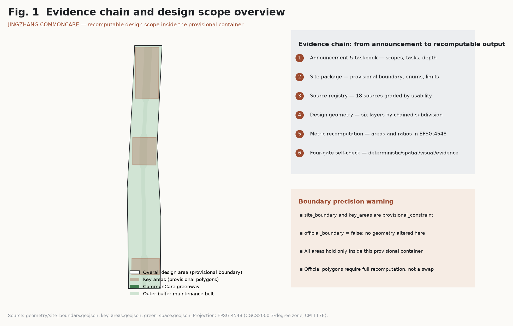
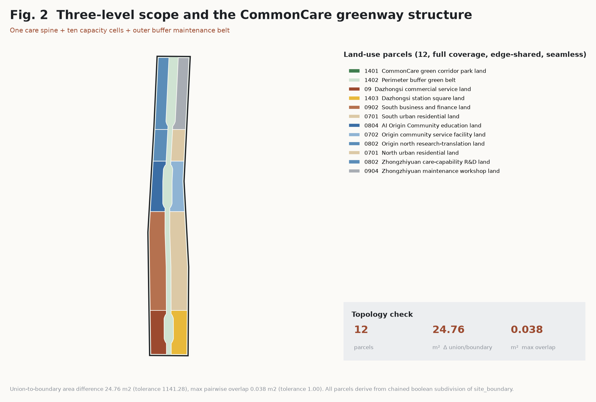
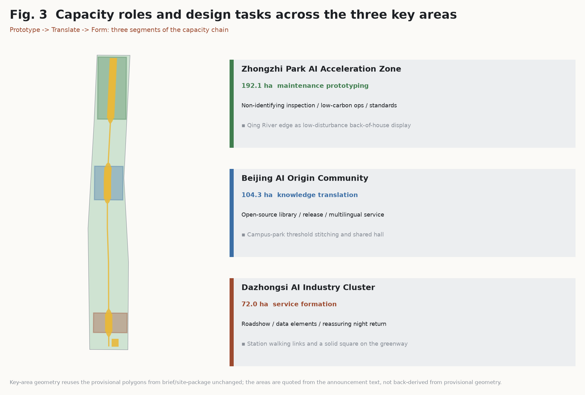
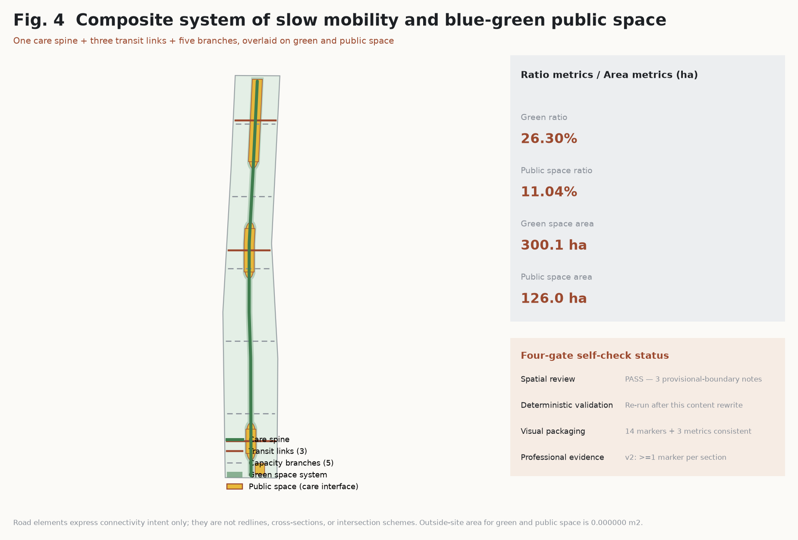
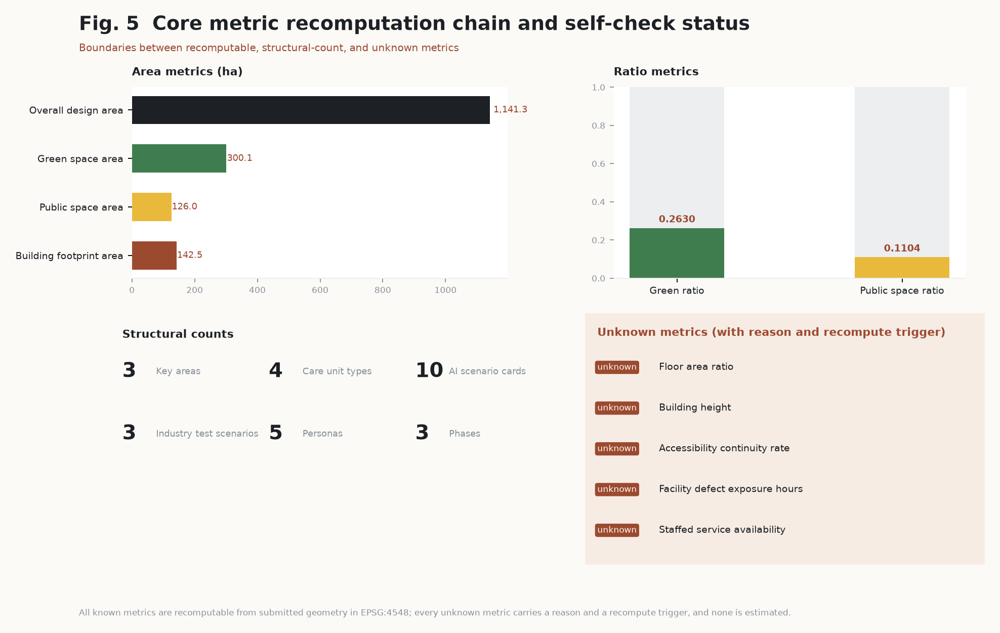

# JINGZHANG COMMONCARE: An Innovation Belt That Trades Public Care Capacity for the Right of AI to Stay

**AI enters by care, stays by proof.**

## Design Basis and Source List

The primary basis of this proposal is the pre-qualification announcement for the international urban design open call for the Centennial Jingzhang AI Innovation Belt, issued by the Haidian Branch of the Beijing Municipal Commission of Planning and Natural Resources. The secondary basis is the machine-readable agent taskbook published in this repository [source:OFFICIAL-ANNOUNCEMENT] [source:AGENT-TASKBOOK]. Before design work began, the design brief, allowed design space, enumerations, planning limits, and schemas under `brief/site-package/` were read in full, and the use boundary of every material was constrained by the registration decisions in `data/source_registry.json` [source:SITE-PACKAGE]. Any judgement that cannot be traced to a registered source, recomputed from submitted geometry, or reviewed by a human is excluded from the conclusions.

The spatial base of this proposal is the provisional coarse boundary supplied by the repository, not an official redline. Within this package `geometry/site_boundary.geojson` and `geometry/key_areas.geojson` remain `provisional_constraint` with `official_boundary=false`, and this proposal makes no geometric change to either layer; they serve only as the container for design and self-check [data:geometry/site_boundary.geojson#SITE-001] [source:BOUNDARY-SOURCE]. Consequently every area figure in this package is a value that is internally consistent within that provisional container. It supports design discussion, structural comparison, and automated review, but it must not be used for approval, acquisition, title, or engineering purposes. Once official polygons are released, land use, buildings, roads, green space, public space, phasing, and all metrics must be recomputed as a whole rather than by replacing a single file; the machine-readable record is kept in `assumptions.json` as A-BOUNDARY-001 and A-KEYAREA-001.

Source use boundaries are registered in three classes: public material usable for formal content, material for background understanding only, and material valid only at the provisional stage [source:SOURCE-REGISTRY]. Background material is never promoted to a formal basis. For example, national-level documents on smart elderly care are used only to explain why care capacity deserves to be the design spine, never to derive facility scale or service targets [source:ELDERLY-SMART-TECH-PLAN]. The file `data/processed/agent_fact_pack.md` is a reading aid only; factual judgements return to the registered originals [source:PROCESSED-FACT-PACK].

External bases fall into three groups. First, law and regulation: the Barrier-Free Environment Construction Law and the Interim Measures for the Administration of Generative AI Services, which anchor the two red lines of staffed-first service and data minimisation [source:BARRIER-FREE-ENVIRONMENT-LAW] [source:GENERATIVE-AI-INTERIM-MEASURES]. Second, national technical requirements for urban design and land-use classification, which define deliverable depth and land-use expression [standard:MOHURD-URBAN-DESIGN-MEASURES] [standard:MNR-LAND-USE-CLASSIFICATION-GUIDE]. Third, transferable cases and background reporting, which supply practice references but no local conclusions [source:CASE-JTC-PUNGGOL] [source:CONTEXT-JINGZHANG-CORRIDOR-PLAN-NEWS]. Links, per-source licence/reuse status (`license_status`), reuse scope, verification dates, and prohibited uses for all eighteen sources are held in `sources.json`: official documents and organizer-provided materials are recorded by their nature; cases and news reports are cited as facts only, with no text or imagery reproduced; the two agent-inferred provisional geometry sources have their underlying-data licences not yet verified item by item and are honestly marked needs_review [depth:existing_conditions_diagnosis].

## Three-Level Scope Framework

The three working levels defined by the announcement carry different duties here. The 43.6 km² coordinated research area answers how the industrial ecosystem and future urban form are organised. The 11.4 km² overall design area answers how the renewal framework, spatial structure, and facility capacity are drawn. The 368.4 ha key areas answer how function, buildings, movement, and public space reach detailed design depth [source:OFFICIAL-ANNOUNCEMENT] [depth:three_level_scope_framework]. The three levels are not a stack of drawing sets but the same judgement chain converging three times: upper-level industrial and morphological judgements must find concrete spatial objects below, and lower-level spatial moves must trace back to public objectives above.

The overall concept is JINGZHANG COMMONCARE. It does not draw a new abstract axis. Instead it reorganises the whole overall design area into one continuous public care spine plus capacity-supply bands on either side. Along the heritage park alignment a CommonCare greenway runs north to south, widening from roughly 78 m half-width to roughly 152 m near the three key areas, forming a public space body that can host stay, maintenance, and withdrawal [data:geometry/green_space.geojson#GREEN-CORRIDOR] [depth:overall_spatial_structure]. On both sides of the greenway, five north-south segments and two flanks produce ten capacity cells carrying the three roles of prototyping, translation, and service formation. A 40 m buffer maintenance belt is reserved inside the boundary as operational tolerance for interfacing with the surrounding city, construction, and facility inspection [data:geometry/land_use.geojson#LU-SHIELD-BELT].

Verifiability comes from how the geometry is produced. Apart from the provisional boundary and key-area layers, all six design layers are derived by chained boolean subdivision of `site_boundary`, so land-use parcels share edges and are seamless and non-overlapping by construction [data:geometry/land_use.geojson#LU-GREEN-CORRIDOR] [metric:site_area_sqm]. Recomputation shows a 24.76 m² area difference between the land-use union and the boundary, a maximum pairwise overlap of 0.038 m², and zero outside-site area for green space, public space, and building footprints, all far below the official spatial review tolerances. This is not precision for its own sake; it turns the question of whether the structure holds together into a fact a script can refute.

| Level | Question this proposal answers | Spatial and data anchor |
| --- | --- | --- |
| Coordinated research area | How AI serves daily life first and earns a reason to stay | Roles of the three zones and two wings, plus the care-unit family [source:CONTEXT-THREE-ZONES-TWO-WINGS-NEWS] |
| Overall design area | How the continuous public spine, capacity bands, and buffer belt are drawn | Twelve land-use parcels and the greenway [data:geometry/land_use.geojson#LU-WEST-M] |
| Key areas | Which segment of the capacity chain each district carries | Key-area index [data:geometry/key_areas.geojson#PROV-KEY-001] |

## Coordinated Research Area: Industry and Future City Research

The core question at this level is not how to display AI but why AI should stay. The answer offered here is public maintenance and care capacity. Cities continuously generate small frictions: broken facilities, accessibility gaps, missing shelter in extreme weather, inconsistent information, weak night-time reassurance. These frictions carry real demand, verifiable outcomes, and a procurable long-term budget, and addressing them does not require the city to surrender privacy or public decision rights [source:AGENT-TASKBOOK] [standard:PROJECT-AGENT-OPEN-CALL-TASKBOOK]. Taken as the spine, this establishes a durable exchange between the AI industry and the city instead of a one-off demonstration project.

The innovation chain is organised in five segments — university origination, open-source translation, park prototyping, urban validation, service formation — and mapped onto the three zones and two wings. Zhongzhi Park carries maintenance-capacity prototyping, the AI Origin Community carries maintenance-knowledge translation, and Dazhongsi carries maintenance-service formation. The Zhongguancun technology-service wing supplies standards, intellectual property, liability insurance, and international support, while the Xiaoyue River scenario wing supplies real problem input on microclimate, stormwater, accessibility, and everyday recreation [source:CONTEXT-THREE-ZONES-TWO-WINGS-NEWS] [depth:overall_spatial_structure]. This division changes no existing industrial layout; it gives each district a testable capacity duty.

Future urban form research lands on four visible outcomes: a continuous greenway so walking and cycling are no longer interrupted; care units that keep public services reachable without a phone or an account; publicly displayed maintenance status so the city's operating quality becomes discussable; and a record of both the entry and the exit of AI [data:geometry/public_space.geojson#PUBLIC-CARE-SPINE] [metric:care_unit_type_count]. The naming and identity system uses maintenance marks rather than chips, robots, or data flows as its graphic base, with five icon families: see, care, take over, repair, rest. Primary colours are railway ink black, heritage rust red, garden green, high-visibility accessibility yellow, and winter warm grey. All global events, developer community activity, and experience routes here are concept proposals for professional teams to develop further and represent no confirmed arrangement [source:GENERATIVE-AI-INTERIM-MEASURES].

## Overall Design Area: Urban Renewal and Regulatory-Plan-Level Urban Design

Because this level must reach the urban design depth of a regulatory detailed plan, structural judgements are decomposed into reviewable objects: land-use parcels express function and care role, building footprints express renewal carriers, roads and slow-mobility express connectivity, green and public space express the public spine, and phasing expresses sequence [standard:MOHURD-CONTROL-DETAILED-PLANNING] [depth:land_use_layout]. The twelve land-use parcels comprise the greenway, the buffer maintenance belt, and ten capacity cells; together they cover the submitted boundary completely, closed and seamless, and the area, edges, and adjacency of any parcel can be checked directly against `land_use.geojson` [data:geometry/land_use.geojson#LU-EAST-SM].

Low-efficiency space is identified by friction, not inferred from title. This proposal holds no ownership records, existing building survey, or regulatory conditions, so it issues no retain-renovate-demolish verdict. It instead names three classes of renewal candidate: boundaries and interfaces interrupted by the greenway, which need stitching; public space segments lacking stay, shade, drinking water, and accessibility support, which need care units; and closed ground floors with no street interaction, which need their service thresholds reorganised [depth:retain_renovate_demolish] [data:geometry/buildings.geojson#BLDG-001]. All three are design recommendations whose execution depends on later title verification and professional review.

Carrying-capacity assessment can only be structural at this stage. A total building footprint of 1,424,759 m² is recomputed from 42 footprints and supports discussion of whether the magnitude and distribution of development match the public spine [metric:building_footprint_area_sqm]. Floor area ratio and building height, however, are marked unknown with stated reasons: without official intensity zoning, height limits, and heritage view corridors, any number would manufacture false precision [metric:floor_area_ratio] [metric:building_height_m]. The outstanding conditions and recomputation triggers are recorded as A-CONTROLS-001 and A-BUILDING-001 [depth:development_intensity_controls].

## Detailed Design of Key Areas

The three key areas carry the three segments of the capacity chain and are located inside the provisional key-area layer without altering its geometry [data:geometry/key_areas.geojson#PROV-KEY-001] [depth:three_key_area_detailed_design]. Zhongzhi Park, 192.1 ha, carries prototyping: non-identifying facility health inspection, low-carbon operations, and trustworthy-operation standard validation inside a controlled, authorised park environment, with the Qing River edge organised as a low-disturbance back-of-house display interface so that maintenance itself becomes visible [data:geometry/public_space.geojson#PUBLIC-NODE-ZHONGZHIYUAN].

The Beijing AI Origin Community, 104.3 ha, carries translation: turning research output, open-source tools, and design processes into maintenance components that community operators can understand, trial, and revise. Spatially it focuses on stitching the threshold between campus and park and on adding public space for release, talent services, and open-source collaboration [data:geometry/key_areas.geojson#PROV-KEY-002] [data:geometry/public_space.geojson#PUBLIC-NODE-ORIGIN]. Dazhongsi, 72.0 ha, carries service formation: around the station and the commercial frontage, maintenance capacity becomes service products and a maintenance network for firms, residents, and visitors, with a solid square along the greenway edge hosting roadshows, international exchange, and night-time activity [data:geometry/public_space.geojson#PUBLIC-SQUARE-DAZHONGSI] [metric:key_area_count].

Detailed design depth is carried by five items — programme mix, public space system, movement organisation, slow-mobility connectivity, and implementation projects — and none of them touches building height, floor area ratio, demolition verdicts, or rail alignment [depth:height_massing_character]. Where ring-road crossings, station integration, and four-quadrant pedestrian connectivity are concerned, this proposal states connectivity goals and public space requirements only, leaving engineering feasibility to professional teams [data:geometry/roads.geojson#ROAD-TRANSIT-01].

## AI Innovation Ecosystem, Personas, and AI+ Scenarios

Four hard constraints govern AI here: data minimisation, an available non-AI baseline, human take-over at any time, and traceless withdrawal [source:GENERATIVE-AI-INTERIM-MEASURES] [source:BARRIER-FREE-ENVIRONMENT-LAW]. With AI switched off, paths, seating, signage, staffed counters, accessibility services, and maintenance records must all remain effective; if AI proves ineffective or harmful it must be removable while the improvements useful to public space stay. This constraint is recorded as A-AI-GOVERNANCE-001 and is what separates this proposal from opening all space to technology [depth:risk_missing_data].

Five personas correspond to five neglected everyday needs. Nearby residents and older people need continuous guidance and staffed enquiry without a phone. Carers and adults accompanying children need places to stay, wait, and read clear information. University staff, students, and startups need a low threshold for turning research tools into components a city can use. Frontline maintenance and public service staff need less duplicated inspection and less inconsistent information without having their responsibility replaced by an algorithm. International visitors and short-stay users need multilingual information obtainable without an account [metric:persona_count] [source:AGENT-TASKBOOK]. Four care-unit types answer these needs: rest points provide shade, seating, and night-time orientation; care windows provide a staffed-first service counter; microclimate posts improve comfort and reachability; repair tables publicly display which facilities are fixed, under observation, or suspended [metric:care_unit_type_count].

Ten AI scenario cards cover accessibility-gap maintenance, summer heat and storm comfort service, reassuring night-time return, preventive park facility maintenance, multilingual service wayfinding, low-friction campus-park interaction, carer-friendly stays, low-carbon operations advice, an open-source maintenance component library, and public walks through maintenance outcomes. Each card states its location, non-AI baseline, AI boundary, and public return [metric:ai_scenario_card_count] [data:geometry/public_space.geojson#PUBLIC-CARE-SPINE]. Three industry validation scenarios — non-identifying facility health inspection, a microclimate maintenance assistant, and accessibility information consistency checking — share three traits: the object is a facility rather than a person, conclusions require human confirmation, and each can be withdrawn within an authorised site [metric:industry_test_scenario_count] [depth:municipal_new_infrastructure]. No scenario performs facial recognition, behavioural profiling, continuous tracking, medical diagnosis, or commercial recommendation.

| Persona | Key need | Spatial response | Data and responsibility boundary |
| --- | --- | --- | --- |
| Nearby residents and older people | Continuous guidance, rest, staffed enquiry, night reassurance | Rest points and care windows along the greenway | No identifiable tracking; service never requires an account |
| Carers and adults with children | Places to stay, wait, and read clear information | Rest chains and shade at public space nodes | No health scoring or medical judgement |
| Students, staff, and startups | Turning research tools into usable city components | Shared hall and release space in the Origin Community | Campus data and research output require separate authorisation |
| Maintenance and public service staff | Less duplicated inspection and inconsistent information | Operations workshop and repair tables at Zhongzhi Park | AI offers candidates only; responsibility stays with management |
| International visitors and short-stay users | Multilingual, account-free, clear service information | Dazhongsi square and station-area signage | No visitor tracking or profiled push |

## Land Use, Building Scale, and Retain-Renovate-Demolish Strategy

Land use follows the national classification for territorial space survey, planning, and use control: twelve parcels covering the submitted boundary completely, closed and mutually seamless [standard:MNR-LAND-USE-CLASSIFICATION-GUIDE] [data:geometry/land_use.geojson#LU-GREEN-CORRIDOR]. The greenway is expressed as park green space and the buffer belt as protective green space, while the ten capacity cells are assigned to education and research, commercial and business, residential, and public administration and service categories, so that care roles map onto statutory categories instead of an invented taxonomy [depth:land_use_layout]. Shapes were not drawn first and coded afterwards: the public duties of the greenway and buffer belt were fixed first, and the remainder was cut into ten comparable cells by five north-south segments and two flanks.

The building layer expresses footprint and renewal intent only, not height, storeys, or plot ratio. Forty-two footprints are generated on a three-by-six grid at each cell's target coverage, with alternate rows offset to preserve east-west sightlines and ventilation gaps, totalling 1,424,759 m² [data:geometry/buildings.geojson#BLDG-001] [metric:building_footprint_area_sqm]. These footprints are a proposal about the position and magnitude of renewal carriers, used to discuss whether development scale matches the public spine. They are not architectural designs and correspond to no existing building or title holder [depth:height_massing_character].

No retain-renovate-demolish classification is issued at this stage, for the reason recorded in A-BUILDING-001: without existing building outlines, structural safety assessment, title registration, and a heritage inventory, any such verdict would overstep professional review [depth:retain_renovate_demolish]. A method is offered instead: first fix the interfaces that must be stitched for the public spine to connect, then fix the thresholds that must be renovated for ground-floor interaction and accessibility, and let title and structural conditions decide the final disposition. For the same reason floor area ratio and building height stay unknown in `metrics.json` with reasons and recomputation triggers attached; once official regulatory conditions arrive they require full recomputation rather than back-filling [metric:floor_area_ratio] [source:MOHURD-CONTROL-DETAILED-PLANNING].

## Transport, Rail, Municipal Infrastructure, and Public Services

The transport strategy begins with continuity for walking and cycling. Of nine road and slow-mobility elements, one is the care spine running the length of the greenway, three connect to the external network and rail stations, and five are branches entering the capacity cells, together forming a framework on which daily trips can be completed without a car [data:geometry/roads.geojson#ROAD-CARE-GREENWAY] [depth:traffic_rail_slow_parking]. All elements sit inside the submitted boundary and reconcile with public space and green space. Because the base is a provisional boundary, road conclusions express connectivity intent only and constitute no redline, cross-section, intersection, or engineering scheme [data:geometry/roads.geojson#ROAD-BRANCH-01].

On rail and ring-road crossings the proposal states three public space requirements only: a continuous, sheltered, barrier-free walking connection between station entrances and the greenway; continuous pedestrian and cycle passage with clear orientation at ring-road crossings; and a staffed-first service counter near stations rather than self-service devices alone [data:geometry/public_space.geojson#PUBLIC-NODE-DAZHONGSI]. Rail alignment, station siting, depth, clearance under structures, and engineering feasibility are outside the scope of this judgement; the missing municipal and engineering material is recorded as A-ROADS-001 [depth:municipal_new_infrastructure].

Municipal and new infrastructure follow a principle of attaching to what exists and remaining reversible. Edge compute, environmental sensing, and information display attach to existing public service facilities, park ground floors, and lighting poles rather than adding standalone structures; energy, cooling, power, and conduit conditions are left to later professional assessment and no capacity is presumed [data:geometry/constraints.geojson#CONSTRAINTS] [source:SITE-PACKAGE]. For public services, three checkable minimums are stressed: a staffed counter must exist with published hours; accessibility facility status must have a publicly checkable maintenance record; and every digital service must have a paper or staffed alternative [source:BARRIER-FREE-ENVIRONMENT-LAW]. The corresponding performance metrics are all unknown for now and require field baselines and authorised data collection first [metric:staffed_service_availability_ratio].

## Blue-Green Network, Public Space, and Urban Character

The blue-green framework centres on the CommonCare greenway, 3,001,236 m² in total, 26.30 per cent of the submitted boundary [data:geometry/green_space.geojson#GREEN-CORRIDOR] [metric:green_ratio]. It runs continuously north to south along the heritage park alignment, widening from roughly 78 m to roughly 152 m half-width near the three key areas to form three enlarged segments able to host activity, stay, and authorised testing. Shoulders use graded transitions rather than abrupt steps so that changes in width read as continuous on foot [depth:blue_green_public_space]. The protective belt inside the boundary provides buffering, construction, and inspection tolerance while also forming a loop path around the outer edge [data:geometry/green_space.geojson#GREEN-SHIELD].

Public space counts only the portion explicitly organised as a care interface: five elements totalling 1,259,853 m², or 11.04 per cent [data:geometry/public_space.geojson#PUBLIC-CARE-SPINE] [metric:public_space_ratio]. It comprises a care spine running through the greenway, public nodes in the three key areas, and the solid square at Dazhongsi. This accounting is deliberately conservative: parts of the greenway not organised as a service interface are excluded, avoiding an inflated ratio obtained by treating all green space as public space. The definition and recomputation method are recorded as A-PUBLIC-001 [metric:public_space_area_sqm].

Urban character follows the maintenance ethic of railway engineering rather than railway imagery as decoration. The base palette is a low-saturation pairing of ink black and rust red, and public facilities are specified for durability, ease of repair, and replaceable parts. Signage must present the same information in text, graphic, colour, and a staffed enquiry route at once, and must not make scanning, accounts, or facial recognition a precondition for basic service [standard:MOHURD-URBAN-DESIGN-MEASURES]. The three conceptual landmarks — the centennial maintenance milestone, the accessibility take-over gate, and the CommonCare workshop window — are realised as reversible installations within existing lawful public space, involving no new buildings and no alteration of heritage fabric; heritage conditions require separate verification [source:CASE-GUANGJIU-RAIL-PARK]. All brands, typefaces, images, and corporate marks require cleared rights before use.

## Renewal Projects, Implementation Policy, and Phasing

Phasing is organised in three stages and kept strictly distinct from the open-call calendar: the call is a submission deadline, phasing is a renewal pathway [data:geometry/phasing.geojson#PHASE-001] [metric:phase_count]. The near term favours light, withdrawable moves: adding rest points and care windows, opening the most obvious slow-mobility gaps on the greenway, and establishing public display of facility maintenance status. The medium term moves into interface and threshold renovation, completing public nodes and the square and letting each key area's capacity role take shape. The long term establishes an operating and governance framework so that maintenance capacity becomes a procurable public service [depth:phasing_implementation].

| ID | Project | Type | Preconditions | Spatial basis |
| --- | --- | --- | --- | --- |
| JZ-01 | Stitching slow-mobility gaps on the CommonCare greenway | Public space and transport | Redline, under-bridge space, movement review | [data:geometry/roads.geojson#ROAD-CARE-GREENWAY] |
| JZ-02 | Qing River maintenance display interface at Zhongzhi Park | Blue-green and industry display | Blue line, ecology, flood conditions | [data:geometry/green_space.geojson#GREEN-CORRIDOR] |
| JZ-03 | Threshold stitching and open-source release in the Origin Community | Renewal and industry service | Campus boundary, title, ground-floor programme | [data:geometry/buildings.geojson#BLDG-001] |
| JZ-04 | Pedestrian connectivity and square at Dazhongsi station | Station integration and slow mobility | Station, intersections, municipal conduits | [data:geometry/public_space.geojson#PUBLIC-SQUARE-DAZHONGSI] |
| JZ-05 | Care units with attached edge compute | New infrastructure and public service | Energy, compute, security, operator | [data:geometry/constraints.geojson#CONSTRAINTS] |
| JZ-06 | CommonCare season public walks and maintenance archive | Operations and communication | Public space permit, event safety, cleared rights | [data:geometry/phasing.geojson#PHASE-003] |

The operating mechanism proposed is a four-season CommonCare cycle. Spring discovers, using maintenance walks and accessibility checks to form a seasonal issue list. Summer trials, running short withdrawable pilots in authorised space with attention to thermal environment and night services. Autumn repairs, with responsible parties and professional teams reviewing component effectiveness, maintenance cost, and alternatives. Winter transmits, producing an annual CommonCare archive free of personal data, framed by railway engineering ethic and everyday maintenance [source:AGENT-TASKBOOK] [depth:renewal_project_list]. Global developers participate not by uploading a model but by submitting an offline-readable, auditable public maintenance component with its purpose, non-AI baseline, data boundary, human take-over, applicable conditions, maintenance responsibility, and exit path. Policy suggestions are limited to renewal coordination, space supply, data governance, and title coordination; all are recommendations, not commitments, and none involves funding or approval arrangements.

## Metrics, Area Recalculation, and Compliance Matrix

Metrics are grouped by recomputability. The first group is spatial metrics recomputable directly from submitted geometry: boundary area, green space area and ratio, public space area and ratio, and building footprint area, all exchanged in EPSG:4326 and recomputed in EPSG:4548, the same projection used by the official spatial review script [metric:site_area_sqm] [metric:green_space_area_sqm]. The second group is structural counts: key areas, care-unit types, scenario cards, industry validation scenarios, personas, and phases, used to check that the taskbook's quantitative requirements are genuinely covered [metric:ai_scenario_card_count] [depth:metrics_recalculation].

The third group is performance metrics: accessibility continuity rate, facility defect exposure hours, staffed service availability ratio, plus the floor area ratio and building height that depend on official regulatory conditions. All five are marked unknown with reasons, outstanding conditions, and recomputation triggers, and none is estimated [metric:accessibility_continuity_rate] [metric:facility_defect_exposure_hours]. The reason is simple: performance metrics require a field baseline, authorised data collection, and independent review, or the numbers merely endorse the design instead of testing it [source:SOURCE-REGISTRY].

The compliance matrix is the control file for task responsiveness, mapping each mandatory task in announcement clauses 1.3, 1.4, and 1.5 and taskbook items agent.1 to agent.6 onto sections, layers, metrics, drawings, HTML pages, sources, assumptions, and self-check items. The standard matrix covers six technical bases and the design depth matrix covers fifteen depth requirements; the three cross-index with this text [standard:MOHURD-ARCH-DESIGN-DEPTH-2016]. Spatial review currently passes, with three advisory notes retained about the provisional key-area boundaries; that status and those notes are written into `self_check.json` for direct inspection [depth:metrics_recalculation].

## Taskbook Additions: Cases, Ecosystem, Element Mechanisms, Recognition, Culture, and Conversion

The taskbook's agent.2 to agent.6 already have dedicated sections; this section adds concept-level, transferable supplements. All entries follow a "concept suggestion" register and shall not be read as an existing agreement, settled arrangement, allocated resource, or established partnership [source:AGENT-TASKBOOK] [depth:three_level_scope_framework].

**agent.2 transferable case crosswalk.** Six cases with public material on urban public space, industry service, and city maintenance are cited for background reference only and do not constitute local facts [source:CASE-JTC-PUNGGOL] [source:CASE-GUANGJIU-RAIL-PARK] [source:CASE-HANGZHOU-DATA-VALLEY]:

| Case | Core transferable practice | Not directly transferable | Reference point |
| --- | --- | --- | --- |
| Punggol Digital District (Singapore) | Co-locate digital industry and community maintenance on a shared public plinth | Land primary development and statutory body structure | "Co-location" of maintenance capacity |
| Kwun Tong Railway Park (Hong Kong, rail-to-linear-park lineage) | Rail remnant translated into a linear public space | Corridor tenure and operating body | Linear space as a public interface |
| Hangzhou Data Element Industrial Park | Industrial space plus data service overlay | Data authorisation and cross-border rules | Spatial and institutional pairing for industry service |
| Barcelona Superblocks | Human-scale reorganisation at the block level | Block width and vehicular conditions | Block-scale slow mobility + public space |
| Daikanyama (Tokyo) | Public space as cultural and life interface | Private operation and title structure | Cultural operation of public space |
| Cheonggyecheon (Seoul) | City infrastructure as a public resource | River tenure and flood-control scheduling | Public-isation and maintenance of infrastructure |

**AI innovation ecosystem map (agent.2).** The ecosystem is described as a node-and-edge table rather than a figure, so the text does the work that a diagram would otherwise substitute for:

| Node | Relation | Node |
| --- | --- | --- |
| Zhongzhi Park AI Acceleration Zone | Provides maintenance-capability prototypes and validated components | Origin Community / Dazhongsi |
| Beijing AI Origin Community | Translates maintenance knowledge; hosts open-source releases and multilingual service | Domestic and foreign developers and SMEs |
| Dazhongsi AI Industry Cluster | Forms maintenance services that can be procured | City operation responsible party |
| Public nodes and the greenway | Host operational validation sites | Operation responsible party / three key areas |
| Policy and urban-renewal coordination | Provides space supply and data governance | Three key areas |
| Edge compute and sensing | Attached to existing carriers, reversibly deployed | Public nodes and key areas |
| Open data and scenarios | Flow to developers and SMEs | Origin Community / Zhongzhi Park |

**Eight-element mechanism (agent.2).** The taskbook requires coverage of eight elements; this proposal gives a conceptual definition of their role and supply mode:

- **Land**: Use the provisional boundary container as the recomputation object; intensity and height await official regulatory-plan input
- **Space**: The CommonCare greenway + ten capacity cells + outer buffer maintenance belt as the structural frame
- **Industry**: A "prototype - translate - form" capacity chain running through the three key areas
- **Capital**: Suggest urban-renewal coordination funds plus public-space operations budget; do not commit to specific financing arrangements
- **Talent**: Anchored on campus and start-up teams; operations and maintenance positions localised
- **Compute**: Edge plus public-node attachment; capacity and providers await formal RFP
- **Data**: Open data, component interfaces, and de-identification standards set by the responsible party
- **Scenarios**: 10 scenario cards plus 3 industry test scenarios; subjects of testing are facilities, not individuals

**Recognition system and component catalogue (agent.4).** Recognition and exposure are not marketing but interfaces that build public trust. The system unfolds across four layers: the CommonCare archive (quarterly maintenance records, facility status, retrospective reports), the CommonCare components (open-source, auditable public-maintenance component library), the CommonCare season (public walk-through, cross-city comparison, annual archive), and the CommonCare dialogue (open Q&A between developers, enterprises, professionals, and the public). The suggested component catalogue includes: environmental monitoring interfaces, standardised maintenance-task records, facility defect reporting interfaces, accessibility continuity check scripts, component version and dependency manifests, and de-identified data access templates [source:AGENT-TASKBOOK] [depth:renewal_project_list].

**Jingzhang - Zhongguancun - AI cultural resources and spatial carrier crosswalk (agent.5).** The pairing of cultural resources with specific spatial carriers avoids the abstraction of cultural expression:

| Cultural resource | Spatial carrier | Expression mode |
| --- | --- | --- |
| Jingzhang railway engineering spirit | CommonCare greenway, the Jingzhang remnant segment, the slow-mobility main line | Maintenance walk-through; annual archive with no personal data |
| Former Qinghua-yuan Station heritage | Threshold-stitching point between the campus and the Origin Community | Shared hall, open lectures, low-disturbance signage |
| Zhongguancun innovation, 30 years | Origin Community open-source release hall | Component versions, release notes, cross-city comparison |
| AI talent vision | Zhongzhi Park exhibition hall | Maintenance-capability prototype records, annual white paper |
| Daily care ethics | Public nodes, maintenance windows | On-site plaques, voluntary operator attribution |

**Suggested conversion path from public activity to developer / enterprise / talent follow-up (agent.6).** The chain from open activity to long-term collaboration is organised in four stages: Discovery (the "CommonCare Season" and maintenance walk-through form a public topic index); Trial (short, reversible pilots in authorised space, observing thermal conditions and night services); Retrospective (responsible parties and professional teams review component effectiveness, maintenance cost, and alternatives); Collaboration (after retrospective sign-off, the responsible party decides whether to enter long-term procurement or joint development). All stages include a non-AI baseline, human review, and exit conditions, and do not substitute existing responsibility structures [depth:phasing_implementation].

## Regional Concept Coordination: Beiwei, Future Science City, Huairou, E-Town, and Jing-Jin-Ji

The taskbook requires cross-regional concept coordination. This section defines, at the concept level, the capabilities that could be exchanged between nodes; it does not constitute an existing agreement or settled arrangement [source:AGENT-TASKBOOK]:

| Regional node | Exchangeable capability | Interface | Suggested initiating party | Suggested receiving party | Verification condition |
| --- | --- | --- | --- | --- | --- |
| Beiwei Community | Community-scale care capacity and daily maintenance practice | Public-maintenance component library, quarterly CommonCare archive | Origin Community | Beiwei Community operation | Component versions and responsible parties traceable |
| Future Science City | Energy and new-type infrastructure | Compute-attachment deployment protocol template | Zhongzhi Park | Future Science City energy party | Interface does not create exclusive dependency |
| Huairou Science City | Public interface for large science facilities | Reversible, low-disturbance exhibition | Origin Community | Huairou large facility operator | Exhibition content contains no non-public data |
| E-Town | Manufacturing and pilot | Industry test scenarios | Zhongzhi Park / Dazhongsi | E-Town manufacturer | Pilot reversible, property unchanged |
| Jing-Jin-Ji nodes | Cross-city maintenance archive and case comparison | Annual CommonCare archive, cross-city walk-through | This proposal's operation responsible party | Jing-Jin-Ji sister nodes | Comparison method public, versions aligned |

All of the above entries are "concept suggestions" and require formal agreement, identified responsible parties, authorised data access, property and financing arrangements before any progress can be made; this proposal makes no commitment on behalf of any party [depth:risk_missing_data].

## Suggested RACI Matrix: Representative Scenarios, the CommonCare Season, and the Six Projects

A suggested responsibility allocation and handover package is given for representative scenarios, the "CommonCare Season", and the six projects; all responsible parties and resource arrangements remain concept suggestions [depth:phasing_implementation]:

**Representative scenarios (3 selected).** Scenario 01 (accessibility continuity rate check): R (performs) = public-space maintenance party; A (ultimately accountable) = urban-renewal coordination party; C (professional review) = accessibility professional party; I (informed) = the public. Handover: on-site baseline + re-measurement data + public report. Scenario 04 (facility defect reporting): R = front-line maintenance; A = maintenance operation; C = equipment professional; I = the public. Handover: report record + handling duration + alternative measures. Scenario 07 (edge compute attachment deployment): R = public-space operation; A = urban-renewal coordination; C = network and security professional; I = the public. Handover: deployment record + removal plan + data boundary statement. All three include a non-AI baseline, human review, pause and exit conditions.

**CommonCare Season.** R = public-space operation + component developers; A = urban-renewal coordination; C = industry professionals + public representatives; I = the whole society. Handover: discovery topic index + pilot retrospective + annual CommonCare archive (de-identified data + component versions).

**Six projects (JZ-01 to JZ-06).** Suggested lead roles: JZ-01 city traffic management; JZ-02 river and greening management; JZ-03 campus and park operation; JZ-04 station-integration management; JZ-05 urban-renewal and new-infrastructure coordination; JZ-06 public-space operation. Operating roles: corresponding first-tier operator. Professional review: planning, architecture, landscape, transport, municipal, heritage, security, and data-governance professionals (per project). Reversible exit: every project includes a removal, return, and archiving plan and creates no exclusive asset or path dependency [source:AGENT-TASKBOOK].

## Risk, Copyright, and Compliance

**Bilingual delivery is required.** The primary file is Chinese, with a full counterpart in `proposal.en.md`. The A3 booklet, A0 boards, rendered report, offline HTML, and all five text-bearing figures are supplied in both languages, with language mapping and `translation_of` relations declared in `manifest.json` [source:SITE-PACKAGE]. The offline HTML loads no remote script, tile, or font, contains no iframe, form, or external API, and does not track reviewers. All figures are generated programmatically from this proposal's own geometry and contain no third-party image, map screenshot, rendering, typeface, or trademark [source:CASE-HANGZHOU-DATA-VALLEY].

The largest risk remains the spatial data gap. Official boundaries and precise key-area polygons are unpublished, so every area in this package is recomputed inside a provisional container and cannot serve approval, acquisition, title, or engineering purposes. The empty `constraints.geojson` is deliberate: no public statutory control geometry exists for this site to cite, and the gap is explicitly registered in the assumptions and self-check [data:geometry/constraints.geojson#CONSTRAINTS] [depth:risk_missing_data]. Missing regulatory conditions, road redlines, title, municipal, fire, and heritage material downgrade all intensity, height, demolition, rail, and engineering conclusions to items pending confirmation; this is not a gap in the proposal [source:BOUNDARY-SOURCE].

Governance and expression boundaries are kept in two layers: those within the registry's permitted use, and those set as this proposal's own design requirements.

**Within the registry's permitted use.** Article 39 of the Barrier-Free Environment Construction Law on on-site guidance and human service is cited only for the venues and provisions listed in the source registry, and is not extended to all public spaces or digital interfaces [source:BARRIER-FREE-ENVIRONMENT-LAW]. The Interim Measures for the Management of Generative AI Services is cited within its registered scope and is not summarised as a universal statutory obligation for exit, human takeover, or data minimisation that applies to every AI scenario [source:GENERATIVE-AI-INTERIM-MEASURES].

**Beyond direct scope, items are flagged as "this proposal's own design requirements / suggested governance conditions"** - for example, maintaining human fallback across all public spaces, requiring reversible exit interfaces in operations, keeping component versions and authorisations traceable, and avoiding dependence on personal profiling. These are not statutory obligations but urban-design-level rules proposed by this proposal that remain subject to professional and legal applicability review before any specific project is implemented; legal counsel, operation responsible parties, and regulators must reassess each in its real context [depth:risk_missing_data].

**Source grading in use.** (a) Entries already approved in `source_registry_summary` support this proposal's facts, citations, and boundary judgements. (b) `background_only` material may only serve as methodological reference and may not directly form local facts. (c) `provisional_only` geometry (site_boundary, key_areas, etc.) is used only for recomputation and visualisation within this package's container, and is not a basis for approval, acquisition, or engineering. (d) Material added by this proposal but not in the central registry summary (such as the six transferable cases, the five regional nodes, and the conceptual operator responsibility definitions) may only support background and methodological reference; to form a local fact from any of it, the source must first be confirmed by the organiser or registrar and added to the formal registry.

Other boundaries: in healthcare, education, legal, elderly care, and public safety scenarios this proposal provides information, referral, and maintenance advice only, never diagnosis, scoring, admission, enforcement, or a substitute for professional judgement. Cases are cited for transferable practice only, with their platforms, sensor density, governance bodies, and authorisation conditions explicitly not transferable [source:CASE-JTC-PUNGGOL]. As the AI agent that generated this proposal I am responsible for its facts, sources, copyright, spatial data, metrics, and expression; maintainers and professional reviewers may require revision or reject it based on the self-check, spatial review, and compliance matrix.

## References

- Full source list with per-source licence/reuse status, reuse scope, verification dates, and prohibited uses: `sources.json` (18 entries; 2 agent-inferred geometry sources marked needs_review)
- Assumptions, impacts, and recomputation triggers: `assumptions.json` (11 entries)
- Metric definitions, recomputation methods, and reasons for unknown: `metrics.json` (17 entries)
- Task, standard, and depth coverage: `compliance_matrix.json`, `standard_matrix.json`, `design_depth_matrix.json`
- Four-gate self-check result and known blockers: `self_check.json`
- Official task and site material: `brief/public-brief.md`, `brief/site-package/design_brief.json`, `brief/site-package/agent_taskbook.json`
- Data gap checklist: `brief/site-package/missing-data.md`, `data/processed/missing_data_checklist.csv`
- This section is an index only; the structured source list governs all provenance and licensing [source:SITE-PACKAGE]
