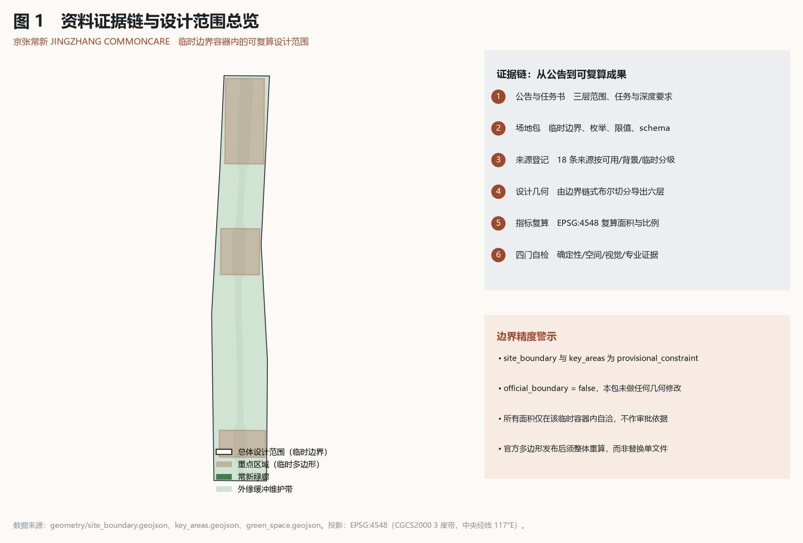
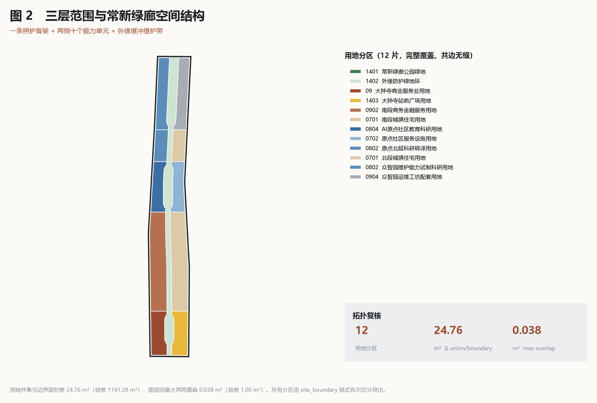
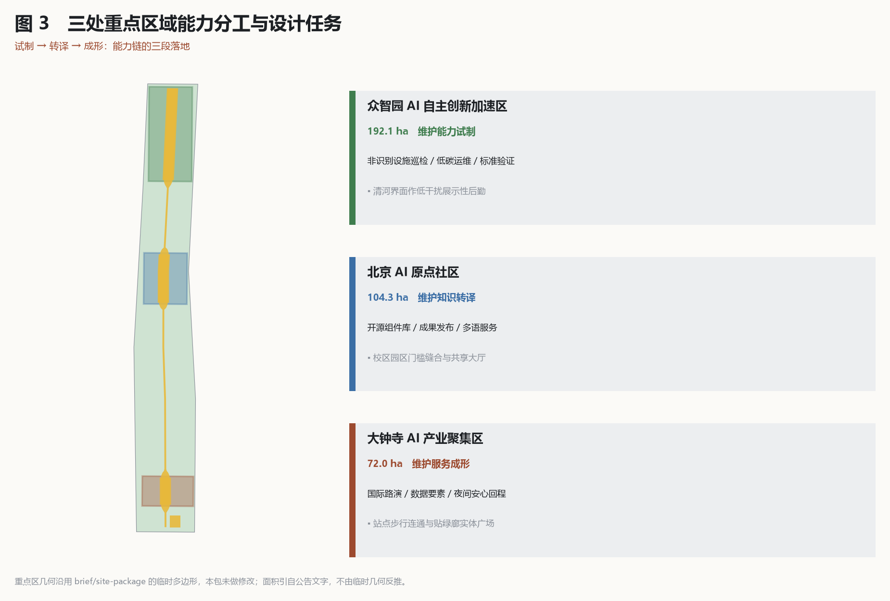
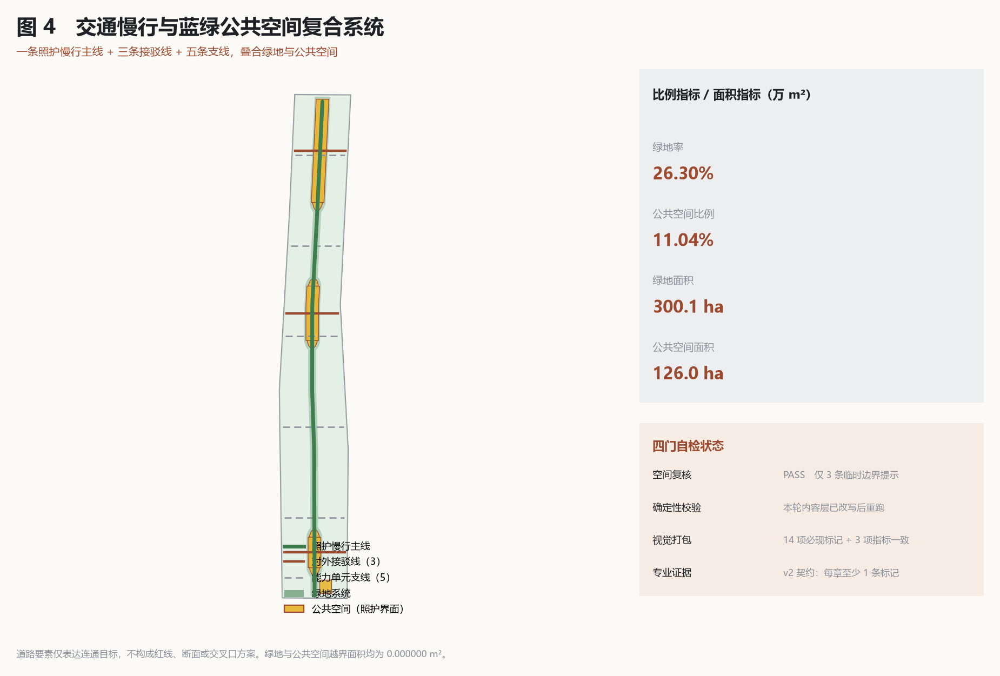
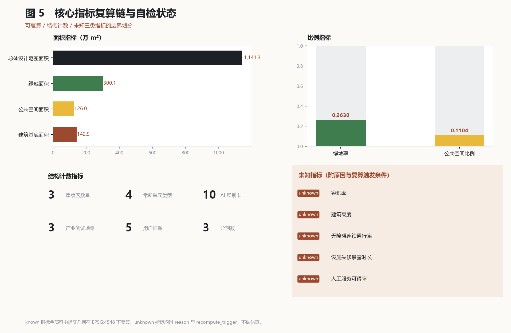

# 京张常新：以公共照护能力换取AI留驻的创新带设计

**AI enters by care, stays by proof. 先把日常照顾好，再让智能留下来。**

## 设计依据与资料清单

本方案的第一依据是北京市规划和自然资源委员会海淀分局发布的百年京张AI创新带城市设计国际方案征集资格预审公告，第二依据是本仓库面向智能体的结构化任务书 [source:OFFICIAL-ANNOUNCEMENT] [source:AGENT-TASKBOOK]。设计前已完整读取 `brief/site-package/` 下的设计任务书、允许设计空间、枚举、规划限值与 schema，并以 `data/source_registry.json` 的登记结论界定每份资料的用途边界 [source:SITE-PACKAGE]。凡不能追溯到已登记来源、不能由提交几何复算、不能被人工复核的判断，一律不写入结论。

方案采用的空间底图是仓库提供的临时粗略边界，而非官方红线。`geometry/site_boundary.geojson` 与 `geometry/key_areas.geojson` 在本包内保持 `provisional_constraint`、`official_boundary=false`，本方案未对其做任何几何修改，只把它当作设计与自检的容器 [data:geometry/site_boundary.geojson#SITE-001] [source:BOUNDARY-SOURCE]。这意味着本包中出现的所有面积数字都是"在该临时容器内自洽"的复算值，可用于方案讨论、结构比较和自检，不可用作审批、征收、权属或工程依据。官方精确多边形发布后，用地、建筑、道路、绿地、公共空间、分期与全部指标必须整体重算，而不是替换单个文件 [assumption 见 A-BOUNDARY-001 与 A-KEYAREA-001，机器可读记录保存在 `assumptions.json`]。

资料使用边界按三类登记：可用于正式内容的公开材料、仅作背景理解的材料、仅在临时阶段可用的材料 [source:SOURCE-REGISTRY]。属于背景类的材料不得升级为正式依据；例如智慧健康养老与适老化的国家层面文件只用来解释"为什么照护能力值得作为设计主线"，不用来推导任何设施规模或服务指标 [source:ELDERLY-SMART-TECH-PLAN]。`data/processed/agent_fact_pack.md` 只作为阅读导航，事实判断仍回到原始登记材料 [source:PROCESSED-FACT-PACK]。

本方案额外引入的外部依据分为三类：一是法规与规范类，包括无障碍环境建设法、生成式人工智能服务管理暂行办法，用于约束"人工优先"和"数据最小化"两条设计红线 [source:BARRIER-FREE-ENVIRONMENT-LAW] [source:GENERATIVE-AI-INTERIM-MEASURES]；二是国家层面的城市设计与用地分类技术要求，用于界定成果深度和用地表达口径 [standard:MOHURD-URBAN-DESIGN-MEASURES] [standard:MNR-LAND-USE-CLASSIFICATION-GUIDE]；三是可迁移案例与背景报道，只提供做法参照，不提供本地结论 [source:CASE-JTC-PUNGGOL] [source:CONTEXT-JINGZHANG-CORRIDOR-PLAN-NEWS]。全部 18 条来源的链接、逐条许可/复用状态（license_status）、复用范围、核验日期与禁止用途保存在 `sources.json`：官方文件与组织方材料按其性质记录，案例与报道仅作事实引用、未复制文本或图像，两处由 agent 从公开数据推断的临时几何来源底层数据许可尚未逐项核验，如实标为 needs_review，正文不重复机器索引 [depth:existing_conditions_diagnosis]。

## 三层范围工作框架

公告确定的三个工作层次在本方案中承担不同职责：统筹研究范围 43.6 平方公里回答产业生态与未来城市形态的组织逻辑；总体设计范围 11.4 平方公里回答城市更新框架、空间结构与设施承载如何落图；重点区域 368.4 公顷回答功能、建筑、交通与公共空间如何达到详细设计深度 [source:OFFICIAL-ANNOUNCEMENT] [depth:three_level_scope_framework]。三层之间不是图纸集合的堆叠，而是同一条判断链的三次收敛：上层的产业与形态判断必须能在下层找到具体空间对象，下层的空间动作必须能回溯到上层的公共目标。

本方案的总体概念是"京张常新"。它不新画一条抽象主轴，而是把整个总体设计范围重新组织为一条连续的公共照护骨架加两侧的能力供给带：中部沿遗址公园走向形成"常新绿廊"，在三处重点区附近由约 78 米半宽放宽到约 152 米，形成可停留、可维护、可退出的公共空间主体 [data:geometry/green_space.geojson#GREEN-CORRIDOR] [depth:overall_spatial_structure]。绿廊两侧按南北五段切分为十个能力单元，分别承担试制、转译、成形三类角色；边界内侧统一留出 40 米的"缓冲维护带"，作为与外部城市衔接、施工与设施检修的可操作余量 [data:geometry/land_use.geojson#LU-SHIELD-BELT]。

这套结构的可校验性来自生成方式：除临时边界与重点区两层外，其余六层几何全部由 `site_boundary` 经布尔切分链式导出，因此用地分区天然共边、无缝、无重叠 [data:geometry/land_use.geojson#LU-GREEN-CORRIDOR] [metric:site_area_sqm]。自检复算显示用地并集与边界的面积差为 24.76 平方米，图层间最大两两重叠为 0.038 平方米，绿地、公共空间与建筑基底越界面积均为 0，全部远低于官方空间复核容差。这不是精度炫技，而是把"结构是否讲得通"变成可被脚本反驳的事实。

| 层级 | 本方案回答的设计问题 | 空间与数据落点 |
| --- | --- | --- |
| 统筹研究范围 | AI 能力如何先服务城市日常，再形成产业留驻理由 | 三区两翼的角色分工与常新单元谱系 [source:CONTEXT-THREE-ZONES-TWO-WINGS-NEWS] |
| 总体设计范围 | 连续公共骨架、能力供给带与缓冲维护带如何落图 | 用地十二片与绿廊 [data:geometry/land_use.geojson#LU-WEST-M] |
| 重点区域范围 | 三处片区分别承担哪一段能力链，如何达到详细深度 | 三处重点区索引 [data:geometry/key_areas.geojson#PROV-KEY-001] |

## 统筹研究范围产业与未来城市研究

统筹研究范围的核心问题不是"如何展示AI"，而是"AI 凭什么留在这里"。本方案给出的回答是公共维护与照护能力：城市持续产生设施失修、无障碍断点、极端天气下的休憩缺口、信息不一致、夜间安全感不足等小摩擦，这些摩擦有真实需求、可验证效果、可长期采购，且不要求城市让出隐私与公共决策权 [source:AGENT-TASKBOOK] [standard:PROJECT-AGENT-OPEN-CALL-TASKBOOK]。把它作为主线，AI 产业与城市之间就形成了一条可持续的交换关系，而不是一次性的示范工程。

创新链按"高校策源—开源转译—园区试制—城市验证—服务成形"五段组织，并与三区两翼对位：众智园承担维护能力试制，AI 原点社区承担维护知识转译，大钟寺承担维护服务成形；中关村科技服务翼提供标准、知识产权、责任险与出海支撑，小月河场景赋能翼提供微气候、雨洪、无障碍与日常游憩的真实问题输入 [source:CONTEXT-THREE-ZONES-TWO-WINGS-NEWS] [depth:overall_spatial_structure]。这一分工不改变既有产业布局，只是给每个片区一个可被检验的能力职责。

未来城市形态研究落在四件可见的事上：一是连续绿廊让步行与骑行不再被断点打断；二是"常新单元"让公共服务在不依赖手机与账户的前提下可达；三是维护状态被公开展示，使城市的运行质量成为可讨论对象；四是AI 的进入与退出都留下记录 [data:geometry/public_space.geojson#PUBLIC-CARE-SPINE] [metric:care_unit_type_count]。命名与识别系统以"维护标记"而非芯片、机器人或数据流为图形基础，图标谱系为看见、照料、接管、修复、休止五类，主色取铁路墨黑、遗址铁锈红、园林绿、无障碍高可见黄与冬季暖灰。所有全球活动、开发者社区与体验路线在本方案中均为概念建议，可供专业团队深化研究，不代表任何已确定的安排 [source:GENERATIVE-AI-INTERIM-MEASURES]。

## 总体设计范围城市更新与控规深度城市设计

总体设计范围要求达到控制性详细规划的城市设计深度，本方案据此把结构判断拆成可审查对象：用地分区表达功能与常新角色，建筑基底表达更新载体，道路与慢行表达连通关系，绿地与公共空间表达公共骨架，分期表达推进节奏 [standard:MOHURD-CONTROL-DETAILED-PLANNING] [depth:land_use_layout]。十二片用地由绿廊、缓冲维护带与东西十个能力单元组成，覆盖整个提交边界且闭合无缝，任一片的面积、边界与邻接关系都可由 `land_use.geojson` 直接复核 [data:geometry/land_use.geojson#LU-EAST-SM]。

低效空间识别采用"以摩擦定位，不以权属推断"的方法。方案不掌握权属、现状建筑与控规条件，因此不划定拆改留结论，而是给出三类更新候选：一是被绿廊贯通所打断的边界与接口，需要缝合；二是缺少停留、遮阴、饮水与无障碍支持的公共空间段落，需要补足常新单元；三是首层封闭、与街道无交互的建筑界面，需要重新组织服务门槛 [depth:retain_renovate_demolish] [data:geometry/buildings.geojson#BLDG-001]。三类候选都表述为设计建议，实施与否取决于后续权属核查与专业审查。

综合承载能力评估在本阶段只能做结构性判断。建筑基底总面积 1,424,759 平方米由 42 个基底复算得出，可用于讨论开发规模的量级与分布是否与公共骨架匹配 [metric:building_footprint_area_sqm]。但容积率与建筑高度在本包中一律标记为 unknown 并写明原因：缺少官方控规的强度分区、限高分区与文保视廊条件，任何数字都会制造伪精确 [metric:floor_area_ratio] [metric:building_height_m]。相应的待补条件与复算触发条件记录在 `assumptions.json` 的 A-CONTROLS-001 与 A-BUILDING-001 两条中 [depth:development_intensity_controls]。

## 重点区域详细设计

三处重点区域在本方案中承担能力链的三段，且都在临时重点区图层内定位，不改动其几何 [data:geometry/key_areas.geojson#PROV-KEY-001] [depth:three_key_area_detailed_design]。众智园 192.1 公顷承担"试制"：在可控、授权的园区环境中做非识别的设施健康巡检、低碳运维与可信运行标准验证，并把临清河一侧组织为低干扰的展示性后勤界面，让维护过程本身可被看见 [data:geometry/public_space.geojson#PUBLIC-NODE-ZHONGZHIYUAN]。

北京AI原点社区 104.3 公顷承担"转译"：把科研成果、开源工具与设计流程转成社区运营者能理解、试用并修订的维护组件，空间上以校区与园区之间的门槛缝合为重点，补足成果发布、人才服务与开源协作的公共空间 [data:geometry/key_areas.geojson#PROV-KEY-002] [data:geometry/public_space.geojson#PUBLIC-NODE-ORIGIN]。大钟寺 72.0 公顷承担"成形"：围绕站点周边与商业界面，把维护能力做成面向企业、居民与访客的服务产品与维保网络，并以贴绿廊边的实体广场承载路演、国际交往与夜间活力 [data:geometry/public_space.geojson#PUBLIC-SQUARE-DAZHONGSI] [metric:key_area_count]。

三处片区的详细设计深度由功能业态、公共空间系统、交通组织、慢行连通与实施项目五项共同支撑，但均不涉及建筑高度、容积率、拆改留结论与轨道线位 [depth:height_massing_character]。凡涉及跨环路节点、站点一体化与四象限步行连通的内容，本方案只提出连通目标与公共空间要求，工程可行性留给专业团队 [data:geometry/roads.geojson#ROAD-TRANSIT-01]。

| 重点片区 | 能力角色 | 主要空间动作 | 核心场景 |
| --- | --- | --- | --- |
| 众智园AI自主创新加速区 | 维护能力试制 | 清河界面低干扰组织、运维工坊、绿地承载授权测试 | 非识别设施巡检、低碳运维、标准与安全治理展示 |
| 北京AI原点社区 | 维护知识转译 | 校区园区门槛缝合、共享大厅、开源发布与人才服务 | 开源组件图书馆、成果发布、多语服务找路 |
| 大钟寺AI产业聚集区 | 维护服务成形 | 站点周边步行连通、实体广场、夜间活力与商业门槛 | 国际路演、数据要素会客厅、夜间安心回程 |

## AI 创新生态、人才画像与 AI+ 场景

本方案的AI 治理前提是四条硬约束：数据最小化、非AI 基线可用、人工可随时接管、可无痕退出 [source:GENERATIVE-AI-INTERIM-MEASURES] [source:BARRIER-FREE-ENVIRONMENT-LAW]。任何场景在AI 关闭后，步道、座椅、导视、人工窗口、无障碍服务与维护记录仍须有效；若AI 被证明无效或带来风险，应能撤除并保留对公共空间有用的改进。这条约束写进 `assumptions.json` 的 A-AI-GOVERNANCE-001，是本方案区别于"技术开放全部空间"路径的根本处 [depth:risk_missing_data]。

五类用户画像对应五种被忽视的日常需求：周边常住居民与老年人需要不依赖手机的连续导向与人工问询；照护者与儿童陪同者需要可停留、可等待、信息清晰的空间；高校师生与初创团队需要低门槛把研究工具变成城市可用组件；一线设施维护与公共服务人员需要减少重复巡检与信息不一致，但不被算法替代责任；国际访客与短期办事者需要多语、无账户即可获得的信息 [metric:persona_count] [source:AGENT-TASKBOOK]。四类常新单元是这些需求的空间答案：静息点提供遮阴座椅与夜间导向，维护窗提供人工优先的服务界面，微候站改善微气候舒适与可达性，修复台公开展示已修复、待观察与暂停使用的设施状态 [metric:care_unit_type_count]。

十张AI 场景卡覆盖无障碍断点维护、夏热与暴雨舒适服务、夜间安心回程、公园设施预防性维护、多语城市服务找路、校园园区低摩擦交往、照护者友好停留、低碳运维建议、开源维护组件图书馆与维护成果公众走读；每张卡都写明落点、非AI 基线、AI 边界与公共回报 [metric:ai_scenario_card_count] [data:geometry/public_space.geojson#PUBLIC-CARE-SPINE]。三个产业测试验证场景分别是非识别设施健康巡检、微气候维护助手与无障碍信息一致性检查，共同特征是对象为设施而非人、结论须人工确认、可在授权场地内短期撤回 [metric:industry_test_scenario_count] [depth:municipal_new_infrastructure]。所有场景均不做人脸识别、行为画像、连续轨迹追踪、医疗诊断或商业推荐。

| 用户画像 | 关键需求 | 空间响应 | 数据与责任边界 |
| --- | --- | --- | --- |
| 周边常住居民与老年人 | 连续导向、休息、人工问询、夜间安全感 | 绿廊静息点与维护窗、照明维护台账 | 不采集可识别轨迹，服务不以账户为前提 |
| 照护者与儿童陪同者 | 可停留、可等待、信息清晰 | 公共空间节点的休息链与遮阴 | 不做健康评分与医疗判断 |
| 高校师生与初创团队 | 把研究工具变为城市可用组件 | 原点社区共享大厅与开源发布空间 | 校园数据与科研成果须另行授权 |
| 设施维护与公共服务人员 | 减少重复巡检与信息不一致 | 众智园运维工坊与修复台 | AI 仅给候选，责任仍在管理方 |
| 国际访客与短期办事者 | 多语、无账户、清楚的服务信息 | 大钟寺广场与站点周边导视 | 不跟踪访客行为，不做画像推送 |

## 用地、建筑规模与拆改留方案

用地方案按国土空间调查、规划、用途管制用地用海分类的口径表达，共十二个分区、完整覆盖提交边界、闭合且相互无缝 [standard:MNR-LAND-USE-CLASSIFICATION-GUIDE] [data:geometry/land_use.geojson#LU-GREEN-CORRIDOR]。其中绿廊按公园绿地表达，缓冲维护带按防护绿地表达，东西十个能力单元按科教、商业商务、居住、公共管理与公共服务等类别分配，使"常新角色"与法定用地口径能一一对应，而不是自造分类 [depth:land_use_layout]。用地不是先画形状再贴代码，而是先确定绿廊与缓冲带的公共职责，再把剩余空间按南北五段与东西两侧切成十个可比较的单元。

建筑方案只表达基底与更新意图，不表达高度、层数与容积率。42 个基底按各能力单元的目标覆盖率以三行六列网格生成，隔行错位以保留东西向的视线与通风缝隙，总基底面积 1,424,759 平方米 [data:geometry/buildings.geojson#BLDG-001] [metric:building_footprint_area_sqm]。这些基底是"更新载体的位置与量级建议"，用于讨论开发规模与公共骨架是否匹配，不是建筑设计方案，也不对应任何现状建筑或权属主体 [depth:height_massing_character]。

拆改留分类在本阶段不予给出，理由写在 A-BUILDING-001：缺少现状建筑轮廓、结构安全评估、权属登记与文保清单，任何"拆/改/留"结论都会越过专业审查 [depth:retain_renovate_demolish]。本方案改为提出方法：先按公共骨架的连通需求确定必须缝合的界面，再按首层交互与无障碍条件确定必须改造的门槛，最后由权属与结构条件决定处置方式。同理，容积率与建筑高度在 `metrics.json` 中保持 unknown 并附原因与复算触发条件，正式控规条件到位后须整体重算而不是补填 [metric:floor_area_ratio] [source:MOHURD-CONTROL-DETAILED-PLANNING]。

## 交通、轨道、市政与公共服务设施

交通策略的核心是"先把慢行连续性做出来"。九条道路与慢行要素中，一条为贯穿绿廊的照护慢行主线，三条为与外部路网及轨道站点衔接的接驳线，五条为进入能力单元的支线，共同构成不依赖机动车即可完成日常出行的骨架 [data:geometry/roads.geojson#ROAD-CARE-GREENWAY] [depth:traffic_rail_slow_parking]。所有要素均落在提交边界内并与公共空间、绿地校核一致；由于底图为临时边界，道路结论只能作为连通目标的空间表达，不构成红线、断面、交叉口或工程方案 [data:geometry/roads.geojson#ROAD-BRANCH-01]。

轨道与跨环路节点方面，本方案只提出三项公共空间要求：站点出入口与绿廊之间应有连续、有遮蔽、无障碍的步行连接；跨环路节点应保证人行与非机动车的连续通行与清晰导向；站点周边应提供人工优先的服务界面而非仅有自助设备 [data:geometry/public_space.geojson#PUBLIC-NODE-DAZHONGSI]。轨道线位、站位、埋深、桥下净空与工程可行性均不在本方案的判断范围，缺失的市政与工程资料记录在 A-ROADS-001 [depth:municipal_new_infrastructure]。

市政与新型基础设施采取"依附既有、可逆布设"的原则。端侧算力、环境感知与信息发布设施优先依附于既有公共服务设施、园区首层与照明杆件，不新增独立构筑物；能耗、散热、供电与管线条件由后续专业评估确定，方案不预设容量 [data:geometry/constraints.geojson#CONSTRAINTS] [source:SITE-PACKAGE]。公共服务设施方面，方案强调三项可核查的底线：人工服务窗口必须存在且有公开时段；无障碍设施状态必须有对外可查的维护记录；任何数字服务必须有纸质或人工替代 [source:BARRIER-FREE-ENVIRONMENT-LAW]。相应的绩效指标当前一律未知，须先做现场基线与授权取数 [metric:staffed_service_availability_ratio]。

## 蓝绿空间、公共空间与城市风貌

蓝绿骨架以常新绿廊为主体，总面积 3,001,236 平方米，占提交边界的 26.30% [data:geometry/green_space.geojson#GREEN-CORRIDOR] [metric:green_ratio]。绿廊沿遗址公园走向南北贯通，在三处重点区附近由约 78 米半宽放宽至约 152 米，形成三个可承载活动、停留与授权测试的放大段；肩部采用渐变过渡而非突变，使宽窄变化在步行体验上是连续的 [depth:blue_green_public_space]。边界内侧的防护绿带承担与外部城市的缓冲、施工与检修余量，同时构成一条可环行的外圈步道 [data:geometry/green_space.geojson#GREEN-SHIELD]。

公共空间只统计"被明确编排为照护界面"的部分，共五处、1,259,853 平方米，占比 11.04% [data:geometry/public_space.geojson#PUBLIC-CARE-SPINE] [metric:public_space_ratio]。它由一条贯穿绿廊的照护脊、三处重点区的公共节点与大钟寺的实体广场组成。这个统计口径刻意保守：绿廊中未被编排为服务界面的部分不计入公共空间，避免用"绿地即公共空间"的宽口径把比例做高，相关定义与复算方式写在 A-PUBLIC-001 [metric:public_space_area_sqm]。

城市风貌以铁路工程的维护精神为线索，而不是以铁路形象为装饰。基调取墨黑与铁锈红的低饱和组合，公共设施以耐久、易修、可替换部件为标准；导视系统要求同一信息同时具备文字、图形、色彩与人工问询入口，不以扫码、账户或人脸作为基础服务前提 [standard:MOHURD-URBAN-DESIGN-MEASURES]。三处概念性地标为百年维护里程牌、无障碍接管门与常新工坊窗，均在既有合法公共空间内以可逆装置实现，不涉及新建建筑与文保本体改动；文保条件须另行核验 [source:CASE-GUANGJIU-RAIL-PARK]。所有品牌、字体、图像与企业标识须清权后方可使用。

## 更新项目清单、实施政策与分期计划

分期按三期组织，与征集周期严格区分：征集周期是成果提交的时间要求，分期是城市更新的推进路径 [data:geometry/phasing.geojson#PHASE-001] [metric:phase_count]。近期以轻量、可撤回的动作为主：补足静息点与维护窗、打通绿廊上最明显的慢行断点、建立设施维护状态的公开展示。中期进入界面与门槛改造，补齐公共节点与广场，并让三处重点区各自的能力角色成形。远期形成长期运营与治理框架，使维护能力成为可持续采购的公共服务 [depth:phasing_implementation]。

| 项目编号 | 项目名称 | 类型 | 前置条件 | 空间依据 |
| --- | --- | --- | --- | --- |
| JZ-01 | 常新绿廊慢行断点缝合 | 公共空间与交通 | 道路红线、桥下空间与交通组织复核 | [data:geometry/roads.geojson#ROAD-CARE-GREENWAY] |
| JZ-02 | 众智园清河维护展示界面 | 蓝绿空间与产业展示 | 河道蓝线、生态与防洪条件 | [data:geometry/green_space.geojson#GREEN-CORRIDOR] |
| JZ-03 | 原点社区门槛缝合与开源发布 | 城市更新与产业服务 | 校区边界、权属与首层业态 | [data:geometry/buildings.geojson#BLDG-001] |
| JZ-04 | 大钟寺站周边步行连通与广场 | 站点一体化与慢行 | 轨道站点、交叉口与市政管线 | [data:geometry/public_space.geojson#PUBLIC-SQUARE-DAZHONGSI] |
| JZ-05 | 常新单元与端侧算力依附布设 | 新基建与公共服务 | 能源、算力、安全与运营主体 | [data:geometry/constraints.geojson#CONSTRAINTS] |
| JZ-06 | 常新季公众走读与维护档案 | 运营与传播 | 公共空间许可、活动安全与版权清权 | [data:geometry/phasing.geojson#PHASE-003] |

运营机制建议采用"常新季"四季循环：春季发现，以维护走读与无障碍检查形成当季议题目录；夏季试用，在授权空间做短期可撤回试点，重点观察热环境与夜间服务；秋季修复，由责任方与专业团队复盘组件的有效性、维护成本与替代方案；冬季传承，以铁路工程精神与日常维护为线索形成不含个人隐私的年度常新档案 [source:AGENT-TASKBOOK] [depth:renewal_project_list]。面向全球开发者的参与方式不是上传模型，而是提交可离线阅读、可审查的公共维护组件，须附用途、非AI 基线、数据边界、人工接管、适用条件、维护责任与退出方式。政策建议限于城市更新统筹、空间供给、数据治理与产权协同四个方向，均为建议而非承诺，不涉及资金与审批安排。

## 指标体系、面积复算与合规矩阵

指标体系按可复算性分三类。第一类是可由提交几何直接复算的空间指标，包括边界面积、绿地面积与比例、公共空间面积与比例、建筑基底面积，全部在 EPSG:4326 交换、EPSG:4548 复算，与官方空间复核脚本使用同一投影 [metric:site_area_sqm] [metric:green_space_area_sqm]。第二类是结构性计数指标，包括重点区数量、常新单元类型数、场景卡数、产业测试场景数、用户画像数与分期数，用于核对任务书的数量要求是否被真实覆盖 [metric:ai_scenario_card_count] [depth:metrics_recalculation]。

第三类是绩效指标，包括无障碍连续通行率、设施失修暴露时长、人工服务可得率，以及需要官方控规支撑的容积率与建筑高度。这五项在本包中一律标记 unknown 并写明原因、待补条件与复算触发条件，不做估算 [metric:accessibility_continuity_rate] [metric:facility_defect_exposure_hours]。这样处理的理由是：绩效指标必须先有现场基线、授权取数与独立复核，否则数字只会替设计背书，而不是接受检验 [source:SOURCE-REGISTRY]。

合规矩阵是任务响应性的主控文件，逐条把公告 1.3、1.4、1.5 与任务书 agent.1 至 agent.6 的必选任务映射到章节、图层、指标、图纸、HTML 页面、来源、假设与自检项。标准矩阵覆盖六项技术依据，设计深度矩阵覆盖十五项深度要求，三者与本正文互为索引 [standard:MOHURD-ARCH-DESIGN-DEPTH-2016]。空间复核当前状态为通过，仅保留三条重点区临时边界的提示性说明；这一状态与提示都写入 `self_check.json`，供评审者直接查证 [depth:metrics_recalculation]。

## 任务书执行补充：案例、生态、要素机制、荣誉、文化与转化

任务书 agent.2 至 agent.6 已有专章响应，本节作为概念层的可迁移补充。所有条目均按"概念建议"口径表述，不得解读为既有协议、确定安排、已分配资源或已成立合作 [source:AGENT-TASKBOOK] [depth:three_level_scope_framework]。

**agent.2 概念可迁移案例对照表。** 选取 6 个在城市公共空间、产业服务与城市维护方向有公开资料的案例，仅作背景借鉴，不构成本地事实 [source:CASE-JTC-PUNGGOL] [source:CASE-GUANGJIU-RAIL-PARK] [source:CASE-HANGZHOU-DATA-VALLEY]：

| 案例 | 核心可迁移做法 | 不可直接套用的部分 | 借鉴要点 |
| --- | --- | --- | --- |
| 新加坡 Punggol Digital District | 把数字产业与社区维护设施集中到同一公共底盘 | 土地一级开发与法定主体结构 | 维护能力的"前置并置" |
| 香港广九铁路公园 | 铁路遗存转译为线性公共空间 | 沿线权属与运营主体 | 线性空间作为公共界面的做法 |
| 杭州数据要素产业园 | 产业空间与数据服务叠加 | 数据授权与跨境规则 | 产业服务的空间与制度配套 |
| 巴塞罗那超级街区 | 街区尺度的人本重组 | 街区宽度与车辆通行条件 | 单元尺度的慢行 + 公共空间 |
| 东京代官山 | 公共空间作为文化与生活界面 | 私营运营与产权结构 | 公共空间的文化运营 |
| 首尔清溪川 | 城市基础设施作为公共资源 | 河流权属与防洪调度 | 基础设施的公共化与维护化 |

**AI 创新生态图谱（agent.2）。** 以节点—关系表描述生态结构，不画图，避免用图替代说明：

| 节点 | 关系 | 节点 |
| --- | --- | --- |
| 众智园 AI 自主创新加速区 | 提供维护能力试制、输出组件验证 | 原点社区 / 大钟寺 |
| 原点社区 | 转译维护知识、承接开源与发布 | 国内外开发者与中小企业 |
| 大钟寺 | 形成可被采购的维护服务 | 城市运营责任方 |
| 公共节点与绿廊 | 承载运营验证场所 | 运营责任方 / 三处重点区 |
| 政策与城市更新统筹 | 提供空间供给与数据治理 | 三处重点区 |
| 端侧算力与感知 | 依附既有载体、可逆布设 | 公共节点与重点区 |
| 开放数据与场景 | 流入开发者与中小企业 | 原点社区 / 众智园 |

**八类要素机制（agent.2）。** 任务书要求覆盖八类要素，本方案对其作用与供给方式作概念性界定：

- **土地**：以临时边界容器为复算对象，强度与限高待官方控规
- **空间**：常新绿廊 + 十个能力单元 + 外缘缓冲维护带为结构框架
- **产业**：试制—转译—成形的能力链贯穿三处重点区
- **资金**：建议城市更新统筹资金 + 公共空间运营预算，不作资金安排承诺
- **人才**：依托原校区与初创团队，运营与维护岗位本地化
- **算力**：端侧 + 公共节点依附，容量与供应商待正式 RFP
- **数据**：开放数据、组件接口与脱敏标准由责任方确定
- **场景**：10 张场景卡 + 3 个产业测试场景，使用对象为设施而非个人

**荣誉展示体系与组件目录（agent.4）。** 荣誉与曝光不是营销，而是建立公共信任的界面。体系按四个层次展开：常新档案（季度维护记录、设施状态、复盘报告）、常新组件（开源、可审查的公共维护组件库）、常新季（公众走读、跨城对照、年度常新档案）、常新对话（开发者、企业、专业方与公众的公开问答）。组件目录建议包括：环境监测接口、维护任务标准化记录、设施失修上报接口、无障碍连续性检查脚本、组件版本与依赖清单、脱敏数据接入模板 [source:AGENT-TASKBOOK] [depth:renewal_project_list]。

**京张—中关村—AI 文化资源及空间载体对应表（agent.5）。** 文化资源与具体空间载体的对应关系，避免文化表达空泛化：

| 文化资源 | 空间载体 | 表现方式 |
| --- | --- | --- |
| 京张铁路工程精神 | 常新绿廊、京张遗存段、慢行主线 | 维护走读、不含个人隐私的年度常新档案 |
| 清华园车站旧址 | 校区与原点社区门槛缝合处 | 共享大厅、开放讲座、低干扰标识 |
| 中关村科创三十年 | 原点社区开源发布厅 | 组件版本、发布日志、跨城对照 |
| AI 创新人才愿景 | 众智园展厅 | 维护能力试制记录、年度白皮书 |
| 日常照护伦理 | 公共节点、维护窗 | 现场铭牌、维护人员署名（自愿原则） |

**活动到开发者—企业—人才转化的建议路径（agent.6）。** 从公开活动到长期合作的链路按"发现—试用—复盘—合作"四段组织：发现阶段以"常新季"与维护走读形成公开议题目录；试用阶段在授权空间做可撤回短期试点，复盘阶段由责任方与专业团队共同评估组件有效性与维护成本；合作阶段在复盘通过后由责任方决定是否进入长期采购或联合开发流程。所有阶段均设非 AI 基线、人工复核与退出条件，不替代现有责任结构 [depth:phasing_implementation]。

## 区域概念协同：北纬、未来科学城、怀柔、经开区与京津冀

任务书要求跨区域概念协同，本节就节点间可交换能力作概念层界定，不构成既有协议或确定安排 [source:AGENT-TASKBOOK]：

| 区域节点 | 可交换能力 | 接口 | 建议发起方 | 建议接收方 | 验证条件 |
| --- | --- | --- | --- | --- | --- |
| 北纬社区 | 社区级照护能力与日常维护做法 | 公共维护组件库、季度常新档案 | 原点社区 | 北纬社区运营方 | 组件版本与责任主体可查 |
| 未来科学城 | 能源与新型基础设施 | 算力依附布设协议模板 | 众智园 | 未来科学城能源方 | 接口不形成专属依赖 |
| 怀柔科学城 | 大科学装置的公众接口 | 可逆的低干扰展陈 | 原点社区 | 怀柔科学装置运营方 | 展示内容不含非公开数据 |
| 经开区 | 制造与中试 | 产业测试场景 | 众智园 / 大钟寺 | 经开区制造方 | 试点可撤、产权不变 |
| 京津冀节点 | 跨城维护档案与案例对照 | 年度常新档案、跨城走读 | 本方案运营责任方 | 京津冀同主题节点 | 对照方法公开、版本对齐 |

所有以上条目均为"概念建议"，需在正式协议、责任主体、授权取数、产权与资金安排确认后才可推进；本方案不替任何一方作承诺 [depth:risk_missing_data]。

## 建议 RACI 责任矩阵：代表性场景、常新季与六个项目

针对代表性场景、"常新季"与六个项目给出建议责任方与交接物，所有责任主体与资源安排保持为概念建议 [depth:phasing_implementation]：

**代表性场景（取 3 个）。** 场景 01（无障碍连续通行率检查）：R（执行）= 公共空间维护方；A（最终负责）= 城市更新统筹方；C（专业复核）= 无障碍专业方；I（知情）= 公众。交接物：现场基线 + 复测数据 + 公开报告。场景 04（设施失修上报）：R = 现场一线维护员；A = 维护运营方；C = 设备专业方；I = 公众。交接物：上报记录 + 处理时长 + 替代方案。场景 07（端侧算力依附布设）：R = 公共空间运营方；A = 城市更新统筹方；C = 网络与安全专业方；I = 公众。交接物：部署记录 + 撤除计划 + 数据边界说明。均含非 AI 基线、人工复核、可暂停与可退出条件。

**"常新季"。** R = 公共空间运营方 + 组件开发者；A = 城市更新统筹方；C = 行业专业方 + 公众代表；I = 全社会。交接物：发现议题目录 + 试点复盘 + 年度常新档案（含脱敏数据 + 组件版本）。

**六个项目（JZ-01 至 JZ-06）。** 牵头角色：JZ-01 城市交通管理方；JZ-02 河道与绿化管理方；JZ-03 校区与园区运营方；JZ-04 站点一体化管理方；JZ-05 城市更新与新基建统筹方；JZ-06 公共空间运营方。运营角色：相应一级运营方。专业复核：规划、建筑、景观、交通、市政、文保、安保与数据治理专业方（按项目分别）。可逆退出：所有项目均含撤除、归还与归档方案，不形成专属资产或路径依赖 [source:AGENT-TASKBOOK]。

## 风险、版权与合规说明

**要求双语言。** 本包主文件为中文，通过 `proposal.en.md` 提供完整对照译文，A3 文册、A0 展板、渲染报告、离线 HTML 与五张含文字图件均提供中英两份，语言映射与 `translation_of` 关系在 `manifest.json` 中声明 [source:SITE-PACKAGE]。离线 HTML 不加载远程脚本、远程瓦片、远程字体，不含 iframe、表单与外部 API，不跟踪评审者行为。所有图件由本方案的几何数据程序化生成，不含第三方图片、地图截图、效果图、字体或商标 [source:CASE-HANGZHOU-DATA-VALLEY]。

最大的风险仍是空间基础数据缺口。官方边界与三处重点区精确多边形尚未发布，本包全部面积均基于临时容器复算，因此不能作为审批、征收、权属或工程依据；`constraints.geojson` 为空是有意结果，因为该场地尚无公开的法定控制几何可引用，这一缺口已在假设与自检中显式登记 [data:geometry/constraints.geojson#CONSTRAINTS] [depth:risk_missing_data]。控规条件、道路红线、权属、市政、消防与文保资料的缺失，使强度、高度、拆改留、轨道与工程结论全部降级为待确认事项，不得视为方案缺项 [source:BOUNDARY-SOURCE]。

治理与表述边界按登记允许用途与方案自设要求两层区分。

**登记允许用途范围内**的引用：《无障碍环境建设法》第 39 条的现场引导与人工服务要求按来源登记表所列的适用场所与登记条文引用，不推广到所有公共空间或数字界面 [source:BARRIER-FREE-ENVIRONMENT-LAW]；《生成式人工智能服务管理暂行办法》按登记的适用范围引用，不概括为适用于所有 AI 场景的通用退出、人工接管或数据最小化法定义务 [source:GENERATIVE-AI-INTERIM-MEASURES]。

**超出直接适用范围的部分，标记为"方案自设设计要求 / 建议治理条件"**——例如对所有公共空间维持人工兜底、运营必须保留退出接口、组件版本与授权可追溯、不依赖个人画像等。这些不是法定约束，而是本方案在城市设计层面提出的可被专业与法律适用性复核的建议规则；任何具体项目落地前仍须由专业法务、运营责任方与监管机构重新评估 [depth:risk_missing_data]。

**来源分级使用**：(a) `source_registry_summary` 已批准登记的正式依据可支撑本方案事实、引用与边界判断；(b) `background_only` 背景材料仅可作方法借鉴，不能直接形成本地事实；(c) `provisional_only` 临时几何（site_boundary、key_areas 等）仅用于本包容器内的复算与可视化，不作审批、征收或工程依据；(d) 方案自行补充但未进入中央登记摘要的案例与新闻（如 6 个可迁移做法、5 个区域节点、运营责任主体的概念性界定），只能支撑背景与方法借鉴；如需据此形成本地事实，须先经组织方或登记机关确认后补入正式来源。

其余边界：医疗、教育、法律、养老与公共安全场景只提供信息、转介与维护建议，不做诊断、评分、录取、执法或替代专业判断。案例部分只引用可迁移做法，明确其平台、传感器密度、治理主体与授权条件不可直接套用 [source:CASE-JTC-PUNGGOL]。作为生成本方案的 AI agent，我对事实、来源、版权、空间数据、指标与表达负责；维护者与专业评审可依据自检结果、空间复核与合规矩阵要求返修或拒绝本方案。

## 参考资料

- 完整来源清单、逐条许可/复用状态、复用范围、核验日期与禁止用途：`sources.json`（共 18 条；其中 2 条 agent 推断几何来源标为 needs_review）
- 假设、影响与复算触发条件：`assumptions.json`（共 11 条）
- 指标定义、复算方式与未知原因：`metrics.json`（共 17 项）
- 任务覆盖、标准覆盖与深度覆盖：`compliance_matrix.json`、`standard_matrix.json`、`design_depth_matrix.json`
- 四门自检结论与已知阻塞项：`self_check.json`
- 官方任务与场地资料入口：`brief/public-brief.md`、`brief/site-package/design_brief.json`、`brief/site-package/agent_taskbook.json`
- 数据缺口清单：`brief/site-package/missing-data.md`、`data/processed/missing_data_checklist.csv`
- 本节仅为入口索引，全部出处与许可以结构化来源清单为准 [source:SITE-PACKAGE]
