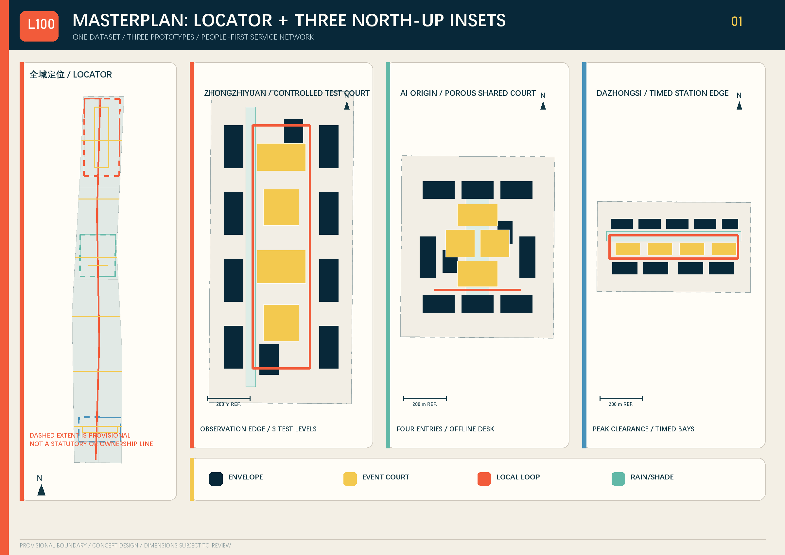
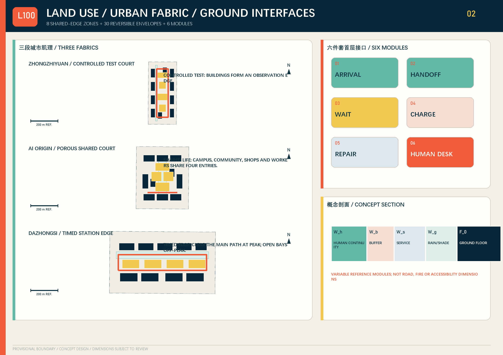
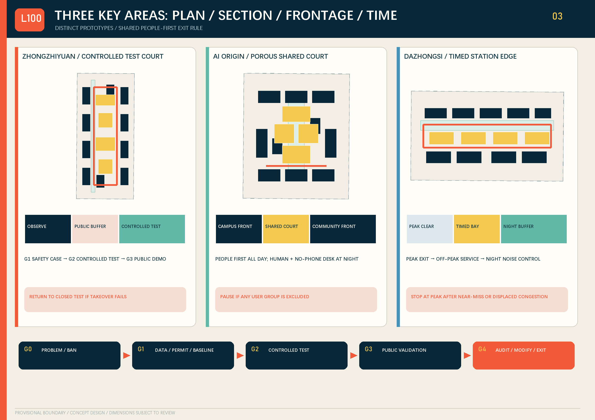
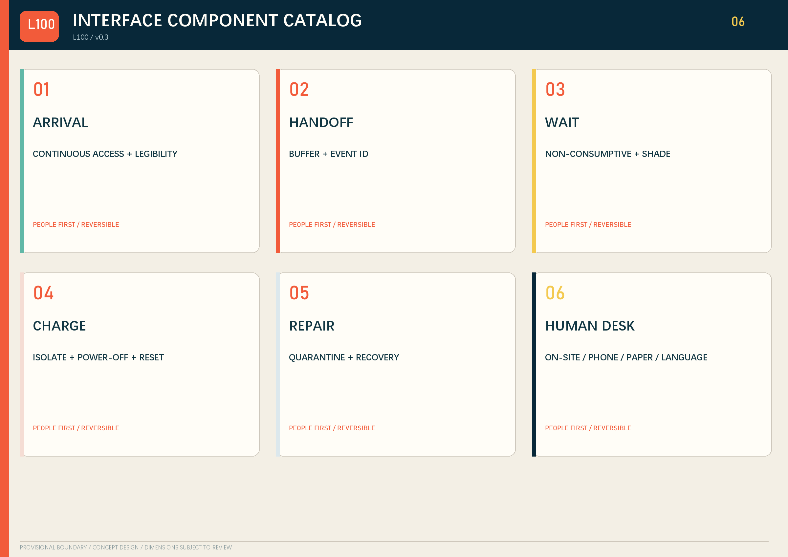
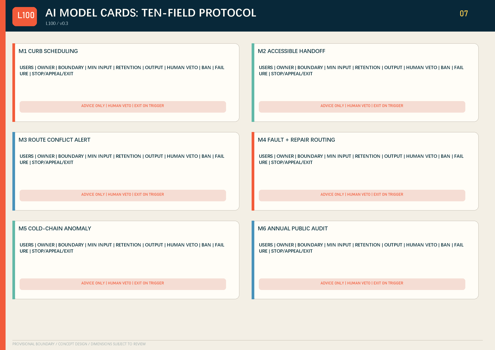
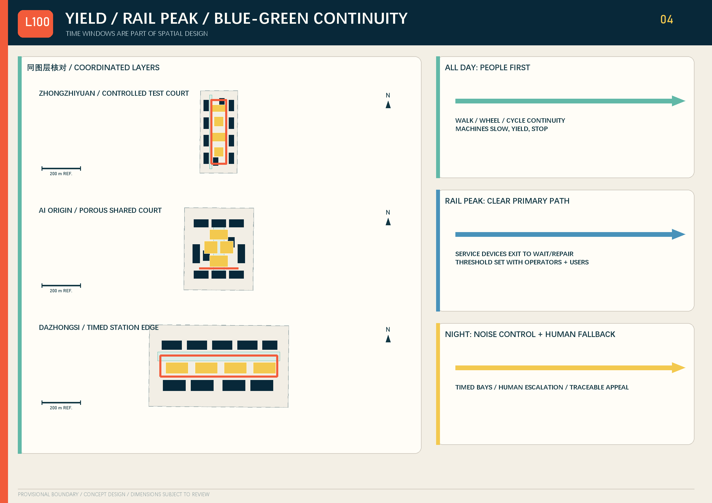
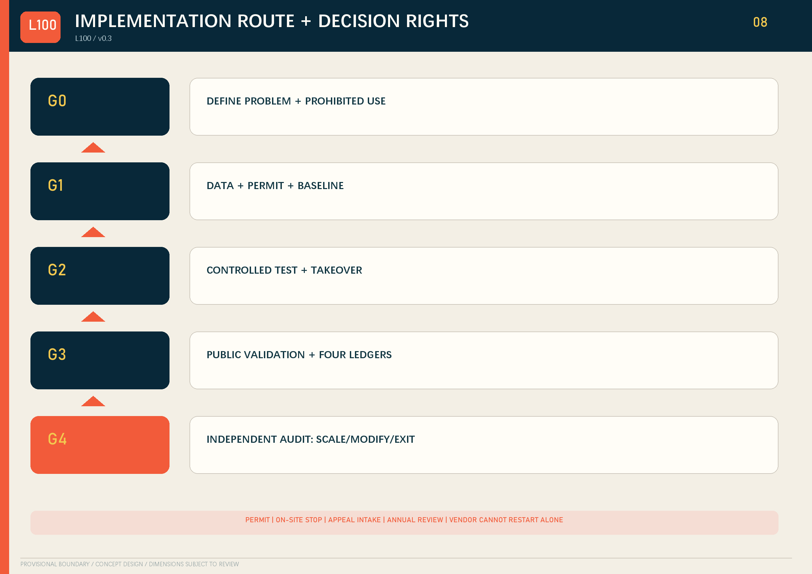
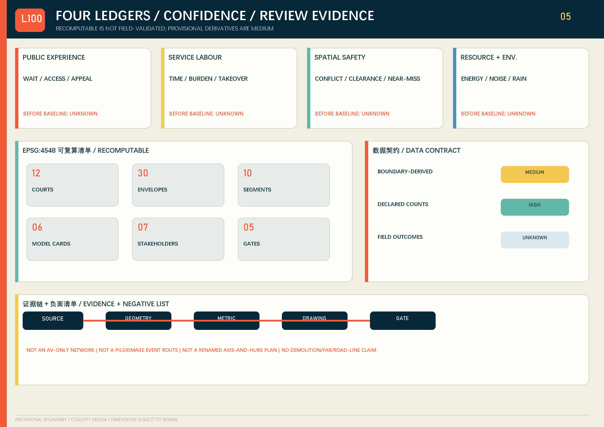

# JING-ZHANG LAST 100 / 京张交付界

> Bring urban services to people, rather than making people adapt to machines. v0.3 uses public review records from unmerged submissions to audit spatial clarity, originality and delivery integrity.

## Design Basis and Source List

The proposal responds to the three planning scales, three key areas and six agent tasks [source:OFFICIAL-ANNOUNCEMENT] [source:AGENT-TASKBOOK]. Repository boundaries are provisional concept and review inputs—not statutory redlines, ownership, regulatory controls or engineering facts [source:BOUNDARY-SOURCE]. Accessible continuity, information access and offline alternatives are design principles subject to professional confirmation [source:BARRIER-FREE-LAW] [source:ELDERLY-SMART-TECH].

## Three-Level Scope Framework

The research scale organises institutional and industry exchange. The overall design contains **one civic-service spine, six east-west links, three key-area loops and twelve interface courts**. The detailed scale tests controlled, shared and station-city prototypes. Eight seamless concept zones are not statutory plots; provisional boundaries stay as low-contrast dashed review layers [metric:land_use_zone_count].

One interface-event record links the scales: the research level defines exchangeable test resources, methods and permission lists; the overall level translates them into routes, courts, ground floors and blue-green interfaces; each key area assigns windows, responsible humans, takeover and stop conditions. `L100-area-interface-year-sequence` is a traceable event ID, not an approval, credit score or ownership record. EPSG:4548 metrics are recalculable, while precise boundaries, existing networks, station flows, ownership and controls remain missing [source:PROCESSED-FACT-PACK].

## Coordinated Research Area: Industry and Future City Research

Six cases transfer mechanisms, not form: Woven City—tiered real-world tests; Punggol Digital District—infrastructure coordination; Forum Virium Helsinki—living labs; Barcelona Decidim—traceable participation; Seoul AI Hub—testing and talent support; responsible-data-use review—public purpose records. Exchanged objects are safety cases, operating windows, issue lists and audit templates. Their land, legal and procurement systems cannot be copied, and no partnership is claimed [source:GLOBAL-CASES].

Five taskbook regional objects are proposed counterparts, not claimed partners. **Beiwei Community** can exchange needs, appeal templates and no-phone usability records, subject to local and resident consent. **Future Science City** can exchange evaluation methods, safety cases and training, but its campus governance and form are not copied. **Huairou Science City** can exchange calibration and failure-analysis methods only with data/equipment permission. **Beijing E-Town** can exchange component, repair and recovery interfaces while protecting trade secrets; its industrial land model is not transferred. **Beijing–Tianjin–Hebei nodes** can compare event-ID fields, cold-chain events and exit rules, but cross-jurisdiction approval and mutual recognition are not assumed.

## Overall Design Area: Urban Renewal and Regulatory-Plan-Level Urban Design

Eight concept zones cover the provisional area. Thirty envelopes carry reuse priority, ground interface and human fallback. Twelve courts combine arrival, handoff, waiting, charging, repair and staffed fallback. Sections use variables `W_h`, `W_b`, `W_s`, `W_g` and `F_0`; dimensions, accessibility, fire, utility and structural conclusions await professional confirmation [metric:building_prototype_count].

## Detailed Design of Key Areas

**Zhongzhiyuan** sequences closed testing, semi-open validation and public display. **AI Origin Community** forms a shared court among campus, community, merchants and service workers, retaining paper, phone and staffed access. **Dazhongsi** creates peak rail clearance, timed curb use, human fallback and night-noise control. Every prototype links plan, section, ground floor and operating sequence.

Each provisional area contains four courts, ten concept envelopes and one loop, but the operating rules differ. Sections use `W_h/W_b/W_s/W_g/F_0` for continuous human passage, handoff buffer, service space, rain/shade and ground floor. Rail flows, road redlines, fire clearance, night noise, ground-floor ownership and existing accessibility must be surveyed before detailed design [metric:interface_node_count].

## AI Innovation Ecosystem, Personas, and AI+ Scenarios

Eight personas include service workers, night workers, older people, disabled users, students/researchers, residents/merchants, low-digital-literacy/no-smartphone users and non-Chinese speakers [metric:persona_group_count]. Ten protocols cover accessible pickup, night handoff, wet-weather tests, fire access, shared merchant delivery, cold-chain medicine, repair/reuse, rail peak avoidance, offline takeover and annual public audit. Each defines user, place, minimum data, forbidden use, human review, accountable operator, failure, appeal, exit and a 12-month KPI.

Six model cards govern curb scheduling, accessible handoff, route-conflict warning, fault/maintenance triage, cold-chain anomaly detection and annual public trial audit. Inputs are minimised; outputs are advice; a named human can veto; events are traceable; every model has a stop condition [metric:ai_model_card_count].

| Model | Purpose / affected users | Accountable owner | Decision boundary | Minimum input | Retention | Output | Human veto | Prohibited use | Failure | Stop, appeal and exit |
| --- | --- | --- | --- | --- | --- | --- | --- | --- | --- | --- |
| M1 Curb scheduling | merchants, couriers, pedestrians | traffic-operator type | recommends windows only; grants no right-of-way | time window, capacity, event | registered at G1 / minimum necessary | queue advice | traffic staff reorder immediately | merchant credit scoring | displaced congestion | stop if walking/fire access is blocked; on-site appeal; manual queue |
| M2 Accessible handoff | disabled and older users | public-service operator type | presents accessible options only | user-selected preference, locker state | delete at session end where possible | accessible-route advice | staff reassign | infer disability type | incorrect prompt | stop without an alternative; phone/on-site appeal; staffed desk |
| M3 Conflict warning | pedestrians, cyclists, service workers | on-site safety owner | recommends slow/stop only | anonymous occupancy and speed | event-level short retention registered at G1 | conflict alert | staff stop directly | face or identity tracking | miss / repeated false alarm | stop after major near miss; review event ID; leave public flow |
| M4 Fault and repair routing | maintainers and public | maintenance owner type | cannot auto-release equipment | fault code, queue, component | minimum necessary within equipment lifecycle | quarantine/repair advice | supervisor reroutes or quarantines | worker ranking | wrong routing | stop after repeated safety fault; work-order appeal; decommission |
| M5 Cold-chain anomaly | residents and pharmacists | pharmacist/cold-chain operator type | does not replace pharmacist judgement | temperature, duration, container ID | delete under registered batch-close rule | isolation advice | pharmacist confirms, returns or disposes | health profiling | sensor drift | stop without human check; batch review; return/dispose |
| M6 Annual public audit | residents and assessors | independent assessment group | cannot auto-approve expansion | anonymised four ledgers and appeals | registered public-audit rule | scale/modify/exit advice | joint review by seven actor types | auto-approval or personal records | missing-data bias | stop if evidence cannot be reproduced; public reply; modify/end |

## Land Use, Building Scale, and Retain-Renovate-Demolish Strategy

EPSG:4548 recalculation tests full coverage, seams and overlaps. `reuse_priority` is only an investigation order. Ownership, structure, heritage, fire and regulatory evidence must precede building-level retain/adapt/reversible-infill/exit decisions. FAR remains unknown [metric:building_footprint_area_sqm].

The eight zones use recognised classification codes. Thirty envelopes distinguish test-yard, shared-court and station-service edges, identify their ground interfaces, and preserve staffed windows, physical buttons, phone and paper fallback. They do not imply height, storeys, FAR, demolition quantity or investment. Building survey and professional review must update every envelope.

**Verifiable differentiator.** The proposal does not rename the belt as another axis, hub or gateway. It turns everyday handoff into a spatial network and accountability system: every interface joins a ground-floor carrier, minimum-data protocol, human fallback, stop condition and exit path. The three key areas stress-test the same civic interface under controlled testing, shared daily life and rail-peak pressure. The `L100-area-interface-year-sequence` event ID links place, event, responsibility and annual review; it is not an approval, credit score or ownership record. The L100 mark, three spatial prototypes, component assembly and submission graphics/text were generated for this proposal. Model cards, stakeholder matrices and stage gates are attributed general methods, not proprietary claims.

## Transport, Rail, Municipal Infrastructure, and Public Services

People have priority on the spine; links follow local windows; on-site staff may suspend every loop. Dazhongsi clears the primary pedestrian flow at rail peaks. Charging, cold chain, communications, drainage and fire are shown as interfaces and prerequisites—not engineering feasibility. A physical button, paper event record and staffed window preserve no-phone access.

GeoJSON records mode priority, time window and yield rule. Near misses, blocked passage or failed takeover stop operation. Peak clearance is a gate to be agreed with transport operators, traffic professionals and disabled users, not an invented flow threshold. Capacity, equipment, fire separation, underground utilities and maintenance responsibility remain G1 prerequisites. The proposal is not an AV-only network, pilgrimage/event route, renamed axis-and-hubs plan, or a basis for demolition, FAR or road-line claims.

## Blue-Green Network, Public Space, and Urban Character

A spine greenway, six green fingers and three rain/shade interfaces form the concept network. Storage capacity and species await field and municipal evidence. Submission-generated assets include the `L100` handoff mark, event ID `L100-area-interface-year-sequence`, interface colours and three operated landmarks: Failure Archive Wall, Shared 100m Ruler and City Handoff Clock.

The green ratio uses unioned geometry to avoid double counting [metric:green_ratio]. Courts protect accessible passage, non-commercial waiting, shade and night legibility before accommodating devices. Landmarks publish anonymised failures, compare human walking/service waiting, and display peak-clear/service windows; each needs local permission, operating budget and public review.

## Renewal Projects, Implementation Policy, and Phasing

Seven stakeholder types cover statutory/local planning, park/rail/traffic operators, owners/merchants, service workers, disabled/older users, technology suppliers, and research/safety assessors. Statutory actors retain permit authority; on-site owners and affected users hold stop/review rights; a named public-service actor receives appeals; an independent assessment group leads annual review. A technology supplier cannot approve a pilot, reject an appeal or restart operation alone. Six projects—twelve courts, test yard, shared court, timed station deck, human dispatch desk and annual audit—each carry ten governance fields. G0 defines problem and prohibitions; G1 completes data, permission and baseline; G2 tests human override; G3 performs public validation; G4 independently audits and chooses expand, modify or exit [metric:phase_gate_count].

## Metrics, Area Recalculation, and Compliance Matrix

Four ledgers track public experience, service labour, spatial safety and resources/environment. `metrics.json` contains only recalculable areas, lengths and counts; field outcomes remain `unknown`. Spatial QA uses EPSG:4548 for topology and containment. HTML `data-metric` values are generated from the same JSON [metric:site_area_sqm].

The inventory covers area unions, route length and counts for zones, courts, envelopes, personas, model cards, stakeholders, governance fields and gates. Operational outcomes—waiting, labour burden, near misses, energy, noise and appeal response—remain unknown before baseline; no `simulation.json` is introduced. A boundary or source update requires regenerating geometry, metrics, figures, HTML, PDFs and self-checks together.

**Field-baseline acquisition.** The proposal specifies responsibility and minimum data, not results. A public-service operator records anonymous waiting, access and appeal events across consecutive weekdays and a weekend; worker representatives and operators record voluntarily aggregated time, takeover and added burden; the on-site safety owner records clearance, conflict and near-miss events; facility operators record device-level energy, noise windows and rain-interface operation. G1 must state notice, retention, access and deletion rules. Face recognition, continuous identity tracks and labour-performance ranking are prohibited. Insufficient samples remain `unknown` and cannot justify scaling.

## Risk, Copyright, and Compliance

Risks include uncertain right-of-way/ownership, blocked pedestrian/fire access, model error, privacy, noise, labour transfer, operating cost and digital exclusion. Controls are minimum data, human veto, paper/phone alternatives, event IDs, appeals and reversible fixtures. The L100 mark, interface assembly, submission text and graphics were generated for this proposal. Peer submissions informed only general drawing-depth, model-card, stakeholder and gate methods; their names, text, graphics and spatial solutions were not copied [source:PEER-COMMONS] [source:PEER-RAILS] [source:PEER-PERSONAS] [source:PEER-WARMLINE]. Public unmerged PRs were used only to audit directory, hash, confidence, bilingual and originality risks—not as design sources or official quality decisions [source:PUBLIC-PR-AUDIT].

Before G1, every high-risk project names a professional review path, on-site stop authority and exit budget. Data breach, harm, blocked fire/access route, major near miss or unanswered appeal triggers suspension. Restart needs review by the relevant statutory/professional body and affected users; a supplier cannot restart unilaterally. Peer references are attributed in sources and changelog and do not change these data gaps.

## References

See `sources.json` for the official announcement, taskbook, provisional boundary basis, accessibility law, older-person smart-technology policy, urban-design measures, six case websites, four attributed open-source peer-method references and a process-only public PR audit. No external case is a partnership or implementation commitment.

Official sources define scope and principles [source:OFFICIAL-ANNOUNCEMENT]; provisional geometry defines a replaceable review input [source:BOUNDARY-SOURCE]. Case websites support mechanism comparison only. Peer submissions inform representation and governance methods only. All maps, L100 identity, figures, HTML and PDFs are newly generated without third-party photos, remote fonts or tracking. Future formal sources must record version, publisher, CRS, licence and hash.
