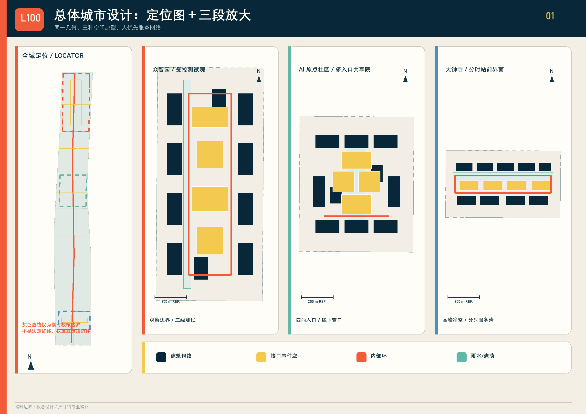
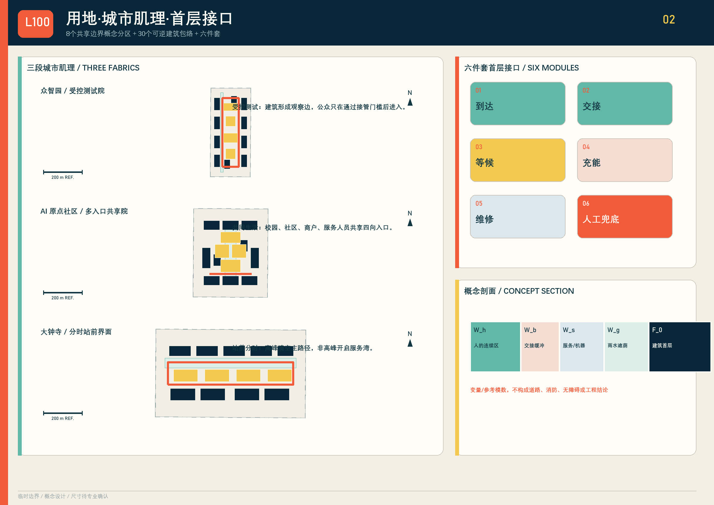
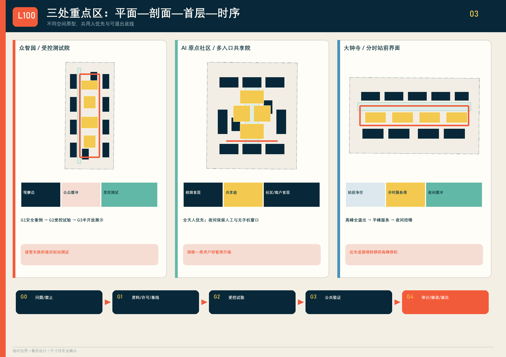
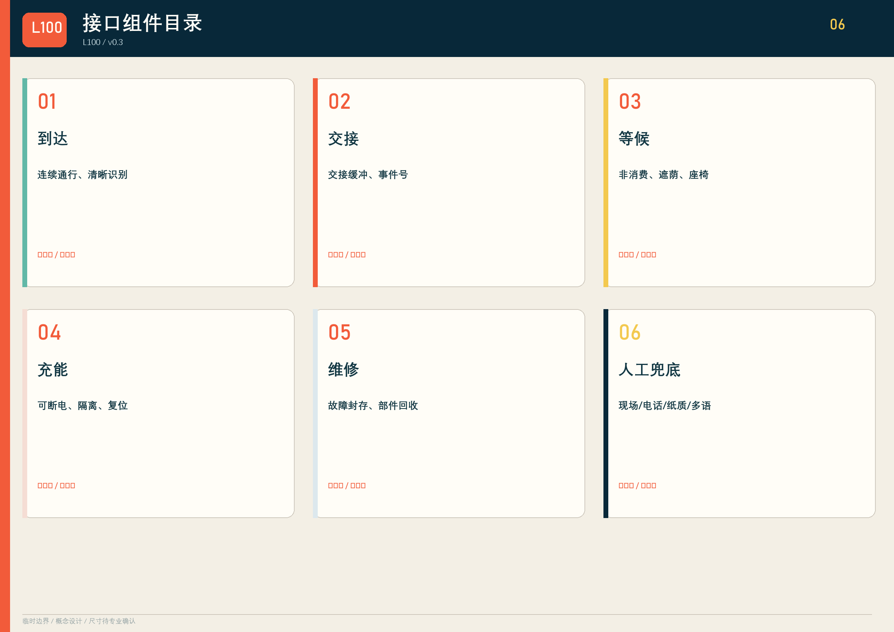
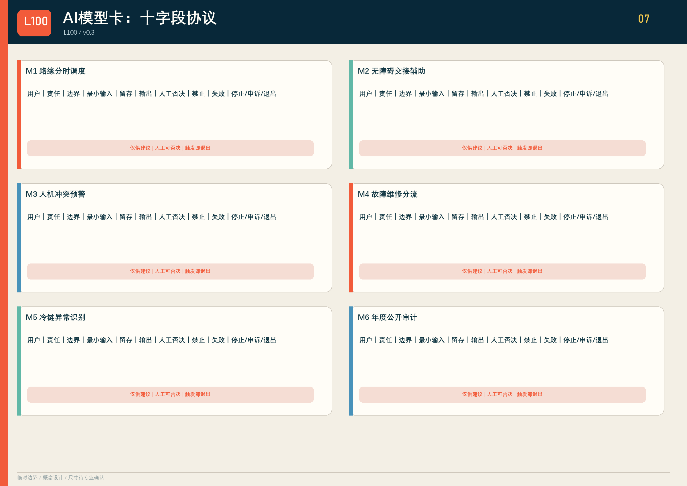
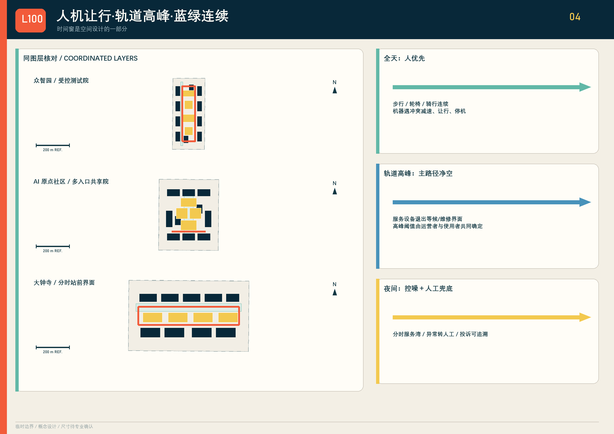
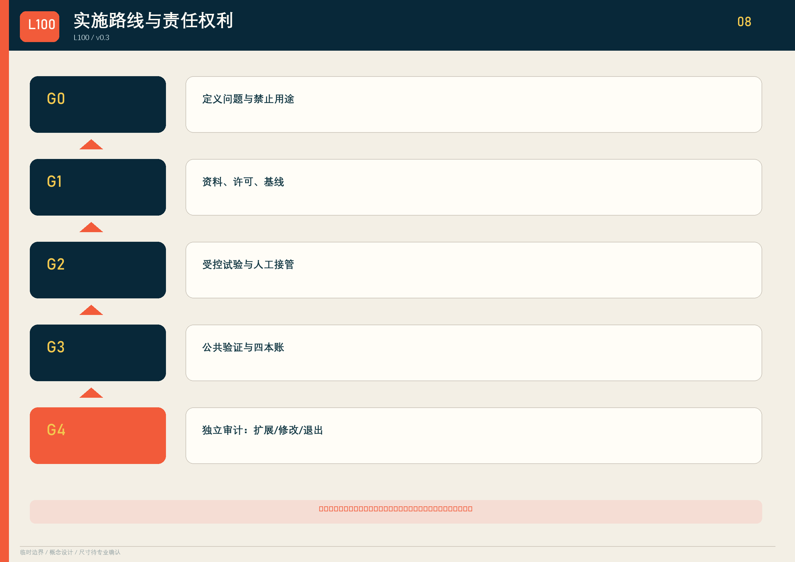
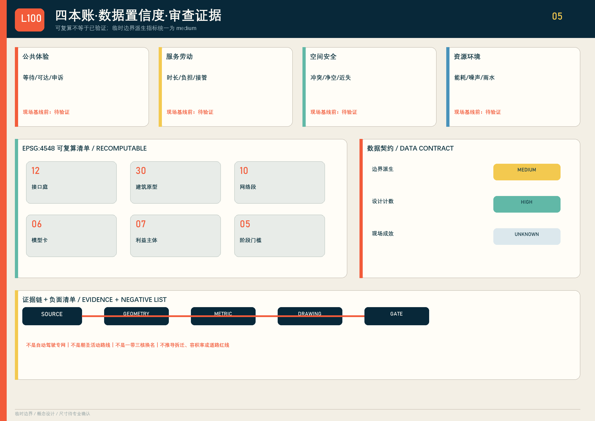

# 京张交付界 / JING-ZHANG LAST 100

> 把城市服务送到人面前，而不是让人适应机器。v0.3 以未合并投稿的公开审查记录反向校核空间、原创性与交付契约，把“最后一百米”落实为可审查的空间—协议—治理联合设计。

## 设计依据与资料清单

方案回应百年京张 AI 创新带三层范围、三处重点区和六项智能体任务 [source:OFFICIAL-ANNOUNCEMENT] [source:AGENT-TASKBOOK]。全部图件使用仓库临时边界，仅作概念生成和自检；它不是官方红线、权属、控规或工程条件 [source:BOUNDARY-SOURCE]。无障碍连续通行、信息获取、公共交通服务窗口和替代性服务路径依据公开法律与政策作为设计原则，具体尺寸仍须专业复核 [source:BARRIER-FREE-LAW] [source:ELDERLY-SMART-TECH]。

## 三层范围工作框架

统筹研究层组织制度与产业交换；总体设计层形成 **1 条服务主脊、6 条东西支线、3 个重点区环、12 个接口庭**；重点设计层分别验证测试、共享与站城调度。8 个共享边界概念分区不是法定地块；临时 `site_boundary` 与 `key_areas` 只以低对比虚线出现。空间核心是责任链，而非“一带三核”的命名替换 [metric:land_use_zone_count] [metric:service_network_segment_count]。

三层之间以同一份“接口事件记录”传递：统筹层定义允许交换的测试资源、评估方法和许可清单；总体层把议题落到路线、接口庭、首层和蓝绿界面；重点区再为每个场景指定责任人、时窗、人工接管和停止条件。`L100-片区-接口-年份-序号` 只是一项可追溯事件号，不是自动审批、信用评分或所有权凭证。这样，产业研究不会悬在空间之外，重点区也不会成为互不关联的三张效果图。空间图层面积与长度均在 EPSG:4548 中复算，但统筹范围精确边界、现状路网、站点客流、权属和控规尚未取得，后续必须以正式资料替换当前临时校核层 [source:PROCESSED-FACT-PACK]。

**设计负面清单。** 本方案不是自动驾驶专网，不以机器效率压缩人的连续通行；不是朝圣或活动路线，不用一次性传播替代日常公共服务；不是“一带三核”的换名，也不把临时边界推导成拆迁、容积率、道路红线、权属或实施承诺。

## 统筹研究范围产业与未来城市研究

六个国际案例只迁移机制，不复制形态：

| 案例 | 可迁移机制 | 交换物 | 许可边界 / 不可照搬 |
| --- | --- | --- | --- |
| Woven City | 真实环境分级测试 | 安全案例、失败日志 | 私有园区治理不可等同公共街道 |
| Punggol Digital District | 园区基础设施协同 | 设施接口、运营时窗 | 土地制度与招采路径不同 |
| Forum Virium Helsinki | 城市生活实验室 | 场景议题、评估模板 | 不照搬其数据治理法域 |
| Barcelona Decidim | 可追踪公共参与 | 提案、意见、答复 | 平台投票不替代法定决策 |
| Seoul AI Hub | 企业测试与人才支持 | 测试资源、培训 | 不声称已建立机构合作 |
| Sidewalk Labs Responsible Data Use | 用途审查与公开记录 | 数据用途卡、复盘 | 不复制商业区开发模式 |

区域协同对象按任务书逐项落位，但均为“建议对接”，不声称已建立合作：

| 区域协同对象 | 可迁移机制 | 交换物 | 许可边界 / 不可照搬 |
| --- | --- | --- | --- |
| 北纬社区 | 社区共创与无手机服务压力测试 | 需求清单、申诉模板、可用性记录 | 须经属地和居民同意；不把单一社区样本代表全区 |
| 未来科学城 | 科研成果进入城市场景的分级验证 | 评测方法、安全案例、人才培训 | 跨区试验另行许可；不复制园区治理与空间形态 |
| 怀柔科学城 | 科学仪器与检测能力支撑失败分析 | 标定方法、检测报告、故障样本 | 数据与设备出域须授权；不推定设施对外开放 |
| 北京经开区 | 具身智能制造、维修和供应链闭环 | 部件标准、维修记录、回收接口 | 企业资料与商业秘密隔离；不移植产业用地模式 |
| 京津冀协同节点 | 跨城接口事件、冷链与异常责任接口 | 事件编号、交接字段、退出规则 | 跨行政区规则须分别审批；不声称标准已互认 |

上述协同只定义可交换的评测方法、设备/部件、运营时窗、申诉记录和许可清单；每项都须在资料、许可、责任和知识产权明确后启动 [source:GLOBAL-CASES]。

## 总体设计范围城市更新与控规深度城市设计

8 个概念分区共同覆盖临时范围；30 个建筑包络只表达“保留适配优先、轻改造优先、可逆嵌入”的原型顺序。每个包络都标注首层接口、人工兜底和退出方式。12 个公共接口庭配置到达、交接、等候、充能、维修、人工兜底六件套；同一组件可按场地许可增减，不预设大拆大建 [metric:building_prototype_count] [metric:interface_node_count]。

概念剖面以变量表达：人的连续通行区 `W_h`，交接缓冲 `W_b`，服务/机器人区 `W_s`，雨水遮荫 `W_g`，建筑首层 `F_0`；所有净宽、坡度、消防、充电和结构尺寸均待专业团队依据正式资料确定。

**可核验的差异机制。** 本方案不把 AI 创新带再命名成“轴、核、门户”，而把每天真实发生的交接动作变成空间网络与责任体系：每个接口同时有首层载体、最小数据协议、人工兜底、停止条件和退出路径；三处重点区不是三个产业标签，而是同一公共接口在“测试—共同生活—轨道高峰”三种压力下的连续验证场景。`L100` 接口事件号把场地、事件、责任和年度复盘串成可追溯机制。L100 标志、三种重点区原型、接口组件组合及本稿图文由本投稿生成；模型卡、利益主体矩阵和阶段闸门属于通用方法，不主张独占。

## 重点区域详细设计

**众智园**采用封闭测试—半开放验证—公众展示三级场院。失败设备进入封存与复盘，未通过人工接管和安全案例不得进入公共展示。**AI 原点社区**由校园、社区、商户和服务人员共同围合共享交付庭；保留纸质、电话和现场窗口。**大钟寺**设置轨道高峰净空区、分时路缘、异常转人工和夜间控噪界面；高峰期机器退出主要步行流线。三者均采用“平面—剖面—首层—运营时序”联动，而非仅有场景文字。

三处重点区各配置 4 个接口庭、10 个概念建筑包络和 1 条内部环，但界面规则不同：众智园的环线把测试设备与公众观测区分开；原点社区的环线串联校园、社区和商户入口，并在共享庭设置无手机流程；大钟寺的环线承担高峰退出与非高峰服务转换。剖面不提供伪精确宽度，而以 `W_h/W_b/W_s/W_g/F_0` 表达人连续区、交接缓冲、服务区、雨水遮荫和建筑首层。正式深化前须补测轨道客流、道路红线、消防净空、夜间噪声、首层权属和无障碍现状 [data:geometry/key_areas.geojson#PROV-KEY-001] [metric:interface_node_count]。

## AI 创新生态、人才画像与 AI+ 场景

8 类画像：城市服务劳动者；夜班劳动者；老人；残障使用者；学生/研究者；居民与小商户；低数字素养或无智能手机者；非中文使用者。任何试点若提高一类效率却把等待、风险或无偿劳动转移给另一类，就不得升级 [metric:persona_group_count]。

十张完整场景协议如下（每项均含十字段）：

| 场景 | 用户 | 空间 | 最小数据 | 禁止用途 | 人工复核/责任 | 失败与申诉 | 退出 | 12月指标 |
| --- | --- | --- | --- | --- | --- | --- | --- | --- |
| 01 无障碍取物 | 轮椅、老人 | 共享庭 | 订单状态、柜格 | 人脸/画像 | 值守员+物业 | 高度/路径失败；现场与电话 | 恢复人工窗口 | 独立完成率 |
| 02 夜间交接 | 夜班者、骑手 | 原点庭 | 匿名时段、照度 | 劳动绩效排名 | 夜班主管 | 噪声/骚扰；纸质申诉 | 夜间停机 | 冲突事件数 |
| 03 雨雪测试 | 企业、安全员 | 测试院 | 路面/制动事件 | 公众轨迹 | 安全官 | 失稳；立即封存 | 退回封闭场 | 人工接管率 |
| 04 消防让行 | 所有人 | 三类界面 | 占用与清场事件 | 识别人身份 | 现场责任人 | 净空失败；一键清场 | 全线暂停 | 净空恢复时长 |
| 05 小店共配 | 商户、骑手 | 支线接口 | 箱量、时窗 | 差别定价画像 | 商户联盟/骑手代表 | 爽约；线下改单 | 单店退出 | 劳动时长变化 |
| 06 冷链药品 | 居民、药师 | 服务驿站 | 温度、交接确认 | 健康推断 | 药师/运营 | 超温误交；人工复核 | 销毁/退运 | 异常闭环率 |
| 07 维修回收 | 运维者 | 维修面 | 故障码、部件 | 个人绩效监控 | 运维主管 | 电池/部件风险；封存 | 下线设备 | 再利用率 |
| 08 轨道高峰 | 通勤者 | 大钟寺 | 匿名流量、时窗 | 人群身份识别 | 轨道/交通值守 | 冲突；现场投诉 | 高峰退出 | 冲突近失数 |
| 09 失联接管 | 全部用户 | 主脊 | 心跳、事件编号 | 常态跟踪 | 人工调度台 | 断网/迷航；电话 | 人工搬离 | 接管响应时长 |
| 10 年度公开审计 | 市民、评估者 | 三处重点区 | 四本账汇总 | 发布个人明细 | 独立评估组 | 指标争议；公开答复 | 修改/终止 | 申诉按期答复率 |

六张 AI 模型卡采用统一十字段协议。模型输出只能是建议，人工否决不需要模型同意；留存期限须在 G1 登记并采用最短必要原则，触发停止条件后进入申诉、封存或退出流程：

| 模型卡 | 用途/受影响用户 | 责任主体 | 决策边界 | 最小输入 | 留存期限 | 输出 | 人工否决 | 禁止用途 | 失败模式 | 停止、申诉与退出 |
| --- | --- | --- | --- | --- | --- | --- | --- | --- | --- | --- |
| M1 路缘分时调度 | 商户、骑手、行人 | 交通运营类型 | 仅建议时窗，不授予路权 | 时窗、容量、事件 | G1登记/最短必要 | 建议队列 | 交通值守即时改序 | 商户信用评分 | 拥堵转移 | 人行/消防受阻即停；现场申诉；恢复人工排队 |
| M2 无障碍交接辅助 | 残障者、老人 | 公共服务运营类型 | 只呈现可达选项 | 用户自选偏好、柜格状态 | 会话结束优先删除 | 可达路径建议 | 现场员改派 | 推断残障类型 | 提示错误 | 无替代路径即停；电话/现场申诉；恢复人工窗口 |
| M3 人机冲突预警 | 行人、骑行者、服务劳动者 | 现场安全责任人 | 只触发减速/停机建议 | 匿名占用、速度 | G1登记/事件级短留存 | 冲突警报 | 现场人员可直接停机 | 人脸识别、身份跟踪 | 漏报/频繁误报 | 重大近失即停；事件号复核；退出公共流线 |
| M4 故障维修分流 | 运维者、公众 | 运维责任类型 | 不得自动放行设备 | 故障码、队列、部件 | 设备生命周期内最短必要 | 封存/维修建议 | 运维主管改派或封存 | 劳动者排名 | 错误分流 | 安全故障复发即停；工单申诉；设备下线 |
| M5 冷链异常识别 | 居民、药师 | 药师/冷链运营类型 | 不替代药师判断 | 温度、时长、箱号 | 批次闭环后按规则删除 | 隔离建议 | 药师确认、退运或销毁 | 健康画像 | 传感器漂移 | 无人工核验即停；批次复核；退运/销毁 |
| M6 年度公开试验审计 | 市民、评估者 | 独立评估组 | 不能自动批准扩展 | 脱敏四账、申诉 | 按公开审计规则登记 | 扩展/修改/退出建议 | 七类主体联合复核 | 自动审批、个人明细 | 数据缺失偏差 | 证据不可复核即停；公开答复；修改或终止 |

## 用地、建筑规模与拆改留方案

用地分区面积在 EPSG:4548 中重算，并要求全覆盖、共享边界、无缝无重叠。建筑包络不是现状建筑普查：`reuse_priority` 仅表示优先核查顺序；取得权属、结构、文保、消防和控规资料后，逐栋形成“保留—适配—可逆新增—退出”结论。容积率和建筑规模保持待确认，不把原型足迹冒充报批指标 [metric:building_footprint_area_sqm]。

8 个分区用公开分类代码表达科研、教育、社区服务、商业、居住、开放空间、广场和站城接驳的概念关系，不自造法定用地类别。30 个包络通过 `prototype_type` 区分测试院边、共享庭边和站城服务边，通过 `ground_interface` 说明透明测试、共享交付或分时路缘，通过 `human_fallback` 保留值守窗口、实体按钮、电话与纸质指引。所有包络都位于临时范围内；现阶段只说明界面优先级和退出方式，不推导建筑高度、层数、容积率、拆迁量或投资额。正式建筑普查完成后，应逐栋对照现状使用、结构安全、历史价值、产权意愿和运营预算再更新分类。

## 交通、轨道、市政与公共服务设施

主脊全天人优先；支线按属地时窗运行；三处内部环均允许现场责任人暂停。大钟寺在轨道高峰保持净空，服务设备退入等候/维修区。充能、冷链、通信、排水和消防只画接口与前置条件，不作工程可行性结论。首层实体按钮、纸质编号和人工窗口构成“无手机也能完成”的公共服务底线 [source:ELDERLY-SMART-TECH]。

路线属性把 `mode_priority`、`time_window` 和 `yield_rule` 写入 GeoJSON：主脊优先步行、轮椅与骑行；支线依据现场需求确定服务时窗；内部环一旦出现近失事件、通行受阻或人工接管失败即暂停。轨道高峰净空并非假定具体客流阈值，而是一项待运营者、交管和无障碍使用者共同确定的门槛。市政接口采用可断电充能、冷链隔离、故障封存、雨水导排和通信失联转人工等原则；接入容量、设备选型、消防间距、地下管线和维护责任均列为 G1 前置资料，未取得前不得施工或声称工程可行。

## 蓝绿空间、公共空间与城市风貌

主脊绿带、6 条绿色支线和3处雨水/遮荫界面形成连续系统。雨水滞蓄量、树种和海绵指标须以场地和市政资料复核。品牌资产采用本投稿生成的 `L100` 交接标志、接口事件号 `L100-片区-接口-年份-序号`、橙色人工交接/薄荷绿安全让行/黄色待复核色带；三处地标分别为失败档案墙、共用一百米尺、城市交付时钟。地标是可运营公共装置，不是大型建筑。

蓝绿图层采用主脊缓冲、六条支线缓冲与三处重点区雨水遮荫界面的并集面积计算，避免重叠区域重复计数 [metric:green_ratio]。公共接口庭首先保障无障碍连续通行、非消费等候、遮荫和夜间可识别性，再容纳机器停靠；任何绿化、座椅或设备不得占用盲道、消防和主要步行流线。失败档案墙公开的是脱敏事件与改进措施，共用一百米尺用于比较人的步行和服务等待，城市交付时钟显示高峰净空与服务时窗。三项均需属地许可、运营预算和公众复核，不把传播装置升级为永久建设结论。

## 更新项目清单、实施政策与分期计划

7 类利益相关方：属地与规划主体类型；公园/轨道/交通运营者；产权和商户；服务劳动者；无障碍及老年用户；技术供应商；科研与安全评估者。法定许可仍由法定主体作出，现场责任人和受影响使用者拥有停机建议与复核权，指定公共服务主体受理申诉，独立评估组组织年度复盘；技术供应商不能自行批准试点、驳回申诉或恢复运行。工作台只维护证据、议题和复盘。

| 项目 | 牵头类型 | 协作复核 | 许可/资料前置 | 资源/成本 | 启动门槛 | 12月KPI | 失败模式 | 暂停/退出 | 年度复盘 |
| --- | --- | --- | --- | --- | --- | --- | --- | --- | --- |
| P1 12庭微更新 | 属地/产权 | 无障碍、消防、劳动者 | 权属/现状/消防 | R2/C2 | G1 | 可用接口数 | 阻断通行 | 即时拆除模块 | 联合工作台 |
| P2 众智园试验院 | 园区运营 | 安全评估、供应商 | 场地许可/安全案例 | R3/C3 | G2 | 接管闭环率 | 测试外溢 | 退回封闭测试 | 独立安全组 |
| P3 原点共享庭 | 社区/校园类型 | 居民、商户、劳动者 | 需求基线/值守预算 | R2/C2 | G2 | 独立完成率 | 数字排除 | 恢复人工流程 | 社区代表会 |
| P4 大钟寺分时台 | 交通运营类型 | 轨道、交管、商户 | 客流/路缘/噪声许可 | R3/C3 | G2 | 高峰近失数 | 拥堵转移 | 高峰全退出 | 交通联合组 |
| P5 L100人工调度台 | 运营联合体类型 | 数据安全、劳动者 | 责任/保险/数据字典 | R2/C2 | G3 | 接管响应时长 | 无人负责 | 切换人工专线 | 公共服务组 |
| P6 年度公开审计 | 科研评估类型 | 七类主体 | 脱敏四账/申诉记录 | R1/C1 | G4 | 按期答复率 | 选择性披露 | 不得扩展 | 独立评估组 |

G0 定义问题与禁止用途；G1 完成资料、许可和基线；G2 受控试验且通过人工接管；G3 半开放公共验证并连续记录四本账；G4 独立年度审计后只允许“扩展、修改、退出”三种结论。任何阶段都没有自动通关 [metric:phase_gate_count]。

## 指标体系、面积复算与合规矩阵

四本账分别记录：公共体验、服务劳动、空间安全、资源环境。`metrics.json` 只收录可复算面积、长度和计数；现场成效保持 `unknown`。空间校核采用 EPSG:4548，检查用地覆盖、缝隙、重叠与图层越界。网页 `data-metric` 与 JSON 同源 [metric:site_area_sqm] [metric:green_ratio] [metric:public_space_ratio]。

可复算清单包括临时场地面积、建筑包络并集面积、蓝绿并集比例、公共空间并集比例、路线总长以及分区、节点、原型、人物、模型卡、利益相关方、治理字段和阶段门槛计数。用地拓扑以临时场地为基准验证覆盖差、缝隙和重叠；其他设计图层检查是否越界。公开体验、劳动负担、近失事件、能耗、噪声、申诉答复等运营指标没有现场基线，因此不填假定结果，也不设置 `simulation.json`。正式边界或现状资料更新时，必须同时重跑几何、指标、图件、网页、文册和自检，不能只替换一张总图。

**现场基线获取方案。** 只规定采集责任和最小数据，不预写结果：公共体验由公共服务运营类型在连续工作日与周末分别记录匿名等待、可达和申诉事件；服务劳动由劳动者代表与运营者记录自愿汇总的时长、接管和额外负担；空间安全由现场安全责任人记录净空、冲突与近失事件；资源环境由设施运营者记录设备级能耗、噪声时段和雨水界面运行。所有采集须在 G1 明确告知、留存、访问和删除规则，禁止人脸、连续身份轨迹和劳动绩效排名；样本不足时继续标记 `unknown`，不得据此升级。

## 风险、版权与合规说明

主要风险为路权/权属不明、行人和消防受阻、算法误判、隐私、噪声、劳动负担、长期运维和数字排除。统一缓解方式是最小数据、现场人工否决、纸质/电话替代、事件编号、公开申诉和可撤回设施。每个高风险项目在 G1 前指定专业复核路径、现场停机权和退出资金；数据泄露、人员伤害、消防或无障碍通行受阻、重大近失事件、长期无人答复申诉，均触发暂停。恢复必须由相应法定或专业主体和受影响使用者共同复核，技术供应商不得单方复运。

L100 标识、接口组件组合、本稿文字和图件由本投稿生成；同类投稿只参考“图纸深度、模型卡、利益相关方和闸门治理”的通用方法，并在来源和迭代记录署名，不复制命名、文字、图形或空间方案 [source:PEER-COMMONS] [source:PEER-RAILS] [source:PEER-PERSONAS]。另参考 `jingzhang-warm-line` 的空间—运营映射方法，不复用其方案内容 [source:PEER-WARMLINE]。公开未合并 PR 只用于检查目录、哈希、置信度、双语和原创性风险，不作为设计素材或官方质量结论 [source:PUBLIC-PR-AUDIT]。精确边界、控规、权属、建筑、市政、消防、文保和现场运营资料仍缺失，因此所有空间与成本等级均为概念建议，不替代法定规划、工程设计、采购或安全审查。

## 参考资料

官方公告与任务书确定三层范围、三处重点区和成果语境 [source:OFFICIAL-ANNOUNCEMENT] [source:AGENT-TASKBOOK]。临时边界依据说明几何推定方法和必须替换的条件 [source:BOUNDARY-SOURCE]；无障碍法律、老年人智能技术政策和城市设计管理办法分别支撑连续通行、线下替代和“平面—立体—界面”表达，但不被扩大解释为未经核验的工程尺寸或审批结论。

国际案例官网只用于六项机制对照，不作为京张现状、合作、许可或投资依据。四份已收录开源方案只提供图纸深度、模型卡、人物覆盖、治理字段和空间运营映射的方法参照，均在 `sources.json` 与 `changelog.md` 逐项署名。投稿使用的地图、图标、L100 标志、接口事件号、图件、网页和文册为本方案重新生成；未引入第三方照片、远程字体、跟踪脚本或不可追溯数据。正式深化时应按来源登记规则记录文件版本、发布机构、坐标系、许可和哈希。
