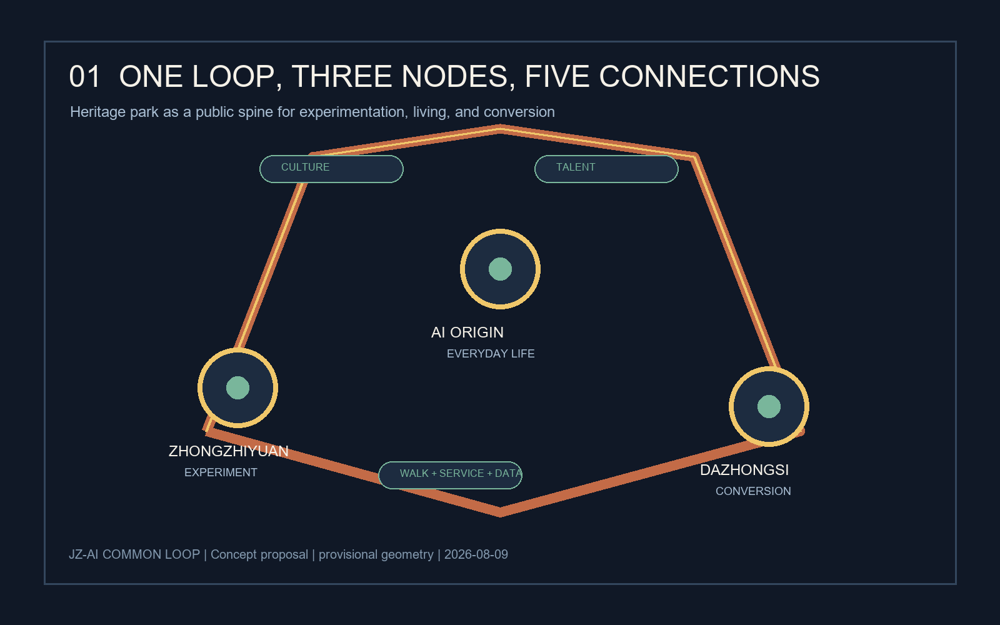
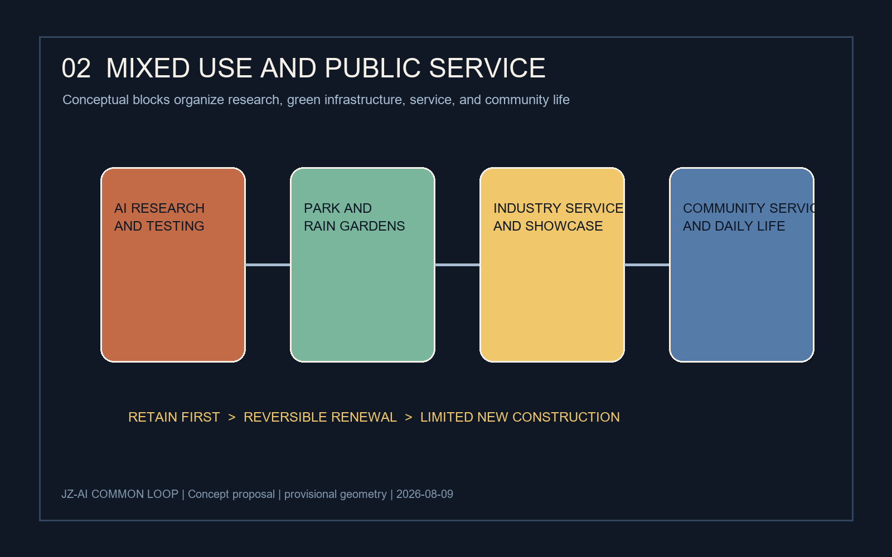
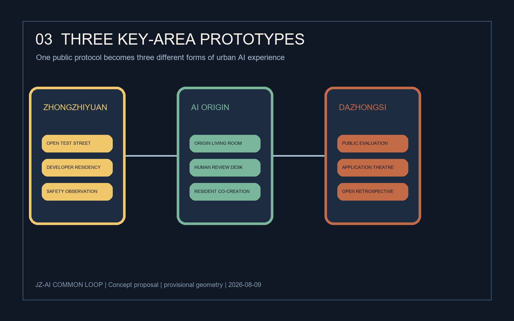
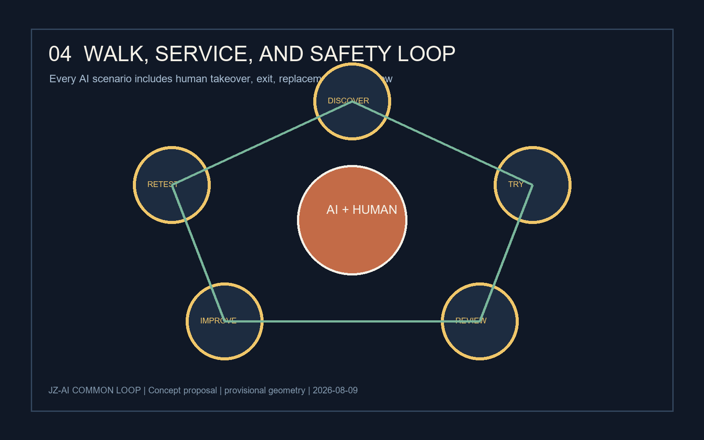
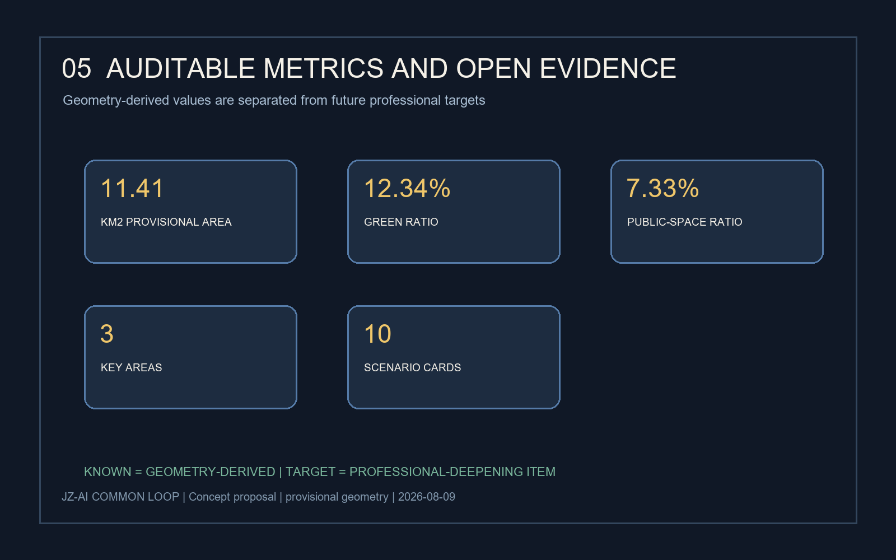

# 京张AI共生环：把创新变成可漫游、可测试、可持续的城市日常

## 设计依据与资料清单

本方案响应“百年京张AI创新带城市设计国际方案征集”的公开任务，采用“城市设计提案 + 可复核数据包 + 离线展陈页面”的形式提交。依据包括公开任务书与智能体任务书 [source:OFFICIAL-ANNOUNCEMENT] [source:AGENT-TASKBOOK]。场地包、资料登记表、允许设计空间和标准矩阵共同构成审计依据 [source:SITE-PACKAGE] [source:SOURCE-REGISTRY]。

场地包目前提供的是临时研究边界和三处重点区域的 provisional geometry，未提供可作为法定红线的官方 polygon。所有面积、位置和图层均为概念研究依据；不代表控规、权属、工程、审批或政府实施结论 [source:BOUNDARY-SOURCE] [source:KEY-AREA-SOURCE] [depth:existing_conditions_diagnosis]。

设计命题是：**让AI不只停留在楼里，而是成为可被看见、被体验、被监督、被持续改进的城市公共能力。** “共生环”由一条京张文化—慢行—数据观察廊道串联三处AI节点，形成“研发加速—日常生活—产业转化”的连续体验。

## 三层范围工作框架

- **统筹研究范围**：面向北五环、京藏高速、西直门外大街、万泉河路围合的约43.6平方公里，提出区域创新网络、人才流动和京津冀协同议题。方案不修改法定边界 [data:geometry/site_boundary.geojson#SITE-001]。
- **总体设计范围**：面向京张遗址公园周边约1—2公里、约11.4平方公里的城市更新研究范围，建立“一带、三点、五条连接”的空间结构 [metric:site_area_sqm]。
- **重点区域**：把众智园AI自主创新加速区、北京AI原点社区、大钟寺AI产业集聚区作为三种城市原型，分别对应“实验、生活、转化” [data:geometry/key_areas.geojson#PROV-KEY-001] [metric:key_area_count]。

总体结构不是新的工程红线，而是可供专业团队深化研究的空间工作框架：一条主环、三处节点、五类连接（慢行、公共服务、数据、产业、文化）。

## 统筹研究范围产业与未来城市研究

### 一带总体概念与功能统筹

品牌名为 **JZ-AI COMMON LOOP / 京张AI共生环**。视觉方向采用“铁轨双线 + 开源节点”的符号：两条连续线代表百年京张与未来数据流，三枚圆点代表三处重点区，断点表示允许公众参与和纠错。主色为铁锈红、智慧金、夜行蓝和公园绿，适用于导视、活动、数字界面和公共设施识别。

区域功能分为五层：①AI研发与验证；②企业服务与转化；③社区生活与公共照护；④文化展示与国际交流；⑤公共治理与安全复核。功能不按“园区—社区”二分，而按全天候共享的城市服务链组织 [task:agent.1] [standard:PROJECT-OFFICIAL-ANNOUNCEMENT]。

### 产业与未来城市研究

提出“算力—数据—人才—场景—治理”五要素循环：众智园承接早期试验和开发者共创；AI原点社区承接生活服务和低门槛体验；大钟寺承接企业服务、产品展示和产业转化。三点通过开放场景协议、公共问题清单、人才短住和测试券互相导流 [task:agent.2]。

产业案例采用“模式启发而非事实类比”的方法，优先研究开放街区、城市实验室、公共数字基础设施、文化遗产活化和开发者社区等公开案例；案例进入深化阶段前需要补充版权、数据和运营主体核验，不将其当作本地已落地事实 [source:AGENT-TASKBOOK]。

## 总体设计范围城市更新与控规深度城市设计

### 空间结构

- **一条共生主环**：沿京张遗址公园形成连续的慢行与公共服务叙事线，串联入口、展陈、社区、产业和夜间活动节点。
- **三处AI节点**：北部“共创加速器”、中部“AI原点客厅”、南部“产业转化站”。每处节点设置可见的测试界面、公共休息和人工复核点。
- **五类连接**：文化连接、步行连接、服务连接、数据连接和人才连接。道路和轨道线位不在本方案中作工程判断 [source:AGENT-TASKBOOK]。

### 更新原则

优先保留可继续使用的建筑与成熟社区，先做低成本公共空间、导视、照明、可逆家具和活动运营；对需要改造的建筑提出“轻介入、可拆换、可回收”的概念模块；不提出具体地块拆改留、容积率、建筑高度或土地权属结论 [data:geometry/constraints.geojson#CONSTRAINTS] [depth:urban_renewal_and_regulatory_design]。

## 重点区域详细设计

### 1. 众智园AI自主创新加速区：实验可见

设置“开放测试街”作为一条可步行的实验界面：白天展示机器人、无障碍导航、环境感知和低速配送等可公开场景，夜间转换为开发者讲解与小型发布。空间采用可移动展台、可读数据牌和人工安全岗，所有测试默认脱敏、限速、可退出 [task:agent.2] [task:agent.3]。

### 2. 北京AI原点社区：生活可用

设置“原点客厅”作为社区公共服务枢纽，集合问路、办事导航、健康服务转介、儿童学习、老年人数字辅导和邻里活动。每个AI服务都保留人工窗口、纸质替代路径和无障碍交互，居民可查看数据用途并撤回授权 [task:agent.3] [task:agent.5]。

### 3. 大钟寺AI产业集聚区：转化可见

设置“产业公开评测廊”与“应用剧场”：企业可用公共问题清单展示产品，专业机构可进行可解释性、隐私、可达性和社会影响的分级评测。公共空间不承担商业背书，所有展示标注“测试中/已复核/待改进”状态 [task:agent.4]。三处节点均以临时重点区几何作为讨论锚点，需由专业团队重新核验实际落位 [source:AGENT-TASKBOOK] [data:geometry/key_areas.geojson#PROV-KEY-001]。

## AI 创新生态、人才画像与 AI+ 场景

### 生态案例与产业空间映射

建议建立八类可持续案例库：开放街区实验室、遗产公园夜间文化、城市数据信托、无障碍导航、低速机器人配送、开发者驻留、社区照护协作、公共算法审计。它们被映射到“研发—生活—转化”三点，不代表本地现状或已签约主体 [task:agent.2]。案例库的空间映射应回到三处重点区和公开任务边界复核 [source:AGENT-TASKBOOK] [data:geometry/key_areas.geojson#PROV-KEY-001]。

### 五类用户画像

| 用户 | 需求 | 共生环回应 |
|---|---|---|
| 开发者 | 找到真实问题与低门槛测试场 | 测试券、开放问题库、夜间共创 |
| 社区居民 | 安全、可理解、可退出的服务 | 原点客厅、人工复核、纸质备选 |
| 老年人与儿童 | 少屏幕、强陪伴、无障碍 | 声音导视、亲子任务、志愿辅导 |
| 企业与投资人 | 验证产品价值与社会影响 | 产业公开评测廊、转化剧场 |
| 城市管理者 | 看到风险、反馈与改进证据 | 公共看板、事件复盘、分级授权 |

### 十张AI场景卡

1. **京张文化导览**：语音讲述百年铁路与中关村创新史，支持多语种、低视力模式和人工纠错 [task:agent.5]。
2. **无障碍慢行导航**：根据坡度、施工和拥挤度推荐路线，默认不采集人脸数据。
3. **社区办事副驾驶**：把政策语言转成可理解步骤，关键判断转人工窗口。
4. **老年数字陪练**：在原点客厅由志愿者带领完成一次真实服务操作。
5. **儿童AI安全实验**：通过实体卡片和可视化传感器学习隐私、偏差与安全。
6. **低速配送试验**：限定时段、速度和路权，在人工观察下验证配送服务 [task:agent.3]。
7. **公共空间热舒适提示**：用公开环境数据提示遮荫、休息和饮水位置。
8. **夜间活动编排**：根据活动类型和人流反馈调整灯光、座椅和志愿者点位。
9. **企业问题撮合**：把公共问题清单与企业能力匹配，结果必须公开方法与局限。
10. **安全事件复盘**：对异常事件做脱敏分析，形成“发生—响应—改进”的公共记录 [task:agent.3] [task:agent.6]。

### 三个测试验证场景

- **T1 漫游测试**：验证不同年龄、视听能力和语言背景的人能否完成“车站—公园—原点客厅”连续路线。
- **T2 服务测试**：验证居民能否在AI建议与人工复核之间自由切换，并理解数据用途。
- **T3 安全测试**：验证低速机器人、夜间活动和公共看板在异常情况下是否具备停机、人工接管和事后复盘能力。

## 用地、建筑规模与拆改留方案

本包把 `LAND_USE` 和建筑图层作为空间概念层，不作为法定控规。建议将研发、服务、社区和绿地组织成混合街区，首层优先公共、可达、可转换的功能。建筑策略采用“保留优先—可逆更新—小量新建”的顺序，任何实际拆改留、容积率、建筑高度、消防和结构判断必须由有资质专业团队依据官方资料复核 [source:AGENT-TASKBOOK] [data:geometry/land_use.geojson#LU-001] [data:geometry/buildings.geojson#BLDG-001]。

本节通过图层表达功能混合与公共界面，而不对任何具体地块作法定用地判断。研发、服务、社区和绿地之间的关系以首层开放性、步行可达性、可拆装构件和全天候服务为优先；这使场景测试可以从少量公共家具、导视和活动开始，而非以大规模建设为前提。

建筑基底数值只用于复核 submitted geometry 的完整性，不能反推容积率、开发强度或最终建设规模 [metric:building_footprint_area_sqm]。实际拆改留需要叠加官方边界、现状建筑质量、文保条件、消防疏散、交通组织、市政容量、产权和社区协商等资料，由有资质团队另行判断 [source:AGENT-TASKBOOK] [data:geometry/buildings.geojson#BLDG-001]。在这些缺口补齐前，本节仅提供保留优先、可逆更新和小量新建的概念策略，以降低试错成本并保留后续调整余地。

## 交通、轨道、市政与公共服务设施

交通策略聚焦体验与管理接口，不提出具体道路红线、轨道线位或管线工程方案。以既有公共交通接驳和步行优先为前提，沿主环设置连续遮荫、夜间照明、坐凳、饮水、厕所、无障碍导视和人工求助点；在三处节点之间设置“15分钟服务链”，把技术测试转译成可步行的公共服务 [data:geometry/roads.geojson#ROAD-001] [depth:mobility_and_municipal_strategy]。

公共设施采用“可感知、可关闭、可替代”三项原则：每个AI终端显示运行状态和责任主体；异常时可以物理关闭；服务失败时提供人工、纸质或电话替代路径。市政容量、能源负荷和地下空间可行性均列为待核验事项 [source:AGENT-TASKBOOK]。

## 蓝绿空间、公共空间与城市风貌

蓝绿系统以遗址公园为连续公共骨架，以“树荫口袋—雨水花园—共享草坪—夜间小广场”构成可停留的颗粒化网络。建议把环境数据转换成不暴露个人信息的公共提示，例如热舒适、噪声时段和雨后积水风险；绿地与公共空间比例沿用当前 provisional geometry 复算结果，分别为 [metric:green_ratio] 与 [metric:public_space_ratio]，替换官方边界后必须重算。

风貌不复制铁路符号，而采用“耐久材料 + 可拆组件 + 数据纹理”的当代表达：锈红色作为文化线索，智慧金用于交互节点，夜行蓝用于安全与夜间导视，公园绿用于生态设施。所有字体、图标和图形均使用本地原创或可清权素材 [source:SOURCE-REGISTRY]。

## 更新项目清单、实施政策与分期计划

| 编号 | 概念项目 | 位置原型 | 近期动作 | 责任协作 |
|---|---|---|---|---|
| P1 | 京张共生主环 | 公园边界与入口 | 导视、遮荫、座椅、人工服务点试点 | 公共空间+社区 |
| P2 | 共创加速器 | 众智园 | 测试券、开放问题库、开发者驻留 | 园区+高校 |
| P3 | AI原点客厅 | 原点社区 | 人工复核台、居民培训、亲子实验 | 社区+志愿者 |
| P4 | 产业公开评测廊 | 大钟寺 | 产品展示、可解释性评测、问题复盘 | 企业+专业机构 |
| P5 | 朝圣地标三件套 | 三处节点 | 地标装置、夜间活动、国际传播 | 运营联合体 |

分三阶段推进：**0—6个月**做低成本、可撤回的公共空间与服务原型；**6—18个月**开展三处节点的场景测试和数据治理复盘；**18个月以后**根据评估结果由专业团队深化城市设计、建筑、工程和运营方案。各阶段都设置“公众反馈—人工复核—公开修订—再测试”的闭环 [task:agent.6] [data:geometry/phasing.geojson#PHASE-001]。

## 指标体系、面积复算与合规矩阵

当前包可复核指标包括：临时总体设计范围面积约11,412,825平方米 [metric:site_area_sqm]；设计建筑基底合计约310,807平方米 [metric:building_footprint_area_sqm]。这两项来自 submitted geometry 的面积复算。

绿地比例约12.34% [metric:green_ratio]；公共空间比例约7.33% [metric:public_space_ratio]；重点区域数量为3 [metric:key_area_count]。这三项用于比较空间结构，不是法定控制指标。

建议进入专业深化的目标性指标（不作为本包已知事实）：主环连续可达率、人工替代服务覆盖率、场景测试停机响应时间、公众反馈闭环率、夜间活动安全复盘完成率。每项指标需在官方边界、现状调查、运营主体和工程条件明确后确定基线、口径与责任人。

合规矩阵与标准矩阵记录任务响应和专业依据 [standard:PROJECT-OFFICIAL-ANNOUNCEMENT] [standard:AGENT-TASKBOOK]。设计深度矩阵记录图层、指标证据和待核验事项 [depth:three_level_scope_framework] [depth:metrics_recalculation]。

## 风险、版权与合规说明

- **边界风险**：当前使用 provisional geometry；不得用于红线、审批、权属或工程判断 [source:BOUNDARY-SOURCE]。
- **隐私风险**：默认不采集人脸和精细轨迹；涉及数据的场景必须最小化、脱敏、告知、可撤回，并保留人工替代 [task:agent.3]。
- **安全风险**：机器人、夜间活动和公共设施设置限速、停机、人工接管和事件复盘机制。
- **公平风险**：优先支持老人、儿童、残障人士、低带宽用户和不使用智能手机的人群。
- **版权风险**：图纸、图标、文字和代码由本地生成；未使用未授权商业地图瓦片、人物肖像、商标或第三方图片 [source:SOURCE-REGISTRY]。
- **表达边界**：本方案全部空间落地建议均为概念建议、参考方案或可供专业团队深化研究，不构成政府审定结论 [source:AGENT-TASKBOOK]。

## v2 增补：案例证据、场景运营与实施治理

为回应首轮内容评审中对案例深度、场景运营和实施证据的关注，本次后续版本增加独立的结构化证据附件。附件仍是概念研究，不改变 provisional geometry 的边界性质，也不声称已有合作、融资、审批或落地。

- `visual/assets/case_studies.json`：六个全球 AI 创新生态案例，分别记录来源、空间形态、机制、可迁移部分和不可照搬部分。案例用于机制启发，不代表京张已有事实。
- `visual/assets/ecosystem_value_loop.json`：把土地、空间、产业、资金、人才、算力、数据、场景串成责任—输入—输出循环，并标出待确认的供给主体。
- `visual/assets/scenario_operations.json`：十个 AI 场景逐项补充空间位置、服务用户、数据边界、运营角色、人工替代、成本级别、KPI、停机条件和复盘周期。
- `visual/assets/implementation_governance.json`：将 0—6 个月、6—18 个月和 18 个月以后拆成工作包、前置条件、里程碑、指标和退出条件。
- `visual/assets/annual_programme.json`：建立年度活动、开发者社区、公共体验、国际传播和年度评估的运营骨架。
- `visual/assets/evidence_index.json`：把 agent.1—agent.6 分别绑定到 B01—B12 图纸计划、数据文件、来源和验收问题，避免所有任务复用同一组泛化证据。

本次更新优先补齐可审阅证据；B03、B04、B10 和 B12 可直接作为下一轮深化与新图纸制作的输入。所有 `待确认` 字段必须在正式实施或专业深化前由实际责任主体和有资质团队复核。
## 参考资料

- `brief/site-package/design_brief.json`：项目范围、定位和任务入口 [source:SITE-PACKAGE]。
- `brief/site-package/agent_taskbook.json`：智能体任务、输出和边界条款 [source:AGENT-TASKBOOK]。
- `brief/site-package/allowed_design_space.json`：可编辑/锁定图层与公开数据规则 [source:SITE-PACKAGE]。
- `data/source_registry.json`：来源、清权状态和用途边界 [source:SOURCE-REGISTRY]。
- `brief/site-package/geometry/provisional_boundaries.geojson`：当前临时研究边界依据 [source:BOUNDARY-SOURCE] [source:KEY-AREA-SOURCE]。
- `standard_matrix.json`、`design_depth_matrix.json`、`compliance_matrix.json`：本包的结构化审计证据。

> 状态声明：本提交包由AI agent生成，当前可供公开讨论、自检和专业评审；因官方边界和部分现状数据尚待补齐，不能替代正式规划、工程设计、审批文件或政府实施安排。
