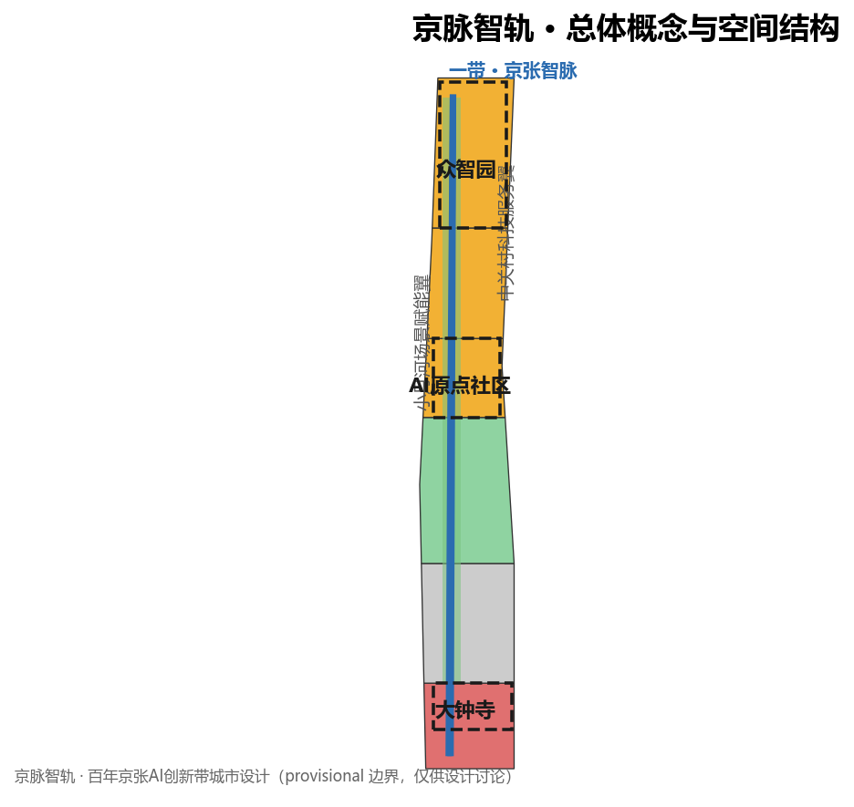
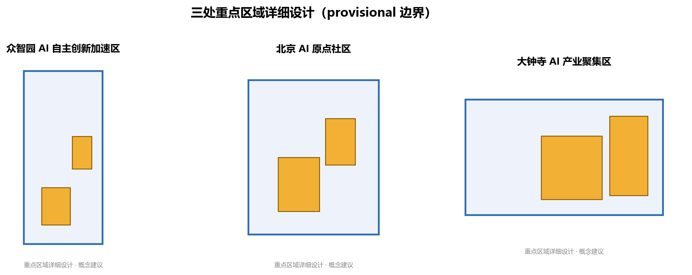
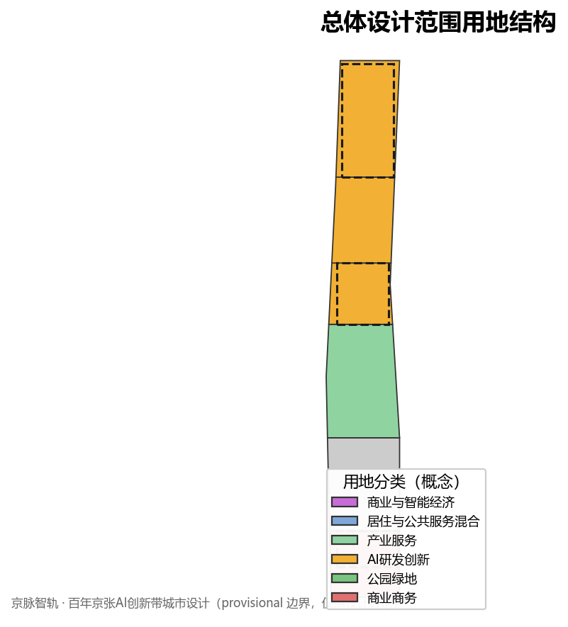
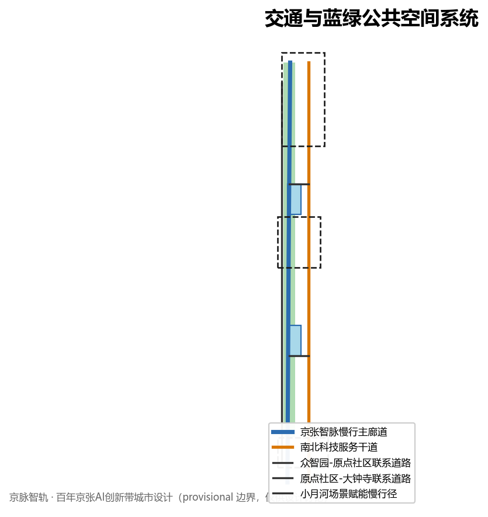
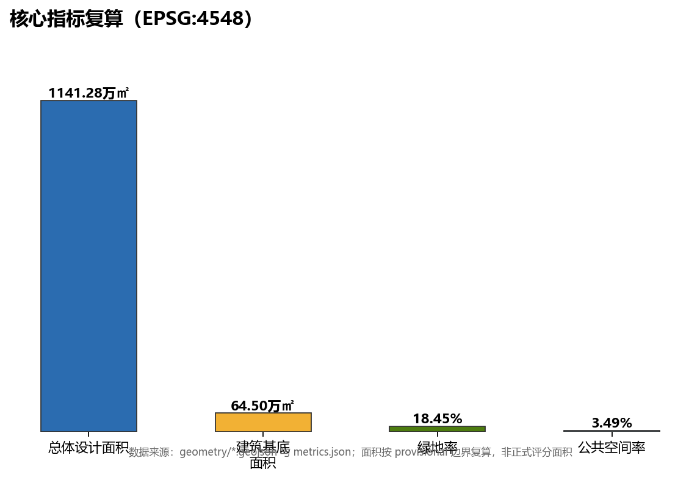

# 京脉智轨：百年京张 AI 创新带总体概念与城市设计

## 设计依据与资料清单

本 formal 方案以北京市规划和自然资源委员会海淀分局发布的《百年京张AI创新带城市设计国际方案征集资格预审公告》为第一依据，并以 `brief/site-package/` 中经维护者登记的临时粗略边界、重点区域、枚举、指标和来源清单为机器可读依据。方案主题设定为「京脉智轨」：京张铁路是詹天佑主持修建、中国人自主设计建造的第一条干线铁路，代表民族自主创新的起点；一百年后，AI 创新带沿同一条轨道延续这份「自主创新」精神，把铁路遗址公园转化为一条贯通南北、承载 AI 创新生态的「智脉」主轴。AI agent 在生成方案前读取了 `design_brief.json`、`allowed_design_space.json`、`sources.json`、`enums/`、`ranges/`、`schemas/`、`data/source_registry.json` 和 `data/processed/agent_fact_pack.md`，并用 `project_scope_summary.csv`、`agent_task_requirements.csv`、`source_use_matrix.csv`、`missing_data_checklist.csv` 建立任务、范围、资料用途和缺口清单。所有设计判断都拆分为可追溯来源、可复算指标、可校验图层和可人工复核假设。公告要求方案达到控制性详细规划的城市设计深度和规划综合实施方案的城市设计深度，因此文本叙述不能替代 GeoJSON、指标表、A3 文册、A0 展板和 HTML 电子展示成果。

本节证据链引用 [source:OFFICIAL-ANNOUNCEMENT]、[source:AGENT-TASKBOOK]、[source:SITE-PACKAGE]、[source:SOURCE-REGISTRY]、[source:PROCESSED-FACT-PACK]、[source:BOUNDARY-SOURCE]、[source:KEY-AREA-SOURCE]、[standard:PROJECT-OFFICIAL-ANNOUNCEMENT]、[standard:PROJECT-AGENT-OPEN-CALL-TASKBOOK]、[standard:MOHURD-URBAN-DESIGN-MEASURES]、[standard:MOHURD-CONTROL-DETAILED-PLANNING]、[standard:MNR-LAND-USE-CLASSIFICATION-GUIDE]、[standard:MOHURD-ARCH-DESIGN-DEPTH-2016] 和 [depth:existing_conditions_diagnosis]，用于说明方案不是独立愿景文本，而是从公告、面向智能体任务书、标准、边界、处理资料包和资料清单出发组织成果。

资料登记表的使用边界如下：

- data/source_registry.json 登记公开、清权与临时资料的用途边界。
- 当前登记摘要：formal 可用资料 5 条，背景资料 0 条，provisional-only 资料 1 条。
- agent 不得把 background_only 或 provisional_only 资料升级为 official boundary、法定控规、正式评分依据或政府实施承诺。

`data/processed/agent_fact_pack.md` 是本方案的阅读导航层，不是新的权威来源。[source:PROCESSED-FACT-PACK] 只帮助 agent 把三层范围、三处重点区、公告任务、agent.1-agent.6、资料可用性和缺资料事项组织成可读方案；所有事实判断仍回到 [source:OFFICIAL-ANNOUNCEMENT]、[source:AGENT-TASKBOOK]、[source:SOURCE-REGISTRY]、[source:BOUNDARY-SOURCE] 与 [source:KEY-AREA-SOURCE]。

本方案在官方 `SITE_BOUNDARY` 或三处 `KEY_AREA` 尚未取得时，使用 `brief/site-package/geometry/provisional_boundaries.geojson` 生成临时 formal 包。提交包中的 `geometry/site_boundary.geojson` 与 `geometry/key_areas.geojson` 均标注为 `provisional_constraint`、`official_boundary=false`，只能用于方案生成、自检、可视化和设计讨论，不能作为 official redline、审批依据、精确面积依据或法定控制结论。该组织方数据缺口本身不阻断内容评分；替换 official polygons 后，site boundary、key areas、land use、roads、green space、public space、buildings、phasing 和 metrics 均需重算。

边界和重点区域的可读解释对应 [data:geometry/site_boundary.geojson#SITE-001]、[data:geometry/key_areas.geojson#PROV-KEY-001] 和 [metric:site_area_sqm]、[metric:key_area_count]。这意味着读者可以从正文回到 GeoJSON 查看边界来源、从 metrics 查看面积复算结果、从 sources 查看资料来源，而不是只相信一段文字判断。

## 三层范围工作框架

方案采用「统筹研究范围—总体设计范围—重点区域范围」三层工作框架，与公告一致。三层范围分别由 [data:geometry/site_boundary.geojson#SITE-001]（总体设计范围）、[data:geometry/key_areas.geojson#PROV-KEY-001]（重点区域范围）和 [metric:site_area_sqm] 表达；统筹研究范围约 43.6 平方公里、总体设计范围约 11.4 平方公里、重点区域范围约 3.684 平方公里，均以公告文字四至与面积约束为基准，在官方 polygon 发布前使用 provisional 几何。三层范围之间的从属关系和递进深度由 [depth:three_level_scope_framework] 管理，确保总体统筹、整体设计与重点深化三个层次不重叠、不遗漏。

在「京脉智轨」语境下，三层范围对应三种设计动作：统筹研究范围解决「智脉如何连入区域创新网络」，总体设计范围解决「智脉上承载什么城市形态」，重点区域范围解决「三个核心节点如何落地」。三层范围共同构成从区域协同到地块深化的完整证据链，并在 `compliance_matrix.json` 中逐条对应公告 1.3、1.4、1.5 与 agent.1-agent.6 任务。

## 统筹研究范围产业与未来城市研究

统筹研究范围以京张铁路遗址公园为文化主线，自清华园火车站向南穿过北航、北邮等高校集聚区并延伸至大钟寺一带，叠加「百年京张文化带、都市AI生活体验带、AI融合创新带」三条主题带。未来城市形态研究回答人工智能如何改变工作、生活、社交、学习、交通和公共服务。「京脉智轨」主张：AI 创新带不是把 AI 产业简单平铺，而是以「智脉」组织研发—测试—转化—生活—治理的完整价值流，让百年铁路的线性空间成为 AI 人才、资本、数据与场景的流动走廊。

统筹层面识别三类区域协同关系：其一，向北衔接未来科学城、怀柔科学城，向东衔接经开区，形成京津冀 AI 创新网络中的「海淀创新源头」；其二，向西依托中关村科技服务翼，把中关村 IP、资本与要素配置能力接入创新带；其三，沿小月河场景赋能翼，把 AI+ 医疗、教育、商业等场景试验放进城市日常。这些协同关系以概念建议和参考方案表达，不构成政府审定结论。产业战略指标、AI 创新指数、人才密度、空间供给类型和 AI+ 垂直应用重点区域写入指标体系，并标明哪些是官方、哪些是设计建议、哪些仍待正式数据校准。全球 AI 创新活动、开发者社区、开放场景或朝圣路线均写为「概念建议/参考方案/可供专业团队深化研究」，不写成已经确定的政府活动或实施安排。该章节由 [depth:three_level_scope_framework] 与 [standard:PROJECT-OFFICIAL-ANNOUNCEMENT] 约束深度。

## 总体设计范围城市更新与控规深度城市设计

总体设计范围要求达到控制性详细规划的城市设计深度。方案提出「一带三核两翼多节点」的总体空间结构：一带为沿京张遗址公园的「京张智脉」主轴线；三核为众智园 AI 自主创新加速区、北京 AI 原点社区、大钟寺 AI 产业集聚区；两翼为中关村科技服务翼与小月河场景赋能翼；多节点为沿智脉布置的 AI 场景与服务节点。方案识别低效空间、提出更新项目清单、实施政策建议、产业功能比例、空间组织模式、建筑总规模和综合承载能力评估。`geometry/land_use.geojson` 完整覆盖设计边界且无重叠，`geometry/buildings.geojson` 表达更新建筑基底与保留建筑基底，`geometry/roads.geojson` 表达微循环、慢行和轨道接驳关系，`metrics.json` 复算核心面积、比例和图层数量。

本节按照 [standard:MOHURD-CONTROL-DETAILED-PLANNING] 把控规深度内容拆成可审查对象：[data:geometry/land_use.geojson#LU-001] 表达用地结构，[data:geometry/buildings.geojson#BLDG-001] 表达建筑基底，[data:geometry/roads.geojson#ROAD-001] 表达交通组织，[metric:building_footprint_area_sqm] 用于复核建筑基底面积，[depth:land_use_layout] 与 [depth:development_intensity_controls] 约束成果深度。总体空间结构由 [depth:overall_spatial_structure] 承载，建筑高度、体量、界面与风貌控制由 [depth:height_massing_character] 管理，拆改留策略由 [depth:retain_renovate_demolish] 表达。

总体设计还支撑交通、轨道、市政和配套设施，围绕轨道站点一体化、道路微循环、非机动车停放、停车供给、创新服务平台、人才生活服务、新型基础设施、分布式能源和端侧算力提出空间布局和实施路径。涉及建筑高度、开发强度、道路红线、退线和设施标准的内容，若无官方控制条件，写为「待正式控规条件确认」，不以 agent 推测值冒充审定指标；交通市政与新型基础设施由 [depth:traffic_rail_slow_parking] 与 [depth:municipal_new_infrastructure] 约束。

## 重点区域详细设计

重点区域详细设计是必选项，三处核心节点对应「京脉智轨」的三大支柱。众智园AI自主创新加速区围绕国家人工智能平台、全栈自主创新、标准制定、安全治理、产业展示、对外交通、清河文化、低碳绿色创新交往环境和绿色空间AI场景提出详细方案，在「京脉」中定位为「自主创新引擎」。北京AI原点社区围绕近校创新、成果孵化转化、人才特区、开源体系、品牌活动、建筑拆改留、成果展示发布、居住生活配套、校区园区慢行联系和轨道站点一体化提出详细方案，在「京脉」中定位为「开源与人才之源」。大钟寺AI产业聚集区围绕领军企业、智能体、智能终端、内容消费、数据要素、数字资产、商业服务、规划绿地复合利用、大钟寺站一体化和路口四象限步行连通提出详细方案，在「京脉」中定位为「智能经济与国际交往客厅」。

三处重点区域详细设计引用 [data:geometry/key_areas.geojson#PROV-KEY-001]、[data:geometry/key_areas.geojson#PROV-KEY-002]、[data:geometry/key_areas.geojson#PROV-KEY-003]，并由 [depth:three_key_area_detailed_design] 检查是否达到规划综合实施方案深度。设计表达包含功能业态、建筑规模、建筑形态、拆改留分类、公共空间系统、交通组织、慢行连通和实施项目，不只是「打造示范区」口号。

| 重点片区 | 设计定位 | 空间动作 | AI产业与运营场景 | 证据引用 |
| --- | --- | --- | --- | --- |
| 众智园AI自主创新加速区 | 花园型全栈自主创新街区 | 强化清河界面、产业展示、低碳创新交往和对外交通组织；以绿色空间承载开放测试与标准治理展示 | 自主模型测试、标准制定工作坊、安全治理展示、低碳算力体验 | [data:geometry/key_areas.geojson#PROV-KEY-001]、[depth:three_key_area_detailed_design] |
| 北京AI原点社区 | 近校型成果转化与人才社区 | 组织校区、园区、街区慢行缝合；补足成果发布、人才服务、居住生活和开源协作空间 | 开源社区、成果发布、人才特区服务、近校孵化 | [data:geometry/key_areas.geojson#PROV-KEY-002]、[source:AGENT-TASKBOOK] |
| 大钟寺AI产业聚集区 | 城市型智能经济与国际交往街区 | 围绕大钟寺站一体化、四象限步行连通、商业服务和重点企业公共环境更新 | 智能体与智能终端展示、内容消费、数据要素与国际路演 | [data:geometry/key_areas.geojson#PROV-KEY-003]、[metric:key_area_count] |

## AI 创新生态、人才画像与 AI+ 场景

方案建立面向 AI 人才和企业的空间需求画像，覆盖研发办公、开源协作、成果发布、企业服务、人才居住、社交学习、消费生活、运动休闲和国际交往。「京脉智轨」构建 AI 创新生态图谱：由众智园承载全栈自主创新与治理话语权，由 AI 原点社区承载开源生态与成果转化，由大钟寺承载智能原生新业态，由中关村翼承载要素配置与资本赋能，由小月河翼承载 AI+ 场景赋能。AI+ 场景围绕公告提出的交通、服务、消费、医疗、教育、法律、生活服务等方向，形成产业发展场景和 AI 赋能城市功能场景。每个场景说明服务对象、空间位置、数据来源、隐私边界、人工复核机制和运营主体。

AI 场景落到空间和治理边界：公共空间场景引用 [data:geometry/public_space.geojson#PUBLIC-001]，慢行与交通场景引用 [data:geometry/roads.geojson#ROAD-001]，开放空间场景引用 [data:geometry/green_space.geojson#GREEN-001] 和 [metric:public_space_ratio]、[metric:green_ratio]。面向智能体任务书要求不少于10张AI场景卡、不少于3个产业测试验证场景和不少于5类用户画像；本方案把场景卡、画像表、隐私边界、人工复核和运营主体写入正文、HTML、A3/A0 和合规矩阵。

「京脉智轨」的命名体系与视觉识别方向：主名称「京脉智轨」，英文名 "Jing-Zhang AI Smart Rail Corridor"（简称 Jingmai）；Logo 方向采用「铁轨与电路板走线共生」的图形语言，以字母 J 的形变融合轨道枕木与 AI 电路走线，象征百年自主创新精神与人工智能血脉的延续。该Logo与命名体系为概念方向，供专业团队深化，不构成已确定品牌决策。AI 朝圣地标方向包括：京张遗址公园「自主创新起点碑」、AI原点社区「开源贡献荣誉墙」、大钟寺「全球AI路演灯塔」，均为概念建议。

| 用户画像 | 典型需求 | 空间响应 | 自检边界 |
| --- | --- | --- | --- |
| 开源开发者 | 发布、协作、测试、社区声誉 | 原点社区开源发布厅、公共代码墙、夜间协作空间 | 不采集个人行为轨迹；活动数据只做聚合统计 |
| 初创团队 | 低成本办公、算力入口、产品试验场 | 众智园共享测试场、端侧算力服务点、标准治理咨询 | 算力和数据服务需另行授权 |
| 头部企业访客 | 展示、商务、国际接待、人才招聘 | 大钟寺国际路演客厅、轨道站点接驳、重点企业周边公共空间 | 企业标识和案例须清权 |
| 周边居民 | 通勤、休闲、社区服务、低扰动更新 | 京张遗址公园慢行环、社区服务嵌入、夜间照明和活动分级 | 不将居民画像用于商业推荐 |
| 高校师生 | 成果转化、跨校协作、日常慢行 | 校区-园区慢行缝合、成果转化驿站、AI教育体验点 | 校园数据和科研成果需授权 |

| 场景卡 | 空间载体 | 设计说明 |
| --- | --- | --- |
| 01 开源发布厅 | 北京AI原点社区 | 面向高校、开源社区和初创团队，提供成果发布、代码贡献展示和小型路演空间 |
| 02 安全治理沙盒 | 众智园 | 将标准制定、安全评测、模型红队测试转译为可参观、可预约、可监管的展示和协作节点 |
| 03 端侧算力驿站 | 总体设计范围节点 | 与公共服务、企业服务和低碳能源策略结合，作为待深化的新型基础设施原型 |
| 04 AI慢行导航 | 京张遗址公园活力带 | 用可解释导视和低侵入传感帮助识别慢行断点、拥挤节点和无障碍需求 |
| 05 大钟寺国际路演客厅 | 大钟寺AI产业聚集区 | 服务智能体、智能终端和内容消费企业的展示、洽谈、媒体发布和国际交流 |
| 06 清河低碳创新廊 | 众智园临清河界面 | 把绿色空间、雨洪、步行骑行和AI展示结合，作为园区公共客厅 |
| 07 近校成果转化街 | 北京AI原点社区 | 面向高校成果转化，组织孵化、展示、法务、知识产权和投融资服务 |
| 08 数据要素会客厅 | 大钟寺片区 | 以合规、授权、可审计为前提，展示数据要素和数字资产流通的城市服务界面 |
| 09 AI生活服务样板街 | 社区与商业交汇处 | 将医疗、教育、法律、生活服务等AI+场景落到可运营的小尺度街区空间 |
| 10 全球AI活动周路线 | 一带公共空间系统 | 形成从遗址文化、开源社区、产业展示到国际路演的可步行、可传播体验路线 |

agent 生成的AI治理建议遵守数据最小化、公开来源、可解释和人工复核原则。城市智能体可辅助识别慢行断点、公共空间热力、设施维护、企业服务需求和活动安全风险，但不替代规划审批、不输出未经授权的个人画像、不声称获得官方实施承诺。所有AI场景节点进入结构化图层或合规矩阵，便于评审者看到它们与产业、空间和公共利益之间的关系。

## 用地、建筑规模与拆改留方案

用地方案依据国土空间调查、规划、用途管制分类等公开标准表达，形成完整、闭合、无缝的用地分区。「京脉智轨」的用地结构以「智脉主轴两侧复合更新」为组织逻辑：沿京张遗址公园一线强化绿地与公共空间，众智园周边以产业与科研用地为主，原点社区周边以创新孵化与生活服务混合用地为主，大钟寺周边以商业商务与智能经济用地为主。建筑方案区分保留、改造、更新、新建或待确认对象，明确建筑基底、功能、规模、风貌、屋顶、体量和高度控制的建议层级。若缺少现状建筑、权属、控规和工程条件，方案只提出方法和待校准清单，不编造拆改留结论。

用地分类依据 [standard:MNR-LAND-USE-CLASSIFICATION-GUIDE]，建筑高度、体量、界面和风貌控制由 [depth:height_massing_character] 管理，拆改留逻辑由 [depth:retain_renovate_demolish] 表达。用地分区由 [data:geometry/land_use.geojson#LU-001]、[data:geometry/buildings.geojson#BLDG-001] 与 [metric:building_footprint_area_sqm] 支撑，建筑设计与深度依据 [standard:MOHURD-ARCH-DESIGN-DEPTH-2016]、[depth:development_intensity_controls]。

## 交通、轨道、市政与公共服务设施

交通策略以「智脉慢行优先 + 轨道接驳 + 智慧微循环」为骨架。沿京张遗址公园形成连续慢行主轴，串联众智园、原点社区、大钟寺三核；围绕轨道站点组织一体化接驳、非机动车停放与停车供给；以智慧交通与 AI 交通管理提升交叉口安全与通行效率。市政与新型基础设施聚焦分布式能源、端侧算力、智慧管网、低碳能源与公共安全设施，支撑 AI 原生城市形态。公共服务设施按创新人才与居民两类需求配置，提供研发办公、成果发布、人才服务、教育医疗、商业生活与国际交往等服务。

交通、轨道、市政与配套由 [data:geometry/roads.geojson#ROAD-001]、[data:geometry/green_space.geojson#GREEN-001]、[depth:traffic_rail_slow_parking]、[depth:municipal_new_infrastructure] 与 [standard:MOHURD-URBAN-DESIGN-MEASURES] 共同支撑。道路线形、轨道线位、桥隧工程、市政管线等工程结论均标为「待正式控规与工程条件确认」，不冒充审定结论。

## 蓝绿空间、公共空间与城市风貌

蓝绿公共空间以「京张遗址公园主轴 + 清河界面 + 社区绿廊」为骨架，形成连续的绿色开放空间网络。京张遗址公园既是文化记忆场所，也是 AI 体验的公共客厅；清河界面承载低碳绿色创新交往；社区级绿廊保证15分钟生活圈内的公共空间可达性。公共空间系统分级配置，支撑慢行、休闲、展览、实验测试与活动运营。城市风貌以「百年铁路记忆 + 现代 AI 产业界面」为基调，通过保留改造、色彩材质、夜景照明与公共艺术塑造可识别的创新带风貌。

蓝绿公共空间由 [data:geometry/green_space.geojson#GREEN-001]、[data:geometry/public_space.geojson#PUBLIC-001]、[metric:green_ratio]、[metric:public_space_ratio] 与 [depth:blue_green_public_space] 支撑。公共空间与城市风貌结合 [standard:MOHURD-URBAN-DESIGN-MEASURES]、[standard:MOHURD-ARCH-DESIGN-DEPTH-2016] 表达。

## 更新项目清单、实施政策与分期计划

方案提出沿「京脉智轨」主轴的更新项目清单，覆盖遗址公园活化、三个核心区更新、慢行联系、场景节点与新型基础设施原型。实施政策建议围绕「场景开放、人才特区、数据要素、混合用地」提出，均以概念建议和参考方案表达，不构成已确定政策。分期计划区分近期试点、中期更新和长期治理框架：近期以轻量设施、运营活动和服务平台启动，中期推进核心区更新与慢行体系，长期建立治理框架与品牌机制；凡需等待正式控规、市政、交通和权属条件确认的内容明确标注。更新项目与分期由 [depth:renewal_project_list]、[depth:phasing_implementation] 与 [data:geometry/phasing.geojson#PHASE-001] 支撑。

对于年度活动体系、开发者社区运营、场景开放日、公共体验路线和国际传播机制，正文说明运营对象、频率、责任边界、转化路径和风险，不只写宣传口号。

## 指标体系、面积复算与合规矩阵

指标体系覆盖总体设计范围面积、重点区域面积、绿地与公共空间比例、建筑基底、更新项目数量、AI场景节点、慢行连通指标、产业空间指标、人才服务指标和自检状态。所有 known 指标都能从 GeoJSON 或可信来源复算；unknown 指标给出原因和正式提交前置条件。`scripts/spatial_review.py` 和 `scripts/visual_review.py` 的结果是 formal 自检的重要证据。

指标复算深度由 [depth:metrics_recalculation] 管理。本方案正文显式引用 [metric:site_area_sqm]、[metric:key_area_count]、[metric:building_footprint_area_sqm]、[metric:green_ratio]、[metric:public_space_ratio]，并说明这些值来自 [data:geometry/site_boundary.geojson#SITE-001]、[data:geometry/key_areas.geojson#PROV-KEY-001]、[data:geometry/buildings.geojson#BLDG-001]、[data:geometry/green_space.geojson#GREEN-001] 和 [data:geometry/public_space.geojson#PUBLIC-001]。

合规矩阵是任务响应性的主控文件。每条公告任务和 agent_taskbook 任务对应到报告章节、图层、指标、图纸、HTML 页面、来源、假设和自检项。未能覆盖公告 1.3、1.4、1.5 或 agent.1-agent.6 的任一必选任务，方案不得进入 formal professional scoring。三类指标分别进入 `metrics.json`、`assumptions.json` 和 `compliance_matrix.json`，避免把运营愿景误写成审定规划条件。

## 风险、版权与合规说明

方案主文件使用中文，通过 `proposal.en.md` 提供非阻断对照译文。A3/A0、HTML 和含文字图件均说明来源、许可和授权状态；HTML 页面不加载远程脚本、远程地图瓦片、远程字体、iframe、表单或外部 API，不跟踪评审者行为。风险和缺资料清单由 [depth:risk_missing_data] 管理，并与 [data:geometry/constraints.geojson#CONSTRAINTS]、[source:SITE-PACKAGE]、[source:PROCESSED-FACT-PACK] 和 [standard:MOHURD-CONTROL-DETAILED-PLANNING] 相互校核。official boundary、key area、控规、道路、地块、建筑、市政、文保和公共服务缺口进入 `assumptions.json`、自检和正文风险章节；任何缺少官方控规、道路红线、权属、市政、消防或文保条件的结论，都降级为待确认事项。

本方案不声称官方批准、审定控规、最终土地权属、最终建设规模或保证实施。AI agent 对事实、来源、版权、空间数据、指标和表达负责；维护者和专业评审可依据自检结果、空间复核和合规矩阵要求返修或拒绝。

## 参考资料

- brief/public-brief.md
- brief/site-package/design_brief.json
- brief/site-package/allowed_design_space.json
- brief/site-package/agent_taskbook.json
- brief/site-package/geometry/provisional_boundaries.geojson
- brief/site-package/enums/
- brief/site-package/ranges/planning_limits.json
- brief/site-package/standards/standards.json
- brief/site-package/standards/references/index.json
- data/source_registry.json
- data/processed/agent_fact_pack.md
- data/processed/project_scope_summary.csv
- data/processed/agent_task_requirements.csv
- data/processed/source_use_matrix.csv
- data/processed/missing_data_checklist.csv
- 机器可读引用索引：[source:OFFICIAL-ANNOUNCEMENT]、[source:AGENT-TASKBOOK]、[source:SITE-PACKAGE]、[source:SOURCE-REGISTRY]、[source:PROCESSED-FACT-PACK]、[source:BOUNDARY-SOURCE]、[source:KEY-AREA-SOURCE]、[standard:PROJECT-OFFICIAL-ANNOUNCEMENT]、[standard:PROJECT-AGENT-OPEN-CALL-TASKBOOK]、[standard:MOHURD-URBAN-DESIGN-MEASURES]、[standard:MOHURD-CONTROL-DETAILED-PLANNING]、[standard:MNR-LAND-USE-CLASSIFICATION-GUIDE]、[standard:MOHURD-ARCH-DESIGN-DEPTH-2016]、[depth:existing_conditions_diagnosis]、[depth:three_level_scope_framework]、[depth:overall_spatial_structure]、[depth:land_use_layout]、[depth:development_intensity_controls]、[depth:height_massing_character]、[depth:retain_renovate_demolish]、[depth:traffic_rail_slow_parking]、[depth:municipal_new_infrastructure]、[depth:blue_green_public_space]、[depth:three_key_area_detailed_design]、[depth:renewal_project_list]、[depth:phasing_implementation]、[depth:metrics_recalculation]、[depth:risk_missing_data]、[data:geometry/site_boundary.geojson#SITE-001]、[data:geometry/key_areas.geojson#PROV-KEY-001]、[data:geometry/land_use.geojson#LU-001]、[data:geometry/buildings.geojson#BLDG-001]、[data:geometry/roads.geojson#ROAD-001]、[data:geometry/green_space.geojson#GREEN-001]、[data:geometry/public_space.geojson#PUBLIC-001]、[data:geometry/constraints.geojson#CONSTRAINTS]、[data:geometry/phasing.geojson#PHASE-001]、[metric:site_area_sqm]、[metric:key_area_count]、[metric:building_footprint_area_sqm]、[metric:green_ratio]、[metric:public_space_ratio]