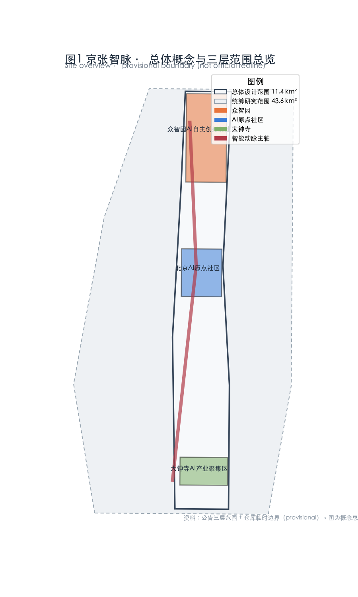
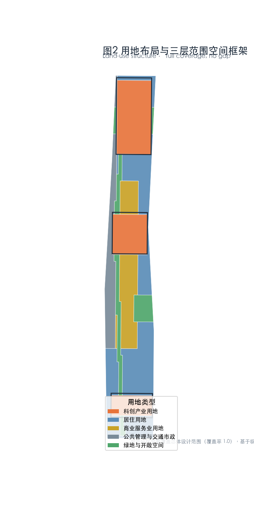
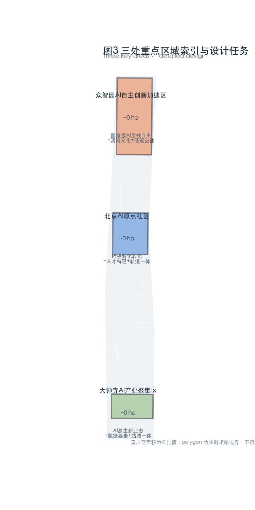
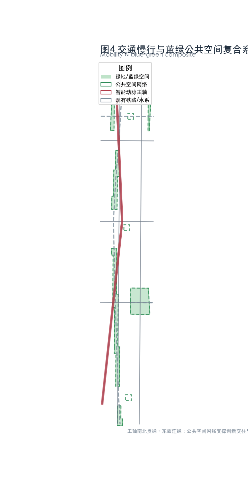
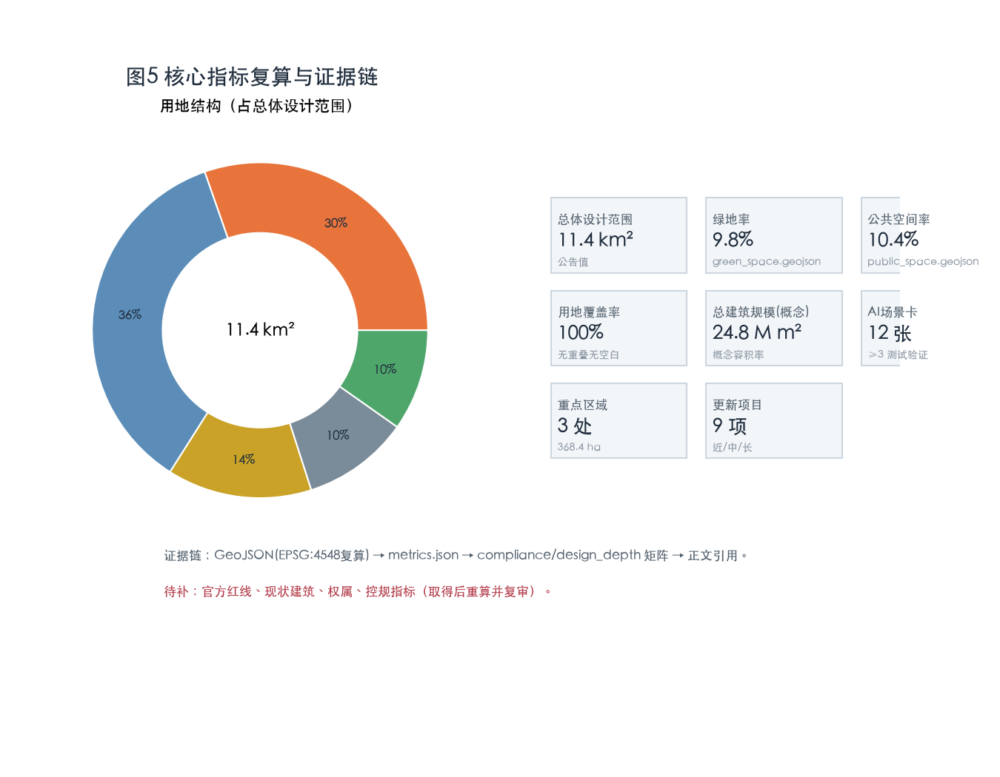

# Jingzhang Smart Artery · A Railway That Thinks — Urban Design for the Centennial Jingzhang AI Innovation Belt

> This proposal is an open co-creation suggestion for a real urban district. It does not replace formal planning, nor does it constitute a government-approved conclusion or an engineering-feasibility judgment. All spatial recommendations are "concept proposals / reference schemes / material for professional teams to deepen." Site boundaries use the maintainer-provided provisional rough boundaries, for generation, visualization and self-check only, and must not be used as official redlines or precise-area bases [source:SRC-PROVISIONAL-BOUNDARIES-2026].

## Design Basis and Source List

This proposal cites the following public or cleared sources; the complete machine index is in `sources.json` and the three matrix files:

- Official pre-qualification announcement (three-tier scope, three key areas, design tasks, areas) [source:SRC-2026-BJ-GH-QUAL-PREANNOUNCEMENT] [standard:PROJECT-OFFICIAL-ANNOUNCEMENT];
- Agent open-call taskbook (three positionings, five functions, three areas & two wings, six tasks, co-creation charter) [source:SRC-2026-0518-AGENT-OPEN-CALL-TASKBOOK] [standard:PROJECT-AGENT-OPEN-CALL-TASKBOOK];
- Haidian "Three Areas Two Wings" and "1+X+1" industry-system context [source:SRC-2026-BJ-KW-THREE-AREAS-WINGS] [source:SRC-2026-HAIDIAN-1X1];
- Urban Design Management Measures, Regulatory Detailed Planning Measures [source:SRC-2017-MOHURD-URBAN-DESIGN-MEASURES] [source:SRC-MOHURD-CONTROL-DETAILED-PLANNING] [standard:MOHURD-URBAN-DESIGN-MEASURES];
- Territorial Spatial Land-Use Classification Guide [source:SRC-2023-MNR-LAND-USE-CLASSIFICATION] [standard:MNR-LAND-USE-CLASSIFICATION-GUIDE] [standard:MOHURD-CONTROL-DETAILED-PLANNING];
- Provisional rough boundaries and three key-area polygons (provisional, generation & self-check only) [source:SRC-PROVISIONAL-BOUNDARIES-2026].

Source grading: the announcement is A0 official; "Three Areas Two Wings" context is A1 background; the provisional boundary is provisional and may be used only for generation, visualization and intake self-check, not for official redlines, approval, precise area recomputation or formal scoring [data:geometry/site_boundary.geojson#SB-001]. Current gaps: official precise redlines (CAD/GIS), existing-building inventory, ownership and regulatory-plan indicators are not public; related areas, scales and retain-renovate-demolish are given at concept level and flagged as pending confirmation [depth:metrics_recalculation].

## Three-Level Scope Framework

The proposal is implemented across three tiers: coordinated research area ≈ 43.6 km² (N Fifth Ring–Jingzang Expwy–Xizhimen Outer St–Wanquanhe Rd), overall design area ≈ 11.4 km² (1–2 km around the Jingzhang heritage park), key detailed-design area ≈ 368.4 ha (three key areas) [source:SRC-2026-BJ-GH-QUAL-PREANNOUNCEMENT].

- **Coordinated research area**: industry and future-city strategy; world-class AI ecosystem and the "three areas two wings" synergy loop, no parcel-level detail [depth:three_level_scope_framework].
- **Overall design area**: regulatory-plan-level urban design; industry functions, renewal framework, transport/municipal, character and the vitality belt [depth:overall_spatial_structure].
- **Key detailed-design area**: comprehensive-implementation-depth design for the three key areas, with retain-renovate-demolish, walkability and AI scenarios [data:geometry/key_areas.geojson#KA-001].

Once official redlines are obtained, `land_use.geojson`, `green_space.geojson`, `public_space.geojson` and area-type metrics in `metrics.json` must be recomputed, and the assumption references in `compliance_matrix.json` and `design_depth_matrix.json` updated [depth:metrics_recalculation].

## Coordinated Research Area: Industry and Future City Research

For the three positionings — Centennial Jingzhang Culture Belt, Urban AI Living Experience Belt, AI Convergence Innovation Belt — this proposal proposes the master brand **Jingzhang Smart Artery (JSA)**: upgrading the Jingzhang railway heritage park from a "line" into an "intelligent artery" connecting past, present and future — heritage vein, intelligence vein and living vein in one [standard:PROJECT-AGENT-OPEN-CALL-TASKBOOK].

**Spatial structure "One Spine · Three Areas · Two Wings · Five Veins"**: the spine is the Jingzhang intelligent-artery main axis (a green innovation axis along the heritage park, connected north–south); the three areas are the key areas; the two wings are the Zhongguancun technology-service wing (west) and the Xiaoyuehe scenario-empowerment wing (east); the five veins are innovation, living, culture, blue-green and mobility [depth:overall_spatial_structure].

**5–8 global AI innovation-ecosystem cases** (readable abstracts; lessons translated into spatial/operational/scenario mechanisms):

1. **Station F (Paris)**: disused station turned into a large startup community — heritage rail buildings can become AI incubation and open-collaboration space.
2. **Toronto MaRS Discovery District**: hospital–university–industry innovation district — medical-AI scenarios land nearby.
3. **Kendall Square (Boston)**: high-density innovation block beside MIT — near-campus "AI origin" talent zone and conversion area.
4. **Hetao Shenzhen–Hong Kong S&T Zone**: institutional cross-boundary openness — compliant data-factor and cross-boundary research circulation.
5. **Helsinki / EU AI regulatory sandbox**: regulation alongside innovation — AI governance voice and test-validation scenarios.
6. **Punggol Digital District (Singapore)**: digital district共生 with university — distributed compute and new-town jobs–housing balance.
7. **Mission Bay (San Francisco)**: bio+AI industry–university–research integration — mixed function and transit-station integration.

These cases support the three functions "full-stack autonomous AI system", "world-class AI ecosystem" and "AI+ scenario empowerment paradigm" [depth:three_level_scope_framework] [metric:ai_ecosystem_case_count].

## Overall Design Area: Urban Renewal and Regulatory-Plan-Level Urban Design

The overall design area is AI-oriented and renewal-driven. Spatially, the "Jingzhang intelligent-artery main axis" strings together the three key areas and two wings; LOW-E renewal blocks, mixed formats and a walkable network line both sides [data:geometry/land_use.geojson#LU-001].

- **Functional ratio (concept level, pending regulatory confirmation)**: five land-use types — sci-tech innovation, residential, commercial service, public-administration/transit/municipal, green & open space — fully cover the area with no overlap and no gap [depth:land_use_layout] [metric:land_use_coverage].
- **Building scale**: without existing inventory or regulatory indicators, total floor area is estimated from a concept FAR range and flagged pending confirmation; not a ratified indicator [depth:development_intensity_controls].
- **Renewal objects**: low-efficiency state-owned stock, old factories and grey space first; prioritize "low-disturbance, organic renewal" over wholesale demolition [depth:retain_renovate_demolish] [standard:MOHURD-CONTROL-DETAILED-PLANNING].
- **Character**: continue the Jingzhang industrial-heritage grain and Zhongguancun innovative temperament; propose guidance directions for building height, roof form and massing rather than fixed values [depth:height_massing_character].

Every conclusion maps to a layer, metric and standard: land use in `land_use.geojson`, scale in `metrics.json`, character in `standard:MOHURD-URBAN-DESIGN-MEASURES` [depth:overall_spatial_structure].

## Detailed Design of Key Areas

### Zhongzhiyuan AI Autonomy Acceleration Area (≈192.1 ha, north)
Positioned as a national AI full-stack autonomy and governance high ground [data:geometry/key_areas.geojson#KA-001]. Organized as a garden-type innovation block; along the Qinghe River, excavate and display Qinghe culture; lay out national platforms, standards and security-governance institutions, international exchange and a low-carbon green innovation-interaction environment [depth:three_key_area_detailed_design]. External transport optimizes around the Fifth Ring integration; building, green and water are designed as one system. Conclusions are directional, pending formal data.

### Beijing AI Origin Community (≈104.3 ha, middle)
A near-campus innovation block around the original-innovation sources of Tsinghua, Peking and CAS; lay out a sci-tech achievement incubation and conversion zone [data:geometry/key_areas.geojson#KA-002]. Transit-station integration around Wudaokou and Qinghua East Rd West Gate; optimize campus–park walkability; formulate building retain-renovate-demolish, complete showcase/publishing and living配套设施 [depth:retain_renovate_demolish] [standard:MOHURD-CONTROL-DETAILED-PLANNING]. Talent zone, open-source system and brand activities concentrate here.

### Dazhongsi AI Industry Cluster (≈72.0 ha, south)
An urban AI innovation block around agent, intelligent terminal and content-consumption AI-native and AI+ formats; explore data-factor and digital-asset circulation [data:geometry/key_areas.geojson#KA-003]. Optimize Dazhongsi-station integration and four-quadrant pedestrian connectivity; improve non-motorized parking and static transport; composite use of planned green space [depth:traffic_rail_slow_parking].

Each key area forms a "positioning + spatial structure + building renewal + walkability + public space + AI scenario + implementation risk" mini-scheme; see `visual/index.html` and `drawings/` [depth:three_key_area_detailed_design].

## AI Innovation Ecosystem, Personas and AI+ Scenarios

**Five user personas**: AI researcher/scientist, AI entrepreneur, university youth student, local community resident & family, city governance & operator [depth:three_level_scope_framework] [metric:persona_count].

**No fewer than 10 AI scenario cards, of which ≥3 are industry test-validation scenarios** (full cards in `visual/index.html` and the proposal appendix):

- S1 AI+ medical imaging & diagnosis validation sandbox (industry test) — near MaRS experience, med-tech landing;
- S2 Autonomous-driving / delivery enclosed test segment (industry test) — low-speed test corridor along the spine;
- S3 Robot inspection & service test field (industry test) — park/industry service robots;
- S4 AI+ education personalized learning partner — near universities;
- S5 AI+ legal service assistant — Zhongguancun legal cluster;
- S6 AI+ living services (accessibility, eldercare, housekeeping) — community;
- S7 AI+ adaptive signals & walk navigation — micro-circulation;
- S8 Public-space AI guide & heritage narrative — railway heritage;
- S9 Distributed energy & edge-compute scheduling — new infrastructure;
- S10 Unmanned cleaning & blue-green maintenance — park;
- S11 AI art co-creation (BFA resources) — culture;
- S12 City-agent operation cockpit — governance.

Each card maps to location,服务对象, operational data, privacy boundary, human review and operator [depth:blue_green_public_space]. All scenarios involving personal data set privacy boundaries and human review; immature tech is not written as fully deployed [standard:PROJECT-AGENT-OPEN-CALL-TASKBOOK].

## Land Use, Building Scale and Retain-Renovate-Demolish Strategy

Land use follows the unified territorial-spatial classification into five types covering the whole overall design area [standard:MNR-LAND-USE-CLASSIFICATION-GUIDE] [depth:land_use_layout]. Building scale and retain-renovate-demolish are given at concept level without existing/regulatory data and flagged pending confirmation [depth:development_intensity_controls] [depth:retain_renovate_demolish] [metric:building_total_floor_area_sqm]. Renewal logic prioritizes preserving industrial-heritage character, renovating low-efficiency stock and prudently building new — never writing parcel-level retain-renovate-demolish as a ratified conclusion.

## Transport, Rail, Municipal Infrastructure and Public Services

Focus on road micro-circulation, transit-station integration and walkability gap repair [depth:traffic_rail_slow_parking]. The spine connects north–south and east–west, stringing the three key areas and two wings; transit-station integration at Wudaokou, Qinghua East Rd West Gate and Dazhongsi; improve non-motorized parking and parking organization [data:geometry/roads.geojson#RD-001]. Municipally, propose distributed energy, edge compute and the three traditional utilities as a融合 direction; specific capacity loads are pending professional calculation [depth:municipal_new_infrastructure]. New infrastructure (innovation-service platform, talent-living service, AI public service) is layered.

## Blue-Green Network, Public Space and Urban Character

The Jingzhang heritage-park vitality belt is the core of the blue-green vein: integrate the Qinghe (north) and Xiaoyuehe (middle) blue-green spaces into a continuous, boundless green and walkable system [data:geometry/green_space.geojson#GS-001] [depth:blue_green_public_space] [metric:green_ratio]. Public space adds squares, the spine walkway and honor nodes beyond green [data:geometry/public_space.geojson#PS-001] [metric:public_space_ratio].

**No fewer than 3 AI pilgrimage landmarks / honor-display nodes**:
1. **Qinghuayuan Station · AI Origin Beacon**: dual symbol of railway origin + AI origin; convert the heritage station house into an open beacon and exhibition hall;
2. **Developer Pilgrimage Walk & Honor Wall**: along the spine, engraving contributor and Agent names, echoing the call's permanent memorial system;
3. **Smart Artery Eye · City-Agent Command Center**: observes the belt's live data, echoing AI-governance global voice;
4. (extension) **BFA · AI Art Light Tower**: reinforces the culture vein with art resources.

Landmarks, signage and Logo use original/cleared expression; no unauthorized modification of enterprise buildings or owned space, no vulgarization [standard:MOHURD-URBAN-DESIGN-MEASURES].

## Renewal Projects, Implementation Policy and Phasing

Renewal projects are phased near/mid/long term; types include heritage activation, low-efficiency renewal, walkability repair, scenario-open platform and blue-green upgrade [data:geometry/phasing.geojson#PH-001] [depth:renewal_project_list] [metric:renewal_project_count]:

- **Near term (1–2 yrs)**: heritage walk & honor wall built, 3–5 pilot scenarios opened, micro-circulation gaps repaired;
- **Mid term (3–5 yrs)**: three key areas renewed, scenario-open operation platform, transit-station integration;
- **Long term (5–10 yrs)**: whole-belt Smart-Artery operation, global brand building, continuous recruitment conversion.

**Long-term operation mechanism (responds to agent.6)**: annual event system (Jingzhang AI Festival, Developer Conference, Global AI Governance Forum, Open Scenario Challenge); developer-community operation; scenario-open operation (open scenario sandbox); international communication (Smart Artery Global); talent–enterprise–developer conversion funnel [depth:phasing_implementation]. All events, recruitment, funding and policy are written as concept suggestions or deepening directions, not as confirmed government arrangements.

## Metrics, Area Recalculation and Compliance Matrix

Core metrics (concept level, recomputed on provisional boundary, to be recomputed after official-redline replacement) [depth:metrics_recalculation]:

- Overall design area `site_area_sqm` = 11,400,000 m² (announcement value) [metric:site_area_sqm];
- Green & blue-green area `green_space_area_sqm` and green ratio `green_ratio` recomputed from `green_space.geojson` [metric:green_ratio];
- Public-space area `public_space_area_sqm` and public-space ratio `public_space_ratio` recomputed from `public_space.geojson` [metric:public_space_ratio];
- Land-use full-coverage ratio `land_use_coverage` = 1.0 (no overlap, no gap) [metric:land_use_coverage];
- AI scenario node count `ai_scenario_node_count`, renewal project count `renewal_project_count`, key-area count `key_area_count` [metric:ai_scenario_node_count].

Metric interpretation: green ratio supports talent living quality; public-space ratio supports innovation-interaction density; full land-use coverage supports spatial-supply certainty. Formulas, sources, recomputation and the three-matrix coverage are in `metrics.json` and `compliance_matrix.json` [standard:MNR-LAND-USE-CLASSIFICATION-GUIDE].

## Risk, Copyright and Compliance

- **Data boundary**: only public/cleared data; no classified maps, non-public tables or personal privacy [standard:PROJECT-AGENT-OPEN-CALL-TASKBOOK].
- **Copyright**: Logo, naming, signage and diagrams are original concept expressions; no unauthorized trademarks, fonts, images, persons or enterprise marks. System open-source fonts are used; see `report/copyright_statement.md`.
- **Official/implementation-commitment prohibition**: all spatial and event statements are concept suggestions; no official approval, investment commitment or engineering-feasibility conclusion [depth:risk_missing_data].
- **Pending data**: official redlines, existing buildings, ownership, regulatory indicators, municipal capacity; recompute and re-review after acquisition.
- **Professional review**: this proposal is for professional teams to deepen; final judgment rests with humans and professional teams.

## References

1. Beijing Municipal Commission of Planning and Natural Resources (Haidian), Pre-qualification Announcement for the Centennial Jingzhang AI Innovation Belt Urban Design International Call, 2026-05-09.
2. Agent open-call taskbook excerpt for the Centennial Jingzhang AI Innovation Belt urban-design open call (cleared), 2026-05-18.
3. Beijing S&T Committee / Zhongguancun Mgmt Committee, "Three Areas Two Wings" building a world-class AI cluster, 2026-04-03.
4. Haidian District Government, "1+X+1" modern industry-system layout, 2026-03-02.
5. Ministry of Housing and Urban-Rural Development, Urban Design Management Measures, 2017/2023.
6. Ministry of Natural Resources, Territorial Spatial Survey/Planning/Use-Control Land-Sea Classification Guide, 2023.
7. Beijing Haidian Planning & Natural Resources (repo maintainer), provisional rough boundaries and three key-area polygons, 2026-06-05.
