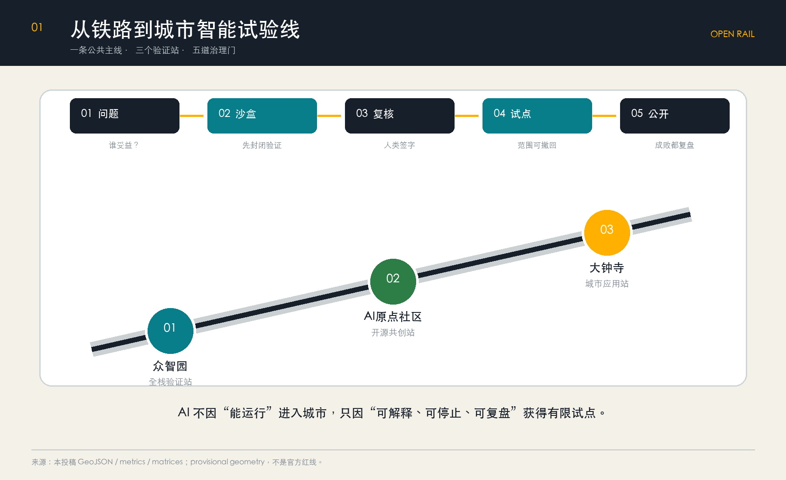
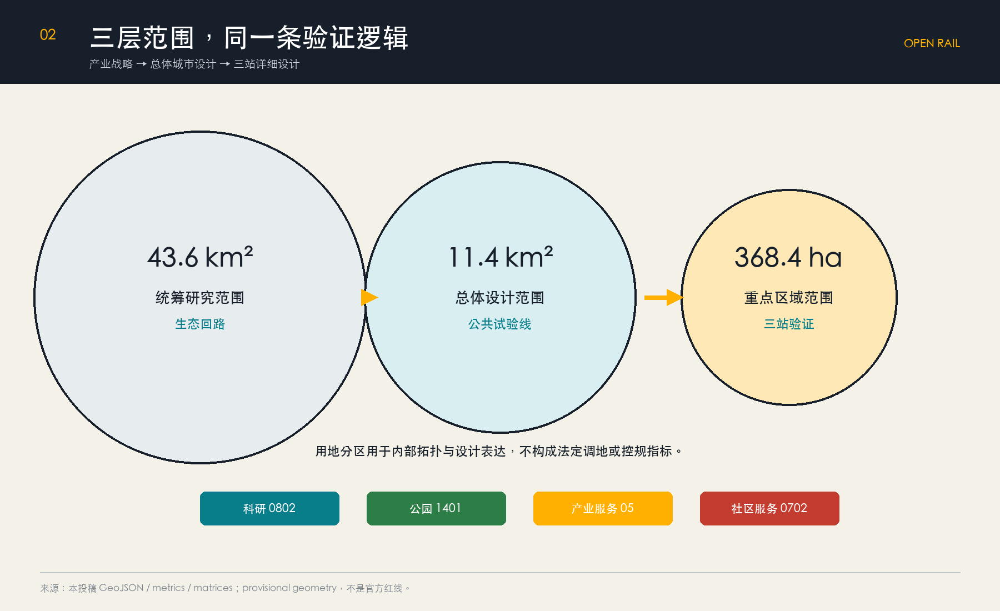
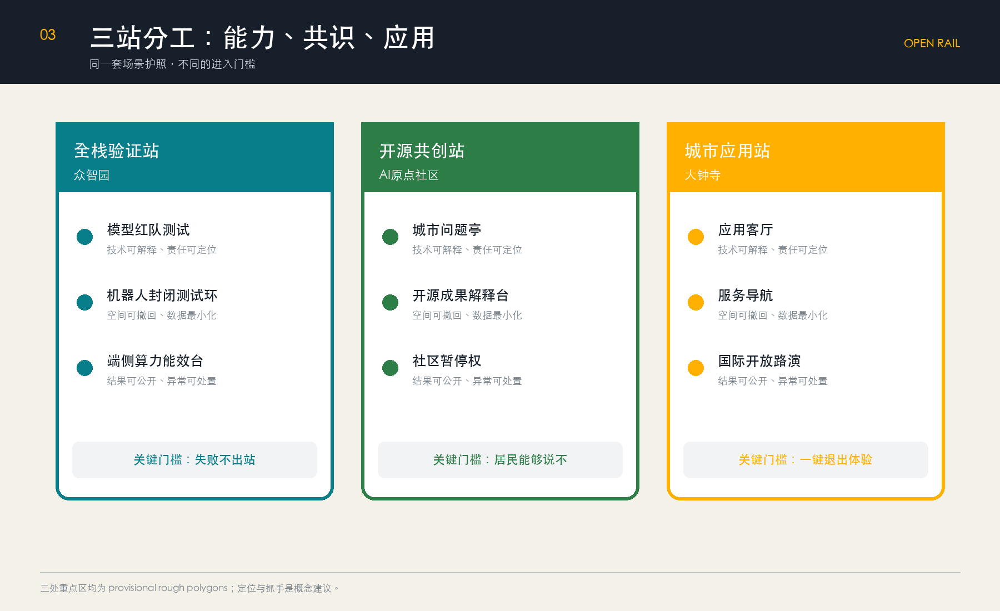
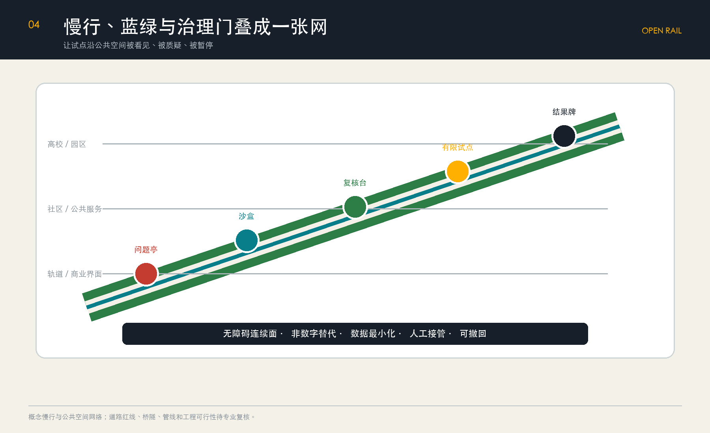
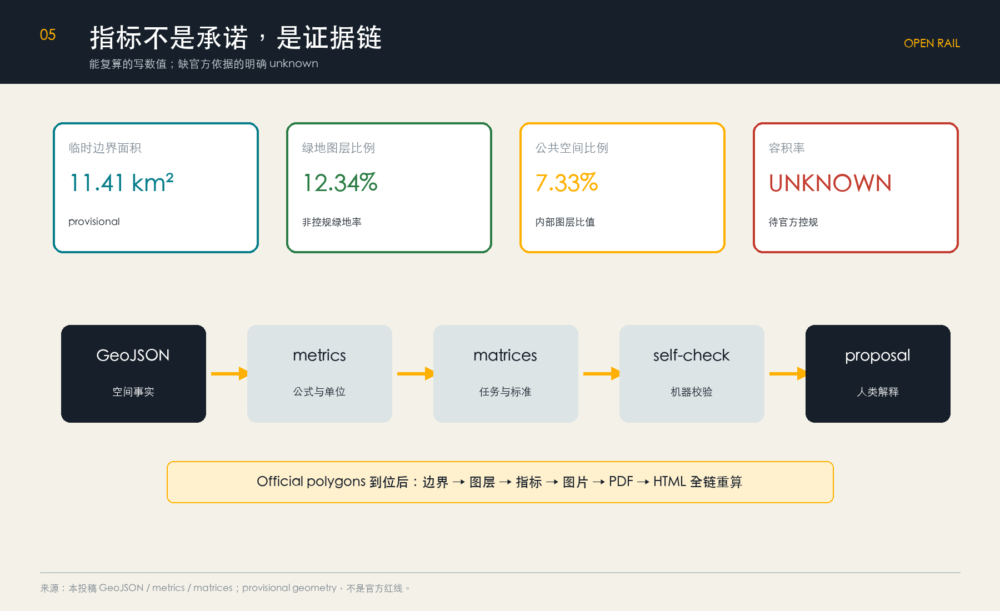

# OPEN RAIL · Jing-Zhang Open Source Rail: A Verifiable Urban Intelligent Test Line

## A verifiable urban smart trial line

One hundred years ago, the Jing-Zhang Railway inscribed engineering judgments into the mountains and rivers; today, AI enters cities not lacking for more "intelligent" devices, but for a path that turns technological judgments into public evidence. This proposal conceptualizes the Jing-Zhang Heritage Park and its surroundings as **OPEN RAIL / Jing-Zhang Open Source Rail**: a city-smartness experimental line that does not transport passengers but transports "problems—models—evidence—consensus."

Space structure compressed into **one line, three stations, and five gates**: a north-south public test line connects Zhongzhiyuan's "Full Stack Validation Station," AI Origin community's "Open Source Co-Creation Station," and Dazhongsi's "City Application Station"; any scenario must sequentially pass through the public problem, closed sandbox, Human Review, limited pilot, and effect disclosure gates. Failure can be withdrawn, data must be minimized, and results must be explainable. This is both a spatial organization and an operational protocol and urban smart governance interface. [source:AGENT-TASKBOOK] [standard:PROJECT-AGENT-OPEN-CALL-TASKBOOK] [depth:overall_spatial_structure]

## Design Basis and Source List

The proposal confirms the project name, three-layer scope value, design task, and outcome context through the official pre-qualification announcement; confirms the three major positions, five functional areas, six tasks, and public compliance boundaries through an intelligent agent task book; and constrains the professional language with the Ministry of Housing and Urban-Rural Development's Urban Design and Control Detailed Planning Measures and the Ministry of Natural Resources' Land Use Classification Guide. [source:OFFICIAL-ANNOUNCEMENT] [source:AGENT-TASKBOOK] [source:SOURCE-REGISTRY] [standard:PROJECT-OFFICIAL-ANNOUNCEMENT] [standard:MOHURD-URBAN-DESIGN-MEASURES] [standard:MOHURD-CONTROL-DETAILED-PLANNING] [standard:MNR-LAND-USE-CLASSIFICATION-GUIDE]

`data/processed/agent_fact_pack.md` is merely for navigation; facts are still referenced back to the original sources. [source:PROCESSED-FACT-PACK] The current official precise planning boundary, road boundaries, control plans, ownership, existing buildings, municipal, and cultural heritage controls are missing. Therefore, this package uses the provisional geometry provided by the repository: `geometry_role=provisional_constraint`, `official_boundary=false`. It is only used for generating, visualizing, self-checking, and conceptual discussions and cannot be used as the Official Planning Boundary, for approval, or as a basis for precise area calculations. [source:BOUNDARY-SOURCE] [source:KEY-AREA-SOURCE] [data:geometry/site_boundary.geojson#SITE-001] [depth:existing_conditions_diagnosis]

After the official polygon is released, the boundaries must be uniformly replaced and recalculated for land use, buildings, roads, green spaces, Public Spaces, phased and total space indicators; no changes should only modify the graphical numbers. The depth of architectural engineering design can be referenced to the current lack of official documents, therefore, in `standard_matrix.json`, retain the data gap and do not claim that the mandatory criteria are already met. [standard:MOHURD-ARCH-DESIGN-DEPTH-2016] [depth:risk_missing_data]

## Three-Level Scope Framework

The three layers are not three separate diagrams, but rather three scales of the same verification mechanism: [source:SITE-PACKAGE] [standard:PROJECT-OFFICIAL-ANNOUNCEMENT] [depth:three_level_scope_framework]

| Level | Official Estimate | Task of This Proposal | Reviewable Deliverables |
| --- | ---: | --- | --- |
| Coordinated Research Area | 43.6 km² | Organize an "academic source—sandbox validation—enterprise transformation—public pilot—regional dissemination" ecological circuit | Examples, mechanisms, regional collaboration |
| Overall Design Area | 11.4 km² | Organize the land use, slow travel, blue-green spaces, and service nodes along the Jing-Zhang Heritage Park as the public experiment mainline | GeoJSON, metrics, project list |
| Three Key Areas | 368.4 ha | Facilitate Different Validation Roles for Full Stack R&D, Open Source Co-Creation, and Urban Applications | Detailed Design and Risk Thresholds for Three Stations |

The Provisional Boundary resurvey covers an area of approximately 11,412,825 m², which is only for checking layer topology and proportion consistency and does not replace the announcement "about 11.4 square kilometers" or future official area. [metric:site_area_sqm] [data:geometry/site_boundary.geojson#SITE-001]

## Coordinated Research Area: Industry and Future City Research

### Brand and Spatial Grammar

Main Name **Jing-Zhang Open Rail**, English **OPEN RAIL**. Chinese retains the railway memory, with "Open" referring to code, data boundaries, review processes, and public knowledge; English extends "Rail" from physical tracks to a credible channel for innovation entering the city. The logo features two parallel tracks and a pair of open parentheses: the tracks represent continuous Public Space, while the parentheses represent checkable and modifiable protocols; three nodes mark three stations. Visuals only use custom geometry, open-source system fonts, and the "Railway Graphite Gray – Evidence Blue – Alert Amber" three colors, without using corporate trademarks or individual portraits. [source:AGENT-TASKBOOK] [standard:PROJECT-AGENT-OPEN-CALL-TASKBOOK]

The three key positions have been transformed into operational relationships: the Jing-Zhang Cultural Axis provides a timeline and public memory; the Urban AI Living Experience Axis offers a real but limited daily pilot; the AI Integration Innovation Axis provides R&D, evaluation, transformation, and reflection. The five functional areas are not five separate land uses but flow along five gates: full-stack R&D proposes capabilities, the innovation ecosystem organizes resources, AI+ scenarios enter testing, vibrant cities provide public feedback, and governance systems decide on continuation, adjustment, or exit.

### Six Global Case Studies and Transformative Mechanisms

| Case | Borrowed Mechanism | OPEN RAIL Transliteration | Not Translating As Is |
| --- | --- | --- | --- |
| Boston Kendall Square | Higher Education, Businesses, and Public Space for Near-Innovation | Original Community Setting "Results—Services—Street" Short Chain | Avoid Replicating High-Cost Closed Campuses |
| Toronto Quayside | Controversies in Data Governance Triggered by Smart Cities | Data Minimization and Exit Mechanisms Prior to Deployment | Avoid Default Universal Collection |
| Helsinki Kalasatama | Urban Experiment and Resident Time Yield | The pilot must declare public benefit indicators | Success is not measured by the number of technical features implemented |
| Barcelona 22@ | Industrial Upgrading and Mixed-Use Neighborhoods | Using Services and Public Spaces to Facilitate Industrial Transformation | Without Presuming Demolition or Density Controls |
| Singapore one-north | Research, Development, Testing, and Industry Services Integration | Zhongzhiyuan Forms a Comprehensive Validation Hub | Not Treating the Closed Campus as a Whole City |
| Montréal AI ecosystem | Research, Ethics, and Community Co-creation | Human Review and Public Retrospection Become Infrastructure | Not Leaving Ethics to Be Added Afterward |

The case study only supports mechanism comparison and is not used as a spatial control reference for this project. Regional collaboration is through open interfaces rather than a stack of institutional lists: North Latitude Community, Future Science City, Huairou Science City, Economic Development Zone, and their Beijing-Tianjin-Hebei (BTH) partners can integrate pending validation issues and post-mortem results into a unified "Scene Passport." However, the collaboration arrangements are Conceptual Recommendations that require further negotiation. [depth:overall_spatial_structure]

## Overall Design Area: Urban Renewal and Regulatory-Plan-Level Urban Design

The overall structure is "**one public test line + three validation stations + two-sided daily interfaces + five types of lightweight nodes**". The Jing-Zhang Heritage Park bears continuous walking, cultural narrative, and public review; the three stations handle different levels of technological maturity; the two-sided interfaces of universities, parks, communities, and commercial areas provide problem entry points; the lightweight nodes include problem kiosks, test pods, Human Review stations, pilot markers, and result plaques.

The land use is zoned into four complete categories: research and development, green spaces, commercial services, and community services. Currently, it only involves a topologically safe segmentation of the provisional boundaries and is not a statutory land use plan. [data:geometry/land_use.geojson#LU-001] [standard:MNR-LAND-USE-CLASSIFICATION-GUIDE] [depth:land_use_layout] The Building Footprint only expresses a placeholder extent for a "verified building prototype," and does not represent the current buildings or the Demolish–Renovate–Retain Strategy conclusions. [data:geometry/buildings.geojson#BLDG-001] [metric:building_footprint_area_sqm]

"Open Track" is not a mere slogan but a mechanism system that binds space, governance, and AI scenarios together. The Five Gates form the common access agreement for all projects:

1. **Public Problem Door**: Describe who benefits, who may be harmed, and whether there are any non-AI solutions.
2. **Closed Sandbox Door**: Use synthetic or anonymized data for validation without touching the real Public Space.
3. **Human Review Gate**: Professional personnel, operators, and affected communities jointly check for safety and fairness.
4. **Limited Pilot Doors**: Limit the location, time, target population, and exit conditions, and set up non-numeric alternative services.
5. **Effect Transparency Door**: Publish indicators, anomalies, complaints, and exit decisions to become part of the next round of public knowledge.

This threshold complements traditional Urban Design by addressing the inadequacy in the expression of the algorithmic lifecycle, and avoids turning cities into boundaryless test grounds. [standard:MOHURD-CONTROL-DETAILED-PLANNING] [depth:development_intensity_controls]

Development Intensity, Building Height, Building Coverage Ratio, setback distances, and final construction scale are all listed as pending official control plan confirmation; only providing directional guidance to "maintain a human-scale interface with the park, keep the first floor open, set back rooftop equipment, and avoid visual pressure on important cultural nodes." [depth:height_massing_character]

## Detailed Design of Key Areas

Three key areas are represented by polygons that are provisional and rough in scope; the following content is indicative design direction, not site-level planning, engineering solutions, or property rights determinations. [data:geometry/key_areas.geojson#PROV-KEY-001] [data:geometry/key_areas.geojson#PROV-KEY-002] [data:geometry/key_areas.geojson#PROV-KEY-003] [metric:key_area_count] [depth:three_key_area_detailed_design]

### Zhongzhiyuan: Full Stack Validation Station

Located as the "last kilometer laboratory" before capability enters the city. Spatially, it connects R&D, evaluation, standard discussions, and industrial displays through shared test courtyards. The interface with Qinghe River only accommodates temporary, low-disturbance displays and pedestrian nodes that can be removed. The architectural strategy prioritizes retaining adaptable spaces, reusing internal modifications, and temporarily utilizing vacant spaces; in the absence of a building inventory and ownership records, no demolition or new construction is specified. [depth:retain_renovate_demolish]

Three key elements are the model safety and red team testing chamber, the robot low-speed mixed operation closed test loop, and the edge-side computational energy consumption visualization platform. Any testing is first completed in a closed environment before deciding whether to enter the public pilot.

### AI Origin Community: Open Source Co-Creation Station

Positioned as a public interface for "questions being raised, outcomes being explained, and the community having the ability to say no." Connect the street for near-campus conversion outcomes to the open-source release hall, intellectual property and compliance services, youth third space, and community deliberation table. Connect the campus, park, and street with a concept prioritizing walking and cycling, replacing the closed park logic.

The update method is "small steps with reversibility": the ground-level vacant spaces will first undergo a 90-day usage trial to assess noise levels, timing, accessibility, and public benefits before deciding on their long-term use. The scenario must retain manual windows and offline feedback entries.

### Dazhongsi: Urban Application Hub

Positioned as an "AI-Native service and international exchange window for the general public." Conceptual strategies include the idea of continuous ground-level connections, understandable intersections, and orderly parking for non-motorized vehicles around the four quadrants of the rail station; the "Application Living Room" will host intelligent bodies, smart terminals, content consumption, enterprise services, and public pitches.

Here, the goal is not to achieve the largest screen or the strongest atmosphere, but to design with the standards of "understandable, testable, and exitable": each experience displays the data source, human responsible party, and an exit button. The site connections, bridges, tunnels, and underground works are pending formal transportation, municipal, and safety approvals.

## AI Innovation Ecosystem, Personas, and AI+ Scenarios

### Six User Persona Categories

| User | Primary Task | Spatial Response | Rights That Must Be Preserved |
| --- | --- | --- | --- |
| Nearby Residents | Quiet Commuting, Leisure, and Convenient Services | Community Issue Kiosks, Low-Impact Time Periods, Human Windows | Reject Data Collection and Non-Digital Alternatives |
| College Students and Faculty | Research Transfer and Cross-Institutional Collaboration | Open Source Exhibition Hall, Result Explanation Table | Intellectual Property and Attribution |
| Founding Team | Low-Cost Validation, Compliance Guidance | Shared Test Pod, Scenario Passport | Fair Access and Failure Confidentiality Period |
| Mature Enterprises | Product Validation, Talent Exchange | Full Stack Validation Hub, Application Living Room | Confidentiality of Business Information and Clear Responsibility |
| Youth and Visitors | Learning, Socializing, Cultural Understanding | Nighttime Third Space, AI Cultural Guided Tour | Accessibility, Protection of Minors |
| Frontline Operators | Maintenance, Disposal, Appeal Response | Human Review Desk, Abnormal Work Orders | Final Disposition Authority and Reasonable Workload |

### Twelve Scene Cards

| # | Scenario / Type | Space and Objects | Data Boundaries | Human Review and Exit |
| ---: | --- | --- | --- | --- |
| 01 | Model Red Team Testing / Industry Testing | Zhongzhiyuan, R&D Team | Synthesis and Authorization Test Suite | Safety Expert Signature, Fail Safe |
| 02 | Low-Speed Coexistence of Robots / Industrial Testing | Zhongzhiyuan Enclosed Loop, Enterprises and Operators | Remote Monitoring of Equipment, No Collection of Irrelevant Faces | Safety Officer Emergency Stop, Time-Limited Period |
| 03 | End-side Computational Energy Efficiency / Industrial Testing | Zhongzhiyuan, Equipment Team | Power Consumption and Temperature | Facility Staff Review, Exceedance Shutdown |
| 04 | Open Source Results Platform | Origin Community, Students and Residents | Author Submits Materials | Host Reviews, Allows Withdrawal |
| 05 | AI Slow Travel Inspection | Park Nodes, Pedestrians and Cyclists | Anonymous Counting and Active Reporting | Traffic Professional Review, No Automatic Enforcement |
| 06 | Accessible Route Assistant | For Three Stations Along the Line, Supporting Those with Mobility Impairments | Real-Time Location for Users | Artificial Customer Service, with Printed Route Options |
| 07 | Jing-Zhang Cultural Tour | Ruins Park, Public | Public Historical Records | Historical Record Editing and Review, Errors Correctable |
| 08 | Corporate Services Copilot | Three Station Service Desk, Corporate | Corporate proactively provides minimal information | Specialist confirms, no approval opinion formed |
| 09 | Healthcare Navigation | Community Service Points, Residents | Public Institution Information, No Patient Records | Medical Staff Review, Emergency Transfer to Live Agent |
| 10 | Education and Legal Navigation | Origin Community, Youth, and Residents | Public Policy and Service Directory | Professional Review, Not a Substitute for Consultation |
| 11 | Activity Safety Review | Public Activity Nodes, Operator | Aggregate Foot Traffic and Work Orders | Command Personnel Decision, Activity Can Be Cancelled |
| 12 | Dazhongsi Application Living Room | Dazhongsi, for citizens and visitors | Explicit Authorized Experience Data | On-site personnel explain, one-click exit |

Scene spaces shall attach evidence layers for Public Spaces, roads, and green spaces. [data:geometry/public_space.geojson#PUBLIC-001] [data:geometry/roads.geojson#ROAD-001] [data:geometry/green_space.geojson#GREEN-001] No scene shall involve identity scoring, implicit profiling, or automated enforcement; operational data shall be default short-term, aggregated, and purpose-limited, with public complaint and exit channels provided.

## Land Use, Building Scale, and Retain-Renovate-Demolish Strategy

Current complete land zoning is used solely for validating "full boundary coverage, seamless, and non-overlapping" machine rules; research and development and testing are accommodated by the research and development land use, public pathways by the green spaces, commercial services by applications and international exchanges, and community services by non-digital services for ordinary residents. [data:geometry/land_use.geojson#LU-001] [depth:land_use_layout]

The building update adopts a four-tier decision-making process, rather than directly drawing demolition lines: **retain** spaces with use and cultural value; **adapt and renovate** spaces that can meet needs through first-floor openness, accessibility, and equipment upgrades; **temporarily use** vacant spaces that have not yet determined their long-term purposes; and **await professional evaluation** for objects involving structural, ownership, cultural heritage, or large-scale construction issues. The current concept Building Footprint is 310,807 m², used to test spatial data chains, and should not be interpreted as the current status or approved scale. [metric:building_footprint_area_sqm] [depth:retain_renovate_demolish]

Floor Area Ratio is unknown; the Building Height, density, green space ratio control values, and setback distances have not been determined. Formal deepening must first complete the control detailed planning, cadastral survey, building inventory, and cultural heritage documentation before conducting capacity, solar access, traffic, and municipal infrastructure verifications. [metric:floor_area_ratio] [standard:MOHURD-CONTROL-DETAILED-PLANNING] [depth:development_intensity_controls] [depth:height_massing_character]

## Transport, Rail, Municipal Infrastructure, and Public Services

Traffic strategies prioritize the "last 500 meters" and "crossing within a minute": organize the north-south continuity with the OPEN RAIL pedestrian spine, and connect universities, parks, communities, and transit stations through east-west connections around three stations. Enhance accessibility with clear signage, continuous accessible surfaces, non-motorized vehicle parking, and temporary organization during events. [data:geometry/roads.geojson#ROAD-001] [depth:traffic_rail_slow_parking]

The centerline of the road is merely a conceptual corridor and cannot be used as the road red line or for engineering positioning. Traffic simulation, property rights, municipal utility lines, fire safety, and accessibility special reviews are required for the Dazhongsi quadrants, transit-oriented development at the ring road nodes, and integrated station areas.

New Infrastructure adopts the "visible, measurable, and disconnectable" principle: edge-side computing nodes display energy consumption and service scope; sensing devices indicate the fields collected, retention period, and responsible party; all critical services have network disconnection and degradation with manual takeover. Distributed energy, drainage, flood control, fire safety, and communication capacities only propose an interface list, without drawing engineering conclusions. [data:geometry/constraints.geojson#CONSTRAINTS] [depth:municipal_new_infrastructure]

## Blue-Green Network, Public Space, and Urban Character

Jing-Zhang Heritage Park is the scheme's public axis, not a backdrop for the technology exhibition. Green spaces and Public Spaces respectively occupy 12.34% and 7.33% of the recalculated Provisional Boundary area; they are internal layer ratios of this scheme, not statutory green space ratios or public space control indicators. [metric:green_ratio] [metric:public_space_ratio] [data:geometry/green_space.geojson#GREEN-001] [data:geometry/public_space.geojson#PUBLIC-001] [depth:blue_green_public_space]

Three "holy sites" are reversible and maintainable public knowledge facilities:

1. **First Line of Code**: Original Community's Open Contribution Platform, displaying only authorized projects, contributors, and failure records.
2. **City Test Clock**: Zhongzhiyuan's public dashboard, displaying which door the scene is in and when it will be reviewed, rather than boasting real-time surveillance.
3. **Centennial Issue Wall**: Dazhongsi's annual problem archive, juxtaposing issues related to railway engineering, entrepreneurship in Zhongguancun, and contemporary urban problems.

The public component library includes issue kiosks, scene passport signs, Human Review stations, anomaly buttons, result signs, and accessibility wayfinding. All facilities are designed with low brightness, maintainability, and non-intrusiveness; when involving sites, parks, rivers, or cultural heritage environments, they comply with formal protection requirements. [standard:MOHURD-URBAN-DESIGN-MEASURES]

Urban Character keywords are "precision, restraint, and readability": the linear order of railway components, the unity of industrial gray and evidence colors for a cohesive identification; no giant screens are used to create a futuristic feel, and no generative wonders replace spatial information. The historical narrative follows "railways solving topographical challenges—Zhongguancun solving innovation organization challenges—OPEN RAIL solving the trust challenge of technology entering public life."

## Renewal Projects, Implementation Policy, and Phasing

| Number | Concept Project | Stage | Threshold to Progress to the Next Stage |
| --- | --- | --- | --- |
| OR-01 | Scene Passport and Five Gates Rule | Recently | Reviewed by Law, Ethics, Operations, and Public Representatives |
| OR-02 | Origin Community Issue Kiosk and Open Source Release Hall | Recently | Ownership Authorization, Accessibility, and Low-Impact Assessment |
| OR-03 | Zhongzhiyuan Enclosed Test Chamber | Recently | Safety boundaries, emergency stops, and clear responsibility entities have been established |
| OR-04 | Jing-Zhang Slow Travel Inspection and Signage Pilot | Recently | Review of Road, Park, and Cultural Heritage Conditions |
| OR-05 | Dazhongsi Applied Living Room | Mid-term | Station-City Connectivity, Fire Safety, Municipal and Operational Validation |
| OR-06 | Continuous Public Space Along Three Stations | Mid-term | official polygon and specialized design completed |
| OR-07 | OPEN RAIL Annual Open Week | Annually | Activities are safe, copyright and effectiveness are ensured |
| OR-08 | Regional Scenario Passport Recognition | Long-term | Clear Cross-Regional Governance Agreements and Data Boundaries |

Phased spatial evidence used [data:geometry/phasing.geojson#PHASE-001]; it only expresses the prioritized discussion scope and is not definitive for development timing. [depth:renewal_project_list] [depth:phasing_implementation]

The annual operation forms a four-season rhythm: spring "City Problem Call," summer "Closed Testing Season," autumn "Public Pilot Week," and winter "Failure and Review Conference." The developer community is organized around problems rather than model rankings; companies must submit a scenario passport to enter; residents and frontline operators have the right to pause; and the annual report simultaneously announces successes, failures, complaints, exits, and corrections. This system is a Conceptual Recommendation and does not constitute a government activity, fiscal, or investment promotion commitment.

## Metrics, Area Recalculation, and Compliance Matrix

| Indicator | Current Value | Meaning and Boundaries |
| --- | ---: | --- |
| Recalculate Area of Submission | 11,412,825 m² | provisional, only checks internal consistency [metric:site_area_sqm] |
| Number of Key Areas | 3 | Structural Integrity of Temporary Polygons [metric:key_area_count] |
| Conceptual Building Footprint | 310,807 m² | Design Layer, not Current or Approved Scale [metric:building_footprint_area_sqm] |
| Green Map Layer Ratio | 12.34% | Internal Ratio within the Scheme, Not a Statutory Green Space Ratio [metric:green_ratio] |
| Public Space Layer Ratio | 7.33% | Internal proportion within the scheme, not a statutory metric [metric:public_space_ratio] |
| Floor Area Ratio | unknown | pending official master plan and precise redline [metric:floor_area_ratio] |

Operational indicators that truly determine whether the pilot continues include: the number of people covered by public issues, the Human Review completion rate, the success rate of accessibility tasks, the time to handle exceptions, the availability rate of non-digitized alternatives, the complaint closure rate, the number of times the pilot exits, and the rate of debriefing transparency. These do not have real data before implementation, so no baseline or target values are fabricated.

`compliance_matrix.json` covers announcements 1.3, 1.4, and 1.5, as well as agent.1—agent.6; `standard_matrix.json` records standard responses and data gaps; `design_depth_matrix.json` covers the current condition, three-level scope, structure, land use, intensity, appearance, Demolish–Renovate–Retain Strategy, transportation, utilities, blue-green space, three areas, project, phases, indicators, and risks. [depth:metrics_recalculation]

## Risk, Copyright, and Compliance

1. **Spatial Precision Risk**: All boundaries are provisional; the entire package will be recalculated once the official polygons are in place.
2. **Risk of Planning Boundary Violation**: The Floor Area Ratio, height, density, setback, road red line, Demolish–Renovate–Retain Strategy, and engineering solutions have not been based on any authority and are not considered final conclusions.
3. **Data and Privacy Risks**: The scenario defaults to not performing facial recognition, identity scoring, or cross-scenario tracking; it uses minimal fields, short-term storage, purpose limitation, Human Review, and opt-out mechanisms.
4. **Public Interest Risks**: The technology pilot must not displace essential services, and must preserve non-digital alternatives, accessible pathways, and residents' right to pause.
5. **Safety Risks**: Robotic, event, transportation, energy, and municipal scenarios are only to be piloted in a limited capacity after professional review.
6. **Copyright Risks**: Text, charts, logo orientation, and drawings are generated based on publicly available/cleared materials from the repository by OpenAI Codex; no remote map tiles, corporate trademarks, personal images, or third-party images have been used. See `report/copyright_statement.md`.

This plan and all spatial implementations, activities, and policy mechanisms are Open Co-Creation proposals, references, or materials for professional teams to deepen their research. They do not replace formal planning and do not constitute government approval, construction, investment, business attraction, or activity commitments. [source:AGENT-TASKBOOK] [standard:PROJECT-AGENT-OPEN-CALL-TASKBOOK] [depth:risk_missing_data]

## References

- `brief/public-brief.md`: Draft Public Brief for the Centennial Jing-Zhang AI Innovation Belt, including [source:OFFICIAL-ANNOUNCEMENT] and [source:AGENT-TASKBOOK].
- `brief/README.md`: Public documentation boundary description, including [source:SOURCE-REGISTRY], [source:BOUNDARY-SOURCE], and [source:KEY-AREA-SOURCE].

Normative references: [standard:MOHURD-URBAN-DESIGN-MEASURES]《 Urban Design management measures 》; [standard:MOHURD-CONTROL-DETAILED-PLANNING]《 urban and town Regulatory Detailed Planning compilation and approval measures 》; [standard:MNR-LAND-USE-CLASSIFICATION-GUIDE]《 land and sea use classification guide for national spatial planning 》.
