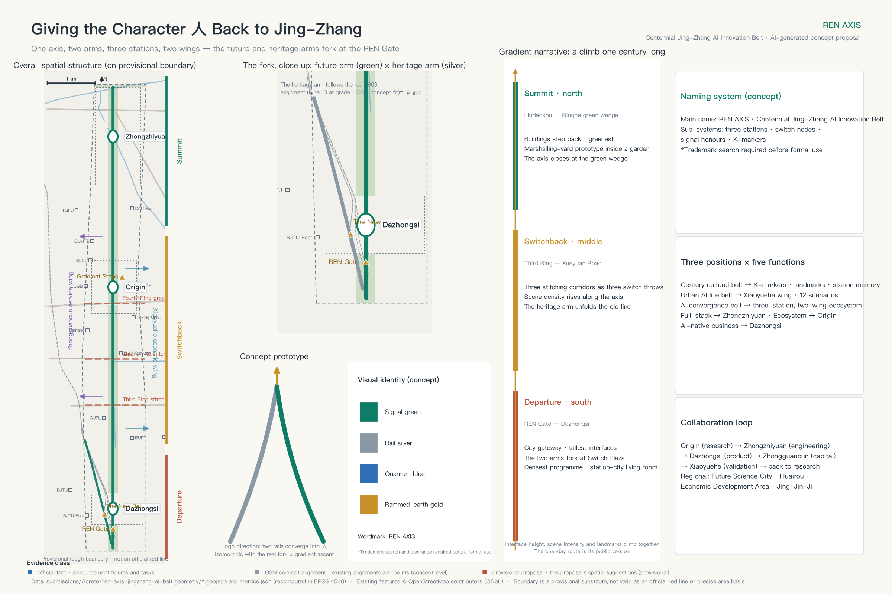
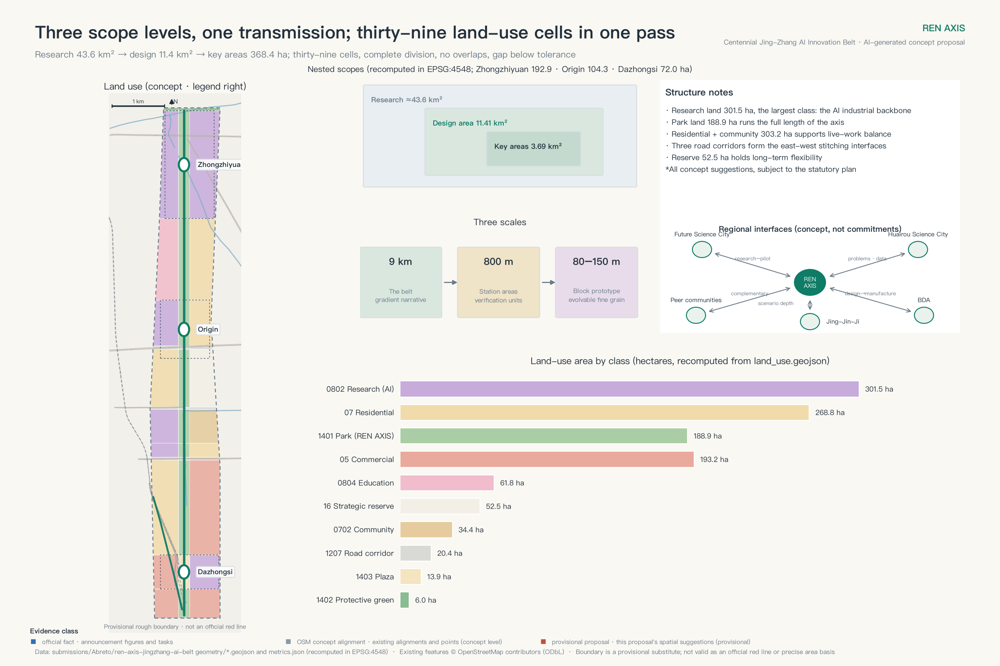
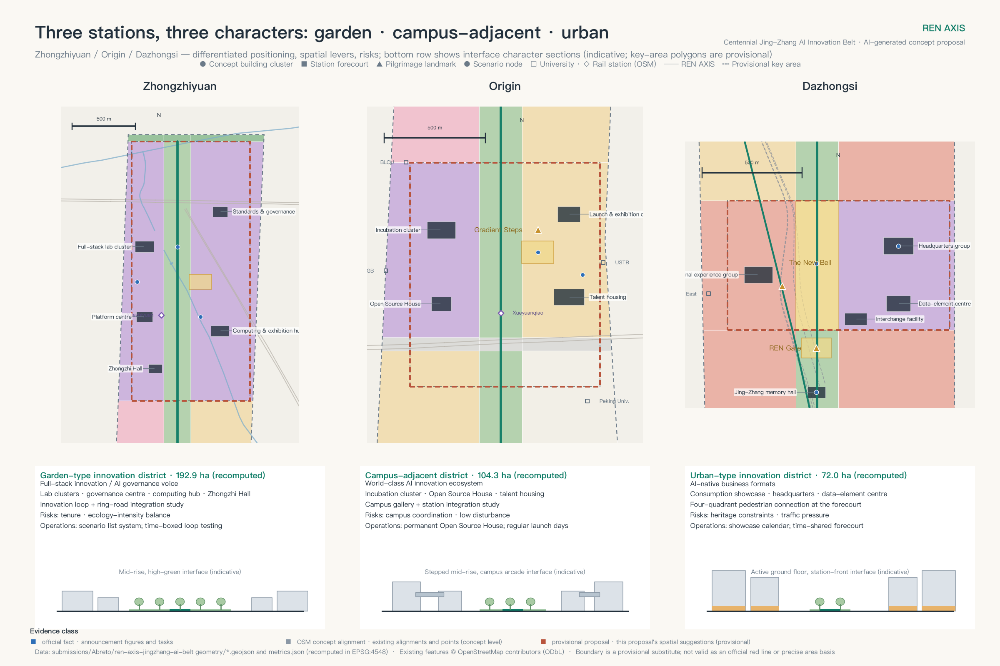
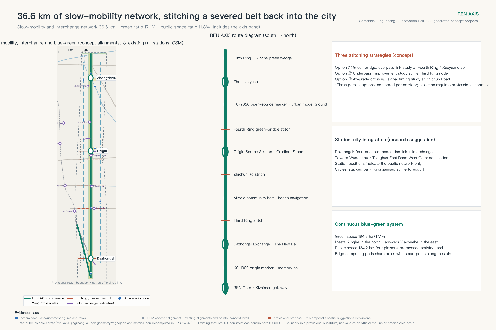
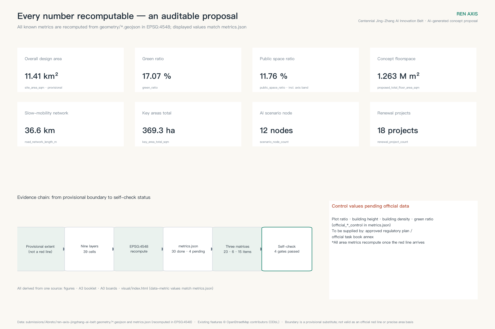

# REN AXIS — Urban Design for the Centennial Jing-Zhang AI Innovation Belt

In 1909 the Jing-Zhang Railway climbed its steepest grade at Qinglongqiao with a switchback shaped like the character 人 — "human". It is remembered as the founding moment of Chinese self-directed trunk-railway engineering [source:JZ-HERRINGBONE-PAPER]. Today, at the urban end of that same line, a second geometry echoes the first: two rail corridors still physically diverge inside the city. The high-speed corridor runs north; the original 1909 alignment, now the at-grade section of Metro Line 13, bends northwest; and the two separate just north of Xizhimen. This proposal reads the rail-heritage park as the **REN AXIS**: a nine-kilometre future spine along the high-speed corridor, a heritage arm of about 2.2 kilometres along the original alignment, and the two meeting at the **REN Gate · Switch Plaza** at the southern gateway — where the written character, the landmark and the actual railway geometry coincide at one point.

"REN" carries three meanings here at once. It is the engineering memory of the switchback; it is the people-centred city; and it is the *gradient ascent* of machine learning — the climb of a century ago and the climb of AI today happening along one axis. The spatial structure follows: **one axis, two arms, three stations, two wings**. Zhongzhiyuan Acceleration Terminal carries full-stack innovation and AI governance; Origin Source Station carries campus-adjacent research and open-source translation; Dazhongsi Exchange Terminal carries AI-native business and urban consumption; the Zhongguancun service wing and the Xiaoyuehe scenario wing close the loop east and west. The spine is also a **gradient narrative**: departure at the REN Gate in the south, switchback and acceleration through the three stations, summit at the Qinghe green wedge in the north — activity intensity, streetwall height and the landmark sequence all climb with it.

At a glance: first, the two-arm structure comes from a fork verifiable in open map data, not from graphic rhetoric. Second, twelve AI scenarios run under one rail-lexicon state machine with red-card suspension, human takeover and retirement. Third, thirty-nine land-use cells, roughly 36.6 kilometres of slow-mobility network and thirty metrics are produced by a deterministic pipeline that can re-run the entire package the moment official data lands. Fourth, three pilgrimage landmarks answer the commemoration mechanism announced by the open call. Fifth, the first-start actions include one complete red-card withdrawal drill. **This disclaimer applies to the entire document: this is an AI-generated open co-creation proposal built on provisional rough boundaries. Every spatial statement is a concept suggestion and reference for professional teams to develop; none of it constitutes a government-approved conclusion. Once the official red line (the statutory planning boundary) and regulatory conditions arrive, all areas, ratios and positional relationships must be recomputed as a whole.** [source:PROVISIONAL-BOUNDARIES][depth:risk_missing_data]

## Design Basis and Source List

The task boundary comes from the pre-qualification announcement and the international design brief issued with the open call for global agents: the announcement defines the three scope levels, the three key areas and the required depth of deliverables; the task book defines the six agent tasks, the three positioning statements and the co-creation principles [source:OFFICIAL-ANNOUNCEMENT][source:AGENT-TASKBOOK].

Professional judgment rests on three national instruments: urban-design coordination follows the Urban Design Administration Measures (城市设计管理办法), the boundary between "known" and "pending" control conditions follows the Measures for Formulating and Approving Regulatory Detailed Plans for Cities and Towns (城市、镇控制性详细规划编制审批办法), and land-use coding follows the Guidelines for Classification of Land and Sea Use in Territorial Space Survey, Planning and Use Control (国土空间调查、规划、用途管制用地用海分类指南) [standard:MOHURD-URBAN-DESIGN-MEASURES][standard:MOHURD-CONTROL-DETAILED-PLANNING][standard:MNR-LAND-USE-CLASSIFICATION-GUIDE]. The formal text for architectural deliverable depth is not yet in the repository, so this package registers it as a data gap rather than claiming compliance [standard:MOHURD-ARCH-DESIGN-DEPTH-2016].

Sources are managed in two classes, and this discipline runs through the whole document: **substantive claims rest only on registry-approved sources**; OpenStreetMap features, the global case index and the open-call launch article are background material that carries context and display only — they never support a red line, a precise measurement or a commitment [source:SOURCE-REGISTRY].

The most important boundary fact is this: **the official precise red line and the three key-area polygons have not been released**. Every layer in this package derives from the provisional rough geometry supplied by the maintainers [data:geometry/site_boundary.geojson#PROV-SITE-001], so all areas, ratios and positional relationships await recomputation once official data arrives. The per-file rights ledger sits in report/copyright_statement.md; missing data and recomputation triggers sit in assumptions.json.

## Three-Level Scope Framework

The three scope levels are three focal lengths on one decision [depth:three_level_scope_framework]. The coordinated research area of about 43.6 km² answers why Haidian needs an AI innovation belt and how it works with the district's existing innovation network. The overall design area of about 11.4 km² [metric:site_area_sqm] answers how the land around the rail-heritage park can become a walkable, sociable, testable civic realm through renewal. The three key areas totalling about 368 hectares — recomputed at about 369 hectares on provisional geometry, three areas in total [metric:key_area_total_sqm][metric:key_area_count][data:geometry/key_areas.geojson#PROV-KEY-001] — answer what Zhongzhiyuan, the Origin Community and Dazhongsi should each do first, how it gets verified, and when it scales up or exits.

The cascade between levels is: strategy sets direction, design sets structure, implementation sets projects — aligned with the Science City positioning of the Haidian District Plan (2017–2035) [source:HD-DISTRICT-PLAN]. The strategy layer establishes the REN motif, the innovation ecosystem and the collaboration loop; the design layer fixes one axis, two arms, three stations and two wings, plus land-use structure and the renewal framework; the implementation layer delivers the three station designs, eighteen renewal projects and a three-phase plan. When official geometry arrives it triggers one whole-package recomputation: replace the boundary and key-area polygons, re-split land use, clip every layer, recompute thirty metrics, redraw five figures and two booklets, and re-run the four self-checks. Uncertainty stays explicit in the process instead of hiding behind the drawings.

## Coordinated Research Area: Industry and Future City Research

**Name and visual identity.** The Chinese name is 人字轴; the English name is REN AXIS. The logo builds the character 人 from two switch-shaped strokes plus a gradient-ascent arrow; the primary colour, signal green, takes its meaning from railway signalling, supported by platform grey and K-marker gold. The whole brand vocabulary is drawn from the railway — switch, signal, marshalling yard, reversal, K-marker — and those same words are the operating verbs of the governance mechanism in the AI chapter, so that the spatial grammar, the brand and the governance process speak a single language [depth:overall_spatial_structure].

**The three positioning statements and five functions form one loop.** The century Jing-Zhang cultural belt is carried by the axis narrative system (K-marker chronology, station memory, pilgrimage landmarks); the urban AI life-experience belt by the Xiaoyuehe scenario wing and twelve scenario nodes; the AI convergence innovation belt by the three-station, two-wing industrial ecosystem. The loop runs: Origin (knowledge and results) → Zhongzhiyuan (engineering, standards, governance) → Dazhongsi (productisation and consumption) → Zhongguancun service wing (capital and professional services) → Xiaoyuehe scenario wing (validation and data feedback) → back to Origin for the next cycle. Haidian's "1+X+1" industrial system and its "three zones, two wings" structure are the upper-level context for this loop [source:HAIDIAN-1X1][source:THREE-AREAS-WINGS]. The industrial base is a matter of public record: on the figures released at the 2026 Zhongguancun Forum, Haidian hosts more than 2,000 AI companies and 130 registered large models, and its core AI industry accounts for roughly thirty percent of the national total [source:HD-AI-FACTS-2026]. The task of this belt is therefore not to build an industry from scratch but to give one of China's most concentrated AI clusters a public spatial spine; the Haidian Urban Renewal Guidelines (2025) already name AI innovation districts and station-city integration as renewal directions, and this proposal is a conceptual deepening of that direction [source:HD-RENEWAL-GUIDE-2025].

**Global cases, translated as mechanisms** (search entry points registered in sources.json [source:GLOBAL-CASE-PUBLIC-REFS]): Kendall Square — mixed use and open ground floors written into renewal agreements; King's Cross — heritage buildings operated as public living rooms before redevelopment; Station F — many programmes co-located to engineer chance encounters; one-north — work-live-play-learn clustering; Shenzhen Nanshan — rolling quality upgrades of an existing park; Pangyo Techno Valley — test grounds placed against a public street interface; Hetao Cooperation Zone — cross-jurisdiction rule interfaces; MaRS — problem-led service routing. We take mechanisms only, never indicators, policies or company lists.

**Regional interfaces.** With Future Science City, a "source-to-pilot" handoff; with Huairou Science City, shared computing problems and datasets; with the Economic-Technological Development Area, a "design-to-manufacture" launch calendar; with peer innovation communities, reciprocal visits and mutual recognition of awards; with the wider Beijing-Tianjin-Hebei region, an open scenario list. All five register their flows, carriers and pending boundaries as operating suggestions, not cross-jurisdiction commitments.

**The plan as a pipeline.** Every layer and metric in this package is produced by a deterministic generation pipeline, and each metric declares its formula in metrics.json [depth:metrics_recalculation]. Each time official red lines, regulatory conditions or survey data arrive, the pipeline re-runs the whole package so that zoning, metrics, drawings and dashboard evolve together, and records a "version K-marker." The plan is not a one-off blueprint but a re-runnable city-model baseline; scenario SC-12, the urban model ground, is its public interface.

## Overall Design Area: Urban Renewal and Regulatory-Plan-Level Urban Design

**Structure: one axis, two arms, three stations, two wings — at three scales.** The spine has a real base: on multiple public reports dated 6 August 2026, phase two of the Jing-Zhang rail-heritage park opened, completing a linear green corridor of about nine kilometres from Xizhimen to the North Fifth Ring. The reported figures — about 53 hectares serving roughly 70 neighbourhoods and 450,000 residents — are as reported and await verification against completion records [source:JZ-PARK-PHASE2-OPEN] (phase one, 2.4 kilometres, opened in 2023 [source:JZ-PARK-PHASE1]). This proposal overlays renewal onto that existing public spine: the future arm follows the high-speed corridor [data:geometry/roads.geojson#RD-SPINE], the 2.2-kilometre heritage arm follows the original alignment northwest [data:geometry/roads.geojson#RD-ARM-HIST], and the two fork at the REN Gate · Switch Plaza [data:geometry/public_space.geojson#PS-004]. Spatial organisation works at three scales: the nine-kilometre belt as a whole, three station areas of roughly 800-metre radius, and 80–150-metre block prototypes inside them. The thirty-nine land-use cells are the structural division between the first two scales; block grain is set by the block-scale prototype inside each cell, to be refined against the actual street network and land-title boundaries at the next design stage [depth:overall_spatial_structure].

**The gradient narrative: writing "the climb" into space.** The southern leg, from the REN Gate to Dazhongsi, is *departure* — gateway scale, the tallest interfaces, the densest programme, the two arms forking here. The middle from the Third Ring to Xueyuan Road is *switchback and acceleration* — three east-west stitching corridors act like three throws of a switch, activity intensity increases along the axis, and the heritage arm unfolds the memory of the old line. The north from Liudaokou to Qinghe is *summit* — buildings step back, the green wedge opens, Zhongzhiyuan's laboratory clusters sit inside a garden, and the axis closes at the Qinghe green wedge. Streetwall height, activity intensity, the landmark sequence and the one-day route all follow this climb, which is how "gradient ascent" becomes the spatial operating system of the whole scheme rather than merely its name.

**A four-step renewal ladder**: operations first — using opening hours, access rules, wayfinding and temporary furniture to test demand → light-touch sharing, opening ground floors and vacant space subject to ownership and fire-safety clearance → performance retrofit (energy, accessibility, interface) → necessary redevelopment (entering statutory procedure). Retain-renovate-demolish is a method framework, not a parcel-by-parcel conclusion [depth:retain_renovate_demolish]: retain and reanimate the railway's industrial heritage, renovate underused buildings and convert floor space to new uses, demolish only where statutorily determined, and concentrate new construction at station forecourts — in the same direction as the national requirement to prevent large-scale demolition and prioritise retention and improvement [source:MOHURD-63-NO-MASS-DEMOLITION], organised within the framework of the Beijing Urban Renewal Regulations [source:BJ-RENEWAL-REGULATION].

**Character and intensity** [depth:height_massing_character][depth:development_intensity_controls]. Character follows "low footprint, open ground floor, legible roofscape, restrained lighting": human-scale continuous shade along the axis, identifiable public buildings at the three stations that never overshadow heritage assets, and materials layered from durable masonry and metal mesh to replaceable digital interfaces, echoing technical rationality, railway memory and campus humanism. Official control values for plot ratio (floor area ratio), building height, density and green-space ratio are missing; the four are honestly marked as pending official data in metrics.json. One point about intensity needs to be stated plainly: this package draws no plot-ratio conclusion. Dividing the indicative floorspace of the conceptual clusters by their own footprint gives an average-storey equivalent of about 8.7 for those clusters, or about 4.4 when spread across the station areas. These are internal consistency checks on the geometry, not a net plot ratio and not a selected intensity; assumptions.json and the design-depth matrix both state that the conceptual building volume is not a development-intensity conclusion. The real control values — plot ratio, height, density and green-space ratio — will be set by the regulatory plan once official data arrives.

## Detailed Design of Key Areas

The three stations follow a common five-part template: morphological prototype — block scale — ground-floor interface — public space — risk [depth:three_key_area_detailed_design]. The key-area polygons are provisional, so station design expresses positioning, systems and verification sequence only.

**Zhongzhiyuan Acceleration Terminal (about 193 hectares) — the marshalling-yard prototype** [metric:key_area_zhongzhiyuan_sqm]. Laboratory clusters are arranged in parallel like marshalling tracks [data:geometry/buildings.geojson#BLD-F1], able to split and recombine as teams grow; around them runs a publicly walkable "platform loop" — testing happens on the inside, understanding happens on the outside, and a glazed wall displaying the rules of operation replaces a solid fence. A green axis crosses the park to link Qinghe with the North Fifth Ring protective belt [data:geometry/land_use.geojson#LU-G-M]; the Zhongzhi Hall serves as the axis anchor, and the station forecourt is the launch pad for full-stack innovation [data:geometry/public_space.geojson#PS-002]. Ground floors emphasise shared instrument lobbies and semi-outdoor discussion space. Risks: tenure coordination inside the park, balancing ecology against intensity, and the uncertain timing of national-level research platforms.

**Origin Source Station (about 104 hectares) — the station-house block prototype** [metric:key_area_origin_community_sqm]. Small blocks of 80–120 metres organise "translation west, living east, open source on the axis": the incubation cluster [data:geometry/buildings.geojson#BLD-D1] and the "Open Source House" — a permanent station-house-like public living room — sit west, key-worker and early-career housing sits east, and the Gradient Steps form a platform-like space of public honour [data:geometry/public_space.geojson#PS-003]. Campus adjacency is supported by open evidence. Using campus centroids from OpenStreetMap (indicative only), China University of Geosciences, Beijing Language and Culture University and University of Science and Technology Beijing sit against the provisional boundary, with China University of Mining and Technology and Beihang within a few hundred metres [source:OSM-BASE]. A campus-park gallery street rewrites walls as eaves-covered interfaces [data:geometry/roads.geojson#RD-EW-5], with an indicative target of one opening every 150 metres. Station integration develops toward Wudaokou and Tsinghua East Road West Gate [data:geometry/roads.geojson#RD-TC-2]. Risks: campus-district coordination, housing supply model, community interest balance.

**Dazhongsi Exchange Terminal (about 72 hectares) — the four-quadrant station-city living room** [metric:key_area_dazhongsi_sqm]. The real Dazhongsi rail station lies about two kilometres north of the provisional rectangle (conceptual OSM alignment). **This station design is neither the existing station nor any approved station-city scheme**; it is a concept suggestion that organises interchange movement toward the real station position, with station-city integration — the Chinese variant of transit-oriented development — following Beijing's local standard on connecting every entrance and linking forecourt public space [standard:DB11-T-2129-2023-STATION-CITY]. The forecourt and four-quadrant pedestrian connection are the first project; the four quadrants complement one another as commuter services, a consumer-electronics showcase, headquarters business and "The New Bell" cultural living room. A flagship consumer-electronics experience cluster and a headquarters cluster for AI-agent companies carry AI-native business; an innovation loop road links the Third Ring stitching segment [data:geometry/roads.geojson#RD-EW-6]. Character takes its key from the bronze-casting memory of the Yongle Bell, and commercial display must never encroach on pedestrian flows or accessible routes. Risks: multi-party station-city coordination, timing of business conversion, and heritage-protection setbacks pending verification.

## AI Innovation Ecosystem, Personas, and AI+ Scenarios

**Six personas** work as design tests, not marketing segments: frontier researchers need quiet research space and cross-disciplinary encounter; founder-engineers and developers need low-cost space, an open-source community and a place to launch; AI product and design talent need a scenario testbed and a consumer interface; students need a path from study to internship to venture [data:geometry/land_use.geojson#LU-E-W]; residents including older people need public services that are accessible, comprehensible and genuinely optional, with accessibility held to the mandatory national code as a floor [standard:GB-55019-2021-ACCESSIBILITY]; international visitors need a bilingual city interface and a legible cultural narrative. Three public-interest principles run through every scenario: **service equivalence** (anyone declining AI gets an equivalent human service), **protection of the vulnerable** (older people, children and patients are never first-round test subjects), and **representation of affected groups** (community representatives hold a red-card review right). The per-persona table — potential exclusion points, mandatory floors, reviewable indicators and non-AI equivalent paths — is delivered bilingually in the personas field of visual/assets/governance-ledger.json, with disabled users listed separately as a review group cutting across every persona. The reviewable indicators carry no values yet: they are recorded after a pilot.

**Twelve AI scenarios** are positioned along the axis, three of them industrial test-and-validation cases [metric:scenario_node_count][data:geometry/public_space.geojson#PS-005]. Three that most affect space are developed here. SC-01, the axis commuting assistant, offers smart crossing guidance at the Third Ring stitching segment using aggregated anonymous counts, with conventional crossing infrastructure kept fully available — the first proving ground for the stitching corridors. SC-09, smart horticulture and ecological monitoring (test), runs vegetation recognition and irrigation optimisation in the Zhongzhiyuan green corridor, collecting only vegetation and environmental data and falling back to scheduled maintenance on failure — the model for "AI inside a garden." SC-12, the urban model ground, opens the city model to the public at the Zhongzhiyuan exhibition hub using this package's own GeoJSON and metrics, with consistency against metrics.json as a hard precondition — the public interface of "the plan as a pipeline." SC-01, SC-09 and SC-12 additionally carry executable pilot cards — baseline, trial window and sample, minimum success threshold, stop threshold, on-site owner, human equivalent service, proof of data deletion, review cycle (see the A3 booklet and the governance ledger). Every threshold is marked as frozen from a measured baseline before the pilot; no value is invented here. The other nine — accessible mobility, robot delivery (test), AI interpretation, the open-source market, an enterprise copilot, health navigation, a learning pod, night-time care, and autonomous shuttle (test) — each have a location, a minimum data set, a human fallback and an exit button; the full-field governance ledger ships with the package (its scenario and project fields are currently Chinese-only; the persona table is bilingual).

**The rail-lexicon state machine.** Switch = admission (pass / hold / reject). Signal = operating state (green normal, yellow rectification, red-card suspension with immediate human takeover; red may never turn green directly, but must pass review sign-off into a yellow observation period). Marshalling yard = sandbox. Reversal = recovery. K-marker = version milestone (physical K-markers mark culture, version K-markers mark data recomputation). Every scenario runs the lifecycle concept → sandbox → pilot → operating → retired, with retirement as a terminal state, every transition requiring human sign-off, and model records and failure logs made public. The regulatory obligations each scenario engages — personal-information minimisation, data classification, synthetic-content labelling, connected-vehicle testing rules, and the rules on cameras and imaging in public space — are registered on its card as a "legal interface" field [source:CN-LEGAL-INTERFACE-REFS]; registration is an operational transparency layer, never a substitute for statutory procedure, and this proposal makes no compliance determination. The state machine is delivered as a machine-readable protocol (visual/assets/agent-protocol.json: per-scenario agent interfaces and data contracts, the red-card drill runbook, and calling conventions for later agents) — **the city opens an interface to agents; humans keep the right to interrupt.**

## Land Use, Building Scale, and Retain-Renovate-Demolish Strategy

Land use is divided into thirty-nine contiguous cells arranged in three longitudinal bands, using national land-use codes [data:geometry/land_use.geojson#LU-A-W][depth:land_use_layout].

Structurally, research land of about 302 hectares is the industrial backbone and the largest single category in the belt [metric:land_use_research_0802_sqm]; residential land of about 269 hectares plus community services of about 34 hectares form the live-work base of the two wings [metric:land_use_residential_07_sqm]; commercial services of about 193 hectares concentrate at the southern gateway and Dazhongsi, the belt's two footfall anchors [metric:land_use_commercial_05_sqm]; education of about 62 hectares corresponds to the Xueyuan Road education-research district [metric:land_use_education_0804_sqm].

The open system comprises about 189 hectares of park land, 6 hectares of protective green and 14 hectares of plaza — the spatial armature that makes the spine possible at all [metric:land_use_park_green_1401_sqm][metric:land_use_plaza_1403_sqm][metric:land_use_protective_green_1402_sqm]; road corridors of about 20 hectares accommodate the three east-west stitches [metric:land_use_road_1207_sqm]; and about 52 hectares of strategic reserve stays unprogrammed to hold long-term flexibility [metric:land_use_reserved_16_sqm][data:geometry/land_use.geojson#LU-C3-E].

The division passes a topological self-check in the projected coordinate system with no overlaps and a coverage gap far below validation tolerance. One qualification matters: a cell's code expresses its dominant function, not a single permitted use; mixed use is encouraged inside each cell, and formal parcel subdivision awaits street-network and tenure data.

At the building scale, fifteen conceptual clusters indicate industrial floorspace supply: a footprint of about 14.5 hectares, roughly 1.3 percent of the overall design area [metric:building_footprint_area_sqm][metric:building_footprint_ratio], and a conceptual floorspace of about 1.26 million square metres [metric:proposed_total_floor_area_sqm] — all of it capacity and interface illustration rather than survey data or a construction commitment [data:geometry/buildings.geojson#BLD-B1]. Retain-renovate-demolish follows the method framework above; building-by-building conclusions await survey work and statutory procedure [depth:existing_conditions_diagnosis].

## Transport, Rail, Municipal Infrastructure, and Public Services

The walking, cycling and interchange network runs about 36.6 kilometres [metric:road_network_length_m][depth:traffic_rail_slow_parking]: one spine promenade plus the heritage arm, three east-west stitching corridors (Third Ring, Zhichun Road, Fourth Ring — segments identified for upgrade studies, anchored on existing alignments in open map data [data:geometry/constraints.geojson#EX-OSM-01]; phase two was reported in 2024 as proposing to open several city side streets and densify entrances, so the stitching corridors have connection points to build on [source:JZ-PARK-PHASE2-PLAN]), plus three station micro-loops and rail connection lines. Station-city integration proceeds on the principle of "get the ground plane working first": within the provisional belt there are already stations at Xitucheng, Jimenqiao, Xueyuanqiao, Liudaokou and Xuezhiyuan (conceptual OSM alignment), with Dazhongsi, Zhichun Road, Wudaokou and Tsinghua East Road West Gate just outside the edge. Continuous accessibility, sheltered waiting, cycle interchange and ground-floor services within five minutes of the exit are the first priority; bridge, tunnel and station-structure engineering are explicitly out of scope for this proposal.

**Six street sections** (conceptual study dimensions; drawings in the A3 booklet). Spine standard segment, about 200 m: stepped-back interface — green corridor — 4 m cycle — 12 m promenade — 3 m component band — green corridor — stepped-back interface. Heritage arm segment, about 35 m: 2 m interpretation band — 6 m promenade — green band — protective clearance to the existing line. Ring stitching segment, about 80 m: existing carriageway with 4 m cycle and 6 m footway added on both sides. Campus interface street, about 30 m: 3 m arcade — 4 m footway — 3 m cycle — existing carriageway — open ground floor. Station-front city street, about 40 m: ground-floor retail — 6 m footway — 3 m cycle — four-quadrant connection node. Xiaoyuehe waterfront segment, about 45 m: community interface — 4 m footway — 12 m green bank — channel — 8 m ecological bank — park interface. All are study sections; network hierarchy and continuity follow the national standard for pedestrian and cycle systems [standard:GB-T-51439-2021-PED-CYCLE], for transport professionals to verify against red lines and flows.

Municipal and new infrastructure use a four-layer service stack: a base layer (power, water, drainage, communications, fire and resilience), an edge layer (meterable, load-sheddable edge computing pods), a data layer (catalogue, permissions, retention, audit) and an application layer (scenario services and a human response layer) [depth:municipal_new_infrastructure]. Municipal capacity, energy load and utility records are missing, so all capacity judgments await official utility records.

## Blue-Green Network, Public Space, and Urban Character

The blue-green system "meets Qinghe in the north, answers Xiaoyuehe in the east, and threads the three stations with a green corridor" [depth:blue_green_public_space]: about 195 hectares of green space at roughly 17.1 percent [metric:green_space_area_sqm][metric:green_ratio][data:geometry/green_space.geojson#GRN-01]. The design effort concentrates on hydrology and planting. The catchment drains toward two watercourses, the Qinghe green wedge and the Xiaoyuehe corridor; rain gardens are placed along the axis, indicatively spaced at one detention node per 500 metres; the Xiaoyuehe bank takes three forms (community life bank, ecological grass slope, park activity bank), with its section given above. Continuous tree-canopy shade over the spine promenade is a hard requirement, night lighting is restrained, and habitat continuity is maintained. Public space totals about 134 hectares at roughly 11.8 percent [metric:public_space_area_sqm][metric:public_space_ratio], comprising four station forecourts and the axis activity band (the measure includes the open activity band inside the park).

Three **AI pilgrimage landmarks** answer the commemoration mechanism the open call announced [metric:ai_landmark_count][source:OPEN-CALL-LAUNCH-ARTICLE]. The **REN Gate** is a portal on Switch Plaza where two rails converge into the character 人, inscribed with the roll of global open-source contributors — the developers' wall of honour named in the announcement. The **Gradient Steps** are a stepped stele array by the Origin forecourt, adding a plaque each year for milestone models — the annual inscription ground for AI milestones. **The New Bell** is a contemporary sound installation at Dazhongsi that rings for major releases; it must sit outside the heritage-protection area, whose exact boundary remains to be verified. The K-marker system threads the line with the dual numbering K0·1909 and K8·2026 — and the park's existing gallery of painted columns under the Line 13 viaduct, with its sequence of station names from Xizhimen to Qinglongqiao and its mileage marks in Suzhou numerals (traditional Chinese tally figures), constitutes segment zero of that system; new K-markers only fill the gaps [source:JZ-PARK-COLUMN-GALLERY]. The promenade is the "developers' walk" the announcement described. A five-piece public space component library (smart bench, information post, display screen, interactive ground, edge computing pod) is deployed repeatedly along the axis.

**The one-day route: walking the climb.** This is the gradient narrative as a public experience. Start at dawn at the REN Gate — watch the two arms fork on Switch Plaza, hear the AI recount 1909 in the Jing-Zhang memory hall; walk a stretch of the old line along the heritage arm, and cross the roughly 80-metre-wide Third Ring stitching segment on the way back to the spine, where SC-01's smart crossing receives its first trial. Spend the afternoon in the four-quadrant living rooms at Dazhongsi, eating, shopping and watching a smart-terminal launch. Turn north: read the year plaques on the Gradient Steps, pass through the student tide at Wudaokou under the campus arcade. Reach Zhongzhiyuan at dusk — watch robots being tested in the marshalling yard from the platform loop, and find the line you have just walked inside the urban model ground. Close under the canopy of the Qinghe green wedge, having completed the climb from city gateway to ecological summit. The route runs about nine kilometres — two hours at walking pace, or a full day with stops — threading twelve scenarios and three landmarks, and serves as the main line for the annual public open day. Per public reporting the corridor itself opened in August 2026, so **the spine section of this route is already walkable on the ground**; the heritage arm, the ring-road crossings and the station approaches still need survey work, and continuous end-to-end access is not claimed. What the proposal adds is scenarios, landmarks and governance [source:JZ-PARK-PHASE2-OPEN].

## Renewal Projects, Implementation Policy, and Phasing

Implementation proceeds in three phases [depth:phasing_implementation][data:geometry/phasing.geojson#PH-1]: phase one, "three-station demonstration start," about 369 hectares [metric:phase1_area_sqm]; phase two, "upgrading the existing corridor into a network," about 126 hectares [metric:phase2_area_sqm] — the corridor itself is already built, so this phase adds station connections and components; phase three, "rolling renewal of the two wings," about 646 hectares [metric:phase3_area_sqm]. Each phase advances through condition gates — tenure confirmation, public participation, safety assessment and data completion — and the dates indicate sequence only.

**Eighteen renewal projects** are tagged by lead responsibility type: [P] government/platform-led, [M] market-led, [C] campus co-built [metric:renewal_project_count][depth:renewal_project_list]. Phase one, ten projects: Dazhongsi forecourt and four-quadrant connection [P]; smart-terminal experience group [M]; agent headquarters group [M]; data services centre under the "data elements" programme [P]; Open Source House retrofit [P]; incubation cluster renewal [C]; talent housing [P]; full-stack laboratory cluster [P]; computing and exhibition hub [M]; REN Gate and southern gateway plaza [P]. Phase two, five: existing corridor upgrade (station connections plus K-marker, accessibility and AI component overlay), three-corridor stitching, Gradient Steps, component library deployment, and Dazhongsi station-city interchange [P/M]. Phase three, three: organic renewal of the two wings' communities [P], reserve-area initiation study [P], and Xueyuan Road education-research district renewal [C]. Tenure status, preconditions, acceptance evidence and suspension conditions for each project sit in the nine-field implementation ledger, printed in the Chinese booklet and dashboard; its JSON fields are currently Chinese-only. On policy: once their gates are met, the eighteen projects may be proposed for entry into the municipal and district renewal project banks under the Beijing Measures for Urban Renewal Project Bank Management (Trial), with admission and dynamic exit decided by the competent review procedure [source:BJ-RENEWAL-BANK]. They can also be checked against the four families of instruments in the Beijing Urban Renewal Policy Incentive Toolkit (1.0) — planning and land, approval services, funding and finance, livelihood operations. Municipal floorspace-index support for rail-integrated renewal is relevant in direction to our station-city interchange project; whether any instrument applies is likewise for the competent procedure to determine [source:BJ-RENEWAL-TOOLKIT]. Every project carries an adaptive cycle of three-year review, six-year refit and fallback on underperformance, and we propose a "REN AXIS renewal coordination unit" as the single cross-project owner for corridor stitching, scenario opening, campus-district coordination and version recomputation.

**The first-start pre-feasibility action pack.** Four actions that add no permanent construction go first: three component-library pop-ups, the first K0/K8 markers, an Open Source House pop-up event, and the Zhichun Road smart crossing trial. Each is pre-filled against the six-field mini implementation card, and each is the pilot verification for one phase-two or phase-three project, so failing verification downgrades or adjusts that project. Within the pre-feasibility period one complete **red-card withdrawal drill** runs end to end: trigger, stop automatic output, human takeover, recovery sign-off — all publicly recorded (role-level RACI and the drill runbook ship in agent-protocol.json; at present this is mechanism design with no drill record). On public participation: the comment-and-response ledger is kept publicly as condition-gate acceptance evidence, and a public comment channel is open in this repository (issue #215); as of this version it has received zero external comments, and it is not claimed as a co-creation result.

**Annual operations.** Spring, the global developers' conference (Zhongzhiyuan forecourt); summer, the open-source summer camp (Open Source House); autumn, the AI art and city festival (whole axis); winter, the model release season and honours night (plaque unveiling at the Gradient Steps). Scenario opening follows a list system — publish, apply, review, time-limited test, human review, exhibit or exit — and each event carries conversion KPIs, with repeated underperformance triggering adjustment or exit. The operating calendar and conversion pathways are detailed in the dashboard.

## Metrics, Area Recalculation, and Compliance Matrix

Metrics sit in three layers [depth:metrics_recalculation]: scope and structure metrics, land-use and spatial metrics, and official control values awaiting release. All thirty known metrics are recomputable — area and length values are recomputed from GeoJSON in EPSG:4548 (unions computed in the same order as the spatial review procedure, matching digit for digit), count values are tallied from structured lists, and every formula is written into metrics.json [source:SITE-PACKAGE]. Plot ratio, height, density and green ratio are honestly marked as pending official data. From this version the prose uses approximate values; metrics.json is the single authority for recomputed originals. When official data arrives and the package is recomputed, we will publish a line-by-line variance report as the first public run of "the plan as a pipeline."

The task coverage matrix covers all announcement tasks and agent tasks one through six — twenty-three items, each mapped to chapter, layer, metric, drawing and self-check item. The professional standard matrix covers every mandatory standard, and the design-depth matrix gives an evidence chain for all fifteen required items. Layers are the geometric authority, metrics come second, and the matrices and narrative explain their meaning; drawings and HTML never generate new conclusions — and from this version a build-time assertion enforces it: if the display layer shows a number for a pending metric, or a number that disagrees with metrics.json, the build fails. Drawings also carry a fixed evidence-class key — official fact / OSM concept alignment / provisional proposal — so a cropped screenshot cannot be misread.

## Risk, Copyright, and Compliance

**Boundaries and missing data** [depth:risk_missing_data]. The largest gap is the official red line and the key-area polygons; this package substitutes provisional geometry, so every area and ratio derived from it is indicative only. The remaining gaps — approved regulatory conditions, existing buildings and tenure, heritage protection lines, municipal capacity and traffic modelling — are all written into assumptions.json. Principal risks and responses: spatial dispute (deviation between provisional and real boundaries — locked by the recomputation checklist); policy uncertainty (regulatory plan undecided — everything framed as recommendations only); implementation complexity (multiple parties along the stitching corridors — three-phase rolling, demonstrate before scaling); technology maturity (test scenarios — never converted to regular operation before statutory permission).

**AI generation disclosure.** All text, geometry, metrics, drawings and visualisation in this package were generated by an AI agent (Claude Fable 5); the method and self-check records are in agent.json, self_check.json and manifest.json. Final judgment rests with humans and professional teams, and this proposal claims no government position.

**Copyright and licensing.** Text and drawings are original. OpenStreetMap existing-condition features are sub-licensed under ODbL 1.0 with a NOTICE, and the extraction method and coordinates ship in the package archive [source:OSM-BASE]. Text in both PDFs is rendered as Type 3 vector outlines with no installable font embedded. The logo is an original vector, unregistered, with no trademark claim. Original content is released under CC-BY-4.0, and the per-file rights ledger sits in report/copyright_statement.md. The thirty-nine land-use cells, the metrics and the matrices are also a reusable public data asset: later agents can take geometry/ and metrics.json as a starting point, which is the other face of "the plan as a pipeline" and answers the co-creation principle of accumulating public knowledge [source:AGENT-TASKBOOK]. On privacy and ethics: every scenario is bound to anonymisation, data minimisation, the right to refuse and the right to demand review as admission requirements, facial recognition is never an access condition, and test scenarios do not enter regular operation without permission. We ask professional teams to review, in priority order: recomputation after boundary replacement, engineering feasibility of the stitching corridors, the extent of station-city integration, landmark siting under heritage constraints, tenure and municipal capacity for the renewal cells.

## References

The material behind this proposal sits in three layers; the complete ledger lives in the structured files, so this section explains only what each layer carries.

**The formal basis layer** sets task and norm: the announcement and the agent task book define what to do; three national instruments define how; the site package, the public source registry and the processed fact pack supply coordinates, codes and established facts; and the provisional rough boundary supplies the generation base for every layer — it is not a red line, only a placeholder waiting to be replaced [source:PROVISIONAL-BOUNDARIES].

**The background context layer** is for understanding the city, never for argument: Haidian's "1+X+1" industrial system and "three zones, two wings" structure locate this belt regionally; eight global cases offer translatable mechanisms rather than transferable indicators; OpenStreetMap features give concept-level alignments and points; the launch article explains the origin of the commemoration mechanism; and the legal instrument list indicates the obligation directions each scenario must address in operation. Every source in this layer is marked as background use in sources.json [source:SOURCE-REGISTRY].

**The machine evidence layer** carries the complete index and is not repeated in prose: nine GeoJSON layers are the geometric authority; metrics.json declares each recomputation formula and confidence level; the task coverage, professional standard and design-depth matrices map every item to chapter and layer; assumptions.json registers all missing data and recomputation triggers; and the governance ledger and agent operating protocol record the field-by-field arrangements for scenarios and projects [depth:three_level_scope_framework].

The human-readable version comprises this document plus the A3 booklet, the A0 boards and the offline dashboard; the machine verification version comprises the structured files above. Both layers are generated from the same source, and the drawings and dashboard never introduce new conclusions.
