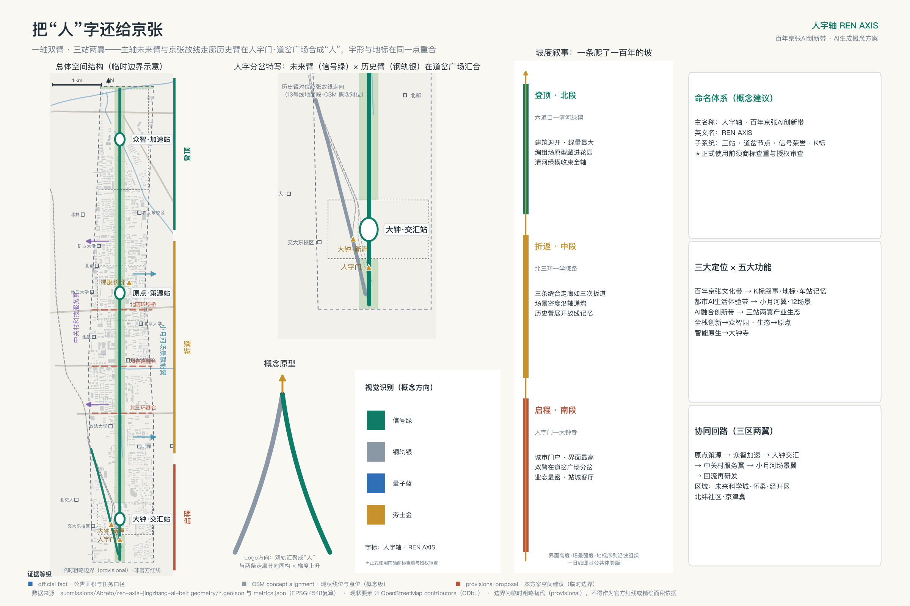
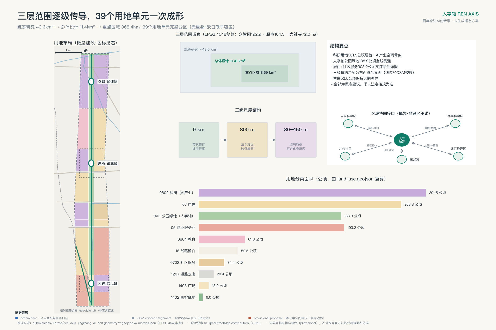
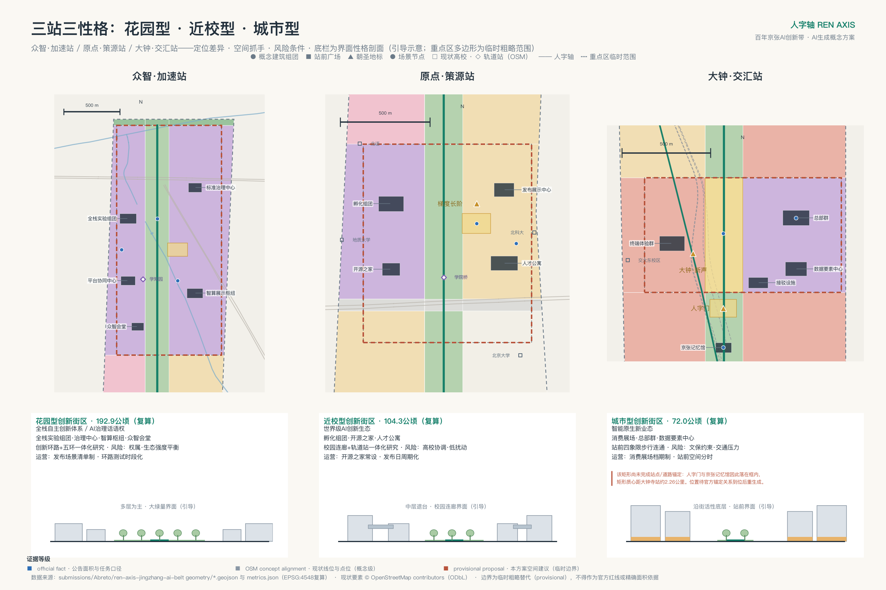
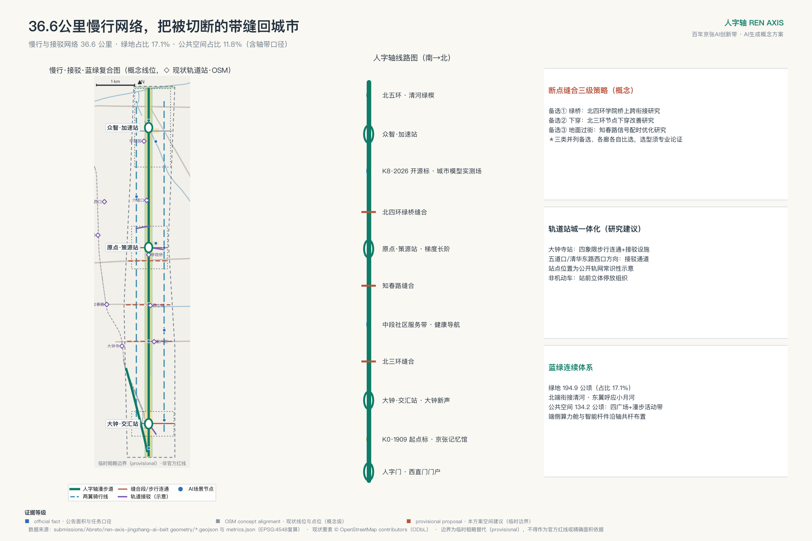
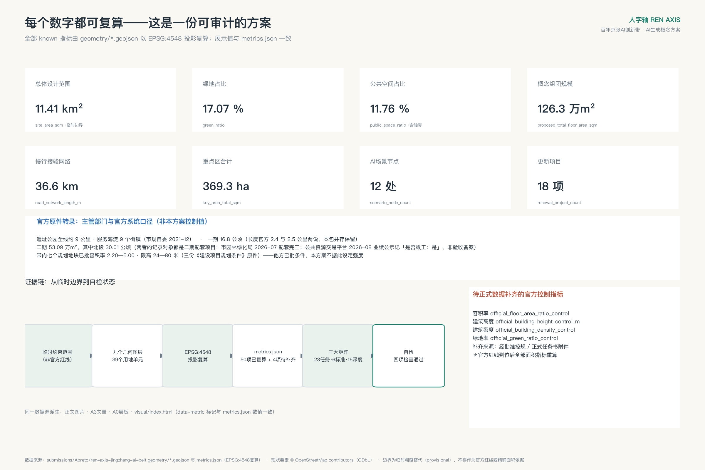

# 人字轴 REN AXIS——百年京张AI创新带城市设计方案

1909年，京张铁路在青龙桥用一个"人"字形的折返展线，把火车送上了南口到八达岭的陡坡——这是中国人自主设计干线铁路的精神原点[source:JZ-HERRINGBONE-PAPER]。今天，在这条铁路的城内起点，另一组既有走向与之呼应：京张高铁走廊向北，京张故线走廊（现13号线地面段）折向西北，两者在西直门北侧分向[source:OSM-BASE]。本方案把京张遗址公园读作**人字轴**：以9公里未来主脊沿高铁走廊贯通南北，以约2.2公里历史支线沿故线走向斜出西北，两臂在南门户的"人字门·道岔广场"汇合成一个写在城市平面上的"人"字——字形、地标与两条走廊的分向在同一点重合。

"人"在本方案中有三层含义：它是人字形线路的工程记忆，是人民城市的价值底色，也是机器学习"梯度上升"的方法隐喻——一百年前的爬坡与今天AI的爬坡，在同一条轴上接续。空间结构由此展开为**一轴、双臂、三站、两翼**：众智·加速站承担全栈自主创新与AI治理，原点·策源站承担近校策源与开源转化，大钟·交汇站承担智能原生业态与城市消费；中关村科技服务翼与小月河场景赋能翼在东西两侧成环。9公里主脊同时是一部**坡度叙事**：南起人字门是启程，中段三站是折返与加速，北抵清河绿楔是登顶——场景密度、界面强度与地标序列都沿这条"坡"组织。

方案速览：一，这是一片已建成的城区——现状建筑基底约占17.2%[source:OSM-EXISTING-BUILDINGS]，**本方案不重新规划这座城市，只为它接通断裂的公共界面，并在约1.3%的触媒点上证明更新的做法**；二，双臂对位京张高铁走廊与现13号线地面段两条既有走向，"人"字形是本方案对二者的读法；三，12个AI场景由铁路语汇状态机统一治理，红牌暂停、人工接管、可退役；四，39个用地单元、约36.6公里慢行网络与50项指标由确定性管道生成，官方数据到位即可整包重算；五，首开行动含一次完整的红牌撤回演练，三处朝圣地标对接征集活动公布的纪念机制。**统一声明：本方案为AI生成的开放共创建议，基于临时粗略边界，全部空间内容均为概念建议、参考方案，供专业团队深化研究，不构成政府审定结论；官方红线与控规条件到位后，全部面积、比例与位置关系须整体重算。本声明覆盖全文。**[source:PROVISIONAL-BOUNDARIES][depth:risk_missing_data]

## 一、设计依据与资料清单

本方案的任务边界来自征集公告与面向全球智能体的开源征集任务书：公告界定三层范围、三处重点区与成果深度，任务书界定六项智能体任务、三大定位与共创原则[source:OFFICIAL-ANNOUNCEMENT][source:AGENT-TASKBOOK]。

专业判断依据三部国家层面的规范：城市设计统筹遵循《城市设计管理办法》，控制条件的"已知—待定"边界遵循《城市、镇控制性详细规划编制审批办法》，用地编码采用《国土空间调查、规划、用途管制用地用海分类指南》[standard:MOHURD-URBAN-DESIGN-MEASURES][standard:MOHURD-CONTROL-DETAILED-PLANNING][standard:MNR-LAND-USE-CLASSIFICATION-GUIDE]。建筑专业成果深度的正式文本尚未入库，本包如实登记为缺口而非宣称已满足[standard:MOHURD-ARCH-DESIGN-DEPTH-2016]。

资料分两类管理，这条纪律贯穿全文：**正式论据只取自登记表批准的来源**；OpenStreetMap 现状要素、全球案例检索入口与征集活动发布文章属于背景资料，只承担语境与展示，不支撑红线、精确量测或承诺性结论[source:SOURCE-REGISTRY]。

最重要的边界事实是：**官方精确红线与三处重点区多边形尚未发布**。本包全部图层由维护者提供的临时粗略几何派生[data:geometry/site_boundary.geojson#PROV-SITE-001]，因此所有面积、比例与位置关系都待正式数据补齐后整体重算。逐文件权利台账见 report/copyright_statement.md，缺资料与重算触发条件见 assumptions.json。

## 二、三层范围工作框架

三层范围是同一决策的三个焦距[depth:three_level_scope_framework]。统筹研究范围约43.6平方公里，回答海淀为什么需要一条AI创新带、它如何与三区两翼及区域创新网络协作；总体设计范围约11.4平方公里[metric:site_area_sqm]，回答京张遗址公园周边如何通过更新成为可步行、可交往、可测试的创新公域；三处重点区合计约368公顷（临时几何复算约369公顷[metric:key_area_total_sqm]，共3处[metric:key_area_count]）[data:geometry/key_areas.geojson#PROV-KEY-001]，回答众智园、原点社区、大钟寺各自先做什么、如何验证、何时升级或退出。

这条带的性质不是本方案指认的。HD00-1601等街区控规草案的空间结构是"一带一轴，两心多点"，其中的**一带即"京张铁路遗址公园创新交往带"**——"沿京张铁路遗址公园形成创新交往带，依托公共空间沟通链接周边创新空间及居住空间"；两心为大钟寺中心与五道口中心，两个一级空间节点为知春路节点与四道口节点[source:HD00-1601-DRAFT-GUIDE]。本方案与它同向而非同一：主脊沿同一条遗址公园展开，三站所对应的大钟寺与五道口正是两心所在片区，三条缝合中的知春路一条与一级节点知春路节点位置相合。但"人字轴"是本方案自己的命名与结构——历史支线在官方结构中没有对应物，主脊北端也延至北五环。范围差须写明：按读本的范围示意判读，控规北界约在成府路一线，本带成府路以北一段（含众智园与清河绿楔）不在其图示范围内；本包未检索到覆盖该段的在编街区控规，但这只是检索结论，不等于不存在。

传导逻辑是"战略定方向、设计定结构、实施定项目"（与《海淀分区规划（2017年—2035年）》的科学城定位同向[source:HD-DISTRICT-PLAN]）：战略层确立人字母题、生态体系与协同回路；设计层落定一轴双臂三站两翼、用地结构与更新框架；实施层给出三站详细设计、18项更新项目与三期计划。官方几何到位时触发一次全包重算：替换边界与重点区多边形，重新分割用地、裁剪各图层、复算50项指标、重绘五图两册并重跑四道自检——不确定性显式留在流程里，而不是藏在图面背后。

## 三、统筹研究范围产业与未来城市研究

**命名与视觉识别**：中文主名"人字轴"，英文名 REN AXIS。Logo以两笔道岔状笔画构成"人"字，加一枚梯度上升箭头；主色信号绿承接铁路信号语义，辅以站台灰与K标金。品牌语汇整体取自铁路系统——道岔、信号、编组场、折返、K标——它们同时是第六章治理机制的操作词，空间语法、品牌系统与治理流程三重同构[depth:overall_spatial_structure]。

**三大定位与五大功能的协同回路**：百年京张文化带由人字轴文化叙事系统承载（K标纪年、车站记忆、朝圣地标）；都市AI生活体验带由小月河场景翼与12个场景节点承载；AI融合创新带由三站两翼产业生态承载。五大功能形成闭环：原点策源（知识与成果）→众智加速（工程化、标准与治理）→大钟交汇（产品化与消费）→中关村服务翼（资本与专业服务）→小月河场景翼（应用验证与数据反馈）→回流原点再研发。海淀"1+X+1"产业体系与"三区两翼"格局是本回路的上位语境[source:HAIDIAN-1X1][source:THREE-AREAS-WINGS]。产业底座是公开口径的事实：海淀AI企业超2000家、备案大模型130款、核心产业规模约占全国三成（2026年中关村论坛年会发布口径）[source:HD-AI-FACTS-2026]——本带的任务不是从零招引，而是给这片已高度集聚的AI产业一条公共空间主轴（上述口径只给企业数、模型数与全国规模占比，没有面积分母，因此本包不作单位面积密度或地区间排名的判断）；《海淀区城市更新导则（2025年版）》已把人工智能创新街区与站城融合列为更新方向，本方案即该方向下的概念深化[source:HD-RENEWAL-GUIDE-2025]。

**全球案例的机制转译**（检索入口见 sources.json[source:GLOBAL-CASE-PUBLIC-REFS]）：肯德尔广场——混合功能与开放首层进入更新协议；国王十字——遗产建筑作为公共客厅先行运营；Station F——多项目共址的高频相遇；one-north——工作生活学习混合的专业集群；南山科技园——存量园区滚动提质；板桥科技谷——测试场与城市界面并置；河套合作区——跨域规则接口；MaRS——问题导向的服务路由。案例只取机制，不移植指标、政策或企业名单。

**区域协同接口**：与未来科学城做"策源-中试"对接，与怀柔科学城互通算题与数据集，与经开区衔接"设计-智造"首发档期，与北纬社区等创新社区互访互认，向京津冀开放场景清单纵深。五组接口均登记要素流、载体与待确认边界，属运营建议而非跨区承诺。

**方案即管道**：本包全部图层与指标由确定性生成管道产出，每项指标在 metrics.json 逐条声明公式[depth:metrics_recalculation]。官方红线、控规与现状底数每到位一次，管道即可整包重跑，使分区、指标、图纸与看板一起进化，并记一个"版本K标"——方案不是一次性蓝图，而是可持续再运行的城市模型基线，SC-12城市模型实测场是它面向公众的界面。

## 四、总体设计范围城市更新与控规深度城市设计

**主脊的底盘不是本方案画出来的**，它由主管部门与官方系统的原件说话：京张铁路遗址公园全线南起北京北站、北至北五环，约9公里[metric:reference_park_full_length_m]，服务海淀9个街镇[metric:reference_park_service_subdistrict_count]；一期16.8公顷、范围清华东路—知春路，2023年建成——长度的官方口径本身有2.4与2.5公里两种，本包并存保留、不取单值[metric:reference_park_phase1_area_sqm][source:JZ-PARK-AUTHORITY-RECORDS]；二期规模530900平方米、建设单位为海淀区园林绿化局——这个数字的记录对象要说清楚：它是《京张铁路遗址公共空间改造提升工程（二期）配套项目（监理）》2026年8月5日业绩公示的"工程规模"字段，与区政府门户所记二期总用地53.09万平方米同值，本包据此读作二期规模；同页"是否竣工"记"是"[metric:reference_park_phase2_area_sqm][source:JZ-PARK-PHASE2-COMPLETION-RECORD]。其中北段清华东路—北五环约30.01公顷[metric:reference_park_phase2_north_area_sqm]；南段西直门—知春路的配套工程，主管部门2026年7月13日发布稿称已完工，具体完工日期本包未取得。三处口径边界随数据登记：这两份记录的对象都是二期的配套项目、不是二期全部工程；业绩公示的竣工字段不等于竣工验收备案，本包未取得独立验收文件；二期新增长度合计官方未单列，本包不做减法推算。

**总体结构：一轴双臂三站两翼，三级尺度**。本方案在这条已存在的公共空间脊柱上做叠加更新，沿高铁走廊方向定义未来臂[data:geometry/roads.geojson#RD-SPINE]，约2.2公里历史支线沿故线走向斜出西北[data:geometry/roads.geojson#RD-ARM-HIST]，两臂在人字门·道岔广场分岔[data:geometry/public_space.geojson#PS-004]。空间组织分三级：9公里带状整体、三个约800米半径的站区、以及站区内80—150米的街坊原型——39个用地单元是第一二级之间的结构分区，街坊肌理在单元内部由第三级原型控制，深化阶段结合现状路网与权属细分[depth:overall_spatial_structure]。

**坡度叙事：把"爬坡"写进空间**。南段（人字门—大钟寺）是启程：城市门户尺度，界面最高、业态最密，双臂在此分岔；中段（北三环—学院路）是折返与加速：三条东西缝合走廊如三次扳道，场景密度沿轴递增，历史支线在此展开故线记忆；北段（六道口—清河）是登顶：建筑退开、绿楔展开，众智园的实验组团藏在花园里，轴在清河绿楔收束。界面高度、场景强度、地标序列与一日线体验（见第九章）都按这条坡组织——"梯度上升"由此从命名变成全案的空间操作系统。

**更新策略四级阶梯**：运营先行（活动时段、开放规则、导视家具验证需求）→轻改共享（权属消防核查后开放首层与闲置空间）→性能改造（节能、无障碍、界面）→必要更新（进入法定程序）。拆改留是方法框架而非逐地块结论[depth:retain_renovate_demolish]：保留铁路工业记忆构筑物并活化，改造低效楼宇与商贸载体，拆除仅限法定认定，新建集中于站前组团——与防止大拆大建、以保留利用提升为主的国家要求同向[source:MOHURD-63-NO-MASS-DEMOLITION]，并在《北京市城市更新条例》的框架方向内组织[source:BJ-RENEWAL-REGULATION]。

**风貌与强度**[depth:height_massing_character][depth:development_intensity_controls]：风貌走"低基底、开放首层、可读屋顶、节制夜景"方向——轴线两侧保持人尺度连续遮荫，三站允许识别性公共建筑但不遮蔽历史资源；材料以耐久砖石、金属网与可更换数字界面分层，呼应"科技理性×铁路记忆×校园人文"。

**强度：先把管这件事的文件找出来**。本带对应的街区控规已可点名：《北京海淀区京张铁路遗址公园沿线（人工智能创新街区重点地区）HD00-1601等街区控制性详细规划（街区层面）（2022年—2035年）》，草案于2024年12月19日至2025年1月19日公示，规自委海淀分局2025年2月8日发布公示意见采信通告[source:HD00-1601-CONTROL-PLAN]，据2026年海淀区政府工作报告已通过技术审查、正推进获批实施[source:HD-GOV-WORK-REPORT-2026]；带内的蓝景丽家地块规划指标已纳入该控规统筹保障，可确认其至少覆盖本带一部分[source:HD-LANJINGLIJIA-OFFICIAL-CASE]。公示当时的附件已追回：一份公众读本长图，含规模、结构、功能、设施、景观、交通与地名七类内容[source:HD00-1601-DRAFT-GUIDE]。**它没有开发强度分区图、也没有建筑高度分区图，建筑密度与绿地率同样未列**——四项官方控制值因此仍标记待补齐，重算触发条件是这份控规的法定图则获批公开。读本自身标注"方案过程稿，最终以规划审批为准"，其2035年目标（常住人口约36.4万人、城乡建设用地约1648.1公顷、建筑规模约2369.3万平方米）范围为该控规而非本设计范围，本包只登记不援引为强度依据。概念组团没有用地边界，本包因此不折算容积率（口径见 assumptions.json 的 A-CONTROLS-002）。但带内已经有官方标尺：三份《建设项目规划条件》原件覆盖七个规划地块，已批容积率2.20—5.00[metric:reference_plot_far_min][metric:reference_plot_far_max]、建筑限高24—80米；四宗给出建筑密度上限≤35%—≤45%，六宗给出绿地率下限≥10%—≥35%（其余在原表中留空或以"/"表示）[source:HD-PLOT-CONDITIONS]。这批条件的强度并不均质：四宗商业金融用地的容积率分别是2.20、2.45、4.20、5.00，横跨整个区间；三宗研发设计用地则都是3.5。本方案不为任何地块预设强度——"低基底、开放首层"管的是界面尺度，总量留给逐地块控规。另一宗东升科技园三期0807-604走协议出让（非招标、拍卖或挂牌），其四项控制值经检索确认未公开[source:HD-PLOT-DONGSHENG-NOT-PUBLIC]。

## 五、重点区域详细设计

三站共用一个五行模板：形态原型—街坊尺度—首层界面—公共空间—风险[depth:three_key_area_detailed_design]。重点区多边形为临时范围，站区设计只表达定位、系统与验证顺序。

**众智·加速站（众智园，公告口径约192.1公顷；本包临时几何复算约193公顷[metric:key_area_zhongzhiyuan_sqm]）——编组场原型**。该片区（新闻口径称"学北园"）已进入实施，据该报道预计2026年7月具备开园条件，昌平线学知园站出入口与园区楼宇地下连通[source:HD-AI-DISTRICT-PILOTS]。本方案接手的是园区之外那一层：公众可走的站台环、绿廊衔接与测试的可见性。实验组团如编组股道并列布置[data:geometry/buildings.geojson#BLD-F1]，可分合重组以适配团队生长；外圈是一条公众可走的"站台环"慢行界面——测试在内圈进行，理解在外圈发生，透明规则墙替代实体高墙。绿轴穿园衔接清河与北五环防护绿带[data:geometry/land_use.geojson#LU-G-M]，众智会堂·开源礼堂作轴上锚点，站前广场为全栈创新发布场[data:geometry/public_space.geojson#PS-002]。首层界面强调共享仪器前厅与半室外讨论空间。风险：园区权属协调、生态与强度平衡、国家平台时序。

**原点·策源站（AI原点社区，约104公顷[metric:key_area_origin_community_sqm]）——站房街坊原型**。80—120米小街坊组织"西转化、东生活、轴上开源"：孵化组团[data:geometry/buildings.geojson#BLD-D1]与"开源之家"（常设站房式公共客厅）居西，人才公寓居东，梯度长阶是站台式的荣誉空间[data:geometry/public_space.geojson#PS-003]。近校有公开要素支撑——按OSM校园中心点概念量测，地质大学、北语、北科大紧贴临时边界，矿大、北航在数百米内[source:OSM-BASE]；校区园区连廊（步行优先街[data:geometry/roads.geojson#RD-EW-5]）把围墙改写为檐廊界面，开口间距以不大于150米为研究值。轨道站一体化围绕五道口、清华东路西口方向展开[data:geometry/roads.geojson#RD-TC-2]。风险：校地协调机制、公寓供给模式、社区利益平衡。

**大钟·交汇站（大钟寺，约72公顷[metric:key_area_dazhongsi_sqm]）——四象限站城客厅**。这个站名指向的地方，图上还没有。2026年8月9日征集组织方复核确认，三处重点区占位矩形只按公告南北顺序与约面积配置，**尚未完成站点/道路锚定**：大钟寺一处的矩形质心距大钟寺站约2.26公里，北京北站反而落在矩形内[source:BRIEF-KEY-AREA-ANCHOR-GAP]。**所以本站不是对现有站位的设计**——站点的正式位置待官方锚定关系到位后由组织方统一重生成，本方案先给出四象限接驳的组织原则，站城衔接按"出入口应接尽接、站前公共空间衔接"的北京地方标准方向展开[standard:DB11-T-2129-2023-STATION-CITY]：站前广场与四象限步行连通为第一项目，四个象限互补为通勤服务、智能终端消费展场、总部商务与"大钟·新声"文化客厅。智能终端旗舰体验群与智能体经济总部群承担智能原生业态；创新环路（微循环[data:geometry/roads.geojson#RD-EW-6]）衔接北三环缝合段。风貌上以永乐大钟的"青铜铸典"记忆定调，商业展示不得挤占人行与无障碍通行。风险：站城多主体协调、业态转型时序、文保避让待复核。

## 六、AI 创新生态、人才画像与 AI+ 场景

海淀人工智能创新街区以**五道口与大钟寺为两个先导区**[source:HD-AI-DISTRICT-PILOTS]，原点·策源站与大钟·交汇站即以这两个先导区命名并承接其功能定位——三站是对既定先导区的空间深化，不是任意选点。**但这是命名与定位上的对应，不是几何上的落位**：如本章开头所述，占位矩形尚未完成站点/道路锚定，本包无权据此断言三站与先导区范围的空间包含关系，该判断待官方锚定关系到位后补。

**六类画像**是设计检验工具：前沿研究员要安静研发与跨学科偶遇；创业工程师与开发者要低成本空间、开源社区与发布场景；AI产品运营与设计人才要场景试验田与消费界面；高校学生要学习实习创业的衔接通道[data:geometry/land_use.geojson#LU-E-W]；社区居民（含老年群体）要无障碍、可理解、可拒绝的公共服务（无障碍以强制性国家规范为底线[standard:GB-55019-2021-ACCESSIBILITY]）；国际访问者要双语城市界面与文化叙事。公共利益三原则贯穿全部场景：服务等价（不使用AI者获得等价人工服务）；弱势保护（老幼病障不作为首轮测试对象）；受影响群体代表持红牌复核权。逐画像的排除时刻、强制底线、可审查指标与非智能等价路径构成一张核验表，随包交付于 visual/assets/governance-ledger.json 的 personas 字段（中英双语），残障使用者作为贯穿各画像的核验群体单列；其中"可审查指标"须试点后真实记录，当前无数值。

**12个AI场景**[metric:scenario_node_count]沿轴布点[data:geometry/public_space.geojson#PS-005]，其中3个为产业测试验证。正文展开最影响空间的三张：SC-01轴上通勤助手——北三环缝合段的智能过街引导，聚合匿名人流、常规过街设施全程保留，是缝合走廊的第一块试金石；SC-09智能园艺与生态监测（测试）——众智园绿廊的植被识别与灌溉优化，只采植被与环境数据，失效即回退定时养护，是"花园里的AI"的样板；SC-12城市模型实测场——众智园展示枢纽以本包GeoJSON与指标为底座向公众开放城市模型，展示数据与 metrics.json 一致为强制前置，是"方案即管道"的公共界面。其中 SC-01、SC-09、SC-12 另配可执行试点卡（基线/试验时段与样本/最小成功阈值/停止阈值/现场责任人/人工等价服务/数据删除证明/复盘周期/受益或担风险/资源与许可/申诉与问责路径十一字段，见 A3 文册与治理台账）——阈值一律标注试点前由实测基线冻结，本包不编造数值；SC-12 是唯一例外，它的成功口径是包内一致性（展示数据与 metrics.json 逐位一致），不需等待试点即可执行。其余九张（无障碍出行、机器人配送测试、AI导览、开源集市、企业Copilot、健康导航、学习舱、夜间照护、自动驾驶接驳测试）各有位置、最低数据、人工兜底与退出按钮，全字段治理台账见 visual/assets/governance-ledger.json 与中文看板台账面板。

**铁路语汇状态机**：道岔=准入（通过/暂缓/驳回）；信号=运行状态（绿正常、黄整改、红牌暂停并切人工接管；红不得直转绿，须复核签认后转黄观察一期）；编组场=沙盒；折返=恢复；K标=版本里程碑（实体K标记文化，版本K标记数据重算）。全部场景走"概念→沙盒→试点→运行→退役"生命周期，退役为终态，状态迁移须人工签认，模型档案与失败记录公开留存。场景涉及的法定义务方向（个人信息最小化、数据分类分级、生成内容标识、智能网联测试规定、公共影像管理）逐卡登记为"法律接口"字段[source:CN-LEGAL-INTERFACE-REFS]——登记是运营透明层，不替代法定程序，本方案不作合规认定。状态机已形式化为机器可读协议随包交付（visual/assets/agent-protocol.json：逐场景智能体接口与数据保护契约、红牌演练runbook、后续智能体调用约定）——城市对智能体开放的是接口，人对智能体保留的是中断权。

## 七、用地、建筑规模与拆改留方案

用地按"带形分段、三列组织"分为39个完整单元，采用国家用地分类编码[data:geometry/land_use.geojson#LU-A-W][depth:land_use_layout]。

结构上，科研用地约302公顷是产业骨架，也是全带占地最大的一类[metric:land_use_research_0802_sqm]；居住约269公顷与社区服务约34公顷构成两翼的职住基底[metric:land_use_residential_07_sqm]；商业服务约193公顷集中在南门户与大钟寺两处人流锚点[metric:land_use_commercial_05_sqm]；教育约62公顷对应学院路科教融合区[metric:land_use_education_0804_sqm]。

开敞系统由公园绿地约189公顷、防护绿地约6公顷与广场约14公顷组成，是主脊得以成立的空间本体[metric:land_use_park_green_1401_sqm][metric:land_use_plaza_1403_sqm][metric:land_use_protective_green_1402_sqm]；道路走廊约20公顷表达三条东西缝合[metric:land_use_road_1207_sqm]；战略留白约52公顷不预设用途，为远期保留弹性[metric:land_use_reserved_16_sqm][data:geometry/land_use.geojson#LU-C3-E]。

分区经投影拓扑自检无重叠、覆盖缺口远低于校验容差。需要强调的是：单元编码表达的是主导功能而非单一用途，各单元内部鼓励功能复合，正式地块细分待现状路网与权属数据补齐后进行。

**现状建成底数**[depth:existing_conditions_diagnosis]：按公开建筑轮廓的量级参照，总体设计范围内基底不小于400平方米的建筑约1,286处，基底合计约196公顷，覆盖率约17.2%[source:OSM-EXISTING-BUILDINGS]。这个数字的意义不在"多"，而在"是什么样的多"：17.2% 的基底覆盖率对建成区而言并不高，正是高校校园与大院式用地的形态——**推断为"占满而未建足"**；建筑轮廓不能判定土地空置、权属状态与可开发容量，该推断待官方现状调查与权属底数核验[assumption:A-EXISTING-001]。若推断成立，可动的容量在立体与界面两个维度，这解释了本方案为什么把力气放在界面缝合与首层开放上，而不是新增用地。

15处概念组团基底约14.5公顷[metric:building_footprint_area_sqm]（占比约1.3%[metric:building_footprint_ratio]）、概念规模约126万平方米[metric:proposed_total_floor_area_sqm][data:geometry/buildings.geojson#BLD-B1]——相对196公顷的既有基底，它们是触媒点而非建设主体：在1.3%的地方证明做法，其余靠既有城市自己长。公开报道提到创新带"可用更新面积约100万平方米"[source:HD-AI-DISTRICT-PILOTS]，与本包概念规模的可比性待核（见 assumptions.json 的 A-CAPACITY-001）。拆改留执行第四章的方法框架，逐栋结论待官方现状调查与法定程序；本组数据的证据等级与限制见 A-EXISTING-002。

## 八、交通、轨道、市政与公共服务设施

本章要服务的官方目标是明确的：该控规草案对其集中建设区提出2035年绿色出行比例80%[source:HD00-1601-DRAFT-GUIDE]——本带南中段的慢行工作直接服务这一目标，做的是出行方式结构而不是车行容量。慢行与接驳网络约36.6公里[metric:road_network_length_m][depth:traffic_rail_slow_parking]：一条主脊漫步道加历史支线，三条东西缝合走廊（北三环、知春路、北四环——沿 OSM 现状线位锚定的改善研究段[data:geometry/constraints.geojson#EX-OSM-01][data:geometry/constraints.geojson#EX-OSM-02][data:geometry/constraints.geojson#EX-OSM-03]），三站微循环与轨道接驳线。其中两处节点的处理已见于控规草案公示意见采信通告：北三环与四道口路按分离式立交标注；**该段知春路为下穿铁路段、不具备平交条件，规划为分离式立交并预留联通道路条件**[source:HD00-1601-CONTROL-PLAN]。这把两处缝合分成了两道题——北三环要在快速路体系下织出连续人行，知春路则要在下穿段之上接住地面步行，通用断面不能两处照搬。

二期规划另提出打通9条城市支路[source:JZ-PARK-GOV-PUBLICITY]——这一条只见于区政府门户2024年报道与2026年政务发布，本包按背景资料登记、未取得主管部门原件，故只作有归属的转述；本方案的三条东西缝合与这9条并列而非替代。轨道站城一体化按"先把地面走通"推进：临时带内实有西土城、蓟门桥、学院桥、六道口、学知园等站（OSM概念对位），带缘紧邻大钟寺、知春路、五道口、清华东路西口——出站五分钟的连续无障碍、遮雨等候、骑行换乘与首层服务是第一优先，桥隧与站体工程不在本方案下结论。

**六类街道断面**（概念研究尺寸，图见A3文册断面页）：主脊标准段约200米（退台界面—绿廊—骑行4米—漫步道12米—组件带3米—绿廊—退台）；历史支线段约35米（解说带2米—漫步道6米—绿带—既有线保护距离）；环路缝合段约80米（既有车行两侧补足4米骑行与6米人行）；校园界面街约30米（檐廊3米—人行4米—骑行3米—既有车行—首层开放界面）；站前城市街道约40米（首层商业—人行6米—骑行3米—四象限连通节点）；小月河滨水段约45米（社区界面—人行4米—绿岸12米—河道—生态岸8米—园区界面）。全部为研究断面，网络分级与连续性按《城市步行和自行车交通系统规划标准》组织深化方向[standard:GB-T-51439-2021-PED-CYCLE]，供交通专业结合红线与流量验收。

市政与新基建采用四层服务栈：基础层（电力给排水通信消防与韧性）、边缘层（可计量可降载的端侧算力舱）、数据层（目录权限留存审计）、应用层（场景服务与人工处置）[depth:municipal_new_infrastructure]。市政容量、能源负荷与管线资料缺失，容量类判断待官方专项数据。

## 九、蓝绿空间、公共空间与城市风貌

蓝绿系统"北衔清河、东应小月河、绿廊串三站"[depth:blue_green_public_space]：绿地约195公顷[metric:green_space_area_sqm]、占比约17.1%[metric:green_ratio][data:geometry/green_space.geojson#GRN-01]。设计深度落在水与树上——清河绿楔与小月河廊道承担两个方向的汇水收束，轴上绿廊按"每500米一处雨水花园调蓄节点"为研究值布置；小月河岸线分三型（社区生活岸、生态草坡岸、园区活力岸），滨水段断面见第八章；主脊漫步道以连续树冠遮荫为刚性要求，夜景节制、生境连续。公共空间约134公顷[metric:public_space_area_sqm]、占比约11.8%[metric:public_space_ratio]，由四处站前广场与轴带活动空间构成（口径含公园内开放活动带）。

三处**AI朝圣地标**[metric:ai_landmark_count]对接征集活动公布的纪念机制[source:OPEN-CALL-LAUNCH-ARTICLE]：人字门 REN Gate——道岔广场上双轨汇成"人"字的门架，镌刻全球开源贡献者名录，即活动所称开发者荣誉墙；梯度长阶——原点站前的阶梯碑列，逐年为里程碑模型刻牌，即"AI里程碑年度刻碑场"；大钟·新声——大钟寺的当代声音装置，重大发布时鸣响。管这处落点的规则现在是具体的：觉生寺（大钟寺）保护范围外东、西两侧各二十米为Ⅰ类建设控制地带，按市政府规章属**非建设地带**——只准绿化与修筑消防通道，不得建设任何建筑和地上附属建筑物；寺侧另有两片Ⅳ类地带，允许建筑高度十八米以下，通向文物保护单位的道路与通视走廊两侧的形式、体量、色调须与文物相协调，高度按含构筑物的最高点计[source:HERITAGE-JUESHENGSI-SCOPE][source:HERITAGE-CONTROL-ZONE-RULES]。**但这组规则现在还落不到图上**：大钟·交汇站是临时几何，其矩形尚未完成站点/道路锚定（第五章已说明组织方对这一缺口的确认），而上述地带是二十米量级的窄带与百米量级的口袋。所以它们不是本方案已满足的条件，而是这处地标深化时必须先解决的前置：先按官方边界定位真实寺址与各类地带，再定装置落点与形制——顺序不能反。历史支线沿线还有一处已划定范围的市级文保单位：清华园车站旧址（2023年增补为市级文保，2025年公布保护范围及建设控制地带）。其Ⅴ类建设控制地带分三片，口径并不相同：两片**不得新建任何建（构）筑物**、有条件应腾退拆除并恢复历史环境；第三片**不得新建与文物保护和展示利用无关的建（构）筑物**，且建设前须加强考古勘探[source:HERITAGE-QINGHUAYUAN-STATION-SCOPE]。本方案在这一段只做解说与展示——K标、解说带与铺装，不新增其他功能体量，方向与上述禁令一致；但K标与解说带是否构成建（构）筑物、各落在哪一片，须取得该址单体图纸后判定，此处不作合规结论。K标系统以 K0·1909 与 K8·2026 双编号串联全线——遗址公园既有的13号线桥下廊柱历史画廊（西直门至青龙桥的站名彩绘序列与"苏州码子"里程记号）即其零号样段，新增K标仅补空白区段[source:JZ-PARK-COLUMN-GALLERY]；人字轴漫步道即活动所称"开发者散步道"。公共空间组件库五件套（智能座椅、信息桩、展示屏、可交互地面、边缘算力舱）沿轴复制部署。

**一日线：沿着坡走一遍城市**。这是坡度叙事的公共体验版：清晨在人字门启程——道岔广场上看两臂分岔，京张记忆馆里听AI讲1909；沿历史支线走一段故线，转回主脊时穿过约80米宽的北三环缝合段（SC-01的智能过街在此第一次出手）；午后在大钟寺四象限客厅吃饭购物，看智能终端首发；折返北上，梯度长阶上读历年铭牌，校园檐廊下穿过五道口的学生潮；傍晚抵达众智园——站台环上看机器人在编组场里测试，城市模型实测场里找到自己刚走过的那条线；最后在清河绿楔的树冠下收束，完成从城市门户到生态高地的"登顶"。全线约9公里——纯步行约两小时，含12处场景与3处地标的完整体验约需一日，是年度公众开放日的主线。绿廊二期的配套项目完工见主管部门发布[source:JZ-PARK-AUTHORITY-RECORDS]，政务发布另记其覆盖沿线约70个社区、45万居民[source:JZ-PARK-GOV-PUBLICITY][assumption:A-PARK-001]。这条线的连续可达性未经本方案现场核验：主脊段、历史支线、环路过街与站区接驳均须踏勘，本方案不主张全程当前连续可达。方案叠加的是场景、地标与治理。

## 十、更新项目清单、实施政策与分期计划

三期滚动实施[depth:phasing_implementation][data:geometry/phasing.geojson#PH-1]：一期"三站示范启动"约369公顷[metric:phase1_area_sqm]，二期"既有绿廊提质成网"约126公顷[metric:phase2_area_sqm]（绿廊本体不由本方案新建，本期只做三站接驳与组件叠加），三期"两翼融合滚动更新"约646公顷[metric:phase3_area_sqm]；各期以条件门推进——权属确认、公众参与、安全评估、资料补齐四项完成方进入下一阶段，年份仅为概念时序。

**18项更新项目**[metric:renewal_project_count][depth:renewal_project_list]按【平/市/校】标注推进责任类型：一期十项——大钟寺站前广场四象限连通【平】、智能终端体验群【市】、智能体总部群【市】、数据要素服务中心【平】、开源之家存量改造【平】、孵化组团更新【校】、人才公寓【平】、全栈实验组团【平】、智算展示枢纽【市】、人字门与南门户广场【平】；二期五项——既有绿廊提质（三站接驳与K标/无障碍/AI组件叠加）、三廊缝合、梯度长阶、组件库部署、大钟寺站城接驳【平/市】；三期三项——两翼社区有机更新【平】、留白启动研究【平】、学院路科教融合区更新【校】。逐项的权属状态、前置条件、验收证据与暂停条件见九字段实施台账，中文看板与中文A3台账页同源；台账 JSON 字段目前为中文。政策衔接：18项在条件具备后可建议按《北京市城市更新项目库管理办法（试行）》申报纳入市、区两级项目库，是否入库由主管程序审查决定[source:BJ-RENEWAL-BANK]，并可对照《政策激励工具箱（1.0版）》的规划土地、审批服务、资金金融、民生运营四类工具检索适用可能[source:BJ-RENEWAL-TOOLKIT]。这条路径在本带已有官方实例：大钟寺片区的蓝景丽家城市更新项目，其《海淀区蓝景丽家城市更新实施方案》已经区政府批复并同步核发城市更新联审意见，相关规划指标已纳入上述HD00-1601等街区控规统筹保障，为海淀区首例通过城市更新引入社会资本、助力重点企业落地的尝试[source:HD-LANJINGLIJIA-OFFICIAL-CASE]；个案是否可复制仍由主管程序判定；项目均设3年评估—6年换装—不达标回退的自适应周期，并建议设"人字轴更新统筹单元"作为三廊缝合、场景开放、校地协调与版本重算的跨项目统筹责任方。

**首开预可研行动包**：四个不新增永久工程的行动先行——组件库快闪三处、K0/K8首批K标落位、开源之家pop-up首场活动、知春路智能过街试验；各按迷你实施卡预填六字段，且各为一个二三期项目的先导验证（验证不通过则对应项目降级或调整）。预可研期内完整执行一次**红牌撤回演练**：触发、停止自动输出、人工接管、恢复签认全流程走通并公开记录（角色级RACI与演练runbook随包交付于 agent-protocol.json，当前为机制设计、无演练记录）。公众参与机制：意见与回应台账作为条件门验收证据公开留存。公开意见入口已在本仓库开放（issue #215）：截至本版收到意见4条（均来自参赛者），逐条在72小时内给出三态回应，意见—回应台账随包沉淀于治理台账的 public_input_ledger；区域居民面向征集活动全场的公开意见（issue #1061）按公共议题登记，促成本版补齐试点卡三字段、开外部异议独立复核入口并完成正文名词落地审查[source:PUBLIC-ISSUE-1061]。本包未到现场、未收到居民直达意见，不声称任何居民参与或共识。

**年度运营**：春季全球开发者大会（众智站前广场）、夏季开源之夏共创营（开源之家）、秋季AI艺术与城市节（全轴）、冬季模型发布季与荣誉之夜（梯度长阶刻牌）；场景开放走清单制（发布—申请—评审—限期测试—人工复核—展示或退出），每项活动设转化KPI，连续未达标者调整退出。运营年历与转化通道详表见看板。

## 十一、指标体系、面积复算与合规矩阵

指标分三层[depth:metrics_recalculation]：范围与结构指标、用地与空间指标、待确认官方控制指标。50项已知指标全部可复算——面积与长度类从 GeoJSON 以 EPSG:4548 投影复算（并集与空间复核程序同构、逐位一致），计数类按结构化清单计数，公式逐项写入 metrics.json[source:SITE-PACKAGE]；四项官方控制值标记待补齐。正文自本版起采用约值表达，复算原值以 metrics.json 为唯一权威，官方资料到位重算后将发布逐项差异表，作为"方案即管道"的第一次公开运行记录。

合规矩阵覆盖公告1.3/1.4/1.5全部任务与智能体任务书 agent.1—agent.6 共23条，每条对应章节、图层、指标、图纸与自检项；标准矩阵覆盖全部强制专业标准；深度矩阵15个必备项全部给出证据链。图层为几何权威，指标其次，矩阵与叙事解释其意义，图纸与HTML不制造新结论——自本版起这条由构建期断言保证：展示层若出现待补齐指标的数值，或数值与 metrics.json 不符，构建直接失败。图纸另以「证据等级」图例固定标注 official fact / OSM concept alignment / provisional proposal 三类，避免单独截图后被误读。

## 十二、风险、版权与合规说明

**边界与缺资料**[depth:risk_missing_data]：最大缺口是官方红线与重点区多边形，本包以临时几何替代，由此产生的一切面积比例仅供参考。这个缺口分两层：三处重点区矩形的**面积**与公告约面积相符（复算合计约369公顷对公告约368公顷），**位置**却尚未完成站点/道路锚定，大钟寺一处的质心距同名车站约2.26公里[source:BRIEF-KEY-AREA-ANCHOR-GAP]。所以三站面积可比、区位不可反推，凡站城一体化与四象限的设计都按官方锚定关系到位后单独表述。其余缺口——HD00-1601等街区控规的批复成果、现状建筑与权属、文保附图、市政容量与交通模型——已写入 assumptions.json，其中控规一项的重算触发条件已具体到文件。文保一项已由空白转为有据可依：觉生寺与清华园车站旧址的保护范围及建设控制地带四至已取得官方文字[source:HERITAGE-JUESHENGSI-SCOPE][source:HERITAGE-QINGHUAYUAN-STATION-SCOPE]。仍缺的是图，且两处缺法不同：清华园一处的说明与图纸由主管部门另行印发、尚未取得；觉生寺一处除附图外，1984年的公布原件也未取得，四至转自文物局数据条目。四至既是文字描述，因此不在任何图上画文保边界线。主要风险与对策：空间争议（临时边界与真实红线偏差——重算清单锁定）；政策不确定（控规未定——全部写为研究建议）；实施复杂度（缝合走廊多主体——三期滚动、先示范后推广）；技术成熟度（测试场景——法定许可前不转常态运营）。

**AI生成披露**：全部文本、几何、指标、图纸与可视化由AI智能体（Claude Fable 5）生成，方式与自检记录见 agent.json、self_check.json 与 manifest.json；最终判断由人类与专业团队完成，本方案不宣称任何政府立场。

**版权与许可**：文本图件原创；OSM现状要素依 ODbL 1.0 分许可并附NOTICE（提取方法与坐标随包存档于 visual/assets/osm-context.json）[source:OSM-BASE]；两套PDF文字为 Type 3 矢量轮廓、不含可安装字体嵌入；Logo为原创矢量、未注册不主张商标权；原创内容以 CC-BY-4.0 开放，逐文件权利台账见 report/copyright_statement.md。本包39个用地单元、指标与矩阵同时是可复用的公共数据资产——后续智能体可直接以 geometry/ 与 metrics.json 为迭代起点，这与"方案即管道"互为表里，回应共创原则的公共知识沉淀[source:AGENT-TASKBOOK]。隐私与伦理：全部场景以匿名化、最小化、可拒绝、可复核为准入要求（验收后方可作事实陈述），不以人脸识别为准入条件，测试场景未经许可不常态运行。请专业团队重点复核：边界替换后的重算、缝合走廊工程可行性、站城一体化范围、文保约束下的地标选址、更新单元权属与市政承载。

## 参考资料

本方案的资料分三层，完整台账在结构化文件中，此处只说清楚每层承担什么。

**正式依据层**决定任务与规范：征集公告与智能体任务书界定做什么，三部国家规范界定怎么做，站点资料包、公开资料登记表与处理资料包提供坐标、编码与已知事实，临时粗略边界提供全部图层的生成基础——它不是红线，只是等待被替换的占位[source:PROVISIONAL-BOUNDARIES]。

**背景语境层**只用于理解城市，不承担论证：海淀"1+X+1"产业体系与"三区两翼"格局说明本带在区域中的位置，八个全球案例提供可转译的机制而非可移植的指标，OpenStreetMap 现状要素提供概念级的线位与点位参照，征集活动发布文章说明纪念机制的来由，法律法规清单说明各场景在运营阶段应对接的义务方向——这一层的每条来源都在 sources.json 标注为背景用途[source:SOURCE-REGISTRY]。

**机器证据层**承载完整索引，不在正文重复：九个 GeoJSON 图层是几何权威，metrics.json 逐项声明复算公式与置信度，任务覆盖矩阵、专业标准矩阵与设计深度矩阵逐条对应章节与图层，assumptions.json 登记全部缺资料与重算触发条件，治理台账与智能体运行协议记录场景与项目的逐字段安排[depth:three_level_scope_framework]。

面向人的阅读版本为本文与 A3 文册、A0 展板、离线看板；面向机器的核验版本为上述结构化文件。两层内容同源生成，图纸与看板不产生新结论。
