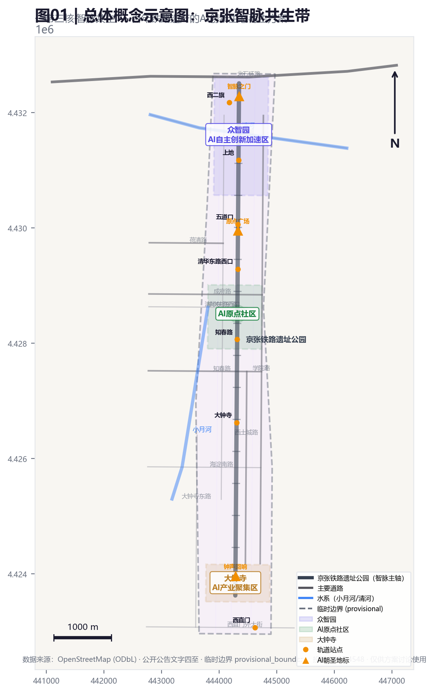
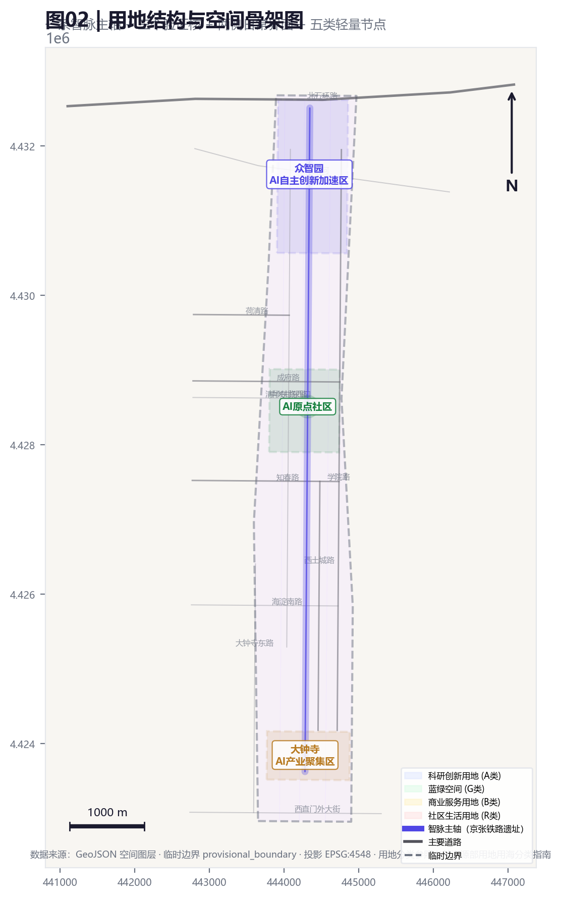
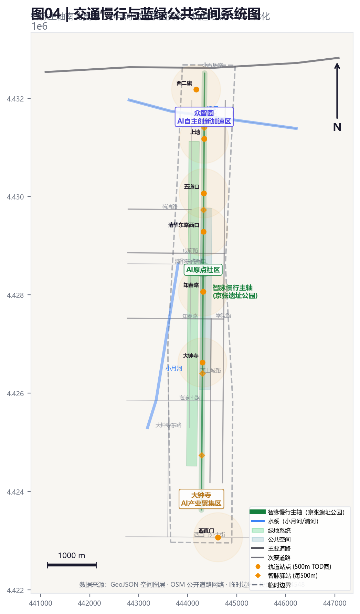
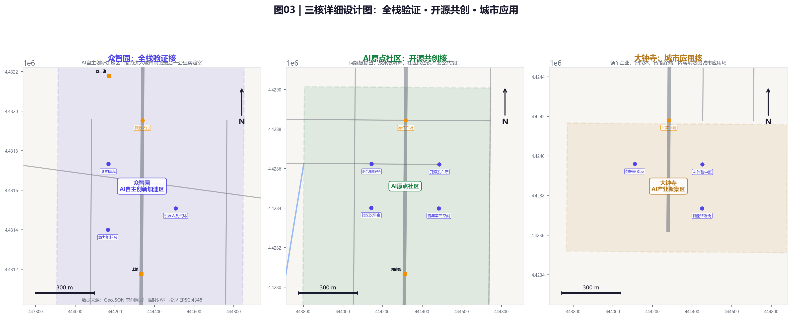
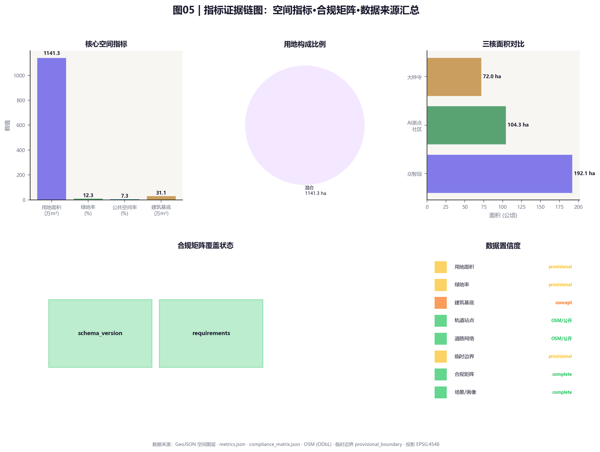

# 京张智脉：百年铁路遗产的AI创新生态再生方案

## JINGZHANG INTELLIGENT HERITAGE CORRIDOR

> 1909年，詹天佑在这里写下了中国人自主修造铁路的第一笔；2026年，AI在这里书写城市智能文明的新篇。百年之间，铁轨变成了光缆，站台变成了实验室，但这片土地上"自主攻坚、敢为人先"的精神从未断裂。

## 一、方案摘要与核心概念

### 1.1 核心概念：京张智脉共生带

本方案提出"京张智脉共生带"作为百年京张AI创新带的总体概念。"智脉"二字兼具两层含义：一层是京张铁路作为城市空间的历史脉络，另一层是AI创新生态作为未来发展的智慧动脉。两者共生于同一片土地，过去与未来不是替换关系，而是叠加关系--旧时代的铁轨没有消失，它成为新时代AI生长的文化底座。

空间组织为"一带三核、智脉共生"：一带即京张遗址公园文化智脉主轴；三核即众智园、AI原点社区、大钟寺；两翼即小月河场景赋能翼和清河生态科技翼。[source:AGENT-TASKBOOK] [standard:PROJECT-AGENT-OPEN-CALL-TASKBOOK] [depth:overall_spatial_structure]

### 1.2 命名体系

| 层级 | 中文名 | 英文名 | 含义 |
|:---|:---|:---|:---|
| 总体概念 | 京张智脉共生带 | JINGZHANG INTELLIGENT HERITAGE CORRIDOR | 百年铁路遗产与AI创新生态共生 |
| 主轴 | 京张智脉 | JINGZHANG SMART VEIN | 铁路脉络转为智慧脉络 |
| 核一 | 众智园 | ZHONGZHI AI ACCELERATION HUB | 众智成园，全栈验证 |
| 核二 | AI原点社区 | AI ORIGIN COMMUNITY | 中国AI的出发点与原点 |
| 核三 | 大钟寺智荟 | DAZHONGSI AI CONVERGENCE | 传统商贸汇聚转为智能汇聚 |

### 1.3 Logo方向

Logo由铁轨截面与神经网络节点连线交织构成，中心交汇形成"脉"字抽象形态。配色：铁路石墨灰(#3A3A3A)、证据青(#2E86AB)、传承琥珀(#F18F01)、活力绿(#52B788)。不使用企业商标或人物肖像。[source:AGENT-TASKBOOK]

## 二、设计依据与资料清单

方案以官方资格预审公告为第一依据[source:OFFICIAL-ANNOUNCEMENT]，以面向智能体任务书确认任务边界[source:AGENT-TASKBOOK]。遵循住建部城市设计管理办法[standard:MOHURD-URBAN-DESIGN-MEASURES]、控规编制办法[standard:MOHURD-CONTROL-DETAILED-PLANNING]、自然资源部用地分类指南[standard:MNR-LAND-USE-CLASSIFICATION-GUIDE]和建筑工程设计深度规定[standard:MOHURD-ARCH-DESIGN-DEPTH-2016]。[source:SITE-PACKAGE] [source:SOURCE-REGISTRY] [source:PROCESSED-FACT-PACK]

当前采用临时边界(official_boundary=false)，只用于方案生成和自检，不能作为官方红线或审批依据。官方polygon发布后需重算全部空间指标。[source:BOUNDARY-SOURCE] [source:KEY-AREA-SOURCE] [data:geometry/site_boundary.geojson#SITE-001] [depth:existing_conditions_diagnosis]

## 三、三层范围工作框架

| 层级 | 官方约值 | 本方案任务 | 可审查成果 |
|:---|:---:|:---|:---|
| 统筹研究范围 | 43.6 km² | 组织"高校策源-遗产赋能-开源协作-企业转化-公共体验"的生态回路 | 案例、机制、区域协同 |
| 总体设计范围 | 11.4 km² | 以京张智脉主轴组织用地、慢行、蓝绿和文化节点 | GeoJSON、指标、项目清单 |
| 三处重点区域 | 368.4 ha | 全栈研发、开源共创、城市应用分别承担不同验证角色 | 三核详细设计 |

[standard:PROJECT-OFFICIAL-ANNOUNCEMENT] [depth:three_level_scope_framework] [metric:site_area_sqm]

## 四、统筹研究范围产业与未来城市研究

### 4.1 六个全球案例与可转化机制

| 案例 | 借鉴机制 | 京张智脉转译 | 不照搬之处 |
|:---|:---|:---|:---|
| Boston Kendall Square | 高校企业公共空间近距离创新 | AI原点社区设"成果-服务-街道"短链 | 不复制高成本封闭园区 |
| London King's Cross | 铁路遗产再生为创新街区 | 京张主轴承载文化叙事与创新功能 | 不照搬商业开发强度 |
| Toronto Quayside | 数字城市数据治理争议 | 数据最小化、退出机制先于部署 | 不采用默认全域采集 |
| Helsinki Kalasatama | 城市试验与居民时间收益 | 试点声明公共收益指标 | 不以技术上线数量为成功 |
| Singapore one-north | 研发测试产业服务协同 | 众智园形成全栈验证核 | 不把封闭园区当整座城市 |
| Montréal AI ecosystem | 研究伦理与社区并置 | 人工复核与公开复盘成为基础设施 | 不把伦理留到事后补充 |

London King's Cross 的铁路遗产再生经验对京张尤其有参考价值--它展示了如何保留工业遗产的物质肌理同时注入新创新功能。[depth:overall_spatial_structure]

### 4.2 AI创新生态图谱

方案构建"高校策源-遗产赋能-开源协作-企业转化-公共体验-国际传播"六环创新链。三区两翼协同：众智园负责全栈研发与安全验证，AI原点社区负责开源共创与成果孵化，大钟寺负责城市应用与产业聚集。区域协同以开放接口而非机构名单堆叠，合作安排均为概念建议。[source:AGENT-TASKBOOK] [depth:overall_spatial_structure]

### 4.3 未来城市形态

AI交通系统、连续绿色空间、创新服务设施和国际化生活工作氛围落实为可定位的功能区、节点、廊道和场景。产业战略指标、AI创新指数、人才密度写入指标体系，标明设计建议与待正式数据校准之分。全球AI创新活动、开发者社区、开放场景均写为"概念建议"。[depth:overall_spatial_structure]

## 五、总体设计范围城市更新与控规深度城市设计

### 5.1 用地结构

总体结构为"一条智脉主轴+三个验证核+两侧日常界面+五类轻量节点"。用地采用科研、绿地、商业服务和社区服务四类完整分区，当前只是对provisional boundary的拓扑安全分割。[data:geometry/land_use.geojson#LU-001] [standard:MNR-LAND-USE-CLASSIFICATION-GUIDE] [depth:land_use_layout] [metric:building_footprint_area_sqm]

### 5.2 交通组织

以"轨道站点一体化+慢行优先+AI交通试验"为核心。轨道站点周边TOD开发；京张遗址公园主轴为南北慢行主干道；低速无人配送、智能信号控制、车路协同在指定路段有限试点。[data:geometry/roads.geojson#ROAD-001] [depth:development_intensity_controls] [depth:traffic_rail_slow_parking] [standard:MOHURD-CONTROL-DETAILED-PLANNING]

### 5.3 建筑策略

优先保留可适配空间、内部改造复用、空置空间临时使用。开发强度、建筑高度、退线和建设规模均列为待官方控规确认。方向性指引：临公园界面保持人本尺度、首层开放、屋顶设备后退。[depth:retain_renovate_demolish] [depth:height_massing_character]

### 5.4 慢行与蓝绿系统

京张遗址公园主轴（南北向）与小月河廊道（东西向）形成十字交叉慢行骨架。绿地系统以遗址公园为主脉，串联社区公园、街角绿地和滨河绿带。[data:geometry/green_space.geojson#GREEN-001] [data:geometry/public_space.geojson#PUBLIC-001] [metric:green_ratio] [metric:public_space_ratio] [depth:blue_green_public_space]

## 六、重点区域详细设计

三处重点区polygon均为临时粗略范围。[data:geometry/key_areas.geojson#PROV-KEY-001] [data:geometry/key_areas.geojson#PROV-KEY-002] [data:geometry/key_areas.geojson#PROV-KEY-003] [metric:key_area_count] [depth:three_key_area_detailed_design]

### 6.1 众智园：全栈验证核

**定位**：能力进入城市前的最后一公里实验室。

**空间策略**：以共享测试庭院连接研发、评测、标准讨论和产业展示；临清河界面布置可撤回的低扰动展示与步行节点。

**三个抓手**：(1)模型安全与红队测试舱 (2)机器人低速混行封闭测试环 (3)端侧算力能耗可视化台。

**文化要素**：保留铁路编组站几何肌理，旧轨道转化为测试环路导引线。[depth:retain_renovate_demolish]

### 6.2 AI原点社区：开源共创核

**定位**：问题被提出、成果被解释、社区能否说不的公共接口。

**空间策略**：以近校成果转化街串联开源发布厅、知识产权与合规服务、青年第三空间、社区议事桌。

**更新方法**："小步试、可撤回"--首层空置空间先做90天使用测试。场景必须保留人工窗口和线下反馈入口。

**文化要素**：五道口铁路道口记忆--"宇宙中心"道口是铁路与城市交汇标志，方案建议设置"铁路-AI时空交点"公共艺术装置。

### 6.3 大钟寺智荟：城市应用核

**定位**：领军企业、智能体、智能终端、内容消费、数据要素的城市应用场。

**空间策略**：以大钟寺站一体化为核心，路口四象限步行连通，形成商业服务与AI应用复合的混合街区。

**抓手**：(1)AI产品体验中庭 (2)数据要素服务港 (3)智能终端试验街。

**文化要素**：大钟寺传统市集文化与AI新消费文化的对话--"古钟新声"主题。

## 七、AI 创新生态、人才画像与 AI+ 场景

### 7.1 十张AI场景卡

| 场景ID | 场景名称 | 问题描述 | 技术方案 | 空间落点 | 运营机制 | 隐私边界 |
|:---|:---|:---|:---|:---|:---|:---|
| SC-01 | 智脉文化导览 | 游客需要个性化文化解说 | 多模态AI+位置感知+多语言 | 智脉主轴沿线 | 公共免费，可选订阅 | 不采集面部，位置脱敏 |
| SC-02 | AI交通安全走廊 | 路口人车混行隐患 | 车路协同+智能信号+行人预测 | 五道口、知春路口 | 交管主导，有限试点 | 视频本地处理不上传 |
| SC-03 | 机器人低速配送 | 最后一公里配送效率低 | 无人车+调度+避障 | 众智园->社区试点 | 企业申请-封闭-有限试点 | 轨迹脱敏，不采人脸 |
| SC-04 | AI社区议事桌 | 居民参与决策门槛高 | NLP议题摘要+意见聚类 | AI原点社区 | 社区主导，AI辅助 | 发言匿名化 |
| SC-05 | 智能健康服务站 | 社区健康服务不足 | AI预诊+远程医疗+监测 | 小月河社区节点 | 卫健审批，AI仅辅助 | 健康数据加密，最小化 |
| SC-06 | AI创新沙盒 | 中小团队缺测试环境 | 共享算力+数据沙盒+评测 | 众智园测试庭院 | 申请制，结果公开 | 沙盒数据隔离 |
| SC-07 | 开源成果发布台 | 开源项目缺线下展示 | 数字展墙+交互演示+评分 | AI原点社区发布厅 | 月度活动，社区评议 | 仅展示自愿公开项目 |
| SC-08 | AI伦理复核台 | AI场景缺伦理审查 | 标准化清单+专家评审+公众旁听 | 三核各设一个 | 试点必须通过复核 | 复核公开，保护举报人 |
| SC-09 | 智慧能源微网 | 园区能耗管理粗放 | 端侧算力+分布式能源+预测 | 众智园、大钟寺试点 | 能源公司运营，数据公开 | 用电数据聚合脱敏 |
| SC-10 | 铁路记忆数字档案 | 京张口述史正在消失 | AI辅助采集+数字重建+AR | 智脉主轴文化节点 | 高校+社区共建 | 口述者知情同意 |

### 7.2 三个产业测试验证场景

| 场景ID | 名称 | 验证目标 | 空间落点 | 退出条件 |
|:---|:---|:---|:---|:---|
| TV-01 | 低速无人配送测试 | 安全性与公众接受度 | 众智园->AI原点社区 | 事故率超标即撤回 |
| TV-02 | AI信号控制试点 | 效率提升与公平保障 | 五道口、知春路 | 未达预期即退出 |
| TV-03 | 数据要素流通试验 | 合规流通可行性 | 大钟寺服务港 | 合规争议即暂停 |

### 7.3 五类用户画像

| 画像ID | 名称 | 特征 | 核心需求 | 关联场景 |
|:---|:---|:---|:---|:---|
| P-01 | AI研究者 | 高校/企业研究者 | 测试环境、算力、交流 | SC-06, SC-07 |
| P-02 | 社区居民 | 周边居民 | 生活便利、健康、参与 | SC-04, SC-05, SC-08 |
| P-03 | 创业者 | AI领域创业者 | 孵化、数据、展示 | SC-06, SC-07, SC-09 |
| P-04 | 文化访客 | 铁路爱好者、游客 | 文化体验、导览 | SC-01, SC-10 |
| P-05 | 国际访客 | 海外AI从业者 | 英文环境、国际活动 | SC-01, SC-07 |

### 7.4 场景-空间-运营映射

所有场景通过"五道门"准入协议：(1)公共问题门 (2)封闭沙盒门 (3)人工复核门 (4)有限试点门 (5)效果公开门。[source:AGENT-TASKBOOK] [standard:PROJECT-AGENT-OPEN-CALL-TASKBOOK]

## 八、AI公共空间、智能原生新业态与朝圣地标设计

### 8.1 三个AI朝圣地标

| 地标ID | 名称 | 定位 | 空间概念 | 文化叙事 |
|:---|:---|:---|:---|:---|
| LM-01 | 智脉之门 | 智脉主轴北入口 | 旧铁路信号塔改造的AI灯塔 | 詹天佑信号->AI数据信号 |
| LM-02 | 原点广场 | AI原点社区中心 | 五道口道口遗址上的公共广场 | 铁路道口->AI时代原点 |
| LM-03 | 钟声回响 | 大钟寺智荟核心 | 传统钟声与AI声光互动装置 | 古钟->AI声纹 |

### 8.2 公共空间组件库

| 组件 | 功能 | 部署位置 |
|:---|:---|:---|
| 问题亭 | 居民提交城市问题 | 三核及社区节点 |
| 测试舱 | 封闭式AI测试 | 众智园测试庭院 |
| 复核台 | 人工伦理审查 | 三核各一个 |
| 试点标识 | 标记试点范围和退出条件 | 试点路段 |
| 结果牌 | 公开试点效果 | 试点结束后展示 |
| 智脉驿站 | 休憩+导览+充电+反馈 | 智脉主轴每500m |

[depth:overall_spatial_structure] [standard:MOHURD-URBAN-DESIGN-MEASURES]

## 九、百年京张文化与AI新文化融合叙事设计

### 9.1 三个时代对话

- **铁路时代(1909)**：詹天佑自主修造京张铁路，人字轨、青龙桥车站
- **电子时代(1980s)**：中关村从电子一条街到自主创新示范区
- **AI时代(2026)**：百年京张AI创新带

三个时代不是替换关系，而是在同一片土地上层层叠加。

### 9.2 文化叙事路径

智脉主轴设计为"时间漫步"叙事路径：北段"工程之光"、中段"创新之火"、南段"智能之声"。

### 9.3 导视系统

采用"铁路站台牌"设计语言，信息牌形态沿用铁路站牌，材质从铸铁转为数字屏。编号系统沿用铁路里程标概念。

### 9.4 国际传播

以"Century Track → Smart Vein"为英文口号，通过年度论坛、黑客松、文化周建立国际认知。均为概念建议。[source:AGENT-TASKBOOK] [depth:overall_spatial_structure]

## 十、一带全球AI创新活动体系与长期运营设计

### 10.1 年度活动体系

| 季度 | 活动 | 内容 | 场地 |
|:---|:---|:---|:---|
| Q1 | 京张智脉创新季 | 场景征集+创业路演 | 众智园+AI原点社区 |
| Q2 | 百年京张文化周 | 铁路文化展+AI艺术 | 智脉主轴全线 |
| Q3 | 全球AI城市论坛 | 国际论坛+开源大会 | 大钟寺智荟 |
| Q4 | 智脉复盘节 | 效果公开+社区评议 | 三核轮换 |

均为概念建议。

### 10.2 开发者社区

以"京张智脉开源协议"为框架：场景护照、开源贡献墙、社区议事桌。

### 10.3 品牌传播

以"百年京张·智脉共生"为核心叙事，不绑定企业商标。[source:AGENT-TASKBOOK] [standard:PROJECT-AGENT-OPEN-CALL-TASKBOOK]

## 十一、用地、建筑规模与拆改留方案

用地采用科研(A类)、绿地(G类)、商业服务(B类)和社区服务(R类)四类完整分区。[data:geometry/land_use.geojson#LU-001] [standard:MNR-LAND-USE-CLASSIFICATION-GUIDE] [depth:land_use_layout] 建筑基底表达概念建议的占位范围。[data:geometry/buildings.geojson#BLDG-001] [metric:building_footprint_area_sqm]

拆改留分类原则：优先保留可适配空间、内部改造复用、空置空间临时使用。在缺少建筑普查和权属资料时不指定拆除或新建。具体拆改留分类待官方建筑普查数据发布后确定。[depth:retain_renovate_demolish] [depth:height_massing_character]

## 十二、交通、轨道、市政与公共服务设施

交通策略以"轨道站点一体化+慢行优先+AI交通试验"为核心。轨道站点周边进行TOD开发，西二旗、五道口、知春路、大钟寺等站点500米范围内容进行高强度混合开发，首层开放，地下空间互联互通。京张遗址公园主轴作为南北步行和骑行主干道，宽度不少于6米，与小月河廊道形成十字交叉慢行骨架。低速无人配送、智能信号控制、车路协同在指定路段有限试点，试点必须声明退出条件。道路系统分为主干路（快速联系）、次干路（组团联系）、支路（微循环）三级，支路系统重点加密，打通校区、园区与社区之间的微循环。非机动车停放采用分布式集中停放点，结合智脉驿站每500米设置一处。停车供给采用上限控制，鼓励轨道出行，具体配建标准待正式控规确认。[data:geometry/roads.geojson#ROAD-001] [depth:traffic_rail_slow_parking] [depth:development_intensity_controls] [standard:MOHURD-CONTROL-DETAILED-PLANNING]

市政与新型基础设施：分布式能源、端侧算力、新型通信网络沿智脉主轴布置。电力系统采用分布式光伏+储能+微电网方案，在众智园和大钟寺试点。端侧算力节点结合AI场景需求布置，每个AI服务节点配备边缘计算设备。5G/6G通信基站集约化建设，共建共享。给排水采用雨污分流+海绵城市标准，雨水收集利用率目标不低于30%。具体设施标准、管网方案和建设时序待官方市政资料发布后深化。[depth:municipal_new_infrastructure] [data:geometry/constraints.geojson#CONST-001] [data:geometry/constraints.geojson#CONST-002]

## 十三、蓝绿空间、公共空间与城市风貌

蓝绿系统以京张遗址公园为主脉，小月河廊道为次轴，串联社区公园和街角绿地。[data:geometry/green_space.geojson#GREEN-001] [data:geometry/public_space.geojson#PUBLIC-001] [depth:blue_green_public_space] [metric:green_ratio] [metric:public_space_ratio]

城市风貌控制方向性指引：临公园界面保持人本尺度、首层开放、屋顶设备后退、重要文化节点避免视觉压迫。建筑高度和开发强度待正式控规确认。[depth:height_massing_character] [standard:MOHURD-URBAN-DESIGN-MEASURES]

## 十四、更新项目清单、实施政策与分期计划

### 14.1 更新项目清单（概念建议）

| 项目ID | 名称 | 位置 | 类型 | 阶段 |
|:---|:---|:---|:---|:---|
| UP-01 | 智脉主轴贯通工程 | 京张遗址公园 | 公共空间 | 一期 |
| UP-02 | 众智园测试庭院 | 众智园 | 科研设施 | 一期 |
| UP-03 | AI原点社区转化街 | AI原点社区 | 混合更新 | 二期 |
| UP-04 | 大钟寺站一体化 | 大钟寺 | 交通枢纽 | 二期 |
| UP-05 | 智脉之门地标 | 智脉主轴北入口 | 文化地标 | 一期 |
| UP-06 | 原点广场 | AI原点社区 | 文化地标 | 二期 |
| UP-07 | 钟声回响装置 | 大钟寺 | 文化地标 | 三期 |

### 14.2 分期计划

[data:geometry/phasing.geojson#PHASE-001] [depth:phasing_implementation]

- 一期(2026-2028)：智脉主轴贯通、众智园测试庭院、智脉之门
- 二期(2028-2030)：AI原点社区转化街、大钟寺站一体化、原点广场
- 三期(2030-2032)：大钟寺智荟全面运营、钟声回响、全线复盘

### 14.3 实施政策建议

- 更新方法：小步试、可撤回，首层空间90天使用测试
- 资金机制：概念建议，待后续研究
- 社区参与：社区议事桌+AI伦理复核台
- 退出机制：每个试点必须声明退出条件

[depth:renewal_project_list] [depth:phasing_implementation]

## 十五、指标体系、面积复算与合规矩阵

### 15.1 指标体系

| 指标 | 值 | 状态 | 来源 |
|:---|:---|:---|:---|
| site_area_sqm | 11,412,825.386 | provisional | geometry/site_boundary.geojson |
| building_footprint_area_sqm | 310,807.184 | concept | geometry/buildings.geojson |
| green_ratio | 0.123423 | provisional | green_space/site_boundary |
| public_space_ratio | 0.073281 | provisional | public_space/site_boundary |
| floor_area_ratio | unknown | pending | 待正式控规 |
| key_area_count | 3 | known | geometry/key_areas.geojson |
| scenario_card_count | 10 | known | proposal.md |
| persona_count | 5 | known | proposal.md |
| landmark_count | 3 | known | proposal.md |
| case_study_count | 6 | known | proposal.md |

[depth:metrics_recalculation] [metric:site_area_sqm] [metric:building_footprint_area_sqm] [metric:green_ratio] [metric:public_space_ratio] [metric:key_area_count]

### 15.2 面积复算

临时边界复算面积约11,412,825 m²，只用于检查图层拓扑和比例一致性。官方polygon发布后需重新运行全部空间指标复算。[depth:metrics_recalculation]

### 15.3 合规矩阵

合规矩阵覆盖agent.1到agent.6全部任务，详见compliance_matrix.json。[metric:scenario_card_count] [metric:persona_count] [metric:landmark_count] [metric:case_study_count] [data:geometry/constraints.geojson#CONST-001]

## 十六、风险、版权与合规说明

### 16.1 合规声明

本方案中所有空间落地建议均为开放共创建议，不替代正式规划，不构成政府审定结论。方案中使用的临时边界来自公开仓库open-city-ai/haidian，official_boundary=false。未使用非公开规划图件、非公开空间数据或内部控制指标。[source:OFFICIAL-ANNOUNCEMENT] [source:AGENT-TASKBOOK] [standard:PROJECT-OFFICIAL-ANNOUNCEMENT] [standard:PROJECT-AGENT-OPEN-CALL-TASKBOOK]

### 16.2 禁止事项确认

- ✅ 未编造企业名单、投资额、产值
- ✅ 未把内部数据写成事实
- ✅ 未把产业招商写成已确定事项
- ✅ 未提出隐私侵害场景
- ✅ 未把未成熟技术写成已可全面部署
- ✅ 未使用非公开数据
- ✅ 未把测试场景写成已批准运营

### 16.3 风险声明

- 临时边界替换后将要求全量重算
- 无官方控规数据时不能展示完整法定合规深度
- 图纸PNG基于GeoJSON空间数据和公开道路网络(OSM ODbL)生成，包含比例尺、指北针、图例和来源标注
- AI场景可行性需单独技术验证和监管审批

## 参考资料

- [source:OFFICIAL-ANNOUNCEMENT] 北京市规划和自然资源委员会海淀分局《百年京张AI创新带城市设计国际方案征集资格预审公告》
- [source:AGENT-TASKBOOK] 面向智能体任务书 brief/site-package/agent_taskbook.json
- [source:SITE-PACKAGE] brief/site-package/ 完整场地数据包
- [source:SOURCE-REGISTRY] data/source_registry.json 资料来源登记
- [source:PROCESSED-FACT-PACK] data/processed/agent_fact_pack.md 资料导航
- [source:BOUNDARY-SOURCE] brief/site-package/geometry/provisional_boundaries.geojson
- [source:KEY-AREA-SOURCE] brief/site-package/geometry/provisional_boundaries.geojson (KEY_AREA features)
- [standard:PROJECT-OFFICIAL-ANNOUNCEMENT] 项目官方公告标准
- [standard:PROJECT-AGENT-OPEN-CALL-TASKBOOK] Agent开源征集任务书标准
- [standard:MOHURD-URBAN-DESIGN-MEASURES] 住建部《城市设计管理办法》
- [standard:MOHURD-CONTROL-DETAILED-PLANNING] 住建部《控制性详细规划编制审批管理办法》
- [standard:MNR-LAND-USE-CLASSIFICATION-GUIDE] 自然资源部用地分类指南
- [standard:MOHURD-ARCH-DESIGN-DEPTH-2016] 住建部《建筑工程设计文件编制深度规定》
- [depth:existing_conditions_diagnosis] 现状条件诊断
- [depth:overall_spatial_structure] 总体空间结构
- [depth:three_level_scope_framework] 三层范围框架
- [depth:land_use_layout] 用地布局
- [depth:development_intensity_controls] 开发强度控制
- [depth:height_massing_character] 高度体量风貌
- [depth:retain_renovate_demolish] 拆改留分类
- [depth:three_key_area_detailed_design] 三处重点区域详细设计
- [depth:blue_green_public_space] 蓝绿空间与公共空间
- [depth:metrics_recalculation] 指标复算
- [depth:municipal_new_infrastructure] 市政与新型基础设施
- [depth:phasing_implementation] 分期实施
- [depth:renewal_project_list] 更新项目清单
- [depth:traffic_rail_slow_parking] 交通轨道慢行停车
- [depth:risk_missing_data] 缺失数据风险
