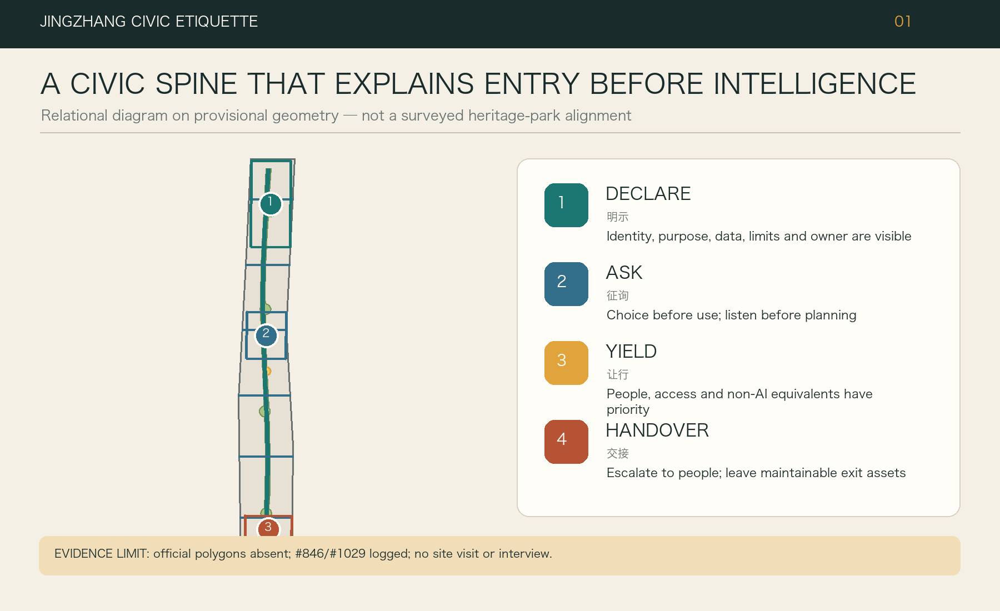
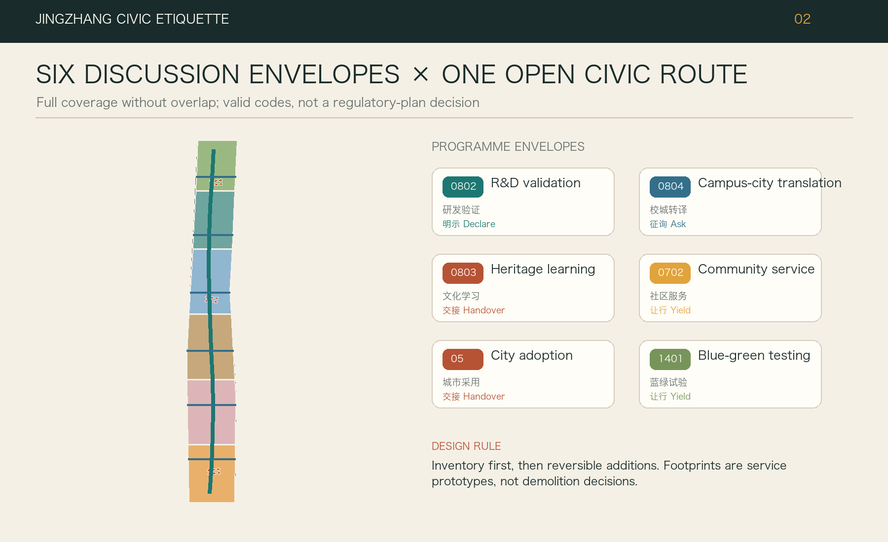
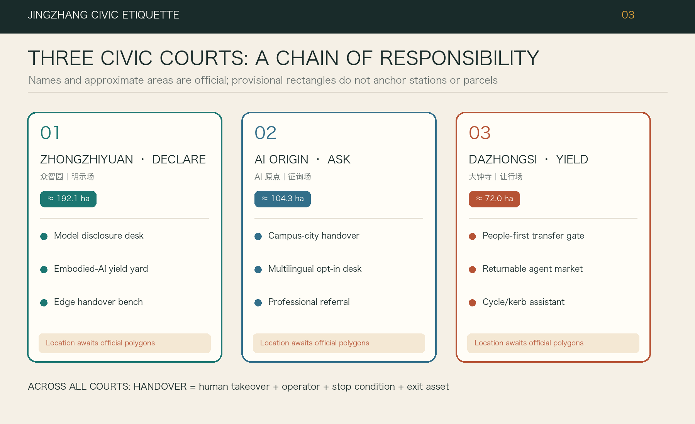
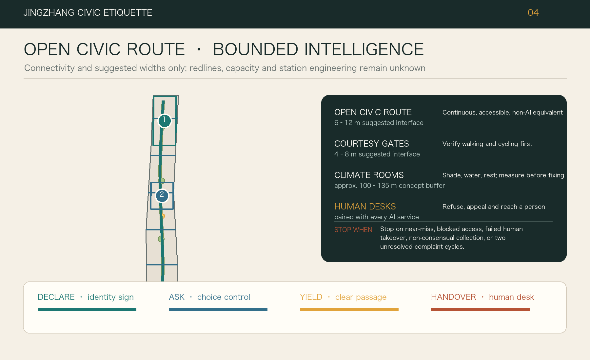
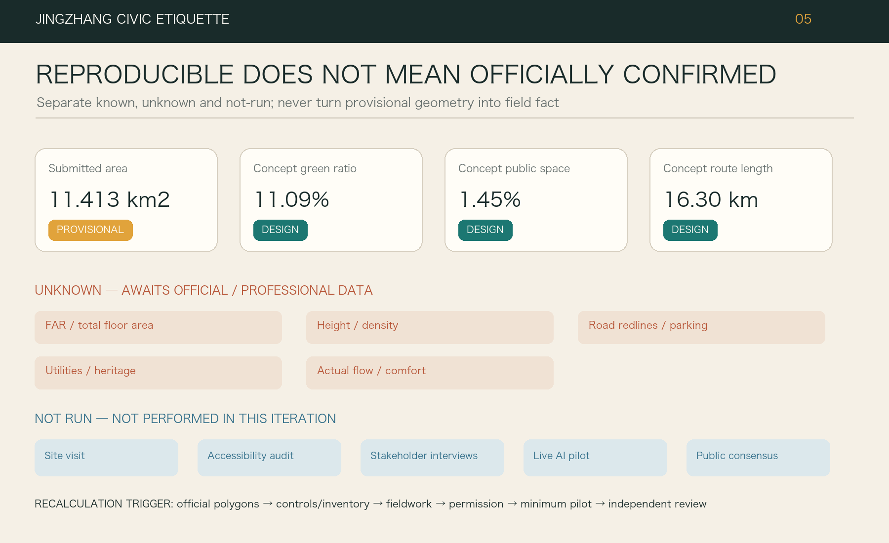

# JINGZHANG CIVIC ETIQUETTE: Teaching Intelligence How to Enter the City

**Subtitle: Keep the Civic Route Open; Make Intelligence Behave**

Jingzhang Civic Etiquette is not a proposal to place more screens, cameras, and robots in public space. It first specifies how an intelligent service may appear politely: make itself visible, ask before acting, yield space and attention, and return decisions to a person before failure becomes harm. The continuous, unconditional space of walking and civic life is the “open civic route.” A bounded test unit with a timetable, attendant, fallback, and exit condition is a “civic courtesy interface.” The interface is a service module governed by the four courtesies; it does not claim that usable railway sidings exist on this site.

## Design Basis and Source List

The proposal uses the public competition announcement, the AI-agent taskbook, and the repository-maintained site package as its working basis. The research area of about 43.6 square kilometres, the overall design area of about 11.4 square kilometres, and the three key areas totalling about 368.4 hectares are interpreted only at the hierarchy and magnitude stated in the announcement. The machine-readable overall boundary and key-area polygons are provisional constraints, not official redlines, and cannot support approval, acquisition, demolition, or precise regulatory conclusions. Module dimensions in this report are design suggestions; spatial quantities must be recalculated from the structured geometry when official polygons arrive.[source:OFFICIAL-ANNOUNCEMENT] [source:SITE-PACKAGE]

Two community checks are deliberately retained. Issue #846 reports that the provisional overall polygon does not intersect the Jing-Zhang Railway Heritage Park as mapped in OSM, with a reported nearest distance of about 412.5 metres. Issue #1029 reports that the centroid of `PROV-KEY-003` is about 2.26 kilometres from Dazhongsi Station and may sit closer to the Beijing North Station area. These are important anomaly signals, not official surveying results; OSM itself is background evidence only. We therefore neither move the geometry ourselves nor ignore the discrepancy. Obtaining the official overall and key-area polygons and checking their relationships to the station and heritage park is Phase Zero.[source:ISSUE-846] [source:ISSUE-1029]

The evidence set also includes the source registry, processed fact pack, allowed design space and enums, standards snapshots, package contract, compliance matrices, and self-check rules. Missing information is itself a design condition: existing buildings and ownership, statutory land use, FAR and height, road redlines, heritage controls, utilities, flood constraints, public-facility capacity, and traffic counts are unavailable. No site visit, accessibility audit, resident interview, merchant interview, or operator interview has been conducted. The personas in this proposal are hypotheses for testing, not testimony or public consensus.[source:SOURCE-REGISTRY] [depth:existing_conditions_diagnosis]

Every drawing uses three evidence states. Solid lines are design-generated moves that can be recalculated within the package; dashed lines are provisional constraints or links needing field verification; grey voids indicate missing information where no conclusion is allowed. The convention makes confidence visible before ambition. `SITE-001` is the recalculation surface, while the three key areas remain qualified indices rather than fabricated high-precision existing conditions.[data:geometry/site_boundary.geojson#SITE-001] [metric:site_area_sqm]

## Three-Level Scope Framework

The three scales are one chain of decisions rather than three disconnected visions. The coordinated research scale asks which industrial and public-value rules the Jingzhang innovation corridor needs. The overall-design scale translates those rules into continuous public space, land-use structure, mobility, and blue-green systems. The key-area scale asks who operates which module, at what size and timetable, with what acceptance and stop conditions. One principle passes through all three: everyday civic space remains the open civic route; an AI service earns permission only inside a recognisable, stoppable courtesy interface.[standard:PROJECT-OFFICIAL-ANNOUNCEMENT] [depth:three_level_scope_framework]

At the research scale, four courtesies—Declare, Ask, Yield, and Handover—form a shared interface for the innovation ecosystem. At the overall scale they become one continuous civic route, three types of courtesy ground, two service-and-feedback wings, and candidate east–west pedestrian stitches. Zhongzhiyuan focuses on technical validation, the Beijing AI Origin Community on translation and open collaboration, and Dazhongsi on urban adoption and operational receipts. A Zhongguancun-oriented wing supplies legal, testing, compute, and enterprise services; a Xiaoyue River-oriented wing returns environmental and use feedback. These are organisational concepts, not new planning redlines.[source:AGENT-TASKBOOK] [depth:overall_spatial_structure]

Every key-area action is registered through seven fields: place, user, minimum data, attendant, non-AI fallback, acceptance metric, and stop condition. The generic conceptual section targets a clear 4-metre pedestrian path and, where conditions permit, a separate 3-metre two-way cycle path. A basic courtesy interface is 6 by 18 metres, a higher-risk test yard 12 by 24 metres, a device-free threshold 1.5 metres deep, a 2-metre buffer between interface and civic route, and a 3 by 6 metre human-handover desk. These are not construction dimensions; they require official redlines, utilities, fire, and accessibility review.[data:geometry/public_space.geojson#PUBLIC-001] [standard:MOHURD-URBAN-DESIGN-MEASURES]

The workflow is “lock evidence, draw space, calculate metrics, then open scenarios.” A changed official boundary triggers a full rebuild of land use, mobility, public space, metrics, and drawings. A failed technology closes its courtesy interface without interrupting the civic route. That asymmetry is the resilience proposition: city life must not lose basic service because an experiment fails, and sunk cost cannot make an experiment irreversible.

## Coordinated Research Area: Industry and Future City Research

The innovation corridor should not measure advantage only through company counts or model benchmarks. It needs a complete chain of responsibility from research to urban adoption: research and compute supply; model and hardware validation; translation and open collaboration; scenario procurement and civic adoption; and the return of exit assets and lessons. Zhongzhiyuan supports validation and standardisation, the AI Origin Community supports translation across campus, firm, and street, and Dazhongsi tests adoption under everyday urban pressure. Public space is not a promotional showroom. It becomes available only when a scenario passes the four courtesies and leaves reusable interfaces, failure records, human procedures, and exit assets.[source:AGENT-TASKBOOK] [standard:PROJECT-AGENT-OPEN-CALL-TASKBOOK]

Industrial space is graded by openness rather than company size. Level 1 is the registration-free civic route: movement, seating, ordinary signage, and human service. Level 2 is a public demonstration courtesy interface using anonymous, low-risk interaction. Level 3 is an appointment-only trial with explicit consent, attendants, and deletion deadlines. Level 4 is closed professional validation inside controlled premises, with no spillover into public space. This gradient gives small teams affordable test access while ensuring that residents and visitors do not exchange personal data for basic urban rights. Performance therefore includes fallback availability, handover time, complaint closure, and exit-asset quality—not occupancy alone.[depth:municipal_new_infrastructure] [metric:public_space_ratio]

International cases are precedents for questions, not statutory evidence for Beijing. Amsterdam and Helsinki algorithm registers inspire disclosure.[source:CASE-NL-AMSTERDAM-ALGO] [source:CASE-FI-HELSINKI-AI-REGISTER] Singapore one-north and Barcelona 22@ show different mixtures of innovation space and ordinary urban fabric.[source:CASE-SG-ONE-NORTH] [source:CASE-BCN-22AT] Paris-Saclay and London’s Knowledge Quarter raise questions about coordination among research institutions, public transport, and long-term stewardship.[source:CASE-FR-PARIS-SACLAY] [source:CASE-UK-KQ] Their authority, land systems, demographics, and resources are not transferable wholesale. We retain only testable lessons: publish purpose and responsibility, preserve street continuity, bound experiments, and measure innovation through sustained operation rather than a one-off landmark.

The identity system follows the responsibility chain. One continuous dark civic route, three short courtesy interfaces, two bracket-like loops, and square buffer stops form the mark. Heritage rust references the railway, civic teal marks service, and safety amber is reserved for risk and stop states. The mark does not imitate a railway operator or use uncleared company logos. Ground thresholds, courtesy interface signs, attendant vests, and paper receipts take precedence over large screens and neon spectacle.

## Overall Design Area: Urban Renewal and Regulatory-Plan-Level Urban Design

The overall spatial strategy is “continuous civic route, stoppable courtesy interfaces, lateral stitches, three release gates.” The civic route first repairs continuity for walking, cycling, accessibility, and shade; queues, robots, delivery, and temporary events stay outside the clear path. Courtesy interfaces use demountable paving, canopy, power, and data connections at candidate underused edges, ground-floor setbacks, or park margins, without presuming demolition. Candidate lateral stitches are reviewed at an indicative 400–600 metre spacing, but their count and location require official road redlines, crossing safety, and observed flows.[data:geometry/roads.geojson#ROAD-001] [depth:overall_spatial_structure]

Three release gates connect construction and operation. Gate 1 is spatial safety: no obstruction of fire access, tactile paving, cycling, or evacuation; ordinary human use survives power loss. Gate 2 is data and service safety: minimum data, published purpose, retention, responsible party, and a non-AI path. Gate 3 is civic adoption: a small scheduled trial, user feedback, accessibility review, and professional sign-off before expansion. Failure at any gate returns the project to the previous state. Geometry in this package is a conceptual partition and reversible module system, not an approved regulatory plan.[data:geometry/land_use.geojson#LU-001] [standard:MOHURD-CONTROL-DETAILED-PLANNING]

The land-use model combines innovation and civic services, mixed activity, blue-green open space, public management, and mobility support. It is topology-complete within the provisional boundary and recalculable in one coordinate workflow. The proposal does not declare total floor area, FAR, height, density, setbacks, or final parking because official controls and an existing-building survey are absent. Small building footprints test spatial capacity and frontage only. Statutory land use, ownership, survey, heritage, utility, and geotechnical evidence must precede building-level retention, renovation, or replacement decisions.[data:geometry/buildings.geojson#BLDG-001] [metric:building_footprint_area_sqm]

Capacity is defined by keeping the civic route available, basic service intact, and human takeover possible—not by maximising devices. One 6 by 18 metre basic courtesy interface hosts one higher-risk interaction or two low-risk displays while reserving an attendant position, wheelchair turning, and paper information. Power, network, cooling, lighting, and drainage can be isolated and switched off. A fault in one courtesy interface must not disable a public-space segment.

## Detailed Design of Key Areas

The three key areas share one four-courtesy interface so that performance can be compared and modules replaced without pretending that provisional polygons are real parcels. Zhongzhiyuan is the “validation courtesy ground.” A Dispatch Pavilion publishes the object, model version, responsible organisation, and validity period. A 12 by 24 metre enclosed test yard, a 6 by 18 metre public demonstration courtesy interface, and a non-algorithmic advice desk test embodied safety and system provenance. Any Qinghe River interface remains removable until river, flood, and ecological controls are confirmed. Acceptance emphasises boundary violations, handover time, offline usability, and exit assets.[data:geometry/key_areas.geojson#PROV-KEY-001] [depth:three_key_area_detailed_design]

The Beijing AI Origin Community is the “translation courtesy ground.” Courtesy Interface Zero, an open-source contribution counter, device-free worktables, a 6 by 18 metre multilingual room, and a 3 by 6 metre human-handover desk translate laboratory language into a service that a non-specialist can understand. Campus, park, and street connections are first achieved through ordinary walking and legible signs, not facial-recognition gates. Before public trial, every project submits a purpose sheet, a risk sheet, a non-AI fallback, and exit documentation. Campus interfaces, active ground floors, and housing support remain pending ownership and operator interviews.[data:geometry/key_areas.geojson#PROV-KEY-002] [source:AGENT-TASKBOOK]

Dazhongsi is the “urban adoption courtesy ground.” It asks whether an intelligent service remains polite amid rail transfer, commerce, neighbourhood use, and peak movement. Candidate 4 by 8 metre waiting bays at the four station quadrants sit outside clear paths and connect through human-readable signs. A Receipt Bell Yard displays pass, pause, remediation, and exit status. Accessible transfer, cycle waiting, returnable markets, and content experiences start as short attended shifts. Because Issue #1029 raises a material location problem, this is a conceptual task mapping, not a station-engineering or parcel proposal.[data:geometry/key_areas.geojson#PROV-KEY-003] [source:ISSUE-1029]

Two supporting loops serve all three grounds. The supply loop connects legal, intellectual-property, testing, compute, and enterprise services. The feedback loop connects climate, drainage, maintenance, and everyday observation along Xiaoyue River and adjacent communities. These are routes to verify during fieldwork, not abstract “spillover” arrows. Each key area includes a “works without AI” counter, a current-status board, and a physical power-off and removal point; a closed trial leaves movement, seating, and human advice intact.

## AI Innovation Ecosystem, Personas, and AI+ Scenarios

“AI talent” is not treated as one young programmer. Eight provisional personas are used as design checks: nearby residents and older people; children and caregivers; disabled users; commuters and cyclists; university students, teachers, and researchers; start-ups, engineers, and auditors; international developers and families; small merchants, property managers, and frontline maintenance workers. These are hypotheses, not interviews. They must be revised through field observation, intercept conversations, accessibility co-review, and operator workshops. A scenario fails if it serves only confident smartphone users or withholds basic service from someone who declines data use.[source:AGENT-TASKBOOK] [depth:risk_missing_data]

The four courtesies are visible actions on every scenario card. **Declare** publishes purpose, data, retention, responsibility, version, and risk. **Ask** offers “use AI,” “human only,” and “watch only,” with no collection by default. **Yield** keeps devices, queues, sound, and robot movement in the courtesy interface, and downgrades around children, wheelchairs, or congestion. **Handover** keeps a human button, paper path, response time, and physical stop point visible. A public scenario missing any courtesy does not open.[data:geometry/public_space.geojson#PUBLIC-001] [standard:PROJECT-AGENT-OPEN-CALL-TASKBOOK]

| Card | Place and minimum space | Minimum data / attendant | Acceptance and stop condition |
| --- | --- | --- | --- |
| 01 Embodied-safety courtesy interface | Zhongzhiyuan, enclosed 12×24 m | Device state and anonymous incidents; engineer + safety officer | Advance after 20 violation-free shifts; boundary breach, lost connection, or handover over 30 seconds stops the shift |
| 02 Edge-model integration bench | Zhongzhiyuan, 6×18 m | Version, energy, fault code; platform engineer | Basic display works offline; any undeclared connection seals the interface |
| 03 Provenance counter | Dispatch Pavilion, 3×6 m | Published data list only; data steward | Every item traces to authority and deletion date; unknown origin blocks release |
| 04 Blue-green maintenance assistant | Qinghe/Xiaoyue candidate, 4×8 m | Environmental sensing, no faces; maintenance worker | Human-reviewed alerts support work; disruptive false alerts downgrade it to logging only |
| 05 Campus–park translation gate | AI Origin, 6×18 m | Voluntary project abstract; technical translator | A non-expert can restate purpose and risk; otherwise return to the lab |
| 06 Multilingual arrival desk | AI Origin, 3×6 m | User-selected language; bilingual attendant | Human and paper routes remain equal; rights-related mistranslation closes that language |
| 07 AI co-teaching room | AI Origin, indoor 12×24 m candidate | Course content, no child profile; teacher | Teacher controls and students may leave; manipulative output or unauthorised recording stops class |
| 08 Health/legal navigation | AI Origin, 6×18 m | Service topic only, no clinical/case file; professional referral | Navigation only—no diagnosis or adjudication; any such output stops the shift |
| 09 Four-quadrant accessible transfer | Dazhongsi candidate, 4×8 m bay | Anonymous count and volunteered question; mobility attendant | Tactile route stays clear; unverified routing or congestion removes navigation |
| 10 Returnable AI-native market | Dazhongsi, demountable 12×24 m | Existing transaction rules; market manager | Ordinary trading restored within one day; manipulative recommendation or price discrimination stops devices |
| 11 Cycle/curb waiting assistant | Lateral stitch, 4×8 m | Anonymous occupancy; site attendant | Walking–cycling conflict falls; obstruction or misdirection removes equipment |
| 12 Century dual-timeline guide | Corridor courtesy interface, 6×18 m | Cleared archives and daily programme; curator | Facts trace to sources and paper map works; uncleared or fabricated history comes down |
| 13 Xiaoyue climate waiting bay | Feedback wing, 4×8 m | Temperature, humidity, rainfall; community maintenance | Shade and drainage work without algorithms; added heat, glare, or ponding triggers removal |
| 14 City challenge courtesy interface | Rotating grounds, 12×24 m | Minimum data per brief; organiser + public observer | Fixed period and boundary; no human process and exit asset means no renewal |

Operation follows visible shifts, not a continuous black box. A suggested weekday has two mobility/accessibility shifts from 07:00–10:00, civic and enterprise service from 10:30–12:30, two appointment test shifts from 14:00–18:00, and cultural/daily-life experience from 18:30–21:00. After 21:00 the site clears, powers down, and verifies deletion tasks. Attendants inspect signs, boundaries, fallback, and emergency stop 15 minutes before each shift and publish a receipt within 30 minutes after. Saturday may host a half-day public review; Sunday defaults to maintenance. Real flows, noise, and community input must revise the timetable.[depth:phasing_implementation]

## Land Use, Building Scale, and Retain-Renovate-Demolish Strategy

The land-use model divides the provisional overall boundary into concept units without gaps or overlap. Its purpose is not to maximise development but to test whether the civic route, public space, innovation uses, and support functions can coexist in one topology. Allowed repository codes are used; green space, public space, and mobility are recalculated as cross-cutting design systems. Because the source geometry may be displaced, the result tests proportions and relationships only. It is not a statutory land-use amendment.[data:geometry/land_use.geojson#LU-001] [standard:MNR-LAND-USE-CLASSIFICATION-GUIDE]

Building decisions follow “usability audit before retain–renovate–demolish.” Once a survey is available, each building records structural safety, current use, ground-floor openness, heritage value, energy, accessibility, ownership, and tenant impact, then enters one of five categories: retain in use, light interface retrofit, performance repair, adaptive reuse, or conditional replacement. Without those records, no building receives a “demolish” label. Concept footprints only test room for courtesy interfaces, human counters, canopies, and service interfaces; their area is recalculable but does not describe existing or permitted buildings.[data:geometry/buildings.geojson#BLDG-001] [depth:retain_renovate_demolish]

Four interface prototypes connect buildings and streets. Type A is a 3×6 metre threshold box for disclosure, paper receipt, and human window. Type B is a 6×18 metre street courtesy interface for one low-risk public experience and a device-free waiting zone. Type C is a 12×24 metre enclosed yard for appointment-based physical-risk tests. Type D uses an indicative 6-metre structural bay to switch between classroom, demonstration, and service uses. All are demountable, shaded, low-glare, and independently switchable; after equipment leaves they become ordinary seating, market, or community work space.

Total floor area, FAR, height, density, setbacks, sunlight, and parking remain pending official controls. Character guidance is limited to public interfaces: readable ground floors, no algorithmic entrance barrier, and equipment that does not block heritage structures or ordinary sight lines. Any work near Qinghuayuan Station, Dazhong Temple, or other possible heritage assets requires an authoritative inventory, protection boundary, and specialist advice. Generated imagery is never archival evidence.[metric:floor_area_ratio] [depth:height_massing_character]

## Transport, Rail, Municipal Infrastructure, and Public Services

Mobility design protects ordinary travel before adding intelligence. The open civic route targets a continuous accessible 4-metre walking path, with a separate 3-metre two-way cycle path where feasible. Courtesy Interface entrances, robot standby, delivery, and queues remain outside both clear zones. Candidate east–west stitches are reviewed within an indicative 400–600 metre spacing and prioritise station entrances, ring-road crossings, campus–park interfaces, and the Dazhongsi quadrants. No new crossing, bridge, tunnel, or signal control is fixed before road redlines, timings, counts, and crash evidence are available.[data:geometry/roads.geojson#ROAD-001] [depth:traffic_rail_slow_parking]

Yield has physical dimensions. The courtesy interface threshold sits at least 2 metres from the civic route; amber ground lines contain device movement; an accessible waiting position targets 1.5 by 1.5 metres; paper signs still reach human service when networks fail. Transfer assistants use only professionally checked routes and never control signals or enforce rules. Embodied devices slow, stop, and hand over when boundaries are unclear, sensing is lost, a child enters, or crowding exceeds a locally tested threshold. The proposal does not invent that threshold.

Municipal support is plug-in, metered, and isolatable. Every courtesy interface concept has independently switchable power, network, cooling, drainage, and emergency stop but no promised capacity. High-energy training does not occupy open public space; edge devices handle low-risk inference or demonstration, while sensitive processing returns to compliant facilities. Canopy, lighting, sensors, seating, water, charging, toilets, and emergency call are designed together so that civic infrastructure is not reduced to a technology island. Utilities, flood, fire, noise, electromagnetic compatibility, and cyber-security remain formal prerequisites.[depth:municipal_new_infrastructure] [data:geometry/constraints.geojson]

Public service follows “one entrance, two paths, equal standard.” AI-assisted and human/paper routes share the same queue, accessibility, and complaint standard; declining consent never lowers service. Health and legal scenarios navigate and refer but do not diagnose or adjudicate. Talent and enterprise systems do not replace acceptance with algorithmic scoring. Safety tools assist logging and human review, not facial tracking or automated enforcement. The Barrier-Free Environment Law makes continuous facilities, information access, and consultation part of the next-stage verification baseline, but Article 39's retained on-site guidance and human handling are applied only to its listed medical, social-security, financial, and utility-payment matters. State Council policy document No. 45 of 2020 is background for parallel traditional and intelligent service paths; its 2020–2022 milestones are not represented as 2026 project duties.[standard:BARRIER-FREE-ENVIRONMENT-LAW] [standard:ELDERLY-SMART-TECH-PLAN-2020-45]

## Blue-Green Network, Public Space, and Urban Character

The blue-green network is infrastructure for comfort and resilience before it is a setting for devices. Continuous shade, permeable ground, rain paths, usable edges, and ordinary lighting come first; low-intrusion environmental sensing stays in a courtesy interface. Along Qinghe and Xiaoyue River, climate waiting, maintenance logging, and stormwater learning are only candidate interventions. No fixed structure or quantified hydrological benefit is claimed before river boundaries, flood levels, ecology, and maintenance responsibility are confirmed.[data:geometry/green_space.geojson#GREEN-001] [depth:blue_green_public_space]

Public space uses three repeatable sizes: a 4×8 metre waiting bay for transfer, accessibility, and cycle stopping; a 6×18 metre street courtesy interface for visible, rejectable low-risk experience; and a 12×24 metre yard for enclosed, attended professional testing. Each retains a device-free state: shaded seating, small market, or community courtyard after technology leaves. Material, ground stop, and colour distinguish civic route from courtesy interface without requiring a phone. Amber night lighting marks only risk edges and remains subject to field light and curfew testing.[data:geometry/public_space.geojson#PUBLIC-001] [metric:green_ratio]

Urban character follows “fewer devices, more receipts.” A century dual timeline uses archives, structures, and reviewed oral history: one side explains railway and urban change, the other publishes the version, contributors, failure, and exit of present experiments. Generated images never masquerade as history. Heritage rust, civic teal, rail grey, and safety amber carry the identity; the square buffer stop represents the human right to stop. QR codes are supplementary. Essential information stays on bilingual, legible physical signs.[standard:MOHURD-URBAN-DESIGN-MEASURES]

Green and public-space ratios in this package are design recalculations, not statutory targets. Official boundary, existing and planned green space, trees, and ownership data must distinguish retained, delivered, proposed, and temporary open space. Ecological continuity, shade hours, accessibility, and maintenance cost require specialist review. A courtesy interface that removes everyday seating, adds hard surface, or creates maintenance burden without demonstrable public value should leave first.

## Renewal Projects, Implementation Policy, and Phasing

Implementation starts with evidence rather than procurement. **Phase 0—Evidence lock:** obtain official polygons, conduct weekday/weekend and day/night fieldwork, accessibility co-review, resident and merchant interviews, ownership and operator checks, and resolve Issues #846/#1029. **Phase 1—Minimum reversible pilots:** one courtesy interface in each key area while the civic route receives only continuity, shade, and signage repair. **Phase 2—Evidence-based expansion:** only scenarios passing all three gates increase capacity. **Phase 3—Two-wing operation:** service supply, environmental feedback, and an annual public review. No phase asserts an unconfirmed year, budget, or government commitment.[data:geometry/phasing.geojson#PHASE-001] [depth:phasing_implementation]

Six first projects are proposed: E0 official geometry and base-map lock; E1 civic route and accessibility discontinuity audit; E2 Zhongzhiyuan Dispatch Pavilion and embodied-safety courtesy interface; E3 AI Origin Courtesy Interface Zero and translation gate; E4 Dazhongsi four-quadrant human signage and Receipt Bell Yard; E5 Xiaoyue climate waiting and maintenance co-review. E2–E5 are demountable and assume no demolition. Before opening, each needs six signed sheets: spatial permission, operator, human fallback, data list, insurance and emergency plan, and removal budget.[depth:renewal_project_list] [source:AGENT-TASKBOOK]

Four operational seats are suggested. The site host maintains space and ordinary opening. The professional attendant owns test safety and takeover. The data steward maintains purpose, consent, deletion, and version records. A rotating public observer seat is co-designed with accessibility advocates, residents, merchants, or independent evaluators. None has yet been interviewed; this is a proposed role, not participation already obtained. Complaints receive human acknowledgement before shift end, while serious safety, discrimination, privacy, or access incidents stop the shift immediately.

Policy should support reversible leases, limited spatial permission, open interfaces, and performance-based shift renewal, not permanent infrastructure locked to one supplier. A 90-day review checks civic route availability, human takeover, service quality after refusal, complaint closure, removal, and energy. Missing targets first reduce shifts, then require remediation; two failed cycles trigger exit. Exit is a deliverable: retain de-identified logs, interface specification, human process, material list, and review, while restoring ordinary public use within one day.

## Metrics, Area Recalculation, and Compliance Matrix

Metrics have three layers. Geometrically recalculable metrics include site area, green and public-space area and ratio, building footprint, road length, key-area count, and phase area. They use EPSG:4326 for exchange and an appropriate projected CRS for area. Pending official controls—FAR, height, density, setback, road redline, parking, and facility standards—remain unknown. Operational proposal metrics—disclosure completeness, fallback availability, handover time, stop execution, restoration time, complaint closure, and exit-asset completeness—need a real pilot baseline.[metric:site_area_sqm] [depth:metrics_recalculation]

Spatial acceptance requires a gap-free, non-overlapping land-use partition; green, public-space, and building footprints within the site; roads without boundary overshoot; and figures matching `metrics.json`. Courtesy acceptance requires physical disclosure, explicit choice, and a human path at every public scenario; an intact civic route after power loss; a suggested two-minute general human response and 30-second emergency stop/handover target for embodied systems; and ordinary use restored within 24 hours. The last targets are proposals to calibrate, not achieved performance.[metric:public_space_ratio] [metric:building_footprint_area_sqm]

Executable stop conditions include any undeclared data flow, accidental capture of children or sensitive information, discriminatory service, material error in route or health/legal information, robot boundary breach or lost connection, obstruction of accessibility or fire access, and failure to hand over for two consecutive shifts. Restart requires incident review, professional sign-off, and public notice, not an automatic reboot. A severe incident closes related courtesy interfaces using the same version or interface.

The task-coverage matrix maps announcement tasks 1.3, 1.4, and 1.5 plus agent.1–agent.6 to narrative, geometry, metrics, figures, and checks. Standards and design-depth matrices audit the professional references and fifteen depth items. “Complete” means the package provides the corresponding evidence object; it never means official data or approval exists. Spatial review, offline visual review, bilingual consistency, and participant preflight remain the final machine checks.[standard:MOHURD-CONTROL-DETAILED-PLANNING] [depth:risk_missing_data]

## Risk, Copyright, and Compliance

Boundary displacement is the highest risk. Issues #846 and #1029 suggest that provisional geometry may not represent the heritage park and Dazhongsi key area, so every location, distance, area, and project mapping must be recalculated after official polygons arrive. Missing regulatory, ownership, building, traffic, heritage, municipal, and flood evidence may invalidate concept modules. No fieldwork or interviews means the proposal may misunderstand everyday paths, accessibility, noise, business, and resident priorities. It does not say “residents need” or “the community supports” on anyone’s behalf.[source:ISSUE-846] [depth:risk_missing_data]

AI risks include privacy loss, purpose drift, discrimination, automation dependence, embodied harm, fabricated history, obsolescence, and supplier lock-in. Urban risks include privatisation of public space, digital exclusion, displacement pressure, event nuisance, abandoned maintenance, energy burden, and empty accountability. If a scenario actually provides generative-content services to the public in China, the applicability of the Interim Measures for Generative AI Services must be assessed against the real service, with a complaint/reporting entry, handling process, and feedback timeframe published. This proposal's “same-shift acknowledgement” is a design target, not a statutory numeric deadline, and it does not infer that every courtesy interface requires filing or has passed a security assessment. The four courtesies are a spatial–operational interface, not a substitute for law, professional assessment, or democratic process. Their value must be tested with real users and an enforceable right to stop. If people cannot understand the notice, the human path is nominal, or equipment still occupies the civic route, the design has failed.[standard:GENERATIVE-AI-INTERIM-MEASURES]

Text, generated geometry, diagrams, and identity are created for this proposal under the submission licence. Standards, announcement, case pages, OSM background, and fonts are registered with publisher, access date, use, limitation, and rights. No third-party map tiles, company logos, uncleared archival photographs, or resident portraits are copied. Offline HTML loads no remote script, map, font, iframe, form, or analytics and does not track reviewers. The English translation and every text-bearing figure have aligned counterparts without changing evidence status.[source:SOURCE-REGISTRY] [standard:PROJECT-OFFICIAL-ANNOUNCEMENT]

The proposal claims no government approval, public consensus, operator commitment, or investment. It never promotes provisional geometry to an official redline or design targets to statutory controls, and AI does not replace planning, mobility, fire, heritage, data protection, legal, medical, or accessibility professionals. Official geometry replacement, complete recalculation, field and stakeholder verification, professional sign-off, rights review, and a public stop-responsibility chain are prerequisites for further development.

## References

This is a human-readable entry list; complete provenance, licence, access date, limitation, and permitted use are recorded in `sources.json`. The announcement and taskbook define the task, the site package and processed fact pack organise structured evidence, and standards snapshots support professional checks. Community issues are anomaly signals only, and international cases are background comparison only. None may be promoted into an official Beijing boundary or statutory control.[source:SITE-PACKAGE] [source:SOURCE-REGISTRY]

- Beijing Municipal Commission of Planning and Natural Resources, Haidian Branch, public qualification announcement for the Century Jingzhang AI Innovation Corridor urban-design call (`OFFICIAL-ANNOUNCEMENT`).[source:OFFICIAL-ANNOUNCEMENT]
- `brief/site-package/`: task summary, allowed design space, provisional overall and key-area geometry, enums, ranges, and schemas; geometry entries are `BOUNDARY-SOURCE` and `KEY-AREA-SOURCE`.[source:BOUNDARY-SOURCE]
- `data/processed/agent_fact_pack.md` and its scope, requirement, source-use, and missing-data tables. It is navigation, not a new official fact source.[source:PROCESSED-FACT-PACK]
- AI Agent open-call taskbook and formal submission guide, used for scenario cards, personas, geometry, drawings, bilingual deliverables, and checks.[source:AGENT-TASKBOOK]
- GitHub Issues #846 and #1029, indexed as `ISSUE-846` and `ISSUE-1029`, are community checks concerning the provisional overall boundary, the heritage park, and Dazhongsi; pending official data and field verification.[source:ISSUE-846]
- Urban Design Administration Measures, regulatory detailed-planning guidance, national land-use classification guidance, and architectural design-depth requirements, together with the Interim Measures for Generative AI Services, the Barrier-Free Environment Law, and State Council policy document No. 45 of 2020, are indexed by `STANDARD-SNAPSHOTS` and remain subject to applicability, versions, and limitations in `standard_matrix.json`.[standard:MOHURD-URBAN-DESIGN-MEASURES]
- Official public materials for Amsterdam and Helsinki algorithm registers, Singapore one-north, Barcelona 22@, Paris-Saclay, and London’s Knowledge Quarter are indexed from `CASE-NL-AMSTERDAM-ALGO` and used only for comparison.[source:CASE-NL-AMSTERDAM-ALGO]
- `SUBMISSION-AUDIT-INDEX` is the machine-audit entry to `metrics.json`, `assumptions.json`, `compliance_matrix.json`, `standard_matrix.json`, `design_depth_matrix.json`, `self_check.json`, and `geometry/`. Read current geometry status with the figures, offline HTML, and A3/A0 drawings.[metric:green_ratio] [depth:existing_conditions_diagnosis]

The citation rule is “near the judgement, never as a dump.” Each paragraph carries only directly relevant anchors; exhaustive records remain in structured files. Every new source must be registered before use with publisher, title, URL or repository path, publication and access dates, licence, evidence tier, spatial applicability, and limitations. Material without traceable provenance or rights does not enter the formal package.
