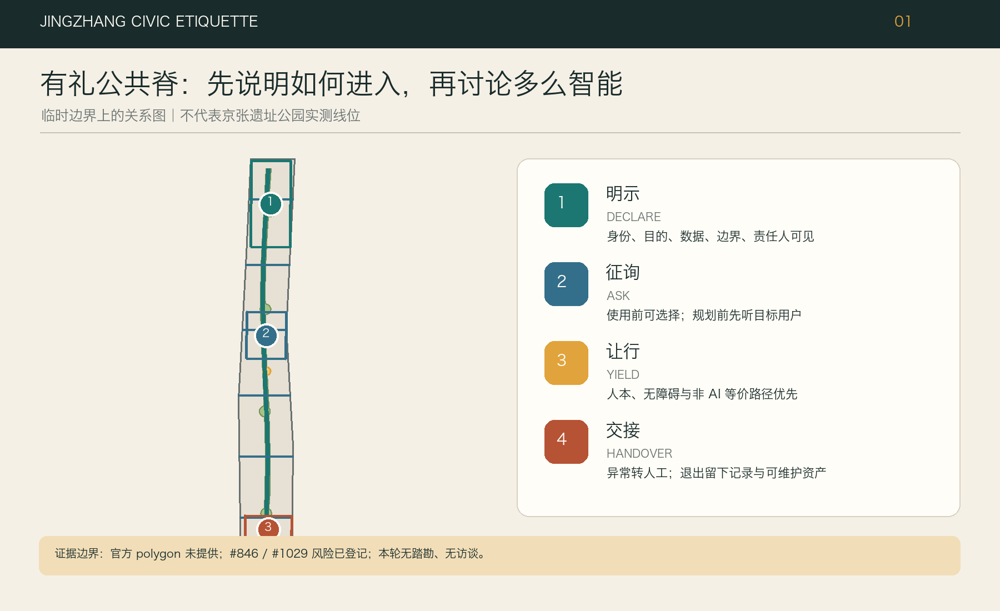
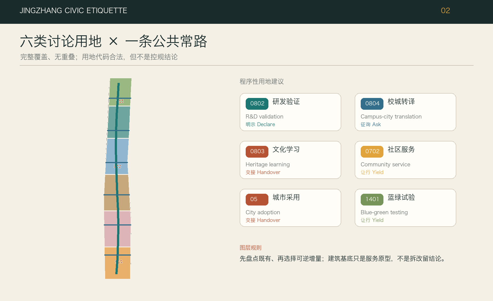
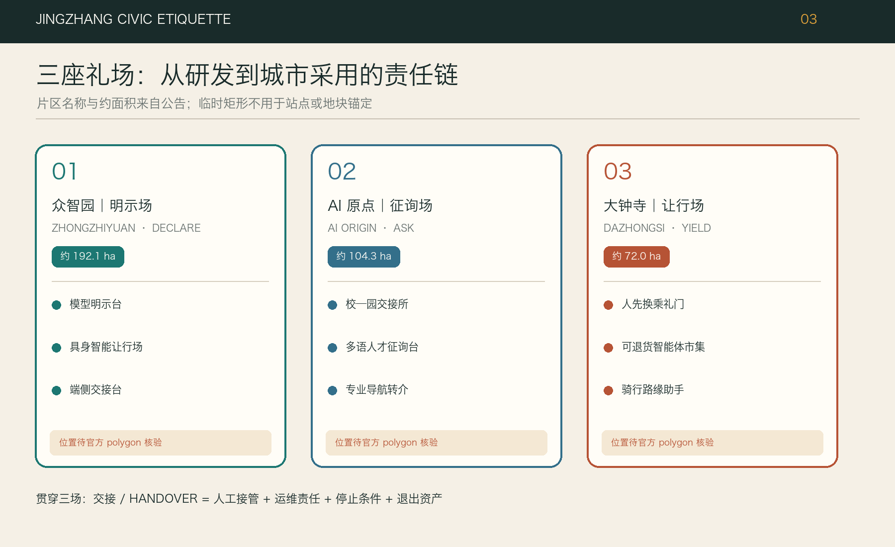
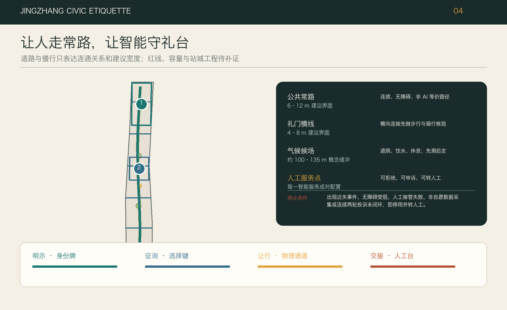
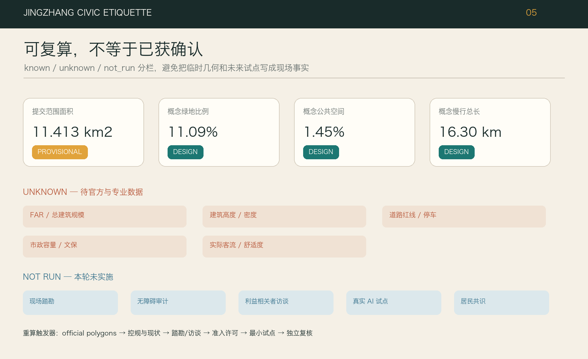

# 京张有礼：让智能学会进入城市

**副题：人走常路，智能守礼 / Keep the Civic Route Open; Make Intelligence Behave**

“京张有礼”不是把更多屏幕、摄像头和机器人塞进公共空间，而是先规定智能服务如何礼貌地出现：它要让人看见自己、先问是否需要、在道路与注意力上让行，并在失灵或越界前把决定交回人。方案把连续、无条件开放的日常步行与公共生活空间称为“人的常路”，把有边界、有班次、有值守、有退出条件的测试单元称为“有界礼台”。“礼台”是一种由四礼约束的城市服务模块，与场地是否存在真实铁路侧线无关。

## 设计依据与资料清单

方案以公开征集公告、面向智能体任务书和仓库维护的场地包为工作依据；研究范围约 43.6 平方公里、总体设计范围约 11.4 平方公里、三处重点区域合计约 368.4 公顷，仅按公告给出的层级与量级理解任务。当前机器可读的总体边界和重点区域均是临时约束范围（provisional constraint），不是官方红线，也不能支持审批、征拆或精确控规结论。正文所写的空间尺寸是设计模块建议，面积与比例则以结构化图层复算为准；官方 polygon 发布后，所有图层、指标和图纸应整体重算，而不是只替换一张底图。[source:OFFICIAL-ANNOUNCEMENT] [source:SITE-PACKAGE]

本方案特别保留两条社区校核意见。Issue #846 指出临时总体 polygon 与 OSM 所绘京张铁路遗址公园没有相交，报告的最近距离约 412.5 米；Issue #1029 指出 `PROV-KEY-003` 的质心据其计算约离大钟寺站 2.26 公里，可能更接近北京北站一带。这些都是值得追查的异常信号，不是官方勘界成果；OSM 也只能作背景参照。因此我们既不自行平移边界，也不借异常否定任务，而是把“取得官方总体边界与三处重点区 polygon、核对站点与遗址公园关系”列为零号前置工作。[source:ISSUE-846] [source:ISSUE-1029]

资料清单还包括来源登记表、处理后的事实包、允许设计空间与枚举、用地和城市设计标准快照，以及提交结构、合规矩阵与自检规则。缺失项同样属于设计依据：现状建筑及权属、法定用地、容积率和高度、道路红线、文保控制、市政管线、河道与防洪、公共设施容量、客流与交通调查均未提供。我们没有进行现场踏勘、无障碍审计、居民访谈、商户访谈或运营方访谈；文中的人物画像是待验证的服务假设，不能被引用为居民意见或公共共识。[source:SOURCE-REGISTRY] [depth:existing_conditions_diagnosis]

读图时采用三种状态：实线表示本次设计生成、可在本包内复算的空间动作；虚线表示临时约束或需现场核对的联系；灰色留白表示尚无资料、不能下结论。这个约定贯穿图件、HTML、A3 文册和 A0 展板，使读者先看到证据等级，再看到方案强度。边界面积由 `SITE-001` 复算，三处重点区只作索引，不把临时几何包装为高精度现状。[data:geometry/site_boundary.geojson#SITE-001] [metric:site_area_sqm]

## 三层范围工作框架

三层范围不是三套各说各话的愿景。统筹研究层回答“京张创新带需要什么样的产业与公共价值规则”；总体设计层回答“这些规则如何成为连续空间、功能分区、交通与蓝绿网络”；重点区域层回答“谁在何处、以多大模块、按什么班次运营，何时应停止”。三层之间以同一条原则贯通：日常公共空间永远是人的常路，AI 只能在可辨识的礼台中逐级获得权限。框架既回应公告的产业、更新、重点片区和实施任务，也把智能体任务书的场景、人才和治理要求转成可检查的空间界面。[standard:PROJECT-OFFICIAL-ANNOUNCEMENT] [depth:three_level_scope_framework]

在统筹研究层，“京张有礼”提出四礼——明示、征询、让行、交接——作为创新生态的共同接口。总体设计层把它们画成一条连续常路、三类礼场、两翼服务回路和若干东西向人行缝合点：常路不设使用门槛，礼台要经过可见门槛；北侧众智园偏向自主技术验证，中段北京 AI 原点社区偏向成果翻译和开放协作，南侧大钟寺偏向城市采用与运营回执；中关村相关服务资源形成供给翼，小月河及沿线社区形成环境和使用反馈翼。这里的“翼”与“礼台”都是组织方法，不是新增规划红线。[source:AGENT-TASKBOOK] [depth:overall_spatial_structure]

在重点区域层，每个空间动作必须完成“位置—对象—最小数据—值守者—非 AI 备选—验收指标—停止条件”七项登记。建议的通用空间截面为：连续步行净宽目标不小于 4 米；条件允许时另设 3 米双向骑行空间；AI 礼台从主通行面侧向退让，基础模块为 6×18 米，较大测试院为 12×24 米；入口设 1.5 米无设备等候带，操作界面与常路之间保留 2 米缓冲，人工交接桌按 3×6 米预留。以上均为概念尺寸，须在官方红线、消防、无障碍和管线条件取得后校核，不能直接用于施工。[data:geometry/public_space.geojson#PUBLIC-001] [standard:MOHURD-URBAN-DESIGN-MEASURES]

三层成果的传递采用“先锁证据、再画空间、后算指标、最后开场景”的顺序。若官方边界改变，先重建用地、道路和公共空间拓扑，再调整礼台位置；若仅某项技术未通过验收，则关闭该礼台而不影响常路通行。这个差异是方案的韧性核心：城市不应因为试验失败而失去基本服务，技术也不应靠占用公共空间来证明不可撤回的必要性。

## 统筹研究范围产业与未来城市研究

京张创新带的比较优势不应只用企业数量或模型参数表达，而应体现在“从研发到城市采用”的完整责任链。方案将产业生态分为五个可协作环节：研究与算力供给、模型和硬件验证、成果翻译与开源协作、场景采购与城市采用、退出资产与经验回流。众智园承担验证和标准化，北京 AI 原点社区承担跨校、跨企业翻译，大钟寺承担面向日常服务的采用与回执；沿线公共空间不是展示橱窗，而是只在满足四礼时才开放的共同检验场。每次试验结束都要留下接口说明、失败记录、人工流程和可复用部件，而不仅是活动照片。[source:AGENT-TASKBOOK] [standard:PROJECT-AGENT-OPEN-CALL-TASKBOOK]

产业空间按“开放程度”而非简单按企业规模分级。一级为无需注册的公共常路，包括通行、休憩、普通导视和人工服务；二级为公开演示礼台，允许匿名、低风险体验；三级为预约测试礼台，需要明确同意、值守和数据删除时限；四级为封闭专业验证，只能进入园区或室内合规环境，不得向公共空间外溢。这个梯度让小团队能以低成本获得试验机会，也让居民和访客不必用个人数据换取基本城市权利。产业服务指标因此不仅看入驻率，还看非 AI 备选可用率、人工接管时长、退出资产完整度与公共投诉闭环率。[depth:municipal_new_infrastructure] [metric:public_space_ratio]

国际案例仅作为制度与空间原型的启发，不作为北京的法定控制依据。阿姆斯特丹和赫尔辛基的算法登记启发“明示” [source:CASE-NL-AMSTERDAM-ALGO] [source:CASE-FI-HELSINKI-AI-REGISTER]；新加坡 one-north 与巴塞罗那 22@ 展示创新空间和城市街区的不同混合方式 [source:CASE-SG-ONE-NORTH] [source:CASE-BCN-22AT]；巴黎萨克雷和伦敦知识区则提示科研机构、公共交通与长期运营的协同 [source:CASE-FR-PARIS-SACLAY] [source:CASE-UK-KQ]。这些地区的治理权限、土地制度、人口结构和运营资源不能直接移植。我们只借用可验证的做法：公开用途和责任人、保持街道连续、让试验有边界、用长期运营而非一次性地标衡量创新。

品牌系统也服从这一责任链。标志由一条连续深色常路、三段短礼台、两个回路括号和方形止挡组成；锈红提示京张历史，城市青表示公共服务，安全琥珀只用于风险和停止状态。它不模仿铁路企业标识，也不使用未清权的历史照片或公司 Logo。品牌应用优先落在地面门槛、礼台铭牌、人工值守背心和纸质回执上，避免以大屏和霓虹制造“科技感”却增加能耗与视觉压迫。

## 总体设计范围城市更新与控规深度城市设计

总体空间策略可概括为“常路连续、礼台可停、横向缝合、三门放行”。常路优先补齐步行、骑行、无障碍和树荫连续性，不把临时活动、排队或设备停放压在净通行面上。礼台以可拆装的铺装、遮棚、电源与数据箱构成，尽量利用待更新空地、建筑首层退界或公园边缘节点，不预设拆迁。横向缝合点面向社区、校园、园区和轨道站口，概念性间距以 400—600 米为复核目标，但实际数量和位置必须在道路红线、过街条件与客流调查后确定。[data:geometry/roads.geojson#ROAD-001] [depth:overall_spatial_structure]

“三门放行”把建设与运营连起来。第一门是空间安全：不侵占消防、盲道、骑行和疏散，断电后仍可人工使用；第二门是数据与服务安全：最小化采集，给出目的、保留期、责任人和非 AI 路径；第三门是公共采用：以真实班次进行小规模试用，经使用者反馈、无障碍复核和专业评审后才扩容。任一门失败，动作退回上一级，不以已经投入成本为继续运行的理由。空间图层表达的是概念分区与可撤场模块，不代替控规用地或建设审批。[data:geometry/land_use.geojson#LU-001] [standard:MOHURD-CONTROL-DETAILED-PLANNING]

用地结构建议由创新研发与公共服务、混合活力、蓝绿开放空间、公共管理与交通支撑等类型共同组成，连续覆盖当前临时设计边界并以统一坐标复算。设计不提出总建筑量、容积率、建筑高度、建筑密度或退线的确定值，因为缺少官方控规和现状建筑底图；建筑图层中的小尺度基底仅服务于空间容量和界面示意。正式深化前应取得法定用地、权属、现状测绘、文保、市政和工程地质条件，逐地块完成保留、修缮、改造和新建判断。[data:geometry/buildings.geojson#BLDG-001] [metric:building_footprint_area_sqm]

承载力不以“能放多少设备”为主，而以常路不受损、公共服务不降级、人员可以接管为底线。每个 6×18 米基础礼台默认只容纳一种高风险交互或两种低风险展示，同时保留至少一名值守者的位置、轮椅回转和纸质说明。设备供电、网络、散热、夜间照明和雨棚均采用可独立关闭的接口；一处故障不应拖累整段公共空间。该容量建议仍需消防、电力、通信与环境专业复核。

## 重点区域详细设计

三处重点区域以同一套四礼接口形成可比较、可替换的详细设计，不把临时 polygon 当作真实地块。众智园定义为“验证礼场”：入口的调度亭公开测试对象、模型版本、责任单位和有效期，内部设置 12×24 米封闭验证院、6×18 米公开演示礼台和不依赖算法的人工咨询台；清河侧只提出可逆的蓝绿维护与低碳监测原型，在河道蓝线、防洪和生态条件确认前不落固定设施。验收重点是越界率、人工接管时间、设备离线后的空间可用性和退出资产完整度。[data:geometry/key_areas.geojson#PROV-KEY-001] [depth:three_key_area_detailed_design]

北京 AI 原点社区定义为“翻译礼场”：以近校成果从实验语言转为市民可理解服务为核心。建议布置“零号礼台”小院、开源贡献柜台、无屏工作桌、6×18 米多语言体验间和 3×6 米人工交接桌；校园、园区与街区的联系首先靠连续步行和清楚导视，不以刷脸门禁制造新障碍。每个成果在进入公共体验前，要交付一页用途说明、一页风险说明、一个非 AI 备选和一套退出文件。是否涉及具体校园接口、首层业态或居住配套，须在权属与运营访谈后深化。[data:geometry/key_areas.geojson#PROV-KEY-002] [source:AGENT-TASKBOOK]

大钟寺定义为“城市采用礼场”：重点检验智能服务能否在轨道、商业、社区和日常通行压力下保持礼貌。建议在站点四象限分别预留不侵占净通行面的 4×8 米等候湾，并以人工可读导视串联；“回执铃院”集中展示每项服务的通过、暂停、整改和退出状态。无障碍换乘、骑行等候、可退货市场与内容体验均先从有人值守的短班次开始。由于 Issue #1029 对临时重点区位置提出严重疑问，本区所有定位都属于概念任务映射，不能据此确定站口工程或地块项目。[data:geometry/key_areas.geojson#PROV-KEY-003] [source:ISSUE-1029]

三个场地共用两类辅助回路：中关村方向的供给回路连接法务、知识产权、测试、算力和企业服务；小月河方向的反馈回路连接气候、雨洪、养护和日常使用观察。它们不是“产业外溢”的抽象箭头，而是要在后续踏勘中逐项确认的服务路径。每个重点区设置一处“无智能也能办”柜台、一块当日状态牌和一个物理断电/撤场点；任何试验关闭后，原有通行、休息与人工咨询保持可用。

## AI 创新生态、人才画像与 AI+ 场景

本方案不把“AI 人才”想象成单一青年程序员。待验证的八类画像包括：沿线居民与长者、儿童和照护者、残障使用者、通勤者与骑行者、高校师生与研究者、初创团队和工程审计者、国际开发者及家庭、小商户与一线物业养护人员。它们是设计检查清单，不是访谈结论；后续必须以现场观察、拦截访谈、无障碍共评和运营方工作坊修正。任何场景若只服务熟练智能手机用户，或把拒绝授权者排除在基本服务外，即不通过“有礼”验收。[source:AGENT-TASKBOOK] [depth:risk_missing_data]

四礼是每张场景卡的四个可见动作。**明示 / Declare**：入口牌同时写服务目的、数据项、保留期、责任人、版本和风险等级；**征询 / Ask**：人先选择“使用 AI、仅人工、只观看”，默认不采集；**让行 / Yield**：设备、机器人、排队与声音都退到礼台，不占人的常路，遇儿童、轮椅和拥挤自动降级；**交接 / Handover**：界面上始终有人工按钮、纸质路径、接管时限和撤场触点。四礼缺一，场景不能对公众开放。[data:geometry/public_space.geojson#PUBLIC-001] [standard:PROJECT-AGENT-OPEN-CALL-TASKBOOK]

| 场景卡 | 地点与最小空间 | 最小数据 / 值守 | 验收与停止条件 |
| --- | --- | --- | --- |
| 01 具身安全礼台 | 众智园，12×24 米围合院 | 设备状态与匿名事件；测试工程师+安全员 | 连续 20 班无越界再转公开演示；越界、失联或人工接管超过 30 秒立即停班 |
| 02 边缘模型装配台 | 众智园，6×18 米 | 版本、能耗、故障码；平台工程师 | 离线仍可完成基本演示；出现未登记网络连接即封存接口 |
| 03 数据来历柜台 | 众智园调度亭，3×6 米 | 只展示数据清单；数据管理员 | 每项数据可追到授权与删除日；来源不明即不上线 |
| 04 蓝绿养护助手 | 清河/小月河候选点，4×8 米 | 环境传感、不采人脸；养护员 | 报警经人工复核准确且不妨碍养护；误报影响作业即降级为记录工具 |
| 05 校园—园区翻译门 | 原点社区，6×18 米 | 自愿提交成果摘要；技术翻译员 | 非专业访客能复述用途与风险；不能解释即退回实验室 |
| 06 多语言人才到达台 | 原点社区，3×6 米 | 用户主动选择语言；双语值守 | 人工和纸质路径同等可用；翻译涉及权利误导即停用对应语种 |
| 07 AI 共教室 | 原点社区，12×24 米室内候选 | 课程资料，不建未成年人画像；教师 | 教师全程控制、学生可退出；诱导性输出或越权记录立即停课 |
| 08 健康/法律导航台 | 原点社区，6×18 米 | 只收服务事项，不存病历/案情；专业转介员 | 只导航、不诊断不裁决；出现诊断、承诺或错误转介即停班 |
| 09 四象限无障碍换乘助手 | 大钟寺候选站口，4×8 米等候湾 | 匿名流量与主动问询；交通协管/志愿者 | 不占盲道、人工指路可用；拥堵或路线未核实即撤下导航 |
| 10 可退 AI 原生市集 | 大钟寺，12×24 米轻棚 | 交易按既有规则；市场经理 | 摊位一天内可恢复普通经营；诱导推荐或价格歧视即停机 |
| 11 骑行路缘等候助手 | 常路横向缝合点，4×8 米 | 匿名占用状态；现场管理员 | 骑行和步行冲突下降；设备占道或误导通行立即移除 |
| 12 百年双时间线导览 | 沿线礼台，6×18 米 | 清权史料与当日活动；策展值守 | 史实可追溯且可用纸图；史料未清权或生成伪史即下线 |
| 13 小月河气候候车亭 | 反馈翼，4×8 米 | 温湿度、雨量；社区养护员 | 遮阴排水优先于算法；设备造成热负荷、眩光或积水即撤场 |
| 14 城市挑战礼台 | 三地轮换，12×24 米 | 依题目最小化登记；主办方+居民观察员 | 只在限定时段和范围运行；无法交付人工流程与退出资产则不续期 |

运营按“班次”而非全天候黑箱运行。建议工作日 07:00—10:00 开两班交通与无障碍辅助，10:30—12:30 开企业与公共服务班，14:00—18:00 以预约方式开两班测试，18:30—21:00 开文化与生活体验；21:00 后清场、断电、核对删除任务。每班开始前 15 分钟由值守者完成明示牌、物理边界、人工通道和急停检查，结束后 30 分钟发布回执。周六可设半日公众共评，周日默认维护。具体时段需根据真实客流、噪声和居民意见调整，不能视为既定运营承诺。[depth:phasing_implementation]

## 用地、建筑规模与拆改留方案

用地方案把当前临时总体边界完整分割为若干概念用途单元，核心不是追求高开发量，而是保证常路、公共空间、创新功能和必要支撑在同一拓扑中相容。用地代码采用仓库允许枚举，面状图层须无自交、无重叠、无缝隙并全部落在 `SITE-001` 内；绿地、公共空间和道路作为跨用地的设计系统另行复算。由于临时边界存在明显位置疑问，分区只能用于检验方案比例与组织逻辑，不是法定用地调整建议。[data:geometry/land_use.geojson#LU-001] [standard:MNR-LAND-USE-CLASSIFICATION-GUIDE]

建筑策略采用“先可用性审计、后拆改留分类”。取得现状测绘后，逐栋记录结构安全、使用状态、首层开放可能、历史价值、能耗、无障碍、权属和租户影响，再分为保留使用、轻改接口、性能修缮、功能转换、条件性更新五类；在这些资料缺失时，不使用“拆除”标签。概念建筑基底只测试礼台模块、人工柜台、雨棚和服务空间能否被容纳，面积可复算但不代表现状或建设许可。[data:geometry/buildings.geojson#BLDG-001] [depth:retain_renovate_demolish]

四类接口原型帮助建筑与公共空间协同：A 型“门槛盒”3×6 米，容纳明示牌、纸质回执和人工窗口；B 型“街边礼台”6×18 米，容纳一个公开体验和无设备等候带；C 型“测试院”12×24 米，用于有物理风险的预约验证；D 型“共享首层”以 6 米结构开间为概念模数，形成可切换的教室、路演和服务空间。它们均应采用可拆构件、低眩光照明、遮阴和独立断电，设备撤走后可成为普通座椅、摊位或社区工作桌。

总建筑规模、容积率、高度、密度、退线、日照和停车配建均列为待官方条件补齐。风貌建议只控制公共界面：沿常路保持首层可读、入口不设算法门槛，礼台设备不高于主要步行视线且不得遮挡历史构筑物；涉及清华园火车站、大钟寺及其他潜在文保对象时，必须先取得权威名录、保护范围与专业意见。任何“历史再现”不以生成图像替代档案证据。[metric:floor_area_ratio] [depth:height_massing_character]

## 交通、轨道、市政与公共服务设施

交通设计先保障普通通行，再谈智能辅助。人的常路按连续无障碍步行净宽目标 4 米组织，条件允许时配置 3 米双向骑行带；礼台入口、机器人待命位、取送货和排队均不得侵入这两条净通行带。东西向缝合点的建议核查半径为 400—600 米，并优先检查轨道站口、环路跨越、校园园区接口和大钟寺四象限，但在取得道路红线、信号配时、流量和事故数据前，不确定新增过街或桥隧工程。[data:geometry/roads.geojson#ROAD-001] [depth:traffic_rail_slow_parking]

“让行”在交通界面有可量化的物理表达：礼台门槛退离常路至少 2 米，设备移动范围以地面琥珀边界封闭，轮椅等候位净尺寸建议 1.5×1.5 米，纸质导视在断网状态仍能指向人工服务。无障碍换乘助手只提供经交通专业核对的路线，不做信号控制或执法；具身设备遇到边界不清、传感失联、儿童进入或人流密度超过现场阈值时，降速、停机并由人接管。阈值须通过现场实验和主管部门要求确定，不能由本方案臆设。

市政采用“可插拔、可计量、可隔离”的服务脊柱。每个礼台预留独立电源、网络、散热、排水和急停，但不承诺容量；高耗能算力原则上不放入开放空间，端侧设备只承担低风险推理或演示，训练和敏感处理回到合规设施。雨棚、照明和传感器与普通座椅、饮水、充电、卫生间、应急呼叫等公共服务共同设计，避免建设只服务技术展演的专用岛。管线、防洪、消防、噪声、电磁兼容和网络安全资料缺失，均是深化前置条件。[depth:municipal_new_infrastructure] [data:geometry/constraints.geojson]

公共服务坚持“同入口、双路径、同标准”：同一事项既有 AI 辅助，也有人工或纸质路径；两者使用同一排队、无障碍和投诉标准，拒绝授权不降低服务等级。健康和法律场景只做信息导航和专业转介，不诊断、不裁决；人才和企业服务不得以算法评分替代受理；公共安全场景只辅助事件归档和人工复核，不做人脸追踪或自动执法。无障碍法关于连续设施、信息交流和意见征询构成下一阶段核验底线，但第39条“现场指导、人工办理”只按其列举的医疗健康、社会保障、金融业务和生活缴费等事项理解；国办发〔2020〕45号仅作为传统/智能服务并行的背景参照，其2020—2022阶段目标不写成2026年项目义务。[standard:BARRIER-FREE-ENVIRONMENT-LAW] [standard:ELDERLY-SMART-TECH-PLAN-2020-45]

## 蓝绿空间、公共空间与城市风貌

蓝绿系统不是给设备提供漂亮背景，而是人的常路保持舒适和韧性的基础。方案以连续树荫、透水地面、雨水路径、可停留边缘和普通照明为先，再把低侵入的环境感知放入礼台。清河与小月河相关动作只提出候选的气候等候、养护记录和雨洪科普节点；在河道蓝线、防洪水位、生态敏感性和养护权责取得前，不设置固定构筑物，也不声称改善了具体水文指标。[data:geometry/green_space.geojson#GREEN-001] [depth:blue_green_public_space]

公共空间由三种尺度组成：4×8 米“等候湾”处理换乘、无障碍与骑行停靠；6×18 米“街边礼台”处理可看、可拒绝的低风险体验；12×24 米“礼台院”处理需围合和值守的专业测试。三种空间都必须保留无设备状态：撤走技术后分别成为遮阴座椅、小型市集或社区活动院。常路与礼台之间用材质、地面止挡和色彩区分，不依赖手机才能理解；夜间琥珀灯只标风险边缘，照度与熄灯时间须经现场光环境测试。[data:geometry/public_space.geojson#PUBLIC-001] [metric:green_ratio]

城市风貌以“少设备、多回执”为原则。历史叙事由档案、构筑物和人的口述共同校验，设置“百年双时间线”时，一侧讲铁路与城市变迁，另一侧公开当代试验的版本、贡献者、失败和退出；不让生成式图像冒充史料。标识使用锈红、城市青、轨道灰和安全琥珀，方形止挡代表人的停止权。二维码只能作为补充，核心信息必须在实体牌上以中英双语、易读字号和图形提供。[standard:MOHURD-URBAN-DESIGN-MEASURES]

绿地率和公共空间比例是本包几何的设计复算值，不是法定指标。正式方案要在官方边界、现状绿地、规划绿地、树木和产权资料到位后区分“现状保留、规划落实、设计新增、临时开放”，并对生态连通、遮阴时长、无障碍和养护成本做专业评估。若礼台占用日常休息空间、增加硬化或维护负担而无明确公共收益，应优先撤场。

## 更新项目清单、实施政策与分期计划

实施从零号阶段开始，而不是从采购设备开始。**阶段 0：证据锁定**，取得官方总体与重点区 polygon，完成不少于工作日/周末、白天/夜间的现场踏勘，无障碍共评、居民和商户访谈、权属与运营核查，并校正 Issue #846/#1029；**阶段 1：最小可逆试点**，三个重点区各开一个礼台，常路只做通行、遮阴和导视补缺；**阶段 2：有证据扩展**，仅扩展通过三门验收的场景；**阶段 3：双翼常态运营**，形成服务供给、环境反馈和年度公开复盘。阶段不绑定未经确认的年份、资金或政府承诺。[data:geometry/phasing.geojson#PHASE-001] [depth:phasing_implementation]

首批六个更新项目为：E0 官方边界与现状底图锁定；E1 连续常路与无障碍断点审计；E2 众智园调度亭和具身安全礼台；E3 原点社区零号礼台和成果翻译门；E4 大钟寺四象限人工导视与回执铃院；E5 小月河气候等候及养护共评。E2—E5 均采用可拆模块，不以拆迁为前提。每项开工前需要“空间许可、运营主体、人工路径、数据清单、保险与应急、撤场预算”六张签字单，缺一不开场。[depth:renewal_project_list] [source:AGENT-TASKBOOK]

运营责任建议分为四席：场地主理席负责空间和日常开放；专业值守席对测试安全与接管负责；数据责任席维护用途、授权、删除和版本记录；公共观察席由轮换的无障碍代表、居民、商户或独立评估者组成。当前尚未访谈这些群体，故“公共观察席”只是需要共同设计的席位，不能写成已有参与或授权。投诉在当班结束前收到人工回执，严重安全、歧视、隐私或通行事件立即触发停班。

政策工具优先支持可逆租赁、短期空间许可、开放接口和按绩效续班，不为单一技术锁定永久建设。续期每 90 天评审一次，检查常路可用率、人工接管、拒绝授权后的服务质量、投诉闭环、设备撤场和能源消耗；未达标先缩班，再整改，连续两期不达标退出。退出不是失败遮掩，而是正式成果：保留去标识化日志、接口规范、人工流程、材料清单与复盘，空间在一日内恢复普通公共用途。

## 指标体系、面积复算与合规矩阵

指标分三层。第一层是几何可复算指标：总体设计边界面积、绿地面积与比例、公共空间面积与比例、建筑基底面积、道路长度、重点区数量和分期面积；这些值由 EPSG:4326 交换、适当投影复算，并与 GeoJSON 一致。第二层是待官方条件指标：容积率、高度、密度、退线、道路红线、停车和设施标准，保持 unknown。第三层是运营建议指标：明示牌完整率、非 AI 路径可用率、人工接管时间、停止执行率、撤场恢复时间、投诉闭环和退出资产完整度，须在真实试点后形成基线。[metric:site_area_sqm] [depth:metrics_recalculation]

空间验收要求包括：用地面完整覆盖当前设计边界且无缝隙重叠；绿地、公共空间和建筑基底全部在边界内；道路没有越界悬空；图上比率与 `metrics.json` 计算一致。四礼验收要求包括：100% 公开场景有实体明示、明确选择和人工路径；常路净通行在设备断电时仍成立；一般场景人工响应建议不超过 2 分钟，具身安全场景急停与接管目标不超过 30 秒；撤场后 24 小时内恢复普通用途。后两项是待试验校准的设计目标，不是当前已达成业绩。[metric:public_space_ratio] [metric:building_footprint_area_sqm]

每张场景卡还要给出可执行停止条件：未经登记的数据流、儿童或敏感信息被意外记录、歧视性差异服务、路线或健康法律信息存在重大错误、机器人越界或失联、设备阻塞无障碍与消防、连续两班无法完成人工交接，任一发生即停班。恢复必须经过事件复盘、专业责任人签字和公共说明，不能靠重启设备自动恢复。严重事件应关闭同版本同接口的关联礼台，避免把问题局限成“个别点位故障”。

任务覆盖矩阵逐条连接公告 1.3、1.4、1.5 与 agent.1—agent.6，专业标准矩阵和设计深度矩阵分别核对标准与 15 项深度要求。矩阵显示“complete”仅表示本包提供了对应叙述、图层和图件，不表示官方数据缺口消失或专业审批完成。最终以空间复核、视觉离线复核、双语一致性和 participant preflight 的机器结果为准。[standard:MOHURD-CONTROL-DETAILED-PLANNING] [depth:risk_missing_data]

## 风险、版权与合规说明

最高风险是边界错位：Issue #846 与 #1029 说明当前 provisional geometry 可能无法代表遗址公园与大钟寺重点区，因而所有位置、距离、面积和项目映射都要在官方 polygon 到位后重算。第二类风险是缺少控规、权属、建筑、交通、文保、市政和防洪数据，可能使概念模块与真实条件冲突。第三类风险来自尚未踏勘、未访谈：方案可能误解日常路径、无障碍障碍、噪声、商户经营和居民优先事项。我们不以“社区需要”“居民欢迎”等措辞替任何人发言。[source:ISSUE-846] [depth:risk_missing_data]

AI 风险包括隐私泄露、用途漂移、歧视、自动化依赖、具身设备伤害、生成伪史、技术快速过时和供应商锁定；城市风险包括公共空间商业化、数字排斥、绅士化压力、活动扰民、运维烂尾、能源负担和责任空转。若某场景实际向境内公众提供生成式内容服务，应按具体服务核验《生成式人工智能服务管理暂行办法》的适用性，并公开投诉举报入口、处理流程和反馈时限；本方案建议的“当班回执”是设计目标，不是该办法规定的数字期限，也不推定所有礼台都须备案或完成安全评估。四礼只是一套空间—运营接口，不能替代法律审查、专业评估和民主程序。其有效性要靠真实使用者共评与可执行的停班权验证；若明示牌无人理解、人工路径名存实亡或常路仍被设备占用，就应承认设计失败并整改。[standard:GENERATIVE-AI-INTERIM-MEASURES]

版权方面，文字、结构化几何、图表和标志由本次方案生成并按提交许可展示；外部标准、公告、案例网页、OSM 背景与字体分别登记来源、访问日期、用途、限制和许可。方案不复制第三方地图瓦片、商业 Logo、未清权历史照片或居民肖像；离线 HTML 不加载远程脚本、地图、字体、iframe、表单和分析工具，也不追踪评审行为。双语文本与含文字图件提供一一对应版本，但译文不改变证据等级。[source:SOURCE-REGISTRY] [standard:PROJECT-OFFICIAL-ANNOUNCEMENT]

本方案不声称获得政府批准、居民共识、运营方承诺或投资安排，不把临时边界称为官方红线，不把设计建议称为法定指标，也不让 AI 取代规划、交通、消防、文保、数据保护、法律、医疗或无障碍专业人员。进入下一阶段的必要条件是：官方几何替换、全量重算、现场与利益相关者核验、专业会签、版权复核和公开的停班责任链。

## 参考资料

以下清单是便于人工阅读的入口；完整的来源元数据、许可、访问日期、限制和允许用途以 `sources.json` 为准。公告和任务书用于理解任务，场地包与 processed fact pack 用于组织结构化证据，标准快照用于专业核对；社区 Issues 只用于提示异常，国际案例只用于背景比较，均不得越级成为北京的法定控制或官方边界。[source:SITE-PACKAGE] [source:SOURCE-REGISTRY]

- 北京市规划和自然资源委员会海淀分局：《百年京张 AI 创新带城市设计国际方案征集资格预审公告》；本包索引为 `OFFICIAL-ANNOUNCEMENT`。[source:OFFICIAL-ANNOUNCEMENT]
- `brief/site-package/`：设计任务摘要、允许设计空间、临时总体与重点区几何、枚举、范围和 schema；临时几何来源为 `BOUNDARY-SOURCE` 与 `KEY-AREA-SOURCE`。[source:BOUNDARY-SOURCE]
- `data/processed/agent_fact_pack.md` 及其范围、任务、来源用途和缺失数据表；这些是导航层，不创造新的官方事实。[source:PROCESSED-FACT-PACK]
- 面向 AI Agent 的开源征集任务书及 formal submission guide；用于场景卡、人才画像、图层、图纸、双语与自检要求。[source:AGENT-TASKBOOK]
- GitHub Issue #846、#1029：关于临时总体范围与遗址公园、大钟寺重点区位置关系的社区校核意见；索引 `ISSUE-846` 与 `ISSUE-1029`，尚待官方数据和现场复核。[source:ISSUE-846]
- 《城市设计管理办法（试行）》、控制性详细规划相关要求、国土空间调查规划用途管制用地用海分类指南、建筑工程设计文件编制深度规定；以及《生成式人工智能服务管理暂行办法》《中华人民共和国无障碍环境建设法》、国办发〔2020〕45号适老政策；登记入口 `STANDARD-SNAPSHOTS`，以 `standard_matrix.json` 的适用边界、版本和限制为准。[standard:MOHURD-URBAN-DESIGN-MEASURES]
- 阿姆斯特丹与赫尔辛基算法登记、新加坡 one-north、巴塞罗那 22@、巴黎萨克雷、伦敦知识区的官方公开材料；索引包括 `CASE-NL-AMSTERDAM-ALGO`，只用于“透明登记、混合创新街区和长期运营”的比较研究。[source:CASE-NL-AMSTERDAM-ALGO]
- 本包机器审计入口为 `SUBMISSION-AUDIT-INDEX`：`metrics.json`、`assumptions.json`、`compliance_matrix.json`、`standard_matrix.json`、`design_depth_matrix.json`、`self_check.json` 与 `geometry/`。几何和指标的当前状态必须和图件、HTML、A3/A0 共同阅读。[metric:green_ratio] [depth:existing_conditions_diagnosis]

最终引用原则是“靠近判断、不过度堆叠”：正文每段只挂直接相关的证据锚点，完整记录留在机器文件。任何新增来源在使用前都应登记发布者、标题、URL 或仓库路径、发布日期与访问日期、许可、证据等级、空间适用范围和限制；无法清权或无法追溯的材料不进入正式成果。
