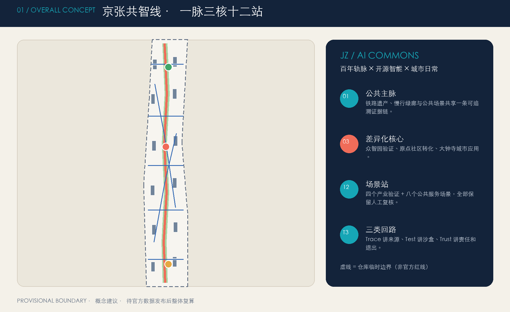
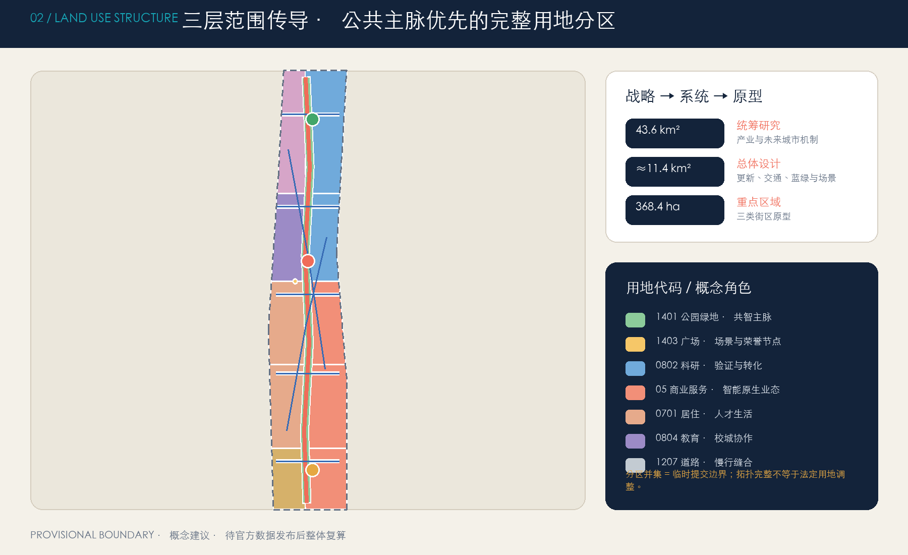
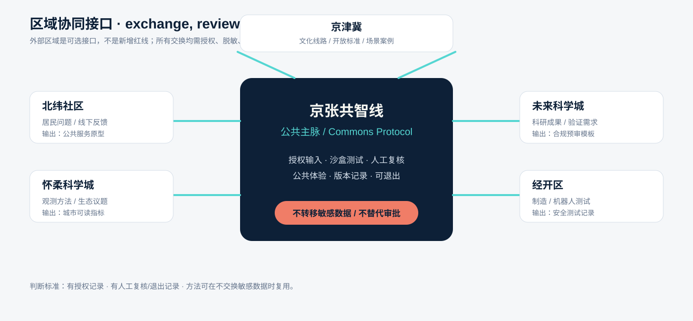
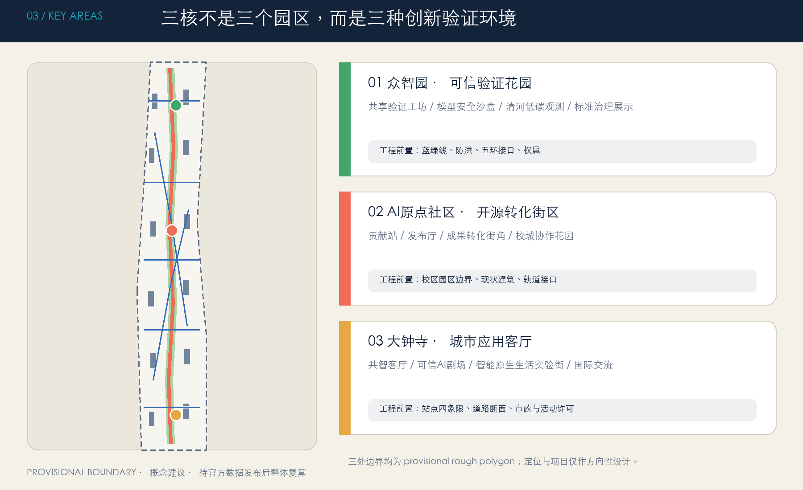
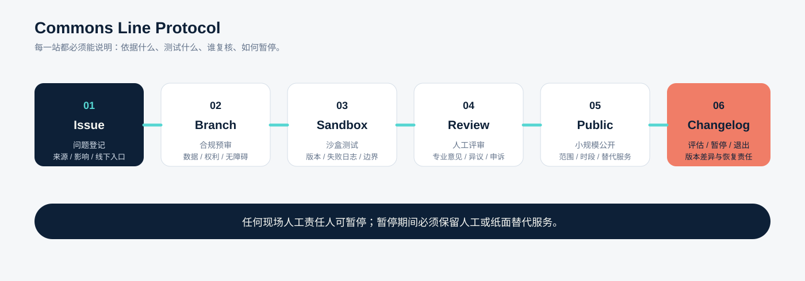
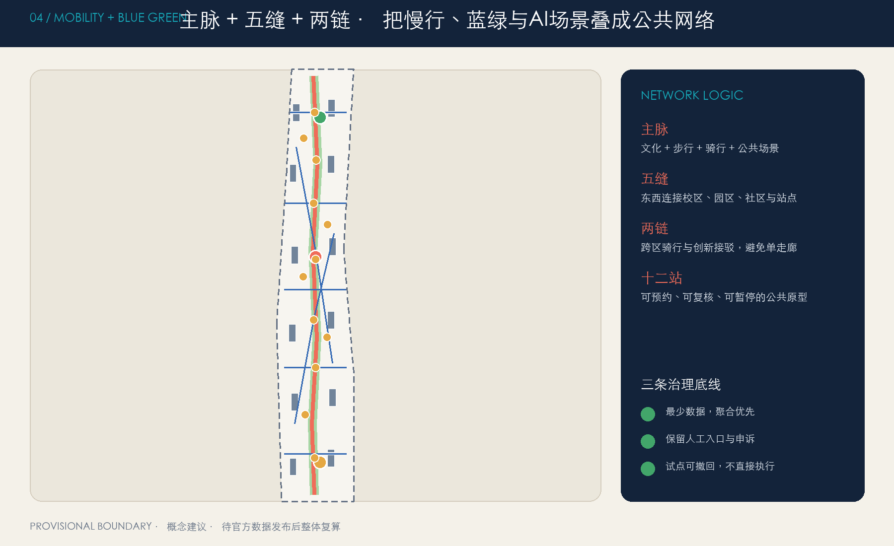
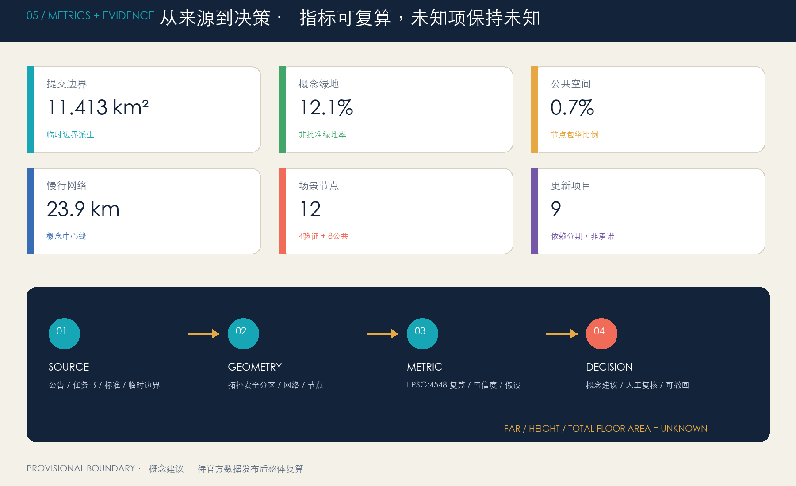

# 京张共智线：百年轨脉上的开放智能城市

> **方案状态**：本成果是面向开源征集的 AI 生成概念建议，不替代正式规划，不构成政府审定结论。总体设计边界和三处重点区均采用仓库临时粗略 polygon；其组织方数据缺口不阻断内容评分，但所有精度敏感结论必须在官方图件到位后复算。[source:BOUNDARY-SOURCE] [depth:risk_missing_data]

“京张共智线 / Jing-Zhang Commons Line”把百年铁路的线性记忆转译为一条开放智能公共基础设施：沿线每个节点都能说明“依据是什么、测试什么、谁来复核、如何退出”。总体结构不是在地图上再画一条红线，而是以遗址公园为公共主脉，以众智园、北京 AI 原点社区、大钟寺为三核，以中关村科技服务翼和小月河场景赋能翼为协同接口，形成**一脉三核、两翼协同、十二个场景站、三类治理回路**。空间动作均是可供专业团队深化研究的参考方案。

## 设计依据与资料清单

本方案先读取任务书、资料可用性登记、专业标准本地快照、枚举、规划限值、Schema 和缺资料清单，再生成空间数据。公告用于确认项目名称、三层范围、约面积和任务。[source:OFFICIAL-ANNOUNCEMENT] [source:AGENT-TASKBOOK] [source:SITE-PACKAGE]

资料可用性、处理事实包和临时边界的使用范围另有登记：公告不用于推导精确 polygon，临时边界只用于生成、展示和自检。[source:SOURCE-REGISTRY] [source:PROCESSED-FACT-PACK] [standard:PROJECT-OFFICIAL-ANNOUNCEMENT]

任务书用于六项智能体任务与统一边界条款，缺资料清单控制精度敏感结论。[standard:PROJECT-AGENT-OPEN-CALL-TASKBOOK] [depth:existing_conditions_diagnosis]

专业表达分别依据《城市设计管理办法》《城市、镇控制性详细规划编制审批办法》和国土空间用地分类指南的本地快照；建筑工程设计文件深度规定当前缺官方文件，只登记为数据缺口，不作为权威依据。[standard:MOHURD-URBAN-DESIGN-MEASURES] [standard:MOHURD-CONTROL-DETAILED-PLANNING] [standard:MNR-LAND-USE-CLASSIFICATION-GUIDE] [standard:MOHURD-ARCH-DESIGN-DEPTH-2016]

已知资料缺口包括官方红线、官方重点区 polygon、控规条件、道路红线、现状建筑、权属、文保控制、市政与公共服务底数。为避免“图面精确、依据粗略”，所有设计图都把临时边界画成低对比虚线，把设计意图画成高对比网络。[data:geometry/site_boundary.geojson#SITE-001] [data:geometry/constraints.geojson#known_constraint_data_gaps] [metric:site_area_sqm]

## 三层范围工作框架

三层范围采用“战略—系统—原型”传导：43.6 平方公里统筹研究范围回答创新生态与未来城市机制；约 11.4 平方公里总体设计范围回答城市更新、功能组织、慢行蓝绿与场景网络；368.4 公顷重点区域范围用三个片区原型验证“产业—空间—运营—治理”的闭环。[source:OFFICIAL-ANNOUNCEMENT] [depth:three_level_scope_framework] [data:geometry/key_areas.geojson#PROV-KEY-001] [metric:key_area_count]

| 层级 | 核心问题 | 本方案成果 | 资料边界 |
| --- | --- | --- | --- |
| 统筹研究范围 | 海淀 AI 创新链如何与城市生活互相增益 | “策源—工具—验证—产品—场景—治理”六层生态；三区两翼协同 | 仅作战略机制，不绘伪精确红线 |
| 总体设计范围 | 铁路遗产公共主脉如何缝合产业、社区与轨道 | 完整用地分区、慢行网络、蓝绿廊道、12 个场景节点 | 临时边界内的概念结构 |
| 重点区域范围 | 三类 AI 街区如何形成差异化原型 | 众智园“可信验证”、原点社区“开源转化”、大钟寺“城市应用” | 临时重点区仅作方向性设计 |

官方 polygon 到位后必须整体替换 `site_boundary` 与 `key_areas`，并重做用地分区、建筑包络、道路、绿地、公共空间、分期、所有面积指标、五张图、A3/A0 和 HTML，而不是只替换边界外观。[source:BOUNDARY-SOURCE] [source:KEY-AREA-SOURCE] [metric:land_use_partition_area_sqm]

## 统筹研究范围产业与未来城市研究

### 名称、Logo 与识别系统

主名称为“京张共智线”，英文名为 **Jing-Zhang Commons Line**，传播短语为“百年轨脉 × 开源智能 × 城市日常”。“共智”既表示多主体共享知识，也要求 AI 结论接受公共规则和人工最终判断。Logo 概念用两条平行轨线构成 `JZ`，中部一个开放节点构成 `/AI`；节点不闭合，表示接口可加入、记录可追溯。全部图形由本方案代码绘制，不使用外部商标、人物、图片或专有字体。[source:AGENT-TASKBOOK] [depth:overall_spatial_structure]

Logo 使用规则：深海军蓝表示历史与责任，青色表示开放接口，珊瑚色表示人工复核与停测提示；小尺寸只保留两条轨线和开放节点，禁止将 Logo 误读为政府、企业或已批准项目标识。[source:AGENT-TASKBOOK] [depth:overall_spatial_structure]

三大定位对应三种体验：百年京张文化带负责“可追溯”，都市 AI 生活体验带负责“可感知”，AI 融合创新带负责“可测试”。五大功能被编排为循环：全栈自主创新提供工具，世界级生态组织主体，AI+ 场景提供真实问题，智能化活力城市形成公共体验，AI 治理把结果送回规则与评审。三区是验证、转化、城市应用三种核心环境；两翼提供科技服务和日常场景入口。[source:AGENT-TASKBOOK] [standard:PROJECT-AGENT-OPEN-CALL-TASKBOOK]

### 六个国际案例与可迁移机制

案例只作为背景比较，不承担本项目红线、指标或实施承诺：

| 案例 | 官方资料中可确认的机制 | 转化为京张的动作 |
| --- | --- | --- |
| MIT Kendall Square | 混合研发、居住、零售、创新空间和开放空间，并通过社区参与形成方案 | 每个创新节点同时配置公共界面与社区反馈席位 [source:CASE-KENDALL] |
| Barcelona 22@ | 把创新区域与技术转移、科研基础设施协同 | 用“服务翼”连接高校成果、企业需求与场景许可 [source:CASE-22BARCELONA] |
| Toronto MaRS | 以中立枢纽连接科研、创业、资本、采用方与公共使命 | 原点社区设置“一门式成果转化与合规导航” [source:CASE-MARS] |
| Punggol Digital District | 校园—产业—社区共址，以开放数字平台支撑生活实验室 | 先建立授权、脱敏、沙盒和人工复核，再开放场景 [source:CASE-PUNGGOL] |
| Paris-Saclay | 大尺度示范与生态、能源、交通、公共生活一体推进 | 每个试点同时提交生态影响和日常使用说明 [source:CASE-PARIS-SACLAY] |
| High Tech Campus Eindhoven | 共享设施与开放创新文化连接多尺度企业和研究主体 | 众智园共用验证工坊，减少重复建设并保留中小团队入口 [source:CASE-EINDHOVEN] |

本地转化不是复制园区外形，而是形成六层生态图谱：策源层（高校院所与开源社区）、工具层（模型/算力/数据合规）、验证层（安全、机器人、城市服务沙盒）、产品层（智能体与垂直应用）、场景层（交通、健康、教育、生活服务）、治理层（标准、公众反馈、人工复核）。每层都对应空间节点、运营人和退出机制。[data:geometry/public_space.geojson#PUBLIC-004] [metric:scenario_node_count]

### 区域协同接口：从“连接叙事”变成“可交换协议”

京张共智线不把外部区域画成新的规划红线，而是把它们定义为可选的知识、场景和人才接口。每个接口都必须先经过授权、脱敏、人工复核和独立的权属/安全判断；下表只描述可迁移机制，不构成行政协作、投资、采购或建设承诺。[source:AGENT-TASKBOOK] [depth:three_level_scope_framework]

| 外部接口 | 进入京张的资源 | 京张输出 | 数据、权属与责任边界 | 首个可验证动作 |
| --- | --- | --- | --- | --- |
| 北纬社区 | 居民问题、日常服务反馈、非数字参与者 | 可解释的公共服务原型、线下反馈记录 | 只收自愿、最少、聚合反馈；社区可撤回 | 共智客厅设置纸面/人工问题卡与回访席 |
| 未来科学城 | 科研成果、模型工具、验证需求 | 场景清单、合规预审模板、公共体验反馈 | 不接收非公开研发数据；成果权利仍归原主体 | 原点社区举办一次授权成果“发布—质询—复盘” |
| 怀柔科学城 | 长周期科学观测方法、生态与能源验证议题 | 面向城市的可读指标、低碳观测协议 | 不把科学设施、指标或投资目标外推到本项目 | 众智园开展合成数据观测回放，不部署真实设施 |
| 经开区 | 制造、机器人和产业化测试需求 | 机器人礼让与安全测试记录、可复用组件 | 不承诺采购、产业用地或生产线迁入；测试责任可追 | TV-02 小尺度封闭礼让测试，人工一票暂停 |
| 京津冀 | 跨城文化线路、开放标准和场景案例 | 京张文化导览与可信 AI 公共协议的可迁移版本 | 不代表区域行政安排；跨域数据按各地授权独立管理 | 全球共智周先做公开案例交换与双语导览 |

接口成功不以“签约数量”衡量，而以三项证据衡量：是否有授权记录、是否留下人工复核与退出记录、是否能在不转移敏感数据的情况下复用方法。[data:geometry/public_space.geojson#PUBLIC-004] [metric:scenario_node_count]

## 总体设计范围城市更新与控规深度城市设计

总体结构为“一脉三核、五条东西缝合线、两条对角协同链、十二站”。一脉沿京张遗址公园组织文化、慢行、绿地和公共场景；三核分别承担可信验证、开源转化和城市应用；东西缝合线把校区、园区、社区和轨道入口接回公共主脉；对角链避免单一南北走廊，形成跨片区协作。[data:geometry/roads.geojson#ROAD-001] [data:geometry/land_use.geojson#LU-001] [depth:overall_spatial_structure]

用地分区按优先叠加算法构造：先锁定连续公园主脉、公共节点和缝合通道，再分配研发、教育、居住、服务与文化功能，最后把剩余空间明确为弹性留白。所有相邻边共享坐标，分区并集等于提交边界，无缝无叠；这只证明方案拓扑完整，不表示法定用地已调整。[standard:MNR-LAND-USE-CLASSIFICATION-GUIDE] [data:geometry/land_use.geojson#LU-001] [depth:land_use_layout] [metric:land_use_partition_area_sqm]

更新方法采用“先诊断、再微改、后增量”的门槛：能保留则以节能、首层开放和功能适配为先；无法满足安全、使用和公共界面的建筑才进入改造比较；拆除与新建必须等待现状测绘、权属、文保、结构和控规证据。[data:geometry/buildings.geojson#BLDG-001] [depth:retain_renovate_demolish] [depth:development_intensity_controls]

图中的 12 个建筑包络只是空间容量与界面原型，不是现状建筑判定；基底、覆盖、容积率、高度和总建筑面积均按当前证据状态标记。[metric:building_footprint_area_sqm] [metric:building_coverage_ratio] [metric:floor_area_ratio]

建筑高度与总建筑面积继续保持 unknown，待官方控规和现状调查到位后复算。[metric:building_height_m] [metric:total_floor_area_sqm]

## 重点区域详细设计

三处重点区采用同一张“空间—场景—责任”检查表，避免只有概念名称而缺少场地证据。由于官方重点区 polygon、现状建筑、权属和道路断面尚未提供，下表是下一轮专业深化的最小交付，不把未知内容伪装成现状判断。[data:geometry/key_areas.geojson#PROV-KEY-001] [depth:three_key_area_detailed_design]

| 重点区 | 空间序列与公共界面 | 首轮应画出的场地证据 | 主要依赖与停止条件 |
| --- | --- | --- | --- |
| 众智园·可信验证花园 | 清河生态界面 → 共享验证工坊 → 众智治理庭 → 北段缝合线 | 一张工坊—治理庭—慢行入口平面、一条低碳/安全剖面、TV-01/02/03 节点落位 | 蓝线、防洪、能源、消防、噪声和权属未核实前不扩容、不固化工程接口 |
| AI 原点社区·开源转化街区 | 贡献站 → 发布厅 → 转化街角 → 校城协作花园 | 一张首层连续公共界面平面、一条校园—社区步行剖面、SC-05/08 节点落位 | 高校/园区边界、版权、知识产权和开放时段未确认前保留线下人工服务 |
| 大钟寺·城市应用客厅 | 共智客厅 → 可信 AI 剧场 → 科技服务协作坊 → 轨道/社区入口 | 一张站点—街角—客厅平面、一条可进入/可撤回体验剖面、TV-04/SC-10/12 节点落位 | 轨道、交通、消防、商业权属未核实前不写具体客流、设备或商业指标 |

### 众智园 AI 自主创新加速区：可信验证花园

定位为全栈自主创新与 AI 治理的“验证前厅”。空间上以清河方向的低对比生态界面、共享验证工坊和治理庭围合花园型交往空间；建筑优先适配研发、实验和中小团队共用设施；慢行上通过北段缝合线连接公共主脉；场景包括模型安全沙盒、机器人礼让测试、低碳算力可视化。任何河道、五环或工程接口必须在蓝线、防洪、交通与权属资料齐备后深化。[data:geometry/key_areas.geojson#PROV-KEY-001] [data:geometry/public_space.geojson#PUBLIC-007] [depth:three_key_area_detailed_design]

### 北京 AI 原点社区：开源转化街区

定位为近校型成果转化和人才社区。空间上以“贡献站—发布厅—成果转化街角—校城协作花园”组成步行序列；建筑采用小单元、可分可合和首层公共界面；运营把开源发布、知识产权、伦理合规、场景招募和人才服务放进一条可见服务链。高校与园区边界、具体改造和轨道接口均需权属及专业复核。[data:geometry/key_areas.geojson#PROV-KEY-002] [data:geometry/public_space.geojson#PUBLIC-005] [source:AGENT-TASKBOOK]

### 大钟寺 AI 产业聚集区：城市应用客厅

定位为智能体、智能终端、内容消费和国际交流的城市型应用街区。以“共智客厅—可信AI剧场—科技服务协作坊”组织四象限步行体验；首层强调可进入、可停留、可撤回的体验单元，避免把公共空间变成企业展厅。大钟寺站一体化、交叉口和非机动车组织只表达关系，不给出工程线位或已批准结论。[data:geometry/key_areas.geojson#PROV-KEY-003] [data:geometry/public_space.geojson#PUBLIC-002] [data:geometry/roads.geojson#ROAD-003]

## AI 创新生态、人才画像与 AI+ 场景

七类用户画像共同校验空间：开源开发者需要发布、协作与贡献记忆；初创团队需要低成本测试与合规入口；企业研发者需要共享设施与招募；高校师生需要成果转化和日常慢行；周边居民需要低扰动服务与休闲；国际访客需要双语导览、无障碍与可理解的城市体验；运维人员、老年人与行动不便者需要清晰的人工入口、连续休息点、低刺激替代路线和可撤回服务。任何画像都不得转化为个体追踪或商业画像。[source:AGENT-TASKBOOK] [depth:existing_conditions_diagnosis] [source:SOURCE-REGISTRY]

12 张场景卡如下，其中 TV-01 至 TV-04 是产业测试验证场景：

| ID / 场景 | 空间载体 | 服务对象与最少数据 | 人工复核与退出 |
| --- | --- | --- | --- |
| TV-01 模型安全红队沙盒 | 众智园验证工坊 | 经授权测试集、版本和缺陷记录 | 安全/法律复核；不接生产敏感数据 |
| TV-02 机器人礼让测试场 | PUBLIC-010 | 现场人工观察、匿名冲突事件 | 交通/无障碍复核；可立即停测 |
| TV-03 端侧算力能耗验证 | PUBLIC-009 | 设备能耗与环境聚合值 | 能源/消防/安全复核；不承诺容量 |
| TV-04 城市智能体回放剧场 | PUBLIC-003 | 公开规则、合成情景、版本日志 | 公众与专业联合复核；输出不直接执行 |
| SC-05 开源发布厅 | PUBLIC-004 | 授权活动信息与人工策展文本 | 版权事实核查；保留线下服务 |
| SC-06 AI慢行体检 | ROAD-001 | 人工踏勘、授权反馈、公开路网 | 交通/无障碍复核；不是审定路线 |
| SC-07 公共健康服务导航 | PUBLIC-008 | 公开服务目录 | 医疗人员复核；不采集健康隐私 |
| SC-08 成果转化 Copilot | PUBLIC-011 | 公开政策与人工维护目录 | 法律/知识产权复核；不替代专业意见 |
| SC-09 清河低碳观测 | PUBLIC-012 | 公开或授权环境聚合值 | 生态/防洪复核；不推断个人行为 |
| SC-10 智能原生生活实验街 | PUBLIC-002 | 自愿反馈与公开活动信息 | 运营/消费者权益复核；可选择不用AI |
| SC-11 百年京张文化导览 | PUBLIC-001 | 公开史料与授权图文 | 史实/版权复核；AI生成内容显著标注 |
| SC-12 全球AI活动周路线 | PHASE-001—007 | 公开日程与聚合客流 | 公共安全复核；活动为概念建议 |

所有场景遵循“最少数据—沙盒测试—人工复核—小规模公开—评估退出”的五步门槛；不使用人脸识别、个人轨迹、非公开企业数据或不可申诉的自动化判断。[source:AGENT-TASKBOOK] [data:geometry/public_space.geojson#PUBLIC-010] [metric:scenario_node_count] [depth:municipal_new_infrastructure]

### Commons Line 场景运行协议

`Trace · Test · Trust` 不只是视觉口号，而是一套适用于 12 个场景站的最小运行协议。每次变更都生成版本戳、责任人、数据范围和退出记录；任何一名现场人工责任人都可以暂停，暂停期间必须保留人工或纸面替代服务。[source:AGENT-TASKBOOK] [depth:municipal_new_infrastructure]

| 闸门 | 必须留下的证据 | 概念责任角色 | 对公众的可见信号 |
| --- | --- | --- | --- |
| Issue 问题登记 | 问题来源、受影响人群、非数字入口 | 场景站长 | 问题卡和登记编号 |
| Branch 合规预审 | 数据最小化、权利/版权、无障碍和安全清单 | 合规复核人 | 使用什么数据、暂不使用什么数据 |
| Sandbox 沙盒测试 | 合成/授权数据、模型版本、失败日志 | 测试负责人 | 沙盒边界、预约方式和停测按钮 |
| Human Review 人工评审 | 专业意见、公众反馈、异议记录 | 专业复核组 | 谁复核、何时复核、如何申诉 |
| Small Public 小规模公开 | 范围、时段、替代服务、事件记录 | 运营负责人 | 这是试用，不是自动决策 |
| Changelog 评估退出 | KPI/SLA、停止原因、恢复动作、版本差异 | 责任人联合签署 | 继续、修改、暂停或退出的结果 |

四个产业测试场景先采用定性而非伪精确数值的停止阈值：TV-01 出现未处置的关键安全缺陷即回滚版本；TV-02 出现无法解释的冲突或无障碍风险即人工暂停；TV-03 未通过能源、散热、消防或噪声复核即移除设备；TV-04 输出无法引用规则或无法申诉即退回人工服务台。恢复责任由对应测试负责人和专业复核人共同确认，不把“模型上线”当作成功标准。[data:geometry/public_space.geojson#PUBLIC-009] [data:geometry/public_space.geojson#PUBLIC-010] [depth:municipal_new_infrastructure]

### 角色、服务级别与逐场景运行卡

为避免“有流程、无责任人”，每个场景在开放前必须填写一张运行卡。这里的 KPI/SLA 是需要留下的证据字段，不预先捏造客流、响应秒数或投资指标；数值阈值由获得授权的运营主体和专业复核人共同确认。A 表示最终负责，R 表示执行，C 表示必须咨询，I 表示知会；任何现场责任人都拥有安全暂停权。

| 角色 | 责任边界 | 必须留下的记录 |
| --- | --- | --- |
| A 公共责任/审计联席 | 对公开、暂停、恢复和异议回应负责 | 决策编号、签署人、版本差异 |
| R 场景站长/运营负责人 | 组织入口、值守、替代服务和事件登记 | 开闭场记录、值守表、事件单 |
| R 测试负责人 | 管理沙盒版本、测试集和失败回放 | 版本戳、测试集范围、失败日志 |
| C 专业复核人 | 对安全、交通、医疗、能源、版权等领域给出意见 | 复核清单、意见、未决项 |
| C 社区/无障碍代表 | 检查可达性、非数字入口和公众异议 | 体验记录、申诉与修正建议 |
| C 数据/IP 管家 | 核对授权、最少数据、保留期限和删除动作 | 权属条目、数据生命周期、删除回执 |
| I 公众与受影响用户 | 获取解释、替代服务与退出路径 | 公开问题、反馈和申诉结果 |

| 闸门 | A | R | C | I | 服务级别证据 |
| --- | --- | --- | --- | --- | --- |
| Issue 问题登记 | 公共责任联席 | 场景站长 | 社区/数据管家 | 公众 | 登记编号、来源和首次回应时间 |
| Branch 合规预审 | 数据/IP 管家 | 合规复核人 | 专业/无障碍代表 | 参与者 | 授权期限、数据地图、暂不使用清单 |
| Sandbox 沙盒测试 | 测试负责人 | 测试操作员 | 专业/无障碍代表 | 公众 | 版本戳、测试边界、失败日志 |
| Human Review 人工评审 | 公共责任联席 | 专业复核组 | 社区/数据管家 | 公众 | 签署意见、异议记录、申诉入口 |
| Small Public 小规模公开 | 公共责任联席 | 运营负责人 | 全部 C 角色 | 使用者/邻里 | 开闭场记录、替代服务可用证明 |
| Changelog 评估退出 | 公共责任联席 | 运营与数据管家 | 测试/专业复核 | 公众 | 继续/修改/暂停/退出决定、恢复确认 |

下表是 12 个场景的最小运行卡。默认数据生命周期为“测试/服务结束后清理原始数据，仅按授权保留聚合结果或审计记录”；具体期限、删除方式和指标数值必须在授权记录中补齐。任何一项入口、复核、替代服务或记录缺失，场景不得扩大公开范围。

| ID | 开放前提与 R | 数据范围与生命周期 | KPI/SLA 证据字段 | 停止、恢复与替代服务 |
| --- | --- | --- | --- | --- |
| TV-01 | 授权测试集、冻结版本；红队负责人 | 合成/授权测试集；测试闭合后清理原始集，缺陷记录留审计 | 未关闭关键缺陷数、版本回放和复核时间 | 关键缺陷未处置即回滚；人工安全评审后再开 |
| TV-02 | 低速、划定边界、现场观察员和无障碍检查；测试负责人 | 匿名冲突事件；按场次清理原始观察记录 | 冲突/险情/无障碍问题登记是否在下一场前完成 | 解释不了或有无障碍风险即停测；人工交通引导替代 |
| TV-03 | 能源、散热、消防、噪声预审通过；设备负责人 | 设备能耗和环境聚合值；测试结束后清理设备级原始记录 | 安全清单签署、能耗与温度日志完整性 | 复核不通过即移除设备；保留普通公共服务 |
| TV-04 | 公开规则、合成情景、台上人工值守；剧场负责人 | 不接收个人输入；回放结束清理会话数据 | 每个输出均有规则来源、版本和申诉路径 | 无来源/不可申诉即退回服务台；人工解释替代 |
| SC-05 | 活动授权、人工策展和版权核查；发布厅负责人 | 授权活动信息；不建立观众画像，发布记录按授权保留 | 作者/版权核验、更新日期、线下服务记录 | 权利不清即撤下；纸面目录和人工咨询替代 |
| SC-06 | 人工踏勘、可达性检查、公开路网；慢行负责人 | 公开路网与自愿反馈；原始反馈在复盘后清理 | 障碍点、替代路线和修正记录 | 发现不可达障碍即撤回推荐；纸质地图/人工指引替代 |
| SC-07 | 公开服务目录、医疗人员复核；导航负责人 | 不采集健康隐私；目录版本和复核记录留档 | 目录更新时间、来源、转人工记录 | 目录过期即下线；电话/现场人工导航替代 |
| SC-08 | 已发布政策/IP资料、人工维护；转化负责人 | 仅公开资料；不接收未授权商业秘密，咨询结束清理会话 | 引用来源、复核人、未决事项清单 | 规则不明即停止回答；人工法律/IP咨询替代 |
| SC-09 | 环境聚合值和生态/防洪复核；观测负责人 | 公开或授权聚合值；不保存个人行为，版本化聚合结果留档 | 数据缺口标记、复核日期、异常处置 | 数据异常即暂停展示；人工公告/常规导览替代 |
| SC-10 | 自愿参与、可选择不用 AI、运营值守；生活服务负责人 | 自愿反馈；原始反馈合并复盘后清理 | 选择退出、投诉和回应记录 | 体验有害或投诉未回应即暂停；普通人工服务替代 |
| SC-11 | 史料来源、版权授权、人工导览；文化负责人 | 公开史料与授权图文；公开版本按授权保留 | 引用、生成标注、内容复核日期 | 史实/权利有疑问即撤回；纸面导览/人工讲解替代 |
| SC-12 | 公开日程、公共安全和无障碍检查；活动负责人 | 公开日程与聚合客流；活动结束后清理原始流量记录 | 安全预案、可达性检查、开闭场记录 | 预案或可达性不合格即不发布；普通公共路线替代 |

### 公共组件库与无障碍验收

把“可追溯、可测试、可信任”落到可复用的城市组件，而不是只停留在图面口号。组件均应有版本号、责任人、维护/失效日期和纸面备份；缺少这些字段时不得进入小规模公开。

| 组件 ID | 公共功能 | 最小验收证据 |
| --- | --- | --- |
| TR-01 来源/版本牌 | 说明事实来源、模型版本、数据边界和更新时间 | 中英文字段、来源链接/编号、现场可读性检查 |
| TE-01 测试边界牌 | 显示沙盒范围、开放时段、预约入口和停测信号 | 现场边界、停测按钮/人工口令、异常演练记录 |
| TU-01 人工责任/申诉牌 | 告知当班责任人、替代服务和异议渠道 | 姓名或岗位、电话/现场窗口、申诉回执 |
| PA-01 纸面/人工服务台 | 在断网、停测或不使用 AI 时维持基本服务 | 纸质地图/目录、值守表、恢复演练 |
| AC-01 连续可达组件 | 提供休息、低刺激路线、无障碍导视和可进入首层界面 | 无障碍代表现场走查、替代路线、障碍修正记录 |
| LG-01 低碳与维护牌 | 公开设备能耗、维护责任和不适用时段 | 设备/维护台账、能源消防复核、撤除记录 |

最低人工验收包括：不以颜色作为唯一信息；中英文和生成内容标注明确；实体导视有足够对比度、连续休息点和可触达替代；HTML/数字界面有键盘顺序、焦点状态、文字替代和无脚本可读内容；现场必须完成一次老年人、行动不便者和运维人员走查。验收记录进入 Changelog，未通过时回到 Sandbox 或保留普通人工服务。[depth:municipal_new_infrastructure] [depth:three_key_area_detailed_design]

## 用地、建筑规模与拆改留方案

功能比例由机器可复算用地分区表达，但不写成法定比例。北段侧重研发验证与人才服务，中段侧重近校科研转化和生活学习，南段侧重智能原生服务、文化与国际交流；中央公园和节点优先占位，保证公共价值不会在后续招商中被挤出。[data:geometry/land_use.geojson#LU-002] [standard:MNR-LAND-USE-CLASSIFICATION-GUIDE] [depth:land_use_layout]

拆改留采用证据闸门：A 类为有保护、记忆、结构与低碳价值的“优先保留”；B 类为首层封闭、能耗高但结构可用的“适应性改造”；C 类为经安全、权属、文保、碳排和公众程序证明不可保留的“再论证拆除”；D 类为补足公共服务、研发验证和人才生活缺口的“条件性新建”。当前没有建筑调查，所有包络的 `existing_status` 均为 unknown。[data:geometry/buildings.geojson#BLDG-006] [depth:retain_renovate_demolish] [depth:height_massing_character]

## 交通、轨道、市政与公共服务设施

交通策略用“主脉 + 五缝 + 两链”表达：主脉承载步行骑行与文化体验；五条东西缝合线分别回应南端、轨道站点、小月河、原点社区和清河接口；两条对角链支撑跨区骑行与创新节点接驳。提交网络总长度约 23.9 km，只是概念线网，不能视为道路红线、工程线位或施工可行性。[data:geometry/roads.geojson#ROAD-001] [metric:walking_cycling_network_length_m] [depth:traffic_rail_slow_parking]

市政与新基建采用“小节点、可插拔、先测后扩”：端侧算力驿站仅在能源、散热、消防、噪声和安全评估通过后试点；公共感知优先环境聚合值，不部署以身份识别为目标的设施；机器人试点以低速、礼让、可暂停和责任可追为前提。服务系统包括人才服务、公共健康导航、无障碍导览、开源活动和场景合规咨询，均保留非数字入口。[standard:MOHURD-CONTROL-DETAILED-PLANNING] [data:geometry/constraints.geojson#known_constraint_data_gaps] [depth:municipal_new_infrastructure]

## 蓝绿空间、公共空间与城市风貌

蓝绿系统不是背景绿化，而是创新带的公共协议层：连续绿廊承载慢行、休憩、文化叙事和低风险测试；四段主题依次为南端文化记忆园、大钟寺城市活力园、原点社区开源花园、众智园清河创新园。方案绿地包络约 138.3 ha、占提交临时边界 12.1%；这是概念设计比值，不是批准绿地率。[data:geometry/green_space.geojson#GREEN-001] [metric:green_space_area_sqm] [metric:green_ratio] [depth:blue_green_public_space]

公共空间节点约 7.8 ha、占 0.7%，以“Trace / Test / Trust”组件库组织：Trace 组件讲述史料来源和模型版本，Test 组件提供预约、边界和停测按钮，Trust 组件展示人工责任人与申诉路径。[data:geometry/public_space.geojson#PUBLIC-003] [metric:public_space_area_sqm] [metric:public_space_ratio]

四个原创“AI 朝圣/荣誉”节点均为概念建议：①“百年起点”以轨枕刻度承载授权史料；②“AI 原点贡献站”以可更新开源贡献目录记录人和团队；③“可信 AI 剧场”公开展示模型如何被质疑、复核和撤回；④“众智治理庭”把标准、红队测试和公众反馈并列。它们不使用企业商标或人物肖像，也不主张未经核实的历史事实。[source:AGENT-TASKBOOK] [standard:MOHURD-URBAN-DESIGN-MEASURES] [depth:height_massing_character]

文化叙事采用“三种时间”：铁路时间讲基础设施如何连接城市；中关村时间讲知识如何转化为产业；AI 时间讲模型如何在公共规则下持续更新。导视用轨线、开放节点和版本戳构成；每段事实必须有来源，生成文本必须标注，文化与品牌 Logo 分层管理。[source:OFFICIAL-ANNOUNCEMENT] [source:AGENT-TASKBOOK]

## 更新项目清单、实施政策与分期计划

九个项目节点按依赖而非年份分期，空间面积约 11.5 ha，只表示原型范围：

| 阶段 | 项目 | 先决条件 | 成功信号 |
| --- | --- | --- | --- |
| 近期：轻触启动 | 百年起点、共智客厅、可信AI剧场 | 公共空间许可、史料与版权、安全运营 | 有清晰人工责任、退出机制和公众反馈 |
| 中期：网络缝合 | 开源会合台、AI原点贡献站、校城协作花园 | 权属、校城协作、道路与无障碍复核 | 形成跨主体服务闭环而非一次活动 |
| 长期：条件深化 | 众智治理庭、清河低碳观测、端侧算力驿站 | 官方边界、控规、蓝绿线、市政和安全资料 | 经专业评估后小规模验证再扩展 |

[data:geometry/phasing.geojson#PHASE-001] [metric:renewal_project_count] [metric:phasing_project_area_sqm]

项目依赖关系和实施深度由分期项目清单与实施深度项共同约束。[depth:renewal_project_list] [depth:phasing_implementation]

政策建议包括四个可逆机制：场景许可证注明数据、责任和期限；公共价值保证书写明非数字入口和社区收益；建筑先用权先于新建量，鼓励短租共享验证空间；每个项目采用版本化证据包，变更时重算指标并公开差异。以上均为参考机制，不构成已确定政策或财政承诺。

长期运营采用四季循环：春季“开源问题季”发布城市真实问题；夏季“安全验证季”开展红队与机器人礼让测试；秋季“全球共智周”连接展览、路演和公共路线；冬季“证据复盘季”公开失败、退出和下一版任务。开发者社区以贡献记录、导师时段和小额场景资源连接；企业转化路径为“公开问题—合规预审—沙盒—人工评估—采购/合作另行决策”。活动时间、资金和主体均待协商，不表述为政府安排。[source:AGENT-TASKBOOK] [data:geometry/phasing.geojson#PHASE-007]

运营评价只看公共价值和可复核性：问题是否被真实提出、参与者是否能不用 AI、人工复核是否按时完成、停止后是否恢复服务、失败和版本差异是否公开。具体人数、投资额、客流量和建设年份保持 unknown，待官方条件与运营主体确认后再设定。[source:AGENT-TASKBOOK] [metric:scenario_node_count] [depth:phasing_implementation]

## 指标体系、面积复算与合规矩阵

提交边界复算为约 1141.3 ha，与公告“约 11.4 平方公里”同量级，但因边界为临时推定，不把差值解释为精确偏差。用地并集面积与边界一致，说明拓扑闭合。[metric:site_area_sqm] [metric:land_use_partition_area_sqm] [metric:building_footprint_area_sqm]

建筑基底 53.8 ha、概念覆盖比 4.7%；这些是设计包络的可复算值，不是法定控制。[metric:building_coverage_ratio] [metric:green_space_area_sqm] [metric:green_ratio]

公共空间约 0.7%；绿地和公共空间比值同样不替代批准控制。[metric:public_space_area_sqm] [metric:public_space_ratio]

网络长度、场景和项目数量分别来自道路、公共空间和分期图层。[metric:walking_cycling_network_length_m] [metric:key_area_count] [metric:scenario_node_count]

项目数量与面积来自分期图层，三处重点区数量来自任务书要求。[metric:renewal_project_count] [metric:phasing_project_area_sqm] [depth:metrics_recalculation]

容积率、建筑高度和总建筑面积保持 unknown，直到官方控规、现状调查和专业条件到位。[metric:floor_area_ratio] [metric:building_height_m] [metric:total_floor_area_sqm] [standard:MOHURD-CONTROL-DETAILED-PLANNING]

`compliance_matrix.json` 覆盖公告 1.3、1.4、1.5 与 agent.1—agent.6 共 23 条要求；`standard_matrix.json` 覆盖 5 条 mandatory 标准并保留 1 条非 mandatory 数据缺口；`design_depth_matrix.json` 的 15 个核心深度项均通过正文、GeoJSON、指标、图纸和自检建立证据链。PASS 只表示可进入内容评审，不表示方案优秀、官方批准或具备工程实施条件。

## 风险、版权与合规说明

九项假设全部显式登记：[A-BOUNDARY-001] 临时边界；[A-CONTROLS-001] 控规缺失；[A-LANDUSE-001] 概念用地；[A-BUILDING-001] 建筑底数缺失；[A-ROAD-001] 道路工程缺失；[A-BLUEGREEN-001] 蓝绿/文保控制缺失；[A-PUBLIC-001] 公共节点许可未知；[A-PHASING-001] 分期非政府计划；[A-PRIVACY-001] 最少数据与人工复核。对应记录见 `assumptions.json`。[depth:risk_missing_data]

本方案仅使用仓库公开/清权资料与六个案例的官方公开页面摘要。地图、图解、Logo 方向、HTML 和 PDF 由本项目脚本原创生成，没有抓取或嵌入外部地图、影像、商标、人物或企业视觉；PNG 调用本机系统字体，PDF 仅嵌入本机许可字体的文档显示子集，不单独分发字体文件。详细声明见 `report/copyright_statement.md`。

AI 场景不得替代规划、医疗、法律、交通、公共安全和工程专业判断；任何外部发布、实际试点、政府/企业承诺、权属变更或投资安排都需另行授权。人类和专业团队保留最终判断权。[source:AGENT-TASKBOOK]

## 参考资料

- [source:OFFICIAL-ANNOUNCEMENT] 官方公告及仓库本地快照。
- [source:AGENT-TASKBOOK] 面向全球智能体开源征集任务书摘录。
- [source:SITE-PACKAGE]、[source:SOURCE-REGISTRY]、[source:PROCESSED-FACT-PACK] 仓库资料与导航层。
- [source:BOUNDARY-SOURCE]、[source:KEY-AREA-SOURCE] 临时粗略空间数据，严禁升级为官方红线。
- [source:CASE-KENDALL]、[source:CASE-22BARCELONA]、[source:CASE-MARS]、[source:CASE-PUNGGOL]、[source:CASE-PARIS-SACLAY]、[source:CASE-EINDHOVEN] 国际案例官方页面，仅作背景机制比较。
