# A City with Doors

## 01｜Project Thesis: Personal AI Moves with the Person Across the City, and Public Capabilities Open by Task

A City with Doors is an urban design proposal for the **Century-old Jing-Zhang AI Innovation Belt**. It is not about “adding more smart devices to the city,” but about a more specific question:

> **When personal AI accompanies a person into real urban systems such as schools, communities, hotels, meetings, experimental grounds, and public transport, what may it call upon, under what authority, who is responsible for maintaining those facilities, when must borrowed facilities be returned, and how does the personal AI exit the relevant system when the task ends?**

The proposal’s overall thesis is:

> **Let human life remain continuous, and let personal AI move with the person across the city; public facilities are called by task and permission, and can be maintained, returned, and exited.**

What remains continuous is the person’s personal AI and the task being carried out. What the city opens temporarily are passage, wayfinding, compute, energy, robots, Docks, handoff lockers, and public-service interfaces. Personal memory and root privileges remain on the person’s side; the public side receives only the information, permissions, and receipts necessary to complete the current task.

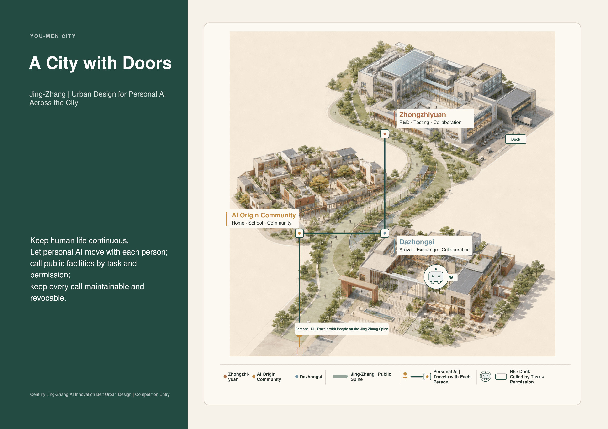

*Figure F01｜Design judgment: one Jing-Zhang Public Spine connects three urban roles—“Home, Window, and Workshop.” Personal AI maintains task continuity, while public bodies such as R6 and Docks open only by task. Read the three key spaces and the public spine between them first, then the two sets of lines for personal AI and public facilities. The figure demonstrates the spatial relationships of the overall thesis; it does not represent statutory boundaries, actual distances, precise siting, or a construction scheme. Source: existing presentation page P01.*

## 02｜The Real City: Three Scales and the Current Boundary Status

This proposal works at three scales that must neither be conflated nor substituted for one another:

| Scale | Area | Question Answered at This Scale |
| --- | ---: | --- |
| Strategic coordination study area | **43.6 km²** | How the Century-old Jing-Zhang AI Innovation Belt can coordinate industry, culture, and the future city |
| Overall urban design area | **11.4 km²** | How ordinary urban fabric, the Jing-Zhang Public Spine, and the three key spaces connect |
| Three key detailed-design areas | **approx. 368.4 ha** | How the AI Origin Community, Dazhongsi, and Zhongzhiyuan translate the overall thesis into specific spaces and tasks |

> **Boundary Status Note**  
> This proposal uses a conceptual / provisional spatial demonstrator. It does not claim statutory planning boundaries, ownership boundaries, construction drawings, or exact areas; the whole package will be rebound, redrawn, and recalculated once official geometry is available.

This does not mean that design cannot proceed at the current stage. At this stage, the conceptual key-area spatial demonstrator, facility systems, task paths, permission boundaries, and chains of responsibility can all be completed. The following, however, must remain pending verification: parcel boundaries, statutory road boundary lines, existing buildings, underground municipal infrastructure, ownership, statutory planning metrics, specific capacities, and precise siting.

**The current proposal identifies three design gaps:**

1. Personal AI can continue working on devices, but as it enters different urban spaces, there is no unified, legible method for making task requests, calling facilities, and withdrawing permissions when they expire.
2. Transport, wayfinding, energy, networks, compute, robots, and service facilities remain fragmented across the city and have yet to coordinate around a person’s task chain.
3. Many smart-city narratives describe only “how to activate” a system, without also designing for docking, maintenance, fault recovery, return, migration, and exit.

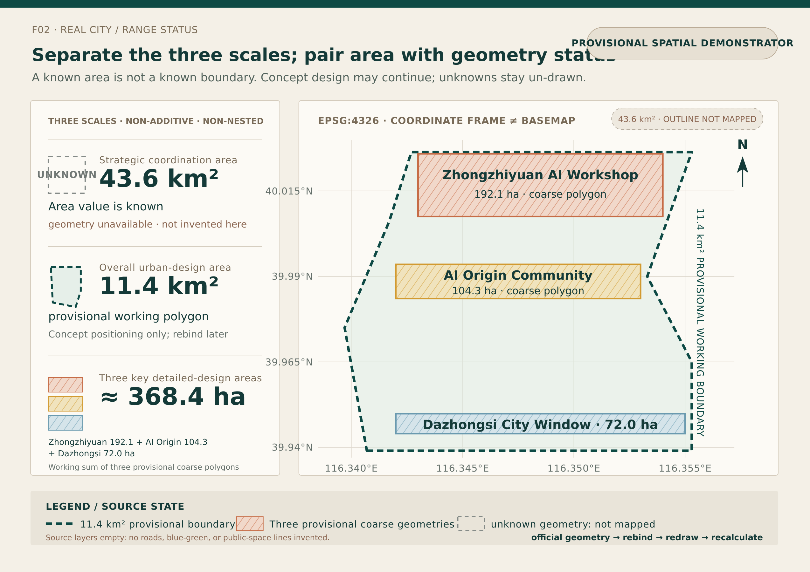

*Figure F02｜Design judgment: 43.6 km², 11.4 km², and approximately 368.4 ha are three working scales that must not be conflated. Read the three area and evidence-status tiers on the left first; then read the 11.4 km² provisional working boundary and three provisional coarse polygons within the EPSG:4326 coordinate frame on the right. At present, the 43.6 km² scale has only an area value and no usable outline, so no outline has been invented in the figure; the roads / green_space / public_space source layers are currently empty, so no lines have been added. The figure demonstrates the three scales, the relative positions of the three areas, and the subsequent rebinding mechanism. It does not represent statutory boundaries, ownership, an existing-conditions base map, road or parcel boundaries, exact areas, or construction siting. Source: the current working GeoJSON files `site_boundary.geojson` and `key_areas.geojson`, together with the scale descriptions in this proposal; redrawn for this iteration and not sourced from an existing presentation page.*

## 03｜Overall Spatial Structure: One Public Spine, Three Urban Roles

The city’s structure consists of ordinary urban fabric, one Jing-Zhang Public Spine, and three key spaces.

- **Ordinary urban fabric is the base.** Ordinary roads, public transport, walking and cycling, conventional municipal infrastructure, staffed services, and AI-independent access must remain viable at all times.
- **Jing-Zhang is the public spine.** It connects the three areas and carries active mobility, blue-green systems, low-power wayfinding, backup power, N2, Docks, R6 task branches, and the minimum fault-recovery baseline.
- **The AI Origin Community is “Home.”** It supports long-term living, learning, follow-up care, shared family tasks, and independent household thresholds.
- **Dazhongsi is the “Window.”** It supports visitor arrival, short-term service packages, urban experience, exchange, and continued collaboration.
- **Zhongzhiyuan is the “Workshop.”** It supports research and development, compute, experimentation, testing, repair, retesting, and readmission.

Transport and active mobility enable people to arrive; blue-green systems keep public space usable in everyday life and under a changing climate; energy, networks, and compute maintain task checkpoints; robots, Docks, handoff lockers, and entrance halls form a borrowable “public body”; permissions, responsibility, maintenance, and receipts allow public capabilities to be opened and also taken back.

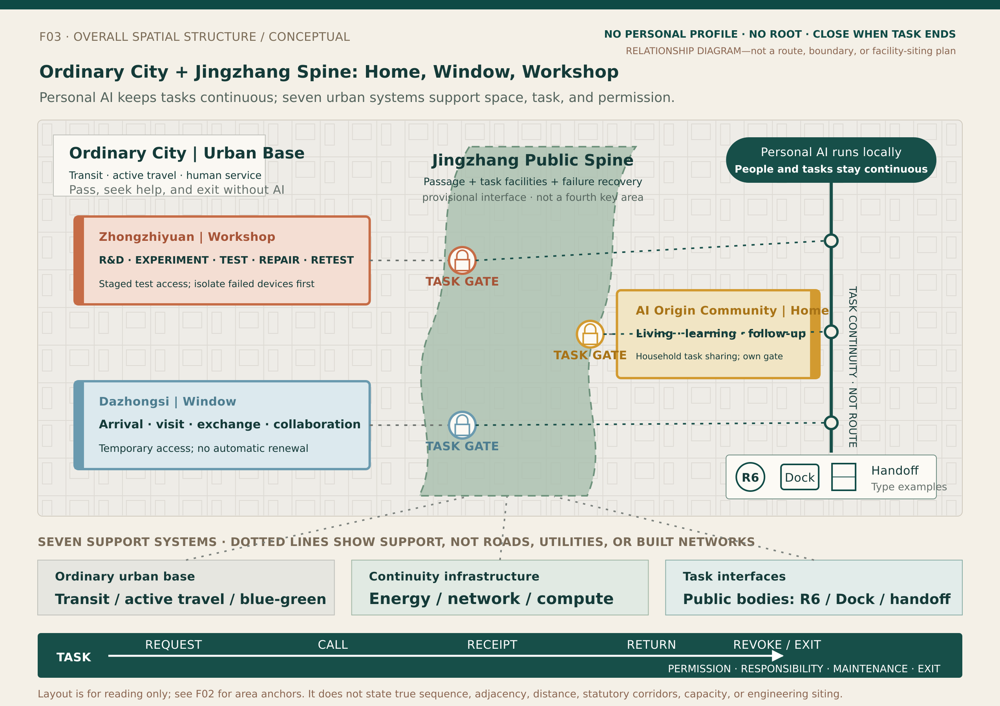

*Figure F03｜Design judgment: ordinary urban fabric provides an urban base that remains viable without AI; within the conceptual overall structure, the Jing-Zhang Public Spine connects the public interfaces of the AI Origin Community as “Home,” Dazhongsi as “Window,” and Zhongzhiyuan as “Workshop.” Personal AI moves with the person and maintains task continuity, while transport, active mobility, blue-green systems, energy, networks, compute, and public bodies provide support only under the corresponding TASK gates. Read the one-spine, three-area structure first; then see how ordinary urban fabric provides the base; finally, read the seven types of support and “request—call—receipt—return—permission withdrawal / exit.” This figure is a provisional spatial demonstrator. It demonstrates only the overall structure and call relationships; it does not represent statutory boundaries, ownership boundaries, the actual order or direct adjacency of the three areas, exact routes, distances, facility quantities, capacities, siting, operators, or construction schemes. Source: the provisional spatial anchors in F02, the role and mechanism semantics of existing presentation pages P01 / P05, and the overall structure described in this proposal; redrawn for this iteration, without treating the graphic placement in P01 / P05 as real geography.*

## 04｜Home, Window, and Workshop: Not Metaphors, but Three Permission Environments

| Spatial Role | Corresponding Area | Primary Tasks | Capabilities Opened by the City | Boundary and Exit |
| --- | --- | --- | --- | --- |
| **Home** | AI Origin Community | Long-term living, learning, follow-up care, and shared family tasks | School and community interfaces, N2, safe waiting, public wayfinding, and shared courtyards | Shared family tasks can be coordinated, but the three people’s personal AIs are not merged; public bodies stop at each independent household threshold |
| **Window** | Dazhongsi | Arrival, accommodation, conferences, dining, urban experience, and external collaboration | Visitor service packages, transport and hotel credentials, Docks, R6, handoff lockers, and multilingual wayfinding | Permissions open for the 36-hour visit and specific tasks; they close when the task is completed, the public body returns to its Dock, or the visitor leaves, and are not renewed automatically |
| **Workshop** | Zhongzhiyuan | Research and development, joint experiments, compute scheduling, testing, repair, and retesting | Compute, microgrid / UPS, controlled experimental courtyards, R6, and maintenance and logistics back-of-house | Temporary experiment permissions are opened for defined segments; faulted equipment is isolated first and readmitted only after it passes retesting |

Together, the three spaces demonstrate that **personal AI can maintain task continuity, while different spaces have different permissions for calling facilities, different facility responsibilities, and different methods of exit.** The same AI need not become another AI in every area; nor does the city need to copy a person’s entire private domain into public systems.

## 05｜Jing-Zhang Public Spine: Calling Facilities Along the Spine, Not Central Takeover

The Jing-Zhang Public Spine is neither a “smart corridor” that funnels private data into a central system, nor a fourth key area. It is a band of public interfaces where ordinary passage remains open at all times, task facilities respond on demand, and the system can operate in reduced mode when faults occur.

Along the spine, a personal AI completes five actions: read public status → request TASK permission → call facilities → receive the task receipt → withdraw permission / exit. The public side discloses only facility status, weather, faults, and the available service range. It neither receives a complete personal profile nor obtains root privileges for the personal AI.

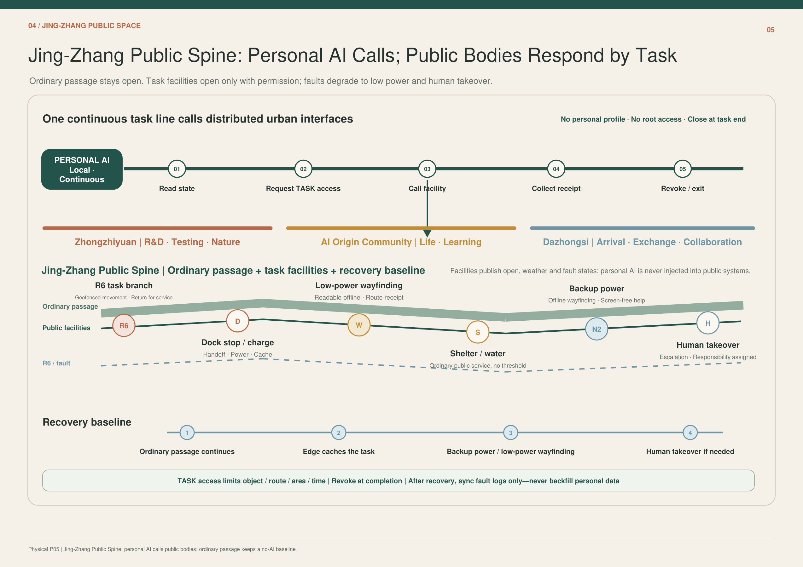

*Figure F05｜Design judgment: ordinary passage, public facilities, R6 / Dock, and the minimum fault-recovery baseline are organized in layers along the same spine. Read the personal AI’s five-step call sequence at the top first, then the three areas and facility nodes in the middle, and finally the four-step fault-recovery sequence at the bottom. It demonstrates a calling mechanism in which “tasks remain continuous and facilities open temporarily”; it does not represent the actual alignment, number of facilities, station spacing, capacity, or statutory locations. Source: existing presentation page P05.*

Public capabilities along the spine include:

- **R6 task branch:** low-speed operation within designated zones, handoff, and return to base for maintenance;
- **Dock:** docking, charging, energy replenishment, caching, cleaning, and receipts;
- **Low-power wayfinding:** remains legible offline and provides routes and fault notices;
- **Rain shelter, drinking water, and ordinary services:** remain available regardless of whether AI is used;
- **N2 and backup power:** support offline wayfinding, screen-free assistance, and checkpoints for critical tasks;
- **Human takeover points:** engage only when anomalies, disputes, or professional responsibility require them; they do not replace the personal AI’s normal task flow.

## 06｜Home: Continuous Life Across Three Generations

**People and tasks**

- **Xiaohe: a nine-year-old student.** She lives and attends school here, and on this day needs to complete the day’s learning, after-school handoff, and journey home.
- **Mother: an office worker who commutes and may need to work late at short notice.** She was originally responsible for pickup, but initiates a change at 17:05 because she has to work late.
- **Grandmother: an older adult who lives independently and attends her follow-up medical appointment on her own.** She has her own personal AI and receives one-time pickup permission only for this shared task.

The three personal AIs remain independent. Family-shared intelligence coordinates only the shared task of “picking up Xiaohe”; it neither reads nor merges the entirety of the three people’s lives.

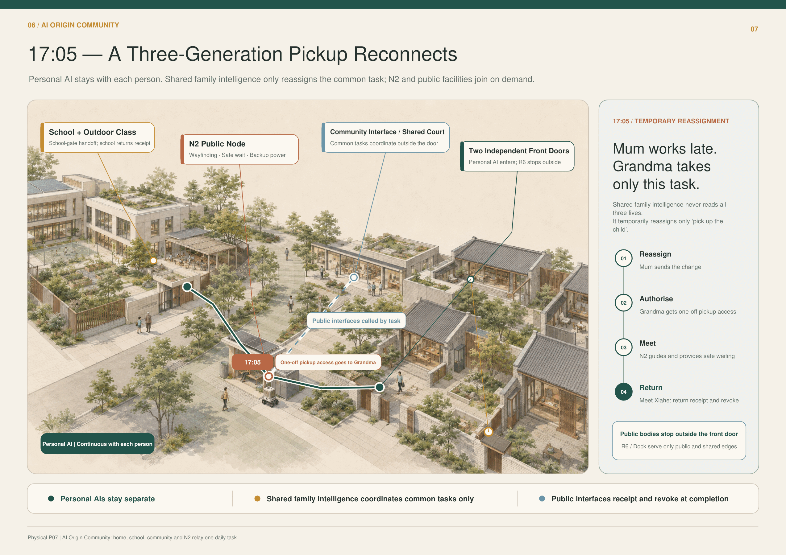

*Figure F07｜Design judgment: the school, N2, community interface, and two independent household thresholds connect within the same pickup task. Read the green personal-AI path in the main diagram first, then the orange temporary-reassignment node and blue public interface at 17:05, and finally the four-step sequence of change on the right. It demonstrates that a shared family task can be coordinated temporarily while the personal AIs, household thresholds, and long-term permissions remain independent; it does not represent the actual school gate, roads, home locations, or a fixed school dismissal time. Source: existing presentation page P07.*

**Change—consequence—design mechanism at 17:05**

1. The mother’s personal AI issues a task change;
2. Family-shared intelligence temporarily reassigns only this pickup task to the grandmother;
3. The grandmother receives one-time pickup permission, while N2 provides wayfinding, safe waiting, and backup power;
4. The school issues a handoff receipt at the school gate;
5. Once Xiaohe has been picked up, the temporary permission is returned and withdrawn;
6. R6 / Dock serves only within public and shared boundaries and stops at the independent household threshold.

Responsibility is assigned segment by segment along the real-world task: the school is responsible for the handoff at the school gate; the N2 operator is responsible for wayfinding at the node and facility status; the grandmother assumes responsibility for this pickup once she has explicitly accepted it; and the property manager and household each maintain their own spatial boundaries. The personal AI sustains understanding, reminders, rescheduling, and receipts, but cannot create real-world access permission out of thin air.

## 07｜Window: Mira’s 36-Hour Visit

**Mira is a visiting scholar staying for 36 hours.** She comes here to understand the demonstration area, attend meetings, experience the urban system, and carry the visit forward into subsequent collaboration. Her personal AI remains on her own device throughout, continuously handling transport, hotel, conference services, dining, materials, routes, and the return journey; the city does not require her to hand her complete personal AI over to a public platform.

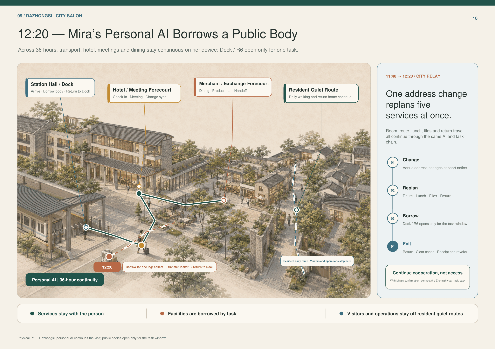

*Figure F10｜Design judgment: the station concourse / Dock, hotel and conference front-of-house, merchant and exchange front-of-house, and residents’ quiet circulation route together form the city’s window. Read Mira’s personal-AI task flow first, then the one-time R6 branch for item collection—handoff locker—return to Dock, and finally the four-step task change on the right. It demonstrates that visitor services remain continuous with the person while a public robotic body is made available only within a specific task window; it does not represent actual merchant, hotel, or station-concourse locations, operating relationships, or a fixed 36-hour itinerary. Source: existing presentation page P10.*

**Change—consequence—design mechanism from 11:40 to 12:20**

After the meeting venue changes at short notice, Mira’s personal AI simultaneously reschedules the meeting room, route, lunch, materials, and return journey. At 12:20, it requests a one-time robotic task for “item collection—handoff locker—return to Dock”:

1. The Dock verifies the item, route, area, and validity period;
2. R6 receives only the permissions required to complete item collection and handoff;
3. The robot does not cross the residents’ quiet circulation route or the guest-room private domain;
4. Upon completion, it returns to the Dock, writes back the task status, and clears the task-specific cache; its task permissions are then withdrawn;
5. Mira reconfirms whether to proceed into a Zhongzhiyuan collaboration task; permission is not renewed automatically.

The personal AI is responsible for the continuity of the visit task. The hotel, conference services, merchants, Dock, and R6 operator are each responsible for the services and facilities they open. Disputes and faults are routed to the corresponding operator, rather than forcing Mira to explain her entire itinerary again across multiple systems.

## 08｜Workshop: A-Cen’s Joint Experiment Day

**A-Cen is a young engineer conducting a joint experiment.** He comes to Zhongzhiyuan to coordinate compute, test space, equipment, external teams, and testing permissions, and to complete a reproducible experiment with provisions for repair and readmission—not merely a one-off demonstration.

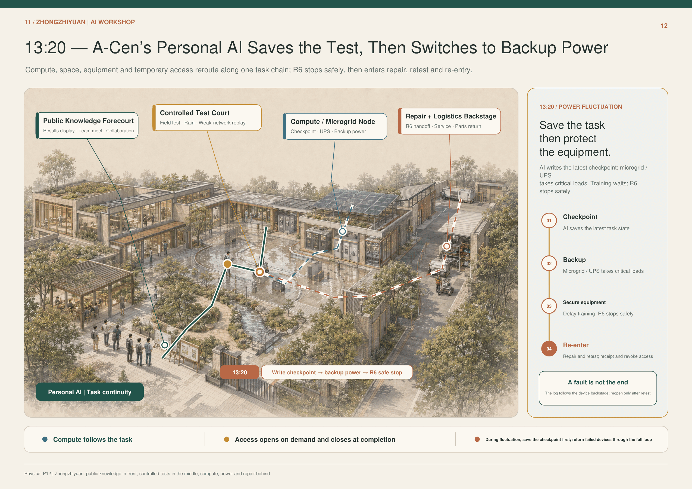

*Figure F12｜Design judgment: the public knowledge front-of-house, controlled experimental courtyard, compute / microgrid nodes, and maintenance and logistics back-of-house are arranged by degree of openness. Read the personal AI’s main task flow first, then the two facility branches for compute / UPS and R6, and finally the fault loop on the right. It demonstrates that an experimental task can remain continuous across compute, power, test space, and maintenance while permissions and equipment remain controlled in segments; it does not represent actual capacity, equipment brands, campus boundaries, or engineering siting. Source: existing presentation page P12.*

**Change—consequence—design mechanism at 13:20**

When the power fluctuates, A-Cen’s personal AI does not force the experiment onward. It first saves the latest checkpoint and then reschedules public resources:

1. Write the latest task status and experiment checkpoint;
2. The microgrid / UPS takes over critical loads;
3. Defer lower-priority training workloads;
4. R6 shuts down safely and writes back its status;
5. The fault log accompanies the equipment into the maintenance and logistics back-of-house;
6. The equipment regains restricted experimental permission only after inspection, repair, and retesting are complete;
7. Temporary permissions are withdrawn when the task receipt is issued.

A-Cen and the experiment lead are responsible for experimental judgments; the compute and microgrid operators are responsible for resource status and switching; the R6 operator is responsible for shutdown, retrieval, and the maintenance loop; and external teams receive permissions only within the scope of that day’s experiment. The personal AI connects resources and tasks, but cannot expand the temporary permissions for a single joint experiment into long-term access across the campus.

## 09｜Public Body: Borrowing, Docking, Maintenance, and Return

Personal AI is not the same thing as a hardware carrier or a public robot. Personal AI belongs to the person and can remain continuous across devices and spaces; robots, elevators, lockers, lobbies, Docks, and compute nodes belong to the city or their operators and are borrowed only within the scope of a task.

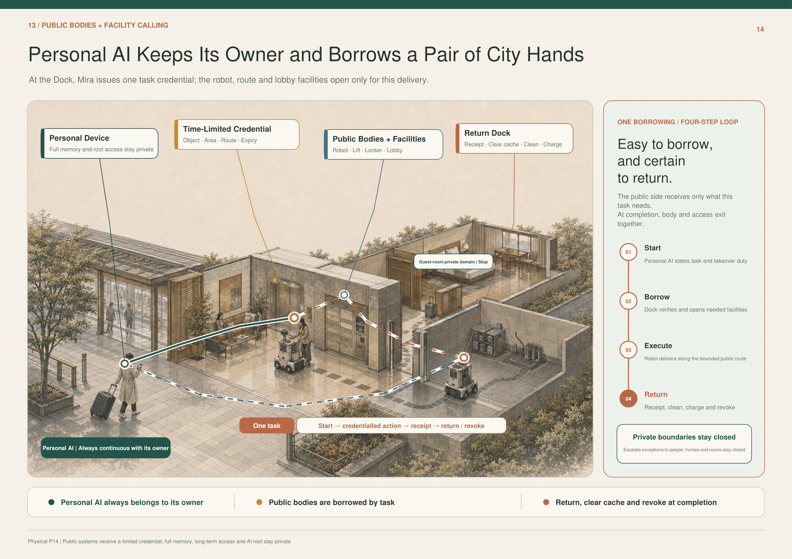

*Figure F14｜Design judgment: a personal device, a time-limited credential, a public body and facilities, and a return dock form the four-step closed loop of a single borrowing process. Read the green personal-AI main line first, then the red and blue task branches, and finally the initiate—borrow a body—execute—return sequence on the right. It demonstrates that the public side receives only a time-limited credential, while full memory, long-term access credentials, and root privileges remain within the private domain; it does not represent specific device protocols, insurance contracts, or operating entities as already in place. Source: existing presentation page P14.*

Every call to a public body must include all of the following:

1. **Task description:** what is to be done, for whom, and who initiated it;
2. **Time-limited credential:** the object, area, route, facilities, and validity period covered;
3. **Execution boundary:** homes, guest rooms, and other private domains are off-limits by default;
4. **Status receipt:** completion, failure, fault, human takeover, or termination;
5. **Return action:** return to the Dock, cleaning, recharging, and clearing the task-specific cache;
6. **Maintenance loop:** diagnosis, isolation, repair, retesting, and readmission;
7. **Verifiable permission withdrawal:** access closes when the task ends, the person withdraws permission, or the credential expires.

## 10｜Fault Recovery, Migration with Permission Withdrawal, and Evidence Boundaries

### 10.1 District Power Outage: The City Scales Down to Minimum Viable Operation

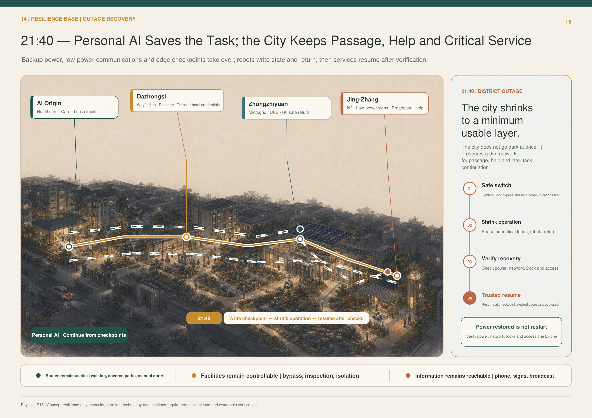

*Figure F15｜Design judgment: during a power outage, AI Origin Community, Dazhongsi, Zhongzhiyuan, and Jing-Zhang each retain their critical service loops, while tasks resume from checkpoints saved by personal AI. Read the illuminated critical paths first, then the four area nodes and the recovery sequence on the right. It demonstrates that “power restored” does not mean “restart”: power, networks, Docks, and permissions must each be verified; it does not represent backup-power capacity, duration, the technical approach, or specific siting as having undergone professional calculation. Source: existing presentation page P15.*

The recovery sequence is: safe switchover → reduced-mode operation → recovery verification → trusted resumption. Ordinary streets, manual door opening, telephones, public-address systems, and physical wayfinding form the AI-independent baseline; personal AI continues from the most recent checkpoint, but permissions that have expired or been withdrawn do not automatically reopen when power returns.

### 10.2 Device Replacement and Migration: AI Continues, While the Old Carrier’s Permissions Reset to Zero

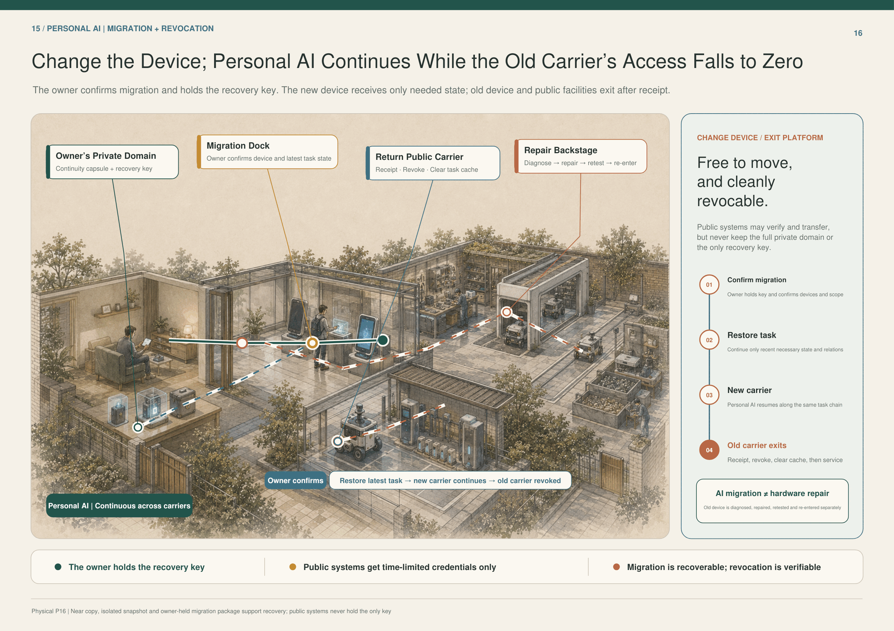

*Figure F16｜Design judgment: the person’s private domain, the migration Dock, return of public carriers, and the maintenance and logistics back-of-house form a migration—permission-withdrawal closed loop. Read the personal-AI main line from the old device to the new one first, then the public-carrier return and maintenance branch, and finally the four migration steps on the right. It demonstrates that migration is recoverable and permission withdrawal can be verified, while the public side does not hold the sole recovery key; it does not represent a specific cryptographic scheme, carrier product, or service contract as having been determined. Source: existing presentation page P16.*

The person confirms the migration and holds the recovery key; the new carrier restores only the state and collaborative relationships required for the most recent task; after receipt, permission withdrawal, and clearing the task-specific cache, the old carrier enters a separate maintenance process. AI migration is not the same as sending hardware for repair. The public side may assist with verification and transfer, but it neither stores the full contents of the private domain nor holds the sole recovery key.

### 10.3 Evidence Boundary for This Iteration

- **What can already be demonstrated:** the overall thesis, the three spatial roles, the logic of task-based calls, the character task chains, the closed loop for borrowing a public body, the power-outage recovery sequence, and the principles of migration and permission withdrawal now form a coherent narrative.
- **What still cannot be demonstrated:** official geometry, ownership, the actual facility inventory, capacity, cost, operators, insurance, technical protocols, statutory planning metrics, construction siting, and actual performance.
- **Prerequisites for the next release:** rebinding to the official base map, site surveys, professional load and municipal-infrastructure verification, confirmation of operating responsibilities, a minimum pilot-site exercise, AI-independent baseline testing, and a permission-withdrawal audit.

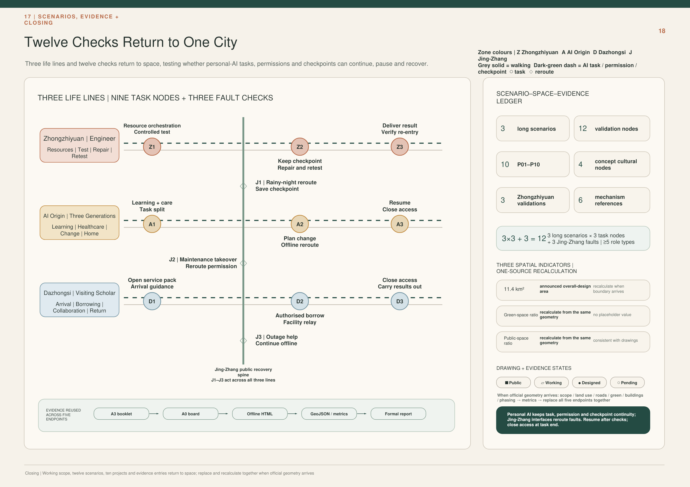

*Figure F18｜Design judgement: Nine task nodes across three everyday routes and three Jing-Zhang fault reroutings form twelve checks; at right, a scene–space–evidence ledger, three co-sourced recalculated metrics, and figure status close the loop. First read the three task lines for Zhongzhiyuan, AI Origin, and Dazhongsi on the left; then see how J1–J3 reroute across lines; finally read the five evidence endpoints on the right and their coordinated replacement when official geometry arrives. It demonstrates that scenes, space, permissions, and evidence can reuse one source, that work resumes only after verification, and that permission closes when a task ends; it does not represent the engineering sequence of Phases 0–4, formal boundaries, metric values, or a construction plan as already determined.*

## 11｜How to Build, Validate, and Close Out

Implementation does not begin by filling the city with smart devices. It begins with the baseline urban fabric and the minimum verifiable task.

| Stage | Main Actions | Gate That Must Be Passed at This Stage |
| --- | --- | --- |
| **Stage 0｜Rebinding** | Once official geometry is available, redraw the three-scale extents and the overall structure, and recalculate all spatial indicators | The sources for boundaries, ownership, roads, buildings, and municipal infrastructure are traceable |
| **Stage 1｜Preserve the Base** | Verify ordinary access, walking and cycling, staffed services, mechanical bypasses, lighting, and conventional municipal infrastructure | Access, assistance, and exit remain available independently of AI |
| **Stage 2｜Build the Interfaces** | Deploy N2, Docks, handoff lockers, low-power wayfinding, task credentials, and checkpoints in a reversible manner | Every interface has a defined object, permission, responsibility, maintenance arrangement, and shutdown condition |
| **Stage 3｜Validate at Limited Scale** | Validate pickup reassignment, the 36-hour visit, the joint experiment, and R6 borrowing separately | Routes are legible, facilities are findable, permissions expire, and faulted assets can be recovered |
| **Stage 4｜Retest and Expand** | Conduct drills for power-outage recovery, post-repair retesting, migration and permission withdrawal, complaints, and disputes | A failed operation can be stopped; repairs must be reverified, and “recovery” does not automatically renew permission |

Every pilot must record at least five kinds of evidence at the same time: whether the task was completed, whether the route was traversable, whether the facilities were usable, whether permissions closed on time, and whether return and recovery were possible after a fault. Data that does not close the loop remains marked as unknown; conceptual diagrams must not be used to infer actual performance.

Ultimately, the entire city returns to the same sentence:

> **What remains continuous is the person’s personal AI and the task at hand; what opens temporarily is the city’s public capabilities.**

---

# Formal Submission Contract and Evidence Layer

The following layer only maps the preceding 01–11 human-reading sequence to existing sources, spatial records, P01–P10, twelve SCN records, metrics, and compliance files. It does not rewrite the thesis or add projects, scenes, statutory boundaries, geometry, or metrics.

<!-- PR4300 review-closure 2026-08-30:start -->
## Taskbook Closure | Three Positionings · Five Functions · Three Zones and Two Wings

> This is a **review-visibility layer** over the existing P01–P10, twelve SCN, five urban networks and three life loops. It creates no new statutory boundary, project ID, scene ID, geometry, metric or claimed partnership. External-region, funding, operator and professional-development items remain `design proposal / proposed collaboration / unknown`, not signed, funded or implemented facts. [source:AGENT-TASKBOOK] [standard:PROJECT-AGENT-OPEN-CALL-TASKBOOK]

### Three Positionings and Five Functions: direct backlinks

| Taskbook requirement | Reviewable output in this proposal | Existing P / SCN backlinks | Responsibility / stop condition |
| --- | --- | --- | --- |
| Centennial Jing-Zhang Cultural Belt | The Jing-Zhang public spine organises railway engineering history, maintenance history, open contribution and new AI civic culture as a correctable, removable and offline-readable public sequence | P01 / P07 / P09 / P10; SCN-JZ-01/02/03 | No engineering release until sources, heritage boundary, accessibility and fire conditions are checked; cultural wayfinding never replaces statutory safety signs |
| Urban AI Life Experience Belt | AI Origin as “home” + Dazhongsi as “window”: learning, pickup, care, outage, visit and exit start from bounded requests by people/private agents | P04–P10; SCN-AIO-* / SCN-DZS-* | Ordinary non-digital access first; child refusal, absent receiver, permission overreach or failed exit stops the chain |
| AI Integrated Innovation Belt | Zhongzhiyuan as “workshop”: machine-weather, repair/retest, edge compute and result-level delivery sit on an isolatable, recoverable urban test base | P01–P03 / P10; SCN-ZZY-01/02/03 | No opening if hard stop, isolation, maintenance, responsibility, insurance/qualification or public boundary is unclosed |
| Full-stack independent AI innovation system | Bounded test → diagnosis → repair → retest → result-level delivery → capability return to community | P01–P03 / P10 | Raw personal data does not persist across tasks; qualified human review for high-risk steps |
| World-class AI innovation ecosystem | Three Zones + Two Wings + regional exchange; eight gated factors: land, space, industry, capital, talent, compute, data and scenes | P01–P10 / 12 SCN | Unverified actors, budgets and partnerships remain proposed / unknown |
| New paradigm of AI+ scenario enablement | Twelve registered scenes + visitor, local-economy and classroom/pickup life loops | 12 SCN | Scene opening requires ordinary service not to degrade and must remain pausable and reversible |
| Smart, vibrant AI city | Five urban networks support ordinary life, public space, testing/repair, movement and energy/communications recovery together | P01–P10 | Paper, telephone, mechanical bypass and staffed service remain available when AI fails |
| Global discourse on AI governance | “The city accepts one bounded task, not a complete person”: permission, named acceptance, minimum disclosure, hard stop and full exit become auditable urban protocol | P04–P10; M-PSS-* | No central personal repository, continuous profiling or silence-as-consent; disputes/incidents route to humans and permissions close |

### Three Zones and Two Wings

| Node | Primary role | Provides | Receives | Admission / governance / exit |
| --- | --- | --- | --- | --- |
| Zhongzhiyuan · Workshop | Bounded R&D, testing, repair, retest | Test space, repair back-of-house, verified compute/device capability, result-level validation | Explicit test tasks, faulty devices and reproduction conditions from community/visits/industry | Project-level permission; public/device separation; hard stop, isolation and safe return |
| AI Origin · Home | Ordinary-life and public-service validation | Learning, pickup, ageing, household-shared-side and community-service scenes | Retested devices/services, rule updates, capability returned to neighbourhood | No whole-household upload; human review for child/care risks; permission closes with task |
| Dazhongsi · Window | City foyer, visit and international translation | Multilingual visit bundle, public orientation, meeting/cooperation handoff | Visitor-initiated temporary tasks and cooperation requests explicitly accepted by institutions | Credential-free route remains; visitors are not test sensors; temporary access fully exits |
| Zhongguancun Technology Service Wing | **Proposed role**: professional-service and innovation-resource interface | Technology, IP/compliance, finance and enterprise-service capability (specific institutions TBD) | Verifiable project needs/results from the three zones | Do not describe the wing as an established alliance; per-project admission, conflict disclosure and exit |
| Xiaoyuehe Scenario Enablement Wing | **Proposed role**: public-scene and reversible-use interface | Blue-green/public-space scenes, public feedback, events and low-risk trial conditions (sites TBD) | Reversible scene proposals that have passed safety/responsibility gates | Ordinary public use first; removable equipment/events; stop if access, quiet or maintenance is impaired |

### Eight-factor AI innovation ecosystem / industry–space exchange map

| Factor | Provider (current evidence state) | Receiver | Exchange object | Opening mode | Public condition / exit |
| --- | --- | --- | --- | --- | --- |
| Land | Future verified right-holder plus applicable statutory/working boundary and planning controls (mostly unknown / provisional today) | Spatial development of a specific P / SCN | Rights/planning conditions that determine whether the next step may proceed; concept graphics never substitute for title | Verify project by project after official / cleared evidence arrives | No construction commitment before title, statutory controls, redlines and applicability are verified; re-bind when conditions change |
| Space | Verified future site/public-space/building operator (unknown) | P / SCN unit | Time-bounded reversible site, ground-floor/public interface, test window and facility interface | Apply → verify → open at small scale | No opening before fire, accessibility, maintenance, ordinary access and exit gates close; restore ordinary use at expiry |
| Industry | Enterprises/service/repair/test actors (all to be named) | Workshop, neighbourhood services, visit cooperation | Equipment, service, repair, retest, standards feedback | Qualification + task contract | No forced exclusivity or paid “organic ranking”; complaints/incidents can pause |
| Capital | Lawful funding categories (public procurement/research/enterprise investment etc. are possibilities only) | Specific project/activity | Project budget/resource envelope | Explicit approval per project | No budget, subsidy or investment commitment here; no authority/funding means no start |
| Talent | Candidate university/research/industry/community mentors (no partnership fact asserted) | R&D, repair, education, guiding, operations | Time-bounded professional capability + named responsibility | Qualification/background/labour terms per task | High-risk work stops without qualification; temporary permissions end with task |
| Compute | Verified future P03-type operator (operator unknown) | Bounded experiment/retest team | Time-bounded quota, edge compute, checkpoints | Project-level authorization | No whole private memory; degrade by predeclared rule under capacity conflict; release at end |
| Data | Lawful public sources, anonymous field observation, bounded test outputs | Isolated sandbox / named project team | Minimum input, result-level output, necessary fault summary | Purpose limitation + expiry | No raw personal trajectory/home endpoint export; cross-task inheritance denied by default |
| Scenes | Verified future site/public-service unit (unknown) | Developers, researchers, visitors/public experience | Reversible trial window, interface and evaluation question | Apply → review → small trial → retrospective | Ordinary service must not degrade; safety/access/privacy/responsibility/maintenance failure pauses or exits |
### Regional collaboration | proposed exchange only, never “already partnered”

| External area | Proposed exchange | Initiator / receiver | Minimum boundary | Stop / exit |
| --- | --- | --- | --- | --- |
| Beiwei Community | Ordinary-service usability, neighbourhood-service feedback, low-risk co-design questions | Explicit project initiator; voluntary community receiver | No household profile/continuous trajectory; return only problem/result | Stop without community authorization, if daily life is impaired or exit is impossible |
| Future Science City | Research talent, technology validation, facility-use needs and research questions | Project-to-project | No assumed institutional commitment; facility/data/IP terms per project | Stop if rights, safety or responsibility is unclear |
| Huairou Science City | Research facilities, scientific validation methods and interdisciplinary questions | Project-to-project | Exchange only necessary task/result summary | Stop without explicit receiver or closed confidentiality/IP terms |
| Beijing E-Town | Engineering, manufacturing/supply chain, robotics/vehicle industrial validation capability | Project-to-project | Do not describe capabilities as signed suppliers or tenants | Stop if qualification, operating domain, insurance or quality responsibility is unclosed |
| Beijing–Tianjin–Hebei | Inter-city talent, supply chain, events, visits and dissemination | Named organisations initiate item by item | No cross-city personal master database; permissions/data stay within responsible domain | Permission closes with task; do not start when cross-domain responsibility cannot be named |

### Brand, landmarks, honour display and cultural wayfinding | review direction

**Project logo / visual identity.** An original “open door frame + unsealed threshold line” geometry pairs with `有门的城市 / A City with Doors`. It expresses entry and exit and does not imitate an institutional logo. **Generation method:** two vertical strokes plus one top stroke form the open frame; a shorter offset threshold line closes the composition without sealing the doorway. The mark is drawn from basic geometry only, with no imported, traced or transformed third-party trademark. Chinese and English may sit horizontally or in a stacked lockup, with at least one frame-stroke width of clear space between mark and type. Palette: ink `#15334A`, jade `#2F7B69`, city blue `#2F6593`, Jing-Zhang gold `#BD8832`; stop/alert red `#AA5148` is reserved for risk and shutdown. The mark must not be stretched, rotated or substituted for fire, accessibility, evacuation or other statutory/common safety symbols. Monochrome fallback is black/white, with clear space of at least one frame-stroke width.

**Three pilgrimage/memory landmark concepts** (all design proposals; site and professional conditions TBD):
1. **Centennial Time Gate**: a candidate Jing-Zhang spine node with replaceable time slices for railway engineering, maintenance, city and AI civic culture; sources traceable, errors correctable, entries removable.
2. **Machine-Weather Observation Gate**: a candidate public-edge node at Zhongzhiyuan where bounded testing, hard stop, safe return and repair are visible without admitting the public into the operating domain.
3. **City Foyer Gate**: a candidate Dazhongsi foyer marker combining multilingual orientation, credential-free route, staffed help and temporary Visitor Agent Landing Hall; digital permissions fully exit at expiry.

**Honour display.** Replaceable contribution plaques show contributor/team, contribution, source, version, date, review status and correction/removal path together; rankings are not sold and public recommendation is not converted into advertising inventory.

**Reversible component library.** Open door frame, offline/tactile map, replaceable contribution plaque, low-permission help light, machine return/handoff pocket, movable shade/seating are professional-development interfaces only and cannot block drainage, fire access, accessibility, conventional maintenance or resident quiet routes.

**Brand vs cultural wayfinding.** Brand answers “whose proposal is this”; cultural wayfinding answers “how does a person read Jing-Zhang—Zhongguancun—new AI culture and arrive safely”. Jing-Zhang uses time/engineering/maintenance narrative; Zhongguancun uses open contribution/version/review narrative; new AI culture uses permission/responsibility/exit narrative. Brand marks never replace transport/safety/accessibility signs.

### P01–P10 + 12 SCN | unified operating-responsibility matrix

> This table standardises **responsibility fields only**; it creates no new operating institution. `initiation / operation / maintenance / takeover / emergency stop / review / complaint / data / revocation` are role types. Before real implementation, every role type must be replaced by a named, verifiable responsible party.

| Unit | Initiation / operation / maintenance | Human takeover / emergency stop | Independent review / complaint-dispute | Data minimization / final revocation | Handoff condition |
| --- | --- | --- | --- | --- | --- |
| P01 Blue-Green Open Validation Loop | Scene/test proposer; public-space operator; landscape/facility maintenance | Onsite staffed takeover; test-safety role performs hard stop | Ecology/accessibility/safety review; P10 or site complaint channel | Anonymous counts + device status only; revoke test permission when task ends | Ordinary public route exists first; open only after named onsite receiver confirms |
| P02 Machine-Weather Field + Safe Recovery Harbour | Experiment lead; bounded-test operator; device/recovery maintenance | Named safety role takes over; independent hard stop, power isolation and containment | Test-safety/quality review; incidents enter the site responsibility chain | Keep only version, weather, fault and recovery status; operating credential expires at end | Device is isolated and recovery plan plus receiving maintenance role are explicit |
| P03 Repair–Energy–Edge-Compute Back-of-House | Device/experiment task party; repair/compute operator; named technical maintenance | Duty engineering role takes over; isolate and de-energise faults | Independent retest; repair/service disputes route to P10/operator | Minimum diagnosis + result-level receipt; release diagnosis/compute permission at end | Readmission only after retest passes and receiver explicitly accepts |
| P04 Three Slow-Gate Safety Corridor | School/guardian task initiation; school–road–community segmented operation; road/property maintenance | Named school/community human takes over; identity/route/refusal anomaly stops handoff | Child-safety/traffic/accessibility review; pickup disputes handled by named humans | One-time handoff credential; no face tracking or persistent child profile; revoke on receipt | Child has not refused and qualified receiver completes physical handoff |
| P05 Visible Help-Door Network | Person/agent initiates; named public-service point operates; property/facility maintenance | Staffed window takes over; digital transfer stops without qualified receiver | Service/accessibility/professional-qualification review; complaint to P10/service body | Transfer only current-help minimum; close permission after completion/referral receipt | Transfer only after next responsible party explicitly accepts |
| P06 Household–Community Continuity Node | Household/community task initiation; property/community resilience operation; power/comms/facility maintenance | Duty human takes over; outage returns to non-AI baseline | Fire/resilience/privacy review; complaint to community/P10 | No home endpoint/continuous trace; close emergency temporary permission after review | Household boundary does not expand; segmented responsible humans explicitly receive |
| P07 Dazhongsi Four-Quadrant Ground Stitch | Travel/visitor task; transport/public-space operation; road/facility maintenance | Station/onsite human takes over; unsafe route closes immediately | Transport/fire/accessibility review; access dispute to station/P10 | Ordinary route needs no identity; clear temporary guidance task at end | Next ordinary/accessibility segment is physically reachable and responsibility boundary is explicit |
| P08 Staffed City Foyer + Visitor Landing Hall | Visitor actively initiates; foyer/receiving institution operate by segment; information/facility maintenance | Foyer staff takes over; digital assistance may stop at any time | Multilingual/accessibility/privacy review; human appeal channel | Hold only short-term visit task + necessary credentials; fully revoke at expiry | Receiving institution explicitly accepts; recommendation never auto-transfers responsibility |
| P09 Reversible Event Commons + Resident Quiet Route | Event proposer; site/event operator; site maintenance | Onsite lead takes over; access/noise/egress/exit failure stops event | Fire/crowd/noise/accessibility review; resident complaint direct to site/P10 | Event-only aggregate information; equipment/credentials/interfaces exit together at end | Handoff/closeout completes only after ordinary access and resident quiet route are restored |
| P10 City-with-Doors Human–Machine Public Service Network | Any public task initiates; domain-specific staffed nodes operate; node facilities maintained locally | Named service staff takes over; isolate fault domain rather than centralising the city | Independent audit/professional review; complaints, appeals and incidents traceable | Minimum task ticket; no full private-domain repository; revoke after receipt | Origin responsibility ends only after destination/professional receiver explicitly accepts |
| SCN-ZZY-01 Machine-Weather Admission and Safe Return | Test lead; P01/P02 operation/maintenance | Safety role takes over; hard stop, isolation, mechanical recovery | Independent safety review; incident complaint enters test responsibility chain | Minimum device-state record; revoke operating permission when run ends | Public boundary, hard stop, maintenance and safe-return receiver all exist |
| SCN-ZZY-02 Fault Diagnosis–Repair–Retest | Device responsible party; P03/P10 repair service | Technical human takes over; fault remains isolated | Independent retest/quality review; repair dispute appealable | Minimum diagnosis; no inheritance across work orders; revoke diagnosis permission at end | Retest passes and original task party explicitly receives |
| SCN-ZZY-03 Public Sample–Isolated Sandbox–Result Delivery | Named research/task party; sandbox operation/maintenance | Data/safety human takes over; out-of-bound export stops immediately | Independent privacy/data/method review; dispute traceable | Minimum input, result-level output; clear temporary permission/cache after task | Deliver only result + necessary fault summary; receiver confirms purpose boundary |
| SCN-AIO-01 15:30 Staffed Handoff | School side initiates; P04/P05/P10 segmented operation | Named school/community human; refusal, identity ambiguity or absent receiver stops | Child/traffic/accessibility review; pickup complaint handled by humans | One-time handoff information, no persistent tracking; revoke after physical receipt | Responsibility transfers only when qualified receiver physically receives the child |
| SCN-AIO-02 21:40 Outage Journey Home | Fault trigger/person task; P06/P10 segmented operation | Property/community humans relay; screens exit, mechanical bypass remains | Resilience/fire/privacy review; fault complaint traceable | No home endpoint; emergency permission does not auto-renew when power returns | Each segment is explicitly received by next human and household privacy stop-line holds |
| SCN-AIO-03 Older-Adult Care Preauthorise–Takeover–Close | Person/preauthorised task; P05/P06/P10 service | Named community human takes over first; stop without qualified care/medical receiver | Care/medical qualification + privacy review; complaints/disputes handled by humans | Current-care minimum only; close permission after completion receipt | Qualified receiver explicitly accepts; AI prompt never substitutes professional acceptance |
| SCN-DZS-01 Arrival Visitor Multilingual Foyer | Visitor actively initiates; P07/P08/P10 operate | Station/foyer human; digital route may be withdrawn and falls back to ordinary route on failure | Accessibility/privacy/service review; visitor appeal has staffed exit | Minimum itinerary/visit task; revoke visitor bundle on departure/expiry | Receiving institution explicitly accepts; credential-free ordinary route always exists |
| SCN-DZS-02 One Work Commission with Five Powers Separated | Commissioner initiates; P08/P09 corresponding operation | Dispute routes to human handling; pause if five powers collapse into one | Independent acceptance/dispute review; payment and appeal separated | Keep only this commission’s necessary data; close commission/execution/acceptance/payment/dispute permissions separately | Next role for each power explicitly accepts; role overlap never auto-transfers responsibility |
| SCN-DZS-03 Event–Quiet Route–Complete Exit | Event party initiates; P07/P09/P10 site operation | Onsite human takes over; crowd/noise/exit-gate failure stops | Crowd/fire/noise/accessibility review; resident complaint direct | Aggregate footfall/event records only; temporary permissions/interfaces return to zero after exit | Resident quiet route, ordinary access and ordinary site state all restored |
| SCN-JZ-01 Post-Rain Night Detour with Three Proofs | Road-state trigger/person task; P01/P04/P07 segmented operation | Patrol humans relay; unsafe branch closes | Night-access/accessibility review; help/complaint reaches human | No identity trace; temporary detour permission revoked when road state recovers | Next safe segment is physically passable and human responsibility boundary explicit |
| SCN-JZ-02 Spine Opening/Closing in Ice, Snow or Heat | Climate/site-state trigger; P01/P02/P09 operation | Site human takes over; undefined metrics cannot be used as release evidence | Climate/safety/blue-green professional review; dispute traceable | Minimum weather/facility state; revoke opening/closing permission at end | Ordinary route and maintenance conditions exist first; reopen only after review |
| SCN-JZ-03 Screenless Relay During Outage | Fault trigger; P04/P06/P08/P09 segmented operation | Park–property–public-service humans receive segment by segment; screenless/fixed comms backstop | Resilience/fire/accessibility review; fault/help complaints available | No home endpoint; re-check emergency permissions item by item before close/reopen | Next named human explicitly accepts; responsibility/data never expand into household private domain |

### Agent.6 | annual operating model and scene-opening RACI

Proposed annual umbrella brand: **Doors Open Season / 有门开放季**, a reversible non-government operating prototype: Q1 rules/source update; Q2 public scenes + non-AI drills; Q3 test–repair–retest + developer open week; Q4 contribution correction, exit and annual retrospective.

| Unit | Audience / output | R | A | C / I | Minimum resource | Complaint / incident / stop |
| --- | --- | --- | --- | --- | --- | --- |
| Doors Open Season | Residents, visitors, developers; annual public issue list + retrospective | Future named project/event team | Verified site/operator (currently unknown) | P10 staffed nodes, specialist review, affected public / public users | Site, staff, non-AI bypass, insurance/permission as applicable | Named human complaint path; stop on access/safety/quiet/exit failure |
| Developer community | Bounded APIs/devices/scene questions, reproduction and docs | Named technical/community team | Verified resource operator | Repair, data, privacy, safety, accessibility roles / public | Sandbox, version record, repair and permission closure | Pause on overreach, irreproducibility or unclear data boundary |
| Scene opening | Apply → review → small trial → retrospective → exit | Scene proposer + onsite executor | Site/statutory responsible party | Affected public, P10, professional review / ordinary users | Ordinary-service baseline, responsibility sheet, hard stop/manual bypass | Close when any blocking gate fails |
| Public experience / landmark maintenance | Keep wayfinding/components/contribution plaques readable and removable | Named maintenance team | Site operator | Heritage/architecture/fire/accessibility/community / public | Inspection, spares, offline information | Take incorrect info offline first; remove/return to ordinary state if maintenance/safety is obstructed |
| International communication → visit → trial → cooperation | Move from communication to short visit, bounded trial, non-binding cooperation | Visit/project team | Named receiving institution at each stage (all TBD) | Dazhongsi foyer, Zhongzhiyuan, legal/IP/professional review / participants | Multilingual material, temporary permission, schedule/site, exit record | A visit never auto-upgrades to cooperation; stop without receiver or closed IP/responsibility/insurance |

**Outcome accumulation and talent/company conversion.** Each cycle accumulates only versioned issue lists, reproducible experiment/service results, corrected documentation, verified service cards and explicit next-step needs—not a complete personal profile. A person/team may move from public participation → developer community → bounded trial/service → verifiable result → named project cooperation only after qualification, IP, labour/procurement and conflict-of-interest conditions close. A company may move from an open service card/bounded scene → retest result → explicit receiver → non-binding cooperation intent → separate contract. A visit, event, award or one test never auto-converts into hiring, procurement, investment or tenancy.

Every operating role above is a **proposed responsibility structure**, not an existing institution, roster, budget, government calendar or investment commitment. Before real launch, every `unknown` must become named, verifiable responsibility and resource evidence.
<!-- PR4300 review-closure 2026-08-30:end -->

## Design Basis and Source List

The proposal uses the official structured brief, public announcement, standards library, public sources and cleared internal design artifacts. Every claim is separated into official/public source, provisional source, design proposal or unknown. A registered source is not automatically a professionally verified claim. Exact official polygons are not available; the package therefore uses visibly labelled provisional geometry with a single replacement and recalculation path. [source:SITE-PACKAGE] [standard:PROJECT-OFFICIAL-ANNOUNCEMENT]

### R01 | Statutory background is a boundary, not geometry or an existing-condition substitute

| Evidence | Public contract | Source refs |
| --- | --- | --- |
| `STAT-N7-1E-01` | Official material confirms an approved street-level plan for nine districts and approximately 16.7 km²; this project does not derive competition boundaries or parcel controls from it. | [source:SRC-N7-1E-STAT-01] [source:SRC-N7-1E-STAT-02] |
| `STAT-N7-1E-02` | The government reprint supports directional Dazhongsi and public-service context, but not project sites, operators, budgets or service readiness. | [source:SRC-N7-1E-STAT-02] |
| `STAT-N7-1E-03` | Official records evidence the Phase II approval, tender procedure and reported progress of the described supporting works; they do not prove completion of all works or this competition proposal. | [source:SRC-N7-1E-STAT-03] [source:SRC-N7-1E-STAT-04] [source:SRC-N7-1E-STAT-05] |

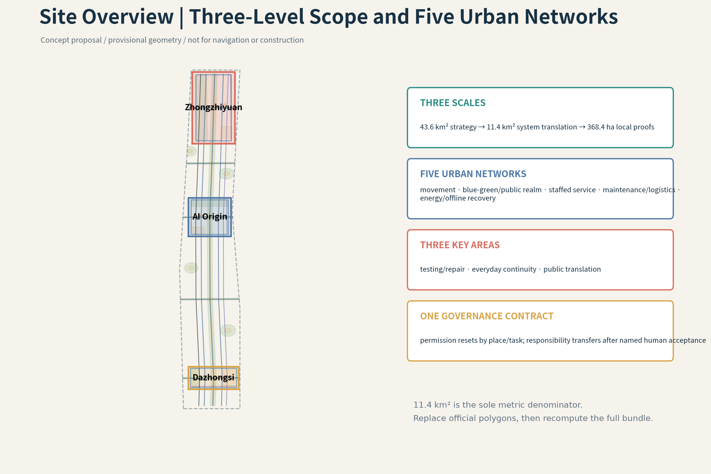

## Three-Level Scope Framework

The 43.6 km² strategic area addresses industry, culture and future-city strategy; the 11.4 km² design area translates the proposition into spatial networks, projects and metrics; the 368.4 ha of three key areas tests differentiated local proofs at equal depth. The levels are not added together or substituted for one another. The 11.4 km² layer is the sole denominator for the three spatial metrics. [source:SITE-PACKAGE] [depth:three_level_scope_framework] [metric:site_area_sqm]

All three current polygons are derived from announcement wording, stated area and provisional anchors: their areas must not be added, and a key-area boundary must not replace the 11.4 km² metric denominator. When official geometry arrives, all nine spatial datasets, figures and metrics must be recalculated together as one version. [data:geometry/key_areas.geojson#PROV-KEY-001] [depth:metrics_recalculation]

## Coordinated Research Area: Industry and Future City Research

A City with Doors makes continuity of human life the upper-level objective. Private-side capability may persist, but permission, space, device access and responsibility reset in each public setting. The public side accepts a bounded task, not the complete person, household or private agent. The innovation ecosystem links people, public institutions, knowledge institutions, industry, four spatial systems and responsibility gates; cross-area exchange is limited to tasks, results, receipts and necessary fault summaries. Six primary-source precedents are used only to compare mechanisms. [source:AGENT-TASKBOOK] [source:CASE-03] [standard:PROJECT-AGENT-OPEN-CALL-TASKBOOK]

### Six Global Precedents and Transferable Mechanisms

- **Modena Automotive Smart Area (MASA) (Modena, Italy)**: Instrumented public urban area with cameras, 4.5G communications, servers and sensors; a separate reserved dynamic area uses cloud-connected signals, digital signage, obstacle-recognition cameras, sensors and removable road markings. Limitation: Research and certification environment, not a mass public mobility service; data-centre/control-room centralisation and public-access safeguards require separate scrutiny. [source:CASE-01]
- **Accessibili-D Autonomous Shuttle (Detroit, USA)**: Predefined and on-demand accessible shuttle network linking residences, medical care, shopping and community destinations; booking available by app or phone; stops were placed near senior housing and apartment complexes. Limitation: Temporary pilot; continued service depends on procurement and funding. Eligibility, stop geography and safety-operator dependence limit transferability. [source:CASE-02]
- **SHOW — Shared Automation Operating Models for Worldwide Adoption (20 European cities / multi-country)**: Fixed-route public transport, demand-responsive transport, MaaS and logistics services were tested in dense urban, peri-urban, neighbourhood and controlled environments. Limitation: Low average speeds and context-dependent performance; accidents and conflicts occurred; pilot diversity complicates direct transfer to one district. [source:CASE-03]
- **Punggol Autonomous Shuttle Services (Singapore)**: Fixed-route first/last-mile shuttles connect housing estates to polyclinics, markets, MRT/bus nodes and neighbourhood amenities, with designated pickup/drop-off points and physical signage. Limitation: Safety operators remain onboard; service is route- and stop-constrained; resident feedback showed fixed-route limitations. [source:CASE-04]
- **Beijing High-Level Autonomous Driving Demonstration Area / E-Town (Beijing, China)**: Defined operational domains, designated test/service routes, instrumented roads and connections to transport hubs; permit stages move from staffed tests to remote-supervised unmanned service. Limitation: Official sources emphasise expansion and industry development; public audit, privacy, ordinary non-app access and local failure-recovery evidence require further investigation. [source:CASE-05]
- **Waymo Rider-Only Urban Service (Multiple US cities; San Francisco Bay Area as urban reference)**: Driverless ride-hailing operates in mixed traffic and depends on curb pickup/drop-off, fleet maintenance, remote assistance and bounded operational domains. Limitation: Operator-controlled service and data; not a public spatial governance model; equity, curb competition, deadheading and outage continuity are outside the cited evidence used here. [source:CASE-06]

## Overall Design Area: Urban Renewal and Regulatory-Plan-Level Urban Design

The 11.4 km² layer is not a diagram of lines between three districts. It is organised as five maintainable urban networks: ordinary movement and walking; blue-green and public space; staffed service and non-AI relay; testing/logistics/repair/safe return; and energy/communications/recovery. A cross-cutting permission contract specifies who initiates a task, what is accessed, when permission closes, who accepts responsibility and how the system returns to ordinary service. [data:geometry/roads.geojson#N2B-RD-001] [data:geometry/public_space.geojson#N2B-PS-001] [depth:overall_spatial_structure]

Urban renewal does not begin with a demolition or new-build count. It first protects continuous roads, accessibility, conventional utilities and staffed entry that require no app; it then reuses existing ground floors, public space and service space as reversible interfaces, and only after that considers permanent new structures. Land use, buildings, roads, green space, public space, constraints and phasing must share the same P, SCN, responsibility, maintenance, recovery and exit fields. Because statutory land use, ownership, building, station-access and utility-capacity data remain missing, current layers express only an auditable design structure and release no FAR, height, demolition or engineering commitment. [depth:retain_renovate_demolish] [depth:traffic_rail_slow_parking]

## Detailed Design of Key Areas

Zhongzhiyuan tests an isolatable, repairable and retestable industrial base; the AI Origin Community tests low-intervention continuity across education, healthcare, older-adult care, households and outages; Dazhongsi tests a staffed urban foyer that can be entered, refused, appealed and fully exited. Each area retains an ordinary public route, staffed service route, maintenance/recovery route and local degraded mode. The Jing-Zhang spine links them without becoming a fourth key area. [data:geometry/key_areas.geojson#PROV-KEY-001] [data:geometry/key_areas.geojson#PROV-KEY-002] [data:geometry/key_areas.geojson#PROV-KEY-003]

`15:30` and `21:40` are registered design probes, not verified operating times.

### P01-P10 across the Three Areas

- **P01 Blue-Green Open Validation Loop**: separates the public observation edge from the device-testing boundary — SCN-ZZY-01, SCN-ZZY-03
- **P02 Machine-Weather Field + Safe-Recovery Harbour**: uses a bounded operational domain and test window — SCN-ZZY-01
- **P03 Shared Repair–Energy–Edge-Compute Backstage**: provides device isolation and read-only diagnosis — SCN-ZZY-02, SCN-ZZY-03
- **P04 15:30 Three Slow-Gate Safety Corridor**: organises the school gate–crossing–community route as three slow gates with a named human responsibility relay — SCN-AIO-01
- **P05 Visible Help-Gate Network**: links schools, communities, health services, ordinary telephones and safe waiting points into visible entrances where a human can be found and AI can be refused — SCN-AIO-01, SCN-AIO-03
- **P06 21:40 Household–Community Continuity Nodes**: retains shared-side contact, ordinary/emergency lighting, mechanical bypass, paper procedures and human relay through outages and night-time exceptions without publishing home geometry — SCN-AIO-02, SCN-AIO-03
- **P07 Four-Quadrant Ground Stitching at Dazhongsi Station**: restores ordinary ground-level continuity — SCN-DZS-01, SCN-DZS-03
- **P08 Staffed Urban Front Desk + Visitor Agent Landing Hall**: supports multilingual enquiries, short visits, human appeal, work commissions and expiry-bound exit while keeping a credential-free public foyer — SCN-DZS-01, SCN-DZS-02
- **P09 Reversible Event Commons + Resident Quiet Spine**: gives the resident quiet route priority — SCN-DZS-02, SCN-DZS-03
- **P10 Youmen Human–Machine Public-Service Station Network**: uses distributed main, branch and low-permission nodes for staffed service, scheduling, training, referral, audit, human takeover and institutional agreements; it does not become a central command system — SCN-ZZY-02, SCN-AIO-01, SCN-AIO-02, SCN-AIO-03, SCN-DZS-01, SCN-DZS-03

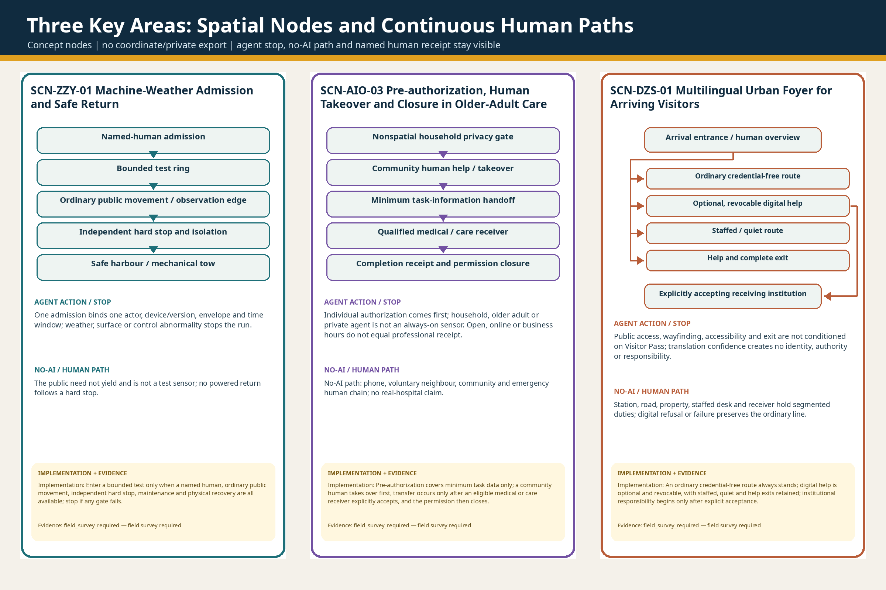

## AI Innovation Ecosystem, Personas, and AI+ Scenarios

This is an evidence-mapping layer across the existing P01-P10 portfolio, twelve SCN records and five urban networks. It creates no new project, scene, statutory boundary, metric or central platform. [source:AGENT-TASKBOOK]

**Local merchant, youth and older-adult economy loop.** One real need begins with an open service card maintained by the merchant. The public interface verifies only qualifications, safety, certification, complaint and operating facts; the user's private Agent may then make a temporary match for that order using distance, time, budget, language, accessibility needs and current capacity. The user remains free to telephone, walk in or trade with the merchant directly. Shops around the AI Origin Community may handle purchase and rental, installation, setup, interoperability, teaching, refurbishment and small repairs; complex faults may move to Zhongzhiyuan for diagnosis, retest, training and standards updates, after which equipment and capability return to the community and strengthen the next local service. Public AI is an exchange, not a toll gate: it does not sell “organic” ranking, mix advertising into matching, require exclusive listing, capture the customer relationship or charge the basic match as a share of transaction value, and it retains merchant correction, appeal and rotating exposure. This loop could support paid work for younger people in installation, repair, reception, after-school assistance, event operations and accessibility retrofit. It could also let retired engineers, teachers and trusted community members return, within qualification boundaries, as paid mentors, reviewers, after-school supporters and cultural guides. The older-adult economy is not only a market that sells services to older people. This is an economic-organisation proposal to test, not evidence that a platform, merchant register, orders, jobs, revenue or operating relationships already exist; qualifications, capacity, payment, insurance, employment status and public cost all require separate verification.

### R03 | Three-area flagships and the twelve-scene single source

[source:N7-1D-12SCN-RAW-SOURCE-LOCK]

All twelve remain design scenarios with evidence gates open, current value = null and formal_ready=false; v0.2 adds public-display fields only and does not change the v0.1 canonical fields.

#### Zhongzhiyuan

| Scene | Projects | Protocols | Public contract |
| --- | --- | --- | --- |
| **SCN-ZZY-01** Machine-Weather Admission and Safe Return | P01, P02 | MP-M-ZZY-01, MP-M-ZZY-02 | Admission is not permission for a machine alone; it is a closable chain linking a bounded test, the public edge, an independent hard stop and physical recovery. Enter a bounded test only when a named human, ordinary public movement, independent hard stop, maintenance and physical recovery are all available; stop if any gate fails. |
| **SCN-ZZY-02** Cross-Brand Fault Diagnosis—Repair—Retest | P03, P10 | MP-M-PSS-08, MP-M-ZZY-02 | The repair loop may be shown, while the missing M-PSS-08 definition continues to block collection without guessed methods or thresholds. Cross-brand diagnosis and retest retain human repair, paper records and independent review; no M-PSS-08 collection or result claim before its definition is registered. |
| **SCN-ZZY-03** Public Samples—Isolated Sandbox—Results-Level Delivery | P01, P03 | MP-M-PSS-05, MP-M-PSS-07 | Public sample—isolated sandbox—results-only delivery is a minimum-disclosure chain still awaiting field and institutional evidence. Public samples enter an isolated sandbox and leave only as results; raw-data export, cross-task inheritance and treating the public as training subjects are prohibited. |

#### AI Origin

| Scene | Projects | Protocols | Public contract |
| --- | --- | --- | --- |
| **SCN-AIO-01** 15:30 Human Handoff through Three Slow Gates | P04, P05, P10 | MP-M-AIO-01, MP-M-AIO-02, MP-M-PSS-02, MP-Q3-PEAK-FLOW-WAIT, MP-Q3-GROUND-FLOOR-INTERFACE | School-side human—slow gate—crossing—community-side human—privacy stop line form a closable 15:30 handoff. The 15:30 chain starts with a school-side human, confirms each of three slow gates and ends only with explicit community-side acceptance; stop on tracking or unaccepted responsibility. |
| **SCN-AIO-02** The Closable Homebound Chain after a 21:40 Outage | P06, P10 | MP-M-AIO-03A, MP-M-AIO-03B, MP-M-PSS-01, MP-Q3-NIGHT-LIGHTING-USE | Outage—screen withdrawal—physical baseline—human relay—household privacy stop line form a closable homebound chain. At a 21:40 outage, nonessential screens withdraw first; emergency resources preserve only lighting, help, communication and evacuation under segmented human relay, without household private data. |
| **SCN-AIO-03** Pre-authorization, Human Takeover and Closure in Older-Adult Care | P05, P06, P10 | MP-M-AIO-02, MP-M-PSS-07, MP-Q3-GROUND-FLOOR-INTERFACE | Nonspatial household privacy gate—community help—minimum-information handoff—qualified receiver—permission closure form the older-adult care loop. Pre-authorization covers minimum task data only; a community human takes over first, transfer occurs only after an eligible medical or care receiver explicitly accepts, and the permission then closes. |

#### Dazhongsi

| Scene | Projects | Protocols | Public contract |
| --- | --- | --- | --- |
| **SCN-DZS-01** Multilingual Urban Foyer for Arriving Visitors | P07, P08, P10 | MP-M-DZS-01A, MP-M-DZS-01B, MP-M-PSS-06A, MP-M-PSS-06B, MP-M-PSS-12, MP-Q3-PEAK-FLOW-WAIT, MP-Q3-GROUND-FLOOR-INTERFACE | The arrival foyer branches into ordinary credential-free, optional digital, staffed quiet and help-exit routes; no receiving institution is presumed committed. An ordinary credential-free route always stands; digital help is optional and revocable, with staffed, quiet and help exits retained; institutional responsibility begins only after explicit acceptance. |
| **SCN-DZS-02** Five-Rights Separation for a Work Commission | P08, P09 | MP-M-DZS-03, MP-M-PSS-05 | A work commission is governed by five-rights separation and complete exit, with the P08/P09-only mapping frozen. Commissioning, execution, acceptance, payment and dispute handling remain separated; the scene links only to P08/P09 and must not regain P10. |
| **SCN-DZS-03** Event Opening—Resident Quiet Line—Complete Exit | P07, P09, P10 | MP-M-DZS-02A, MP-M-DZS-02B, MP-Q3-NIGHT-LIGHTING-USE | Opening, the resident quiet line and complete exit stand together; all numerical values still await a field baseline. Events retain ordinary movement, a resident quiet line, human duty and complete exit; stop if noise, crowding or exit gates fail. |

#### Jing-Zhang public spine (interface layer)

| Scene | Projects | Protocols | Public contract |
| --- | --- | --- | --- |
| **SCN-JZ-01** Three-Evidence Rerouting for a Rainy Night Walk | P01, P04, P07 | MP-M-PSS-12, MP-Q3-NIGHT-LIGHTING-USE, MP-Q3-PARK-DWELL-HELP | Rainy-night movement uses three-evidence rerouting to test public continuity and remains interface_only. This is only a Jing-Zhang public-continuity interface pressure test, not a fourth key area; rainy-night rerouting depends on physical lighting, human patrol and an exitable route. |
| **SCN-JZ-02** Opening and Closure of the Public Spine in Ice, Snow and Heat | P01, P02, P09 | MP-M-ZZY-03A, MP-M-ZZY-03B, MP-Q3-PARK-DWELL-HELP | Public-spine opening remains interface_only, with two undefined metrics continuing to block collection. This remains a Jing-Zhang interface pressure test; no ice, snow or heat opening-performance collection or claim is allowed before M-ZZY-03A/B definitions are registered. |
| **SCN-JZ-03** Screenless Relay along the Public Spine during a Power Outage | P04, P06, P08, P09 | MP-M-AIO-03A, MP-M-AIO-03B, MP-M-PSS-01, MP-Q3-NIGHT-LIGHTING-USE, MP-Q3-PARK-DWELL-HELP | Physical lighting—help point—ordinary signs—broadcast/fixed phone—egress—segmented human relay form a screenless public spine. After outage, screens withdraw and emergency power preserves physical lighting, help, communication and evacuation only; park, property and public-service humans explicitly accept segments without expanding into household private domains. |

## Land Use, Building Scale, and Retain-Renovate-Demolish Strategy

The land-use layer expresses four design support zones: industrial validation, everyday continuity, public translation and ordinary-city continuity. The buildings layer remains a valid zero-feature data gap; project carriers are not represented as buildings. The design sequence is ordinary-baseline protection, reuse of accessible ground floors and public space, reversible retrofit, and deferred permanent construction. Statutory land use, FAR, height, ownership, demolition and new-build decisions remain unknown. [data:geometry/land_use.geojson#N2B-LU-ZZY] [data:geometry/buildings.geojson] [standard:MOHURD-CONTROL-DETAILED-PLANNING]

The four support zones organise functions; they do not replace statutory land-use categories. Their boundaries only test whether P01–P10, scenes and urban networks have spatial carriers. The empty building layer is an intentional disclosure of a data gap: without cleared footprints, heights, structures, uses and ownership, illustrative boxes must not manufacture an appearance of design depth. Once professional source material is obtained, every building must receive a retain, repair, reversible-retrofit, new-build or pending status, and planning, architecture, fire, accessibility and property review must jointly release scale and renewal decisions. [depth:development_intensity_controls] [depth:height_massing_character]

## Transport, Rail, Municipal Infrastructure, and Public Services

Ordinary movement does not depend on an app, account or digital credential; public, device and maintenance routes are separated. P10 is a distributed staffed network with a primary station in the AI Origin Community, repair branch in Zhongzhiyuan, public-service branch in Dazhongsi and low-permission Jing-Zhang nodes. It does not create a complete private-domain database. Paper wayfinding, telephones, staffed counters, hard stops, mechanical recovery and traditional municipal bypasses remain available during outages and errors. [data:geometry/roads.geojson#N2B-RD-004] [standard:BARRIER-FREE-ENVIRONMENT-LAW] [depth:traffic_rail_slow_parking] Municipal and recovery responsibilities are reviewed separately. [depth:municipal_new_infrastructure]

## Blue-Green Network, Public Space, and Urban Character

The Jing-Zhang public spine combines ordinary walking/cycling, blue-green continuity, climate adaptation, railway and innovation-culture interpretation, low-permission help and screenless relay. Public-space proposals include a developer walk/open-source display interface, a correctable and removable contribution/recognition node, and a railway engineering-repair-AI public culture route. Temporary events and devices must fully exit, leaving resident quiet routes and ordinary public use intact. [data:geometry/green_space.geojson#N2B-GR-001] [data:geometry/public_space.geojson#N2B-PS-001] [standard:MOHURD-URBAN-DESIGN-MEASURES]

Blue-green and public-space values are recalculated from the submitted geometry, but they represent only the proposal model, not existing green quantity, ownership or a statutory green ratio. Character control follows four rules: continuous ordinary frontage, legible key nodes, technical equipment set back, and priority for night-time use and resident quiet routes. Equipment bases, plant rooms, advertising and temporary events may not interrupt drainage, fire access, accessibility or conventional maintenance. After trees, water, heritage, buildings and underground utilities are cleared, the relevant professionals must review continuity, shade, sponge capacity, sightlines and maintenance access segment by segment. [depth:blue_green_public_space] [depth:height_massing_character]

## Renewal Projects, Implementation Policy, and Phasing

P01-P10 follow four phases: baseline protection, reversible interfaces, controlled testing/resilience facilities, and long-term evaluation. P10 supports explanation, acceptance, complaints, audit and permission closure; it does not absorb P05 visible help space or the P08 staffed foyer. An annual operating concept cycles through Q1 rules/sources, Q2 public scenes and non-AI drills, Q3 testing/repair/retest, and Q4 contribution/correction/exit review. This is a development proposal, not a confirmed government calendar, budget or investment commitment. [data:geometry/phasing.geojson#N2B-PH-00] [depth:renewal_project_list] [depth:phasing_implementation]

### Four-Phase Implementation Sequence

1. Protect ordinary movement and municipal baselines
2. Reversible interfaces and reuse
3. Controlled tests, resilience facilities and staffed nodes
4. Long-term evaluation, correction and evidence-based expansion

## Metrics, Area Recalculation, and Compliance Matrix

Using one GeoJSON bundle in EPSG:4548, the package recomputes an overall design area of 11,412,825.386 m², a proposed blue-green ratio of 19.839%, and a proposed public-space ratio of 6.987%. All are provisional rather than statutory or existing-condition metrics and must be recomputed after any geometry change. All service, response, safety, satisfaction and economic metrics remain unknown. [metric:site_area_sqm] [metric:green_ratio] [metric:public_space_ratio]

### R05 | Measurement protocols and backlinks for unknown metrics

| metric_id | value | status |
| --- | --- | --- |
| `site_area_sqm` | 11,412,825.386 m² | `known` |
| `green_ratio` | 0.19838764 ratio | `known` |
| `public_space_ratio` | 0.06986680 ratio | `known` |
| `key_area_count` | 3 count | `known` |

## Risk, Copyright, and Compliance

Key risks include provisional geometry being mistaken for official boundaries, P10 re-centralising, districts remaining conceptual rather than spatial, intelligent components obstructing ordinary municipal/emergency systems, unclear source or image rights, disclosure of private coordinates, and reuse of an old validation after version changes. The package uses self-generated figures and registered sources only; it distributes no font files and no private screenshots, home destinations or personal traces. [standard:GENERATIVE-AI-INTERIM-MEASURES] [source:PROJECT-STANDARDS-LIBRARY] [depth:risk_missing_data]

Risk control is not a disclaimer added at the end; it is a spatial and operational phase gate. Work involving children, health, homes or personal trajectories defaults to minimum disclosure. Testing, logistics, events and intelligent facilities require an ordinary public bypass, a named responsible human, a hard stop, and explicit maintenance, recovery and removal conditions. Relevant professionals and affected publics must review high-risk items. Copyright, sources, models, figures and conversion steps retain version records; any new official data, script or account-identity change triggers rerendering, hash refresh and a complete self-check. [data:geometry/constraints.geojson] [depth:risk_missing_data]

## References

Materials that materially shaped the proposal include the official announcement, structured design brief, agent taskbook, national urban-design and regulatory-planning measures, the land-use classification guide, accessibility law, and six limited-use primary-source precedents. The full machine index is in sources.json. Precedents support mechanism comparison only, not local site, institution or performance claims. [source:PROJECT-OFFICIAL-ANNOUNCEMENT] [source:PROJECT-STANDARDS-LIBRARY] [source:CASE-01]

Sources are registered separately by authority level and permitted use. The official announcement supports the task and written scope; organiser-issued structured files support the submission contract; provisional geometry supports only replaceable spatial generation and recalculation; precedents support mechanism comparison; and internal design artifacts prove only this proposal's own decisions. News screenshots, media retellings, OSM inference and AI guesses may not be promoted into boundary, existing-condition or implementation facts. Scene sources without original bytes remain pending and do not gain certainty through repeated citation. Reviewers can follow inline markers into sources, assumptions, geometry, metrics and matrices to trace the boundary between fact, design and unknown. [source:SOURCE-REGISTRY] [depth:existing_conditions_diagnosis]
