# 有门的城市

## 01｜项目总命题：个人 AI 随人穿城，公共能力按任务开放

《有门的城市》是一项位于**百年京张 AI 创新带**的城市设计提案。它处理的不是“在城市里多放一些智能设备”，而是一个更具体的问题：

> **当个人 AI 跟随一个人进入学校、社区、酒店、会议、实验场和公共交通等真实城市系统时，它可以调用什么、凭什么调用、由谁维护、何时归还，以及任务结束后怎样退出？**

方案的总体命题是：

> **个人 AI 随人穿城；城市公共设施按任务、按权限被调用，并且能够维护、归还和退出。**

连续的是人的个人 AI 与正在完成的任务。临时开放的是城市的通行、导视、算力、能源、机器人、Dock、交接柜和公共服务接口。个人记忆与根权限留在本人一侧；公共端只接收完成当前任务所必需的信息、权限和回执。

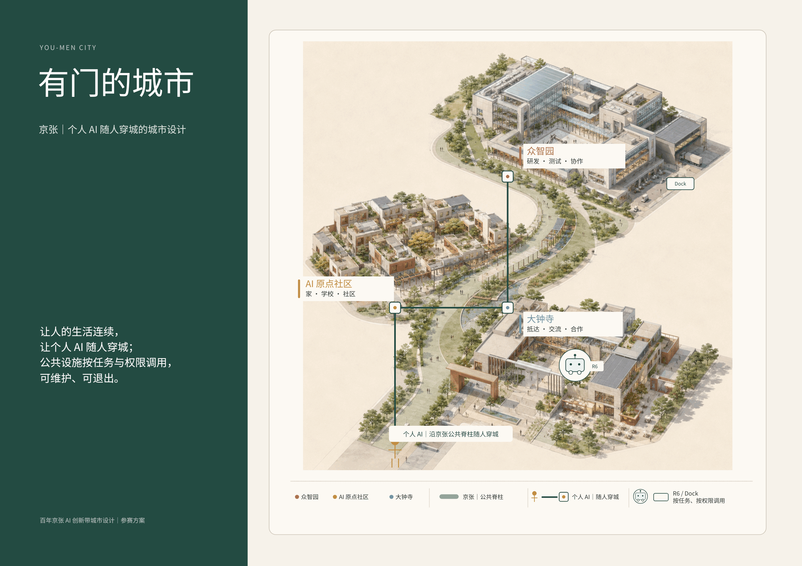

*图 F01｜设计判断：一条京张公共脊柱连接“家、窗、工坊”三种城市角色，个人 AI 保持任务连续，R6 与 Dock 等公共身体只按任务开放。先看三处重点空间与中间的公共脊柱，再看个人 AI 与公共设施两类线。它证明总体命题的空间关系，不代表法定边界、真实距离、精确站位或建设方案。来源：现有展示页 P01。*

## 02｜真实城市：三层尺度与当前边界状态

本方案工作在三个不能混算、也不能彼此替代的尺度上：

| 尺度 | 面积 | 本层回答的问题 |
| --- | ---: | --- |
| 战略统筹研究范围 | **43.6 km²** | 百年京张 AI 创新带如何形成产业、文化与未来城市协同 |
| 总体城市设计范围 | **11.4 km²** | 普通城区、京张公共脊柱与三处重点空间如何接续 |
| 三个重点深化片区 | **约 368.4 ha** | AI 原点社区、大钟寺、众智园如何把总体命题落到具体空间与任务 |

> **边界状态说明**  
> 本方案使用概念性 / provisional spatial demonstrator，不声明法定红线、权属边界、施工图或精确面积；official geometry 到位后，整包重绑定、重绘并复算。

这不意味着现阶段不能设计。现阶段可以完成概念性重点区详细设计、设施体系、任务路径、权限边界和责任链，但必须把以下内容保持为待核状态：地块边界、道路红线、现状建筑、地下市政、权属、法定指标、具体容量和精确站位。

**当前方案识别的三个设计断点：**

1. 个人 AI 可以在设备上持续工作，但进入不同城市空间时，缺少统一可读的任务申请、设施调用和到期撤权方式。
2. 城市中的交通、导视、能源、网络、算力、机器人与服务设施彼此分散，尚未围绕一条人的任务链协同。
3. 许多智能城市叙事只描述“如何启用”，却没有把停靠、维护、故障恢复、归还、迁移和退出一并设计。

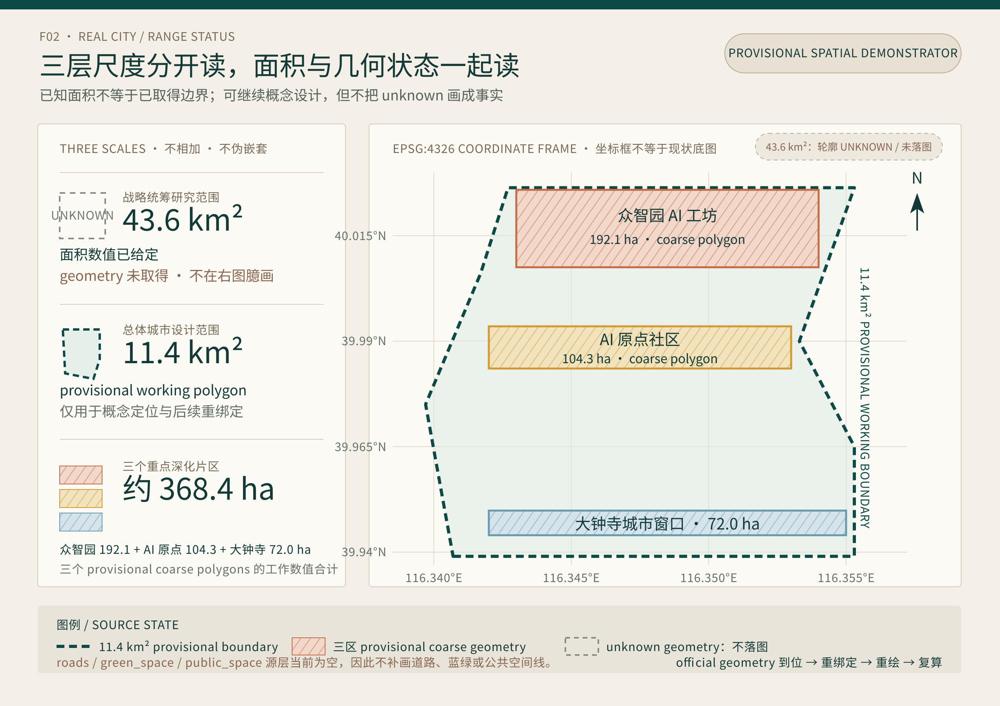

*图 F02｜设计判断：43.6 km²、11.4 km²与约 368.4 ha 是三个不能混算的工作尺度。先看左侧三层面积与证据状态，再看右侧 EPSG:4326 坐标框中的 11.4 km² provisional working boundary 和三个 provisional coarse polygons。43.6 km²目前只有面积数值、没有可用轮廓，未在图中臆画；roads / green_space / public_space 源层当前为空，也未补线。该图证明三层尺度、三区相对位置与后续重绑定机制，不代表法定红线、权属、现状底图、道路地块边界、精确面积或施工站位。来源：现有 working GeoJSON `site_boundary.geojson`、`key_areas.geojson` 与本 proposal 的尺度说明；本轮补绘，不来自现有展示页。*

## 03｜总体空间结构：一条公共脊柱，三种城市角色

城市结构由一个普通城市底盘、一条京张公共脊柱和三处重点空间组成。

- **普通城区是底盘。** 普通道路、公共交通、步行骑行、传统市政、人工服务与无 AI 通行必须始终成立。
- **京张是公共脊柱。** 它连接三区，并承载慢行、蓝绿、低功耗导视、备用电力、N2、Dock、R6 任务支线和故障恢复底线。
- **AI 原点社区是“家”。** 处理长期生活、学习、复诊、家庭共同任务与独立家门。
- **大钟寺是“窗”。** 处理访客抵达、短期服务包、城市体验、交流与继续合作。
- **众智园是“工坊”。** 处理研发、算力、实验、测试、维修、复测与再准入。

交通与慢行让人能够到达；蓝绿系统让公共空间在日常与气候变化中持续可用；能源、网络与算力维持任务检查点；机器人、Dock、交接柜和门厅构成可借用的“公共身体”；权限、责任、维修和回执使公共能力可以被打开，也能被收回来。

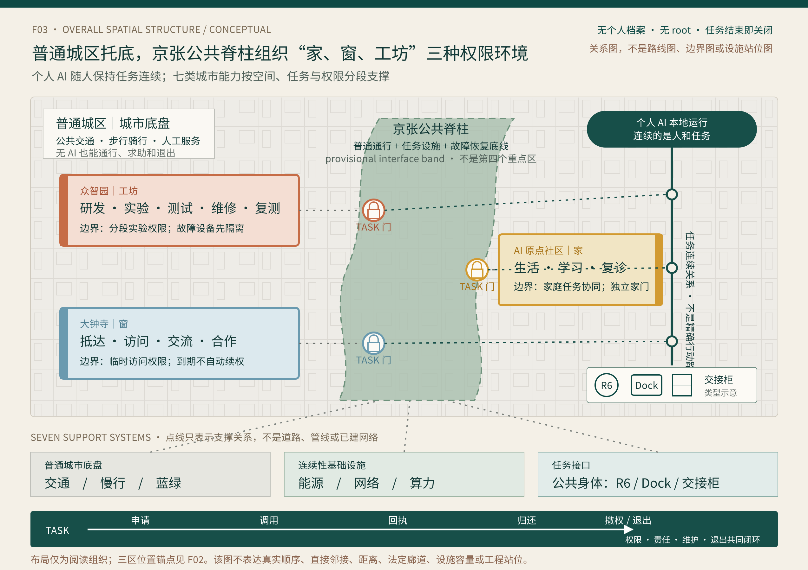

*图 F03｜设计判断：普通城区提供无 AI 也成立的城市底盘；京张公共脊柱在概念性总体结构中接续 AI 原点社区“家”、大钟寺“窗”和众智园“工坊”的公共接口。个人 AI 随人保持任务连续，交通、慢行、蓝绿、能源、网络、算力与公共身体只在相应 TASK 门下提供支撑。先看一脊三区，再看普通城区怎样托底，最后看七类支撑与“申请—调用—回执—归还—撤权 / 退出”。该图为 provisional spatial demonstrator，只证明总体结构与调用关系，不代表法定红线、权属边界、三区真实顺序或直接邻接、精确路线、距离、设施数量、容量、站位、运营主体或施工方案。来源：F02 的 provisional 空间锚点、现有展示页 P01 / P05 的角色与机制语义及本 proposal 的总体结构；本轮补绘，不把 P01 / P05 的画面摆位当作真实地理。*

## 04｜家、窗、工坊：不是比喻，而是三种权限环境

| 空间角色 | 对应片区 | 主要任务 | 城市开放的能力 | 边界与退出 |
| --- | --- | --- | --- | --- |
| **家** | AI 原点社区 | 长期生活、学习、复诊、家庭共同任务 | 学校与社区接口、N2、安全等待、公共导视、共享院落 | 家庭共同任务可以协调，但三个人的个人 AI 不合并；公共身体止步于独立家门 |
| **窗** | 大钟寺 | 抵达、住宿、会务、餐饮、城市体验、外部合作 | 访客服务包、交通与酒店凭证、Dock、R6、交接柜、多语言导视 | 权限随 36 小时访问与具体任务开放；任务完成、回坞或离开后关闭，不自动续权 |
| **工坊** | 众智园 | 研发、联合实验、算力调度、测试、维修、复测 | 算力、微网 / UPS、受控实验庭院、R6、维修物流后场 | 临时实验权限分段开放；故障设备先隔离，复测通过才再准入 |

三种空间共同证明：**个人 AI 可以保持任务连续，但不同空间拥有不同调用权限、设施责任和退出方式。** 同一个 AI 不需要在每个片区重新成为另一个 AI；城市也不需要把一个人的完整私域复制到公共系统。

## 05｜京张公共脊柱：沿线调用，而不是中央接管

京张公共脊柱不是一条把私人数据汇入中心的“智慧走廊”，也不是第四个重点区。它是一条普通通行始终开放、任务设施按需响应、故障时能够收缩运行的公共接口带。

个人 AI 沿线完成五个动作：读取公开状态 → 申请 TASK 权限 → 调用设施 → 收回任务回执 → 撤权 / 退出。公共端只公开设施状态、天气、故障和可用范围，不接收完整个人档案，也不取得个人 AI 的 root 权限。

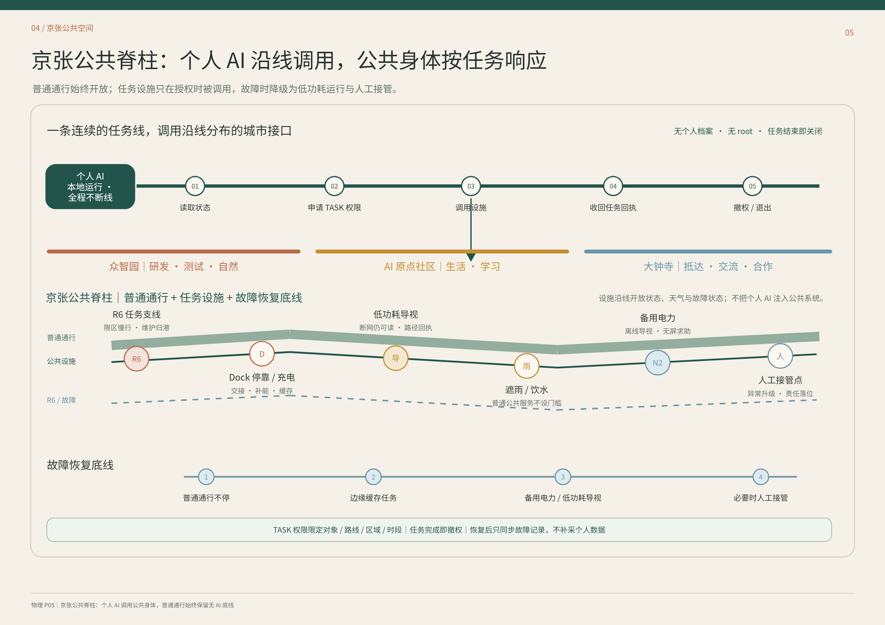

*图 F05｜设计判断：普通通行、公共设施、R6 / Dock 与故障恢复底线沿同一脊柱分层组织。先看上方个人 AI 的五步调用，再看中部三区与设施节点，最后看下方四步故障恢复。它证明“任务连续、设施临时开放”的调用机制，不代表真实线路、设施数量、站距、容量或法定位置。来源：现有展示页 P05。*

沿线公共能力包括：

- **R6 任务支线：** 限区慢行、交接与维护归港；
- **Dock：** 停靠、充电、补能、缓存、清洁与回执；
- **低功耗导视：** 断网仍可读，提供路径与故障提示；
- **遮雨、饮水与普通服务：** 不因是否使用 AI 而设门槛；
- **N2 与备用电力：** 支撑离线导视、无屏求助和关键任务检查点；
- **人工接管点：** 只在异常、争议与专业责任需要时接入，不替代个人 AI 的正常任务主线。

## 06｜家：一家三代的连续生活

**人物与任务**

- **小禾：9 岁学生。** 她在这里生活和上学，当天需要完成学习、放学交接与回家。
- **妈妈：需要通勤、可能临时加班的上班者。** 她原本承担接送任务，17:05 因加班发起一次变更。
- **外婆：独立生活并自行复诊的长者。** 她拥有自己的个人 AI，只在这次共同任务中获得一次性接送权。

三个人的个人 AI 保持独立。家庭共享智能只协调“接小禾”这一项共同任务，不读取或合并三个人的全部生活。

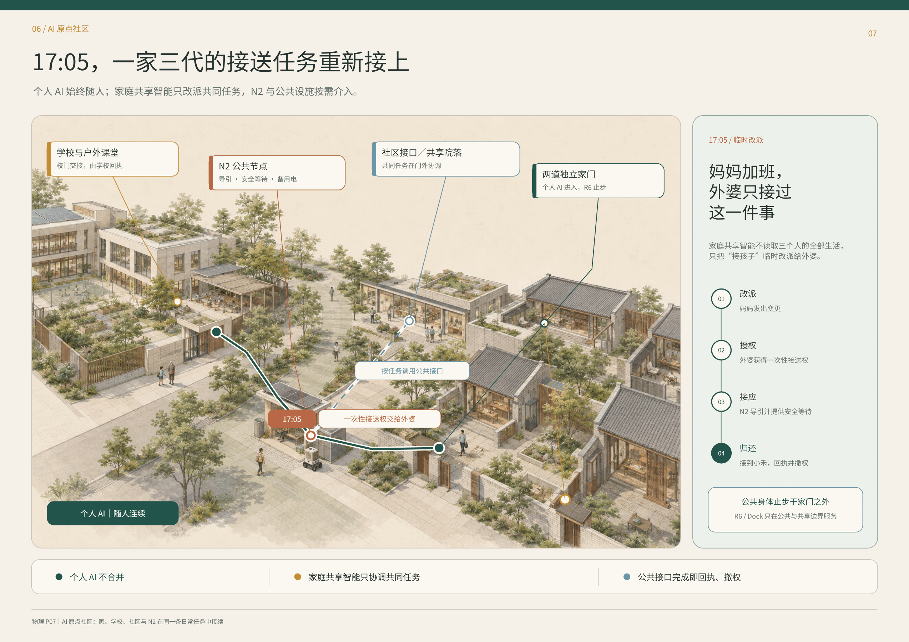

*图 F07｜设计判断：学校、N2、社区接口与两道独立家门在同一条接送任务中接续。先看主图的绿色个人 AI 路径，再看 17:05 的橙色临时改派节点与蓝色公共接口，最后看右侧四步变化链。它证明家庭共同任务可以被临时协调，而个人 AI、家门与长期权限仍彼此独立；不代表真实校门、道路、住宅位置或固定放学时刻。来源：现有展示页 P07。*

**17:05 的变化—后果—设计机制**

1. 妈妈的个人 AI 发出任务变更；
2. 家庭共享智能只把本次接送临时改派给外婆；
3. 外婆获得一次性接送权，N2 提供导引、安全等待与备用电；
4. 学校完成校门交接回执；
5. 接到小禾后，临时权限归还并撤销；
6. R6 / Dock 只在公共与共享边界服务，止步于独立家门。

责任随实体任务逐段落位：学校对校门交接负责，N2 运营方对节点导引和设施状态负责，外婆在明确接收后承担本次接送，物业与家庭各守自己的空间边界。个人 AI 负责持续理解、提醒、重排与回执，但不凭空生成现实通行权。

## 07｜窗：Mira 的 36 小时访问

**Mira 是一位停留 36 小时的访问学者。** 她来到这里，是为了看懂示范区、参加会议、体验城市系统，并把访问继续接入后续合作。她的个人 AI 始终运行在自己的设备上，连续处理交通、酒店、会务、餐饮、资料、路线与返程；城市不要求她把完整个人 AI 交给某个公共平台。

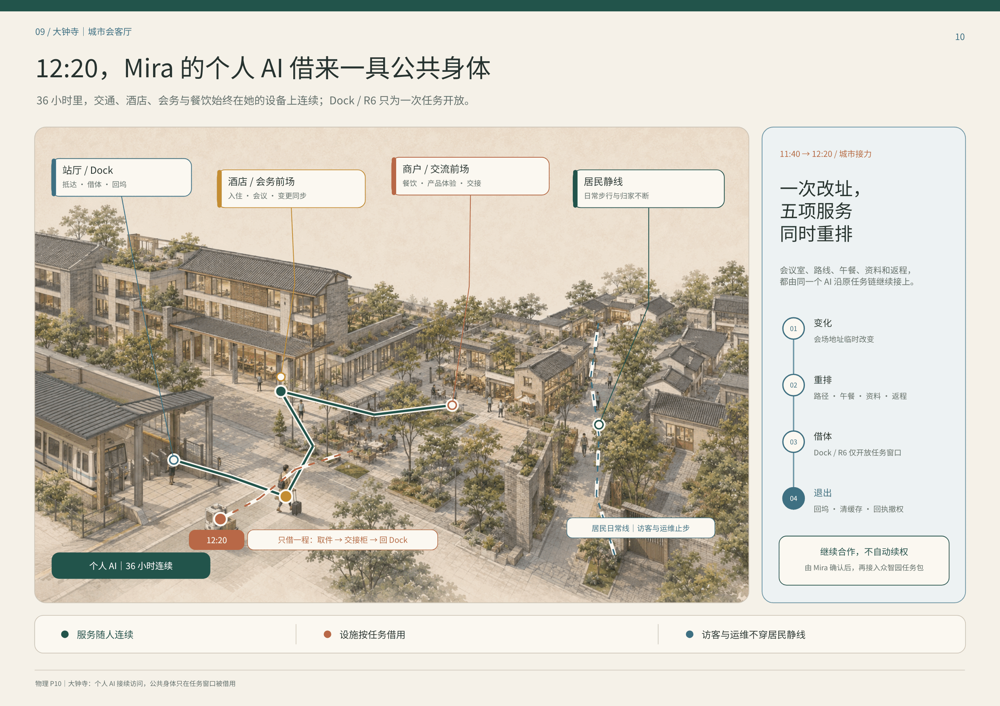

*图 F10｜设计判断：站厅 / Dock、酒店与会务前场、商户与交流前场、居民静线共同构成城市窗口。先看 Mira 的个人 AI 主线，再看取件—交接柜—回 Dock 的一次性 R6 支线，最后看右侧四步任务变化。它证明访问服务随人连续，公共身体只在具体任务窗口开放；不代表真实商户、酒店、站厅位置、运营关系或 36 小时固定行程。来源：现有展示页 P10。*

**11:40—12:20 的变化—后果—设计机制**

会议地点临时改变后，Mira 的个人 AI 同时重排会议室、路线、午餐、资料和返程。12:20，它为“取件—交接柜—回 Dock”申请一次机器人任务：

1. Dock 核验对象、路线、区域和有效期；
2. R6 只获得完成取件与交接所需的权限；
3. 机器人不穿越居民静线和客房私域；
4. 完成后回 Dock，写回任务状态，清理缓存并撤权；
5. 是否继续接入众智园合作任务，由 Mira 再次确认，不自动续权。

个人 AI 对访问任务连续性负责；酒店、会务、商户、Dock 与 R6 运营方分别对自己开放的服务与设施负责；争议和故障进入对应运营主体，而不是让 Mira 在多个系统之间重新解释整段行程。

## 08｜工坊：阿岑的联合实验日

**阿岑是一位开展联合实验的青年工程师。** 他来到众智园，是为了协调算力、场地、设备、外部团队与测试权限，完成一项可以被复现、维修和再准入的实验，而不是只做一次演示。

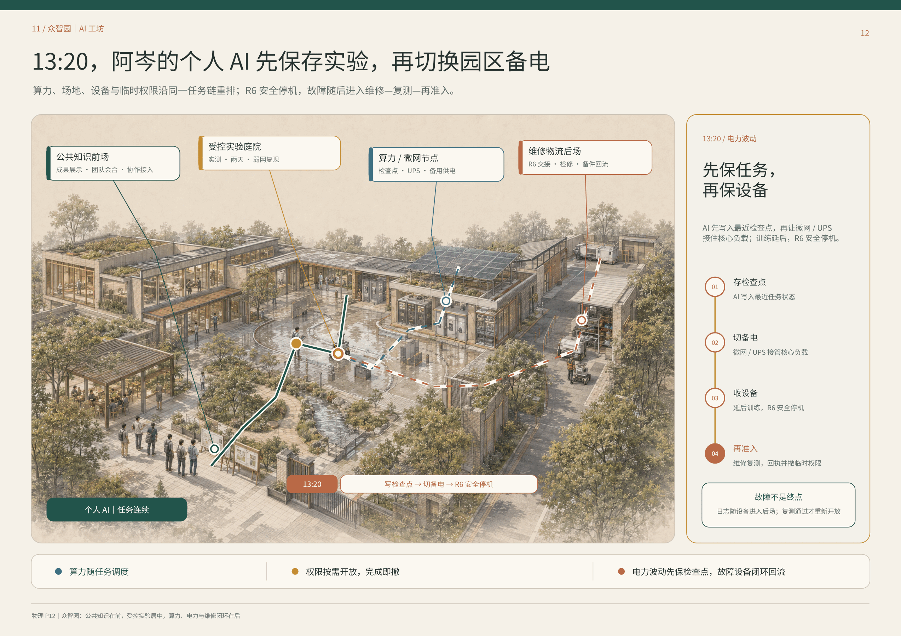

*图 F12｜设计判断：公共知识前场、受控实验庭院、算力 / 微网节点与维修物流后场按开放程度排列。先看个人 AI 的任务主线，再看算力 / UPS 与 R6 两条设施支线，最后看右侧故障闭环。它证明实验任务可以跨算力、电力、场地和维修保持连续，而权限与设备仍分段受控；不代表真实容量、设备品牌、园区边界或工程站位。来源：现有展示页 P12。*

**13:20 的变化—后果—设计机制**

电力波动发生后，阿岑的个人 AI 不继续强推实验，而是先保存最近检查点，再重排公共资源：

1. 写入最近任务状态与实验检查点；
2. 微网 / UPS 接管核心负载；
3. 延后低优先级训练；
4. R6 安全停机并写回状态；
5. 故障日志随设备进入维修物流后场；
6. 设备完成检修和复测后，才重新获得受限实验权限；
7. 临时权限随任务回执一并撤销。

阿岑与实验负责人对实验判断负责，算力和微网运营方对资源状态与切换负责，R6 运营方对停机、回收和维修闭环负责，外部团队只获得当日实验范围内的权限。个人 AI 串起资源与任务，但不能把一次联合实验的临时权限扩成长期园区通行权。

## 09｜公共身体：借用、停靠、维修与归还

个人 AI 与硬件载体、公共机器人不是同一件事。个人 AI 属于本人，可以跨设备和空间保持连续；机器人、电梯、柜体、门厅、Dock 与算力节点属于城市或运营主体，只在任务范围内被借用。

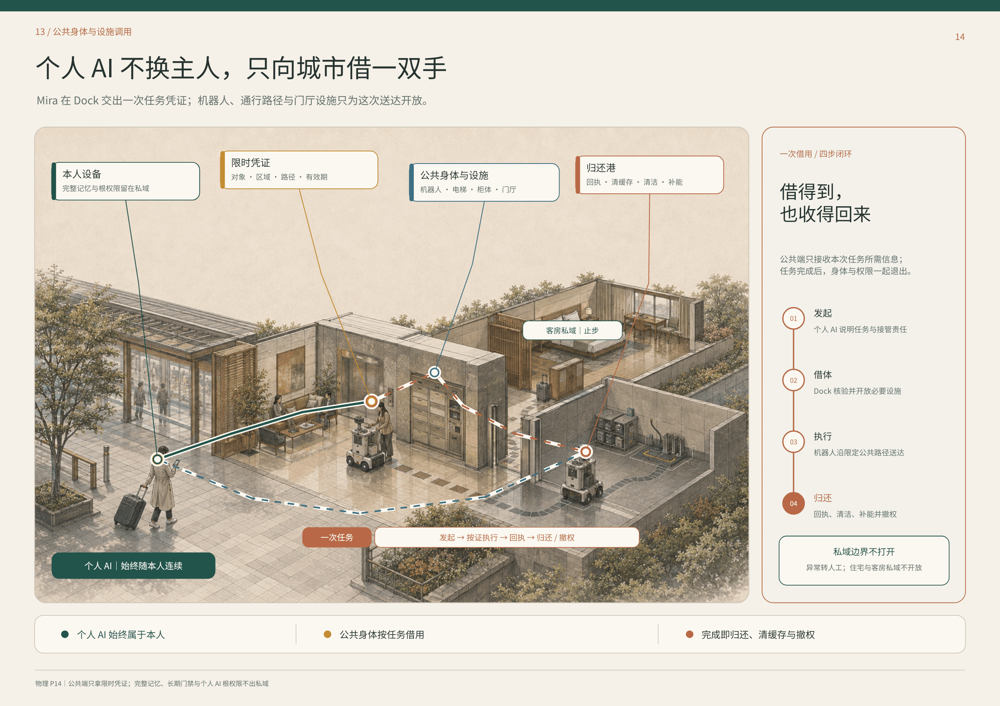

*图 F14｜设计判断：本人设备、限时凭证、公共身体与设施、归还港构成一次借用的四步闭环。先看绿色个人 AI 主线，再看红蓝任务支线，最后看右侧发起—借体—执行—归还。它证明公共端只拿限时凭证，完整记忆、长期门禁与根权限不出私域；不代表具体设备协议、保险合同或运营主体已经落实。来源：现有展示页 P14。*

一次公共身体调用必须同时具备：

1. **任务说明：** 做什么、为谁做、由谁发起；
2. **限时凭证：** 对象、区域、路径、设施和有效期；
3. **执行边界：** 住宅、客房和其他私域默认止步；
4. **状态回执：** 完成、失败、故障、人工接管或中止；
5. **归还动作：** 回 Dock、清洁、补能、清除本次缓存；
6. **维修闭环：** 诊断、隔离、维修、复测和再准入；
7. **可验证撤权：** 任务结束、本人撤回或凭证到期后关闭。

## 10｜故障恢复、迁移撤权与证据边界

### 10.1 片区停电：城市缩到最低可用

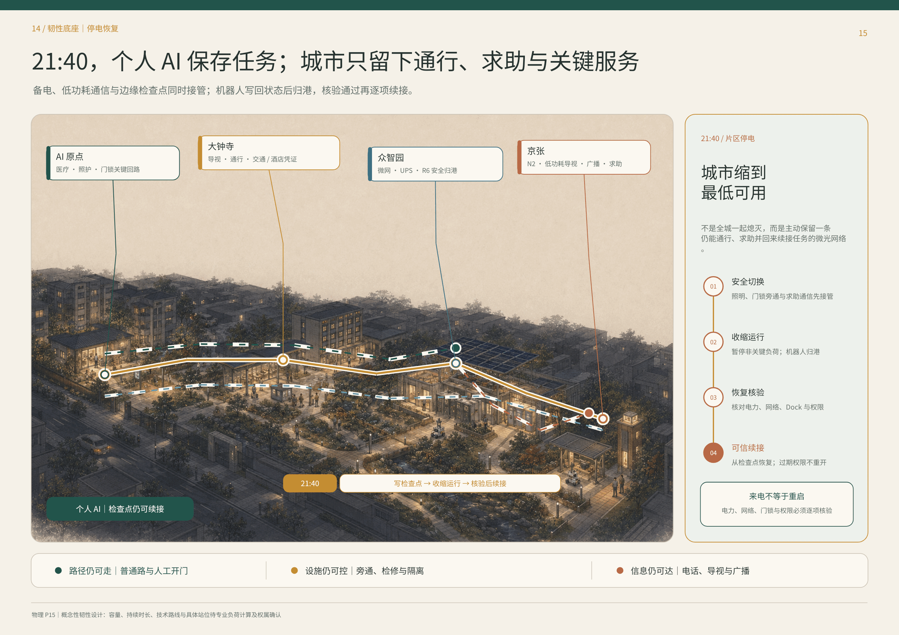

*图 F15｜设计判断：AI 原点、大钟寺、众智园与京张在停电时各自保留关键回路，并由个人 AI 检查点续接任务。先看发光的关键路径，再看四个片区节点和右侧恢复顺序。它证明“来电不等于重启”，电力、网络、Dock 与权限必须逐项核验；不代表备用电容量、持续时长、技术路线或具体站位已经完成专业计算。来源：现有展示页 P15。*

恢复顺序是：安全切换 → 收缩运行 → 恢复核验 → 可信续接。普通道路、人工开门、电话、广播和实体导视构成无 AI 底线；个人 AI 从最近检查点继续，但已经过期或撤销的权限不会因来电自动重开。

### 10.2 换机与迁移：AI 继续，旧载体归零

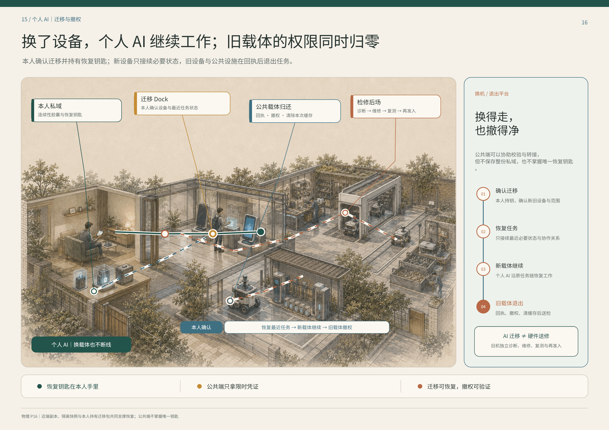

*图 F16｜设计判断：本人私域、迁移 Dock、公共载体归还与检修后场形成迁移—撤权闭环。先看个人 AI 从旧设备到新设备的主线，再看公共载体归还与检修支线，最后看右侧四步迁移。它证明迁移可以恢复、撤权可以验证，公共端不掌握唯一恢复钥匙；不代表具体密码学方案、载体产品或服务合同已经确定。来源：现有展示页 P16。*

本人确认迁移并持有恢复钥匙；新载体只恢复最近任务所需的状态与协作关系；旧载体在收到回执、撤权和清除本次缓存后进入独立检修。AI 迁移不等于硬件送修，公共端可以协助校验和转接，但不保存整份私域，也不掌握唯一恢复钥匙。

### 10.3 本轮证据边界

- **已能证明：** 总命题、三种空间角色、任务调用逻辑、人物任务链、公共身体借用闭环、停电恢复顺序与迁移撤权原则已经形成一致叙事。
- **仍不能证明：** official geometry、权属、真实设施清单、容量、成本、运营者、保险、技术协议、法定指标、施工站位和实际绩效。
- **后续释放条件：** 官方底图重绑定、现场踏勘、专业负荷与市政核验、运营责任确认、最小样点演练、无 AI 底线测试、权限撤销审计。

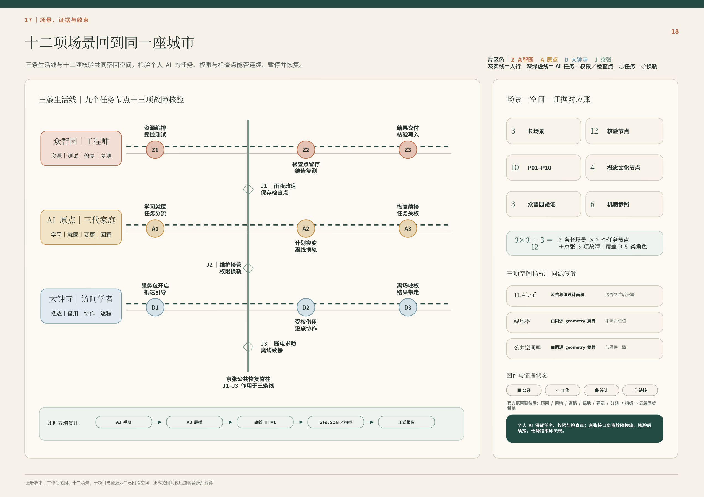

*图 F18｜设计判断：三条生活线的九个任务节点与京张三项故障换轨共同形成十二项核验，右侧以场景—空间—证据对应账、三项同源复算指标和图件状态收束。先看左侧众智园、AI 原点、大钟寺三条任务线，再看 J1–J3 如何跨线换轨，最后看右侧证据五端与 official geometry 到位后的同步替换。它证明场景、空间、权限和证据可以同源复用，核验后续接、任务结束即关权；不代表阶段 0–4 的工程时序、正式范围、指标值或施工计划已经确定。*

## 11｜如何建设、验证与收束

建设不从铺满智能设备开始，而从普通城市底盘与最小可验证任务开始。

| 阶段 | 主要动作 | 本阶段必须通过的门 |
| --- | --- | --- |
| **阶段 0｜重绑定** | official geometry 到位后，重绘三层范围与总体结构，复算全部空间指标 | 范围、权属、道路、建筑与市政来源可追溯 |
| **阶段 1｜保底盘** | 核验普通通行、步行骑行、人工服务、机械旁通、照明与传统市政 | 不使用 AI 也能通行、求助和退出 |
| **阶段 2｜做接口** | 以可逆方式布置 N2、Dock、交接柜、低功耗导视、任务凭证和检查点 | 每个接口都有对象、权限、责任、维护与关闭条件 |
| **阶段 3｜小范围验证** | 分别验证接送改派、36 小时访问、联合实验与 R6 借用 | 路径可读、设施可找、权限到期、故障可回收 |
| **阶段 4｜复测与扩展** | 对停电恢复、维修复测、迁移撤权、投诉与争议进行演练 | 失败可以停止，修复后需重新核验，不因“恢复”自动续权 |

每个试点至少同时记录五类证据：任务是否完成、路径是否可走、设施是否可用、权限是否按时关闭、故障后是否能够归还与恢复。没有闭合的数据继续标记为 unknown，不用概念图反推真实绩效。

最终，整座城市回到同一句话：

> **连续的是人的个人 AI 与任务；临时开放的是城市公共能力。**

---

# 官网 formal 契约与证据层

以下内容仅把前述 01–11 人类阅读层映射到既有来源、空间、P01–P10、12 个 SCN、指标与合规文件；不改写前述总命题，也不新增项目、场景、法定边界、geometry 或指标。

<!-- PR4300 review-closure 2026-08-30:start -->
## 任务书闭合总表｜三大定位·五大功能·三区两翼

> 本节是对既有 P01–P10、12 个 SCN、五套城市网络与三条生活回环的**评审显影层**，不新增法定边界、项目 ID、场景 ID、geometry、指标或已落实合作。涉及外部区域、资金、运营主体与专业深化的内容均为 `design proposal / proposed collaboration / unknown`，不得解读为已签约、已拨款或已实施。[source:AGENT-TASKBOOK] [standard:PROJECT-AGENT-OPEN-CALL-TASKBOOK]

### 三大定位与五大功能回链

| 任务书要求 | 本方案的可评成果 | 既有 P / SCN 回链 | 责任与停止条件 |
| --- | --- | --- | --- |
| 百年京张文化带 | 京张公共脊柱把铁路工程史、维修史、开放贡献与 AI 新文化组织为可纠错、可撤下、可离线阅读的公共序列 | P01 / P07 / P09 / P10；SCN-JZ-01/02/03 | 历史来源、文保边界、无障碍与消防未核即不进入工程深化；公共导视不替代法定安全标识 |
| 都市 AI 生活体验带 | AI 原点“家”＋大钟寺“窗”：学习、接送、照护、停电、访问与退出均由个人/私人 Agent 发起有限任务 | P04–P10；SCN-AIO-* / SCN-DZS-* | 普通无数字线先成立；孩子拒绝、无人接责、权限越界或退出失效即停止 |
| AI 融合创新带 | 众智园“工坊”把机器天气、维修复测、端侧算力与结果级数据交付放入可隔离、可归港的城市试验底盘 | P01–P03 / P10；SCN-ZZY-01/02/03 | 硬急停、隔离、维修、责任、保险/资质与公众边界任一未闭合即不开放 |
| AI 全栈自主创新体系 | 受控测试→故障诊断→维修→复测→结果级交付→社区能力回流 | P01–P03 / P10 | 原始个人数据不跨任务继承；高风险环节必须由合格真人复核 |
| 世界级 AI 创新生态 | 三区两翼＋区域协作机制；土地、空间、产业、资金、人才、算力、数据、场景8 类交换逐项设门 | P01–P10 / 12 SCN | 未核主体、预算与合作全部保持 proposed / unknown |
| AI+场景赋能新范式 | 12 个注册场景＋游客、社区经济、智慧课堂三条生活回环 | 12 SCN | 场景开放以普通服务不退化、可暂停、可退出为前提 |
| 智能化 AI 活力城市 | 五套城市网络同时承载日常生活、公共空间、测试维修、交通与能源/通信恢复 | P01–P10 | AI 失效时纸面、电话、机械旁通与真人服务继续成立 |
| AI 治理全球话语权 | “城市只接一次任务，不接一个完整的人”：许可、具名接责、最小披露、硬停止、完整退出形成可审计城市协议 | P04–P10；M-PSS-* | 不以中央总库、持续画像或默认同意换取便利；争议/事故可转人工并关权 |

### 三区两翼

| 节点 | 主角色 | 主要提供 | 主要接收 | 准入 / 治理 / 退出 |
| --- | --- | --- | --- | --- |
| 众智园｜工坊 | 受控研发、测试、维修、复测 | 测试场、维修后场、可核算力/设备能力、结果级验证 | 来自社区/访问/产业的明确测试任务、故障件、复现条件 | 项目级许可；公众线与设备线分离；异常硬停、隔离、归港 |
| AI 原点｜家 | 普通生活与公共服务验证 | 学习、接送、银龄、家庭共享侧与社区服务场景 | 经复测的设备/服务、规则更新、社区能力 | 不上传完整家庭；儿童/照护高风险事项真人复核；任务结束关权 |
| 大钟寺｜窗 | 城市前厅、访问与国际转译 | 多语访问服务包、公共导览、会面/合作转接 | 访客主动发起的短期任务、机构明确接收的合作请求 | 普通无凭证路线常开；访客不是测试传感器；到期完整退场 |
| 中关村科技服务翼 | **建议角色**：专业服务与创新资源接口 | 技术服务、知识产权/合规/融资与企业服务能力（具体机构待核） | 三区形成的可复核项目需求与结果 | 不把“翼”写成已签机构联盟；逐项目准入、利益冲突披露、完成即退出 |
| 小月河场景赋能翼 | **建议角色**：公共场景与可逆试用接口 | 蓝绿/公共空间场景、公众反馈、活动与低风险试用条件（点位待核） | 已过安全与责任门的可逆场景提案 | 普通公共使用优先；活动/设备可撤除；影响通行、安静或维护即停 |

### 8 要素 AI 创新生态 / 产业—空间交换图谱

| 要素 | 提供方（当前证据状态） | 接收方 | 交换物 | 开放方式 | 公共条件与退出 |
| --- | --- | --- | --- | --- | --- |
| 土地 | 未来经核权利人、法定/工作边界与适用规划条件（当前多为 unknown / provisional） | 具体 P / SCN 的空间深化 | 只提供“是否可进入下一步”的权利与规划条件，不把概念图当权属 | official / cleared 证据到位后逐项目核 | 权属、法定控制、红线或适用条件未核时不得释放建设承诺；条件变化即重绑定 |
| 空间 | 经核场地/公共空间/建筑运营主体（unknown） | P / SCN 项目单元 | 限时、可逆的场地、首层、公共界面、测试时窗与设施接口 | 逐场景申请→核验→小范围开放 | 消防、无障碍、维护、普通通行与退出门未闭合不开放；到期恢复普通使用 |
| 产业 | 企业/服务商/维修与测试主体（均待具名） | 众智园、社区服务、访问合作 | 设备、服务、维修、复测与标准反馈 | 资质＋任务合同 | 不强制独家，不以公共“自然推荐”售卖排序；投诉/事故可暂停 |
| 资金 | 合法资金来源类别（政府采购/科研/企业投资等均为待核可能性） | 具体项目/活动 | 逐项目预算与资源包 | 公开规则后逐项核准 | 本方案不承诺预算、补贴或投资；无授权/无资金即不启动 |
| 人才 | 高校/科研/企业/社区导师等候选来源（未形成合作事实） | 研发、维修、教育、导览、运营 | 时段化专业能力与具名责任 | 资格/背景/劳动关系按任务核验 | 高风险工作无资质即停止；任务结束撤销临时权限 |
| 算力 | P03 等经核运营节点（operator unknown） | 受控实验/复测团队 | 限时配额、边缘算力、检查点 | 项目级授权 | 不接完整私人记忆；容量冲突按事先规则降级；结束释放 |
| 数据 | 合法公共来源、现场匿名观察、受控测试结果 | 隔离沙盒/具名项目团队 | 最小必要输入、结果级输出、必要故障摘要 | 目的限定＋到期 | 原始个人轨迹/住宅终点不外发；跨任务继承默认禁止 |
| 场景 | 经核场地主体/公共服务单元（unknown） | 开发者、研究者、访客/公众体验 | 可逆试验时窗、接口与评价问题 | 申请→审查→小规模试用→复盘 | 普通服务不退化；安全、通行、隐私、责任或维护门失效即暂停/退出 |
### 区域协作｜只写“建议交换”，不写“已经合作”

| 外部区域 | 建议交换内容 | 发起 / 接收 | 最小边界 | 停止 / 退出 |
| --- | --- | --- | --- | --- |
| 北纬社区 | 普通生活服务可用性、社区服务反馈、低风险共创议题 | 明确项目方发起，社区主体自愿接收 | 不上传家庭画像与连续轨迹，只回传问题/结果 | 未取得社区授权、影响日常生活或无法退出即停 |
| 未来科学城 | 科研人才、技术验证、设施使用需求与研究问题 | 项目对项目 | 不预设机构承诺；设施、数据、知识产权逐项目核 | 权利/安全/责任不清即不交换 |
| 怀柔科学城 | 科研设施、科学验证方法与跨学科问题 | 项目对项目 | 仅交换必要任务与结果摘要 | 无明确接收方、保密/IP 条件未闭合即停 |
| 经开区 | 工程化、制造/供应链、机器人与车辆等产业验证能力 | 项目对项目 | 不把产业能力写成已入驻或已签供应链 | 资质、运行域、保险或质量责任未闭合即停 |
| 京津冀 | 人才、供应链、活动、访问与成果传播的跨城协作建议 | 经具名组织逐项发起 | 不建立跨城个人总库；数据与许可留在各自责任域 | 任务结束即关权；跨域责任不能具名时不启动 |

### 品牌、地标、荣誉与文化导视｜评审方向稿

**项目 Logo / 视觉识别方向。** 使用“开放门框＋一条未封死的门槛线”作为原创几何母题，与中英文组合字 `有门的城市 / A City with Doors` 形成项目识别；它表达“可进入，也可退出”，不模拟现有机构 Logo。**生成方法**固定为“两根竖线＋一根上横线构成开放门框，底部以短于门框宽度的偏置门槛线收束”，只用基本几何从零绘制，不导入、描摹或变形第三方商标；中英文组合字可横排或上下组合，图形与文字之间至少保留一个门框笔画宽度。主色沿用当前方案：深墨 `#15334A`、玉绿 `#2F7B69`、城市蓝 `#2F6593`、京张金 `#BD8832`；停止/告警红 `#AA5148` 只用于风险与关停。图形不得拉伸、旋转或代替消防、无障碍、疏散等法定/通用安全标识；单色环境使用纯黑/纯白回退，周围保留至少一个门框笔画宽度的净空。

**三类朝圣/记忆地标概念（均为 design proposal，点位与专业条件待核）：**
1. **百年时间门｜Centennial Time Gate**：京张公共脊柱候选节点，以可更换时间片记录铁路工程、维修、城市与 AI 公共文化；来源可追溯、错误可纠正、内容可撤下。
2. **机器天气观察门｜Machine-Weather Observation Gate**：众智园公众边界候选节点，让公众看见限定测试、急停、归港与维修，而不进入设备运行域。
3. **城市前厅之门｜City Foyer Gate**：大钟寺候选城市前厅识别点，叠加多语、普通无凭证路线、真人求助与访客临时 Agent Landing Hall，到期后数字权限完整退场。

**荣誉展示机制。** 可替换贡献牌同时显示贡献者/团队、贡献内容、来源、版本、日期、复核状态、纠错/撤下入口；不出售排名，不把公共推荐变成广告位，争议项可先降级为“待核”。

**可逆组件库。** 开放门框、离线/触觉地图、可替换贡献牌、低权限求助灯、机器归港/交接凹口、可移动遮阴与座椅六类组件均只作为专业深化接口；不得切断排水、消防、无障碍、传统维修和居民静线。

**文化导视与品牌边界。** 项目品牌回答“这是谁的方案”；文化导视回答“人在这里如何读懂京张—中关村—AI 新文化并安全到达”。京张层使用时间/工程/维修叙事，中关村层使用开放贡献/版本/复核叙事，AI 新文化层使用许可/接责/退出叙事；文化导视不得把项目 Logo 当作交通、安全或无障碍符号。

### P01–P10 + 12 SCN｜统一运营责任矩阵

> 这张表只统一**责任字段**，不新增运营机构。`发起 / 运营 / 维护 / 接管 / 急停 / 复核 / 投诉 / 数据 / 关权`均写为角色类型；真实落地前必须把角色类型替换为具名、可核的责任主体。

| 单元 | 发起 / 运营 / 维护 | 真人接管 / 应急停机 | 独立复核 / 投诉争议 | 数据最小化 / 最终关权 | 交接成立条件 |
| --- | --- | --- | --- | --- | --- |
| P01 蓝绿开放验证环 | 场景/测试提案方；公共空间运营；园林/设施维护 | 现场值守接管；测试安全角色硬停 | 生态/无障碍/安全复核；P10 或场地投诉口 | 匿名计数＋设备状态；任务结束撤销测试许可 | 普通公众线先成立，具名现场接收方确认后才开放 |
| P02 机器天气场＋安全回收港 | 实验负责人；受控测试场运营；设备/回收维护 | 具名安全员接管；独立硬急停、断能、隔离 | 测试安全/质量复核；事故进入场地责任链 | 只留版本、天气、故障与回收状态；运行凭证到期即关 | 设备已隔离且回收方案/接收维护方明确 |
| P03 维修—补能—端侧算力后场 | 设备/实验任务方；维修/算力运营；具名技术维护 | 值班工程角色接管；故障隔离/断能 | 独立复测；维修/服务争议进入 P10/运营方 | 最小诊断＋结果级回执；诊断/算力权限结束释放 | 复测通过且接收方明确后才再准入 |
| P04 三道慢门安全廊 | 学校/监护任务发起；学校—道路—社区分段运营；道路/物业维护 | 学校或社区具名真人接管；身份/路线/拒绝任一异常即停交接 | 儿童安全/交通/无障碍复核；接送争议走具名真人 | 一次性交接凭证，不做人脸/长期儿童画像；接收即撤权 | 孩子未拒绝且合格接应人明确完成实体接收 |
| P05 可见求助门网络 | 本人/代理发起；具名公共服务点运营；物业/设施维护 | 窗口真人接管；无合格接收方时停止数字转交 | 服务/无障碍/专业资格复核；投诉进入 P10/服务主体 | 只交当前求助必要信息；完成/转办回执后关权 | 下一责任主体明确接受才转交 |
| P06 家庭—社区连续性节点 | 家庭/社区任务发起；物业/社区韧性运营；电力/通信/设施维护 | 值班真人接管；断网停电退回无 AI 基线 | 消防/韧性/隐私复核；投诉进入社区/P10 | 不记录住宅终点/连续轨迹；应急临时权限复核后关闭 | 家庭边界不外扩，分段责任人明确接收 |
| P07 大钟寺四象限地面缝合 | 出行/访客任务；交通/公共空间运营；道路/设施维护 | 站区/现场真人接管；不安全路线立即关闭 | 交通/消防/无障碍复核；通行争议进入站区/P10 | 不需身份即可走普通线；临时导引任务结束即清 | 下一段普通/无障碍路线真实可达且责任边界明确 |
| P08 真人城市前台＋Visitor Landing Hall | 访客主动发起；前厅/接收机构分段运营；信息/设施维护 | 前厅真人接管；数字协助可随时停止 | 多语/无障碍/隐私复核；申诉由真人受理 | 只持短期访问任务与必要凭证；到期完整撤权 | 接收机构明确接受，不因系统推荐自动转责 |
| P09 可逆展演公地＋居民静线 | 活动提案方；场地/活动运营；场地维护 | 现场负责人接管；通行/噪声/疏散/退场失败即停 | 消防/人流/噪声/无障碍复核；居民投诉直达场地/P10 | 只用活动所需汇总信息；活动结束设备/凭证/接口共同退出 | 普通通行与居民静线恢复后才完成交接/收场 |
| P10 有门·人机公共服务站网络 | 任一公共任务发起；各分域真人节点运营；节点设施维护 | 具名服务人员接管；只隔离故障域，不中央接管全城 | 独立审计/专业复核；投诉、申诉、事故统一可追踪 | 最小任务工单，不建完整私域总库；回执后关权 | 目的地/专业接收方明确接受，原责任才结束 |
| SCN-ZZY-01 机器天气准入与归港 | 测试负责人；P01/P02 运营/维护 | 安全员接管；硬停/隔离/机械归港 | 独立安全复核；事故投诉入测试责任链 | 最小设备状态记录；运行许可结束即撤 | 公众边界、急停、维护与归港接收方同时成立 |
| SCN-ZZY-02 故障诊断—维修—复测 | 设备责任方；P03/P10 维修服务 | 技术真人接管；故障继续隔离 | 独立复测/质量复核；维修争议可申诉 | 最小诊断，不跨工单继承；诊断权限结束撤销 | 复测通过且原任务方明确接收 |
| SCN-ZZY-03 公共样本—隔离沙盒—结果交付 | 具名研究/任务方；隔离沙盒运营/维护 | 数据/安全真人接管；越界导出立即停 | 隐私/数据/方法独立复核；争议可追踪 | 最小输入、结果级输出；任务后清除临时权限/缓存 | 只交结果与必要故障摘要，接收方确认用途边界 |
| SCN-AIO-01 15:30 真人交接 | 学校侧发起；P04/P05/P10 分段运营 | 学校/社区具名真人；孩子拒绝、身份不清或无人接收即停 | 儿童/交通/无障碍复核；接送投诉真人受理 | 一次性交接信息，不长期追踪；实体接收后关权 | 合格接应人明确接到孩子，责任才转移 |
| SCN-AIO-02 21:40 停电回家 | 故障触发/本人任务；P06/P10 分段运营 | 物业/社区真人接力；屏幕退出、机械旁通 | 韧性/消防/隐私复核；故障投诉可追踪 | 不采住宅终点；应急权限不因来电自动续开 | 每一段由下一真人明确接收且家庭私域停止线保持 |
| SCN-AIO-03 银龄照护预授权—接管—收束 | 本人/预授权任务；P05/P06/P10 服务 | 社区具名真人先接管；无合格照护/医疗接收方即停 | 照护/医疗资格与隐私复核；投诉/争议真人处理 | 只交当前照护必要信息；完成回执后关闭许可 | 合格接收方明确接受，不以 AI 提示替代专业接责 |
| SCN-DZS-01 到站访客多语前厅 | 访客主动发起；P07/P08/P10 运营 | 站区/前厅真人；数字线可撤回/故障即退普通线 | 无障碍/隐私/服务复核；访客申诉有真人出口 | 最小行程/访问任务；访客包离城或到期撤权 | 接收机构明确接受；普通无凭证线始终成立 |
| SCN-DZS-02 一次工作委托五权分离 | 委托人发起；P08/P09 对应运营 | 争议进入真人处理；五权混同即暂停 | 独立验收/争议复核；支付与申诉分离 | 只留本次委托必要数据；委托/执行/验收/付款/争议权限分别关闭 | 每一权的下一责任角色明确接受，不因角色重叠自动转责 |
| SCN-DZS-03 展演—静线—完整退场 | 活动方发起；P07/P09/P10 场地运营 | 现场真人接管；拥挤/噪声/退出门失败即停 | 人流/消防/噪声/无障碍复核；居民投诉直达 | 汇总客流/事件记录；退场后临时权限和接口归零 | 居民静线、普通通行与场地普通状态全部恢复 |
| SCN-JZ-01 雨后夜行三证改道 | 道路状态触发/行人任务；P01/P04/P07 分段运营 | 巡查真人接力；路线不安全即关支路 | 夜间通行/无障碍复核；求助/投诉可达真人 | 不采身份轨迹；临时改道许可随道路状态恢复撤销 | 下一安全段真实可走且真人责任边界明确 |
| SCN-JZ-02 冰雪高温主脊开合 | 气候/场地状态触发；P01/P02/P09 运营 | 场地真人接管；未定义指标不得冒充放行依据 | 气候/安全/蓝绿专业复核；争议可追踪 | 最小天气/设施状态；开合许可结束即撤 | 普通路线和维护条件先成立，复核后才重新开放 |
| SCN-JZ-03 断电无屏接力 | 故障触发；P04/P06/P08/P09 分段运营 | 公园—物业—公共服务真人逐段接管；无屏/固定通信托底 | 韧性/消防/无障碍复核；故障与求助可投诉 | 不记录住宅终点；应急权限恢复后逐项复核再关/开 | 下一段具名真人明确接收，不把责任或数据扩张到家庭私域 |

### Agent.6｜年度运营与场景开放 RACI

年度总品牌建议为 **“有门开放季｜Doors Open Season”**，作为可撤销、非政府承诺的运营原型：Q1 规则/来源更新；Q2 公共场景与无 AI 盲演；Q3 测试—维修—复测与开发者开放周；Q4 贡献纠错、退出与年度复盘。

| 单元 | 目标人群 / 产出 | R（执行） | A（最终负责） | C / I | 最低资源 | 投诉/事故与停止 |
| --- | --- | --- | --- | --- | --- | --- |
| 有门开放季 | 居民、访客、开发者；年度公开问题清单与复盘 | 未来具名项目/活动团队 | 经核场地/运营主体（unknown） | P10 真人节点、专业复核、受影响公众 / 公共用户 | 场地、人员、无 AI 旁路、保险/许可按需 | 投诉进入具名真人；通行/安全/安静/退出失效即停 |
| 开发者社区 | 受控 API/设备/场景问题、复现与文档 | 具名技术/社区运营团队 | 经核资源运营者 | 维修、数据、隐私、安全、无障碍专业角色 / 公众 | 沙盒、版本记录、维修与关权 | 越权、不可复现、数据边界不清即暂停 |
| 场景开放 | 申请→审查→小规模试用→复盘→退出 | 场景提案方＋现场执行者 | 场地主体/法定责任主体 | 受影响公众、P10、专业审查 / 普通使用者 | 普通服务基线、责任表、急停/人工旁通 | 任一 blocking gate 失效即关闭 |
| 公共体验/地标维护 | 导视、组件、贡献牌保持可读可撤 | 具名维护团队 | 场地运营主体 | 文保/建筑/消防/无障碍/社区 / 公众 | 巡检、备件、离线信息 | 错误信息先下线；妨碍维护/安全即拆除或退回普通状态 |
| 国际传播→访问→试验→合作 | 从内容传播到短期访问、受控试验、非绑定合作 | 访问/项目团队 | 每阶段具名接收机构（均待核） | 大钟寺前厅、众智园、法律/IP 复核 / 参与方 | 多语材料、临时权限、日程/场地、退出记录 | 访问不自动升级合作；无接收、IP/责任/保险不清即停 |

**成果沉淀与人才/企业转换路径。** 每轮只沉淀版本化问题清单、可复现实验/服务结果、已纠错文档、经核服务卡与明确的后续需求，不沉淀完整个人画像。个人或团队可从公开参与→开发者社区→受控试验/服务→形成可复核结果→在资质、知识产权、劳动/采购与利益冲突条件闭合后，进入具名项目合作；企业可从开放服务卡/受控场景→复测结果→明确接收方→非绑定合作意向→独立合同。任何访问、活动、获奖或一次测试都不自动升级为招聘、采购、投资或入驻。

所有运营表均是**建议责任结构**，不是现有机构、排班、预算、政府日历或招商承诺；任何真实启动都必须把 `unknown` 换成具名、可核的责任主体和资源证据。
<!-- PR4300 review-closure 2026-08-30:end -->

## 设计依据与资料清单

本方案以官方结构化任务书、公告、标准库、公开来源和已清权的内部设计工件为依据。所有结论分为 official/public source、provisional source、design proposal 与 unknown 四类；来源被登记并不等于主张已经通过专业核验。当前官方仅提供三层范围的文字和面积，未提供精确 polygon，因此本包使用醒目标记的 provisional geometry，并保留统一替换与复算机制。 [source:SITE-PACKAGE] [standard:PROJECT-OFFICIAL-ANNOUNCEMENT]

### R01｜法定背景只作边界，不作几何或现状替代

| 证据 | 公开合同 | 来源引用 |
| --- | --- | --- |
| `STAT-N7-1E-01` | 官方资料确认更大范围的街区层面控规已获批，涉及 9 个街区、约 16.7 km²；本项目不据此推导竞赛边界或地块控制。 | [source:SRC-N7-1E-STAT-01] [source:SRC-N7-1E-STAT-02] |
| `STAT-N7-1E-02` | 官方转载资料可支持大钟寺与公共服务的方向性背景，但不证明本方案点位、运营者、预算或服务已经落实。 | [source:SRC-N7-1E-STAT-02] |
| `STAT-N7-1E-03` | 官方记录可证明二期实施方案批复、招标程序旁证及所述配套项目的进度事实；它们不等于全部工程或本竞赛方案已落地。 | [source:SRC-N7-1E-STAT-03] [source:SRC-N7-1E-STAT-04] [source:SRC-N7-1E-STAT-05] |

## 三层范围工作框架

43.6 km²统筹研究范围回答产业生态、文化与未来城市战略；11.4 km²总体设计范围把主张翻译为空间网络、项目与指标；368.4 ha三处重点区域以同字段、同深度验证不同副目标。三个层级不相加、不互相替代。11.4 km²是本包三项空间指标的唯一分母。 [source:SITE-PACKAGE] [depth:three_level_scope_framework] [metric:site_area_sqm]

当前三层polygon均以公告文字、面积与临时锚点推导，不能把三层面积相加，也不能用重点区边界替代11.4 km²指标分母；官方geometry到达后，九层空间数据、图件和指标必须作为同一版本整体复算。 [data:geometry/key_areas.geojson#PROV-KEY-001] [depth:metrics_recalculation]

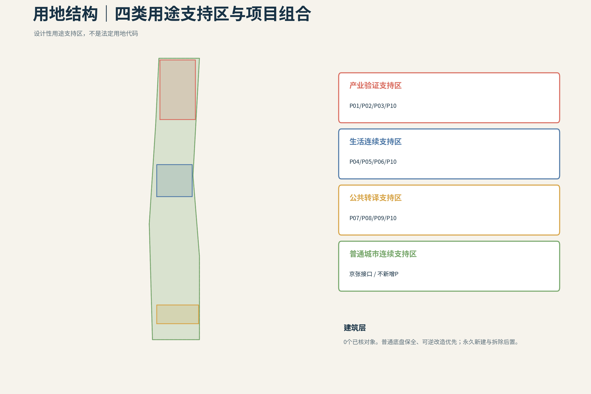

## 统筹研究范围产业与未来城市研究

“有门的城市”把人的生活连续性设为上位目标：私人侧能力可以连续，进入公共场景时权限、空间、设备与责任重新申请；公共端只接当次任务，不接完整的人、家庭或私人Agent。创新生态由人、公共机构、知识机构、产业主体、四类空间与责任门共同组成，跨区只交换有限任务、结果、回执和必要故障摘要。六个一手来源案例用于比较受控测试、社区服务、分阶段许可、人工监督与运营组织，不直接移植其绩效数字。 [source:AGENT-TASKBOOK] [source:CASE-03] [standard:PROJECT-AGENT-OPEN-CALL-TASKBOOK]

### 6个全球案例与可转化机制

- **Modena Automotive Smart Area（意大利摩德纳）**：在开放城市道路之外设置可控动态试验区，利用联网信号、数字标识、障碍识别与可移除标线，把研究、认证、维护与公共通行分层组织；其价值在于“可控测试边界”，而非复制中央控制室。局限是它仍以研发与认证为主，尚不能证明大规模公共服务绩效。 [source:CASE-01]
- **Accessibili-D（美国底特律）**：以11平方英里服务区、电话与App并行预约、无障碍车辆、真人安全员和社区反馈调整站点，把自动驾驶限定为老人和残障人士的社区服务补丁。局限是试点依赖资金、地理范围与真人安全员。 [source:CASE-02]
- **SHOW（欧洲20个城市）**：在密集城区、郊区、邻里与受控场地中统一测试固定线路、需求响应、MaaS与物流服务，并用共同指标比较乘客、货运、安全与运营。局限是平均速度较低，事故与冲突仍发生，跨城市结果不能直接移植到单一街区。 [source:CASE-03]
- **Punggol自动驾驶接驳（新加坡）**：以固定路线、实体上下客点、公共交通换乘、真人安全员和居民反馈逐步开放，连接住宅、诊所、市场与轨道站。局限是路线与站点约束明显，尚处早期运营阶段。 [source:CASE-04]
- **北京亦庄高等级自动驾驶示范区**：通过限定运行域、分阶段许可、路侧设施与交通枢纽连接，把测试、商业服务和监管逐步衔接。局限是公开资料更强调扩张与产业发展，普通无App入口、隐私、地方故障恢复和独立审计仍需补证。 [source:CASE-05]
- **Waymo无人驾驶出行服务（美国多城）**：作为专项参照，说明混行服务仍依赖路缘上下客、车队维护、远程协助和限定运行域。它不是公共创新街区范本；公平、空驶、路缘竞争与停电连续性不由本轮证据证明。 [source:CASE-06]

## 总体设计范围城市更新与控规深度城市设计

11.4 km²不是三区之间的连线图，而是五套可维护的城市网络：普通通行与慢行、蓝绿与公共空间、真人服务与无AI接力、产业测试/物流/维修/安全归港、能源/通信/恢复。横向权限合同要求每个节点都说明谁发起、为何调用、何时关权、谁接责以及故障后怎样回到普通服务。 [data:geometry/roads.geojson#N2B-RD-001] [data:geometry/public_space.geojson#N2B-PS-001] [depth:overall_spatial_structure]

城市更新动作不从拆建数量出发，而从普通底盘是否连续开始：先保全无需App的道路、无障碍、传统市政与真人入口，再把既有首层、公共空间和后勤空间改造成可逆接口，最后才讨论新增构筑物。用地、建筑、道路、绿地、公共空间、约束和分期必须共享P、SCN、责任、维护、恢复与退出字段；现阶段缺少法定用地、权属、建筑、轨道出入口和市政容量数据，因此图层只表达可复核的设计结构，不释放FAR、高度、拆除或工程承诺。 [depth:retain_renovate_demolish] [depth:traffic_rail_slow_parking]

## 重点区域详细设计

众智园验证可隔离、可维修、可复测的产业底盘；AI原点社区验证教育、医疗、银龄、家庭与停电中的低介入生活连续；大钟寺验证可进入、可拒绝、可申诉、可完整退场的城市前厅。三区各自保留普通公众线、真人服务线、维护/恢复线和本地降级闭环；京张公共脊柱连接三区，但不是第四重点区。 [data:geometry/key_areas.geojson#PROV-KEY-001] [data:geometry/key_areas.geojson#PROV-KEY-002] [data:geometry/key_areas.geojson#PROV-KEY-003]

`15:30`和`21:40`都是已注册的设计探针，不是已核实的固定放学或故障时刻。

### P01–P10在三区的挂位

- **P01 蓝绿开放验证环**：串联受控实验、公众观察、蓝绿连续与安全回收的公开边界。 — SCN-ZZY-01, SCN-ZZY-03
- **P02 机器天气场＋安全回收港**：在限定设备、版本、路面和时窗内验证雨雪热、积水与表面条件，并在异常时物理归港。 — SCN-ZZY-01
- **P03 维修—补能—端侧算力共用后场**：承载备件、低权限诊断、隔离、维修、补能、复测准备、受限端侧算力和人工停机。 — SCN-ZZY-02, SCN-ZZY-03
- **P04 15:30 三道慢门安全廊**：把校门—过街—社区的儿童通学组织为三道慢门与真人责任接力。 — SCN-AIO-01
- **P05 可见求助门网络**：把学校、社区、卫生服务、普通电话与安全等待点组织成看得见、可找到真人、可拒绝AI的求助入口。 — SCN-AIO-01, SCN-AIO-03
- **P06 21:40 家庭—社区连续性节点**：在停电、断网和夜间异常中保留共享侧联络、照明、机械旁通、纸面流程和真人接力，不公开住宅geometry。 — SCN-AIO-02, SCN-AIO-03
- **P07 大钟寺站四象限地面缝合**：处理站城换向、普通通行、无障碍过街、非机动车秩序和四象限地面公共空间。 — SCN-DZS-01, SCN-DZS-03
- **P08 真人城市前台＋Visitor Agent Landing Hall**：承载多语问询、短期访问、人工申诉、工作委托和到期退场，并保持普通无凭证公共线。 — SCN-DZS-01, SCN-DZS-02
- **P09 可逆展演公地＋居民安静脊**：平日服务居民连续生活，活动时限定展开，结束后设施、凭证、临时权限与数据接口共同退场。 — SCN-DZS-02, SCN-DZS-03
- **P10 有门·人机公共服务站网络**：以主站、分站和低权限节点承载实体服务，并为P05/P08等空间门提供排班、培训、转办、审计、人工接管与机构协议；不成为中央总控。 — SCN-ZZY-02, SCN-AIO-01, SCN-AIO-02, SCN-AIO-03, SCN-DZS-01, SCN-DZS-03

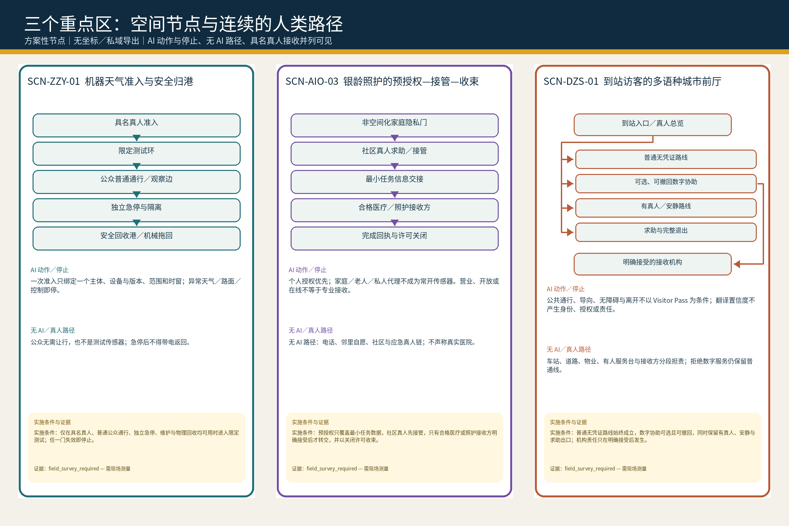

## AI 创新生态、人才画像与 AI+ 场景

这是覆盖在既有 P01–P10、12 个 SCN 与五套城市网络上的证据映射层，不新增项目、场景、法定边界、指标或中央平台。[source:AGENT-TASKBOOK]

**本地商户／青年／银龄经济回环。** 一单真实需求先由商户维护开放服务卡，公共接口只核验资质、安全、认证、投诉与经营事实，用户的私人 Agent 再按这一单的距离、时间、预算、语言、无障碍需求和当前容量临时匹配；用户可直接电话、进店或与商户继续交易。AI 原点周边可承接购买与租赁、安装设置、互联、教学、翻新和小修；复杂故障可再进入众智园诊断、复测、培训与规范更新，把能力和设备送回社区，让下一次本地服务更强。公共 AI 是交换机，不是收费站：不出售“自然推荐”排序，不把广告混入匹配，不强制独家入驻或占有客户关系，基础匹配不以交易额抽成，并保留商户纠错、申诉与轮换曝光。这条回环可能支持青年承担安装、维修、接待、课后助教、活动运营与无障碍改造等有报酬岗位，也可能让退休工程师、教师和社区熟人在资格边界内成为有报酬的导师、复检、课后支持与文化导览能力；银龄经济不只是向老人售卖服务。这是待验证的经济组织提案，不证明平台、商户名录、订单、岗位、收益或运营关系已经存在；资质、容量、付费、保险、劳动关系与公共成本均须另核。

### R03｜三区旗舰场景与十二场景同源表

[source:N7-1D-12SCN-RAW-SOURCE-LOCK]

12 张均保持设计场景、证据门开放、current value = null、formal_ready=false；v0.2 只增加公开显影字段，不改 v0.1 canonical fields。

#### 众智园

| 场景 | 项目 | 测量协议 | 公开合同 |
| --- | --- | --- | --- |
| **SCN-ZZY-01** 机器天气准入与安全归港 | P01, P02 | MP-M-ZZY-01, MP-M-ZZY-02 | 准入不是放行一台机器，而是把限定测试、公众边界、独立急停与物理归港连成可关闭的责任链。 仅在具名真人、普通公众通行、独立急停、维护与物理回收均可用时进入限定测试；任一门失效即停止。 |
| **SCN-ZZY-02** 跨厂牌故障诊断—维修—复测 | P03, P10 | MP-M-PSS-08, MP-M-ZZY-02 | 维修闭环可展示，缺失的 M-PSS-08 定义继续阻断采集，不用推测方法或阈值填空。 跨厂牌诊断与复测须保留人工维修、纸面记录和独立复核；M-PSS-08 定义注册前不得采集或声称结果。 |
| **SCN-ZZY-03** 公共样本—隔离沙盒—结果级交付 | P01, P03 | MP-M-PSS-05, MP-M-PSS-07 | 公共样本—隔离沙盒—结果级交付是一条最小披露链，当前仍待现场与制度证据。 公共样本只进入隔离沙盒并以结果级交付，禁止原始数据外发、跨任务继承或把公众作为训练对象。 |

#### AI 原点

| 场景 | 项目 | 测量协议 | 公开合同 |
| --- | --- | --- | --- |
| **SCN-AIO-01** 15:30 三道慢门真人交接 | P04, P05, P10 | MP-M-AIO-01, MP-M-AIO-02, MP-M-PSS-02, MP-Q3-PEAK-FLOW-WAIT, MP-Q3-GROUND-FLOOR-INTERFACE | 学校侧真人—慢门—过街—社区侧真人—隐私停止线构成 15:30 可关闭交接。 15:30 链必须由学校侧真人开启，三道慢门逐段确认，社区侧真人明确接收；追踪或责任未接收即停止。 |
| **SCN-AIO-02** 21:40 停电后的可关合回家链 | P06, P10 | MP-M-AIO-03A, MP-M-AIO-03B, MP-M-PSS-01, MP-Q3-NIGHT-LIGHTING-USE | 断电—屏幕退场—实体基线—真人接力—家庭隐私停止线构成可关合回家链。 21:40 断电时非必要屏幕先退场，应急资源只保照明、求助、通信与疏散，并由真人分段接力；不得读取家庭私域。 |
| **SCN-AIO-03** 银龄照护的预授权—接管—收束 | P05, P06, P10 | MP-M-AIO-02, MP-M-PSS-07, MP-Q3-GROUND-FLOOR-INTERFACE | 非空间化家庭隐私门—社区求助—最小信息交接—合格接收方—许可关闭构成银龄照护闭环。 预授权只覆盖最小任务数据，社区真人先接管，只有合格医疗或照护接收方明确接受后才转交，并以关闭许可收束。 |

#### 大钟寺

| 场景 | 项目 | 测量协议 | 公开合同 |
| --- | --- | --- | --- |
| **SCN-DZS-01** 到站访客的多语种城市前厅 | P07, P08, P10 | MP-M-DZS-01A, MP-M-DZS-01B, MP-M-PSS-06A, MP-M-PSS-06B, MP-M-PSS-12, MP-Q3-PEAK-FLOW-WAIT, MP-Q3-GROUND-FLOOR-INTERFACE | 到站入口分出普通无凭证、可选数字、有真人安静线与求助出口，任何接收机构都不能被默认承诺。 普通无凭证路线始终成立，数字协助可选且可撤回，同时保留有真人、安静与求助出口；机构责任只在明确接受后发生。 |
| **SCN-DZS-02** 一次工作委托的五权分离 | P08, P09 | MP-M-DZS-03, MP-M-PSS-05 | 一次工作委托以五权分离与完整退出为核心，P08/P09-only 映射冻结。 委托、执行、验收、付款与争议处理五权保持分离；只关联 P08/P09，不得回填 P10。 |
| **SCN-DZS-03** 展演开场—居民静线—完整退场 | P07, P09, P10 | MP-M-DZS-02A, MP-M-DZS-02B, MP-Q3-NIGHT-LIGHTING-USE | 开场、居民静线与完整退场并列成立，所有数值仍待现场基线。 展演需同时保留普通通行、居民静线、真人值守与完整退场；噪声、拥挤或退出门失效即停。 |

#### 京张公共脊柱（接口层）

| 场景 | 项目 | 测量协议 | 公开合同 |
| --- | --- | --- | --- |
| **SCN-JZ-01** 雨后夜行的三证改道 | P01, P04, P07 | MP-M-PSS-12, MP-Q3-NIGHT-LIGHTING-USE, MP-Q3-PARK-DWELL-HELP | 雨后夜行以三证改道验证公共连续性，保持 interface_only。 只作为京张公共连续性接口压力测试，不形成第四重点区；雨后夜行改道必须以实体照明、真人巡查和可退出路线成立。 |
| **SCN-JZ-02** 冰雪高温下的主脊开合 | P01, P02, P09 | MP-M-ZZY-03A, MP-M-ZZY-03B, MP-Q3-PARK-DWELL-HELP | 主脊开合保持 interface_only，两个未定义指标继续阻断采集。 只作为京张接口压力测试；M-ZZY-03A/B 定义注册前不得采集或声称冰雪高温开合性能。 |
| **SCN-JZ-03** 断电时公共脊柱的无屏接力 | P04, P06, P08, P09 | MP-M-AIO-03A, MP-M-AIO-03B, MP-M-PSS-01, MP-Q3-NIGHT-LIGHTING-USE, MP-Q3-PARK-DWELL-HELP | 实体照明—求助点—普通导视—广播／固定电话—疏散—真人分段接力构成无屏公共脊柱。 断电后屏幕退出，应急电只保实体照明、求助、通信与疏散；公园、物业与公共服务真人逐段明确接收，不得扩张到家庭私域。 |

## 用地、建筑规模与拆改留方案

用地层只表达四类设计性用途支持区：产业验证、生活连续、公共转译和普通城市连续。建筑图层保持合法的0-feature data gap；项目载体不得冒充建筑。方案统一采用“普通底盘保全—既有首层与公共空间复用—可逆微更新—新建后置”的次序，具体法定用地、FAR、高度、权属、拆除和新建决定保持unknown。 [data:geometry/land_use.geojson#N2B-LU-ZZY] [data:geometry/buildings.geojson] [standard:MOHURD-CONTROL-DETAILED-PLANNING]

四类用途支持区是功能组织，不是法定地类替换；其边界只用于检查P01–P10、场景和城市网络是否有空间承载。建筑层的空值是有意披露的数据缺口：没有已清权的轮廓、高度、结构、用途和权属时，不用示意盒子制造“已深化”的假象。取得专业资料后，应逐栋补入保留、修缮、可逆改造、新建或待核五类状态，并由规划、建筑、消防、无障碍和产权审查共同释放规模与拆改留结论。 [depth:development_intensity_controls] [depth:height_massing_character]

## 交通、轨道、市政与公共服务设施

普通通行不依赖App、账号或数字凭证；公众线、设备线和运维线分开。P10以AI原点主站、众智园维修分站、大钟寺公共服务分站和京张低权限节点构成分域真人网络，不建立完整私域总库。断网、停电、误判和设备损坏时，纸质导视、普通电话、人工窗口、硬急停、机械拖回和传统市政旁通继续可用。 [data:geometry/roads.geojson#N2B-RD-004] [standard:BARRIER-FREE-ENVIRONMENT-LAW] [depth:traffic_rail_slow_parking] 市政与恢复责任另由独立深度项复核。 [depth:municipal_new_infrastructure]

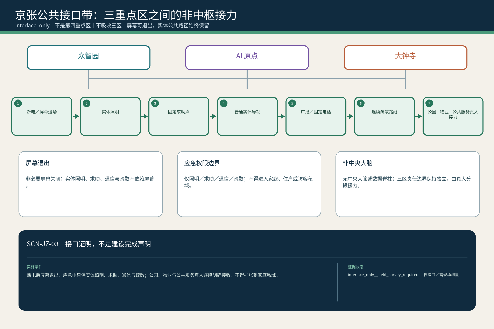

## 蓝绿空间、公共空间与城市风貌

京张公共脊柱承担普通步行骑行、蓝绿连续、气候适应、铁路与创新文化阅读、低权限求助和无屏接力。公共空间概念建议包括开发者步行与开源成果展示界面、可纠错可撤下的贡献/荣誉展示节点、铁路工程—维修—AI公共文化导览序列。临时活动和设备必须可完整退场，退场后居民静线与普通公共使用继续存在。 [data:geometry/green_space.geojson#N2B-GR-001] [data:geometry/public_space.geojson#N2B-PS-001] [standard:MOHURD-URBAN-DESIGN-MEASURES]

蓝绿与公共空间均从提交geometry复算，但仅代表方案模型，不代表现状绿量、权属或法定绿地率。风貌控制采用“普通界面连续、重点节点可读、技术设施退后、夜间与居民静线优先”的规则，不凭空指定建筑高度；设备基础、机房、广告和临时展演不得切断排水、消防、无障碍和传统维修。待树木、水系、文保、建筑与地下市政资料清权后，相关专业人员还须逐段复核连续性、遮阴、海绵容量、视线和维护通道。 [depth:blue_green_public_space] [depth:height_massing_character]

## 更新项目清单、实施政策与分期计划

P01–P10按“基线保全—可逆接口—受控测试与韧性设施—长期评估”分期。P10只承担跨区说明、接责、投诉、审计与关权支撑，不吞并P05可见求助空间或P08真人前厅。年度运营建议按Q1规则/来源更新、Q2公共场景与无AI演练、Q3测试维修复测、Q4贡献纠错退出复盘循环；这是一套深化建议，不构成政府日历、预算或招商承诺。 [data:geometry/phasing.geojson#N2B-PH-00] [depth:renewal_project_list] [depth:phasing_implementation]

### 四阶段实施次序

1. 普通通行与传统市政基线保全
2. 可逆接口与既有空间复用
3. 受控测试、韧性设施与真人节点
4. 长期评估、纠错与按证据扩展

## 指标体系、面积复算与合规矩阵

本包从同一组GeoJSON在EPSG:4548下复算：总体设计范围11,412,825.386 m²，方案蓝绿比例19.839%，方案公共空间比例6.987%。三项均为provisional，不是法定或现状指标；official geometry或方案面变化后必须整包重算。全部服务、响应、安全、满意度和经济指标仍为unknown。 [metric:site_area_sqm] [metric:green_ratio] [metric:public_space_ratio]

### R05｜unknown 指标的测量协议与回链

| metric_id | value | status |
| --- | --- | --- |
| `site_area_sqm` | 11,412,825.386 m² | `known` |
| `green_ratio` | 0.19838764 ratio | `known` |
| `public_space_ratio` | 0.06986680 ratio | `known` |
| `key_area_count` | 3 count | `known` |

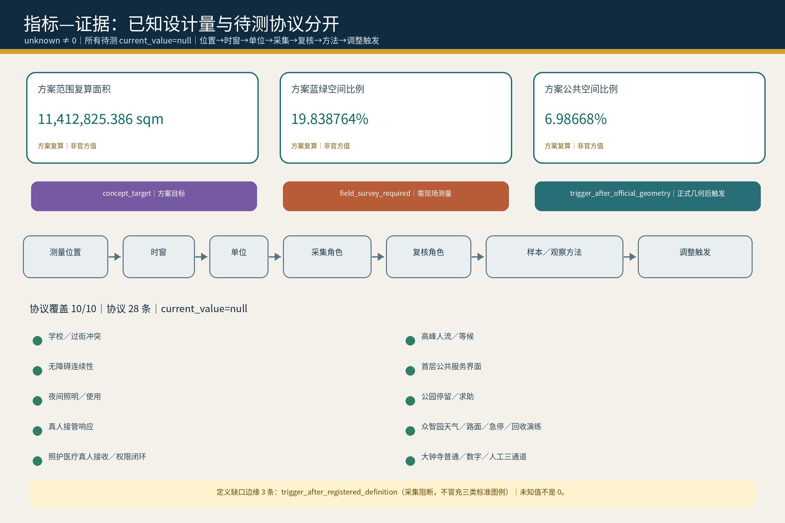

## 风险、版权与合规说明

主要风险包括：provisional geometry被误读为官方边界、P10重新中央化、三区以概念替代空间证据、智能构件妨碍传统市政和应急、来源或图片权利不清、对外披露私域坐标、版本变化后沿用旧验收。包内只使用自生成图件和可登记来源；不分发字体，不上传私密截图、住宅终点或个人轨迹。 [standard:GENERATIVE-AI-INTERIM-MEASURES] [source:PROJECT-STANDARDS-LIBRARY] [depth:risk_missing_data]

风险控制不是在文末加一句免责声明，而是进入空间和运营阶段门：涉及儿童、医疗、住宅和个人轨迹时默认最少披露；测试、物流、活动和智能设施必须有普通公众旁路、真人责任人、硬停机、维护、恢复和撤除条件；高风险项须由相应专业人员与受影响公众复核。版权、来源、模型、图件和转换过程保留版本记录，任何新的官方数据、脚本或账号身份变化都会触发重新渲染、哈希刷新与完整自检。 [data:geometry/constraints.geojson] [depth:risk_missing_data]

## 参考资料

真正影响方案判断的材料包括：官方公告、结构化设计任务书、面向智能体任务书、住建部城市设计管理办法、控规编制审批办法、自然资源部用地用海分类指南、无障碍环境建设法，以及六个限用途一手来源案例。完整机器索引见sources.json；案例只支撑机制比较，不支撑本地场地、机构或绩效结论。 [source:PROJECT-OFFICIAL-ANNOUNCEMENT] [source:PROJECT-STANDARDS-LIBRARY] [source:CASE-01]

资料采用按权威等级和允许用途分开登记：官方公告支撑任务与文字范围，组织方结构化文件支撑提交契约，provisional geometry只支撑可替换的空间生成与复算，案例只支撑机制比较，内部设计工件只证明本方案自身的选择。新闻截图、媒体转述、OSM推断与AI猜测不得升级为红线、现状或实施事实；六个上游场景包已按精确字节挂载；其中4张原始来源仍只有中文卡，machine／EN原卡缺口继续开放，不以N3／N6派生桥替代。审阅者可从正文标记进入sources、assumptions、geometry、metrics和矩阵，逐项追踪事实、设计与未知的边界。 [source:SOURCE-REGISTRY] [depth:existing_conditions_diagnosis]
