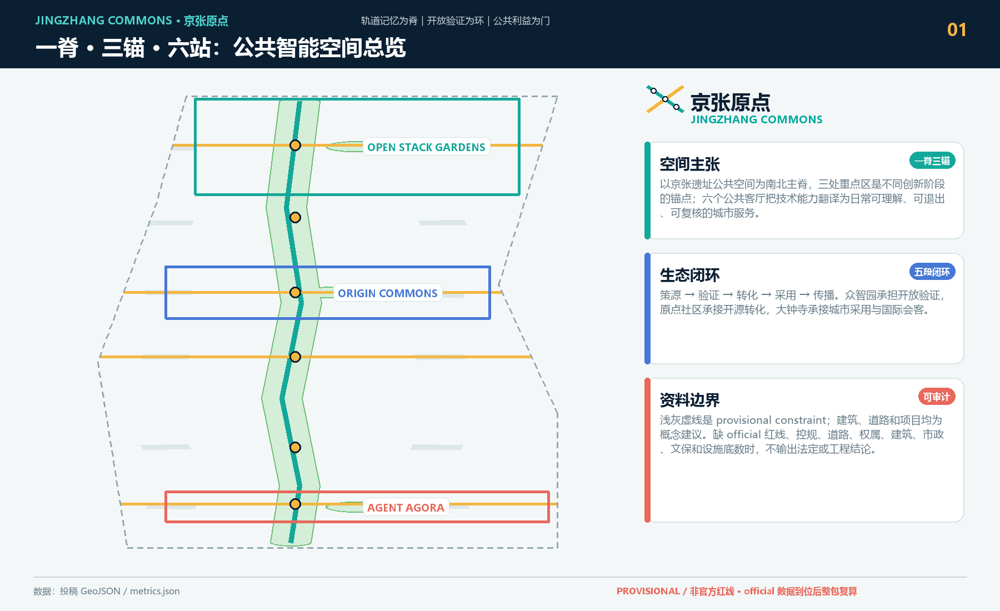
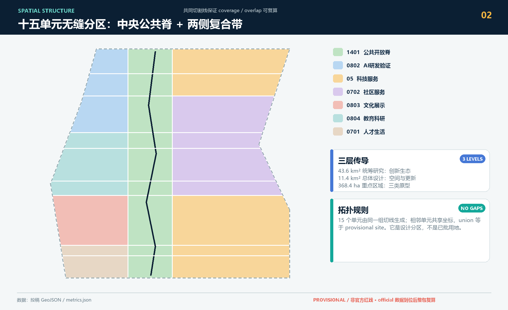
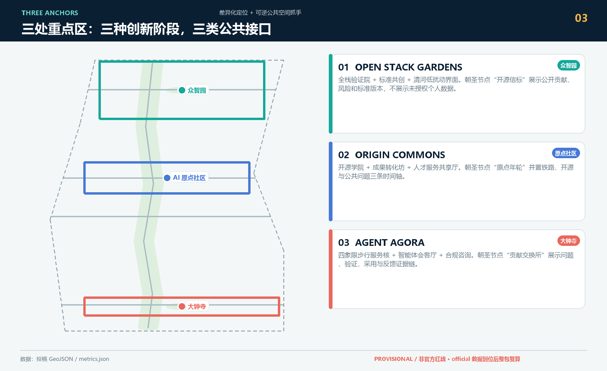
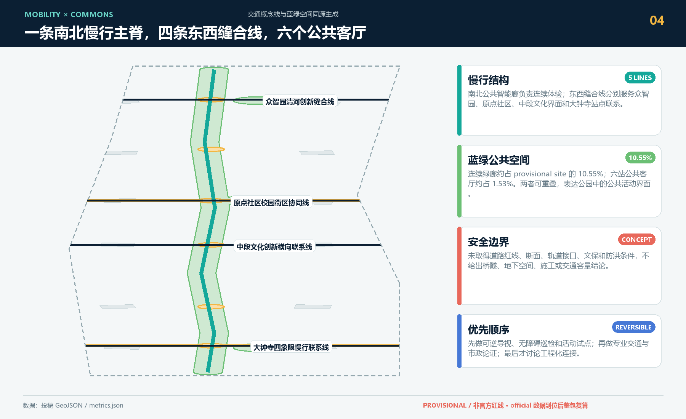
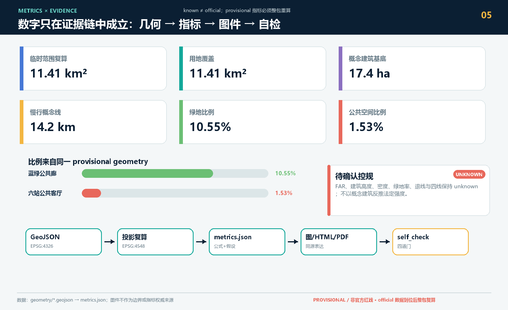

# Jing-Zhang Origin: Open Urban Coexistence Belt for Public Intelligence

## Design Basis and Source List

This formal intake proposal is based primarily on the qualification pre-review announcement for the Centennial Jing-Zhang AI Innovation Belt Urban Design international call issued by the Haidian Branch of the Beijing Municipal Commission of Planning and Natural Resources. It also takes into account the Agent task book after rights clearance, five local professional standard snapshots, and the inline-code span `data/source_registry.json` as evidence boundaries. Design first lock in the provisional scope, then generate seamless land zoning with common boundary lines, using a single set of EPSG:4548 Recalculated logic-driven indicators, five charts, offline HTML And two sets PDF. Each spatial judgment should revert to GeoJSON, each known metric should revert to a formula, each unverified official condition should be downgraded to an assumption, and it should not be disguised as legal precision through visual accuracy.

This section of the Evidence Chain cites [source:OFFICIAL-ANNOUNCEMENT], [source:AGENT-TASKBOOK], [source:SITE-PACKAGE], [source:SOURCE-REGISTRY], [source:PROCESSED-FACT-PACK], [source:BOUNDARY-SOURCE], [source:KEY-AREA-SOURCE], [standard:PROJECT-OFFICIAL-ANNOUNCEMENT], [standard:PROJECT-AGENT-OPEN-CALL-TASKBOOK], [standard:MOHURD-URBAN-DESIGN-MEASURES], [standard:MOHURD-CONTROL-DETAILED-PLANNING], [standard:MNR-LAND-USE-CLASSIFICATION-GUIDE] [standard:MOHURD-ARCH-DESIGN-DEPTH-2016] and [depth:existing_conditions_diagnosis], used to explain that the proposal is not an independent visionary text but is organized from the announcement, agent-oriented task statement, standards, boundaries, processing package, and data list.

The boundaries for the use of the registration form are as follows:

- data/source_registry.json Registers the purposes for which publicly available, clarificatory, and interim data are used.
- Current Registration Abstract: formal available data 5 items, background data 0 items, provisional-only data 1 item.
- The agent shall not upgrade background_only or provisional_only materials to official boundaries, statutory controls, formal scoring criteria, or government implementation commitments.

`data/processed/agent_fact_pack.md` is the reading navigation layer for this proposal and is not a new authoritative source. [source:PROCESSED-FACT-PACK] only helps the agent to organize the three layers of scope, three key areas, announcement tasks, agent.1-agent.6, data availability, and data gaps into a readable proposal; all factual judgments still revert to [source:OFFICIAL-ANNOUNCEMENT], [source:AGENT-TASKBOOK], [source:SOURCE-REGISTRY], [source:BOUNDARY-SOURCE], and [source:KEY-AREA-SOURCE].

This plan uses the `provisional_boundaries.geojson` warehouse as a temporary generating constraint when the official `SITE_BOUNDARY` and three `KEY_AREA` are not yet obtained. Both `geometry/site_boundary.geojson` and `geometry/key_areas.geojson` maintain `provisional_constraint` and `official_boundary=false`; they are only used for intake generation, self-check, visualization, and design discussions, and are not to be used as official redline, approval, or precise area reference. Once the official polygons are in place, the site boundary, key areas, land use, roads, green space, public space, buildings, phasing, metrics, and the five diagrams must be re-generated as a whole in HTML and PDF.

This submission status is: **Provisional Boundary, enterable content under review, and non-enterable official polygon dependent professional area scoring**. All building prototypes, transportation linkages, update projects, and activity systems are Conceptual Recommendations or reference solutions, available for professional teams to deepen their research; this boundary is disclosed repeatedly in the main text, sources, assumptions, self_check, figures, and HTML.

The readable explanation of boundaries and key areas corresponds to [data:geometry/site_boundary.geojson#SITE-001], [data:geometry/key_areas.geojson#PROV-KEY-001] and [metric:site_area_sqm], [metric:key_area_count]. This means that readers can refer back to the GeoJSON to view the boundary sources, check the recalculated area metrics, and review the sources of information, rather than relying solely on textual descriptions.

## Three-Level Scope Framework

The proposal is organized according to the three levels defined in the announcement: the Coordinated Research Area focuses on the 43.6 square kilometers of AI industry ecosystem, strategic positioning, innovation chain, and future urban form; the Overall Design Area focuses on the 11.4 square kilometers of urban and industrial areas surrounding the Jing-Zhang heritage park within 1-2 kilometers, requiring the formation of an overall framework for Urban Renewal, industrial space layout, traffic and municipal support, and Urban Character control; the Key-Area Detailed Design Area focuses on 368.4 hectares of three detailed design regions, requiring the clarification of functional types, building scale, classification of demolish–renovate–retain strategy, Public Space connectivity, and traffic organization. The three layers of scope are mapped to `compliance_matrix.json` to ensure that the required tasks in sections 1.3, 1.4, and 1.5 of the announcement, as well as agent.1-agent.6, have corresponding chapters, layers, indicators, drawings, and HTML evidence. (Demolish–Renovate–Retain Strategy)

The depth items of the three-level work framework are constrained by [depth:three_level_scope_framework] and [depth:overall_spatial_structure], spatial evidence is based on [data:geometry/site_boundary.geojson#SITE-001] and [data:geometry/key_areas.geojson#PROV-KEY-001], tasks are based on [standard:PROJECT-OFFICIAL-ANNOUNCEMENT], and the scope index is navigated by the three-level scope table in [source:PROCESSED-FACT-PACK] `project_scope_summary.csv`.

Three-layer work is not a collection of disjointed drawings. Integrated research determines the industrial chain and urban form, and the overall design translates these determinations into the implementation of update projects, spatial structure, and facility bearing. Detailed design in key areas verifies the feasibility of specific plots, buildings, transportation, Public Spaces, and AI application scenarios. When generating a scheme, the agent must first lock the current submitted official or provisional boundaries and constraints before generating land use, buildings, roads, green spaces, public spaces, phased development, and AI service nodes. Finally, these layers are recalculated to explain which conclusions are still subject to the provisional boundary. Any areas, proportions, scales, or project quantities that cannot be recalculated from structured data must not be written into the formal conclusions.

This plan uses "One Ridge, Three Anchors, and Six Stations" as the sole overall spatial structure, no longer employing another set of overarching slogans. "One Ridge" is the composite of the Jing-Zhang Railway Heritage Public Space and the north-south Public Smart/Blue-Green Slow Travel Main Axis. "Three Anchors" are the Zhongzhiyuan, Beijing AI Origin Community, and Dazhongsi three key areas. "Six Stations" are six public living rooms arranged along the main ridge, translating technical capabilities into everyday understandable, exitable, and verifiable urban services. Four east-west stitching lines belong to the horizontal connection system, responsible for connecting university campuses, industrial parks, residential areas, and rail transit stations. "Full Stack Validation—Open Source Transformation—Smart Economy" are the functional themes that the three anchors respectively undertake. The Blue-Green Slow Travel Composite Loop is a transportation and public space specialized system, not at the same level as the overall spatial structure. This tier simultaneously responds to the three layers of work scope required by the announcement: organizing space with "One Ridge, Three Anchors, and Six Stations," organizing industrial ecosystems, and implementing interface connections for specialized systems.

| Level | Design Issue | Solution Approach | Data Focus |
| --- | --- | --- | --- |
| Coordinated Research Area | How should AI industry ecosystems and future urban forms be organized? | Establish an "academic source-innovation - open-source collaboration - enterprise transformation - public experience - international dissemination" innovation chain | compliance_matrix.json, standard_matrix.json |
| Overall Design Area | Industrial space, Urban Renewal, transportation and municipal facilities, and appearance and style how to be represented on the map | Land use, buildings, roads, green spaces, Public Spaces, and phased layers are expressed together. | [data:geometry/land_use.geojson#LU-001], [data:geometry/roads.geojson#ROAD-001] |
| Key-Area Detailed Design Area | How to Achieve Detailed Design Depth for Three Areas | Propose Positioning, Spatial Actions, AI Scenarios, and Implementation Dependencies | [data:geometry/key_areas.geojson#PROV-KEY-001], [data:geometry/key_areas.geojson#PROV-KEY-002], [data:geometry/key_areas.geojson#PROV-KEY-003] |

## Coordinated Research Area: Industry and Future City Research

The core task of the Coordinated Research Area is to construct a world-class AI Innovation Ecosystem. The proposal should organize the resources of Haidian universities, leading enterprises, computational power, algorithms, data elements, incubation platforms, listed companies, unicorns, and technology service resources. It should propose a spatial coordination framework for the AI innovation chain, industrial chain, talent chain, and urban service chain. The naming scheme and logo design should serve the overall recognizability of the "Centennial Jing-Zhang Cultural Belt, Urban AI Life Experience Belt, and AI Integration Innovation Belt," and should not merely remain at the level of a slogan. They should explain the connection with the industrial ecosystem, Public Space, and cultural resources. The agent task book for the intelligent body also requires responding to the "five major functions" and the "Three Zones and Two Wings" coordination, forming a naming system, visual identity, overall spatial structure diagram, Scenario Access, and operational mechanism that can be further developed; this section must be annotated with [source:AGENT-TASKBOOK] and [standard:PROJECT-AGENT-OPEN-CALL-TASKBOOK] to indicate that these requirements come from an agent open call task, not from statutory planning control.

Integrated research does not add pseudo-precise redlines; it ties together, through [standard:MOHURD-URBAN-DESIGN-MEASURES] requirements for Urban Character, Public Space, and building layout, [data:geometry/land_use.geojson#LU-001], [data:geometry/public_space.geojson#PUBLIC-001], and [depth:overall_spatial_structure], to explain how industrial strategies must ultimately be reflected in visible and verifiable spatial structures.

Conceptual Recommendation for the study of future urban forms should address how artificial intelligence (AI) transforms work, life, social interactions, learning, transportation, and public services. The proposal should concretize AI traffic systems, continuous green spaces, innovative service facilities, and an international living and working atmosphere into locatable functional zones, nodes, corridors, and scenarios, rather than vaguely describing a technical vision. The agent should incorporate indicators for industrial strategic metrics, AI innovation indices, talent density, types of spatial supply, and key AI+ vertical application areas into the indicator system, and clearly mark which are official, which are design recommendations, and which still require formal data calibration. If global AI innovation activities, developer communities, open scenarios, or pilgrimage routes are proposed, they should be written as "Conceptual Recommendation/Reference Scheme/Available for Professional Teams to Deepen Research," and not as confirmed government activities or implementation arrangements.

### Brand and Naming System: JINGZHANG COMMONS

Main name "Jing-Zhang Origin" takes the Jing-Zhang Railway heritage as the time origin, Beijing AI Origin Community as the innovation source anchor point, and defines the entire corridor as the urban starting point for continuous occurrence and diffusion of public intelligence; the English name **JINGZHANG COMMONS** emphasizes that AI resources are not closed park benefits but a city-wide public capability that can be used by researchers, businesses, residents, and visitors. The naming system follows the "One Spine, Three Anchors, Six Stations" spatial hierarchy: the north-south main spine is named "Commons Spine," the Zhongzhiyuan, Origin Community, and Dazhongsi three anchors are named "Open Stack Gardens," "Origin Commons," and "Agent Agora," respectively, and the six public living rooms uniformly use the "Commons Station" node syntax; the annual public experience route "Memory Loop" belongs to the operational brand and does not establish an additional spatial structure. The logo direction uses an abstract "J" combination mark composed of two parallel tracks, three anchor points, and a group of open stations, without using any corporate trademarks or unauthorized fonts; it is recognizable in single-color, 16px small icons, and black and white prints. Visual colors are represented by deep navy blue for credible governance, track green for open collaboration, signal amber for public interaction, and gray dashed lines for provisional boundaries. [source:AGENT-TASKBOOK] [standard:PROJECT-AGENT-OPEN-CALL-TASKBOOK] [depth:overall_spatial_structure]

### Global Case Translation: From "Copy Parks" to "Extraction Mechanisms"

The five cases are only referenced as a mechanism for `background_only`, and do not support the project's red line, master plan, investment attraction list, or investment commitments. The focus of the translation should be on the combination of "space-organization-publicness," rather than replicating the form.

| Case | Verifiable Mechanism | Jing-Zhang Transliteration | Boundary |
| --- | --- | --- | --- |
| MIT Kendall Square | Research, laboratories, residential spaces, retail, museums, and open spaces are mixed together and shaped through community engagement and updating. | The Origin Community places the release of outcomes, talent living, and public open spaces on the same pedestrian loop. | Only draw upon the mechanisms of mixed-use and participation [source:CASE-KENDALL] |
| Paris STATION F | Organize a variety of entrepreneurial programs, shared services, and public/half-public zones within historical industrial buildings | Zhongzhiyuan forms a "validation-standard-acceleration-display" hierarchy, rather than a single office park | Do not cite a list of companies or investment data [source:CASE-STATIONF] |
| Singapore one-north | Work, living, research, and cultural nodes are organized as a continuous innovation district | The Three Zones and Two Wings are composed of a multi-centered network through Public Spaces and service nodes | Governance systems or construction metrics are not replicated [source:CASE-ONENORTH] |
| London Knowledge Quarter | A Mile of Collaborative Networks Formed by Diverse Knowledge Institutions through Partnerships, Knowledge Exchange, and Public Engagement | Along the Jing-Zhang corridor, universities, cultural institutions, and enterprise nodes collaborate through "urban interfaces" rather than through walled mergers | Do not assume partner institutions as stakeholders in this project [source:CASE-KQ] |
| Toronto MaRS | Research, entrepreneurial support, businesses, capital, and technology adoption are connected by the same urban innovation platform. | The Zhongguancun Technology Services Wing forms a service orchestration from original innovation to scenario adoption. | Do not use its scale or performance metrics as indicators for Haidian [source:CASE-MARS] |

Thus forming a "initiation-verification-transformation-adoption-dissemination" five-stage ecological loop: universities and research institutions provide the initiation interface, Zhongzhiyuan undertakes regulated verification, the Origin Community handles open-source transformation, Dazhongsi handles urban adoption and international showcases, and the entire Jing-Zhang Public Space bears public understanding and global dissemination. This loop is a design assumption for the synergistic collaboration between industry and space, not a confirmed business attraction or policy arrangement. [source:OFFICIAL-ANNOUNCEMENT] [depth:existing_conditions_diagnosis]

## Overall Design Area: Urban Renewal and Regulatory-Plan-Level Urban Design

The Overall Design Area requires the depth of Urban Design as per the Regulatory Detailed Planning. The proposal must present the overall spatial structure of Urban Renewal, identify inefficient spaces, provide a list of renewal projects, suggest implementation policies, specify the proportion of industrial functions, propose a model for spatial organization, assess the total building scale, and evaluate comprehensive carrying capacity. `geometry/land_use.geojson` should fully cover the design boundary with no overlaps, `geometry/buildings.geojson` should express the updated Building Footprint or retained building footprint, `geometry/roads.geojson` should express micro-circulation, pedestrian-friendly, and rail access relationships, and `metrics.json` should recalculate the core area, proportions, and layer counts.

This plan divides the provisional overall scope into 15 topologically safe units by using two north-south common tangents and four east-west common tangents, forming a "ridge on both sides" land support relationship. The central 1401 park and green space carries the Jing-Zhang heritage narrative, barrier-free pedestrian access, low-intrusive AI services, and six public lounges, serving as the "ridge" of the city's shared interface; the composite functional units on both sides provide differentiated support for the "three anchors": the northern Zhongzhiyuan with 0802 research and 05 technology services for full-stack validation, the central Origin Community with 0804 education and research, 0702 community services, and 0803 cultural display for open-source transformation, and the southern Dazhongsi with 0701 living support and 05 technology services for intelligent economy and international exchange. The above three themes are the division of labor for the anchors, not a new spatial hierarchy. The 15 units share boundary coordinates, and the total area is consistent with the submitted boundary. [data:geometry/land_use.geojson#LU-001] [metric:land_use_partition_area_sqm]

Arrange the architectural layers with 12 reference prototypes, corresponding to Open Validation Courtyards, Collaborative Accelerators, Open Source Academies, Transformation Workshops, Rail Memory Workshops, Public Smart Living Labs, Youth Cohousing, Intelligent Body Collaborative Offices, and Walking Service Nuclei, respectively. They are only used to verify the combination relationship of "function-Public Space-walkable," uniformly labeled as `conceptual_reference_prototype`; they do not represent existing buildings, do not recognize ownership, and do not make specific conclusions about demolition, new construction, or engineering feasibility. [data:geometry/buildings.geojson#BLDG-001] [metric:building_footprint_area_sqm]

This section breaks down the control planning depth content into reviewable objects: [standard:MOHURD-CONTROL-DETAILED-PLANNING] expresses the land use structure, [data:geometry/land_use.geojson#LU-001] expresses the land use structure, [data:geometry/buildings.geojson#BLDG-001] expresses the Building Footprint, [data:geometry/roads.geojson#ROAD-001] expresses traffic organization, [metric:building_footprint_area_sqm] is used to verify the building footprint area, [depth:land_use_layout] constrains the depth with [depth:development_intensity_controls].

Overall design of the transportation and service network follows the "One Spine and Three Anchors Six Stations": the north-south public intelligent corridor, together with the Jing-Zhang heritage, forms the "One Spine"; the Zhongzhiyuan Qinghe innovation seam, the original community school streetline, the mid-segment cultural innovation connection line, and the Dazhongsi four-quadrant pedestrian connection line form four horizontal connection systems; six public living rooms serve as service nodes along the spine. The blue-green slow-moving composite loop formed by the main spine, horizontal seam lines, and local activity routes is part of the transportation and Public Space specialized system, and does not establish an additional overall structure. All connection lines merely express the relationships that need to be resolved, without indicating road boundaries or engineering positions. The municipal level proposes a three-tier conceptual framework of "end-side service cabinets-street shared machine rooms-regional computing services," with all energy, pipelines, fire safety, flood control, and maintenance capacities awaiting official specialized documentation confirmation. [data:geometry/roads.geojson#ROAD-001] [data:geometry/public_space.geojson#PUBLIC-001] [metric:road_centerline_length_m] [depth:municipal_new_infrastructure]

## Three Anchors: Detailed Design of Key Areas

Detailed design for key areas is a mandatory option. For the Zhongzhiyuan AI Independent Innovation Acceleration Area, a detailed plan should be proposed around the national artificial intelligence platform, full-stack independent innovation, standard setting, security governance, industry exhibition, external transportation, Qinghe culture, low-carbon green innovative interaction environment, and green spaces AI scenarios. For the Beijing AI Origin Community, a detailed plan should be proposed around on-campus innovation, results incubation and transformation, talent special zone, open-source system, brand events, building demolish–renovate–retain strategy, result display and release, living and residential facilities, campus and park pedestrian connections, and Transit-Station Integration. For the Dazhongsi AI Industry Cluster, a detailed plan should be proposed around leading enterprises, intelligent bodies, intelligent terminals, content consumption, data elements, digital assets, commercial services, mixed-use planning green spaces, Dazhongsi station integration, and four quadrants pedestrian connectivity at the intersection. (Demolish–Renovate–Retain Strategy)

Three key areas detailed design must reference [data:geometry/key_areas.geojson#PROV-KEY-001], [data:geometry/key_areas.geojson#PROV-KEY-002], [data:geometry/key_areas.geojson#PROV-KEY-003], and be checked by [depth:three_key_area_detailed_design] to ensure they meet the depth of the Integrated Planning Implementation Plan. If only "creating demonstration areas" is described without evidence of functions, buildings, transportation, Public Spaces, and implementation projects, it should be considered incomplete.

Three key areas must appear in the `geometry/key_areas.geojson`. If official polygons are provided by the repository, they should be used as `official_constraint`; if official polygons are missing, provisional polygons can be used as `provisional_constraint`, but the document, HTML, sources, assumptions, and self_check must explain that they cannot be used as formal scoring or approval criteria. `compliance_matrix.json` should cover announcements 1.5.3.1, 1.5.3.2, and 1.5.3.3. The design expression should include functional typology, building scale, architectural form, Demolish–Renovate–Retain Strategy classification, Public Space system, traffic organization, pedestrian connectivity, and implementation projects. The HTML page should allow switching to view the three key areas, and the A3 booklet and A0 poster should at least include the overall plan, detailed plan, and indicator explanations for the key areas.

| Key Areas | Design Positioning | Spatial Actions | AI Industry and Operational Scenarios | Evidence Citation |
| --- | --- | --- | --- | --- |
| Zhongzhiyuan AI Independent Innovation Acceleration Area | Garden-Type Full-Stack Independent Innovation Street District | Enhance the Qinghe interface, industrial display, low-carbon innovative interaction, and external traffic organization; green spaces to carry open testing and display of standard governance | Autonomous model testing, standard-setting workshops, safety governance display, low-carbon computing experience | [data:geometry/key_areas.geojson#PROV-KEY-001], [depth:three_key_area_detailed_design] |
| Beijing AI Origin Community | On-Campus Type Technology Transfer and Talent Community | Integrate pedestrian-friendly connections within campuses, parks, and neighborhoods; supplement the provision of release venues, talent services, residential living, and open-source collaboration spaces. | Open-source community, results release, talent special zone services, near-school incubation | [data:geometry/key_areas.geojson#PROV-KEY-002], [source:AGENT-TASKBOOK] |
| Dazhongsi AI Industry Cluster | Urban-Type Intelligent Economy and International Exchange District | Around Dazhongsi station integration, quadrants-based pedestrian connectivity, commercial services, and updates to the public environment of key enterprises | Agents and Intelligent Terminals Display, Content Consumption, Data Elements, and International Roadshows | [data:geometry/key_areas.geojson#PROV-KEY-003], [metric:key_area_count] |

**Zhongzhiyuan / Open Stack Gardens.** Design with "Verification Gardens" in place of closed test sites: a central public corridor features booking-based model security evaluations, edge device compatibility, and demonstrations of low-carbon operations, while the outer ring arranges prototypes for standard co-creation, research collaboration, and talent services. In the direction of Qinghe River, only low-disturbance pedestrian paths and ecological education interfaces are proposed; any waterfront, crossing, or flood protection works require separate justification. The first pilgrimage node, "Open Source Beacon," showcases reversible components of open contributions and standard versions without displaying unauthorized personal data. [data:geometry/buildings.geojson#BLDG-001] [data:geometry/green_space.geojson#GREEN-001]

**Beijing AI Origin Community / Origin Commons.** The design transforms the gaps between campuses, parks, and communities into the "Transformation Street": Open Source Academy, Transformation Workshop, and Talent Service Shared Hall are arranged around the Origin Common Hall, serving technology transfer and small-scale validation during the day, and community learning and developer collaboration at night. The second pilgrimage node, "Origin Yearwheel," is composed of three concentric timelines of railway mileage, open-source milestones, and public issues, with all content traceable and updated by the community. [data:geometry/public_space.geojson#PUBLIC-001] [depth:retain_renovate_demolish]

**Dazhongsi / Agent Agora.** The design organizes the pedestrian relationships between the four quadrants of the station, shared waiting areas, non-motorized vehicle order, and public activities into an urban-type "Smart Entity Living Room." Along the route, architectural prototypes host trials of smart body products, international roadshows, content consumption, and compliance consultations; the third pilgrimage node, "Contribution Exchange," showcases the Evidence Chain between issues, codes, scenario validation, and public feedback, rather than corporate advertising walls. The rail interface, cross-street methods, underground spaces, and construction organization are not concluded in this scheme. [data:geometry/roads.geojson#ROAD-004] [data:geometry/buildings.geojson#BLDG-012]

## AI Innovation Ecosystem, Personas, and AI+ Scenarios

The plan should establish a spatial demand profile for AI talent and enterprises, covering research and development offices, open-source collaboration, result dissemination, enterprise services, talent housing, social learning, consumption and living, sports and leisure, and international exchanges. AI+ scenarios should revolve around the announced directions of transportation, services, consumption, healthcare, education, law, and living services, forming industry development scenarios and AI-enabled urban functional scenarios. Each scenario should detail the service targets, spatial locations, data sources, privacy boundaries, Human Review mechanisms, and operational entities.

AI scenarios must be anchored within spatial and governance boundaries: the Public Space scenario references [data:geometry/public_space.geojson#PUBLIC-001], the pedestrian and traffic scenario references [data:geometry/roads.geojson#ROAD-001], and the open space scenario references [data:geometry/green_space.geojson#GREEN-001] and [metric:public_space_ratio] and [metric:green_ratio]. The following 5 user profiles, 10 scenario cards, 3 industrial Testing and Validation Scenarios and their privacy boundaries, Human Review, and operational responsibilities have been synchronized into the main text, offline HTML, A3/A0, and quarto format.

| User Profile | Typical Needs | Spatial Response | Self-Check Boundary |
| --- | --- | --- | --- |
| Open Source Developer | Release, Collaborate, Test, Community Reputation | Origin Community Open Source Release Hall, Public Code Wall, Nighttime Collaboration Space | No personal behavior tracking; activity data only used for aggregate statistics |
| Founding Team | Low-Cost Office, Computing Power Entry Point, Product Test Bed | Zhongzhiyuan Shared Testing Ground, Edge Computing Power Service Point, Standard Governance Consultation | Computing Power and Data Services Require Separate Authorization |
| Key Corporate Visitors | Exhibitions, Business, International Reception, Talent Recruitment | Dazhongsi International Roadshow Living Room, Track Station Shuttle, Key Enterprise Surrounding Public Spaces | Corporate Identity and Case Studies Must Be Clear Rights |
| Surrounding Residents | Commuting, Leisure, Community Services, Low-Impact Updates | Jing-Zhang Heritage Park Pedestrian Loop, Community Services Embedded, Tiered Night Lighting and Activities | Do Not Use Resident Profiles for Commercial Recommendations |
| College Students and Faculty | Result Transfer, Cross-Institution Collaboration, Daily Slow Travel | Campus-Park Slow Travel Integration, Result Transfer Hub, AI Education Experience Point | Campus Data and Research Results Require Authorization |

| Scenario Card | Spatial Carrier | Design Description |
| --- | --- | --- |
| 01 Open Source Release Hall | Beijing AI Origin Community | Focused on universities, open-source communities, and startup teams, it provides a platform for result releases, code contribution displays, and small-scale showcase spaces |
| 02 Safety Governance Sandbox | Zhongzhiyuan | Translates the standard setting, security evaluation, and model red team testing into visitable, bookable, and regulatable exhibition and collaboration nodes |
| 03 Edge Side Computing Kiosks | Overall Design Area Node | Integrated with public services, enterprise services, and low-carbon energy strategies, serving as a prototype for New Infrastructure to be further developed |
| 04 AI Slow-Travel Navigation | Jing-Zhang Heritage Park Vitality Belt | Using explainable signage and low-intrusive sensing to help identify slow-travel breakpoints, congestion nodes, and accessibility needs |
| 05 Dazhongsi International Roadshow Living Room | Dazhongsi AI Industry Cluster | Serving the display, negotiation, media release, and international exchange for smart body, smart terminal, and content consumption enterprises |
| 06 Qinghe Low-Carbon Innovation Corridor | Zhongzhiyuan Along Qinghe River Interface | Integrating green spaces, rainwater management, pedestrian and bicycle paths, and AI demonstrations as the public living room of the park |
| 07 Near-School Technology Transfer Street | Beijing AI Origin Community | Focused on technology transfer from universities, organizing incubation, exhibition, legal, intellectual property, and investment and financing services |
| 08 Data Elements Living Room | Dazhongsi Area | With compliance, authorization, and auditability as prerequisites, this urban service interface showcases the flow of data elements and digital assets in the area. |
| 09 AI Life Service Sample Street | Intersection of Community and Commerce | Bringing AI+ scenarios such as healthcare, education, law, and life services to operational small-scale street spaces |
| 10 Global AI Activity Week Route | One Public Space System | Forming a walkable and shareable experience route from site culture, open-source community, industrial display to international showcase |

Among the Testing and Validation Scenarios, 02 "Safety Governance Sandbox," 03 "Edge Side Computing Hub," and 08 "Data Element Living Room" are three categories: the former verifies model safety and Human Review processes, the middle one verifies device compatibility, energy consumption, and maintenance boundaries, and the latter verifies authorization, purpose limitations, auditing, and exit mechanisms. They must be conducted on a reservation basis, with limited datasets, cancellable processes, risk disclosures, and third-party or human review. The test results do not directly translate into public governance decisions. The remaining seven categories are public experience, enterprise service, or cultural operation scenarios, none of which use individual trajectory data for commercial profiling.

| Governance Gateway | Minimum Requirements | Human Responsibility |
| --- | --- | --- |
| Data Entry | Public, Clear Rights or On-Site Voluntary Provision; Purpose-Limited; Minimized Retention | Data Officer Confirms Source and Duration |
| Model Output | Display Confidence, Applicability, Counterexamples, and Failure Modes | Scenarist Can Pause or Revoke |
| Public Services | Do not reject services solely based on model results; do not make irreversible automatic decisions | Final judgment and documentation by public services personnel |
| Exit and Audit | Users can exit; regular deletion; publish aggregated rather than individual results | Independent review and public feedback portal |

The AI governance recommendations generated by the Urban Agent must adhere to the principles of data minimization, open-source origins, explainability, and Human Review. The Urban Agent can assist in identifying pedestrian bottlenecks, Public Space heat maps, facility maintenance needs, business service demands, and activity safety risks, but it cannot replace planning approvals, generate unauthorized personal profiles, or claim official implementation commitments. All AI scenario nodes should be integrated into structured layers or grid arrays to facilitate reviewers in understanding their relationships with industry, space, and public interests.

## Land Use, Building Scale, and Retain-Renovate-Demolish Strategy

The Land-Use Plan should be expressed according to public standards such as land space investigation, planning, and use control classification, forming a complete, closed, and seamless land zone division. The architectural scheme should distinguish between retained, renovated, updated, newly constructed, or yet-to-be-confirmed objects, and clearly define the suggested levels for the Building Footprint, function, scale, appearance, roof, massing, and height control. If the current buildings, ownership, control plan, and engineering conditions are lacking, the scheme can only propose methods and a list for calibration, but cannot fabricate the Demolish–Renovate–Retain Strategy conclusions.

Land use classification is based on [standard:MNR-LAND-USE-CLASSIFICATION-GUIDE]. Building Height, massing, façade, and aesthetic controls are managed by [depth:height_massing_character], while the demolish–renovate–retain method is managed by [depth:retain_renovate_demolish]. The primary evidence for land use and buildings is [data:geometry/land_use.geojson#LU-001], [data:geometry/buildings.geojson#BLDG-001], and [metric:building_footprint_area_sqm]. (Demolish–Renovate–Retain Strategy)

The building scale and intensity metrics must be consistent with those in `metrics.json` and the layers. If the total building scale, Floor Area Ratio, Building Height, Building Coverage Ratio, green space ratio, setback, and building control lines lack official conditions, they should be listed as unknown or pending_control in the metric system, and must not be assigned fixed values to create a sense of precision. The A3 document should provide an updated project list and metric review table, while the A0 board should clearly express the key spatial structure and focal areas. The HTML page should offer an interactive view of the metrics and layers.

## Transport, Rail, Municipal Infrastructure, and Public Services

The transportation plan should respond to the requirements for Transit-Station Integration, road micro-circulation, pedestrian gaps, external transportation, parking, non-motorized vehicle parking, and the green transportation system. The focus should cover the areas around the North Fifth Ring Road, the Jing-Zhang Heritage Park ring-road node, Wudaokou, the west end of Qinghua East Road, Dazhongsi station, and the surrounding areas of key enterprises. The road and pedestrian layers should remain within the submission boundary and be cross-checked with Public Space, green spaces, industrial nodes, and key districts; if the submission boundary is provisional, the transportation conclusions can only serve as temporary design discussions.

The depth of the transportation and utilities specialty is constrained by [depth:traffic_rail_slow_parking] and [depth:municipal_new_infrastructure]; layer evidence references [data:geometry/roads.geojson#ROAD-001], [data:geometry/public_space.geojson#PUBLIC-001], and [data:geometry/constraints.geojson#CONSTRAINTS]. When road right-of-way, utility lines, fire, and municipal conditions are missing, they should be indicated as assumptions to be addressed, rather than writing the strategy as a conditional approval.

Municipal and public service facilities should cover AI industry service facilities, innovation service platforms, talent living service facilities, New Infrastructure, distributed energy, edge-side computing power, and the integration with traditional municipal facilities. The plan should detail the facility standards, spatial layout, service radius, operational model, and Phased Implementation logic. When pipeline, energy, drainage, flood control, fire protection, and other engineering data are missing, they should be listed as formal deepening prerequisite conditions.

## Blue-Green Network, Public Space, and Urban Character

Specialized Level: Blue-Green Slow-Travel Composite Loop.

The Blue-Green Slow-Travel Composite Ring is a specialized system under the "One Ridge, Three Anchors, Six Stations": it is based on the backbone of the Jing-Zhang Heritage Park Vitality Belt, through four east-west stitching lines and local activity loops, coordinating the travel needs of Qinghe, Xiaoyuehe, surrounding universities, enterprises, and communities. It forms a north-south penetrating and east-west connected system of pedestrian paths, cycling paths, and green spaces. It does not bear the overall structural naming, but is responsible for the continuity of slow travel, ecological connectivity, and the organization of public activities. The plan should identify slow travel discontinuities, overpass nodes, landscape nodes at the southern and northern ends of the park, and propose strategies for the composite utilization of parking, sports, innovative interactions, technology testing, application demonstrations, and public services.

Blue-green Public Spaces are reviewed by [depth:blue_green_public_space], with core evidence including [data:geometry/green_space.geojson#GREEN-001] and [data:geometry/public_space.geojson#PUBLIC-001], as well as [metric:green_ratio] and [metric:public_space_ratio]. The Urban Design Management Measures require a holistic approach to landscape appearance, public spaces, and building control, thus this section also references [standard:MOHURD-URBAN-DESIGN-MEASURES].

The urban design scheme should integrate the historical and cultural elements of the Jing-Zhang Railway, the innovation culture of Zhongguancun, and the AI innovation culture, utilizing cultural resources such as the Tsinghua Garden Railway Station and the Beijing Film Academy. It should propose the Urban Character, architectural style, roof forms, massing, facades, and guidelines for public art. The agent should also propose sign systems, cultural symbols, international communication narratives, AI pilgrimage landmarks, contribution walls, or honor display systems, but all brands, fonts, images, likenesses, and corporate logos must have clear rights sources. The control of the urban character should distinguish between official controls, design recommendations, and conditions to be confirmed, and no pseudo-precise control lines should be provided without cultural heritage or control plan justification.

## Renewal Projects, Implementation Policy, and Phasing

The implementation plan should form a reviewable list of renewal projects, detailing the project location, type, function, responsible party, prerequisite conditions, implementation phases, risks, and evaluation indicators. Policy recommendations should cover Urban Renewal integrated implementation, spatial supply, operational mechanisms, industrial services, public participation, data governance, and property rights coordination. `geometry/phasing.geojson` should express the phased scope, and `compliance_matrix.json` should link each task to the phases and drawings.

The project list and phased depth are managed by [depth:renewal_project_list] and [depth:phasing_implementation], respectively. The phased spatial evidence is [data:geometry/phasing.geojson#PHASE-001]. If there are no ownership, funding, implementation entity, and approval pathway issues, the plan must document these as implementation risks rather than commitments to be realized.

| Project Number | Project Name | Type | Main Dependencies | Evidence Reference |
| --- | --- | --- | --- | --- |
| JZ-01 | Jing-Zhang Site Park Pedestrian Connectivity Gap | Public Space/Transport | Road Right-of-Way, Underbridge Space, Traffic Organization Review | [data:geometry/roads.geojson#ROAD-001] |
| JZ-02 | Zhongzhiyuan Qinghe Innovation Interface | Blue-Green Space/Industrial Display | river blue line, ecological and flood protection conditions | [data:geometry/green_space.geojson#GREEN-001] |
| JZ-03 | Origin Community Near-School Conversion Street | Urban Renewal/Industrial Services | campus boundaries, ownership, first-floor uses | [data:geometry/buildings.geojson#BLDG-001] |
| JZ-04 | Dazhongsi Station Quadrant Pedestrian Connectivity | Transit-Oriented Development/Slow Zone | Transit Station, Road Intersection, Utility Infrastructure | [data:geometry/public_space.geojson#PUBLIC-001] |
| JZ-05 | AI Public Services and Edge Side Computing Nodes | New Infrastructure/Public Services | Energy, computing power, security, and operational entity | [data:geometry/constraints.geojson#CONSTRAINTS] |
| JZ-06 | Global AI Activity Week Public Route | Operations/Brand | Public Space Permits, Event Safety, Copyright Clearance | [data:geometry/phasing.geojson#PHASE-001] |

### Annual Operational Loop

Jing-Zhang Origin Year" is organized by seasons rather than a one-time festival: Spring Commons Brief releases public issues and open data boundaries; Summer Open Stack Season conducts a limited scope of safety, edge-side, and data governance validation at Zhongzhiyuan; Autumn Origin Week performs open source releases, transformation, and public review in the original community; Winter Memory Assembly summarizes the evidence, failed cases, and next year's agenda at Dazhongsi and the Jing-Zhang Public Space. Each season follows a closed loop of "public issue submission - rule review - small-scale validation - public explanation - Human Review - whether to expand.

Developer communities document a range of contributions such as code, standards, space maintenance, and public presentations using contribution passports, without establishing a single ranking that rewards only technical stars; residents, planners, operators, and accessibility testers can all gain recognition through the same Evidence Chain. Scenario Access operational settings include four roles: scenario leader, data leader, security leader, and public liaison. International communication only releases aggregated results with cleared permissions, attracting subsequent participation through bilingual tasks, open debriefings, and remote collaboration, without writing activities, recruitment, policies, or funding as government-determined commitments. [source:AGENT-TASKBOOK] [depth:phasing_implementation]

The third phase geometry divides the provisional overall scope into South, Middle, and North non-overlapping zones, merely for expressing the sequence of advancement: the near-term phase starts with the South segment's Public Space, pedestrian order, and light activities validation; the mid-term phase validates open-source transformation, talent services, and the synergy with campus blocks in the Middle segment; the long-term phase extends the mature governance protocols and public space components to the North segment for full-stack validation of the network. The total area of the third phase equals the provisional site, but it does not represent the construction timeline, investment commitment, or approval conclusions. [data:geometry/phasing.geojson#PHASE-001] [data:geometry/phasing.geojson#PHASE-002] [data:geometry/phasing.geojson#PHASE-003]

## Metrics, Area Recalculation, and Compliance Matrix

The indicator system should at least include the Overall Design Area area, key area area, ratio of green spaces and Public Spaces, Building Footprint, number of update projects, AI scenario nodes, slow travel connectivity indicators, industrial space indicators, talent service indicators, and self-inspection status. All known indicators must be recalculable from GeoJSON or a reliable source; unknown indicators must provide the reason and formal preconditions for submission. The results of `scripts/spatial_review.py` and `scripts/visual_review.py` are important evidence for the formal self-inspection.

The recalculation depth is managed by [depth:metrics_recalculation]. Under EPSG:4548, the recalculation area of the current provisional site is [metric:site_area_sqm]; the combined area of 15 land use units is [metric:land_use_partition_area_sqm], used for checking seamless coverage but not for legal land use recognition. The combined footprint area of 12 conceptual building prototypes is recorded by [metric:building_footprint_area_sqm]; the area and proportion of continuous blue-green corridors are recorded by [metric:green_space_area_sqm] and [metric:green_ratio]; the network of six public living rooms is recorded by [metric:public_space_area_sqm] and [metric:public_space_ratio]; the total length of five conceptual slow travel connections is recorded by [metric:road_centerline_length_m]. The number of key areas is recorded by [metric:key_area_count]. The above known values are all derived from submitted geometry and are subject to provisional accuracy restrictions; official polygons must be recalculated upon arrival.

The Code Array is the main control file for task responsiveness. Each announcement task and agent_taskbook task must correspond to a report chapter, layer, metric, drawing, HTML page, source, assumptions, and check items. Failure to cover any of the optional tasks for announcements 1.3, 1.4, 1.5, or agent.1-agent.6 will result in the proposal not entering formal professional scoring.

During formal deepening, the agent should categorize each indicator into three classes: the first class consists of spatial metrics that can be recalculated directly from the submitted geometry, such as boundary area, green space ratio, Public Space ratio, Building Footprint area, and phased area; the second class consists of regulatory metrics that require support from official master plans or task book attachments, such as Floor Area Ratio, Building Height, Building Coverage Ratio, setback, road red line, and facility standards; the third class consists of performance metrics that require ongoing calibration with operational or industrial data, such as AI innovation index, talent density, industrial service satisfaction, walkability, participation in activities, and frequency of scene usage. These three classes of indicators should be entered into `metrics.json`, `assumptions.json`, and `compliance_matrix.json`, respectively, to avoid mistakenly writing operational vision as approved planning conditions.

`floor_area_ratio` remain unknown: Any precise FAR would create false certainty without official site polygon, current building survey, and statutory control plan conditions. The graphics derived from the same source as the indicators use [data:geometry/site_boundary.geojson#SITE-001], [data:geometry/land_use.geojson#LU-001], [data:geometry/buildings.geojson#BLDG-001], [data:geometry/roads.geojson#ROAD-001], [data:geometry/green_space.geojson#GREEN-001], [data:geometry/public_space.geojson#PUBLIC-001], [data:geometry/constraints.geojson#CONSTRAINTS] and [data:geometry/phasing.geojson#PHASE-001] to form a complete and readable Evidence Chain.

## Risk, Copyright, and Compliance

The proposal document can be submitted in Chinese or English; when English is the primary language, a full formal Chinese translation must be included in the same `proposal.md` file, and bilingual metadata must be set. All images, drawings, icons, data, and code assets must be documented in `sources.json` or `report/copyright_statement.md`, including their source, license, and authorization status. HTML The page must not load remote scripts, remote map tiles, remote fonts, iframes, forms, or external API Do not track the reviewers' behavior.

Risks and data gaps are managed in the [depth:risk_missing_data] and cross-referenced with [data:geometry/constraints.geojson#CONSTRAINTS], [source:SITE-PACKAGE], [source:PROCESSED-FACT-PACK], and [standard:MOHURD-CONTROL-DETAILED-PLANNING]. The official boundary, key areas, control plans, roads, parcels, buildings, utilities, cultural heritage, and public service gaps listed in `missing_data_checklist.csv` must be included in the `assumptions.json`, self-check, and risk chapter. Any conclusions lacking official control plans, road boundaries, ownership, utilities, fire safety, or cultural heritage conditions must be downgraded to pending confirmation items.

This plan does not claim official approval, final zoning, ultimate land ownership, final construction scale, or guarantee of implementation. The AI agent is responsible for the facts, sources, copyright, spatial data, metrics, and expressions; maintainers and professional reviewers may reject or require revisions based on self-inspection results, spatial verification, and grid requirements.

## References

- brief/public-brief.md
- brief/site-package/design_brief.json
- brief/site-package/allowed_design_space.json
- brief/site-package/enums/
- brief/site-package/ranges/planning_limits.json
- data/processed/agent_fact_pack.md
- data/processed/project_scope_summary.csv
- data/processed/agent_task_requirements.csv
- data/processed/source_use_matrix.csv
- data/processed/missing_data_checklist.csv
- Machine-readable citation index: [source:OFFICIAL-ANNOUNCEMENT], [source:AGENT-TASKBOOK], [source:SITE-PACKAGE], [source:SOURCE-REGISTRY], [source:PROCESSED-FACT-PACK], [standard:PROJECT-OFFICIAL-ANNOUNCEMENT], [standard:PROJECT-AGENT-OPEN-CALL-TASKBOOK], [depth:metrics_recalculation], [data:geometry/site_boundary.geojson#SITE-001], [metric:site_area_sqm]
