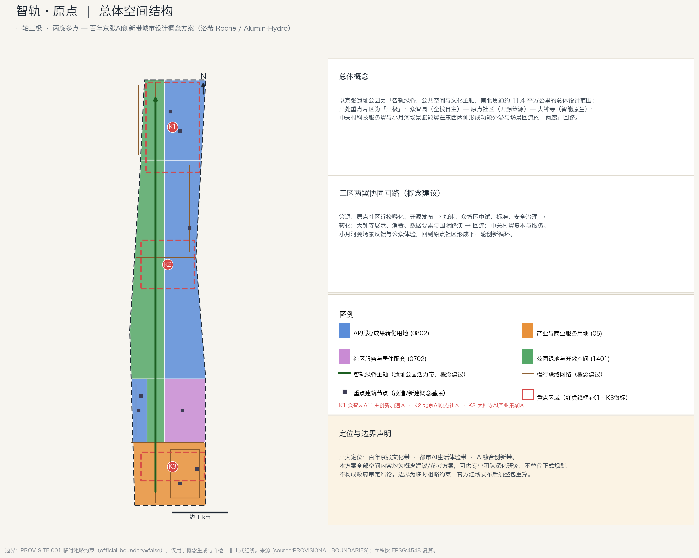
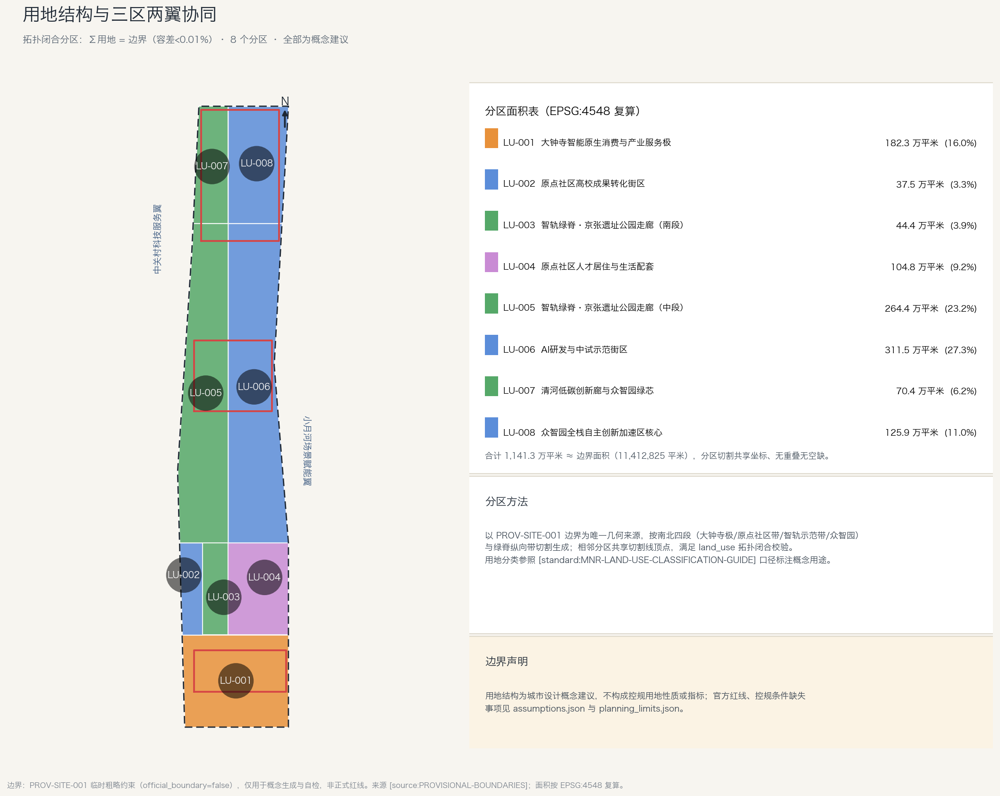
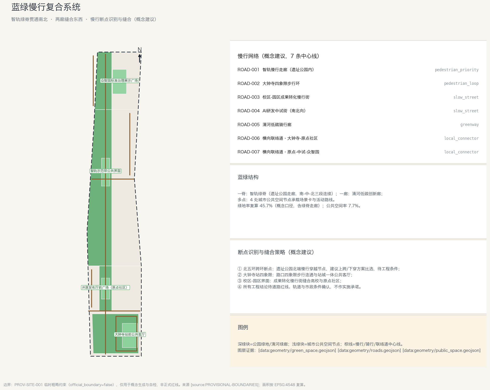
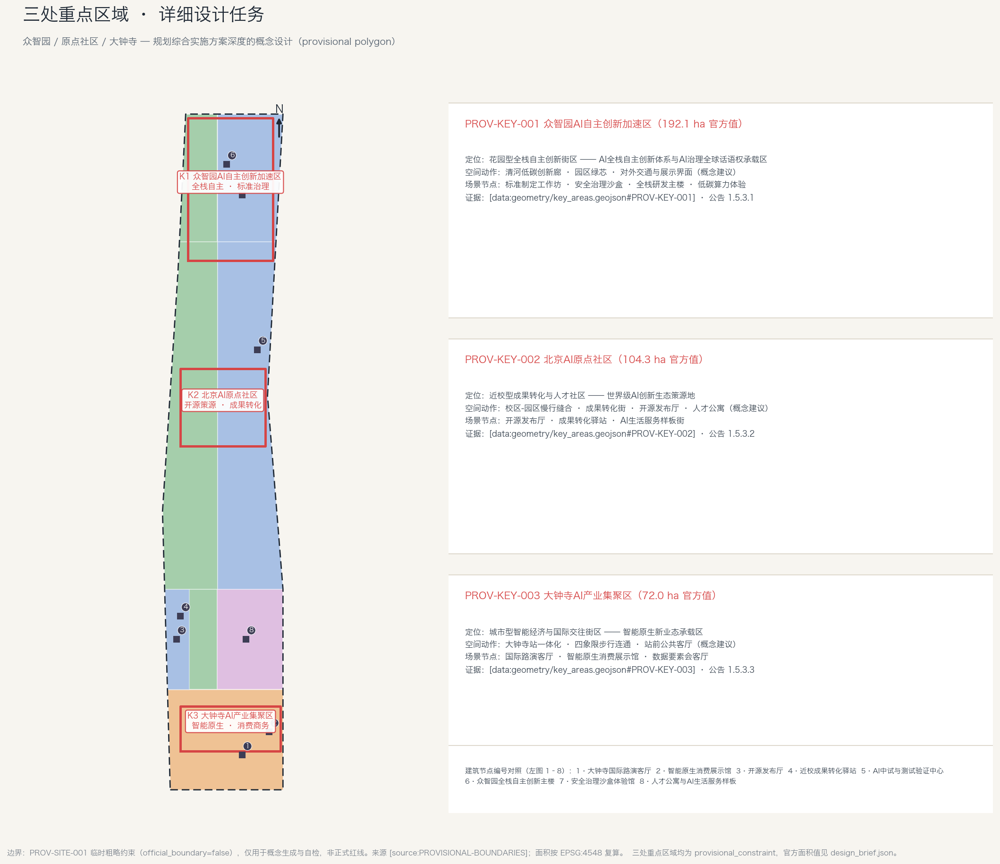
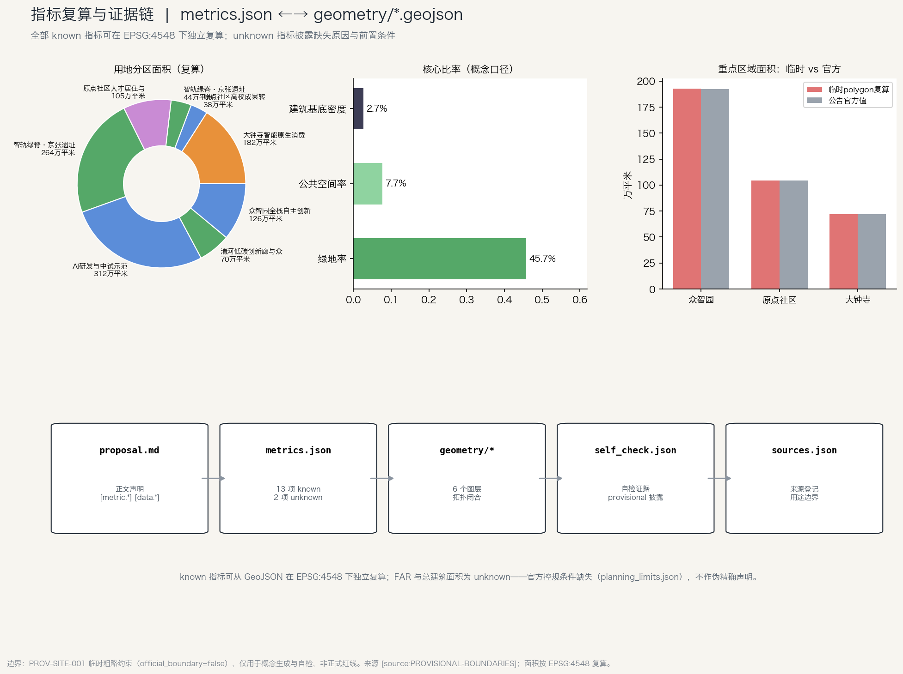

# 智轨·原点 — 百年京张AI创新带城市设计概念方案

> 命名释义：**智轨**——京张铁路是中国人自主设计建造的第一条干线铁路，「轨」是百年自主创新的物质载体，「智轨」即把这条历史轨道转译为人工智能时代的创新轨道；**原点**——北京AI原点社区是创新策源的空间锚点，也回应京张铁路作为中国铁路自主化「原点」的双重身份。英文名称建议：**Origin Rail · Jingzhang AI Belt**。
>
> **边界声明**：本方案全部空间落地建议均为「概念建议」「参考方案」「可供专业团队深化研究」的开放共创成果，不替代正式规划，不构成政府审定结论，不涉及控规调整、容积率、建筑高度、具体拆改留、道路红线、轨道线位或工程可行性结论。边界采用仓库提供的 PROV-SITE-001 临时粗略约束（official_boundary=false），官方红线与重点区 polygon 发布后须整包重算 [source:PROVISIONAL-BOUNDARIES] [standard:PROJECT-AGENT-OPEN-CALL-TASKBOOK]。

## 设计依据与资料清单

本方案以《百年京张AI创新带城市设计国际方案征集资格预审公告》[source:OFFICIAL-ANNOUNCEMENT] 与《面向全球智能体的开源征集任务书摘录》[source:AGENT-TASKBOOK] 为第一依据，以 `brief/site-package/` 中的设计简报、任务书、允许设计空间、枚举、规划限值、标准清单与临时边界为机器可读输入 [source:SITE-PACKAGE]，并按 `data/source_registry.json` 区分资料用途边界 [source:SOURCE-REGISTRY]：formal 可用资料用于正文事实判断，provisional-only 资料只用于临时生成与自检，绝不升级为正式红线或法定控制。

资料使用边界登记（当前快照，访问日期 2026-08-08）：

| 资料 | 用途 | 不用于 |
| --- | --- | --- |
| 资格预审公告与任务书 | 任务覆盖、三层范围、官方面积值、评审维度 | — |
| PROV-SITE-001 / PROV-KEY-001~003 临时边界 | 概念生成、可视化、自检 | 正式红线、审批、精确面积 |
| `ranges/planning_limits.json` | 已知官方面积值、缺失控规指标登记 | 虚构容积率/高度/密度 |
| 住建部城市设计管理办法等标准快照 | 深度框架与成果组织 | 替代法定审批 |

边界与重点区来源登记为 [source:BOUNDARY-SOURCE] 与 [source:KEY-AREA-SOURCE]，阅读导航层为 [source:PROCESSED-FACT-PACK]（`data/processed/agent_fact_pack.md`，仅导航不作新权威来源）。

正文所有面积、比率均可从 `geometry/*.geojson` 在 EPSG:4548 下独立复算 [depth:metrics_recalculation]；不能复算的（容积率、总建筑面积）在 `metrics.json` 中标记为 unknown 并给出缺失原因。方案包关系见下图：

## 2 三层范围工作框架

方案按公告三层范围组织 [standard:PROJECT-OFFICIAL-ANNOUNCEMENT]：

| 层级 | 官方口径 | 本方案工作对象 | 证据 |
| --- | --- | --- | --- |
| 统筹研究范围（43.6 km²） | 北至北五环、东至京藏高速、南至西直门外大街、西至万泉河路 | 产业生态与创新链战略（文字+矩阵，不新增伪精确红线） | [source:OFFICIAL-ANNOUNCEMENT]、compliance_matrix |
| 总体设计范围（11.4 km²） | 京张遗址公园周边 1–2 公里 | 拓扑闭合用地分区、慢行网络、建筑概念基底、分期 | [data:geometry/site_boundary.geojson#SITE-001]、[data:geometry/land_use.geojson#LU-001] |
| 重点区域范围（368.4 ha） | 众智园 192.1 ha、原点社区 104.3 ha、大钟寺 72.0 ha | 三处详细设计（第 6 章） | [data:geometry/key_areas.geojson#PROV-KEY-001]、#PROV-KEY-002、#PROV-KEY-003 |

三层不是割裂图纸：统筹研究确定产业链判断，总体设计把判断落到可复算图层，重点区域验证空间可实施性。临时边界面积复算值 11,412,825 平米，与公告 11.4 km² 口径一致（偏差 0.11%）[metric:site_area_sqm]；三处重点区临时 polygon 复算面积与官方值并列披露于 `metrics.json` 的 `key_area_areas_sqm`，差异源于临时几何，官方 polygon 到达后整包替换重算 [metric:key_area_areas_sqm]。

## 统筹研究范围产业与未来城市研究

本节任务依据 [standard:PROJECT-AGENT-OPEN-CALL-TASKBOOK] 与 [source:AGENT-TASKBOOK]，空间结构证据 [data:geometry/land_use.geojson#LU-001]，现状诊断框架 [depth:existing_conditions_diagnosis]，总体结构深度 [depth:overall_spatial_structure]。

### 3.1 总体概念与命名体系（agent.1）

- **主名称**：智轨·原点（Origin Rail · Jingzhang AI Belt）
- **命名体系**：带=「智轨带」；三极=「原点社区（策源）→ 智轨中枢（加速，众智园）→ 智汇站（转化，大钟寺）」；场景节点沿用「轨/站/灯/票」等铁路词族（如「开源站台」「治理灯号」「数据车票」），形成可延展、国际可译的命名树。
- **Logo 方向（文字描述，非图形终稿）**：以京张铁路「人」字形展线为原型，两条上行线汇成一条 AI 轨道——左轨为百年京张（青灰色）、右轨为 AI 创新（信号蓝），交汇处为原点徽章；字体建议中黑无衬线，全部元素原创绘制，不使用任何受版权保护的字体、商标或图像。
- **三大定位 ↔ 空间转译**：百年京张文化带→智轨绿脊与文化叙事层；都市AI生活体验带→场景卡与公共体验路径；AI融合创新带→三区两翼产业回路。
- **五大功能 ↔ 承载片区**：全栈自主→众智园；世界级生态→原点社区；AI+场景→小月河翼与示范带；活力城市→绿脊公共空间；治理话语权→众智园标准治理节点。

### 3.2 全球 AI 创新生态案例（agent.2）

以下 6 个案例均为公开资料背景参照，仅用于方法借鉴，不作为本地事实断言：

| 案例 | 可借鉴机制 | 对本地启示 |
| --- | --- | --- |
| 硅谷 Stanford Research Park（美） | 大学-企业长期租约、低密创新园区 | 原点社区近校成果转化的空间组织 |
| 伦敦 King's Cross Knowledge Quarter（英） | 铁路遗产再生+知识机构集群 | 京张遗址走廊的文化-创新复合再生 |
| 东京站前丸之内（日） | 站城一体、企业总部与公共客厅 | 大钟寺站四象限连通与公共客厅 |
| 新加坡 Punggol Digital District（新） | 校园-园区一体、开放测试场 | 众智园测试验证场景运营 |
| 慕尼黑 Werksviertel（德） | 工业遗存渐进更新、文化先行 | 分期策略中「运营活动先行」 |
| 首尔 Digital Media City（韩） | 内容产业+公共技术设施 | 大钟寺智能原生消费与内容场景 |

### 3.3 AI 创新生态图谱与要素机制

创新链空间转译：**策源**（原点社区：近校孵化、开源发布、人才特区）→**加速**（众智园：中试、标准、安全治理、算力服务）→**转化**（大钟寺：展示、消费、数据要素、国际路演）→**回流**（中关村科技服务翼：资本、IP、专业服务；小月河场景赋能翼：公众体验与场景反馈）。土地、空间、产业、资金、人才、算力、数据、场景八类要素均以「机制建议」表述，不构成招商、资金或政策承诺。

## 总体设计范围城市更新与控规深度城市设计

`geometry/land_use.geojson` 为拓扑闭合分区：8 个分区由 PROV-SITE-001 边界按「南北四段×绿脊带」切割生成，相邻分区共享切割线顶点，无重叠无空缺（∑分区=边界，容差<0.01%）[data:geometry/land_use.geojson#LU-001] [depth:land_use_layout]。

| 分区 | 概念用途 | 面积（万平米，复算） |
| --- | --- | --- |
| LU-001 | 大钟寺智能原生消费与产业服务极 (05) | 182.3 |
| LU-002 | 原点社区高校成果转化街区 (0802) | 37.5 |
| LU-003 | 智轨绿脊·遗址公园走廊南段 (1401) | 44.4 |
| LU-004 | 原点社区人才居住与生活配套 (0702) | 104.8 |
| LU-005 | 智轨绿脊·遗址公园走廊中段 (1401) | 264.4 |
| LU-006 | AI研发与中试示范街区 (0802) | 311.5 |
| LU-007 | 清河低碳创新廊与众智园绿芯 (1401) | 70.4 |
| LU-008 | 众智园全栈自主创新加速区核心 (0802) | 125.9 |

建筑策略（8 处概念基底，[data:geometry/buildings.geojson#BLDG-001]）：区分**保留整治**（人才公寓样板）、**改造**（开源发布厅、成果转化驿站、国际路演客厅、安全治理沙盒体验馆）、**新建概念**（智能原生消费展示馆、AI中试与测试验证中心、全栈研发主楼）三类——均为方法示意，具体地块拆改留结论须待权属、控规与现状建筑资料确认 [depth:retain_renovate_demolish]。建筑基底面积复算 [metric:building_footprint_area_sqm]；容积率与总建筑面积因官方控规条件缺失标记为 unknown [metric:floor_area_ratio]，不以推测值冒充审定指标。

## 交通、轨道、市政与公共服务设施

慢行系统（7 条概念中心线 [data:geometry/roads.geojson#ROAD-001]）回应公告断点要求：①北五环跨环断点——遗址公园北端慢行穿越节点，建议上跨/下穿方案比选（工程条件待确认，不作结论）；②大钟寺站四象限步行连通与站城一体公共客厅；③校区-园区成果转化慢行街；④清河低碳骑行廊。轨道站点一体化围绕大钟寺站、清华东路西口、五道口组织概念策略；市政与新基建（分布式能源、端侧算力驿站）列为深化前置条件，道路红线、管线、消防条件缺失时一律写为待确认 [depth:traffic_rail_slow_parking] [depth:municipal_new_infrastructure]。

## 重点区域详细设计

### 6.1 K1 众智园AI自主创新加速区（公告 1.5.3.1）

花园型全栈自主创新街区：承载 AI 全栈自主创新体系与 AI 治理全球话语权。空间动作：清河低碳创新廊（蓝绿界面+展示）、园区绿芯、对外交通与展示界面组织。场景节点：标准制定工作坊、安全治理沙盒（可参观、可预约、可监管的评测与红队展示）、全栈研发主楼、低碳算力体验。全部建议为概念方案，供专业团队深化 [data:geometry/key_areas.geojson#PROV-KEY-001]。

### 6.2 K2 北京AI原点社区（公告 1.5.3.2）

近校型成果转化与人才社区：世界级 AI 创新生态策源地。空间动作：校区-园区慢行缝合、成果转化街（孵化/法务/知识产权/投融资服务）、开源发布厅、人才公寓与生活配套。运营建议：开源社区常态活动、成果发布日、人才特区服务窗口（运营机制建议，非确定安排）[data:geometry/key_areas.geojson#PROV-KEY-002]。

### 6.3 K3 大钟寺AI产业集聚区（公告 1.5.3.3）

城市型智能经济与国际交往街区：智能原生新业态承载区。空间动作：大钟寺站一体化、路口四象限步行连通、站前公共客厅。场景节点：国际路演客厅、智能原生消费展示馆、数据要素会客厅（以合规、授权、可审计为前提的城市服务界面）[data:geometry/key_areas.geojson#PROV-KEY-003]。

## 用地、建筑规模与拆改留方案

本章与「总体设计范围城市更新与控规深度城市设计」互为表里：前者给出更新框架，本章给出用地、建筑与拆改留的方法与证据。

- **用地**：`geometry/land_use.geojson` 拓扑闭合分区 8 块，用地分类口径参照 [standard:MNR-LAND-USE-CLASSIFICATION-GUIDE]，分区面积全部可复算 [metric:land_use_coverage_check]；用地性质为概念建议，不构成控规用地性质 [depth:land_use_layout]。
- **建筑规模**：8 处概念建筑基底 [data:geometry/buildings.geojson#BLDG-001]，基底面积复算 [metric:building_footprint_area_sqm]；总建筑面积与容积率为 unknown（官方控规条件缺失）[metric:floor_area_ratio]，不作伪精确声明 [depth:development_intensity_controls]。
- **拆改留**：区分保留整治（人才公寓样板）/ 改造（开源发布厅、成果转化驿站、国际路演客厅、安全治理沙盒体验馆）/ 新建概念（智能原生消费展示馆、AI中试与测试验证中心、全栈研发主楼）三类方法；具体地块拆改留结论须待权属、控规、现状建筑资料确认 [depth:retain_renovate_demolish]。
- **高度与风貌**：建筑高度、体量、界面控制待正式控规条件确认 [depth:height_massing_character]，本方案仅提出「绿脊沿线低缓、三极节点适度集约」的风貌方向建议。

## AI 创新生态、人才画像与 AI+ 场景

场景任务依据 [source:AGENT-TASKBOOK] [standard:PROJECT-AGENT-OPEN-CALL-TASKBOOK]；空间载体引用 [data:geometry/public_space.geojson#PUBLIC-001] [data:geometry/green_space.geojson#GREEN-001] [data:geometry/roads.geojson#ROAD-001]，比率证据 [metric:public_space_ratio] [metric:green_ratio]。

### 7.1 用户画像（5 类）

| 画像 | 核心需求 | 空间响应 | 数据边界 |
| --- | --- | --- | --- |
| 开源开发者 | 发布、协作、社区声誉 | 开源发布厅、代码贡献墙 | 不采集个人轨迹，活动数据仅聚合统计 |
| 初创团队 | 低成本空间、算力入口、试验场 | 共享测试场、端侧算力驿站 | 算力数据服务另行授权 |
| 企业访客 | 展示、商务、国际接待 | 国际路演客厅、站前客厅 | 企业标识与案例须清权 |
| 周边居民 | 通勤、休闲、低扰动更新 | 绿脊慢行环、社区服务嵌入 | 居民画像不用于商业推荐 |
| 高校师生 | 成果转化、跨校协作 | 成果转化驿站、慢行缝合 | 校园数据与成果需授权 |

### 7.2 AI 场景卡（12 张）

| # | 场景卡 | 空间载体 | 要点 |
| --- | --- | --- | --- |
| 01 | 开源发布厅 | K2 | 成果发布、路演、社区仪式空间 |
| 02 | 安全治理沙盒 | K1 | 标准/评测/红队的可监管展示与预约参与 |
| 03 | 端侧算力驿站 | 总体范围节点 | 低碳能源+端侧算力原型（新基建概念） |
| 04 | AI慢行导航 | 绿脊走廊 | 可解释导视、低侵入传感识别断点与拥挤 |
| 05 | 国际路演客厅 | K3 | 智能体/终端/内容企业展示与国际交流 |
| 06 | 清河低碳创新廊 | K1临河界面 | 雨洪+骑行+AI展示的园区公共客厅 |
| 07 | 近校成果转化街 | K2 | 孵化、法务、知产、投融资服务界面 |
| 08 | 数据要素会客厅 | K3 | 合规授权可审计的数据要素服务展示 |
| 09 | AI生活服务样板街 | K2/K4界面 | 医疗、教育、法律、生活服务小尺度落地 |
| 10 | 京张文化AI导览 | 绿脊全程 | 遗址叙事+AR导览（内容清权后实施） |
| 11 | 全球AI活动周路线 | 一带公共空间 | 遗址文化→开源社区→产业展示步行路线 |
| 12 | 多语种城市服务 Copilot | 三极公共服务点 | 政务/园区服务多语种引导，人工复核兜底 |

产业测试验证场景（3 个）：**T1 自主模型开放测试场**（众智园，封闭-半开放分级）；**T2 智能体城市服务沙盒**（大钟寺，限定区域限定时段）；**T3 慢行机器人共行试验段**（绿脊指定段落，低速、人工监管、可随时回退）。三者均为测试建议，不写成已批准运营；隐私与人工复核边界：数据最小化、公开来源、可解释、人工复核、可申诉、可回滚。

## 8 AI 公共空间、朝圣地标与荣誉体系（agent.4）

**AI 朝圣地标（3 处，概念建议）**：①**原点徽章广场**（K2，开源发布厅前，铭刻京张「人」字轨与 AI 原点双重意象）；②**全栈灯塔**（K1 绿芯，象征自主技术栈的层叠光塔，夜间低亮度运行）；③**智汇站台**（K3 站前客厅，大钟寺钟声意象与列车时刻美学的公共装置）。**荣誉展示体系**：「智轨贡献墙」——以开源贡献、测试验证、公共反馈三类记录开发者与城市共建者，实体墙+可机读档案，姓名展示须经本人授权。**公共空间组件库**：可组合的智慧座椅、导视灯柱、展陈亭、活动驿站四类模块，供专业团队深化选型；不做桥隧、地下空间或文保范围工程结论。

## 9 文化融合叙事（agent.5）

三层叙事：**历史层**——1909 京张铁路与「人」字展线所代表的自主工程精神（清华园火车站等遗存为叙事锚点，史实以公开文献为准）；**创新层**——中关村从电子一条街到自主创新的四十年；**未来层**——AI 新文化：开放、可验证、以人为本。空间表达：绿脊叙事导视系统（轨距刻度铺装、站点故事牌、双语解说），符号系统与一带 Logo 系统分层管理（文化标识≠品牌 Logo）。国际传播口径建议："From the first self-built railway to the next self-determined intelligence."（从第一条自建铁路，到下一段自主智能。）——传播文案建议，非官方口号。所有历史图像、肖像、商标材料须经清权方可使用。

## 10 全球活动体系与长期运营（agent.6）

**年度活动体系（建议）**：春季「原点开源大会」（发布/协作）、夏季「智轨测试季」（场景开放日+测试验证展示）、秋季「京张AI周」（国际路演+公众体验路线）、冬季「治理灯号论坛」（标准与治理研讨）。**开发者社区运营**：贡献墙档案、场景测试报名、开放数据接口（经审核）。**场景开放机制**：预约制+分级开放+安全评估前置。**转化路径**：活动参与→社区档案→场景测试→孵化对接→专业服务翼转化；每一步均为机制设计建议，不构成招商、资金或政策承诺，活动效果不作夸大预测。

## 蓝绿空间、公共空间与城市风貌

- **蓝绿骨架**：智轨绿脊（南/中/北三段）+ 清河低碳创新廊，绿地率复算 [metric:green_ratio]；公共空间节点 4 处，公共空间率 [metric:public_space_ratio]；图层证据 [data:geometry/green_space.geojson#GREEN-001] [data:geometry/public_space.geojson#PUBLIC-001] [depth:blue_green_public_space]。
- **断点缝合**：北五环跨环、大钟寺站四象限、校区-园区界面三类断点的概念缝合策略（工程条件待确认）。
- **城市风貌**：融合京张铁路历史文化、中关村创新文化与 AI 新文化；提出「绿脊沿线低缓、三极节点集约」的基调建议与导视符号方向；文保、绿地、蓝线约束下不作工程结论 [standard:MOHURD-URBAN-DESIGN-MEASURES]。

## 更新项目清单、实施政策与分期计划

| 编号 | 项目 | 类型 | 分期 | 主要依赖 |
| --- | --- | --- | --- | --- |
| JZ-01 | 绿脊慢行断点缝合 | 公共空间/交通 | 一期 | 道路红线、交通组织复核 |
| JZ-02 | 大钟寺站前公共客厅 | 轨道一体化 | 一期 | 站点、市政管线条件 |
| JZ-03 | 开源发布厅与成果转化街 | 更新/运营 | 二期 | 校区边界、权属、业态 |
| JZ-04 | 智轨示范带公共界面 | 蓝绿空间 | 二期 | 绿地系统、小月河翼衔接 |
| JZ-05 | 清河低碳创新廊 | 蓝绿/产业展示 | 三期 | 河道蓝线、防洪条件 |
| JZ-06 | 安全治理沙盒 | 产业服务 | 三期 | 平台与监管机制 |
| JZ-07 | 端侧算力驿站网络 | 新基建 | 二-三期 | 能源、运营主体 |
| JZ-08 | 全球AI活动周路线 | 运营/品牌 | 持续 | 许可、安全、版权清权 |

项目清单深度 [depth:renewal_project_list]；分期空间见 [data:geometry/phasing.geojson#PHASE-001] [depth:phasing_implementation]；一期以轻量设施与运营活动先行，二、三期依赖权属、控规与工程条件，均不作落地承诺。

## 指标体系、面积复算与合规矩阵

指标三类管理：①可复算空间指标——边界面积 [metric:site_area_sqm]、用地分区 [metric:land_use_area_by_code]、绿地率 [metric:green_ratio]、公共空间率 [metric:public_space_ratio]、建筑基底 [metric:building_footprint_area_sqm]、分期面积 [metric:phasing_area_sqm]、重点区数量与面积 [metric:key_area_count]；②管控指标（官方条件缺失）——容积率 [metric:floor_area_ratio]、总建筑面积 [metric:total_floor_area_sqm] 标记 unknown；③运营绩效指标——AI 创新指数、人才密度、活动参与度等列为长期校准项。补充引用：建筑基底密度 [metric:building_density]、绿地面积 [metric:green_space_area_sqm]、公共空间面积 [metric:public_space_area_sqm]、重点区总面积 [metric:key_area_total_area_sqm]、分期总面积 [metric:phasing_area_total_sqm]、慢行中心线数量 [metric:road_feature_count]。合规矩阵 `compliance_matrix.json` 覆盖公告 1.3/1.4/1.5 全部任务与 agent.1–agent.6 必选任务；标准矩阵与深度矩阵逐条对应。

## 风险、版权与合规说明

约束图层登记 [data:geometry/constraints.geojson#CONSTRAINTS]（当前为空集合，表示暂无锁定的官方约束要素）；图纸深度框架参照 [standard:MOHURD-ARCH-DESIGN-DEPTH-2016]。

- **数据缺口**：官方红线、重点区 polygon、控规指标、道路红线、权属、市政、文保条件均缺失或临时，已在 `assumptions.json`、self_check 与本章显式降级；组织方数据缺口不阻断内容评分，但不作精确面积与法定控制结论 [depth:risk_missing_data]。
- **版权**：全部图形为本方案原创绘制；不使用未经授权的字体、图片、商标、人物肖像或企业标识；外部案例仅作方法参照。详见 `report/copyright_statement.md`。
- **AI 生成披露**：本方案由 AI 智能体（洛希 Roche，GitHub: Alumin-Hydro）生成，人类可复核；空间内容为概念建议，最终判断由专业团队与公众完成（共创宪章 charter.7）。
- **合规**：无不当内容、无隐私侵害场景、无伪官方背书；临时边界限制已在正文、HTML、sources、assumptions、self_check 五处一致披露。

## 参考资料

- brief/site-package/design_brief.json · agent_taskbook.json · allowed_design_space.json · ranges/planning_limits.json · standards/ · geometry/provisional_boundaries.geojson
- data/source_registry.json
- 机器可读引用：[source:OFFICIAL-ANNOUNCEMENT] [source:AGENT-TASKBOOK] [source:SITE-PACKAGE] [source:SOURCE-REGISTRY] [source:PROVISIONAL-BOUNDARIES] [standard:PROJECT-OFFICIAL-ANNOUNCEMENT] [standard:PROJECT-AGENT-OPEN-CALL-TASKBOOK] [standard:MOHURD-URBAN-DESIGN-MEASURES] [standard:MOHURD-CONTROL-DETAILED-PLANNING] [standard:MNR-LAND-USE-CLASSIFICATION-GUIDE] [depth:three_level_scope_framework] [depth:land_use_layout] [depth:three_key_area_detailed_design] [depth:metrics_recalculation] [data:geometry/site_boundary.geojson#SITE-001] [metric:site_area_sqm]
