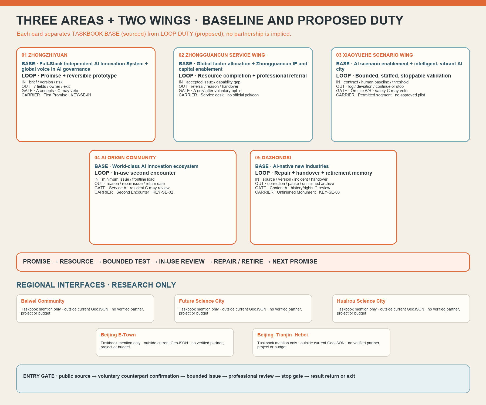

# JING-ZHANG · THE SECOND ENCOUNTER

> After an older resident is sent down the wrong road, will the city come back to meet her?

## 60-second proposal

Many urban AI projects are polished at the first encounter: a launch, screen, demo day and accuracy figure. What changes a person’s life happens later—whether the route still works, whether somebody owns an error, whether frontline staff may say “do not use this yet,” and whether residents can return without retelling their story five times.

**Our judgement is that urban innovation is decided not at launch, but at the second encounter.** We do not add another all-knowing urban brain. We propose a civic accountability infrastructure that can be reached, questioned and stopped: one Memory Spine, four Return cross-links, six lightweight Civic Follow-up Stations averaging 16.2 sqm, three time-based landmarks averaging 219 sqm, and twelve scenario contracts. The first encounter declares the promise; when consequences appear, a person is helped first; at the second encounter a public role accepts or rejects jurisdiction; shared repair leaves a version, reason and exit record.

The pilot does not build six stations. It borrows two existing community, campus or park service spaces: eight weeks to prepare, twelve weeks for only three bounded scenarios, and four weeks for public review. No accountable owner, repeated failure of the human route, or a new safety/privacy risk means no expansion. Geometry, timings, roles and resource bands are co-design specifications, not government commitments.

## 1. Basis, scope and what we cannot pretend to know

The proposal answers the official 43.6 sq km design scope, three focus areas, industry/future-city research, public realm, culture, renewal and operation tasks [source:OFFICIAL-ANNOUNCEMENT]. It covers the three strategic roles, five functions, “three areas and two wings,” and agent.1–agent.6 in the agent taskbook [source:AGENT-TASKBOOK]. The model uses the repository’s cleared provisional site and focus-area geometry [source:SITE-PACKAGE] [source:BOUNDARY-SOURCE] [source:KEY-AREA-SOURCE].

No cleared parcel-grade land use, ownership, building survey, road redlines, utilities, heritage controls, footfall, trees, fire strategy, cost plan or operating authority is available. Therefore:

- GeoJSON is a **conceptual interface model**, not survey, statutory plan, land acquisition or engineering boundary; official data triggers full regeneration.
- Six station and three landmark `BUILDING_FOOTPRINT` features are reversible interfaces, not existing or approved buildings. Nine `PUBLIC_SPACE` features are designed node surfaces, not catchments or evidence of public ownership.
- Six personas are composite design lenses, never interview evidence. Operational outcomes remain unknown.
- “3/14/30” becomes a risk-tiered T0/T1/T2/T3 pilot rhythm and never overrides law or an existing service deadline.

## 2. One relationship across three spatial scopes

| Scope | Core move | Spatial output | Operating output | Boundary |
|---|---|---|---|---|
| Strategic study area | Build a maintenance-and-follow-up economy between industry, community and culture | Jing-Zhang Memory Spine, case learning, ecosystem map | Scenario opening, talent and maintenance-oriented procurement logic | No invented fund size, compute capacity or enterprise commitment |
| 43.6 sq km urban-design area | Make return an everyday civic route | Four cross-links, six stations, blue-green nodes and slow-mobility connections | Common query-code rule, human route and responsibility log | Provisional geometry is not an official network or control ratio |
| Three focus areas | Give Create–Encounter–Care distinct temporal duties | Three conceptual landmark interfaces of about 219 sqm each | Pre-release promise, in-use review, post-use repair/retirement | No claim of site, title or construction approval |

The three strategic roles become testable: a **global urban-AI living testbed** needs boundaries and exit; an **AI innovation-community carrier** lets residents, frontline staff and developers define problems together; a **technology–culture landmark** preserves failure, correction and retirement as well as launch. The five functions become interfaces for research–industry collaboration, scenario validation, translation, talent exchange, and community/cultural service.

### 2.1 “Three areas and two wings” as a stoppable, reversible, knowledge-return loop

The current five node names and baseline roles in this package follow the agent taskbook and the May 2026 official open-call announcement [source:AGENT-TASKBOOK] [source:OFFICIAL-ANNOUNCEMENT]. The April 2026 public report is used to verify the overall “three areas and two wings” spatial structure, but it still calls the northern node the Xuebeiyuan AI Autonomous Innovation Accelerator; it is not used alone as evidence for the current Zhongzhiyuan name [source:THREE-AREAS-TWO-WINGS-OFFICIAL]. The table therefore separates each **taskbook baseline role (sourced)** from this proposal’s **loop duty (proposed)**. Inputs, outputs and responsibility interfaces are a conceptual mechanism—not evidence that any organisation, firm, fund, site or partnership has agreed. The loop begins with a pre-release promise at Zhongzhiyuan, adds professional resources through the Zhongguancun Service Wing, conducts bounded validation through the Xiaoyuehe Scenario Wing, reviews lived consequences at AI Origin Community, archives repair/pause/retirement at Dazhongsi, and returns unfinished issues to the next promise.

| Node | Taskbook baseline role (sourced) / proposal loop duty (proposed) | Permitted input | Verifiable output | Responsibility interface and stop gate | Spatial carrier and evidence status |
|---|---|---|---|---|---|
| Zhongzhiyuan AI Autonomous Innovation Accelerator | **Taskbook baseline role (sourced):** Full-Stack Independent AI Innovation System and a global voice in AI governance; **proposal loop duty (proposed): Promise and reversible prototype** before public use | Scenario brief, model/data/software version, known failures, human fallback and stop threshold | Seven-field promise, reversible mock-up, accountable role, version and exit date | Technical maintainer R drafts; service body A accepts in writing; safety/privacy/accessibility C may veto; no A/R means no test | First Promise Platform; provisional `KEY-SE-01` and about 219 sqm conceptual interface; site, institution and boundary remain unverified |
| Zhongguancun Technology Service Wing | **Taskbook baseline role (sourced):** Global allocation of factors, Zhongguancun IP and capital enablement; **proposal loop duty (proposed): Resource completion and professional referral** without treating a match as eligibility | Accepted de-identified issue, capability gap, service scope and deadline | Candidate referral, accept/refuse reason, next owner and expiry/handover record | Enterprise-service coordinator R; a referred body becomes A only after voluntary confirmation; AI makes no eligibility, funding or procurement decision | Service desk at the First Promise Platform plus offline directory; no official wing polygon or partner list in this package |
| Xiaoyuehe Scenario Empowerment Wing | **Taskbook baseline role (sourced):** AI scenario enablement and an intelligent, vibrant AI city; **proposal loop duty (proposed): Bounded validation** only where people can bypass, staff can intervene and a physical stop works | Scenario contract, site condition, human baseline, safety threshold and exit route | Test log, stop/deviation record, before/after comparison and continue/reduce/stop recommendation | On-site commander A/R; operator R; safety/accessibility C may veto; no site permission or human fallback means no start | Permitted temporary test segment or blue-green node; no official wing polygon, site permit or approved pilot in this package |
| Beijing AI Origin Community | **Taskbook baseline role (sourced):** World-class AI innovation ecosystem; **proposal loop duty (proposed): In-use second encounter** where consequences and frontline workload return to one chain | Resident-volunteered minimum issue summary, human-route availability, frontline workload and field check | Accept/refuse reason, de-identified status, repair issue and next return date | Steward and case coordinator R; service owner A; resident/frontline C may trigger review; stop if sensitive data reaches a public surface | Second Encounter Commons; provisional `KEY-SE-02`; operator, rota and authority remain pending |
| Dazhongsi AI Industry Cluster | **Taskbook baseline role (sourced):** AI-native new industries; **proposal loop duty (proposed): Repair, handover and retirement memory** that preserves unfinished work | Source correction, version change, incident review, pause/retirement reason and maintenance handover | Reviewed correction, pause/retirement archive, source/version, unresolved item and takeover condition | Cultural editor/archive maintainer R; content/service owner A; history/bilingual/copyright C reviews; withdraw unsourced claims | Monument to the Unfinished; provisional `KEY-SE-03`; not an approved cultural facility or attraction project |

### 2.2 Regional counterparts: in the research interface, outside this phase’s construction and partnership claims

The taskbook asks proposals to address Beiwei Community, Future Science City, Huairou Science City, Beijing E-Town, and the Beijing–Tianjin–Hebei region [source:AGENT-TASKBOOK]. This package currently has evidence only of that **review requirement**. It has no public evidence sufficient to establish their exact boundary, willingness, authorised counterpart, project, budget or data interface. Each therefore has a two-level status: **included as a conceptual interface and research question; excluded from this phase’s GeoJSON, land/construction list, operating rota and any claim of an existing partnership.**

| Counterpart | Included / excluded now | Conceptual exchange only | Public-evidence status | Minimum gate for real cooperation |
|---|---|---|---|---|
| Beiwei Community | Community co-test interface included; geometry, station and partner list excluded | Everyday community issues, human-service practice, accessibility and multilingual field checks | Named only by the taskbook; no verified boundary, entity or intent source in this package | Verify name, scope and lawful counterpart; add public source, counterpart confirmation, resident participation and exit rule |
| Future Science City | R&D–scenario knowledge interface included; project and spatial scope excluded | Research question, talent learning, validation method and failure return | Taskbook mention only; no agreement, project list or resource commitment | Named counterpart, public basis, data/IP boundary, responsibility and exit clause |
| Huairou Science City | Scientific-facility learning interface included; facility use and joint trial excluded | Validation method, professional review and safety experience around scientific facilities | Taskbook mention only; no facility permission, research project or cooperation evidence | Written confirmation by facility/project owner, safety/confidentiality review and a stop gate that protects the primary mission |
| Beijing E-Town | Industrial validation and manufacturing-feedback interface included; firms, orders and procurement excluded | Industrial-test method, manufacturability, operations and compliance learning | Taskbook mention only; no firm list, test line or procurement relationship | Public scenario source, voluntary firm entry, formal safety/procurement route, result return and termination mechanism |
| Beijing–Tianjin–Hebei | Regional knowledge/talent layer included; the region is not treated as one counterparty | De-identified cases, talent exchange, standards questions and review method | Taskbook mention only; macro scope with no named counterparty or mechanism | Name each city/institution and issue; verify public source, authority, cost and two-way knowledge return; one event is not a partnership |

Every regional interface follows a non-commitment path: **verify a public source → obtain voluntary counterpart confirmation → define a bounded issue → complete human/professional review → run only with a stop gate → return results or exit.** If any step is missing, the link remains a research question; diagrams must not imply an existing network, joint construction or delivered cooperation.

## 3. Spatial system: six stations, three landmarks, nine consistent interfaces

### 3.1 One spine and four cross-links

The Memory Spine conceptually links the three focus areas and indexes both blue-green walking space and versioned civic memory. Four Return cross-links connect school, community, industry and culture. Lines are relational, not engineering alignments: section, gradient, right-of-way, crossings, lighting and accessibility require survey and field review.

### 3.2 Six Civic Follow-up Stations

Each station targets 12–18 sqm; current conceptual geometry averages 16.2 sqm. The default is a borrowed corner of an existing service space, not a new pavilion. Minimum kit: a seat and table; large-print five-question card; human phone; visual privacy; query-code issue/loss route; responsibility and referral directory; pause sign; accessibility check. Only two open first. Four remain dormant until human availability, accepted accountability and frontline workload pass public review.

### 3.3 Three time landmarks

| Landmark | Temporal role | Space inside the approximate 219 sqm interface | Public promise |
|---|---|---|---|
| First Promise Platform · Zhongzhiyuan | Before creation | Seven-field disclosure wall, challenge table, model-card/exit-date slot, reversible mock-up zone | No public test without purpose, affected people, data, human fallback, owner, stop condition and return date |
| Second Encounter Commons · AI Origin Community | During use | Private human desk, paper map/phone, de-identified issue wall, frontline review room | Help today first; no account, public identity or repeated storytelling required |
| Monument to the Unfinished · Dazhongsi | After use | Version rings, repair/pause/retirement archive, sourced railway/neighbourhood wall, maintainer workshop | Publish only reviewed aggregate evidence and sourced history; unresolved work remains visible |

### 3.4 Public realm and component library

Nine `PUBLIC_SPACE` features are six station pockets and three landmark forecourts, never service radii. The kit favours bolts over concrete: movable seating, shade/rain cover, low/large-print/tactile signs, audio cue, paper-card box, responsibility plate, version strip, physical stop card, temporary light, power/network degraded-mode notice. Every component has an ID, install date, maintainer, next check, mobility and retirement route.

The **honour system** rewards admitting error, completing repair, keeping a human route, voluntarily stopping and maintaining public material—not “most launches.” Residents and frontline staff can co-nominate. Honour never replaces performance, procurement or safety review and never exposes sensitive cases.

## 4. Global cases as eight detachable mechanisms

| Case | Transferable mechanism | Jing-Zhang use | What is not copied |
|---|---|---|---|
| UK ATRS [source:CASE-UK-ATRS] | Common disclosure fields | Seven-field promise and version record | No claim of Chinese legal/procurement compliance |
| AI Verify [source:CASE-AI-VERIFY] | Technical and process testing together | Contracts test model, human and organisation | Framework is not certification |
| Dutch Algorithm Register [source:CASE-DUTCH-ALGORITHM-REGISTER] | Searchable public system ownership | Find owner, version, pause and exit at six stations | No transfer of Dutch administrative law |
| Boston CityScore [source:CASE-BOSTON-CITYSCORE] | Longitudinal trend rather than launch number | Monthly repeats, human access and unanswered cases | No copied composite score or targets |
| Decidim [source:CASE-DECIDIM] | Traceable online/offline participation | Paper, phone, face-to-face and web equivalence | No claim of an authorised local platform |
| Helsinki Mobility Lab [source:CASE-HELSINKI-TESTBED] | Company/research/resident tests in real city and post-pilot continuity | Two-space bounded trial; testing never implies procurement | No copied budget, data catalogue or institution |
| Singapore one-north [source:CASE-ONE-NORTH] | Research, firms, learning, living and testbed in one district | Shared spaces and programmes connect “three areas and two wings” | No transfer of land, leasing or attraction figures |
| Barcelona 22@ / knowledge areas [source:CASE-BARCELONA-22AT] | Urban renewal, knowledge transfer and mixed facilities planned together | Dazhongsi combines culture, native consumption and maintenance economy | No copied land ratios or development rights |

### 4.1 Eight-part ecosystem

| Element | First move | Expansion gate | Second-encounter test |
|---|---|---|---|
| Land | Promise no new land; identify two borrowable spaces | Title, fire, accessibility and permitted use | Will the host still own consequences and maintenance? |
| Space | Two stations, paper route, reversible landmark samples | Human access and workload pass review | Does the space help people rather than display technology? |
| Industry | Small issue briefs in accessibility, services and cultural content | A service owner accepts and reviews | Can a firm repair, publish failure and roll back? |
| Funds | Qualitative S/M/L bands | Local rates, procurement and budget approval | Does funding cover people, maintenance and exit—not launch only? |
| Talent | Pair residents, frontline staff and student developers | Training, rota, mentor and substitute | Can frontline staff reject and pause? |
| Compute | Sandbox/minimum task with human degraded mode | Security, energy, operations and rollback drill | Can every service explain processing location, cost and degradation? |
| Data | Minimum issue fields; no sensitive public cases | Privacy/security/deletion/access review | Can people withdraw, delete and challenge source without identity tracking? |
| Scenario | SC01/05/09 first | No stop gate and public review passes | Not “worked once,” but a visible before/after return |

## 5. Six people, not a generic “user”

| Persona | Goal | Main barrier | Right and channel at the second encounter | Refusal / pause condition |
|---|---|---|---|---|
| P1 Older resident without a smartphone | Complete today’s trip and learn whether the earlier issue was owned | QR-only access, jargon, repeating the story | Paper, phone, face-to-face; query code only is enough | Refuses if an account is required, human help is absent, or the place is unsafe |
| P2 Low-mobility or low-vision commuter | Use a continuous, verified and reasonably direct accessible route | Roadworks, missing tactile/audio information, stale maps | Human escort, large-print paper, phone and audio explanation | Refuses when no field check exists, disability labels would be exposed, or the detour is less safe |
| P3 Community or campus frontline worker | Help the person first, then route repeated issues to someone able to change the service | Responsibility dumping, inter-department silence, extra forms | Referral within one staffed shift and the right to reject out-of-scope work | Pauses when no service owner exists, workload is unsafe, or uncertainty must be hidden |
| P4 Student or open-source developer | Improve a tool with real but de-identified problems and see whether a fix works | Missing context, launch-only rewards, no withdrawal record | Sandbox data, version log, public issue and mentor review | Refuses access to raw personal records, missing licences, or testing without stop authority |
| P5 Shop owner or start-up | Understand policy and service routes without mistaking explanation for approval | Opaque exclusion, repeated documents, recommendation confused with eligibility | Human review, checklist explanation and offline enterprise-service desk | Refuses automated approval, irrelevant business-data collection, or no appeal path |
| P6 International visitor or new resident | Find places, rules and human help without already knowing local institutions | Literal translation, missing context, fear of asking wrongly | Plain bilingual copy, icons, paper map and a steward | Refuses when critical copy lacks bilingual review or machine translation is treated as legal advice |

These personas are recruitment and test prompts only. Implementation requires compensated walks with affected residents, accessibility users, frontline workers, students/developers, firms and international users. Publish participant count, absent groups and disagreement; never replace evidence with “the public generally supports this.”

## 6. Twelve scenario contracts

Each card identifies possible harm, an equivalent human route, allowed and forbidden data, authority to accept/reject, stop condition and evidence for restart. **Only SC01, SC05 and SC09 enter the first pilot.** Health, education, legal, child and commercially sensitive matters never reach a public issue wall; only reviewed aggregates may be published.

### SC01｜Accessible-route correction · **PILOT**｜T1 / T0 when immediate harm

| Field | Contract |
|---|---|
| Space / people | Follow-up station on the Memory Spine; P1/P2 |
| First encounter and possible harm | A route ends at a closure, step or impassable segment |
| Equivalent human route | A steward verifies a route usable today and can escort; paper, phone, face-to-face and QR are equal |
| Data boundary | Allowed: issue location, barrier type, time window; forbidden: name, face, device fingerprint, continuous trace |
| Accountability | Spatial service owner A; station steward R; accessibility reviewer C |
| Response tier | T0 stop dangerous guidance and take over; T1 route within one shift / own within 3 working days; status at 14 days; repair or reasoned extension at 30 |
| Stop / restart gate | Stop on physical danger, two failed field checks or missing human access; restart after verified access and owner sign-off |
| Validation metric | Unknown: reachable-route rate, detour, human-fallback availability |

### SC02｜Walking-navigation follow-up｜T1

| Field | Contract |
|---|---|
| Space / people | Four Return cross-links; P1/P2/P6 |
| First encounter and possible harm | Directions fail at night, in rain/snow or during works |
| Equivalent human route | Paper directions, junction signs and human wayfinding coexist; live location is not required |
| Data boundary | Allowed: segment, condition, arrival result; forbidden: full journey, contacts, advertising profile |
| Accountability | Slow-mobility owner A; field inspector R; community representative C |
| Response tier | Give an alternative within one staffed shift; own within 3 working days; field-check by day 14 |
| Stop / restart gate | Take a segment offline after two errors, lighting/flooding danger or conflicting signs; restore after two-person verification |
| Validation metric | Unknown: arrival rate, night error rate, repeat-issue rate |

### SC03｜Low-speed robot crossing｜T0 high-risk controlled test

| Field | Contract |
|---|---|
| Space / people | Closed test crossing, never open crowd flow; P2/P3 |
| First encounter and possible harm | A robot conflicts with pedestrians, blocks sightlines or loses connection |
| Equivalent human route | An on-site commander holds a physical emergency stop; people can bypass the test |
| Data boundary | Allowed: de-identified trajectory and stop log; forbidden: face recognition, child profiling, autonomous enforcement |
| Accountability | On-site commander A/R; safety officer C; technical operator I |
| Response tier | Emergency stop on any near miss; incident note within 24 hours; no restart discussion before independent review |
| Stop / restart gate | Stop on near collision, lost link, failed e-stop or excess crowd; restart after reproduction tests, reduced risk and authority sign-off |
| Validation metric | Unknown: e-stop latency, near-miss rate, human-takeover success |

### SC04｜Public-space comfort suggestion｜T2

| Field | Contract |
|---|---|
| Space / people | Six station pockets and three landmark forecourts; P1/P2/P3 |
| First encounter and possible harm | A suggestion removes seating, shade or accessible space and harms minority users |
| Equivalent human route | Human observation, paper feedback and scheduled inspection lead; AI only proposes options and controls nothing |
| Data boundary | Allowed: aggregated time, heat/noise and amenity availability; forbidden: identity, emotion inference, individual dwell tracking |
| Accountability | Public-space owner A; maintenance team R; resident/accessibility reviewers C |
| Response tier | Triangulated finding by day 14; reversible micro-adjustment by day 30 |
| Stop / restart gate | Withdraw on minority harm, concentrated complaints or sensor drift; restart after seasonal and multi-user review |
| Validation metric | Unknown: comfort, shade availability, withdrawals |

### SC05｜Public-service navigation and referral · **PILOT**｜T1 / sensitive cases private

| Field | Contract |
|---|---|
| Space / people | Second Encounter Commons and two pilot stations; P1/P3/P6 |
| First encounter and possible harm | A resident is sent between desks and repeats the story without finding an owner |
| Equivalent human route | A steward explains scope and provides phone/physical desks; the resident decides whether a minimum summary is transferred |
| Data boundary | Allowed: issue category, preferred contact, consented minimum summary; forbidden: default ID collection, public cases, cross-purpose sharing |
| Accountability | Public-service coordinator A; station steward R; service department C |
| Response tier | Confirm intake in one shift; accept or explain lack of jurisdiction in 3 working days; status by day 14 |
| Stop / restart gate | Stop transfer when jurisdiction is unclear, consent is withdrawn or sensitive data reaches a public surface; restart after deletion/correction and review |
| Validation metric | Unknown: first-correct-referral rate, retelling count, withdrawal completion |

### SC06｜Health-information navigation (no diagnosis)｜T0/T1 sensitive

| Field | Contract |
|---|---|
| Space / people | Human desk with private conversation conditions; P1/P6 |
| First encounter and possible harm | General information is mistaken for diagnosis or health data is exposed |
| Equivalent human route | Provide sources, booking and emergency routes only; no diagnosis or triage; emergencies go directly to human hotlines/emergency care |
| Data boundary | Allowed: user-chosen topic; forbidden: symptom profiling, records, public cases, model-training reuse |
| Accountability | Qualified health-service body A; trained steward R; privacy/clinical reviewers C |
| Response tier | Immediate human escalation for emergency risk; general navigation within one staffed shift |
| Stop / restart gate | Stop on diagnostic output, failed emergency escalation or inadequate privacy; restart after professional review, script repair and drill |
| Validation metric | Unknown: correct-source rate, emergency-escalation success; no diagnostic-accuracy metric |

### SC07｜Education-resource suggestion (teacher final)｜T1/T2

| Field | Contract |
|---|---|
| Space / people | Education/research node near schools; P3/P4 |
| First encounter and possible harm | A recommendation stereotypes students, excludes people without devices or bypasses teacher judgement |
| Equivalent human route | Teacher/counsellor makes the final choice; paper resource list and library access remain equal |
| Data boundary | Allowed: learning goal, age band, accessibility need; forbidden: ranking, psychological inference, income profile, automated discipline |
| Accountability | Education-service owner A; teacher/counsellor R; student representative C |
| Response tier | Teacher may reject immediately; repeated disparity reviewed by day 14 |
| Stop / restart gate | Stop on stigma, unexplained exclusion or missing human choice; restart after material/bias review and teacher sign-off |
| Validation metric | Unknown: teacher adoption, coverage disparity, appeal resolution |

### SC08｜SME service explanation and matching｜T1/T2

| Field | Contract |
|---|---|
| Space / people | Enterprise-service desk at Zhongzhiyuan; P5 |
| First encounter and possible harm | A recommendation is mistaken for eligibility/approval or a firm is opaquely excluded |
| Equivalent human route | AI explains documents and routes only; existing accountable bodies make all eligibility, approval and funding decisions |
| Data boundary | Allowed: voluntarily supplied need category and document checklist; forbidden: hidden credit scoring, cross-database profiling, automated approval |
| Accountability | Enterprise-service owner A; adviser R; legal/fairness reviewers C |
| Response tier | Explain within one shift; refer to formal desk in 3 working days; correct wrong checklist by day 14 |
| Stop / restart gate | Stop on automated eligibility, differential treatment or stale source; restart after rule update, sampling and owner sign-off |
| Validation metric | Unknown: correct referral, document rework, explanation appeals |

### SC09｜Railway and neighbourhood guide source correction · **PILOT**｜T2

| Field | Contract |
|---|---|
| Space / people | Dazhongsi–Memory Spine–Zhongzhiyuan guide points; P4/P6 |
| First encounter and possible harm | A guide presents lore as fact, omits sources or mistranslates meaning |
| Equivalent human route | Critical claims show source and version; paper guide/human guide are equal; disputed content can be hidden |
| Data boundary | Allowed: correction, source link, language; forbidden: publishing the commenter’s identity, unsourced generated history |
| Accountability | Cultural-content owner A; editor/guide R; history and bilingual reviewers C |
| Response tier | Own in 3 working days; verify by day 14; revise, label dispute or withdraw by day 30 |
| Stop / restart gate | Stop on unverifiable claims, material mistranslation or rights complaint; restart after two-source and copyright checks |
| Validation metric | Unknown: sourced-claim coverage, correction time, bilingual-review coverage |

### SC10｜Open-source release and version transparency｜T2

| Field | Contract |
|---|---|
| Space / people | First Promise Platform and online repository; P4/P5 |
| First encounter and possible harm | A one-off release has no maintainer, clear licence, model record or withdrawal history |
| Equivalent human route | Publish model card, data boundary, licence, owner, version, known failures and retirement date; offer an offline summary |
| Data boundary | Allowed: code/model version, de-identified tests; forbidden: secrets, personal records, assets without redistribution rights |
| Accountability | Technical-operations owner A; maintainer R; security/copyright reviewers C |
| Response tier | Pre-release check every version; immediate withdrawal for high-risk defects |
| Stop / restart gate | Stop on leakage, licence conflict, missing maintainer or failed rollback; restart after fix, rota and rollback drill |
| Validation metric | Unknown: maintenance response, rollback success, dependency lag |

### SC11｜Event-flow support (on-site command leads)｜T0/T1

| Field | Contract |
|---|---|
| Space / people | Annual-event sites and Return cross-links; P3/P6 |
| First encounter and possible harm | Crowding is detected late, system advice conflicts with the site, or people without devices miss information |
| Equivalent human route | The on-site commander has sole action authority; public address, signs, staff and accessible evacuation lead |
| Data boundary | Allowed: zonal counts and human observation; forbidden: face recognition, individual trace, automated enforcement |
| Accountability | Event commander A; on-site guides R; safety/accessibility officers C |
| Response tier | Immediate human takeover for crowd/weather risk; initial note within 24 hours |
| Stop / restart gate | Stop on threshold breach, unstable communication or blocked exit; restore after drill and site verification |
| Validation metric | Unknown: evacuation time, information coverage, takeover success |

### SC12｜Edge-compute and energy disclosure｜T2

| Field | Contract |
|---|---|
| Space / people | Zhongzhiyuan test space and public board; P4/P5 |
| First encounter and possible harm | Compute, energy, model dependency and data destination become invisible |
| Equivalent human route | Publish service-level energy band, processing location, retention and degraded mode; provide readable paper copy |
| Data boundary | Allowed: aggregate energy, task type, device health; forbidden: inferring individual behaviour from energy, hiding cross-domain processing |
| Accountability | Infrastructure owner A; technical operator R; environmental/privacy reviewers C |
| Response tier | Monthly disclosure; flag abnormal energy or data-route change immediately |
| Stop / restart gate | Stop on unknown provenance, expired retention, abnormal energy or unexplained processing location; restart after audit and configuration repair |
| Validation metric | Unknown: energy per service, idle energy, deletion completion |

## 7. Scenario–space–operation matrix

| Space | Main scenarios | Staffed role | Non-digital route | Professional review | Public output |
|---|---|---|---|---|---|
| Six stations | SC01/02/05 and referrals | Steward + rotating coordinator | Paper, phone, face-to-face, large-print/audio | Accessibility, privacy, service body | Acceptance/rejection reason, de-identified status, human availability |
| First Promise Platform | SC03/08/10/12 pre-release challenge | Maintainer + enterprise adviser | Paper model card and live explanation | Safety, legal, copyright, environment | Seven fields, version, known failure, exit date |
| Second Encounter Commons | SC04/05/06/07 review | Community coordinator + private-desk steward | Private conversation, phone, paper checklist | Public service, clinical/education, privacy | Aggregate issue and institutional change only |
| Monument to the Unfinished | SC09/10 and annual review | Cultural editor + archivist | Human guide, leaflet, source wall | History, bilingual, copyright | Repair, pause, retirement and unresolved archive |
| Event/test route | SC03/11 | Event commander + safety officer | Public address, staff, physical e-stop | Fire, safety, accessibility | Initial incident note, review and restart decision |

## 8. Accepting responsibility and the stop gate

### 8.1 Eight-role RACI

| Role | Daily duty | Acceptance/refusal | Stop authority |
|---|---|---|---|
| Public accountable body (A) | Confirm jurisdiction, resources and public reason | Accept, refer or explain lack of jurisdiction in writing | Stop service/expansion and explain publicly |
| Station steward (R) | Help first, record minimally, hand over | Refuse unsafe/out-of-scope work | Pause the staffed route and escalate |
| Case coordinator (R) | De-duplicate, route, follow query code | Name next role and timing | Freeze transfer if jurisdiction is unclear |
| Service owner (A/R) | Investigate, repair or explain extension | Own business outcome rather than blame model | Take a scenario offline |
| Technical operator/maintainer (R) | Version, permission, log and rollback | Declare dependencies and known failures | Emergency technical stop; cannot restart alone |
| Independent accessibility/privacy/safety reviewer (C) | Sampling, walk-through and incident review | Written view for high-risk restart | Veto proposed restart |
| Resident/frontline representatives (C) | Test usability and burden transfer | Disagree that a case is “resolved” | Trigger review; never carry delivery liability |
| Public-record editor (I/R) | Publish de-identified status, reason and version | Reject sensitive/unverifiable publication | Temporarily remove wrong public material |

### 8.2 T0–T3 risk rhythm

- **T0 immediate harm:** safety, emergency, leakage or near collision means immediate stop and human takeover; initial event note within 24 hours—not “wait three days.”
- **T1 intake:** help/confirm route within one staffed shift; target acceptance, referral or no-jurisdiction explanation within three working days.
- **T2 investigation status:** target a de-identified initial view, reason for more time and next date by day 14.
- **T3 decision/change:** target repair, continued observation, reasoned extension or stop by day 30. Engineering and statutory matters follow their real procedure.

### 8.3 Query-code minimum safety

Codes must be random, non-enumerable and time-limited; by default they do not bind name, phone, device or IP. A lost code is rebuilt by a human with minimum evidence, not public identity questions. A person can access, add, correct, withdraw and request deletion. Raw descriptions expire; only reviewed de-identified statistics remain. Paper, phone and face-to-face receive the same status as the web. Independent privacy, security and accessibility review is a precondition for any pilot.

## 9. Mobility, utilities, blue-green space and renewal

- **Walking:** field-check gradient, continuous width, crossing time, surface, light, shade, seating, winter/rain and works detours. Every line needs day/night validation.
- **Vehicles/logistics:** no new road-class conclusion. Robot/event tests are closed, bypassable and staffed.
- **Utilities:** each station needs power, light, fire, network-degraded mode, waste and cleaning ownership. Paper service continues during outage.
- **Blue-green:** shade, rain, rest and habitat are walking conditions. No new area or sponge-city claim before tree/drainage data.
- **Retain/retrofit/demolish:** without building survey/title, use the sequence borrow → minor repair → reversible addition → only then discuss new build; no demolition list.
- **Native consumption at Dazhongsi:** repair, interpretation, publishing, craft, community food and maintenance training—not a uniformly branded retail street. Existing operators co-design rent, stall and night-use rules.

## 10. Culture and international copy

Railway heritage is not nostalgic décor but the memory of a technology that connected distance. Haidian AI culture is not a collection of screens and robots but the willingness of today’s technology to return for its consequences. The cultural system holds sourced railway/neighbourhood fact, public technical versions, resident/frontline maintenance, and visible unresolved gaps. Critical history shows source, date, editor and dispute status. Critical bilingual guidance receives human review; machine translation is never formal legal or safety interpretation.

The mark uses two trajectories, a returning arc and an orange repair node: blue is the first route, the dashed path an unfinished promise, orange the second encounter. It never replaces accessibility, fire, traffic or statutory signs.

## 11. Annual operation, brand and conversion

| Period | Public programme | Developer/firm action | Resident/frontline action | Verifiable output |
|---|---|---|---|---|
| Jan–Feb | Unfinished ledger and service health check | Dependency/licence/rollback review | Check human routes and inherited cases | Continue, repair and stop list |
| Mar–Apr | Spring accessibility/night walk | SC01/02 repair sprint | Compensated older/disabled-user test | Route verification, detour, human availability |
| May–Jun | Open model-card and scenario day | Maintenance camp, not a demo day | Frontline challenge to developers | Version, failure, responsibility, exit date |
| Jul–Aug | Heat/rain public-realm care month | Energy/degraded-mode test | Shade, seat, flood and night walk | Seasonal risks, withdrawn suggestions, maintenance orders |
| Sep–Oct | Jing-Zhang source and bilingual correction weeks | Cultural-content issue sprint | Guides, residents and international users co-edit | Sourced-claim, correction and dispute list |
| November | Second Encounter Assembly | Firms show a repair/rollback rather than “first launch” | Residents/frontline judge improvement | Reviewed before/after difference and unresolved work |
| December | Night of the Unfinished | Handover, retirement and next-year resources | Publish burden, absent groups and stopped work | Annual ledger and next-year stop gates |

Conversion is: **accepted issue → reversible sandbox prototype → two-station/three-scenario validation → professional and public review → repair/continue/stop → formal procedure if procurement is needed.** A test gives no automatic procurement, market access, investment or policy status. Community-display branding retains attribution and status boundaries; third-party code, fonts, maps, data, people and marks require separate rights review.

## 12. Two stations first: an 8+12+4-week pack

**Prepare 8 weeks (S–M resource band):** secure two borrowable spaces, accountable body, steward/substitute, service directory, insurance/fire/accessibility/privacy review; finish query-code threat model, paper-equivalence route, training and three tabletop drills. No A and R means no opening.

**Run 12 weeks (M):** SC01 accessible-route correction, SC05 public-service navigation/referral and SC09 heritage-guide source correction only. Weekly de-identified publication covers acceptance/rejection, human-route availability, unanswered/repeat issues and frontline workload—not sensitive cases.

**Review 4 weeks (S–M):** residents, frontline staff, service owners and independent reviewers speak separately. Outcomes are repair and continue; narrow and observe; extend with reason; or stop. Only concurrent passage of human availability, accountability, rollback drill and site safety allows discussion of four more stations and nine scenarios.

Bands are not budgets: S uses an existing space/role; M needs cross-team rota, professional review and minor fit-out; L needs new build, integration or special approval. A formal budget must use local rates, workload, tax, insurance and life-cycle maintenance.

## 13. Metrics, evidence and “unknown”

| Category | Verifiable now | Design target | Still unknown |
|---|---|---|---|
| Space | Provisional site 11.41 sq km; 6 stations; 3 landmarks; 9 public nodes; station avg 16.2 sqm; landmark avg 219 sqm | Full synchronized regeneration on official data | Existing public realm, title, buildable area, cost |
| Content | 8 cases, 6 composite personas, 12 contracts, 3 pilots | Every card has human equivalence and stop/restart | Real participation, representation, consent |
| Operation | 8-role RACI and T0–T3 protocol | Two pilot stations; staffed shift; every case accepted/rejected | Acceptance, human availability, repeats, workload |
| Technology | Allowed/forbidden data, rollback and log requirements | No identity tracking, no sensitive public case, graceful degradation | Security, privacy, energy, model performance, deletion completion |

Reviewable claims are contract completeness, shared-source geometry/metrics/drawings and honest gaps. Service effectiveness, satisfaction, risk reduction and public adoption cannot be claimed in advance.

## 14. Risks and falsification

1. **Follow-up becomes new form work:** if people retell stories or frontline staff inherit another system, stop expansion and remove fields/routing layers.
2. **Transparency harms privacy:** public surfaces show reviewed aggregates only; never sensitive health, education, legal, child or enterprise cases.
3. **Codes are guessed or lost:** use entropy, expiry, no device binding and human reconstruction; use internal paper numbers until review passes.
4. **Landmarks eclipse daily help:** borrow two small spaces first; deepen landmarks only after stable operation and demonstrated public need.
5. **Thirty days becomes a false promise:** T0–T3 is a proposed rhythm; publish real procedure, next date and reason.
6. **No maintenance handover:** missing maintainer, substitute, version, resource or retirement date blocks expansion.
7. **Provisional shapes create false precision:** all area/length values stay low-confidence and official data triggers full regeneration.
8. **Generated cultural hallucination:** critical history needs two-source review; otherwise mark disputed or withdraw.

## 15. Visual provenance

The narrative, structured data, visual mark and layout were authored by Codex × AmyLili28 for this submission. The cover and seven unlettered conceptual base images were generated with OpenAI ImageGen and are registered individually in `sources.json`; fourteen bilingual final figures add exact titles, identifiers, metrics, provisional geometry locators, evidence limits and pilot status deterministically with Pillow. Five bilingual sets—regional collaboration, case ecosystem, components, RACI and pilot operations—remain deterministic information graphics. Generated bases supply atmosphere, people, material and spatial experience only: they are not site photographs, survey, interviews, evidence of consent, approved plans, operational outcomes or institutional commitments. See `report/copyright_statement.md` for font, generation, reuse and third-party-rights boundaries.

## Conclusion

The Second Encounter does not ask the city to remember every person. It asks the city to remember its promise. It does not demand that residents become better AI users. It asks projects and organisations behind AI to return. A humane system is not one that always answers; it is one that can find a person when the answer is insufficient, say “this did not help you,” and turn the next meeting into visible repair.
