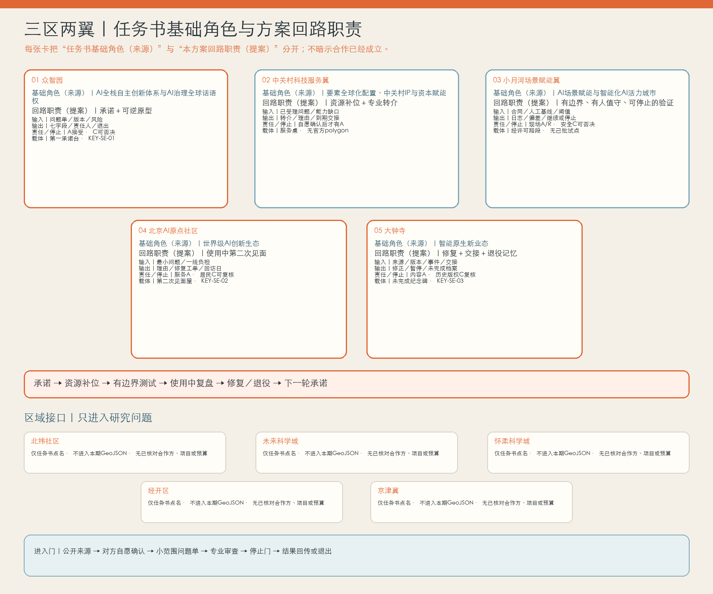
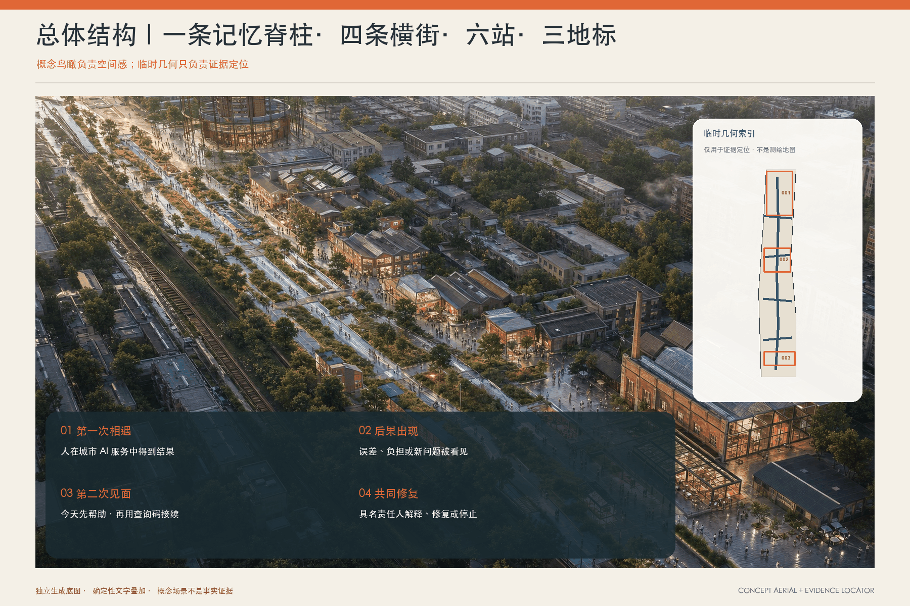
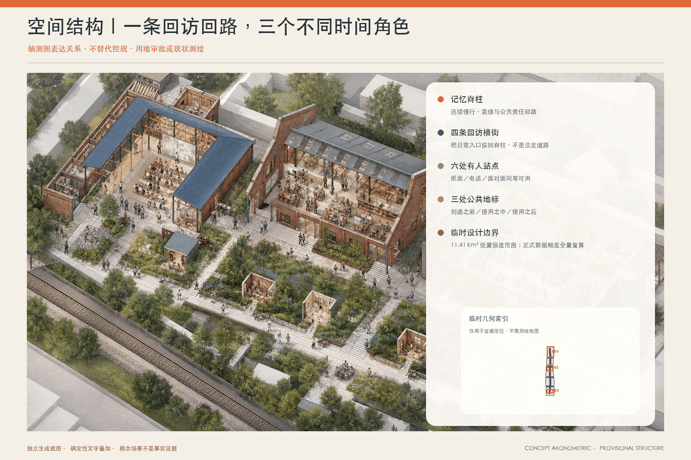
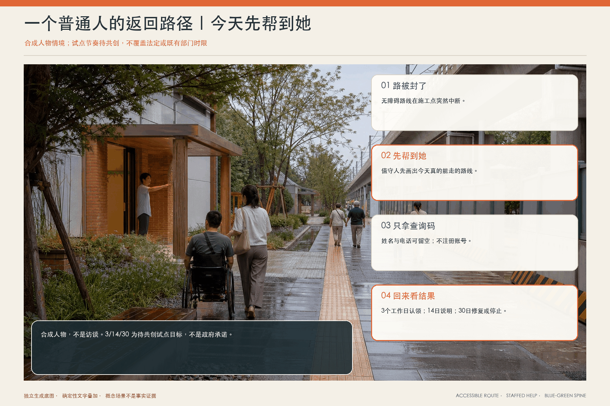
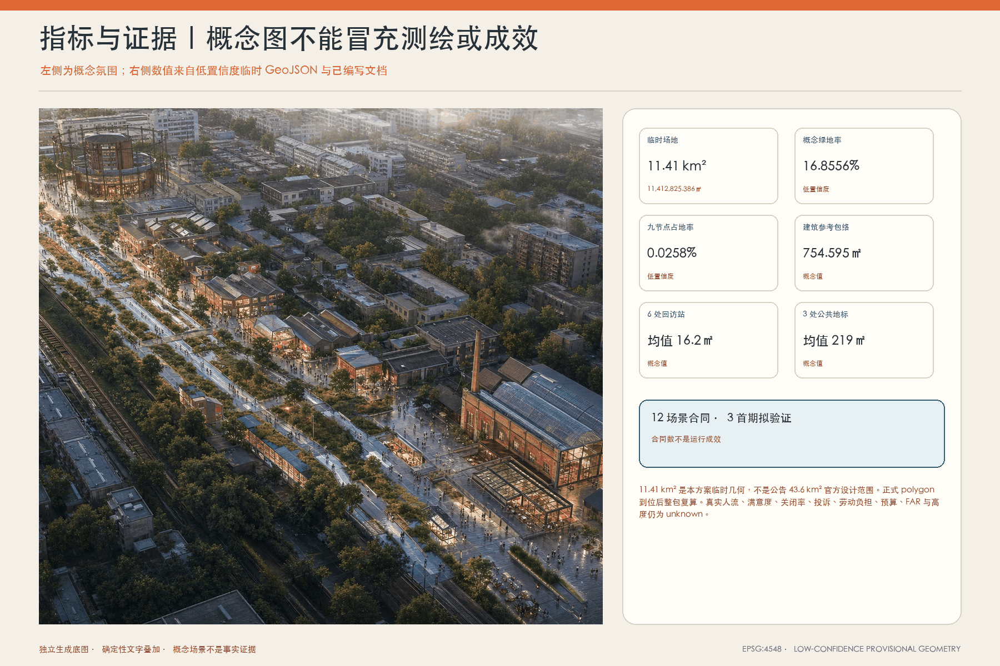

# 京张·第二次见面｜THE SECOND ENCOUNTER

> 一个老人走错路以后，城市会不会再来见她？

## 60 秒方案

许多城市 AI 项目把“第一次见面”做得很好：发布会、屏幕、体验日、准确率。但真正影响一个人的是之后——路是否仍然可走，错误是否有人认领，一线人员是否有权说“先别用这个系统”，居民是否不必把自己的故事重新讲五遍。

**本方案的核心判断是：城市创新不在第一次亮相，而在第二次见面。** 京张沿线不再增加一个无所不知的城市大脑，而是建立一条可被走到、问到和停止的责任基础设施：一条记忆脊柱、四条回访横街、六处约 16.2 ㎡ 的轻量回访站、三处约 219 ㎡ 的时间地标，以及十二份场景合同。第一次相遇说明承诺；后果发生后先帮到人；第二次见面由公开岗位接受或拒绝责任；共同修复留下版本、理由与退出记录。

首期不建设六站。先借两处已有社区／园区／校园服务空间，用 8 周准备、12 周只测三件低风险事项、4 周公开复盘。无法落实责任人、人工入口连续中断、出现新的安全或隐私风险，便停止扩展。空间图、时限、岗位和资源均是待共创的试点规格，不是政府承诺。

**成果状态：本方案是可供专业团队、运营主体和社区继续验证的概念建议、非审定规划。** 它不表示场地、权属、建设、采购、预算、服务时限或政府采纳已经确认。

## 设计依据与资料清单｜范围与不能假装知道的事

方案回应官方公告中的 43.6 平方公里城市设计范围、三处重点区域、产业与未来城市研究、公共空间、文化、更新与运营任务 [source:OFFICIAL-ANNOUNCEMENT]，并逐项覆盖智能体任务书的三大定位、五大功能、三区两翼和 agent.1—agent.6 [source:AGENT-TASKBOOK]。空间模型使用仓库清理后的临时范围与三处临时重点区 [source:SITE-PACKAGE] [source:BOUNDARY-SOURCE] [source:KEY-AREA-SOURCE]。

目前没有足以支持地块级判断的正式用地、权属、建筑、道路红线、地下管线、文保边界、客流、树木、消防、造价和运营授权。因此：

- GeoJSON 是**概念接口模型**，不是现状测绘、控规、征地或工程红线；正式数据到位后整包复算。
- 六站与三地标合计九个 `BUILDING_FOOTPRINT` 是可逆界面占地，不等于现有建筑或获批建筑；九个 `PUBLIC_SPACE` 是节点表面，不是服务半径或公有产权证明。
- 六个人物为合成设计镜头，不冒充访谈；运营指标标为 unknown，绝不把目标写成观察结果。
- “3/14/30”改为风险分级的 T0/T1/T2/T3 试点节奏，不覆盖法定或既有部门时限。

## 三层范围工作框架｜一种关系，三个空间尺度

| 范围 | 核心动作 | 空间输出 | 运营输出 | 不能越界的事 |
|---|---|---|---|---|
| 统筹研究范围 | 建立产业—社区—文化之间的“回访经济” | 京张记忆脊柱、跨区案例与生态图 | 场景开放、人才与维护型采购框架 | 不虚构基金规模、算力容量或企业意向 |
| 43.6 km² 城市设计范围 | 把回访变成可步入的日常路径 | 四条横街、六站、蓝绿节点、慢行衔接 | 统一查询码规则、人工入口、责任日志 | 不把临时图形当正式路网或公共空间率 |
| 三处重点区域 | 让“创造—相遇—照护”各自承担不同时间责任 | 三个约 219㎡ 概念地标接口 | 发布前承诺、使用中复盘、使用后修复/退出 | 不声称已获场地、产权或建设许可 |

三大定位不是三句口号，而是三个可检查的角色：**全球 AI 城市生活试验场**必须有边界和退出；**AI 创新共同体承载区**必须让居民、一线人员和开发者共同定义问题；**科技与文化融合新地标**必须收藏失败、修正和退役，而不只收藏“首发”。五大功能对应五类可验收接口：产研协同、场景验证、成果转化、人才交流、社区与文化服务。

三层之间通过同一套“空间—责任—证据—退出”合同贯通，而不是把统筹研究、总体设计和重点区分别写成三份互不相干的愿景 [depth:three_level_scope_framework]。

### 2.1 “三区两翼”不是五个标签，而是一条可停、可退、可回传的协同回路

本包的现行五节点名称与基础角色，以智能体任务书和 2026 年 5 月官方征集公告为依据 [source:AGENT-TASKBOOK] [source:OFFICIAL-ANNOUNCEMENT]。2026 年 4 月的公开报道用于核对“三区两翼”总体空间布局，但当时北部节点仍称“学北园 AI 自主创新加速区”，不单独用作“众智园”现行名称的证据 [source:THREE-AREAS-TWO-WINGS-OFFICIAL]。下表把**任务书基础角色（来源）**与**本方案回路职责（提案）**明确分开；输入、输出与责任界面是概念机制，不是对任何单位、企业、资金、场地或合作关系的事实陈述。回路从众智园的发布前承诺出发，经科技服务资源补位、小月河受控场景验证、AI 原点社区使用中复盘，到大钟寺修复／暂停／退役归档，再把未完成问题送回下一轮承诺。

| 三区两翼节点 | 任务书基础角色（来源）／本方案回路职责（提案） | 允许进入的输入 | 必须留下的可验证输出 | 责任接口与停止门 | 空间载体与证据状态 |
|---|---|---|---|---|---|
| 众智园 AI 自主创新加速区 | **任务书基础角色（来源）：** AI 全栈自主创新体系与 AI 治理全球话语权；**本方案回路职责（提案）：承诺与可逆原型**——公共试用前把“为什么做、错了找谁、何时退出”说清 | 场景问题单、模型／数据／软件版本、已知失败、人工兜底与停止阈值 | 七字段承诺单、可逆样机、负责人角色、版本与退出日期 | 技术维护者 R 起草；服务责任主体 A 书面接受；安全／隐私／无障碍 C 可否决；无 A/R 不测试 | 第一承诺台；对应临时重点区 `KEY-SE-01` 与约 219㎡概念界面；具体场地、机构和边界待核 |
| 中关村科技服务翼 | **任务书基础角色（来源）：** 要素全球化配置、中关村 IP 与资本赋能；**本方案回路职责（提案）：资源补位与专业转介**——把问题转成所需的法务、安全、人才、导师或企业服务，不把匹配当资格 | 已被责任岗位接受的去识别问题、能力缺口、服务范围与时限 | 候选转介清单、接受／不接受理由、下一责任人和到期交接记录 | 企业服务协调人 R；任何被转介主体自愿确认后才成为 A；AI 不作资格、资金或采购决定 | 第一承诺台服务桌＋可离线目录；本包没有该翼官方 polygon 或合作名单，不新增几何 |
| 小月河场景赋能翼 | **任务书基础角色（来源）：** AI 场景赋能与智能化 AI 活力城市；**本方案回路职责（提案）：受控验证**——只在可绕行、有人值守、可急停的封闭／半开放条件比较前后差异 | 场景合同、现场条件、人工基线、安全阈值、退出路线 | 测试日志、急停／偏差记录、前后对照、继续／缩小／停止建议 | 现场指挥 A/R；运营者 R；安全／无障碍 C 可否决；无场地许可或人工兜底即不启动 | 经许可的临时测试路段或蓝绿节点；本包没有该翼官方 polygon、场地许可或已批试点，不新增几何 |
| 北京 AI 原点社区 | **任务书基础角色（来源）：** 世界级 AI 创新生态；**本方案回路职责（提案）：使用中第二次见面**——让真实后果和一线负担回到同一责任链 | 居民自愿提供的最小问题摘要、人工入口可用性、一线工作量、现场复核 | 受理／拒绝理由、去识别状态、修复工单、下一次回访日期 | 值守人＋案件协调人 R；具体服务负责人 A；居民／一线代表 C 可触发复核；敏感信息误入公共端即停 | 第二次见面屋；对应 `KEY-SE-02` 概念界面；运营主体、排班和授权待确认 |
| 大钟寺 AI 产业集聚区 | **任务书基础角色（来源）：** 智能原生新业态；**本方案回路职责（提案）：修复、交接与退役记忆**——把未完成也作为城市知识保存 | 来源纠错、版本变化、事件复盘、暂停／退役理由、维护交接 | 经核修正、暂停／退役档案、来源与版本、未解决项和接手条件 | 文化编辑／档案维护者 R；内容或服务负责人 A；历史／双语／版权 C 复核；无可核来源即撤下 | 未完成纪念碑；对应 `KEY-SE-03` 概念界面；不是已批准文化设施或招商项目 |

### 2.2 区域协同对象：纳入研究接口，不纳入本期建设与合作承诺

智能体任务书要求回应北纬社区、未来科学城、怀柔科学城、经开区与京津冀 [source:AGENT-TASKBOOK]。本包目前只拥有这项**评审要求**，没有足以证明这些对象的具体边界、合作意愿、授权主体、项目、预算或数据接口的公开证据。因此五者均采用同一双层状态：**纳入概念协同接口和后续调研清单；不纳入本期 GeoJSON、用地／建设清单、运营排班或“已经合作”的表述。**

| 对象 | 本期纳入／不纳入 | 只可讨论的概念交换 | 当前公开证据状态 | 进入真实协作的最低门槛 |
|---|---|---|---|---|
| 北纬社区 | 纳入社区共测接口；不纳入几何、站点和合作名单 | 社区日常问题、人工服务经验、无障碍／多语现场复核 | 仅任务书点名；本包无可核边界、主体或合作意向来源 | 先核对名称、范围与合法主体；取得公开来源、对方确认、居民参与与退出规则 |
| 未来科学城 | 纳入研发—场景知识接口；不纳入项目和空间范围 | 研究问题、人才学习、验证方法与失败回传 | 仅任务书点名；无协议、项目清单或资源承诺证据 | 具名对接主体、公开合作依据、数据／知识产权边界、责任与退出条款 |
| 怀柔科学城 | 纳入科研设施经验接口；不纳入设施使用或联合试验承诺 | 科学装置相关的验证方法、专业评审与安全经验 | 仅任务书点名；无设施权限、课题或合作证据 | 设施／课题责任主体书面确认，安全与保密审查，明确不影响主任务的退出门 |
| 经开区 | 纳入产业验证与制造反馈接口；不纳入企业、订单或采购 | 工业验证方法、可制造性、运维与合规经验 | 仅任务书点名；无企业名单、试验线或采购关系证据 | 公开场景来源、企业自愿加入、正式安全／采购程序、结果归还与终止机制 |
| 京津冀 | 纳入区域知识与人才交流层；不把区域概念写成单一合作方 | 去识别案例、人才交流、标准问题与复盘方法 | 仅任务书点名；范围宏观且无具名对手方或机制证据 | 逐一具名城市／机构与议题，核验公共来源、权限、成本与双向知识回传，不以一次活动代替合作 |

区域接口统一走同一条非承诺路径：**公开来源核验 → 对方自愿确认 → 小范围问题单 → 人工与专业审查 → 有停止门的试验 → 结果回传或退出。** 任一步缺失，就只保留为研究问题，不在图上画成既成网络，也不使用“联动、共建、落地”等完成时措辞。

## 总体设计范围城市更新与控规深度城市设计｜6 个站点与一条脊柱

### 3.1 一条脊柱与四条横街

“记忆脊柱”沿临时场地纵向串联三处重点区，既是蓝绿慢行骨架，也是版本与公共记忆的线性索引；四条回访横街把学校、社区、产业和文化节点接入。图上的线路仅表示概念连接关系：断面、坡度、路权、路口控制、无障碍连续性与夜间照明必须在正式测绘和现场审查后确定。

### 3.2 六处回访站

每站目标 12–18㎡，当前几何平均 16.2㎡。首选借用已有服务空间边角，不以新建亭子为前提。最小配置为：可坐下的桌椅；纸面大字版“五问卡”；人工电话；隐私遮挡；查询码领取/遗失处理；责任与转介目录；暂停标识；无障碍到达检查。六站不是同时开门：首期只启用两站，其余四站在人工入口可用率、责任接受率和一线负担通过公开复盘后再决定。

线路、站点与分区均从同一临时几何生成，分别登记在 roads、buildings 与 land_use 图层；正式数据到位时同步更新 metrics、图件和 PDF，避免正文继续引用旧数量 [data:geometry/roads.geojson#ROAD-SE-01] [metric:return_station_count]。

## 重点区域详细设计｜三处时间地标与公共组件

三处重点区不被画成三个同质“AI 园区”，而分别承担创造之前、使用之中和使用之后的时间责任。每处先以可借用或可逆界面验证运营，再根据现状普查、权属、需求与专业审查决定修缮、适应性再利用或新建。以下约 219㎡ 仅是同一尺度的概念接口，方便图文与 GeoJSON 对照，不是建筑面积、容积率或建设许可。

三个界面与三处临时重点区逐项对应，空间数量和尺度可由结构化图层复核 [data:geometry/key_areas.geojson#KEY-SE-01] [data:geometry/buildings.geojson#BLDG-SE-01]。

### 3.3 三处时间地标

| 地标 | 位置角色 | 约 219㎡ 概念界面内的空间 | 公共承诺 |
|---|---|---|---|
| 第一承诺台｜众智园 | 创造之前 | 七字段发布墙、演示/质询桌、模型卡与退出日期槽、可逆样机区 | 目的、对象、数据、人工兜底、负责人、停止条件、下一次回访日期不齐，不进入公共试用 |
| 第二次见面屋｜AI 原点社区 | 使用之中 | 可私密谈话的人工桌、纸图与电话、去识别问题墙、前线复盘室 | 先解决今天的问题；居民不必注册账号，不必公开身份，不必重复讲述 |
| 未完成纪念碑｜大钟寺 | 使用之后 | 版本年轮、修复/暂停/退役档案、铁路与街区来源墙、维护者工坊 | 只展示去识别聚合与有来源叙述；失败、撤回与尚未解决同样进入城市记忆 |

### 3.4 公共空间与组件库

九个 `PUBLIC_SPACE` 是六个站点小广场和三个地标前场，不是服务圈。组件库采用“螺栓而不是水泥”的思路：可移家具、遮阴、雨棚、低位/大字/触觉标识、听觉提示、纸卡盒、责任铭牌、版本条、急停红牌、临时照明、电源与网络降级说明。每件组件都有编号、安装日期、维护岗位、下次检查、可否移动和退役去向。

**荣誉系统**不奖励“上线最多”，而记录五种劳动：承认错误、完成修复、保留人工入口、主动停止、维护公共资料。居民和一线人员可以共同提名；荣誉不得替代绩效、采购或安全审查，也不得公开敏感个案。

## 统筹研究范围产业与未来城市研究｜八个可拆卸机制

| 案例 | 可迁移的一个机制 | 放入京张的方式 | 不直接复制的部分 |
|---|---|---|---|
| 英国 ATRS [source:CASE-UK-ATRS] | 算法工具有统一公开字段 | 第一承诺台七字段与版本档案 | 不声称满足中国本地法律或采购要求 |
| AI Verify [source:CASE-AI-VERIFY] | 技术测试与过程治理并行 | 场景合同同时写模型、人工和组织测试 | 不把框架当认证证书 |
| 荷兰算法登记册 [source:CASE-DUTCH-ALGORITHM-REGISTER] | 公开目录与系统责任可查询 | 六站可查负责人、版本、暂停/退出 | 不照搬司法与行政制度 |
| Boston CityScore [source:CASE-BOSTON-CITYSCORE] | 持续看趋势而非一次性发布数字 | 月度看重复问题、人工入口和未回应 | 不复制综合分数或目标值 |
| Decidim [source:CASE-DECIDIM] | 线上线下参与与可追溯过程 | 纸面/电话/面对面/网页等价，留下决定理由 | 不预设本地平台或咨询已获授权 |
| Helsinki Mobility Lab [source:CASE-HELSINKI-TESTBED] | 城市真实环境、居民与企业共同测试，试点后保留数据连续性 | 两站小规模验证＋明确“试验不等于采购” | 不复制项目预算、数据目录或治理关系 |
| Singapore one-north [source:CASE-ONE-NORTH] | 研究、企业、教育、生活与 living lab 空间共存 | 三区两翼用共享空间与活动促成跨角色关系 | 不复制土地制度、租赁政策或招商数字 |
| Barcelona 22@/知识创新空间 [source:CASE-BARCELONA-22AT] | 城市更新、知识转移与复合公共设施一起规划 | 大钟寺把文化、原生消费与维护型产业并置 | 不套用用地比例和开发权安排 |

### 4.1 八要素生态图

| 要素 | 首期可做 | 扩展条件 | 第二次见面如何检验 |
|---|---|---|---|
| 土地 Land | 不新增土地承诺，只识别两处可借空间 | 权属、消防、无障碍、用途允许 | 场地是否仍愿意承担后果和维护 |
| 空间 Space | 两站、纸面入口、三类地标的可逆样段 | 人工可用率与维护负担通过复盘 | 空间是否帮助人，而不是只展示技术 |
| 产业 Industry | 无障碍、公共服务、文化内容三类小问题单 | 服务责任人愿意接受并复核 | 企业是否完成修复、公开失败、可回滚 |
| 资金 Funds | 使用定性资源带：S轻量、M跨部门、L需专项审批 | 本地单价、采购与预算获批 | 资金是否覆盖维护、人工和退出，而非只覆盖首发 |
| 人才 Talent | 居民、一线人员、学生开发者结对 | 培训、值守、导师和替补轮值落实 | 一线人员是否有否决和暂停权 |
| 算力 Compute | 沙箱/最小化任务；能人工降级 | 安全、能耗、运维与回滚演练通过 | 每项服务能否说明处理地点、成本与降级 |
| 数据 Data | 只收问题所需最小字段；敏感事项不公开 | DPIA/隐私、安全、删除与权限审查 | 能否撤回、删除、解释来源，不靠身份追踪 |
| 场景 Scenario | SC01/05/09 三项先试 | 停止门未触发且公开复盘通过 | 不是“跑通一次”，而是能回来比较前后差异 |

## AI 创新生态、人才画像与 AI+ 场景｜六个人、十二份合同

| 人物 | 目标 | 主要障碍 | 第二次见面的权利与渠道 | 拒绝／暂停条件 |
|---|---|---|---|---|
| P1 不用智能手机的老年居民 | 想把今天的路走通，也想知道上次反映的问题有没有人管 | 扫码、术语、重复讲述 | 纸卡／电话／面对面；可以只拿查询码 | 要求注册账号、无法提供人工帮助或现场不安全时拒绝 |
| P2 行动不便或低视力通勤者 | 获得连续、可验证、不过度绕行的无障碍路径 | 临时施工、触觉／语音信息缺失、地图滞后 | 人工陪行、纸面大字版、电话与语音说明 | 没有现场验证、把个人障碍标签公开或替代路线明显更危险时拒绝 |
| P3 社区或园区一线工作人员 | 先把人接住，再把重复问题交给真正能改变服务的人 | 被系统转嫁责任、跨部门无回音、额外填表 | 一班次内转介；保留拒绝超范围任务的权利 | 没有服务责任人、工作量失控或系统要求隐瞒不确定性时暂停 |
| P4 学生／开源开发者 | 用真实但去识别的问题改进工具，并看见自己的修复是否有效 | 拿不到问题语境、只奖励上线、不记录撤回 | 沙箱数据、版本日志、公开问题单与导师复核 | 要求接触个人原始记录、无许可证或无停止测试权限时拒绝 |
| P5 小店主／初创企业 | 看懂政策与服务入口，得到解释而不是自动审批 | 被不透明匹配排除、重复提交材料、误以为推荐等于资格 | 人工复核、清单式解释、线下企业服务窗口 | 系统代替审批、收集无关经营数据或无法申诉时拒绝 |
| P6 国际访客／新居民 | 在不了解本地制度时也能找到地点、规则和人工帮助 | 翻译直译、文化背景缺失、害怕问错 | 中英双语短句、图标、纸图、现场人员 | 关键信息无双语复核、把自动翻译当正式法律解释时拒绝 |

这六个人物只是招募与测试问题清单。正式实施前，应分别邀请受影响居民、无障碍使用者、一线工作人员、学生/开发者、企业与国际使用者参与有补偿的现场走查；公布参与人数、未覆盖群体和意见分歧，不用一句“公众普遍支持”替代证据。

当前可验证的是 6 份合成人物与 12 份合同的文档覆盖，不是运营成效或真实公众代表性 [metric:persona_count] [metric:scenario_count]。

### 6. 十二份场景合同

每张卡都必须回答：谁会受伤、人工等价入口是什么、只允许收什么、谁能接受或拒绝责任、何时停止、什么证据允许重启。**首期只验证 SC01、SC05、SC09。** 健康、教育、法律、未成年人和企业敏感事项不进入公共问题墙，只发布去识别聚合。

### SC01｜无障碍路线纠错 · **首期验证**｜T1 / T0 when immediate harm

| 字段 | 约定 |
|---|---|
| 空间／人物 | 记忆脊柱沿线回访站；P1/P2 |
| 第一次相遇与可能伤害 | 路线把人带到封路、台阶或无法通行处 |
| 人工等价入口 | 先由值守人确认当日可走路线并可陪行；纸图、电话、面对面与二维码等价 |
| 数据边界 | 允许：问题位置、障碍类型、时间段；禁止：姓名、面部、设备指纹、连续轨迹 |
| 责任链 | 空间服务责任人 A；站点值守人 R；无障碍评审 C |
| 回应时限 | T0 立即停用危险指引并人工接管；T1 一班次内转介／3个工作日内认领；14日初步状态；30日修正或说明延期 |
| 停止／重启门 | 出现人身危险、两次现场验证失败或人工入口中断即停；现场复核通过、替代路线可达且负责人签字后重启 |
| 验证指标 | 未知：可达率、额外绕行、人工入口可用率 |

### SC02｜步行导航回访｜T1

| 字段 | 约定 |
|---|---|
| 空间／人物 | 四条回访横街；P1/P2/P6 |
| 第一次相遇与可能伤害 | 指引在夜间、雨雪或施工时失效 |
| 人工等价入口 | 纸面方向、路口指示与人工问路并存；不要求共享实时位置 |
| 数据边界 | 允许：路段、情境、是否到达；禁止：完整旅程、联系人、广告画像 |
| 责任链 | 慢行运营责任人 A；巡查员 R；社区代表 C |
| 回应时限 | 一班次内给替代方向；3个工作日认领；14日核查 |
| 停止／重启门 | 连续两次错误、照明/积水风险或指示冲突即下线该路段；双人复核后恢复 |
| 验证指标 | 未知：到达率、夜间错误率、重复问题率 |

### SC03｜低速机器人过街｜T0 high-risk controlled test

| 字段 | 约定 |
|---|---|
| 空间／人物 | 限定测试路口，不进入开放人流；P2/P3 |
| 第一次相遇与可能伤害 | 机器人与行人抢行、遮挡或失联 |
| 人工等价入口 | 现场指挥员拥有物理急停；测试时段人工引导，未参与者可绕开 |
| 数据边界 | 允许：去识别轨迹和急停日志；禁止：人脸识别、儿童画像、开放式自动执法 |
| 责任链 | 现场指挥 A/R；安全官 C；技术运营 I |
| 回应时限 | 任何险情即时急停并封存日志；24小时内事故初报；仅在独立复核后讨论重启 |
| 停止／重启门 | 接近碰撞、通信丢失、急停失效或人群超阈即停；复现实验通过、风险下降且主管签字后重启 |
| 验证指标 | 未知：急停延迟、接近碰撞率、人工接管成功率 |

### SC04｜公共空间舒适度建议｜T2

| 字段 | 约定 |
|---|---|
| 空间／人物 | 六个站点小广场与三处地标前场；P1/P2/P3 |
| 第一次相遇与可能伤害 | 系统建议移走座椅、遮阴或无障碍空间，伤害少数使用者 |
| 人工等价入口 | 人工观察、纸面反馈与定时巡查优先；AI只生成备选，不自动控制设施 |
| 数据边界 | 允许：时段、温热/噪声/座椅是否可用的聚合记录；禁止：身份、情绪推断、个体停留追踪 |
| 责任链 | 公共空间负责人 A；维护队 R；居民/无障碍评审 C |
| 回应时限 | 14日形成多源判断；30日小尺度可逆调整 |
| 停止／重启门 | 少数群体损害、投诉集中或传感器漂移即撤回建议；季节和多用户复核后再启 |
| 验证指标 | 未知：停留舒适度、遮阴可用率、撤回次数 |

### SC05｜公共服务导航与转介 · **首期验证**｜T1 / sensitive cases private

| 字段 | 约定 |
|---|---|
| 空间／人物 | 第二次见面屋及两处试点站；P1/P3/P6 |
| 第一次相遇与可能伤害 | 居民被来回转窗口，重复讲述仍找不到责任部门 |
| 人工等价入口 | 值守人先解释可办与不可办，提供电话和实体窗口；居民决定是否把最小摘要转交 |
| 数据边界 | 允许：问题类别、期望联系渠道、同意后的最小摘要；禁止：默认收集证件、公开个案、跨用途共享 |
| 责任链 | 公共服务协调人 A；站点值守人 R；具体服务部门 C |
| 回应时限 | 一班次内确认是否受理；3个工作日内由岗位认领或说明不属管辖；14日给状态 |
| 停止／重启门 | 无法确认管辖、居民撤回同意或敏感材料误入公共端即停转；删除/纠正并完成复核后重启 |
| 验证指标 | 未知：首次正确转介率、重复讲述次数、撤回完成率 |

### SC06｜健康信息导航（不诊断）｜T0/T1 sensitive

| 字段 | 约定 |
|---|---|
| 空间／人物 | 有私密谈话条件的人工窗口；P1/P6 |
| 第一次相遇与可能伤害 | 把一般信息误当诊断，或在公共空间暴露健康信息 |
| 人工等价入口 | 只提供来源、预约与紧急求助路径；不诊断、不分诊；紧急情况直接转人工热线/急救 |
| 数据边界 | 允许：用户主动选择的主题；禁止：症状画像、病历、公开案例、模型训练复用 |
| 责任链 | 合资格健康服务主体 A；受训值守人 R；隐私/临床评审 C |
| 回应时限 | 紧急风险即时转人工；一般导航一班次内完成 |
| 停止／重启门 | 任何诊断输出、紧急情况未升级或私密性不足即停；专业评审、脚本修正和演练通过后重启 |
| 验证指标 | 未知：正确来源率、紧急升级成功率；不设诊断准确率 |

### SC07｜教育资源建议（教师终审）｜T1/T2

| 字段 | 约定 |
|---|---|
| 空间／人物 | 近校教育科研节点；P3/P4 |
| 第一次相遇与可能伤害 | 推荐把学生定型、遗漏无设备人群或越过教师判断 |
| 人工等价入口 | 教师/辅导员最终选择；纸面资源清单与图书馆入口等价 |
| 数据边界 | 允许：学习目标、年龄段、无障碍需求；禁止：排名、心理推断、家庭收入画像、自动处分 |
| 责任链 | 教育服务负责人 A；教师/辅导员 R；学生代表 C |
| 回应时限 | 教师当场可否决；14日审查重复偏差 |
| 停止／重启门 | 出现污名化、无法解释的排除或无人工选择即停；教材/偏差复核和教师签字后重启 |
| 验证指标 | 未知：教师采纳率、覆盖差异、申诉解决率 |

### SC08｜中小企业服务解释与匹配｜T1/T2

| 字段 | 约定 |
|---|---|
| 空间／人物 | 众智园企业服务台；P5 |
| 第一次相遇与可能伤害 | 推荐被误读为资格或审批，企业被不透明排除 |
| 人工等价入口 | AI只解释材料与入口；正式资格、审批和资金决定全部由既有责任主体作出 |
| 数据边界 | 允许：企业主动提供的需求类别和材料清单；禁止：隐性信用评分、跨库画像、自动审批 |
| 责任链 | 企业服务负责人 A；服务专员 R；法务/公平评审 C |
| 回应时限 | 一班次内说明；3个工作日内转正式窗口；14日纠正错误材料清单 |
| 停止／重启门 | 出现自动资格结论、差别待遇或来源失效即停；规则更新、抽检和主管签字后重启 |
| 验证指标 | 未知：正确转介率、材料返工率、解释申诉率 |

### SC09｜铁路与街区导览来源纠错 · **首期验证**｜T2

| 字段 | 约定 |
|---|---|
| 空间／人物 | 大钟寺—记忆脊柱—众智园导览点；P4/P6 |
| 第一次相遇与可能伤害 | 导览把传说写成史实、遗漏来源或翻译误导 |
| 人工等价入口 | 每条关键叙述显示来源与版本；纸册/讲解员等价；争议内容可以暂时隐藏 |
| 数据边界 | 允许：纠错内容、来源链接、语言；禁止：把留言者身份公开、无来源生成史实 |
| 责任链 | 文化内容负责人 A；编辑/讲解员 R；历史与双语评审 C |
| 回应时限 | 3个工作日认领；14日核源；30日修订、保留争议或撤下 |
| 停止／重启门 | 无可核来源、重大翻译误导或权利投诉即停；双源核验和版权检查后重启 |
| 验证指标 | 未知：有来源叙述覆盖率、纠错周期、双语复核率 |

### SC10｜开源发布与版本透明｜T2

| 字段 | 约定 |
|---|---|
| 空间／人物 | 第一承诺台与在线仓库；P4/P5 |
| 第一次相遇与可能伤害 | 一次性发布后无人维护，许可证、模型或撤回记录不清 |
| 人工等价入口 | 公开模型卡、数据边界、许可证、责任人、版本、已知失败与退出日期；提供线下摘要 |
| 数据边界 | 允许：代码/模型版本、去识别测试结果；禁止：密钥、个人记录、无权再分发资产 |
| 责任链 | 技术运营负责人 A；维护者 R；安全/版权评审 C |
| 回应时限 | 每次版本发布前检查；高风险缺陷即时撤回 |
| 停止／重启门 | 泄密、许可证冲突、维护者缺位或无法回滚即停；修复、轮值和回滚演练后重启 |
| 验证指标 | 未知：维护响应、回滚成功率、依赖更新滞后 |

### SC11｜活动人流辅助（现场指挥优先）｜T0/T1

| 字段 | 约定 |
|---|---|
| 空间／人物 | 年度活动场地与回访横街；P3/P6 |
| 第一次相遇与可能伤害 | 拥挤判断滞后、系统建议与现场冲突、无设备者收不到信息 |
| 人工等价入口 | 现场总指挥拥有唯一行动权；广播、标牌、人员引导与无障碍疏散优先 |
| 数据边界 | 允许：分区计数和人工观察；禁止：人脸识别、个体轨迹、自动执法 |
| 责任链 | 活动总指挥 A；现场引导 R；安全/无障碍官 C |
| 回应时限 | 拥挤/天气风险即时人工接管；活动后24小时内初报 |
| 停止／重启门 | 阈值超限、通信不稳、出口受阻即停自动建议；演练和场地复核后恢复 |
| 验证指标 | 未知：疏散时间、信息覆盖、人工接管成功率 |

### SC12｜边缘算力与能耗公开｜T2

| 字段 | 约定 |
|---|---|
| 空间／人物 | 众智园验证空间与公开看板；P4/P5 |
| 第一次相遇与可能伤害 | 算力、能耗、模型依赖和数据去向被“无感化” |
| 人工等价入口 | 公开服务级能耗区间、处理地点、保留期限与降级方式；纸面说明可读 |
| 数据边界 | 允许：聚合能耗、任务类型、设备健康；禁止：以能耗记录反推个人行为、隐藏跨境/跨域处理 |
| 责任链 | 基础设施负责人 A；技术运营 R；环境/隐私评审 C |
| 回应时限 | 月度披露；异常能耗或数据路径变化即时标记 |
| 停止／重启门 | 来源不明、保留超期、能耗异常或无法解释处理地点即停；审计与配置修复后重启 |
| 验证指标 | 未知：每服务能耗、空闲能耗、数据删除完成率 |

### 7. 场景—空间—运营矩阵

| 空间 | 主要场景 | 当班岗位 | 非数字入口 | 专业复核 | 公共输出 |
|---|---|---|---|---|---|
| 六处回访站 | SC01/02/05 与事件转介 | 值守人＋轮值协调人 | 纸卡、电话、面对面、大字/语音 | 无障碍、隐私、服务部门 | 受理/不受理理由、去识别状态、人工入口可用率 |
| 第一承诺台 | SC03/08/10/12 的发布前质询 | 技术维护者＋企业服务专员 | 纸面模型卡、现场说明 | 安全、法务、版权、环境 | 七字段、版本、已知失败、退出日 |
| 第二次见面屋 | SC04/05/06/07 的复盘 | 社区协调人＋私密谈话值守 | 独立谈话、电话、纸面清单 | 公共服务、临床/教育、隐私 | 仅发布聚合问题和制度改动 |
| 未完成纪念碑 | SC09/10 与年度回顾 | 文化编辑＋档案维护者 | 讲解员、纸册、来源墙 | 历史、双语、版权 | 修正、暂停、退役和未解决档案 |
| 活动与测试路段 | SC03/11 | 现场总指挥＋安全官 | 广播、人员引导、物理急停 | 消防、安全、无障碍 | 事故初报、复盘与是否重启 |

### 8. 责任接受、拒绝与停止门

### 8.1 八角色 RACI

| 角色 | 日常职责 | 必须接受/拒绝什么 | 停止权 |
|---|---|---|---|
| 公共责任主体（A） | 确认管辖、资源、公开理由 | 书面接受、转介或说明不属管辖 | 可停止服务/扩展并承担公开说明 |
| 站点值守人（R） | 先帮助、最小记录、交接 | 可拒绝超范围和不安全任务 | 可立即暂停当班入口并升级 |
| 案件协调人（R） | 去重、路由、跟进查询码 | 确认下一责任岗位和时限 | 管辖不清时冻结转交 |
| 具体服务负责人（A/R） | 调查、修复或说明延期 | 接受业务结果，不把责任推给模型 | 可下线具体场景 |
| 技术运营/维护者（R） | 版本、权限、日志、回滚 | 声明依赖和已知失败 | 可技术急停，不能自行决定重启 |
| 独立无障碍/隐私/安全评审（C） | 抽检、走查、事故复核 | 对高风险重启给书面意见 | 可否决重启建议 |
| 居民/一线代表（C） | 验证是否可用、指出负担转移 | 可不同意“已解决” | 可触发复核，不能被要求承担执行责任 |
| 公开记录编辑（I/R） | 发布去识别状态、理由和版本 | 拒绝公开敏感或不可核内容 | 可先下架错误公开内容 |

### 8.2 T0–T3 风险分级节奏

- **T0 即时伤害**：安全、急救、隐私泄露、接近碰撞等，立即停止自动输出和人工接管；24 小时内初始事件说明。不是“等 3 天”。
- **T1 个案入口**：在一个有人值守的班次内先帮助/确认入口；目标 3 个工作日由岗位接受、转介或说明不属管辖。
- **T2 调查状态**：目标 14 日公布去识别的初步判断、需要更多时间的理由和下一日期。
- **T3 决定与改动**：目标 30 日公布修正、继续观察、有理由延期或停止。复杂工程与法定事项使用其真实程序，不伪装成 30 日完工。

### 8.3 查询码安全底线

查询码需随机、不可枚举、有有效期；默认不绑定姓名、电话、设备或 IP。丢失码不能通过公开身份问题“找回”，而应由人工依据最小凭据重新建案。居民可查询、补充、更正、撤回和请求删除；超期自动删除原始描述，仅保留通过审核的去识别统计。纸面、电话、面对面必须与网页获得相同状态。以上均须经独立隐私、安全与无障碍评审后才可试点。

## 用地、建筑规模与拆改留方案｜先借用，再修复，最后才讨论新建

六个概念用地带形成拓扑闭合的临时模型，用于检查结构关系与复算流程，不代表正式用地分类或地块权利。三地标和六站共九个建筑界面分别约 219㎡ 和 16.2㎡；前者是公共运营界面占地，后者是可逆值守角，不用九个图形推导容积率、建筑高度或总建筑面积。缺少建筑普查、权属、结构、消防、文保和用途许可时，拆改留只采用一条可审查的决策树：**优先借用现有合规空间 → 进行小修复与无障碍补足 → 必要时可逆加建 → 只有需求、权属与控制条件全部明确后才讨论新建**。现阶段不列具体拆除对象，也不把“更新”写成默认拆除。

大钟寺原生消费与商业以修理、讲解、出版、手作、社区餐饮和维护培训为小尺度运营，不把文化街区变成统一品牌商业街。原有经营者参与租金、摊位、夜间活动和搬迁影响的讨论；未完成现状调查和协商前，不给业态比例、招商名单或收益承诺。

用地和九个界面的可复核边界分别见结构化分区与建筑图层；容积率、高度和拆除量保持 unknown [data:geometry/land_use.geojson#LU-SE-01] [data:geometry/buildings.geojson#BLDG-SE-01]。

## 交通、轨道、市政与公共服务设施｜每条线都要能在现场走通

慢行首先是一张“走得到”的现场清单：坡度、连续净宽、过街时间、路面、照明、遮阴、座椅、冬季/雨天和施工替代线。任何概念连线都必须经过昼夜走查；京张铁路在本方案中是历史与空间线索，不推断新增轨道站点、班次或控制范围。机动车与物流不新增道路等级结论；机器人和活动测试只在封闭、可绕行、有人指挥的时段进行。

每站在启用前核对电源、照明、消防、无障碍到达、网络降级、垃圾、清洁、厕所与紧急联络。断网时纸面/电话流程继续，公共服务导航只解释入口并交给既有责任部门，不替代审批、诊断、执法或法定服务。缺失地下管线、道路红线、轨道控制、市政容量和交通调查时，所有新增工程量与容量均保持 unknown。

概念慢行线仅表示连接关系，长度来自临时 centerline 复算而非工程里程 [data:geometry/roads.geojson#ROAD-SE-01] [metric:memory_spine_length_m]。

## 蓝绿空间、公共空间与城市风貌｜九个节点不是十四公顷服务圈

记忆脊柱把遮阴、雨水、休息、生境与连续慢行结合；在树木、排水、热环境和权属资料到位前，不承诺新增绿地面积、海绵指标或生态绩效。`public_space.geojson` 只记录六个站点小广场和三个地标前场，合计九个概念公共节点；它们不等于服务半径、已交付公共空间或公有土地。站点家具可移动、可维修、可退役，夜间照明避免眩光，标识提供大字、低位、触觉与语音等价版本。

城市风貌不使用统一“科技蓝”覆盖铁路、社区和商业，而保留材料的修补痕迹、版本日期与维护者署名。所有标志让人先看到“这里有人、可以回来、可以停止”，再看到技术品牌。正式建设前需要景观、无障碍、照明、消防、文保与社区共同审查。

绿地与公共节点分别建模；前者是概念蓝绿连续带，后者只有九个实体节点，两者不能互相替代 [data:geometry/green_space.geojson#GREEN-SE-01] [data:geometry/public_space.geojson#PUBLIC-SE-01]。

## 10. 文化系统与国际表达

铁路不是复古装饰，而是“曾经把远处连接起来”的技术记忆；中关村/海淀 AI 文化不是屏幕和机器人集合，而是“今天的技术是否愿意为后果回来”。文化系统含四层：有来源的铁路与街区事实；可公开的技术版本；居民与一线维护劳动；未解决问题的留白。所有历史主张显示来源、日期、编辑和争议状态；所有关键导览采用人工双语复核，短句优先，不把自动翻译当正式解释。

视觉标记由两条轨迹、一段回返弧线和橙色修复节点构成：蓝色是第一次路径，虚线是尚未完成的承诺，橙点是第二次见面。标识不会替代无障碍、消防、交通或法定标牌。

## 更新项目清单、实施政策与分期计划｜年度运营与转化

| 时段 | 公共活动 | 开发者/企业动作 | 居民与一线动作 | 可验证输出 |
|---|---|---|---|---|
| 1–2 月 | 去年未完成清单与运营体检 | 依赖/许可证/回滚盘点 | 核对人工入口和遗留问题 | 继续、修复、停止三类清单 |
| 3–4 月 | 春季无障碍与夜间走查 | SC01/02 小问题修复周 | 老年/障碍使用者有补偿测试 | 路段复核、绕行与入口可用率 |
| 5–6 月 | 开放模型卡与场景说明日 | 开源维护营，不办纯路演 | 一线岗位质询开发者 | 版本、已知失败、责任与退出日 |
| 7–8 月 | 高温/暴雨公共空间照护月 | 能耗与降级测试 | 树荫、座椅、积水、夜间走查 | 季节风险、撤回建议与维护单 |
| 9–10 月 | 京张来源周与双语纠错 | 文化内容 issue sprint | 讲解员、居民、国际使用者共校 | 有来源叙述率、纠错与争议单 |
| 11 月 | 第二次见面大会 | 企业不展示“首发”，展示一次修复/回滚 | 居民与一线共同判断是否改善 | 经审查的前后差异与未解决项 |
| 12 月 | 未完成之夜 | 维护者交接、退役与次年预算 | 公布负担、缺席群体、停止项目 | 年度公共账本与下一年停止门 |

转化路径为：**问题被责任岗位接受 → 沙箱中形成可逆原型 → 两站/三场景验证 → 专业与公共复盘 → 修复/继续/停止 → 需要采购时回到正式程序**。试验不自动获得采购、准入、投资或政策资格。品牌/IP 允许在保留署名和状态边界下做社区展示；第三方代码、字体、地图、数据、人物与商标各自核权，不把参与者故事变成营销资产。

分期几何只编码概念顺序；年度活动与两站试点是运营包，均不表示建设许可或资金已落实 [data:geometry/phasing.geojson#PHASE-SE-01] [depth:phasing_implementation]。

### 12. 两站先行：8+12+4 周实施包

**准备 8 周（S–M 资源带）**：确认两个可借空间、公共责任主体、站点值守与替补、服务目录、保险/消防/无障碍/隐私审查；完成查询码威胁模型、纸面等价流程、培训与三次桌面演练。没有 A 与 R，不开站。

**试运行 12 周（M 资源带）**：只运行 SC01 无障碍路线纠错、SC05 公共服务导航/转介、SC09 文化导览来源纠错。每周发布去识别的受理/不受理、人工入口是否可用、未回应、重复问题和一线工作量；不发布敏感个案。

试点每个当班至少有站点值守人 R 与案件协调人 R，并能联系具体服务责任主体 A；无障碍、隐私和安全评审为 C，居民/一线代表在周复盘中可触发复核。三项试点场景分别保存人工等价入口、责任接受/拒绝、停止原因与重启证据，任何一项缺失即不计为“跑通”。

**公开复盘 4 周（S–M 资源带）**：居民、一线人员、服务负责人、独立评审分别陈述；形成四种结果——修复后继续、缩小范围继续观察、延长但说明理由、停止。只有人工入口可用、责任接受、停止/回滚演练和现场安全同时通过，才讨论其余四站与九个场景。

资源带不是预算：S=现有空间与现有岗位可承担的轻量工作；M=跨部门排班、专业评审和小额改造；L=新建、系统集成或专项审批。正式预算须由本地单价、工作量、税费、保险和全生命周期维护重新编制。

## 指标体系、面积复算与合规矩阵｜把“未知”留在表里

| 类别 | 现在可核 | 设计目标 | 仍为 unknown |
|---|---|---|---|
| 空间 | 临时场地 11.41km²；6站；3地标；9公共节点；站均 16.2㎡；地标均 219㎡ | 正式数据到位后全量复算且图文同步 | 现状公共空间、权属、工程可实施面积、造价 |
| 内容 | 8案例、6合成人物、12场景合同、3首期场景 | 所有卡均有人工作为等价入口、停止与重启门 | 真实参与人数、代表性、同意程度 |
| 运营 | 8角色RACI与T0–T3协议已写入 | 两站首期、每班有人、每案可接受/拒绝责任 | 受理率、人工入口可用率、重复问题率、工作量 |
| 技术 | 允许/禁止数据、回滚与日志要求已写入 | 无身份追踪、敏感事项不公开、能降级 | 安全、隐私、能耗、模型性能与删除完成率 |

可评审的是合同是否完整、GeoJSON/metrics/图件是否同源、是否诚实标注缺口；不可提前宣称的是服务有效、居民满意、风险下降或政府将采纳。

指标以 `metrics.json` 为唯一结构化口径：已知设计数量与 unknown 运营结果分栏，正式边界触发面积、比率、线长、图件与文本整体复算 [metric:site_area_sqm] [depth:metrics_recalculation]。

## 风险、版权与合规说明｜主要风险与反证

1. **“回访”变成新的表格劳动**：若居民仍重复讲述或一线人员只多了一套系统，停止扩展，先删字段和转介层级。
2. **公开透明伤害隐私**：公共端只显示去识别聚合；健康、教育、法律、儿童和企业敏感事项绝不展示个案。
3. **查询码被猜测或丢失**：采用高熵、有效期、无设备绑定与人工重建；安全审查未通过前只用纸面内部编号。
4. **地标压过日常帮助**：先借两处小空间；三地标只有在运营稳定且确有公共需求后才深化。
5. **30 天成为假承诺**：T0–T3 是建议节奏；复杂事项必须公开真实程序、下一日期和理由。
6. **维护无人接棒**：维护者、替补、版本、预算与退役日任何一项缺失，场景不得扩展。
7. **临时图形产生伪精确**：所有面积与线长标低置信度；正式边界/控制/现状到位触发整包重算。
8. **文化叙事被生成式幻觉污染**：关键历史双源核验；无来源即标争议或撤下。

本方案正文、结构化数据、视觉标记和版式由 Codex × AmyLili28 为本次投稿生成。封面及七张无文字概念底图由 OpenAI ImageGen 生成，并在 `sources.json` 分别登记为 `GENERATED-COVER-SECOND-ENCOUNTER` 与七项 `GENERATED-SE-*` 来源；十四张中英最终图在底图之上通过 Pillow 后叠准确标题、编号、指标、临时几何索引、证据边界与试点状态。区域协同、案例生态、组件、RACI 与试点运营五组中英图仍为确定性信息图。所有生成底图只提供气氛、人物、材料与空间体验，不作为现状照片、测绘、访谈、公众同意、审定规划、实施成效或机构承诺。未复用外部地图瓦片、商标、同行图片或长段文本；同行方案只用于差异化检查 [source:PEER-OBSERVABLE-JZ] [source:PEER-MEND-JZ]。具体字体、生成方式、使用边界与第三方权利见 `report/copyright_statement.md`。社区展示许可不等于外部资料授权，后续实施须重新核验个人信息、内容、字体、软件、地图与商标权利。

## 参考资料

正式任务与范围以官方公告和任务书为主控 [source:OFFICIAL-ANNOUNCEMENT] [source:AGENT-TASKBOOK]。

资料可用性与缺口以来源登记和处理后的事实包为导航 [source:SOURCE-REGISTRY] [source:PROCESSED-FACT-PACK]。外部八案例逐行引用 `sources.json`，均只用于可迁移机制，不作为北京本地许可或绩效证据。

## 结语

“第二次见面”不是让城市记住每个人，而是让城市记得自己的承诺；不是要求居民更会使用 AI，而是要求 AI 项目和背后的组织愿意回来。真正有人情味的系统，不是永远回答，而是当回答不够时，能找到一个人，承认一句“这次没有帮到你”，并把下一次见面变成看得见的修复。
