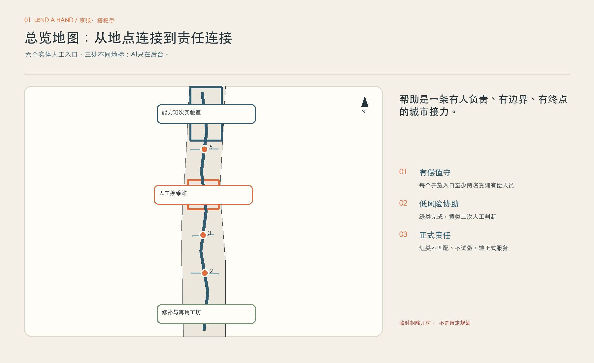
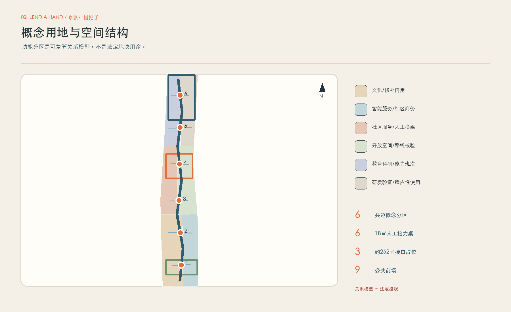
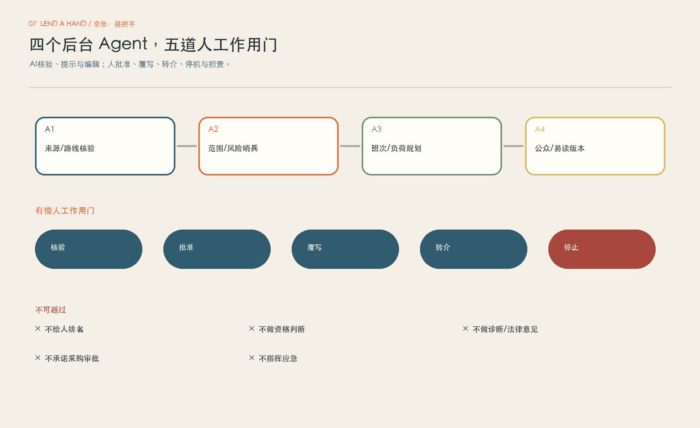
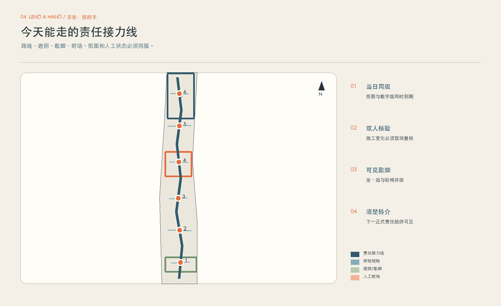
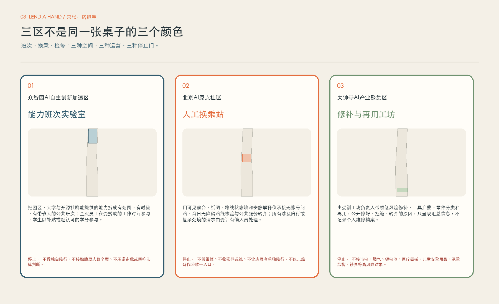
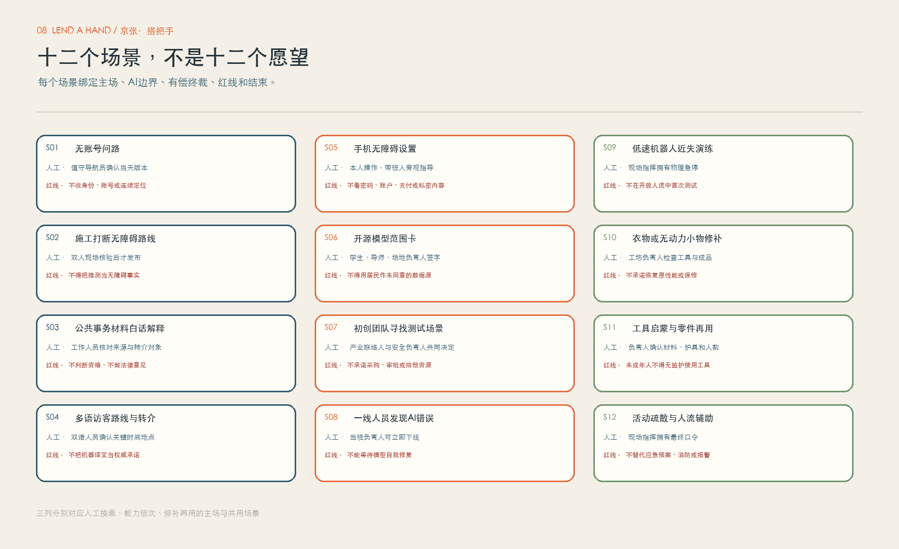
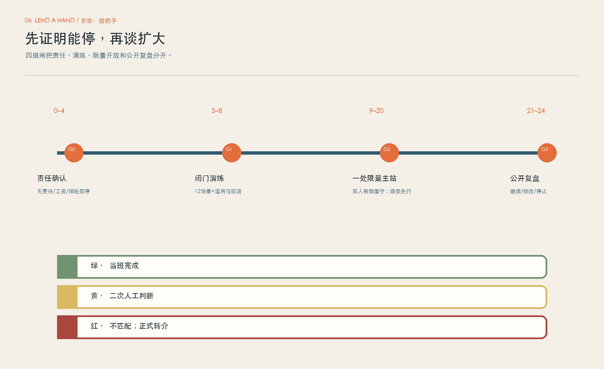
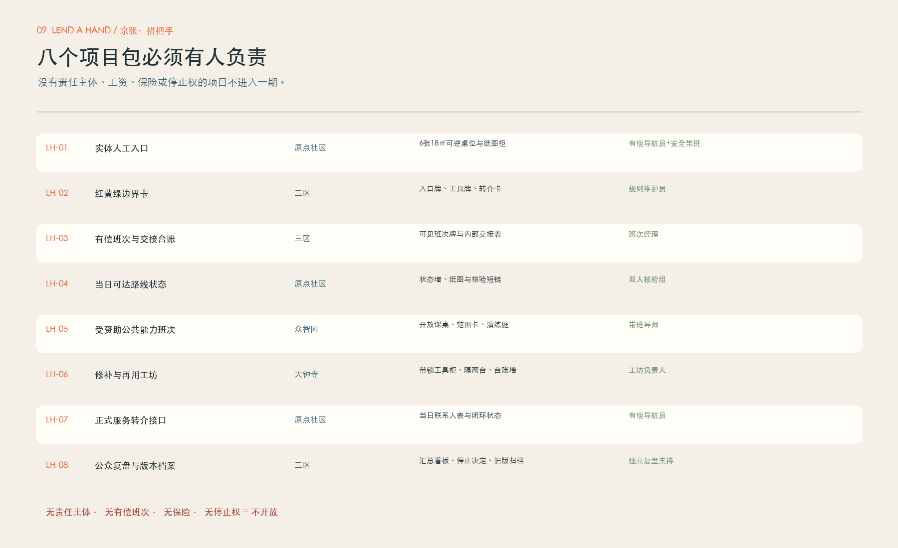
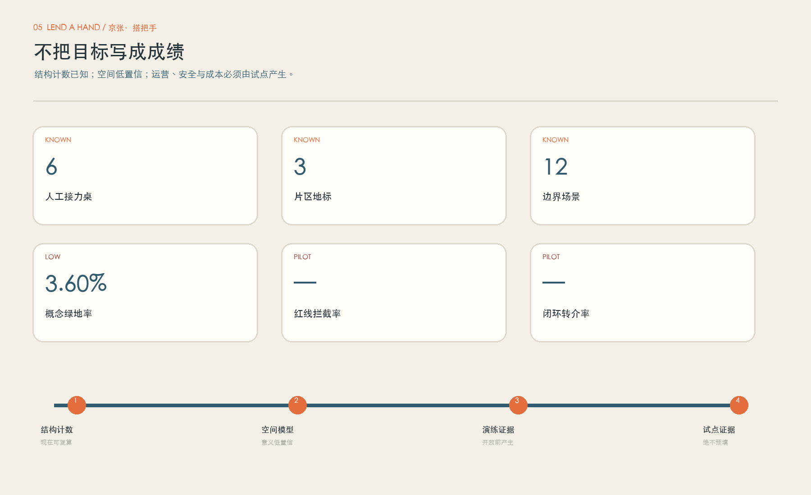

# 京张·搭把手｜LEND A HAND

> 城市变聪明，不该让求助变成一个人和系统之间的事。真正的公共智能，是每一次求助都知道谁能接、接到哪里、什么时候必须交还正式责任。

一位推着婴儿车的人走到施工围挡前，导航还在说“直行”。她不需要再下载一个应用，也不该被交给一个没有训练、没有保险、没有带班人的“热心邻居”。她需要的是一处看得见的人工入口：有人先确认今天能不能走，不能走就画一条纸面替代路线；事情超出边界，就把责任交给能够正式接住的部门，而不是把善意当作制度的替身。

“搭把手”因此不是志愿者平台，也不是把桌凳摆进公园。它是一套“有偿值守—低风险协助—正式服务接口”的责任接力。六张可逆人工接力桌提供无账号入口，三处地标把能力班次、人工换乘和修补再用落在不同片区；四个后台 Agent 只做来源/路线核验、风险提示、总量班次规划和易读版本编辑。帮助不是派给邻居的任务，而是一条有人负责、有边界、有终点的城市接力。

## 设计依据与资料清单

主控依据是官方公告与面向智能体任务书：前者确定三层范围、三处重点区、目标、设计任务和成果语境，后者提出智能体参与的定位、功能和六项任务 [source:OFFICIAL-ANNOUNCEMENT] [source:AGENT-TASKBOOK]。专业表达再以仓库内城市设计、控规、用地分类、建筑设计深度、无障碍、生成式AI和适老化标准快照逐项对照；它们构成审查清单，不把概念稿包装成法定成果 [standard:PROJECT-OFFICIAL-ANNOUNCEMENT]。

当前可用的 SITE_BOUNDARY 与三处 KEY_AREA 都是维护者明确标注的 provisional rough geometry。它们可用于生成、拓扑自检与比较方案关系，但不是官方地块、道路、文保或工程红线 [data:geometry/site_boundary.geojson#SITE-001] [source:BOUNDARY-SOURCE]。公开包还缺少现状建筑底数、权属、轨道接口、道路断面、市政容量、遗产控制线、正式控规指标和运营责任主体。因此，本方案所有面积、比例、建筑占位和路线都是低置信度概念建议，数据到位后必须整体重算，不能只替换一张底图。

安全与运营参考优先使用官方一手来源：民法典相关条文只作为公共场所管理者和活动组织者核查适用安全义务的风险提示；个人信息保护法用于约束最小必要、敏感信息与单独同意评估；志愿服务条例用于核查自愿、培训、记录、隐私和风险保障 [source:CIVIL-CODE-1198] [source:PIPL] [source:VOLUNTEER-REGULATION]。NYC311、Helsinki Service Map 与 Repair Café 仅贡献多入口、服务状态、可达信息、拒绝权和容量管理等可迁移机制；不移植其制度权限，也不照抄其免责条款。两个近期同行方案只用于检查图面层次、条件性接口、模拟台账和停止指标，未复制文字、几何或视觉。

## 三层范围工作框架

三层不是把同一个“互助站”放大缩小。统筹研究范围回答：AI产业与高校能力如何以有边界的公共班次释放，而不是靠个人无偿加班；总体设计范围回答：六个实体入口怎样沿日常路径形成可达、可交接、可回滚的责任接力；三处重点区回答：能力怎样出发、人怎样换乘、物与系统怎样被修补。铁路把地点连接起来，本方案借用“班次—换乘—检修”的公共语言，把责任连接起来 [depth:three_level_scope_framework]。

统筹层形成“公共能力供给协议”：企业员工的能力班次计入受赞助工作时间，高校参与绑定导师、补贴或经认可的学分，开源社群只处理公开、可撤回的任务。总体层形成“一线六桌三地标”：一条责任接力慢行线串联六个18㎡可逆桌位与三处适应性接口，占位不推定新建。重点层则让三地各有不可替代的运营角色：众智园测试能力供给，原点社区承担人工转介，大钟寺验证修补再用。三层共用同一红黄绿边界、双人值守、最小数据和停止门。

空间结构并不声称整条走廊每时每刻有人值守。它采用“固定主站+排期弹出点”：只有当两名受训有偿人员同时到岗、纸面与数字版本同步、当日转介表有效时，桌位才显示开放；否则明确显示关闭和最近正式入口。六桌是空间容量，不是同时开六站的承诺。任何排班都不得让一名协调员跨站覆盖、远程兼任安全负责人或用志愿者填补病假 [assumption:A-STAFF-001]。

## 任务书功能映射与区域协同接口

“搭把手”先回答任务书，再表达自己的概念。三大定位不是三句口号，而是三种审查镜头：文化带审查历史转译是否克制；生活体验带审查没有手机的人能否进入；融合创新带审查一个原型是否能被安全地拒绝、停止和交还 [source:AGENT-TASKBOOK] [standard:PROJECT-AGENT-OPEN-CALL-TASKBOOK]。

| 三大定位 | 在本方案中的可见回应 |
| --- | --- |
| 百年京张文化带 | 把铁路的班次、换乘、检修转译为可读的责任语言；遗产边界未核实前不附着设施。 |
| 都市AI生活体验带 | 六个无账号人工入口把AI的核验能力放在后台，把解释、拒绝、转介和停止留给有偿人员。 |
| AI融合创新带 | 把公共问题拆成可撤回的范围卡、封闭验证、人工批准、结果回传与退出，而不是把街区变成开放试验场。 |

五大功能通过“功能—片区/翼—空间—项目包—Agent—人类责任—回路”逐项落地。这里的“中关村科技服务翼”和“小月河场景赋能翼”是任务书规定的协同角色，不是本包新增的法定边界或已设机构。

| 五大功能 | 三区两翼主承载 | 空间载体 | 包 | 后台Agent | 人类责任 | 进入—退出回路 |
| --- | --- | --- | --- | --- | --- | --- |
| AI全栈自主创新体系 | 众智园AI自主创新加速区 | 能力班次实验室／封闭演练庭 | LH-05 | A1来源核验＋A2风险哨兵 | 受赞助带班导师＋安全带班人 | 公开任务进入—范围卡—封闭验证—文档交接或撤回 |
| 世界级AI创新生态 | AI原点社区＋中关村科技服务翼 | 人工换乘站／生态接力台 | LH-07 | A3容量规划＋A4公众版本 | 产业联络人＋正式接收人 | 问题界定—成熟度筛查—责任确认—非采购式转介 |
| AI+场景赋能新范式 | 小月河场景赋能翼＋三区 | 场景入口／封闭或半开放验证位 | LH-04/05 | A1路线核验＋A2风险哨兵 | 场景责任人＋安全负责人 | 申请—数据审查—人工作用门—结果回传—关闭 |
| 智能化AI活力城市 | 大钟寺AI产业集聚区＋小月河场景赋能翼 | 修补与再用工坊／可达公共体验线 | LH-01/06 | A4易读编辑 | 有偿导航员＋合格工坊负责人 | 无账号体验—低风险参与—专业转介—日常维护 |
| AI治理全球话语权 | 众智园＋AI原点社区 | 红黄绿范围卡／版本与停止档案 | LH-02/08 | A2风险哨兵＋A4版本编辑 | 隐私责任人＋独立复盘主持 | 公开失败、覆写、拒绝和退出证据；不输出自我认证 |

协同结构只有在责任真正交接时才闭环：`公开问题/能力进入 → 双人范围与数据核验 → 封闭或半开放验证 → 人工批准/拒绝 → 版本化结果回传 → 交接、复用或退出`。中关村科技服务翼侧重问题、工程、资本和服务接口；小月河场景赋能翼侧重可控场景与公众体验；三区分别保留能力供给、人工换乘和修补再用的主责。任一环节缺少责任人、许可或退出条件，回路在入口处停止。

### 五个外部区域：关系图是待验证的接口，不是合作名单

北纬社区、未来科学城、怀柔科学城、经开区和京津冀均来自任务书评审维度。本包未取得任何合作协议、联系人、数据授权、联合活动或资金证据，因此下表只定义“若未来经公开程序建立联系，什么可以交换、怎样进入和怎样退出”；它不把点名写成合作事实。

| 区域 | 可能贡献的能力 | 双向交换对象 | 进入条件 | 知识回传 | 退出条件 | 公开证据状态 |
| --- | --- | --- | --- | --- | --- | --- |
| 北纬社区 | 社区日常问题、线下可达性与易读反馈 | 公开问题卡、无账号体验脚本、错误回传 | 公开征集后由社区/场景责任人与安全负责人双确认 | 去标识问题清单、采用/不采用理由、易读公众版 | 个人个案、未经同意数据或无法正式承接时退出 | 任务书点名；本包未发现合作协议或可核验项目事实 |
| 未来科学城 | 科研能力、人才培养与原型成熟度方法 | 范围卡模板、封闭验证记录、人才短期交流议题 | 仅在公开邀请、双方责任人和数据边界明确后进入 | 复现实验说明、失败条件、维护/退出手册 | 不能完成数据授权、复现或责任交接时退出 | 任务书点名；仅设置概念接口，不声称已合作 |
| 怀柔科学城 | 科学装置与科研场景的验证方法经验 | 公开可分享的验证方法、非敏感场景问题与安全清单 | 先做公开资料核验，再由专业人员判断能否转为本地闭门演练 | 方法差异说明、不可迁移项、京张适配记录 | 涉及非公开科研资料、设备权限或专业能力缺口即退出 | 任务书点名；无项目、设施或数据接入承诺 |
| 经开区 | 产业工程化、制造/机器人测试与运维问题 | 封闭测试协议、近失记录、人工急停与交接模板 | 场景成熟度、场地责任、保险和物理停止全部通过后再讨论 | 测试结果、红线事件、是否进入下一成熟度的人工决定 | 首测需开放人流、缺物理急停或被误解为采购时退出 | 任务书点名；不声称企业名单、试点或采购 |
| 京津冀 | 跨区域人才、案例与公共服务知识交换 | 双语范围卡、可复用组件说明、版本化失败案例 | 只通过公开渠道和明确许可接收可复用材料 | 来源、许可、适用差异、回传联系人和退出状态 | 许可不清、结论不可复现或被包装成区域承诺时退出 | 任务书点名；不推定联席机制、资金或共同项目 |

## 统筹研究范围产业与未来城市研究

AI产业生态常以算力、模型、资本和展示空间衡量。本方案补上一块常被忽略的基础设施：把真实生活中的边界、错误、无障碍障碍、语言困难、维护需求和人工覆写，转为可验证的公共任务。企业获得的不是“居民数据”，而是经责任主体批准、去标识、可停止的场景；居民得到的也不是一次体验活动，而是看得见的人工入口与正式转介。产业价值来自把系统做得更可靠，而不是把社区变成廉价测试场 [depth:industry_ecosystem_strategy]。

生态由四类关系组成。第一，园区和高校赞助有偿能力班次，让工程师、设计师和学生把设备无障碍、公开信息易读、开源范围卡等能力转成可排期的公共支持。第二，一线工作人员拥有下线错误版本的权力，其判断进入产品复盘而不是被当作“用户抱怨”。第三，正式公共服务接收方只接收必要的请求类别和状态，不接收模糊自由文本或未经同意的个人画像。第四，修补工坊连接合格维修、再用材料与技能教育，拒绝高风险对象也被视为一项质量结果。

这个生态对人才的吸引力不是“处处有机器人”，而是专业尊严：工程师能在明确边界内验证；一线人员的经验有署名的覆写权；学生不以无偿热情补岗位；国际来访者能获得人工确认的多语信息；无障碍使用者不是测试道具，而是路线是否发布的共同判断者。项目公开的不只是成功案例，还包括拒绝、转介、暂停、过期和未解决事项，以此证明一座AI城区敢于让系统停止。

四个后台 Agent 的职责如下。每一个输出都必须带来源、版本、有效期、置信度、人工批准人与覆写理由；没有批准就不能进入公众版。

| 编号 | 后台角色 | 只可以做什么 | 谁终裁 | 硬边界 |
| --- | --- | --- | --- | --- |
| A1 | 来源与路线核验 Agent | 比对公开来源、日期、路线版本与现场复核状态 | 值守导航员 | 不能把缺失信息补写成事实；到期自动撤下 |
| A2 | 范围与风险哨兵 Agent | 按红黄绿规则提示越界、缺少二次判断或不允许对象 | 安全带班人 | 红线只触发人工协议，不由AI单独处置人 |
| A3 | 班次与负荷规划 Agent | 只按任务类别、总量容量和技能班次排表 | 班次经理 | 不看个人价值，不给居民、志愿者或员工评分 |
| A4 | 公众版本与易读编辑 Agent | 生成多语、易读、纸面同版草稿并标出来源 | 内容责任人 | 关键时间地点逐项核对；保留旧版与覆写理由 |

## 全球AI创新生态案例与八要素回路

六个案例只比较公开机制，不做榜单，也不暗示对方与京张合作。每个案例都同时写出制度差异和不可迁移项，避免把海外品牌、资金或成果贴到本地概念上。

| 公开案例 | 地点 | 可迁移机制 | 制度差异 | 京张适配 | 明确不迁移 | 来源 |
| --- | --- | --- | --- | --- | --- | --- |
| AI Singapore 100 Experiments | Singapore | 问题界定—PoC/MVP—工程与学徒共同交付—文档和知识转移 | 国家级项目与共同投入条件不同；京张不能复制资助额度或资格 | 借鉴成熟度筛查、真实问题、阶段成果与交接；对应众智园能力班次和验证卡 | 不移植资金、采购、项目时长或入选资格 | [source:AI-SINGAPORE-100E] |
| Mila industry partnership ecosystem | Montréal, Canada | 研究、人才、产业伙伴与创业支持在同一协作环境中保持长期连接 | 研究机构规模、伙伴制度和本地产业政策不同 | 借鉴共同空间、项目入口、人才触点和持续关系；对应原点社区生态接力台 | 不移植伙伴名单、品牌、科研声誉或招商成效 | [source:MILA-PARTNERSHIPS] |
| Vector Institute research-to-adoption | Toronto, Canada | AI工程、人才项目与机构协作把研究转为可采用工具 | 省级研究与产业网络、资金和医疗伙伴体系不同 | 借鉴研究—工程—培训—采用的连续路径；对应开发者复用与企业交接 | 不复制认证、资助、人才名额或行业伙伴关系 | [source:VECTOR-ADOPTION] |
| Digital Catapult BridgeAI | United Kingdom | 成熟度工具、加速器、行业工作组和负责任AI支持共同降低采用风险 | 国家项目、目标行业和公共资金制度不同 | 借鉴成熟度门、伦理/数据准备度、行业问题与开发者社区配对 | 不移植资金数字、行业资格、采购或加速器品牌 | [source:DIGITAL-CATAPULT-BRIDGEAI] |
| ELLIS network of units | Europe | 本地研究单元、跨节点研究计划和博士后网络形成多中心知识循环 | 以研究卓越和机构承诺为核心，不是城市公共服务网络 | 借鉴本地节点保留主体性、跨节点共享方法、人才往返并回传知识 | 不使用其单位称号、准入标准、声誉或研究网络背书 | [source:ELLIS-NETWORK] |
| AI Sweden Technology Infrastructure | Sweden | 伙伴带入用例，完成协议、技术/法律支持、测试、离场与知识共享 | 伙伴制国家平台、基础设施和法律环境不同 | 借鉴用例清单、协议前置、生产近似测试、offboarding与知识回传 | 不移植伙伴权限、算力供给、数据集或法律结论 | [source:AI-SWEDEN-INFRA] |

本方案从案例中提取的不是“园区长相”，而是五个共同动作：先定义问题和成熟度；让研究、工程、人才和使用者在清楚角色内协作；把数据、算力和资金放进协议；以可复现输出而非活动人次判断；最后完成知识转移与离场。对应到京张，众智园承接封闭技术与能力验证，原点社区承接人工解释和责任换乘，大钟寺承接低风险修补与智能原生服务，小月河翼承接受控场景，中关村翼承接问题与专业服务接口。它们是概念职责，不是已确认组织架构。

| 八要素 | 跨区空间载体 | 人工批准门 | 退出/停止 |
| --- | --- | --- | --- |
| 土地 | 三区临时画布与两翼概念接口 | 仅标候选承载关系；权属、控规、文保与红线齐全后由法定/专业主体批准 | 任何关键底图缺失则不落位 |
| 空间 | 众智园封闭演练庭—原点人工换乘—大钟寺低风险工坊—小月河半开放场景 | 先封闭、后半开放、再限时公共；每次升级由场景责任人与安全负责人签署 | 人员、疏散、无障碍或场地协议失效即关闭 |
| 产业 | 中关村科技服务翼的概念性问题入口与三地验证能力 | 只接有明确问题所有者、维护人和退出计划的任务；不承诺招商采购 | 无业务责任人或只能以居民作无偿测试对象即退回 |
| 资金 | 工资、场地、保险、测试、维护和退场的预算包 | 责任主体逐包确认资金来源；资本只能支持经批准的阶段，不能绕过人工门 | 未覆盖全成本、把岗位改为志愿者或资金附带数据/采购交换即停止 |
| 人才 | 受赞助工程师班次、导师制学生贡献、有偿一线人员、可达性共同复核 | 任务—导师—有偿/学分条件—作品证据—交接/退出逐项确认 | 无导师、无补偿安排、把服务对象当训练素材或承诺录用即停止 |
| 算力 | 隔离沙箱与可追溯版本，不声明现有算力容量 | 技术责任人设置账号、配额、日志、删除和断网演练；只在批准任务中启用 | 权限、成本、回滚或退出删除无法验证即不接入 |
| 数据 | 公开、合成、去标识且最小必要的数据；个人信息默认不进入 | 隐私责任人核查来源、用途、许可、期限、访问、删除和结果披露 | 来源/许可不清、需要连续定位或自由文本个案时退出普通流程 |
| 场景 | 四张产业验证卡与十二个公众场景 | 申请—成熟度—风险—封闭测试—人工评审—有限开放—回传或关闭 | 红线漏接、结果不可复现、场景被宣传为已批准即停止 |

八要素按同一回路运行：`土地/空间可用性核查 → 产业问题与公共价值双界定 → 人才及全成本预算确认 → 算力和数据协议 → 场景封闭验证 → 人工证据评审 → 有限开放或退出 → 文档、维护人与删除证明交接`。资本没有越过安全门的特权；算力和数据没有自动进入公共空间的通行证；“退出并留下可复用知识”与“扩大”同样是合格结果 [depth:industry_ecosystem_strategy]。

## 总体设计范围城市更新与控规深度城市设计

总体结构为“一条责任接力慢行线、六条核验短链、六张人工接力桌、三处片区地标、四类后台 Agent”。路线并非新道路，而是需要正式道路与无障碍调查后才能落位的概念连接；短链指向每日容易失效的最后几百米；桌位是3×6米可逆界面；三处地标各使用18×14米适应性改造占位。建筑总占位约864㎡，其中六桌合计108㎡，三处接口合计约756㎡，与过去“桌凳却画成大馆”的尺度矛盾脱钩 [data:geometry/buildings.geojson#BLDG-LH-T01] [metric:building_footprint_area_sqm]。

概念用地用六个无缝分区覆盖临时边界，使用公开分类术语表达文化与修补再用、智能服务与社区型商务、社区服务与人工换乘、公共开放空间与路线核验、教育科研与公共能力班次、研发验证与适应性使用。它们是功能关系模型，不是法定地块用途；绿地、公共前场、路线和建筑是可复算叠加层，不以“AI用地”等自造代码替代规范分类 [data:geometry/land_use.geojson#LU-LH-01] [standard:MNR-LAND-USE-CLASSIFICATION-GUIDE]。

更新优先级从基础公共性开始：先核实连续步行、无障碍、遮阴、照明、实体导视、疏散和人工窗口；再放置可逆桌位、纸图柜、状态墙与休息位；之后才允许有限的数字服务；最后才讨论任何建筑改造或长期租赁。现状建筑、产权、结构和文保资料缺失，所以方案不点名拆除，不承诺容积率、层数、高度或停车数。拆改留采用“安全与权属核查—碳与记忆价值—可逆改造—专业审批”的顺序，而不是先画新体量 [depth:retain_renovate_demolish]。

交通层只提出慢行核验逻辑：纸图与数字版同日同步；施工变化由双人现场核验；开放桌位不得占用消防、盲道、通行净宽或站口集散；低速机器人首次测试只能在封闭/半开放样段并保留物理急停。市政与新基建层以插座、照明、网络、设备锁定、断电、消防、储物和雨棚为待核清单，不把“有电有网”当作可直接接入的事实 [data:geometry/roads.geojson#ROAD-LH-01] [depth:municipal_new_infrastructure]。

## 重点区域详细设计

三区动作是三套不同的空间—运营—责任组合，不是换三种颜色。

| 片区 | 核心空间 | 地标 | 独有动作 | 明确不做 |
| --- | --- | --- | --- | --- |
| 众智园AI自主创新加速区 | 能力班次实验室 | 能力班次牌 | 把园区、大学与开源社群能提供的能力拆成有范围、有时段、有带班人的公共班次；企业员工在受赞助的工作时间参与，学生以补贴或经认可的学分参与。 | 不做独自陪行、不接触脆弱人群个案、不承诺审批或医疗法律判断。 |
| 北京AI原点社区 | 人工换乘站 | 有人接站 | 用可见前台、纸图、路线状态墙和安静解释位承接无账号问路、当日无障碍路线核验与公共服务转介；所有涉及陪行或复杂处境的请求由受训有偿人员处理。 | 不做维修、不收密码或钱、不让志愿者单独陪行，不以二维码作为唯一入口。 |
| 大钟寺AI产业聚集区 | 修补与再用工坊 | 修补台账墙 | 由受训工坊负责人带领低风险修补、工具启蒙、零件分类和再用，公开修好、拒绝、转介的原因，只呈现汇总信息，不记录个人维修档案。 | 不接市电、燃气、锂电池、医疗器械、儿童安全用品、承重结构、锁具等高风险对象。 |

众智园的“能力班次实验室”由开放课桌、范围卡墙、封闭演练庭和可见班次牌组成。每个班次公开任务类别、可做与不可做、带班人、人数、时长和退出条件；企业员工只在受赞助工作时间参与，学生参与必须有导师和补贴/学分安排。这里处理设备可达性设置、公开信息易读、开源范围卡、封闭机器人演练等，不直接承接脆弱人群个案。它的地标“能力班次牌”借铁路时刻表的可读性，展示的是能力与责任，不展示个人绩效排名 [data:geometry/key_areas.geojson#PROV-KEY-001]。

AI原点社区的“人工换乘站”是全方案唯一的首要转介节点。可见前台面向主流线，旁边有安静解释位、纸图柜、路线状态墙和当天正式服务联系人表。每次开放至少一名有偿导航员与一名安全带班人；仅有一人、转介表过期、纸图未同步、疏散受阻时关闭。陪行只由受训有偿人员在公共可见范围和当班半径内执行；志愿者不得单独陪行。它的地标“有人接站”不许用屏幕取代人，而是让关闭、排队、转介和责任人都可见 [data:geometry/key_areas.geojson#PROV-KEY-002]。

大钟寺的“修补与再用工坊”由带锁工具柜、材料清洁分类区、低风险修补台、隔离/拒绝位和台账墙组成。入口先分绿黄红：衣物缝补和简单无动力小物可在监督下进行；需要进阶工具的黄类由工坊负责人二次判断；市电、燃气、锂电池、医疗器械、儿童安全用品、承重结构和锁具直接拒绝并转专业维修。不能以签“免责书”替代合理安全控制。地标“修补台账墙”只公开汇总的修好、拒绝与转介原因，让拒绝也成为可学习的公共证据 [data:geometry/key_areas.geojson#PROV-KEY-003]。

## AI 创新生态、人才画像与 AI+ 场景

人物画像不是商业标签，而是检验同一接口是否把风险推给不同人。六类人物都用“处境—需要—等价入口—谁决定—什么不能做”描述，不收集可识别画像，不据此给人排序 [depth:ai_scenarios_personas]。

| 编号 | 人物 | 当下任务 | 需要的实体支持 | AI与人工关系 | 不可越界 |
| --- | --- | --- | --- | --- | --- |
| P01 | 不习惯智能手机的老年居民 | 找今天能走的路或理解一张通知 | 纸图、坐着解释、可带走的查询码 | 后台只做公开信息检索、过期提醒或易读草稿；有偿人员决定。 | 密码/钱/私联/入户/资格判断均不进入流程。 |
| P02 | 轮椅、婴儿车或低视力出行者 | 核验施工后仍可用的无障碍短链 | 现场核验记录与人工替代路径 | 后台只做公开信息检索、过期提醒或易读草稿；有偿人员决定。 | 密码/钱/私联/入户/资格判断均不进入流程。 |
| P03 | 带孩子的照护者 | 需要清楚方向，但不能离开孩子或被带去隐蔽处 | 可见范围内解释；不提供托管 | 后台只做公开信息检索、过期提醒或易读草稿；有偿人员决定。 | 密码/钱/私联/入户/资格判断均不进入流程。 |
| P04 | 一线公共服务人员 | 指出系统错误并立即撤回过期版本 | 有权停止发布、留下覆写理由 | 后台只做公开信息检索、过期提醒或易读草稿；有偿人员决定。 | 密码/钱/私联/入户/资格判断均不进入流程。 |
| P05 | 学生或开源开发者 | 把原型放进有边界的公共测试 | 公开范围卡、导师与现场负责人双确认 | 后台只做公开信息检索、过期提醒或易读草稿；有偿人员决定。 | 密码/钱/私联/入户/资格判断均不进入流程。 |
| P06 | 初创或园区测试工程师 | 寻找真实但可撤回的验证场景 | 封闭演练先行，不把试点当审批 | 后台只做公开信息检索、过期提醒或易读草稿；有偿人员决定。 | 密码/钱/私联/入户/资格判断均不进入流程。 |

十二个场景覆盖问路、无障碍、公共信息、多语、设备设置、开源范围、产业测试、系统回滚、机器人近失、低风险修补、工具教育与活动疏散。它们不是愿望清单；每一行都绑定唯一主场、一个后台AI角色、一名有偿终裁者、数据最小项、红线与成功/停止结果 [metric:scenario_count]。

| ID | 场景 | 主场 | AI只做 | 有偿人工门 | 数据/红线 | 成功或停止 |
| --- | --- | --- | --- | --- | --- | --- |
| S01 | 无账号问路 | 人工换乘站 | 来源与路线核验 | 值守导航员确认当天版本 | 不收身份、账号或连续定位 | 给出一条可走路线或明确转介 |
| S02 | 施工打断无障碍路线 | 人工换乘站 | 标记冲突并提示复核 | 双人现场核验后才发布 | 不得把推测当无障碍事实 | 旧版本下线且纸图同步 |
| S03 | 公共事务材料白话解释 | 人工换乘站 | 把已公开材料改写为易读版 | 工作人员核对来源与转介对象 | 不判断资格、不做法律意见 | 来访者知道下一正式入口 |
| S04 | 多语访客路线与转介 | 人工换乘站 | 生成待核对译文 | 双语人员确认关键时间地点 | 不把机器译文当权威承诺 | 访客复述确认且拿走纸条 |
| S05 | 手机无障碍设置 | 能力班次实验室 | 提供机型通用步骤 | 本人操作，带班人旁观指导 | 不看密码、账户、支付或私密内容 | 设置完成或转给官方售后 |
| S06 | 开源模型范围卡 | 能力班次实验室 | 整理数据、能力与失败条件 | 学生、导师、场地负责人签字 | 不得用居民作未同意的数据源 | 公众能看懂能做与不能做 |
| S07 | 初创团队寻找测试场景 | 能力班次实验室 | 匹配任务类别与总量容量 | 产业联络人与安全负责人共同决定 | 不承诺采购、审批或排他资源 | 进入封闭演练或被清楚拒绝 |
| S08 | 一线人员发现AI错误 | 三区共用 | 比对版本并生成回滚建议 | 当班负责人可立即下线 | 不能等待模型自我修复 | 旧信息十五分钟内撤下并留痕 |
| S09 | 低速机器人近失演练 | 能力班次实验室 | 汇总轨迹与近失片段 | 现场指挥拥有物理急停 | 不在开放人流中首次测试 | 红线事件零放行；有一次即停 |
| S10 | 衣物或无动力小物修补 | 修补与再用工坊 | 提示材料和通用步骤 | 工坊负责人检查工具与成品 | 不承诺恢复原性能或保修 | 安全归还或书面拒绝/转介 |
| S11 | 工具启蒙与零件再用 | 修补与再用工坊 | 给出分类候选 | 负责人确认材料、护具和人数 | 未成年人不得无监护使用工具 | 物料可追溯且活动按容量进行 |
| S12 | 活动疏散与人流辅助 | 人工换乘站 | 显示已核实出口与拥堵提示 | 现场指挥拥有最终口令 | 不替代应急预案、消防或报警 | 演练按口令结束并记录差错 |

场景 S02 的完整流程说明安全边界如何工作：施工信息进入来源核验 Agent 后只被标为“待现场确认”；两名人员按公开路线现场查看，不拍摄路人、不记录连续轨迹；发现障碍后，当班负责人先下线旧版，纸图贴上同样的封闭信息，再发布经核验的替代路线。若没有安全替代线，就明确说“今天无法在本站确认”，转给道路或场地责任单位。AI没有权限把缺失路线补齐，更没有权限让一个志愿者临时带人穿过施工区。

场景 S10 的完整流程也不同：物品主人在场描述问题，工坊负责人先做对象分类；红类立即拒绝，黄类只有在工具、护具、容量与专业能力齐备时进入，绿类由本人参与修补。完成不等于“保证像新的一样”，而是检查明显安全状态、说明剩余风险、记录匿名对象类别与结果。任何伤害、工具失控、材料不明、未成年人脱离监护，立即停止该场次并封存相关工具等待复盘。

## 产业测试验证卡：先能被拒绝，才可能进入街区

以下四张卡把“产业场景”与公众体验分开。成熟度是本方案对证据状态的描述，不采用未经正式评估的TRL数字；所有场景当前均为概念验证路径，不是已批准、已采购或已运营试点。

| 卡 | 场景 | 当前成熟度 | 封闭/半开放空间 | 输入数据 | 责任人 | 验证指标 | 停止阈值 | 结果回传 |
| --- | --- | --- | --- | --- | --- | --- | --- | --- |
| IV-01 | 当日可达路线核验 | 规则/原型可演练；公开服务未批准 | 封闭路线桌面＋半开放无人流样段 | 公开施工信息、合成障碍、双人现场记录；不收连续轨迹 | 道路/场地责任人（待确认）＋有偿路线核验组 | 未核验路线发布=0；旧版撤回演练≤15分钟目标；纸数同版 | 一次把推测写成可走、一次红线近失或纸数冲突即停 | 路线差错、覆写理由、适用范围回传给提交团队；不能通过则下线 |
| IV-02 | 多语与易读公共信息助手 | 可做受控文本测试；不是正式发布系统 | 封闭内容台＋有人值守的限量柜台 | 经授权公开通知、预设测试问句、术语表；不收资格个案 | 正式内容发布人（待确认）＋双语复核员 | 关键时间/地点/责任入口逐项人工一致；来源和到期可见 | 关键字段一次未核对、机器译文被当承诺或无法回滚即停 | 保留差错类型、修订规则与拒绝样本；交给内容责任人维护或退出 |
| IV-03 | 低速机器人近失与礼让验证 | 仅封闭演练概念；不具开放运行资格 | 众智园封闭庭，条件通过后才讨论半开放空场 | 合成路径、匿名设备遥测、假人/标志物；不以路人作首测对象 | 设备运营方（待确认）＋现场安全指挥 | 物理急停可用；红线事件零放行；近失、停机与复位完整留痕 | 一次闯入人流、急停失效、需要人脸识别或现场权责不清即停 | 测试包包含失败片段、版本、环境和不可外推项；人工决定重测/退场 |
| IV-04 | 班次容量与人工接力规划 | 可用合成班表验证；不用于人员评分 | 封闭运营沙箱 | 岗位技能、总量容量、休息/替班规则、合成请求；无姓名价值分 | 班次经理＋劳动/隐私复核人（待确认） | 双人底线、休息与技能约束100%满足；志愿者替岗建议=0 | 任何个人价值排序、跨站兼任、无薪替补或不解释排班即下线A3 | 输出约束冲突、人工覆写和未解容量；不能满足则缩时段或关闭 |

四张卡共享七步门：申请人公开问题与维护人；场景责任人核对公共价值；隐私/安全负责人审数据和空间；封闭演练；一线人员挑战失败条件；责任主体人工签署“进入下一步/重做/退出”；最终把代码、范围卡、测试、差错、适用范围和删除/退场证明交还。任何新闻、参观或投资安排都不能替代这七步。

## 用地、建筑规模与拆改留方案

用地模型面积只来自临时边界，在EPSG:4548中复算。六个分区共边、无重叠并覆盖临时场地；绿色接力线与九处公共前场是叠加层；建筑层严格区分六个18㎡桌位和三处约252㎡适应性接口占位。公共前场面积是桌位周边的排队、休息与转换空间，不能与桌位建筑面积互换；“六桌+三地标”在GeoJSON、metrics、图纸与正文中均为9个公共前场和9个建筑占位 [data:geometry/public_space.geojson#PUBLIC-LH-01] [metric:handover_table_count]。

建筑表达停在城市设计与运营接口深度：桌位需可逆、可关闭、可见、避雨、能放纸图、留轮椅停靠空间；适应性接口需在既有可用建筑中优先寻找，不预设新建。正式落位前必须逐处核查权属、结构、消防、疏散、无障碍、照明、噪声、邻里影响、文保、设备承载、卫生与储物。没有这些资料时，图面矩形只说明需要多少概念操作界面，不说明真实施工范围 [depth:height_massing_character]。

拆改留决策采用五问：对象是否安全并可合法使用；是否具有遗产、街道连续性或社区记忆价值；可逆改造能否满足无障碍与运营；全生命周期碳和成本是否优于新建；对周边日常使用是否有被共同复核的影响。任一答案缺证据就保持“待确认”，不因为AI能生成体量图而提前判断拆除。针对京张遗产，只把铁路语言用于公共识别与责任结构；没有正式文保边界前不在遗产对象上安装设施。

## 交通、轨道、市政与公共服务设施

“责任接力线”是慢行与服务逻辑，不是新设道路中心线。六条核验短链连接片区内部的公共入口、站点方向与可停留前场，但其精确位置必须用官方道路、轨道、盲道、坡度、过街、施工、站口集散和产权资料重新计算 [data:geometry/roads.geojson#ROAD-LH-02] [depth:traffic_rail_slow_parking]。路线状态分为已现场核验、公开来源待核验、暂时不可确认三类；只有第一类能给出“今天可走”的明确表述。数字地图与纸图必须同版，旧版同时撤下。

桌位落位遵循“主流线可见、不过度围观、有坐有站、轮椅可并排、儿童不被分离、工作人员能呼叫支援、不会侵占消防与盲道”。陪行只在已定义的公共可见半径内，由有偿受训人员执行，并记录起止站点与结果，不记录连续轨迹；不得入户、私车运送、交换私人联系方式。紧急情况按现场应急与报警/急救协议处理，不能先交给AI分类完再行动。

市政与设备前置清单包括：合规供电与断电、网络失效时的纸面运行、照明与夜间关闭、消防器材和疏散、雨雪防滑、工具锁定与盘点、材料清洁和隔离、无障碍卫生间与休息、垃圾和危险物拒收、屏幕防窥与权限、每日开闭站检查。这里没有一项因“轻量”而可以省略。若场地只能提供桌椅却不能提供安全、储物、支援与关闭条件，就只保留临时有人说明，不开放维修或陪行。

正式公共服务接口采用“最小转介单”：请求类别、发生站点、时间段、是否即时风险、接收方、接收时间、关闭状态与版本号。姓名、电话、精确位置、健康或家庭细节默认不进入；确需联系的情形由正式接收方按其合法流程取得，而不是让搭把手台账变成影子个案库 [assumption:A-DATA-001]。

## 蓝绿空间、公共空间与城市风貌

蓝绿系统的功能是让人工服务可停留、可辨认、可恢复，而不是以一个大比例掩盖场地事实。概念模型沿责任接力线设置约18米设计缓冲、六个节点歇脚口袋与三处重点区绿岛，并连接九处公共前场；它们都要在正式生态、水系、树木、海绵、文保和道路资料到位后重算 [data:geometry/green_space.geojson#GREEN-LH-01] [metric:green_ratio]。图上的绿地率是设计模型值，不是法定绿地率，也不暗示所有范围都新建绿化。

公共空间不是一排桌凳。每个开放节点至少包含五个层次：远处可看见的开闭站标志；不扫码也能理解的服务范围；坐、站、轮椅并排的解释位；遇到黄/红请求时不暴露隐私的转介位置；工作人员撤站后仍然有效的纸面正式入口。三处地标再叠加片区独有界面：班次牌强调时间与能力，换乘站强调谁接下一棒，台账墙强调哪些对象被修、拒绝或交给专业者。

视觉识别来自铁路而非“赛博蓝光”：深蓝是有人承担的主线，橙色是需要转介或修补的断点，绿色是恢复与歇脚，纸白保留日常尺度。标记由两只并非相握而是“交接”的开放手势与一条断续轨迹构成，强调帮助可以拒绝、暂停、交还。信息层级固定为“今天是否开放—可以做什么—谁在值守—什么时候停止—下一正式入口”，不把宣传语放在安全信息之前。

无障碍表述采取“双路径”：实体文字采用高对比与足够字号，保留纸图、口述、坐着解释和易读版；数字页可以放大、键盘访问并与纸面同版本。无障碍环境建设法与适老化政策构成适用性检查，但本方案不把特定条款扩张成所有场景都已存在法定人工服务义务；“无账号、有人接”是方案主动承担的公共设计原则 [standard:BARRIER-FREE-ENVIRONMENT-LAW]。

## 京张公共空间、地标与文化系统

京张遗址公园的概念公共空间叫“接力停靠带”：它不是在遗产上放一座AI装置，而是在已核实、可合法使用的公共界面中，组合可逆休息位、纸图与版本柜、开闭站灯箱、无障碍并排解释桌和一段可退场的故事标记。遗产本体、文保边界、树木、水系、产权和交通条件未明时不附着、不打孔、不跨越、不作工程结论 [depth:blue_green_public_space]。

东西缝合只寻找既有合法过街、入口与公共前场之间的“最后几百米”连接，先修复信息、休息和人工确认；不推断桥隧、地下空间或跨铁路工程可行。南北贯通是责任接力线在已核验慢行网络上的连续状态，不是新道路红线；任何一段无法现场确认，就在纸图和数字版上同时断开，并给出下一正式入口。

| 地标 | 位置 | 公共作用 | 边界 |
| --- | --- | --- | --- |
| L1 能力班次牌 | 众智园 | 像时刻表一样显示可贡献能力、带班人、容量、有效期与停止条件 | 不列个人绩效，不替代整体Logo |
| L2 有人接站 | AI原点社区 | 从远处看见开/闭、谁值守、排队、纸图和下一正式入口 | 屏幕不能取代人，不声称服务机构已入驻 |
| L3 修补台账墙 | 大钟寺 | 匿名显示修好、拒绝、转介、剩余风险与材料回去哪里 | 不做个人故事墙，不承诺维修质量或保修 |

“把手荣誉档案”不展示谁更热心，而展示谁在关键时刻正确停止：被一线人员撤回的错误版本、一次明确拒绝、一次闭环转介、一项无障碍共同复核和一份完整退场记录。个人署名必须另行同意，拒绝署名不影响贡献；企业Logo、排名、居民故事和未闭环成果不进入荣誉墙。

| 组件 | 名称 | 必须表达的状态 |
| --- | --- | --- |
| C01 | 开闭站灯箱 | 远距显示OPEN-GREEN／限量／关闭及原因码 |
| C02 | 纸图与版本柜 | 纸数同版、到期、旧版撤下与离线替代 |
| C03 | 并排解释桌 | 坐、站、轮椅并排；不强迫跨桌对质或扫码 |
| C04 | 安静转介湾 | 减少围观；只处理最小转介，不建立影子个案 |
| C05 | 工具隔离箱 | 异常工具或物品立即锁定、编号、等待专业复核 |
| C06 | 版本留痕条 | 来源、批准人、有效期、覆写、回滚和下一复核 |

文化叙事依次经过三层：京张铁路留下“班次—换乘—检修—通达”的公共记忆；中关村创新文化加入“问题—原型—复现—开放”；AI新文化再加入“来源—人工覆写—停止—交接”。最后得到的不是“科技给人答案”，而是“城市愿意为不确定性保留一个真实的人”。

一带总体Logo只有一套：开放的两只手形括号与一段可中断的责任线，用于项目身份。文化导视是从属系统：片区代码、时刻表栅格、版本条、检修戳和红黄绿状态，只用于找路、读状态和理解故事。导视不得变形成第二个Logo，总体Logo也不得承担安全状态颜色的含义。

## 更新项目清单、实施政策与分期计划

项目清单把每一项空间输出绑定责任主体、运营角色、前置条件与停止门。没有责任主体的“共建”不进入一期；没有有偿班次的桌位不开站；没有合格工坊负责人的工具柜不解锁 [depth:phasing_implementation]。

| 包 | 项目 | 位置 | 实体输出 | 责任主体 | 日常运营 | 最小前置 | 继续/停止证据 |
| --- | --- | --- | --- | --- | --- | --- | --- |
| LH-01 | 实体人工入口 | 原点社区 | 6张18㎡可逆桌位与纸图柜 | 属地公共责任主体 | 有偿导航员+安全带班 | Gate 0责任/场地/保险通过 | 结构与运营指标达标，否则停止 |
| LH-02 | 红黄绿边界卡 | 三区 | 入口牌、工具牌、转介卡 | 运营方安全负责人 | 规则维护员 | Gate 0责任/场地/保险通过 | 结构与运营指标达标，否则停止 |
| LH-03 | 有偿班次与交接台账 | 三区 | 可见班次牌与内部交接表 | 运营方 | 班次经理 | Gate 0责任/场地/保险通过 | 结构与运营指标达标，否则停止 |
| LH-04 | 当日可达路线状态 | 原点社区 | 状态墙、纸图与核验短链 | 道路/场地责任单位 | 双人核验组 | Gate 0责任/场地/保险通过 | 结构与运营指标达标，否则停止 |
| LH-05 | 受赞助公共能力班次 | 众智园 | 开放课桌、范围卡、演练庭 | 园区/高校合作方 | 带班导师 | Gate 0责任/场地/保险通过 | 结构与运营指标达标，否则停止 |
| LH-06 | 修补与再用工坊 | 大钟寺 | 带锁工具柜、隔离台、台账墙 | 持证/专业运营方 | 工坊负责人 | Gate 0责任/场地/保险通过 | 结构与运营指标达标，否则停止 |
| LH-07 | 正式服务转介接口 | 原点社区 | 当日联系人表与闭环状态 | 接收部门责任人 | 有偿导航员 | Gate 0责任/场地/保险通过 | 结构与运营指标达标，否则停止 |
| LH-08 | 公众复盘与版本档案 | 三区 | 汇总看板、停止决定、旧版归档 | 公共责任主体 | 独立复盘主持 | Gate 0责任/场地/保险通过 | 结构与运营指标达标，否则停止 |

### 岗位不是“大家一起帮忙”：谁领工资，谁能停止

以下岗位矩阵把日常动作与禁止事项拆开。最低开站人力只计算有偿、受训、现场在岗的人；志愿者、企业嘉宾和学生无论人数多少，都不能抵扣这一底线。这样做不是贬低善意，而是避免最温暖的语言掩盖最脆弱的劳动关系。

| 角色 | 劳动/责任关系 | 可以承担 | 不得承担 | 到岗与替班 |
| --- | --- | --- | --- | --- |
| 公共导航员 | 有偿 | 解释范围、纸图、绿类请求、正式转介、教回复述 | 黄类终裁、红类专业处置、收钱收密码、私联入户 | 当班结束完成交接；不得远程跨站兼任 |
| 安全带班人 | 有偿且受训 | 二次判断黄类、启动红类协议、事件记录、开闭站、停机 | 用个人经验代替专业意见；把风险交给志愿者 | 每个开放界面必须现场存在；缺席即闭站 |
| 工坊负责人 | 有偿且具相应能力 | 对象分类、工具/PPE/材料/容量、成品明显安全检查、拒绝转介 | 高风险维修、性能保证、用免责书替代控制 | 工坊开放全时段在场；不能与导航台共用一人 |
| 班次经理 | 有偿 | 排班、替班、工作量上限、工资与培训记录、疲劳预警 | 根据“热心程度”给人排序；让志愿者补病假 | 每周复核；任何单人班次自动取消 |
| 路线核验员 | 有偿或在受赞助工作时间 | 两人现场复核施工、坡道、过街、入口状态并同步纸图 | 连续追踪行人、把公开来源直接写成现场事实 | 路线变化后复核；至少两人共同签署 |
| 内容责任人 | 有偿/机构职责 | 核对来源、时间、地点、多语和易读版本，批准发布和撤回 | 让AI自动发布关键公共信息 | 每一公众版本署名、到期、可回滚 |
| 隐私责任人 | 机构职责 | 字段最小化、权限、保留、删除、抽检与事件通报 | 把台账变成个案库或画像库 | Gate 0签核；按周期抽检；事件时停用 |
| 正式服务接收人 | 正式机构职责 | 确认能否接收、收到时间、状态和闭环规则 | 让搭把手人员代替资格或专业判断 | 联系人表过期即停止相关转介 |
| 企业/高校带班导师 | 受赞助工作时间/机构职责 | 把技术任务拆成可做范围，监督员工或学生，确认退出 | 把社区当免费数据源；许诺采购审批 | 每个班次独立范围卡；场次结束复盘 |
| 学生参与者 | 补贴或经认可学分 | 在导师监督下做公开、低风险、可撤回任务 | 独自接待脆弱人群、接触私密设备、承担事故责任 | 可拒绝与退出；不影响正常评价 |
| 志愿参与者 | 自愿、无偿、受监督 | 绿类知识分享、活动布置、公开材料整理 | 单独陪行、分诊、守护、钱/密码、入户、私车、事件指挥 | 随时退出；不计入最低开站人力 |
| 独立复盘主持 | 有偿委托/独立角色 | 组织证据复盘，保证一线、可达性和使用者意见进入决定 | 代替责任主体做行政或专业批准 | Gate 3主持；公开利益冲突 |

### 每一班的开站清单：十五项中有一项不通过，就把“开放”翻成“关闭”

开站不是把桌子搬出来。两名工作人员分别完成检查并签名；安全带班人拥有最终不开站权，任何宣传、预约人数或领导参观都不能覆盖它。检查结果只记录状态与理由码，不公开个人排班健康信息。

| 检查域 | 开站前必须确认 | 失败动作 |
| --- | --- | --- |
| 责任 | 当班两名有偿人员均现场签到，姓名与职责公开 | 缺一人：不开站 |
| 替班 | 替班人完成同等培训且不跨站兼任 | 无合格替班：缩时或取消 |
| 场地 | 疏散、消防、盲道、通行净宽、轮椅位置无占用 | 任一受阻：移位；不能移则关闭 |
| 版本 | 数字路线、纸图、状态墙版本号与日期一致 | 不一致：全部撤下，恢复正式入口指引 |
| 来源 | 关键联系人、开放时段与公共信息仍在有效期 | 过期：不回答具体承诺，只给正式查询口 |
| 隐私 | 台面无上班遗留纸条；设备权限、屏幕防窥和锁定有效 | 发现遗留/越权：封存并报隐私责任人 |
| 通讯 | 工作人员能呼叫安全带班、正式服务与应急电话 | 无法呼叫：不开放黄类，不开展活动 |
| 纸面等价 | 无账号者能完成同样的询问、转介与结果查询 | 只能扫码：不开站 |
| 工具 | 工坊工具清点、锁定、护具、急停/断电与隔离区完好 | 任一异常：工坊不开 |
| 材料 | 待修物与再用材料来源可说明，无泄漏、尖锐暴露或不明污染 | 不明材料：隔离并拒收 |
| 容量 | 等候人数、工具位、陪行半径与当班负荷低于上限 | 达到上限：停止接单，给出下次或转介 |
| 天气 | 雨雪、热、风和夜间照明不增加不可控风险 | 不满足：改室内/缩时/关闭 |
| 儿童 | 不提供托管；照护者与儿童始终一起且处于可见公共区 | 出现分离/走失：立即停常规服务并启动现场协议 |
| 事件 | 上一班事件已交接，未解决安全事件不存在 | 未闭环：不开站 |
| 结束 | 关闭标志、纸面正式入口与下次开放时间已经准备 | 无法清楚结束：不启动本班 |

闭站同样是一项公共服务：不再接新请求，完成或转交已受理事项；撤下所有“今日开放”标志；锁定工具、清点纸图与设备；把未解决事件交给下一责任人而不是下一名路人；在纸面和网页留下最近正式入口与下次经确认的开放时间。不能清楚结束的班次，一开始就不应开放。

### 红线不是一句“超出能力”：十二类请求怎样交还正式责任

红类动作遵循三步：先停止当前非专业协助，再根据情形呼叫应急或给出正式服务入口，最后只记录最小的事件状态。工作人员不以“再问清楚一点”为理由搜集完整故事；AI也不生成诊断、法律结论或风险人物标签。

| 触发情形 | 当场动作 | 明确禁止 |
| --- | --- | --- |
| 有人身体不适或疑似急症 | 停止一般询问，按现场急救/报警协议呼叫专业帮助 | 不得诊断、搬运或等AI给建议 |
| 有人询问法律结论、资格或审批结果 | 说明本站不能决定，给出对应正式入口 | 不得用公开材料推断个人结论 |
| 要求转账、代付、借现金或保管贵重物 | 拒绝并结束财务接触；按情形转正式渠道 | 工作人员和志愿者均不得经手 |
| 要求登录账号、输入密码、验证码或支付信息 | 立即停止设备操作，由本人退出并锁屏 | 不拍照、不抄写、不“代操作一下” |
| 要求入户、私车接送或离开定义的公共半径 | 拒绝，说明安全边界并转正式服务 | 不得用私人电话继续约见 |
| 儿童无人照护、走失或要求临时托管 | 启动现场儿童安全/报警协议并暂停常规服务 | 不把儿童交给单人志愿者 |
| 脆弱成年人出现复杂风险或表达受伤害 | 转安全带班与有资质正式服务，最小化记录 | 不追问完整故事、不擅自调解 |
| 要求拍摄、发布故事或交换私人联系方式 | 拒绝默认拍摄和私联；宣传另走独立同意流程 | 服务不同意不影响获得帮助 |
| 市电、燃气、锂电池、医疗器械等高风险物 | 不接收、不拆开；按清单转专业维修/回收 | 不以“只看一下”为例外 |
| 工具失控、护具失效或不明材料暴露 | 立即停工、隔离、清点人员，按事故流程处理 | 未复盘前相关工位保持关闭 |
| 活动拥堵、疏散受阻或现场指挥发出停止口令 | 所有AI提示退居次要，按现场指挥结束活动 | 不得由后台系统反驳现场命令 |
| 工作人员被要求隐瞒错误或继续发布过期版本 | 当班负责人先下线并保留覆写理由，向责任人升级 | 不能以“影响宣传”推迟撤回 |

### 最小数据字典：台账记录一段接力，不记录一个人的一生

台账的最小单位是“某站某时间段的一次请求状态”，不是个人档案。自由文本看似方便，却最容易把健康、家庭、身份与情绪混在一起，因此普通流程只用受控代码；复杂处境直接转给依法、依职责建立个案的正式机构。

| 字段 | 含义 | 默认收集 | 目的 | 保留/禁止 |
| --- | --- | --- | --- | --- |
| request_category | 请求类别代码 | 是 | 支持容量与边界复盘 | 汇总期后按制度删除/归档 |
| station_id | 站点编号 | 是 | 定位运营接口，不记录家庭地址 | 汇总期后归档 |
| time_band | 粗粒度时间段 | 是 | 分析班次负荷，不记录连续轨迹 | 汇总期后归档 |
| rag_level | 绿/黄/红 | 是 | 检查边界和漏接 | 安全复盘后汇总 |
| outcome_code | 完成/拒绝/转介/停止 | 是 | 不把拒绝藏掉 | 汇总期后归档 |
| receiving_role | 接收机构/角色代码 | 转介时 | 检查责任是否交接 | 闭环后按协议处理 |
| receipt_state | 已送达/已接收/未确认 | 转介时 | 计算闭环而非只计“已转出” | 闭环后按协议处理 |
| version_id | 路线/内容版本号 | 发布类请求 | 支持撤回与回滚 | 版本档案保留 |
| override_reason | 受控理由码 | 发生覆写时 | 证明人能按停AI | 去标识后保留 |
| name_phone_id | 姓名、电话、证件 | 默认否 | 普通流程不需要 | 不得常规收集 |
| precise_trace_photo | 精确轨迹、照片、视频 | 否 | 风险大且非必要 | 不得常规收集 |
| password_payment | 密码、验证码、支付信息 | 禁止 | 任何协助都不需要 | 不得记录或查看 |
| health_family_free_text | 健康/家庭细节与自由文本个案 | 普通流程否 | 避免影子个案库 | 复杂事项转正式服务 |

访问控制按角色而非“工作人员都能看”：导航员只看到当班请求状态；安全带班人看到事件与转介；内容责任人只看公开来源和版本；班次规划 Agent 只接收总量容量。删除测试要像备份测试一样在Gate 1演练，证明到期数据真的能从活动设备、导出表和临时纸条中消失。

### 十六项压力测试：不是演一遍顺流程，而是故意让它出错

每项演练先定义注入条件、观察者和失败阈值。目标“100%拦截红线”仍然只是目标；只有保存演练时间、版本、责任人、结果和修复复测，才能成为证据。任何造数、挑选容易场景或删除失败记录，都会使Gate 1重新开始。

| 编号 | 故障注入 | 要验证的行为 | 失败判定 |
| --- | --- | --- | --- |
| D01 | 红类伪装成绿类 | 能否被人工二次询问识别并拒绝 | 漏接一次：不开放 |
| D02 | 工作人员临时缺席 | 是否自动取消单人班而非让志愿者顶替 | 出现替岗：不开放 |
| D03 | 纸图与数字路线冲突 | 是否同步撤下并切回正式入口 | 任一旧版仍展示：重做 |
| D04 | 施工信息来自单一网络帖子 | 是否保持待核验而不发布“可走” | 误发事实：重做 |
| D05 | 有人要求输入密码和验证码 | 是否立即停止设备协助并锁屏 | 工作人员看到/记录：事件升级 |
| D06 | 照护者请求临时看孩子 | 是否拒绝托管且不让儿童离开照护者 | 发生分离：停站复盘 |
| D07 | 高风险物品被描述为“小修” | 是否按对象而非情绪分类并拒绝 | 拆开一次：工坊不开放 |
| D08 | 工具突然失控或护具破损 | 是否停工、隔离、清点、报告 | 继续操作：不开放 |
| D09 | AI把一名居民排在别人后面 | 是否因人群评分被禁止并撤回 | 发现排序逻辑：下线A3 |
| D10 | 多语译文把时间地点译错 | 是否逐项人工核对并回滚 | 关键字段错仍发布：不开放 |
| D11 | 正式接收人联系表过期 | 是否停止具体转介承诺 | 继续说“会有人联系”：重做 |
| D12 | 断网或停电 | 纸面流程、照明与关站是否仍有效 | 等价入口失效：关站 |
| D13 | 现场拥堵与疏散指令冲突 | 是否服从现场指挥和物理停止 | AI提示优先：不开放活动场景 |
| D14 | 有人以宣传为由要求拍照 | 是否把传播同意与服务完全分开 | 不拍不能服务：不开放 |
| D15 | 未解决事件进入下一班 | 开站检查是否拦截 | 继续开站：责任链失效 |
| D16 | 目标值被写成试点成绩 | 公众版本是否能识别并改回未知 | 造数：停止发布并审查版本流程 |

### 三区一天怎样运行：用班次动作证明它们真的不同

三区共享安全底线，却不共享同一份节目单。众智园的一班以范围卡和任务撤回为核心；原点社区的一班以当日路线、教回复述与正式接收为核心；大钟寺的一班以对象分类、工具控制和安全归还为核心。时间安排是用于演练的动作顺序，不是对外承诺的营业时间。

| 片区 | 时点 | 实际动作 | 停止条件 |
| --- | --- | --- | --- |
| 众智园 | 开场前30分钟 | 带班导师与安全带班人核对范围卡、人员、封闭演练区与退出口令 | 范围卡缺终止条件：取消该班 |
| 众智园 | 第一个10分钟 | 面向参与者读出“能做/不能做/谁能停”，不以勾选框代替解释 | 任何人无法复述红线：不进入任务 |
| 众智园 | 班次中 | 员工或学生只处理公开、低风险任务；居民设备始终由本人操作 | 出现私密内容：立即停止并退出页面 |
| 众智园 | 班次结束 | 导师记录任务类别、结果和未解决边界，参与者可以撤回未发布草稿 | 未完成不得包装成成果发布 |
| 原点社区 | 开站前30分钟 | 双人核对纸图/数字版、路线状态、正式联系人、疏散和安静解释位 | 任何版本或联系人过期：关闭对应服务 |
| 原点社区 | 有人走近 | 先用一句话说明本站范围，再问“你更想看纸图、听我解释，还是找正式窗口” | 不先要求扫码、手机号或讲完整经历 |
| 原点社区 | 绿类处理中 | 导航员解释，来访者用自己的话复述下一步；必要时写一张可带走的小纸条 | 无法确认：说不知道并转查询入口 |
| 原点社区 | 黄/红出现 | 导航员停止扩展询问，安全带班人接手并选择二次判断、正式转介或应急协议 | 围观增加时先保护空间和疏散 |
| 原点社区 | 闭站前20分钟 | 不再接可能超时的新请求，逐一确认在办事项有完成/转介/停止状态 | 不得把未完成请求留给下班后的私人联系 |
| 大钟寺 | 开场前45分钟 | 工坊负责人清点工具、护具、材料、隔离位、人数和专业转介清单 | 工具或护具异常：工坊不开 |
| 大钟寺 | 物品到桌 | 先看对象类别和风险，再讨论能不能修；物主始终在场 | 红类不进入工具区 |
| 大钟寺 | 操作中 | 负责人示范后由本人参与；一次只开放与现场监督能力匹配的工位 | 人多不加塞；达到容量就停止接单 |
| 大钟寺 | 归还前 | 检查明显安全、说明未修复处和剩余风险，给出完成/拒绝/转介纸条 | 不说“肯定没问题”或“恢复原性能” |
| 大钟寺 | 闭场 | 工具复位锁定、材料分区、匿名台账汇总、异常工位封存 | 未清点完成不得离场 |

### 公众状态词典：关闭、等待、转介和退场都要像“开放”一样清楚

很多公共界面只会展示成功与开放，导致过期信息和未闭环转介看起来像已经解决。本方案给十种状态固定含义，让居民、工作人员、AI和正式接收方说同一种语言；任何状态变化同时更新纸面与数字版。

| 状态码 | 公众含义 | 触发条件 | 展示规则 |
| --- | --- | --- | --- |
| OPEN-GREEN | 开放，仅受理绿类 | 两名有偿人员、版本、转介表和现场条件全部通过 | 入口主色为蓝，绿类范围逐条列出 |
| OPEN-LIMITED | 限量开放 | 人员在岗但某项能力/路线/工具不可用 | 橙色说明“今天不做什么”和替代入口 |
| WAIT-CHECK | 信息待核验 | 公开来源有变化但现场未复核 | 不得显示“可走/可用”；给出复核时间 |
| CAPACITY | 容量已满 | 当班负荷或工具位达到上限 | 停止接单，给下一时段或正式入口 |
| REFERRING | 已转正式服务，等待接收 | 最小转介单已送达但未收到确认 | 不能显示“已解决”；公开状态只到机构级 |
| CLOSED-STAFF | 因人员条件关闭 | 少于两名受训有偿人员或替班不合格 | 明确不是“临时离开”；显示最近正式入口 |
| CLOSED-VERSION | 因版本条件关闭 | 纸图/数字版冲突、联系人过期或旧版撤回失败 | 相关内容全部撤下，不保留猜测性答案 |
| CLOSED-SAFETY | 因安全条件关闭 | 未闭环事件、疏散受阻、工具/天气/现场风险 | 不披露个人事件细节；给复盘后再开条件 |
| STOP-REVIEW | 停止并进入复盘 | 红线漏接、志愿者替岗、隐私/守护重大失效 | 由责任主体公开继续/修改/终止决定 |
| RETIRED | 项目退场 | 持续成本、人力或效果不支持继续 | 撤除设备、恢复场地、保留去标识版本档案 |

### 有人情味不是把风险说软：十句可以当面使用的话

边界如果只写成法规式禁令，工作人员在真实压力下仍可能用模糊承诺安抚对方。下面的句子把诚实、尊重和停止放在一起：先承认对方当下的需要，再说明自己不能越过的范围，最后给一个真实存在的下一步。

| 情境 | 建议说法 | 不要这样说 |
| --- | --- | --- |
| 无法确认路线 | “我现在不能确认这条路安全可走。我们可以看已核验的另一条，或联系道路/场地责任入口。” | “应该没问题，你先试试。” |
| 红类请求 | “这件事超出本站能安全承担的范围。我现在停止一般协助，帮你找到对应的正式服务。” | “AI说风险不高，我们可以先处理一点。” |
| 容量已满 | “今天的安全容量已经满了，我不能再接一件。这里是下一班和正式替代入口。” | “你等一下，志愿者有空就帮你。” |
| 维修拒绝 | “这个物品属于我们不拆、不试的类别。拒绝是为了不把风险留给你；这里是专业维修/回收方向。” | “签个免责就可以看看。” |
| 不收密码 | “请你自己操作密码和账户；我会转开视线，只在公开设置页面继续说明。” | “告诉我验证码会更快。” |
| 不同意拍摄 | “不拍照、不讲故事也完全不影响你获得服务。” | “这是公益活动，拍一下才能记录成果。” |
| AI被覆写 | “刚才的自动建议已由当班负责人撤回；原因和替代路径已更新，旧版不再使用。” | “系统大概稍后会自己更新。” |
| 转介未闭环 | “我们已经把请求交给接收方，但还没有收到确认，所以不能说已经解决。” | “已经转过去了，后面不是我们的事。” |
| 闭站 | “今天因人员/版本/安全条件关闭。这里没有人在后台继续接单；请使用这处正式入口。” | “扫二维码留下信息，等有人看到。” |
| 未知指标 | “这个数字要等演练或试点后才能知道；现在展示的是定义和停止阈值，不是成绩。” | “预计完成率很高。” |

### 成本不能只算一张桌子：十二个预算包都必须有人买单

概念阶段不虚构总价，但要把成本口径写完整。尤其不能把企业员工、学生、一线工作人员、可达性代表和独立复盘主持的时间算成“社区自发投入”，也不能把保险、替班、关站和退场成本留到出事后再找。

| 预算包 | 包含内容 | 计算方法 | 当前状态 |
| --- | --- | --- | --- |
| 有偿岗位工资 | 导航员、安全带班、工坊负责人、班次经理、内容/隐私责任 | Gate 0列出含替班与培训的全成本 | 未知；无预算不开站 |
| 场地与物业 | 租赁、保洁、安保、开闭、储物、无障碍卫生间 | 逐点核价，不假设免费借用 | 未知；场地协议前不承诺 |
| 保险与专业审查 | 公众责任、活动/志愿服务、工具、法律、安全、隐私、无障碍 | 由合格机构确定险种与范围 | 未知；缺失为硬门 |
| 空间微改造 | 桌位、雨棚、照明、导视、状态墙、轮椅停靠、隔音解释位 | 可逆优先，逐点现场核量 | 概念数量已知，工程成本未知 |
| 纸面与数字同步 | 纸图、易读/大字版、多语校对、版本归档、离线网页 | 每次版本更新同时计入人工时间 | 未知；不能只算服务器 |
| 路线核验 | 双人现场时间、交通、护具、数据整理 | 按变化频率和季节预算 | 未知；未经核验不发布 |
| 工坊设施 | 工具柜、护具、隔离、材料清洁、盘点、专业转介 | 修补项目单独核算，不与问路桌混算 | 未知；专业运营前不采购 |
| 培训与演练 | 岗前、复训、12场景、16项压力测试、应急联动 | 工时计薪，演练不依赖无偿参与 | 未知；Gate 1前确认 |
| 正式转介接口 | 联系人维护、接收确认、闭环状态与服务协调 | 接收机构投入必须写入协议 | 未知；不能单方面设SLA |
| 独立复盘 | 可达性代表、一线人员、独立主持、汇总发布 | 参与成本和可达支持纳入预算 | 未知；Gate 3前确认 |
| 维护与退场 | 设备维护、标识更换、旧版撤下、工具处置、场地恢复 | 先留退场费，不把退出当零成本 | 未知；采购前计提 |
| 闭环请求成本 | 全部上述成本÷确认完成或收到接收确认的请求 | 分母不含未闭环转出与宣传人次 | 试点后才能计算 |

只有在这些预算包都有责任来源后，才计算“每个闭环请求运营成本”。闭环的分母必须是已完成或收到正式接收确认的请求，不能用经过桌边的人数、扫码量、媒体浏览量或仅仅“已经转出”的数量稀释成本。若成本超出持续预算，正确动作是缩小时段或停止，而不是把岗位改成志愿者。

### 保险与合同不是附件：八组关系要在开放前写清

保险范围要由合格专业人员结合实际场地、岗位、活动、工具和人群确认，本文不虚构险种或保额。更重要的是，保险不能替代日常控制，合同也不能把依法或依职责应由组织承担的风险全部推给个人。Gate 0逐组审查下面的关系；若某一方拒绝写明停止权、事件支持或最小数据，相关功能不进入公开试点。

| 关系 | 必须写清的内容 | 不可接受的替代 |
| --- | --- | --- |
| 公共责任主体—运营方 | 谁有开闭站、停机、事件升级和公众说明权；谁承担工资、替班和日常管理 | 只写“共同运营”，没有最终责任人 |
| 运营方—场地方 | 使用时段、疏散、消防、物业、储物、噪声、恢复原状和突发关闭 | 把场地“免费借用”当成没有责任 |
| 运营方—有偿工作人员 | 岗位范围、工资工时、培训、替班、拒绝权、事件支持与心理支持 | 用志愿者协议覆盖事实劳动关系 |
| 运营方—志愿参与者 | 自愿、无偿、可退出、低风险范围、监督人、隐私、保险/保障与投诉 | 要求固定排班、考核或承担核心岗位 |
| 运营方—企业/高校伙伴 | 受赞助工时、导师、任务范围、数据禁区、成果权利、退出和利益冲突 | 用品牌曝光交换居民数据或排他场景 |
| 运营方—正式接收机构 | 接收类别、联系人有效期、最小字段、收到确认、闭环状态和紧急替代 | 单方面承诺3/14/30天而未获接收方确认 |
| 工坊—专业维修/回收方 | 拒绝类别、交接安全、物品保管边界、费用由谁说明、不可修物去向 | 让居民误以为转介等于免费或保修 |
| 项目—公众 | 开放状态、范围、数据、投诉、纠错、停止、版本与概念阶段边界 | 以活动报名条款一次性取得所有同意 |

公众不会被要求通过一张总同意书同时接受服务、拍摄、研究、宣传和持续联系。不同目的分别说明、分别选择；拒绝传播或研究不影响获得当班服务。任何条款如试图用“公益”“自愿”或“体验”抹去实际控制、工资、安全或个人信息责任，必须交由合格人员重新审查。

## 年度活动与长期转化机制

年度系统不是把六场活动排进日历，而是用不同节奏维护范围、路线、模型、工坊和国际知识交换。所有名称都是本方案提出的活动IP方向，尚未获任何机构采用；日期、场地、主办、预算和报名均未确定。

| 节奏/IP | English | 频率/触发 | 参与者 | 责任角色 | 输入 | 可验证输出 | 容量 | 停止 |
| --- | --- | --- | --- | --- | --- | --- | --- | --- |
| Q1／边界开箱周 | Scope Unboxing Week | 年度启动；任务书或责任主体变更时加开 | 开发者、运营人员、可达性代表、潜在问题所有者 | 独立复盘主持＋隐私/安全责任人（均待确认） | 公开问题、范围卡、上年停止记录 | 新年度can/cannot清单、责任空缺表、关闭项 | 每场≤24人；两名有偿主持 | 红线/数据/责任无法说清即不收任务 |
| 双月／范围卡工坊 | Scope Card Foundry | 每两月；收到可核实场景申请时 | 企业/高校/开源开发者＋场景责任人 | 众智园带班导师＋场景安全负责人 | 成熟度自评、数据来源、维护与退出计划 | 可复现范围卡、测试计划或书面拒绝 | 同期≤3项；每项一名维护人 | 无问题所有者、无退出或暗含采购承诺即拒绝 |
| Q2／路线真话周 | Route Truth Week | 施工季前及重要路线变化后 | 有偿路线核验员、无障碍共同复核者、内容责任人 | 道路/场地责任人待确认；运营方组织 | 公开路线信息、纸图、现场核验清单 | 已核验/待核验/不可确认三态地图与差错回传 | 只覆盖已批准短链；双人核验 | 无法安全核验、需要连续跟踪或替代路不存在即标关闭 |
| Q3／人工覆写演练 | Human Override Drill | 每季度；AI/版本重大更新后必做 | 一线人员、开发者、正式接收方观察员 | 安全带班人＋内容责任人 | 故障注入、旧版本、断网/缺员脚本 | 覆写、回滚、转介、停机的计时证据与修复复测 | 每轮≤12人；不接真实个案 | 一次红线漏接、旧版撤不下或责任人缺席即Gate 1重跑 |
| Q3／修补归还月 | Repair & Return Month | 专业工坊门通过且安全容量存在时 | 物主、合格工坊人员、材料再用伙伴（待确认） | 工坊负责人 | 低风险物品、工具/PPE、拒绝清单 | 匿名修好/拒绝/转介台账与材料去向 | 以工位和监督能力定上限 | 高风险物进入、工具失控或专业负责人缺席即闭场 |
| Q4／全球交接日 | Global Handover Day | 年度复盘完成后；可安全公开证据时 | 本地与外部开发者、研究/产业/公共服务观察者 | 公共责任主体待确认＋独立主持 | 双语案例、失败/停止证据、可复用组件及许可 | 双语知识包、下一年度邀请/不邀请清单、交接或退场决定 | 线下≤80人并提供无账号材料；线上仅公开资料 | 合作未确认却被宣传为落地、许可不清或个人故事未同意即停发 |

开发者社区采用“进入—贡献—复用—交接/退出”而非群聊留存：公开Issue先说明问题、许可、数据和维护人；通过范围卡后进入隔离沙箱；每次贡献必须带最小复现、测试、失败条件、版本和撤回说明；维护人只有在验收后才登记复用。没有维护人、无法复现或许可不清的贡献被感谢并归档，不继续消耗志愿劳动。

场景开放采用同一申请单：问题所有者、公共价值、成熟度、空间级别、数据来源、责任人、预算、保险/安全、人工批准、结果回传和退场。审批不是Agent给分，而是场景、隐私、安全、运营和正式责任主体逐项签署；未通过只说明“当前不进入”，不暗示申请者能力高低。

公共体验的维护对象包括开闭站状态、纸数版本、路线核验、导视可读性、座椅/轮椅位置、工具盘点、转介目录和投诉纠错。每项有责任人、检查频率和关闭动作。宣传、开发者活动或国际来访不得占用当班安全容量；不能同时安全服务时，优先保留日常人工入口。

| 对象 | 进入 | 贡献/验证 | 转化或退出 | 不承诺 |
| --- | --- | --- | --- | --- |
| 开发者 | 公开Issue/活动入口＋可复现能力说明 | 签范围卡与许可→封闭沙箱→代码/测试/文档/失败样本 | 维护人接收并登记可复用版本，或明确归档退出 | 参与不承诺采用、工作、奖金或算力 |
| 人才/学生 | 边界开箱周或导师制班次 | 受监督任务＋有偿/补贴/学分条件先确认＋作品证据 | 带走可验证作品集；后续教育/招聘须走独立正式渠道 | 不以无偿贡献换取模糊机会，不承诺录用 |
| 企业/问题所有者 | 提交问题、数据状态、业务维护人和退出预算 | 成熟度筛查→封闭验证→人工证据评审 | 交回测试包；采购、投资、合作另走正式程序或停止 | 不承诺政策、资金、采购、场地或排他权 |
| 外部区域/国际伙伴 | 公开案例、可复用方法或观察邀请 | 许可/差异审查→本地复现→双语知识回传 | 形成采用/不采用理由与下一责任人；未建立关系则结束 | 点名不等于伙伴，交流不等于项目落地 |

年度预算按有偿岗位、场地物业、保险与专业审查、可逆微改造、纸数同步、路线双人核验、工坊工具/PPE、算力与沙箱、翻译与可达支持、活动安全、独立复盘和退场十二包核算。任何活动没有全成本责任来源就不排期；任何转化要求用居民数据、志愿者替岗或宣传承诺换资源即停止。

### 国际传播：一张可以被带走、也可以被质疑的邀请卡

| 中文 | English |
| --- | --- |
| **我们提供什么：** 一套把AI放在后台、把人工判断放在前台的城市责任接力；公开范围、来源、失败、停止和交接。 | **What we offer:** an urban responsibility relay that keeps AI backstage and human judgement in front, publishing scope, sources, failures, stops, and handovers. |
| **我们邀请什么：** 欢迎开发者、研究者、公共服务人员和社区实践者带来可公开、可许可、可退出的问题或方法，在封闭验证后共同留下双语可复用知识。 | **What we invite:** developers, researchers, public-service workers, and community practitioners may bring public, licensable, and stoppable problems or methods, then leave bilingual reusable knowledge after closed validation. |
| **证据状态：** 几何为临时粗略底图；空间为概念占位；案例来自已登记公开来源；运营、伙伴、预算和成效均待确认或待试点。 | **Evidence status:** geometry is provisional and rough; spaces are conceptual placeholders; cases use registered public sources; operations, partners, budgets, and outcomes remain unconfirmed or pilot-only. |
| **我们不承诺什么：** 这不是审定规划、开放服务、合作名单、招商政策、资金安排、采购结果或已落地项目。 | **What we do not promise:** this is not an approved plan, open service, partner list, investment policy, funding arrangement, procurement result, or implemented project. |

国际交接图只有四步：`公开证据 Public evidence → 差异说明 Difference note → 本地封闭复现 Closed local reproduction → 人工决定交接/修改/退出 Human handover, adaptation, or exit`。每一步都可停，未回复的邀请不会被写成合作。

实施分四道闸。Gate 0（第0—4周）只做责任与条件确认：公共责任主体、运营方、场地权利、工资与替班、保险、法律、安全守护、隐私、无障碍、消防和正式转介接收人缺一不可；未通过就停止，不向公众招募。Gate 1（第5—8周）只做闭门桌面与现场演练，跑完12场景、红队滥用、旧版回滚、人员缺席、设备断网、儿童走失、工具失控和急救呼叫；不得提供公开服务 [depth:phasing_implementation]。

Gate 2（第9—20周）只开放一处双人值守主站和少量排期弹出点，先接绿类请求；修补工坊必须另行通过工具、PPE、隔离、检查与保险门才开放。任何红线漏接、未闭环守护事件、志愿者替岗、没有纸面等价路径、单人开站或过期路线未能撤下，都立即闭站。Gate 3（第21—24周）发布汇总证据，不公布个人故事或排行榜，由责任主体、一线人员、可达性代表、运营方与独立复盘主持共同决定继续、修改或停止。

扩张不看“来过多少人”或“媒体传播量”，而看：有偿值守是否兑现、红线是否全部拦截、无账号能否完成、正式转介是否闭环、路线是否新鲜、负荷是否可承受、隐私抽检是否合格、成本是否被预算承担。任何指标未知就保持未知，不能用目标值充当成绩。公众邀请也只邀请对范围、安全、人力和场地提出挑战，不提前招募志愿者或收集个案。

## 指标体系、面积复算与合规矩阵

指标分三类：结构计数是方案已知事实；空间面积来自临时几何，数值可复算但结论低置信；运营、安全、劳动、隐私与成本只能在责任、协议和试点成立后产生。已知与目标、未知不得混写 [depth:metrics_recalculation]。

| 类别 | 指标 | 当前值 | 复算/定义 | 置信与时点 |
| --- | --- | --- | --- | --- |
| 结构 | 6张人工接力桌 | 6 | GeoJSON建筑要素计数 | 高；设计数量 |
| 结构 | 3处地标接口 | 3 | GeoJSON适应性接口计数 | 高；设计数量 |
| 内容 | 12个场景 | 12 | 场景矩阵计数 | 高；文本计数 |
| 内容 | 6类人物 | 6 | 人物矩阵计数 | 高；文本计数 |
| 空间 | 临时场地面积㎡ | 11412825.386 | EPSG:4548复算 | 低；临时边界 |
| 空间 | 概念绿地率 | 0.036008 | 绿地并集÷临时场地 | 低；设计模型 |
| 空间 | 概念公共空间率 | 0.003634 | 九处前场并集÷临时场地 | 低；设计模型 |
| 运营 | 有偿值守交付率 | 未知 | 批准班次中实际双人到岗时数÷计划时数 | 试点后 |
| 安全 | 红线请求拦截率 | 未知；演练目标100% | 被拒绝/转介的红线数÷红线总数 | 演练后 |
| 转介 | 闭环转介率 | 未知 | 收到正式接收确认的转介÷全部转介 | 协议与试点后 |
| 可达 | 无账号完成率 | 未知 | 不建账号仍完成/转介的请求÷可受理请求 | 试点后 |
| 劳动 | 志愿者替岗事件 | 未知；目标0 | 本应由有偿/专业人员承担却交给志愿者的事件 | 试点后 |
| 隐私 | 最小化抽检通过率 | 未知 | 未出现非必要身份/自由文本/定位的样本÷抽检样本 | 隐私评估后 |
| 成本 | 每个闭环请求运营成本 | 未知 | 工资+场地+保险+工具+维护÷闭环请求 | 预算与试点后 |

场地临时面积为 11,412,825㎡，概念绿地率为 0.0360，概念公共空间率为 0.0036 [metric:site_area_sqm] [metric:public_space_ratio]。这些数字验证内部一致性：几何存在、坐标复算、比例一致、六桌与三地标计数匹配；它们不证明规划可批、不证明场地可取得，也不证明服务有效。容积率、建筑高度、停车、市政容量和真实运营成本继续为 unknown。

合规矩阵覆盖公告要求、三层范围、总体任务、三区任务与六项智能体任务；专业矩阵覆盖九项仓库标准，设计深度矩阵覆盖十五项必答。矩阵中的“addressed/complete”表示材料链已经给出回应，并不等同于行政审批、法律意见、工程审图或第三方认证。正式推进还需要对应专业人员和责任单位重新判断适用性。

## 风险、版权与合规说明

本方案最重要的风险不是AI答错一句话，而是温情叙事让人忽略谁在承担责任。因此设置六条硬边界：志愿者不替代有偿或法定/专业岗位；未成年人和脆弱成年人不交给单人志愿者；红线请求不匹配、不试做；维修拒绝权不能被“助人为乐”压过；个人数据默认最少且无账号；AI不给人排序，不做资格、安全、诊断、法律、采购或应急终裁 [assumption:A-SAFETY-001]。

| 等级 | 允许/触发内容 | 必须动作 |
| --- | --- | --- |
| 绿 | 公开信息、纸图、坐着解释、语言与无障碍辅助、本人操作的设备设置、受监督的衣物/无动力小物修补 | 按当班范围完成并记录最小事件数据 |
| 黄 | 现场路线核验、仅由有偿受训人员执行的可见范围陪行、进阶工具、脆弱成年人复杂处境 | 安全带班人二次判断；无容量即转介 |
| 红 | 急救或诊疗、法律意见或资格判断、现金转移、密码账户、入户、儿童托管、私车接送、私联拍照、高风险维修 | 不匹配、不试做；按情形报警、急救或转正式服务，并启动事件记录 |

每次开放至少两名受训有偿人员。公众面向岗位负责解释、纸图、绿色请求和正式转介；安全带班岗位负责黄类二次判断、红类处置协议、事件记录、开闭站和停止权。志愿者、企业伙伴与学生只在已审批的低风险班次内提供知识分享，不能单独陪行、处理个案、触碰私密设备、收钱、入户、接送、拍照私联或承担事件指挥。任何“招不到人所以请志愿者顶一下”直接触发闭站 [assumption:A-VOLUNTEER-001]。

个人信息默认只保留请求类别、站点、时间段、结果、转介状态和版本号；不常规记录姓名、电话、身份证、健康/家庭细节、精确轨迹、照片、密码、账号、支付和自由文本。涉及十四岁以下未成年人、行踪轨迹、医疗健康等敏感信息的情形，不进入本试点普通流程；若未来确有严格必要，必须另行完成合法性、必要性、单独同意、权限、保存与删除评估。纸面入口不是“低配”，而是隐私与可达性的等价正式路径。

修补活动不以免责声明代替保险和合理控制；工坊需专业运营、工具锁定、PPE、材料隔离、人数上限、未成年人监护、成品检查、拒绝与转介清单、事故报告和停工权。高风险对象一律不收。对公共场所、群体活动、志愿服务、个人信息与AI服务的具体义务必须由本地合格人员逐项判断，本文引用只用于风险路由，不能作为合规证明。

文本、代码式几何、图件、视觉页与PDF由 Codex 在 AmyLili28 指导下独立生成，采用公开资料和仓库输入；外部案例只概括机制。未使用未授权企业标识、人物肖像、采访引语或受版权保护的长段文本。图像均由确定性 Pillow 绘制，不声称使用 ImageGen。COMMUNITY-DISPLAY-ONLY 仅表达本提交的展示授权，不能覆盖第三方材料的既有权利。

统一边界：本方案为智能体生成的概念建议，不是审定规划，不代表任何政府部门、产权人、运营机构或社区已批准、出资、雇佣、投保、开放场地或承诺服务。所有地理位置、指标、岗位、时段与流程均须在官方数据、现场踏勘、专业审查和责任主体确认后再实施 [depth:risk_missing_data]。

## 参考资料

1. 北京市规划和自然资源委员会海淀分局，百年京张AI创新带城市设计国际方案征集资格预审公告 [source:OFFICIAL-ANNOUNCEMENT]。
2. 仓库 `brief/site-package/`、`data/source_registry.json`、智能体任务书与临时几何 [source:SITE-PACKAGE] [source:SOURCE-REGISTRY]。
3. 《中华人民共和国民法典》相关安全保障责任条文、《中华人民共和国个人信息保护法》、《志愿服务条例》；仅用于前置风险核查 [source:CIVIL-CODE-1198] [source:PIPL] [source:VOLUNTEER-REGULATION]。
4. NYC311、Helsinki Service Map、Repair Café House Rules；仅作多入口、可达信息与低风险维修运营的可迁移机制比较 [source:NYC311] [source:HELSINKI-SERVICE-MAP] [source:REPAIR-CAFE-RULES]。
5. 同行公开方案 Jingzhang Commons Rail 与 Jingzhang Slow Line；仅作图面和证据组织质量基准 [source:PEER-COMMONS-RAIL] [source:PEER-SLOW-LINE]。
