# JING-ZHANG · THE LIVING MANUAL

> **A city is not a finished manual. It is a shared edition that always leaves room in the margin.**

After rain, a carer with a pushchair finds the familiar path flooded. At lunch, a courier reaches the nominal gate but the usable entrance is behind the block. During seasonal repairs, a maintenance worker can tell that a handsome paving detail will lift again next year. Each knows part of the city, yet that knowledge rarely enters a drawing. These are **synthetic scenes**, not interviews or evidence of public support.

The Living Manual does not collect another pile of comments. It gives a note a date, scope, verification step, responsible owner, withdrawal route and expiry. AI never speaks for the city. It only turns dispersed material into a draft page: the contributor checks the summary, a field verifier checks the place, and the service owner explains adoption, referral or refusal. Without those three human confirmations, there is no city knowledge.

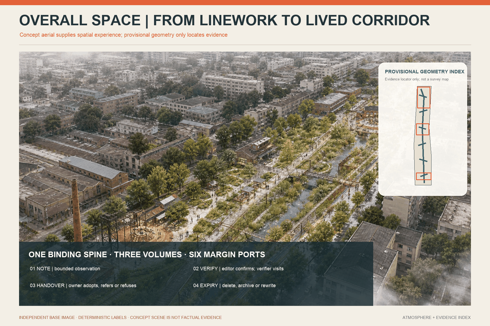

## Design Basis and Source Inventory

The official announcement establishes the 43.6 km² research scope, roughly 11.4 km² overall design scope, three key areas and deliverable context. The Agent taskbook establishes three positionings, five functions, three areas/two wings and six mandatory tasks [source:OFFICIAL-ANNOUNCEMENT] [source:AGENT-TASKBOOK]. Open co-creation is not an approved plan.

The cleared repository still lacks official SITE_BOUNDARY and KEY_AREA polygons, road redlines, an existing-building survey, heritage controls, municipal capacity and statutory planning conditions. The package retains the maintainer-provided provisional rough polygons. The current 11.41 km² calculation supports internal consistency only [source:BOUNDARY-SOURCE] [data:geometry/site_boundary.geojson#SITE-001] [metric:site_area_sqm]. Every precision-sensitive layer must be regenerated when official data arrive.

## Core Judgement and Independent Mechanism

The spatial grammar is **one Binding Line, three Volumes, twelve Loose-leaf Pages, six Marginalia Ports, three Version Landmarks, and two evidence/editorial wings**. The Jing-Zhang heritage park direction binds the sequence. Zhongzhiyuan is a Condition Book; AI Origin is an Everyday Book; Dazhongsi is a Handover Book. The six ports are staffed corners borrowed inside existing public-facing spaces, not six new buildings. The Blank First Page, Polyphonic Table and Handover Spine make unknowns, disagreement and responsibility visible.

This is not a Personal Agent, infinite chat, permanent digital twin or automated plebiscite. It is a finite route from a person to a place and back to an accountable owner [depth:overall_spatial_structure].

## Three-level Scope Framework

The research scope asks how local knowledge can become public infrastructure for an AI ecosystem. The overall design scope embeds that knowledge flow in spatial links and renewal sequence. The three key areas test three different questions. The overall model shows a binding line, cross-links, functional leaves and small civic interfaces; the key-area work stays reversible inside provisional envelopes [depth:three_level_scope_framework] [data:geometry/key_areas.geojson#PROV-KEY-001].

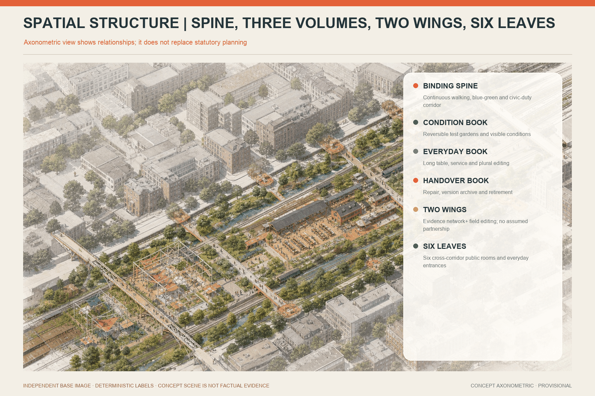

## Research Scope: Industry and Future-city Strategy

An innovation ecosystem needs more than firms and compute. It needs paid community editors, spatial translators, field verifiers, accessible/multilingual editors, model-card and data-inventory stewards, and handover archivists. Frontline expertise is paid work, not volunteer data extraction. UK ATRS, Decidim and Helsinki Testbed contribute bounded mechanisms—public records, traceable process and small real-city trials—not legal or spatial templates for Beijing [source:CASE-UK-ATRS] [source:CASE-DECIDIM] [source:CASE-HELSINKI-TESTBED].

### Eight external references: transfer a mechanism, never a local fact

| Reference | Transferable mechanism | Living Manual translation | Explicit non-transfer |
|---|---|---|---|
| UK ATRS [source:CASE-UK-ATRS] | Fixed public fields for purpose, owner and impact | A Condition Book page before any AI trial | Not proof of Beijing legal compliance |
| AI Verify [source:CASE-AI-VERIFY] | Process governance paired with technical tests | Test output, fallback, field risk and documentation together | Not certification or a safety guarantee |
| Dutch Algorithm Register [source:CASE-DUTCH-ALGORITHM-REGISTER] | Public catalogue of systems, purposes and owners | Handover Spine versions, ownership and stop state | Not a presumed local registration duty |
| Decidim [source:CASE-DECIDIM] | Traceable online/offline participation | Paper, speech, physical wall and offline page share one page ID | Participation count is not representation or consensus |
| Helsinki Testbed [source:CASE-HELSINKI-TESTBED] | Bounded tests in real settings | Two sites, three cases, no-AI baseline and public closeout | No transfer of procurement, data, budget or performance |
| Boston CityScore [source:CASE-BOSTON-CITYSCORE] | Longitudinal review rather than launch-only reporting | Expiry, handover, withdrawal and unresolved-work measures | No imported composite score, weight or target |
| one-north [source:CASE-ONE-NORTH] | Research, enterprise, learning and living considered together | Condition, Everyday and Handover services around real consequences | No imported land, leasing or investment regime |
| Barcelona / 22@ context [source:CASE-BARCELONA-22AT] | Knowledge transfer connected to district renewal | Evidence and field-editing wings support local services | No imported development rights, ratios or claimed outcomes |

Together they support a combined record–test–participation–operation–space approach, but none supplies site facts for Jing-Zhang. The local ecosystem is therefore organised around six handover capabilities: editing, field verification, bounded technical testing, accountable action, rights administration and version handover. Talent success is not only developer attraction; it includes paid frontline roles, developers able to declare limits, public owners receiving fewer duplicate reports, and failed services being closed safely.

### Regional cooperation loop: five invitation interfaces, not five partnership claims

The taskbook names Beiwei Community, Future Science City, Huairou Science City, Beijing E-Town and Beijing-Tianjin-Hebei, but the supplied public material contains no cooperation agreement, named counterpart, shareable dataset, budget, site or exchange programme [source:AGENT-TASKBOOK]. The diagram is therefore a set of **interfaces awaiting invitation, evidence and authorisation**, not an existing network. A redacted Condition or Test page leaves Jing-Zhang; a counterpart may accept, decline or state that it cannot verify the question; any response returns to the original page with its scope and limits. Zhongzhiyuan hosts conditions and test entry, AI Origin hosts everyday editing, and Dazhongsi hosts version handover. The Zhongguancun Technology Service Wing supports standards, rights and professional referral; the Xiaoyue River Scenario Enablement Wing supports field observation, walk-throughs and maintenance feedback. These wings are conceptual responsibility groupings, not established organisations.

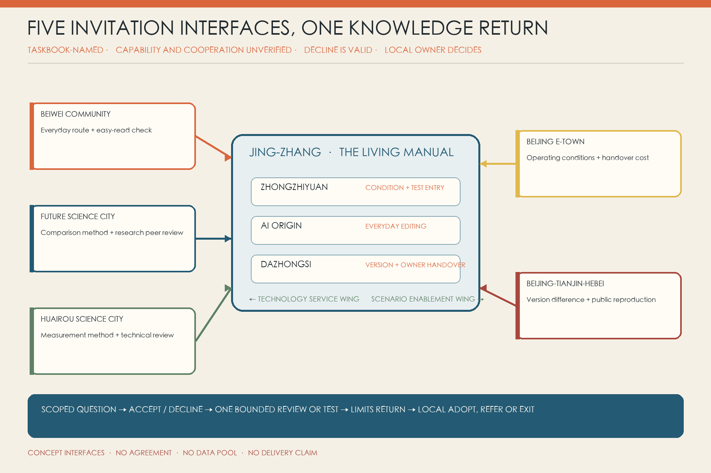

| Interface awaiting invitation | Proposed knowledge / test / talent exchange | Trigger and minimum input | Responsibility and verifiable output | Exit and non-commitment boundary |
|---|---|---|---|---|
| Beiwei Community | Local proofreading of community-service touchpoints, everyday routes and easy-read wording; one paid local verifier for one walk-through | A page affects everyday community use, with site-owner consent; redacted page, place scope and question only | Jing-Zhang pilot owner A; invited community interface C; dated confirm / disagree / unable-to-verify note | One participation is not resident consensus; no persistent profile; no named interface or payment means no start |
| Future Science City | Peer review of comparison design, no-AI baseline and a time-bounded researcher exchange; no unredacted source data | Scenario has passed safety/privacy pre-review and has a reproducible test card | Jing-Zhang scenario owner A; invited method reviewer C; scoped method note and unresolved-question list | No claim of joint lab, certification or talent programme; decline or non-fit closes the request |
| Huairou Science City | One technical feasibility review of sensing, measurement or field-validation method; talent appears only as a named short-term advisory seat | A real measurement question exists and manual methods are insufficient; equipment list, metric definition and stop threshold | Jing-Zhang technical lead R; invited technical reviewer C; written measurable / not measurable / more evidence needed decision | No presumed equipment, site or expert availability; exchange never replaces procurement, safety review or professional sign-off |
| Beijing E-Town | Translate a tested scenario into operating, maintenance and enterprise-service conditions; invite an operator to test handover cost | Scenario has a no-AI comparison and local owner; redacted result, maintenance conditions and failure log | Jing-Zhang action owner A; invited operations reviewer C; one-page operating conditions, gaps and accept / decline reason | No investment, procurement, tenancy or demonstration status; no enterprise referral without a real maintenance owner |
| Beijing-Tianjin-Hebei | Compare fields, stop rules and public wording across local versions; one cross-place same-question review or public reproduction | Both places can publish method and limits after legal, data and language checks | Each place owns its local version; difference table, reusable fields and explicit non-transfer items | No cross-region raw-data pool and no regional inference from one place; exchange stops if either party cannot honour withdrawal |

Every arrow uses the same loop: `Jing-Zhang frames a scoped question -> counterpart accepts or declines -> one bounded review/test -> differences and limits return -> local owner adopts, refers or exits`. The present evidence state for all five interfaces is “named by the taskbook; cooperation and capability not verified”. Until a public source, counterpart confirmation and named responsibility exist, the proposal will not use “partnered”, “co-built”, “landed” or “regional impact”.

## Overall Design Scope: Renewal and Detailed-planning Depth

Six diagonal “leaves” cover the provisional boundary without overlap, using existing land-use codes for R&D, education, community service, innovation services, culture/memory and adaptive reserve. They are a functional model, not statutory parcels [data:geometry/land_use.geojson#LU-LM-01] [standard:MNR-LAND-USE-CLASSIFICATION-GUIDE].

## Land Use, Building Scale and Retain/Adapt/Remove

The sequence is human-first: continuous accessible movement, shade, seats, physical guidance and staffed help; then two borrowed 12–20 sqm pilot corners; only then removable technology that has demonstrated value. The buildings layer contains only three approximately 18 × 12 m **reference envelopes** to test adjacency, not new committed floor area or actual rooms [data:geometry/buildings.geojson#BLDG-LM-01] [metric:reference_prototype_count].

FAR, height, density, setbacks, road redlines, fire, drainage, flood, energy, network, heritage and ownership remain unknown. Retain/adapt/remove is therefore a decision gate only: first investigate retention; prefer accessible ground-floor opening and reversible interiors where sufficient; consider removal only after professional safety, carbon, heritage, ownership and community-impact review [standard:MOHURD-CONTROL-DETAILED-PLANNING] [depth:retain_renovate_demolish].

The six land-use leaves share the provisional outer boundary, cover it completely and do not overlap; their areas support internal recalculation only. Official planning polygons must replace the whole layer when supplied, rather than making the present diagonal edges look falsely precise [data:geometry/land_use.geojson#LU-LM-01]. The six Marginalia Ports and three landmark forecourts are small service extents, not building area. The three reference envelopes are 216 sqm each, 648 sqm in total [metric:building_footprint_area_sqm]. Real pilots still prefer two borrowed 12–20 sqm interior corners. Without an existing-building survey, no real building is labelled retain, adapt or remove, and no investment or construction quantity is inferred.

## Detailed Design for Three Key Areas

The three areas hold different duties—conditions, everyday editing and handover—rather than reproducing one generic “AI district” template [depth:three_key_area_detailed_design] [data:geometry/key_areas.geojson#PROV-KEY-001].

**Zhongzhiyuan — Condition Book / Blank First Page.** A team first publishes what a system does not know: purpose, users, exclusions, data boundary, human fallback, failure signs and exit date. A borrowed explanation desk and a 1:1 low-impact test strip support accessible-route, public-navigation and low-speed robot trials.

**AI Origin — Everyday Book / Polyphonic Table.** The same route is annotated at morning peak, noon, evening and after rain. Conflict is preserved rather than voted away: a courier needs speed, residents need quiet, wheelchair users need continuity, and gate staff need an executable rule.

**Dazhongsi — Handover Book / Handover Spine.** Maintainers, station staff, small shops and the next design team record how to repair, who takes over and when to retire a version. Version numbers, adoption/refusal reasons and stop decisions replace the usual success-only showcase.

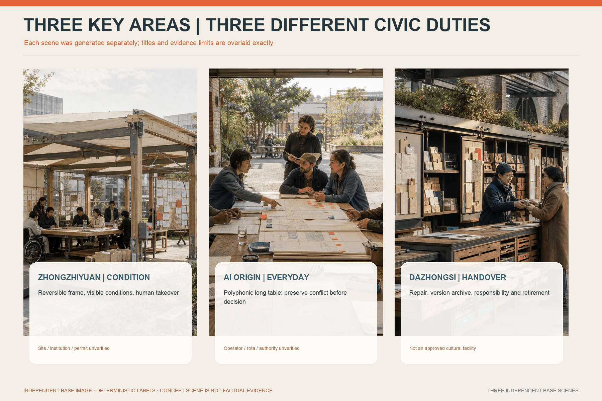

## AI Ecosystem, Personas and AI+ Scenarios

### Six People, Twelve Scenario Pages and Three Industry Tests

The six people are explicitly synthetic probes: an older carer, wheelchair commuter, courier, maintenance worker, small-shop operator and an international student/developer with limited Chinese. They reveal blind spots but do not represent demographic shares or public authorisation [metric:synthetic_persona_count].

| Synthetic probe | Situated knowledge | Service condition | Forbidden inference |
|---|---|---|---|
| Older carer | steps, seats, slow explanations and caring-route interruptions | paper route, seated staffed help, large/easy-read text | no inference about digital ability, health, family or eligibility |
| Wheelchair commuter | lift operation, occupied ramps, kerbs and real continuity | field-checked equivalent route and accessibility sign-off | one route problem does not represent all disabled people |
| Courier | time-specific gates, enforced rules and risky detours | paid sessions, anonymous rule page and performance-data separation | no platform-performance use or individual blame for site rules |
| Maintenance worker | recurring faults, replaceability and workable shutdown windows | material handover, paid time and right to reject unsafe work | no free knowledge extraction or public employment-sensitive quote |
| Small-shop operator | footfall, delivery, noise and service thresholds together | easy-read criteria, human referral and advance works notice | no AI eligibility decision or claim of district-wide business consensus |
| International student/developer | multilingual drift and misunderstood local rules | bilingual terms, source links, human explanation and exit boundary | no nationality, language or developer identity as risk/commercial label |

Real pilots store a scoped contributor role only when useful; they do not create persistent persona profiles. Names are blank by default. A contributor may choose a one-time query code, a contact route or no follow-up. The probes themselves must be removable and revisable after real co-design.

| Page | Field action and narrow AI task | Human owner, expiry and stop |
|---|---|---|
| 01 Rain route | Verify water, steps, barriers and today's alternative; AI merges repeats into a watermarked draft | site/drainage owner issues route; weather/works expire it; no same-day check means no navigation |
| 02 Lift/access outage | Check lift, slope, kerb, width and detour; AI translates notices and diffs versions | accessibility specialist confirms equivalent route; unknown lift state stops the draft |
| 03 Courier gate | Record time and enforced rule without order/performance data; AI de-duplicates anonymous notes | site owner aligns gate staff and signs; no staff sign-off means no publication |
| 04 Night lighting | Observe darkness, glare, obstruction and residential impact; AI structures test points | lighting/safety staff measure and decide; conflict uses reversible trials first |
| 05 Shade and wait | Observe seats, shade, queues, care and wheelchair pause without tracking | public-realm owner selects sites; no maintenance/watering owner means no high-care object |
| 06 Care route | Walk one whole service journey; AI drafts bilingual/easy-read steps | staffed service helps now; health, family and child material enters a restricted queue |
| 07 Offline service | Complete a task without phone, account or stable network; AI orders materials | human window completes service; AI never determines eligibility; broken offline route stops the digital claim |
| 08 Maintenance material | Compare replacement, spares, cleaning, safety and shutdown; AI diffs versions | maintainer signs conditions and may refuse unsafe work; no paid time means no targeted collection |
| 09 Robot yielding | Log near misses, blind areas and takeover in a bounded strip; AI performs preliminary classification | safety officer controls emergency stop and restart; collision or failed takeover stops operation |
| 10 Plural history | Place archive, memory, maintenance record and guide text side by side; AI links and flags conflict | archive/community editor preserves plurality; unclear rights or private trauma stays non-public |
| 11 Small-shop threshold | Test a real, redacted service journey; AI rewrites criteria in plain language | responsible department explains eligibility; stale source or no human check removes the page |
| 12 Edge energy | Meter use, heat, noise, faults and used functions; AI compares energy per version | facilities owner closes/replaces; no metering, maintenance, fire or safe isolation means no installation |

Every page header carries page ID, version, place/time scope, risk, state and expiry. The body separates observation, contributor-confirmed summary, disagreement, field check, owner decision and human alternative. The footer carries withdrawal, redaction and next-review records [metric:scenario_page_count].

Three first trials include a no-AI baseline: accessible routing compares paper/human routing against an AI draft; low-speed robots compare manual near-miss logs against AI classification under a human safety stop; public-service navigation compares human document sorting against AI summaries for error, takeover time and missed language. If AI fails to reduce repetition or improve readability—or increases verification burden—the model is removed [standard:PROJECT-AGENT-OPEN-CALL-TASKBOOK].

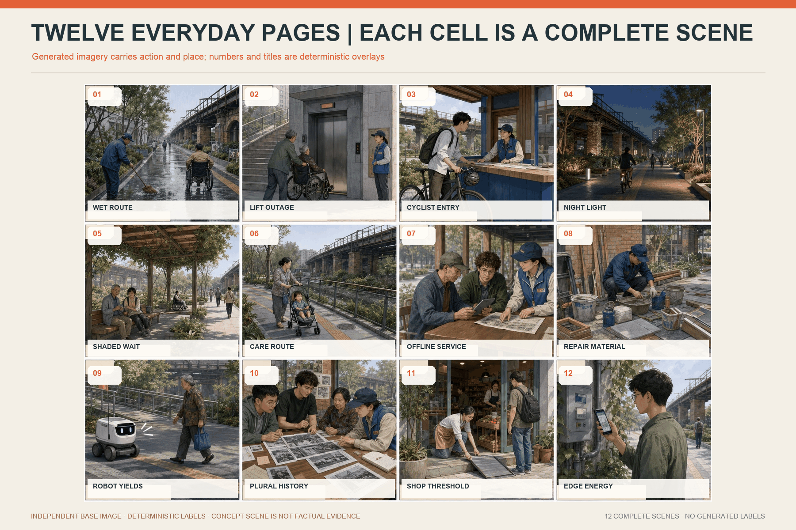

## From Marginal Note to City Action

A record moves through **personal observation (unverified) → repeated observation → field confirmed → professional finding → decision/action → expiry review**. AI can never promote a state. The contributor chooses public, team-only or referral-only consent; confirms the summary; a verifier visits; the owner adopts, refers or refuses with reasons. A withdrawal code propagates to working copies, the public page, search index and future-training exclusion list. Records that cannot legally be erased must be disclosed before collection.

At 12:20 a courier writes, on paper, “the map says the north gate is open, but staff sent me away.” No name, order or platform account is required; the card says courier / lunchtime / team-only. A paid editor drafts: “On weekdays 12:00–13:00, public wayfinding and gate practice may differ.” The courier removes the word “always” and confirms the meaning. AI only finds three notes at the same gate and warns that their dates and times differ.

The next day, a Field Verifier walks the mapped gate, used gate and accessible route, separating public sign, written rule, on-shift practice and physical path. The site owner is Accountable; the facilities/service owner is Responsible for aligning a reversible sign and staff brief—or explaining a safety reason and the actual entrance. A query code returns the outcome without creating a permanent account. If anyone requires order history, continuous location or platform identity, the page stops and enters privacy review.

Withdrawal is a propagation workflow, not a hidden web button. The Data Administrator freezes reuse; removes or de-identifies the restricted observation; takes down the public summary; refreshes search; notifies action owners who received it; and adds the page to a future-training exclusion list. The log records which copy was handled, not the withdrawn text. Any legally required record that cannot be erased must disclose its content, term, access and correction route before collection. If copies cannot be inventoried, a supplier cannot honour exclusion, or third-party propagation cannot be controlled, that data type does not enter the pilot [source:CASE-UK-ATRS] [depth:risk_missing_data].

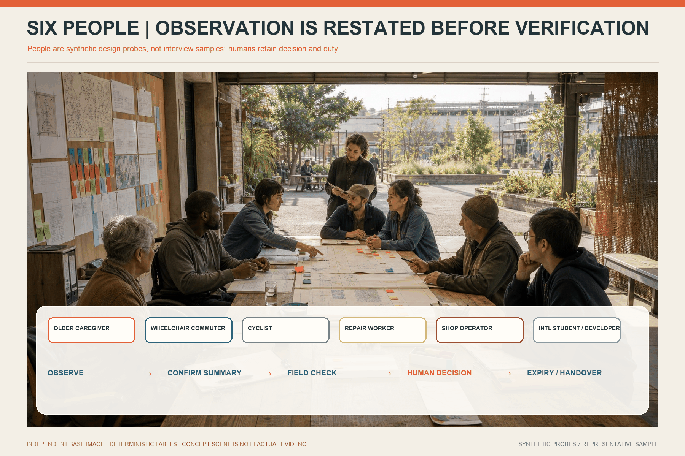

## Mobility, Rail, Municipal and Public Services

The Binding Line connects the narrative sequence of the three areas; six cross-links face campuses, neighbourhoods, workplaces and transit. They indicate walking intentions, not existing roads, parking supply, rail interfaces or engineering alignments [data:geometry/roads.geojson#ROAD-LM-01]. Edge equipment must be metered, switchable and replaceable; energy, drainage, flood, fire, utility, noise and cyber conditions remain professional gates. Medical, legal and public-service judgement stays with qualified people.

The 12 m reference section checks only whether rain buffering, continuous walking, sitting, cycling and planting can coexist; it is not a uniform corridor width. Detailed design waits for right-of-way, junction, rail entrance, bus, parking, fire, loading, accessibility-gradient and peak-flow data, and proposes no lane removal or fixed interchange works while those data are missing. Every digital route keeps an equivalent paper map, physical sign or staffed question point usable that day; lift, works and flooding changes come from field verification, never model inference [depth:traffic_rail_slow_parking].

Public service uses risk triage: ordinary spatial notes enter a capacity-limited editing queue, while immediate safety, medical, legal, child-protection and social-support matters go directly to existing emergency or professional routes. A Marginalia Port must show staffed hours, accessible contact, emergency numbers and closed status in the same sightline. Municipal/digital equipment receives scenario-level switches, energy records, maintenance ownership and exit dates; if no facilities owner can be named or safe isolation is impossible, no sensor, screen or edge compute is installed [depth:municipal_new_infrastructure].

## Blue-green Space, Public Realm and Urban Character

The green spine provides shade, rain gardens, rest and low-glare night conditions. The conceptual green ratio is 3.48% and public-space ratio 0.030%; both are provisional model outputs [metric:green_ratio] [metric:public_space_ratio].

Each Marginalia Port needs a two-sided table, backed seating, wheelchair turning, paper/large-print/easy-read/Chinese-English materials, a locked drop, staffed hours and urgent-service routes. When no one is present, no screen pretends to be a human service.

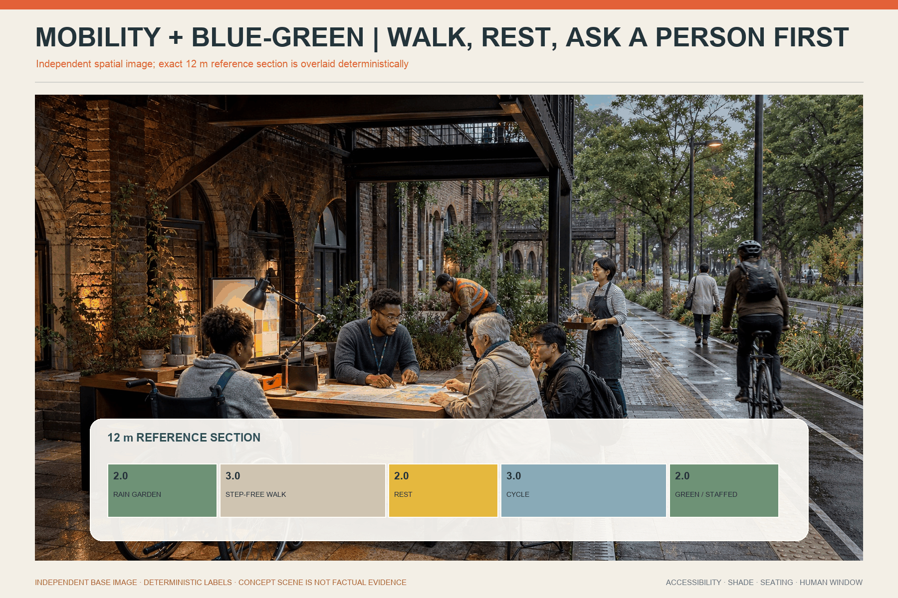

## Data, AI and Representation Boundaries

AI is limited to seven tasks: **transcription, translation, de-duplication, clustering, structured drafting, routing and version diff**. It does not determine truth, service priority, eligibility, resource allocation, medicine, law or planning. It is never Accountable or Responsible in RACI.

Minimum fields include page ID, time/place scope, optional contributor role, consent tier, restricted observation, confirmed summary, disagreement, field check, owner, state, risk tier, expiry, withdrawal code, redaction log and version hash. Audio/video, continuous location and identity are off by default; the public page contains redacted summaries only. Third-party, health, child, security, defamation or employment material enters a restricted human queue.

Public consent exposes only a contributor-confirmed, editor-redacted structured summary. Team-only permits time-limited source text inside the editing/verification workspace. Referral-only sends necessary facts to a responsible service while the public ledger shows status only. Consent can be narrowed or withdrawn, never widened by the operator. Spoken input is read back as text; recording is not the default.

Ordinary spatial notes enter a capacity-limited routine queue. Accessibility disruption with an available alternative is prioritised. Immediate safety, health, law, child protection and social-support needs use existing professional or emergency referrals rather than the editing queue. Third-party, employment, defamation, security and sensitive material enters restricted review. Each queue publishes capacity, closure and escalation. When capacity is reached, collection pauses; AI must not send a reply that pretends an item has been accepted.

Before Gate 0 closes, every field must state necessity, reader, storage, term, withdrawal, export, deletion, model use and supplier access. Name, government ID, face, voiceprint, continuous location, order, health, family and advertising identifiers stay outside the default inventory. If one-time contact is required, it is separated from the observation and deleted at closure. Small samples are not ranked by street or treated as majority opinion.

The six probes are not “resident representatives”. Real pilots use participant seats, transparent recruitment, coverage gaps, payment, withdrawal and complaints. Targeted frontline participation does not begin without paid time, workload limits and a credit/anonymity/licence choice [depth:risk_missing_data].

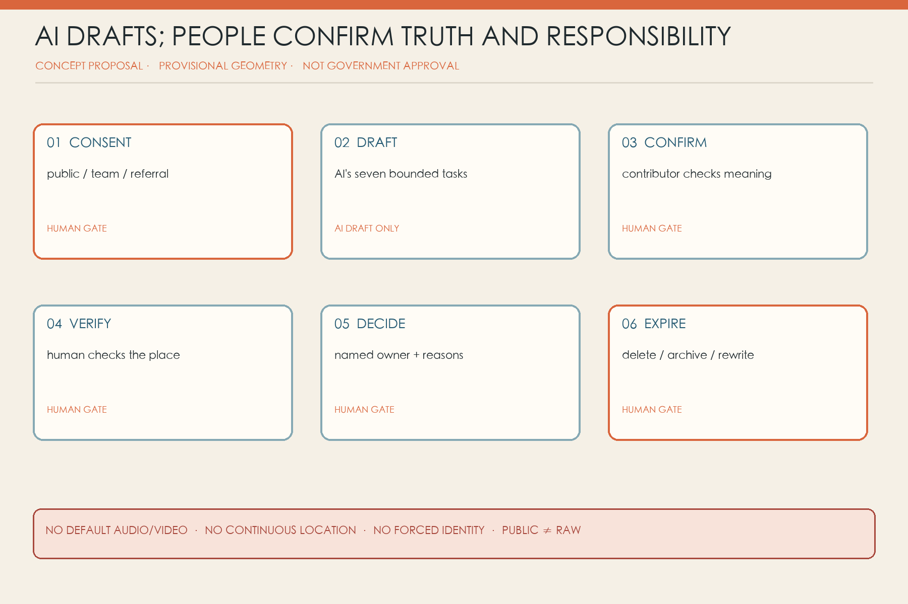

## Project List, Responsibility and Phasing

Eight actions are options, not capital commitments: protocol; two borrowed ports; Binding Line accessibility audit; three volume prototypes; twelve scenario cards; version/withdrawal register; paid editor/verifier roles; public closeout and handover.

| ID | Minimum deliverable | Pass condition | Stop / do not claim |
|---|---|---|---|
| LM-01 Page protocol | bilingual/easy-read card, three consent tiers, states, queues and expiry | contributor can correct the summary; paper and digital states agree | no use with forced identity, default recording or failed withdrawal |
| LM-02 Two borrowed ports | two accessible 12–20 sqm corners, table, seats, signs, locked drop and staffed hours | a person without a phone receives help in the visit | no collection without durable staffing and referral routes |
| LM-03 Binding Line audit | time/weather walks for barriers, shade, rest and gates | at least two executable small fixes are handed over | no road, rail or parking engineering claims without source data |
| LM-04 Three volume prototypes | one reversible 1:1 Condition, Polyphonic and Handover interface | each produces different evidence and responsibility | stop if reduced to screen, exhibition or photo opportunity |
| LM-05 Twelve cards | problem, narrow AI task, human owner, no-AI baseline, expiry and stop | three first trials compare workload, error and takeover | no high-risk open-population decision or trial without emergency stop |
| LM-06 Version/withdrawal register | layered ledger, redaction log, expiry and exclusion list | a sampled page can be withdrawn across controlled copies | no data class with unknown copies or non-cooperating supplier |
| LM-07 Paid roles | editor/verifier job scope, hours, cover and complaints | listening, field work and contributor confirmation have funded time | no pilot dependent on volunteers, interns or unpaid frontline work |
| LM-08 Public closeout | adopted/referred/refused/withdrawn/expired/unresolved list and next owner | two small actions handed over; failure and stopping are visible | no “success” based only on event attendance or positive comments |

Governance projects LM-01, LM-06 and LM-07 precede collection. LM-02 and LM-03 establish human access. LM-04 and LM-05 test design and industry. LM-08 is defined on day one because a pilot that cannot end responsibly is not ready to begin. Phasing geometry shows conditional intervention envelopes, not investment parcels [data:geometry/phasing.geojson#PHASE-LM-01].

The named public/service owner is Accountable. A paid Community Editor is Responsible for listening and summary confirmation. A Spatial Translator/Field Verifier is Responsible for place facts. The relevant maintenance/service owner is Responsible for adoption, referral or refusal. Privacy, accessibility, heritage and safety specialists are Consulted. Contributors and the public are Informed. AI holds no R/A role.

Accountability changes by state: the pilot owner is accountable for collection; a qualified spatial/facilities body for field findings; the budget-and-authority holder for action; and the data controller for withdrawal. An editor cannot promise work on behalf of an owner without authority. Every page displays the current public role, not a personal mobile number. Capacity is also public: staffed hours, remaining routine capacity, priority/referral availability and the next editing meeting. Two consecutive backlog weeks, two missed human-service commitments or one serious safety/privacy event trigger pause and independent review.

Gate 0 confirms owner, sites, paid roles, privacy/access review and referral routes. Gate 1 prepares two sites and three low-risk scenarios for eight weeks. Gate 2 runs a 12-week pilot with no-AI baselines. Gate 3 closes publicly for four weeks. Extension requires traceable handovers, at least two closed small actions, working withdrawal and a queue below capacity [data:geometry/phasing.geojson#PHASE-LM-01] [depth:phasing_implementation].

Hard stops: no named Accountable owner; no paid editor/verifier; sensitive raw data required by default; forced identity/tracking; disagreement erased; no field check; no human or professional route; safety incident; queue beyond published capacity; no action/referral owner.

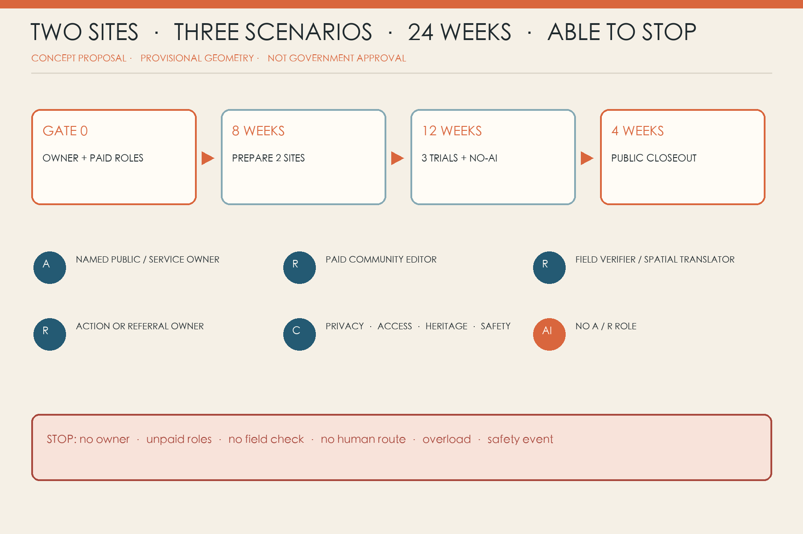

## Metrics, Recalculation and Compliance

The same GeoJSON recomputes 11,412,825 sqm of provisional site, 396,604 sqm of conceptual green, 3,477 sqm across nine small civic pockets and 648 sqm across three reference envelopes. Counts of six ports, three landmarks, twelve pages and three key areas are machine-checkable [metric:marginalia_port_count] [metric:landmark_count].

Real pilot metrics are deliberately blank until observed: contributor corrections to AI summaries, verification time, risk-tier backlog, completed handovers, adoption/referral/refusal, withdrawal propagation, AI versus no-AI workload and expiry deletion. The package never invents satisfaction, representativeness or impact [depth:metrics_recalculation].

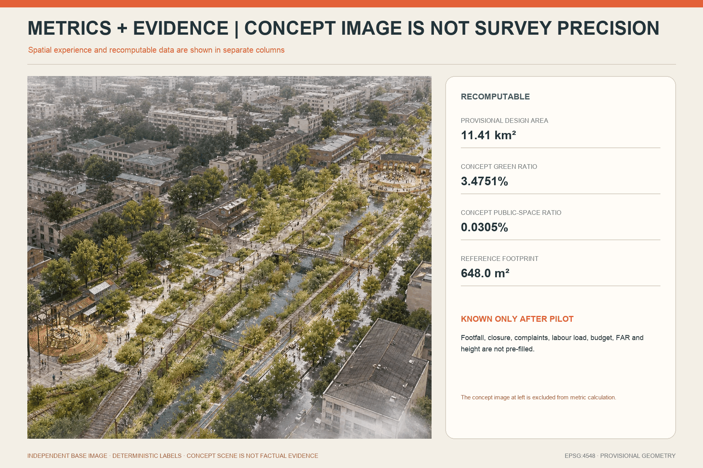

## Naming, Visual Identity and Long-term Operation

The neutral mark combines a deep-blue spine, an orange marginal note and an open bracket. Condition Book, Everyday Book and Handover Book are the three volume names; physical service points are Marginalia Ports. Corporate logos, identifiable people, invented screen data and command-centre imagery are excluded.

### Agent.6 annual operations and non-commitment conversion matrix

These activities are not demo showcases. Each begins with responsibility, budget, capacity, verifiable output and a stop rule; attendance can never be counted as partnership, employment, investment or planning delivery. The annual programme starts only after the 24-week pilot completes Gate 3, withdrawal audit works and the next-year owner is named [standard:PROJECT-AGENT-OPEN-CALL-TASKBOOK].

| Activity brand | Cadence / trigger | Participants and responsible role | Minimum input | Verifiable output | Capacity and stop condition |
|---|---|---|---|---|---|
| City Proofreading Week | Annual; at least two versions have completed expiry review and a named owner agrees in writing to host | Contributors, maintainers, service owners, students and developers; pilot owner A, operations producer R, paid Community Editor R | Redacted version log and adopted / referred / refused / withdrawn / expired / unresolved list | Public annual diff; every item has a role, next review date or exit reason | 60 people, 12 pages, 2 sites; stop without budget, accessible venue, completed withdrawal propagation or owner attendance |
| Maintenance Workers' Forum | Quarterly, or after three similar maintenance issues; paid time confirmed first | Frontline maintainers, facilities, material and safety advisers; facilities owner A, paid maintainer-moderator R | Three redacted fault pages, material samples, shutdown window and safety boundary | Three maintenance-condition cards ending in work order, professional referral or reasoned non-adoption | 12 paid contributors, 3 cases; stop for unpaid extraction, unsafe task or employment-sensitive exposure |
| Multilingual Proofreading Table | At most monthly, only after a substantive public-page revision | Bilingual residents, international students/developers, professional translators and service owner; service owner A, paid language editor R | Source-linked Chinese/English master, glossary, easy-read version and applicability date | Owner-confirmed bilingual diff, unresolved-term list and publication date | 4 languages, 8 pages; do not publish without a master, paid consent/withdrawal choice, or professional review for medical/legal text |
| Accessible Walk-through | Quarterly and after a material route, works or lift-state change | Disabled users, carers, accessibility adviser and facility owner; facility owner A, paid access adviser R | Current route, equivalent alternative, temporary-works notice, weather and time | Timestamped issue sheet, same-day safe alternative and adopt / refer / refuse decision | 2 complete routes, 8 paid participants; pause public navigation in unsafe weather, without safety staff, same-day alternative or action capacity |
| Failed Version Exhibition | Twice yearly, with at least two formally closed or refused versions | Contributors, owners, designers, developers and archivist; pilot owner A, handover archivist R | Rights-cleared failure log, affected scope, repair attempts and retirement record | Up to 10 failure cards: what failed, who was affected, repair, retirement and prohibited reuse | 10 versions; stop for unclear rights, personal blame, dramatisation or a serious event not yet independently reviewed |
| Global Handover Day | Annual, after local closeout pack, English translation and non-transfer list are complete | Invited cities/labs/practitioners, local owner and translators; local owner A, bilingual handover editor R | Public redacted method, assumptions, no-AI comparison, stop decision and licence note | Downloadable handover pack, questions received, reusable fields and local adopt / do-not-adopt decision | 5 cases, 3 time zones; cancel without local-fit review, translation budget, working withdrawal, or if publicity implies a signed partnership |

Talent, developer, enterprise and institutional engagement all use the same **non-commitment path**: `participate -> bounded test -> professional referral / cooperation review -> handover or exit`. Participation proves only completion of one paid task. Passing a test applies only inside its stated conditions. Referral is not a promise of a job, procurement, investment or certification. Cooperation requires a separate decision by the body that actually controls budget, law and site access. The final state must be handover to a named role or a public exit with non-reuse terms. A community contributor enters a paid editor pool only through an open role, available budget and voluntary application; a developer enters the reuse list only after licence, safety, no-AI comparison and maintenance checks; an enterprise can deliver only after independent procurement/compliance; an external institution enters a one-off exchange only after data, credit, withdrawal and term are agreed. Anyone may stop at any step, and photographs or attendance counts cannot imply commitment.

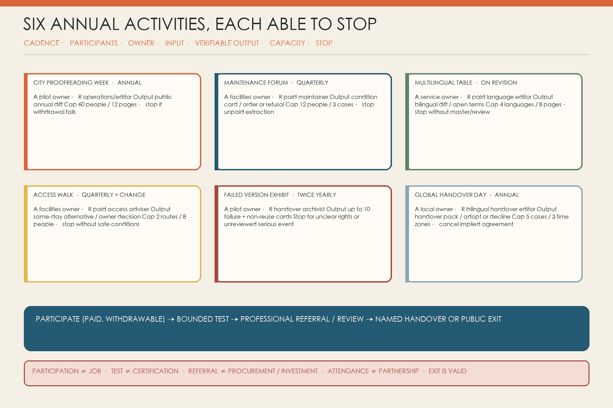

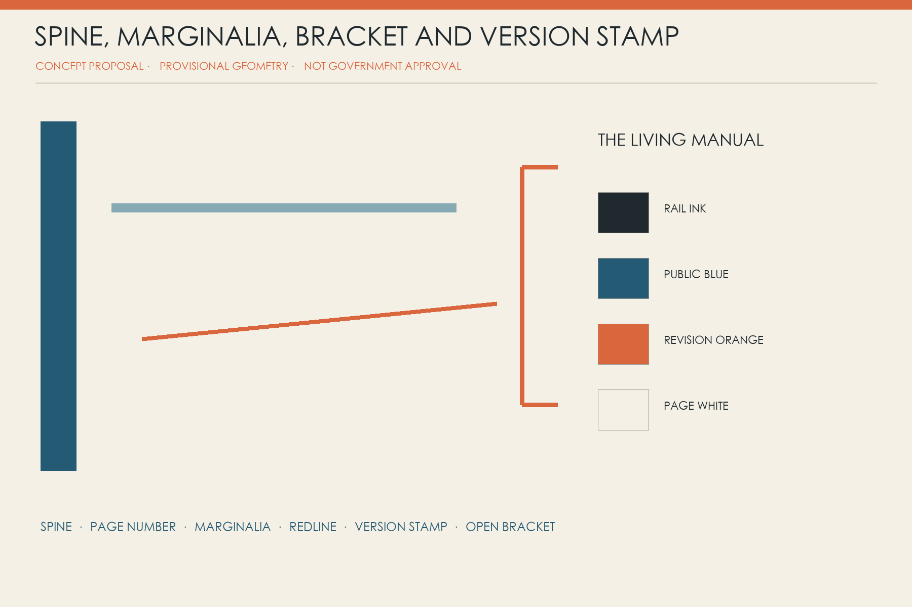

## Risk, Feasibility and Disclaimer

**A conditional small pilot is feasible; immediate corridor-wide construction is not.** Two existing spaces, paper cards, paid human editors and three low-risk scenarios can begin only after an owner, budget and referral interface exist. The largest risks are unpaid extraction, exposed personal narrative, provisional geometry presented as law and unhandled comments presented as co-governance. Each has an owner, hard stop and recalculation trigger.

This is a **concept proposal, not an approved statutory plan**. It is not government endorsement and does not replace statutory planning, engineering design, formal public participation, a data-protection impact assessment, heritage review or procurement. It promises no funding, jobs, site access, delivery date, public support or operating outcome. Provisional boundaries, functional leaves, reference section and reference envelopes exist only to explain relationships and recomputation [source:BOUNDARY-SOURCE] [standard:MOHURD-CONTROL-DETAILED-PLANNING].

Figures, people and cover are original conceptual expressions, not photographs or interviews. Peer work was used only for independence checks [source:PEER-OPEN-GATE-LINE] [source:PEER-SHARED-FLOOR]. This package does not replace statutory planning, engineering, public participation, privacy assessment or government approval.

## References

Official announcement and Agent taskbook [source:OFFICIAL-ANNOUNCEMENT] [source:AGENT-TASKBOOK]; provisional boundary, registry and fact pack [source:BOUNDARY-SOURCE] [source:SOURCE-REGISTRY]; UK ATRS, Decidim and Helsinki Testbed as bounded comparisons only [source:CASE-UK-ATRS] [source:CASE-DECIDIM] [source:CASE-HELSINKI-TESTBED]. Every adopted city action must disclose its original source, verifier, selection rationale and expiry in the version log; where privacy or rights prevent disclosure, the log states why and supplies a reviewable alternative. Full publisher, date, scope and reuse limits are in `sources.json`.
