# Urban Design for the Centennial Jing-Zhang AI Innovation Belt | Jing-Zhang Public Service Corridor

**A Spatial System for AI Public Service and Innovation Collaboration**

> This is a concept urban-design proposal. The overall design uses the organizer-supplied provisional boundary inferred from the announced textual extents and approximate area, not a statutory redline. FAR, building height, road redlines, ownership, fire safety, utilities, and investment require official evidence and professional review in the next stage.

The proposal addresses a practical question: when AI enters city life, where do residents receive service, where do technical teams work, and where can people find an accountable person when something goes wrong? Each service therefore has three connected but separate spaces. The **Public Service Entrance** provides everyday access, rest, advice, and paper-based service. The **Research and Equipment Operations Entrance** serves research, devices, data, logistics, and shutdown. A traversable **Staffed Service Area** sits between them and provides explanation, human decisions, appeals, and referral. When research or equipment operations stop, public access and staffed service remain open. Letter codes appear only in technical legends and structured data.

## 1. Design Basis and Source Inventory

The qualification announcement and project taskbook define the three geographic levels, Three Zones and Two Wings, key areas, and deliverables. Urban-design, regulatory-plan, and land-use guidance provide the professional framework. Haidian policy, AI and data-governance law, accessibility requirements, railway history, and innovation-district precedents inform the design. [source:SRC-001] [source:SRC-002] [standard:PROJECT-OFFICIAL-ANNOUNCEMENT]

The available material supports strategy and concept design, but not statutory planning or engineering conclusions. Official boundaries, planning controls, ownership, 1:500 surveys, road redlines, utility and fire capacity, heritage GIS, budgets, and named operators remain unavailable. [source:SRC-004] [source:SRC-017]

Approximate areas do not substitute for redlines, and precedent experience does not become a local fact. [depth:existing_conditions_diagnosis] [depth:risk_missing_data]

| Material | Use | Limit |
| --- | --- | --- |
| Qualification announcement and taskbook | Confirm scope, tasks, and key areas | Approximate areas do not define statutory boundaries |
| Haidian and Beijing policy material | Frame industry, public service, and regional links | Does not create parcel commitments |
| Existing AI Origin talent-service record | Identify the existing 17 human-resources services and liaison mechanism | Does not confirm co-location, referrals, expansion, or operating responsibility for this proposal |
| Urban-design, regulatory-plan, and land-use guidance | Provide a professional framework | Does not replace this project's statutory plan |
| AI, data, and accessibility law | Set data-minimization, human-service, and appeal principles | Each service still needs legal review |
| Six innovation-district precedents | Provide spatial and operating mechanisms | Performance and institutions are not copied |
| Jing-Zhang railway and heritage sources | Support the cultural route | Sites, images, and content require clearance |

## 2. Three-Level Scope Framework

The approximately 43.6 km² coordinated research area frames industrial and public service networks. The approximately 11.4 km² overall design area organizes the public service corridor, functional zones, movement, and renewal proposals. The three announced key areas, together approximately 368.4 ha, support more detailed spatial prototypes. Strategy, overall structure, and key-area design therefore use different levels of precision. [source:SRC-001] [depth:three_level_scope_framework]

The current overall-design geometry is the organizer-supplied provisional study area inferred from the announced textual extents and approximate area, and recalculates to about 1141.28 ha. It is used only to compare this design. Zhongzhiyuan and AI Origin receive site-based concept designs within provisional study areas. Dazhongsi uses verifiable station and surrounding public information for a non-georeferenced, non-boundary and non-quantitative four-quadrant concept, but the anomalous provisional area is not used as a detailed-design boundary or for station-distance, walkshed, TOD, or facility-inclusion calculations. [metric:site_area_sqm] [data:geometry/site_boundary.geojson#PROV-SITE-001] [data:geometry/key_areas.geojson#PROV-KEY-003]

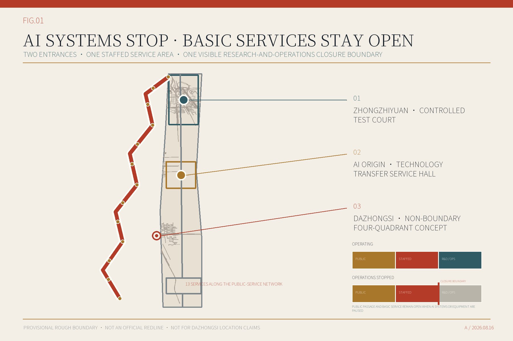

## 3. Industry and Future-City Research in the Coordinated Area

The framework combines one north-south public service corridor, site-based concept designs at Zhongzhiyuan and AI Origin, thirteen AI service scenarios, a Zhongguancun Technology Services Wing, and a Xiaoyue River Scenario Application Wing. The first connects technology, capital, legal, and talent resources; the second draws questions from community life, park maintenance, and public services. [source:SRC-015] [depth:overall_spatial_structure]

Six precedents contribute practical mechanisms: university–industry interfaces, public-interest requirements in industrial renewal, adaptable test facilities, cross-institution challenges, rule inventories, and long-term management. They are not used to forecast Haidian performance or copy another jurisdiction. [source:SRC-024] [source:SRC-029]

| Precedent | Mechanism | Use in this proposal |
| --- | --- | --- |
| MIT Kendall Square | Continuous university–industry–public-space interfaces | Place technology-transfer services, public programmes, and walking networks on one operating calendar |
| Barcelona 22@ | Industry renewal linked to public-interest obligations | Bind innovation-space supply to community services and affordability monitoring |
| LaunchPad / Kampong AI | Reconfigurable startup cluster and shared validation facilities | Use short-cycle space licences, shared equipment, and exit clauses |
| Paris-Saclay DataIA | Cross-institution research network around visible shared missions | Connect universities, firms, and public agencies through annual challenge briefs |
| Hetao Shenzhen–Hong Kong Science and Technology Innovation Cooperation Zone | Cross-boundary research collaboration and regulatory interfaces | Learn from interface inventories without copying cross-border institutions |
| Zhangjiang Science City | Long-term management capacity coordinated with research infrastructure | Create a permanent scenario office and annual review rather than one-off events |

Industry indicators are defined before they are measured. The table states a proposed statistical definition, calculation, and evidence gate. Where no official definition or auditable series exists, the value remains pending rather than being replaced by a design estimate. Statistics, science and technology, planning, and operating authorities must align the numerator, denominator, boundary, and reporting year before use. [standard:PROJECT-AGENT-OPEN-CALL-TASKBOOK] [metric:ai_innovation_index]

| Industry and city indicator | Definition or formula | Required evidence | Status |
| --- | --- | --- | --- |
| AI Innovation Index | Approved weighted score across research, firms, talent, testing, technology transfer, and public service | Official dimensions, weights, reporting year, boundary, and auditable series | Pending |
| AI talent density | Verified AI R&D and technical-service personnel / AI industry and research floor area in hectares | Aggregated employer data and a verified use-and-floor-area inventory for one year | Pending |
| AI industry output | De-duplicated annual output or operating revenue of eligible AI legal entities in the boundary | Statistical definition, entity roster, year, and auditable series | Pending |
| Enterprise cluster density | Verified active AI firms with an operating site / official area in square kilometres | Eligibility rule, operating addresses, active status, and official polygon | Pending |
| AI industry space scale and share | Eligible research, testing, incubation, and service floor area; divided by total regional floor area | Building use, tenancy, rights, and floor-area survey | Pending |
| Live-work and service completeness | Share of work, housing, daily service, learning, and recreation reachable within an agreed walking time | Entrances, hours, capacity, and verified accessible walking network | Pending |

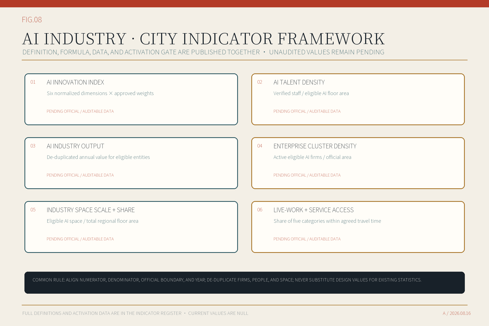

The spatial rule can be stated plainly: the public and technical teams use different entrances; queues and equipment logistics stay separate; the staffed service area remains traversable; the same matter receives the same accountable role and appeal route on both sides; and technical work can close without closing public service. Independent street frontage and address registration remain unknown until site-rights and address-management review. These rules test the concept; they do not claim exclusive ownership over two entrances or staffed service. [standard:PROJECT-AGENT-OPEN-CALL-TASKBOOK] [source:SRC-021]

The opening figure compresses the rule into one operating/stopped-state section. It asks whether public passage remains open after research and equipment operations stop, whether staffed basic service and appeal remain available, and whether equipment, logistics, and the closure boundary stay outside the public route. Non-AI continuity, human takeover, and reversible trials already appear in upstream submissions, so no first-use claim is made. The proposed distinction is the same compact two-state section applied across thirteen service records and adapted differently at Zhongzhiyuan, AI Origin, and Dazhongsi. [data:visual/assets/innovation_register.json] [source:SRC-033]

## 4. Urban Renewal and Regulatory-Plan-Level Urban Design

Six proposed functional areas organize the proposal and cover five land-use classes: commercial and business service land, community service facilities, cultural use, research use, and park green space. Commercial and business service land uses current MNR code `09`. [source:SRC-018] [standard:MNR-LAND-USE-CLASSIFICATION-GUIDE]

Programme roles, service roles, and land-use codes remain separate. Diagram units support comparison and composition; they do not represent statutory parcels, ownership, or development rights. [data:geometry/land_use.geojson#LU-Z01-001] [depth:land_use_layout]

Renewal starts with public space and service organization. Immediate preparation covers a public service node design guide, the Zhongzhiyuan controlled test site, AI Origin technology transfer service hall, and a public space corridor demonstration section. Culture, community service, the resource inventory, and field testing follow once preconditions are met. Every georeferenced phase feature uses a `PRJ-01` to `PRJ-08` project-register key; `PRJ-09` remains the Dazhongsi study after official evidence arrives. [data:geometry/phasing.geojson#PHASE-001] [depth:phasing_implementation]

This round addresses regulatory-plan topics conceptually; it is not an approved regulatory plan. FAR, height, statutory coverage, setbacks, road redlines, parking, utility capacity, and building-by-building actions remain pending. [standard:MOHURD-CONTROL-DETAILED-PLANNING] [depth:development_intensity_controls]

The existing-resource inventory has three layers: publicly verifiable railway-history and heritage-park context; this round's two concept designs, eight reference footprints, thirteen service spaces, and nine renewal proposals; and missing boundary, survey, building use and condition, vacancy and tenancy, ownership, heritage, road, utility, and fire-safety evidence. Renewal potential is screened as retain and maintain, repair and improve, adapt for new use, improve public realm, or replacement subject to review. Because decisive existing-condition evidence is absent, this round defines the method but does not publish a misleading parcel or building potential classification map. [metric:renewal_potential_area_sqm] [depth:existing_conditions_diagnosis]

| Renewal screening class | Evidence test | Current conclusion |
| --- | --- | --- |
| Retain and maintain | Public value, condition, and rights are verified | Method defined; no building classified |
| Repair and improve | Repairable condition plus verified safety, access, or use gap | Method defined; survey pending |
| Adapt for new use | Structure and services can support use; rights and fire review pass | Method defined; building review pending |
| Improve public realm | A measured walking, rest, or service gap exists | Concept tests at Zhongzhiyuan and AI Origin; field verification pending |
| Replacement subject to review | Public-interest case, irreparability, and planning and utility capacity are evidenced | No site-specific conclusion |

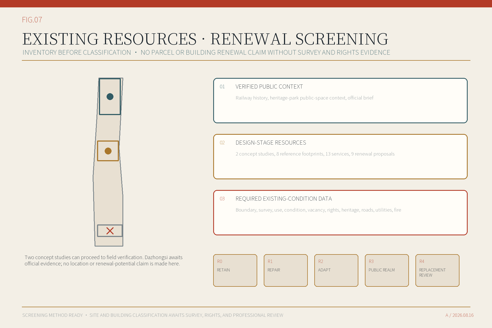

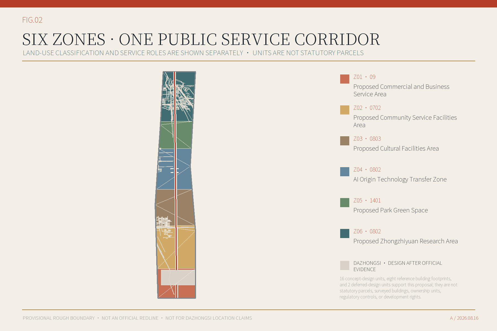

## 5. Detailed Design of Key Areas

**Zhongzhiyuan AI Independent Innovation Acceleration Area** prioritizes technical workspace. A controlled test court accommodates compute, models, agents, trusted data, and low-speed robot tests. Equipment logistics are separated from public movement. A public service entrance and observation walk face the park; a test manager and safety officer staff the passage, explain limits, handle objections, and stop unsafe activity. [data:geometry/key_areas.geojson#PROV-KEY-001] [depth:three_key_area_detailed_design]

**Beijing AI Origin Community** prioritizes technology transfer and community service. The Haidian District Human Resources and Social Security Bureau reports that a Talent Service Mobile Station already provides 17 high-frequency services, 24-hour AI inquiry support, and five city-district-town liaison officers in the community. This proposal does not duplicate those services. Subject to a written interface agreement, it uses co-location, referral, or expansion to add technology-transfer coordination, intellectual-property advice, health-service navigation, and community discussion. The campus side has a research and equipment operations entrance; the community side keeps a public service entrance that works without a phone; the staffed area between them provides explanation, referral, and appeal. Research cannot pass directly into residents' lives without explanation and choice. [source:SRC-010] [source:SRC-040] [data:geometry/key_areas.geojson#PROV-KEY-002]

**Dazhongsi AI Industry Cluster** responds to station-city integration through publicly verifiable relationships. Available records identify Dazhongsi as an interchange between metro lines 12 and 13, with existing bus access near the station; Lanjing Lijia is a verifiable nearby renewal project. [source:SRC-037] [source:SRC-038]

This round proposes a four-quadrant concept centred on the interchange and labels it “no boundary, no quantities.” A separate non-control context map uses public road, rail, and bus-stop background only to relate the four actions to the interchange setting; it supports neither measurement nor boundary-making. The northwest quadrant accommodates an international-exchange and innovation-service foyer; the northeast accommodates industry service and technology transfer; the southwest organizes continuous station–bus–crossing access; and the southeast separates cycle parking, neighbourhood service, and equipment logistics. Existing ground floors are considered for adaptive use only after survey and rights checks; shaded waiting, short rest, and accessible corners lead the public-space response. Staffed service remains separate from equipment operations, so on-site advice and basic service can continue when AI systems or equipment are paused for maintenance. Site-based plans, sections, phasing, and metrics begin only after the official boundary, survey, rights, transport, fire-safety, and accountable-entity evidence are confirmed. The diagram is not an exit-location plan and supports no area, station-distance, road-redline, or development-capacity claim. [source:SRC-005] [source:SRC-031] [source:SRC-039]

Zhongzhiyuan compares a 10 m public service interface, 8 m staffed service area, and 24 m technical-test band. AI Origin compares 14 m, 10 m, and 16 m respectively. These are comparative dimensions, not survey or construction dimensions. Survey, fire, accessibility, ownership, and operating review remain necessary. [depth:height_massing_character] [depth:retain_renovate_demolish]

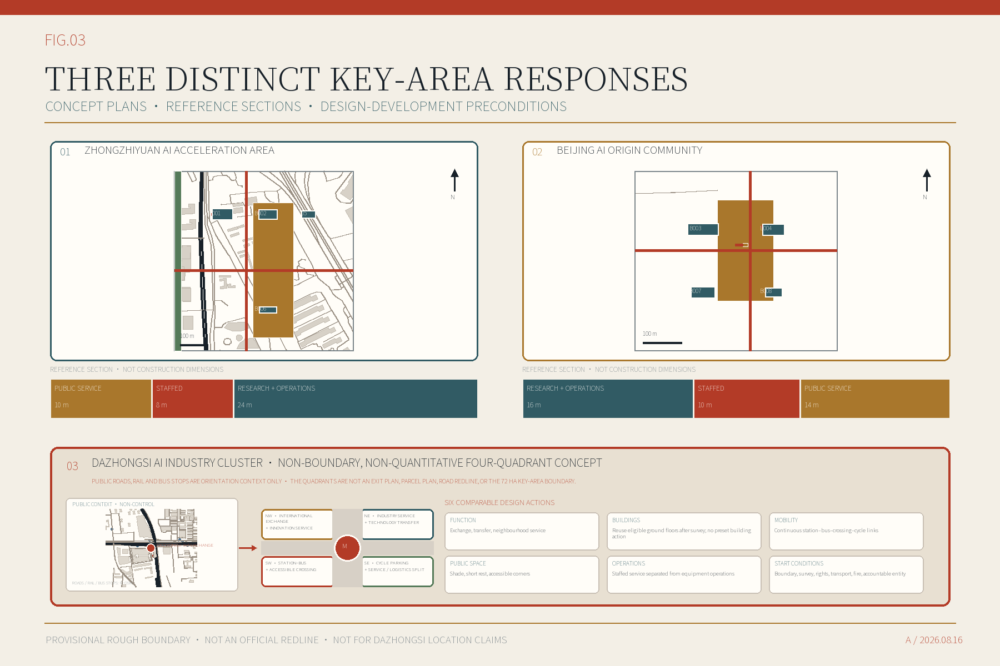

Zhongzhiyuan and AI Origin use three qualitative form controls: keep a continuous, accessible public ground floor along park and community edges; place research, testing, equipment operations, and separate logistics behind it; and break massing through courts, gaps, and roof segments. Storeys, height, setbacks, skyline, and retained buildings remain subject to planning controls, survey, heritage, and fire evidence. The diagram therefore states spatial relationships and frontage priorities rather than invented numeric controls. [depth:height_massing_character]

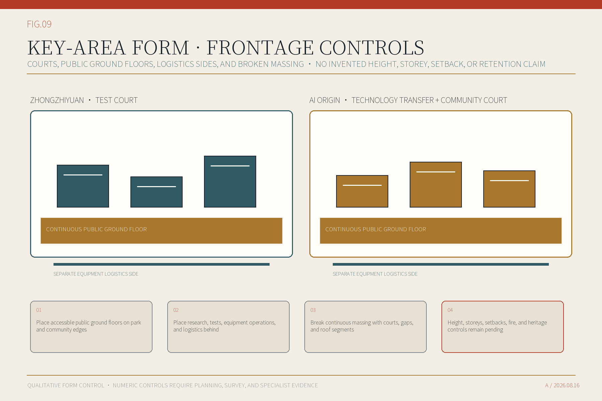

## 6. AI Innovation Ecosystem, Personas, and AI+ Scenarios

The ecosystem is a set of urban services with users, places, and accountable people, not a company list. At the research and equipment operations entrance, technical teams state their data, equipment, and stop conditions. At the public service entrance, people choose whether to use AI. Explanation, appeal, and referral take place in the staffed service area. Sensitive data is not exchanged in public space, and phones or facial recognition are not conditions of access. [standard:PROJECT-AGENT-OPEN-CALL-TASKBOOK] [source:SRC-019]

| Primary users | Needs addressed |
| --- | --- |
| Residents, older adults, and disabled users | Clear entrances, continuous access, non-phone service, and visible staff |
| Researchers, start-ups, and growing firms | Technology transfer, compute and compliance services, and controlled tests |
| Frontline operators and event staff | Clear work orders, human takeover, incident response, and equipment removal |
| Young and international visitors | Accessible learning, bilingual routes, and verifiable cultural content |
| Planning and management teams | Traceable sources, replaceable boundaries, and reviewable indicators |

These user groups come from desk research and do not substitute for local evidence. Before implementation, Zhongzhiyuan, AI Origin, and Dazhongsi each require walking and accessibility observation, interviews with frontline service staff, residents, and firms, plus field tests of paper service, staffed referral, equipment logistics, and emergency shutdown. Findings must be allowed to change entrances, opening hours, service catalogues, and stop conditions. [source:SRC-013] [depth:existing_conditions_diagnosis]

All thirteen scenarios state users, spatial type, reference dimensions, accessible clear width, queue, equipment logistics, egress, minimum data, public value, human responsibility, and a stop condition. Staffed service areas range from 60 to 288 sqm instead of repeating one template. Compute and model-usage service, trusted data and compliance, and low-speed robot testing are the three industry tests. Other scenarios address technology transfer, walking and accessibility, cultural guidance, public participation, event safety, health navigation, and urban-resource management. [data:geometry/public_space.geojson#BLDG-003-C-DSC-001] [metric:scenario_spatial_contract_coverage_ratio]

Every dimension in the table is a concept-stage reference module for checking service, queue, logistics, egress, and accessibility relationships. It is not an engineering dimension. Survey, structure, fire safety, accessibility, and operating evidence must replace it before architectural design.

| Scenario | Space type and reference size | Primary users | Risk, human responsibility, and stop rule |
| --- | --- | --- | --- |
| DSC-001 University Technology Transfer Service Desk | technology transfer service hall; 18×8 m; accessible clear width 2.4 m; Technology transfer service | Researchers and start-up teams | Commercial secrecy and recommendation bias; a technology-transfer manager confirms the service route |
| DSC-002 Compute and Model-Usage Service Desk | compute service and queue hall; 20×10 m; accessible clear width 2.4 m; Industry test | Start-ups and growing firms | Vendor lock-in and unequal resource access; an independent test manager signs off |
| DSC-003 Trusted Data and Compliance Station | trusted-data intake and review suite; 16×10 m; accessible clear width 2.0 m; Industry test | Firms and public-sector service owners | Re-identification and purpose drift; a data steward and legal reviewer approve entry |
| DSC-004 Walking-Network Break Diagnosis | streetside walking audit point; 12×6 m; accessible clear width 2.0 m; Urban diagnosis | Residents, visitors, and disabled users | Location error and sampling bias; a transport professional reviews the diagnosis |
| DSC-005 Accessible Route Companion | accessible advice and rest point; 10×6 m; accessible clear width 2.4 m; Public service | Older adults and disabled users | Out-of-date accessibility information; human advice and a non-phone route remain available |
| DSC-006 Closed-Course Low-Speed Robot Test | closed low-speed robot test court; 24×12 m; accessible clear width 2.4 m; Industry test | Robot firms and operators | Pedestrian conflict and unclear liability; a safety officer holds immediate shutdown authority |
| DSC-007 Park Maintenance Robot | park maintenance dispatch point; 14×8 m; accessible clear width 2.0 m; Urban operations | Park staff and the public | Incorrect operation and noise; operation is time-limited and staff can take over |
| DSC-008 Evidence-Backed Cultural Guide | railway interpretation and source desk; 12×8 m; accessible clear width 2.0 m; Cultural service | Residents, young people, and international visitors | Fabricated content and copyright risk; editors verify source cards before release |
| DSC-009 Community AI Living Room | community meeting and staffed service room; 18×10 m; accessible clear width 2.4 m; Public participation | Residents, older adults, and young people | Digital exclusion; offline facilitation and paper channels remain |
| DSC-010 Public Service Navigation | general public service advice point; 10×6 m; accessible clear width 2.0 m; Public service | Residents and visitors | Incorrect guidance; corridor staff confirm information and no Dazhongsi location is asserted |
| DSC-011 Event Safety Review | event safety command and review room; 18×10 m; accessible clear width 2.4 m; Urban operations | Event operators and the public | Excessive monitoring and false alarms; a human incident commander makes the final decision |
| DSC-012 AI Health-Service Navigation | health service advice and human referral room; 12×8 m; accessible clear width 2.4 m; Public service | Residents and older adults | Sensitive health data; input is minimized and escalation goes to a person |
| DSC-013 Urban Resource Data-Interface Board | urban resource catalogue and maintenance desk; 14×8 m; accessible clear width 2.0 m; Platform operation | Service owners, firms, and professional teams | Out-of-date information and unclear accountability; the asset owner performs scheduled review |

## 7. Land Use, Building Scale, and Retain-Renovate-Demolish Strategy

The land-use proposal separates current MNR classification, programme role, and service interface. Six proposed functional areas define the overall structure and cover five land-use classes; buildings and public spaces distinguish public service, staffed service, and research and equipment operations. Official boundaries, controls, and existing-building data require a new parcel and building inventory. Concept units from this round must not become an approval base map. [data:geometry/land_use.geojson#LU-Z06-001] [depth:land_use_layout]

Eight discrete reference building footprints at Zhongzhiyuan and AI Origin range from 42 to 78 m in length and 24 to 42 m in depth. They test laboratories, incubation, research, community service, and their public interfaces. Storeys, height, and total floor area remain pending. Their combined ground coverage describes the concept only and is not a statutory control. [metric:building_density] [data:geometry/buildings.geojson#BLDG-001]

Retain, renovate, demolish, and new-build decisions require building-level evidence. Retention needs structural safety and use value; renovation needs ownership, structure, and services review; demolition needs public-interest and irreparability review; new build needs planning, utilities, fire safety, and permits. No building-level conclusion is made now. [source:SRC-035] [depth:retain_renovate_demolish]

## 8. Transport, Rail, Municipal Infrastructure, and Public Services

Movement includes one north–south public service corridor, local links at Zhongzhiyuan and AI Origin, and accessible routes to thirteen services. These lines show walking and service relationships, not road redlines. Public queues, equipment logistics, egress, and research and equipment operations closure are organized separately. [data:geometry/roads.geojson#ROAD-001] [data:geometry/constraints.geojson#W-CLOSURE-DSC-001] [depth:traffic_rail_slow_parking]

Parking scale waits for transport surveys and planning controls. Low-speed robots begin in a closed Zhongzhiyuan course and do not default to open pedestrian space. Events use capacity control, temporary staffed windows, and an on-site responsible person. Every recommended route retains signs, paper information, and human alternatives. [source:SRC-020] [source:SRC-023]

Compute, networks, electricity, storage, charging, stormwater, fire safety, sanitation, and emergency communications begin as requirements, not invented capacities. The next stage needs operators to provide capacity, peaks, maintenance, and shutdown conditions. [data:geometry/constraints.geojson] [depth:municipal_new_infrastructure]

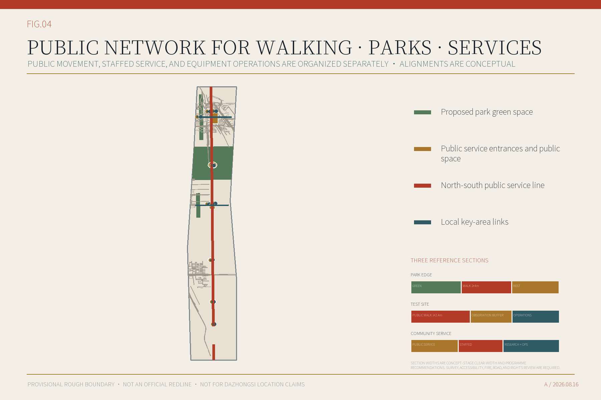

## 9. Blue-Green Network, Public Space, and Urban Character

The public service corridor links currently locatable public service entrances, with continuous walking, rest, shade, and accessibility. Research and equipment operations entrances and logistics use the other side. Recalculated inside the provisional study area, proposed green-space polygons cover about 13.11% and mapped public-space design polygons about 1.77%. The numerator in each case is the same-layer polygon union and the denominator is the provisional study area. Neither is a statutory control. [metric:green_ratio] [metric:public_space_ratio]

Seven components make the public-space proposal tangible:

| Public-space component | Purpose |
| --- | --- |
| Two-Entrance Sign | Mark the public service and research and equipment operations entrances separately while showing one task reference and status |
| Staffed Service Desk | Explain requests, receive appeals, make referrals, and provide paper service |
| Operations Closure Line | Close the research and equipment operations area while keeping public service and the staffed service area open |
| Accessible Backed Seat | Provide frequent rest, wheelchair companion seating, and non-purchase stay |
| Paper Route Rack | Keep non-phone routes, service notes, and appeal information |
| Equipment Removal Door | Keep maintenance, logistics, and retirement away from public entry |
| Information Version and Update Noticeboard | Publish information sources, update dates, pauses, and corrections |

Urban character uses three verifiable layers. The 1905-1909 Jing-Zhang railway construction history provides the engineering narrative. The heritage-park context combines an open first phase with a second phase that the Beijing municipal portal reported on 29 July 2026 as nearing completion but not yet formally open. Its later opening status remains pending an updated government notice. [source:SRC-034] [source:SRC-012] [source:SRC-011]

Official text for the former Tsinghua Garden Station identifies a heritage-control obligation. The proposal uses traceable text and spatial relationships, does not draw unavailable heritage GIS boundaries, and does not reuse uncleared historical photographs. [source:SRC-035] [source:SRC-034]

Cultural installations remain reversible and low-impact until heritage boundaries, content rights, and site rights are verified. [standard:MOHURD-URBAN-DESIGN-MEASURES] [depth:blue_green_public_space]

The public programme consists of three public-contribution displays, an annual programme, an open developer working group, a bilingual public visit route, and a six-step project conversion path. Displays focus on responsibility, sources, failure, and correction rather than firm ranking. International exchange proceeds only after content clearance, a named host, event approval, and on-site responsibility are in place. The public route does not pass through the unresolved Dazhongsi key area. [standard:PROJECT-AGENT-OPEN-CALL-TASKBOOK] [source:SRC-011]

| Output | Public content | Start condition |
| --- | --- | --- |
| Three public-contribution displays | Responsibility board, contribution table, and operating-status board | Heritage, site, content, and operating responsibility confirmed |
| Annual programme | Spring call, summer controlled tests, autumn public review, winter accountability review and exit | Named host, approval, insurance, and funding |
| Open developer working group | Maintain component versions, test protocols, licences, and failure records | Named maintainers, licences, and safety boundaries |
| Bilingual public visit route | History introduction—park service—Zhongzhiyuan observation—AI Origin service—review—online follow-up | Route, capacity, accessibility, content rights, and staff verified |
| Project conversion path | Visit—experience—review—contract—implement—follow up | Accountable role, written rights, and stop condition at every step |

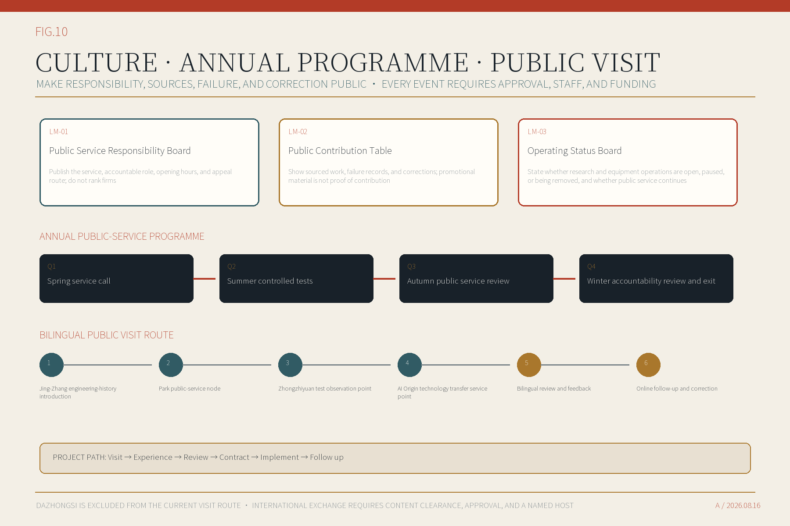

## 10. Renewal Projects, Implementation Policy, and Phasing

Nine renewal proposals are grouped into three stages. A stage describes preconditions and maturity, not a construction date. Accountable owners, site rights, funding, fire safety, utilities, insurance, and long-term operations remain unconfirmed, so every proposal is conceptual rather than activated. [data:geometry/phasing.geojson#PHASE-001] [depth:renewal_project_list]

| Renewal proposal | Stage | Main content | Start condition |
| --- | --- | --- | --- |
| PRJ-01 Public Service Node Design Guide | Immediate preparation | Plans, sections, and operating requirements for the public service entrance, research and equipment operations entrance, and staffed service area | Confirm operator, data owners, and both entrances |
| PRJ-02 Zhongzhiyuan Controlled Test Site | Immediate preparation | Controlled test areas, a public observation edge, and a staffed service area for DSC-002/003/006 | Permits, safety assessment, insurance, and professional design |
| PRJ-03 AI Origin Technology Transfer Service Center | Immediate preparation | Build on the existing Talent Service Mobile Station through referrals or co-location, adding technology transfer, intellectual-property, health-navigation, and community services without duplicating its 17 human-resources services | Written interface agreement with the existing station, plus an incremental service catalogue, operating partners, and site rights |
| PRJ-04 Public Space Corridor Demonstration Section | Immediate preparation | Continuous public service frontage, walking diagnosis, human help, and a separated equipment operations entrance | Existing-condition survey and road/green-space rights verification |
| PRJ-05 Jing-Zhang Engineering Archive Route | Expansion after preconditions | Three cultural evidence cards and reversible landmarks | Heritage GIS, content rights, and professional review |
| PRJ-06 Community AI Living-Room Network | Expansion after preconditions | Non-phone feedback, co-design, and digital literacy | Community partners, long-term staff, and accessible space |
| PRJ-07 Urban Resource Data Interface | Expansion after preconditions | Versioned inventory of space, facilities, scenarios, and accountability | Data rights, asset ownership, and agreed update timetable |
| PRJ-08 Public Service Field Test Week | Expansion after preconditions | Review the same service from its public and operations entrances and publish differences and staff decisions | Event approval, budget, insurance, and safety plan |
| PRJ-09 Dazhongsi Station-Area Walking and Public-Space Connections Study | Study after official evidence | Use verified public context for a non-boundary, non-quantitative four-quadrant concept that compares function, building action, mobility, public space, operations, and start conditions; no road redline, development capacity, or phasing geometry before the official boundary | Correct the provisional Dazhongsi study area and obtain official station, road, rights, and survey evidence |

The next table separates suggested coordination from confirmed responsibility. All lead roles remain proposals, not government or landholder commitments. Blank cost ranges are deliberate until scope, site rights, and professional design allow lawful investment and life-cycle costing.

| Project | Suggested coordination | Funding and cost status | Approval sequence |
| --- | --- | --- | --- |
| PRJ-01 | Planning and natural-resources coordination, science-and-technology service definition, and site/operator testing; actual lead roles require government confirmation | Funding class and source remain options only; no cost range or investment commitment is claimed | owner and rights—survey and professional design—costing—specialist approvals—lawful procurement or event approval—limited trial—evaluate, adjust, or exit |
| PRJ-02 | Science-and-technology coordination with the Zhongzhiyuan site-rights holder and safety reviewers; actual lead roles require government confirmation | Funding class and source remain options only; no cost range or investment commitment is claimed | owner and rights—survey and professional design—costing—specialist approvals—lawful procurement or event approval—limited trial—evaluate, adjust, or exit |
| PRJ-03 | Science-and-technology and human-resources coordination with the existing AI Origin Talent Service Mobile Station, universities, park operators, the community, and the site-rights holder; actual lead roles require government confirmation | Funding class and source remain options only; no cost range or investment commitment is claimed | owner and rights—survey and professional design—costing—specialist approvals—lawful procurement or event approval—limited trial—evaluate, adjust, or exit |
| PRJ-04 | Parks, transport, subdistrict, planning, and public-space operators according to existing management boundaries; actual lead roles require government confirmation | Funding class and source remain options only; no cost range or investment commitment is claimed | owner and rights—survey and professional design—costing—specialist approvals—lawful procurement or event approval—limited trial—evaluate, adjust, or exit |
| PRJ-05 | Culture and heritage guidance with archive and park operators; actual lead roles require government confirmation | Funding class and source remain options only; no cost range or investment commitment is claimed | owner and rights—survey and professional design—costing—specialist approvals—lawful procurement or event approval—limited trial—evaluate, adjust, or exit |
| PRJ-06 | Subdistrict and community governance with science-and-technology guidance and a long-term venue operator; actual lead roles require government confirmation | Funding class and source remain options only; no cost range or investment commitment is claimed | owner and rights—survey and professional design—costing—specialist approvals—lawful procurement or event approval—limited trial—evaluate, adjust, or exit |
| PRJ-07 | The public-data catalogue authority with each data-asset owner and security reviewer; actual lead roles require government confirmation | Funding class and source remain options only; no cost range or investment commitment is claimed | owner and rights—survey and professional design—costing—specialist approvals—lawful procurement or event approval—limited trial—evaluate, adjust, or exit |
| PRJ-08 | A named event host with the venue, public-safety, fire-safety, and subdistrict authorities; actual lead roles require government confirmation | Funding class and source remain options only; no cost range or investment commitment is claimed | owner and rights—survey and professional design—costing—specialist approvals—lawful procurement or event approval—limited trial—evaluate, adjust, or exit |
| PRJ-09 | Planning, transport, rail operations, the subdistrict, and site-rights holders after official station-area evidence arrives; actual lead roles require government confirmation | Funding class and source remain options only; no cost range or investment commitment is claimed | owner and rights—survey and professional design—costing—specialist approvals—lawful procurement or event approval—limited trial—evaluate, adjust, or exit |

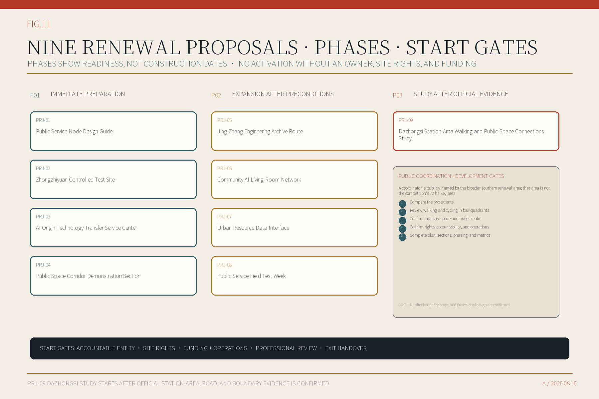

Each project records proposed coordination roles, funding options, and milestones. Planning and natural resources, science and technology, subdistricts and communities, parks, transport, culture and heritage, data management, rail operations, and site-rights holders participate according to project type; the government must determine actual lead roles. No project has a confirmed legal owner, site right, or funding source, so none can be described as activated. [source:SRC-016] [source:SRC-029]

Policy tools include short-cycle permissions, minimum-data terms, responsibility lists, insurance and incident response, public-access conditions, open results, and exit clauses. [source:SRC-016] [depth:phasing_implementation]

## 11. Metrics, Area Recalculation, and Compliance Matrix

Spatial data exchanges in EPSG:4326; area and length recalculate in EPSG:4548. Announced approximate areas, provisional calculations, and future official areas remain separate. Official boundaries require coordinated updates to land use, buildings, movement, green and public space, projects, phasing, and indicators. [metric:site_area_sqm] [depth:metrics_recalculation]

The difference between the land-use union and the provisional study area is registered with a 2 sqm topology and serialization tolerance rather than described as absolute seamless coverage. Authoritative parcel geometry must use shared-edge snapping and reduce the residual to zero. [metric:land_use_coverage_gap_sqm]

| Indicator | Current value | Meaning |
| --- | --- | --- |
| Provisional overall-design study area | 1141.28 ha | Recalculated from provisional geometry; not a statutory area |
| Proposed green-space land share within the provisional boundary | 13.11% | Green-space polygon union divided by the provisional study area; not a statutory green ratio |
| Mapped public-space design polygons as a share of the provisional study area | 1.77% | Public-space polygon union divided by the provisional study area; not a statutory control |
| AI service scenarios | 13 | Three are industry tests |
| Key areas | 2 site-based concept designs + 1 non-georeferenced, non-boundary four-quadrant concept | Dazhongsi does not use the anomalous provisional area for located design |
| FAR, height, and road redlines | Pending | Require planning controls, survey, and specialist review |

The register also retains the AI Innovation Index, talent density, industry output, enterprise cluster density, AI industry-space scale and share, regional total floor area, renewal-potential area, and live-work and service completeness. Their definitions are ready but values remain pending. A `null` value changes only after the stated evidence and definition gates are met. [metric:ai_talent_density] [metric:ai_industry_space_area_sqm] [metric:live_work_learning_service_completeness]

The proposal maps each taskbook requirement to design evidence in the accompanying matrices. The matrices help readers locate work; they do not replace professional judgment or imply statutory approval and engineering completion. [standard:PROJECT-OFFICIAL-ANNOUNCEMENT] [depth:risk_missing_data]

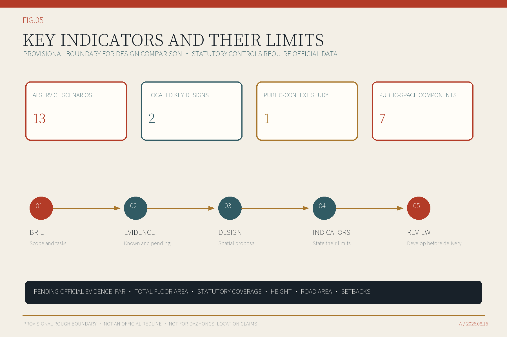

## 12. Risk, Copyright, and Compliance

Four risks govern the proposal: provisional boundaries may not match the site; fire, accessibility, and logistics may not fit within the same passage; accountable owners and operating funds may not materialize; and AI services may exceed data or safety limits. Official evidence and specialist review therefore precede construction or operation. Any service pauses when responsibility is unclear, staff are absent, permits are missing, or public access is harmed. [source:SRC-003] [source:SRC-007]

AI services follow data minimization, purpose limitation, tiered permission, human review, appeal, records, and shutdown. Personal-information, generative-AI, network-data, accessibility, and other legal duties require case-by-case review by the actual operator. [source:SRC-019] [source:SRC-022]

“Jing-Zhang Public Service Corridor” is a descriptive working design name for this round and has not completed trademark or similarity review. Proposal text, tables, pages, structured data, and figures are participant-created; Noto fonts are used under the SIL Open Font License; OpenStreetMap context retains ODbL attribution and is orientation-only; government and institutional material contributes cited facts without embedded photographs, marks, or full-page reproductions. `rights_register.json` lists each asset class, rights status, publication action, and responsible sign-off. The participant must complete the final content and asset check, with qualified trademark or copyright advice where required. [source:SRC-031] [source:SRC-033] [source:SRC-034]

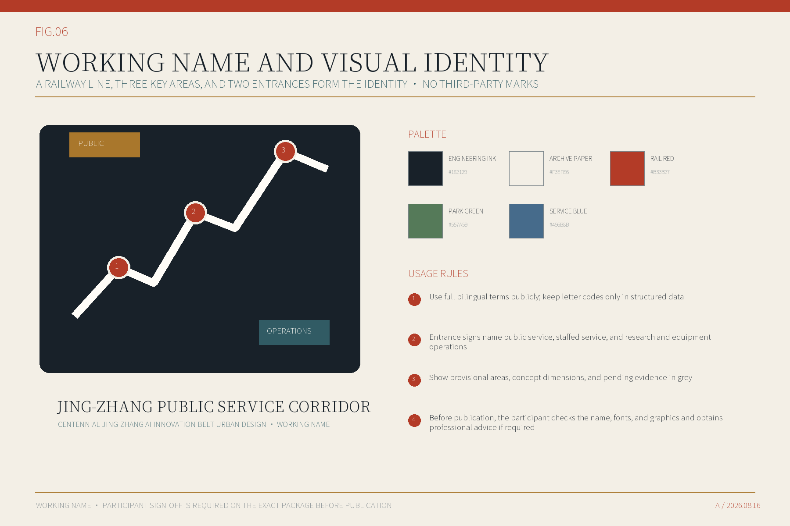

## 13. References

The complete source register is in `sources.json`. The qualification announcement and taskbook define scope, key areas, and deliverables. Haidian and Beijing policy material frames industry, public service, and regional links. Urban-design, regulatory-plan, and land-use guidance defines the spatial method and next-stage requirements. [source:SRC-001] [source:SRC-009] [source:SRC-017]

AI and data-governance law informs data minimization, human responsibility, appeal, and stop conditions. Six innovation-district precedents provide spatial and operating mechanisms only. Jing-Zhang railway history and Beijing heritage requirements inform the cultural route, while sites, images, texts, and installations still require item-level verification and rights review. [source:SRC-019] [source:SRC-024] [source:SRC-035]

The spatial design currently uses the organizer-supplied provisional inferred boundary, so area, green-space, and public-space ratios compare the concept only. Official boundaries, controls, surveys, ownership, roads, utilities, fire safety, and heritage evidence require coordinated updates to parcels, buildings, movement, public space, projects, and all indicators. Until then, FAR, height, road redlines, station relationships, and construction scale remain undetermined. [data:geometry/site_boundary.geojson#PROV-SITE-001] [metric:site_area_sqm] [depth:risk_missing_data]
