# 百年京张 AI 创新带城市设计｜京张公共服务走廊

**AI公共服务与创新协作空间体系**

> 本方案为概念城市设计。总体设计采用组织方资料包中依据公告文字四至与约面积形成的暂定研究范围（非官方红线），不作为法定红线；容积率、建筑高度、道路红线、权属、消防、市政和投资安排须在下一阶段依据正式资料核定。

方案关注一个直接问题。AI进入城市之后，市民在哪里获得服务，技术团队在哪里工作，发生争议时又到哪里找到负责的人。为此，每项服务设置三个相互联系、又彼此分开的空间。**公共服务入口**面向公众，保留日常通行、休息、咨询和纸面办理；**研发与设备运维入口**服务研发、设备、数据、物流和停机；两者之间设置可通行的**有人值守服务区**，由工作人员负责解释、处理、申诉和转介。研发或设备运维暂停时，公共服务入口和有人值守服务区仍继续开放。字母简写只在专业图例和结构化数据中使用。

## 1. 设计依据与资料清单

方案以资格预审公告和项目任务书确定三层范围、三区两翼、三处重点区域及成果要求，以城市设计、控规和用地分类文件建立专业框架，并结合海淀产业政策、AI与数据治理法规、无障碍要求、京张铁路史料和创新区案例形成设计判断。[source:SRC-001] [source:SRC-002] [standard:PROJECT-OFFICIAL-ANNOUNCEMENT]

现有资料能够支持战略和概念设计，但不足以支持法定规划或工程判断。尚缺官方边界、控规、权属、1:500现状测绘、道路红线、市政与消防容量、文保GIS、预算和具名运营主体。[source:SRC-004] [source:SRC-017]

相关结论均按资料成熟度使用，不用约面积代替红线，也不用案例经验代替本地事实。[depth:existing_conditions_diagnosis] [depth:risk_missing_data]

| 资料类别 | 用途 | 使用边界 |
| --- | --- | --- |
| 资格预审公告与项目任务书 | 确认范围、任务和重点区域 | 约面积不反推法定边界 |
| 海淀与北京市政策资料 | 判断产业、公共服务和区域协同方向 | 不直接推出地块建设要求 |
| AI原点既有人才服务资料 | 识别17项既有人社服务和现有联络机制 | 不证明共址、转介、扩展关系或本方案运营责任已经确认 |
| 城市设计、控规与用地分类文件 | 建立专业表达框架 | 不替代本项目法定规划 |
| AI、数据与无障碍法规 | 确定数据最小化、人工服务和申诉原则 | 具体场景仍需专项审查 |
| 六个创新区案例 | 学习空间与运营机制 | 不照搬绩效和制度条件 |
| 京张铁路史与文保资料 | 支持文化路线和公共展示 | 点位、图片和内容须逐项清权 |

## 2. 三层范围工作框架

统筹研究范围约43.6平方公里，用于研究中关村科学城、京张走廊与周边产业和公共服务网络；总体设计范围约11.4平方公里，用于组织公共服务走廊、功能分区、交通慢行和更新项目；三处重点区域公告约面积合计368.4公顷，用于提出更具体的空间原型。三层分别承担区域协同、总体结构和重点设计，不混用精度。[source:SRC-001] [depth:three_level_scope_framework]

当前总体设计采用组织方资料包中的暂定研究范围，复算面积约1141.28公顷，仅用于本轮方案比较。众智园和AI原点在暂定研究范围内提出场地化概念设计。大钟寺采用可核实的车站与周边公共信息提出非定界、非定量四象限概念，不把位置异常的临时范围用作详细设计边界，也不计算站距、步行圈、TOD或设施包含关系。[metric:site_area_sqm] [data:geometry/site_boundary.geojson#PROV-SITE-001] [data:geometry/key_areas.geojson#PROV-KEY-003]

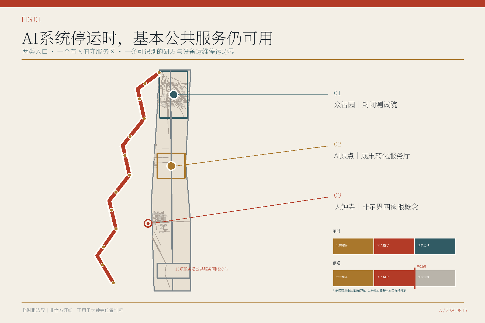

## 3. 统筹研究范围产业与未来城市研究

总体结构由一条南北向公共服务走廊、三处差异化重点区域概念、十三项AI服务场景以及中关村科技服务翼和小月河场景应用翼组成。科技服务翼连接技术、资本、法律和人才资源；场景应用翼从社区生活、公园维护和公共服务中提出需求。[source:SRC-015] [depth:overall_spatial_structure]

六个案例提供可借鉴的方法，包括高校与产业的空间接口、产业更新中的公共利益要求、可调整测试设施、跨机构挑战机制、规则清单和长期运营。案例不作为海淀绩效预测，也不直接复制其治理制度。[source:SRC-024] [source:SRC-029]

| 案例 | 借鉴内容 | 在本方案中的用法 |
| --- | --- | --- |
| MIT Kendall Square | 高校、产业与公共空间的持续接口 | 将成果转化、公共活动与步行网络放在同一运营日历中 |
| 巴塞罗那 22@ | 产业更新与公共利益条款协同 | 把创新空间供给与社区服务、可负担性监测绑定 |
| LaunchPad / Kampong AI | 可重组的创业集群与共享验证设施 | 采用短周期空间许可、共享设备与退出条款 |
| Paris-Saclay DataIA | 跨机构研究网络与可见的共同议题 | 以年度挑战题连接高校、企业和公共部门 |
| 河套深港科技创新合作区 | 跨边界科研协作和规则接口 | 借鉴接口清单，不复制跨境制度条件 |
| 张江科学城 | 长期管理机构与科研设施协同 | 建立常设场景办公室和年度复盘，而非一次性活动 |

产业指标不再只列名称。下表给出本方案建议的统计定义、计算关系和启用资料。当前没有官方口径或可审计数据的指标保持“待核定”，不以概念方案数值代替现状。正式使用前，须由统计、科创、规划资源和园区运营等责任部门确认口径，并确保分子、分母、范围和年度一致。[standard:PROJECT-AGENT-OPEN-CALL-TASKBOOK] [metric:ai_innovation_index]

| 产业与城市指标 | 定义或公式 | 启用所需资料 | 当前状态 |
| --- | --- | --- | --- |
| AI创新指数 | 科研、企业、人才、测试、转化和公共服务六类标准化得分按获批权重合成 | 官方维度、权重、统计年度、边界和审计数据 | 待核定 |
| AI人才密度 | 经核验的AI研发与技术服务人员 ÷ AI产业及科研建筑面积（公顷） | 同一年度的企业汇总人员数据和建筑用途、面积清单 | 待核定 |
| AI产业产出 | 研究范围内符合口径的AI法人年度产出或营业收入去重汇总 | 统计口径、企业名录、年度和可审计数据 | 待核定 |
| 企业集聚度 | 研究范围内正常经营的AI企业数 ÷ 官方范围面积（平方公里） | 企业资格规则、经营地址、存续状态和官方边界 | 待核定 |
| AI产业空间规模与占比 | 符合口径的研发、测试、孵化和服务建筑面积；并除以区域总建筑面积 | 逐栋用途、租赁、权属和建筑面积调查 | 待核定 |
| 职住与公共服务完整度 | 在约定步行时间内可达工作、居住、日常服务、学习和休闲五类设施的比例 | 设施入口、开放时间、容量和无障碍步行网络 | 待核定 |

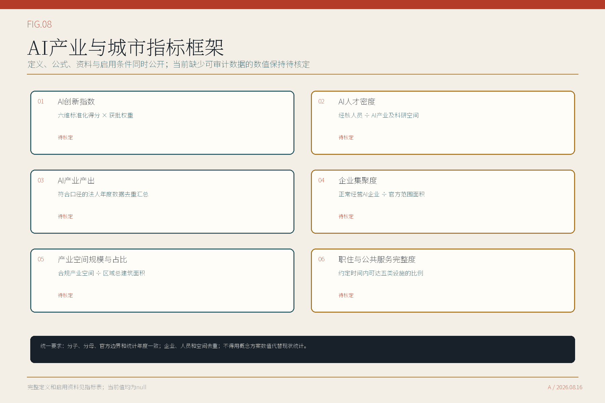

每个服务节点的空间规则可以用五句话说明。公众与技术团队从不同入口进入；两类入口有各自的排队和物流组织；中间的有人值守服务区保持可通行；同一事项在两侧得到一致的责任人和申诉渠道；研发与设备运维区可以单独关闭，不连带封闭公共服务。两类入口是否具备独立临街和地址登记条件，目前仍是未知项，须结合场地权利和地址管理要求核验。以上规则用于判断概念方案是否成立，不作为名称或通用治理思想的排他性主张。[standard:PROJECT-AGENT-OPEN-CALL-TASKBOOK] [source:SRC-021]

首页把这套关系压缩成一张“平时—停运”双状态图。它承担三项核对任务：研发和设备运维停下后，公共通行是否保持；有人值守服务是否仍能处理基本事项与申诉；设备、物流和关闭边界是否留在公众路线之外。类似的非AI服务、人工接管和可退出试点在现有投稿中已经出现，本方案不声称首创。差异集中在同一双状态剖面如何贯穿十三项服务记录，并在众智园、AI原点和大钟寺形成三种不同的空间回应。[data:visual/assets/innovation_register.json] [source:SRC-033]

## 4. 总体设计范围城市更新与控规深度城市设计

总体设计提出六个功能建议区，涵盖商业服务业用地、城镇社区服务设施用地、文化用地、科研用地和公园绿地五类用地性质。商业服务业用地按现行自然资源部分类使用`09`，功能安排、服务内容与用地代码分别表达。[source:SRC-018] [standard:MNR-LAND-USE-CLASSIFICATION-GUIDE]

品牌功能、服务角色和用地代码分别表达。图中的概念单元用于面积比较和方案组织，不代表法定地块、产权或开发权。[data:geometry/land_use.geojson#LU-Z01-001] [depth:land_use_layout]

更新顺序从公共空间和服务组织开始。近期先编制公共服务节点设计导则，推进众智园封闭测试场、AI原点成果转化服务厅和公共空间走廊示范段的前期研究；条件成熟后扩展文化路线、社区服务、资源目录和现场测试活动；大钟寺在正式资料到位后开展站区空间设计。分期图层全部使用项目清单中的`PRJ-01`至`PRJ-08`编号，`PRJ-09`保留为大钟寺后续研究任务。[data:geometry/phasing.geojson#PHASE-001] [depth:phasing_implementation]

本轮完成的是控规相关议题的概念回应，不是已经编制或审定的控规。容积率、建筑高度、法定密度、退线、道路红线、停车、市政容量和逐栋拆改留均待后续核定。[standard:MOHURD-CONTROL-DETAILED-PLANNING] [depth:development_intensity_controls]

现状资源清单分为三层：可以公开核验的京张铁路史与遗址公园公共空间背景；本轮形成的两处概念设计、8个参考建筑基底、13项服务空间和9项更新建议；以及仍须补齐的边界、测绘、建筑用途与质量、空置和租赁、权属、文保、道路、市政与消防资料。更新潜力采用“保留维护、修缮提升、功能适配、公共空间改善、更新重建待论证”五类筛查。由于关键现状资料缺失，本轮只给出筛查方法，不制作会误导评审的地块或建筑潜力分级图。[metric:renewal_potential_area_sqm] [depth:existing_conditions_diagnosis]

| 更新筛查类别 | 判断依据 | 本轮结论 |
| --- | --- | --- |
| 保留维护 | 公共价值、现状质量、权利清楚 | 方法已定义，未对具体建筑落类 |
| 修缮提升 | 建筑可修复，且存在安全、无障碍或使用短板 | 方法已定义，待现状调查 |
| 功能适配 | 结构和机电可承载新用途，且权属、消防可落实 | 方法已定义，待逐栋核验 |
| 公共空间改善 | 存在经实测确认的通行、休息或服务断点 | 众智园与AI原点先做概念验证，待现场校核 |
| 更新重建待论证 | 公共利益明确、不可修复证据充分、规划与市政容量允许 | 本轮不作具体结论 |

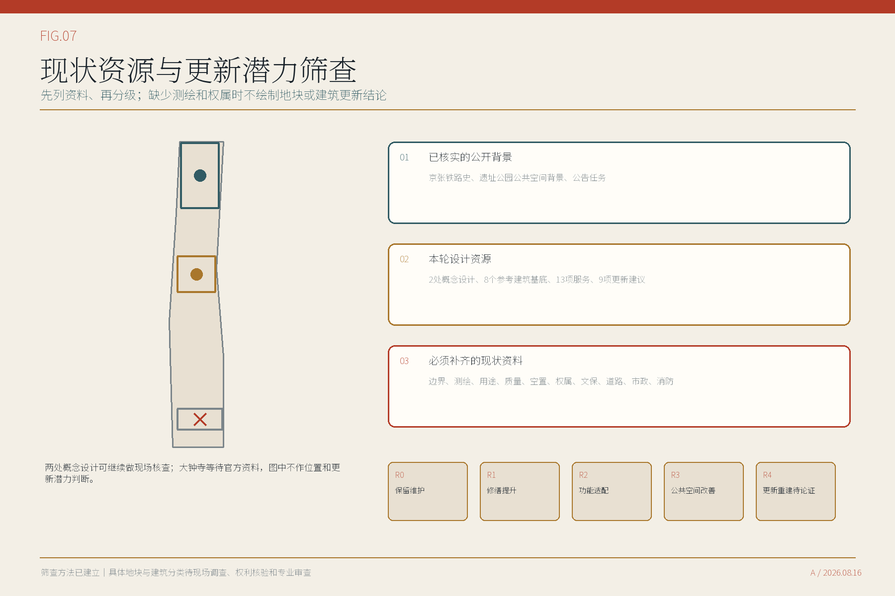

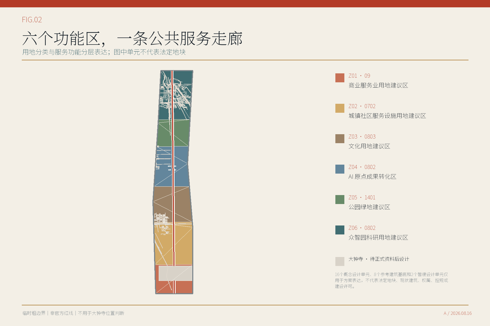

## 5. 重点区域详细设计

**众智园AI自主创新加速区**以研发与设备运维空间为主。封闭测试院容纳算力、模型、智能体、可信数据和低速机器人测试；设备物流与公众路线分开。面向公园的一侧设置公共服务入口和观察廊，中间的有人值守服务区由测试经理与安全员值守，负责说明测试范围、处理异议并执行停机。[data:geometry/key_areas.geojson#PROV-KEY-001] [depth:three_key_area_detailed_design]

**北京AI原点社区**以成果转化和社区服务为主。海淀区人社局公开资料显示，社区内已设人才服务流动站，提供17项高频人社服务、24小时智能问答和五名市区镇人才服务联络员。本方案不另设重复的人社服务窗口，而是以书面接口确认为前提，通过共址、转介或扩展补充技术转移、知识产权、健康服务导航和社区议事。校园侧设置研发与设备运维入口，社区侧保留无手机也可使用的公共服务入口，中间的有人值守服务区负责说明、转介和申诉；研究成果不能未经解释和选择直接进入居民生活。[source:SRC-010] [source:SRC-040] [data:geometry/key_areas.geojson#PROV-KEY-002]

**大钟寺AI产业集聚区**以公开可核的位置关系回应站城协同任务。现有资料可确认大钟寺站为轨道交通12号线与13号线换乘站，站口附近已有公交接驳条件；蓝景丽家是可核实的周边更新项目。[source:SRC-037] [source:SRC-038]

本轮提出一张以换乘站为中心的四象限概念框架，明确标注“非定界、非定量”。图中另列一幅非控制性位置底图，只用公开道路、轨道和公交停靠背景说明四类行动与换乘环境的关系，不据此测距或划界。西北象限安排国际交流与创新服务前厅，东北象限安排产业服务与成果转化前厅，西南象限组织轨道—公交—过街连续联系，东南象限组织非机动车停车、社区服务与设备物流分流。建筑行动以现状调查后盘活可用首层为先，不预设拆改留；公共空间优先设置遮阴等候、短暂停留和无障碍转角；运营上把有人服务与设备运维分开，AI系统或设备运维暂停时，现场咨询和基本服务仍可使用。正式边界、测绘、权属、交通、消防和责任主体全部确认后，才进入场地化总平、剖面、分期和指标复算。该框架不是站口定位图，不支持面积、站距、道路红线或建设量判断。[source:SRC-005] [source:SRC-031] [source:SRC-039]

众智园采用10米公共服务界面、8米有人值守服务区和24米技术测试带的比较模数；AI原点采用14米公共服务界面、10米有人值守服务区和16米研发与设备运维带。尺寸只用于比较空间关系，不是测绘或施工尺寸。后续须以现场测绘、消防、无障碍、产权和运营要求校核。[depth:height_massing_character] [depth:retain_renovate_demolish]

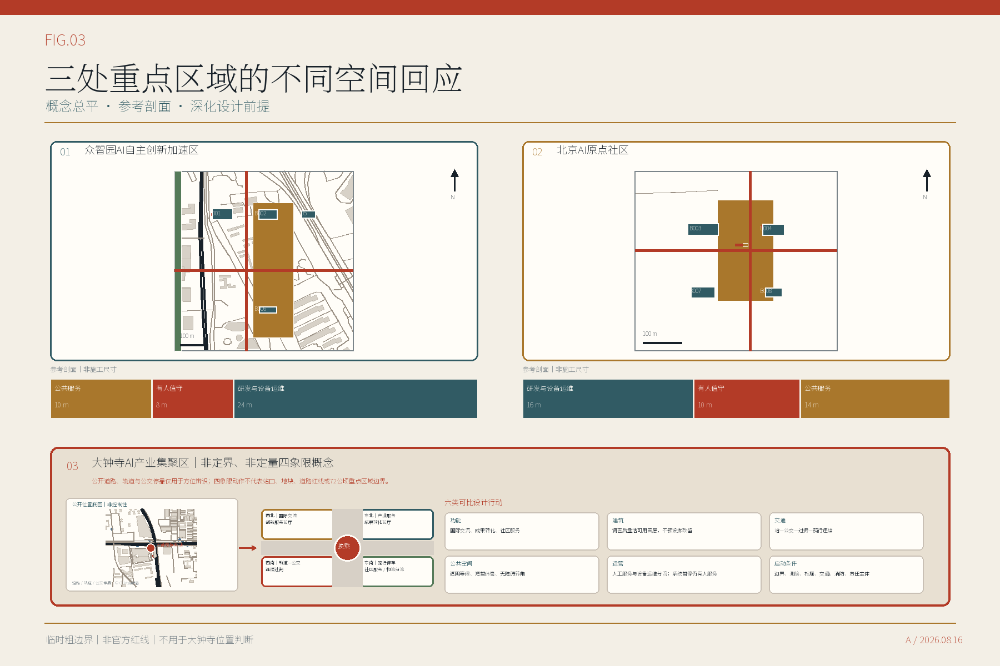

众智园和AI原点进一步采用三类形态控制：沿公园和社区界面保持连续、可进入的首层公共开放空间；研发、测试和设备运维体量退居内侧，并设置独立物流；建筑体量通过院落、间隙和屋顶分段降低连续压迫感。具体层数、高度、退线、天际线和保留建筑仍待控规、测绘、文保和消防资料，图中只表达形态关系和界面优先级。[depth:height_massing_character]

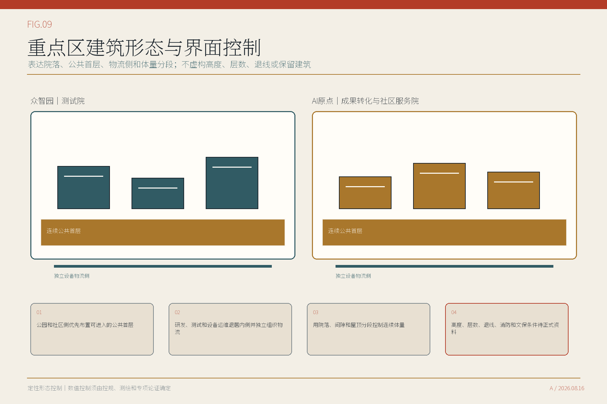

## 6. AI 创新生态、人才画像与 AI+ 场景

AI创新生态按能够找到使用者、场地和责任人的城市服务组织。技术团队在研发与设备运维入口说明数据、设备和停止条件；公众从公共服务入口选择是否使用AI；争议、申诉和人工转介在有人值守服务区处理。敏感数据不在公共空间交换，手机和人脸识别不作为进入公共服务的前提。[standard:PROJECT-AGENT-OPEN-CALL-TASKBOOK] [source:SRC-019]

| 主要使用者 | 需要解决的问题 |
| --- | --- |
| 居民、老年人和残障使用者 | 清楚入口、连续无障碍、非手机服务、可找到工作人员 |
| 研究者、初创和成长型企业 | 成果转化、算力与合规服务、可控测试条件 |
| 一线运维和活动人员 | 明确工单、人工接管、事故处置与设备撤场 |
| 青年与国际访客 | 低门槛学习、双语导览和可核查的文化内容 |
| 规划设计与管理团队 | 可追溯资料、可替换边界和可复核指标 |

现有使用者画像来自桌面研究，不能代替现场意见。进入实施前应在众智园、AI原点和大钟寺分别开展步行与无障碍观察、服务人员访谈、居民和企业访谈，并以纸面办理、人工转介、设备物流和紧急停机四类任务进行现场测试。调研结果须能改变入口位置、开放时段、服务目录和停止条件，不能只作为展示材料。[source:SRC-013] [depth:existing_conditions_diagnosis]

十三项场景均说明服务对象、空间类型、参考尺寸、无障碍净宽、排队、设备物流、疏散、最小数据、公共价值、人工责任和停止条件。有人值守服务区的参考面积从60平方米到288平方米，不再采用同一模板。其中算力与模型调用额度服务、可信数据与合规服务、低速机器人封闭测试为三项产业测试；其余场景服务于成果转化、慢行与无障碍、文化导览、社区参与、活动安全、健康导航和城市资源管理。[data:geometry/public_space.geojson#BLDG-003-C-DSC-001] [metric:scenario_spatial_contract_coverage_ratio]

表中尺寸是概念阶段的参考模数，用于检查服务、排队、物流、疏散和无障碍关系，不是工程尺寸。进入建筑设计前，须以现状测绘、结构、消防、无障碍和运营调查重新校核。

| 场景 | 空间类型与参考尺寸 | 主要使用者 | 人工责任与停止条件 |
| --- | --- | --- | --- |
| DSC-001 高校成果转化服务台 | 成果转化服务厅；18×8米；无障碍净宽2.4米；成果转化服务 | 研究者、初创团队 | 商业秘密和推荐偏差；科技成果转化经理确认服务路径 |
| DSC-002 算力与模型调用额度服务前台 | 算力服务与排队前厅；20×10米；无障碍净宽2.4米；产业测试 | 初创与成长型企业 | 供应商锁定和资源公平；独立测试经理签字 |
| DSC-003 可信数据与合规服务站 | 可信数据受理与隔离核验室；16×10米；无障碍净宽2.0米；产业测试 | 企业、公共部门场景业主 | 再识别与用途漂移；数据管理员和法务复核 |
| DSC-004 慢行断点诊断 | 路侧慢行诊断服务点；12×6米；无障碍净宽2.0米；城市诊断 | 居民、访客、残障使用者 | 定位误差和代表性偏差；专业交通复核 |
| DSC-005 无障碍路径助手 | 无障碍咨询与休息点；10×6米；无障碍净宽2.4米；公共服务 | 老年人、残障使用者 | 实时状态失真；保留人工咨询和非手机路径 |
| DSC-006 低速机器人封闭测试 | 低速机器人封闭测试场；24×12米；无障碍净宽2.4米；产业测试 | 机器人企业、运维人员 | 人车冲突和责任不清；安全员即时停机 |
| DSC-007 公园维护机器人 | 公园养护调度点；14×8米；无障碍净宽2.0米；城市运营 | 公园维护人员、公众 | 误作业和噪声；限定时段并由人员接管 |
| DSC-008 可信文化导览 | 铁路文化解说与资料核验点；12×8米；无障碍净宽2.0米；文化服务 | 居民、青年、国际访客 | 幻觉和版权；来源卡与编辑复核后发布 |
| DSC-009 社区 AI 客厅 | 社区议事与有人值守服务室；18×10米；无障碍净宽2.4米；公众参与 | 居民、老年人、青年 | 数字排斥；保留线下主持与纸面渠道 |
| DSC-010 公共服务导航 | 综合公共服务咨询点；10×6米；无障碍净宽2.0米；公共服务 | 居民、访客 | 错误指引；沿线人工服务点确认，不绑定大钟寺位置 |
| DSC-011 活动安全复核 | 活动安全指挥与复核室；18×10米；无障碍净宽2.4米；城市运营 | 活动运营者、公众 | 监测过度和误报；人工总指挥拥有最终决定权 |
| DSC-012 AI 健康服务导航 | 健康服务咨询与人工转介室；12×8米；无障碍净宽2.4米；公共服务 | 居民、老年人 | 健康数据敏感；最小化输入并转人工 |
| DSC-013 城市资源数据接口看板 | 城市资源目录与维护台；14×8米；无障碍净宽2.0米；平台运营 | 场景业主、企业、专业团队 | 过期和权责不清；资产责任人定期复核 |

## 7. 用地、建筑规模与拆改留方案

用地方案采用“现行分类用途 + 方案功能定位 + 服务角色”三层表达。六个功能建议区组织总体关系，涵盖五类用地性质；建筑和公共空间进一步区分公共服务、有人值守服务与研发设备运维。正式边界、控规和现状建筑资料到位后，应重新形成地块和建筑清单，不能把本轮概念单元直接用作审批底图。[data:geometry/land_use.geojson#LU-Z06-001] [depth:land_use_layout]

众智园和AI原点布置8个离散参考建筑基底，单体参考尺寸为42至78米长、24至42米宽，用于检验实验、孵化、研发、社区服务及其公共界面的组合。建筑层数、高度和总建筑面积仍为待核定项。当前建筑基底比例只反映概念方案，不代表法定建筑密度。[metric:building_density] [data:geometry/buildings.geojson#BLDG-001]

保留、改造、拆除和新建必须以逐栋调查为基础。保留需确认结构安全和使用价值，改造需确认权属、结构和机电条件，拆除需经过公共利益与不可修复性论证，新建需满足规划、市政、消防和许可要求。现阶段不作逐栋结论。[source:SRC-035] [depth:retain_renovate_demolish]

## 8. 交通、轨道、市政与公共服务设施

交通结构包括一条南北向公共服务走廊、众智园和AI原点的局部连接，以及十三项场景的无障碍到达路线。这些线表达慢行和服务联系，不是道路红线。公众排队、设备物流、疏散和研发与设备运维区关闭分别组织，避免共用一条路线。[data:geometry/roads.geojson#ROAD-001] [data:geometry/constraints.geojson#W-CLOSURE-DSC-001] [depth:traffic_rail_slow_parking]

停车规模需等待交通调查和控规要求。低速机器人先在众智园封闭场地测试，不默认进入开放人流。活动期间通过容量控制、临时人工窗口和现场负责人保障安全。所有推荐路线都保留清楚标识、纸面说明和人工替代。[source:SRC-020] [source:SRC-023]

算力、网络、电力、储能、充电、雨洪、消防、环卫和应急通信先列出接口与需求，不虚构容量。下一阶段需由相应运营单位提供容量、峰值、维护和停运条件。[data:geometry/constraints.geojson] [depth:municipal_new_infrastructure]

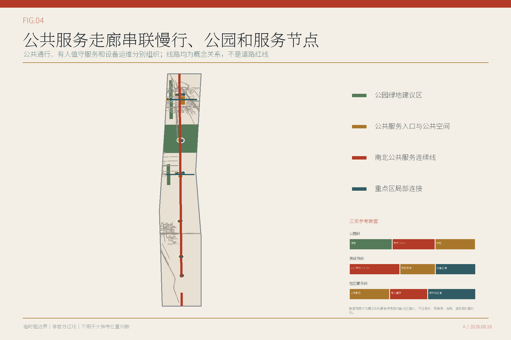

## 9. 蓝绿空间、公共空间与城市风貌

公共服务走廊串联目前能够定位的公共服务入口，提供连续步行、休息、遮荫和无障碍条件；研发与设备运维入口和设备物流从另一侧进入。按暂定研究范围复算，方案绿地用地图斑并集面积占暂定研究范围约13.11%，公共空间设计图斑并集面积占暂定研究范围约1.77%。两项均用于比较方案结构，不是法定绿地率或公共空间控制指标。[metric:green_ratio] [metric:public_space_ratio]

公共空间由以下七类组件构成。

| 公共空间组件 | 作用 |
| --- | --- |
| 两类入口标识 | 分别标出公共服务入口与研发和设备运维入口，并显示同一事项编号和状态 |
| 有人值守服务台 | 解释事项、受理申诉、完成转介并提供纸面办理 |
| 设备运维关闭线 | 仅关闭研发与设备运维区，公共服务入口和有人值守服务区继续开放 |
| 无障碍靠背座 | 提供连续休息、轮椅并坐和非消费停留 |
| 纸面路线架 | 保留非手机路线、服务说明和申诉信息 |
| 设备撤场口 | 让维护、物流和退役避开公众入口 |
| 资料版本与更新公示栏 | 公示资料来源、更新时间、暂停使用和更正记录 |

城市风貌以三类可核查内容组织。1905至1909年的京张铁路工程史提供工程文化线索。遗址公园一期已经开放；北京市政府门户网站在2026年7月29日的现场报道中称，二期接近完工，但当时尚未正式开放。二期此后的开放状态，仍需等待政府部门更新。[source:SRC-034] [source:SRC-012] [source:SRC-011]

清华园车站旧址的保护文字提示文保边界。方案只使用能够核查的文字和空间关系，不绘制尚未取得GIS的保护范围，也不复用未授权历史照片。[source:SRC-034] [source:SRC-035]

文化展示采用可逆、低干预方式，设置前须核验文保范围、内容版权和场地权利。[standard:MOHURD-URBAN-DESIGN-MEASURES] [depth:blue_green_public_space]

文化与运营成果面向公众形成三处公共贡献展示点、一套年度活动安排、一个开放开发者工作组、一条双语公共参访路线和六步项目转化流程。这里的“展示”以责任、来源、失败和更正为核心，不做企业排名；国际交流只在内容清权、主办方、活动许可和现场责任落实后开展。公开参访路线不经过尚未可靠落位的大钟寺重点区。[standard:PROJECT-AGENT-OPEN-CALL-TASKBOOK] [source:SRC-011]

| 成果 | 面向公众的内容 | 启动条件 |
| --- | --- | --- |
| 三处公共贡献展示点 | 责任牌、公共贡献展示台、运行状态公告架 | 文保、场地、内容和运营责任清楚 |
| 年度活动 | 春季征集、夏季封闭测试、秋季公开核查、冬季责任复核与退出 | 具名主办方、活动许可、保险和经费 |
| 开放开发者工作组 | 维护组件版本、测试协议、许可和失败记录 | 明确维护者、许可证和安全边界 |
| 双语公共参访路线 | 工程史资料入口—公园服务节点—众智园观察—AI原点服务—复盘登记—线上回访 | 路线、容量、无障碍、内容权利和现场人员核验 |
| 项目转化流程 | 参观—体验—复盘—签约—落地—回访 | 每一步都有责任人、书面权利和停止条件 |

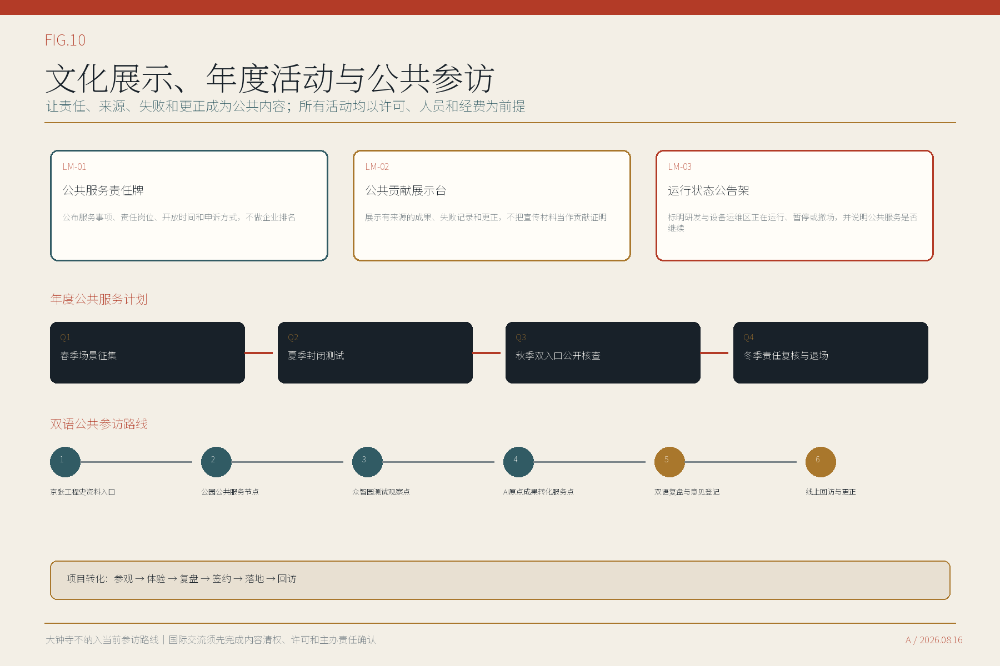

## 10. 更新项目清单、实施政策与分期计划

九项更新建议分为三个阶段。阶段表示前置条件和成熟度，不代表施工年月。责任主体、场地权利、资金、消防、市政、保险和长期运营尚未落实，因此当前均为概念建议，不视为已经启动的项目。[data:geometry/phasing.geojson#PHASE-001] [depth:renewal_project_list]

| 更新建议 | 阶段 | 主要内容 | 启动条件 |
| --- | --- | --- | --- |
| PRJ-01 公共服务节点设计导则 | 近期准备 | 公共服务入口、研发与设备运维入口、有人值守服务区的平面、剖面和运营要求 | 运营主体、数据责任人和两类入口空间确认 |
| PRJ-02 众智园封闭测试场 | 近期准备 | DSC-002/003/006的封闭测试区、公众观察边界与有人值守服务区 | 许可、安全评估、保险与专业设计 |
| PRJ-03 AI原点成果转化服务厅 | 近期准备 | 在现有人才服务流动站基础上，协作增加技术转移、知识产权、健康服务导航与社区议事；不重复设置既有17项人社服务窗口 | 取得既有人才服务流动站运营接口书面确认，并落实增量服务目录、运营伙伴和空间权利 |
| PRJ-04 公共空间走廊示范段 | 近期准备 | 连续公共服务界面、慢行诊断、人工求助与独立设备运维入口 | 现状测绘、道路和绿地权属核验 |
| PRJ-05 京张工程档案路线 | 条件成熟后扩展 | 三类文化证据卡与可逆地标 | 文保GIS、内容授权和专业审查 |
| PRJ-06 社区AI客厅网络 | 条件成熟后扩展 | 非手机反馈、共创议事和数字素养 | 共建主体、长期人员和可达空间 |
| PRJ-07 城市资源数据接口 | 条件成熟后扩展 | 空间、设施、场景和责任的版本化目录 | 数据授权、资产责任和更新时限与责任约定 |
| PRJ-08 公共服务现场测试周 | 条件成熟后扩展 | 从公共服务入口和研发与设备运维入口分别核查同一服务，公开差异和人工处理记录 | 活动审批、预算、保险和安全方案 |
| PRJ-09 大钟寺站区步行与公共空间联系研究 | 正式资料到位后研究 | 依据公开资料提出非定界、非定量的四象限概念框架，比较功能、建筑行动、交通、公共空间、运营和启动条件；正式边界前不生成道路红线、建设量或分期几何 | 修正大钟寺暂定研究范围并取得正式站区、道路、权属和测绘资料 |

下表把建议协调关系与已确认责任分开。所有牵头关系均为本方案建议，尚未得到政府部门或场地权利主体确认；金额暂不填写，待工作范围、专业设计和场地条件明确后依法编制投资估算。

| 项目 | 建议协调关系 | 资金与估算状态 | 审批顺序 |
| --- | --- | --- | --- |
| PRJ-01 | 建议由区规划资源部门统筹空间导则，区科创部门明确场景和数据边界，场地管理单位和街道验证日常运行。具体牵头关系须由政府确定。 | 前期导则和样件可分别研究规划前期经费、城市更新前期经费和场景运营方投入，均须依法履行预算、采购和资产管理程序。 当前未形成概算或投资承诺。 | 责任与场地确认—调查和专业方案—投资测算—专项审查—依法采购或活动审批—试运行—评估后继续、调整或退出 |
| PRJ-02 | 建议由区科创部门协调测试需求，众智园场地权利主体承担场地责任，安全、消防和行业主管部门按事项审查。 | 测试设施、保险、能耗和设备撤场费用可由场地权利主体与测试服务使用方依法约定，不预设财政承诺。 当前未形成概算或投资承诺。 | 责任与场地确认—调查和专业方案—投资测算—专项审查—依法采购或活动审批—试运行—评估后继续、调整或退出 |
| PRJ-03 | 建议由区科创部门会同区人社部门、AI原点社区、有关高校园区和场地权利主体，以现有人才服务流动站为基础确认共址、转介或扩展关系。已公开的17项人社服务保持原责任链；本方案只补充技术转移、知识产权、健康服务导航和社区协作，不另设重复受理窗口。 | 既有人社服务沿用原资金与运营安排；新增服务可研究高校园区共建、场地运营收入和依法购买服务等路径，具体方式须经预算、采购和协议审查。 当前未形成概算或投资承诺。 | 责任与场地确认—调查和专业方案—投资测算—专项审查—依法采购或活动审批—试运行—评估后继续、调整或退出 |
| PRJ-04 | 建议由园林绿化、交通和街道按现状管理边界协同，规划资源部门核对空间方案，公园运营单位承担后续养护接口。 | 示范段可研究公园更新、慢行改善和无障碍环境建设资金的统筹使用，前提是明确项目边界和资产归属。 当前未形成概算或投资承诺。 | 责任与场地确认—调查和专业方案—投资测算—专项审查—依法采购或活动审批—试运行—评估后继续、调整或退出 |
| PRJ-05 | 建议由文化和文物主管部门指导内容及文保边界，档案和公园运营单位共同维护资料更新。 | 研究公共文化服务、展陈更新和社会合作投入，所有内容与图像使用须先完成权利审查。 当前未形成概算或投资承诺。 | 责任与场地确认—调查和专业方案—投资测算—专项审查—依法采购或活动审批—试运行—评估后继续、调整或退出 |
| PRJ-06 | 建议由街道和社区治理主体提出需求并承担居民沟通，区科创部门提供场景规范，场地单位保障长期开放。 | 研究社区服务经费、公益合作和依法购买服务等路径，优先保障长期人员和无障碍支持。 当前未形成概算或投资承诺。 | 责任与场地确认—调查和专业方案—投资测算—专项审查—依法采购或活动审批—试运行—评估后继续、调整或退出 |
| PRJ-07 | 建议由数据目录主管部门确定公开范围和更新责任，各数据资产责任人分别授权，安全审查人员负责上线和退役复核。 | 接口建设和维护经费应随责任部门的数据资产管理职责确定，不以一次性建设替代持续更新。 当前未形成概算或投资承诺。 | 责任与场地确认—调查和专业方案—投资测算—专项审查—依法采购或活动审批—试运行—评估后继续、调整或退出 |
| PRJ-08 | 建议由活动主办单位承担总责任，场地单位、公安消防和属地街道按活动性质履行相应管理职责。 | 活动预算、保险、安保和记录发布费用由获批主办方案明确，不以活动替代长期空间建设。 当前未形成概算或投资承诺。 | 责任与场地确认—调查和专业方案—投资测算—专项审查—依法采购或活动审批—试运行—评估后继续、调整或退出 |
| PRJ-09 | 北京市城市更新服务平台2026年7月的历史公示曾列出北京海开城市更新建设发展有限责任公司为南部大钟寺AI产业集聚区更新片区实施单元统筹主体；公示期已结束，原网页现返回404，候选包仅保留事实记录。建议把这一历史角色作为待复核的协调线索，会同规划资源、交通、轨道运营、属地街道和场地权利主体确认本次72公顷重点区域的边界与任务；该线索不等同于本方案的已确认责任法人。 | 边界和站区资料未到位前不列投资。资料确认后，由经书面确认的实施单元统筹、场地权利和相关主管主体按更新项目分别编制专业设计、交通研究、成本收益平衡和投资测算。 当前未形成概算或投资承诺。 | 责任与场地确认—调查和专业方案—投资测算—专项审查—依法采购或活动审批—试运行—评估后继续、调整或退出 |

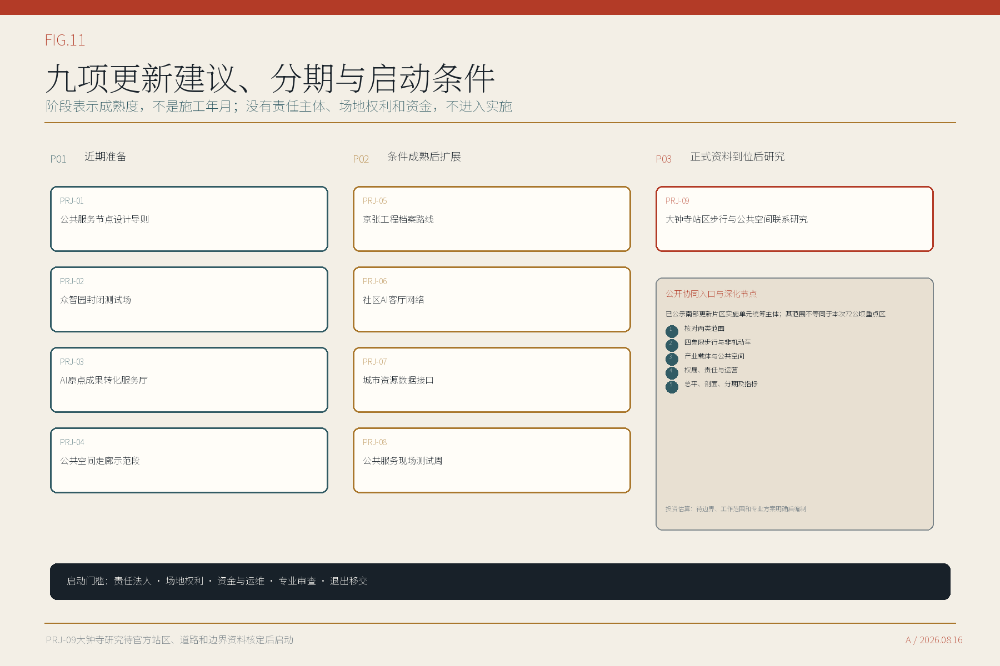

实施组织按项目分别提出建议协调部门职责、可研究的资金路径和里程碑。规划资源、科创、街道社区、园林绿化、交通、文化文物、数据管理、轨道运营和场地权利主体按项目性质参与，具体牵头关系须由政府确定。九项建议目前均没有确认的责任法人、场地权利或资金来源，因此不得提前表述为已启动项目。[source:SRC-016] [source:SRC-029]

政策工具包括短周期试点许可、最小数据约定、责任清单、保险与事故处置、公共通行条件、结果公开和退出条款。[source:SRC-016] [depth:phasing_implementation]

## 11. 指标体系、面积复算与合规矩阵

空间数据以EPSG:4326交换，面积和长度以EPSG:4548复算。公告约面积、临时边界计算值和未来官方面积分别记录。正式边界到位后，需要同步更新用地、建筑、交通、绿地、公共空间、项目分期和相关指标。[metric:site_area_sqm] [depth:metrics_recalculation]

用地并集与暂定研究范围之间的面积差控制在2平方米以内，作为临时几何序列化和拓扑容差单独登记，不再表述为绝对无缝覆盖。正式地块数据到位后，应统一吸附公共边并将残差归零。[metric:land_use_coverage_gap_sqm]

| 指标 | 当前值 | 说明 |
| --- | --- | --- |
| 总体设计暂定研究范围面积 | 1141.28 公顷 | 按现有暂定研究范围复算，不是法定面积 |
| 按暂定边界计算的方案绿地用地占比 | 13.11% | 分子为green_space图层并集面积，分母为暂定研究范围面积；不是法定绿地率 |
| 公共空间设计图斑面积占暂定研究范围的比例 | 1.77% | 分子为public_space图层并集面积，分母为暂定研究范围面积；不是法定控制值 |
| AI服务场景 | 13项 | 其中3项为产业测试 |
| 重点区域 | 2处场地化概念设计 + 1处非落位、非定界、非定量四象限概念 | 大钟寺不使用异常临时范围落位，待可信边界和正式站区资料 |
| 容积率、建筑高度、道路红线 | 待核定 | 须依据控规、测绘和专项论证 |

指标表同时保留AI创新指数、人才密度、产业产出、企业集聚度、AI产业空间规模与占比、区域总建筑面积、更新潜力面积和职住与公共服务完整度。它们目前均为定义完成、数值待核定；只有取得表中所列资料并通过口径确认后，才能从`null`更新为数值。[metric:ai_talent_density] [metric:ai_industry_space_area_sqm] [metric:live_work_learning_service_completeness]

方案已按任务书逐项组织设计回应，具体证据对应关系保存在随包矩阵中。矩阵用于检索成果，不替代城市设计专业判断，也不表示法定审批或工程条件已经完成。[standard:PROJECT-OFFICIAL-ANNOUNCEMENT] [depth:risk_missing_data]

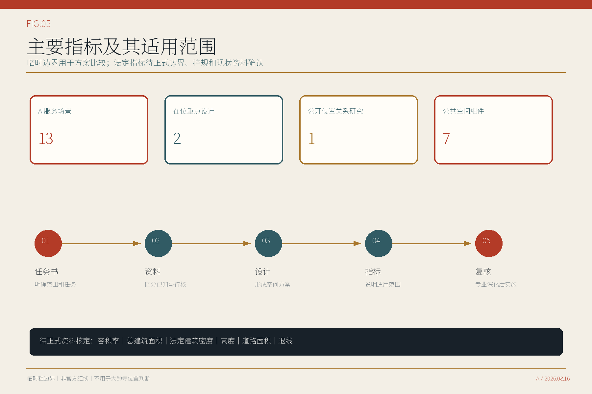

## 12. 风险、版权与合规说明

主要风险有四类。临时边界可能与实际场地不符；有人值守服务区的消防、无障碍和物流要求可能发生冲突；责任主体和运营资金尚未落实；AI服务可能超出数据和安全边界。相应控制方式是先取得正式资料和专业论证，再决定是否进入建设或运营。任何场景在责任不清、无人值守、许可缺失或公众通行受影响时均应暂停。[source:SRC-003] [source:SRC-007]

AI服务遵循数据最小化、用途限定、分级授权、人工复核、申诉、记录和停机原则。具体项目是否满足个人信息、生成式AI、网络数据、无障碍及其他法规，须由实际运营主体按服务内容逐项审查。[source:SRC-019] [source:SRC-022]

“京张公共服务走廊”为本轮描述性设计名称，采用城市规划文件中常见的“公共服务走廊”表述，未完成商标和近似名称法律检索。正文、表格、网页、结构化数据和图件为本方案制作；Noto字体按SIL开放字体许可证使用；OpenStreetMap背景按ODbL保留署名且只作方向识别；政府和机构资料只引用事实，不嵌入其照片、标志或整页图件。逐项资产、权利状态、发布动作和签署责任登记在`rights_register.json`。发布前仍须由投稿人完成内容与素材核对，并在需要时取得商标版权专业意见。[source:SRC-031] [source:SRC-033] [source:SRC-034]

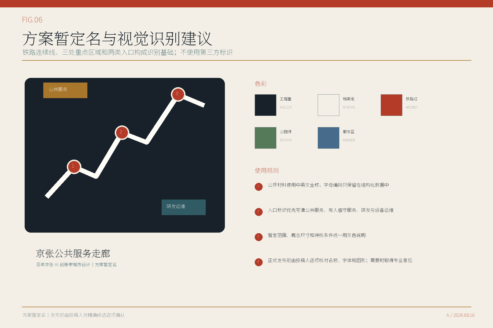

## 13. 参考资料

完整来源登记见`sources.json`。资格预审公告和项目任务书用于确认工作范围、重点区域和成果要求；海淀与北京市相关政策用于判断产业方向、公共服务和区域联系；城市设计、控规和用地分类文件用于建立空间表达和后续深化要求。[source:SRC-001] [source:SRC-009] [source:SRC-017]

AI与数据治理法规用于确定数据最小化、人工责任、申诉和停止条件。六个创新区案例只提供空间与运营机制参考，不作为本地绩效预测。京张铁路史料和北京市文保要求用于文化路线与公共展示，具体点位、图片、文字和构筑物仍须逐项核验与清权。[source:SRC-019] [source:SRC-024] [source:SRC-035]

空间设计目前依据组织方资料包中的暂定研究范围（非官方红线），因此面积、绿地和公共空间比例都是方案比较值。正式边界、控规、现状测绘、权属、道路、市政、消防和文保资料到位后，应重新核定地块、建筑、交通、公共空间、实施项目和全部指标；在此之前，不对容积率、建筑高度、道路红线、站城关系和建设规模作确定结论。[data:geometry/site_boundary.geojson#PROV-SITE-001] [metric:site_area_sqm] [depth:risk_missing_data]
