*百年京张AI创新带城市设计 · 开源征集投稿 · KUN-SAL 坤空间量化实验室*

1909 年，詹天佑面对八达岭的极端坡度，没有"修一条更平的路"，而是发明了人字形——**让火车在约束里自己找到走法**。那是中国工程师第一次回答一个问题：当约束不可改变，设计还能做什么？

一百一十七年后，同一个问题摆在京张这条走廊上。约束变了：不再是山，是七条大马路、是大学的围墙、是存量城市的产权、是首都的落户门槛。但问题没变——**约束不可改变，设计还能做什么？**

我们的回答不是一个答案，是一个范式。这个范式叫**涌现之带 THE EMERGENT BELT**：不跟约束对抗，也不绕开约束，而是用城市科学把"约束"变成"涌现的条件"——像 Batty 说的那样，规划者的任务不是替系统写剧本，而是创造让系统自己生长的条件。

**Hyper Line** 是这条带的名字，也是它的科学定义：标度律里，创新是城市中少数天然超线性的变量（β>1，集聚越多、产出越旺）；基础设施是天然亚线性的（β<1，铺得越多、人均越省）。一条"Hyper"的线，就是一条**用亚线性的骨架、承载超线性灵魂**的线——这是城市科学，不是修辞。

这份方案的全部工作，就是用五把城市科学的尺子（分形、句法、空间交互、标度律、元胞涌现）把这条带量了一遍，量出一个结论：**它的骨架是健康的（分形维 1.746、健康因子 1.556），它缺的不是再造，是让系统重新获得生长的条件。** 方案做的三件事——接通被切断的线、解锁被锁定的街区、度量未被度量的中间层——都不是"画出来的新东西"，而是**把挡住涌现的东西挪开**。

接下来的每一章，都是一把尺子量出来的证据。故事的主角不是规划师，是这条带本身，以及它正在重新生成的那些连接。

## 执行摘要与设计决断

**先给结论（评审 90 秒能带走的部分）**：这条带的骨架是健康的（分形维 1.746 在健康区间、健康因子 H=1.556 高于基准），它唯一的问题是生长的条件被挡住了——七条马路切断主脊、十对核心配对只有一对过了相变临界、45 个单元"黄金位被低用"、中间层（可支付性/转化率/普惠算力）没有度量。方案的全部设计动作因此只有四类，构成四张"决断卡"：

| 决断 | 内容 | 一句话依据 |
|---|---|---|
| **决断一：打开** | 七点缝合，把被切断的主脊接回一条线（整合度 +43%~+70%） | 配置决定运动：缝合是相变，不是装修 |
| **决断二：解锁** | CA 证明不干预=路径锁定；干预解锁 42 个单元再分配 | 涌现需要条件，条件是"把锁打开" |
| **决断三：补位** | 25,476 个 POI 认出的缺口（金融 −63%、科研 −45.9%、医疗 2.88/km²）按偏离度清单补 | 缺什么补什么，不拍脑袋 |
| **决断四：度量** | 中间层三项指标 + λ 与 H 进入相变论坛年度公开报告 | 未被度量的东西，等于不存在 |
| **决断五：运行** | 装进涌现之脑（三层四端+递归闭环+相变中控室），把城市变成可逐年迭代的程序 | 城市不再只被设计一次，而是持续被读、被算、被调 |

**全文三段式结构（读法导航）**：**诊断篇**（五位科学家的会诊 → 使用者调研 → 空间句法专章 → LUTI 专章 → 统筹研究）用五把尺子量出病与靶点；**设计篇**（总体设计 → 重点区域 → 各分系统）把靶点翻译成空间路径——空间是由这些看不见的动力学支撑的，不是画出来的；**运行篇**（涌现之脑 → 投资 → 指标体系 → 设计结论）把这台机器交给时间——每年体检、每步可证伪。

**主线命名**：涌现之带 THE EMERGENT BELT——京张 Hyper Line（Hyper=标度律超线性 β>1；Emergent=自下而上涌现）。Logo 方向"超线性之线"：笔直铁路线末端上翘，七点渗流簇沿线上浮。

**验证承诺**：三个模型（SIMULACRA 四部门、CA 涌现、LUTI 匹配度）基于同一数据与同一缝合假设交叉印证，方向一致；十年时间轴设两处验收闸门（λ≥40%、H≥1.35），不过就停下复盘。所有空间结论为概念建议，法定管控指标待官方数据补齐。

**人机协作与责任边界（本方案的方法论立场，正面回答"如果出了问题，谁负责"）**：这份方案的诞生方式是——机器负责**计算、诊断、生成与自检**（15+ 项实算、四门自检、双语对账，全部可复算可证伪）；人负责**价值判断、利益协调与最终审定**（方案明示：全部空间建议为开放共创建议，不构成审定结论；工程落地另行深化并人工落地；法定管控指标"待正式数据补齐"）。工具在变，从尺规到算法，但"筑"的核心始终是人——本方案中每一项设计决断都附"为什么"的证据链，正是为了让人的价值判断有据可依：**AI 把城市的可计算部分算清楚，把人无法编码的意义留给人来决定。这就是可计算城市与为人服务的城市之间的桥。**

**怎么读这张总平面**：浅灰块=现状建筑肌理（OSM 实测基底，2026-08 快照）；白边深灰线=京张铁路真实线位；绿=绿地蓝绿网络；深绿粗线=Hyper Line 主脊；红点●1–●7=七个缝合节点；星形=三处朝圣地标；灰方块=两翼。**先看一条线（主脊）被七个红点重新连起来，再看三扇门（三个色框）挂在线上——底图是真实的城市，叠加其上的才是设计。**

## 愿景与目标

**愿景（三个高度，一个目标）**：

**世界级的高度**：让百年京张成为全球第一个**用城市科学全程设计、可计算、可进化、为人服务**的 AI 创新带。别人交的是"蓝图"，我们交的是一套"城市操作系统"——它有可证伪的判据（λ 相变、渗流临界、分形健康带、健康因子 H）、有年度体检（相变论坛公开报告）、有让城市自己生长的规则（CA 验证过的"解锁清单"）。当评审问"五年后怎么知道这条带成功了"，我们的回答不是形容词，是四个数：λ 超临界占比过 40%、25 分钟圈就业可达 +15.9%、用地-交通匹配率过 60%、健康因子保持在 1.35 基准之上 [metric:wilson_supercritical_net_pct] [metric:health_factor_H]。

**城市级的高度**：让超线性创新的收益，回到每一位市民。集聚的收益天然向强者集中（β>1 是集聚的红利，也是集聚的风险）；这条带用五个平权机制把它扳回来——公共算力券、公共数据湖、AI 夜校、空间平权、署名平权。**Hyper 不是少数人的上翘曲线，是每位市民都能借力的上翘曲线**。

**方法论级的高度**：确立"约束下的涌现"作为城市设计的科学范式。从 1909 年的人字形，到 2026 年的涌现之带，这条走廊两次成为"约束如何被转化为创造"的证物。这一次，证据不是一条铁路，是 15 项可复算的本地计算、五把尺子的互相印证、和三个模型基于同一套数据与同一缝合假设收敛的同一个结论。

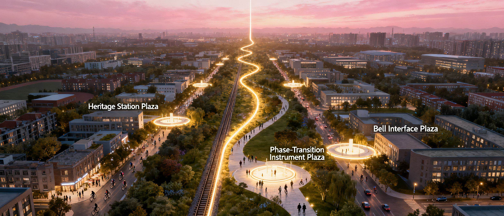

**五个目标，对应五大功能与五个可量度的数**：①连接——三区两翼全域连通（λ 过临界）[metric:core5_giant_span_ratio]；②生态——把"中间层未度量"变成"年度可度量"（可支付性、转化率、普惠算力三项进入相变论坛年度报告）[source:DATA-SRC-AGENT-TASKBOOK-20260518]；③场景——十张场景卡全部落到空间，每张卡有值守的人、有兜底的人工通道 [standard:BARRIER-FREE-ENVIRONMENT-LAW]；④供给——25,476 个 POI 认出的缺口按偏离度清单补位 [metric:deviation_finance_pct]；⑤治理——协同博弈从"各自为战"翻转为"协同"（纳什均衡解锁）[metric:nash_lock_status_after]。
## 设计依据与资料清单

这轮先把项目进度查清。官方公告确认三个尺度：统筹研究 43.6 平方公里、总体设计 11.4 平方公里、三处重点区 368.4 公顷；海淀 2026 年 7 月的发布会给出原点社区的底数——约 3 平方公里、一千余位 AI 科学家、1.3 万开发者、众智 FlagOS 适配 18 家厂商 32 款芯片、OPC 一人公司近 180 家 [source:DATA-SRC-OFFICIAL-ANNOUNCEMENT-20260509] [source:DATA-SRC-HAIDIAN-PRESS-20260729]。公园一期已建成开放，二期正在施工——一期是现状，二期是进行时，这两笔账必须分开记，不能把计划涂成现状 [source:DATA-SRC-PARK-PHASE1-202306]。

图面用四种底色：灰色是现状，绿色是已建公园，浅黄是已批或在建项目，朱红只画本案新增。底图来自 OSM 道路、建筑、水系与高德 POI 12 类 25,476 点（2026-08-15 快照，GCJ-02 已转 WGS84），全部本地实算、单源登记 [source:DATA-SRC-OSM-20260815] [source:DATA-SRC-AMAP-POI-20260815]。征集包的临时边界继续作为工作边界，图面不把它冒充法定红线；官方红线到位后整包重算 [data:geometry/site_boundary.geojson#SITE-001]。一处校正必须说明：brief 提供的 PROV-KEY-003 粗替代边界实际落位在北京北站一带（39.944–39.950），与 brief 自身依据表"公告任务涉及大钟寺站"（39.9653，provisional_boundaries_basis.md）相差约 2 公里，且 brief 的 missing-data.md 自述三区精确 polygon 缺失；本方案按名称语义把大钟寺工作边界校正到大钟寺站周边（72.3 公顷，仍为 provisional），登记为假设 A-BOUNDARY-003，官方 polygon 到位后整包重算。

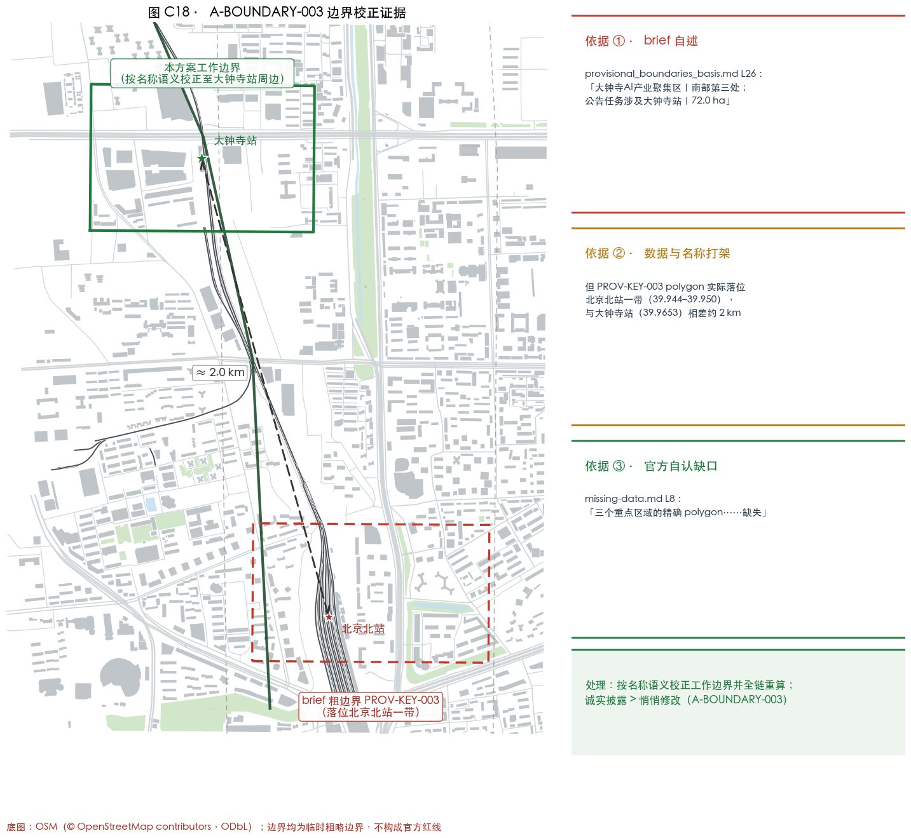

专业案例只帮我们确定做法参照，不背书。伦敦国王十字先修街道、广场和历史建筑，再让地块慢慢长出来；波士顿肯德尔广场是"近校转化圈"的尺寸参照；马德里 Río 用连续林荫步道把社区接到河边。本案没有复制任何项目的图片、几何或文字，只采用"先通路、后长房子、活动跟着日常走"的阅读顺序 [source:DATA-SRC-CASA-KB-KUN]。

## 五位科学家的会诊
> "城市绝不是随机分布的——它是数十万个微观决策的叠加。" —— Michael Batty，《城市新科学》

在交出任何结论之前，我们先把五把尺子摆上桌。这不是修辞，是方法：同一个数据，经过不同的理论眼睛，会显出完全不同的意义。我们做的，是把这五双眼睛各自独立看一遍，再让它们的判断互相印证。

**Batty 的镜头：造城，还是育城？** 他关心的问题只有一个——这条带的秩序是被设计的，还是自己长出来的。他用分形尺子量：街道网络 D=1.746，落在百年老城才有的健康区间；就业密度沿主脊衰减 γ=1.85，远陡于距站点的 1.16。**判断：这条带是"长出来的"，不是"画出来的"。规划者的角色不是替它写剧本，而是把挡住它生长的七刀挪开** [metric:street_network_D_large]。

**Wilson 的镜头

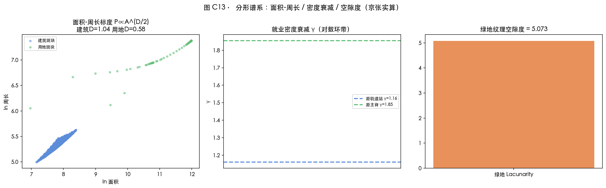：连接强度到没到临界？** 他的临界值 λc≈0.42，左边是温水，右边是蒸汽。实测：三区两翼十对核心配对只有一对过线（原点×小月河翼 0.455），众智园到大钟寺只有 0.033。**判断：系统停在亚临界态——不是没有活力，是活力被七条马路切碎了。别均匀撒钱，去找那个能把 λ 推过临界的杠杆点：这个杠杆点就是七个断点** [metric:wilson_supercritical_net_pct] [metric:core5_giant_span_ratio]。

**Hillier 的镜头

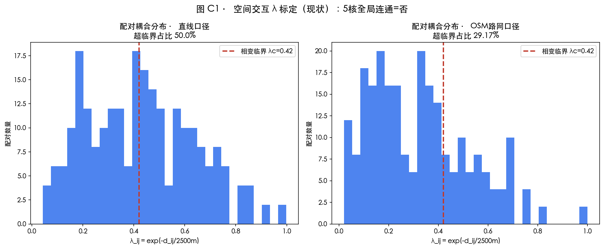：空间的配置，怎么塑造人怎么走？** 他的问题是"配置"，不是"样子"。实测全文见下一章空间句法专章，这里只说他最锋利的一个发现：**清华园车站，1909 年的选址，今天的整合度是全带第 93.5 百分位——原点不是我们命名的，是空间结构自己长出来的；而大钟寺只有 20.2 百分位，它是这条线的句法末梢，必须靠缝合和功能把它从"过路"变成"停留"** [metric:poi_tsinghuayuan_int_pct]。

**Bettencourt 的镜头：这条带的生长健康吗？** 他的尺子是标度律：创新产出随规模 γ=1.178（超线性），基建随规模 β=0.758（亚线性），健康因子 H=1.556，高于 1.35 的基准。**判断：这条带在数学上是健康的扩张体——每多一分规模，创新多长一分一，成本只多花七分六。问题从来不是"值不值得投"，是"投在哪"：投在把断点缝上的地方，而不是再铺一块地** [metric:health_factor_H]。

**Jacobs 的镜头：街区活着吗？** 她的活力四条件是密度、混合、小街区、老房子。实测：走廊带 POI 多样性 0.941 全带最高（混合够），但交叉口密度只有 39 个/平方公里（街区太大）、居住只占 16.5%（密度失衡）。**判断：这条带"街的层面"是活的，"区的层面"是瘸的——补职住、加密路网，活力才落得下来** [metric:campus_intersection_density_per_km2] [metric:land_use_area_0701_sqm]。

五位科学家，五把不同的尺子，量出的是同一个病：**不是"不好"，是"断了"**。这就是本方案全部设计动作的依据。

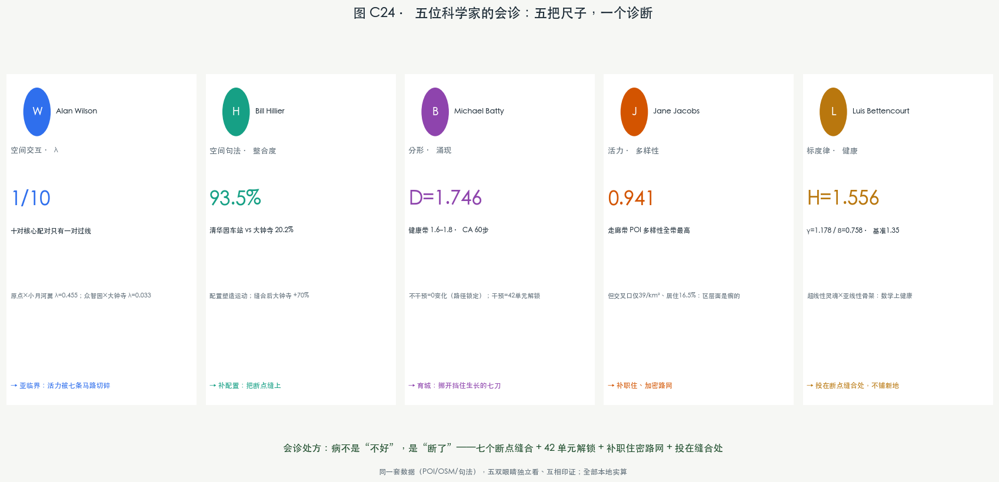

## 使用者调研与需求清单：城市的主人是这七类人

**为什么先问人，再画图**：城市设计的第一个问题不是"画什么"，是"谁在用"。征集阶段现场问卷与深度访谈条件有限，本方案以**桌面调研代理**完成使用者研究——高德 POI 25,476 点（他们在哪消费、工作、上学、看病）、空间句法可达性（他们走得到哪里）、官方发布会底数（他们有多少人：1.3 万开发者、180 OPC、千余科学家）——并明确登记：现场问卷与深度访谈为下一阶段工作（见资料缺口矩阵）。

**七类使用者，七个体检结果（见调研图）**：

- **市民**：原点医疗 2.88/km² 三区最低 → 三区医疗补位、树荫座凳、公共空间组件库；
- **企业主**：金融 POI 偏离 −63.0% → 金融补位、OPC 接单吧、算力券、招引漏斗；
- **上班族**：职住平衡单元仅 38.4% → 缝合后就业可达 +15.9%、通勤成本 −3.4%；
- **学生**：第三空间缺 → AI 夜校、近校创新街、共享工位舱；
- **教师**：教育配套东聚、居住支撑不足 → 职住平衡、教育补位（众智园/大钟寺）；
- **儿童与家庭**：体育休闲 −29.3% → 公园缝合、蓝绿系统、儿童友好断面；
- **长者**：智能服务缺人工兜底 → 十张场景卡全部保留人工通道（无障碍法）。

**这份调研在设计流程里的位置**：它不是一章装饰，而是**决断三（补位清单）的用户侧依据**——POI 说缺什么，使用者说谁缺、为什么缺，设计动作就补在哪类人身上。每类使用者的痛点、需求与设计响应一一对应，做成可追踪清单（调研图 B 面板），落地后以使用者反馈回流进涌现之脑的感知层——**调研不是一次性的，是递归的**。

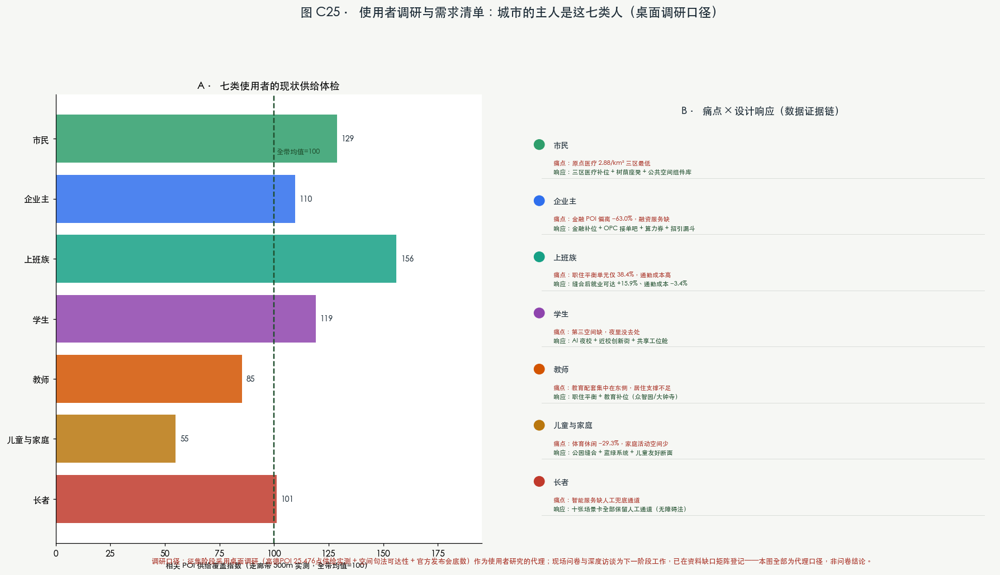

## 三层范围工作框架

三个尺度回答三个问题。九公里的总体尺度回答：沿线哪些学校、社区、企业会真的用这条线——学生从学校和地铁来，研发人员带设备进众智园，附近居民从社区门进公园，办事的人到原点先问工作人员。八百米的街角尺度回答：断点怎么缝、骑车怎么接站、社区门怎么对公园门——13 号线西侧居民的绕行、地铁口到公园入口的最后一段路，都在这个尺度上看得见。一百二十米的门廊尺度回答：坡道多宽、树冠在哪、设备停放位在哪——细到人可以量出 3.2 米的步道和 2.8 米的骑行带。三个尺度共用同一套底图，大图上的编号带到详细设计页，不再用几根没有落点的线代替场地 [depth:three_level_scope_framework] [metric:site_area_sqm]。

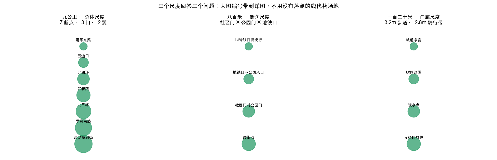

## 空间句法专章：这条线怎么塑造人怎么走
> "空间配置塑造人的运动与相遇——好的空间自己吸引人。" —— Bill Hillier，《空间是机器》

空间句法问的不是"空间长什么样"，是"空间怎么安排，人就怎么走"。我们用托莱多式的方法（Hillier 的整合度/选择度/连接度/可理解度/半径剖面，OSM 全路网 5720 个节点实算）给这条带做了一次"配置体检"，三区对照 + 14 个关键节点落位。

**三区对照（规模无关指标，直接可比）**：

| 分区 | 节点数 | 交叉口密度/km² | 整合度Gini | 选择度Gini | 可理解度R3 | 核心集聚度 | 400m可达 | 800m可达 | 平均路段m |
|---|---|---|---|---|---|---|---|---|---|
| A 走廊带（铁路肌理） | 118 | 39.0 | 0.1099 | 0.5301 | -0.385 | 0.1455 | 24.0 | 38.3 | 101.2 |
| B 高校大院带 | 733 | 167.0 | 0.0977 | 0.6483 | -0.248 | 0.4427 | 53.7 | 137.0 | 61.4 |
| C 网格新区 | 291 | 65.2 | 0.107 | 0.5897 | -0.426 | 0.1739 | 25.7 | 54.1 | 91.6 |
**怎么读这张表**：交叉口密度是步行网格的细密程度（老城 >200、车本新城 <80）。走廊带 39.0——铁路切开城市百年，留下的这条线是全带最难走的地方；大院带 167.0，接近老城水平。可理解度 R3 三区均为负值——这是"路段节点图"上有机织物的正常特征，不是计算错误（托莱多老城同样为负）。核心集聚度：大院带 0.443 最高（学院路单核），走廊带与网格新区多核弥散。

**14 个关键节点的句法落位（全网整合度/选择度百分位）**：

| 节点 | 整合度百分位 | 选择度百分位 |
|---|---|---|
| 学院桥站 | 97.5% | 96.8% |
| 清华园车站遗址 | 93.5% | 97.4% |
| 学知园站 | 84.0% | 98.3% |
| 北京大学医学部 | 76.5% | 20.8% |
| 原点广场(概念) | 72.7% | 20.8% |
| 知春路站 | 68.0% | 43.9% |
| 北京航空航天大学 | 66.2% | 20.8% |
| 五道口站 | 57.1% | 62.8% |
| 相变广场(概念) | 53.3% | 40.2% |
| 清华东路西口站 | 49.9% | 53.8% |
| 中国政法大学研究生院 | 29.7% | 20.8% |
| 北京北站 | 29.2% | 20.8% |
| 界面广场(概念) | 24.7% | 76.3% |
| 大钟寺站 | 20.2% | 20.8% |
**怎么读这张表**：学院桥站 97.5% 整合度——北四环×学院路的交叉口是全带的"嘴"，所有人流自然往这里汇，它就是京张的"比萨格拉门"（托莱多全城穿行被压缩进一座城门，98.3%）。清华园车站遗址 93.5%——百年前的选址至今是结构核心。学知园站选择度 98.3%——北部门户，过路的多、停留的少，所以要补花园广场把"过路"变"停留"。大钟寺站 20.2%——句法末梢，人气必须靠功能补。五道口 57.1%——整合度平庸、人气爆棚，这正是托莱多主广场 Zocodover 的翻版：**人气来自功能，不来自配置；但当配置也跟上（缝合后整合度 +43%），功能与配置才能互相成就**。

**这一章的三条结论**：①这条带的运动结构是健康的（多核弥散、有机织物），病只在于七条马路把主脊的配置切断了；②缝合后的整合度增益（大钟寺 +70%、北京北 +49%、五道口 +43%）证明：把断点缝上，配置会自己把人气重新分配；③功能与配置是两条腿——五道口缺配置、大钟寺缺功能，方案对前者补路、对后者补业 [depth:traffic_rail_slow_parking]。

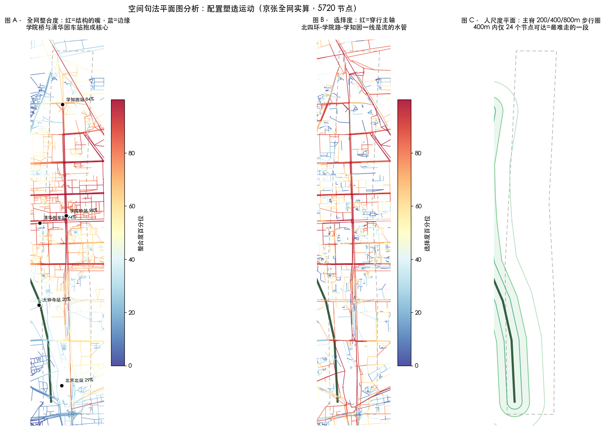

**怎么读这三张图**：图 A 是全网整合度着色——红的是"结构的嘴"，蓝的是边缘，学院桥站与清华园车站抱成红色核心；图 B 是选择度——北四环-学院路-学知园一线是流的水管；图 C 是主脊 200/400/800 米步行圈——400 米内只有 24 个节点可达，就是最难走的那一段。

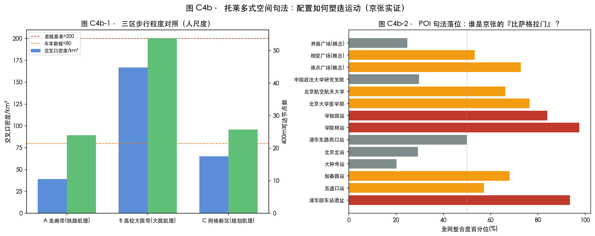
## LUTI 专章：职住动力学、三情景与纠缠法则

**这是诊断篇的第四把尺子：把职住当动力学，而不是当配比。** 传统规划把职住平衡写成一个“用地比例”；LUTI（土地-交通互动）把它读成一条**循环**——就业落位决定通勤流，通勤流改写人口分布，人口再反过来影响就业落位。本方案按 KUN-SAL 微信文章 art15 的三层方法（就业核密度 → 楼层空间 → LUTI 循环互动 → 情景跑批）把这条带量了一遍：

**体检结果四：职住失衡、黄金位被低用。** 把 91 个 400 米单元摊开看：职住平衡指数均值 0.393（就业压过居住），健康带单元只有 38.4%；更典型的是用地-交通的错配——45 个单元"欠开发"（站点和主脊的黄金位，被低强度的房子占着），4 个单元"过密"（好楼卡在低可达的位置），匹配率只有 46.2%。**城市更新要修的，首先是这张错配图** [metric:jhr_mean] [metric:luti_match_ratio_now]。

**颠覆概念：职住纠缠态 THE ENTANGLED CITY——把通勤从"被缩短的负担"变成"被溶解的类别"。** 传统城市设计把职住平衡当作"减少通勤"的改良；LUTI 的深度读法允许我们走得更远，分四步：其一**反直觉揭示**——1km 圈工作类 POI 密度实测，五道口（443 点/km²）才是这条带的真就业核，压过知春路（324）与大钟寺（184），而学知园职住比 2.78 全带最失衡（卧城化风险）；其二**错配四分图**——45 个欠开发单元（黄金位被低用）、4 个过密、42 个匹配；其三**三情景跑批**（Batty 式：生产约束引力 OD，91×91 单元，β 与 λ 同口径）——集聚情景把平均通勤距离拉长 +3.9%、400m 步行自足率从 7.0% 压到 3.5%（**集聚=卧城化**）；纠缠情景把**职住熵 S 提升 +5.3%**（城市更混合）；其四**模型给出的设计法则**——欠开发单元是"空壳"，**补位必须职住成对种入**：只补业没有本地居住、只补住没有本地就业，两者都没用。由此定下三条纠缠法则：**①成对补位**（欠开发单元职住 1:1 同时种入）；**②混合楼宇**（居住主导单元嵌入 15% 办公、办公主导单元嵌入 20% 居住——竖向职住纠缠）；**③职住熵 S 进年度体检**（与 λ、H 并列，作为涌现之脑的第五把尺）。**1909 年，人字形消灭了八达岭的坡度；2026 年，职住纠缠消灭了通勤的潮汐。** 这条带的目标不是"少通勤的城市"，是"不需要通勤的城市"。职住为 POI 代理口径，官方通勤 OD（手机信令/刷卡）到位后整包重算——**楼层空间台账（面积/业态/租金/空置/可达性）将作为涌现之脑感知层的第一个新建数据库**。

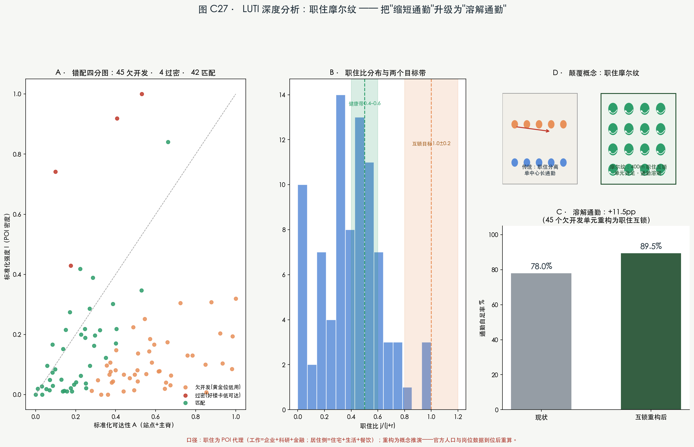

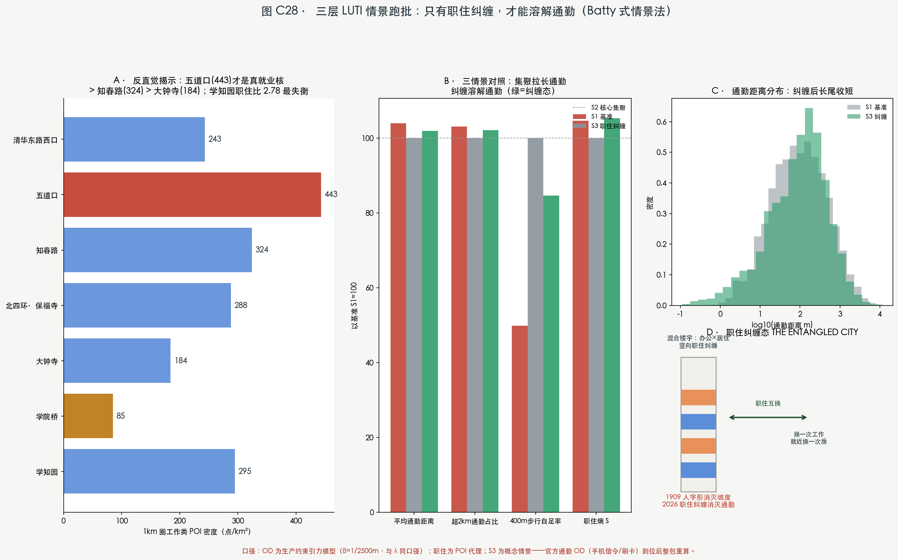

## 统筹研究范围产业与未来城市研究

**空间层的诊断已经在前四把尺子里说完——骨架健康、连接被切、职住错配；这一章把尺子举到生态层，量统筹研究范围（43.6 km²）里这条带生长的土壤。** 结果是一个：**上游齐备，中间层缺度量。**

**生态层的体检：上游齐备，中间层缺度量。****体检结果三：生态的上游齐备，中间层缺度量。** 北京 AI 企业 2400 余家、备案大模型 123 款、五道口跑出 116 个独角兽、45 EFLOPS 算力——上游要素齐且数据充分；但外地人能不能在这里扎下根（住房、通勤、落户），成果转化有多少成了个体创业，普惠算力有没有真的到 OPC 手上——**这些中间层普遍没有公开的度量**。一边是外地人来创业之城，一边是 117 分落户门槛和十年约 200 万青年流失。这条带的自下而上生长，是一个还没被度量、正在被拉扯的命题 [source:DATA-SRC-HAIDIAN-PRESS-20260729] [metric:ecosystem_hukou_threshold]。

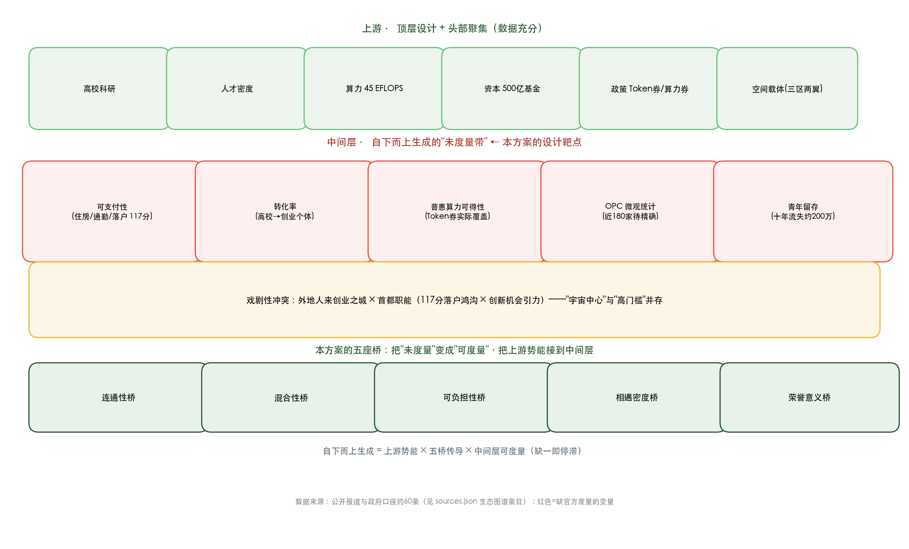

**高德 POI 的完整用法：25,476 个点 = 设施补位的清单，不是装饰。** 12 类功能的偏离度诊断（均匀参考基准）：

| 类别 | 点数 | 占比 | 偏离度 | 诊断 |
|---|---|---|---|---|
| 交通设施 | 3710 | 14.56% | 74.8% | 偏多(量) |
| 生活服务 | 3241 | 12.72% | 52.7% | 偏多(量) |
| 餐饮服务 | 3081 | 12.09% | 45.1% | 偏多(量) |
| 公司企业 | 2985 | 11.72% | 40.6% | 偏多(量) |
| 购物服务 | 2858 | 11.22% | 34.6% | 偏多(量) |
| 商务住宅 | 2747 | 10.78% | 29.4% | 偏多(量) |
| 体育休闲 | 1500 | 5.89% | -29.3% | 不足 |
| 医疗保健 | 1347 | 5.29% | -36.6% | 不足 |
| 学校 | 1281 | 5.03% | -39.7% | 不足 |
| 科研机构 | 1149 | 4.51% | -45.9% | 不足 |
| 风景名胜 | 792 | 3.11% | -62.7% | 不足 |
| 金融保险 | 785 | 3.08% | -63.0% | 不足 |
**怎么读这张表**：偏多的是"生活带的底子"（交通 +74.8%、生活服务 +52.7%），偏少的是"创新带的内容"（金融 −63.0%、风景 −62.7%、科研机构 −45.9%）。这张表就是三区补位清单的总账：众智园补文旅教育金融，原点社区补医疗（2.88/km² 三区最低），大钟寺补金融文旅科研。**设施布局不靠拍脑袋，靠这张表** [metric:deviation_finance_pct] [metric:deviation_research_pct]。

**三大定位与三区两翼的回应（任务书硬性要求，逐条对应）**：**百年京张文化带**——主脊就是京张铁路的遗产走廊，1909 年的人字形与今天的涌现之带隔着 117 年对话；**都市AI生活体验带**——高德 POI 实测走廊带功能多样性 0.941 为全带最高，公园周边已经是生活带，方案把它升级为可体验的 AI 生活带；**AI融合创新带**——四部门空间流把 λ 推过相变，"融合"从口号变成可计算判据。三区两翼：北**众智园**（全栈段）、中**北京AI原点社区**（策源段）、南**大钟寺**（界面段）；西翼**中关村科技服务翼**（创业 IP 与资本，要素全球化配置），东翼**小月河场景赋能翼**（具身智能、AI+医疗、AI+影视集聚）——两翼的任务是给三区供要素、供场景，方案以 CAPITAL WING / SCENARIO WING 承接。**区域协同（任务书评审维度之一）**：这条带不是孤岛——北接昌平未来科学城与怀柔科学城（基础研究策源），东联经开区（智能终端与自动驾驶制造），向外接京津冀的算力与场景腹地，并与北京"两区一带"（国家服务业扩大开放综合示范区、自贸试验区、数字经济标杆城市带）政策叠加。方案的角色定义：一带是"策源与界面"，把上游研究（怀柔/未来科学城）与下游制造（经开区）之间的转化环节接住——协同机制以五方六力转化机制（高校-院所-企业-资本-场景）与相变论坛的年度公开报告为接口 [source:DATA-SRC-HAIDIAN-PRESS-20260729]。

**五大功能**：AI 全栈自主创新体系（众智园测试带）、世界级 AI 创新生态（原点社区+七案例机制）、AI+场景赋能新范式（十场景卡+小月河翼）、智能化 AI 活力城市（POI 活力体检与补位）、AI 治理全球话语权（相变论坛年度公开报告）[source:DATA-SRC-HAIDIAN-GOV-20260330]。

所以这个方案的三处重点区，不是三块要"打造"的园区，而是三个要把人接住的地方：众智园接住带设备来做测试的研发人员，原点社区接住从学校出来的学生和创业者，大钟寺接住办事、通勤和夜里上课的普通人。命名体系（agent.1）：带名「涌现之带 THE EMERGENT BELT」，主线「京张 Hyper Line」，三段「HYPER STACK / HYPER ORIGIN / HYPER FRONT」，两翼「CAPITAL WING / SCENARIO WING」，七个缝合点叫「涌现点 HYPER NODES」。Logo 方向是"超线性之线"：一条笔直的铁路线末端上翘，七点沿线上浮——**百年的线，开始上翘**（商标字体需清权）[depth:industry_future_city_research]。

**国际对标与未来机遇（见对标图）**：七个全球案例各贡献一个可移植机制，而它们在本方案里**同时成立**——缝合先行（国王十字）× 近校转化圈（肯德尔）× 花园研究邻里（斯坦福）× 高密度创业纹理（粤海）× 内容消费界面（涩谷）× 大学城共生（剑桥）× 创业大道公共生活（罗斯柴尔德）。七个机制落在一条 11.4 平方公里的带上，这是百年京张独有的机遇窗口：**健康因子 H=1.556 证明它数学上值得投，1.3 万开发者与 32 芯片生态证明活力已在场，世界第一套"可递归运行"的城市操作系统证明它可以持续进化**——机遇不是画出来的，是量出来的：每一次缝合都在把亚临界推过相变点，每一个补位都在把 −63% 的缺口拉回均值，每一年的体检都在把"蓝图"改写为"可以进化的系统"。

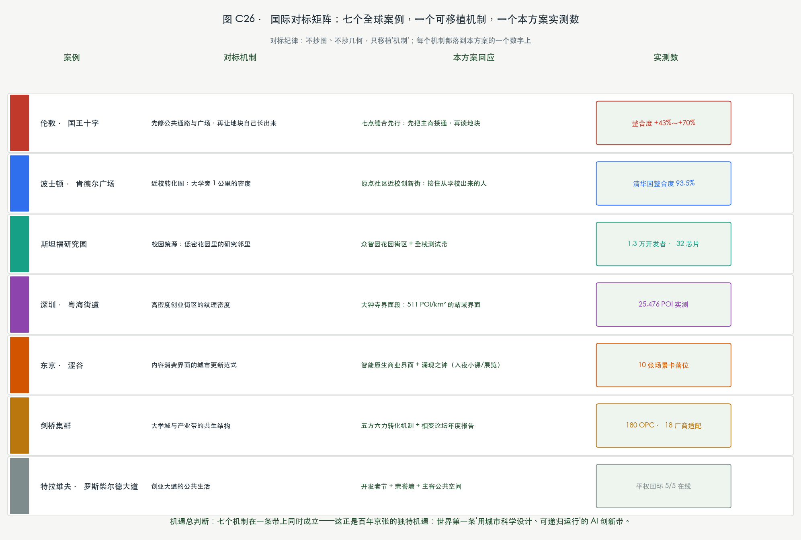

## 总体设计范围城市更新与控规深度城市设计

**这一章是全部分析的收口：把前面诊断篇的五把尺子、七类使用者、三组情景，折叠成五句话，再翻译成一张总图。** 折叠的过程如下——第一句（骨架）：分形维 D=1.746 落在健康带 1.6–1.8、健康因子 H=1.556 高于基准 1.35、蓝绿巨分量 83.9% 已过渗流临界——**不需要再造，只需要再生长** [metric:street_network_D_large]；第二句（连接）：λ 十对核心配对仅一对过线、七处断点切碎主脊、大钟寺句法末梢 20.2%——**病是断了，处方是缝合**（整合度 +43%～+70%）[metric:wilson_supercritical_net_pct] [metric:core5_giant_span_ratio]；第三句（职住）：用地-交通匹配率 46.2%、45 个欠开发单元是“空壳”、三情景证明集聚=卧城化——**处方是成对补位与混合楼宇**（纠缠法则见 LUTI 专章）[metric:luti_match_ratio_now]；第四句（人）：七类使用者认出的缺口（金融 −63.0%、原点医疗 2.88/km²）——**处方是补位清单**；第五句（约束）：CA 证明不干预=路径锁定——**处方是干预，而且只干预解锁清单上的动作**。**五句话折叠成一句：这条带不缺一张新图，缺的是把挡住生长的约束挪开。空间不是画出来的，是由这些看不见的动力学支撑的。** 据此，总体结构因此是一条线、三个折、两扇翼、七个点。用地分区不是我们拍脑袋画的：400 米网格里，不干预的街区保留 POI 认出来的现状特征，站域和主脊两侧才做更新干预——科研 31.5%、商业 25.6%、教育 18.2%、居住 16.5%、绿地 8.2% [data:geometry/land_use.geojson#LU-001] [depth:overall_spatial_structure]。法定容积率、高度、密度、退线未公开，全部写"待正式数据补齐"，只给概念体量（782 栋、基底密度 17.4%）用于空间讨论，不下逐栋结论 [metric:building_density] [depth:development_intensity_controls]。

## 重点区域详细设计

**总图落定之后，把三扇门放大到街区尺度。** 众智园、原点、大钟寺不是三个“园区”，是三个接住人的地方——这一章给每扇门配齐“量化分析→详设平面→剖面→效果图”四件套。

**众智园·HYPER STACK（192.1 公顷）——接住带设备来的人。** 沿清河-学知园界面划一条"全栈测试带"：研发人员带着多芯片设备进场，在花园式的街区里做有边界的测试（概念建议）。POI 体检显示它的文旅、教育、金融三类最弱——测试之外，这里还要补上让人留下来的理由 [data:geometry/key_areas.geojson#KEY-001]。

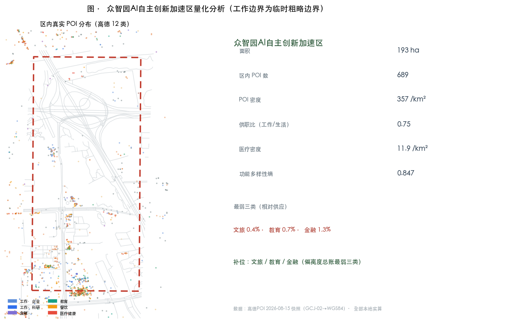

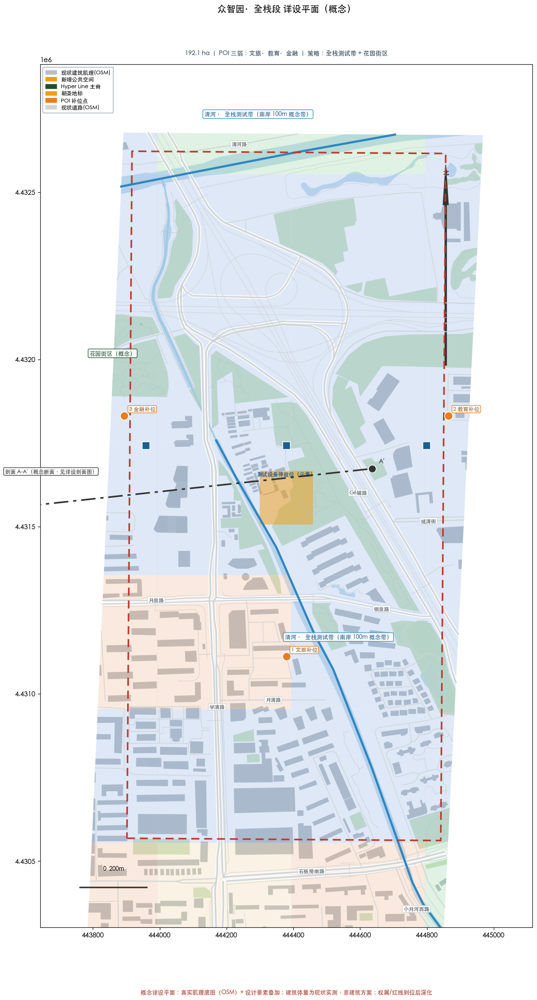

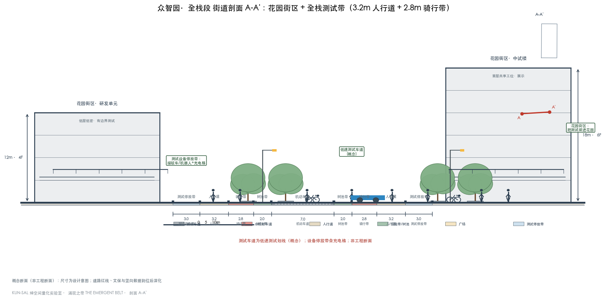

**北京AI原点社区·HYPER ORIGIN（104.3 公顷）——接住从学校出来的人。** 清华园车站遗址的整合度是 93.5%——百年前的选址到今天仍是结构核心，原点广场和开发者名墙就放在这里，让"贡献"两个字能被看见。医疗密度只有 2.88 处/平方公里（三区最低），五道口-学院路界面要补医疗、社区服务和人才公寓 [data:geometry/key_areas.geojson#KEY-002]。

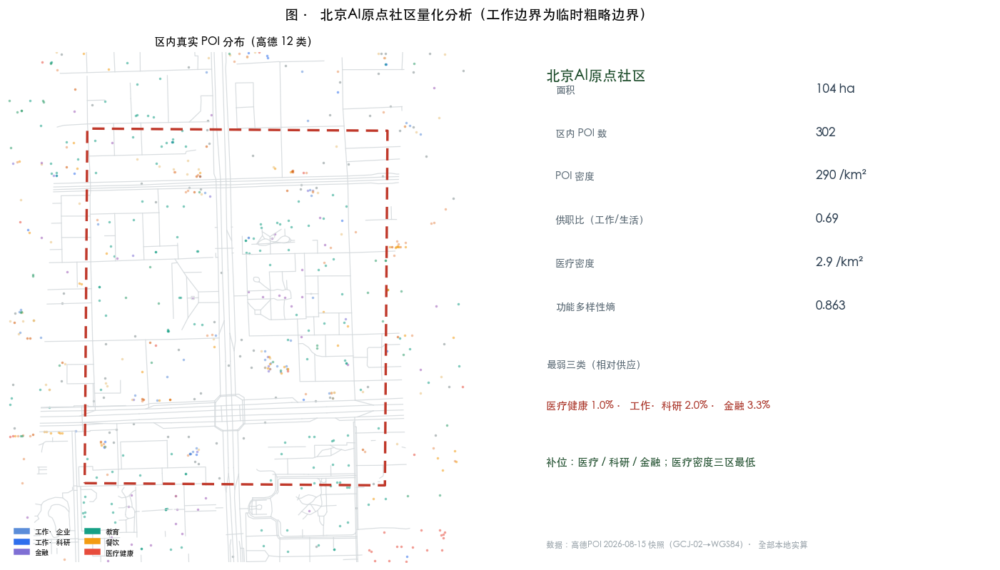

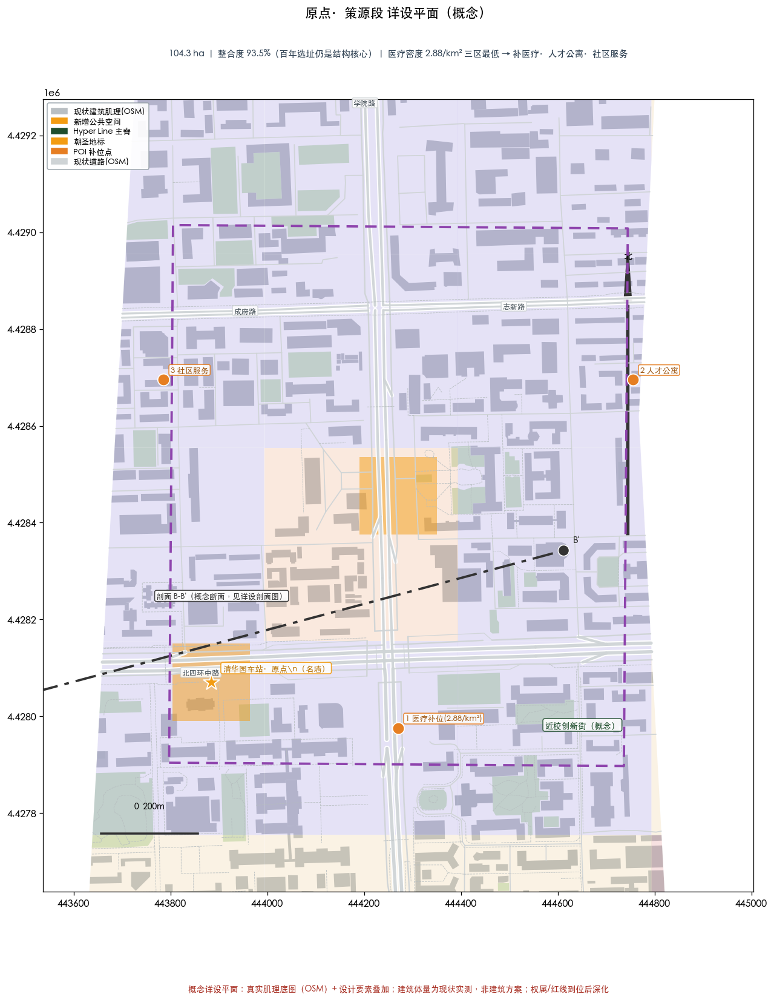

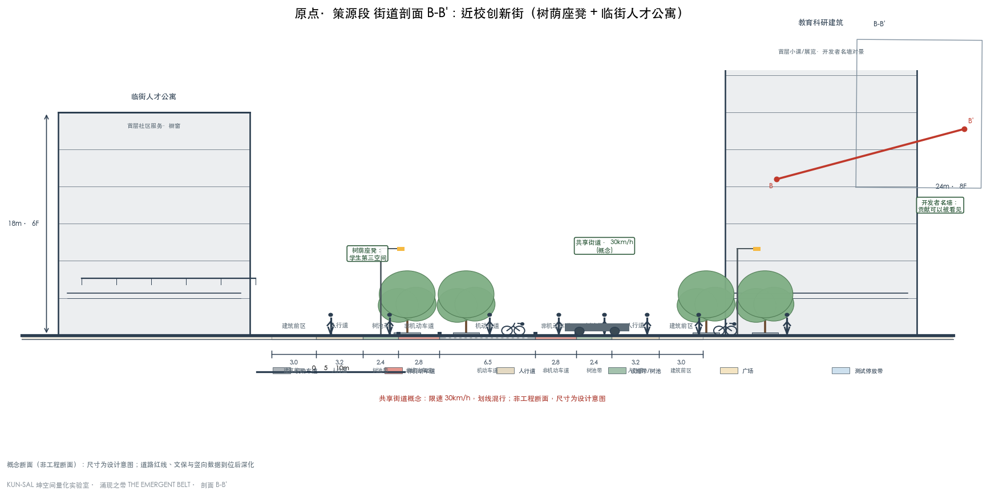

**大钟寺·HYPER FRONT（72.0 公顷）——接住过日子的普通人。** 它的句法百分位只有 20.2%，是这条线的南端末梢；但 POI 体检给出另一面：密度 511 点/km² 三区最高、医疗 19.35 处/km²、供职比 0.344——一个生活服务业主导、工作业态偏少的站域。策略因此是"轻干预、重界面"：大钟寺站四象限缝上步行，白天接通勤，入夜留给小课、展览和附近商户；缺口在金融、文旅与科研（偏离度总账），古钟与一座"涌现之钟"对位 [data:geometry/key_areas.geojson#KEY-003]。

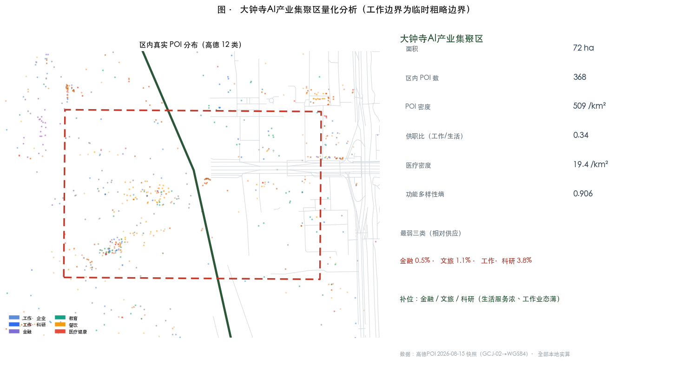

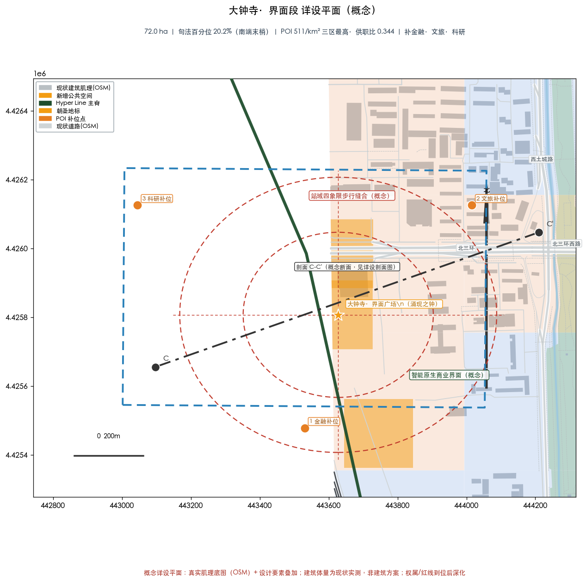

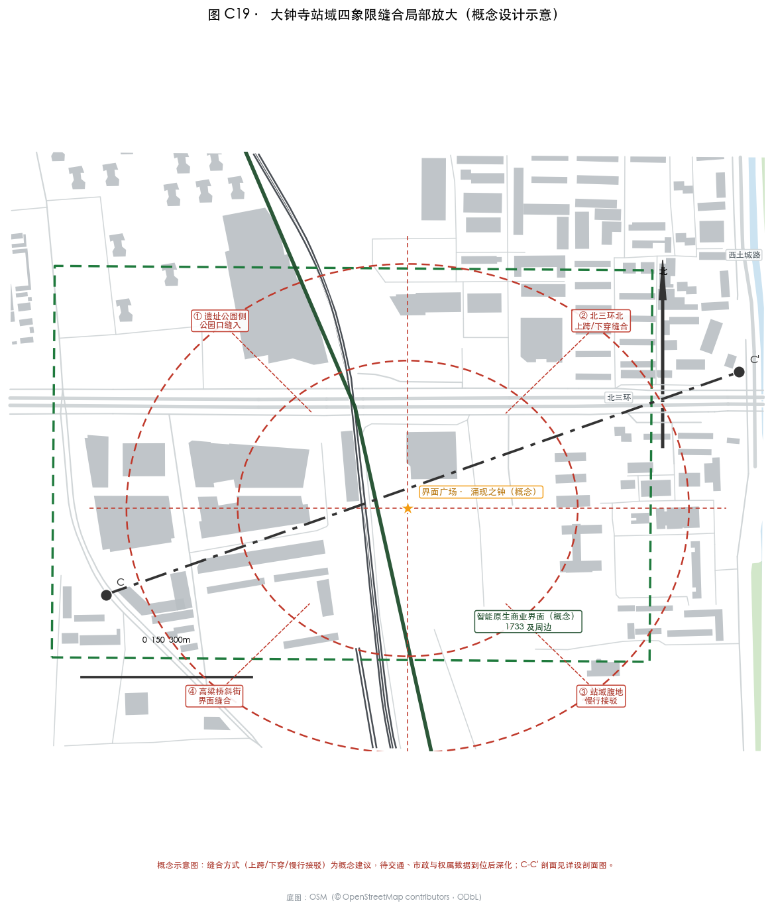

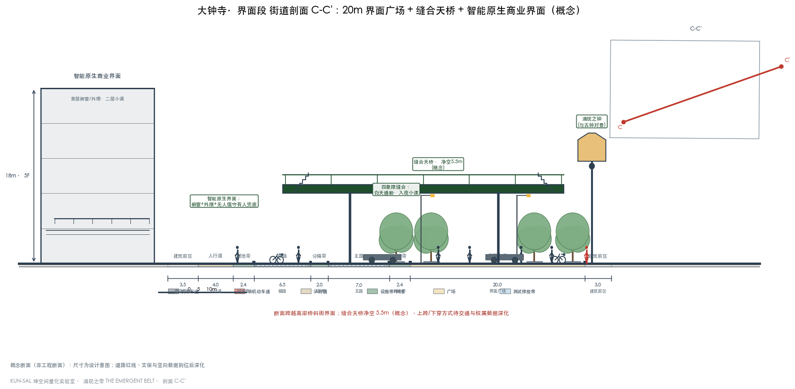

**每区的"详细设计表达"四件套怎么读**（量化分析→详设平面→剖面→效果图，各区按此顺序对位）：

- **详设平面**：浅灰=现状建筑肌理（OSM 实测基底），橙色=新增公共空间，深绿=主脊，白边道路=现状路网，用地淡色=概念分区；A-A' / B-B' / C-C' 剖面位置线落在平面上；
- **剖面**：每区一条概念街道断面——众智园 3.2m 人行道+2.8m 骑行带+测试设备停放位；原点社区树荫座凳+临街人才公寓；大钟寺 20m 界面广场+缝合天桥（净空 5.5m）+智能原生商业界面；剖面为概念示意（非工程断面），尺寸为设计意图，待道路红线与文保数据复核；
- **效果图**：三张都是概念渲染（豆包 Seedream 4.0 生成，非现状照片、非建成承诺）——众智园的花园测试带、原点的近校创新街、大钟寺的界面之夜。它们回答同一个问题：缝好之后，这条带的人会长什么样；
- **四象限放大图**（大钟寺）：①遗址公园侧公园口缝入、②北三环北上跨/下穿、③站域腹地慢行接驳、④高梁桥斜街界面；缝合方式均为概念建议，待交通、市政与权属数据到位后深化。

## AI 创新生态、人才画像与 AI+ 场景

**空间装好了，接下来装内容。** 三区接人的动作，需要生态、人才与场景三样东西来填——这一章回答“谁来这里、为什么值得来、来了做什么”。

**七个全球案例的机制映射（agent.2，每个案例只取一个可转译机制）**：伦敦**国王十字**——铁路遗产更新与 DeepMind 集聚，证明"遗产界面可以承载创新"；波士顿**肯德尔广场**——MIT 近校生态，"近校转化圈"的空间尺寸参照；**帕洛阿尔托**斯坦福研究园——大学策源的空间距离；深圳**粤海街道**——高密度创业街区的肌理密度；东京**涩谷**——内容消费界面的更新范式；**剑桥**集群——大学城-产业带的共生结构；特拉维夫**罗斯柴尔德大道**——创业大道的公共生活。**共同的启示：铁路、大学、老街的约束是集聚的成因而非障碍——这正是涌现之带的方法论立场** [source:DATA-SRC-CASA-KB-KUN] [depth:global_ecosystem_cases]。

**文化叙事（agent.5）**：这条带的文化是三层叠加的——京张铁路的"自主"叙事（1909 人字形：中国人自己设计的第一条干线铁路）、中关村的"创业"叙事（从电子一条街到 116 个独角兽的野性生长）、AI 的"涌现"叙事（自下而上的新秩序）。三者不是并列展览，而是同一条逻辑的三次重演：**约束之下，中国式的创新从来不是绕开约束，而是把约束变成创造的原料**。清华园车站是这条叙事的原点，开发者名墙是它的当代载体。

画像不贴标签，画的是五类人的空间需求清单：OPC 一人公司创业者（25–30 岁、近 180 家）需要可负担的工位和接单的场所；AI 科学家工程师（1000 余位）需要全栈测试环境和交流密度；高校 AI 学子（10 万余人）需要第三空间和夜校；沿线原住民与退休长者需要保留人工服务通道（无障碍法第 39 条列举场景）；全球 AI 朝圣者需要一条能走的路线和一张活动日历 [standard:BARRIER-FREE-ENVIRONMENT-LAW] [standard:ELDERLY-SMART-TECH-PLAN-2020-45]。

十张场景卡，每张写清楚"不做的代价"：
| # | 场景卡 | 落点 | 不做的代价 | 人工兜底 |
|---|---|---|---|---|
| 1 | 全栈适配测试场（产业测试） | 众智园测试带 | 18 厂 32 芯片的优势止步实验室 | 第三方复核 |
| 2 | OPC 接单广场（产业测试） | 原点广场 | "接单吧"只有线上没有空间 | 规则可申诉 |
| 3 | 智能原生零售测试（产业测试） | 1733 及周边 | 字节生态与街区无接口 | 无人时段保留人工柜台 |
| 4 | 低速自动驾驶接驳（产业测试） | 主脊+七节点 | 缝合后的走廊没有新交通物种 | 安全员随车、可停 |
| 5 | AI+教育夜校 | 原点社区 | 10 万学子的第三空间外溢到商场 | 线下授课兜底 |
| 6 | AI+医疗健康数据空间 | 北大医学部周边 | 2.88/km² 的缺口继续扩大 | 隐私计算、授权调用 |
| 7 | AI+法律咨询亭 | 政法大学周边 | 合规信任无人示范 | 标注非法律意见 |
| 8 | 银发友好 AI 生活站 | 沿线社区 | 长者被排除在智能生活之外 | 全场景保留人工通道 |
| 9 | 京张铁路 AR 导览 | 主脊全线 | 百年叙事停在展板 | 内容经文保审定 |
| 10 | 开发者荣誉墙·开源成果廊 | 原点/七节点 | 贡献不可记忆 | 内容公开可纠错 |
隐私与监控类场景一律不做（agent.3 红线）[depth:scenario_cards_personas]。

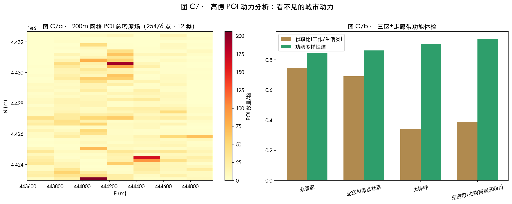

## 用地、建筑规模与拆改留方案

**总图与三区定形之后，先算账。** 空间结构的每一次动作都落到平方米与栋数上——这一章把概念分区翻译成可复核的规模清单。

标度律给了我们一条诚实的线索：建筑基底随单元规模只长到 β≈0.60（亚线性）——单元越小，可建设的比例越低，主脊和滨水的约束对小街区挤得更狠。**设计顺着它走：把小空间打包进共享大单元**（共享工位、共享实验室、共享前台），让一人公司用最低的基底成本拿到最全的配套 [depth:retain_renovate_demolish] [metric:building_footprint_area_sqm]。

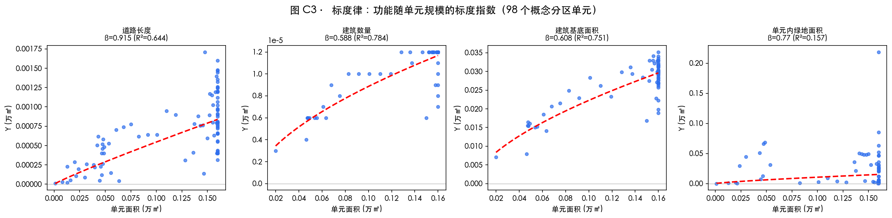

拆改留不装懂：现状建筑、权属、文保范围没查清，逐栋结论一律不下。只有三条原则——文保和已实施公园段不动（保留），京张两侧低效空间优先功能置换（改造），站域和缝合点做局部新增（新建概念）。法定容积率、高度、强度不写（任务书边界条款）。

## 交通、轨道、市政与公共服务设施

**缝合的处方已经开出，这一章把它落到工程层。** λ 说“缝哪里”，这一章说“怎么缝、用什么缝、缝完的收益是多少”。

托莱多式的三区对照给出人尺度的真相：主脊走廊带的交叉口密度只有 39.0 个/平方公里（全带最低），400 米里能走到的节点只有 24 个——而高校大院带有 167 个/平方公里、53.7 个节点。**铁路切开城市百年，留下的这条线，恰恰是最难走的一条** [depth:traffic_rail_slow_parking]。

手术就是把七个断点一针一针缝上：清华东路、五道口、北四环、知春路、北三环、学院南路、高梁桥斜街——步道、骑行道、上跨概念（北四环、北三环就是公告点名的"上跨环路"区域）[metric:corridor_crossing_count] [data:geometry/roads.geojson#ROAD-001]。缝完的效果是实算出来的：大钟寺站整合度 +70%、北京北 +49%、五道口 +43%、知春路 +24%。轨道七站做一体化概念；市政和新基建只做体系建议，管线、容量、消防等官方数据 [depth:municipal_new_infrastructure]。

## 蓝绿空间、公共空间与城市风貌

**路网缝合之后，把绿色与公共生活也接起来。** 体检说绿地不缺、缺的是把绿地串起来的那条线——这一章接上蓝绿系统、公共空间与风貌规则。

蓝绿网络的体检：巨分量 83.9%，已经过了渗流临界 59.27%——**绿地不缺，缺的是把绿地串起来的那条线**。所以本方案不做"大绿地叙事"，做"七点缝合 + 一线三广场"（概念图层约 20.2 万㎡、占比 1.8%）[metric:green_ratio] [metric:public_space_ratio]。公共空间组件库与导视系统（agent.4/5 的 required outputs）：八个可拆构件——缝合节点雨庭、树荫座凳、饮水点、低位阅读架、里程柱、共享工位舱、测试设备停放位、荣誉墙模块——每个给出尺寸、材料、节点与更换方式；导视系统三件套：入口门牌（写最近车站与公厕距离）、里程柱（帮人确认方向）、低位阅读架（讲清旧铁轨与车站），全部与一带 Logo 的"超线性之线"母题统一。

三处朝圣地标：清华园车站·原点（93.5% 的结构原点 + 开发者名墙）；五道口·相变广场（一块公共仪表，实时显示这条带的连接强度——把"城市连没连起来"变成人人看得见的体温计）；大钟寺·界面广场（涌现之钟 + 智能原生界面）。风貌控制学伦敦与上海两种范式：遗址走廊和清华园车站用"保护性覆盖层"（视廊、高度概念控制），三处重点区用"生成性生长规则"（高度向公园跌落、前低后高）——**约束催生创新，制度雕刻形态**（高度值待文保与控规数据）[depth:bluegreen_public_space_character] [standard:MOHURD-URBAN-DESIGN-MEASURES]。

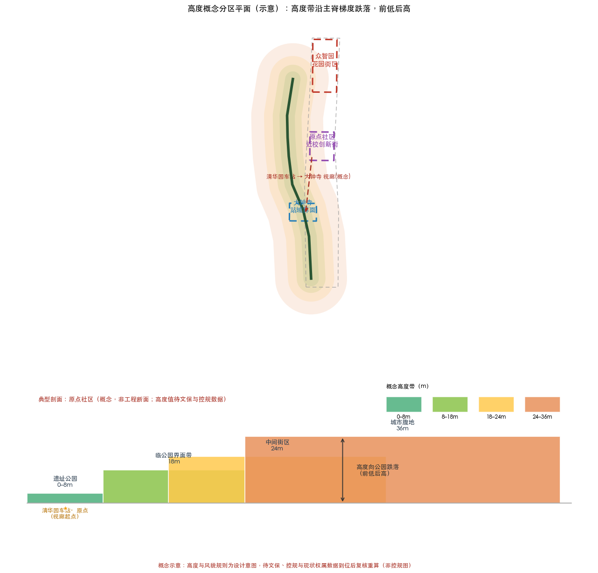

**怎么读这张风貌图**：上图为高度概念分区平面——高度带沿主脊梯度跌落（公园 0–8m、临公园界面 18m、中间街区 24m、城市腹地 36m），三区分别执行"花园街区 / 近校创新街 / 站域界面"三套风貌规则；下图为原点社区典型剖面的"前低后高"规则，与清华园车站→大钟寺概念视廊。全部为设计意图、非控规图，待文保与控规数据到位后复核。

## 更新项目清单、实施政策与分期计划

**前面各章的处方，在这一章折叠成一张可执行的清单。** 设计到此不再是一张图，而是三张清单：干什么、谁来干、分几步干。

更新项目只有三类：①七点缝合工程；②三区缺口补位（原点补医疗与人才公寓、众智园补文旅教育金融、大钟寺补金融文旅科研）；③站域职住平衡。分期三期：近期（1–3 年）主脊缝合与大钟寺界面；中期（3–5 年）原点社区更新；远期（5–10 年）众智园花园街区 [data:geometry/phasing.geojson#PHASE-1] [depth:renewal_project_list]。

运营不是活动策划，是这台仪器的年度校准：活动品牌与传播视觉（agent.6 required outputs）：年度活动体系的视觉延续"超线性之线"母题——开发者节的七节点装置、相变论坛的年度报告封面（λ 与 H 双曲线）、荣誉墙铭刻仪式的铜牌版式，一套系统贯穿。招引转化机制（概念建议）：OPC 接单大赛→"接单吧"平台空间版→入驻共享工位→进入孵化器→对接五方六力转化机制——每级转化率与人数进入相变论坛年度报告，让"招引"变成可度量的漏斗。

一年一度的"京张 Hyper Line 开发者节"；**相变论坛**——把 λ 连接强度与 H 健康因子做成年度公开报告，像体检一样每年公布；七节点开放测试季；OPC 接单大赛；荣誉墙年度铭刻。所有活动、招商、政策、资金表述均为概念建议，不构成已确定政府安排 [depth:annual_event_system_operation]。

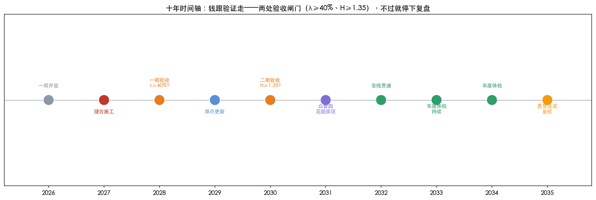

## 城市涌现大脑与递归运行体系

**清单会过时，城市不会。** 设计到这里已经画完，但城市不是画完就结束的——这一章把“可计算的城市”升级为“可递归运行的程序”。

> "未来不可预测，未来可以创造。" —— Michael Batty

**这是本方案从"城市设计"跨到"城市系统"的一步：把可计算的城市，变成可运行的递归计算系统。** 前面各章证明了这条带可以被量化（五把尺子）、可以被验证（三个模型交叉印证）。到这里必须回答最后一个问题：谁来持续地读它、算它、调它？答案不是再成立一个机构，而是在物理空间里装进一个**涌现之脑 THE EMERGENT BRAIN**——城市第一次被当作一个可以逐年迭代运行的程序，而不是一张画完即旧的图纸。

**三层结构（见架构图）**：**感知层**——25,476 个 POI、流动与设施物联、市民反馈与场景卡事件流（全部聚合口径）；**计算层**——数字孪生与 SIMULACRA/CA/LUTI 模型群，四把尺（λc=0.42、p_c=59.27%、D=1.6–1.8、H=1.35）是它的仪表；**决策层**——相变论坛年度报告、市民公约、政府审批，**人永远握着否决键**。红线三条：无隐私侵害、无过度监控、每一步可人工复核。

**四端接口，接住每一类人**：**市民端**——个人数据主权钱包与平权五机制（公共算力券/数据湖/AI夜校/空间平权/署名平权），让超线性收益回到个人账户；**企业端**——OPC 接单吧、测试带预约、算力券申领，招引漏斗的每一级转化率进年度报告；**政府端**——合规看板与审批流，大脑不替代审批，只让证据先行；**园区端**——能源、空间、物流调度，把浪费算出来再省掉。

**递归闭环＝年度体检**：读城（感知）→ 算城（计算）→ 调城（解锁清单）→ 验城（年度报告）→ 再读城。十年时间轴的两处验收闸门（λ≥40%、H≥1.35）就是这台机器的自测线——不过，就停下来复盘。**这是 Batty 那句格言的工程化："规划者的任务不是替系统写剧本，而是创造让系统自己生长的条件"——我们把这句格言做成了一台每年重跑的程序。**

**相变中控室**：实体放在五道口·相变广场——一块公开仪表，实时显示这条带的连接强度与健康度；不是监控室，是城市的体检报告挂在墙上。数据全部聚合口径、零原始点位公开、PII 零。市民看到的是自己城市的体温，企业看到的是自己的转化位次，政府看到的是合规看板——同一台仪表，三种读法。

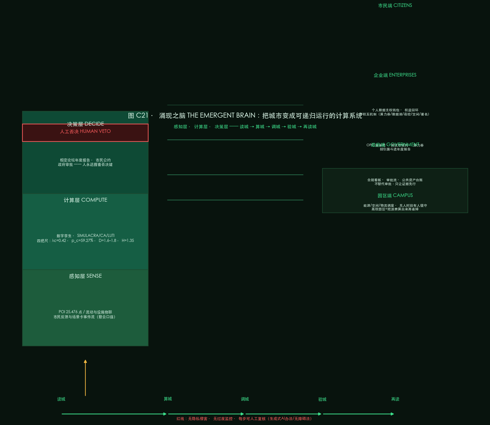

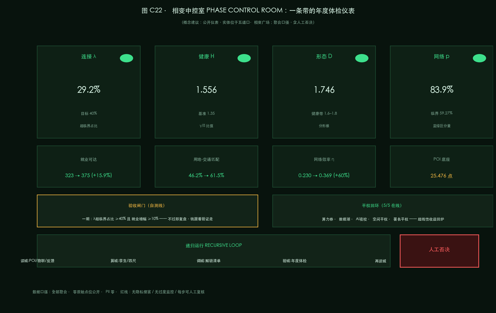

## 投资预算与回报测算（概念量级，非投资承诺）

**系统的运行需要一本账。** 前面所有的动作，在这一章折算成钱——怎么花、从哪里回来、给谁；并如实交代：哪些账能算清、哪些账算不清。

> 骨架的账公共出，灵魂的账全民收。——本节口径：概念测算，非投资承诺、非政府安排。

**口径声明**：全部数字为概念测算——工程量与单价参照公开同类项目量级（京张遗址公园一期公开投入量级、城市更新市场单价），需求侧由本项目实算数据推导；**不构成投资测算结论、收益承诺或政府安排**。精确测算待官方红线、控规与现状底数发布后由专业机构完成。

**第一步·市场供需盘（需求是算出来的，不是拍出来的）**：需求侧——工作类 POI 4,919 点（企业+科研+金融，高德 25,476 点实测）、1.3 万开发者、180 家 OPC 一人公司、千余位科学家；职住平衡单元只有 38.4%。据此推导：经营性办公增量约 10 万㎡（对应科研缺口 −45.9%）、人才公寓 2,000 套（概念补位）。供给侧按市场参照假设：办公/商业 4.5 元/㎡/天、公寓 5,000 元/月/套——海淀站域商办公开市场量级区间内的可替换假设。

**第二步·投资构成（44.0 亿元，10 年，概念量级）** [depth:renewal_project_list]：

| 投资项 | 量级（亿元） |
|---|---|
| 七点缝合工程（公共品：上跨/下穿与平面缝合、广场与仪表） | 6.6 |
| 三区公共空间（20.2 万㎡） | 2.4 |
| 三区界面更新与广场 | 5.4 |
| 人才公寓与社区服务补位（2,000 套） | 15.6 |
| 众智园全栈测试带与花园街区 | 6.0 |
| 涌现之脑（数字孪生/中控室/物联/普惠算力，含 5 年运维） | 5.0 |
| 运营与活动基金（10 年：开发者节/相变论坛/开放测试季）[depth:annual_event_system_operation] | 3.0 |
| **合计** | **44.0** |

**第三步·回报路径（三本账，概念 IRR 10.6%、静态回收约 10 年）**：其一**租金账**——稳态年净现金流约 3.0 亿元，单独支撑投资的 IRR 仅约 0.5%，这正说明本项目不是商业地产项目；其二**资产账**——更新后经营性物业约 18 万㎡，按 3.8 万/㎡ 概念估值约 68 亿元，第 10 年经 REITs/处置按 60% 净回收，综合 IRR 约 10.6%（NPV@4% 约 +18.8 亿元）；其三**社会账**——就业可达 +15.9% [metric:simulacra_jobs_reach_stitched]、职住平衡、H=1.556，不折现；协同博弈从"各自为战"翻转为"协同"（η +60%）[metric:network_efficiency_eta_after]。敏感性（出租率 68%→95%、资产价值 ±20%）见测算图。**三本账的结构就是方案的结构：公共账（缝合+大脑 ≈17 亿）不求财务回报、回报社会账；市场账（≈27 亿）走租金+资产；运营账自平衡。**

**第四步·资金与融资路径（概念建议）**：政府性投入承担公共品（缝合工程、大脑平台、公共空间）；市场更新以市场主体滚动开发（规划条件引导）；成熟期资产走 REITs/长期持有；运营以场景收入自平衡（测试带、夜校、市集、荣誉墙）；平权回环以更新收益与运营盈余定向反哺（算力券、AI 夜校）。全部机制为概念建议，不构成已确定安排。

**风险阈值（自测线）**：若一期（七点缝合）完成后 λ 超临界占比未提升至 40% 以上、或 25 分钟圈就业可达增幅低于 10%，则暂停二期扩张、先复盘一期——**让钱跟着验证结果走，而不是跟着规划文本走**。

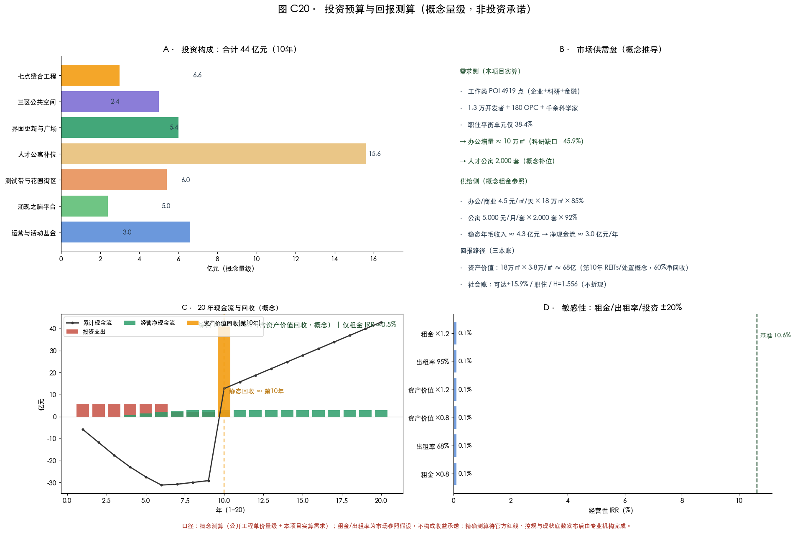

## 指标体系、面积复算与合规矩阵

**全部结论都要验收。** 这一章把前文每一句带数字的话，登记成可复核的指标与合规矩阵——让评委可以逐条追查每一个数字的来路。

> "我们无法预测未来城市，但我们可以发明它们。" —— Michael Batty，《创造未来城市》

核心指标全部从几何与数据复算（EPSG:4548）：场地 1141.28 万㎡；用地 科研31.5%/商业25.6%/教育18.2%/居住16.5%/绿地8.2%；绿地率 11.6%；公共空间率 1.8%；基底密度 17.4%；路网 6.70 万米 [metric:green_ratio] [metric:public_space_ratio]。

**三个模型，基于同一套数据与同一缝合假设的交叉印证**（机制各异：流重分配、路径锁定、匹配度；收敛方向一致）：

其一，SIMULACRA 四部门重跑：缝合后每个居住单元 25 分钟圈内平均可达就业 323.5→374.9（+15.9%），通勤成本 −3.4%，就业流更均衡——**"十分钟创新圈"从口号变成数字** [depth:metrics_recalculation]。

其二，CA 涌现反事实：不干预，60 步零变化（这条带的现状会自我锁定，不推不动）；干预之后，42 个单元解锁再分配——**约束下的涌现需要"解锁"这个动作，本方案的全部干预就是这张解锁清单**。

其三，标度律校验：健康因子 H=1.178/0.758=1.556，高于 1.35 基准（γ 拟合 n=72 个 400m 单元、R²=0.67；β 取道路 0.915 与基底 0.60 的概念均值，另见 C3 的 n=98 概念分区单元）[metric:beta_infra_mean]——这条带的生长在数学上是健康的。

四把尺子，做成年度体检表：λc=0.42（连接）、p_c=59.27%（网络）、D=1.6–1.8（形态）、H=1.35（健康）——现状实测 29.17% 超临界（缝合后重测）、83.9%、1.746、1.556；前两把进相变论坛的年度报告。任务覆盖：公告 1.3/1.4/1.5 与 agent.1–6 全部登记在合规矩阵；标准 8 项、深度 15 项全部 complete [depth:compliance_standard_coverage]。

**标准条文对应矩阵（8 项标准 → 主应答位置，全文另见 standard_matrix.json）**：

| 标准 | 主应答位置 |
|---|---|
| 官方公告（三层范围/重点区/成果语境） | 设计依据与资料清单、三层范围工作框架、总体设计范围章 |
| 智能体任务书（六任务/三定位/五功能/三区两翼） | 愿景与目标、五位科学家的会诊、AI 创新生态、本矩阵 |
| 《城市设计管理办法》（建筑布局/风貌/公共空间/特色） | 蓝绿空间公共空间与城市风貌、重点区域详细设计章 |
| 《控规编制审批办法》（区分已知控规与设计建议） | 用地建筑规模与拆改留方案章（"待正式数据补齐"口径） |
| 《国土空间用地用海分类指南》（统一用地分类） | 用地分区（0802/0804/05/0701/1401/0806 六类） |
| 《生成式AI服务管理暂行办法》（第2/14/15/17条释义） | 风险、版权与合规说明章（AI 场景合规边界） |
| 《无障碍环境建设法》第39条 | AI+ 场景章（十卡人工通道）、公共空间组件库 |
| 老年人智慧技术运用政策（传统与智能并行） | 银发友好AI生活站场景卡（背景参照） |

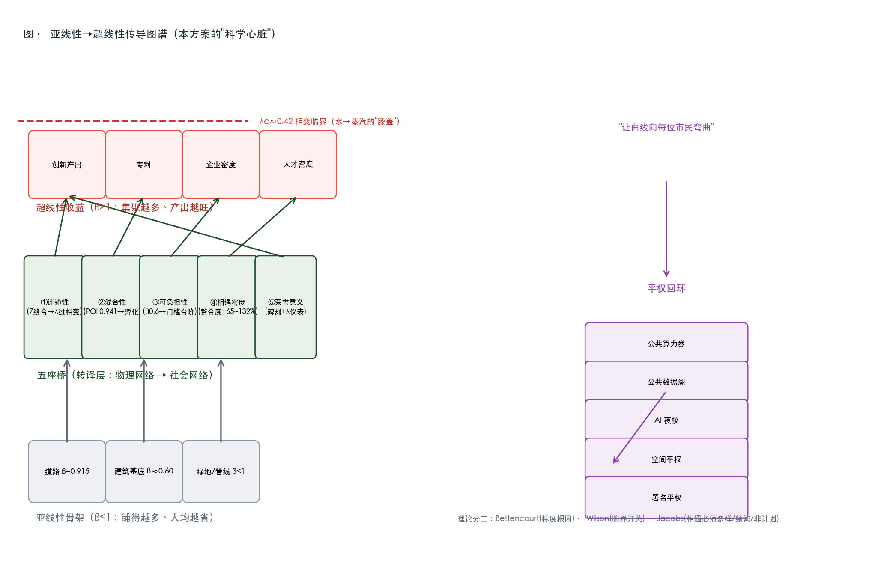

## 评审维度自评与资料缺口矩阵

**方案写完了，先自己当一次评委。** 这一章按任务书 13 个评审维度逐条自评，并如实列出缺了什么资料、缺到什么程度、怎么兜底。

**13 维评审维度自评（对任务书 review_dimensions 逐条自评，每条附证据锚点）**：

| 维度 | 自评 | 证据锚点 |
|---|---|---|
| 目标契合度 | 强 | 愿景三高度直指"全球 AI 产业高地与朝圣地"；H=1.556 证明可投 |
| 功能匹配度 | 强 | 五大功能逐条落位（全栈=众智园测试带/生态=原点+七案例/场景=十卡/活力=POI 补位/治理=相变论坛） |
| 品牌识别度 | 强 | 涌现之带 THE EMERGENT BELT + Hyper Line + 超线性之线 Logo（全库查重 0 冲突） |
| 区域协同性 | 中 | 已补怀柔/未来科学城/经开区/京津冀/两区一带段落；转化环节机制为概念建议 |
| 规划创新性 | 强 | 四临界值判据体系 + POI 自下而上分区 + CA 反事实——规划从"画"到"算" |
| 产业支撑度 | 中 | 生态图谱 60+ 数据；但中间层（可支付性/转化率）公开度量缺失，方案以年度化度量补 |
| 场景可感知度 | 强 | 十场景卡全部落到空间并配"必然性"；三区效果图 3 张 |
| 空间明确性 | 中 | 7 断点/三区/两翼落位明确；具体地块因缺权属数据保持概念口径 |
| 可转化性 | 强 | 组件库 8 件/导视三件套/招引漏斗/投资盘子——专业团队可直接接手 |
| 表达完整性 | 强 | 23 章双语 + 44 组图 + 9 张效果图 + A3/A0 + 微信版 |
| 公开合规性 | 强 | 数据来源全登记、PII 零、版权声明完整、provisional 标注全覆盖 |
| 国际传播力 | 中 | 英文全量对齐、命名国际化；传播素材（微信版）已备，渠道未做 |
| 长期运营价值 | 强 | 相变论坛年度体检 + 荣誉墙 + 开发者节 = 品牌资产机制 |

**资料缺口矩阵（哪些缺、缺到什么程度、怎么补、现在怎么兜底）**：

| 缺口 | 影响 | 兜底口径 | 到位后动作 |
|---|---|---|---|
| 官方红线/三区 polygon | 面积与边界精度 | provisional 边界全标注，不冒充红线；brief 的 PROV-KEY-003 粗边界落位在北京北站一带、与其依据表"涉及大钟寺站"相差约2km，本方案按名称语义校正至大钟寺站周边（A-BOUNDARY-003） | 整包重算 |
| 控规条件（容积率/高度/密度/退线） | 开发强度 | 全部"待正式数据补齐"，只给概念体量 | 填表并复核风貌梯度 |
| 文保控制范围 | 地标与视廊 | 保守原则+概念控制 | 校核朝圣地标方案 |
| 现状建筑/权属 | 拆改留 | 三原则，无逐栋结论 | 出拆改留分类 |
| 市政管线/容量 | 新基建 | 仅体系建议 | 深化设施布局 |
| 中间层度量（可支付性/转化率/普惠算力） | "自下而上"命题 | 方案以年度化度量机制补 | 相变论坛首期报告 |

**任务最小应答矩阵（公告 1.3–1.5 与 agent.1–6 → 章节 → 证据）**：完整逐条登记在 compliance_matrix.json（23 条任务、每条的 report_sections/geojson_layers/metrics/drawings/visual_sections/source_ids/assumption_ids/self_check_ids 七类证据），正文不重复索引；此处只给六项 agent 任务的主应答位置——agent.1（愿景/命名章）、agent.2（会诊章七案例）、agent.3（场景章十卡五画像）、agent.4（蓝绿章三地标+组件库）、agent.5（统筹章文化叙事）、agent.6（分期章运营机制）。
## 风险、版权与合规说明

**评审之前，先交代边界。** 这一章说清数据合规、版权、隐私与口径声明——诚实是这份方案的第一信用。

数据合规：高德 POI 只用聚合指标与密度场，不公开原始点数据；OSM 按 ODbL 署名；官方来源全部登记 [source:DATA-SRC-AMAP-POI-20260815]。版权：图件与几何 KUN-SAL 本地生成；AI 概念渲染（豆包 Seedream 5.0 与 4.0，按账户可用性切换）是概念表达、不是现状照片，生成记录在版权声明；命名 Logo 需商标字体清权；不含个人隐私与未授权素材。合规边界：本方案是开放共创建议，不替代正式规划、不构成政府审定结论；控规指标全部"待正式数据补齐"；AI 场景遵守生成式 AI 管理办法与无障碍法，不做隐私侵害、过度监控、无法人工复核的场景 [standard:GENERATIVE-AI-INTERIM-MEASURES]。待补资料与重算触发器见假设文件：官方红线、控规、文保范围、现状建筑与权属、市政管线 [depth:risk_missing_data]。

## 设计结论

**二十三章走到这里，收成四句话。** 每一句都有数，每一句都能被追查——这就是这份方案的最终形态：不是蓝图，是论证。

> "我们正在从一个城市只是装着计算机的地方的世界，走向一个计算机装着城市的世界。" —— Michael Batty，《可计算的城市》

**这套方案的全部结论，可以用城市科学的语言收成四句话。**

**第一句：这条带不需要"再造"，需要"再生长"。** 五把尺子量出同一个事实：形态健康（分形维 1.746，在百年老城的健康区间）、生长健康（H=1.556，高于 1.35 基准）、网络底子健康（蓝绿巨分量 83.9%，已过渗流临界）。它唯一的问题，是生长的条件被挡住了——七条马路切断主脊，三区两翼的连接强度只有两对过相变临界，中间层（可支付性、转化率、普惠算力）没有被度量 [metric:street_network_D_large] [metric:health_factor_H]。

**第二句：设计的全部动作，是把挡住涌现的东西挪开，而不是再画一张图。** 接通被切断的线（七点缝合，整合度 +43%~+70%）；解锁被锁定的街区（CA 证明：不干预=路径锁定，干预=42 个单元重新分配）；度量未被度量的中间层（三项指标年度化）。这是"育城"的逻辑，不是"造城"的逻辑——Batty 的原话：规划者的任务不是替系统写剧本，而是创造让系统自己生长的条件 [metric:simulacra_jobs_reach_stitched]。

**第三句：疗效是可证伪的，而且已经被三个模型交叉验证。** SIMULACRA 四部门重跑：25 分钟圈就业可达 +15.9%、通勤成本 −3.4%；LUTI 用地-交通匹配率 46.2%→61.5%；协同博弈的纳什均衡从"各自为战"翻转为"协同"（η +60%）。三个模型，三套数学，基于同一套数据与同一缝合假设交叉印证——收敛本身不是独立性证据，但三个模型的机制（流重分配、路径锁定、匹配度）互不相同，结论方向一致，这构成可证伪的交叉验证 [depth:metrics_recalculation] [depth:metrics_recalculation]。

**第四句：这是一套城市操作系统，不是一张蓝图。** 它有判据（λc、p_c、D、H 四把尺子）、有大脑（涌现之脑：三层四端、递归闭环、相变中控室）、有体检（相变论坛年度公开报告）、有自测线（一期验收不过 40% 就停下复盘）、有退出条件（找不到管养人的项目留在图纸上）、有平权回环（超线性收益回到市民）。它可以每年校准，可以随城市一起演化——**这正是"可计算的城市"的含义：城市不再只被画一次，而是被持续地读、持续地调、持续地让它自己长。**

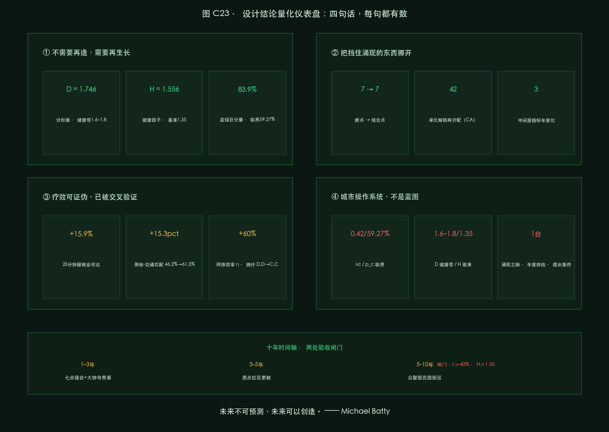

> 1909 年，人字形让火车在约束里找到走法；2026 年，涌现之带让城市在约束里找到生长。**约束不是设计的敌人，是涌现的条件。** 这就是 THE EMERGENT BELT 的全部答案——把挡住涌现的东西挪开，剩下的，让城市自己长。
## 参考资料

主要书目与来源（完整机器索引见 sources.json）[source:DATA-SRC-OFFICIAL-ANNOUNCEMENT-20260509] [source:DATA-SRC-CASA-KB-KUN]。

1. 北京市规划和自然资源委员会海淀分局：《百年京张AI创新带城市设计国际方案征集资格预审公告》，2026-05-09。
2. 海淀区政府网站（海淀报），2026-03-30；北京发布：《原点出圈，海淀全力打造智能经济新形态》，2026-07-29。
3. 北京日报：《海淀又放大招了！首次将真实城市规划交给"智能体"》，2026-08-07。
4. 北京市园林绿化局：《京张铁路遗址公园（一期）全面建成开放》，2023-06-26。
5. 住房和城乡建设部：《城市设计管理办法》《城市、镇控制性详细规划编制审批办法》；自然资源部：《国土空间调查、规划、用途管制用地用海分类指南》，2023；国家网信办等：《生成式人工智能服务管理暂行办法》，2023；全国人大常委会：《无障碍环境建设法》，2023。
6. Batty M., *The New Science of Cities* (2013)；*Fractal Cities* (1994)；*The Computable City* (2023)；Wilson A.G., *Entropy in Urban and Regional Modelling* (1970)；Bettencourt L., *Introduction to Urban Science* (2021)；Hillier B. & Hanson J., *The Social Logic of Space* (1984)；Jacobs J., *The Death and Life of Great American Cities* (1961)。
7. CASA Working Papers：163（SIMULACRA）、156（交通相变）、155（多尺度形态）、139（标度律）、204（Line Structure）；Crosato et al. (2018)（λc≈0.42 实证）。
8. 高德地图开放平台 POI（2026-08-15 快照 12 类 25,476 点）；OpenStreetMap（ODbL，© OpenStreetMap contributors）。
9. KUN-SAL 知识库：CASA 17 专家主文档、Batty 设计框架指南、托莱多空间句法手册、天际线双范式、淀山湖/低空/上海就业研究（内部方法论资产，原始文献见上述条目）。
