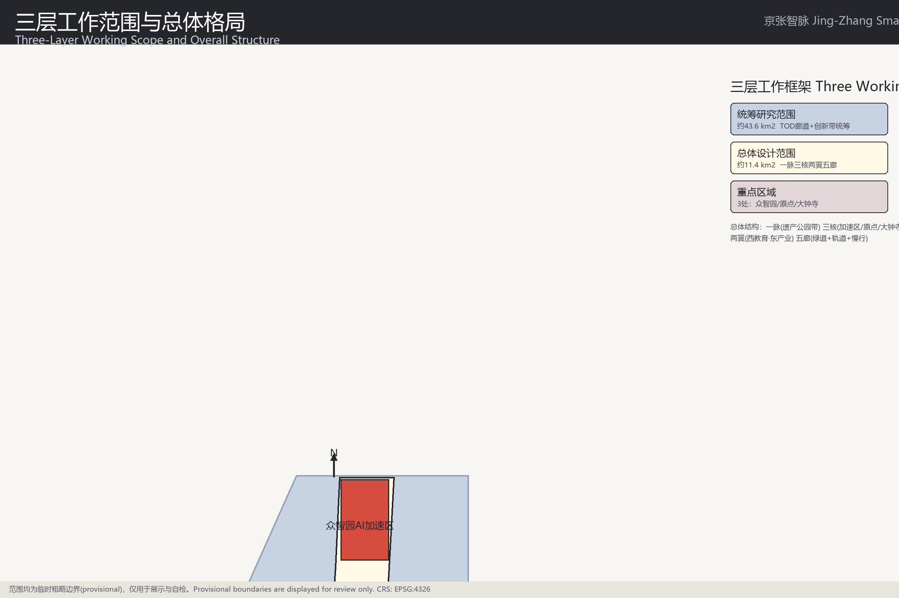
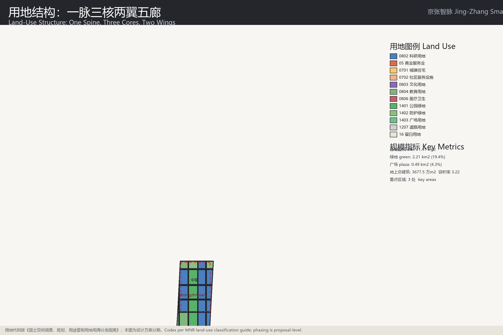
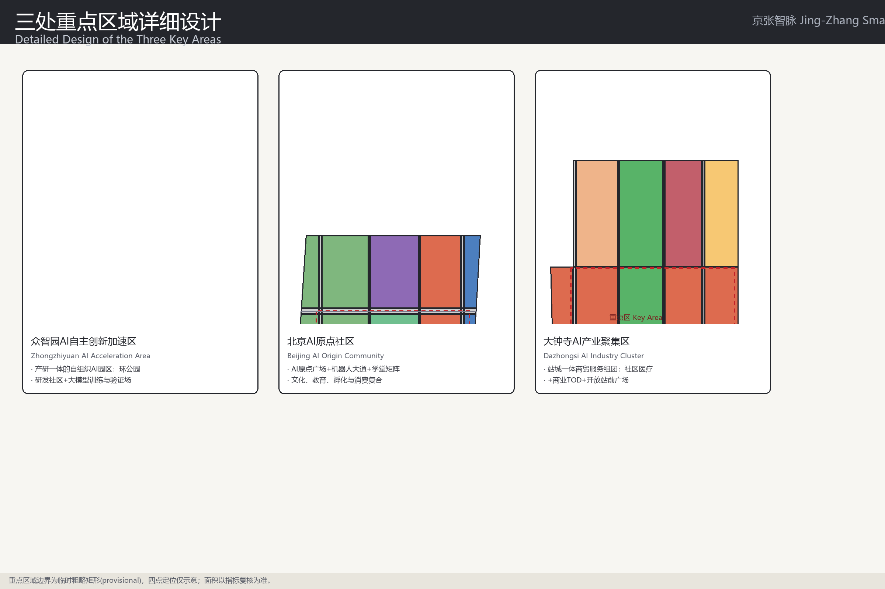
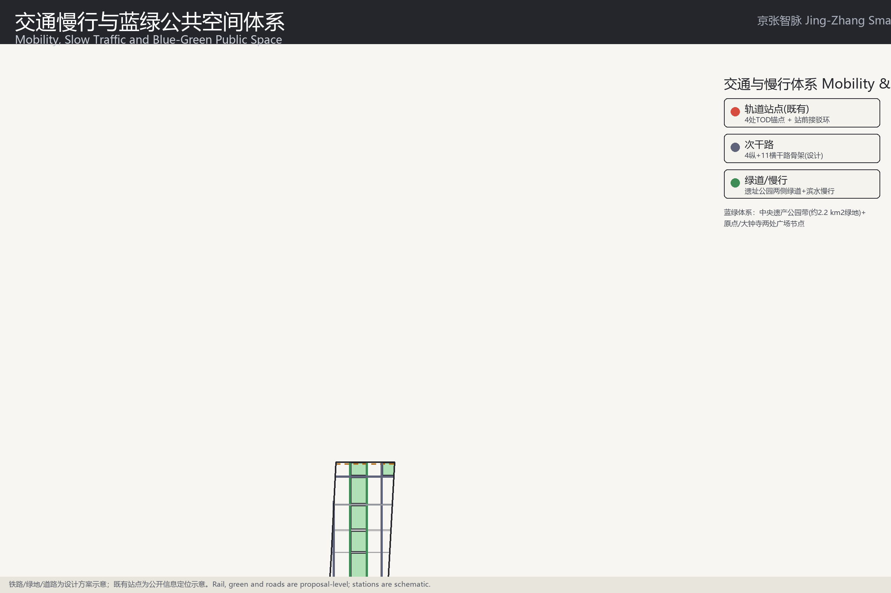
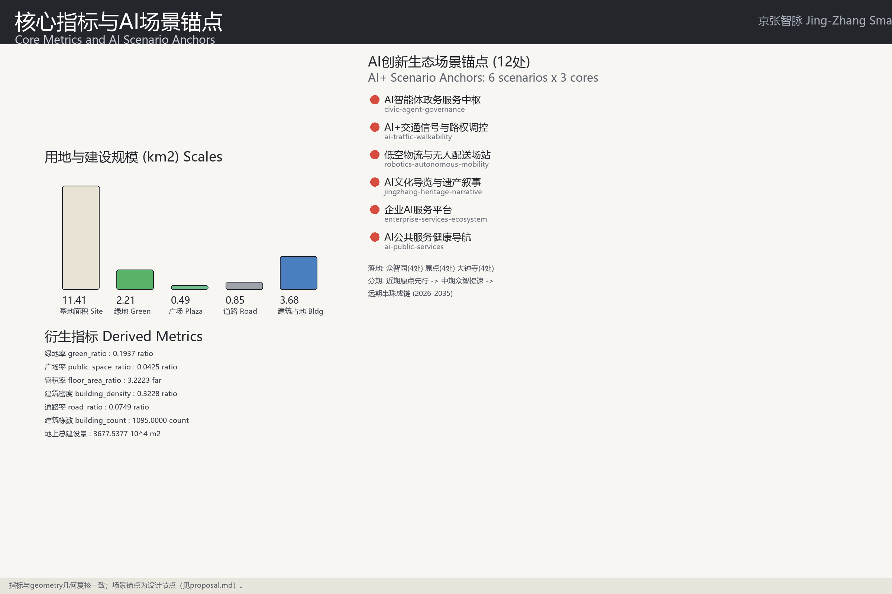

# Centennial Jing-Zhang AI Innovation Belt Urban Design: Three Districts, Two Wings, Jing-Zhang Smart Pulse

## Design Basis and Source List

This formal proposal takes the "Pre-qualification Announcement for the International Urban Design Solicitation of the Centennial Jing-Zhang AI Innovation Belt" issued by the Haidian Branch of the Beijing Municipal Commission of Planning and Natural Resources as its primary basis, and treats the maintainer-registered provisional boundaries, key areas, enums, metrics, and source lists under `brief/site-package/` as its machine-readable basis. Before generating the proposal, an AI agent must read `design_brief.json`, `allowed_design_space.json`, `sources.json`, `enums/`, `ranges/`, `schemas/`, `data/source_registry.json` and `data/processed/agent_fact_pack.md`, and must use `project_scope_summary.csv`, `agent_task_requirements.csv`, `source_use_matrix.csv`, and `missing_data_checklist.csv` to establish task, scope, source-use, and data-gap inventories. Every design judgment is decomposed into traceable sources, recomputable metrics, checkable layers, and human-reviewable assumptions. The announcement requires the proposal to reach the urban design depth of a regulatory detailed plan and the urban design depth of a comprehensive implementation plan, so narrative text cannot substitute for the GeoJSON layers, metrics tables, A3 booklet, A0 boards, and HTML digital deliverables.

The package is not an independent vision statement but a result organized from the announcement, the agent-facing task book, and the site package. This section only places the most critical bases next to the judgments [source:OFFICIAL-ANNOUNCEMENT] [source:AGENT-TASKBOOK] [depth:existing_conditions_diagnosis]. The complete source and standard coverage is stored in `sources.json`, `standard_matrix.json`, and `design_depth_matrix.json`, and is not repeated as machine indexes in the body.

The usage boundaries of the source registration are as follows [source:SOURCE-REGISTRY]:

- data/source_registry.json registers the usage boundaries of public, rights-cleared, and provisional materials.
- Current registration summary: 7 formal items, 1 background item, and 1 provisional-only item.
- The agent must not upgrade background_only or provisional_only materials into official boundaries, statutory regulatory plans, formal scoring bases, or government implementation commitments.

`data/processed/agent_fact_pack.md` is the reading navigator for this proposal, not a new authoritative source [source:PROCESSED-FACT-PACK]. It helps the agent organize the three-level scopes, three key areas, announcement tasks, agent.1-agent.6, material availability, and missing-data matters into a readable proposal; factual judgments must still return to the registered original materials [source:OFFICIAL-ANNOUNCEMENT] [source:AGENT-TASKBOOK], and the full source relationships are stored in `sources.json`.

Before the official `SITE_BOUNDARY` or the three `KEY_AREA` polygons are released, this scaffold generates a temporary formal package from `brief/site-package/geometry/provisional_boundaries.geojson`. The `geometry/site_boundary.geojson` and `geometry/key_areas.geojson` files in the package must be marked `provisional_constraint` with `official_boundary=false`; they may only be used for proposal generation, self-checking, visualization, and design discussion, and cannot serve as an official redline, approval basis, precise area basis, or statutory control conclusion. This organizer-side data gap does not itself block content scoring; after the official polygons are substituted, site boundary, key areas, land use, roads, green space, public space, buildings, phasing, and metrics must all be recalculated.

The scorable status generated by this scaffold is: **provisional boundary, precision caveats retained, to be recalculated after official data release; content scoring is not blocked**. Therefore the spatial structure, scenarios, projects, and metrics in the body are written on the principle of "discussable, reviewable, and recalculable after official boundary substitution"; when the official boundary and key-area polygons are updated, the agent must rerun the scaffold, self-checks, and drawing/HTML generation rather than replacing a single file.

Boundary interpretation can return to the overall-scope layer and the area recalculation [data:geometry/site_boundary.geojson#PROV-SITE-001] [metric:site_area_sqm]. The three key areas are cross-checked through their own layers and count metrics [data:geometry/key_areas.geojson#PROV-KEY-001] [metric:key_area_count]. This means readers can enter the evidence from the text without first reading a string of machine identifiers.

## Three-Level Scope Framework

The proposal organizes work in the three levels established by the announcement: the coordinated research area covers a 43.6 km2 AI industry ecosystem, strategic positioning, innovation chain, and future urban form; the overall design area covers 11.4 km2 of urban areas and industrial zones 1-2 km around the Jing-Zhang Heritage Park, requiring an overall urban renewal framework, industrial spatial layout, transport and municipal support, and urban appearance control; the key area scope covers 368.4 hectares in three detailed design areas, requiring functional programs, building scale, retain-renovate-demolish classification, public space connectivity, and traffic organization. The three levels are mapped item by item in `compliance_matrix.json`, ensuring that every mandatory task of announcement tasks 1.3, 1.4, 1.5 and agent.1-agent.6 has chapter, layer, metric, drawing, and HTML evidence.

The depth items of the three-level working framework are constrained by [depth:three_level_scope_framework] and [depth:overall_spatial_structure]; spatial evidence is governed by [data:geometry/site_boundary.geojson#PROV-SITE-001] and [data:geometry/key_areas.geojson#PROV-KEY-001]; task basis follows [standard:PROJECT-OFFICIAL-ANNOUNCEMENT]; and scope indexing uses the three-level scope table of `project_scope_summary.csv` in [source:PROCESSED-FACT-PACK] as navigation.

The three levels are not a set of detached drawings. The coordinated research determines the industry chain and urban form judgment; the overall design implements the judgment into renewal projects, spatial structure, and facility capacity; the key-area detailed design verifies the implementability of specific parcels, buildings, transport, public space, and AI application scenarios. When generating the proposal, the agent must first fix the official or provisional boundary and constraints adopted by the current submission, then generate land use, buildings, roads, green space, public space, phasing, and AI service nodes, and finally recompute the metrics from these layers and explain in the body which conclusions remain limited by the provisional boundary. Any area, ratio, scale, or project count that cannot be recomputed from structured data must not be written as a formal conclusion.

The overall concept recommended by this proposal is the "Jing-Zhang Smart Pulse": the Jing-Zhang Heritage Park as the historical and public space spine (one spine); the Zhongzhi AI Innovation Acceleration Zone, the Beijing AI Origin Community, and the Dazhongsi AI Industry Cluster Area as innovation anchors (three cores); education functions along Qinghe-Xueyuan Road and industrial functions east of the Jing-Zhang railway as the two wings; and greenways, rail, arterial roads, slow-traffic links, and blue-green corridors as the five corridors (five corridors), forming a spatial organization of "one spine, three cores, two wings, five corridors, multiple scenario nodes". Geographically the proposal is implemented as 219 closed land-use parcels ([data:geometry/land_use.geojson#LU-B10-U7] and others, including the 1207 road parcels), 12 AI scenario anchors (four per core, see the AI chapter), and the PH-1/PH-2/PH-3 implementation phase boundaries ([data:geometry/phasing.geojson#PH-1]). The "one spine" is not an extra newly drawn redline; it translates the announcement's three-level scope into a working method. The "three cores" correspond to the three key areas; the "multiple scenario nodes" correspond to operable nodes of AI+ public services, industry services, and urban life; and the "five corridors" correspond to the linkage of slow traffic, green space, public space, and activity routes.

| Level | Design question | Proposal answer | Data landing point |
| --- | --- | --- | --- |
| Coordinated research area | How is the AI industry ecosystem and future urban form organized | Build an innovation chain of "university source - open-source collaboration - enterprise transfer - public experience - international outreach" | compliance_matrix.json, standard_matrix.json |
| Overall design area | How are industrial space, urban renewal, transport and municipal works, and urban character mapped | Land use, buildings, roads, green space, public space, and phasing layers jointly express it | [data:geometry/land_use.geojson#LU-B10-U7], [data:geometry/roads.geojson#LU-R2-U1] |
| Key area scope | How do the three districts reach detailed design depth | Each proposes positioning, spatial actions, AI scenarios, and implementation dependencies | [data:geometry/key_areas.geojson#PROV-KEY-001], [data:geometry/key_areas.geojson#PROV-KEY-002], [data:geometry/key_areas.geojson#PROV-KEY-003] |

## Coordinated Research Area: Industry and Future City Research

The core task of the coordinated research area is to build a world-class AI innovation ecosystem. The proposal should survey Haidian's universities and research institutes, leading enterprises, computing-power-algorithm-data-factor resources, incubation platforms, listed companies, unicorns, and sci-tech services, and propose a spatial coordination framework for the AI innovation chain, industry chain, talent chain, and urban service chain. The naming proposal and logo design should serve the overall recognizability of the "Centennial Jing-Zhang cultural belt, urban AI life experience belt, and AI-integrated innovation belt", and must not stop at slogans; they should explain the link to the industry ecosystem, public space, and cultural resources. The agent-facing task book also requires responses to the "five functions" and the "three districts, two wings" coordination, forming a name system, visual identity, overall spatial structure diagram, scenario opening, and operation mechanism that can be further developed; this section must use [source:AGENT-TASKBOOK] and [standard:PROJECT-AGENT-OPEN-CALL-TASKBOOK] to indicate that these requirements come from the agent open-call tasks rather than statutory planning control.

The coordinated research does not add fake precise redlines; through the coordination of urban character, public space, and building layout required by [standard:MOHURD-URBAN-DESIGN-MEASURES], it connects back to [data:geometry/land_use.geojson#LU-B10-U7], [data:geometry/public_space.geojson#LU-B6a-U5], and [depth:overall_spatial_structure], showing that the industry strategy ultimately lands in a visible, reviewable spatial structure.

The future urban form study should answer how AI changes work, life, social interaction, learning, transport, and public services. The proposal should implement AI transport systems, continuous green space, innovation service facilities, and an internationalized living-working atmosphere as locatable functional zones, nodes, corridors, and scenarios rather than vague technical visions. The agent should write industrial strategy metrics, an AI innovation index, talent density, spatial supply types, and key areas of AI+ vertical applications into the metrics system, and mark which are official, which are design recommendations, and which still await official data calibration. If global AI innovation activities, developer communities, open scenarios, or pilgrimage routes are proposed, they should be written as "conceptual recommendations / reference proposals / open for deepening by professional teams", not as confirmed government activities or implementation arrangements.

## Overall Design Area: Urban Renewal and Regulatory-Plan-Level Urban Design

The overall design area is required to reach the urban design depth of a regulatory detailed plan. The proposal must present an overall urban renewal spatial structure, identification of low-efficiency spaces, a renewal project list, implementation policy recommendations, industry function proportions, spatial organization models, total building scale, and a composite capacity assessment. `geometry/land_use.geojson` must completely cover the design boundary without overlaps, `geometry/buildings.geojson` must express renewed or retained building footprints, `geometry/roads.geojson` must express micro-circulation, slow traffic, and rail connection relationships, and `metrics.json` must recompute core areas, ratios, and layer counts.

Following [standard:MOHURD-CONTROL-DETAILED-PLANNING], this section decomposes regulatory-plan-depth content into reviewable objects: [data:geometry/land_use.geojson#LU-B10-U7] expresses the land-use structure, [data:geometry/buildings.geojson#BLDG-0001] expresses building footprints, [data:geometry/roads.geojson#LU-R2-U1] expresses traffic organization, [metric:building_footprint_area_sqm] is used to recheck the building footprint area, and [depth:land_use_layout] and [depth:development_intensity_controls] constrain the depth of the deliverables.

The overall design must also support transport, rail, municipal, and supporting facilities. The proposal should propose spatial layouts and implementation paths for transit station-integrated development, road micro-circulation, bicycle parking, parking supply, innovation service platforms, talent living services, new infrastructure, distributed energy, and on-device computing. Content involving building height, development intensity, road redlines, setbacks, and facility standards, when no official control conditions exist, shall be written as "to be confirmed by formal regulatory plan conditions" and must not masquerade agent-inferred values as approved indicators.

## Detailed Design of Key Areas

Detailed design of key areas is mandatory. The Zhongzhi AI Innovation Acceleration Zone should propose detailed schemes around the national AI platform, full-stack independent innovation, standard setting, safety governance, industry exhibition, external transport, Qinghe culture, low-carbon green innovation and exchange environments, and AI scenarios in green space. The Beijing AI Origin Community should propose detailed schemes around university-adjacent innovation, achievement incubation and transfer, a talent special zone, the open-source system, brand events, building retain-renovate-demolish, achievement publication and exhibition, residential and living amenities, campus-campus slow-traffic links, and transit station integration. The Dazhongsi AI Industry Cluster Area should propose detailed schemes around leading enterprises, agents, intelligent terminals, content consumption, data factors, digital assets, commercial services, compound use of planned green space, Dazhongsi station integration, and four-quadrant pedestrian connectivity at the intersection.

The detailed design of the three key areas must reference [data:geometry/key_areas.geojson#PROV-KEY-001], [data:geometry/key_areas.geojson#PROV-KEY-002], and [data:geometry/key_areas.geojson#PROV-KEY-003], and [depth:three_key_area_detailed_design] checks whether they reach the depth of a comprehensive implementation plan. A mere "build a demonstration zone" statement without function, building, transport, public space, and implementation-project evidence shall be treated as incomplete.

The three key areas must appear in `geometry/key_areas.geojson`. If the repository provides official polygons, they shall be used as `official_constraint`; if official polygons are missing, `provisional_constraint` may be used temporarily, but the body, HTML, sources, assumptions, and self_check must state that they cannot serve as formal scoring or approval bases. `compliance_matrix.json` must cover announcement tasks 1.5.3.1, 1.5.3.2, and 1.5.3.3 respectively. The design expression should include functional programs, building scale, building form, retain-renovate-demolish classification, public space systems, traffic organization, slow-traffic connectivity, and implementation projects. The HTML pages should be able to switch between the three key areas, and the A3 booklet and A0 boards must include at least master plans of the key districts, partial details, and indicator notes.

| Key district | Design positioning | Spatial actions | AI industry and operation scenarios | Evidence references |
| --- | --- | --- | --- | --- |
| Zhongzhi AI Innovation Acceleration Zone | Garden-style full-stack independent innovation quarter | Strengthen the Qinghe waterfront interface, industry exhibition, low-carbon innovation exchange, and external transport organization; use green space for open testing and standard-governance exhibition | Autonomous model testing, standard-setting workshops, safety governance exhibition, low-carbon computing experience | [data:geometry/key_areas.geojson#PROV-KEY-001], [depth:three_key_area_detailed_design] |
| Beijing AI Origin Community | University-adjacent achievement-transfer and talent community | Organize campus-campus-street slow-traffic stitching; add achievement publication, talent services, living amenities, and open-source collaboration space | Open-source community, achievement publication, talent special zone services, university-adjacent incubation | [data:geometry/key_areas.geojson#PROV-KEY-002], [source:AGENT-TASKBOOK] |
| Dazhongsi AI Industry Cluster Area | Urban smart-economy and international exchange quarter | Around Dazhongsi station integration, four-quadrant pedestrian connectivity, commercial services, and public environment renewal around key enterprises | Agent and intelligent terminal exhibition, content consumption, data factors, and international roadshows | [data:geometry/key_areas.geojson#PROV-KEY-003], [metric:key_area_count] |

## AI Innovation Ecosystem, Personas, and AI+ Scenarios

The proposal should build spatial demand personas for AI talent and enterprises, covering R&D offices, open-source collaboration, achievement publication, enterprise services, talent housing, social learning, consumer life, sports and leisure, and international exchange. AI+ scenarios should follow the directions proposed by the announcement - transport, services, consumption, healthcare, education, law, and life services - and form both industry-development scenarios and AI-enabled urban function scenarios. Each scenario should state its service target, spatial location, data sources, privacy boundaries, human review mechanism, and operating entity.

AI scenarios must land in spatial and governance boundaries: public space scenarios reference [data:geometry/public_space.geojson#LU-B6a-U5], slow-traffic and transport scenarios reference [data:geometry/roads.geojson#LU-R2-U1], open-space scenarios reference [data:geometry/green_space.geojson#LU-B1-U5], [metric:public_space_ratio], and [metric:green_ratio]. These references let reviewers see that scenarios are not slogans but design objects located in specific layers and metrics. The agent-facing task book requires at least 10 AI scenario cards, at least 3 industry test-and-validation scenarios, and at least 5 user persona categories; the scaffold only provides the structure, and formal participants must write the scenario cards, persona tables, privacy boundaries, human review, and operating entities into the body, HTML, A3/A0, and the compliance matrix.

| Persona | Typical needs | Spatial response | Self-check boundary |
| --- | --- | --- | --- |
| Open-source developer | Publication, collaboration, testing, community reputation | Origin community open-source publication hall, public code wall, night collaboration space | No personal behavior tracking; activity data aggregated only |
| Startup team | Low-cost offices, computing entry point, product test field | Zhongzhi shared test field, on-device computing service points, standard-governance consulting | Computing and data services require separate authorization |
| Leading enterprise visitor | Exhibition, business, international reception, recruitment | Dazhongsi international roadshow hall, station connection, public space around key enterprises | Enterprise marks and cases must be rights-cleared |
| Nearby resident | Commuting, leisure, community services, low-disruption renewal | Jing-Zhang Heritage Park slow-traffic loop, embedded community services, graded night lighting and activities | Resident personas not used for commercial recommendation |
| University faculty and students | Achievement transfer, cross-campus collaboration, daily slow traffic | Campus-park slow-traffic stitching, transfer stations, AI education experience points | Campus data and research outputs require authorization |

| Scenario card | Spatial carrier | Design description |
| --- | --- | --- |
| 01 Open-source publication hall | Beijing AI Origin Community | Publication, code contribution display, and small roadshow space for universities, open-source communities, and startups |
| 02 Safety governance sandbox | Zhongzhi | Translates standard setting, safety evaluation, and model red-teaming into visitable, reservable, auditable exhibition and collaboration nodes |
| 03 On-device computing station | Nodes in the overall design area | Combined with public services, enterprise services, and low-carbon energy strategy as a new-infrastructure prototype to be deepened |
| 04 AI slow-traffic navigation | Jing-Zhang Heritage Park vitality belt | Explainable signage and low-intrusion sensing to identify slow-traffic gaps, congestion nodes, and accessibility needs |
| 05 Dazhongsi international roadshow hall | Dazhongsi AI Industry Cluster Area | Exhibition, negotiation, media release, and international exchange for agent, terminal, and content-consumption enterprises |
| 06 Qinghe low-carbon innovation corridor | Zhongzhi riverside interface | Combines green space, stormwater, walking and cycling, and AI exhibition as the park public living room |
| 07 University-adjacent achievement-transfer street | Beijing AI Origin Community | Incubation, exhibition, legal, IP, and investment services for university achievement transfer |
| 08 Data-factor reception hall | Dazhongsi district | Urban service interface for data-factor and digital-asset circulation, premised on compliance, authorization, and auditability |
| 09 AI life service model street | Community-commerce junction | Lands AI+ scenarios in healthcare, education, law, and life services into operable small-scale street space |
| 10 Global AI activity week route | Public space system of the belt | A walkable, shareable experience route from heritage culture, open-source community, and industry exhibition to international roadshows |

The 12 scenario anchors are placed as "four per core" ([metric:scenario_node_count]=12), corresponding one-to-one with the scenario cards of the six task packages (see the `scenarios/` registry), and each is linked to layer/metric evidence:

| # | Scenario anchor | Core location | Layer/metric evidence |
| --- | --- | --- | --- |
| 01 | AI agent government service hub (civic-agent-governance) | Zhongzhi | [data:geometry/land_use.geojson#LU-B2-U7] |
| 02 | AI+ traffic signal and right-of-way control (ai-traffic-walkability) | Zhongzhi | [data:geometry/roads.geojson#LU-R2-U1] |
| 03 | Low-altitude logistics and delivery station (robotics-autonomous-mobility) | Zhongzhi | [data:geometry/constraints.geojson#CONST-REG-001] |
| 04 | AI R&D testing open validation field | Zhongzhi | [data:geometry/buildings.geojson#BLDG-0001] |
| 05 | AI cultural tour and heritage narrative (jingzhang-heritage-narrative) | Origin | [data:geometry/green_space.geojson#LU-B1-U5] |
| 06 | Enterprise AI service platform (enterprise-services-ecosystem) | Origin | [data:geometry/land_use.geojson#LU-B5-U7] |
| 07 | Open-source collaboration and publication hall | Origin | [data:geometry/public_space.geojson#LU-B6a-U5] |
| 08 | AI public-service health navigation (ai-public-services) | Origin | [data:geometry/roads.geojson#AI-BELT-M1] |
| 09 | Data-factor compliance reception hall | Dazhongsi | [data:geometry/land_use.geojson#LU-B10-U7] |
| 10 | Agent and intelligent terminal exhibition field | Dazhongsi | [data:geometry/land_use.geojson#LU-B10-U3] |
| 11 | Dazhongsi station four-quadrant station-city living room | Dazhongsi | [data:geometry/public_space.geojson#LU-B11-U5] |
| 12 | International roadshow and content-consumption plaza | Dazhongsi | [data:geometry/land_use.geojson#LU-B10-U9] |

The three industry test-and-validation scenarios (open test field, standards-governance sandbox, data-factor sandbox) correspond to anchors 02/04 and #09 in this table and are premised on reservation, auditability, and human review. Anchors only enter the layer index and metrics and do not collect personal behavior data; privacy boundaries and operating entities are described in the original scenario cards.

AI governance recommendations generated by the agent must follow the principles of data minimization, public sources, explainability, and human review. Urban agents may assist in identifying slow-traffic gaps, public space heat, facility maintenance, enterprise service needs, and event safety risks, but they cannot replace planning approval, must not output unauthorized personal profiles, and must not claim official implementation commitments. All AI scenario nodes should enter the structured layers or the compliance matrix so reviewers can see their relationship to industry, space, and public interest.

## Land Use, Building Scale, and Retain-Renovate-Demolish Strategy

The land-use scheme should follow public standards for territorial spatial survey, planning, and use-control classification to form a complete, closed, seamless land-use partition. The building scheme should distinguish retained, renovated, renewed, new, or to-be-confirmed objects, and clarify the recommended control levels for building footprint, function, scale, appearance, roof, massing, and height. Where existing buildings, ownership, regulatory plans, and engineering conditions are lacking, the proposal may only provide methods and calibration lists and must not fabricate retain-renovate-demolish conclusions.

Land-use classification follows [standard:MNR-LAND-USE-CLASSIFICATION-GUIDE]; building height, massing, interface, and appearance control is managed by [depth:height_massing_character]; and the retain-renovate-demolish method is managed by [depth:retain_renovate_demolish]. The main evidence for land use and buildings is [data:geometry/land_use.geojson#LU-B10-U7], [data:geometry/buildings.geojson#BLDG-0001], and [metric:building_footprint_area_sqm].

Building scale and intensity metrics must be consistent with `metrics.json` and the layers. Where official conditions for total building scale, floor area ratio, building height, building density, green ratio, setbacks, and building control lines are missing, they shall be listed in the metrics system as unknown or pending_control and must not manufacture precision with fixed numbers. The A3 booklet should provide the renewal project list and metric recalculation tables, the A0 boards should clearly express the key spatial structure and key districts, and the HTML pages should provide linked viewing of metrics and layers.

## Transport, Rail, Municipal Infrastructure, and Public Services

The transport scheme should respond to the announcement's requirements on transit station integration, road micro-circulation, slow-traffic gaps, external transport, parking, bicycle parking, and green transport systems. Coverage should focus on the North Fifth Ring Road, the Jing-Zhang Heritage Park ring-crossing node, Wudaokou, the west entrance of Tsinghua East Road, Dazhongsi station, and transport links around key enterprises. Road and slow-traffic layers should stay within the submission boundary and be cross-checked against public space, green space, industry nodes, and key districts; if the submission boundary is provisional, transport conclusions can only serve as temporary design discussion.

The professional depth of transport and municipal works is constrained by [depth:traffic_rail_slow_parking] and [depth:municipal_new_infrastructure]; layer evidence references [data:geometry/roads.geojson#LU-R2-U1], [data:geometry/public_space.geojson#LU-B6a-U5], and [data:geometry/constraints.geojson#CONST-RAIL-001]. When road redlines, pipelines, fire protection, and municipal conditions are missing, they should be marked in assumptions as pending rather than written as approved conditions.

Municipal and public service facilities should cover AI industry service facilities, innovation service platforms, talent living service facilities, new infrastructure, distributed energy, on-device computing, and integration with conventional municipal facilities. The proposal should explain facility standards, spatial layout, service radius, operation model, and phasing logic. Where pipeline, energy, drainage, flood-control, and fire-protection engineering data are missing, they shall be listed as preconditions for formal deepening.

## Blue-Green Network, Public Space, and Urban Character

The blue-green space scheme should use the Jing-Zhang Heritage Park vitality belt as its spine, coordinate the travel needs of the Qinghe and Xiaoyue rivers and surrounding universities, enterprises, and communities, and propose north-south through and east-west connected walking, cycling, and green space systems. The proposal should identify slow-traffic gaps, ring-overpass nodes, and landscape nodes at the south and north ends of the park, and propose compound-use strategies for parking, sports, innovation exchange, technology testing, application exhibition, and public services.

The blue-green and public space system is jointly checked through design depth items and the green space and public space layers [depth:blue_green_public_space] [data:geometry/green_space.geojson#LU-B1-U5] [data:geometry/public_space.geojson#LU-B6a-U5]. The green and public space ratios are explained in the body in terms of design meaning, with the full recalculation stored in `metrics.json`; the coordination of urban character, public space, and building control returns to the professional standard matrix [standard:MOHURD-URBAN-DESIGN-MEASURES].

The urban character scheme should blend the historical culture of the Jing-Zhang railway, Zhongguancun innovation culture, and AI innovation culture, and use cultural assets such as the Tsinghua Yuan railway station and the Beijing Film Studio to propose urban tone, building appearance, roof form, massing, interfaces, and public art guidance. The agent should also propose signage, cultural symbols, international communication narratives, AI pilgrimage landmarks, contribution walls, or honor display systems, but all brands, fonts, images, portraits, and enterprise marks must have rights-cleared sources. Appearance control should distinguish official control, design recommendations, and to-be-confirmed conditions, and must never give fake precise control lines without heritage-protection or regulatory-plan bases.

## Renewal Projects, Implementation Policy, and Phasing

The implementation scheme should form a reviewable renewal project list stating project location, type, function, responsible entity, dependencies, implementation phase, risks, and evaluation metrics. Policy recommendations should cover coordinated urban renewal implementation, spatial supply, operation mechanisms, industry services, public participation, data governance, and property-right coordination. `geometry/phasing.geojson` should express phase extents, and `compliance_matrix.json` should link every task to phases and drawings.

The depth of the project list and phasing is managed by [depth:renewal_project_list] and [depth:phasing_implementation]; the spatial evidence of phasing is [data:geometry/phasing.geojson#PH-1]. Where ownership, funding, implementation entities, and approval paths are absent, the proposal must write them as implementation risks rather than commitments.

| Project no. | Project name | Type | Phase | Key dependencies | Evidence references |
| --- | --- | --- | --- | --- | --- |
| JZ-01 | Jing-Zhang Heritage Park slow-traffic gap stitching | Public space/transport | PH-1 | Road redlines, under-bridge space, traffic organization recheck | [data:geometry/roads.geojson#LU-R2-U1] |
| JZ-02 | AI Origin Plaza and public space renewal | Blue-green/public space | PH-1 | Ownership, ground-floor uses, event permits | [data:geometry/public_space.geojson#LU-B6a-U5] |
| JZ-03 | Dazhongsi station four-quadrant pedestrian connectivity | Rail integration/slow traffic | PH-1 | Station, intersection, municipal pipelines | [data:geometry/public_space.geojson#LU-B11-U5] |
| JZ-04 | Dazhongsi commercial TOD and station plaza | Renewal/commercial | PH-1 | Ownership and commercial conditions | [data:geometry/land_use.geojson#LU-B10-U7] |
| JZ-05 | Origin university-adjacent achievement-transfer street | Renewal/industry services | PH-2 | Campus boundary, ownership, ground-floor uses | [data:geometry/buildings.geojson#BLDG-0001] |
| JZ-06 | Zhongzhi AI acceleration zone industrial renewal | Industrial park/R&D | PH-2 | Industry agreements, regulatory plan conditions | [data:geometry/land_use.geojson#LU-B2-U7] |
| JZ-07 | North section of Heritage Park and buffer green space | Blue-green space | PH-2 | River blue line, ecological and flood-control conditions | [data:geometry/green_space.geojson#LU-B1-U5] |
| JZ-08 | Work-residence quality renewal along Xueqing Road | Renewal/residential | PH-3 | Ownership, old-community policy | [data:geometry/land_use.geojson#LU-B9a-U3] |
| JZ-09 | AI public services and on-device computing nodes | New infrastructure/public services | PH-3 | Energy, computing, safety, operating entity | [data:geometry/constraints.geojson#CONST-RAIL-001] |
| JZ-10 | Global AI activity week public route | Operation/brand | PH-3 | Public space permits, event safety, copyright clearance | [data:geometry/phasing.geojson#PH-3] |

Phasing must be distinguished from the 100-day solicitation design cycle: the solicitation cycle is the time requirement for submitting deliverables, while implementation phasing is the advancement path of urban renewal and project construction. The three phase extents of this proposal are [metric:phase_area_PH-1_sqm]=3.33 km2 (Origin and station-city interface first), [metric:phase_area_PH-2_sqm]=2.17 km2 (Zhongzhi acceleration), and [metric:phase_area_PH-3_sqm]=5.57 km2 (stringing pearls into a chain), with geometry in [data:geometry/phasing.geojson#PH-1]. The sequence and dependencies of [phase PH-1 near-term pilot (2026-2029: Origin community and station-city interface), PH-2 mid-term renewal (2029-2032: Zhongzhi and the north section of the Heritage Park), PH-3 long-term governance (2032-2035: whole-site agent service network)] are shown in the table above: projects that can start with lightweight facilities, operating activities, and service platforms (JZ-02/03/10) need not wait for all statutory conditions; projects that must await formal regulatory plans, municipal works, transport, and ownership confirmation (JZ-05/06/08) are registered in assumptions.json as to-be-confirmed items. For the annual event system, developer community operation, scenario open days, public experience routes, and international communication mechanisms, the body should state the operating audience, frequency, responsibility boundaries, conversion paths, and risks, and must not write only promotional slogans.

## Metrics, Area Recalculation, and Compliance Matrix

The metrics system should at least include the overall design area, key area extents, green and public space ratios, building footprints, renewal project count, AI scenario nodes, slow-traffic connectivity metrics, industry space metrics, talent service metrics, and self-check status. All known metrics must be recomputable from GeoJSON or credible sources; unknown metrics must give reasons and formal-submission preconditions. The results of `scripts/spatial_review.py` and `scripts/visual_review.py` are important evidence of formal self-checking.

Metric recalculation follows the unified design depth requirement [depth:metrics_recalculation]. The body focuses on the design meaning of metrics, e.g., how the overall scope constrains spatial allocation and how blue-green and public space ratios support daily exchange; the full values, formulas, source files, and confidence levels are stored in `metrics.json`. Example key metrics can be rechecked against the overall scope and green space data [metric:site_area_sqm] [data:geometry/green_space.geojson#LU-B1-U5].

Machine-readable metrics of this package (consistent with the recalculation of `scripts/spatial_review.py` in EPSG:4548):

| Metric | Value | Unit | Description |
| --- | --- | --- | --- |
| site_area_sqm | 11412825.386 | sqm | Overall design area (provisional) [metric:site_area_sqm] |
| green_space_area_sqm | 2211174.011 | sqm | Union area of parks and buffer green space [metric:green_space_area_sqm] |
| green_ratio | 0.193745 | ratio | Green ratio [metric:green_ratio] |
| public_space_area_sqm | 485272.601 | sqm | Union area of the three plazas [metric:public_space_area_sqm] |
| public_space_ratio | 0.04252 | ratio | Plaza ratio [metric:public_space_ratio] |
| building_footprint_area_sqm | 3683592.607 | sqm | Union footprint of 1,095 buildings [metric:building_footprint_area_sqm] |
| floor_area_ratio | 3.222285 | far | Scheme-level FAR (official control value not published) [metric:floor_area_ratio] |
| building_density | 0.322759 | ratio | Building density [metric:building_density] |
| road_ratio | 0.074877 | ratio | Road ratio [metric:road_ratio] |
| scenario_node_count | 12 | count | Number of AI scenario anchors [metric:scenario_node_count] |

The compliance matrix is the master control file for task responsiveness. Every announcement task and agent-taskbook task must map to a report chapter, layer, metric, drawing, HTML page, source, assumption, and self-check item. If any mandatory task of announcement 1.3/1.4/1.5 or agent.1-agent.6 is uncovered, the proposal must not enter formal professional scoring.

For formal deepening, the agent should further divide every metric into three classes: first, spatial metrics directly recomputable from the submitted geometry, e.g., boundary area, green ratio, public space ratio, building footprint area, and phase areas; second, control metrics requiring official regulatory-plan or taskbook-attachment support, e.g., FAR, building height, building density, setbacks, road redlines, and facility standards; third, performance metrics needing continuous calibration with operation or industry data, e.g., AI innovation index, talent density, industry service satisfaction, slow-traffic accessibility, event participation, and scenario usage frequency. The three classes should enter `metrics.json`, `assumptions.json`, and `compliance_matrix.json` respectively, avoiding operational visions being miswritten as approved planning conditions.

## Risk, Copyright, and Compliance

**Bilingual required.** The primary proposal file may be Chinese or English but must provide a complete comparison translation through `proposal.en.md` or `proposal.zh.md`; the A3/A0, HTML, and text-bearing figures must also provide counterpart language copies, and the event's recommended terminology in `docs/terminology-glossary.md` should be preferred. For v2 packages, finalize and CI will block submission if any required translation, language mapping, or valid file is missing. All images, drawings, icons, data, and code assets must state source, license, and authorization status in `sources.json` or `report/copyright_statement.md`. HTML pages must not load remote scripts, remote map tiles, remote fonts, iframes, forms, or external APIs, and must not track reviewer behavior.

The risk and missing-data list is jointly checked by the risk depth item, the constraint layer, and the site package [depth:risk_missing_data] [data:geometry/constraints.geojson#CONST-RAIL-001] [source:SITE-PACKAGE]. The gaps listed in `missing_data_checklist.csv` - official boundary, key areas, regulatory plans, roads, parcels, buildings, municipal works, heritage protection, and public services - must enter `assumptions.json`, the self-check, and the risk chapter of the body. Any conclusion lacking official regulatory plans, road redlines, ownership, municipal works, fire protection, or heritage-protection conditions must be downgraded to a to-be-confirmed item; the complete professional cross-check is stored in the standard matrix.

This proposal does not claim official approval, approved regulatory plans, final land ownership, final construction scale, or guaranteed implementation. The AI agent is accountable for facts, sources, copyright, spatial data, metrics, and expression; maintainers and professional reviewers may require rework or rejection based on self-check results, spatial recalculation, and the compliance matrix.

## References

- brief/public-brief.md
- brief/site-package/design_brief.json
- brief/site-package/allowed_design_space.json
- brief/site-package/enums/
- brief/site-package/ranges/planning_limits.json
- data/processed/agent_fact_pack.md
- data/processed/project_scope_summary.csv
- data/processed/agent_task_requirements.csv
- data/processed/source_use_matrix.csv
- data/processed/missing_data_checklist.csv
- Full machine index: see `sources.json`, `metrics.json`, `compliance_matrix.json`, `standard_matrix.json`, and `design_depth_matrix.json`
- The bibliography entry points in this section follow the site-package registration; complete provenance and licenses are in the structured source list [source:SITE-PACKAGE]