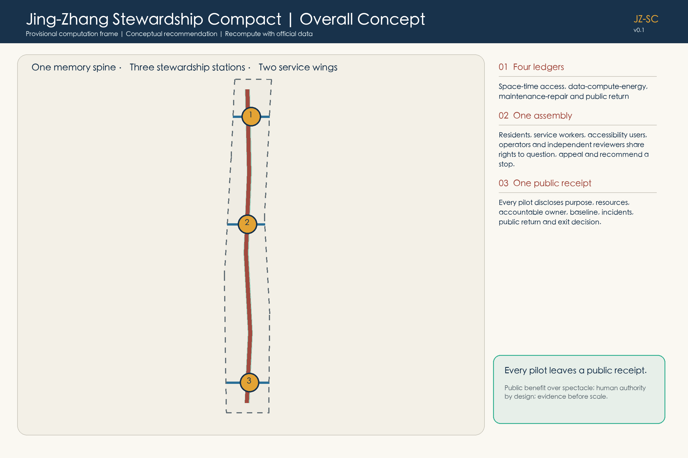
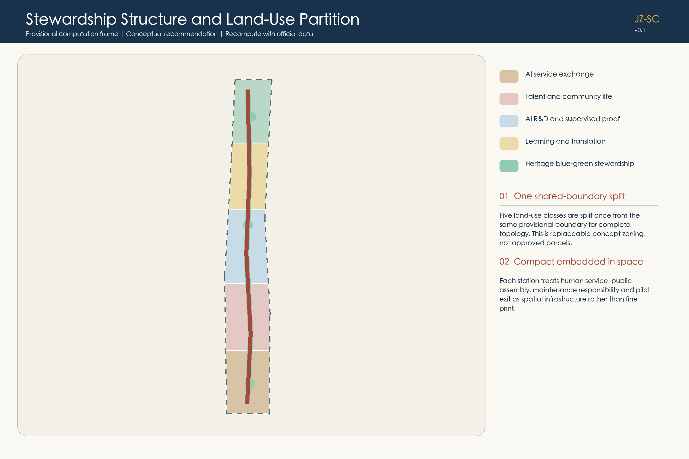
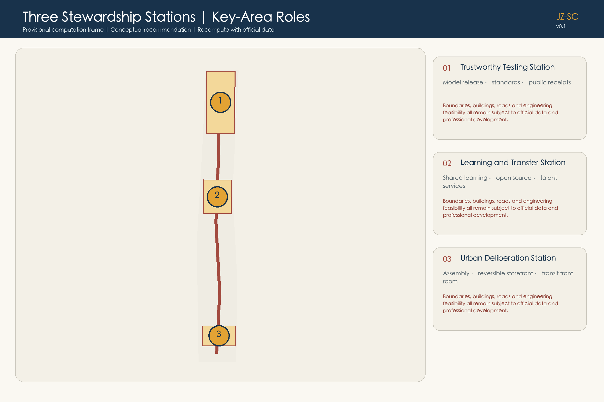
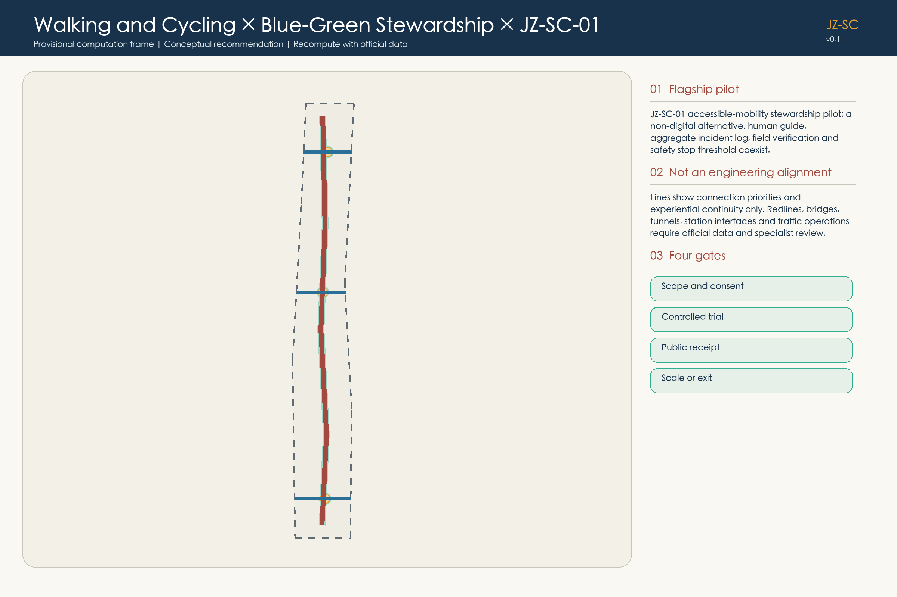
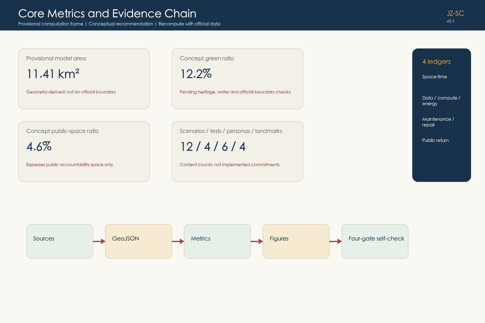

# Jing-Zhang Stewardship Compact: Every Pilot Leaves a Public Receipt

> This proposal does not treat AI as an all-purpose layer spread across the city. It defines a set of public experiments that people can understand, consent to, supervise, stop and leave. The century-old Jing-Zhang heritage spine carries shared memory; three stewardship stations make testing, deliberation and everyday service visible; four ledgers, one assembly and one receipt turn spatial use, resources, maintenance and public return into an accountable urban contract.

## Design Basis and Source List

The formal design basis begins with the official Centennial Jing-Zhang AI Innovation Belt announcement and the rights-cleared agent taskbook. Repository-maintained briefs, standards snapshots, enums, schemas, the source registry and the processed fact pack provide a traceable working layer. The fact pack is a navigation aid, not a new authority. Every consequential statement is therefore linked to an attributable source, a declared assumption, a recalculable metric, a geometry feature or a design-depth item [source:OFFICIAL-ANNOUNCEMENT] [source:AGENT-TASKBOOK] [depth:existing_conditions_diagnosis].

The cleared package does not contain official overall-design or key-area polygons, statutory parcels, existing buildings, road redlines, heritage control zones, utilities or approved development controls. This submission therefore uses the repository's provisional polygons only as replaceable computation frames. They are marked `provisional_constraint` and `official_boundary=false`; they are not official redlines, survey evidence, approval evidence, engineering alignments or a basis for parcel decisions [source:BOUNDARY-SOURCE] [assumption:A-BOUNDARY-001]. Content can be reviewed, but precision-sensitive scoring or official control claims would be improper until the missing materials are supplied.

The design workflow is intentionally reproducible: register evidence and its permitted use; lock the provisional boundary version and CRS; build topology-safe geometry; calculate metrics from that geometry; write the narrative and matrices; generate the five primary diagrams, offline HTML and bilingual PDFs; then run the repository-native finalization and self-check tools. If an official polygon changes any spatial relationship, the whole chain is regenerated rather than editing one visible number.

The principal machine-readable evidence lives in `sources.json`, `assumptions.json`, `metrics.json`, `standard_matrix.json`, `design_depth_matrix.json` and `compliance_matrix.json`. This chapter explains how to read the evidence without turning the proposal into an index dump [source:SOURCE-REGISTRY] [source:PROCESSED-FACT-PACK].

## Three-Level Scope Framework

The competition establishes three connected levels. The coordinated research area addresses the larger AI ecosystem, strategic position, future-city model and links among innovation, talent and service. The overall design area addresses renewal structure, land-use relationships, transport, municipal support, public space and urban character. Three key areas require a more detailed operational and spatial response. The proposal treats these levels as one reasoning chain: regional intent becomes an overall spatial contract, and the three stations test whether that contract can work in everyday situations [source:OFFICIAL-ANNOUNCEMENT] [depth:three_level_scope_framework].

The spatial concept is **one heritage memory spine, three stewardship stations and two service wings**. The spine joins railway memory, walking, cycling and a blue-green public realm. Zhongzhiyuan is the trustworthy-testing station; the Beijing AI Origin Community is the learning-and-transfer station; Dazhongsi is the urban-deliberation station. An innovation-service wing supports universities, teams and enterprises, while an everyday-service wing supports residents, visitors, small businesses and maintenance workers. These are relational roles, not promised building footprints or precise alignments [depth:overall_spatial_structure].

The Compact is operated through **four ledgers, one assembly and one receipt**. The ledgers disclose space-time access; data, compute and energy; maintenance and repair; and public return. The assembly includes residents, service workers, people with access needs, operators and independent reviewers, and it records conflicts, appeals and stop recommendations. Every pilot receipt identifies purpose, baseline, non-AI alternative, accountable person, resource use, incidents, public dividend and the decision to scale, iterate or exit. This shared protocol lets fast industrial experimentation coexist with slow public judgment.

At the research level the Compact defines distributional rules; at overall-design level it locates accessible public interfaces; at key-area level it specifies minimum operational rooms and test gates. Geometry provides the current computation frame through the submitted site and key-area features, but official data can replace it without changing the governance logic [data:geometry/site_boundary.geojson#SITE-001] [data:geometry/key_areas.geojson#PROV-KEY-001].

## Coordinated Research Area: Industry and Future City Research

The future-city proposition is not that more AI automatically produces a better district. It asks who may use innovation space, who bears testing costs, who can challenge a system, and which benefits return to the public. The industrial ecosystem therefore combines research, open-source collaboration, product validation, enterprise services, everyday public services and cultural interpretation. Access periods are reserved for small teams, community partners and open contributors; resource-intensive pilots disclose opportunity costs; and every accepted pilot commits at least one public return such as an accessibility repair, open documentation, a reusable tool or maintenance support [source:AGENT-TASKBOOK].

Six international cases calibrate mechanisms rather than forms. Kendall Square supports an amendable planning process that coordinates public realm, circulation and development [source:CASE-KENDALL]. MaRS illustrates how shared atrium, lab, office, event and transit interfaces can create repeated encounters [source:CASE-MARS]. Paris-Saclay suggests differentiated, transit-linked clusters alongside protected landscapes [source:CASE-PARIS-SACLAY]. one-north connects a car-lite public realm with governed technology testbeds [source:CASE-ONE-NORTH]. Barcelona 22@ demonstrates the value of a visible district office and a standing multi-sector forum [source:CASE-22-BARCELONA]. Seoul DMC provides a historical precedent for linking public demonstration and culture routes to regional rail [source:CASE-SEOUL-DMC]. No case size, policy or performance number is transplanted to Haidian.

The resulting six principles are amendability, shared interfaces, differentiated nodes, controlled trials, a standing assembly and transit connection. They support an ecosystem in which model evaluation, accessibility, maintenance, business services and cultural memory are not separate themes. The public receipt is the common unit of accountability: a research result or commercial pilot gains district legitimacy only when its boundaries, incidents, resource use and public return can be examined.

The proposal does not claim an official AI innovation index, talent density, enterprise count or implementation commitment. Those require authoritative industrial and operational data. It instead defines measurable future indicators: inclusive access hours, repaired barriers, non-AI service availability, public-return delivery, incident closure, open artifacts, energy intensity and the proportion of pilots that responsibly exit. These are design recommendations for subsequent calibration, not approved targets [depth:risk_missing_data].

## Overall Design Area: Urban Renewal and Regulatory-Plan-Level Urban Design

Within the provisional overall-design frame, five mutually exclusive concept zones test the proposed relationships: an urban intelligent-service front room; talent and community support; AI research and trustworthy validation; near-campus learning and transfer; and heritage park plus blue-green stewardship [data:geometry/land_use.geojson#LU-001]. The polygons cover the computation frame without overlap, but they do not assign statutory land-use codes. Their purpose is to ask where public interfaces, quiet daily space, testing, learning and memory should meet [depth:land_use_layout].

The overall structure follows four priorities: reuse before replacement, repair before new construction, reversible before permanent, and evidence before scale. The memory spine addresses continuity for walking, cycling, accessibility and heritage interpretation. The three stations add human service, incident reporting, receipt archives and deliberation. The two wings connect industry service and community service. Any permanent intervention must pass existing-condition survey, ownership verification, heritage and technical review, accessibility review, and public deliberation before moving beyond concept design [depth:development_intensity_controls].

Eighteen submitted building footprints are adaptable spatial typologies used to test courtyard, ground-floor, logistics and public-interface relationships. They are not surveyed buildings and do not establish retain, renovate or demolish decisions [data:geometry/buildings.geojson#BLDG-001] [assumption:A-BUILDING-001]. Floor area, FAR, density, height, setbacks and building-control lines remain unknown because the required official inputs are absent. Keeping these fields unknown is a professional boundary, not an omission.

The concept road layer contains a north-south memory-spine centerline and three east-west relationship lines. The green and public-space layers locate a continuous stewardship landscape and station interfaces. None is an engineering alignment or road redline. Municipal capacity, fire access, drainage, flood control, energy, parking and station conditions must be verified before spatial dimensions are set [data:geometry/roads.geojson#ROAD-001] [depth:municipal_new_infrastructure].

## Detailed Design of Key Areas

The three key areas are complementary stations rather than competing branded campuses. **Zhongzhiyuan / Trustworthy Testing Station** contains a model release gate, resource passport, standards workshop and incident-review interface. **Beijing AI Origin Community / Learning and Transfer Station** combines a shared learning table, open-contribution archive, project-matching counter and everyday talent services. **Dazhongsi / Urban Deliberation Station** combines transit arrival, an assembly table, human appeals and a reversible AI storefront. Each station requires four minimum components: a staffed service point, a closable testing area, a public deliberation table and a receipt archive wall [depth:three_key_area_detailed_design].

Zhongzhiyuan's landscape interface is treated conservatively until river, ecology and flood-control conditions are known. Tests disclose model scope, accountable staff, resource use and failure evidence; a safety issue or missing responsible party closes the gate. The station may use an existing ground floor, temporary room or removable pavilion after authorization. Its key output is not an iconic object but a repeatable release protocol [data:geometry/key_areas.geojson#PROV-KEY-001].

The Origin Community prioritizes the daily seam among campus, industry and neighborhood. A shared learning table supports bilingual workshops and accessible materials; a project counter lets people voluntarily form teams without scoring human worth; an open archive records reusable contributions. Campus boundaries, ownership, night safety and intellectual-property rights remain prerequisites. Housing or floor-area claims are not inferred from the provisional polygon [data:geometry/key_areas.geojson#PROV-KEY-002].

Dazhongsi uses the public front room to make conflicts and withdrawal visible. A small business can test a tool without platform lock-in; a customer can keep a human transaction; a resident can appeal; the assembly can recommend a stop. Station integration and four-quadrant walking are design questions pending verified station, intersection and utility data. The submitted key-area count of three is traceable, but their areas are provisional [data:geometry/key_areas.geojson#PROV-KEY-003] [metric:key_area_count].

## AI Innovation Ecosystem, Personas, and AI+ Scenarios

Six personas determine rights and non-digital alternatives rather than marketing segments [metric:persona_count]. An older neighbor needs clear wayfinding, seating and service without a smartphone. A mobility- or sensory-diverse commuter needs continuous access, a quiet option and authority to raise a stop condition. A student or open-source developer needs low-barrier collaboration without behavior tracking. An international product lead needs bilingual guidance and locally accountable review. A small-business operator needs affordable testing, data portability and easy exit. A public-space steward or community worker needs executable work orders and maintenance labor recognized as a real project cost.

Twelve scenario cards use the same receipt fields: purpose, non-AI baseline, minimum data, human accountability, stop condition and public return [metric:scenario_card_count].

| Card | Spatial carrier | Boundary and public return |
| --- | --- | --- |
| 01 Accessible Mobility Stewardship, JZ-SC-01 | memory spine and station links | physical repair and staffed help first; aggregate events only; publishes repaired barriers |
| 02 Quiet Route | park and neighborhood interfaces | user-selected low-stimulation route; no health inference; publishes noise and glare repairs |
| 03 Century Trace Mirror | heritage-memory points | rights-cleared sources and opt-out personalization; publishes a cited bilingual index |
| 04 Shared Learning Table | Origin Community | teacher or facilitator retains judgment; no private-conversation capture; releases reusable lessons |
| 05 City Problem Teaming Counter | Origin Community front room | voluntary matching without human-value ranking; publishes responsibility and exit records |
| 06 Trustworthy Model Clinic | Zhongzhiyuan | scope, non-AI process and named accountability; releases test cards and honest failures |
| 07 Resource Responsibility Passport | Zhongzhiyuan tests | records space, compute, energy and cooling without exposing trade secrets; publishes reduction actions |
| 08 Small-Business Stewardship Desk | Dazhongsi and local commerce | negotiates portability and repair; prohibits forced single-platform dependence |
| 09 Reversible AI Storefront | Dazhongsi | human transaction remains, sensors can be disabled, equipment can be removed; publishes appeals and exit audit |
| 10 Microclimate Stewardship | blue-green realm | sensors support shade, water and care without individual identification; publishes maintenance actions |
| 11 Slow Coexistence Trial | controlled movement segment | walking priority, staff, limited time and speed; near misses pause operation; releases a safety log |
| 12 Neighborhood Deliberation Model | Dazhongsi assembly | multi-agent simulation generates alternatives only; publishes assumptions, dissent and reasons |

Four testing and validation scenarios make the cards operational [metric:test_scenario_count]. The model release gate tests stated scope, responsibility and a non-AI alternative. The slow-coexistence lane tests mobility only in a controlled, staffed environment. The multi-agent city room compares interests and distributions without making planning decisions. The reversible storefront tests whether equipment, data and contracts can genuinely be withdrawn. Each passes scope and consent, controlled trial, public receipt, and scale/iterate/exit gates. A safety-critical failure, privacy breach, unresolved access barrier or absent accountable operator stops the trial.

Four pilgrimage and honor nodes celebrate contribution rather than celebrity [metric:landmark_count]: the AI Origin Zero marks the beginning of open innovation; the Open Stack Beacon explains reproducible toolchains; the Stewardship Assembly Court preserves conflict and correction; and the Century Stewardship Honor Walk records maintainers, accessibility contributors, open-source teams and people who disclosed failure honestly. Selection depends on reproducible public value, open licensing, accessibility and ethics, and truthful failure reporting—not payment or traffic.

## Land Use, Building Scale, and Retain-Renovate-Demolish Strategy

The land-use design is a topology-safe concept partition, not a statutory zoning proposal. It keeps daily community support and quiet public space alongside AI research, enterprise service and near-campus transfer, and gives the heritage landscape a continuous role rather than treating it as residual land. The five zone families can be remapped when official parcels and planning controls arrive [standard:MNR-LAND-USE-CLASSIFICATION-GUIDE] [data:geometry/land_use.geojson#LU-001].

The retain-renovate-demolish method begins with evidence. A future building register must record source, footprint, use, height, age, structure, condition, heritage value, occupancy, ownership and accessibility before any classification. Retention is the default while facts are missing; repair is favored where safety and heritage allow; reversible fit-out tests a new service before permanent work; demolition can only be considered after professional assessment, public-interest reasoning and approval. The present building layer is therefore labeled as prototype geometry [depth:retain_renovate_demolish].

The concept footprint total of 78,624 square metres is an internal calculation over 18 prototype features, not an existing-condition or development quantity [metric:building_footprint_area_sqm]. Total floor area, FAR, building density, height and setbacks remain unknown. Their eventual calculation requires verified floors, official parcels, approved controls and an official boundary; the result must then flow through metrics, diagrams, HTML and drawings rather than being inserted only into prose [assumption:A-CONTROLS-001].

Urban character is governed by experience principles instead of invented dimensions: read the old, see responsibility, and allow exit. New work should leave authentic railway evidence legible; public service and maintenance responsibilities should be visible; temporary installations should use removable connections, low-impact lighting and reversible surfaces. Exact massing and skyline control await heritage and statutory inputs [depth:height_massing_character].

## Transport, Rail, Municipal Infrastructure, and Public Services

Transport design starts with people who face the highest friction. The flagship **JZ-SC-01 Accessible Mobility Stewardship Pilot** begins with a field walk by access users, maintainers and transport professionals. A paper route, physical high-contrast/tactile guidance and staffed help form the non-AI baseline. Only aggregate facility events and crowd conditions may assist work orders; face, gait, voiceprint and continuous individual traces are excluded. Each alert is checked by a field steward. A safety-critical fault, privacy incident, unavailable human service or unresolved access barrier pauses the pilot [data:geometry/roads.geojson#ROAD-001].

The public receipt records before-and-after barrier status, false positives and negatives, maintenance labor, complaints, appeals, resource use and the decision to continue, modify or exit. Its public dividend is a repaired physical route and an open audit—not an engagement score. This makes physical repair prior to digital compensation, human service prior to automated enforcement, and event aggregation prior to personal tracking explicit design rules [depth:traffic_rail_slow_parking].

Submitted lines express desired relationships only. Before detailed design, the project must obtain station limits, road redlines and sections, flows, parking, fire access, utilities, traffic-safety evidence and verified access conditions [assumption:A-ROAD-001]. No precise route, width, speed, crossing design, parking quantity or device count is asserted here. Rail integration and four-quadrant connections remain professional design tasks.

Municipal and public-service infrastructure follows the resource ledger. Edge compute, energy, cooling, drainage, lighting and communications cannot be treated as invisible capacity. A pilot discloses its service dependency, energy and maintenance responsibility; existing municipal safety and public service remain available when a digital layer fails. Flood, fire, pipeline, electricity and cyber-security reviews are prerequisites for any installed system [depth:municipal_new_infrastructure].

## Blue-Green Network, Public Space, and Urban Character

The memory spine joins heritage interpretation, everyday walking, cycling, shade, rest and maintenance. Green and public-space features are designed as continuous relationships inside the provisional frame, with three station interfaces and east-west connectors [data:geometry/green_space.geojson#GREEN-001] [data:geometry/public_space.geojson#PUBLIC-001]. Exact river, park, heritage and construction-control limits are missing, so every intervention remains conservative and reversible pending specialist review [assumption:A-HERITAGE-001].

Public-space distribution follows the Compact. Events may not chronically displace daily rest, quiet periods or accessible passage. Sensors and commercial services may not turn shade, seats or basic navigation into a paid entrance. The maintenance ledger counts cleaning, gardening, water management, repair and staff time alongside device costs. The public-return ledger prioritizes added shade, repaired gaps, usable seating, quiet periods and staffed access—not exposure or visitor volume [depth:blue_green_public_space].

The concept green-space ratio is 12.222% and the concept public-space ratio is 4.5569% relative to the provisional computation frame. These are internal geometry consistency results, not statutory ratios or performance promises [metric:green_ratio] [metric:public_space_ratio]. Official boundaries and controls trigger complete recalculation.

Character is expressed through a restrained material and information language: authentic railway traces remain distinguishable from new work; repair details and reversible joints are legible; responsibility, service hours and receipt IDs are visible at each station; lighting supports safety without creating an always-on spectacle. The AI-generated human-eye-level image illustrates this relationship only. It is not a photograph, public opinion or an approved project [source:GEN-IMAGEGEN-20260811].

## Renewal Projects, Implementation Policy, and Phasing

Six project families turn the Compact into an implementation agenda. JZ-SC-01 is accessible mobility stewardship; JZ-SC-02 is the trustworthy model release gate; JZ-SC-03 is the learning-and-transfer table; JZ-SC-04 combines the Dazhongsi assembly and reversible storefront; JZ-SC-05 is the memory-spine microclimate and maintenance ledger; JZ-SC-06 is an open public-receipt archive. Each record names dependencies, an operating body, stop conditions, evidence and public return [depth:renewal_project_list].

Four phases are conditional gates, not dates or funding commitments. **Listen and reveal** obtains official geometry, surveys condition, ownership, heritage, transport and accessibility, and makes missing evidence visible. **Connect and activate** establishes staffed service, assembly and paper receipt baselines only in authorized spaces. **Adapt and prove** runs the four controlled tests after professional review and publishes incidents, resources and returns. **Scale with evidence** considers a permanent project only when public value, operational responsibility, funding and statutory conditions are all adequate [data:geometry/phasing.geojson#PHASE-001].

The phasing polygons partition the provisional frame and have a union area equal to that frame, which demonstrates geometry consistency but not delivery certainty [metric:phasing_area_sqm]. Ownership, finance, approval, municipal capacity and responsible bodies are unconfirmed. Each phase therefore includes three valid outcomes—proceed, revise or exit—and failure evidence is retained for the next design cycle [assumption:A-IMPLEMENTATION-001] [depth:phasing_implementation].

Policy support centers on a standing stewardship office and assembly, standard receipt fields, privacy and accessibility review, a maintenance funding rule, open versioning and an appeal route. Procurement should value repairability, data portability, non-digital continuity and exit cost. A vendor cannot gain permanence merely because a pilot operated; it must show independent public value and leave the public realm functional after removal.

## Metrics, Area Recalculation, and Compliance Matrix

In EPSG:4548, the provisional overall-design frame recalculates to 11,412,825.386 square metres. Eighteen concept building footprints total 78,624 square metres. Concept green and public-space layers equal 12.222% and 4.5569% of that frame. The package also counts three key areas, twelve scenario cards, four validation scenarios, six personas and four honor nodes [metric:site_area_sqm] [metric:building_footprint_area_sqm] [metric:key_area_count]. These values prove consistency among geometry, narrative and figures; they are not official area, existing-building or planning-control claims.

FAR, total floor area, building density, road area and road ratio remain explicitly unknown because official parcels, verified floors, approved controls and road redlines are absent [assumption:A-CONTROLS-001]. Inventing decimals would create false precision. When authoritative inputs arrive, the required sequence is: register source/version/CRS; replace overall and key-area polygons; rebuild topology for land use, green, public space and phasing; verify existing buildings and road polygons; recalculate metrics; regenerate all ten primary figures, both HTML versions and all four PDFs; then rerun professional checks [depth:metrics_recalculation].

The compliance matrix maps the official scope and all agent tasks to chapters, geometry, metrics, drawings, visualization, sources, assumptions and self-check evidence. The standard matrix distinguishes binding project sources, general professional references and design recommendations. The depth matrix names what is present and what remains conditional. Together, they prevent a polished image from standing in for missing evidence.

Metrics are separated into three classes: directly recalculable concept geometry; controls that require official statutory inputs; and operational indicators that require monitored pilots. Only the first class carries current values. The second remains unknown. The third—access hours, incident closure, repaired barriers, public returns and responsible exits—is a proposed future measurement framework, not a current performance claim.

## Risk, Copyright, and Compliance

The dominant spatial risk is source incompleteness. Official site and key-area polygons, statutory planning controls, parcels and ownership, existing buildings, road redlines and station conditions, utilities, heritage controls and public-service inventories are absent. The submission therefore avoids parcel decisions, engineering alignments, approved intensity, promised projects and false area precision [source:SITE-PACKAGE] [depth:risk_missing_data]. Replacement of official geometry triggers a full regeneration and professional review.

AI risk is grouped into safety, privacy, distribution and automated authority. Safety-critical errors or missing on-site accountability stop a pilot. Privacy is controlled through minimum collection, purpose limitation, short retention, aggregate publication and an appeal/deletion route; biometrics and continuous individual tracking are excluded. Distribution is reviewed through six personas, access periods and the public-return ledger. Automated systems can propose alternatives, but the assembly preserves dissent and qualified professionals retain statutory judgment.

All diagrams, offline HTML and PDFs are generated from package data and local tools. Two concept images were created with OpenAI Codex built-in ImageGen without supplied reference images, third-party marks or identifiable real persons. They are labeled as concept art. Six international cases are factually paraphrased from official pages; no case imagery, layout or extended text is reused. Tool, font, source, license and limitation details are recorded in `report/copyright_statement.md` and `sources.json` [source:GEN-IMAGEGEN-20260811].

The package is bilingual: this file corresponds to `proposal.md`; the rendered HTML, five primary figures and A3/A0 drawings have Chinese and English counterparts. The offline visualization has no remote script, map tile, font, iframe, form, tracker or external API. This proposal claims no approval, statutory plan, final ownership, final scale or implementation guarantee. It is submitted under `COMMUNITY-DISPLAY-ONLY` for competition review and display, subject to each original source's rights boundary.

## References

- Official Centennial Jing-Zhang AI Innovation Belt announcement [source:OFFICIAL-ANNOUNCEMENT].
- Rights-cleared AI-agent taskbook [source:AGENT-TASKBOOK].
- Repository site package, source registry, processed fact pack and missing-data checklist [source:SITE-PACKAGE] [source:SOURCE-REGISTRY].
- Cambridge Redevelopment Authority, Kendall Square overview [source:CASE-KENDALL].
- MaRS Discovery District, MaRS Centre [source:CASE-MARS].
- Établissement public d'aménagement Paris-Saclay, territory overview [source:CASE-PARIS-SACLAY].
- JTC Singapore, one-north guide [source:CASE-ONE-NORTH].
- Barcelona City Council, 22@ government measure [source:CASE-22-BARCELONA].
- Seoul Metropolitan Government, Digital Media City historical overview [source:CASE-SEOUL-DMC].
- Complete machine-readable source and rights record: `sources.json`; assumptions: `assumptions.json`; calculations: `metrics.json`; task mapping: `compliance_matrix.json`; professional references: `standard_matrix.json`; depth evidence: `design_depth_matrix.json`.

These references support concept development and evidence boundaries. They do not supply missing official polygons, statutory controls, engineering conditions or implementation authority. International cases are used as attributed mechanism references only; the Jing-Zhang Stewardship Compact remains a local, provisional design proposition that must be reviewed with authoritative data and affected publics.
