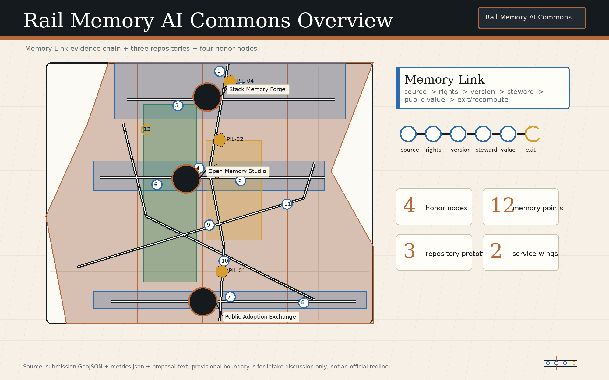
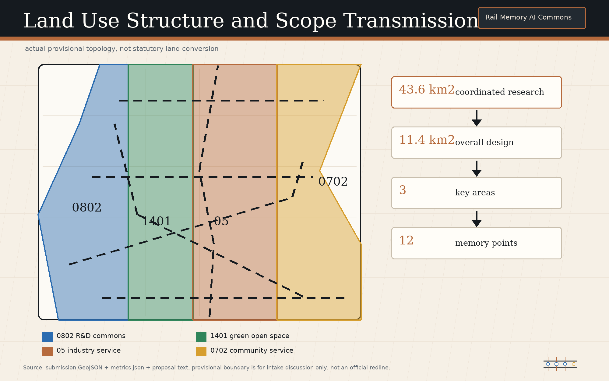
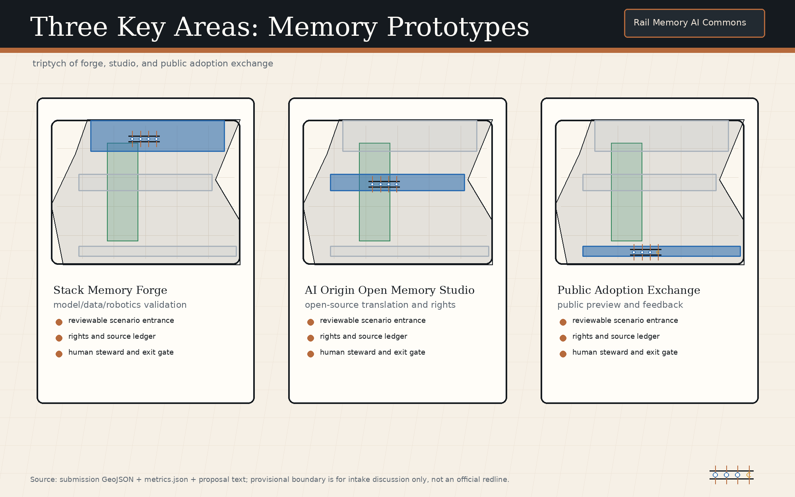
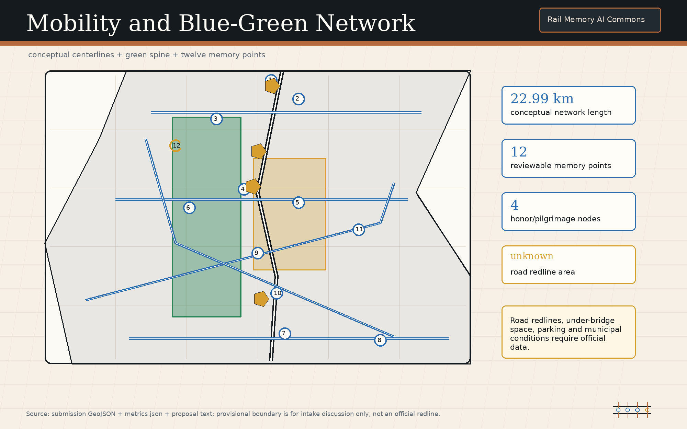
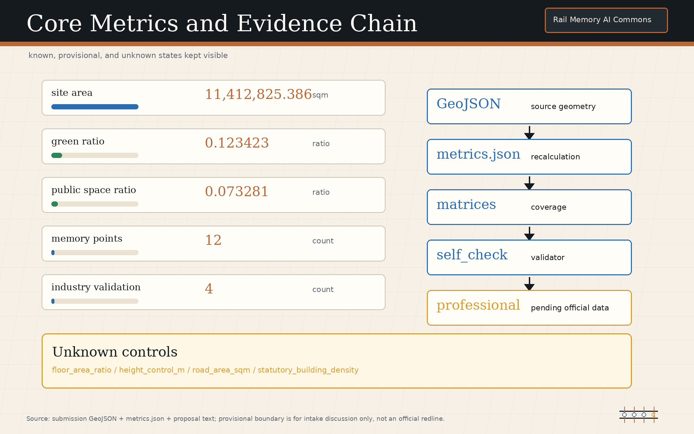

# Rail Memory AI Commons / 轨忆智链

**Every urban AI act leaves a reviewable civic memory / 让每一次智能进入城市，都留下可复核的公共记忆.**

## Design Basis and Source List

The central judgment of this proposal is that the Centennial Jing-Zhang AI Innovation Belt should not be only a corridor for AI enterprises and scenario display. It should become public AI memory infrastructure. Every AI-enabled scenario, spatial change, cultural interpretation, dataset, model, maintenance action, and public decision should generate a Memory Link that records its source, rights status, version, human steward, expiry, failure or exit condition, and recomputation or re-deliberation trigger. This method responds to the Open Call requirements for an AI Innovation Ecosystem, future urban form, and agent-based co-creation tasks [source:OFFICIAL-ANNOUNCEMENT] [source:AGENT-TASKBOOK] [depth:existing_conditions_diagnosis].

The current geometry is a provisional constraint. `geometry/site_boundary.geojson` and `geometry/key_areas.geojson` are used for content generation, spatial discussion, diagramming, and self-check only. They are not an Official Planning Boundary, precise boundary, or approval basis; Content Review readiness does not equal Formal Professional Scoring, planning approval, or an implementation commitment. Any conclusion involving boundaries, areas, building scale, road redlines, utilities, municipal infrastructure, ownership, heritage protection, or Regulatory Detailed Planning conditions must be recomputed and reviewed after official or rights-cleared data is provided [data:geometry/site_boundary.geojson#SITE-001] [metric:site_area_sqm].

Source use follows a readable-text plus auditable-structure model. The proposal keeps only claim-adjacent evidence markers in prose, while complete source, metric, standard, design-depth, and task-coverage records remain in `sources.json`, `metrics.json`, `standard_matrix.json`, `design_depth_matrix.json`, and `compliance_matrix.json`. The Haidian 15th Five-Year Plan, Beijing AI+ Action Plan, and Beijing walking-cycling greenway and waterfront standard are registered as policy and method background, but not promoted into parcel-level control evidence [source:HAIDIAN-15FYP-2026] [source:BEIJING-AI-PLUS-2024-2025] [source:BEIJING-SLOW-GREENWAY-WATERFRONT-STD-2024].

The public records for Jing-Zhang Railway Heritage Park Phase 1 and the Qinghuayuan Station historic site are also registered. They support historical interpretation, heritage awareness, and public-space methods only; neither is a planning redline or engineering basis for this proposal [source:BJ-JINGZHANG-HERITAGE-PARK] [source:BJ-QINGHUAYUAN-STATION] [source:SOURCE-REGISTRY].

## Three-Level Scope Framework

Rail Memory AI Commons translates the three planning scopes into "One Rail, Three Repositories, Two Wings, and Twelve Memory Points." One Rail is the public memory spine formed by the Jing-Zhang Railway Heritage Park and transit stations. Three Repositories are the model-and-data validation repository, the open-source translation and rights repository, and the public adoption feedback repository. Two Wings follow the open-call terminology of the Zhongguancun Technology Services Wing and Xiaoyue River Scenario Enablement Wing. Twelve Memory Points are scenario nodes that the public, enterprises, professional teams, and urban agents can review together. This is a conceptual working framework; it does not create an official boundary or replace the three professional scope levels [depth:three_level_scope_framework] [standard:PROJECT-AGENT-OPEN-CALL-TASKBOOK].

In the Coordinated Research Area, the proposal studies how industry chains, talent chains, open-source chains, cultural chains, and public-governance chains can be connected by Memory Links. In the Overall Design Area, the memory mechanism is translated into land use, roads, green space, public space, building footprints, phasing, and indicators. In the Key-Area Detailed Design Area, three prototypes test whether the mechanism can enter real spatial operation. Spatial layers within the provisional boundary explain how evidence and design are organized; they do not state that government construction decisions have been made [data:geometry/land_use.geojson#LU-001] [data:geometry/roads.geojson#ROAD-SPINE-01] [depth:overall_spatial_structure].

The review path for all three levels is fixed: confirm the boundary and key-area status first, explain the spatial move, identify the corresponding layer and metric, then list the gaps that require professional deepening. Once an official boundary is substituted, the three key areas, twelve memory points, walking and cycling blue-green network, public-space ratio, building footprints, phasing projects, and figure indexes must all be recalculated. Numbers without registered sources or recomputable evidence are excluded from formal judgments.

## Coordinated Research Area: Industry and Future City Research

The industry thesis for the coordinated level is that AI innovation should leave public memory rather than only product launches and closed interfaces. The proposal uses six registered official or background mechanisms as references: the task-output mechanism of the official announcement, the Haidian 15th Five-Year Plan mechanism linking technology and urban renewal, the Beijing AI+ application-led mechanism, the walking-cycling greenway and waterfront public-space review mechanism, the heritage activation mechanism of the Jing-Zhang Railway Heritage Park, and the historical interpretation and protection-boundary mechanism of Qinghuayuan Station. Each source remains effective only within its publication level and declared use boundary [source:OFFICIAL-ANNOUNCEMENT] [source:HAIDIAN-15FYP-2026] [source:BEIJING-AI-PLUS-2024-2025].

The brand and VI concept is "Rail Memory AI Commons / 轨忆智链." A rail baseline expresses the continuity of the century-old Jing-Zhang corridor; linked nodes express Memory Links; open brackets express public review and open co-creation. The logo concept should use a restrained rail baseline, three switchable repository marks, and twelve small verification points. Fonts, icons, enterprise marks, and portraits must be original or rights-cleared. The VI is not a trademark claim; it is a visual identity and public wayfinding reference inside the submission package [depth:height_massing_character] [source:AGENT-TASKBOOK].

Global AI Innovation Ecosystem cases are translated into mechanisms rather than decoration: Paris Station F informs concentrated startup services; Singapore one-north informs mixed industry, life, and learning; and AI Verify informs reviewable validation cards [source:STATION-F-BENCHMARK] [source:JTC-ONE-NORTH-BENCHMARK] [source:AI-VERIFY-FOUNDATION-BENCHMARK].

The Govern, Map, Measure, and Manage logic of NIST AI RMF is translated into Memory Link governance gates; Kendall Square Association informs a cross-institution steward council; and London's Knowledge Quarter informs public interfaces among knowledge institutions [source:NIST-AI-RMF-BENCHMARK] [source:KENDALL-SQUARE-BENCHMARK] [source:KNOWLEDGE-QUARTER-BENCHMARK]. All six are background-only benchmarks. They cannot replace Haidian's local official sources, statutory controls, or professional design deepening.

## Overall Design Area: Urban Renewal and Regulatory-Plan-Level Urban Design

The urban-renewal strategy for the Overall Design Area is to embed reviewable memory into Regulatory Detailed Planning-depth Urban Design. Every land-use function shift, ground-floor public interface adjustment, building renovation, walking and cycling repair, blue-green space renewal, and facility deployment should state its trigger, responsible steward, version record, and exit condition. The aim is not to add approval burden, but to make AI scenarios traceable by the public, enterprises, professional teams, and maintainers when they enter Public Space [standard:MOHURD-CONTROL-DETAILED-PLANNING] [depth:land_use_layout].

The Land-Use Layout and spatial structure follow a conceptual "memory spine + three repository nodes + mixed service interfaces" scheme. The Jing-Zhang Railway Heritage Park carries public experience and cultural interpretation. Research and industry service land carries model, data, terminal, and content enterprises. Community services and Public Space carry talent life, resident use, and public feedback. Building scale, Floor Area Ratio, road redlines, Building Height, and municipal capacity remain pending official planning-control confirmation; this proposal only offers functional organization, interface principles, and project leads for professional teams [data:geometry/buildings.geojson#BLDG-FORGE-01] [metric:building_footprint_area_sqm] [depth:development_intensity_controls].

Three prototypes are embedded in the key areas. Zhongzhiyuan Stack Memory Forge handles model, data, robotics, and standard validation. Beijing AI Origin Open Memory Studio handles open source, university-community translation, talent services, and rights clinics. Dazhongsi Public Adoption Memory Exchange handles public preview and feedback loops for enterprise copilots, smart terminals, and content products. Together they form an urban intelligence lifecycle from research validation to open-source translation and public adoption.

## Detailed Design of Key Areas

Zhongzhiyuan Stack Memory Forge is the conceptual prototype for the model/data/robotics validation repository. Along the Qinghe interface, research display interface, and shared testing spaces, the proposal recommends four validation types: model safety and red-team testing, low-speed robotics mixed-movement and maintenance drills, dataset rights and version audits, and low-carbon computing and equipment maintenance records. Each validation produces a Memory Link recording test source, participant, Human Review, failure exit, and recomputation trigger. All locations remain discussion material based on the provisional key-area layer [data:geometry/key_areas.geojson#PROV-KEY-001] [depth:three_key_area_detailed_design].

Beijing AI Origin Open Memory Studio is the conceptual prototype for the open-source translation and rights repository. It proposes an open-source release hall, university-community translation tables, a talent and rights clinic, a public contribution wall, and small deliberation classrooms that connect university research, open-source projects, community needs, copyright licenses, talent services, and public education. It does not commit to any campus boundary or building ownership change; it only provides a reference scheme for near-campus collaboration, ground-floor openness, and walking and cycling repair [data:geometry/key_areas.geojson#PROV-KEY-002] [source:AGENT-TASKBOOK].

Dazhongsi Public Adoption Memory Exchange is the conceptual prototype for the public adoption feedback repository. Around Transit-Station Integration, commercial service interfaces, and enterprise display spaces, it organizes public preview for enterprise copilots, smart terminals, content generation, digital assets, and life-service products. Public feedback is not turned directly into commercial profiling; it first enters an anonymized, aggregated, and exit-enabled public adoption record. This prototype tests how AI products receive public explanation and feedback before entering the city [data:geometry/key_areas.geojson#PROV-KEY-003] [metric:key_area_count].

Together, the three areas carry Key-Area Detailed Design depth. Later professional deepening must add existing buildings, ownership, traffic, municipal utilities, fire safety, heritage conditions, operators, and investment or maintenance conditions. All Demolish-Renovate-Retain, building-interface, scenario-placement, and event-operation proposals in this draft are conceptual recommendations or reference schemes; they must not be used as demolition, construction, investment-attraction, or approval commitments.

## AI Innovation Ecosystem, Personas, and AI+ Scenarios

The proposal defines eight user personas: open-source developers, model safety researchers, robotics maintenance engineers, startup founders, product leads from major enterprises, university faculty and students, nearby residents, and public-governance or community organizers. These personas do not collect personal trajectories or sensitive identities. They define spatial needs, public services, review responsibility, and exit rights. Urban Agents may help aggregate public feedback and facility status from public sources, but they cannot replace Human Review or professional judgment [data:geometry/public_space.geojson#PUBLIC-SPINE-01] [depth:municipal_new_infrastructure].

Twelve scenario cards correspond to the Twelve Memory Points: 01 Model Safety Replay Room, 02 Data Rights Registration Desk, 03 Low-Speed Robotics Mixed-Movement Test Court, 04 Open-Source Release Hall, 05 University-Community Translation Table, 06 Talent and Rights Clinic, 07 Enterprise Copilot Public Preview Gallery, 08 Smart Terminal Usability Yard, 09 Content-Generation Copyright Prompt Station, 10 Walking and Cycling Gap Memory Beacon, 11 Blue-Green Maintenance Recalculation Stop, and 12 Public Decision Version Wall. Each card records service user, spatial carrier, operating data, privacy boundary, human steward, failure exit, and recomputation condition [standard:PROJECT-AGENT-OPEN-CALL-TASKBOOK] [depth:renewal_project_list].

At least four cards are industry validation scenarios: model safety and red-team testing, low-speed robotics mixed-movement validation, enterprise copilot public adoption validation, and smart terminal accessibility and durability validation. Additional public validation covers data rights, content copyright, walking and cycling maintenance, and blue-green recalculation. Industry validation must not assume success in advance; failure samples, public objections, suspension conditions, and alternatives are part of the Memory Link. The Steward Council is recommended to register operating responsibility, subject to later professional and legal confirmation.

## Land Use, Building Scale, and Retain-Renovate-Demolish Strategy

The Land-Use strategy follows the rule "functions may change, memory must not disappear." Research innovation, industry services, Public Space, green space, and community support can be adjusted as formal RDP conditions, ownership, and market conditions are clarified, but every adjustment should record its version, basis, and impact. `geometry/land_use.geojson` expresses a conceptual Land-Use Layout within a provisional boundary; it is not a statutory land-use conversion. Formal land use, FAR, Building Coverage Ratio, Building Height, and setbacks remain pending official confirmation [standard:MNR-LAND-USE-CLASSIFICATION-GUIDE] [data:geometry/land_use.geojson#LU-001].

Building and Demolish-Renovate-Retain recommendations are divided into four categories: heritage or public-value interfaces to retain and interpret, industry-service interfaces for micro-renewal and ground-floor opening, adaptable research and display spaces for renovation, and potential renewal objects that require ownership, municipal, structural, and fire-safety review before judgment. At present, only the building-footprint layer can express conceptual supply; it cannot produce a precise total floor area or demolition conclusion [data:geometry/buildings.geojson#BLDG-FORGE-01] [depth:retain_renovate_demolish].

The three memory repositories require different building conditions. Stack Memory Forge needs isolatable, observable, and stoppable test spaces. Open Memory Studio needs open ground floors, meeting rooms, clinics, and public education spaces. Public Adoption Memory Exchange needs transit access, low-threshold experience spaces, and feedback collection spaces. These are recommended inputs for professional deepening, not construction drawings.

## Transport, Rail, Municipal Infrastructure, and Public Services

The mobility strategy centers on explainable Walking and Cycling Network, Transit-Station Integration, and low-intrusion maintenance. Conceptual recommendations include a walking and cycling memory spine along the Jing-Zhang Railway Heritage Park, legible pedestrian routes from the key areas to transit stations, low-speed testing boundaries for robotics and maintenance equipment, and coordinated placement of bicycle parking and public-service nodes. Any road redline, under-bridge space, parking scale, or traffic-organization adjustment must be checked against official traffic and municipal data [data:geometry/roads.geojson#ROAD-SPINE-01] [depth:traffic_rail_slow_parking].

New Infrastructure is not simply a matter of adding devices. Edge computing, sensing, energy, maintenance, privacy, and Human Review should share one public ledger. The proposal recommends lightweight Memory Link entrances at the three prototypes and twelve memory points: the public can see what the AI scenario is, who maintains it, what data it uses, when it expires, and how it can be exited; professional teams can inspect metrics and failure records; operators can identify recomputation triggers. Utility pipes, power supply, drainage, fire safety, and cybersecurity conditions are currently pending data [data:geometry/constraints.geojson#CONSTRAINT-PROV-01] [depth:municipal_new_infrastructure].

## Blue-Green Network, Public Space, and Urban Character

Blue-Green Public Space makes public memory visible. The Jing-Zhang Railway Heritage Park, Qinghe, Xiaoyue River, station plazas, enterprise interfaces, and community nodes are organized as a walkable, stayable, and explainable public route. Memory Links should not be hidden in a back office; restrained wayfinding, QR codes, open boards, or event records should help the public understand how AI scenarios affect the city. The design meaning of the green-space and Public Space ratios is explained through indicators, while exact values remain in `metrics.json` [data:geometry/green_space.geojson#GREEN-SPINE-01] [metric:green_ratio] [depth:blue_green_public_space].

Four pilgrimage or honor nodes are proposed conceptually. Qinghuayuan Station Memory Gate commemorates the Jing-Zhang Railway and modern engineering knowledge. Zhongguancun Open-Source Contribution Wall records open-source projects, contributors, and public licenses. Stack Memory Forge Honor Deck displays models, datasets, and robotics validations that have passed review. Dazhongsi Public Adoption Bell Court records revocable public feedback before AI products enter the city. Node names, graphics, people, enterprise identities, and historical text must be rights-cleared, and conceptual landmarks must not be described as approved construction [source:SOURCE-REGISTRY] [standard:MOHURD-URBAN-DESIGN-MEASURES].

The cultural narrative uses three timescales: the century-old Jing-Zhang line as engineering memory, Zhongguancun as innovation memory, and AI Commons as reviewable public intelligence memory. Urban Character should be restrained, durable, and maintainable, avoiding entertainment-heavy AI spectacle. Building interfaces, night lighting, roofs, wayfinding, and public art should serve readability, accessibility, and long-term maintenance.

## Renewal Projects, Implementation Policy, and Phasing

Renewal projects follow a sequence of "record first, test next, consolidate later." Near-term actions can include open-source data organization, public explanation wayfinding, lightweight events, low-risk scenario cards, and feedback mechanisms. Mid-term actions can deepen the three prototypes, repair walking and cycling links, improve ground-floor public interfaces, and coordinate New Infrastructure. Long-term actions can form a Steward Council, annual global AI events, scenario access rules, public adoption archives, and continuous recomputation mechanisms. All are conceptual recommendations requiring confirmation by government, ownership, operators, legal specialists, and professional teams [data:geometry/phasing.geojson#PHASE-01] [depth:phasing_implementation].

The Steward Council is recommended to include planning, community, enterprise, university, open-source, legal-rights, maintenance, and accessibility representatives. Its roles would be to maintain Memory Link rules, review expired and failed cases, register copyright and data boundaries, organize public feedback, and decide which scenarios need pausing or recomputation. It is not a statutory approval body; it is a reference scheme for public collaboration and deliberation.

Long-term operation includes event brands such as Rail Memory Week, Open Memory Clinic, Public Adoption Day, Robot Maintenance Walk, AI Rights Desk, and Global AI Commons Forum. Events should take place only when rights-cleared content, public-space permissions, and safety conditions are satisfied. Investment attraction, funding, media communication, and international cooperation must not be described as confirmed government arrangements.

## Metrics, Area Recalculation, and Compliance Matrix

The indicator system has three classes. The first includes spatial indicators recomputable from current GeoJSON and metrics, such as overall area, green space, Public Space, building footprint, and key-area count. The second includes control indicators pending formal RDP, road, municipal, and building data, such as Floor Area Ratio, Building Height, road redlines, and facility standards. The third includes operational public-memory indicators to be recorded after implementation, such as Memory Link completeness, expiry handling, public failure disclosure, public-feedback response, and Human Review timeliness. This draft does not hard-code geometry-derived values; it cites metric IDs instead [metric:site_area_sqm] [metric:public_space_ratio] [depth:metrics_recalculation].

The compliance matrix proves task coverage. Official announcement items 1.3, 1.4, 1.5 and agent.1 through agent.6 should all be traceable in prose, layers, metrics, drawings, HTML, and self-check records. This proposal deliberately puts the name and logo, five to eight ecosystem benchmarks, twelve scenario cards, four industry validations, eight personas, four pilgrimage or honor nodes, cultural narrative, and long-term operation into readable prose, avoiding a JSON-only checkbox response [source:AGENT-TASKBOOK] [standard:PROJECT-AGENT-OPEN-CALL-TASKBOOK].

The professional standard matrix still shows a data gap for architectural design depth. Without formal building survey, structure, fire safety, ownership, and RDP conditions, Building Height, total scale, DRR strategy, and engineering feasibility remain directional design. Content Review can assess proposal quality, but Formal Professional Scoring or approval must wait for completed data and professional review.

## Risk, Copyright, and Compliance

The major risks fall into four groups. First, the current boundary and key areas are provisional constraints and must be recalculated after official polygons are substituted. Second, RDP, road redline, municipal, building, heritage, ownership, and fire-safety information is incomplete and cannot support statutory control conclusions. Third, AI scenarios may involve data, privacy, copyright, bias, and safety risk, requiring a human steward, exit conditions, and public explanation. Fourth, text and graphics are submission content, not government approval, funding commitment, investment commitment, or engineering implementation [depth:risk_missing_data] [data:geometry/constraints.geojson#CONSTRAINT-PROV-01] [source:SITE-PACKAGE].

The copyright boundary is stated in `report/copyright_statement.md`: prose, tables, scenario cards, brand concepts, and diagram captions are original programmatic or AI-assisted content for this submission; the five local figures are programmatic diagrams derived from structured data inside the package; no external images, remote fonts, commercial icons, map tiles, portraits, or enterprise materials are redistributed. If later revisions add official PDF excerpts, historic photos, fonts, logos, or third-party images, rights clearance and source registration must happen first.

The AI boundary is also explicit. Urban Agents may organize sources, draft text, check structure, assist recalculation, and propose conceptual schemes, but they cannot replace registered planning, traffic, municipal, architectural, heritage, legal, copyright, or public-participation procedures. Final interpretation of every Memory Link should belong to an identifiable human steward and professional review process.

## References

- Beijing Municipal Commission of Planning and Natural Resources, Haidian Branch, official announcement for the Centennial Jing-Zhang AI Innovation Belt Open Call for Urban Design.
- `brief/site-package/` site package, taskbook, enums, ranges, standards snapshots, and schemas [source:SITE-PACKAGE].
- `data/source_registry.json` source registry and use-boundary record.
- `brief/site-package/agent_taskbook.json` agent-facing taskbook.
- Haidian 15th Five-Year Plan public materials, used as a background mechanism reference [source:HAIDIAN-15FYP-2026].
- Beijing AI+ Action Plan 2024-2025, used as a time-bounded scenario mechanism reference [source:BEIJING-AI-PLUS-2024-2025].
- Beijing walking-cycling, greenway, and waterfront standard, used as a Public Space background reference [source:BEIJING-SLOW-GREENWAY-WATERFRONT-STD-2024].
- Jing-Zhang Railway Heritage Park Phase 1 and Qinghuayuan Station public records, used as cultural and heritage background references [source:BJ-JINGZHANG-HERITAGE-PARK] [source:BJ-QINGHUAYUAN-STATION].
- Station F, one-north, AI Verify, NIST AI RMF, Kendall Square Association, and Knowledge Quarter, used only as structured background benchmarks.
