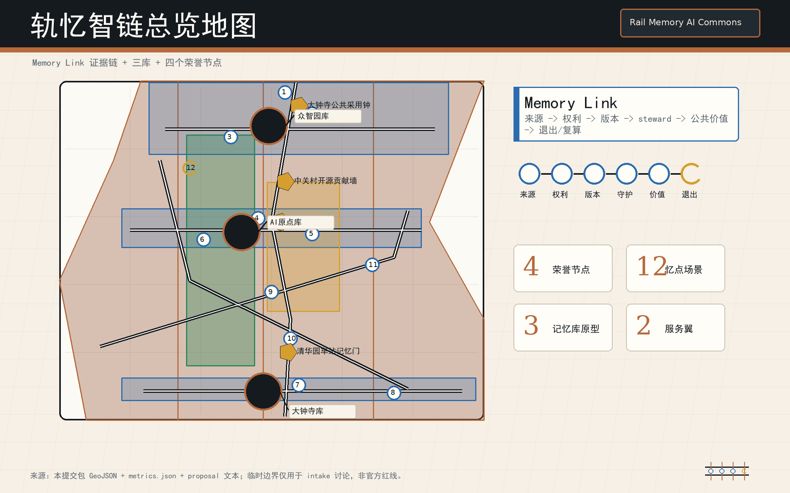
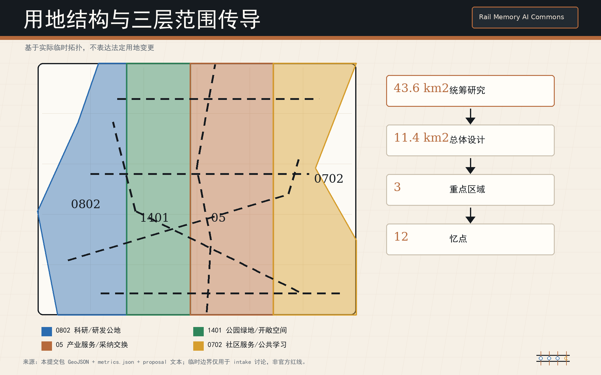
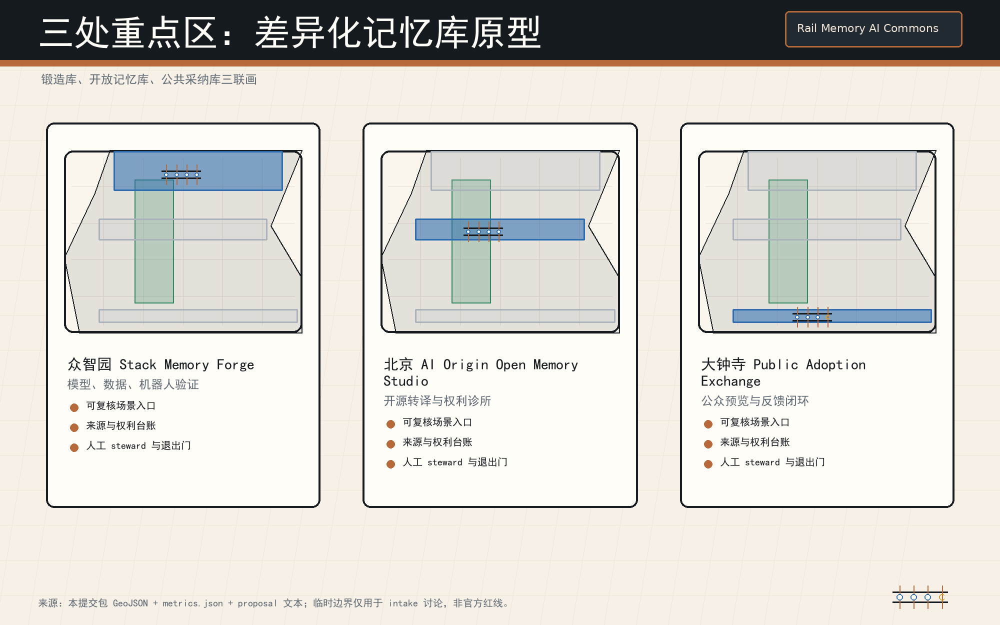
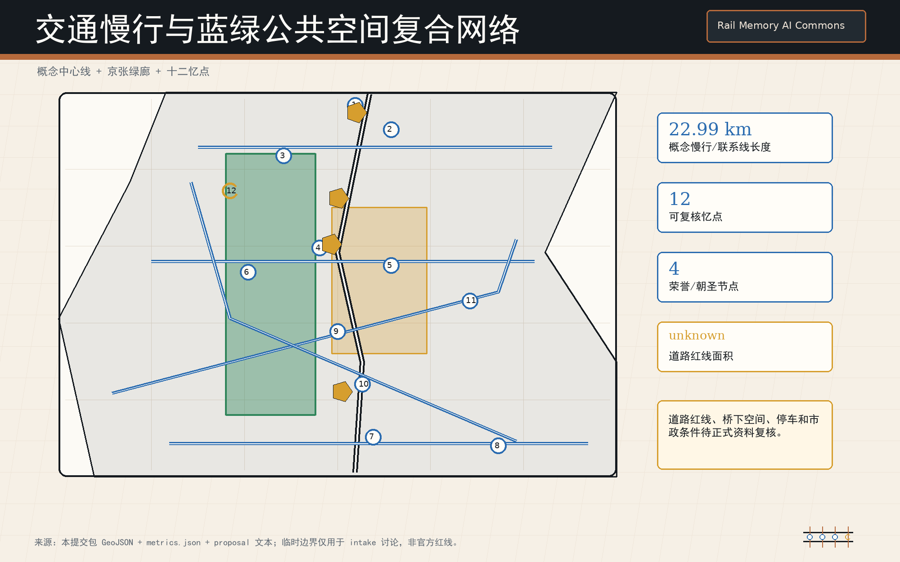
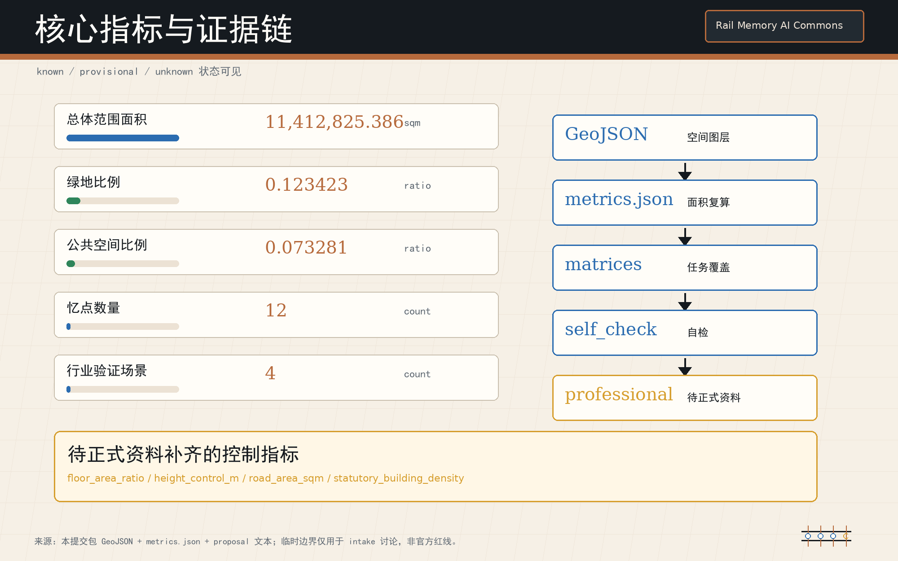

# 轨忆智链 / Rail Memory AI Commons

**让每一次智能进入城市，都留下可复核的公共记忆 / Every urban AI act leaves a reviewable civic memory.**

## 设计依据与资料清单

本方案的核心判断是：百年京张 AI 创新带不只是 AI 企业和场景的展示走廊，而应成为一套“公共 AI 记忆基础设施”。每一个 AI 场景、空间改变、文化解释、数据集、模型、维护动作和公共决策，都需要生成一条 Memory Link，记录来源、权利、版本、人工 steward、有效期、失效或退出条件，以及需要重新计算或重新审议的触发条件。这一工作方法回应公开征集对 AI 创新生态、未来城市形态和智能体共创任务的要求 [source:OFFICIAL-ANNOUNCEMENT] [source:AGENT-TASKBOOK] [depth:existing_conditions_diagnosis]。

当前几何为临时约束范围：`geometry/site_boundary.geojson` 和 `geometry/key_areas.geojson` 用于内容生成、空间讨论、图纸表达和自检，不是官方红线、精确边界或审批依据；内容评审就绪也不等于正式专业评分、规划批准或实施承诺。凡涉及边界、面积、建筑规模、道路红线、管线、市政、权属、文保和控规条件的判断，均须在官方或清权数据补齐后重算与复核 [data:geometry/site_boundary.geojson#SITE-001] [metric:site_area_sqm]。

资料使用遵循“正文可读、结构化层可审计”的原则：正文只保留与判断相邻的证据标记，完整来源、指标、标准、设计深度和任务覆盖保存在 `sources.json`、`metrics.json`、`standard_matrix.json`、`design_depth_matrix.json` 与 `compliance_matrix.json`。海淀“十五”规划、北京 AI+ 行动计划和北京慢行绿道滨水空间标准已登记为政策与方法背景，但不提升为地块级控制依据 [source:HAIDIAN-15FYP-2026] [source:BEIJING-AI-PLUS-2024-2025] [source:BEIJING-SLOW-GREENWAY-WATERFRONT-STD-2024]。

京张铁路遗址公园一期与清华园车站旧址公开资料同样已登记，只支撑历史解释、保护意识和公共空间方法；它们不是本提案的规划红线或工程依据 [source:BJ-JINGZHANG-HERITAGE-PARK] [source:BJ-QINGHUAYUAN-STATION] [source:SOURCE-REGISTRY]。

## 三层范围工作框架

轨忆智链把三层范围转译为“一轨三库两翼十二忆点”。“一轨”是京张铁路遗址公园和轨道站点共同形成的公共记忆主线；“三库”是模型与数据验证库、开源转译与权利库、公共采用反馈库；“两翼”沿用征集语境中的中关村科技服务翼和小月河场景赋能翼；“十二忆点”是可被公众、企业、专业团队和智能体共同复核的场景节点。该结构是概念性工作框架，不新增官方边界，也不替代三层法定或专业工作范围 [depth:three_level_scope_framework] [standard:PROJECT-AGENT-OPEN-CALL-TASKBOOK]。

在统筹研究范围，方案关注产业链、人才链、开源链、文化链和公共治理链如何被 Memory Link 连接；在总体设计范围，方案把记忆机制落到用地、道路、绿地、公共空间、建筑基底、分期和指标；在重点区域范围，方案用三处原型验证机制是否能进入真实空间运营。临时范围内的空间图层只说明“如何组织证据和方案”，不说明“政府已经确定如何建设” [data:geometry/land_use.geojson#LU-001] [data:geometry/roads.geojson#ROAD-SPINE-01] [depth:overall_spatial_structure]。

三层范围的复核路径是固定的：先确认边界和重点区状态，再解释空间动作，再说明对应图层和指标，最后列出需要专业深化的缺口。替换正式边界后，三处重点区、十二忆点、慢行蓝绿网络、公共空间比例、建筑基底、分期项目和图面索引均需重新计算；未登记来源或不能复算的数字不进入正式判断。

## 统筹研究范围产业与未来城市研究

统筹层的产业命题是“让 AI 创新留下公共记忆，而不是只留下发布会和封闭接口”。方案建立六个已登记的官方/背景机制参照：征集公告的任务-成果机制、海淀“十五五”科技与城市更新衔接机制、北京 AI+ 应用牵引机制、慢行绿道滨水标准的公共空间复核机制、京张铁路遗址公园的遗产活化机制、清华园车站旧址的历史解释和保护边界机制。这些资料只在各自的发布层级与用途边界内生效 [source:OFFICIAL-ANNOUNCEMENT] [source:HAIDIAN-15FYP-2026] [source:BEIJING-AI-PLUS-2024-2025]。

品牌与 VI 概念采用“Rail Memory AI Commons / 轨忆智链”：轨道线表达百年京张的连续性，链式节点表达 Memory Link，开放括号表达公共复核和开源协作。Logo 建议使用一条克制的轨道基线、三个可切换的记忆库标记和十二个小型校验点；字体、图标、企业标识和人物肖像必须使用原创或清权资产。VI 不作为商业商标注册主张，只作为提交包内的视觉识别和公共导视参考 [depth:height_massing_character] [source:AGENT-TASKBOOK]。

全球 AI 创新生态案例被转译为机制而非装饰：Paris Station F 对应集中创业服务，Singapore one-north 对应产业-生活-学习混合，AI Verify 对应可复核测试卡 [source:STATION-F-BENCHMARK] [source:JTC-ONE-NORTH-BENCHMARK] [source:AI-VERIFY-FOUNDATION-BENCHMARK]。

NIST AI RMF 的 Govern/Map/Measure/Manage 逻辑被转译为 Memory Link 治理门，Kendall Square Association 对应跨机构 steward council，London Knowledge Quarter 对应知识机构之间的公共接口 [source:NIST-AI-RMF-BENCHMARK] [source:KENDALL-SQUARE-BENCHMARK] [source:KNOWLEDGE-QUARTER-BENCHMARK]。六项都是 background-only benchmark，不能替代海淀本地官方资料、法定控制和专业设计深化。

## 总体设计范围城市更新与控规深度城市设计

总体设计范围的城市更新策略是把“可复核记忆”嵌入控规深度城市设计：每一次用地功能转换、首层公共界面调整、建筑改造、道路慢行缝合、蓝绿空间更新和设施投放，都必须说明触发原因、责任 steward、版本记录和退出条件。这样做的目的不是增加审批负担，而是让 AI 场景在进入公共空间时可被公众、企业、专业团队和维护者共同追踪 [standard:MOHURD-CONTROL-DETAILED-PLANNING] [depth:land_use_layout]。

用地与空间结构采用“记忆主线 + 三库节点 + 混合服务界面”的概念方案：京张遗址公园承担公共体验和文化解释，产业研发和服务用地承载模型、数据、终端和内容企业，社区服务和公共空间承载人才生活、居民使用和公众反馈。建筑规模、容积率、道路红线、建筑高度和市政承载均待正式控规条件确认；本方案只提出可供专业团队深化的功能组织、界面原则和项目线索 [data:geometry/buildings.geojson#BLDG-FORGE-01] [metric:building_footprint_area_sqm] [depth:development_intensity_controls]。

总体层的三个原型分别嵌入三处重点区：众智园 Stack Memory Forge 负责模型、数据、机器人和标准验证；北京 AI 原点 Open Memory Studio 负责开源、大学-社区转译、人才服务和权利诊所；大钟寺 Public Adoption Memory Exchange 负责企业 copilots、智能终端、内容产品的公众预览和反馈闭环。三者共同形成从“研发验证”到“开源转译”再到“公共采用”的城市智能生命周期。

## 重点区域详细设计

众智园 Stack Memory Forge 是“模型/数据/机器人验证库”的概念原型。建议在临清河界面、研发展示界面和共享测试空间中组织四类验证：模型安全与红队测试、机器人低速混行与维护演练、数据集权利与版本审计、低碳算力和设备维护记录。每项验证都产生 Memory Link，标记测试来源、参与主体、人工复核、失败退出和复算触发；所有空间位置仍以临时重点区图层为讨论基础 [data:geometry/key_areas.geojson#PROV-KEY-001] [depth:three_key_area_detailed_design]。

北京 AI 原点 Open Memory Studio 是“开源转译与权利库”的概念原型。建议形成开源发布厅、大学-社区转译桌、人才与权利诊所、公共贡献墙和小型审议教室，把高校成果、开源项目、社区需求、版权许可、人才服务和公共教育连接起来。它不承诺任何校园边界或建筑权属改变，只提出近校协作、首层开放和慢行缝合的参考方案 [data:geometry/key_areas.geojson#PROV-KEY-002] [source:AGENT-TASKBOOK]。

大钟寺 Public Adoption Memory Exchange 是“公共采用反馈库”的概念原型。建议围绕轨道站点一体化、商业服务界面和企业展示空间，组织企业 copilots、智能终端、内容生成、数字资产和生活服务的公众预览；公众反馈不直接变成商业画像，而先进入可匿名、可汇总、可退出的公共采用记录。它重点验证“AI 产品进入城市之前如何接受公共解释和反馈” [data:geometry/key_areas.geojson#PROV-KEY-003] [metric:key_area_count]。

三处片区共同承担详细设计深度：每个片区都需在后续专业深化中补充现状建筑、权属、交通、市政、消防、文保、经营主体和投资运维条件。本稿中所有拆改留、建筑界面、场景植入和活动运营均为概念建议或参考方案；不得作为拆迁、建设、招商或审批承诺使用。

## AI 创新生态、人才画像与 AI+ 场景

本方案设置 8 类用户画像：开源开发者、模型安全研究员、机器人运维工程师、初创企业创始人、头部企业产品负责人、高校师生、周边居民、公共治理与社区组织者。每类画像都不采集个人轨迹或敏感身份，而只定义空间需求、公共服务、复核责任和退出权利。城市智能体可辅助汇总公开反馈和设施状态，但不能替代人工复核或专业判断 [data:geometry/public_space.geojson#PUBLIC-SPINE-01] [depth:municipal_new_infrastructure]。

十二张场景卡对应十二忆点：01 模型安全回放室，02 数据权利登记台，03 机器人低速混行测试庭，04 开源发布厅，05 大学-社区转译桌，06 人才与权利诊所，07 企业 copilot 公众预览廊，08 智能终端可用性试场，09 内容生成版权提示站，10 慢行断点记忆灯标，11 蓝绿维护复算驿站，12 公共决策版本墙。每张卡都记录服务对象、空间载体、运行数据、隐私边界、人工 steward、失败退出和重新计算条件 [standard:PROJECT-AGENT-OPEN-CALL-TASKBOOK] [depth:renewal_project_list]。

其中至少 4 类为行业验证场景：模型安全与红队测试、机器人低速混行验证、企业 copilot 公共采用验证、智能终端无障碍和耐久验证；另含数据权利、内容版权、慢行维护和蓝绿复算等公共验证。行业验证不得以“试点成功”预设结论，而应把失败样本、公众异议、停用条件和替代方案纳入 Memory Link。运营主体建议由 Steward Council 登记，具体权责待专业和法律深化确认。

## 用地、建筑规模与拆改留方案

用地策略采用“功能可变、记忆不可丢”的原则：研发创新、产业服务、公共空间、绿地和社区配套可随正式控规、权属和市场条件调整，但每一次调整都需要记录版本、依据和影响。`geometry/land_use.geojson` 表达的是临时边界内的概念性用地组织，不是法定用地分类变更；正式用地、容积率、建筑密度、建筑高度和建筑退线均待官方条件补齐 [standard:MNR-LAND-USE-CLASSIFICATION-GUIDE] [data:geometry/land_use.geojson#LU-001]。

建筑与拆改留建议分为四类：保留并解释的历史和公共价值界面，微更新并开放首层的产业服务界面，可适应改造的研发和展示空间，需待权属、市政、结构和消防复核后再判断的潜在更新对象。当前仅能用建筑基底图层表达概念性供给，不能推出精确总建筑规模或拆迁结论 [data:geometry/buildings.geojson#BLDG-FORGE-01] [depth:retain_renovate_demolish]。

三个记忆库对建筑提出不同要求：Stack Memory Forge 需要可隔离、可观察、可停用的测试空间；Open Memory Studio 需要开放首层、会议、诊所和公众教育空间；Public Adoption Memory Exchange 需要轨道可达、低门槛体验和反馈收集空间。这些都是专业深化任务书的建议输入，不是工程实施图。

## 交通、轨道、市政与公共服务设施

交通策略以“可解释慢行 + 轨道站点一体化 + 低侵入运维”为核心。概念建议包括京张遗址公园沿线慢行记忆主线、重点片区到轨道站点的清晰步行路径、机器人和运维设备的低速测试边界、非机动车停放和公共服务节点的协同布置。任何道路红线、桥下空间、停车规模和交通组织调整均须以正式交通和市政资料复核 [data:geometry/roads.geojson#ROAD-SPINE-01] [depth:traffic_rail_slow_parking]。

新型基础设施不是单纯加设备，而是把端侧算力、传感、能源、维护、隐私和人工复核做成同一套公共台账。建议在三处原型和十二忆点设置轻量化 Memory Link 入口：公众能看到“这个 AI 场景是什么、谁维护、用什么数据、何时过期、如何退出”，专业团队能看到指标和故障记录，运营方能看到复算触发。市政管线、供电、排水、消防和网络安全条件目前均为待补资料 [data:geometry/constraints.geojson#CONSTRAINT-PROV-01] [depth:municipal_new_infrastructure]。

## 蓝绿空间、公共空间与城市风貌

蓝绿公共空间承担“公共记忆可见化”的角色。京张铁路遗址公园、清河、小月河、站点广场、企业界面和社区节点被组织成一条可步行、可停留、可解释的公共路线；Memory Link 不应隐藏在后台，而应以低调导视、二维码、开放看板或活动记录让公众理解 AI 场景如何影响城市。绿地和公共空间比例的意义由指标说明支撑，具体数值以 `metrics.json` 为准 [data:geometry/green_space.geojson#GREEN-SPINE-01] [metric:green_ratio] [depth:blue_green_public_space]。

四个朝圣/荣誉节点作为概念建议：清华园车站记忆门，纪念京张铁路与近代工程知识；中关村开源贡献墙，记录开源项目、贡献者和公共许可；Stack Memory Forge 荣誉台，展示通过复核的模型、数据和机器人验证；大钟寺公共采用钟庭，用可撤回的公众反馈记录 AI 产品进入城市前的解释过程。节点名称、图形、人物、企业标识和历史文本必须清权，且不得把概念地标写成已批准建设 [source:SOURCE-REGISTRY] [standard:MOHURD-URBAN-DESIGN-MEASURES]。

文化叙事采用“三重时间”：百年京张代表工程记忆，中关村代表创新记忆，AI Commons 代表可复核的公共智能记忆。城市风貌应克制、耐久、可维护，避免把 AI 表达成过度娱乐化的装置；建筑界面、夜景、屋顶、导视和公共艺术均需服务于可读性、无障碍和长期维护。

## 更新项目清单、实施政策与分期计划

更新项目按“先记忆、再试验、后固化”分期。近期可做开源资料整理、公众解释导视、轻量活动、低风险场景卡和反馈机制；中期在三处原型推进专业深化、交通慢行缝合、首层公共界面和新型基础设施协同；长期形成 Steward Council、年度全球 AI 活动、场景开放制度、公共采用档案和持续复算机制。所有安排均为概念建议，需政府、产权、运营、法律和专业团队确认 [data:geometry/phasing.geojson#PHASE-01] [depth:phasing_implementation]。

Steward Council 建议由规划、社区、企业、高校、开源社区、法务版权、运维和无障碍代表组成，职责是维护 Memory Link 规则、审阅过期和失败案例、登记版权和数据边界、组织公众反馈、决定哪些场景需要暂停或重算。它不是法定审批机构，而是公共协作和审议机制的参考方案。

长期运营包括 Rail Memory Week、Open Memory Clinic、Public Adoption Day、Robot Maintenance Walk、AI Rights Desk、Global AI Commons Forum 等活动品牌。活动只在已清权内容、公开空间许可和安全条件满足时开展；招商、资金、媒体传播和国际合作均不得写成已确定政府安排。

## 指标体系、面积复算与合规矩阵

指标体系分为三类。第一类是可由当前 GeoJSON 和 metrics 复算的空间指标，如总体范围、绿地、公共空间、建筑基底和重点区数量；第二类是待正式控规、道路、市政和建筑资料确认的控制指标，如容积率、建筑高度、道路红线和设施标准；第三类是运营后持续记录的公共记忆指标，如 Memory Link 完整率、过期处理率、失败案例公开率、公众反馈回复率和人工复核时效。本稿不硬编码几何推导数值，只引用 metric ID [metric:site_area_sqm] [metric:public_space_ratio] [depth:metrics_recalculation]。

合规矩阵承担任务覆盖证明：公告 1.3、1.4、1.5 和 agent.1-agent.6 都应能在正文、图层、指标、图纸、HTML 和自检中找到对应内容。本方案特别把命名/Logo、5-8 个生态 benchmark、12 张场景卡、4 类行业验证、8 类画像、4 个朝圣/荣誉节点、文化叙事和长期运营写入正文，避免只在 JSON 中打勾 [source:AGENT-TASKBOOK] [standard:PROJECT-AGENT-OPEN-CALL-TASKBOOK]。

专业标准矩阵仍显示建筑深度存在资料缺口：没有正式建筑测绘、结构、消防、权属和控规条件时，建筑高度、总量、拆改留和工程可行性只能作为方向性设计。内容评审可以阅读方案质量，但正式专业评分或审批必须等待资料补齐和专业复核。

## 风险、版权与合规说明

主要风险有四类：第一，当前边界和重点区为 provisional constraint，替换官方 polygon 后必须重算；第二，控规、道路红线、市政、建筑、文保、权属和消防资料不完整，不能形成法定控制结论；第三，AI 场景可能涉及数据、隐私、版权、偏见和安全风险，必须设置人工 steward、退出条件和公众解释；第四，图文成果为投稿内容，不等于政府批准、资金承诺、招商承诺或工程实施 [depth:risk_missing_data] [data:geometry/constraints.geojson#CONSTRAINT-PROV-01] [source:SITE-PACKAGE]。

版权边界写入 `report/copyright_statement.md`：正文、表格、场景卡、品牌概念和图面说明为本提交的原创 programmatic/AI-assisted 内容；本地五张图为提交包内由结构化数据派生的程序化图件；未再分发外部图片、远程字体、商业图标、地图瓦片、人物肖像或企业素材。若后续加入官方 PDF 摘图、历史照片、字体、Logo 或第三方图像，必须先完成清权并登记来源。

AI 边界同样明确：智能体可以组织资料、生成草案、检查结构、辅助复算和提出概念方案，但不能替代注册规划、交通、市政、建筑、文保、法律、版权和公众参与程序。所有 Memory Link 的最终解释权应落到可识别的人类 steward 和专业审阅流程。

## 参考资料

- 北京市规划和自然资源委员会海淀分局，《百年京张AI创新带城市设计国际方案征集资格预审公告》。
- `brief/site-package/` 场地包、任务书、枚举、范围、标准快照与 schema [source:SITE-PACKAGE]。
- `data/source_registry.json` 来源登记表及用途边界。
- `brief/site-package/agent_taskbook.json` 面向智能体任务书。
- 海淀区“十五五”规划相关公开文件，作为背景机制参照 [source:HAIDIAN-15FYP-2026]。
- 北京市 AI+ 行动计划 2024-2025，作为时间限定的场景机制参照 [source:BEIJING-AI-PLUS-2024-2025]。
- 北京市慢行、绿道、滨水空间相关标准，作为公共空间背景参照 [source:BEIJING-SLOW-GREENWAY-WATERFRONT-STD-2024]。
- 京张铁路遗址公园一期与清华园车站旧址公开资料，作为文化与遗产背景参照 [source:BJ-JINGZHANG-HERITAGE-PARK] [source:BJ-QINGHUAYUAN-STATION]。
- Station F、one-north、AI Verify、NIST AI RMF、Kendall Square Association 和 Knowledge Quarter 六项方法案例，仅作为结构化登记的 background-only benchmark。
